# Random Sri Lanka

*A collection of random Google Street Views.*

## Maha Aruggoda

**Maha Aruggoda** Grama Niladhari Division, **Bandaragama** Divisional Secretariat Division, **Kalutara** District, **Western** Province

**Bandaragama** Polling Division, **Kalutara** Electoral District

Population: 3,478 (2012)

(**LK-1306085**/678)

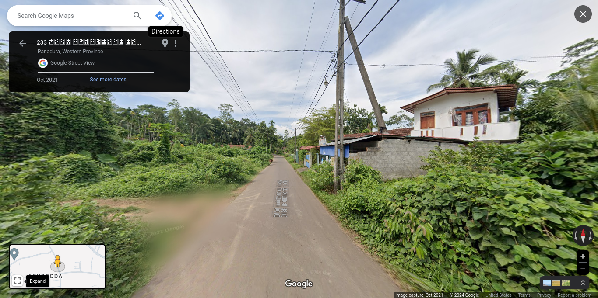

## Kurunduwatta

**Kurunduwatta** Grama Niladhari Division, **Kalutara** Divisional Secretariat Division, **Kalutara** District, **Western** Province

**Kalutara** Polling Division, **Kalutara** Electoral District

Population: 2,436 (2012)

(**LK-1321345**/727C)

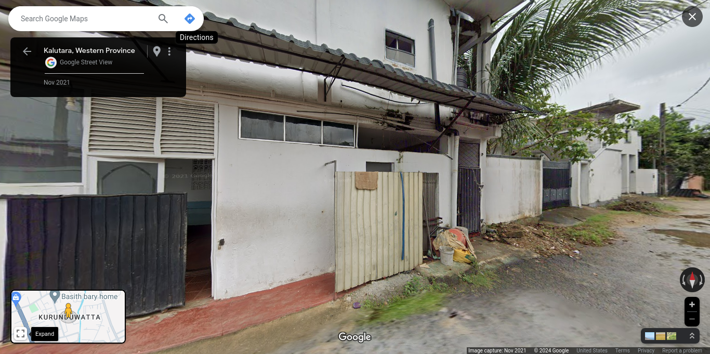

## Uduwaragoda South

**Uduwaragoda South** Grama Niladhari Division, **Hikkaduwa** Divisional Secretariat Division, **Galle** District, **Southern** Province

**Ratgama** Polling Division, **Galle** Electoral District

Population: 520 (2012)

(**LK-3136100**/71)

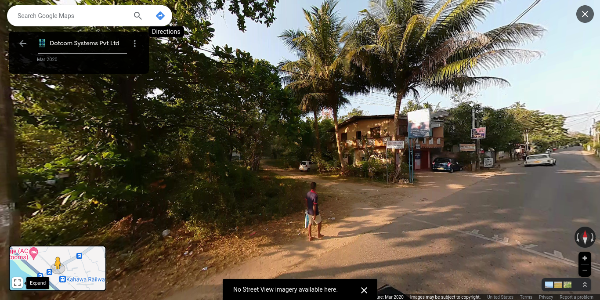

## Paspolakanda

**Paspolakanda** Grama Niladhari Division, **Warakapola** Divisional Secretariat Division, **Kegalle** District, **Sabaragamuwa** Province

**Dedigama** Polling Division, **Kegalle** Electoral District

Population: 836 (2012)

(**LK-9218030**/78C)

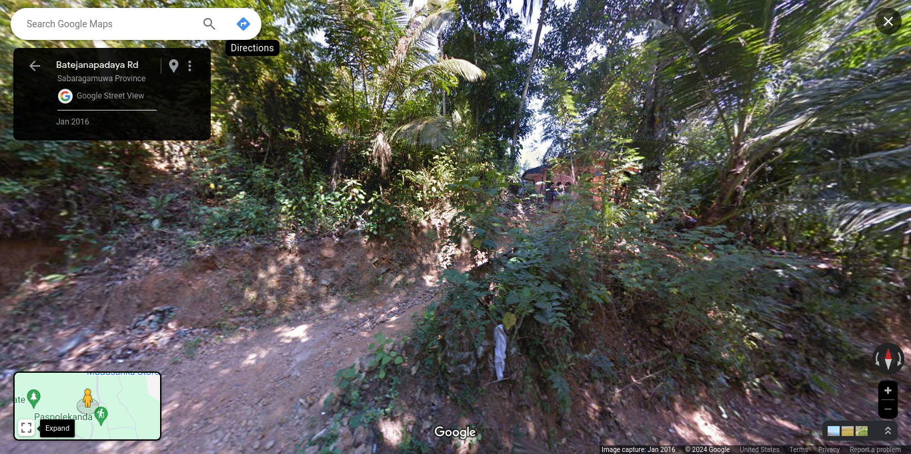

## Batepola

**Batepola** Grama Niladhari Division, **Mahara** Divisional Secretariat Division, **Gampaha** District, **Western** Province

**Mahara** Polling Division, **Gampaha** Electoral District

Population: 1,133 (2012)

(**LK-1233070**/295)

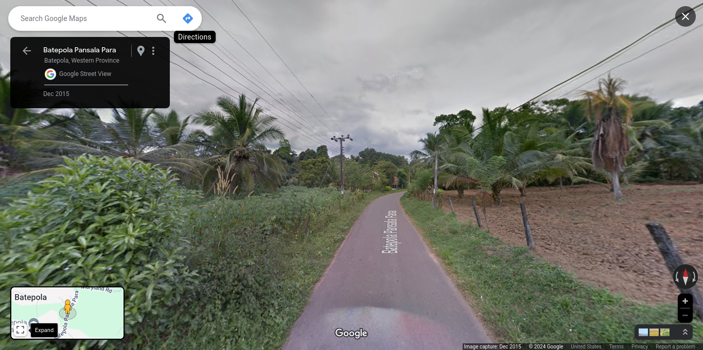

## Neligama

**Neligama** Grama Niladhari Division, **Mirigama** Divisional Secretariat Division, **Gampaha** District, **Western** Province

**Mirigama** Polling Division, **Gampaha** Electoral District

Population: 1,002 (2012)

(**LK-1212230**/15A)

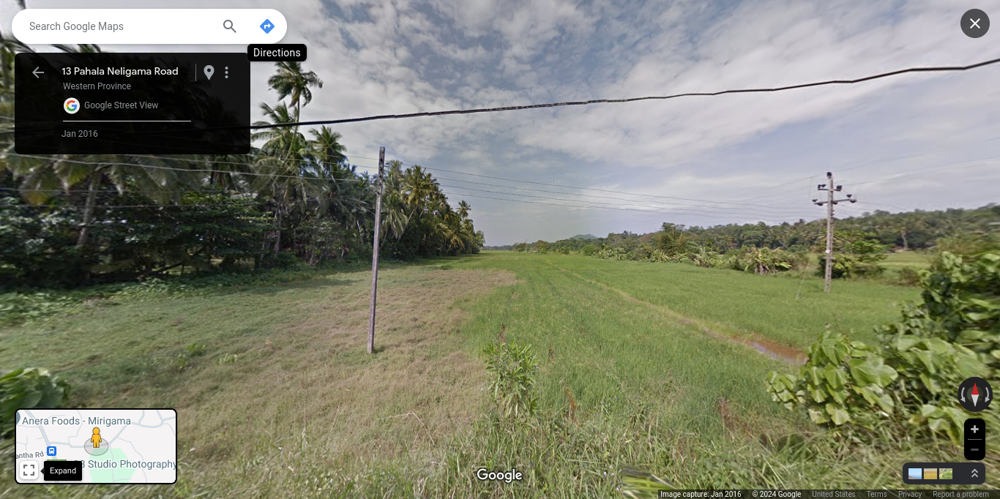

## Wanniyankulama kotasa 1

**Wanniyankulama kotasa 1** Grama Niladhari Division, **Nuwaragam Palatha East** Divisional Secretariat Division, **Anuradhapura** District, **North Central** Province

**Anuradhapura East** Polling Division, **Anuradhapura** Electoral District

Population: 2,829 (2012)

(**LK-7133135**/242)

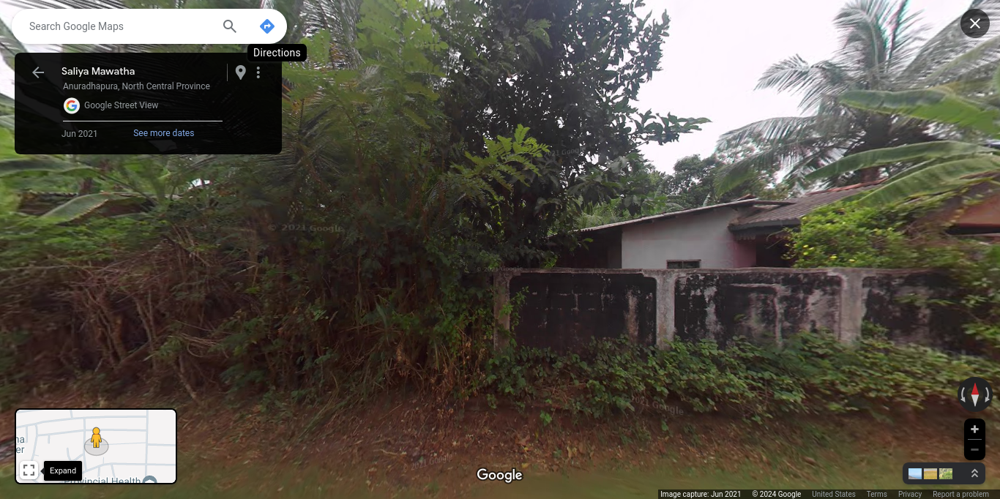

## Kootharippuwa

**Kootharippuwa** Grama Niladhari Division, **Udubaddawa** Divisional Secretariat Division, **Kurunegala** District, **North Western** Province

**Bingiriya** Polling Division, **Kurunegala** Electoral District

Population: 901 (2012)

(**LK-6175195**/1517)

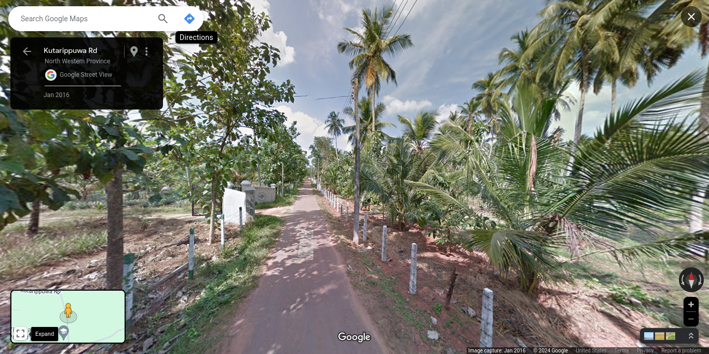

## Periya Uppodai

**Periya Uppodai** Grama Niladhari Division, **Manmunai North** Divisional Secretariat Division, **Batticaloa** District, **Eastern** Province

**Batticaloa** Polling Division, **Batticaloa** Electoral District

Population: 3,871 (2012)

(**LK-5118080**/178A)

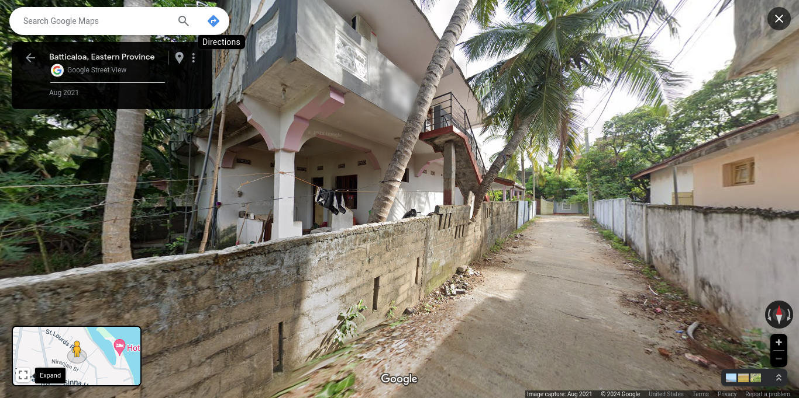

## Pelenwatta North

**Pelenwatta North** Grama Niladhari Division, **Kesbewa** Divisional Secretariat Division, **Colombo** District, **Western** Province

**Kesbewa** Polling Division, **Colombo** Electoral District

Population: 4,703 (2012)

(**LK-1136135**/582)

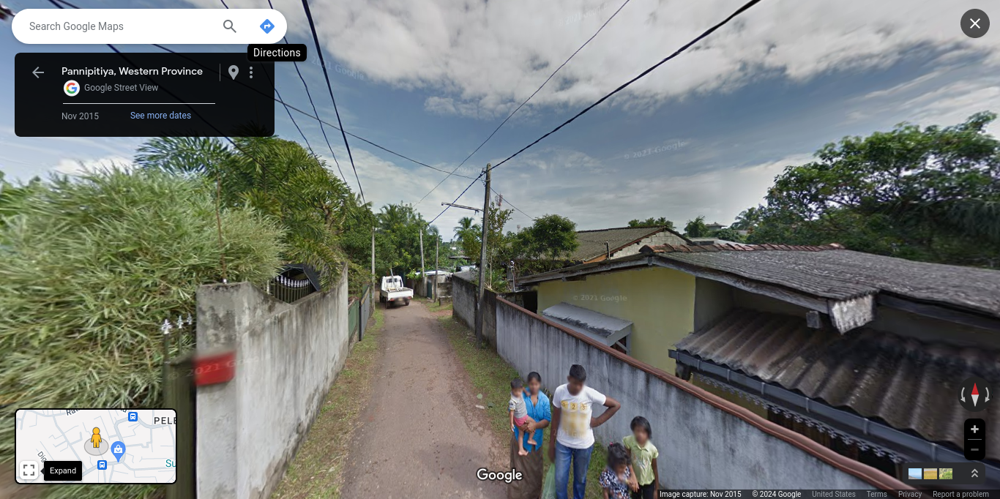

## Kattankudy Division 5

**Kattankudy Division 5** Grama Niladhari Division, **Kattankudy** Divisional Secretariat Division, **Batticaloa** District, **Eastern** Province

**Batticaloa** Polling Division, **Batticaloa** Electoral District

Population: 2,043 (2012)

(**LK-5124085**/164A)

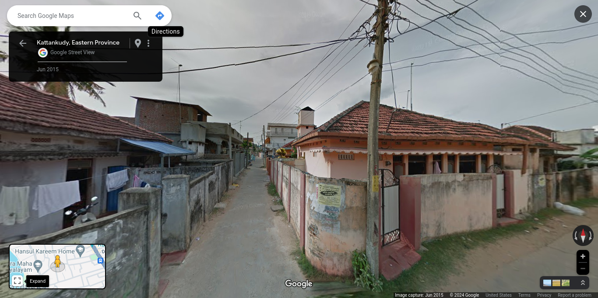

## Amaragedara North

**Amaragedara North** Grama Niladhari Division, **Bulathsinhala** Divisional Secretariat Division, **Kalutara** District, **Western** Province

**Bulathsinhala** Polling Division, **Kalutara** Electoral District

Population: 755 (2012)

(**LK-1312045**/821E)

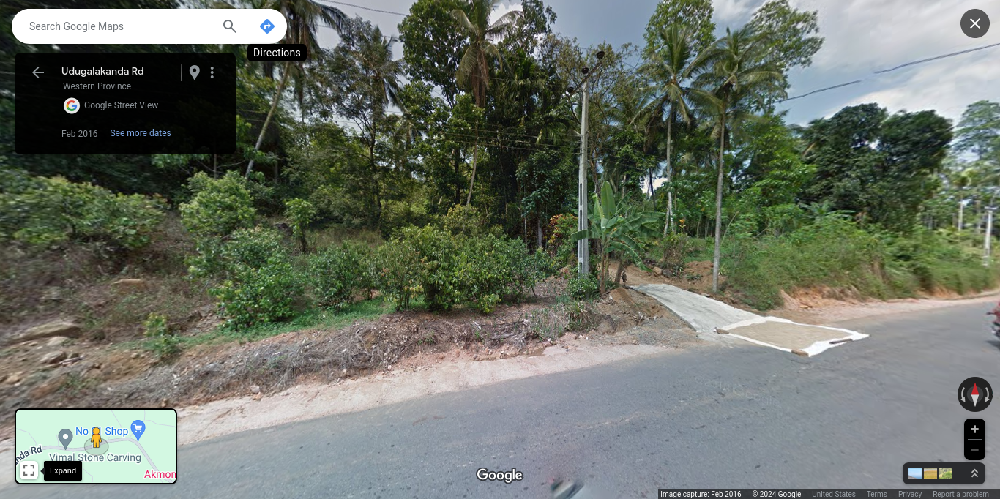

## Mahagama

**Mahagama** Grama Niladhari Division, **Rambukkana** Divisional Secretariat Division, **Kegalle** District, **Sabaragamuwa** Province

**Rambukkana** Polling Division, **Kegalle** Electoral District

Population: 851 (2012)

(**LK-9203040**/03K)

## Muganagahapitiya

**Muganagahapitiya** Grama Niladhari Division, **Walapane** Divisional Secretariat Division, **Nuwara Eliya** District, **Central** Province

**Walapane** Polling Division, **Nuwara-Eliya** Electoral District

Population: 425 (2012)

(**LK-2309055**/519G)

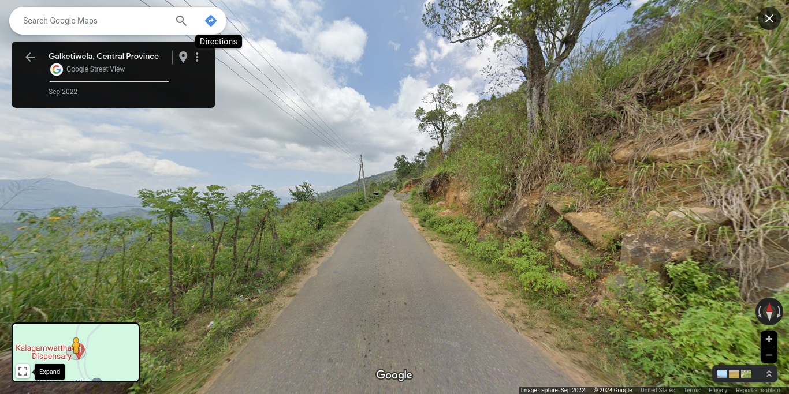

## Koralawella North

**Koralawella North** Grama Niladhari Division, **Moratuwa** Divisional Secretariat Division, **Colombo** District, **Western** Province

**Moratuwa** Polling Division, **Colombo** Electoral District

Population: 5,696 (2012)

(**LK-1133170**/554)

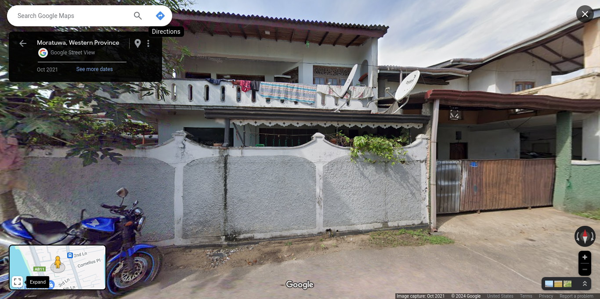

## Horewela

**Horewela** Grama Niladhari Division, **Walasmulla** Divisional Secretariat Division, **Hambantota** District, **Southern** Province

**Mulkirigala** Polling Division, **Hambantota** Electoral District

Population: 1,255 (2012)

(**LK-3325200**/574)

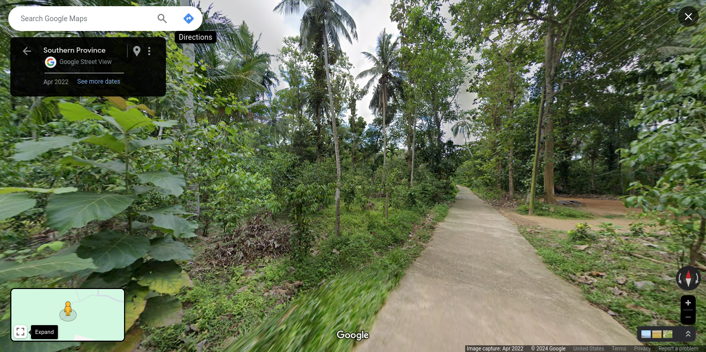

## Damahana

**Damahana** Grama Niladhari Division, **Balangoda** Divisional Secretariat Division, **Ratnapura** District, **Sabaragamuwa** Province

**Balangoda** Polling Division, **Ratnapura** Electoral District

Population: 1,426 (2012)

(**LK-9118210**/252)

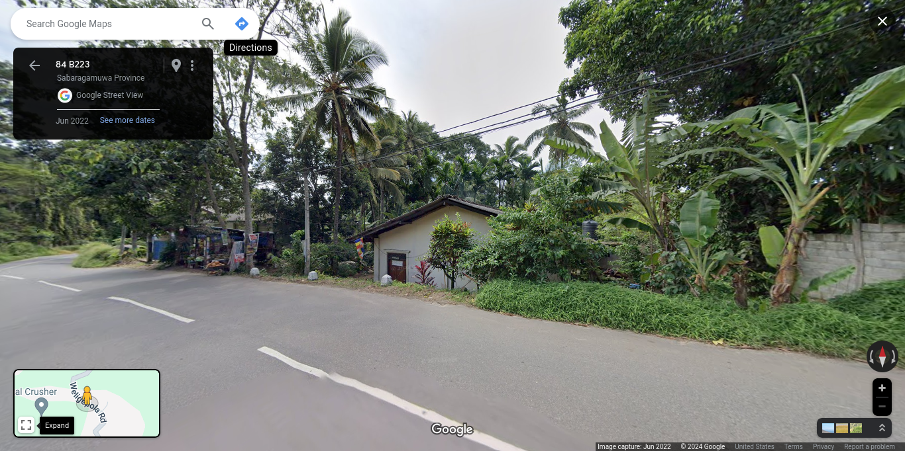

## Wanniyankulama kotasa 3

**Wanniyankulama kotasa 3** Grama Niladhari Division, **Nuwaragam Palatha East** Divisional Secretariat Division, **Anuradhapura** District, **North Central** Province

**Anuradhapura East** Polling Division, **Anuradhapura** Electoral District

Population: 1,301 (2012)

(**LK-7133130**/244)

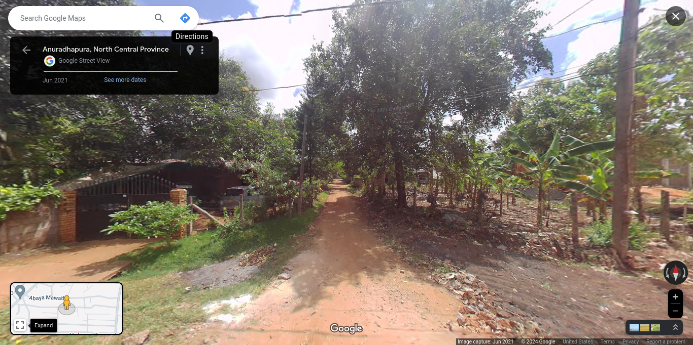

## Wewegama

**Wewegama** Grama Niladhari Division, **Uva Paranagama** Divisional Secretariat Division, **Badulla** District, **Uva** Province

**Uva Paranagama** Polling Division, **Badulla** Electoral District

Population: 571 (2012)

(**LK-8127060**/38)

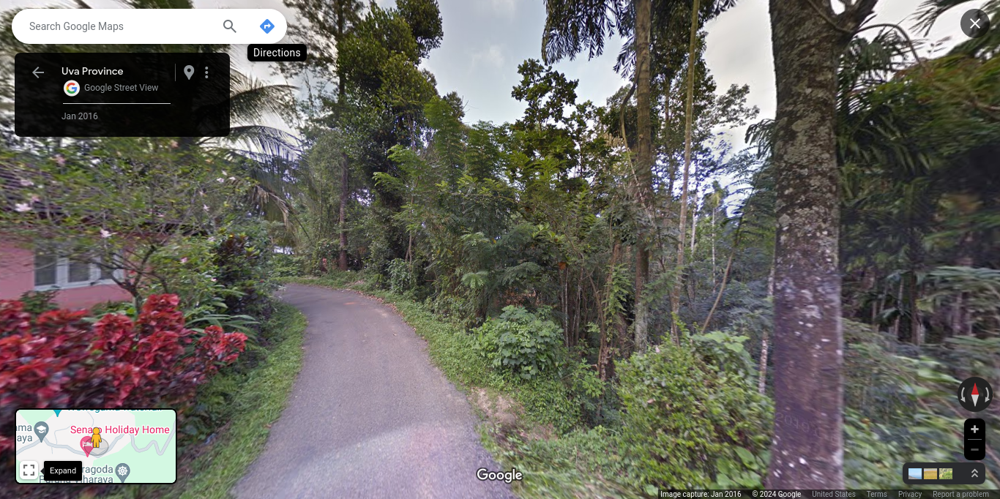

## Gongawela

**Gongawela** Grama Niladhari Division, **Matale** Divisional Secretariat Division, **Matale** District, **Central** Province

**Matale** Polling Division, **Matale** Electoral District

Population: 2,903 (2012)

(**LK-2218200**/E352B)

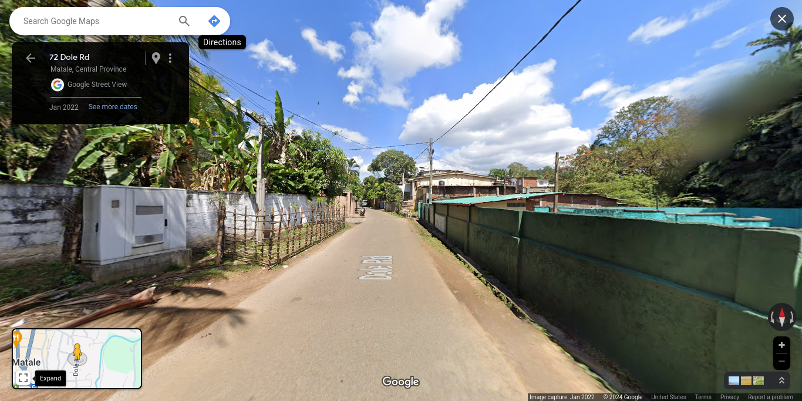

## Maligathenna Central

**Maligathenna Central** Grama Niladhari Division, **Mirigama** Divisional Secretariat Division, **Gampaha** District, **Western** Province

**Mirigama** Polling Division, **Gampaha** Electoral District

Population: 1,738 (2012)

(**LK-1212580**/337C)

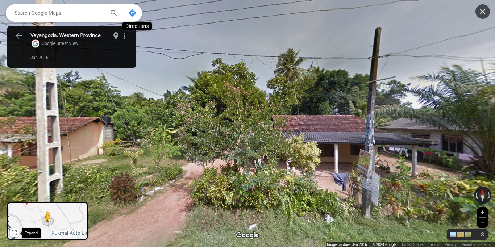

## Amunugama South

**Amunugama South** Grama Niladhari Division, **Kundasale** Divisional Secretariat Division, **Kandy** District, **Central** Province

**Kundasale** Polling Division, **Kandy** Electoral District

Population: 983 (2012)

(**LK-2127145**/657)

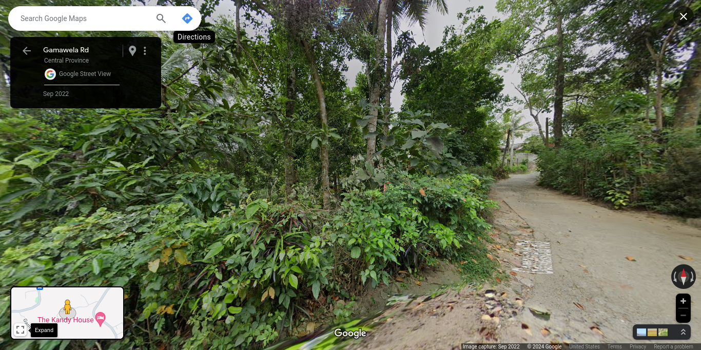

## Rathneheruwa

**Rathneheruwa** Grama Niladhari Division, **Kuliyapitiya East** Divisional Secretariat Division, **Kurunegala** District, **North Western** Province

**Kuliyapitiya** Polling Division, **Kurunegala** Electoral District

Population: 614 (2012)

(**LK-6169205**/1086)

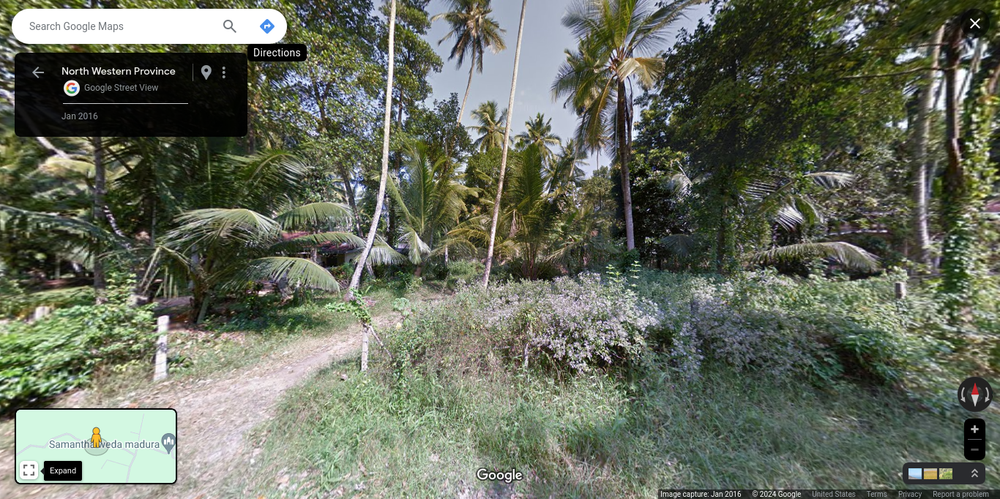

## Malkaduwawa

**Malkaduwawa** Grama Niladhari Division, **Kurunegala** Divisional Secretariat Division, **Kurunegala** District, **North Western** Province

**Kurunegala** Polling Division, **Kurunegala** Electoral District

Population: 2,386 (2012)

(**LK-6154130**/816)

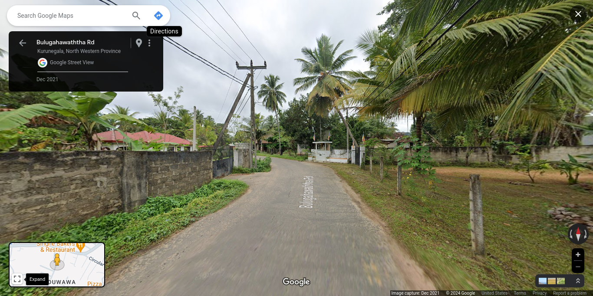

## Kalagedihena

**Kalagedihena** Grama Niladhari Division, **Attanagalla** Divisional Secretariat Division, **Gampaha** District, **Western** Province

**Attanagalla** Polling Division, **Gampaha** Electoral District

Population: 1,542 (2012)

(**LK-1227335**/321)

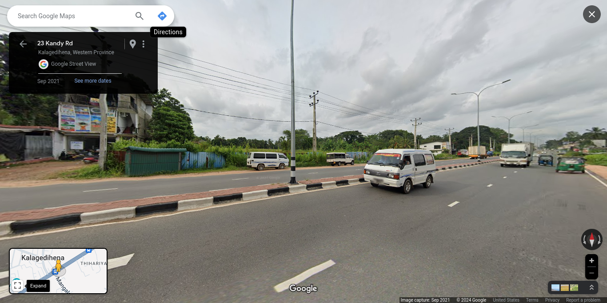

## Diyapitagallana

**Diyapitagallana** Grama Niladhari Division, **Karandeniya** Divisional Secretariat Division, **Galle** District, **Southern** Province

**Karandeniya** Polling Division, **Galle** Electoral District

Population: 966 (2012)

(**LK-3109085**/41F)

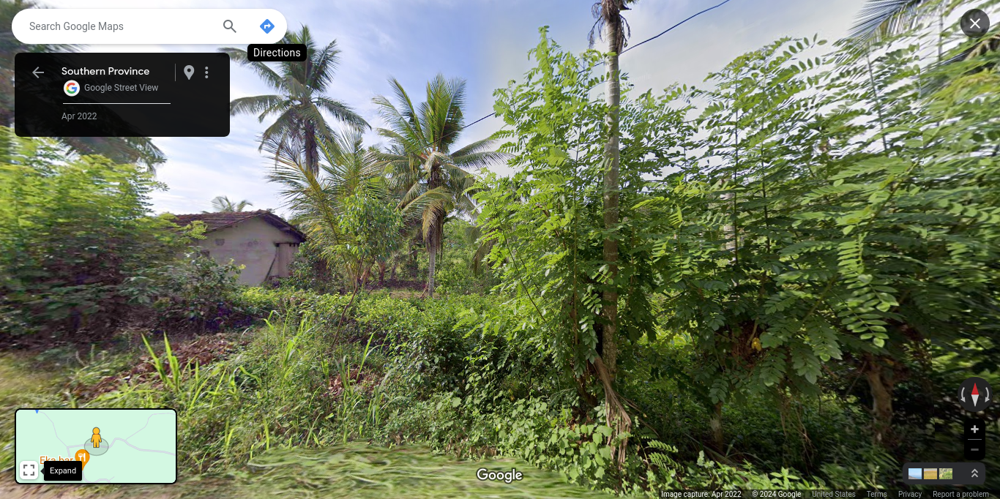

## Kolamediriya North

**Kolamediriya North** Grama Niladhari Division, **Bandaragama** Divisional Secretariat Division, **Kalutara** District, **Western** Province

**Bandaragama** Polling Division, **Kalutara** Electoral District

Population: 1,133 (2012)

(**LK-1306185**/657A)

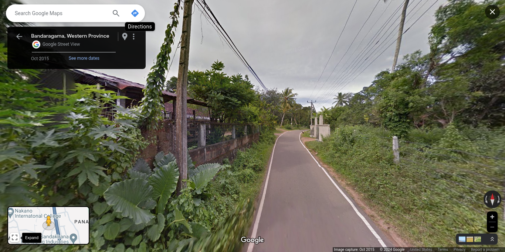

## Helambawewa

**Helambawewa** Grama Niladhari Division, **Thambuttegama** Divisional Secretariat Division, **Anuradhapura** District, **North Central** Province

**Kalawewa** Polling Division, **Anuradhapura** Electoral District

Population: 891 (2012)

(**LK-7145120**/413)

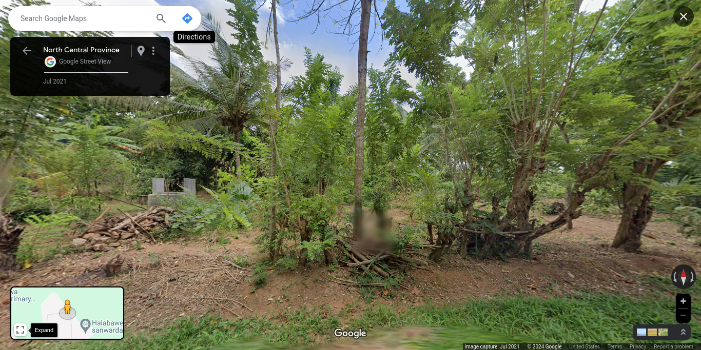

## Meda Pothupitiya

**Meda Pothupitiya** Grama Niladhari Division, **Kalutara** Divisional Secretariat Division, **Kalutara** District, **Western** Province

**Kalutara** Polling Division, **Kalutara** Electoral District

Population: 1,232 (2012)

(**LK-1321120**/708D)

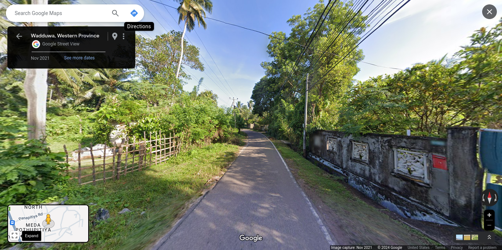

## Angamuwa

**Angamuwa** Grama Niladhari Division, **Rajanganaya** Divisional Secretariat Division, **Anuradhapura** District, **North Central** Province

**Kalawewa** Polling Division, **Anuradhapura** Electoral District

Population: 1,330 (2012)

(**LK-7142085**/448)

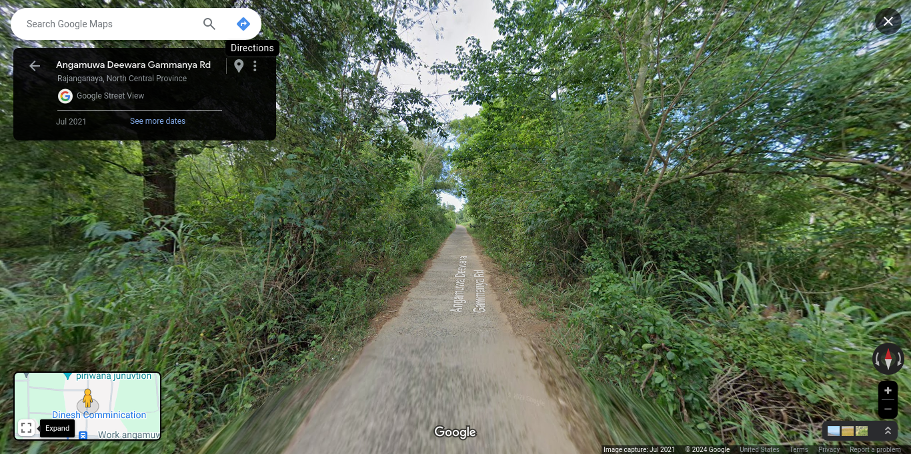

## Paraduwa South

**Paraduwa South** Grama Niladhari Division, **Akuressa** Divisional Secretariat Division, **Matara** District, **Southern** Province

**Akuressa** Polling Division, **Matara** Electoral District

Population: 1,106 (2012)

(**LK-3218200**/359A)

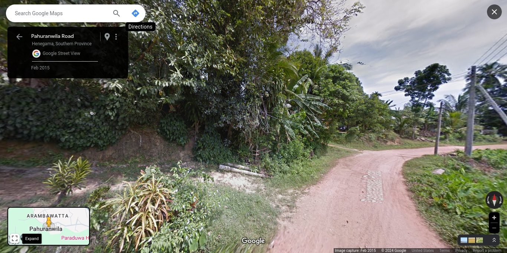

## Walpita

**Walpita** Grama Niladhari Division, **Homagama** Divisional Secretariat Division, **Colombo** District, **Western** Province

**Homagama** Polling Division, **Colombo** Electoral District

Population: 1,654 (2012)

(**LK-1112030**/450A)

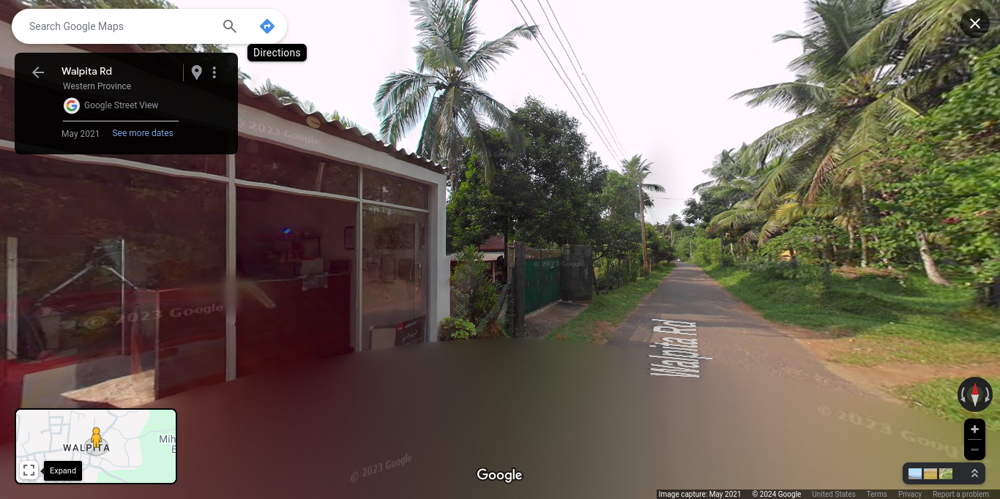

## Horapavita North

**Horapavita North** Grama Niladhari Division, **Mulatiyana** Divisional Secretariat Division, **Matara** District, **Southern** Province

**Hakmana** Polling Division, **Matara** Electoral District

Population: 1,120 (2012)

(**LK-3212220**/300A)

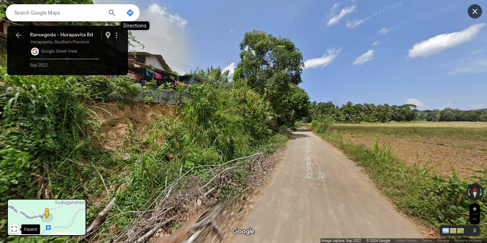

## Thihariya North

**Thihariya North** Grama Niladhari Division, **Attanagalla** Divisional Secretariat Division, **Gampaha** District, **Western** Province

**Attanagalla** Polling Division, **Gampaha** Electoral District

Population: 2,177 (2012)

(**LK-1227260**/318/C)

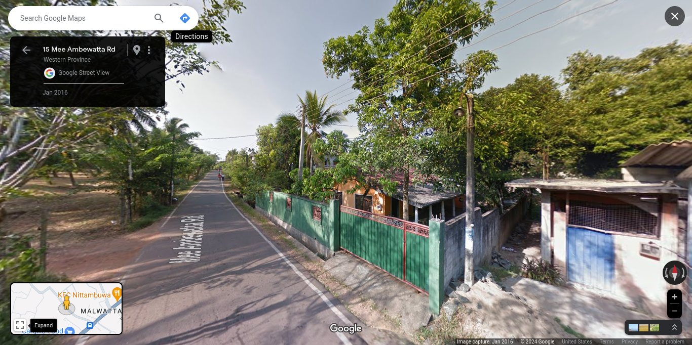

## Gampola East

**Gampola East** Grama Niladhari Division, **Udapalatha** Divisional Secretariat Division, **Kandy** District, **Central** Province

**Gampola** Polling Division, **Kandy** Electoral District

Population: 2,758 (2012)

(**LK-2151065**/1108)

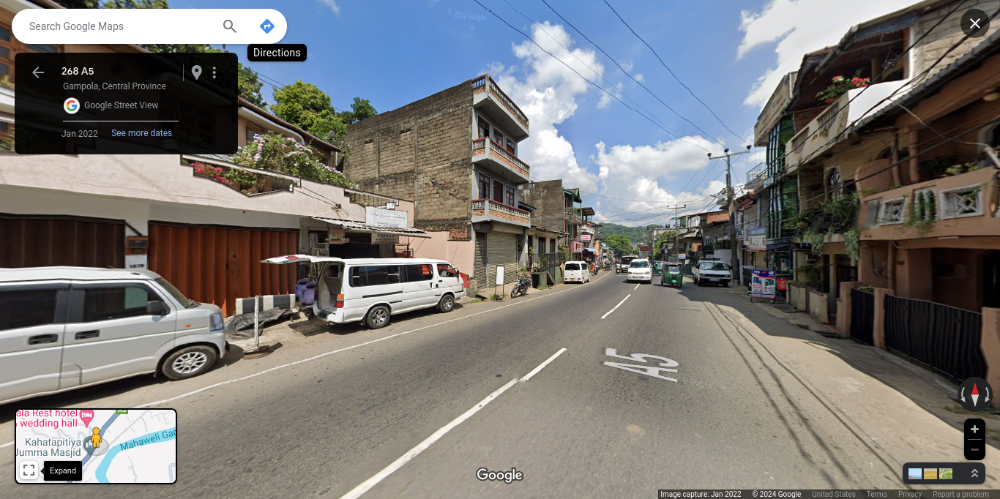

## Makulmade

**Makulmade** Grama Niladhari Division, **Ganewatta** Divisional Secretariat Division, **Kurunegala** District, **North Western** Province

**Hiriyala** Polling Division, **Kurunegala** Electoral District

Population: 617 (2012)

(**LK-6133075**/462)

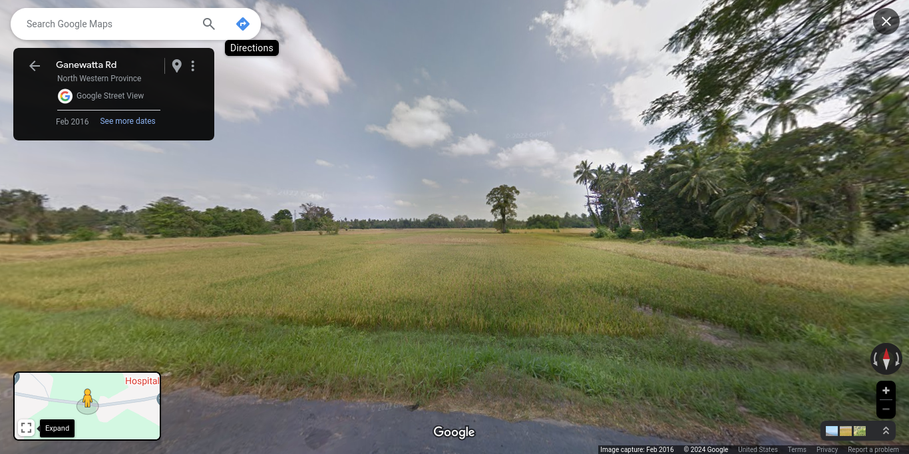

## Ududeniya

**Ududeniya** Grama Niladhari Division, **Naula** Divisional Secretariat Division, **Matale** District, **Central** Province

**Laggala** Polling Division, **Matale** Electoral District

Population: 910 (2012)

(**LK-2209215**/E415B)

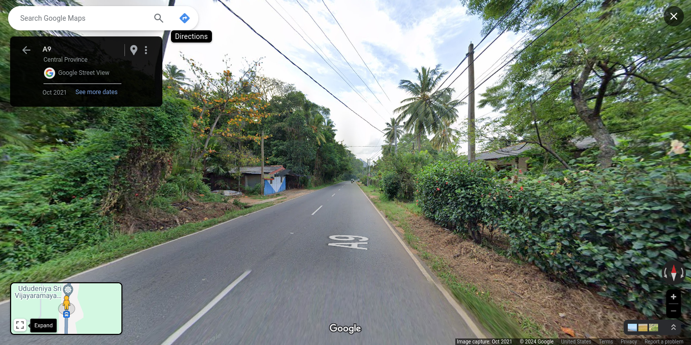

## Talgahawewa

**Talgahawewa** Grama Niladhari Division, **Rambewa** Divisional Secretariat Division, **Anuradhapura** District, **North Central** Province

**Medawachchiya** Polling Division, **Anuradhapura** Electoral District

Population: 1,062 (2012)

(**LK-7118045**/84)

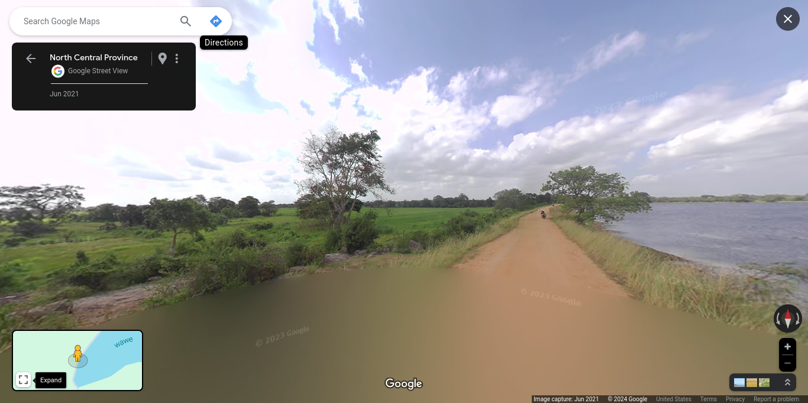

## Samarabahu

**Samarabahu** Grama Niladhari Division, **Vadamaradchi South-West (Karaveddy)** Divisional Secretariat Division, **Jaffna** District, **Northern** Province

**Udupiddy** Polling Division, **Jaffna** Electoral District

Population: 1,472 (2012)

(**LK-4121050**/J/357)

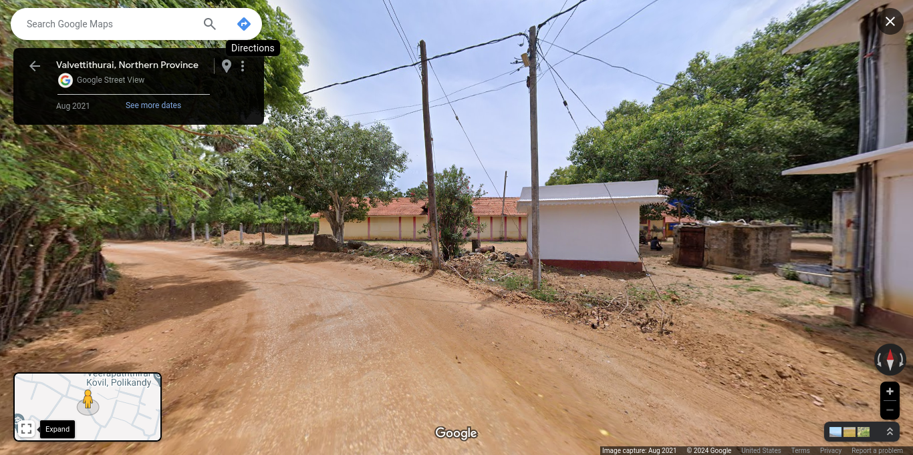

## Egalla

**Egalla** Grama Niladhari Division, **Polgahawela** Divisional Secretariat Division, **Kurunegala** District, **North Western** Province

**Polgahawela** Polling Division, **Kurunegala** Electoral District

Population: 971 (2012)

(**LK-6187150**/952)

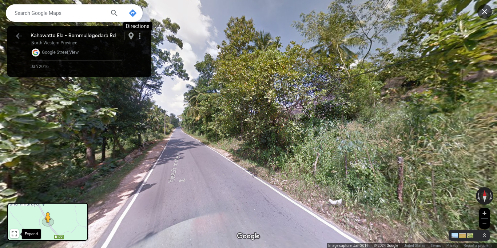

## Middaramulla

**Middaramulla** Grama Niladhari Division, **Balapitiya** Divisional Secretariat Division, **Galle** District, **Southern** Province

**Balapitiya** Polling Division, **Galle** Electoral District

Population: 1,461 (2012)

(**LK-3106080**/18A)

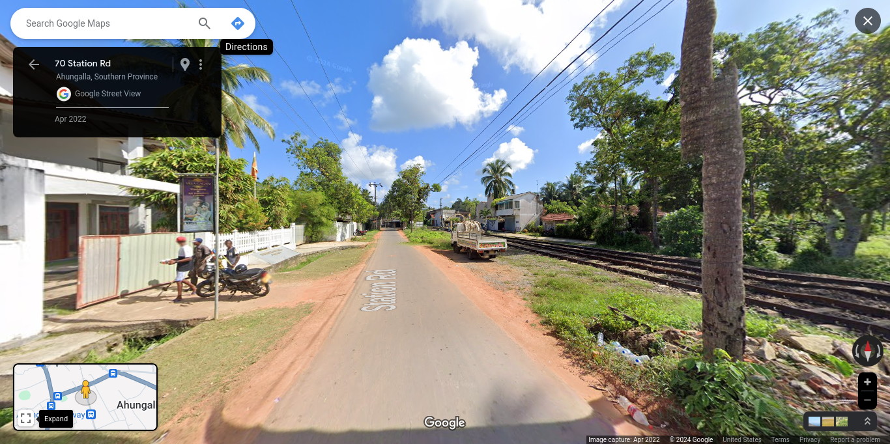

## Embilipitiya Pallegama

**Embilipitiya Pallegama** Grama Niladhari Division, **Embilipitiya** Divisional Secretariat Division, **Ratnapura** District, **Sabaragamuwa** Province

**Kolonna** Polling Division, **Ratnapura** Electoral District

Population: 5,655 (2012)

(**LK-9148115**/214A)

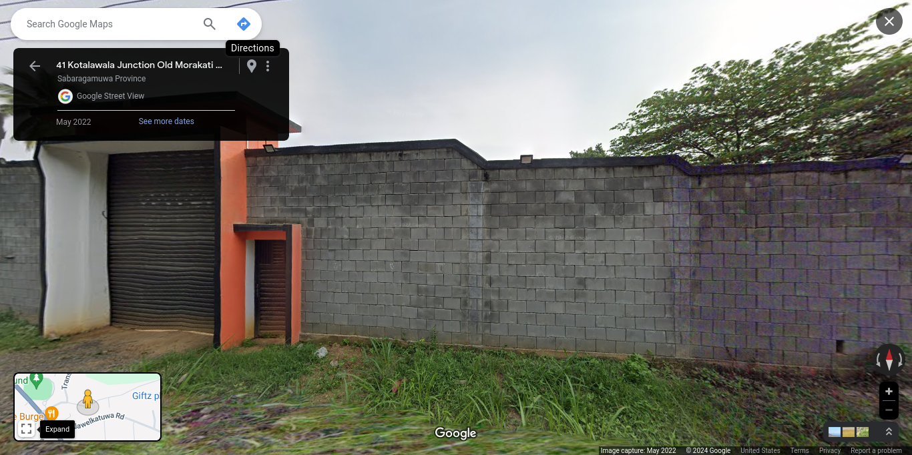

## Welipenna West

**Welipenna West** Grama Niladhari Division, **Mathugama** Divisional Secretariat Division, **Kalutara** District, **Western** Province

**Mathugama** Polling Division, **Kalutara** Electoral District

Population: 2,791 (2012)

(**LK-1330180**/793)

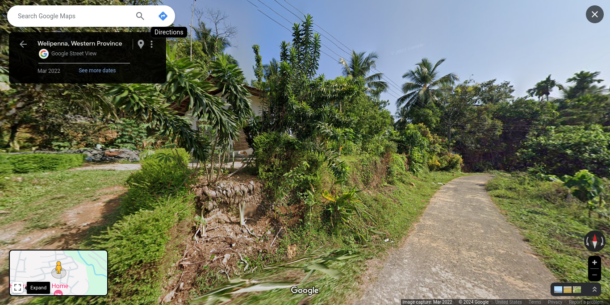

## Manipay North

**Manipay North** Grama Niladhari Division, **Valikamam South-West (Sandilipay)** Divisional Secretariat Division, **Jaffna** District, **Northern** Province

**Manipay** Polling Division, **Jaffna** Electoral District

Population: 1,343 (2012)

(**LK-4109045**/J/137)

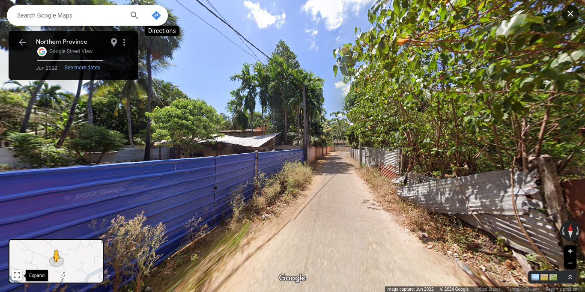

## Diddenipotha South

**Diddenipotha South** Grama Niladhari Division, **Mulatiyana** Divisional Secretariat Division, **Matara** District, **Southern** Province

**Hakmana** Polling Division, **Matara** Electoral District

Population: 1,014 (2012)

(**LK-3212100**/302A)

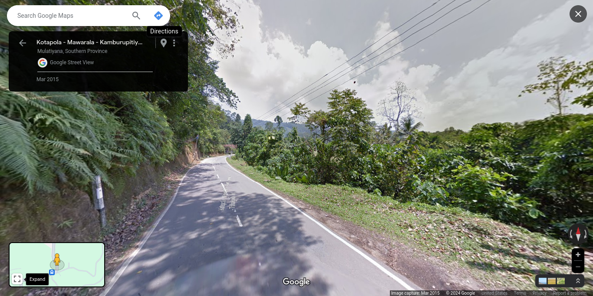

## Aluth Pallekele

**Aluth Pallekele** Grama Niladhari Division, **Kundasale** Divisional Secretariat Division, **Kandy** District, **Central** Province

**Kundasale** Polling Division, **Kandy** Electoral District

Population: 3,185 (2012)

(**LK-2127390**/694)

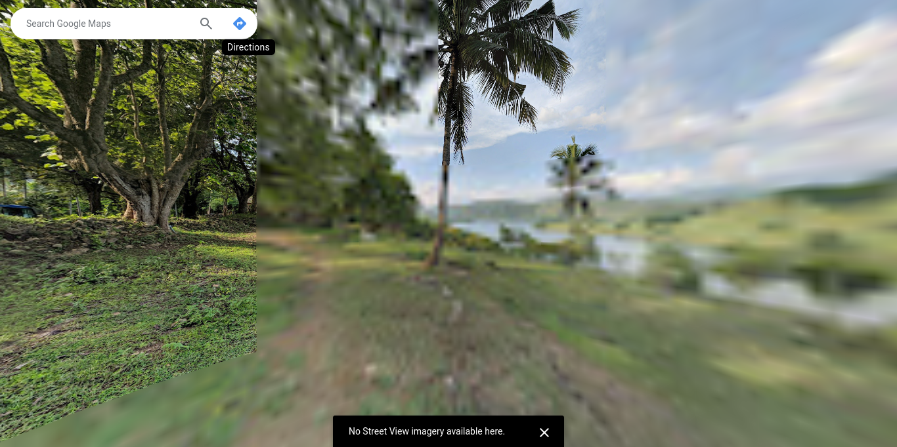

## Pandarikkulam

**Pandarikkulam** Grama Niladhari Division, **Vavuniya** Divisional Secretariat Division, **Vavuniya** District, **Northern** Province

**Vavuniya** Polling Division, **Vanni** Electoral District

Population: 6,469 (2012)

(**LK-4309200**/214E)

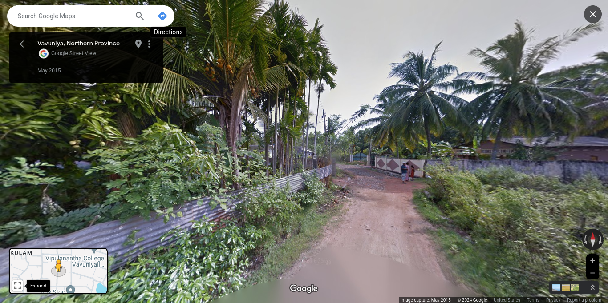

## Thiththwella

**Thiththwella** Grama Niladhari Division, **Maspotha** Divisional Secretariat Division, **Kurunegala** District, **North Western** Province

**Kurunegala** Polling Division, **Kurunegala** Electoral District

Population: 1,341 (2012)

(**LK-6151140**/800)

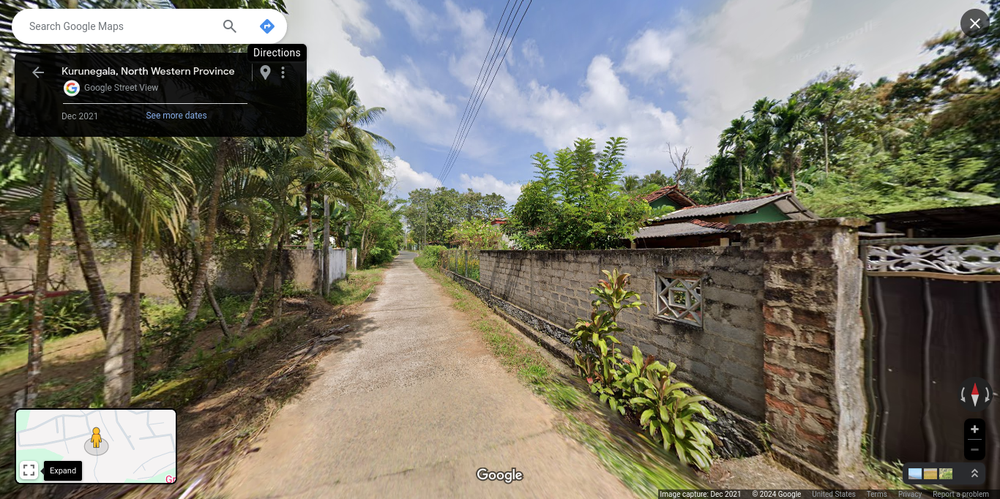

## Faizal Nagar

**Faizal Nagar** Grama Niladhari Division, **Kinniya** Divisional Secretariat Division, **Trincomalee** District, **Eastern** Province

**Muttur** Polling Division, **Trincomalee** Electoral District

Population: 5,238 (2012)

(**LK-5324115**/225G)

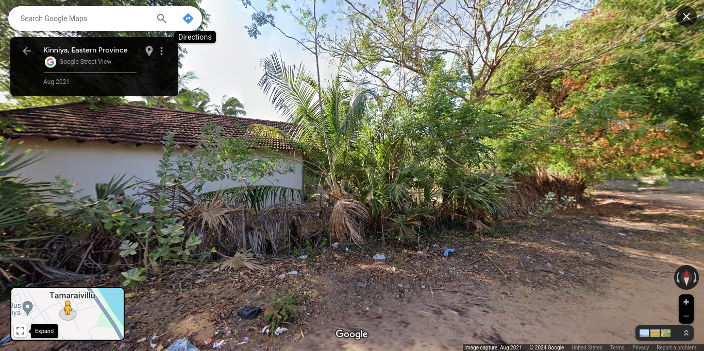

## Thirappane Kadaweediya

**Thirappane Kadaweediya** Grama Niladhari Division, **Thirappane** Divisional Secretariat Division, **Anuradhapura** District, **North Central** Province

**Mihinthale** Polling Division, **Anuradhapura** Electoral District

Population: 754 (2012)

(**LK-7151090**/532)

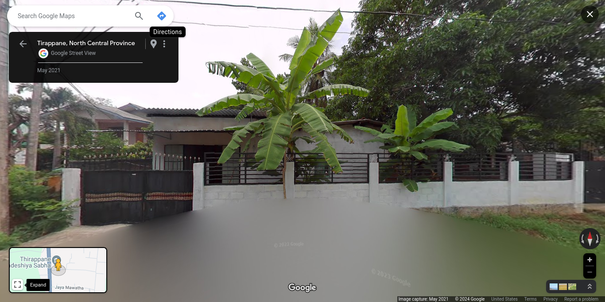

## Oddamavadi 01 South

**Oddamavadi 01 South** Grama Niladhari Division, **Koralai Pattu  West (Oddamavadi)** Divisional Secretariat Division, **Batticaloa** District, **Eastern** Province

**Kalkudah** Polling Division, **Batticaloa** Electoral District

Population: 2,243 (2012)

(**LK-5106015**/208B)

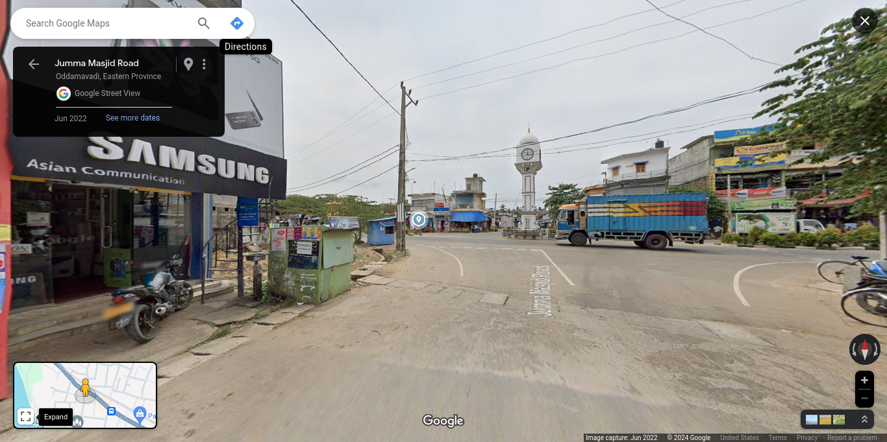

## Mandandawela

**Mandandawela** Grama Niladhari Division, **Matale** Divisional Secretariat Division, **Matale** District, **Central** Province

**Matale** Polling Division, **Matale** Electoral District

Population: 2,263 (2012)

(**LK-2218160**/E350A)

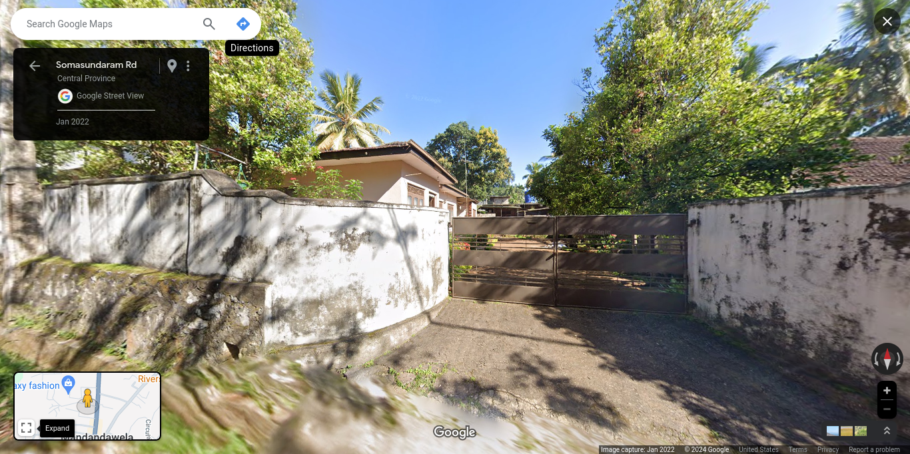

## Erlalai West

**Erlalai West** Grama Niladhari Division, **Valikamam South (Uduvil)** Divisional Secretariat Division, **Jaffna** District, **Northern** Province

**Manipay** Polling Division, **Jaffna** Electoral District

Population: 1,453 (2012)

(**LK-4115100**/J/201)

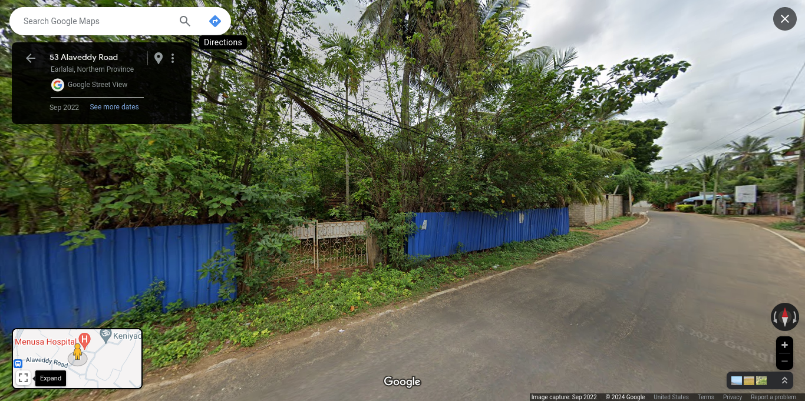

## Ethamulla

**Ethamulla** Grama Niladhari Division, **Thumpane** Divisional Secretariat Division, **Kandy** District, **Central** Province

**Galagedara** Polling Division, **Kandy** Electoral District

Population: 729 (2012)

(**LK-2103085**/362)

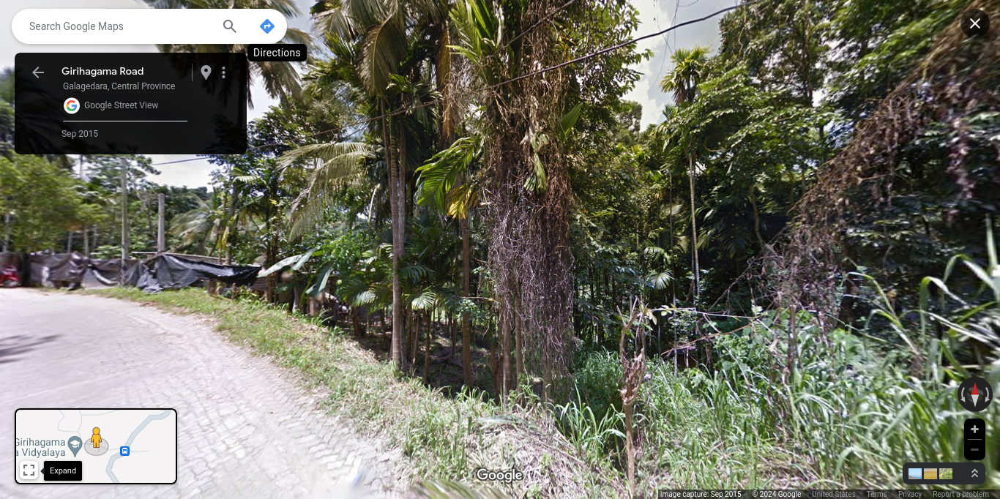

## Kottawa East

**Kottawa East** Grama Niladhari Division, **Maharagama** Divisional Secretariat Division, **Colombo** District, **Western** Province

**Maharagama** Polling Division, **Colombo** Electoral District

Population: 5,632 (2012)

(**LK-1121035**/496A)

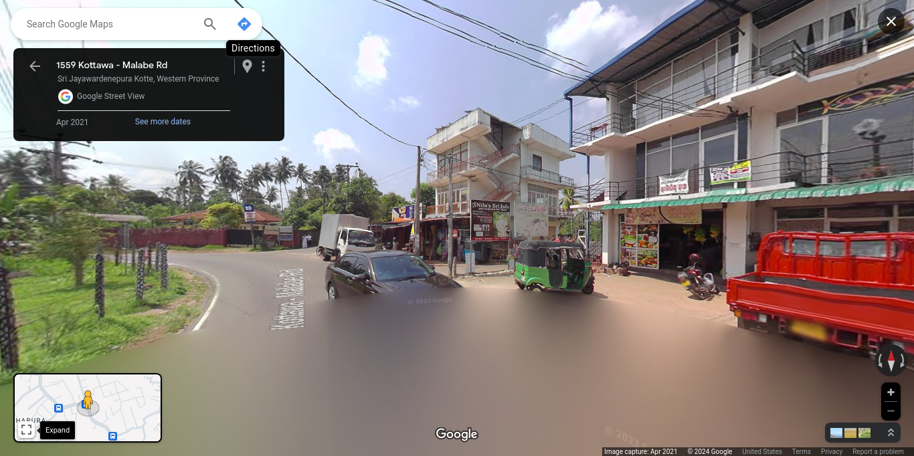

## Akaravita

**Akaravita** Grama Niladhari Division, **Gampaha** Divisional Secretariat Division, **Gampaha** District, **Western** Province

**Gampaha** Polling Division, **Gampaha** Electoral District

Population: 1,684 (2012)

(**LK-1224045**/222B)

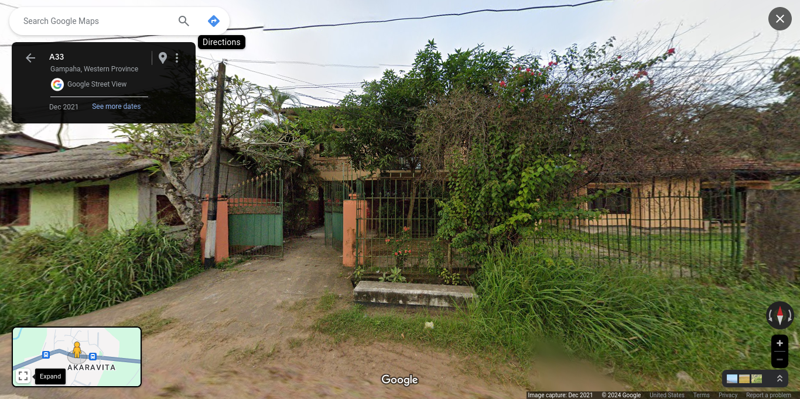

## Nagoda Ihala

**Nagoda Ihala** Grama Niladhari Division, **Nagoda** Divisional Secretariat Division, **Galle** District, **Southern** Province

**Hiniduma** Polling Division, **Galle** Electoral District

Population: 737 (2012)

(**LK-3124090**/216A)

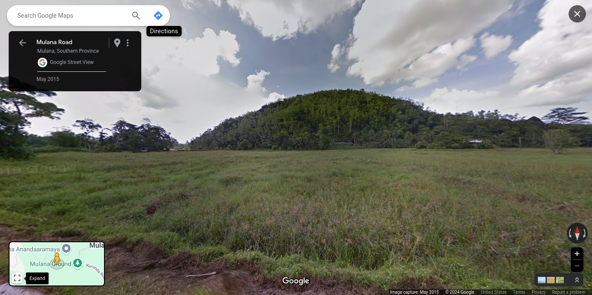

## Ranpokunagama C Zone

**Ranpokunagama C Zone** Grama Niladhari Division, **Attanagalla** Divisional Secretariat Division, **Gampaha** District, **Western** Province

**Attanagalla** Polling Division, **Gampaha** Electoral District

Population: 388 (2012)

(**LK-1227230**/349D)

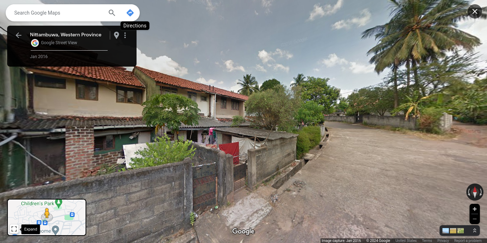

## Maddakalaputharavai 01

**Maddakalaputharavai 01** Grama Niladhari Division, **Samanthurai** Divisional Secretariat Division, **Ampara** District, **Eastern** Province

**Samanthurai** Polling Division, **Digamadulla** Electoral District

Population: 1,090 (2012)

(**LK-5218100**/77A)

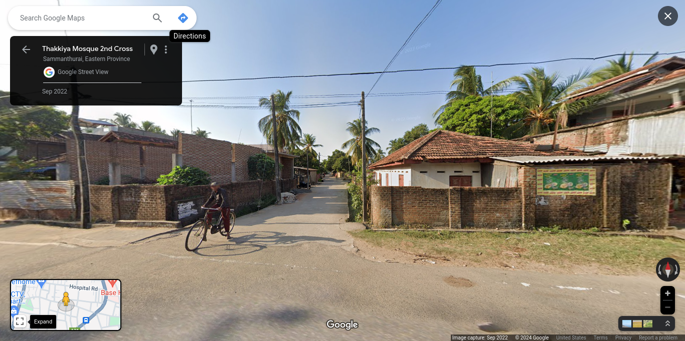

## Kurunduwatta

**Kurunduwatta** Grama Niladhari Division, **Homagama** Divisional Secretariat Division, **Colombo** District, **Western** Province

**Homagama** Polling Division, **Colombo** Electoral District

Population: 3,867 (2012)

(**LK-1112155**/448C)

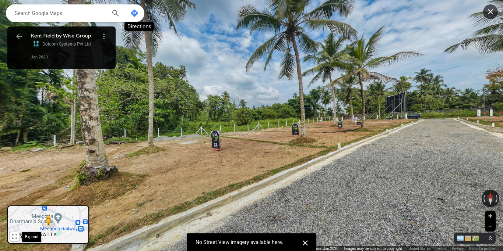

## Horape

**Horape** Grama Niladhari Division, **Wattala** Divisional Secretariat Division, **Gampaha** District, **Western** Province

**Wattala** Polling Division, **Gampaha** Electoral District

Population: 2,114 (2012)

(**LK-1218095**/180)

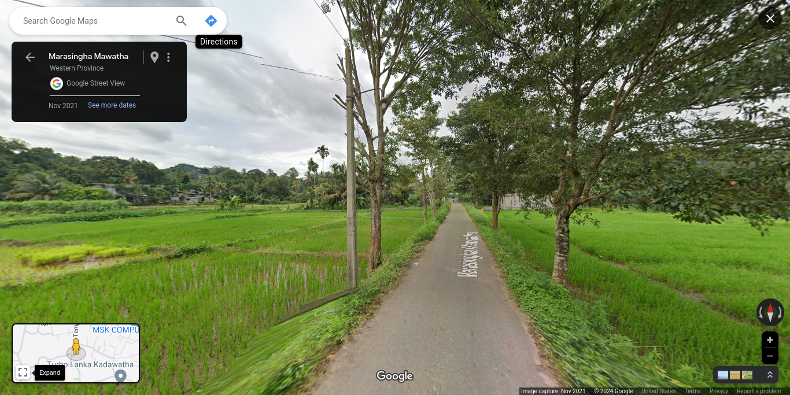

## Adapparagama

**Adapparagama** Grama Niladhari Division, **Mahawewa** Divisional Secretariat Division, **Puttalam** District, **North Western** Province

**Nattandiya** Polling Division, **Puttalam** Electoral District

Population: 672 (2012)

(**LK-6239040**/529A)

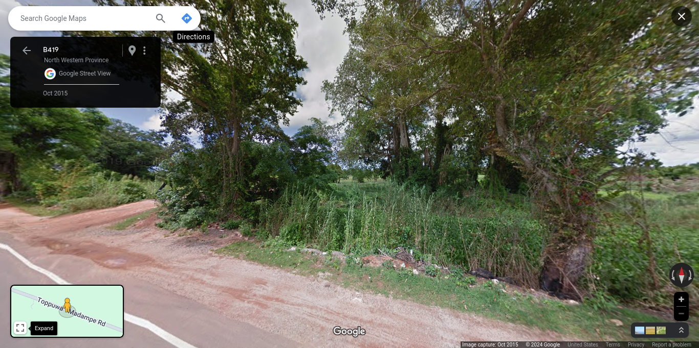

## Batadombathuduwa

**Batadombathuduwa** Grama Niladhari Division, **Bandaragama** Divisional Secretariat Division, **Kalutara** District, **Western** Province

**Bandaragama** Polling Division, **Kalutara** Electoral District

Population: 3,648 (2012)

(**LK-1306095**/691B)

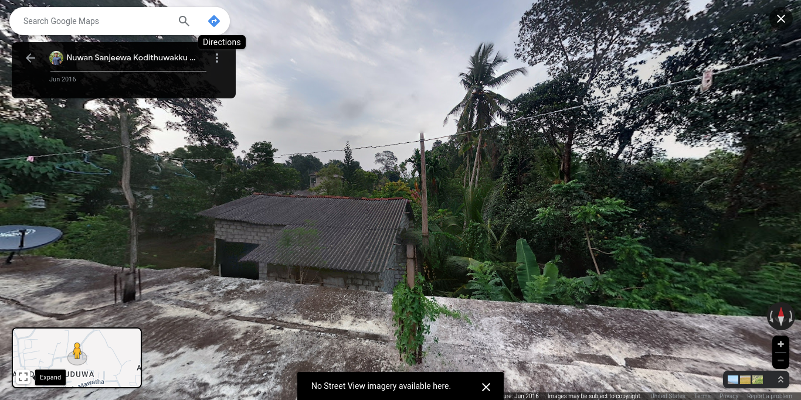

## Nawagampura

**Nawagampura** Grama Niladhari Division, **Colombo** Divisional Secretariat Division, **Colombo** District, **Western** Province

**Colombo Central** Polling Division, **Colombo** Electoral District

Population: 6,821 (2012)

(**LK-1103085**/)

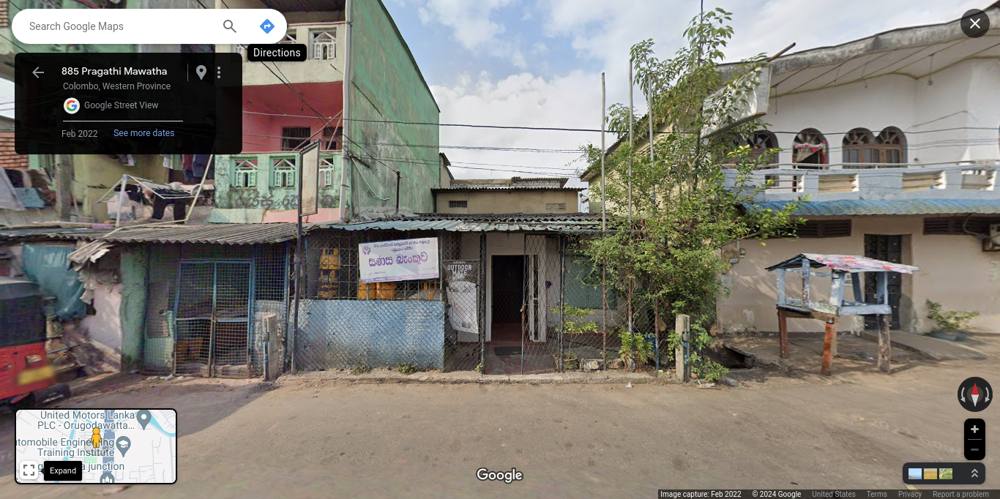

## Udaperuwa

**Udaperuwa** Grama Niladhari Division, **Bandarawela** Divisional Secretariat Division, **Badulla** District, **Uva** Province

**Bandarawela** Polling Division, **Badulla** Electoral District

Population: 1,636 (2012)

(**LK-8133080**/66B)

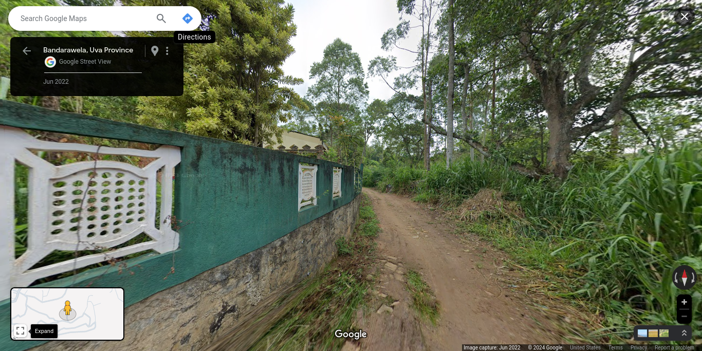

## Pahala Mudaliwatta

**Pahala Mudaliwatta** Grama Niladhari Division, **Yatinuwara** Divisional Secretariat Division, **Kandy** District, **Central** Province

**Yatinuwara** Polling Division, **Kandy** Electoral District

Population: 808 (2012)

(**LK-2136345**/194)

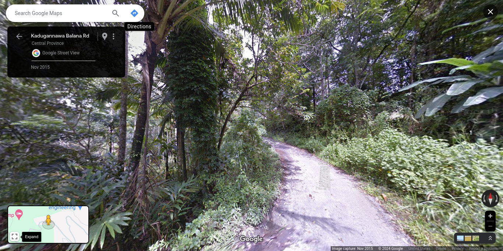

## Kirigalwewa

**Kirigalwewa** Grama Niladhari Division, **Medawachchiya** Divisional Secretariat Division, **Anuradhapura** District, **North Central** Province

**Medawachchiya** Polling Division, **Anuradhapura** Electoral District

Population: 861 (2012)

(**LK-7109095**/72)

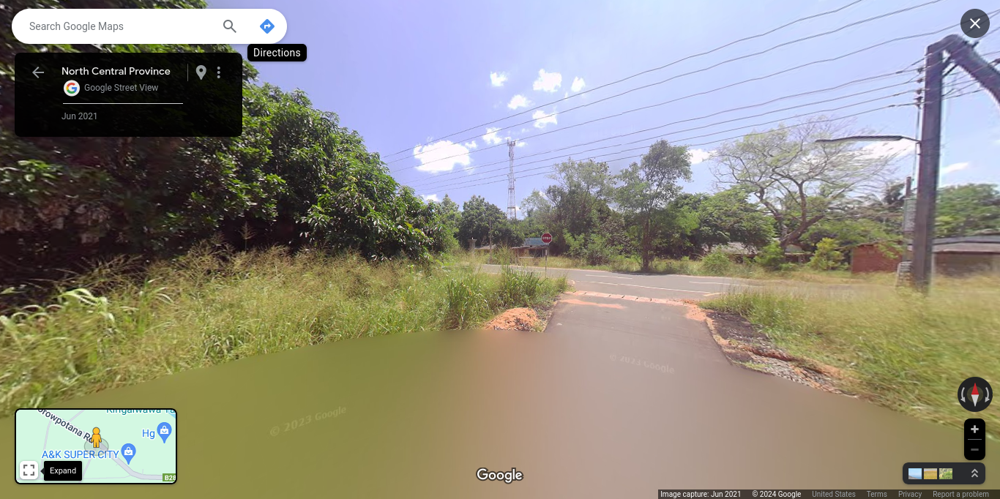

## Ihala Walasmulla

**Ihala Walasmulla** Grama Niladhari Division, **Walasmulla** Divisional Secretariat Division, **Hambantota** District, **Southern** Province

**Mulkirigala** Polling Division, **Hambantota** Electoral District

Population: 743 (2012)

(**LK-3325220**/457)

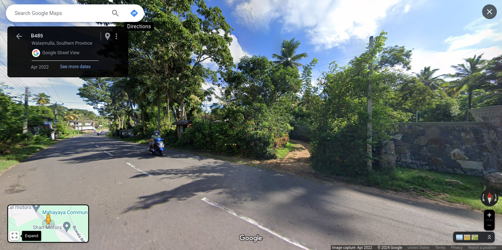

## Thondamannagar

**Thondamannagar** Grama Niladhari Division, **Karachchi** Divisional Secretariat Division, **Kilinochchi** District, **Northern** Province

**Kilinochchi** Polling Division, **Jaffna** Electoral District

Population: 730 (2012)

(**LK-4509165**/KN/17)

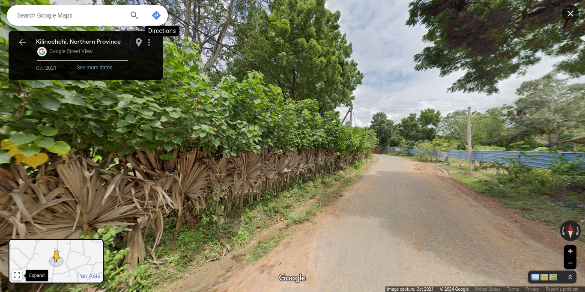

## Diviyagahawela

**Diviyagahawela** Grama Niladhari Division, **Karandeniya** Divisional Secretariat Division, **Galle** District, **Southern** Province

**Karandeniya** Polling Division, **Galle** Electoral District

Population: 2,587 (2012)

(**LK-3109170**/92C)

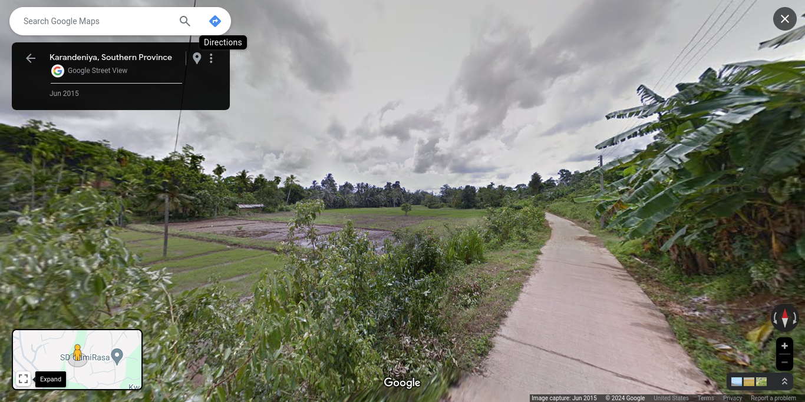

## Watambe

**Watambe** Grama Niladhari Division, **Walapane** Divisional Secretariat Division, **Nuwara Eliya** District, **Central** Province

**Walapane** Polling Division, **Nuwara-Eliya** Electoral District

Population: 369 (2012)

(**LK-2309245**/517A)

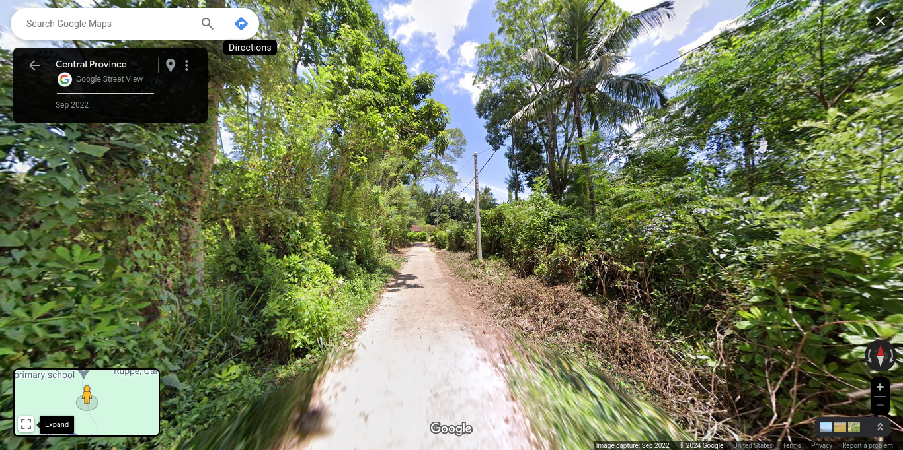

## Maitipe

**Maitipe** Grama Niladhari Division, **Galle Four Gravets** Divisional Secretariat Division, **Galle** District, **Southern** Province

**Galle** Polling Division, **Galle** Electoral District

Population: 1,875 (2012)

(**LK-3139080**/101)

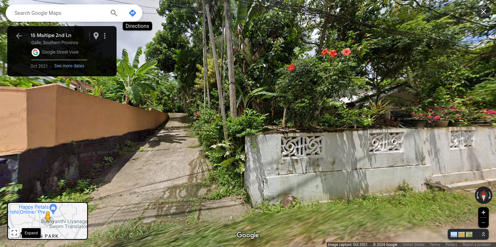

## Meddawatta

**Meddawatta** Grama Niladhari Division, **Matara Four Gravets** Divisional Secretariat Division, **Matara** District, **Southern** Province

**Matara** Polling Division, **Matara** Electoral District

Population: 1,671 (2012)

(**LK-3242295**/425)

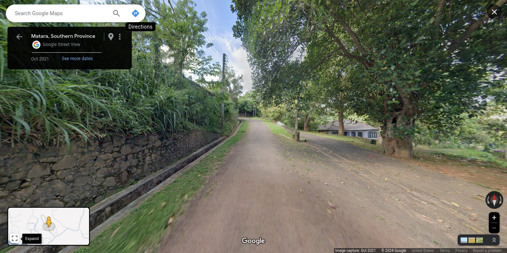

## Mehiella North

**Mehiella North** Grama Niladhari Division, **Mallawapitiya** Divisional Secretariat Division, **Kurunegala** District, **North Western** Province

**Mawathagama** Polling Division, **Kurunegala** Electoral District

Population: 1,743 (2012)

(**LK-6157080**/713)

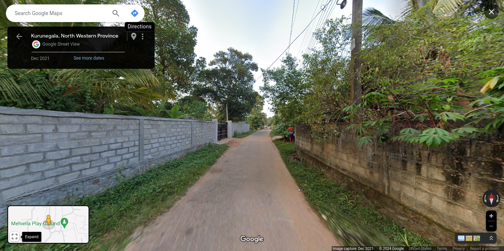

## Vilinayadi 02

**Vilinayadi 02** Grama Niladhari Division, **Samanthurai** Divisional Secretariat Division, **Ampara** District, **Eastern** Province

**Samanthurai** Polling Division, **Digamadulla** Electoral District

Population: 1,046 (2012)

(**LK-5218230**/79I)

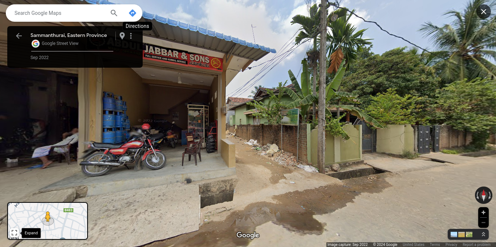

## Polhena

**Polhena** Grama Niladhari Division, **Kesbewa** Divisional Secretariat Division, **Colombo** District, **Western** Province

**Kesbewa** Polling Division, **Colombo** Electoral District

Population: 2,339 (2012)

(**LK-1136355**/598B)

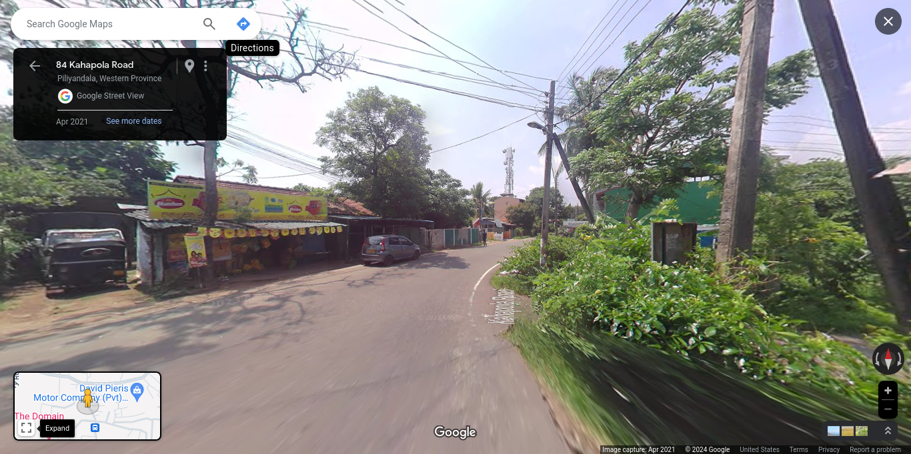

## Lindula

**Lindula** Grama Niladhari Division, **Nuwara Eliya** Divisional Secretariat Division, **Nuwara Eliya** District, **Central** Province

**Nuwara Eliya Maskeliya** Polling Division, **Nuwara-Eliya** Electoral District

Population: 2,965 (2012)

(**LK-2312135**/475F)

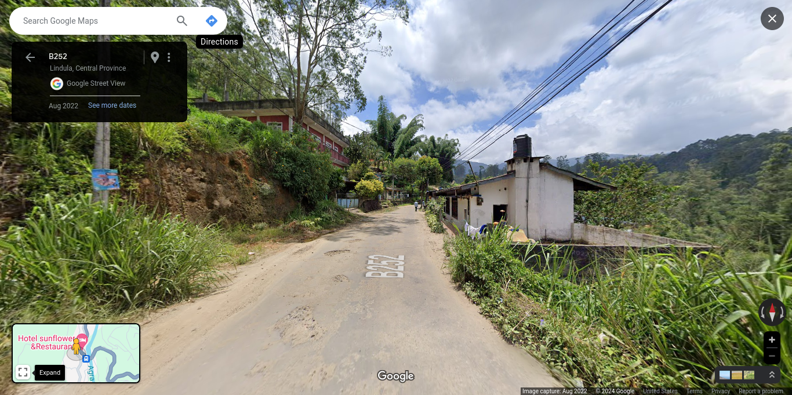

## Niyamgamdora

**Niyamgamdora** Grama Niladhari Division, **Kothmale** Divisional Secretariat Division, **Nuwara Eliya** District, **Central** Province

**Kothmale** Polling Division, **Nuwara-Eliya** Electoral District

Population: 1,077 (2012)

(**LK-2303255**/470)

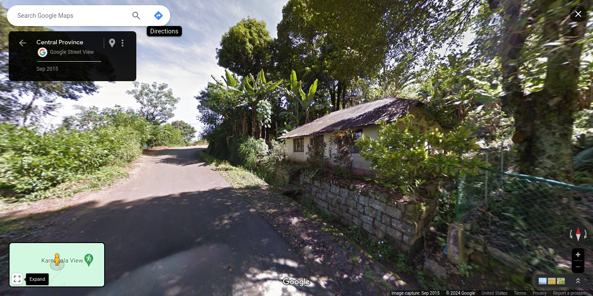

## Thirunagar

**Thirunagar** Grama Niladhari Division, **Jaffna** Divisional Secretariat Division, **Jaffna** District, **Northern** Province

**Jaffna** Polling Division, **Jaffna** Electoral District

Population: 1,630 (2012)

(**LK-4136035**/J/67)

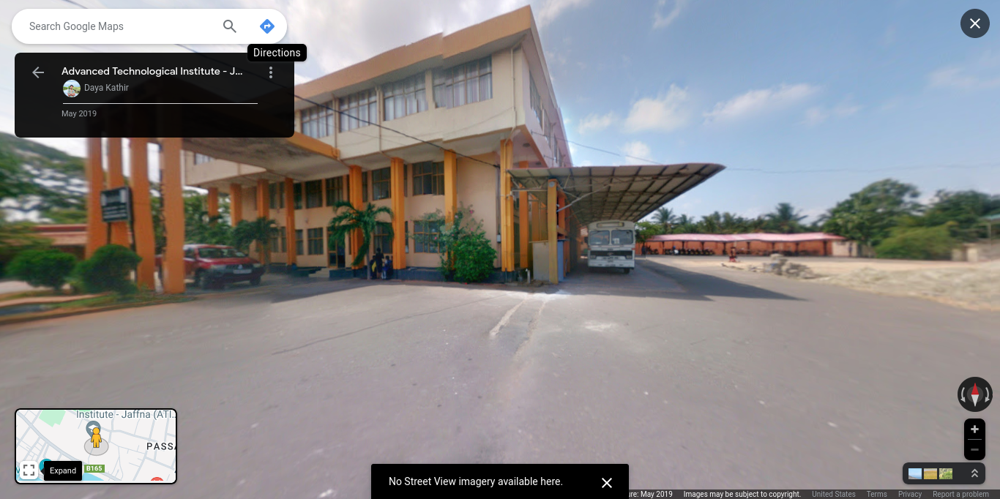

## Rathmalkatuwa

**Rathmalkatuwa** Grama Niladhari Division, **Dambulla** Divisional Secretariat Division, **Matale** District, **Central** Province

**Dambulla** Polling Division, **Matale** Electoral District

Population: 1,166 (2012)

(**LK-2206095**/E451C)

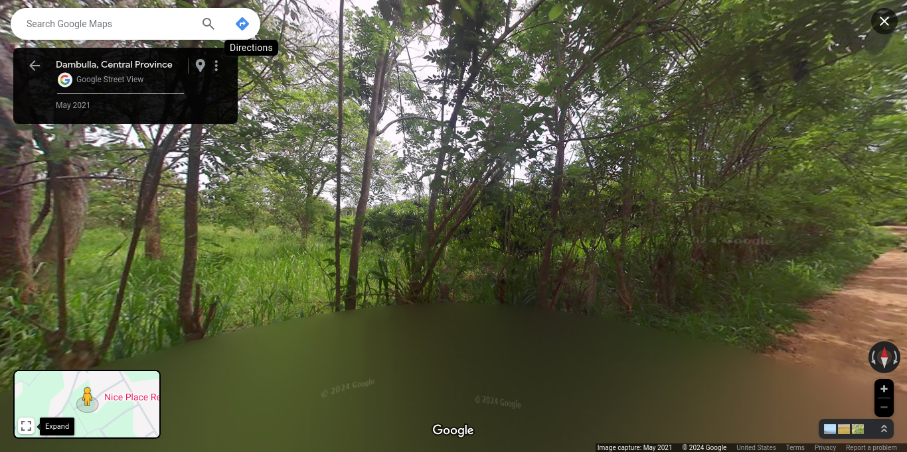

## Galbokka West

**Galbokka West** Grama Niladhari Division, **Weligama** Divisional Secretariat Division, **Matara** District, **Southern** Province

**Weligama** Polling Division, **Matara** Electoral District

Population: 1,225 (2012)

(**LK-3239120**/385B)

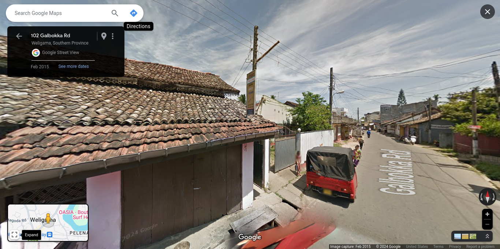

## Gonawala Central

**Gonawala Central** Grama Niladhari Division, **Biyagama** Divisional Secretariat Division, **Gampaha** District, **Western** Province

**Biyagama** Polling Division, **Gampaha** Electoral District

Population: 5,097 (2012)

(**LK-1239190**/277B)

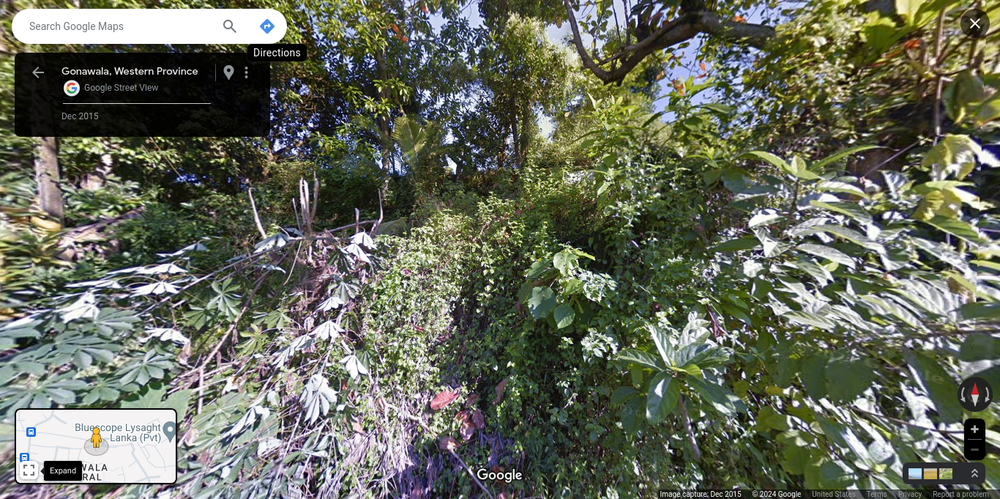

## Wetehepitiya

**Wetehepitiya** Grama Niladhari Division, **Panduwasnuwara East** Divisional Secretariat Division, **Kurunegala** District, **North Western** Province

**Panduwasnuwara** Polling Division, **Kurunegala** Electoral District

Population: 710 (2012)

(**LK-6148185**/1394)

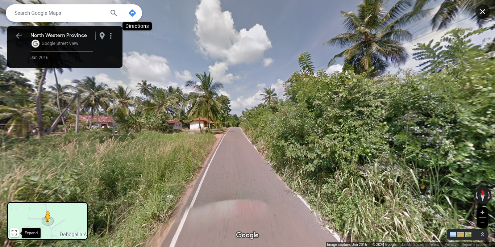

## Pitakotte East

**Pitakotte East** Grama Niladhari Division, **Sri Jayawardanapura Kotte** Divisional Secretariat Division, **Colombo** District, **Western** Province

**Kotte** Polling Division, **Colombo** Electoral District

Population: 3,984 (2012)

(**LK-1124050**/522A)

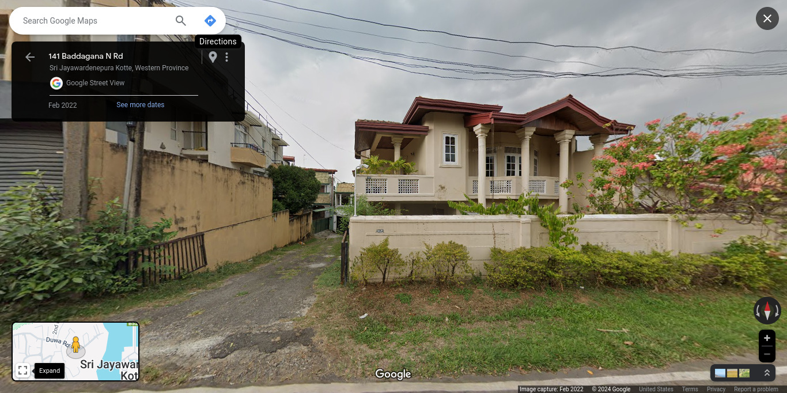

## Yakarawatta

**Yakarawatta** Grama Niladhari Division, **Kuliyapitiya West** Divisional Secretariat Division, **Kurunegala** District, **North Western** Province

**Kuliyapitiya** Polling Division, **Kurunegala** Electoral District

Population: 1,063 (2012)

(**LK-6172190**/1152)

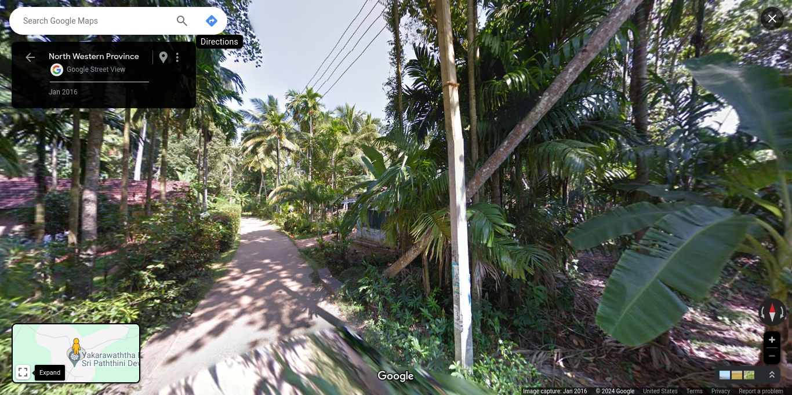

## Manampita

**Manampita** Grama Niladhari Division, **Gonapeenuwala** Divisional Secretariat Division, **Galle** District, **Southern** Province

**Ambalangoda** Polling Division, **Galle** Electoral District

Population: 1,464 (2012)

(**LK-3134010**/66A)

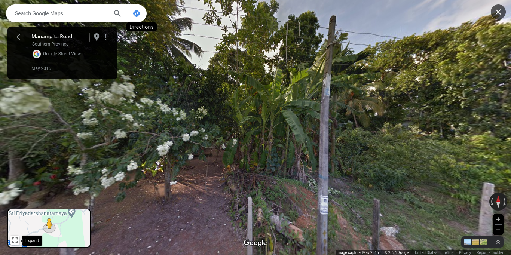

## Angulugalla

**Angulugalla** Grama Niladhari Division, **Karandeniya** Divisional Secretariat Division, **Galle** District, **Southern** Province

**Karandeniya** Polling Division, **Galle** Electoral District

Population: 1,853 (2012)

(**LK-3109090**/95A)

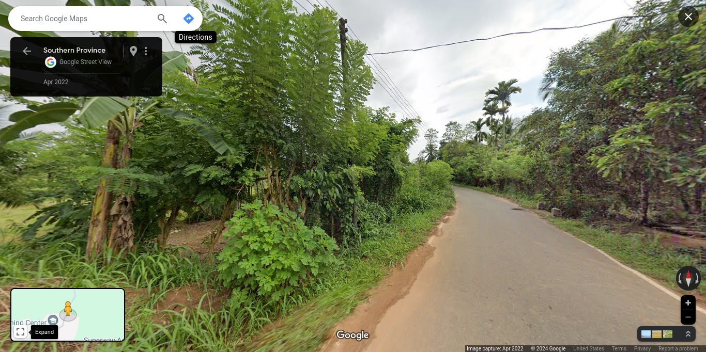

## Kalmunaikudi 11

**Kalmunaikudi 11** Grama Niladhari Division, **Kalmunai** Divisional Secretariat Division, **Ampara** District, **Eastern** Province

**Kalmunai** Polling Division, **Digamadulla** Electoral District

Population: 1,025 (2012)

(**LK-5224130**/KP/56A)

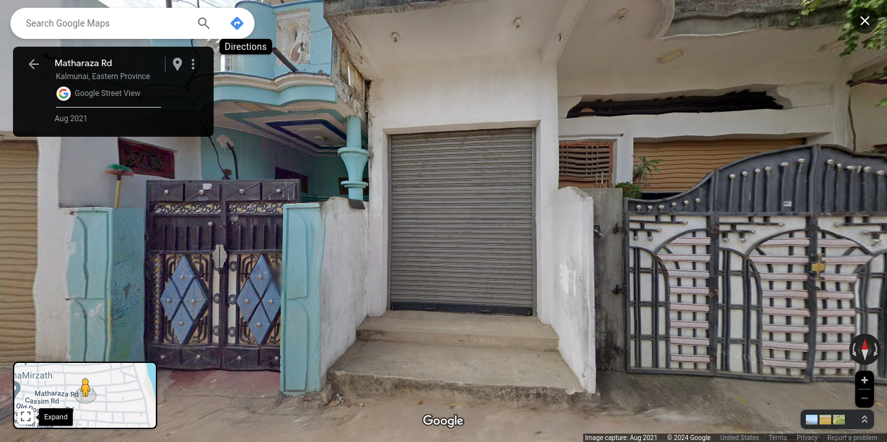

## Kudagodagama

**Kudagodagama** Grama Niladhari Division, **Balapitiya** Divisional Secretariat Division, **Galle** District, **Southern** Province

**Balapitiya** Polling Division, **Galle** Electoral District

Population: 627 (2012)

(**LK-3106055**/17C)

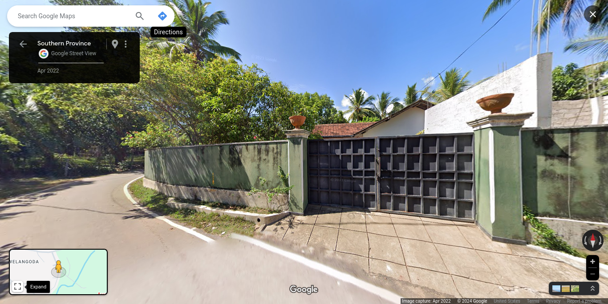

## Kudabollatha

**Kudabollatha** Grama Niladhari Division, **Gampaha** Divisional Secretariat Division, **Gampaha** District, **Western** Province

**Gampaha** Polling Division, **Gampaha** Electoral District

Population: 1,619 (2012)

(**LK-1224190**/209A)

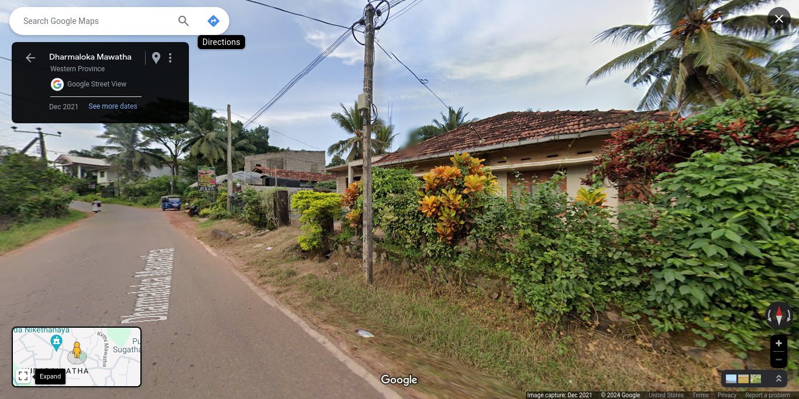

## Urawatta

**Urawatta** Grama Niladhari Division, **Hikkaduwa** Divisional Secretariat Division, **Galle** District, **Southern** Province

**Ratgama** Polling Division, **Galle** Electoral District

Population: 983 (2012)

(**LK-3136005**/80)

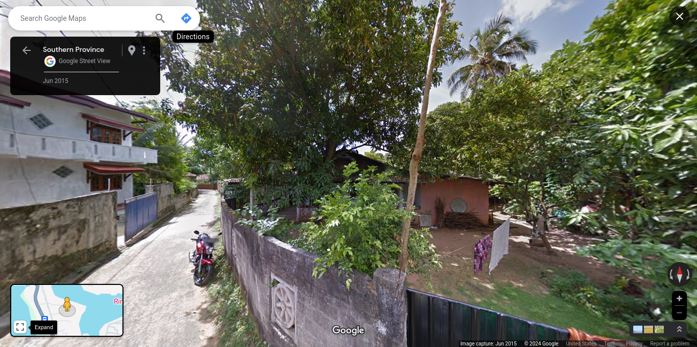

## Honnanthara South

**Honnanthara South** Grama Niladhari Division, **Kesbewa** Divisional Secretariat Division, **Colombo** District, **Western** Province

**Kesbewa** Polling Division, **Colombo** Electoral District

Population: 3,939 (2012)

(**LK-1136275**/585A)

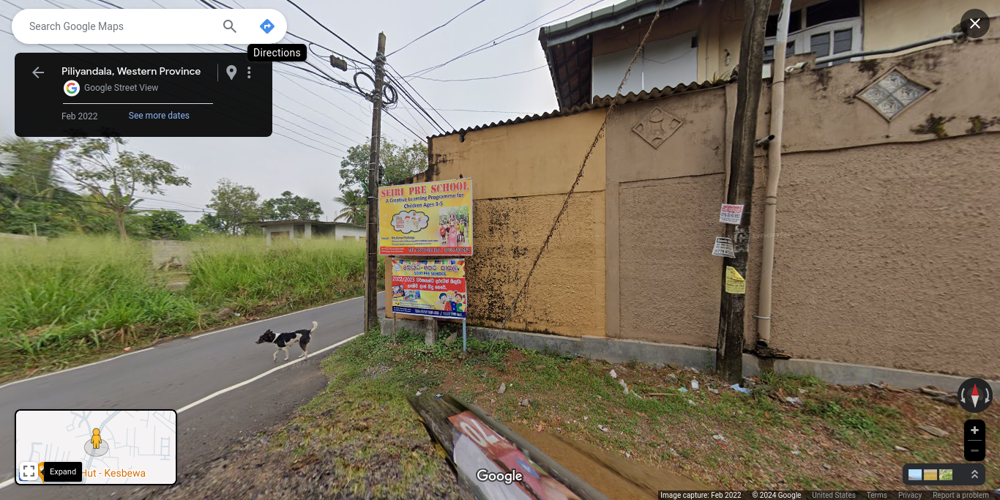

## Usbim Colony

**Usbim Colony** Grama Niladhari Division, **Niyagama** Divisional Secretariat Division, **Galle** District, **Southern** Province

**Hiniduma** Polling Division, **Galle** Electoral District

Population: 677 (2012)

(**LK-3115065**/34A/2)

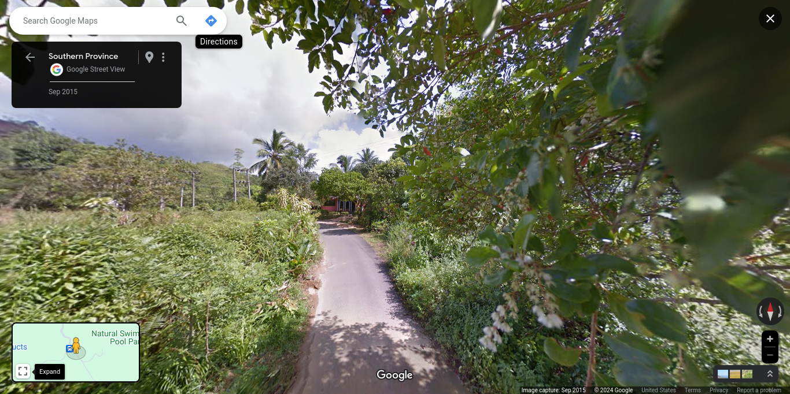

## Kongasthenna

**Kongasthenna** Grama Niladhari Division, **Weligepola** Divisional Secretariat Division, **Ratnapura** District, **Sabaragamuwa** Province

**Rakwana** Polling Division, **Ratnapura** Electoral District

Population: 753 (2012)

(**LK-9145025**/239A)

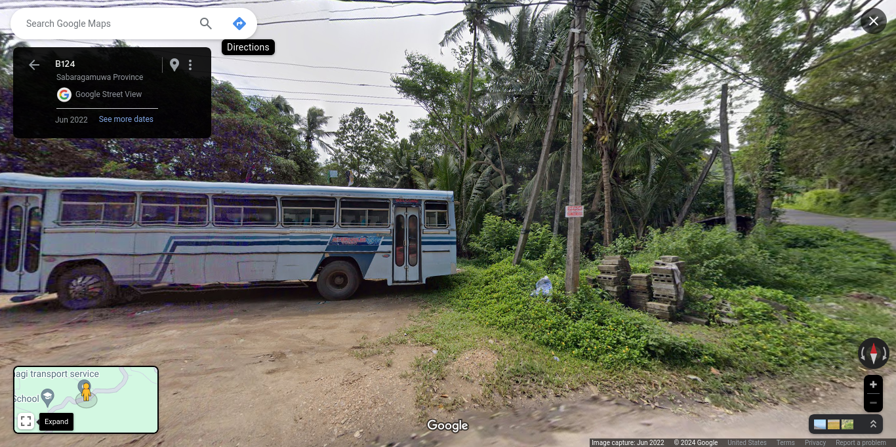

## Viharagoda

**Viharagoda** Grama Niladhari Division, **Balapitiya** Divisional Secretariat Division, **Galle** District, **Southern** Province

**Balapitiya** Polling Division, **Galle** Electoral District

Population: 1,125 (2012)

(**LK-3106240**/87G)

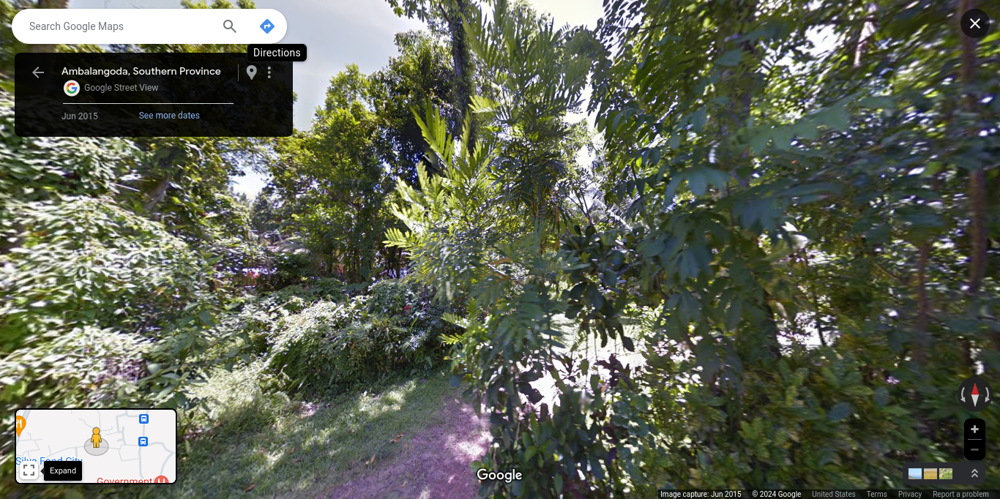

## Oddamavadi 02

**Oddamavadi 02** Grama Niladhari Division, **Koralai Pattu  West (Oddamavadi)** Divisional Secretariat Division, **Batticaloa** District, **Eastern** Province

**Kalkudah** Polling Division, **Batticaloa** Electoral District

Population: 2,238 (2012)

(**LK-5106020**/208C)

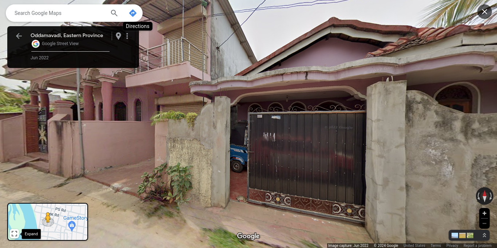

## Springvalley Estate

**Springvalley Estate** Grama Niladhari Division, **Hali-Ela** Divisional Secretariat Division, **Badulla** District, **Uva** Province

**Hali Ela** Polling Division, **Badulla** Electoral District

Population: 1,626 (2012)

(**LK-8124175**/86B)

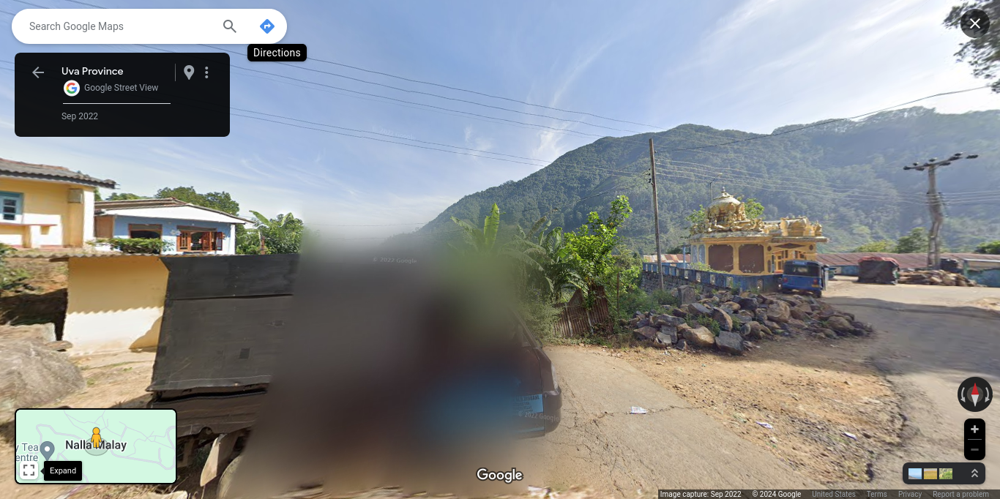

## Kossinna East

**Kossinna East** Grama Niladhari Division, **Gampaha** Divisional Secretariat Division, **Gampaha** District, **Western** Province

**Gampaha** Polling Division, **Gampaha** Electoral District

Population: 2,162 (2012)

(**LK-1224355**/237)

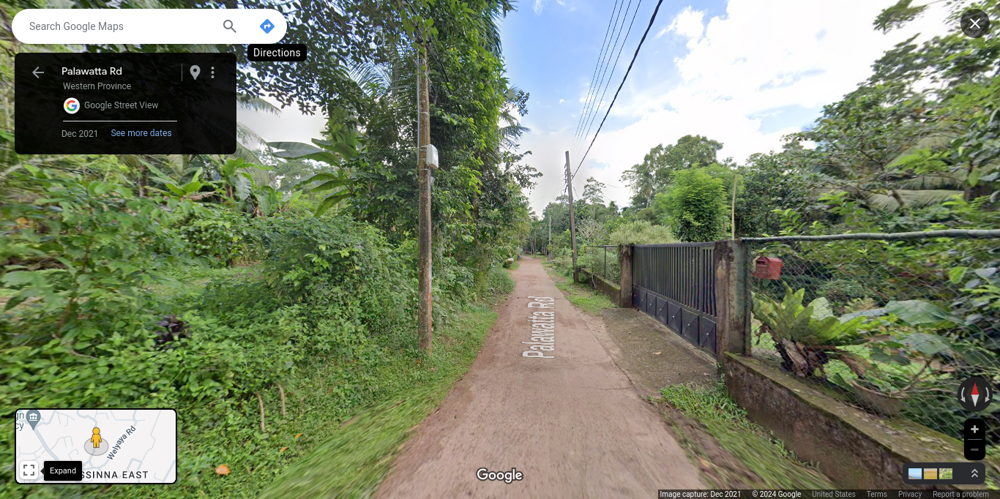

## Kinigama

**Kinigama** Grama Niladhari Division, **Bandarawela** Divisional Secretariat Division, **Badulla** District, **Uva** Province

**Bandarawela** Polling Division, **Badulla** Electoral District

Population: 1,767 (2012)

(**LK-8133105**/66)

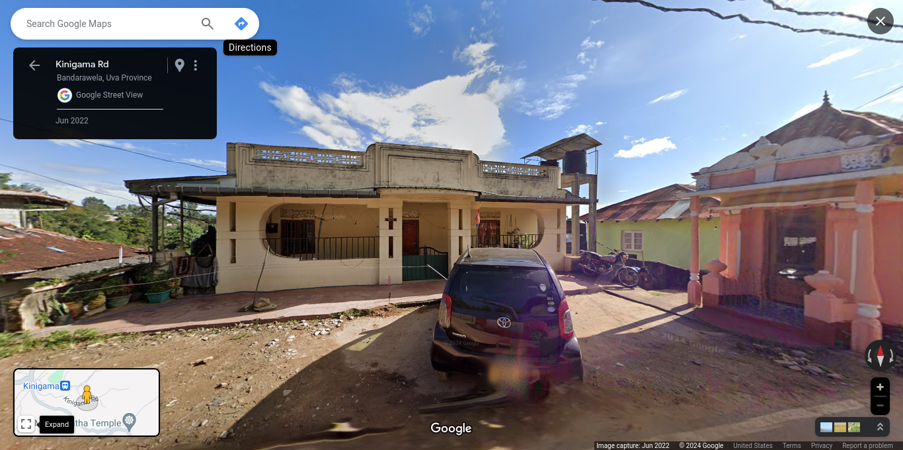

## Padagoda

**Padagoda** Grama Niladhari Division, **Beruwala** Divisional Secretariat Division, **Kalutara** District, **Western** Province

**Beruwala** Polling Division, **Kalutara** Electoral District

Population: 1,461 (2012)

(**LK-1324275**/768)

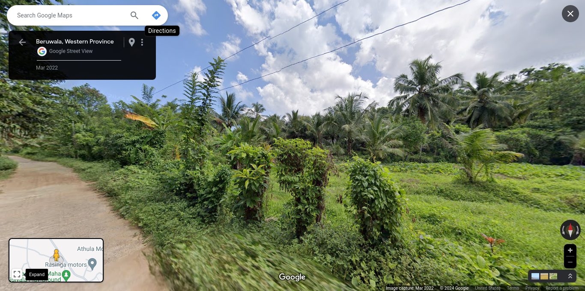

## Paranagampola

**Paranagampola** Grama Niladhari Division, **Kegalle** Divisional Secretariat Division, **Kegalle** District, **Sabaragamuwa** Province

**Kegalle** Polling Division, **Kegalle** Electoral District

Population: 2,030 (2012)

(**LK-9212060**/52C)

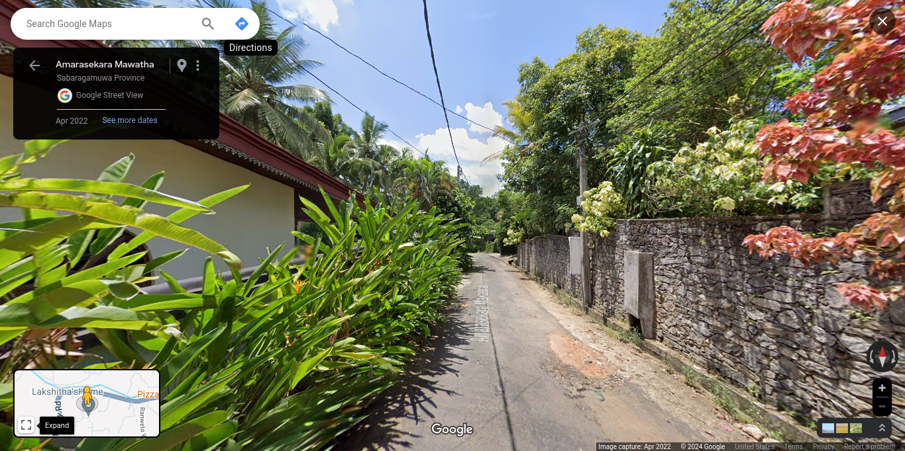

## Homathagama

**Homathagama** Grama Niladhari Division, **Bamunakotuwa** Divisional Secretariat Division, **Kurunegala** District, **North Western** Province

**Wariyapola** Polling Division, **Kurunegala** Electoral District

Population: 581 (2012)

(**LK-6149175**/1221)

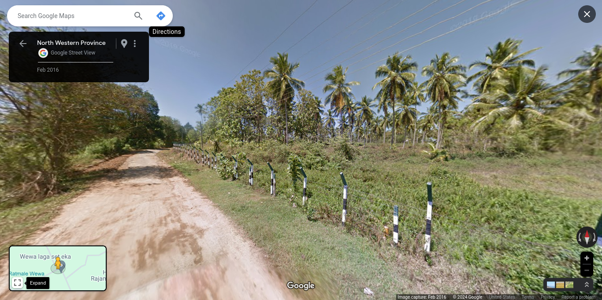

## Naotunna North

**Naotunna North** Grama Niladhari Division, **Devinuwara** Divisional Secretariat Division, **Matara** District, **Southern** Province

**Devinuwara** Polling Division, **Matara** Electoral District

Population: 782 (2012)

(**LK-3245065**/442C)

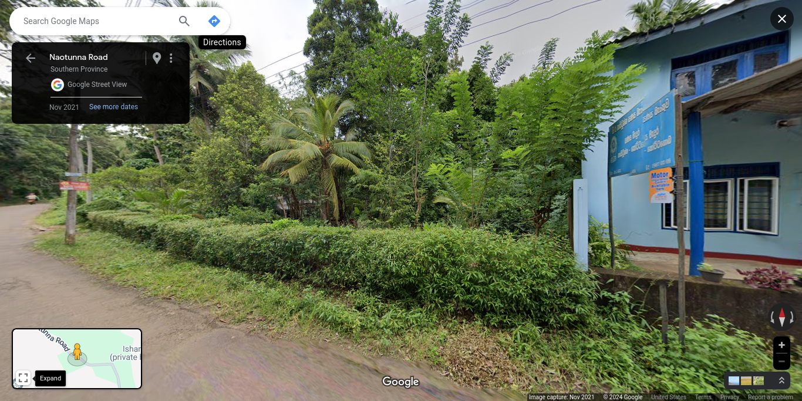

## Muppane

**Muppane** Grama Niladhari Division, **Moneragala** Divisional Secretariat Division, **Moneragala** District, **Uva** Province

**Monaragala** Polling Division, **Moneragala** Electoral District

Population: 3,922 (2012)

(**LK-8215090**/129)

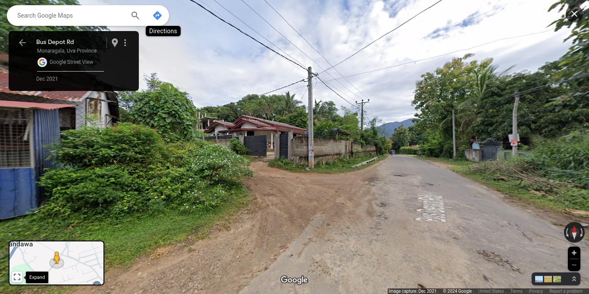

## Ovitiyagala

**Ovitiyagala** Grama Niladhari Division, **Horana** Divisional Secretariat Division, **Kalutara** District, **Western** Province

**Horana** Polling Division, **Kalutara** Electoral District

Population: 1,359 (2012)

(**LK-1309225**/616A)

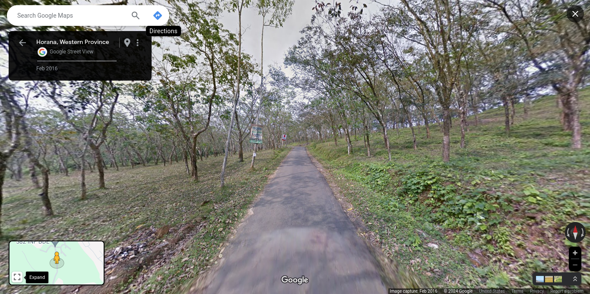

## Kadirana North

**Kadirana North** Grama Niladhari Division, **Katana** Divisional Secretariat Division, **Gampaha** District, **Western** Province

**Katana** Polling Division, **Gampaha** Electoral District

Population: 5,611 (2012)

(**LK-1206100**/93A)

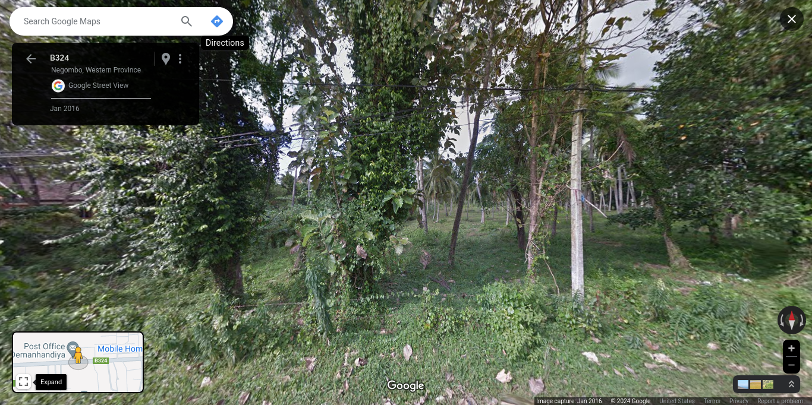

## Galenbindunuwewa

**Galenbindunuwewa** Grama Niladhari Division, **Galenbindunuwewa** Divisional Secretariat Division, **Anuradhapura** District, **North Central** Province

**Horowpothana** Polling Division, **Anuradhapura** Electoral District

Population: 1,949 (2012)

(**LK-7127075**/162)

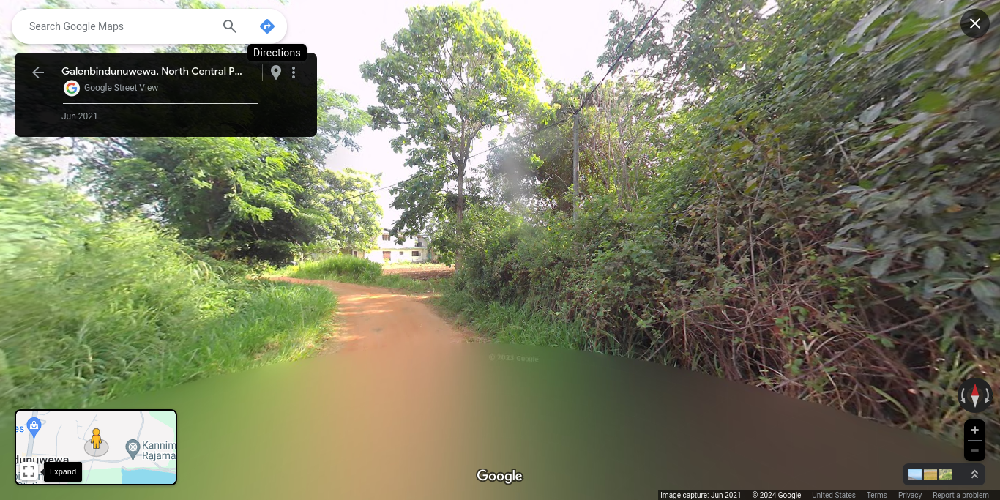

## Kattankudy Division 5 South

**Kattankudy Division 5 South** Grama Niladhari Division, **Kattankudy** Divisional Secretariat Division, **Batticaloa** District, **Eastern** Province

**Batticaloa** Polling Division, **Batticaloa** Electoral District

Population: 868 (2012)

(**LK-5124090**/164 B)

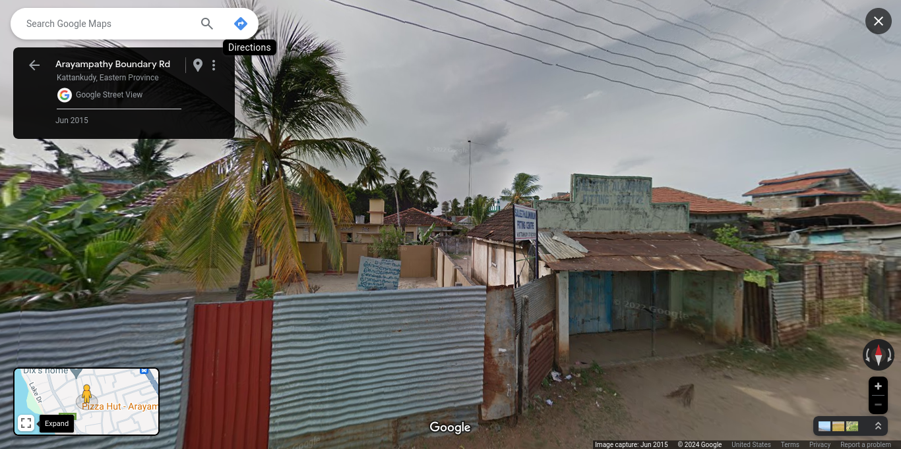

## Kurundugolla

**Kurundugolla** Grama Niladhari Division, **Harispattuwa** Divisional Secretariat Division, **Kandy** District, **Central** Province

**Harispattuwa** Polling Division, **Kandy** Electoral District

Population: 1,303 (2012)

(**LK-2133120**/474)

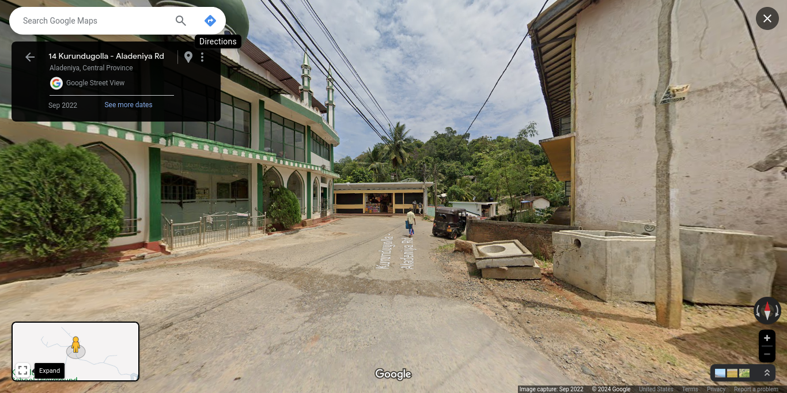

## Enderamulla West

**Enderamulla West** Grama Niladhari Division, **Mahara** Divisional Secretariat Division, **Gampaha** District, **Western** Province

**Mahara** Polling Division, **Gampaha** Electoral District

Population: 2,775 (2012)

(**LK-1233450**/255F)

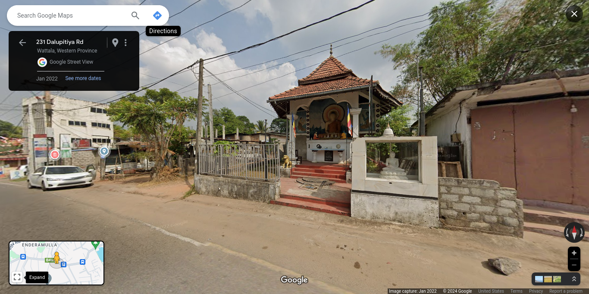

## Godagama

**Godagama** Grama Niladhari Division, **Attanagalla** Divisional Secretariat Division, **Gampaha** District, **Western** Province

**Attanagalla** Polling Division, **Gampaha** Electoral District

Population: 657 (2012)

(**LK-1227400**/361)

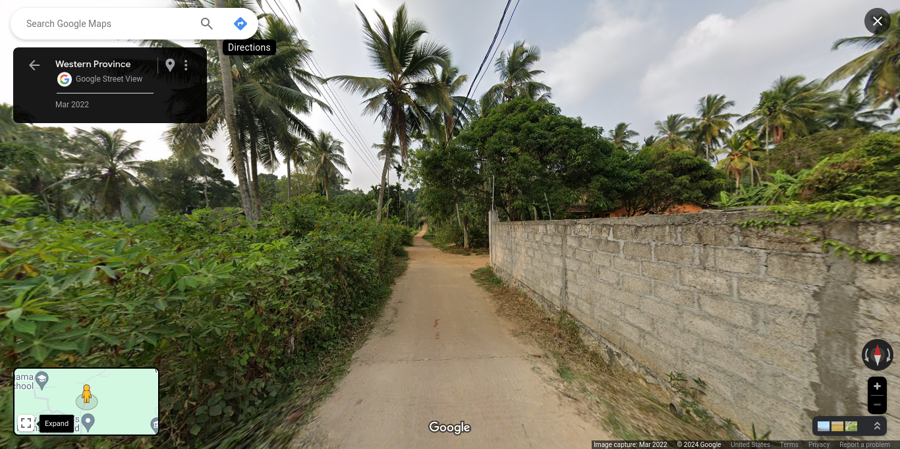

## Ambagahawatta

**Ambagahawatta** Grama Niladhari Division, **Bope-Poddala** Divisional Secretariat Division, **Galle** District, **Southern** Province

**Akmeemana** Polling Division, **Galle** Electoral District

Population: 1,156 (2012)

(**LK-3142205**/114D)

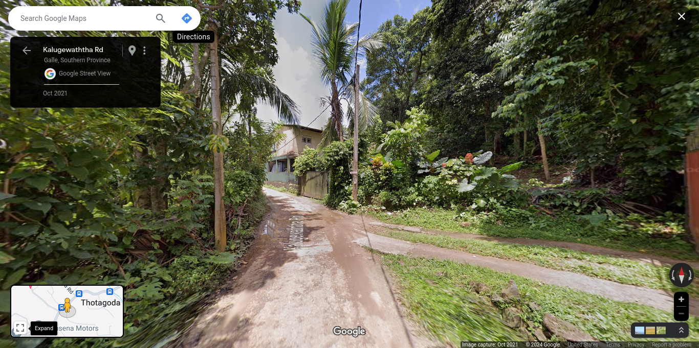

## Medawatta

**Medawatta** Grama Niladhari Division, **Rattota** Divisional Secretariat Division, **Matale** District, **Central** Province

**Rattota** Polling Division, **Matale** Electoral District

Population: 770 (2012)

(**LK-2230065**/E375E)

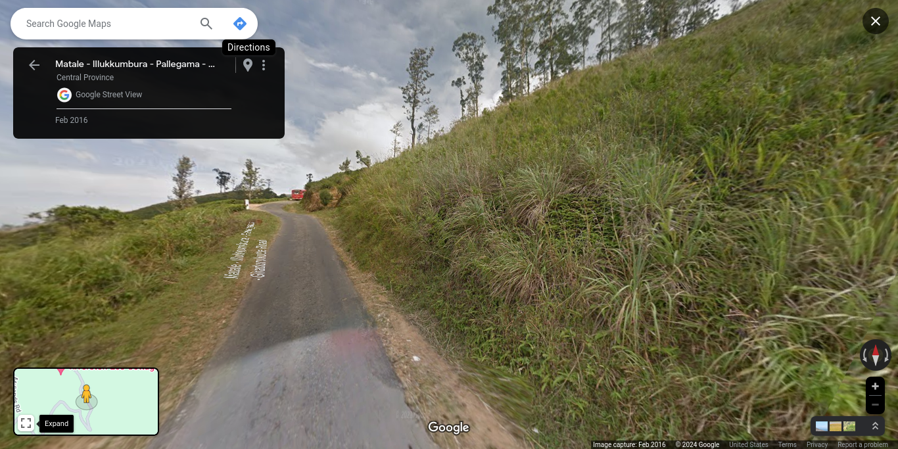

## Wewa Ihalagoda

**Wewa Ihalagoda** Grama Niladhari Division, **Matara Four Gravets** Divisional Secretariat Division, **Matara** District, **Southern** Province

**Matara** Polling Division, **Matara** Electoral District

Population: 1,612 (2012)

(**LK-3242305**/429A)

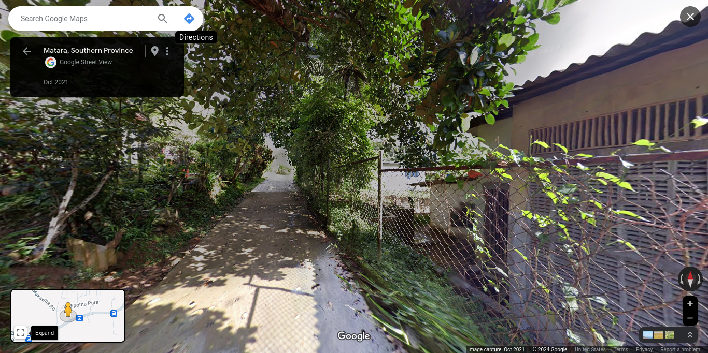

## Karaitheevu 01

**Karaitheevu 01** Grama Niladhari Division, **Karaitheevu** Divisional Secretariat Division, **Ampara** District, **Eastern** Province

**Pothuvil** Polling Division, **Digamadulla** Electoral District

Population: 999 (2012)

(**LK-5227040**/44)

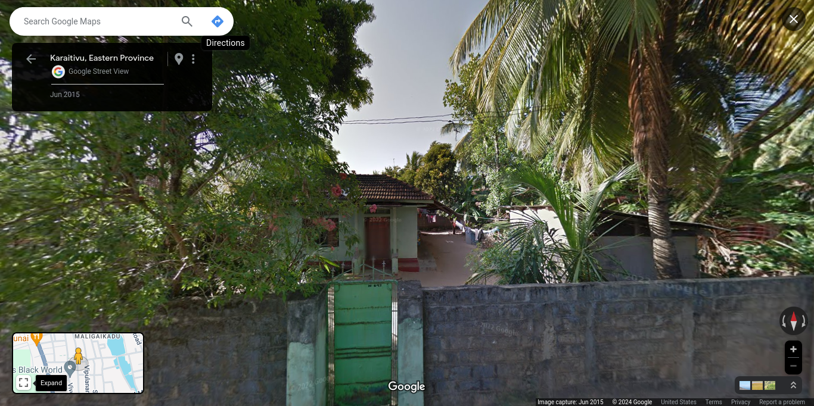

## Neluwa

**Neluwa** Grama Niladhari Division, **Hali-Ela** Divisional Secretariat Division, **Badulla** District, **Uva** Province

**Hali Ela** Polling Division, **Badulla** Electoral District

Population: 2,012 (2012)

(**LK-8124240**/56C)

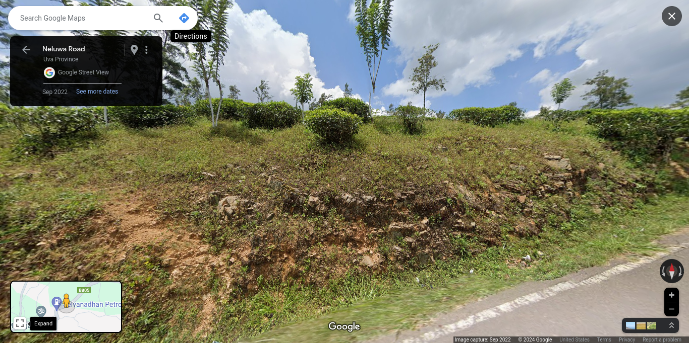

## Maitipe

**Maitipe** Grama Niladhari Division, **Galle Four Gravets** Divisional Secretariat Division, **Galle** District, **Southern** Province

**Galle** Polling Division, **Galle** Electoral District

Population: 1,875 (2012)

(**LK-3139080**/101)

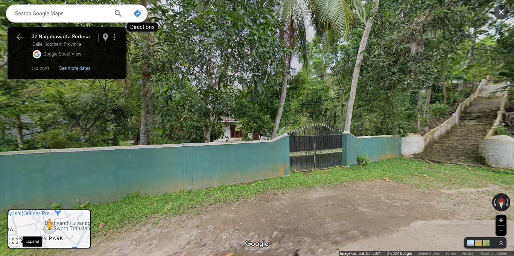

## Mawanella

**Mawanella** Grama Niladhari Division, **Mawanella** Divisional Secretariat Division, **Kegalle** District, **Sabaragamuwa** Province

**Mawanella** Polling Division, **Kegalle** Electoral District

Population: 1,293 (2012)

(**LK-9206135**/19B)

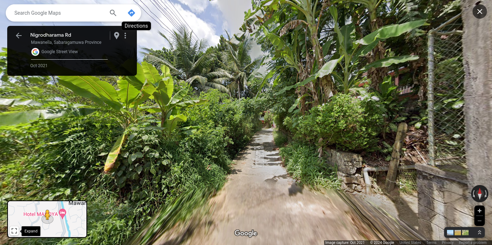

## Lenawala

**Lenawala** Grama Niladhari Division, **Galewela** Divisional Secretariat Division, **Matale** District, **Central** Province

**Dambulla** Polling Division, **Matale** Electoral District

Population: 922 (2012)

(**LK-2203275**/E428)

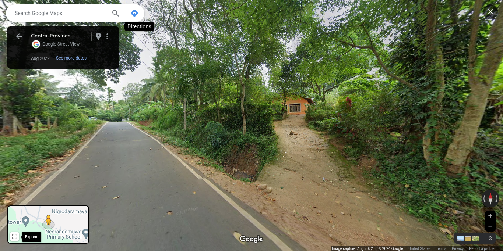

## Sandilipay Centre

**Sandilipay Centre** Grama Niladhari Division, **Valikamam South-West (Sandilipay)** Divisional Secretariat Division, **Jaffna** District, **Northern** Province

**Manipay** Polling Division, **Jaffna** Electoral District

Population: 2,066 (2012)

(**LK-4109070**/J/142)

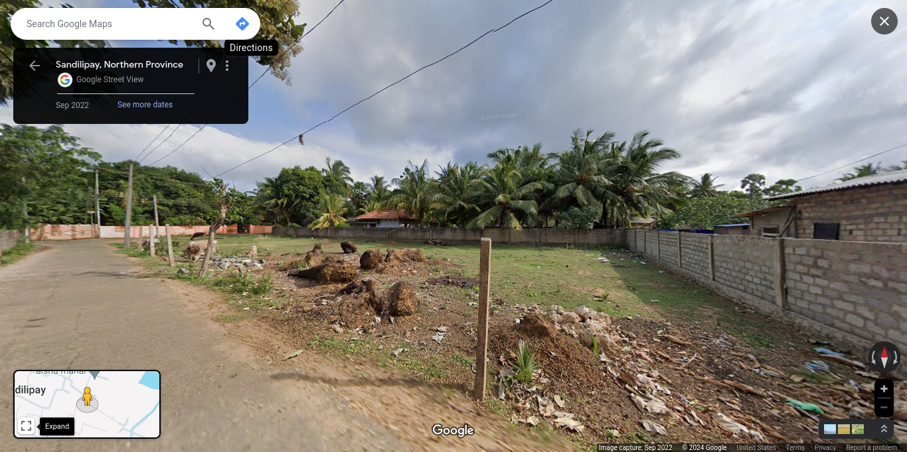

## Wanduressa

**Wanduressa** Grama Niladhari Division, **Wariyapola** Divisional Secretariat Division, **Kurunegala** District, **North Western** Province

**Wariyapola** Polling Division, **Kurunegala** Electoral District

Population: 971 (2012)

(**LK-6136065**/1278)

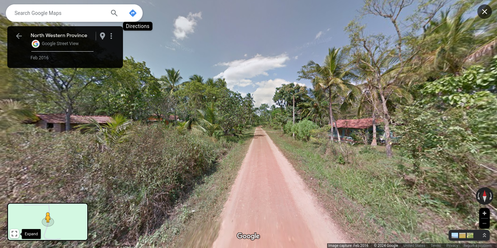

## Ogastawatta

**Ogastawatta** Grama Niladhari Division, **Kandy Four Gravets & Gangawata Korale** Divisional Secretariat Division, **Kandy** District, **Central** Province

**Senkadagala** Polling Division, **Kandy** Electoral District

Population: 3,803 (2012)

(**LK-2130305**/246)

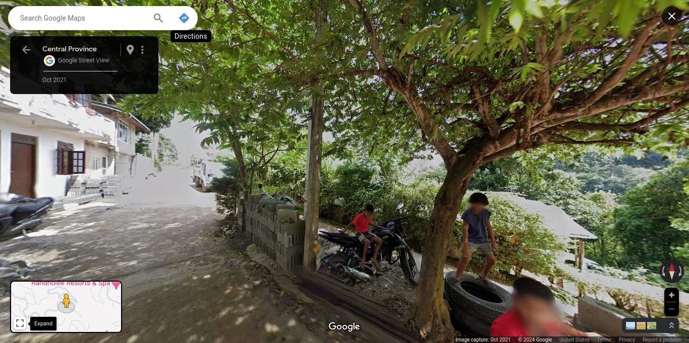

## Ukwatta

**Ukwatta** Grama Niladhari Division, **Seethawaka** Divisional Secretariat Division, **Colombo** District, **Western** Province

**Avissawella** Polling Division, **Colombo** Electoral District

Population: 2,649 (2012)

(**LK-1115055**/432C)

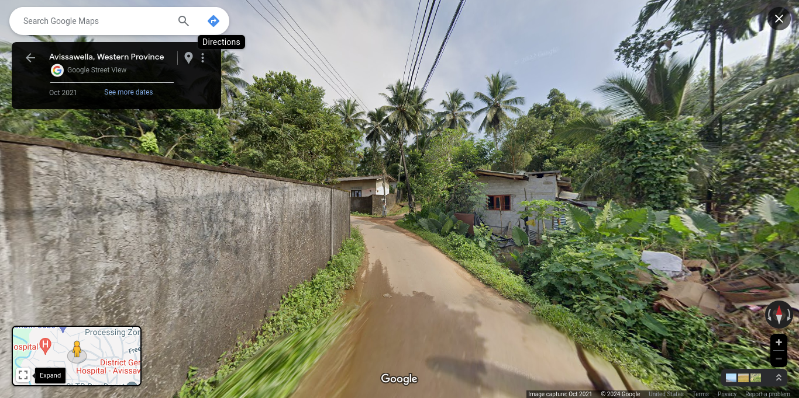

## Bibile

**Bibile** Grama Niladhari Division, **Bibile** Divisional Secretariat Division, **Moneragala** District, **Uva** Province

**Bibile** Polling Division, **Moneragala** Electoral District

Population: 1,579 (2012)

(**LK-8203145**/100)

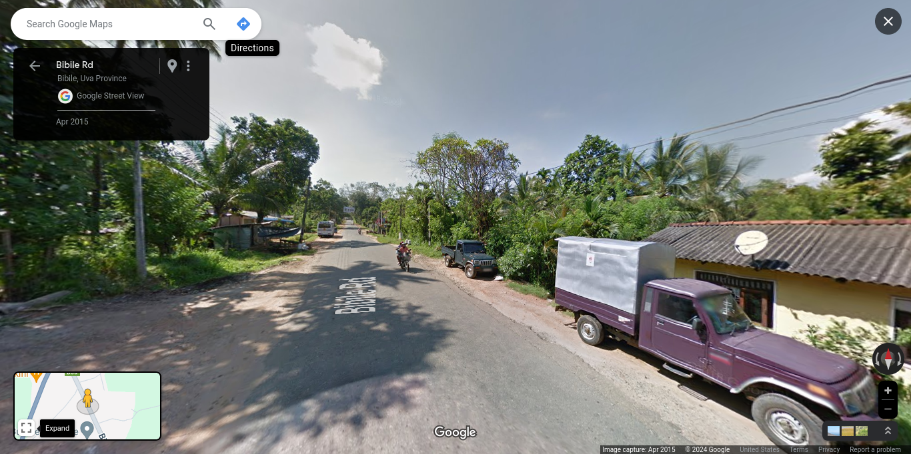

## Navanthurai North

**Navanthurai North** Grama Niladhari Division, **Jaffna** Divisional Secretariat Division, **Jaffna** District, **Northern** Province

**Jaffna** Polling Division, **Jaffna** Electoral District

Population: 2,356 (2012)

(**LK-4136125**/J/85)

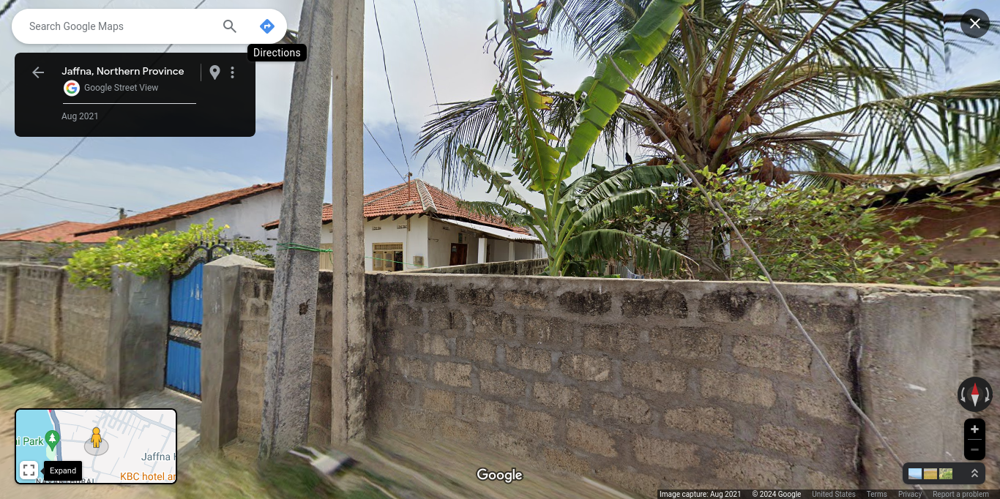

## Veeramunai 03

**Veeramunai 03** Grama Niladhari Division, **Samanthurai** Divisional Secretariat Division, **Ampara** District, **Eastern** Province

**Samanthurai** Polling Division, **Digamadulla** Electoral District

Population: 521 (2012)

(**LK-5218110**/92I)

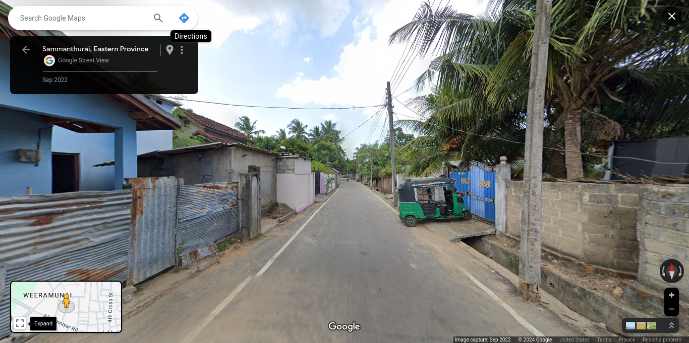

## Balapitiya

**Balapitiya** Grama Niladhari Division, **Balapitiya** Divisional Secretariat Division, **Galle** District, **Southern** Province

**Balapitiya** Polling Division, **Galle** Electoral District

Population: 1,855 (2012)

(**LK-3106185**/89)

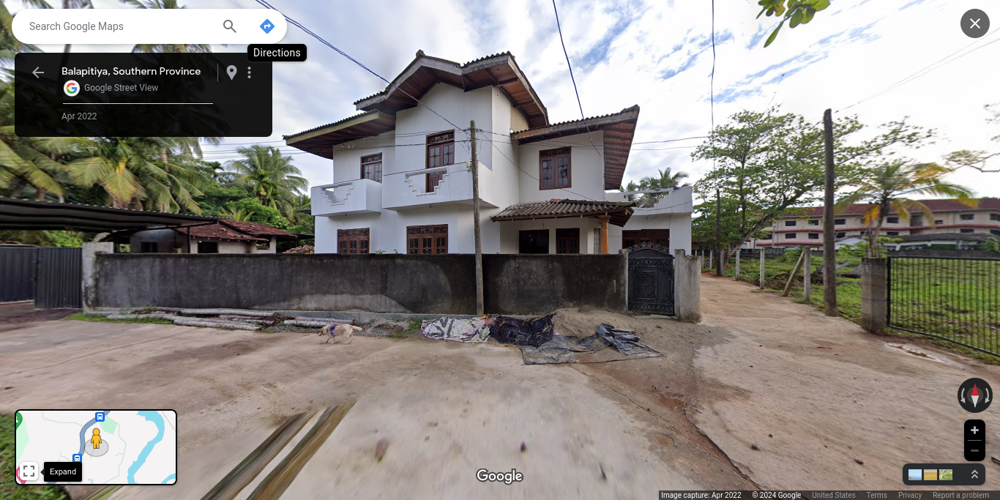

## Thalahena North

**Thalahena North** Grama Niladhari Division, **Kaduwela** Divisional Secretariat Division, **Colombo** District, **Western** Province

**Kaduwela** Polling Division, **Colombo** Electoral District

Population: 3,131 (2012)

(**LK-1109065**/478)

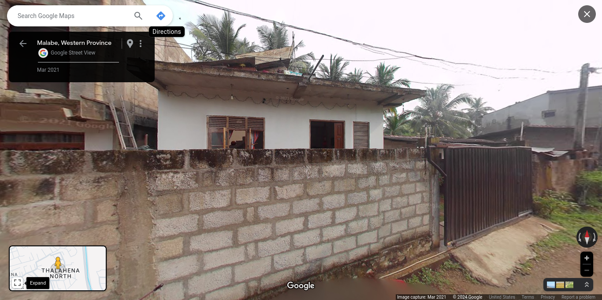

## Rathgalla

**Rathgalla** Grama Niladhari Division, **Kurunegala** Divisional Secretariat Division, **Kurunegala** District, **North Western** Province

**Kurunegala** Polling Division, **Kurunegala** Electoral District

Population: 1,338 (2012)

(**LK-6154220**/821)

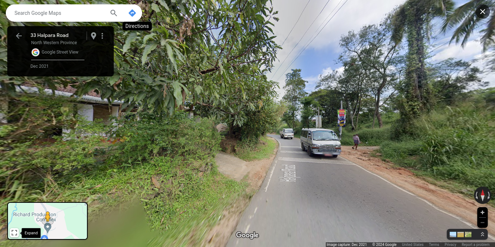

## Iluppugedara

**Iluppugedara** Grama Niladhari Division, **Kurunegala** Divisional Secretariat Division, **Kurunegala** District, **North Western** Province

**Kurunegala** Polling Division, **Kurunegala** Electoral District

Population: 3,314 (2012)

(**LK-6154150**/838)

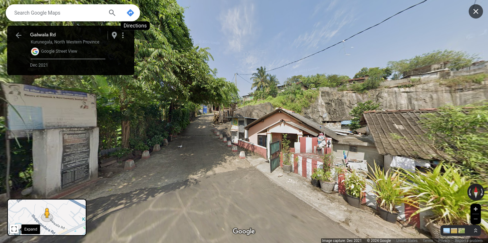

## Batadoowa

**Batadoowa** Grama Niladhari Division, **Akmeemana** Divisional Secretariat Division, **Galle** District, **Southern** Province

**Akmeemana** Polling Division, **Galle** Electoral District

Population: 1,975 (2012)

(**LK-3145235**/113)

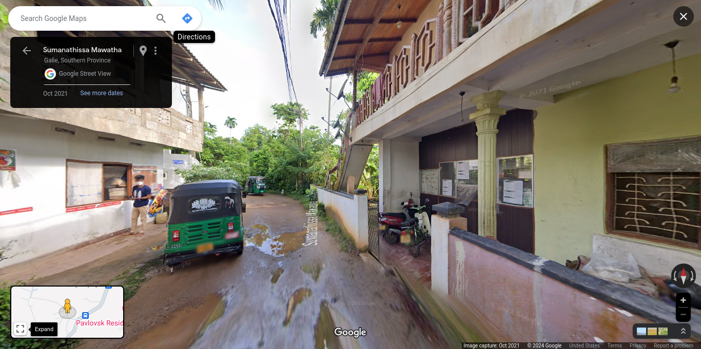

## Pandarikkulam

**Pandarikkulam** Grama Niladhari Division, **Vavuniya** Divisional Secretariat Division, **Vavuniya** District, **Northern** Province

**Vavuniya** Polling Division, **Vanni** Electoral District

Population: 6,469 (2012)

(**LK-4309200**/214E)

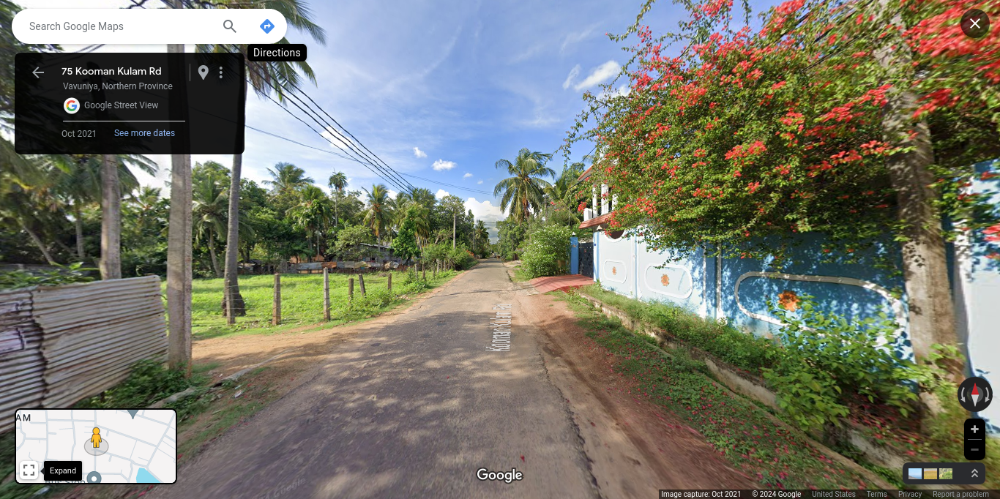

## Dankoluwa

**Dankoluwa** Grama Niladhari Division, **Pitabeddara** Divisional Secretariat Division, **Matara** District, **Southern** Province

**Deniyaya** Polling Division, **Matara** Electoral District

Population: 2,151 (2012)

(**LK-3203145**/265A)

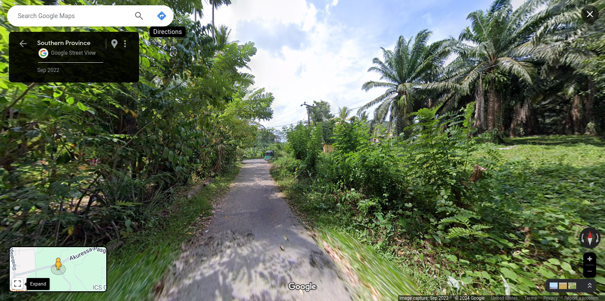

## Dahampura

**Dahampura** Grama Niladhari Division, **Moratuwa** Divisional Secretariat Division, **Colombo** District, **Western** Province

**Moratuwa** Polling Division, **Colombo** Electoral District

Population: 2,748 (2012)

(**LK-1133025**/548C)

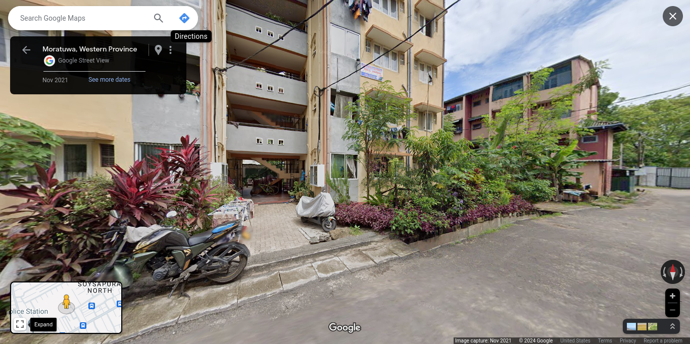

## Kelepuliyankulama

**Kelepuliyankulama** Grama Niladhari Division, **Kekirawa** Divisional Secretariat Division, **Anuradhapura** District, **North Central** Province

**Mihinthale** Polling Division, **Anuradhapura** Electoral District

Population: 766 (2012)

(**LK-7154030**/615)

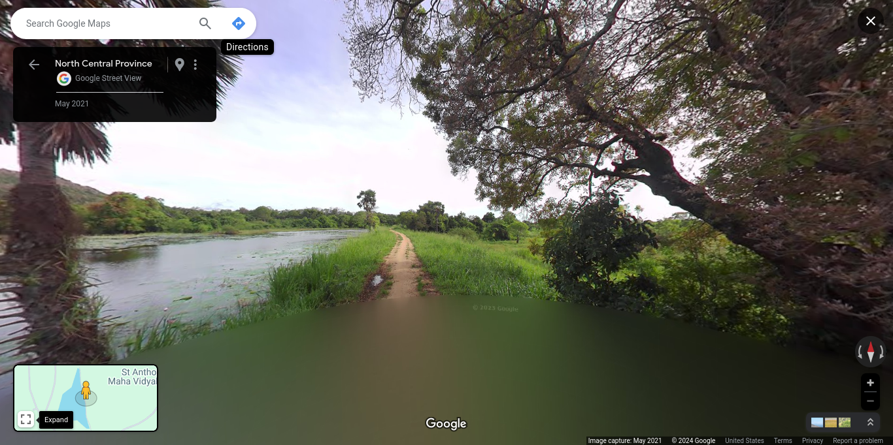

## Kurunduwatta

**Kurunduwatta** Grama Niladhari Division, **Balapitiya** Divisional Secretariat Division, **Galle** District, **Southern** Province

**Balapitiya** Polling Division, **Galle** Electoral District

Population: 1,178 (2012)

(**LK-3106220**/87F)

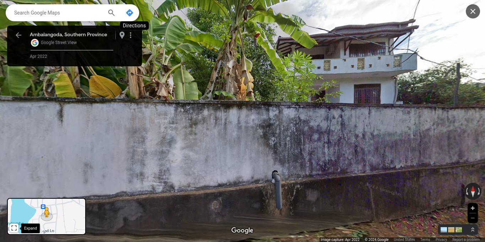

## Marakkalahawatta

**Marakkalahawatta** Grama Niladhari Division, **Beruwala** Divisional Secretariat Division, **Kalutara** District, **Western** Province

**Beruwala** Polling Division, **Kalutara** Electoral District

Population: 3,937 (2012)

(**LK-1324215**/747A)

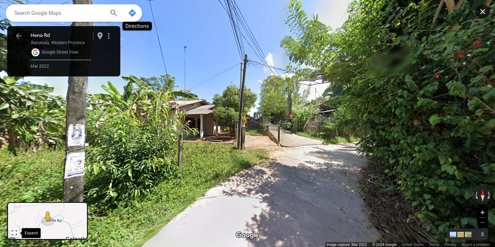

## Udayala

**Udayala** Grama Niladhari Division, **Angunakolapelessa** Divisional Secretariat Division, **Hambantota** District, **Southern** Province

**Tangalle** Polling Division, **Hambantota** Electoral District

Population: 1,358 (2012)

(**LK-3318170**/207)

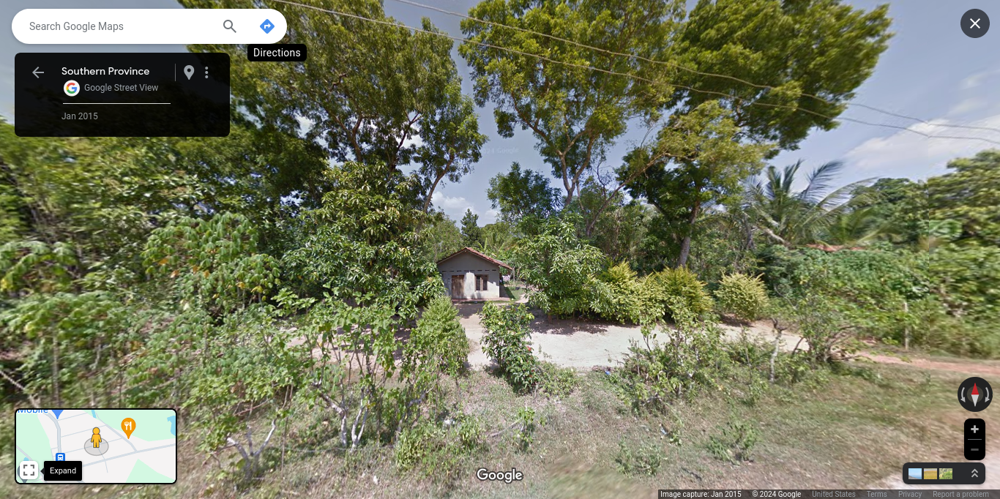

## Massalgoda

**Massalgoda** Grama Niladhari Division, **Beruwala** Divisional Secretariat Division, **Kalutara** District, **Western** Province

**Beruwala** Polling Division, **Kalutara** Electoral District

Population: 1,939 (2012)

(**LK-1324240**/757)

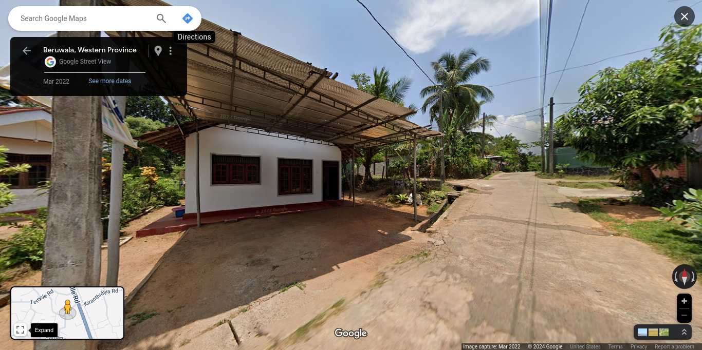

## Pallansena North

**Pallansena North** Grama Niladhari Division, **Negombo** Divisional Secretariat Division, **Gampaha** District, **Western** Province

**Negombo** Polling Division, **Gampaha** Electoral District

Population: 3,722 (2012)

(**LK-1203010**/77)

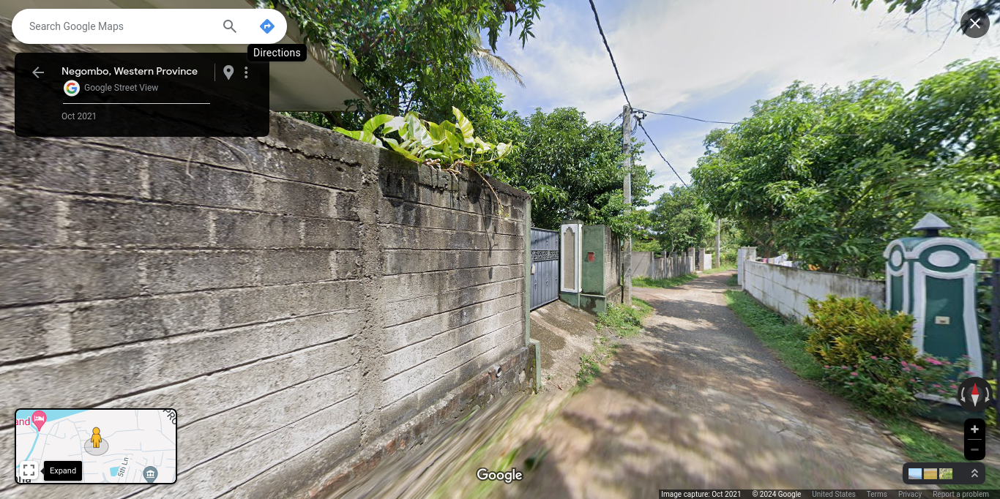

## Welipenna West

**Welipenna West** Grama Niladhari Division, **Mathugama** Divisional Secretariat Division, **Kalutara** District, **Western** Province

**Mathugama** Polling Division, **Kalutara** Electoral District

Population: 2,791 (2012)

(**LK-1330180**/793)

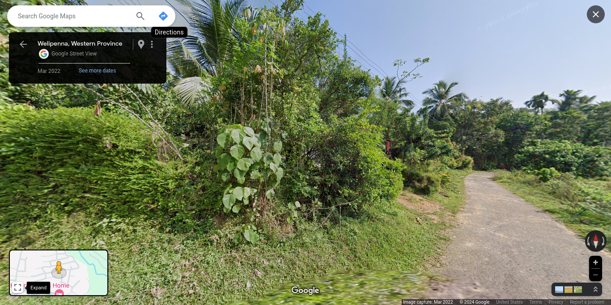

## Kalmunai  01E

**Kalmunai  01E** Grama Niladhari Division, **Kalmunai Tamil Division** Divisional Secretariat Division, **Ampara** District, **Eastern** Province

**Kalmunai** Polling Division, **Digamadulla** Electoral District

Population: 932 (2012)

(**LK-5221120**/KP/61/6)

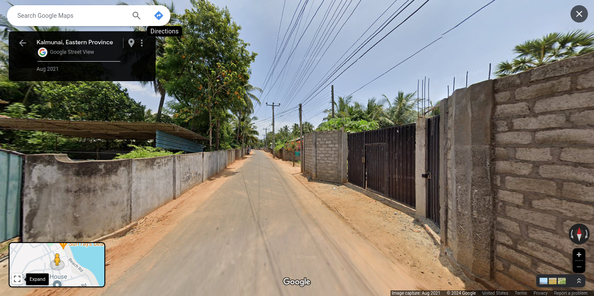

## Uswatta

**Uswatta** Grama Niladhari Division, **Kalutara** Divisional Secretariat Division, **Kalutara** District, **Western** Province

**Kalutara** Polling Division, **Kalutara** Electoral District

Population: 1,813 (2012)

(**LK-1321380**/729F)

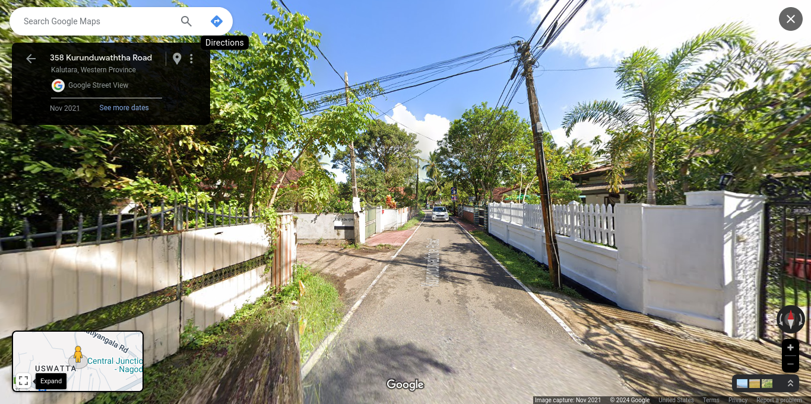

## Mampe West

**Mampe West** Grama Niladhari Division, **Kesbewa** Divisional Secretariat Division, **Colombo** District, **Western** Province

**Kesbewa** Polling Division, **Colombo** Electoral District

Population: 3,055 (2012)

(**LK-1136220**/574)

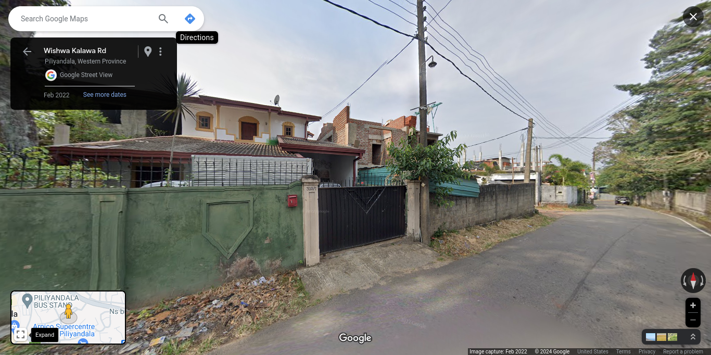

## Weerasooriyakanda

**Weerasooriyakanda** Grama Niladhari Division, **Mirigama** Divisional Secretariat Division, **Gampaha** District, **Western** Province

**Mirigama** Polling Division, **Gampaha** Electoral District

Population: 1,429 (2012)

(**LK-1212665**/358)

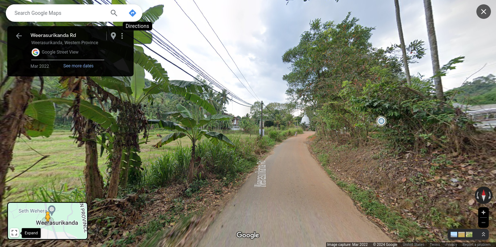

## Braemore

**Braemore** Grama Niladhari Division, **Nuwara Eliya** Divisional Secretariat Division, **Nuwara Eliya** District, **Central** Province

**Nuwara Eliya Maskeliya** Polling Division, **Nuwara-Eliya** Electoral District

Population: 2,335 (2012)

(**LK-2312335**/476P)

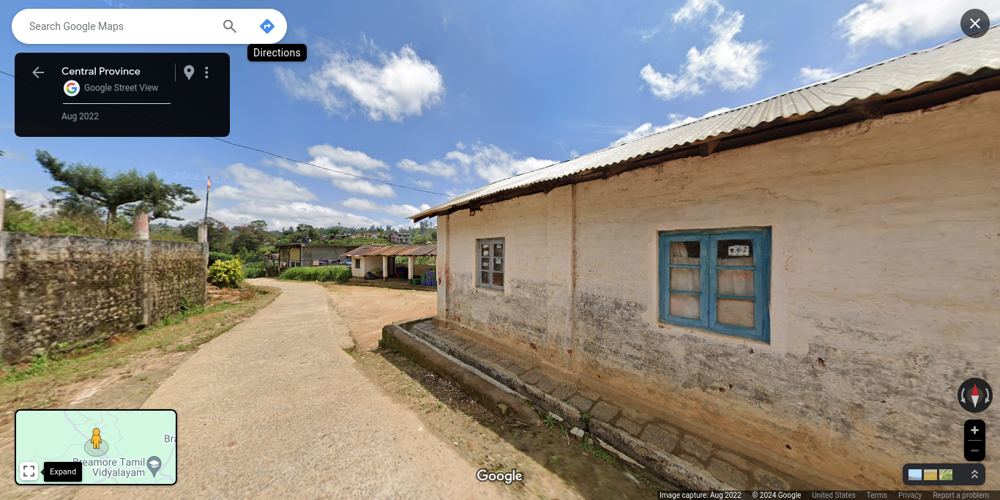

## Kerenvila Colony

**Kerenvila Colony** Grama Niladhari Division, **Akmeemana** Divisional Secretariat Division, **Galle** District, **Southern** Province

**Akmeemana** Polling Division, **Galle** Electoral District

Population: 1,174 (2012)

(**LK-3145210**/130F)

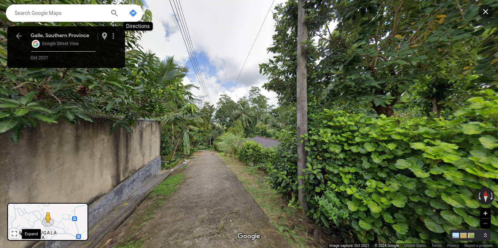

## Angulana South

**Angulana South** Grama Niladhari Division, **Moratuwa** Divisional Secretariat Division, **Colombo** District, **Western** Province

**Moratuwa** Polling Division, **Colombo** Electoral District

Population: 3,333 (2012)

(**LK-1133055**/547A)

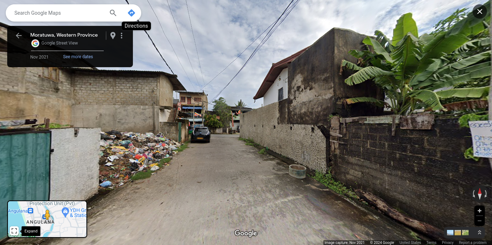

## Eachchamoddai

**Eachchamoddai** Grama Niladhari Division, **Jaffna** Divisional Secretariat Division, **Jaffna** District, **Northern** Province

**Jaffna** Polling Division, **Jaffna** Electoral District

Population: 2,823 (2012)

(**LK-4136030**/J/66)

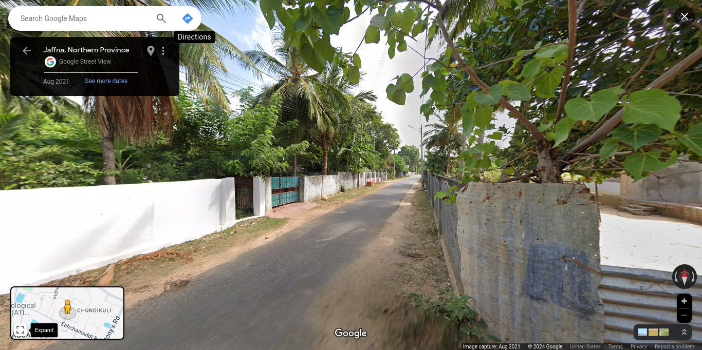

## Rambewa

**Rambewa** Grama Niladhari Division, **Rambewa** Divisional Secretariat Division, **Anuradhapura** District, **North Central** Province

**Medawachchiya** Polling Division, **Anuradhapura** Electoral District

Population: 1,568 (2012)

(**LK-7118150**/100)

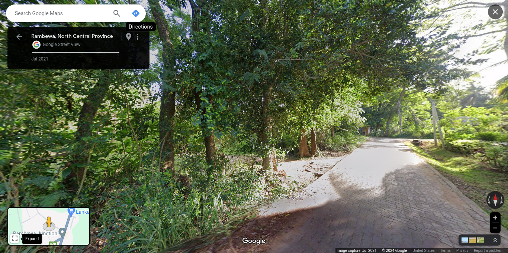

## Hendala South

**Hendala South** Grama Niladhari Division, **Wattala** Divisional Secretariat Division, **Gampaha** District, **Western** Province

**Wattala** Polling Division, **Gampaha** Electoral District

Population: 4,067 (2012)

(**LK-1218190**/172)

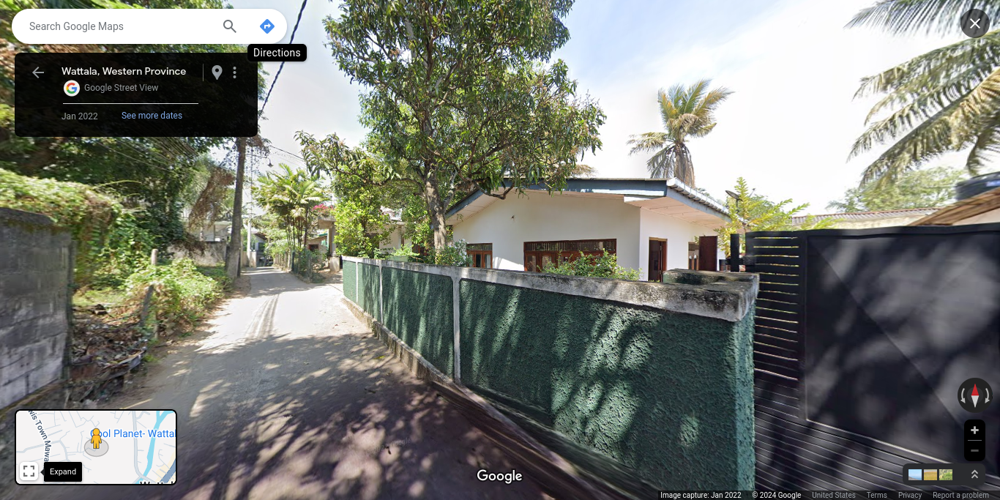

## Siyambalape South

**Siyambalape South** Grama Niladhari Division, **Biyagama** Divisional Secretariat Division, **Gampaha** District, **Western** Province

**Biyagama** Polling Division, **Gampaha** Electoral District

Population: 6,119 (2012)

(**LK-1239140**/274A)

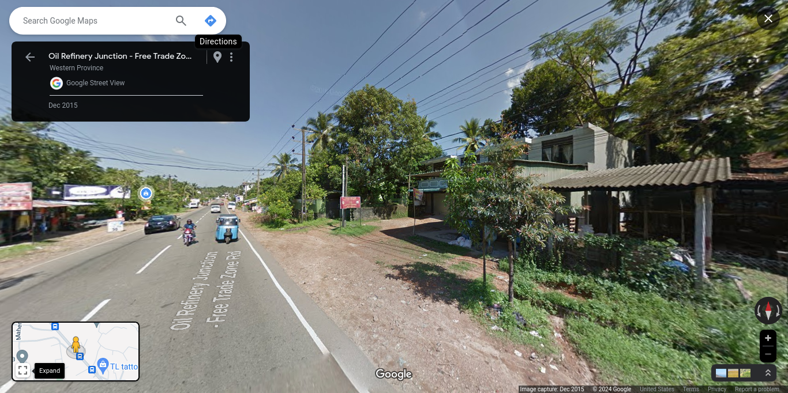

## Kombala

**Kombala** Grama Niladhari Division, **Imaduwa** Divisional Secretariat Division, **Galle** District, **Southern** Province

**Habaraduwa** Polling Division, **Galle** Electoral District

Population: 831 (2012)

(**LK-3151045**/174)

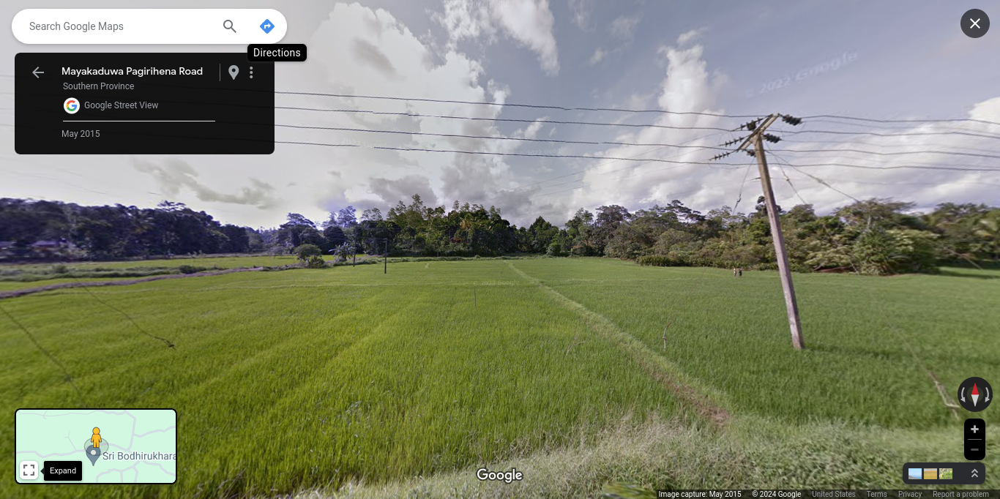

## Maharathenna West

**Maharathenna West** Grama Niladhari Division, **Kundasale** Divisional Secretariat Division, **Kandy** District, **Central** Province

**Kundasale** Polling Division, **Kandy** Electoral District

Population: 736 (2012)

(**LK-2127045**/675)

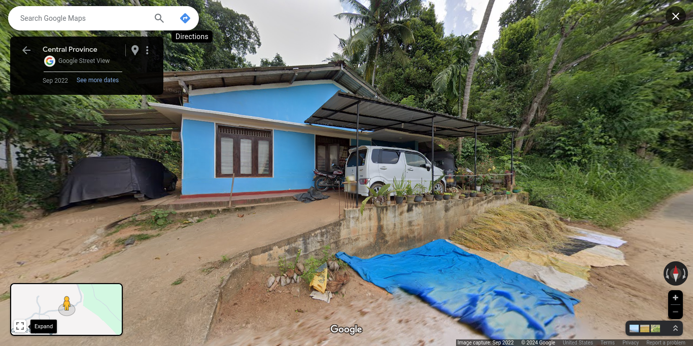

## pelmadulla Town

**pelmadulla Town** Grama Niladhari Division, **Pelmadulla** Divisional Secretariat Division, **Ratnapura** District, **Sabaragamuwa** Province

**Pelmadulla** Polling Division, **Ratnapura** Electoral District

Population: 2,677 (2012)

(**LK-9124125**/168A)

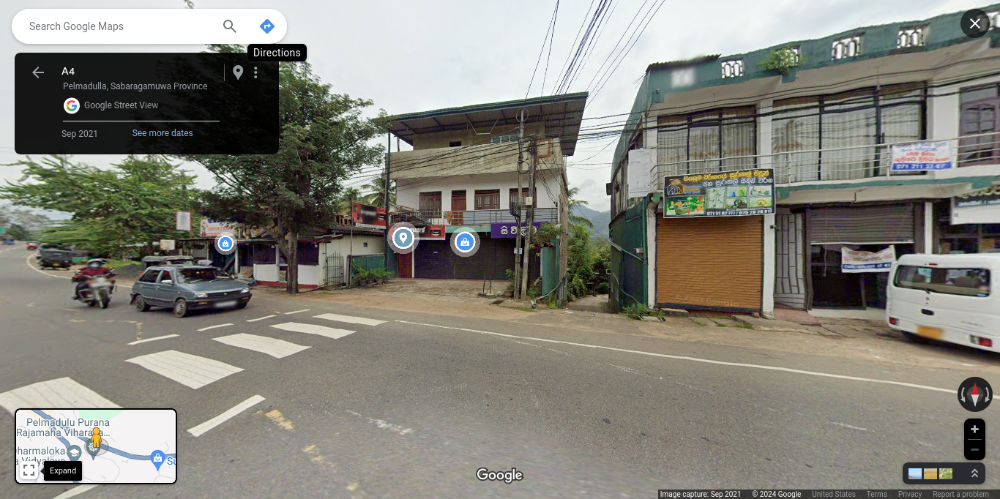

## Lakshapathiya South

**Lakshapathiya South** Grama Niladhari Division, **Moratuwa** Divisional Secretariat Division, **Colombo** District, **Western** Province

**Moratuwa** Polling Division, **Colombo** Electoral District

Population: 5,380 (2012)

(**LK-1133080**/550)

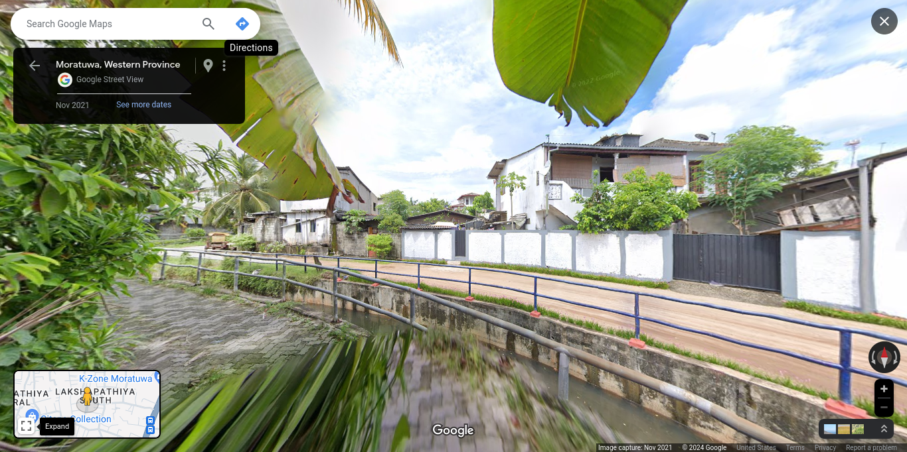

## Koralawella South

**Koralawella South** Grama Niladhari Division, **Moratuwa** Divisional Secretariat Division, **Colombo** District, **Western** Province

**Moratuwa** Polling Division, **Colombo** Electoral District

Population: 3,582 (2012)

(**LK-1133185**/554A)

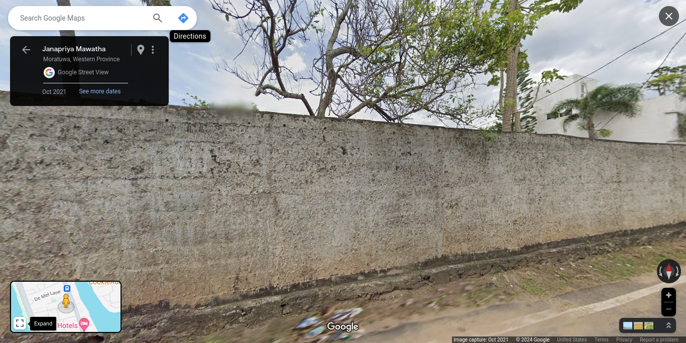

## Udaperuwa

**Udaperuwa** Grama Niladhari Division, **Bandarawela** Divisional Secretariat Division, **Badulla** District, **Uva** Province

**Bandarawela** Polling Division, **Badulla** Electoral District

Population: 1,636 (2012)

(**LK-8133080**/66B)

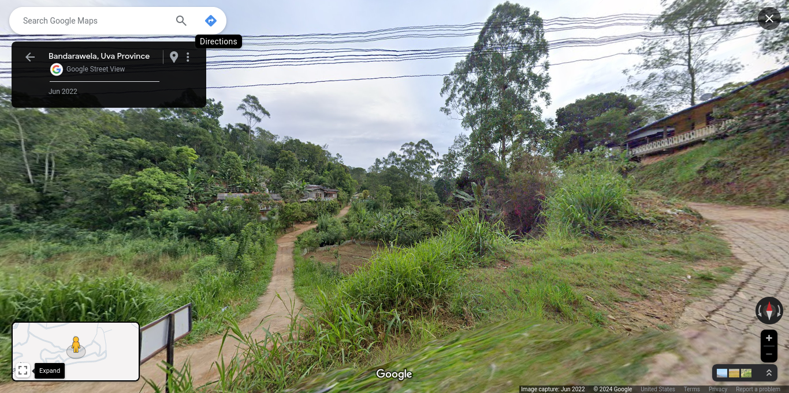

## Nawanagala

**Nawanagala** Grama Niladhari Division, **Udadumbara** Divisional Secretariat Division, **Kandy** District, **Central** Province

**Ududumbara** Polling Division, **Kandy** Electoral District

Population: 390 (2012)

(**LK-2118145**/848)

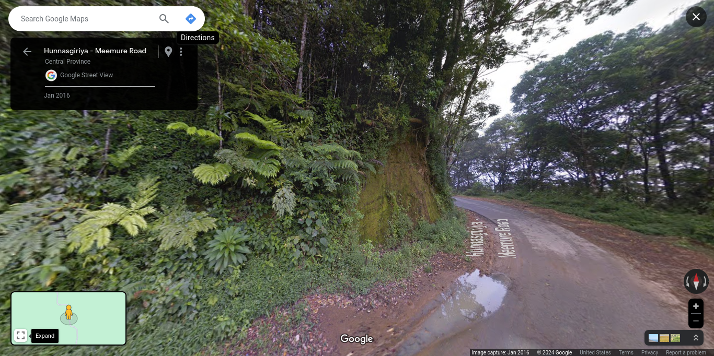

## Malayadikiramam 02

**Malayadikiramam 02** Grama Niladhari Division, **Samanthurai** Divisional Secretariat Division, **Ampara** District, **Eastern** Province

**Samanthurai** Polling Division, **Digamadulla** Electoral District

Population: 2,476 (2012)

(**LK-5218225**/79O)

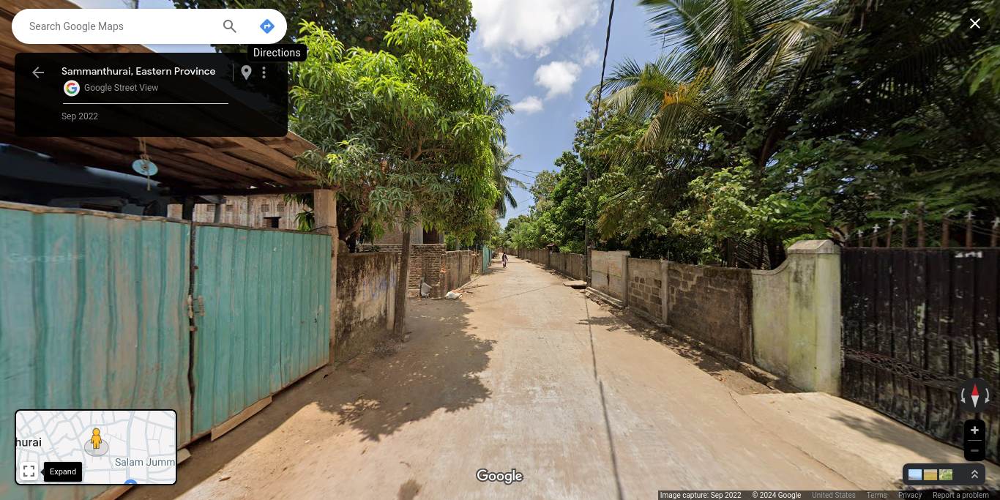

## Puthukudiyiruppu

**Puthukudiyiruppu** Grama Niladhari Division, **Mannar Town** Divisional Secretariat Division, **Mannar** District, **Northern** Province

**Mannar** Polling Division, **Vanni** Electoral District

Population: 1,776 (2012)

(**LK-4203070**/MN/61)

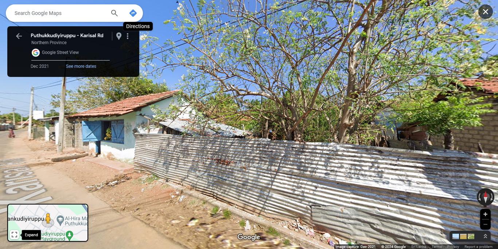

## Kalmunai  01D

**Kalmunai  01D** Grama Niladhari Division, **Kalmunai Tamil Division** Divisional Secretariat Division, **Ampara** District, **Eastern** Province

**Kalmunai** Polling Division, **Digamadulla** Electoral District

Population: 892 (2012)

(**LK-5221070**/KP/61/5)

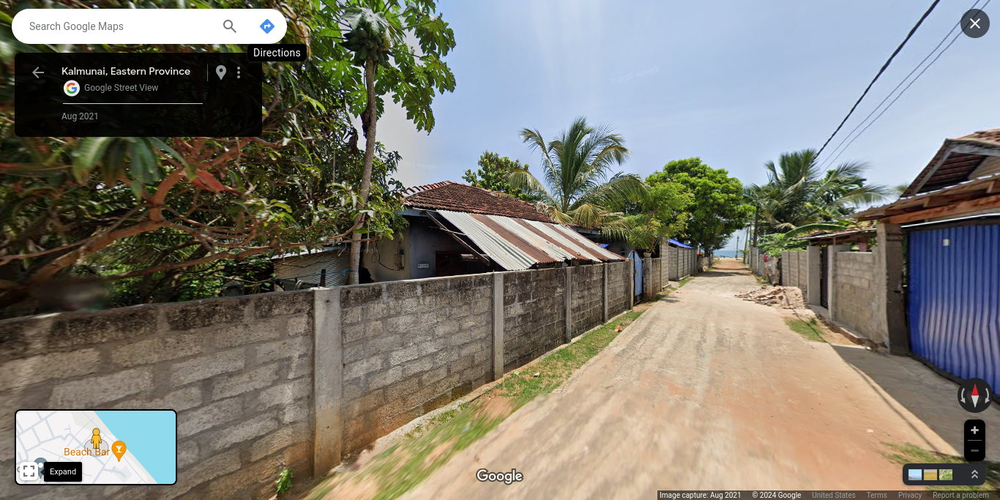

## Hene Watta

**Hene Watta** Grama Niladhari Division, **Mihinthale** Divisional Secretariat Division, **Anuradhapura** District, **North Central** Province

**Anuradhapura West** Polling Division, **Anuradhapura** Electoral District

Population: 2,126 (2012)

(**LK-7130040**/572)

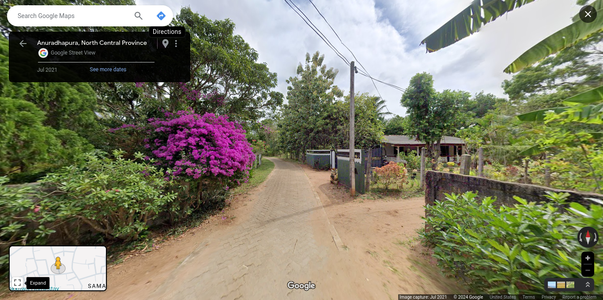

## Kekanadura South

**Kekanadura South** Grama Niladhari Division, **Matara Four Gravets** Divisional Secretariat Division, **Matara** District, **Southern** Province

**Matara** Polling Division, **Matara** Electoral District

Population: 2,835 (2012)

(**LK-3242150**/447D)

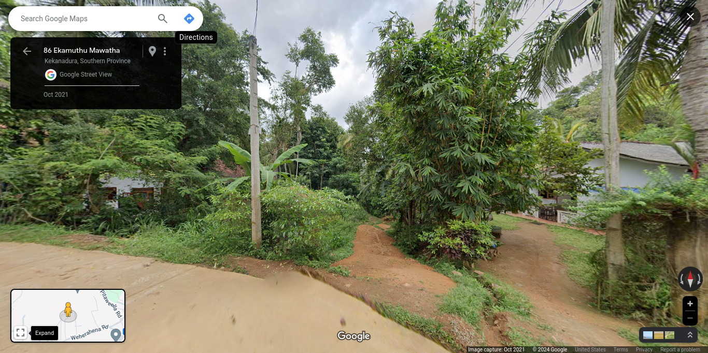

## Korasagalla

**Korasagalla** Grama Niladhari Division, **Kekirawa** Divisional Secretariat Division, **Anuradhapura** District, **North Central** Province

**Kekirawa** Polling Division, **Anuradhapura** Electoral District

Population: 674 (2012)

(**LK-7154180**/639)

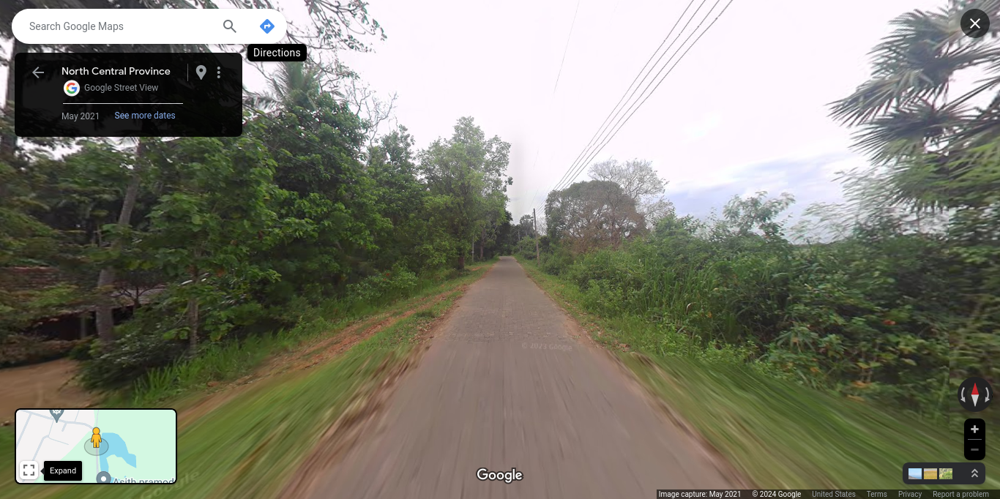

## Eladoowa

**Eladoowa** Grama Niladhari Division, **Dodangoda** Divisional Secretariat Division, **Kalutara** District, **Western** Province

**Mathugama** Polling Division, **Kalutara** Electoral District

Population: 1,551 (2012)

(**LK-1327220**/799A)

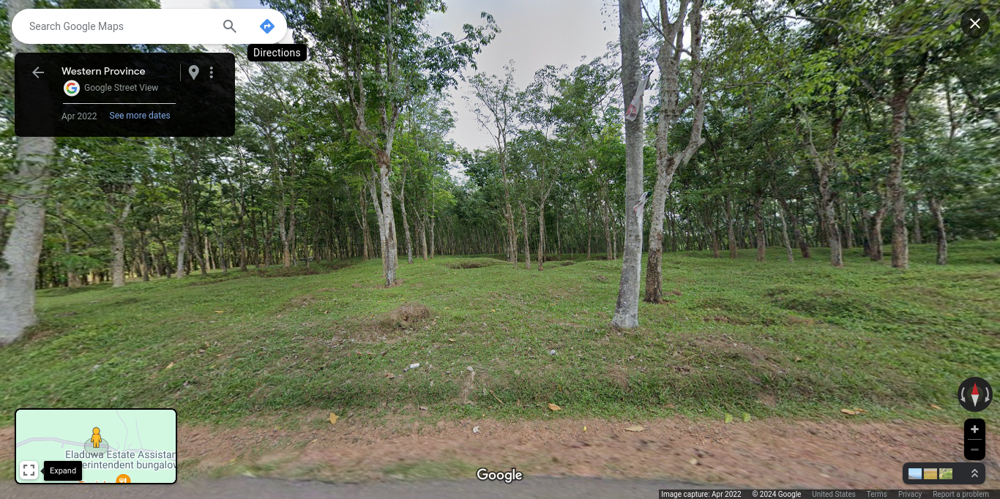

## Walpola West

**Walpola West** Grama Niladhari Division, **Ja-Ela** Divisional Secretariat Division, **Gampaha** District, **Western** Province

**Ja Ela** Polling Division, **Gampaha** Electoral District

Population: 4,332 (2012)

(**LK-1221250**/212)

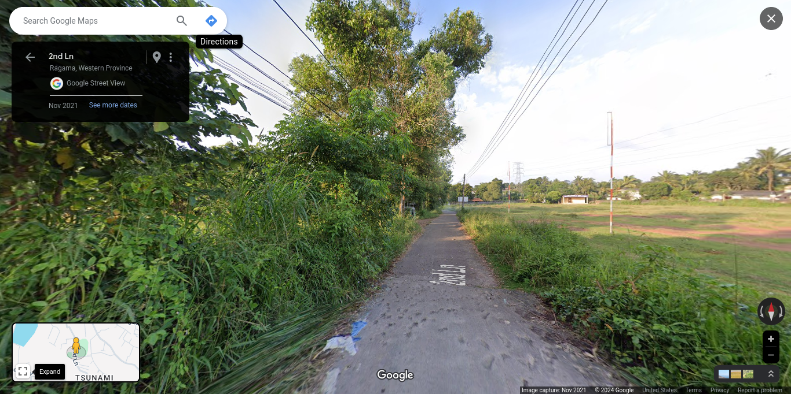

## Welivita Ihala North

**Welivita Ihala North** Grama Niladhari Division, **Hatharaliyadda** Divisional Secretariat Division, **Kandy** District, **Central** Province

**Galagedara** Polling Division, **Kandy** Electoral District

Population: 548 (2012)

(**LK-2134120**/340)

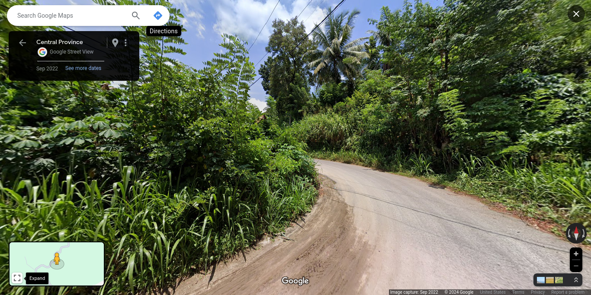

## Wattalpola

**Wattalpola** Grama Niladhari Division, **Panadura** Divisional Secretariat Division, **Kalutara** District, **Western** Province

**Panadura** Polling Division, **Kalutara** Electoral District

Population: 4,273 (2012)

(**LK-1303065**/674A)

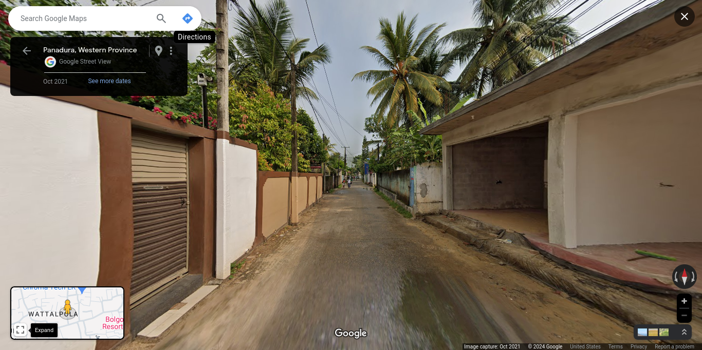

## Kadirana North

**Kadirana North** Grama Niladhari Division, **Katana** Divisional Secretariat Division, **Gampaha** District, **Western** Province

**Katana** Polling Division, **Gampaha** Electoral District

Population: 5,611 (2012)

(**LK-1206100**/93A)

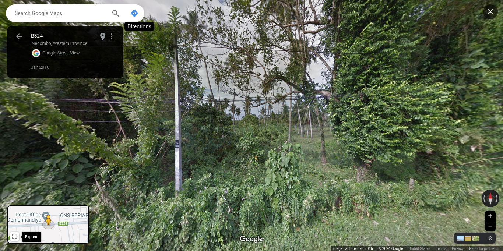

## Eladetta West

**Eladetta West** Grama Niladhari Division, **Udunuwara** Divisional Secretariat Division, **Kandy** District, **Central** Province

**Udunuwara** Polling Division, **Kandy** Electoral District

Population: 1,122 (2012)

(**LK-2139385**/53)

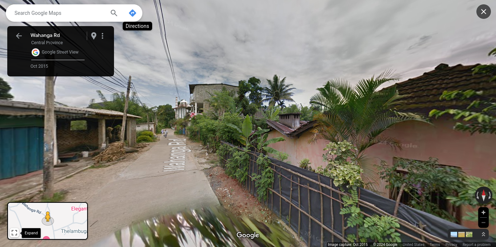

## Hewavissa West

**Hewavissa West** Grama Niladhari Division, **Pathahewaheta** Divisional Secretariat Division, **Kandy** District, **Central** Province

**Hewaheta** Polling Division, **Kandy** Electoral District

Population: 589 (2012)

(**LK-2145310**/1017)

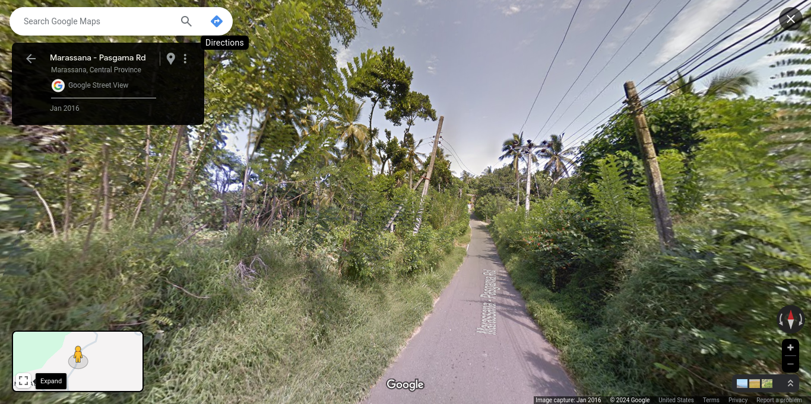

## Wewelketiya

**Wewelketiya** Grama Niladhari Division, **Rambewa** Divisional Secretariat Division, **Anuradhapura** District, **North Central** Province

**Medawachchiya** Polling Division, **Anuradhapura** Electoral District

Population: 1,024 (2012)

(**LK-7118080**/82)

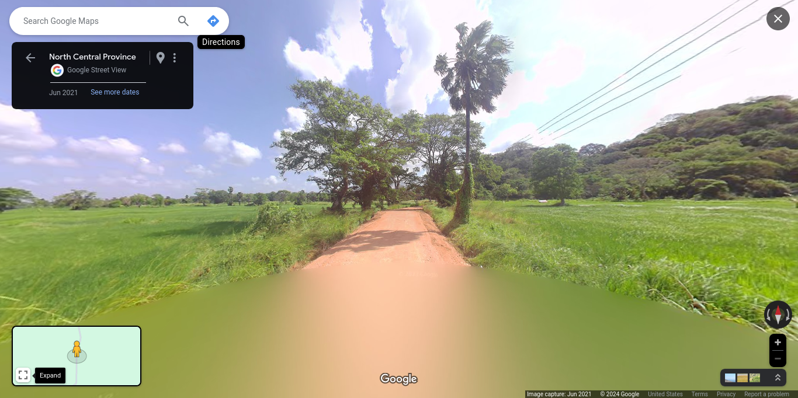

## Godagama South

**Godagama South** Grama Niladhari Division, **Homagama** Divisional Secretariat Division, **Colombo** District, **Western** Province

**Homagama** Polling Division, **Colombo** Electoral District

Population: 3,154 (2012)

(**LK-1112150**/483A)

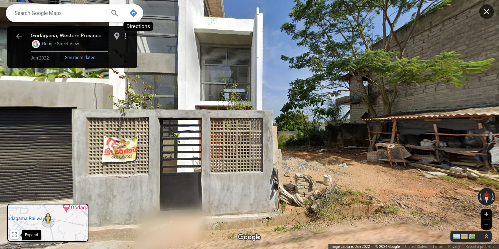

## Kinchigune West

**Kinchigune West** Grama Niladhari Division, **Weeraketiya** Divisional Secretariat Division, **Hambantota** District, **Southern** Province

**Mulkirigala** Polling Division, **Hambantota** Electoral District

Population: 353 (2012)

(**LK-3321145**/404)

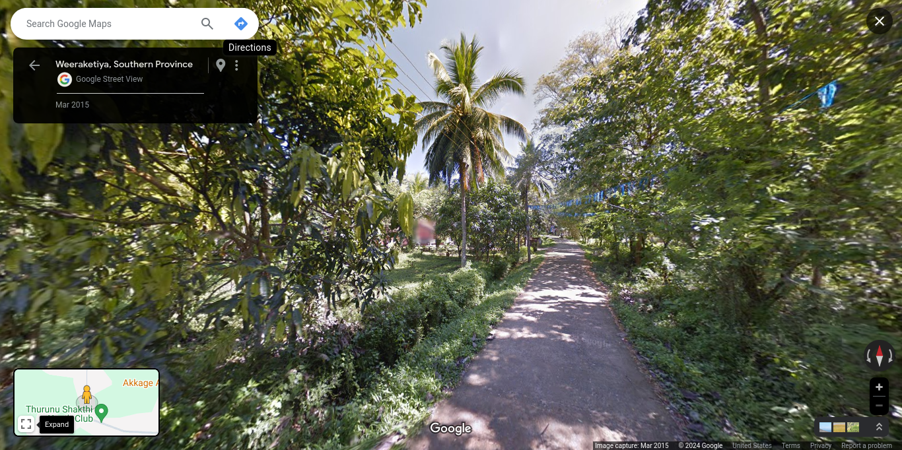

## Aluth Kadadugama

**Aluth Kadadugama** Grama Niladhari Division, **Palagala** Divisional Secretariat Division, **Anuradhapura** District, **North Central** Province

**Kekirawa** Polling Division, **Anuradhapura** Electoral District

Population: 1,159 (2012)

(**LK-7166085**/684)

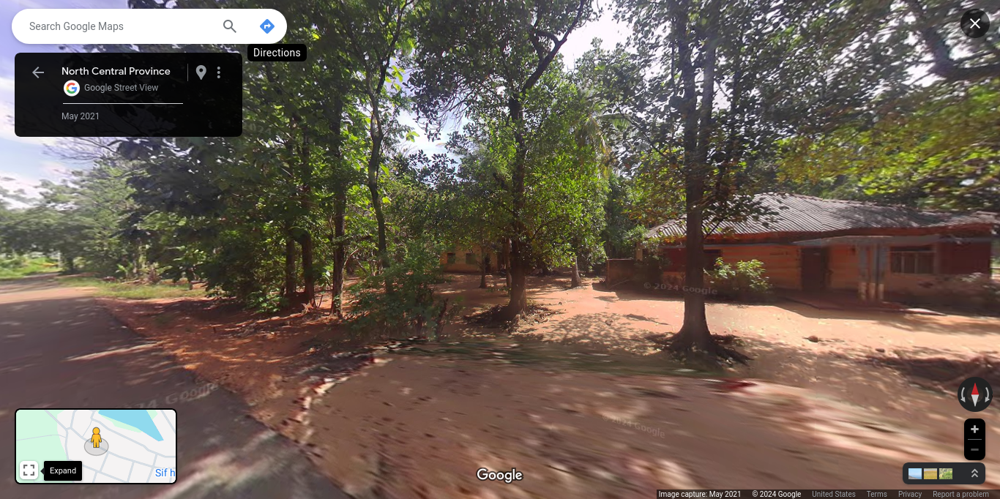

## Ranala

**Ranala** Grama Niladhari Division, **Kaduwela** Divisional Secretariat Division, **Colombo** District, **Western** Province

**Kaduwela** Polling Division, **Colombo** Electoral District

Population: 4,842 (2012)

(**LK-1109095**/469)

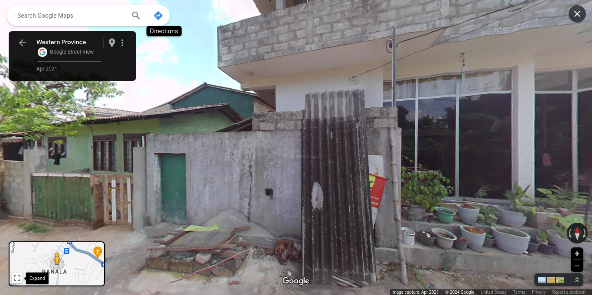

## Bulumulla

**Bulumulla** Grama Niladhari Division, **Yatinuwara** Divisional Secretariat Division, **Kandy** District, **Central** Province

**Yatinuwara** Polling Division, **Kandy** Electoral District

Population: 1,288 (2012)

(**LK-2136390**/125)

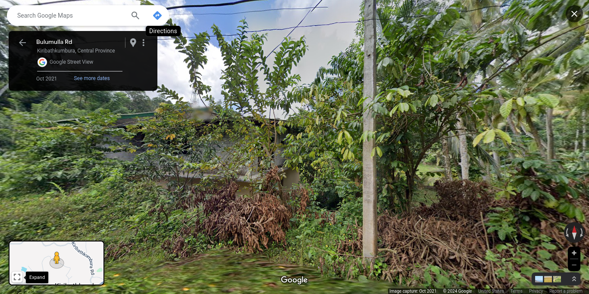

## Jayamalapura

**Jayamalapura** Grama Niladhari Division, **Udapalatha** Divisional Secretariat Division, **Kandy** District, **Central** Province

**Gampola** Polling Division, **Kandy** Electoral District

Population: 1,524 (2012)

(**LK-2151135**/1116)

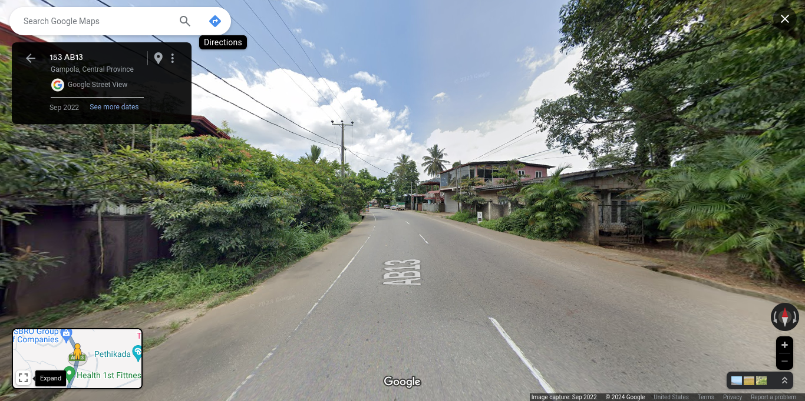

## Bamunugedara

**Bamunugedara** Grama Niladhari Division, **Kurunegala** Divisional Secretariat Division, **Kurunegala** District, **North Western** Province

**Kurunegala** Polling Division, **Kurunegala** Electoral District

Population: 2,896 (2012)

(**LK-6154095**/797)

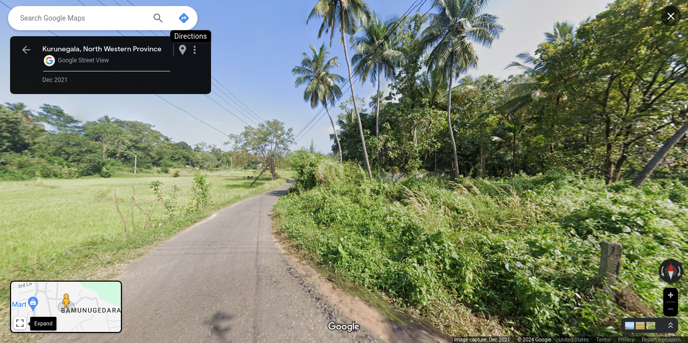

## Gammeddegoda

**Gammeddegoda** Grama Niladhari Division, **Hikkaduwa** Divisional Secretariat Division, **Galle** District, **Southern** Province

**Ratgama** Polling Division, **Galle** Electoral District

Population: 1,055 (2012)

(**LK-3136430**/47)

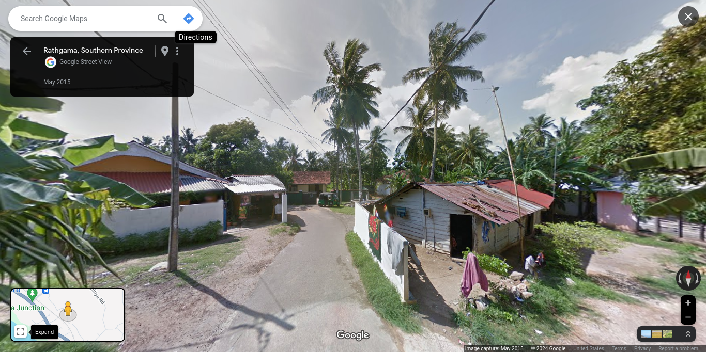

## Dedigamuwa

**Dedigamuwa** Grama Niladhari Division, **Kaduwela** Divisional Secretariat Division, **Colombo** District, **Western** Province

**Kaduwela** Polling Division, **Colombo** Electoral District

Population: 2,105 (2012)

(**LK-1109100**/480A)

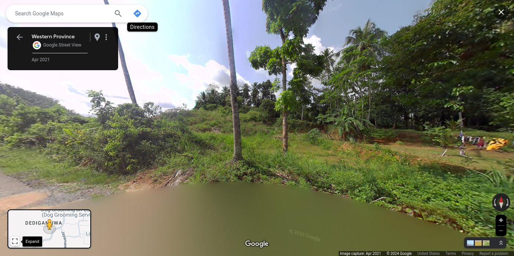

## Nivandama North

**Nivandama North** Grama Niladhari Division, **Ja-Ela** Divisional Secretariat Division, **Gampaha** District, **Western** Province

**Ja Ela** Polling Division, **Gampaha** Electoral District

Population: 3,458 (2012)

(**LK-1221090**/207)

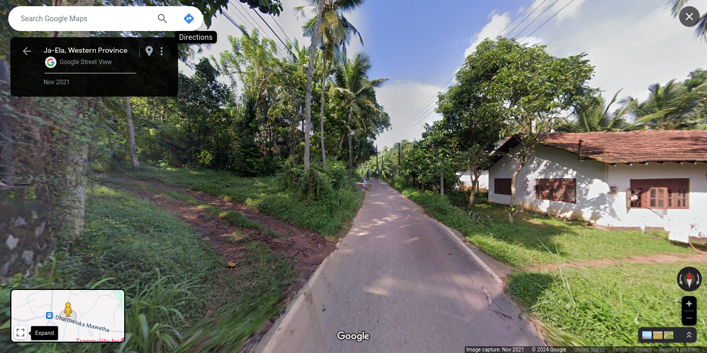

## Munagama West

**Munagama West** Grama Niladhari Division, **Horana** Divisional Secretariat Division, **Kalutara** District, **Western** Province

**Horana** Polling Division, **Kalutara** Electoral District

Population: 1,129 (2012)

(**LK-1309265**/616)

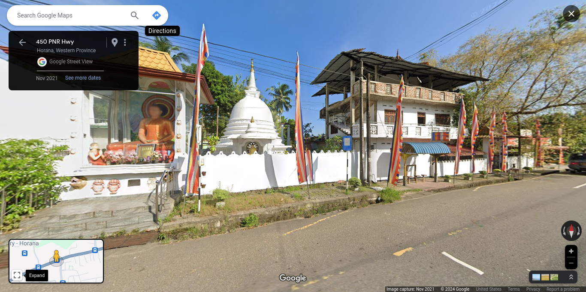

## Divithura

**Divithura** Grama Niladhari Division, **Athuraliya** Divisional Secretariat Division, **Matara** District, **Southern** Province

**Akuressa** Polling Division, **Matara** Electoral District

Population: 979 (2012)

(**LK-3215025**/305A)

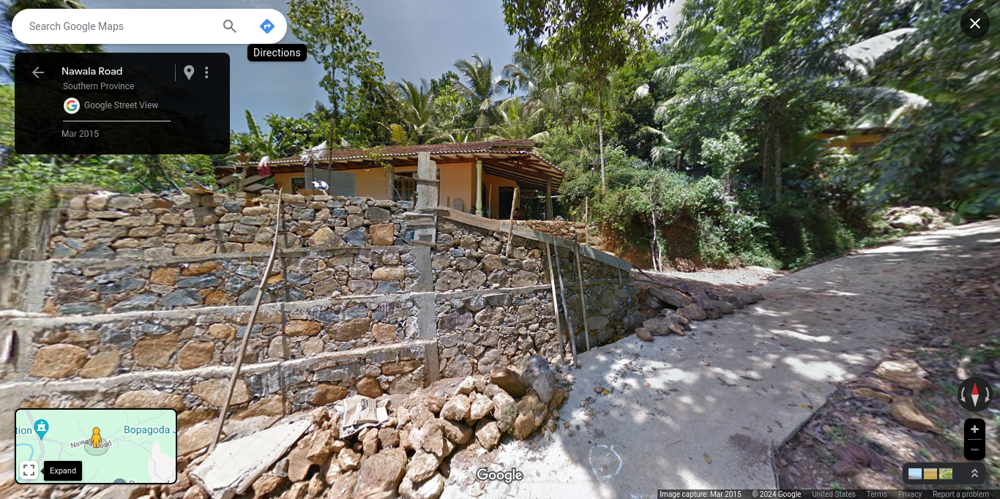

## Kuruvithenna

**Kuruvithenna** Grama Niladhari Division, **Rideemaliyadda** Divisional Secretariat Division, **Badulla** District, **Uva** Province

**Mahiyanganaya** Polling Division, **Badulla** Electoral District

Population: 1,482 (2012)

(**LK-8106185**/13A)

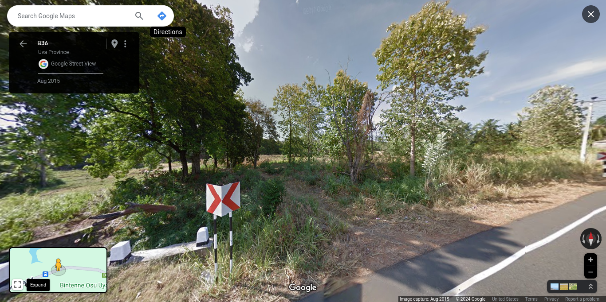

## Bopitiyathuduwa

**Bopitiyathuduwa** Grama Niladhari Division, **Wattala** Divisional Secretariat Division, **Gampaha** District, **Western** Province

**Wattala** Polling Division, **Gampaha** Electoral District

Population: 2,287 (2012)

(**LK-1218025**/165A)

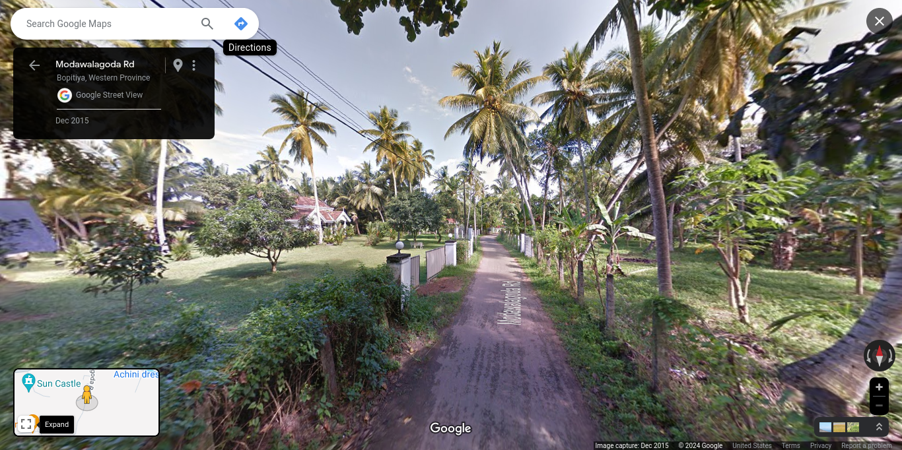

## Dikovita

**Dikovita** Grama Niladhari Division, **Wattala** Divisional Secretariat Division, **Gampaha** District, **Western** Province

**Wattala** Polling Division, **Gampaha** Electoral District

Population: 1,623 (2012)

(**LK-1218150**/168B)

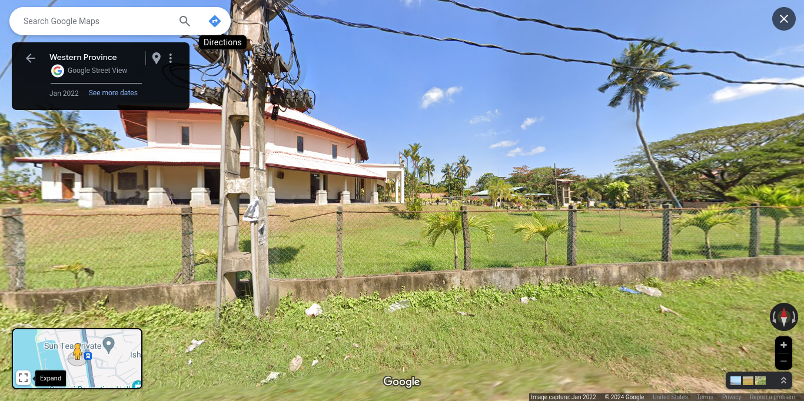

## Malwana

**Malwana** Grama Niladhari Division, **Wariyapola** Divisional Secretariat Division, **Kurunegala** District, **North Western** Province

**Wariyapola** Polling Division, **Kurunegala** Electoral District

Population: 1,881 (2012)

(**LK-6136280**/1235)

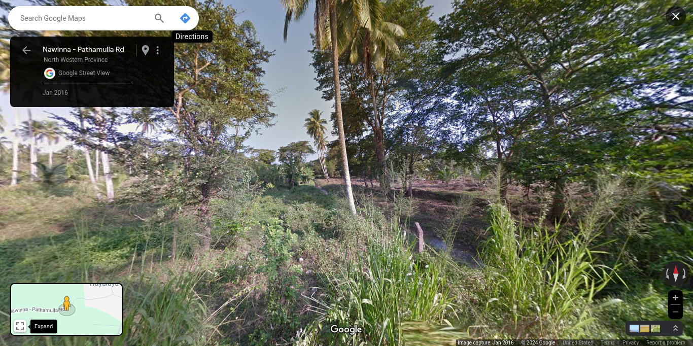

## Ashokaramaya

**Ashokaramaya** Grama Niladhari Division, **Nuwaragam Palatha Central** Divisional Secretariat Division, **Anuradhapura** District, **North Central** Province

**Anuradhapura West** Polling Division, **Anuradhapura** Electoral District

Population: 1,216 (2012)

(**LK-7115085**/301)

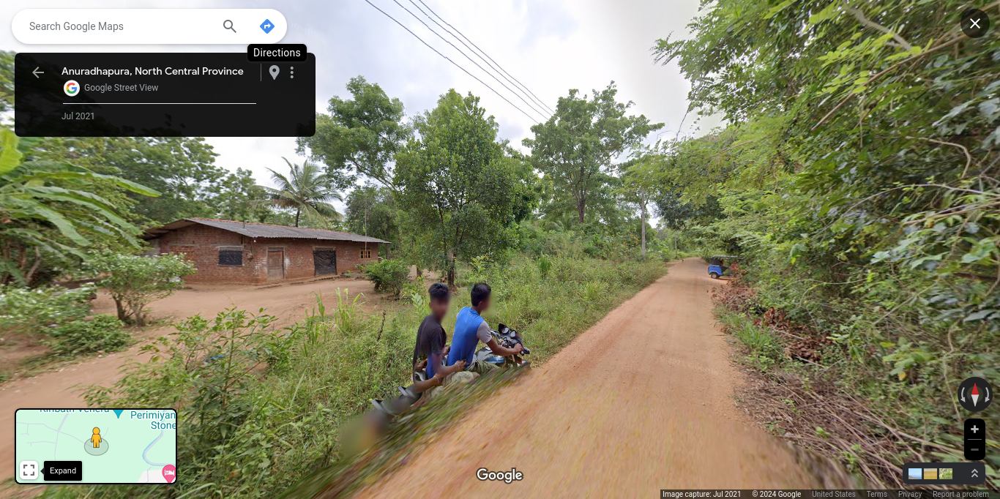

## Sri Saranankara

**Sri Saranankara** Grama Niladhari Division, **Dehiwala** Divisional Secretariat Division, **Colombo** District, **Western** Province

**Dehiwala** Polling Division, **Colombo** Electoral District

Population: 6,367 (2012)

(**LK-1130005**/538C)

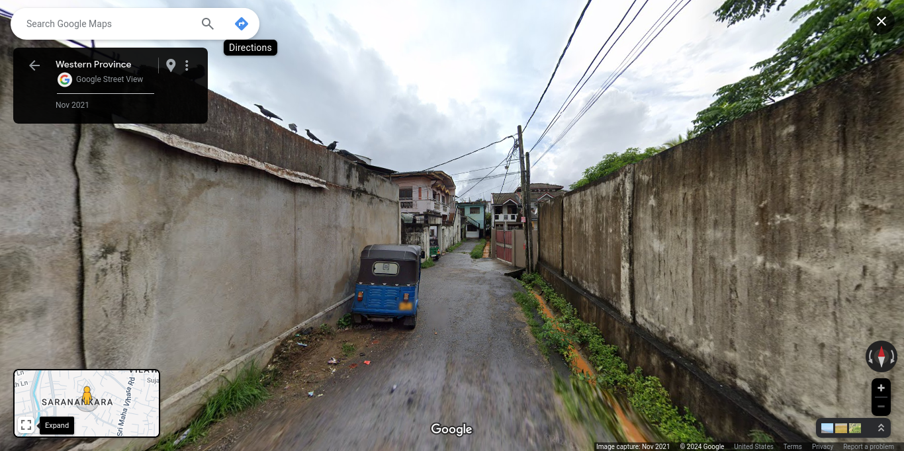

## Aluthwatta

**Aluthwatta** Grama Niladhari Division, **Nagoda** Divisional Secretariat Division, **Galle** District, **Southern** Province

**Baddegama** Polling Division, **Galle** Electoral District

Population: 2,208 (2012)

(**LK-3124240**/219D)

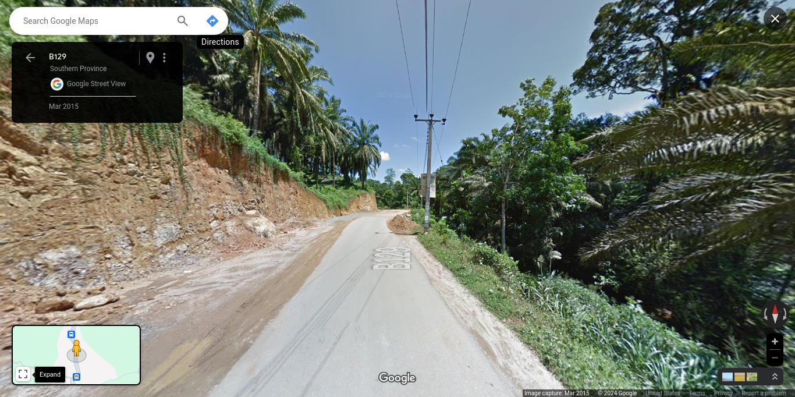

## Marassana

**Marassana** Grama Niladhari Division, **Pathahewaheta** Divisional Secretariat Division, **Kandy** District, **Central** Province

**Hewaheta** Polling Division, **Kandy** Electoral District

Population: 786 (2012)

(**LK-2145235**/1007)

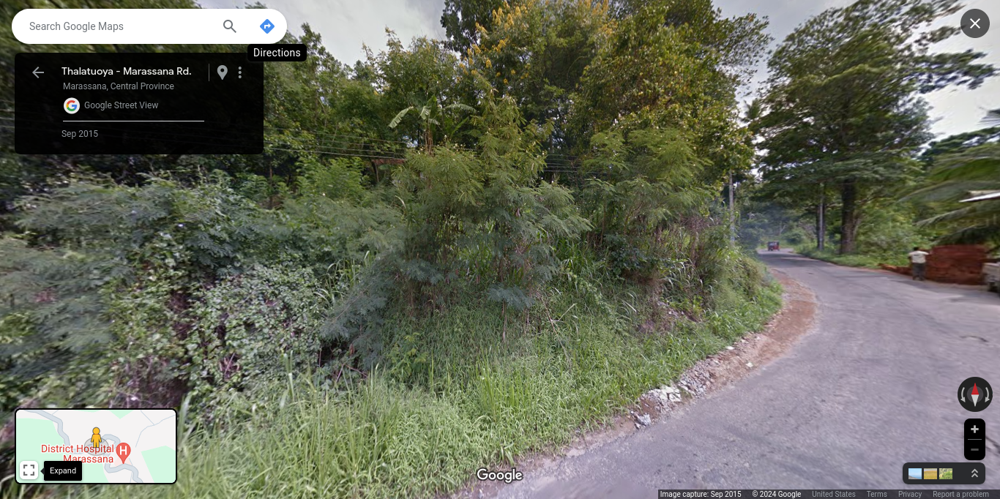

## Jinthupitiya

**Jinthupitiya** Grama Niladhari Division, **Colombo** Divisional Secretariat Division, **Colombo** District, **Western** Province

**Colombo Central** Polling Division, **Colombo** Electoral District

Population: 8,110 (2012)

(**LK-1103060**/)

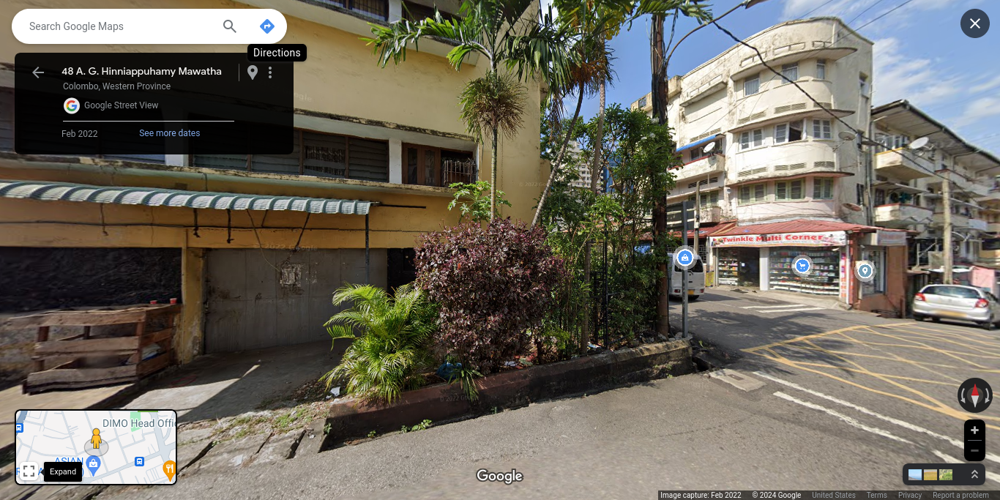

## Thunnalai North

**Thunnalai North** Grama Niladhari Division, **Vadamaradchi North (Point Pedro)** Divisional Secretariat Division, **Jaffna** District, **Northern** Province

**Point Pedro** Polling Division, **Jaffna** Electoral District

Population: 845 (2012)

(**LK-4127175**/J/417)

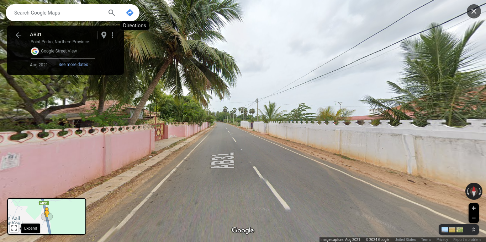

## Egodakanda

**Egodakanda** Grama Niladhari Division, **Walapane** Divisional Secretariat Division, **Nuwara Eliya** District, **Central** Province

**Walapane** Polling Division, **Nuwara-Eliya** Electoral District

Population: 934 (2012)

(**LK-2309255**/516B)

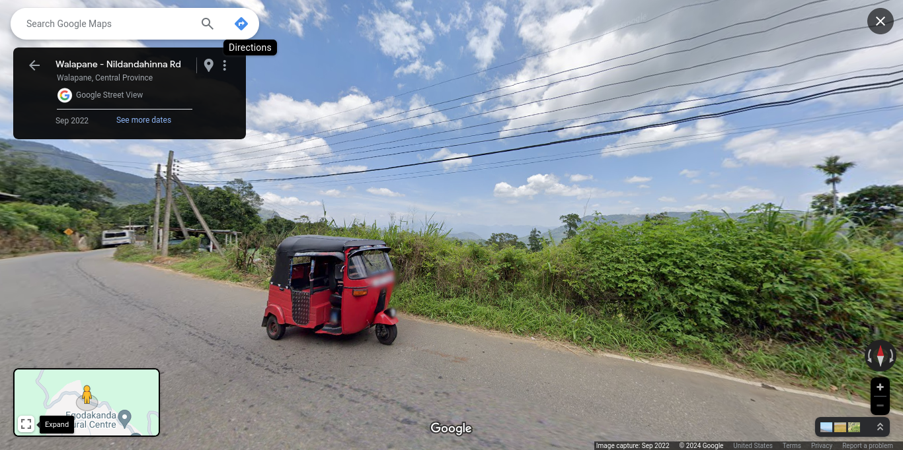

## Ambakadawara

**Ambakadawara** Grama Niladhari Division, **Wariyapola** Divisional Secretariat Division, **Kurunegala** District, **North Western** Province

**Wariyapola** Polling Division, **Kurunegala** Electoral District

Population: 961 (2012)

(**LK-6136205**/1263)

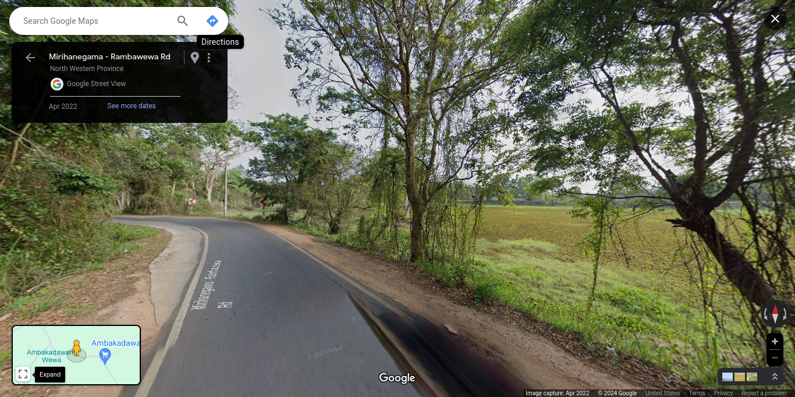

## Thotagamuwa

**Thotagamuwa** Grama Niladhari Division, **Hikkaduwa** Divisional Secretariat Division, **Galle** District, **Southern** Province

**Ratgama** Polling Division, **Galle** Electoral District

Population: 1,078 (2012)

(**LK-3136190**/61)

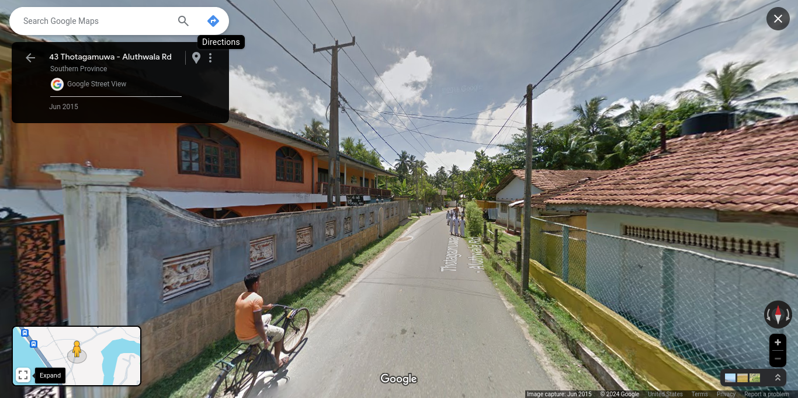

## Udugama

**Udugama** Grama Niladhari Division, **Rambukkana** Divisional Secretariat Division, **Kegalle** District, **Sabaragamuwa** Province

**Rambukkana** Polling Division, **Kegalle** Electoral District

Population: 568 (2012)

(**LK-9203185**/04C)

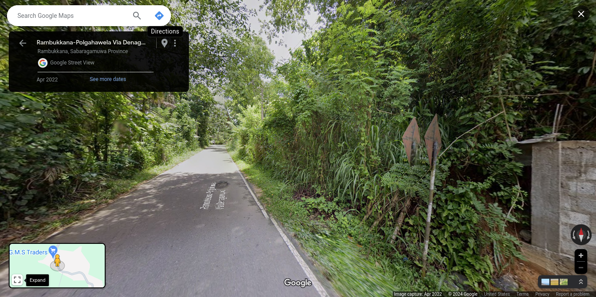

## Alawwa South

**Alawwa South** Grama Niladhari Division, **Alawwa** Divisional Secretariat Division, **Kurunegala** District, **North Western** Province

**Dambadeniya** Polling Division, **Kurunegala** Electoral District

Population: 2,064 (2012)

(**LK-6184195**/1001)

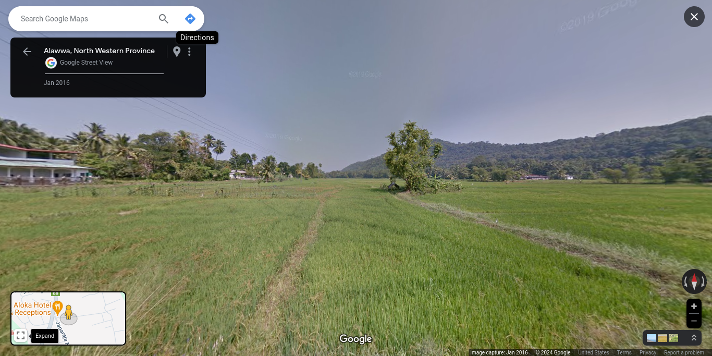

## Nambadaluwa West

**Nambadaluwa West** Grama Niladhari Division, **Attanagalla** Divisional Secretariat Division, **Gampaha** District, **Western** Province

**Attanagalla** Polling Division, **Gampaha** Electoral District

Population: 408 (2012)

(**LK-1227195**/348/B)

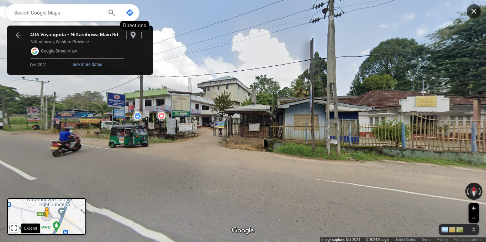

## Kumarimulla

**Kumarimulla** Grama Niladhari Division, **Dompe** Divisional Secretariat Division, **Gampaha** District, **Western** Province

**Dompe** Polling Division, **Gampaha** Electoral District

Population: 1,567 (2012)

(**LK-1230450**/419)

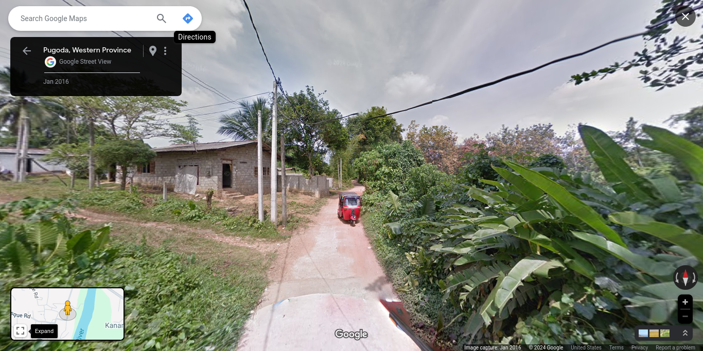

## Kerawalapitiya

**Kerawalapitiya** Grama Niladhari Division, **Wattala** Divisional Secretariat Division, **Gampaha** District, **Western** Province

**Wattala** Polling Division, **Gampaha** Electoral District

Population: 11,686 (2012)

(**LK-1218135**/171)

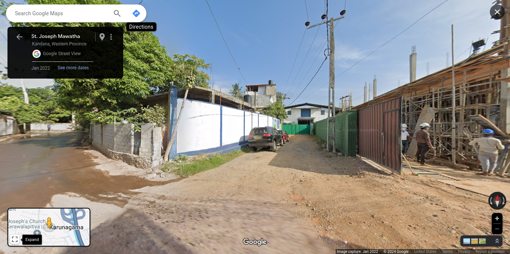

## Wataddara South

**Wataddara South** Grama Niladhari Division, **Attanagalla** Divisional Secretariat Division, **Gampaha** District, **Western** Province

**Attanagalla** Polling Division, **Gampaha** Electoral District

Population: 1,027 (2012)

(**LK-1227160**/332/A)

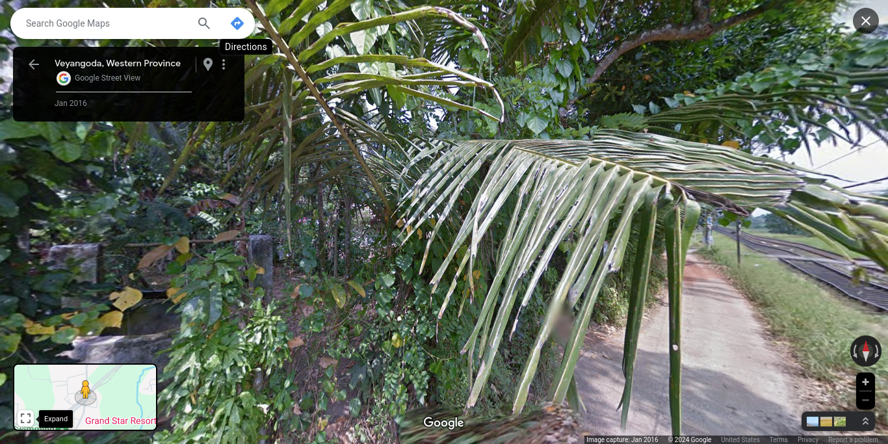

## Mawathupola

**Mawathupola** Grama Niladhari Division, **Akurana** Divisional Secretariat Division, **Kandy** District, **Central** Province

**Harispattuwa** Polling Division, **Kandy** Electoral District

Population: 2,087 (2012)

(**LK-2109035**/580)

## Naotunna Central

**Naotunna Central** Grama Niladhari Division, **Devinuwara** Divisional Secretariat Division, **Matara** District, **Southern** Province

**Devinuwara** Polling Division, **Matara** Electoral District

Population: 715 (2012)

(**LK-3245085**/442A)

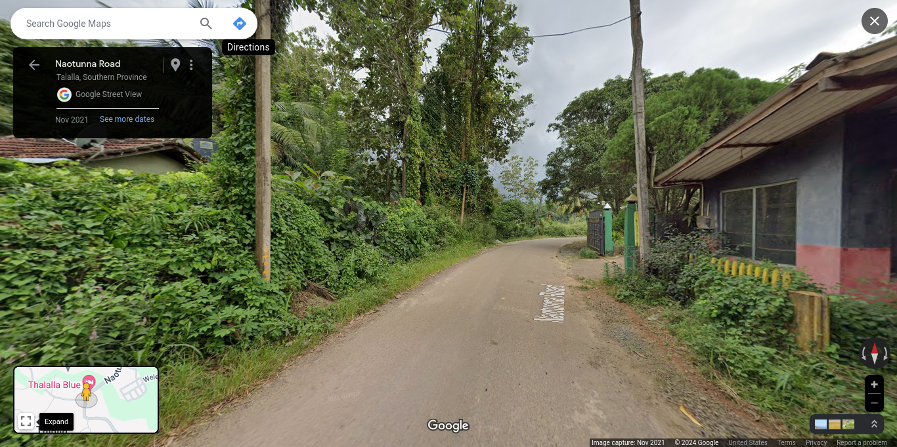

## Nakuttiya

**Nakuttiya** Grama Niladhari Division, **Matara Four Gravets** Divisional Secretariat Division, **Matara** District, **Southern** Province

**Matara** Polling Division, **Matara** Electoral District

Population: 1,197 (2012)

(**LK-3242165**/430B)

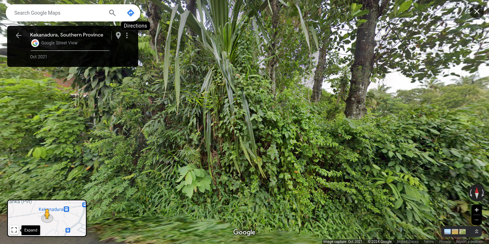

## Kirigampamunuwa

**Kirigampamunuwa** Grama Niladhari Division, **Homagama** Divisional Secretariat Division, **Colombo** District, **Western** Province

**Homagama** Polling Division, **Colombo** Electoral District

Population: 3,189 (2012)

(**LK-1112305**/588)

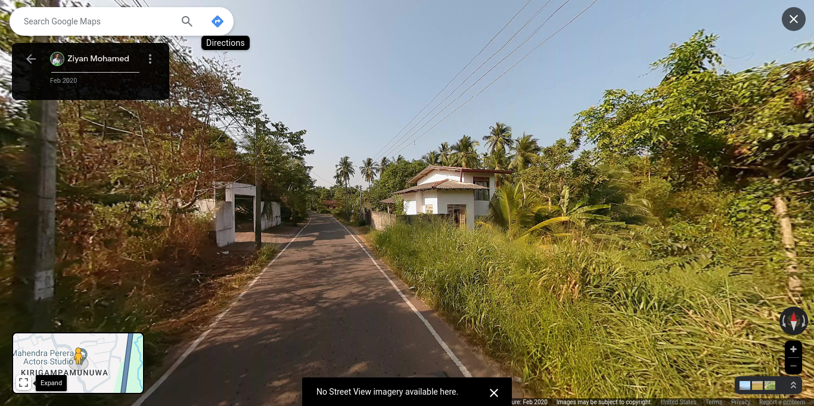

## Ethgala  East

**Ethgala  East** Grama Niladhari Division, **Ganga Ihala Korale** Divisional Secretariat Division, **Kandy** District, **Central** Province

**Nawalapitiya** Polling Division, **Kandy** Electoral District

Population: 1,866 (2012)

(**LK-2154125**/1074)

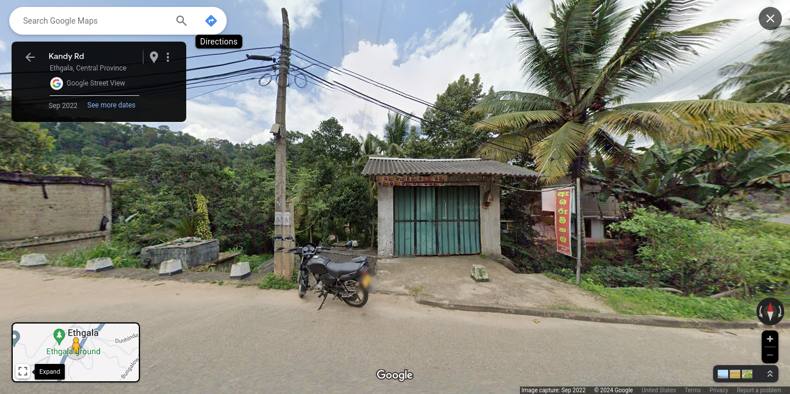

## Kimbulapitiya West

**Kimbulapitiya West** Grama Niladhari Division, **Katana** Divisional Secretariat Division, **Gampaha** District, **Western** Province

**Katana** Polling Division, **Gampaha** Electoral District

Population: 2,621 (2012)

(**LK-1206155**/92B)

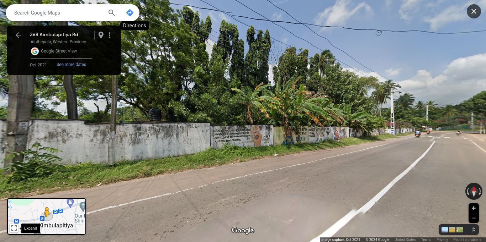

## Embaraluwa South 2

**Embaraluwa South 2** Grama Niladhari Division, **Gampaha** Divisional Secretariat Division, **Gampaha** District, **Western** Province

**Gampaha** Polling Division, **Gampaha** Electoral District

Population: 2,549 (2012)

(**LK-1224505**/242C)

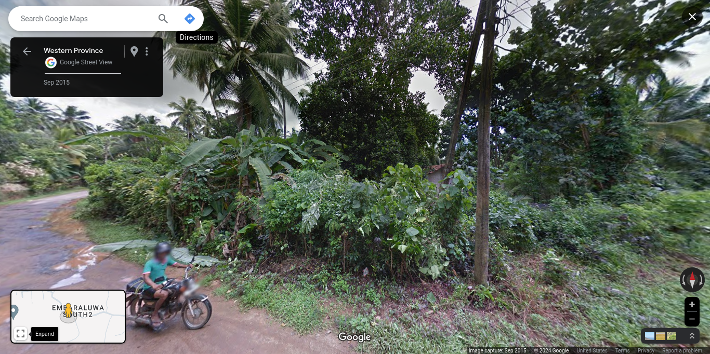

## Sivapuram

**Sivapuram** Grama Niladhari Division, **Manthai East** Divisional Secretariat Division, **Mullaitivu** District, **Northern** Province

**Mullaitivu** Polling Division, **Vanni** Electoral District

Population: 185 (2012)

(**LK-4406065**/MU/005)

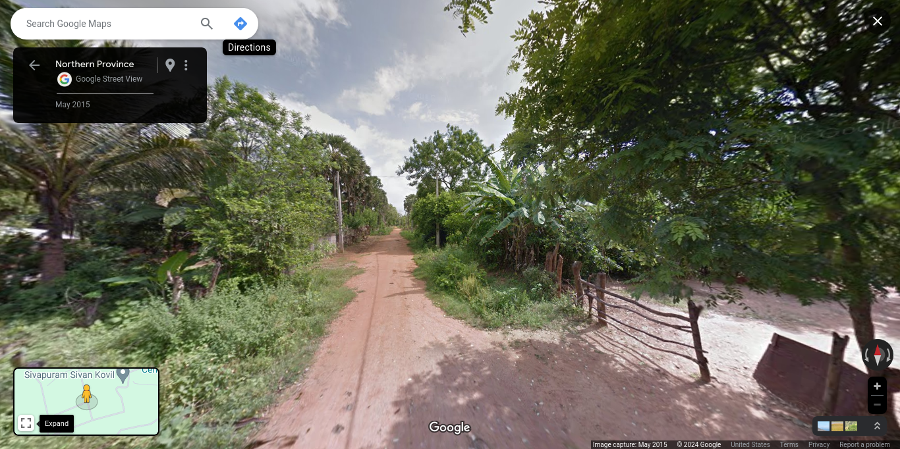

## Hetti  Weediya

**Hetti  Weediya** Grama Niladhari Division, **Weligama** Divisional Secretariat Division, **Matara** District, **Southern** Province

**Weligama** Polling Division, **Matara** Electoral District

Population: 2,397 (2012)

(**LK-3239055**/382B)

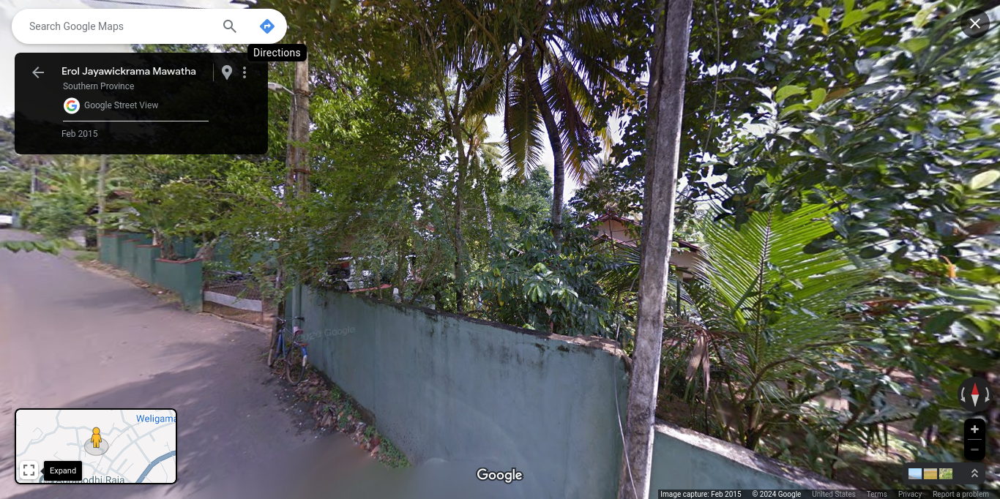

## Thekkawatta

**Thekkawatta** Grama Niladhari Division, **Kalutara** Divisional Secretariat Division, **Kalutara** District, **Western** Province

**Kalutara** Polling Division, **Kalutara** Electoral District

Population: 3,828 (2012)

(**LK-1321225**/723F)

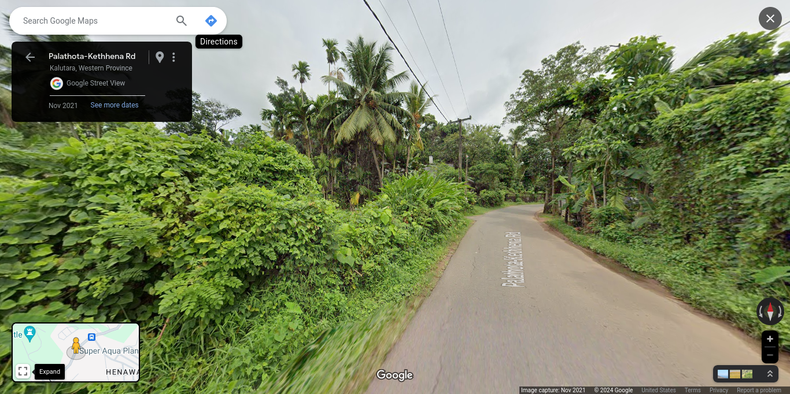

## Kulupana

**Kulupana** Grama Niladhari Division, **Horana** Divisional Secretariat Division, **Kalutara** District, **Western** Province

**Horana** Polling Division, **Kalutara** Electoral District

Population: 987 (2012)

(**LK-1309240**/610)

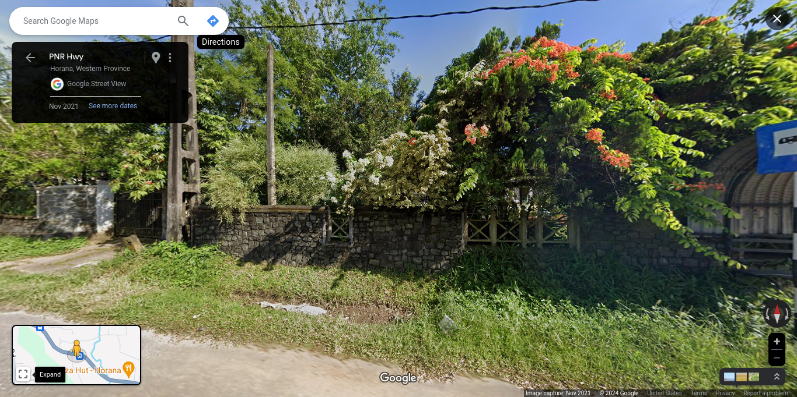

## Bollatha West

**Bollatha West** Grama Niladhari Division, **Gampaha** Divisional Secretariat Division, **Gampaha** District, **Western** Province

**Gampaha** Polling Division, **Gampaha** Electoral District

Population: 1,243 (2012)

(**LK-1224205**/209C)

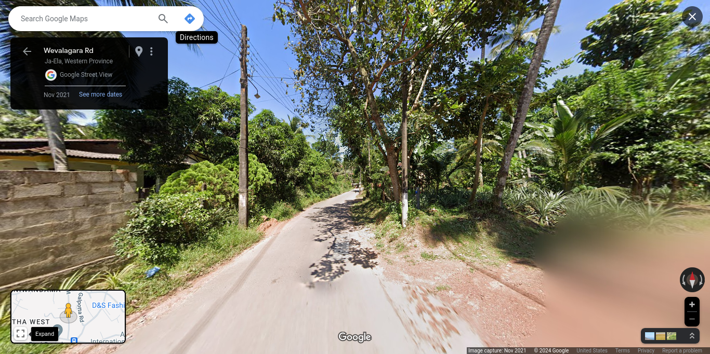

## Pallegunnepana South

**Pallegunnepana South** Grama Niladhari Division, **Kundasale** Divisional Secretariat Division, **Kandy** District, **Central** Province

**Kundasale** Polling Division, **Kandy** Electoral District

Population: 2,623 (2012)

(**LK-2127170**/665)

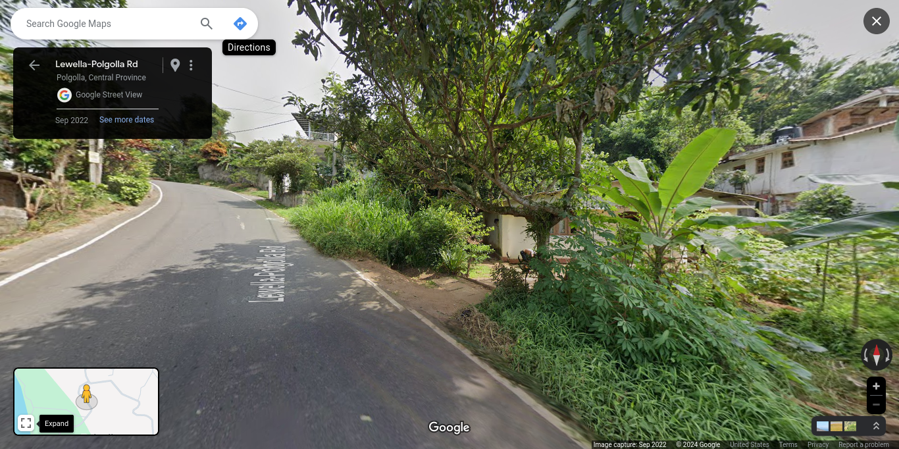

## Medawachchiya Junction

**Medawachchiya Junction** Grama Niladhari Division, **Horowpothana** Divisional Secretariat Division, **Anuradhapura** District, **North Central** Province

**Horowpothana** Polling Division, **Anuradhapura** Electoral District

Population: 750 (2012)

(**LK-7124105**/130)

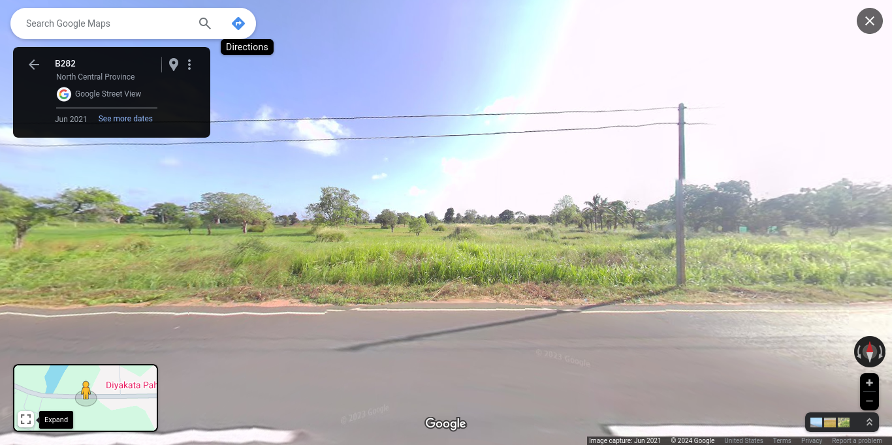

## Etampola

**Etampola** Grama Niladhari Division, **Kuliyapitiya East** Divisional Secretariat Division, **Kurunegala** District, **North Western** Province

**Kuliyapitiya** Polling Division, **Kurunegala** Electoral District

Population: 933 (2012)

(**LK-6169200**/1085)

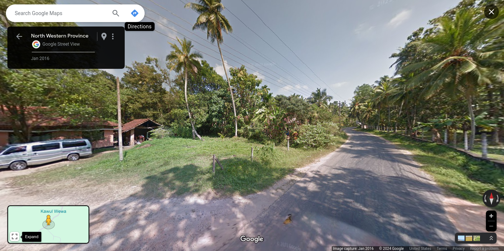

## Nuwaraeliya Central

**Nuwaraeliya Central** Grama Niladhari Division, **Nuwara Eliya** Divisional Secretariat Division, **Nuwara Eliya** District, **Central** Province

**Nuwara Eliya Maskeliya** Polling Division, **Nuwara-Eliya** Electoral District

Population: 4,292 (2012)

(**LK-2312170**/535D)

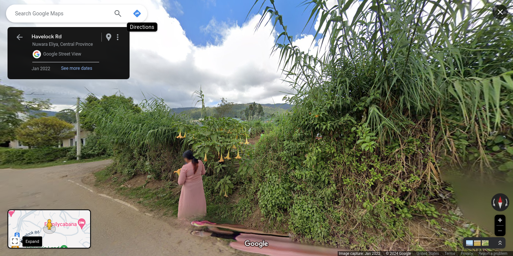

## Ariyalai South West

**Ariyalai South West** Grama Niladhari Division, **Nallur** Divisional Secretariat Division, **Jaffna** District, **Northern** Province

**Nallur** Polling Division, **Jaffna** Electoral District

Population: 1,471 (2012)

(**LK-4133005**/J/89)

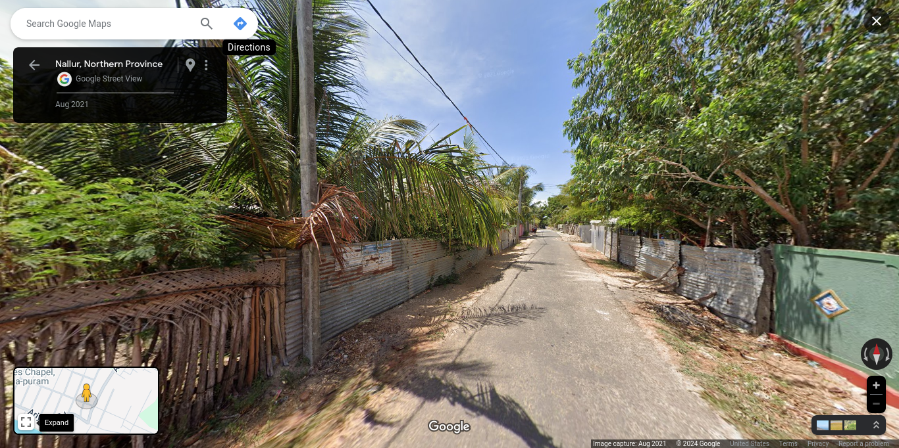

## Welata

**Welata** Grama Niladhari Division, **Kandy Four Gravets & Gangawata Korale** Divisional Secretariat Division, **Kandy** District, **Central** Province

**Mahanuwara** Polling Division, **Kandy** Electoral District

Population: 2,416 (2012)

(**LK-2130170**/260)

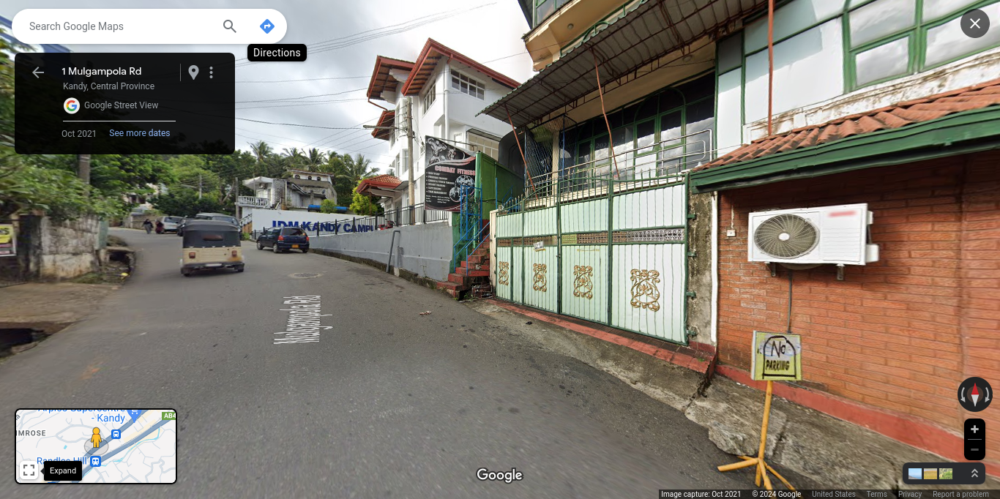

## Bambaragasthenna

**Bambaragasthenna** Grama Niladhari Division, **Godakawela** Divisional Secretariat Division, **Ratnapura** District, **Sabaragamuwa** Province

**Rakwana** Polling Division, **Ratnapura** Electoral District

Population: 2,001 (2012)

(**LK-9142125**/236B)

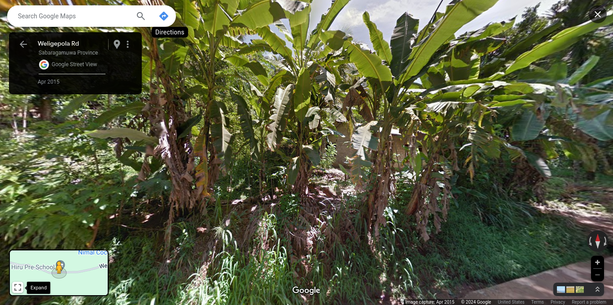

## Indigolla

**Indigolla** Grama Niladhari Division, **Polpithigama** Divisional Secretariat Division, **Kurunegala** District, **North Western** Province

**Yapahuwa** Polling Division, **Kurunegala** Electoral District

Population: 579 (2012)

(**LK-6127245**/367)

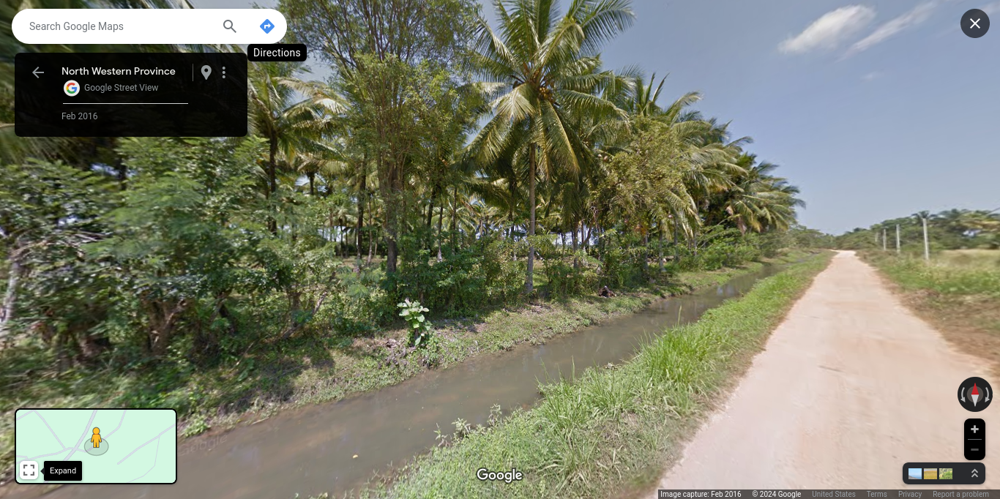

## Pallimunai East

**Pallimunai East** Grama Niladhari Division, **Mannar Town** Divisional Secretariat Division, **Mannar** District, **Northern** Province

**Mannar** Polling Division, **Vanni** Electoral District

Population: 1,526 (2012)

(**LK-4203100**/MN/84)

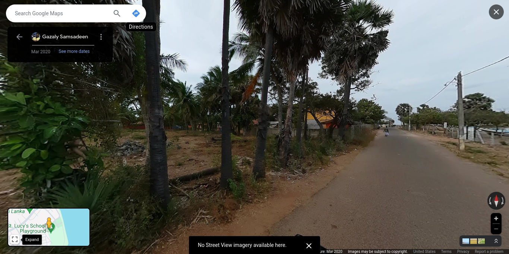

## Makuludoowa

**Makuludoowa** Grama Niladhari Division, **Kesbewa** Divisional Secretariat Division, **Colombo** District, **Western** Province

**Kesbewa** Polling Division, **Colombo** Electoral District

Population: 3,257 (2012)

(**LK-1136190**/583)

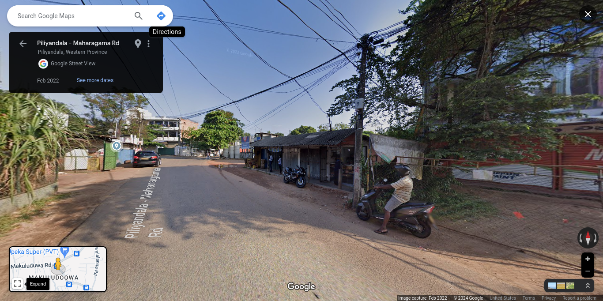

## Hureegolla

**Hureegolla** Grama Niladhari Division, **Akurana** Divisional Secretariat Division, **Kandy** District, **Central** Province

**Harispattuwa** Polling Division, **Kandy** Electoral District

Population: 2,169 (2012)

(**LK-2109080**/571)

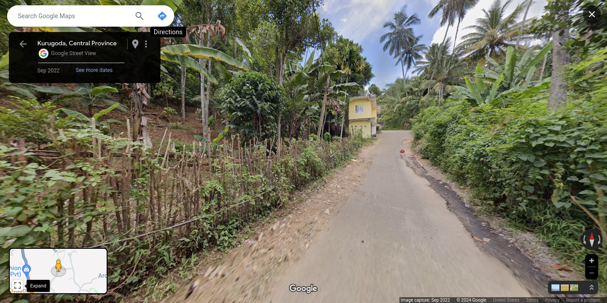

## Sellakanda

**Sellakanda** Grama Niladhari Division, **Katana** Divisional Secretariat Division, **Gampaha** District, **Western** Province

**Katana** Polling Division, **Gampaha** Electoral District

Population: 4,528 (2012)

(**LK-1206115**/161C)

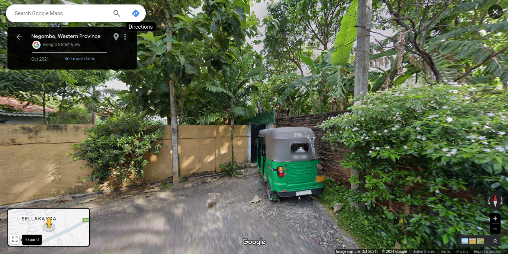

## Pottila

**Pottila** Grama Niladhari Division, **Thumpane** Divisional Secretariat Division, **Kandy** District, **Central** Province

**Galagedara** Polling Division, **Kandy** Electoral District

Population: 442 (2012)

(**LK-2103185**/313)

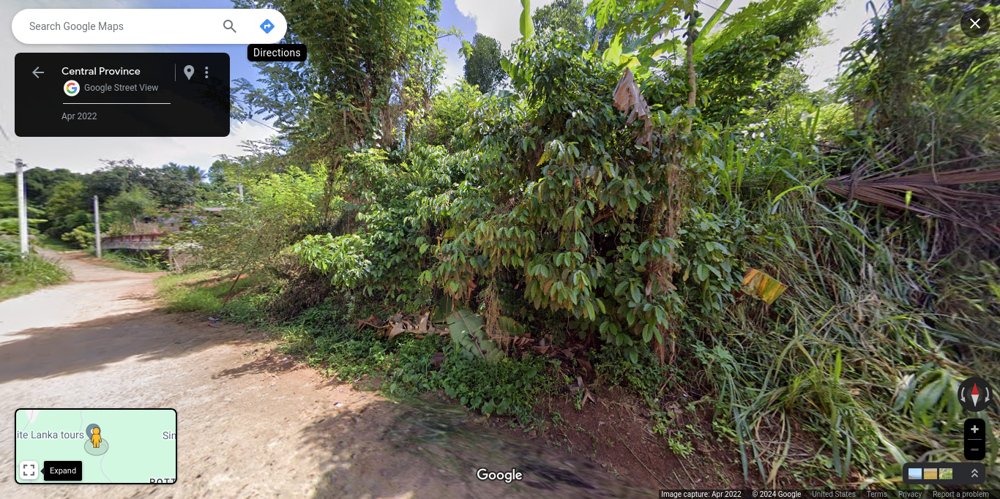

## Hidayapuram 2

**Hidayapuram 2** Grama Niladhari Division, **Pothuvil** Divisional Secretariat Division, **Ampara** District, **Eastern** Province

**Pothuvil** Polling Division, **Digamadulla** Electoral District

Population: 1,228 (2012)

(**LK-5248100**/P/21)

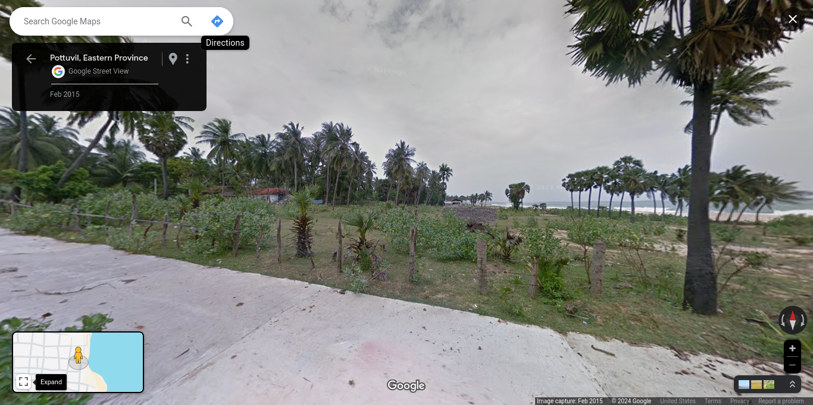

## Duldeniya

**Duldeniya** Grama Niladhari Division, **Aranayaka** Divisional Secretariat Division, **Kegalle** District, **Sabaragamuwa** Province

**Aranayaka** Polling Division, **Kegalle** Electoral District

Population: 1,316 (2012)

(**LK-9209215**/42A)

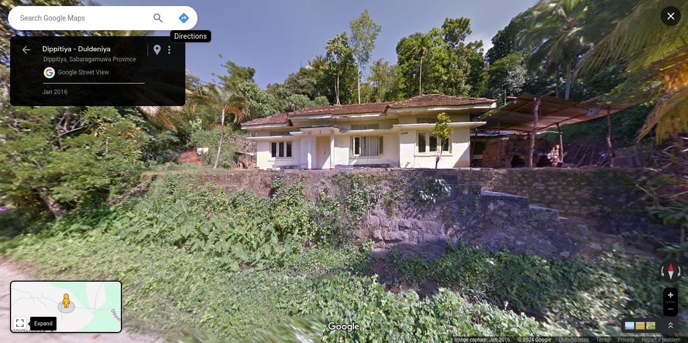

## Bandara  Puliyankulama

**Bandara  Puliyankulama** Grama Niladhari Division, **Nuwaragam Palatha Central** Divisional Secretariat Division, **Anuradhapura** District, **North Central** Province

**Anuradhapura West** Polling Division, **Anuradhapura** Electoral District

Population: 1,711 (2012)

(**LK-7115140**/319)

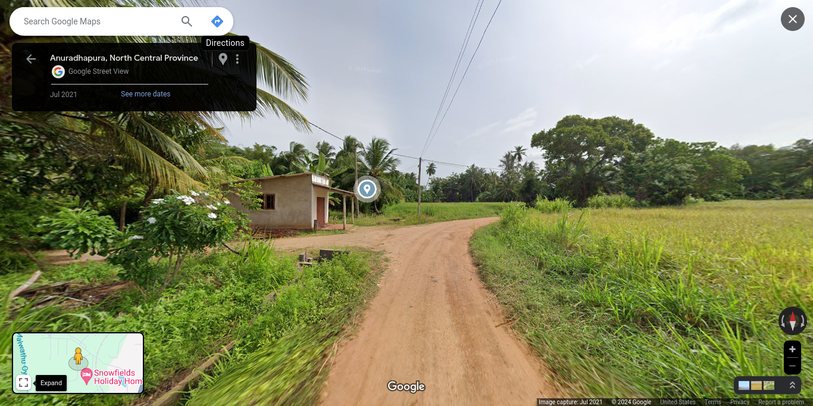

## Eldeniya West

**Eldeniya West** Grama Niladhari Division, **Mahara** Divisional Secretariat Division, **Gampaha** District, **Western** Province

**Mahara** Polling Division, **Gampaha** Electoral District

Population: 2,754 (2012)

(**LK-1233335**/286B)

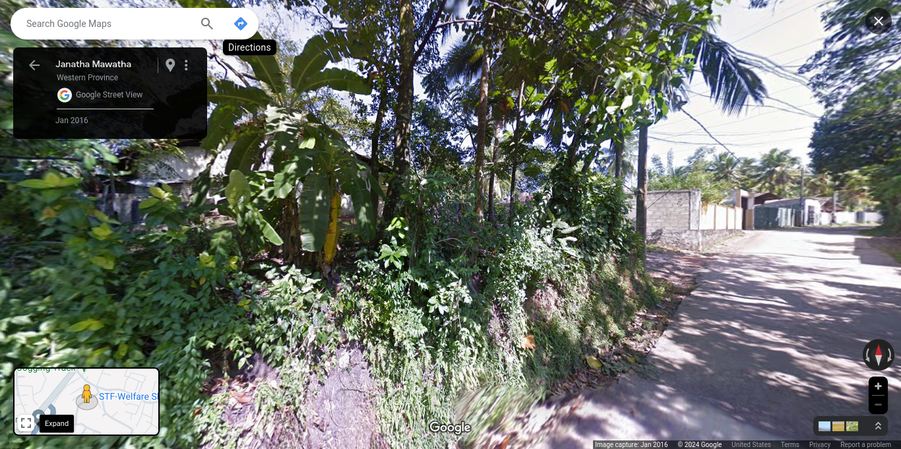

## Horana South

**Horana South** Grama Niladhari Division, **Horana** Divisional Secretariat Division, **Kalutara** District, **Western** Province

**Horana** Polling Division, **Kalutara** Electoral District

Population: 1,334 (2012)

(**LK-1309280**/615A)

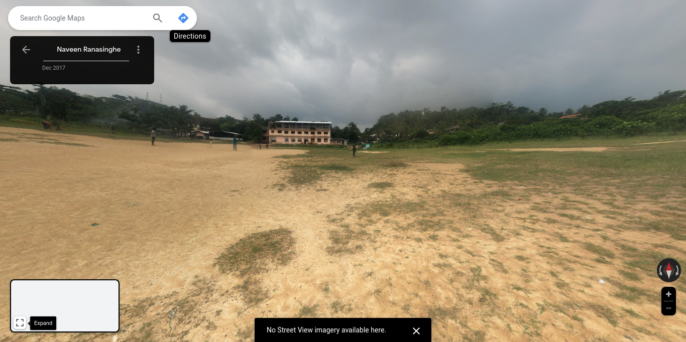

## Rathnapura Town

**Rathnapura Town** Grama Niladhari Division, **Ratnapura** Divisional Secretariat Division, **Ratnapura** District, **Sabaragamuwa** Province

**Ratnapura** Polling Division, **Ratnapura** Electoral District

Population: 1,796 (2012)

(**LK-9112225**/152A)

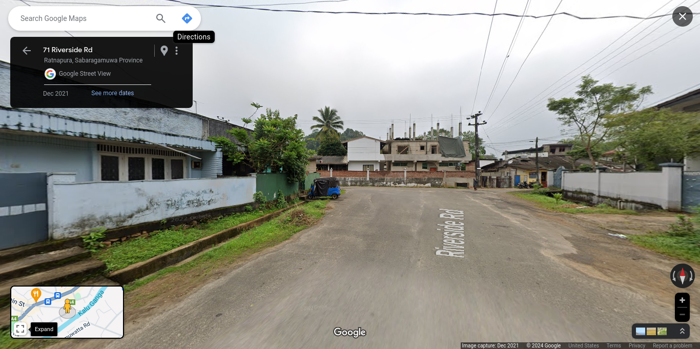

## Mahabage

**Mahabage** Grama Niladhari Division, **Wattala** Divisional Secretariat Division, **Gampaha** District, **Western** Province

**Wattala** Polling Division, **Gampaha** Electoral District

Population: 4,304 (2012)

(**LK-1218080**/178)

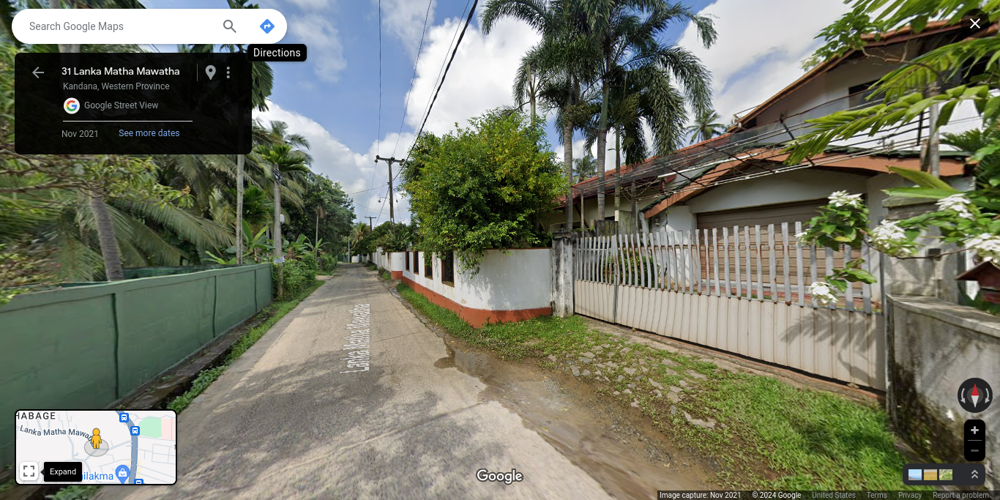

## Weediyawatta East

**Weediyawatta East** Grama Niladhari Division, **Minuwangoda** Divisional Secretariat Division, **Gampaha** District, **Western** Province

**Minuwangoda** Polling Division, **Gampaha** Electoral District

Population: 1,370 (2012)

(**LK-1215340**/130)

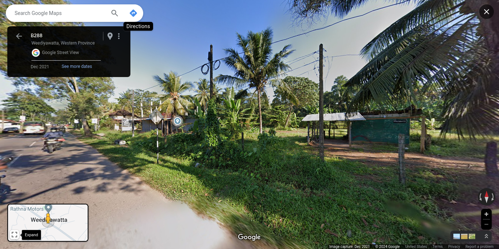

## Eldeniya East

**Eldeniya East** Grama Niladhari Division, **Mahara** Divisional Secretariat Division, **Gampaha** District, **Western** Province

**Mahara** Polling Division, **Gampaha** Electoral District

Population: 3,762 (2012)

(**LK-1233330**/286E)

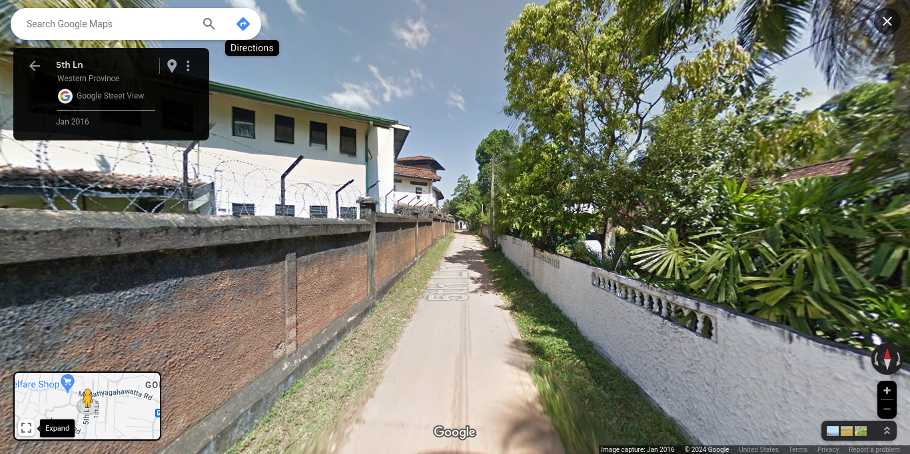

## Pitipana North

**Pitipana North** Grama Niladhari Division, **Homagama** Divisional Secretariat Division, **Colombo** District, **Western** Province

**Homagama** Polling Division, **Colombo** Electoral District

Population: 3,762 (2012)

(**LK-1112275**/484)

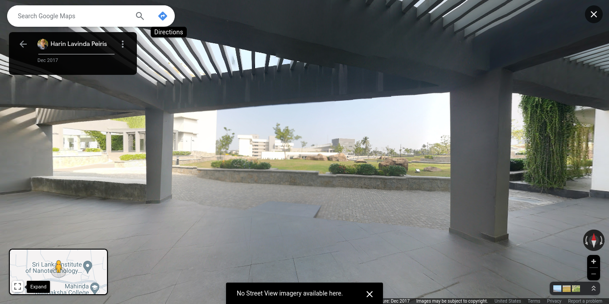

## Bandarawatta West

**Bandarawatta West** Grama Niladhari Division, **Katana** Divisional Secretariat Division, **Gampaha** District, **Western** Province

**Katana** Polling Division, **Gampaha** Electoral District

Population: 4,127 (2012)

(**LK-1206350**/145)

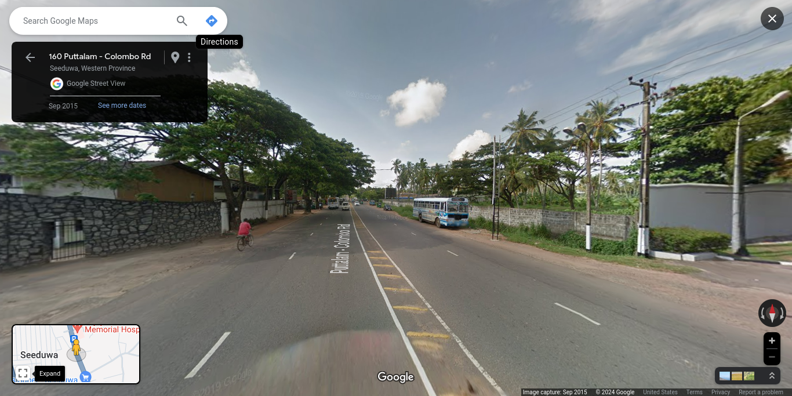

## Horagolla North

**Horagolla North** Grama Niladhari Division, **Gampaha** Divisional Secretariat Division, **Gampaha** District, **Western** Province

**Gampaha** Polling Division, **Gampaha** Electoral District

Population: 2,551 (2012)

(**LK-1224175**/216)

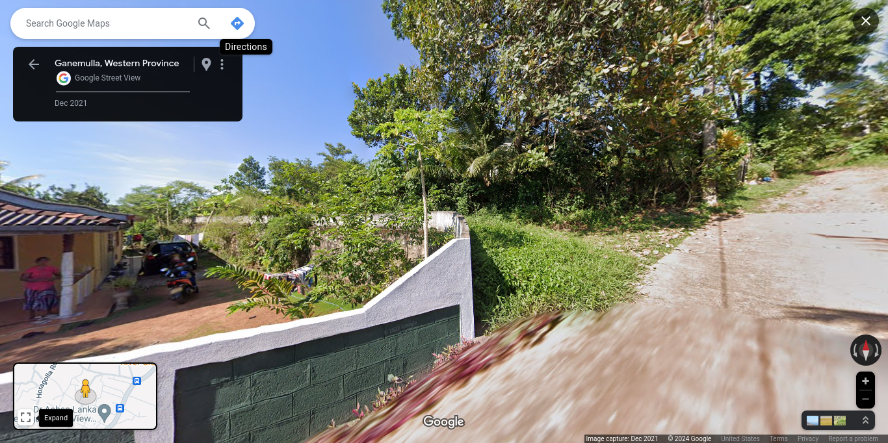

## Ihala Millewa North

**Ihala Millewa North** Grama Niladhari Division, **Horana** Divisional Secretariat Division, **Kalutara** District, **Western** Province

**Horana** Polling Division, **Kalutara** Electoral District

Population: 1,406 (2012)

(**LK-1309020**/628A)

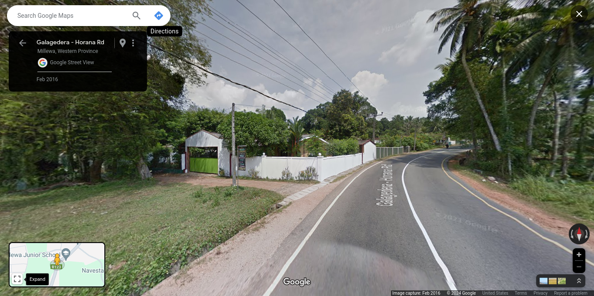

## Katuwana

**Katuwana** Grama Niladhari Division, **Homagama** Divisional Secretariat Division, **Colombo** District, **Western** Province

**Homagama** Polling Division, **Colombo** Electoral District

Population: 4,223 (2012)

(**LK-1112190**/486E)

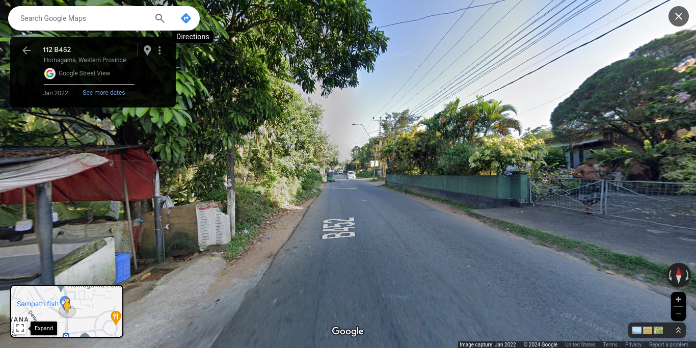

## Narawala

**Narawala** Grama Niladhari Division, **Bope-Poddala** Divisional Secretariat Division, **Galle** District, **Southern** Province

**Akmeemana** Polling Division, **Galle** Electoral District

Population: 544 (2012)

(**LK-3142030**/111)

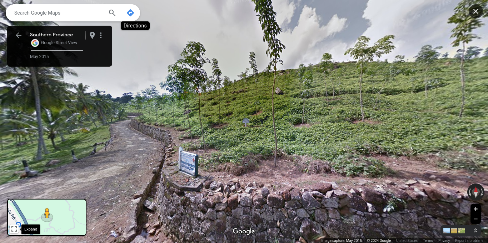

## Sammanthurai 04

**Sammanthurai 04** Grama Niladhari Division, **Samanthurai** Divisional Secretariat Division, **Ampara** District, **Eastern** Province

**Samanthurai** Polling Division, **Digamadulla** Electoral District

Population: 846 (2012)

(**LK-5218085**/78A)

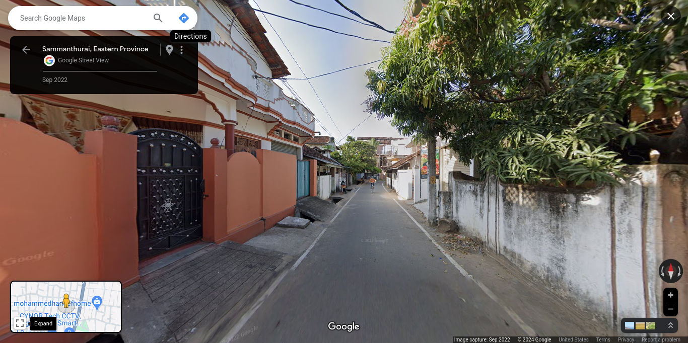

## Maha Heenatiyangala

**Maha Heenatiyangala** Grama Niladhari Division, **Kalutara** Divisional Secretariat Division, **Kalutara** District, **Western** Province

**Kalutara** Polling Division, **Kalutara** Electoral District

Population: 3,295 (2012)

(**LK-1321350**/727D)

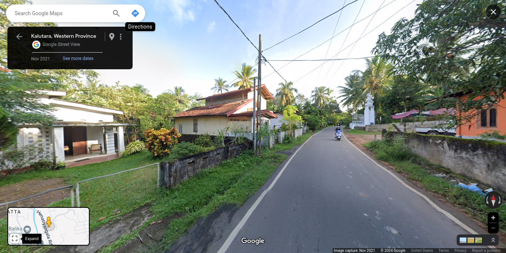

## Daluwakotuwa East

**Daluwakotuwa East** Grama Niladhari Division, **Negombo** Divisional Secretariat Division, **Gampaha** District, **Western** Province

**Negombo** Polling Division, **Gampaha** Electoral District

Population: 5,478 (2012)

(**LK-1203040**/74A)

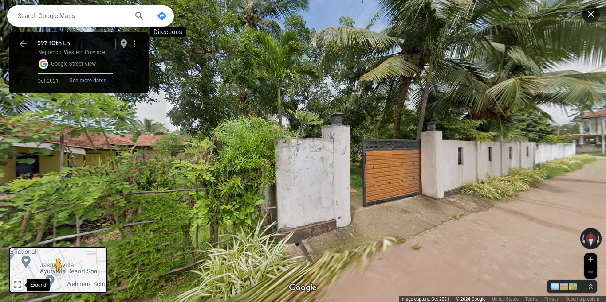

## Mahena

**Mahena** Grama Niladhari Division, **Warakapola** Divisional Secretariat Division, **Kegalle** District, **Sabaragamuwa** Province

**Dedigama** Polling Division, **Kegalle** Electoral District

Population: 2,337 (2012)

(**LK-9218115**/83B)

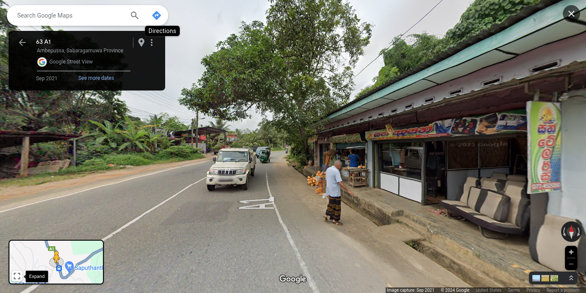

## Uppuveli

**Uppuveli** Grama Niladhari Division, **Trincomalee Town and Gravets** Divisional Secretariat Division, **Trincomalee** District, **Eastern** Province

**Trincomalee** Polling Division, **Trincomalee** Electoral District

Population: 1,772 (2012)

(**LK-5315035**/243)

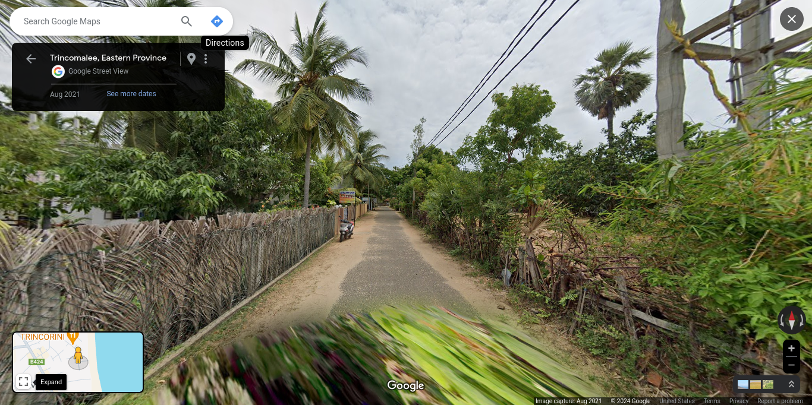

## Chandana Pokuna

**Chandana Pokuna** Grama Niladhari Division, **Hingurakgoda** Divisional Secretariat Division, **Polonnaruwa** District, **North Central** Province

**Minneriya** Polling Division, **Polonnaruwa** Electoral District

Population: 1,253 (2012)

(**LK-7203215**/53)

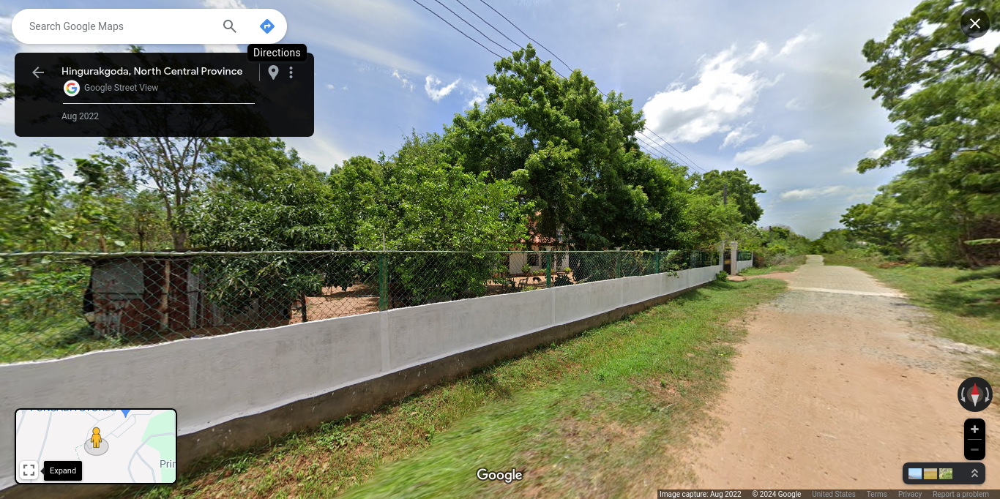

## Palle Weragama

**Palle Weragama** Grama Niladhari Division, **Rattota** Divisional Secretariat Division, **Matale** District, **Central** Province

**Rattota** Polling Division, **Matale** Electoral District

Population: 933 (2012)

(**LK-2230110**/E371)

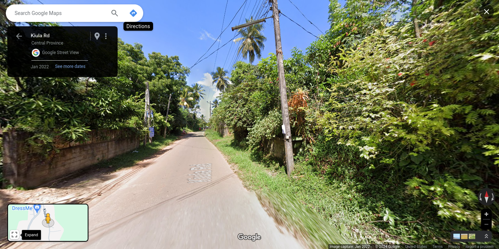

## Mullanai

**Mullanai** Grama Niladhari Division, **Valikamam South-West (Sandilipay)** Divisional Secretariat Division, **Jaffna** District, **Northern** Province

**Kankesanthurai** Polling Division, **Jaffna** Electoral District

Population: 634 (2012)

(**LK-4109140**/J/156)

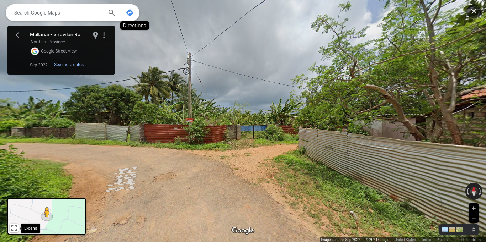

## Palugama Ella

**Palugama Ella** Grama Niladhari Division, **Welimada** Divisional Secretariat Division, **Badulla** District, **Uva** Province

**Welimada** Polling Division, **Badulla** Electoral District

Population: 1,272 (2012)

(**LK-8130055**/50C)

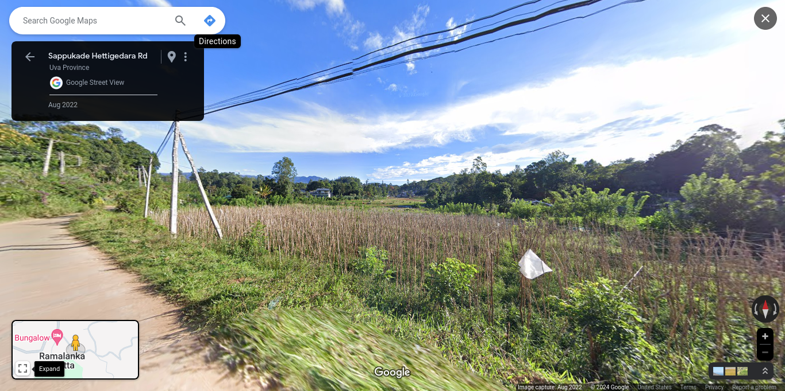

## Bobella

**Bobella** Grama Niladhari Division, **Naula** Divisional Secretariat Division, **Matale** District, **Central** Province

**Laggala** Polling Division, **Matale** Electoral District

Population: 452 (2012)

(**LK-2209070**/E415E)

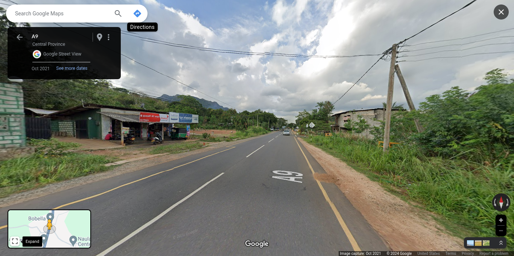

## Akurugoda South

**Akurugoda South** Grama Niladhari Division, **Malimbada** Divisional Secretariat Division, **Matara** District, **Southern** Province

**Akuressa** Polling Division, **Matara** Electoral District

Population: 1,770 (2012)

(**LK-3224125**/400B)

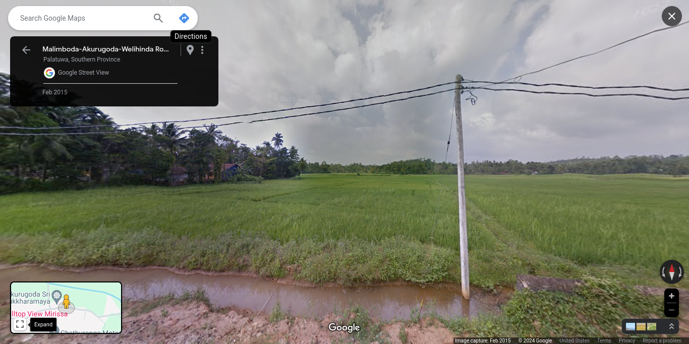

## Radawadunna Pahala

**Radawadunna Pahala** Grama Niladhari Division, **Mirigama** Divisional Secretariat Division, **Gampaha** District, **Western** Province

**Mirigama** Polling Division, **Gampaha** Electoral District

Population: 726 (2012)

(**LK-1212660**/360A)

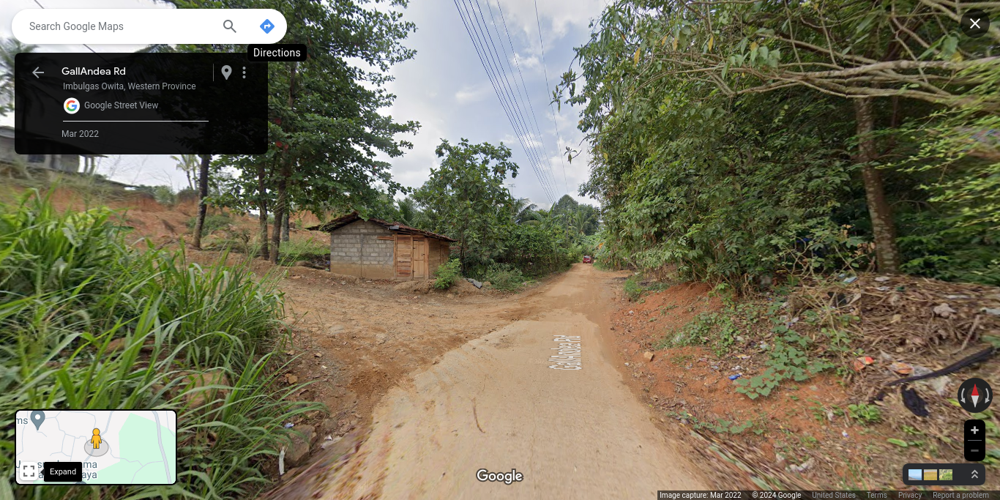

## Brahmanawatta South

**Brahmanawatta South** Grama Niladhari Division, **Balapitiya** Divisional Secretariat Division, **Galle** District, **Southern** Province

**Balapitiya** Polling Division, **Galle** Electoral District

Population: 1,712 (2012)

(**LK-3106140**/20B)

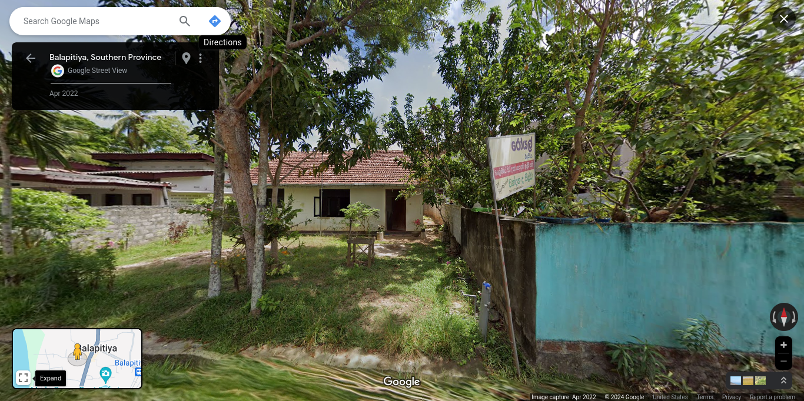

## Udugama Gondewala

**Udugama Gondewala** Grama Niladhari Division, **Rambukkana** Divisional Secretariat Division, **Kegalle** District, **Sabaragamuwa** Province

**Rambukkana** Polling Division, **Kegalle** Electoral District

Population: 1,048 (2012)

(**LK-9203355**/21B)

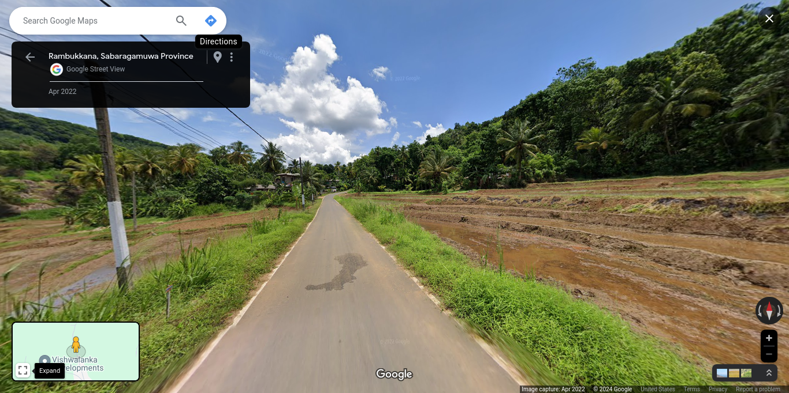

## Attidiya South

**Attidiya South** Grama Niladhari Division, **Ratmalana** Divisional Secretariat Division, **Colombo** District, **Western** Province

**Ratmalana** Polling Division, **Colombo** Electoral District

Population: 7,683 (2012)

(**LK-1131035**/543B)

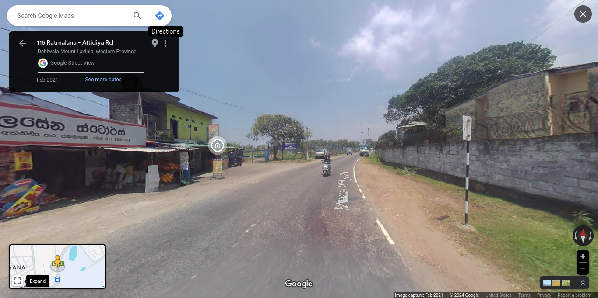

## Pahala Kadirana

**Pahala Kadirana** Grama Niladhari Division, **Katana** Divisional Secretariat Division, **Gampaha** District, **Western** Province

**Katana** Polling Division, **Gampaha** Electoral District

Population: 2,195 (2012)

(**LK-1206135**/93F)

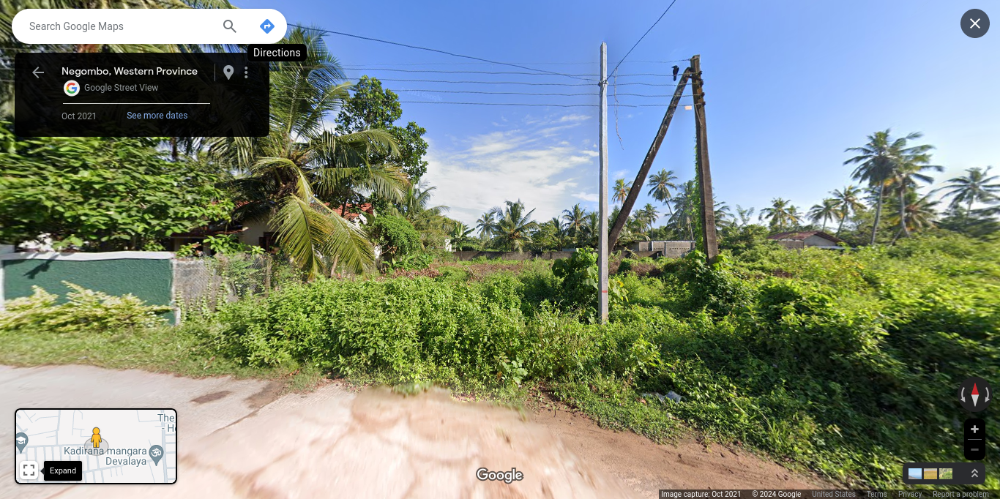

## Etavila

**Etavila** Grama Niladhari Division, **Kalutara** Divisional Secretariat Division, **Kalutara** District, **Western** Province

**Kalutara** Polling Division, **Kalutara** Electoral District

Population: 2,261 (2012)

(**LK-1321315**/727A)

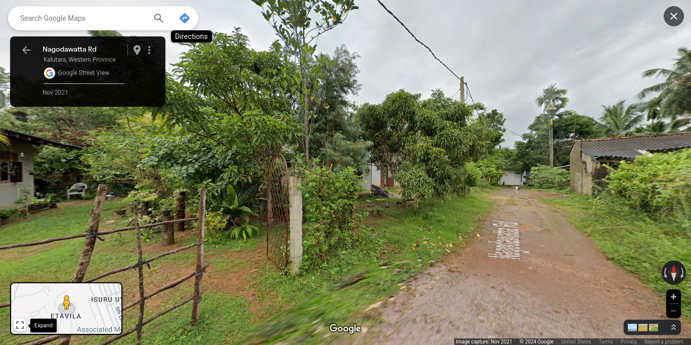

## Dehiovita

**Dehiovita** Grama Niladhari Division, **Dehiovita** Divisional Secretariat Division, **Kegalle** District, **Sabaragamuwa** Province

**Ruwanwella** Polling Division, **Kegalle** Electoral District

Population: 3,819 (2012)

(**LK-9230050**/119B)

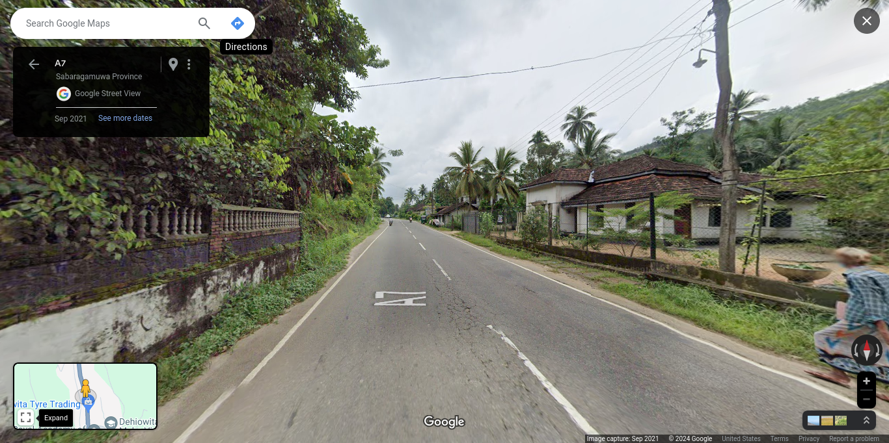

## Egodawatta

**Egodawatta** Grama Niladhari Division, **Kesbewa** Divisional Secretariat Division, **Colombo** District, **Western** Province

**Kesbewa** Polling Division, **Colombo** Electoral District

Population: 3,310 (2012)

(**LK-1136045**/533C)

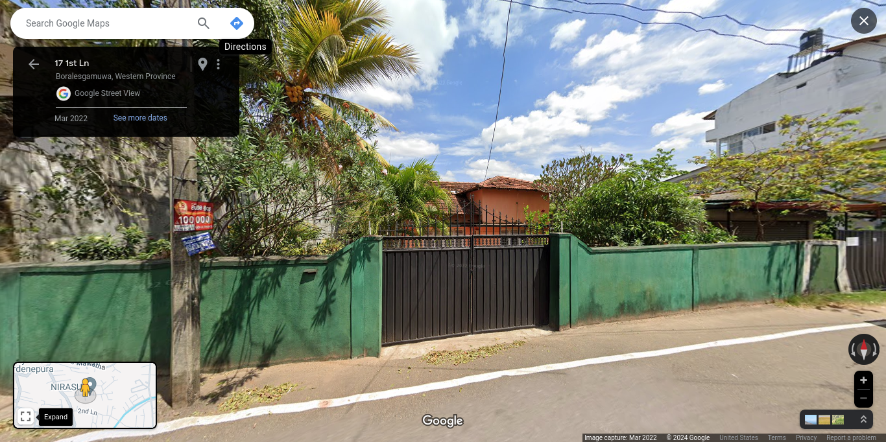

## Gangodavila East

**Gangodavila East** Grama Niladhari Division, **Sri Jayawardanapura Kotte** Divisional Secretariat Division, **Colombo** District, **Western** Province

**Kotte** Polling Division, **Colombo** Electoral District

Population: 3,287 (2012)

(**LK-1124100**/526C)

## Raja Ela

**Raja Ela** Grama Niladhari Division, **Hingurakgoda** Divisional Secretariat Division, **Polonnaruwa** District, **North Central** Province

**Minneriya** Polling Division, **Polonnaruwa** Electoral District

Population: 1,365 (2012)

(**LK-7203160**/38)

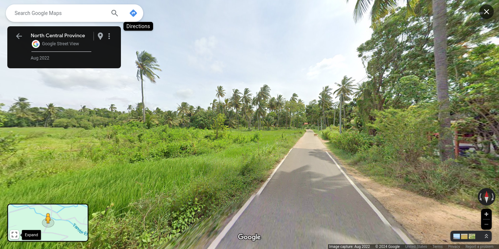

## Puliyanthivu Central

**Puliyanthivu Central** Grama Niladhari Division, **Manmunai North** Divisional Secretariat Division, **Batticaloa** District, **Eastern** Province

**Batticaloa** Polling Division, **Batticaloa** Electoral District

Population: 1,098 (2012)

(**LK-5118175**/179B)

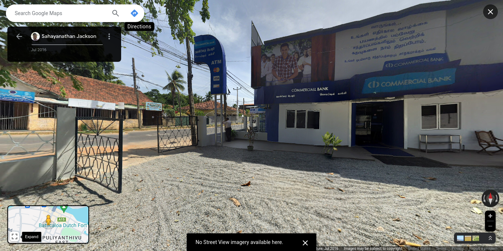

## Hirewatta

**Hirewatta** Grama Niladhari Division, **Ambalangoda** Divisional Secretariat Division, **Galle** District, **Southern** Province

**Ambalangoda** Polling Division, **Galle** Electoral District

Population: 1,426 (2012)

(**LK-3133095**/82A)

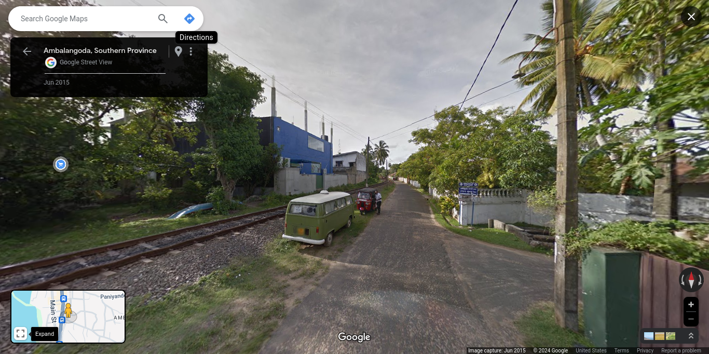

## Galkotuwa

**Galkotuwa** Grama Niladhari Division, **Medadumbara** Divisional Secretariat Division, **Kandy** District, **Central** Province

**Teldeniya** Polling Division, **Kandy** Electoral District

Population: 294 (2012)

(**LK-2124045**/746)

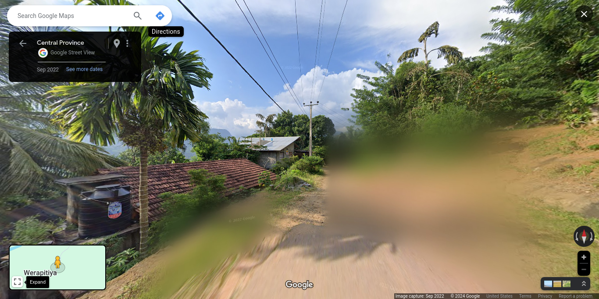

## Urulewatta

**Urulewatta** Grama Niladhari Division, **Udunuwara** Divisional Secretariat Division, **Kandy** District, **Central** Province

**Udunuwara** Polling Division, **Kandy** Electoral District

Population: 796 (2012)

(**LK-2139080**/121)

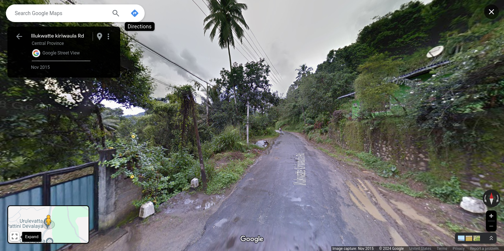

## Vilana Pallegama

**Vilana Pallegama** Grama Niladhari Division, **Akurana** Divisional Secretariat Division, **Kandy** District, **Central** Province

**Harispattuwa** Polling Division, **Kandy** Electoral District

Population: 1,703 (2012)

(**LK-2109015**/591)

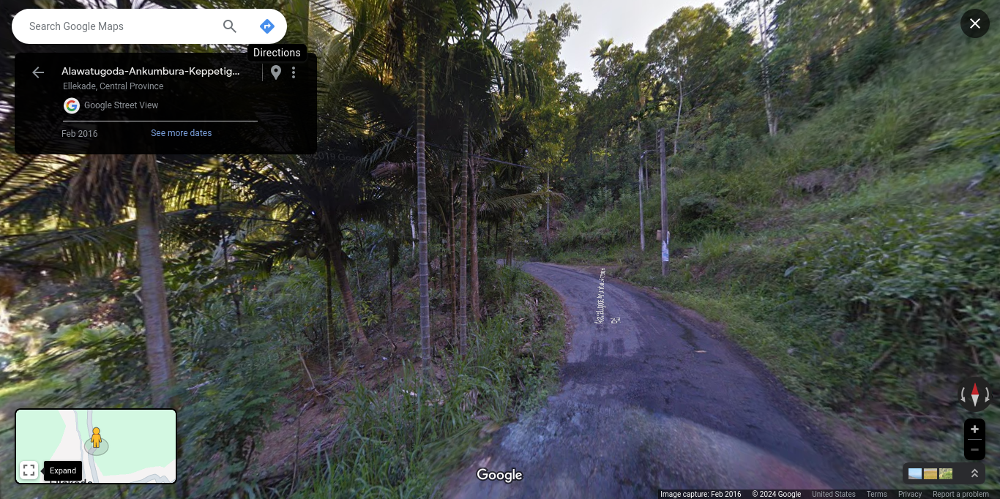

## Hinidumgoda

**Hinidumgoda** Grama Niladhari Division, **Akmeemana** Divisional Secretariat Division, **Galle** District, **Southern** Province

**Akmeemana** Polling Division, **Galle** Electoral District

Population: 1,275 (2012)

(**LK-3145205**/130C)

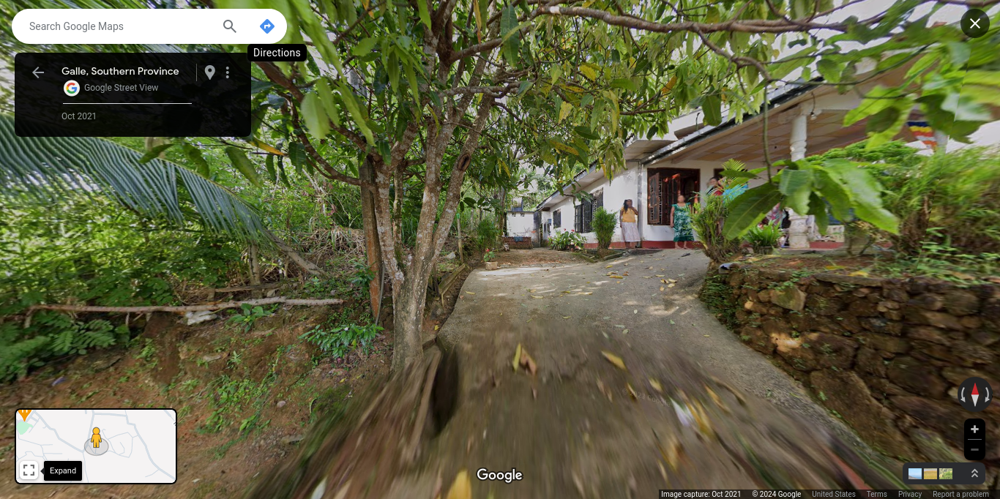

## Kithulampitiya

**Kithulampitiya** Grama Niladhari Division, **Bope-Poddala** Divisional Secretariat Division, **Galle** District, **Southern** Province

**Akmeemana** Polling Division, **Galle** Electoral District

Population: 1,759 (2012)

(**LK-3142180**/124)

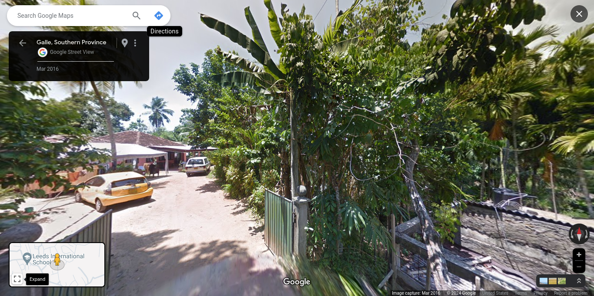

## Vilinayadi 02

**Vilinayadi 02** Grama Niladhari Division, **Samanthurai** Divisional Secretariat Division, **Ampara** District, **Eastern** Province

**Samanthurai** Polling Division, **Digamadulla** Electoral District

Population: 1,046 (2012)

(**LK-5218230**/79I)

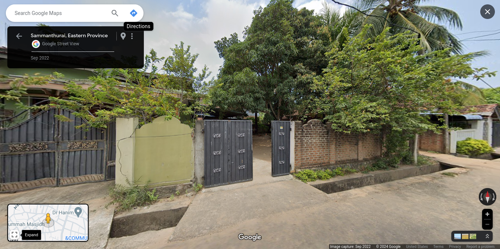

## Agulmaduwa

**Agulmaduwa** Grama Niladhari Division, **Beliatta** Divisional Secretariat Division, **Hambantota** District, **Southern** Province

**Beliatta** Polling Division, **Hambantota** Electoral District

Population: 851 (2012)

(**LK-3330115**/316)

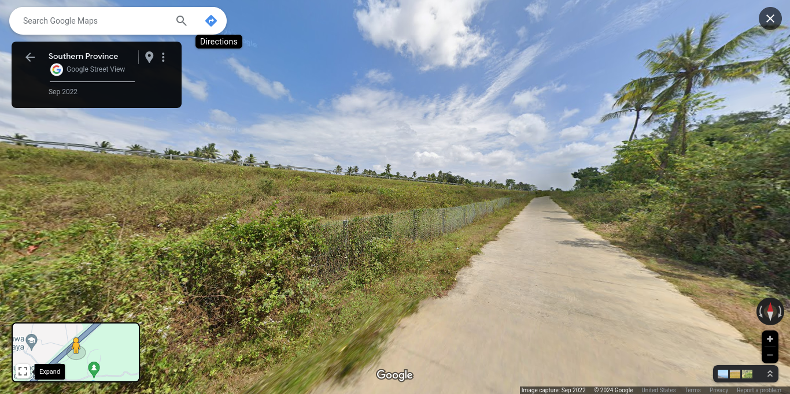

## Mahingala

**Mahingala** Grama Niladhari Division, **Padukka** Divisional Secretariat Division, **Colombo** District, **Western** Province

**Avissawella** Polling Division, **Colombo** Electoral District

Population: 621 (2012)

(**LK-1118210**/455A)

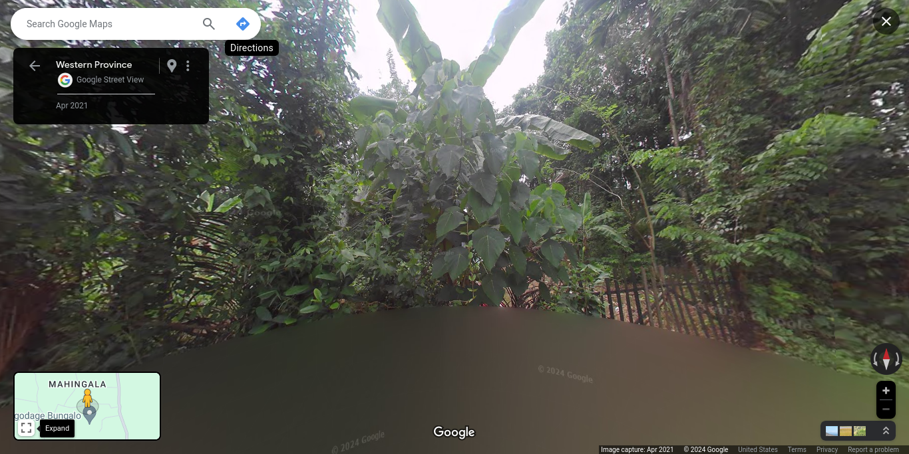

## Wattegama North

**Wattegama North** Grama Niladhari Division, **Dickwella** Divisional Secretariat Division, **Matara** District, **Southern** Province

**Devinuwara** Polling Division, **Matara** Electoral District

Population: 1,212 (2012)

(**LK-3248095**/451A)

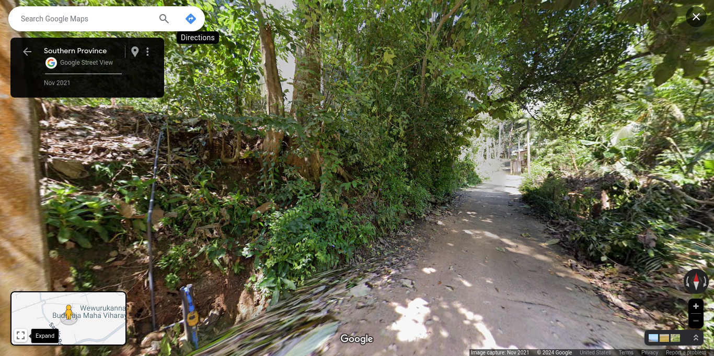

## Wahumuwa

**Wahumuwa** Grama Niladhari Division, **Kuliyapitiya West** Divisional Secretariat Division, **Kurunegala** District, **North Western** Province

**Kuliyapitiya** Polling Division, **Kurunegala** Electoral District

Population: 1,360 (2012)

(**LK-6172175**/1144)

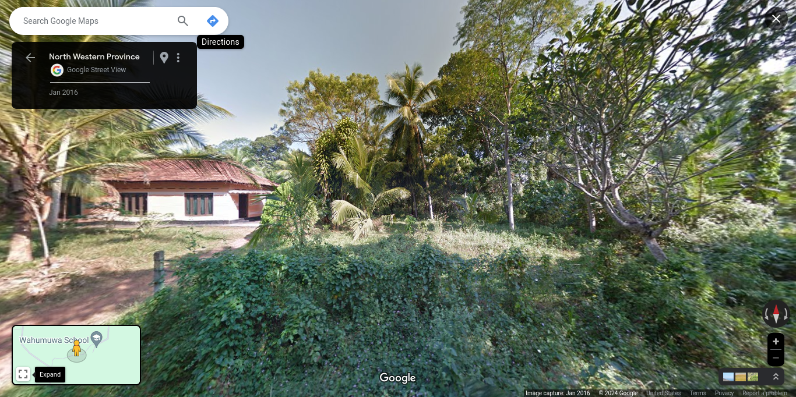

## Samarabahu

**Samarabahu** Grama Niladhari Division, **Vadamaradchi South-West (Karaveddy)** Divisional Secretariat Division, **Jaffna** District, **Northern** Province

**Udupiddy** Polling Division, **Jaffna** Electoral District

Population: 1,472 (2012)

(**LK-4121050**/J/357)

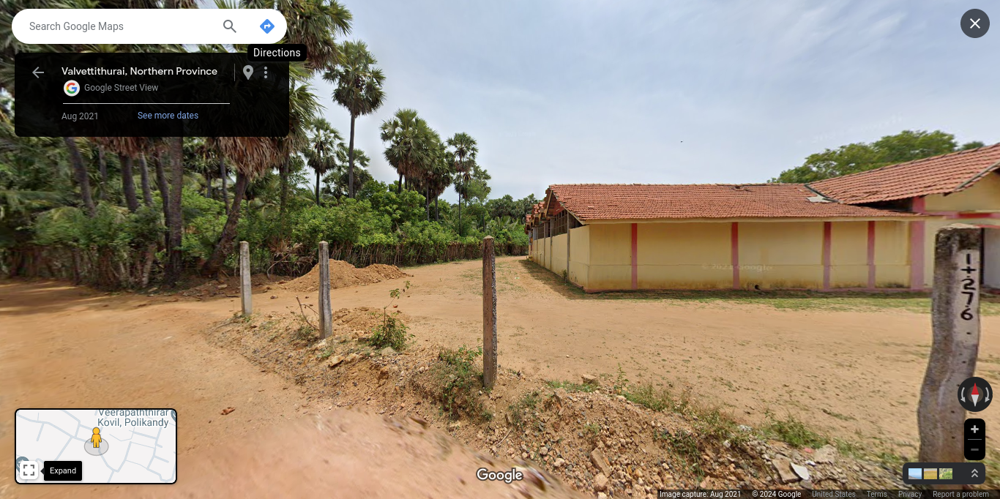

## Wekada North

**Wekada North** Grama Niladhari Division, **Panadura** Divisional Secretariat Division, **Kalutara** District, **Western** Province

**Panadura** Polling Division, **Kalutara** Electoral District

Population: 2,753 (2012)

(**LK-1303230**/687C)

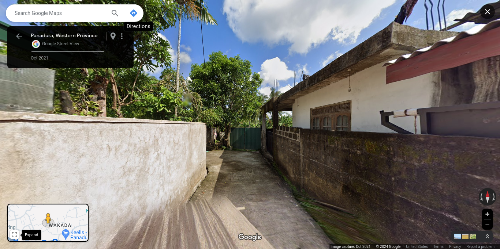

## Ninthavur 17

**Ninthavur 17** Grama Niladhari Division, **Ninthavur** Divisional Secretariat Division, **Ampara** District, **Eastern** Province

**Pothuvil** Polling Division, **Digamadulla** Electoral District

Population: 758 (2012)

(**LK-5230060**/38C)

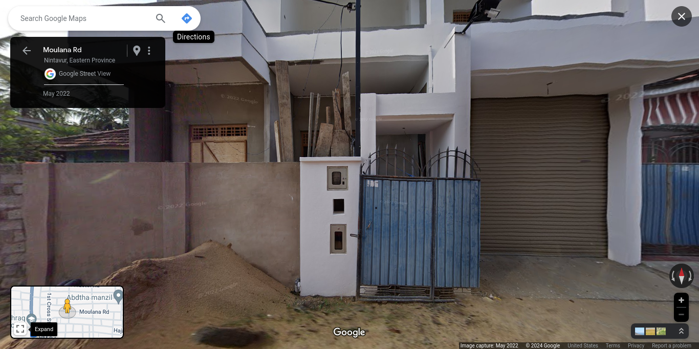

## Varani North

**Varani North** Grama Niladhari Division, **Thenmaradchi (Chavakachcheri)** Divisional Secretariat Division, **Jaffna** District, **Northern** Province

**Chavakachcheri** Polling Division, **Jaffna** Electoral District

Population: 1,017 (2012)

(**LK-4130260**/J/339)

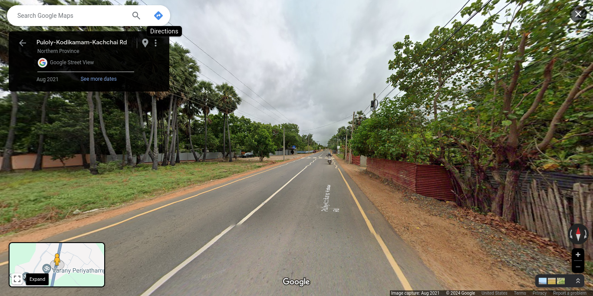

## Mampuriya

**Mampuriya** Grama Niladhari Division, **Kalpitiya** Divisional Secretariat Division, **Puttalam** District, **North Western** Province

**Puttalam** Polling Division, **Puttalam** Electoral District

Population: 2,815 (2012)

(**LK-6203130**/619)

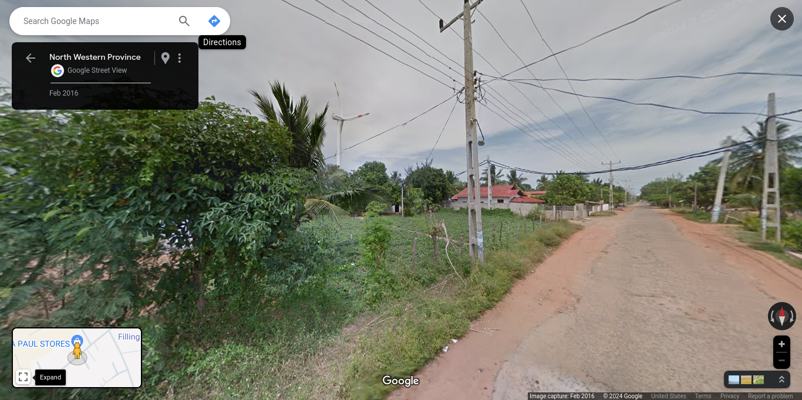

## Wathuwala

**Wathuwala** Grama Niladhari Division, **Harispattuwa** Divisional Secretariat Division, **Kandy** District, **Central** Province

**Harispattuwa** Polling Division, **Kandy** Electoral District

Population: 1,002 (2012)

(**LK-2133200**/490)

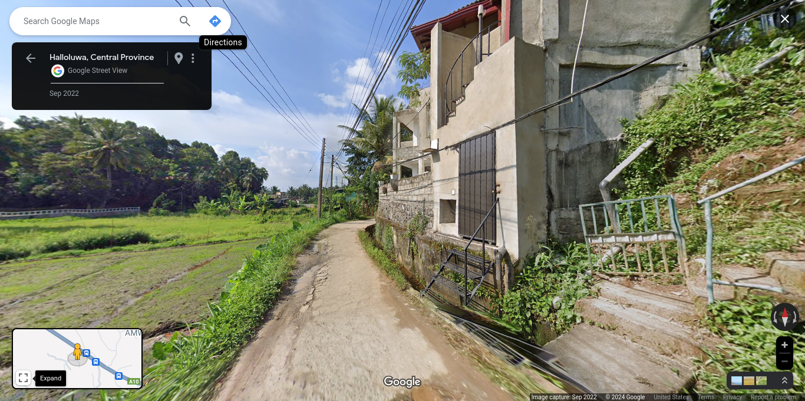

## Wataddara West

**Wataddara West** Grama Niladhari Division, **Attanagalla** Divisional Secretariat Division, **Gampaha** District, **Western** Province

**Attanagalla** Polling Division, **Gampaha** Electoral District

Population: 1,382 (2012)

(**LK-1227135**/332/B)

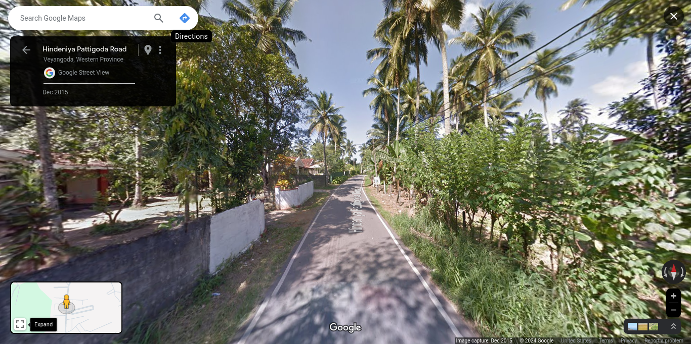

## Orugodawatta

**Orugodawatta** Grama Niladhari Division, **Kolonnawa** Divisional Secretariat Division, **Colombo** District, **Western** Province

**Kolonnawa** Polling Division, **Colombo** Electoral District

Population: 5,900 (2012)

(**LK-1106030**/510A)

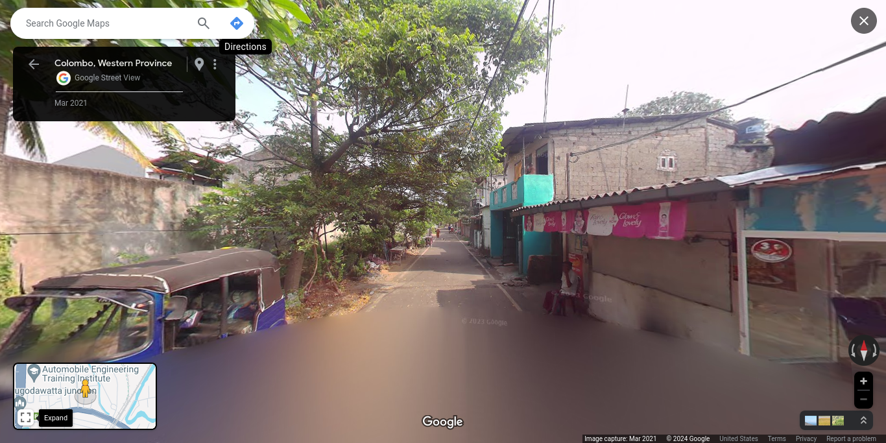

## Nagolla

**Nagolla** Grama Niladhari Division, **Ukuwela** Divisional Secretariat Division, **Matale** District, **Central** Province

**Rattota** Polling Division, **Matale** Electoral District

Population: 1,827 (2012)

(**LK-2233185**/E355D)

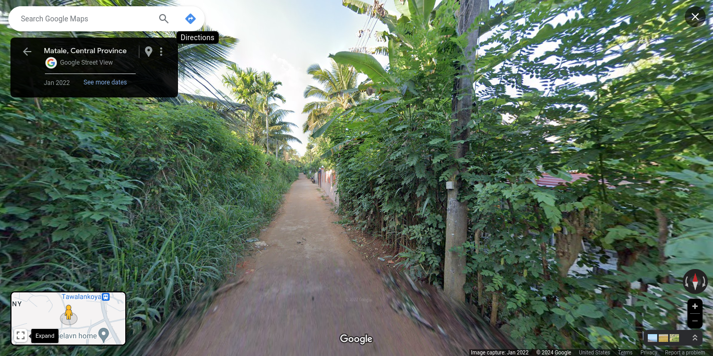

## Dandagamuwa West

**Dandagamuwa West** Grama Niladhari Division, **Kuliyapitiya West** Divisional Secretariat Division, **Kurunegala** District, **North Western** Province

**Kuliyapitiya** Polling Division, **Kurunegala** Electoral District

Population: 1,196 (2012)

(**LK-6172215**/1193)

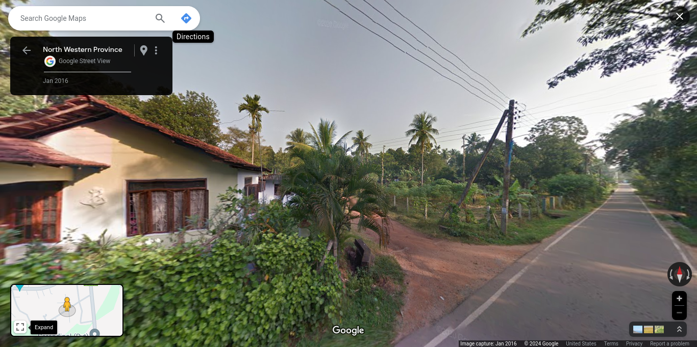

## Daluwakotuwa East

**Daluwakotuwa East** Grama Niladhari Division, **Negombo** Divisional Secretariat Division, **Gampaha** District, **Western** Province

**Negombo** Polling Division, **Gampaha** Electoral District

Population: 5,478 (2012)

(**LK-1203040**/74A)

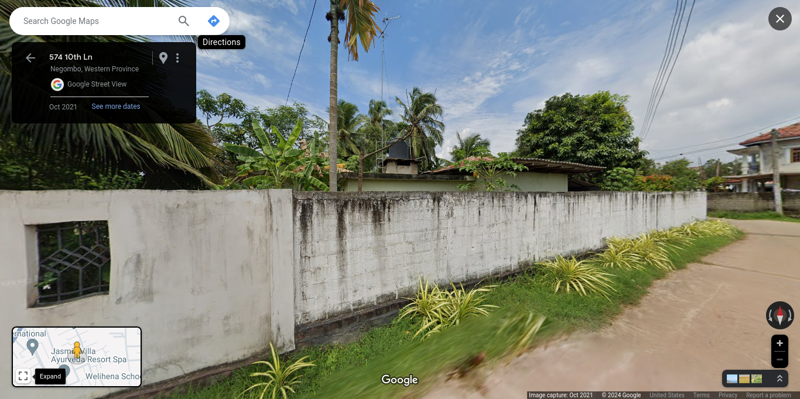

## Wathumulla

**Wathumulla** Grama Niladhari Division, **Ratmalana** Divisional Secretariat Division, **Colombo** District, **Western** Province

**Ratmalana** Polling Division, **Colombo** Electoral District

Population: 4,608 (2012)

(**LK-1131020**/544A)

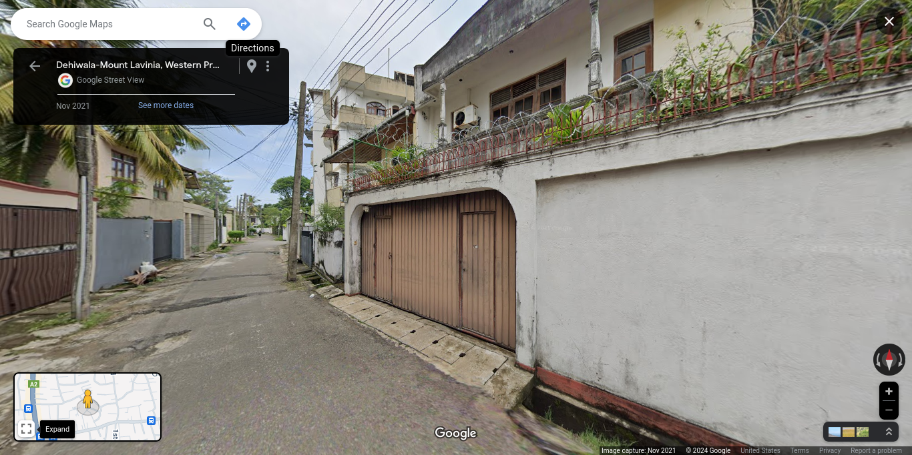

## Thimbiriettawala

**Thimbiriettawala** Grama Niladhari Division, **Horowpothana** Divisional Secretariat Division, **Anuradhapura** District, **North Central** Province

**Horowpothana** Polling Division, **Anuradhapura** Electoral District

Population: 1,059 (2012)

(**LK-7124060**/123)

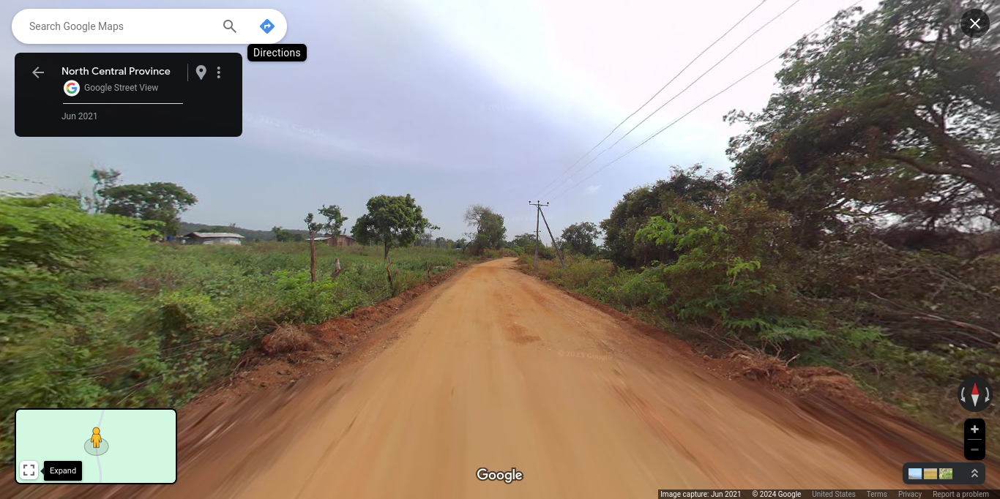

## Maligakanda

**Maligakanda** Grama Niladhari Division, **Colombo** Divisional Secretariat Division, **Colombo** District, **Western** Province

**Colombo Central** Polling Division, **Colombo** Electoral District

Population: 8,526 (2012)

(**LK-1103160**/)

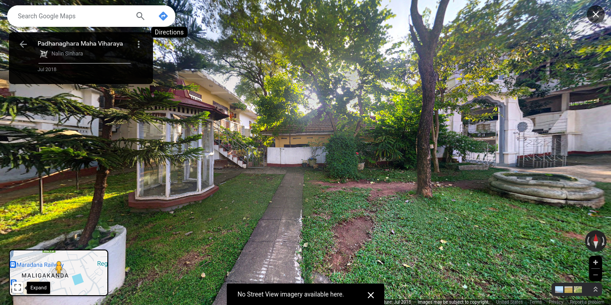

## Panangoda

**Panangoda** Grama Niladhari Division, **Mahawewa** Divisional Secretariat Division, **Puttalam** District, **North Western** Province

**Nattandiya** Polling Division, **Puttalam** Electoral District

Population: 1,885 (2012)

(**LK-6239145**/521A)

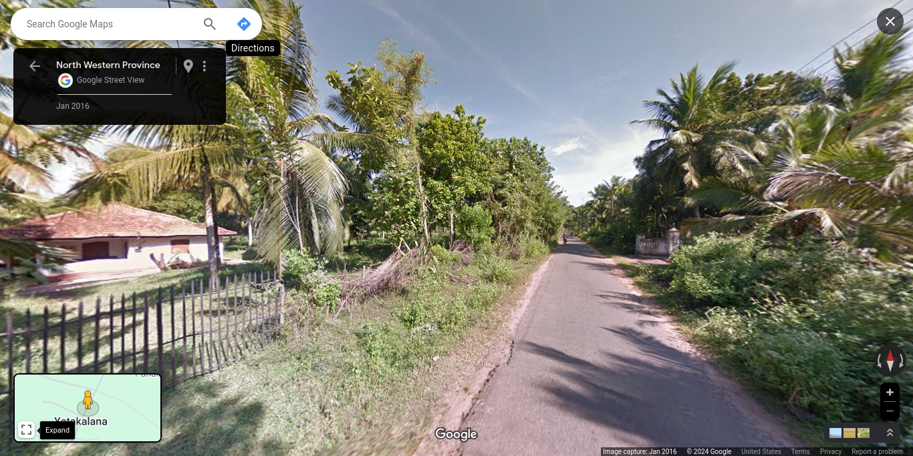

## Korathota

**Korathota** Grama Niladhari Division, **Kaduwela** Divisional Secretariat Division, **Colombo** District, **Western** Province

**Kaduwela** Polling Division, **Colombo** Electoral District

Population: 9,178 (2012)

(**LK-1109080**/488)

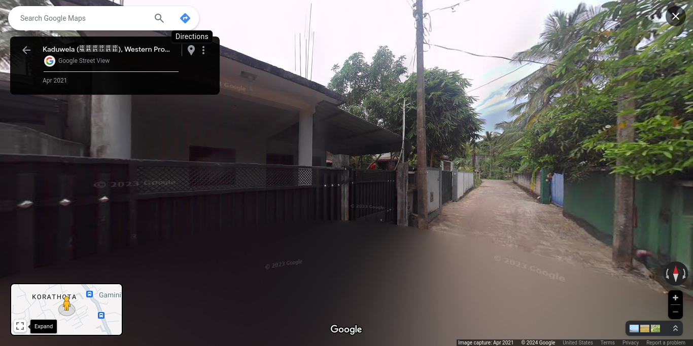

## Gammeddegoda

**Gammeddegoda** Grama Niladhari Division, **Hikkaduwa** Divisional Secretariat Division, **Galle** District, **Southern** Province

**Ratgama** Polling Division, **Galle** Electoral District

Population: 1,055 (2012)

(**LK-3136430**/47)

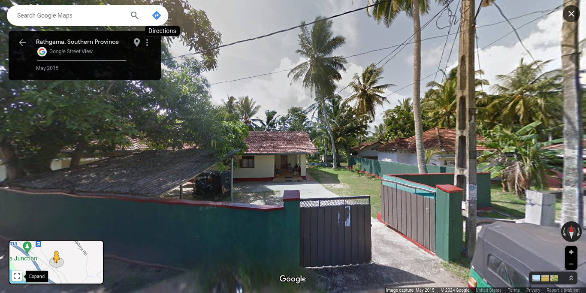

## Palanthriyagoda

**Palanthriyagoda** Grama Niladhari Division, **Hikkaduwa** Divisional Secretariat Division, **Galle** District, **Southern** Province

**Ratgama** Polling Division, **Galle** Electoral District

Population: 547 (2012)

(**LK-3136400**/45C)

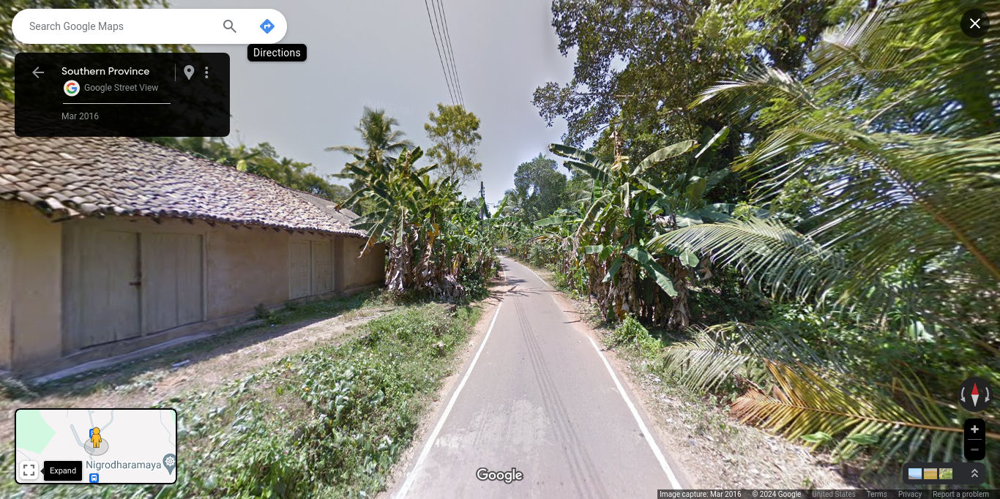

## Aniwatta East

**Aniwatta East** Grama Niladhari Division, **Kandy Four Gravets & Gangawata Korale** Divisional Secretariat Division, **Kandy** District, **Central** Province

**Mahanuwara** Polling Division, **Kandy** Electoral District

Population: 2,012 (2012)

(**LK-2130100**/234)

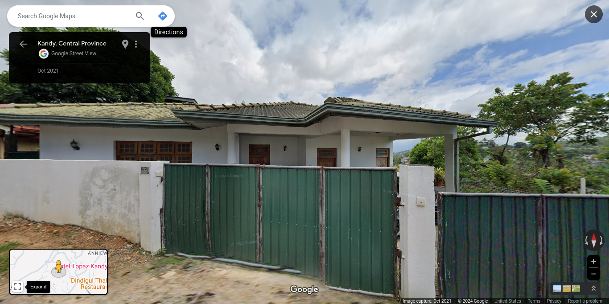

## Thalpavila North

**Thalpavila North** Grama Niladhari Division, **Matara Four Gravets** Divisional Secretariat Division, **Matara** District, **Southern** Province

**Matara** Polling Division, **Matara** Electoral District

Population: 3,181 (2012)

(**LK-3242160**/430A)

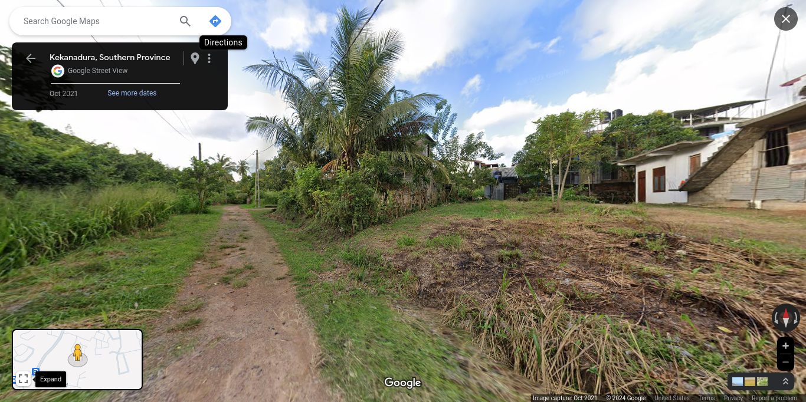

## Faizal Nagar

**Faizal Nagar** Grama Niladhari Division, **Kinniya** Divisional Secretariat Division, **Trincomalee** District, **Eastern** Province

**Muttur** Polling Division, **Trincomalee** Electoral District

Population: 5,238 (2012)

(**LK-5324115**/225G)

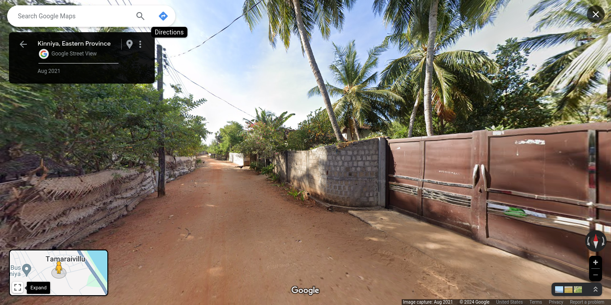

## Kinigama

**Kinigama** Grama Niladhari Division, **Bandarawela** Divisional Secretariat Division, **Badulla** District, **Uva** Province

**Bandarawela** Polling Division, **Badulla** Electoral District

Population: 1,767 (2012)

(**LK-8133105**/66)

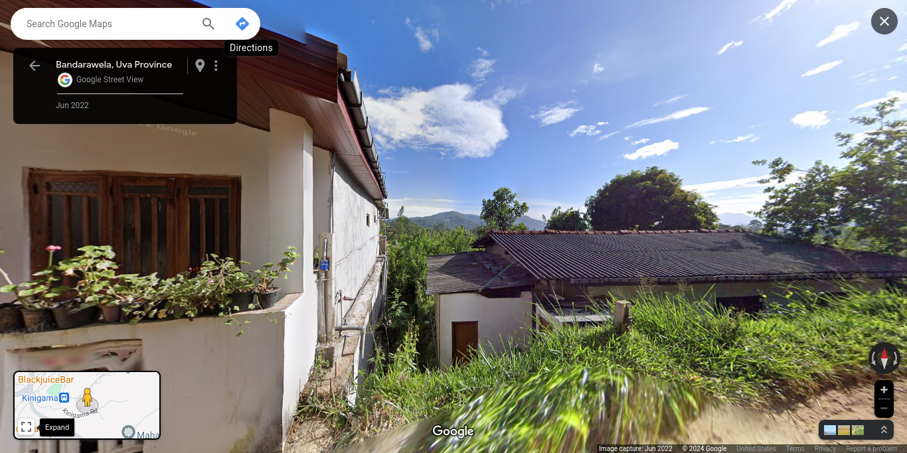

## Kandana West

**Kandana West** Grama Niladhari Division, **Ja-Ela** Divisional Secretariat Division, **Gampaha** District, **Western** Province

**Ja Ela** Polling Division, **Gampaha** Electoral District

Population: 1,751 (2012)

(**LK-1221180**/184)

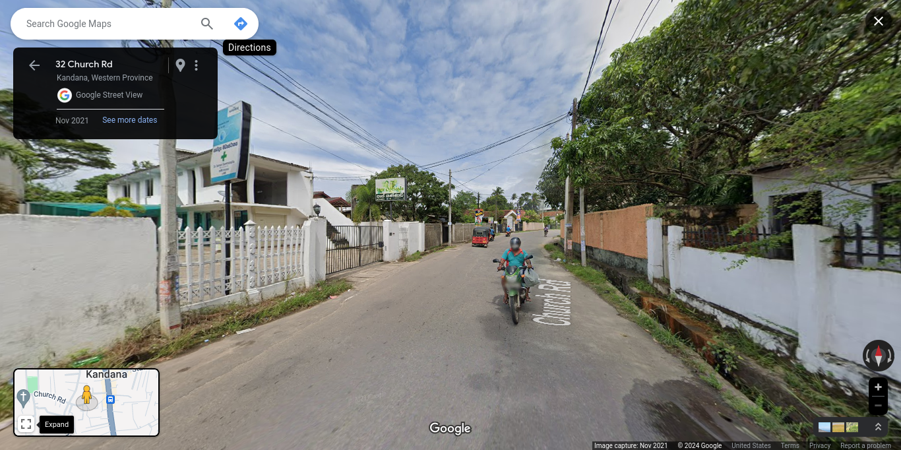

## Bubulalanda

**Bubulalanda** Grama Niladhari Division, **Beruwala** Divisional Secretariat Division, **Kalutara** District, **Western** Province

**Beruwala** Polling Division, **Kalutara** Electoral District

Population: 1,439 (2012)

(**LK-1324170**/747B)

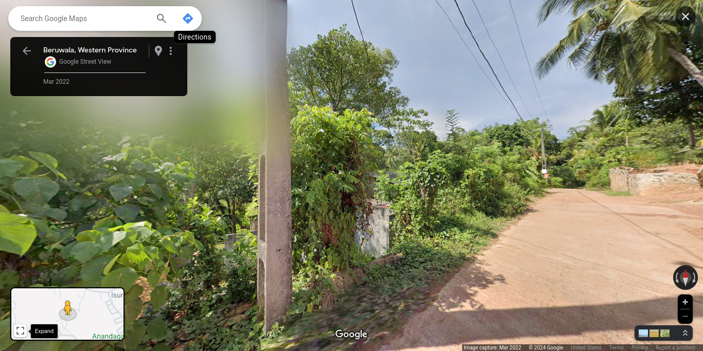

## Daranagama

**Daranagama** Grama Niladhari Division, **Biyagama** Divisional Secretariat Division, **Gampaha** District, **Western** Province

**Biyagama** Polling Division, **Gampaha** Electoral District

Population: 2,740 (2012)

(**LK-1239065**/272B)

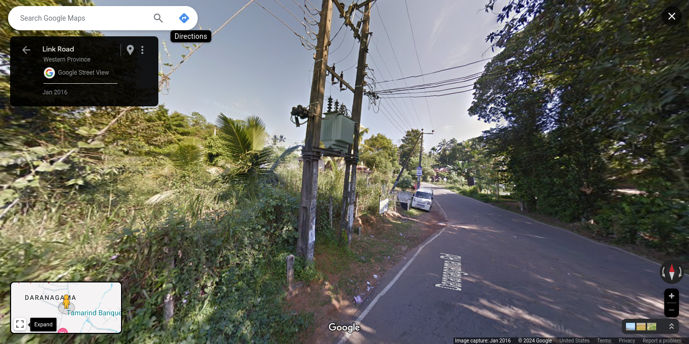

## Dunudambuwewa

**Dunudambuwewa** Grama Niladhari Division, **Nochchiyagama** Divisional Secretariat Division, **Anuradhapura** District, **North Central** Province

**Anuradhapura West** Polling Division, **Anuradhapura** Electoral District

Population: 1,393 (2012)

(**LK-7139095**/336)

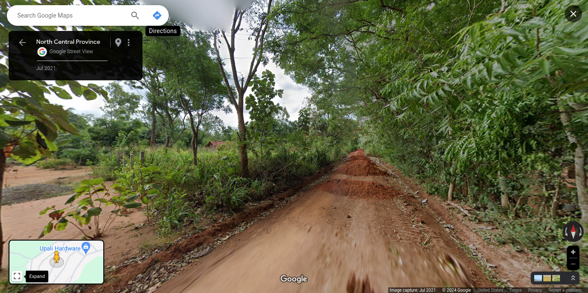

## Ragama

**Ragama** Grama Niladhari Division, **Ja-Ela** Divisional Secretariat Division, **Gampaha** District, **Western** Province

**Ja Ela** Polling Division, **Gampaha** Electoral District

Population: 3,985 (2012)

(**LK-1221270**/181)

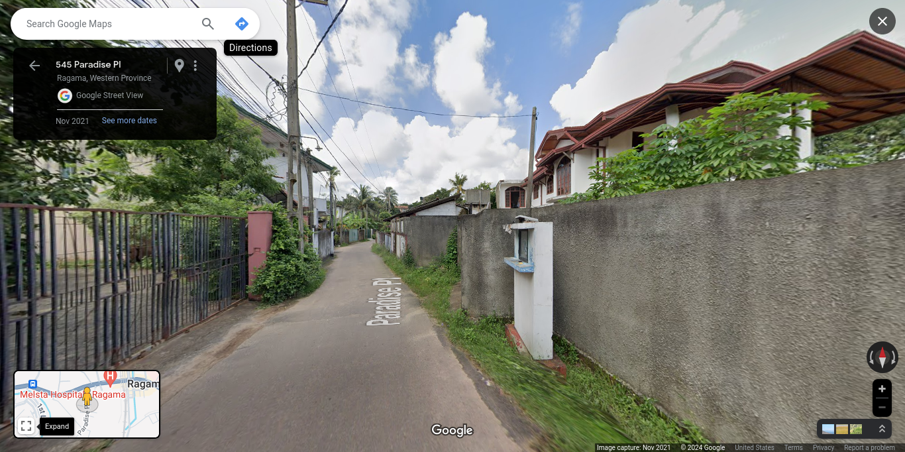

## Hurulu Jayapura

**Hurulu Jayapura** Grama Niladhari Division, **Galenbindunuwewa** Divisional Secretariat Division, **Anuradhapura** District, **North Central** Province

**Horowpothana** Polling Division, **Anuradhapura** Electoral District

Population: 931 (2012)

(**LK-7127155**/189)

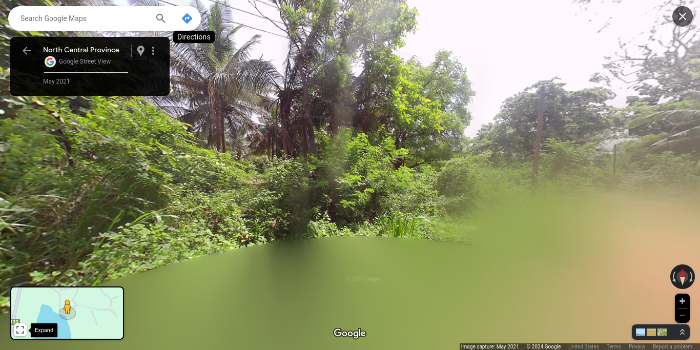

## Velikulam

**Velikulam** Grama Niladhari Division, **Vavuniya** Divisional Secretariat Division, **Vavuniya** District, **Northern** Province

**Vavuniya** Polling Division, **Vanni** Electoral District

Population: 2,269 (2012)

(**LK-4309160**/244D)

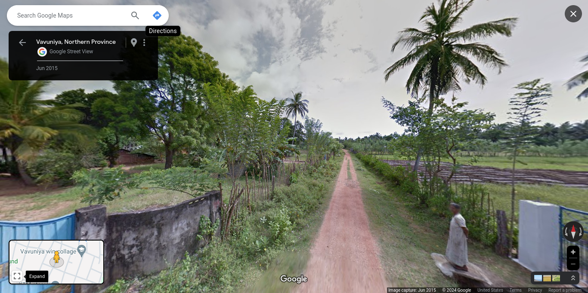

## Vinayagapuram 2

**Vinayagapuram 2** Grama Niladhari Division, **Thirukkovil** Divisional Secretariat Division, **Ampara** District, **Eastern** Province

**Pothuvil** Polling Division, **Digamadulla** Electoral District

Population: 1,481 (2012)

(**LK-5245075**/TK/10A/1)

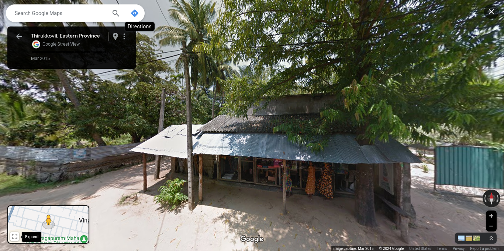

## Galketiya

**Galketiya** Grama Niladhari Division, **Bope-Poddala** Divisional Secretariat Division, **Galle** District, **Southern** Province

**Akmeemana** Polling Division, **Galle** Electoral District

Population: 936 (2012)

(**LK-3142125**/126B)

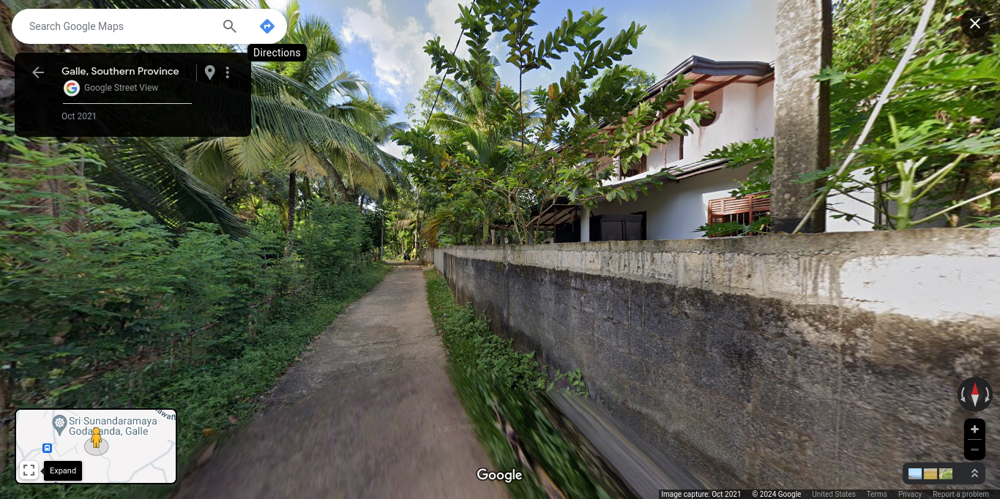

## Mihindupura

**Mihindupura** Grama Niladhari Division, **Beliatta** Divisional Secretariat Division, **Hambantota** District, **Southern** Province

**Beliatta** Polling Division, **Hambantota** Electoral District

Population: 734 (2012)

(**LK-3330300**/364)

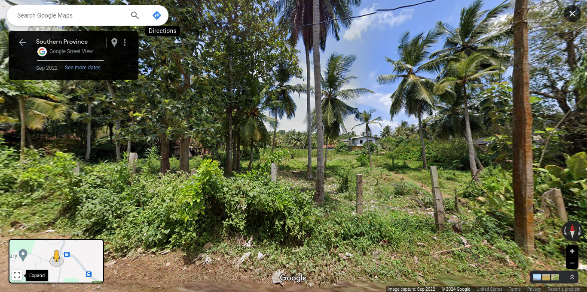

## Uduthurai

**Uduthurai** Grama Niladhari Division, **Vadamaradchi East** Divisional Secretariat Division, **Jaffna** District, **Northern** Province

**Kayts** Polling Division, **Jaffna** Electoral District

Population: 1,526 (2012)

(**LK-4124065**/430)

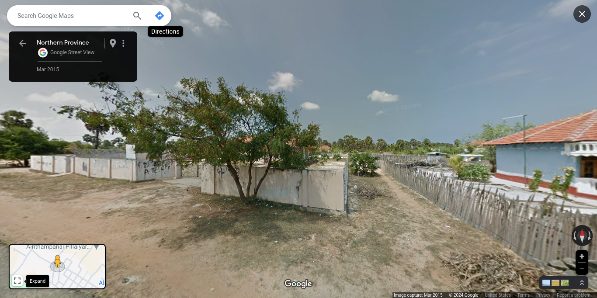

## Narawelpita South

**Narawelpita South** Grama Niladhari Division, **Hakmana** Divisional Secretariat Division, **Matara** District, **Southern** Province

**Hakmana** Polling Division, **Matara** Electoral District

Population: 903 (2012)

(**LK-3230085**/297)

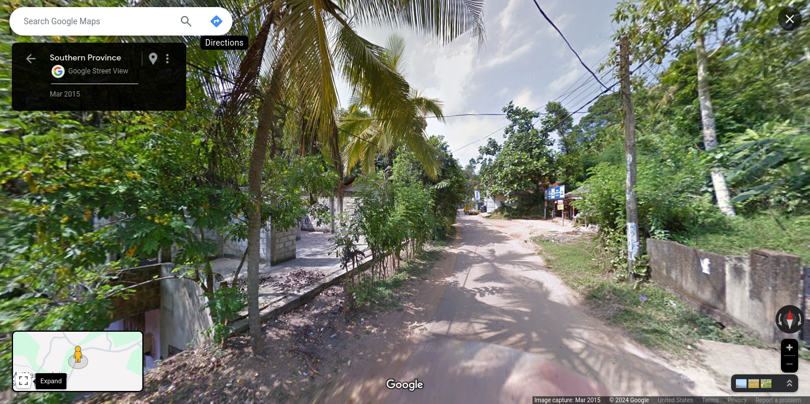

## Galavilawatta South

**Galavilawatta South** Grama Niladhari Division, **Homagama** Divisional Secretariat Division, **Colombo** District, **Western** Province

**Homagama** Polling Division, **Colombo** Electoral District

Population: 3,360 (2012)

(**LK-1112195**/486G)

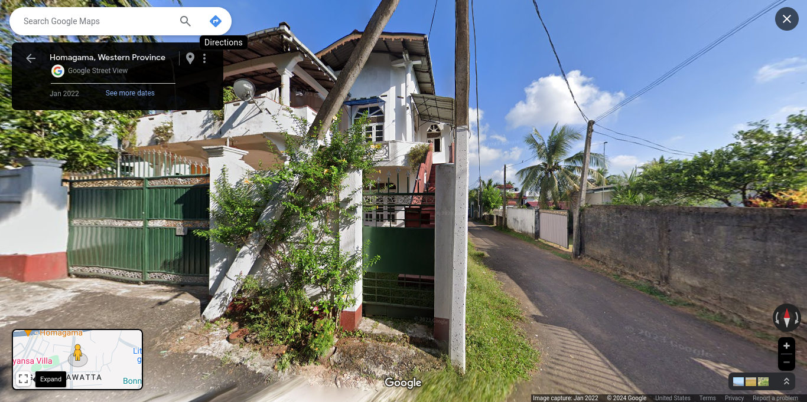

## Madawalamulla South

**Madawalamulla South** Grama Niladhari Division, **Galle Four Gravets** Divisional Secretariat Division, **Galle** District, **Southern** Province

**Galle** Polling Division, **Galle** Electoral District

Population: 1,216 (2012)

(**LK-3139065**/98)

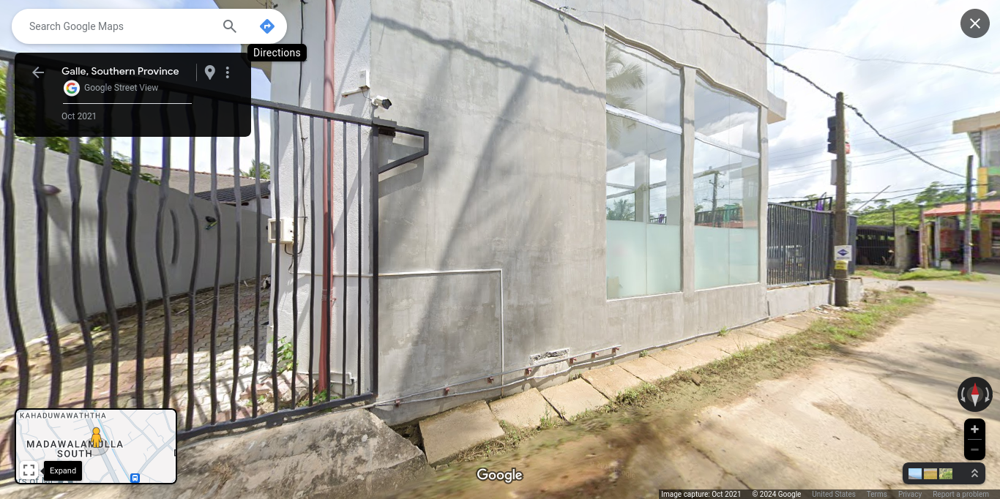

## Pallikkudawa Urban

**Pallikkudawa Urban** Grama Niladhari Division, **Tangalle** Divisional Secretariat Division, **Hambantota** District, **Southern** Province

**Tangalle** Polling Division, **Hambantota** Electoral District

Population: 1,315 (2012)

(**LK-3333255**/273)

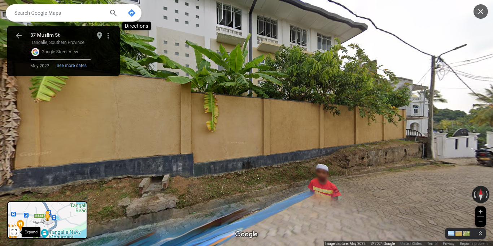

## Hettipola

**Hettipola** Grama Niladhari Division, **Panduwasnuwara West** Divisional Secretariat Division, **Kurunegala** District, **North Western** Province

**Panduwasnuwara** Polling Division, **Kurunegala** Electoral District

Population: 1,400 (2012)

(**LK-6145160**/1336)

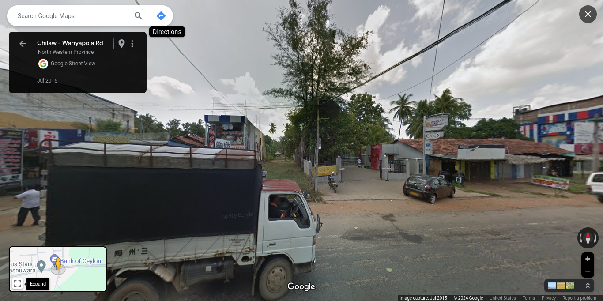

## Bulugahagoda East

**Bulugahagoda East** Grama Niladhari Division, **Gampaha** Divisional Secretariat Division, **Gampaha** District, **Western** Province

**Gampaha** Polling Division, **Gampaha** Electoral District

Population: 1,029 (2012)

(**LK-1224220**/210)

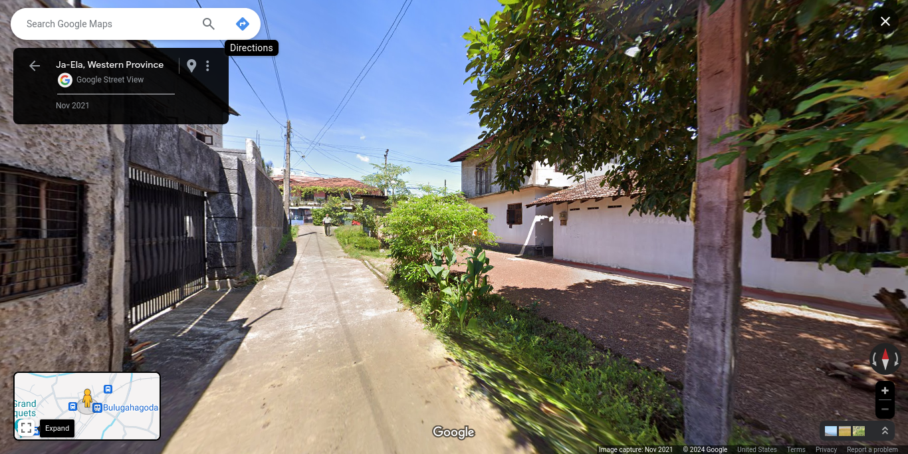

## Manduvil

**Manduvil** Grama Niladhari Division, **Thenmaradchi (Chavakachcheri)** Divisional Secretariat Division, **Jaffna** District, **Northern** Province

**Chavakachcheri** Polling Division, **Jaffna** Electoral District

Population: 1,080 (2012)

(**LK-4130085**/J/304)

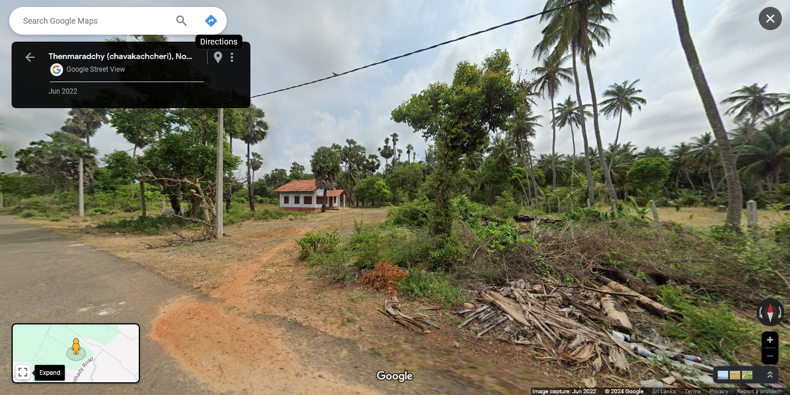

## Mahawatta

**Mahawatta** Grama Niladhari Division, **Kalutara** Divisional Secretariat Division, **Kalutara** District, **Western** Province

**Kalutara** Polling Division, **Kalutara** Electoral District

Population: 2,131 (2012)

(**LK-1321325**/727)

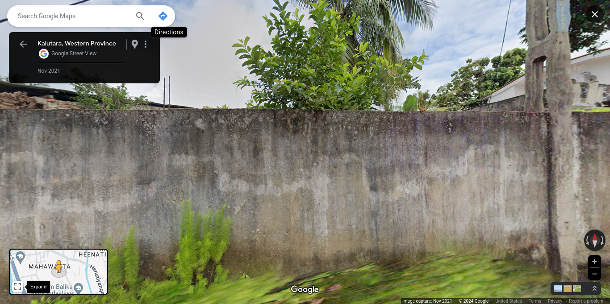

## Udayarthoppuwa

**Udayarthoppuwa** Grama Niladhari Division, **Negombo** Divisional Secretariat Division, **Gampaha** District, **Western** Province

**Negombo** Polling Division, **Gampaha** Electoral District

Population: 4,027 (2012)

(**LK-1203100**/160)

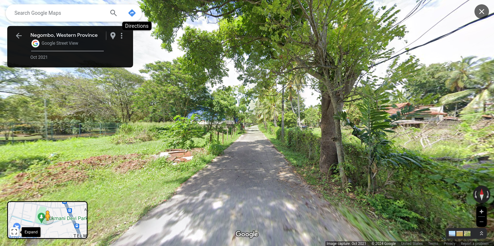

## Omara West

**Omara West** Grama Niladhari Division, **Walasmulla** Divisional Secretariat Division, **Hambantota** District, **Southern** Province

**Mulkirigala** Polling Division, **Hambantota** Electoral District

Population: 768 (2012)

(**LK-3325185**/451)

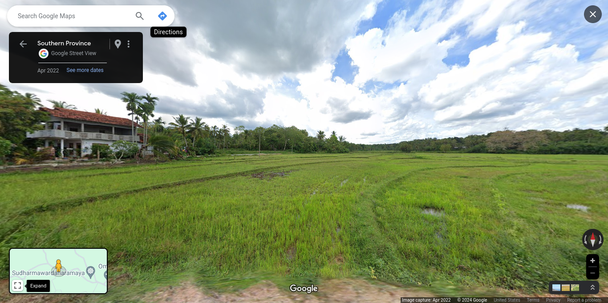

## Mangalagama

**Mangalagama** Grama Niladhari Division, **Yatinuwara** Divisional Secretariat Division, **Kandy** District, **Central** Province

**Yatinuwara** Polling Division, **Kandy** Electoral District

Population: 1,047 (2012)

(**LK-2136250**/146)

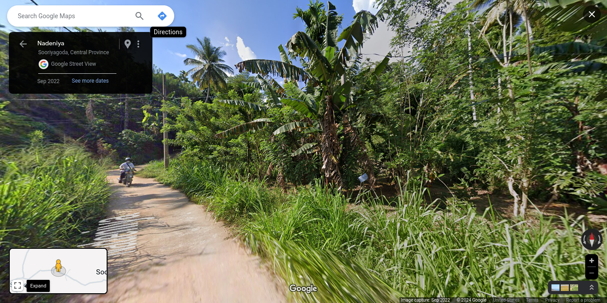

## Raddolugama South

**Raddolugama South** Grama Niladhari Division, **Katana** Divisional Secretariat Division, **Gampaha** District, **Western** Province

**Katana** Polling Division, **Gampaha** Electoral District

Population: 1,894 (2012)

(**LK-1206310**/199B)

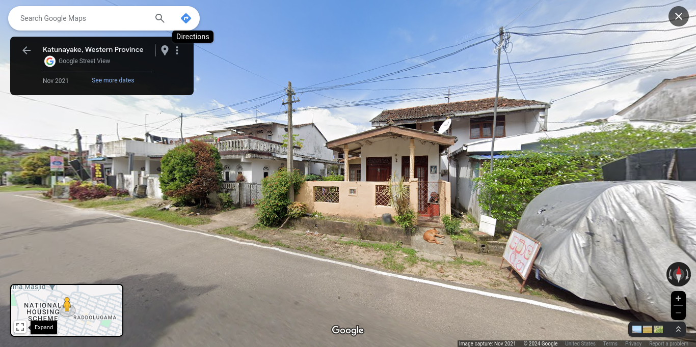

## Meemana

**Meemana** Grama Niladhari Division, **Horana** Divisional Secretariat Division, **Kalutara** District, **Western** Province

**Horana** Polling Division, **Kalutara** Electoral District

Population: 2,157 (2012)

(**LK-1309180**/611A)

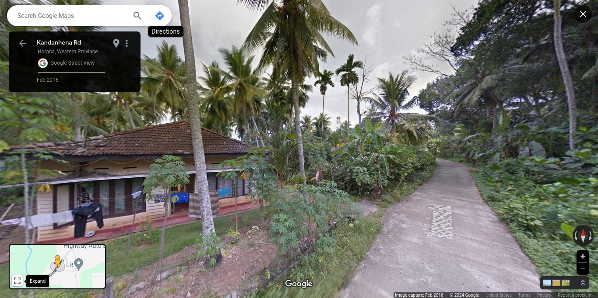

## Pattiya

**Pattiya** Grama Niladhari Division, **Panadura** Divisional Secretariat Division, **Kalutara** District, **Western** Province

**Panadura** Polling Division, **Kalutara** Electoral District

Population: 1,395 (2012)

(**LK-1303240**/686B)

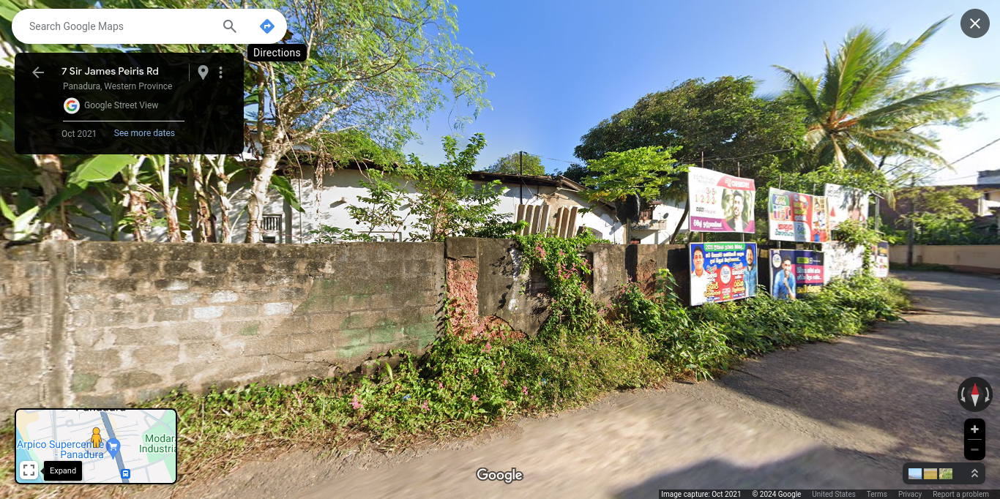

## Jayanthiwewa

**Jayanthiwewa** Grama Niladhari Division, **Padavi Sri Pura** Divisional Secretariat Division, **Trincomalee** District, **Eastern** Province

**Seruvila** Polling Division, **Trincomalee** Electoral District

Population: 1,787 (2012)

(**LK-5303050**/31I)

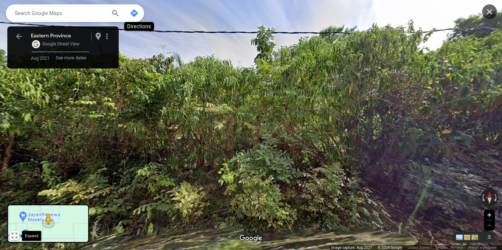

## Maha Elagamuwa

**Maha Elagamuwa** Grama Niladhari Division, **Kekirawa** Divisional Secretariat Division, **Anuradhapura** District, **North Central** Province

**Kekirawa** Polling Division, **Anuradhapura** Electoral District

Population: 1,732 (2012)

(**LK-7154210**/641)

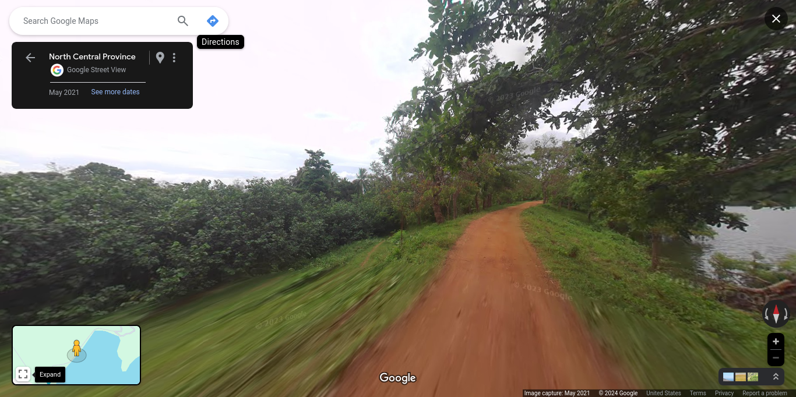

## Nammuwawa

**Nammuwawa** Grama Niladhari Division, **Rasnayakapura** Divisional Secretariat Division, **Kurunegala** District, **North Western** Province

**Nikaweratiya** Polling Division, **Kurunegala** Electoral District

Population: 1,939 (2012)

(**LK-6118095**/291)

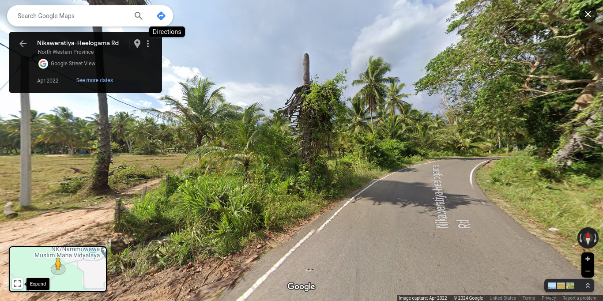

## Wattegama South

**Wattegama South** Grama Niladhari Division, **Dickwella** Divisional Secretariat Division, **Matara** District, **Southern** Province

**Devinuwara** Polling Division, **Matara** Electoral District

Population: 1,904 (2012)

(**LK-3248170**/451B)

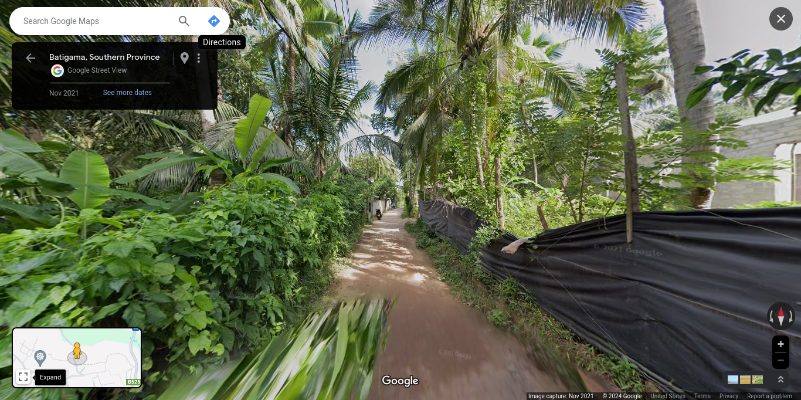

## Chunnakam Town  West

**Chunnakam Town  West** Grama Niladhari Division, **Valikamam South (Uduvil)** Divisional Secretariat Division, **Jaffna** District, **Northern** Province

**Manipay** Polling Division, **Jaffna** Electoral District

Population: 1,650 (2012)

(**LK-4115090**/J/199)

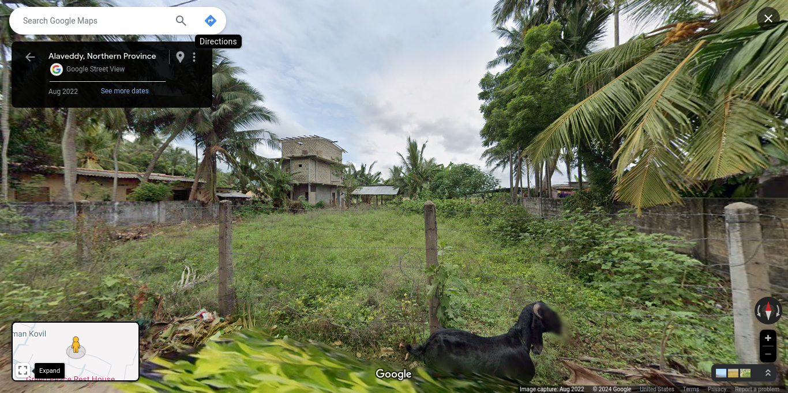

## Kahanda Athireka 1

**Kahanda Athireka 1** Grama Niladhari Division, **Imaduwa** Divisional Secretariat Division, **Galle** District, **Southern** Province

**Habaraduwa** Polling Division, **Galle** Electoral District

Population: 859 (2012)

(**LK-3151110**/167A)

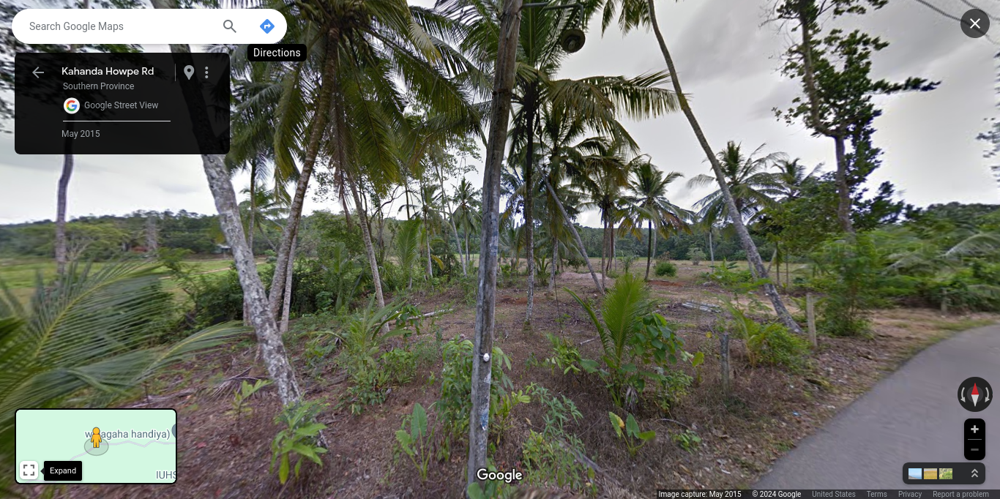

## Pinwatta

**Pinwatta** Grama Niladhari Division, **Panadura** Divisional Secretariat Division, **Kalutara** District, **Western** Province

**Panadura** Polling Division, **Kalutara** Electoral District

Population: 3,409 (2012)

(**LK-1303295**/696)

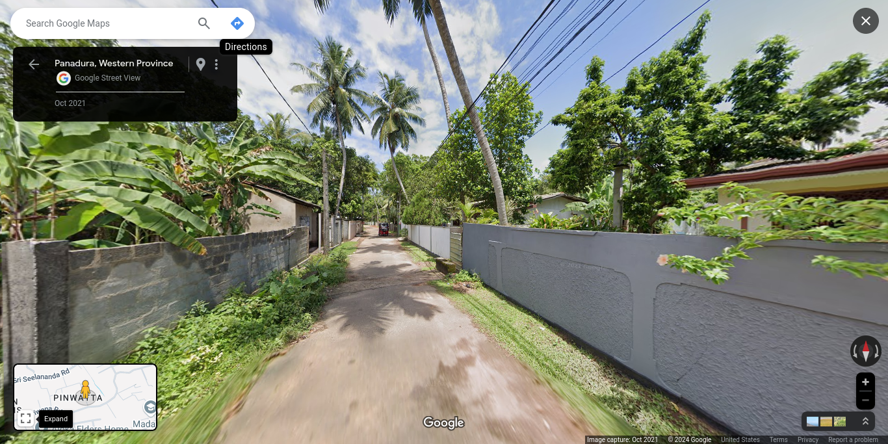

## Nugewela

**Nugewela** Grama Niladhari Division, **Beliatta** Divisional Secretariat Division, **Hambantota** District, **Southern** Province

**Beliatta** Polling Division, **Hambantota** Electoral District

Population: 899 (2012)

(**LK-3330030**/310)

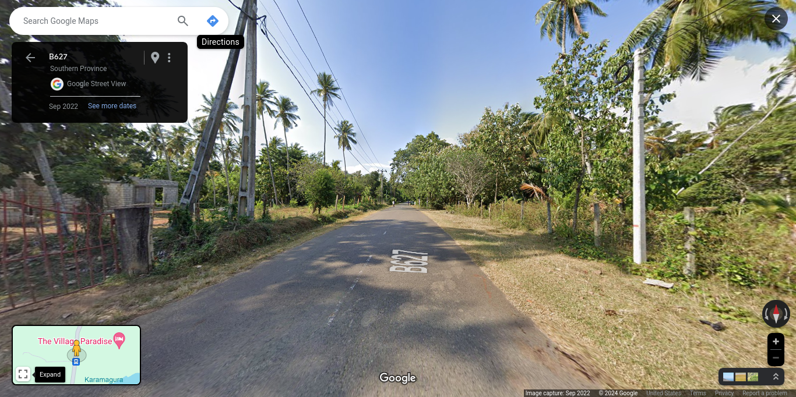

## Divurumpitiya

**Divurumpitiya** Grama Niladhari Division, **Eheliyagoda** Divisional Secretariat Division, **Ratnapura** District, **Sabaragamuwa** Province

**Eheliyagoda** Polling Division, **Ratnapura** Electoral District

Population: 3,169 (2012)

(**LK-9103005**/137B)

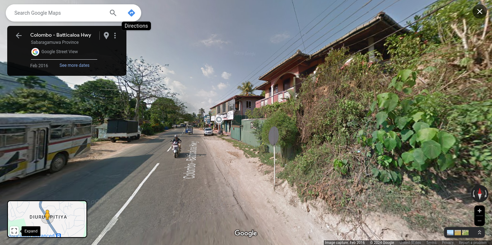

## Muttakkarai

**Muttakkarai** Grama Niladhari Division, **Negombo** Divisional Secretariat Division, **Gampaha** District, **Western** Province

**Negombo** Polling Division, **Gampaha** Electoral District

Population: 2,975 (2012)

(**LK-1203130**/156)

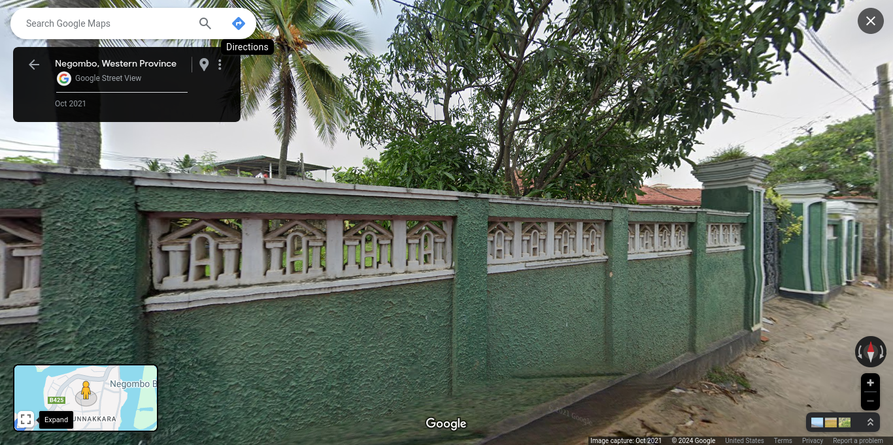

## Thimbirigaskatuwa

**Thimbirigaskatuwa** Grama Niladhari Division, **Katana** Divisional Secretariat Division, **Gampaha** District, **Western** Province

**Katana** Polling Division, **Gampaha** Electoral District

Population: 2,594 (2012)

(**LK-1206110**/71)

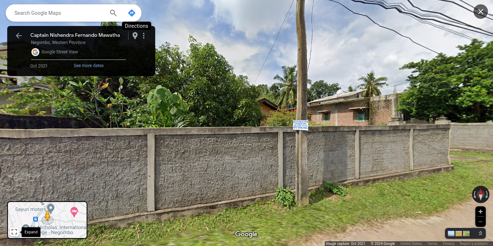

## Kirimetiya

**Kirimetiya** Grama Niladhari Division, **Rattota** Divisional Secretariat Division, **Matale** District, **Central** Province

**Rattota** Polling Division, **Matale** Electoral District

Population: 628 (2012)

(**LK-2230050**/E378B)

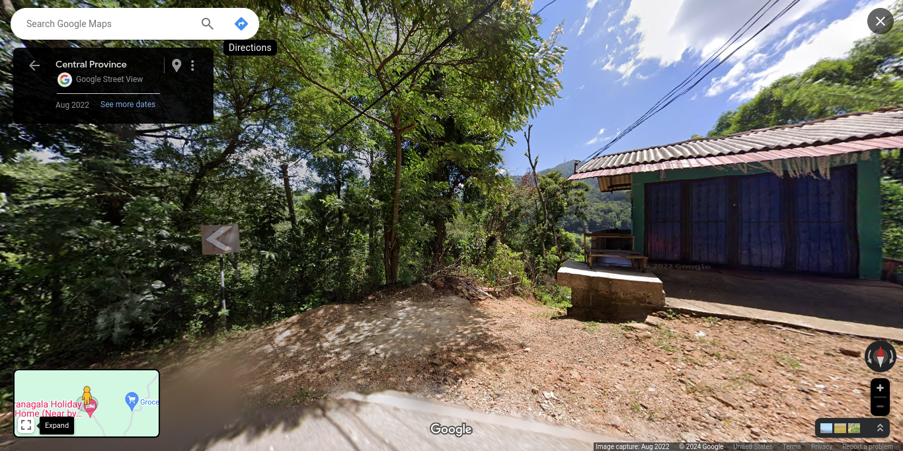

## Wettumakada

**Wettumakada** Grama Niladhari Division, **Kalutara** Divisional Secretariat Division, **Kalutara** District, **Western** Province

**Kalutara** Polling Division, **Kalutara** Electoral District

Population: 2,051 (2012)

(**LK-1321340**/730)

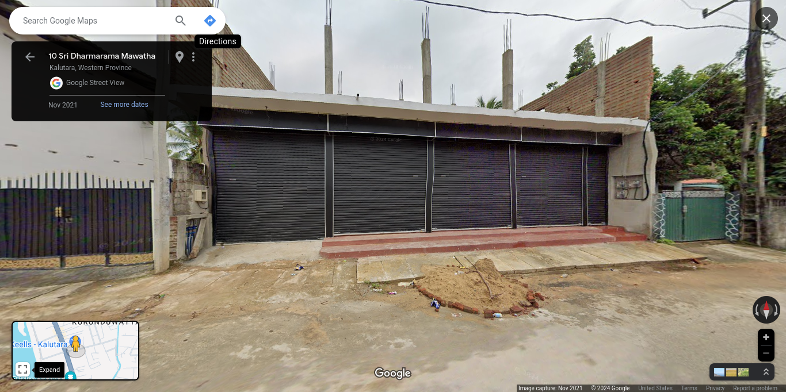

## Udubettawa West

**Udubettawa West** Grama Niladhari Division, **Yakkalamulla** Divisional Secretariat Division, **Galle** District, **Southern** Province

**Baddegama** Polling Division, **Galle** Electoral District

Population: 790 (2012)

(**LK-3148175**/183C)

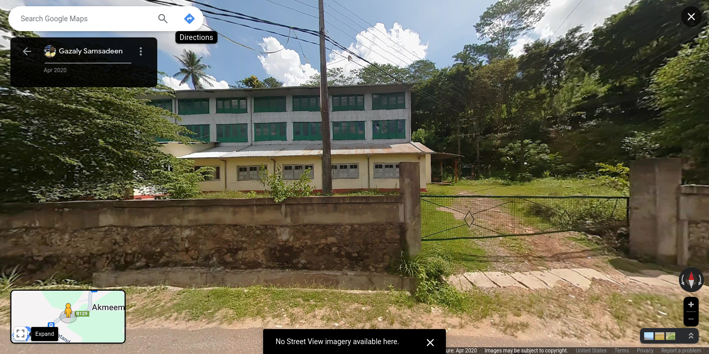

## Koralawella North

**Koralawella North** Grama Niladhari Division, **Moratuwa** Divisional Secretariat Division, **Colombo** District, **Western** Province

**Moratuwa** Polling Division, **Colombo** Electoral District

Population: 5,696 (2012)

(**LK-1133170**/554)

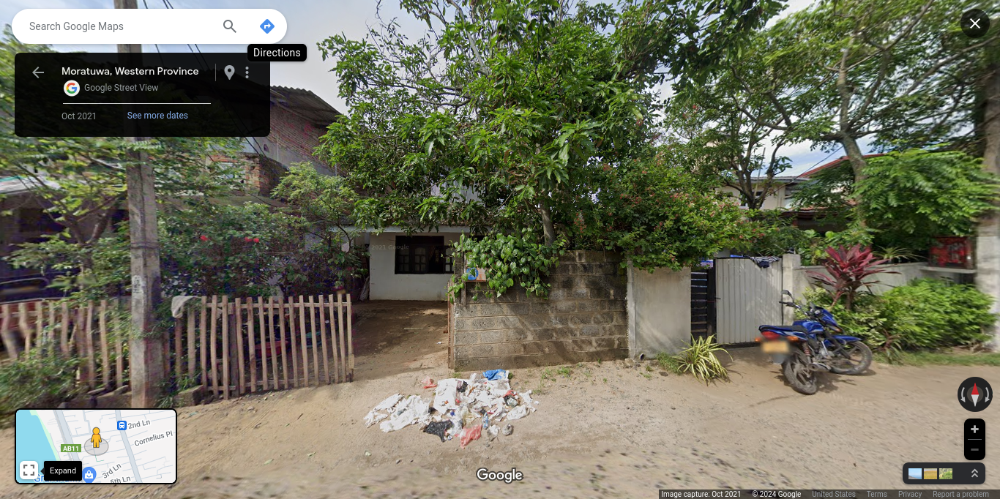

## Heiyanthuduwa West

**Heiyanthuduwa West** Grama Niladhari Division, **Biyagama** Divisional Secretariat Division, **Gampaha** District, **Western** Province

**Biyagama** Polling Division, **Gampaha** Electoral District

Population: 2,180 (2012)

(**LK-1239130**/275C)

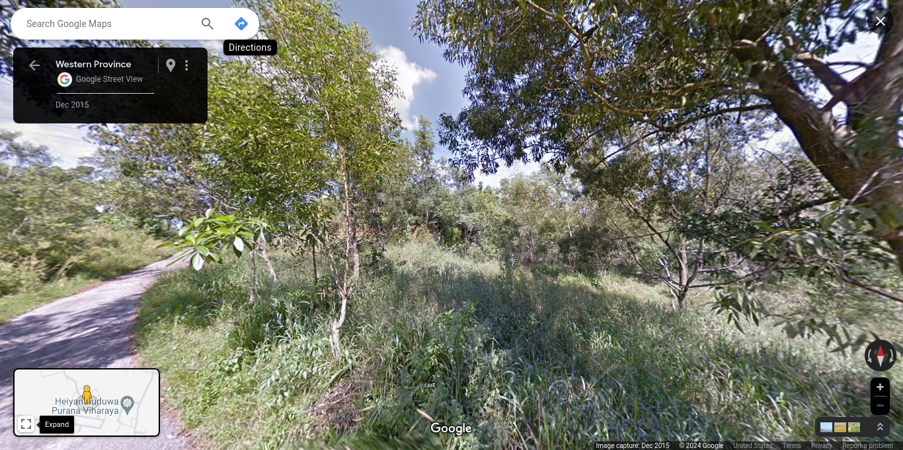

## Kaduruduwa

**Kaduruduwa** Grama Niladhari Division, **Akmeemana** Divisional Secretariat Division, **Galle** District, **Southern** Province

**Akmeemana** Polling Division, **Galle** Electoral District

Population: 1,651 (2012)

(**LK-3145240**/134B)

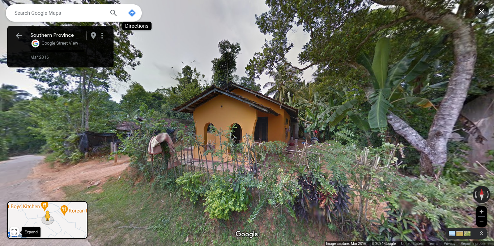

## Bazaar West

**Bazaar West** Grama Niladhari Division, **Panadura** Divisional Secretariat Division, **Kalutara** District, **Western** Province

**Panadura** Polling Division, **Kalutara** Electoral District

Population: 811 (2012)

(**LK-1303200**/685C)

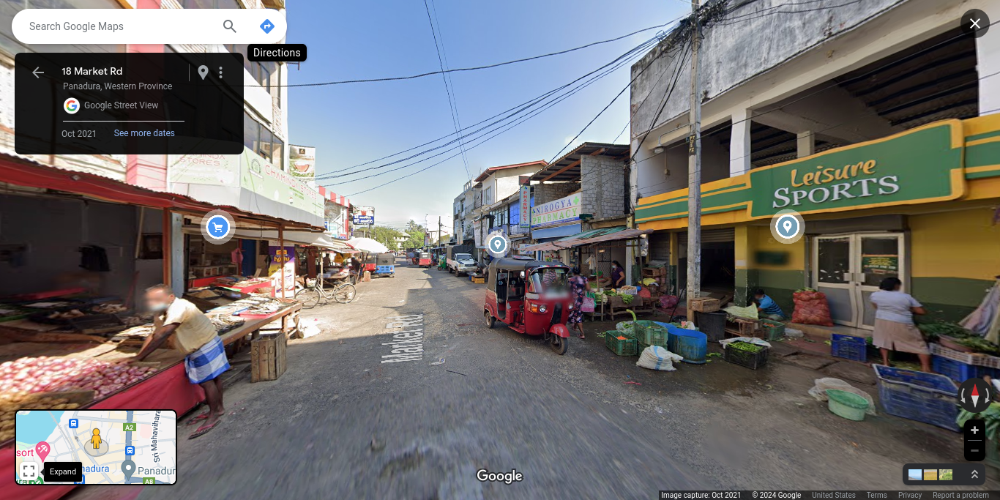

## Dodampahala North

**Dodampahala North** Grama Niladhari Division, **Dickwella** Divisional Secretariat Division, **Matara** District, **Southern** Province

**Devinuwara** Polling Division, **Matara** Electoral District

Population: 1,355 (2012)

(**LK-3248120**/453B)

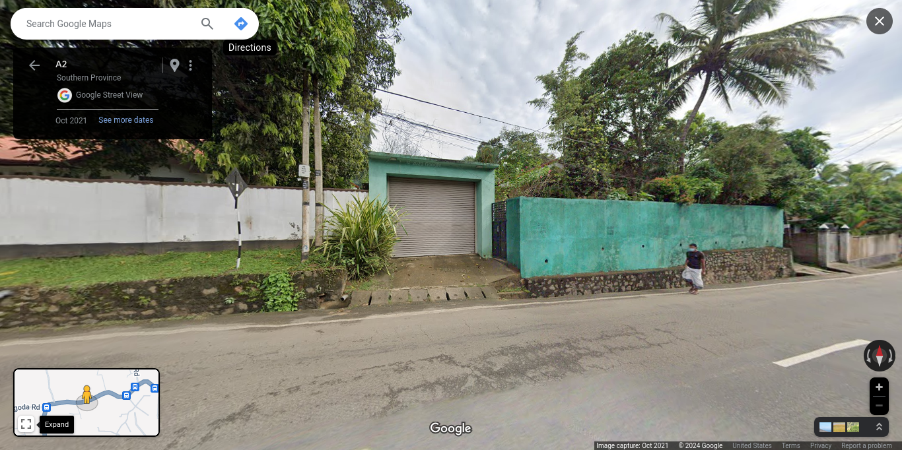

## Mihindupura

**Mihindupura** Grama Niladhari Division, **Beliatta** Divisional Secretariat Division, **Hambantota** District, **Southern** Province

**Beliatta** Polling Division, **Hambantota** Electoral District

Population: 734 (2012)

(**LK-3330300**/364)

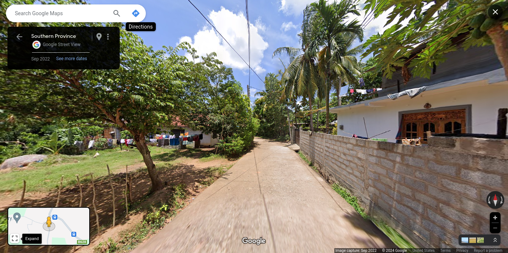

## Kehelbaddara West

**Kehelbaddara West** Grama Niladhari Division, **Minuwangoda** Divisional Secretariat Division, **Gampaha** District, **Western** Province

**Minuwangoda** Polling Division, **Gampaha** Electoral District

Population: 1,613 (2012)

(**LK-1215460**/140/1)

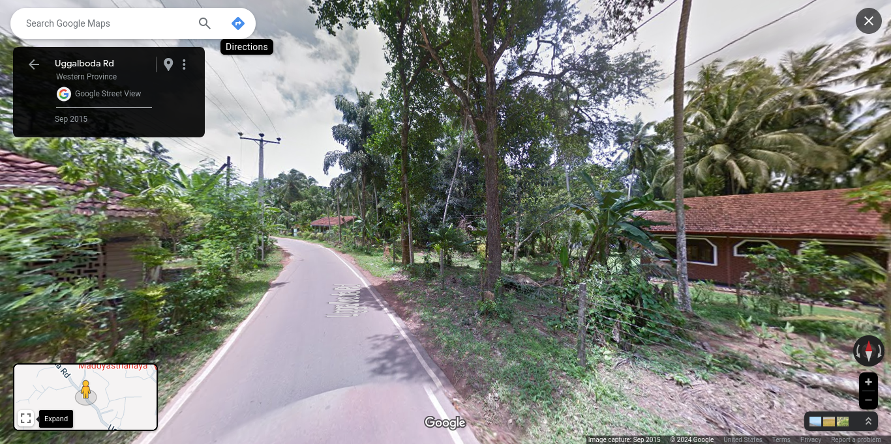

## Saliya Mawatha

**Saliya Mawatha** Grama Niladhari Division, **Nuwaragam Palatha Central** Divisional Secretariat Division, **Anuradhapura** District, **North Central** Province

**Anuradhapura West** Polling Division, **Anuradhapura** Electoral District

Population: 1,895 (2012)

(**LK-7115160**/318)

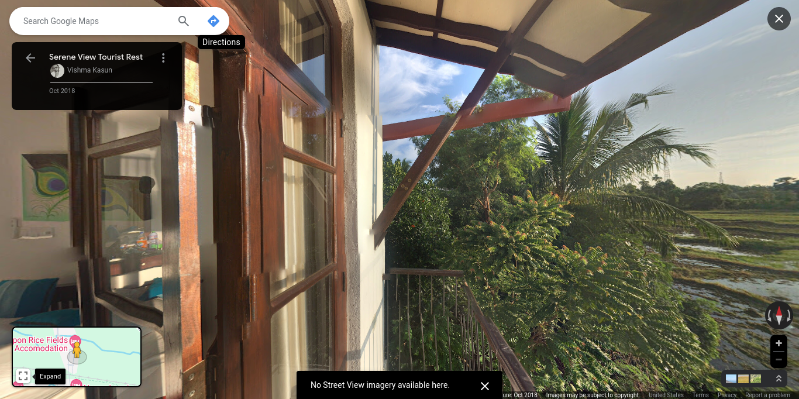

## Kanupelella

**Kanupelella** Grama Niladhari Division, **Badulla** Divisional Secretariat Division, **Badulla** District, **Uva** Province

**Badulla** Polling Division, **Badulla** Electoral District

Population: 1,990 (2012)

(**LK-8121145**/78F)

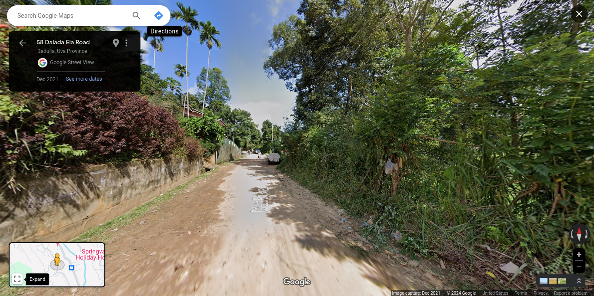

## Mawella South

**Mawella South** Grama Niladhari Division, **Tangalle** Divisional Secretariat Division, **Hambantota** District, **Southern** Province

**Beliatta** Polling Division, **Hambantota** Electoral District

Population: 501 (2012)

(**LK-3333345**/293)

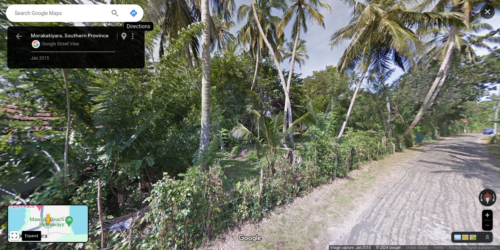

## Kattankudy Division 1

**Kattankudy Division 1** Grama Niladhari Division, **Kattankudy** Divisional Secretariat Division, **Batticaloa** District, **Eastern** Province

**Batticaloa** Polling Division, **Batticaloa** Electoral District

Population: 1,133 (2012)

(**LK-5124005**/167)

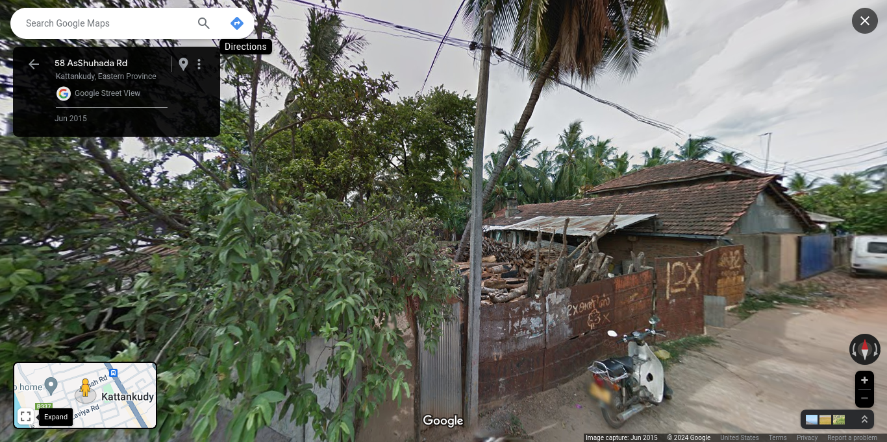

## Kurunegala Town - East

**Kurunegala Town - East** Grama Niladhari Division, **Kurunegala** Divisional Secretariat Division, **Kurunegala** District, **North Western** Province

**Kurunegala** Polling Division, **Kurunegala** Electoral District

Population: 1,531 (2012)

(**LK-6154170**/835)

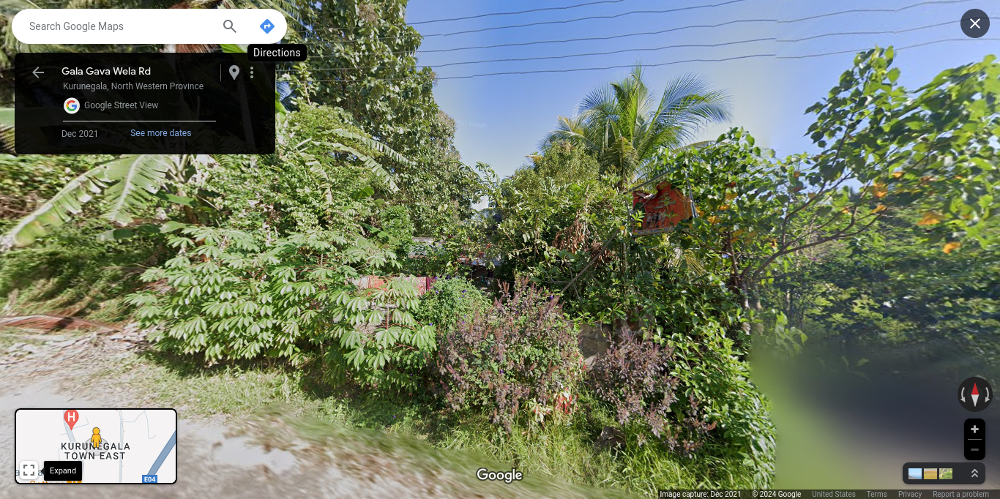

## Jambuthenna

**Jambuthenna** Grama Niladhari Division, **Ambagamuwa** Divisional Secretariat Division, **Nuwara Eliya** District, **Central** Province

**Nuwara Eliya Maskeliya** Polling Division, **Nuwara-Eliya** Electoral District

Population: 1,164 (2012)

(**LK-2315125**/318D)

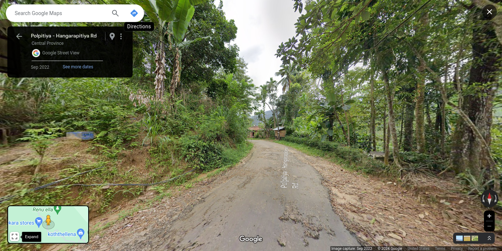

## Metiwala

**Metiwala** Grama Niladhari Division, **Ambalangoda** Divisional Secretariat Division, **Galle** District, **Southern** Province

**Ambalangoda** Polling Division, **Galle** Electoral District

Population: 880 (2012)

(**LK-3133175**/68)

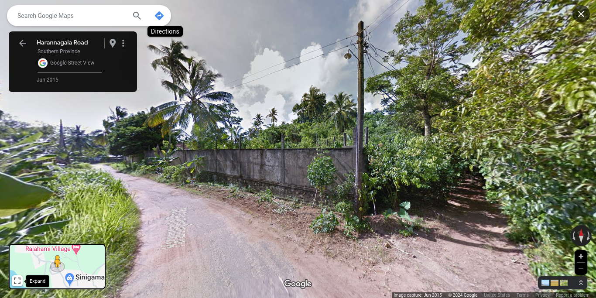

## Walgama Meda

**Walgama Meda** Grama Niladhari Division, **Matara Four Gravets** Divisional Secretariat Division, **Matara** District, **Southern** Province

**Matara** Polling Division, **Matara** Electoral District

Population: 1,955 (2012)

(**LK-3242240**/409C)

## Bahirawa Kanda

**Bahirawa Kanda** Grama Niladhari Division, **Kandy Four Gravets & Gangawata Korale** Divisional Secretariat Division, **Kandy** District, **Central** Province

**Mahanuwara** Polling Division, **Kandy** Electoral District

Population: 2,744 (2012)

(**LK-2130090**/236)

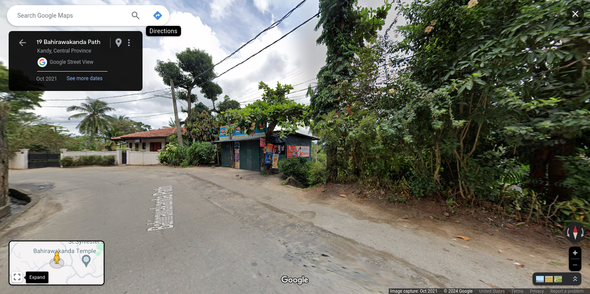

## Pinwala East

**Pinwala East** Grama Niladhari Division, **Bandaragama** Divisional Secretariat Division, **Kalutara** District, **Western** Province

**Bandaragama** Polling Division, **Kalutara** Electoral District

Population: 1,470 (2012)

(**LK-1306110**/688)

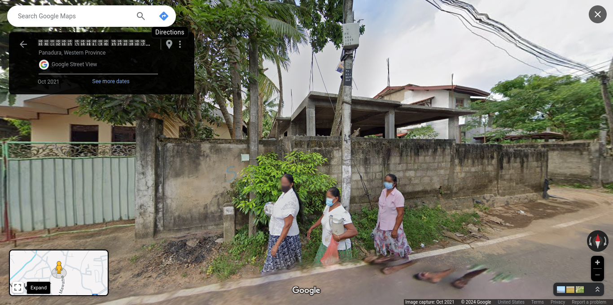

## Yatawara

**Yatawara** Grama Niladhari Division, **Pathadumbara** Divisional Secretariat Division, **Kandy** District, **Central** Province

**Pathadumbara** Polling Division, **Kandy** Electoral District

Population: 1,377 (2012)

(**LK-2112005**/620)

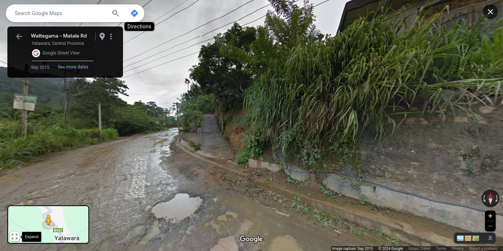

## Kudagala Kadirandola

**Kudagala Kadirandola** Grama Niladhari Division, **Elpitiya** Divisional Secretariat Division, **Galle** District, **Southern** Province

**Bentara Elpitiya** Polling Division, **Galle** Electoral District

Population: 1,584 (2012)

(**LK-3112190**/26C)

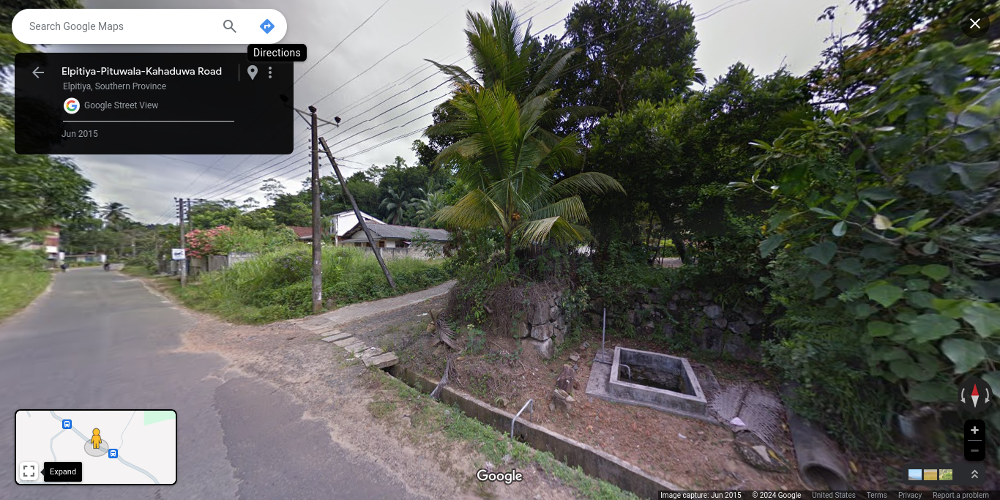

## Heenatiyana West

**Heenatiyana West** Grama Niladhari Division, **Katana** Divisional Secretariat Division, **Gampaha** District, **Western** Province

**Katana** Polling Division, **Gampaha** Electoral District

Population: 2,465 (2012)

(**LK-1206285**/153)

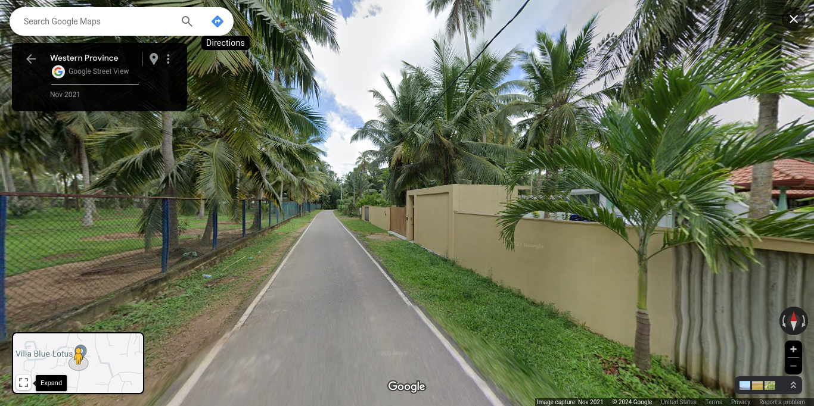

## Kallady

**Kallady** Grama Niladhari Division, **Manmunai North** Divisional Secretariat Division, **Batticaloa** District, **Eastern** Province

**Batticaloa** Polling Division, **Batticaloa** Electoral District

Population: 2,484 (2012)

(**LK-5118155**/171)

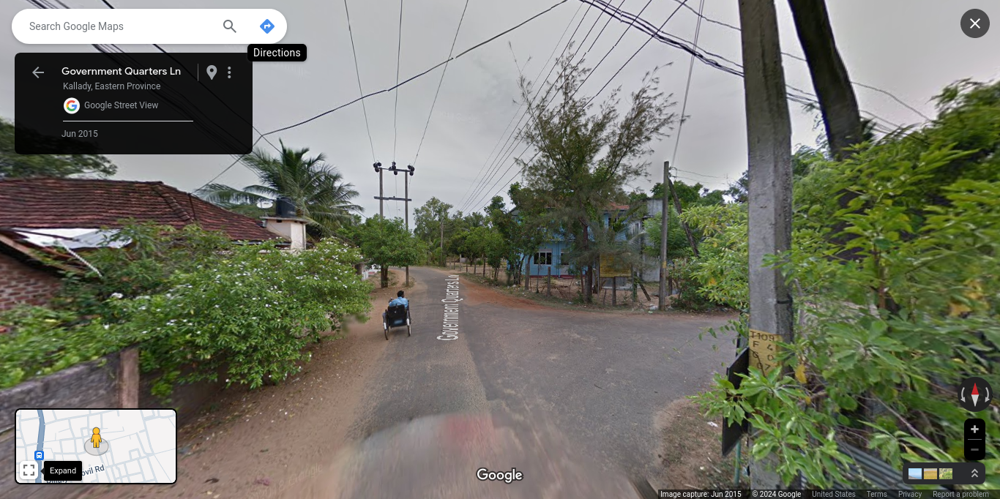

## Soysapura North

**Soysapura North** Grama Niladhari Division, **Moratuwa** Divisional Secretariat Division, **Colombo** District, **Western** Province

**Moratuwa** Polling Division, **Colombo** Electoral District

Population: 2,898 (2012)

(**LK-1133015**/548A)

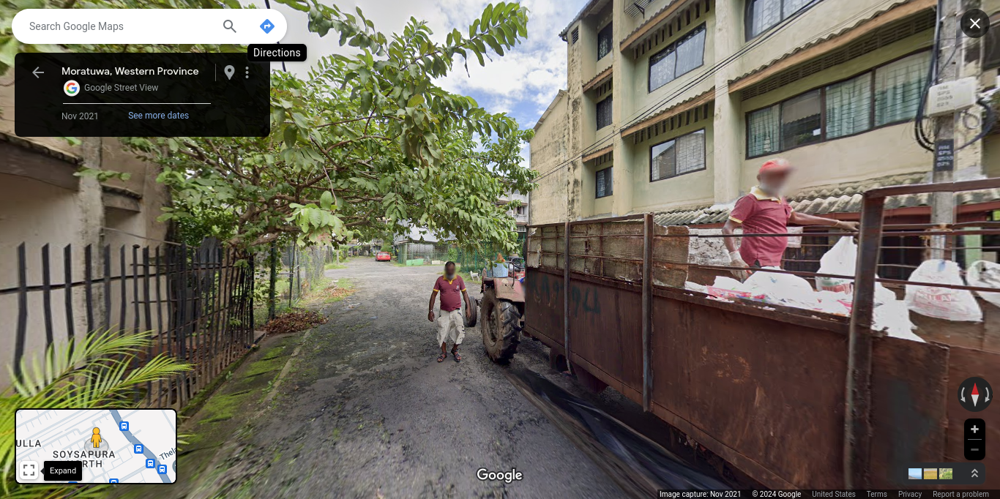

## Welata

**Welata** Grama Niladhari Division, **Kandy Four Gravets & Gangawata Korale** Divisional Secretariat Division, **Kandy** District, **Central** Province

**Mahanuwara** Polling Division, **Kandy** Electoral District

Population: 2,416 (2012)

(**LK-2130170**/260)

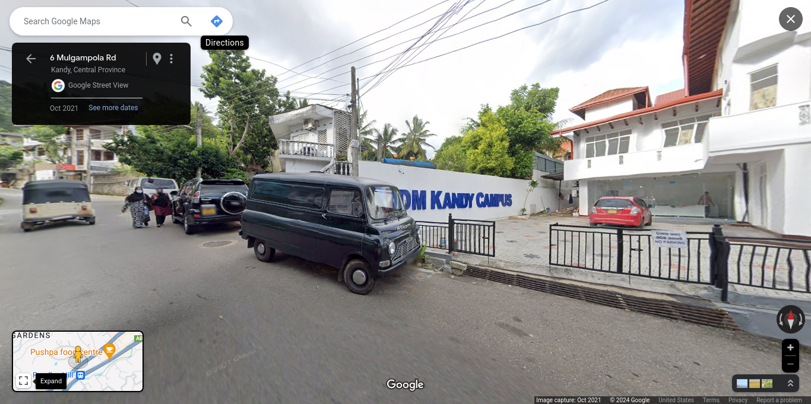

## Unakooruwa East

**Unakooruwa East** Grama Niladhari Division, **Tangalle** Divisional Secretariat Division, **Hambantota** District, **Southern** Province

**Tangalle** Polling Division, **Hambantota** Electoral District

Population: 1,183 (2012)

(**LK-3333295**/275)

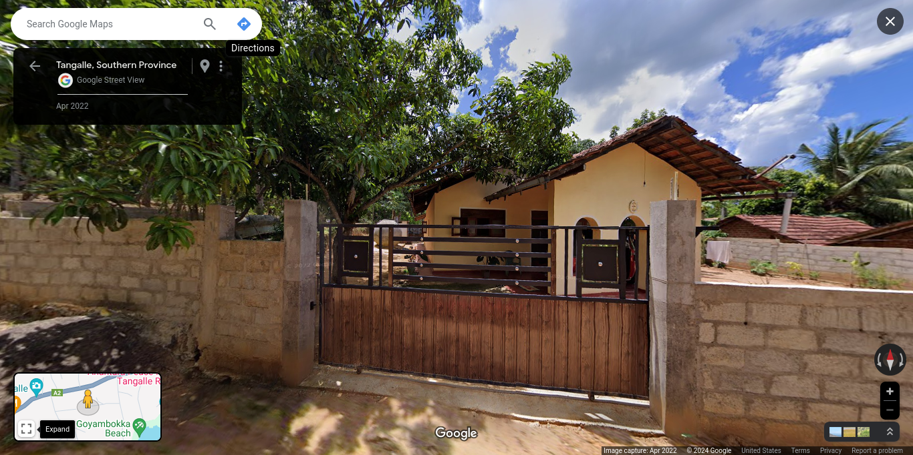

## Jaffna Town East

**Jaffna Town East** Grama Niladhari Division, **Jaffna** Divisional Secretariat Division, **Jaffna** District, **Northern** Province

**Jaffna** Polling Division, **Jaffna** Electoral District

Population: 1,988 (2012)

(**LK-4136070**/J/74)

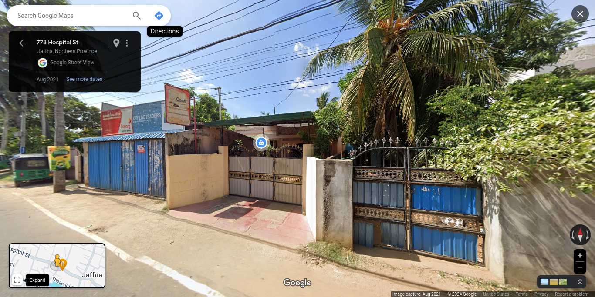

## Hettimulla

**Hettimulla** Grama Niladhari Division, **Divulapitiya** Divisional Secretariat Division, **Gampaha** District, **Western** Province

**Divulapitiya** Polling Division, **Gampaha** Electoral District

Population: 1,049 (2012)

(**LK-1209255**/52B)

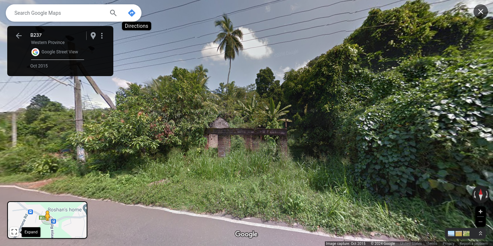

## Pallimulla

**Pallimulla** Grama Niladhari Division, **Panadura** Divisional Secretariat Division, **Kalutara** District, **Western** Province

**Panadura** Polling Division, **Kalutara** Electoral District

Population: 2,012 (2012)

(**LK-1303085**/673B)

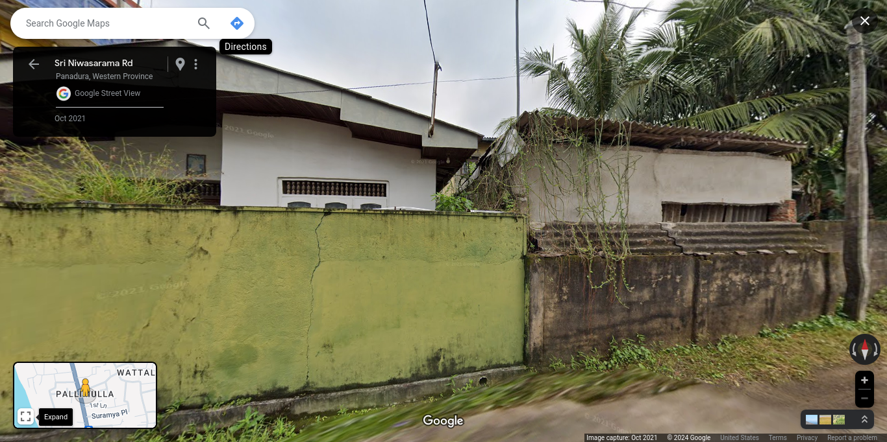

## Subhoothipura

**Subhoothipura** Grama Niladhari Division, **Kaduwela** Divisional Secretariat Division, **Colombo** District, **Western** Province

**Kaduwela** Polling Division, **Colombo** Electoral District

Population: 2,568 (2012)

(**LK-1109170**/492)

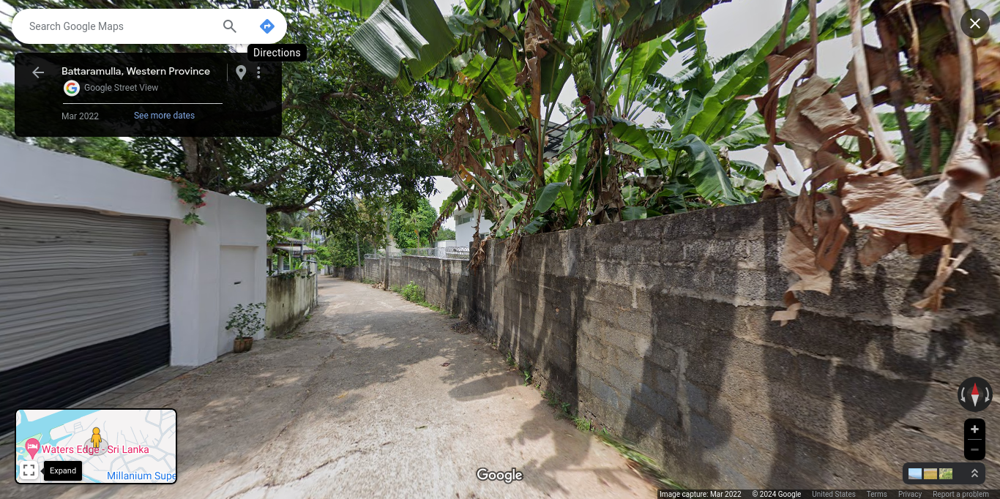

## Parawatta

**Parawatta** Grama Niladhari Division, **Matale** Divisional Secretariat Division, **Matale** District, **Central** Province

**Matale** Polling Division, **Matale** Electoral District

Population: 3,378 (2012)

(**LK-2218150**/E350B)

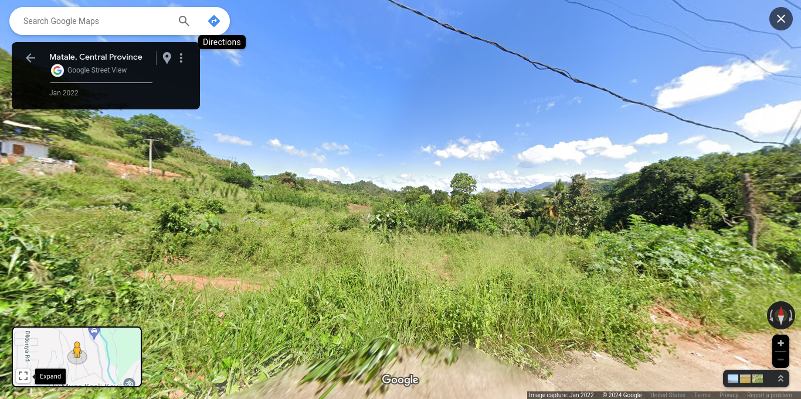

## Gerandiella

**Gerandiella** Grama Niladhari Division, **Passara** Divisional Secretariat Division, **Badulla** District, **Uva** Province

**Passara** Polling Division, **Badulla** Electoral District

Population: 1,607 (2012)

(**LK-8118045**/89F)

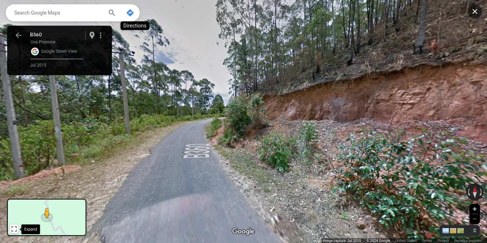

## Neeravipiddy West

**Neeravipiddy West** Grama Niladhari Division, **Maritimepattu** Divisional Secretariat Division, **Mullaitivu** District, **Northern** Province

**Mullaitivu** Polling Division, **Vanni** Electoral District

Population: 499 (2012)

(**LK-4415190**/MU/114)

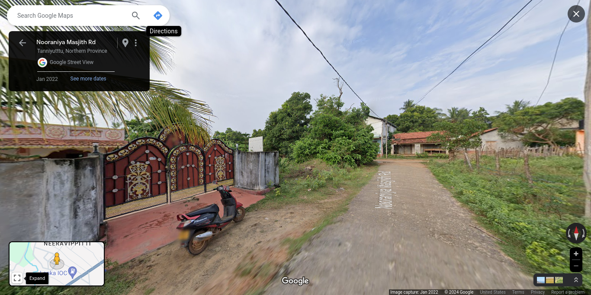

## Egodagama

**Egodagama** Grama Niladhari Division, **Bandarawela** Divisional Secretariat Division, **Badulla** District, **Uva** Province

**Bandarawela** Polling Division, **Badulla** Electoral District

Population: 1,532 (2012)

(**LK-8133085**/66E)

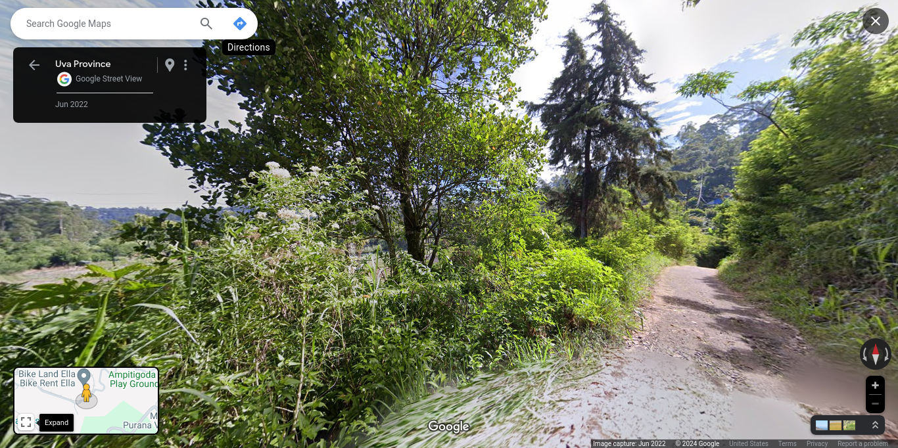

## Diviyagahawela

**Diviyagahawela** Grama Niladhari Division, **Karandeniya** Divisional Secretariat Division, **Galle** District, **Southern** Province

**Karandeniya** Polling Division, **Galle** Electoral District

Population: 2,587 (2012)

(**LK-3109170**/92C)

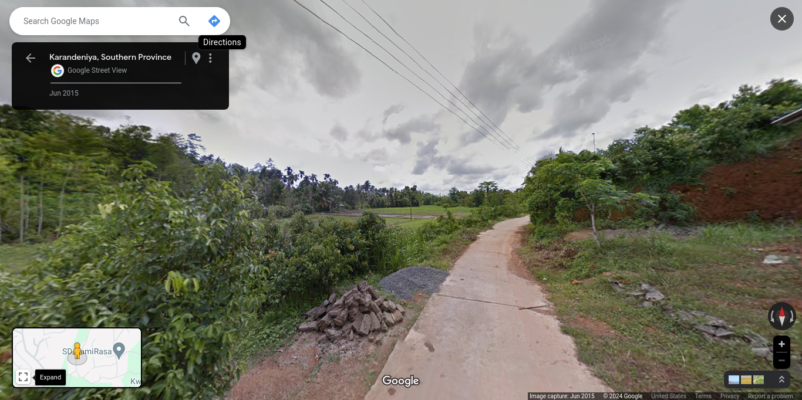

## Gonapathirawa

**Gonapathirawa** Grama Niladhari Division, **Ipalogama** Divisional Secretariat Division, **Anuradhapura** District, **North Central** Province

**Mihinthale** Polling Division, **Anuradhapura** Electoral District

Population: 1,640 (2012)

(**LK-7160025**/509)

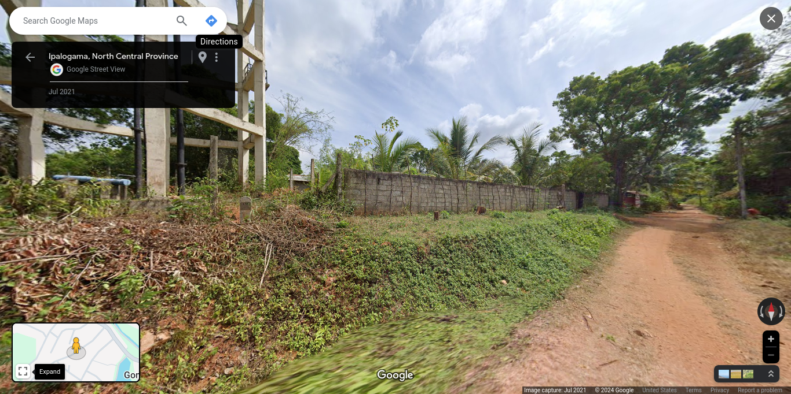

## Point Pedro

**Point Pedro** Grama Niladhari Division, **Vadamaradchi North (Point Pedro)** Divisional Secretariat Division, **Jaffna** District, **Northern** Province

**Point Pedro** Polling Division, **Jaffna** Electoral District

Population: 2,083 (2012)

(**LK-4127095**/J/401)

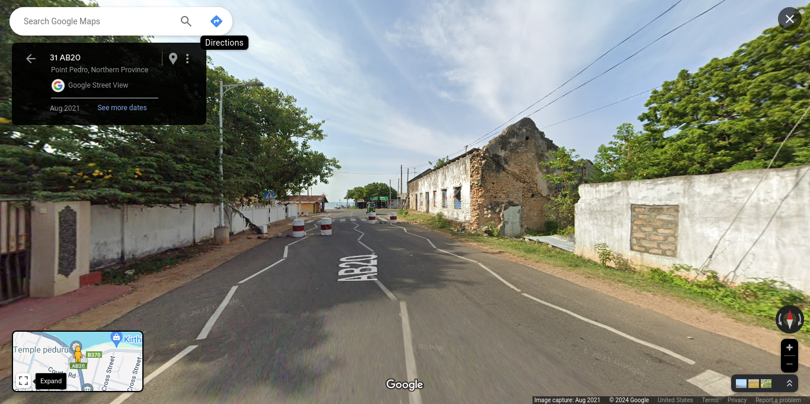

## Thotupala

**Thotupala** Grama Niladhari Division, **Kalutara** Divisional Secretariat Division, **Kalutara** District, **Western** Province

**Kalutara** Polling Division, **Kalutara** Electoral District

Population: 1,441 (2012)

(**LK-1321260**/717B)

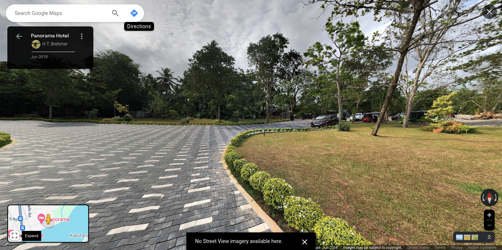

## Mawathagama

**Mawathagama** Grama Niladhari Division, **Polgahawela** Divisional Secretariat Division, **Kurunegala** District, **North Western** Province

**Polgahawela** Polling Division, **Kurunegala** Electoral District

Population: 542 (2012)

(**LK-6187095**/899)

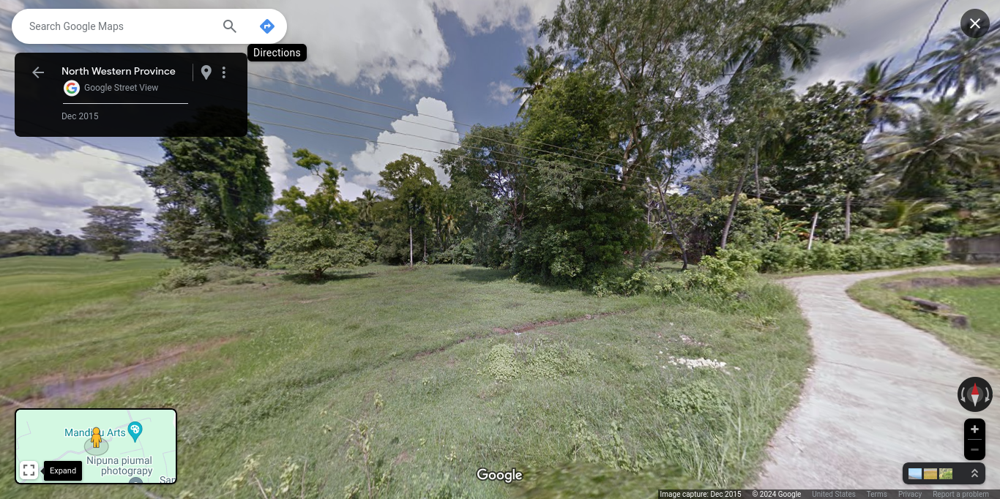

## Wanathamulla

**Wanathamulla** Grama Niladhari Division, **Thimbirigasyaya** Divisional Secretariat Division, **Colombo** District, **Western** Province

**Borella** Polling Division, **Colombo** Electoral District

Population: 17,355 (2012)

(**LK-1127035**/)

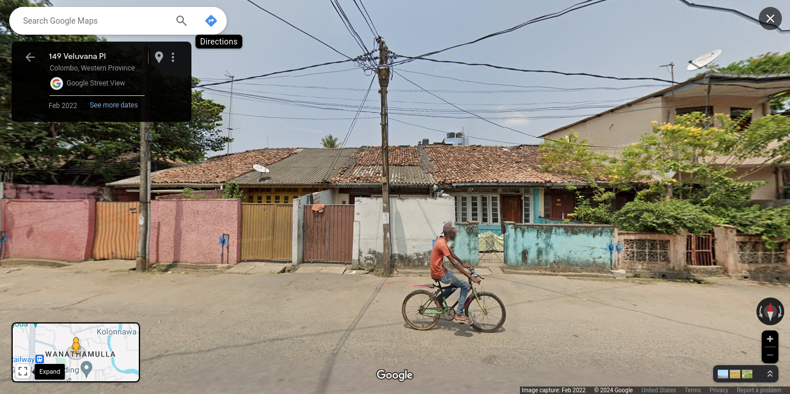

## Mawathgama

**Mawathgama** Grama Niladhari Division, **Homagama** Divisional Secretariat Division, **Colombo** District, **Western** Province

**Homagama** Polling Division, **Colombo** Electoral District

Population: 2,472 (2012)

(**LK-1112185**/485)

## Thotagoda

**Thotagoda** Grama Niladhari Division, **Bope-Poddala** Divisional Secretariat Division, **Galle** District, **Southern** Province

**Akmeemana** Polling Division, **Galle** Electoral District

Population: 866 (2012)

(**LK-3142120**/114A)

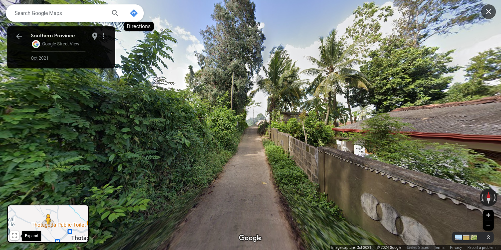

## Kambussawala West

**Kambussawala West** Grama Niladhari Division, **Beliatta** Divisional Secretariat Division, **Hambantota** District, **Southern** Province

**Beliatta** Polling Division, **Hambantota** Electoral District

Population: 380 (2012)

(**LK-3330175**/347)

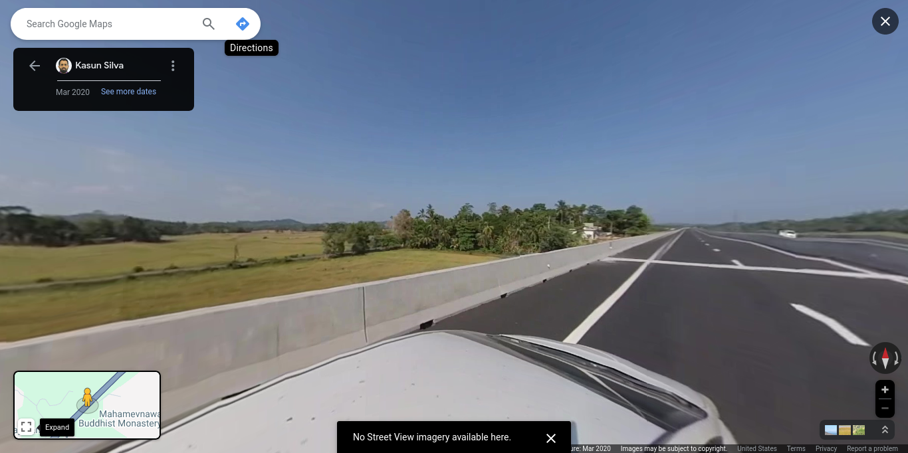

## Mattegoda Central 'A'

**Mattegoda Central 'A'** Grama Niladhari Division, **Homagama** Divisional Secretariat Division, **Colombo** District, **Western** Province

**Homagama** Polling Division, **Colombo** Electoral District

Population: 1,894 (2012)

(**LK-1112235**/587A)

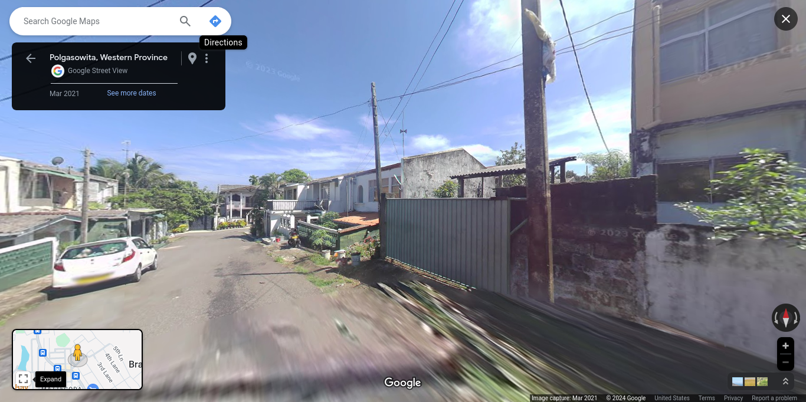

## Diddeliya

**Diddeliya** Grama Niladhari Division, **Ambalangoda** Divisional Secretariat Division, **Galle** District, **Southern** Province

**Ambalangoda** Polling Division, **Galle** Electoral District

Population: 1,627 (2012)

(**LK-3133160**/73A)

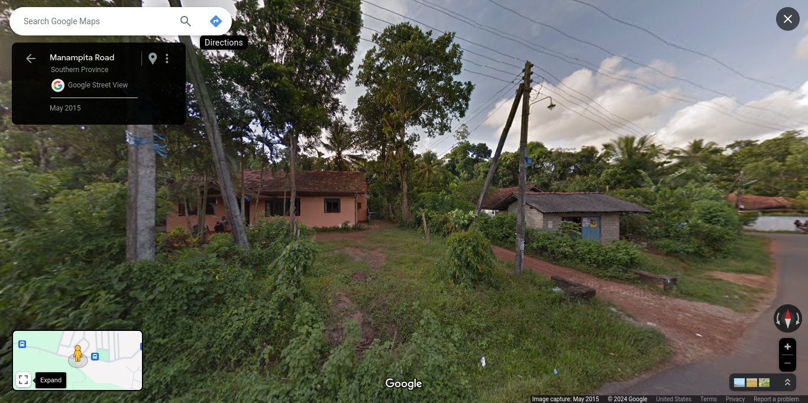

## Sooriyagahapathana Ihala

**Sooriyagahapathana Ihala** Grama Niladhari Division, **Walapane** Divisional Secretariat Division, **Nuwara Eliya** District, **Central** Province

**Walapane** Polling Division, **Nuwara-Eliya** Electoral District

Population: 444 (2012)

(**LK-2309605**/533G)

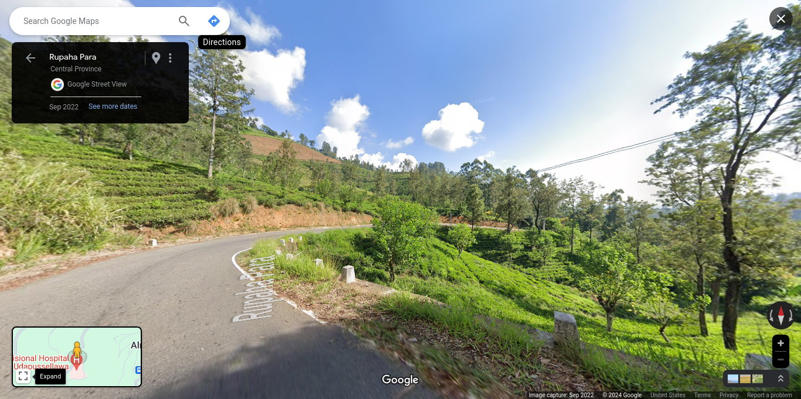

## Track 05 Pedesa

**Track 05 Pedesa** Grama Niladhari Division, **Hingurakgoda** Divisional Secretariat Division, **Polonnaruwa** District, **North Central** Province

**Minneriya** Polling Division, **Polonnaruwa** Electoral District

Population: 861 (2012)

(**LK-7203240**/45)

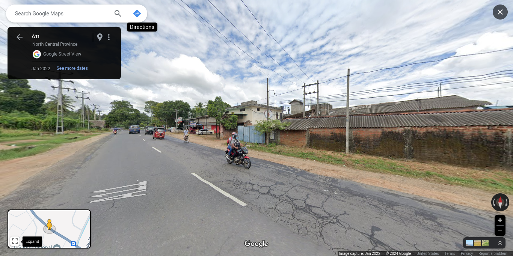

## Yaggapitiya

**Yaggapitiya** Grama Niladhari Division, **Mallawapitiya** Divisional Secretariat Division, **Kurunegala** District, **North Western** Province

**Mawathagama** Polling Division, **Kurunegala** Electoral District

Population: 536 (2012)

(**LK-6157075**/727)

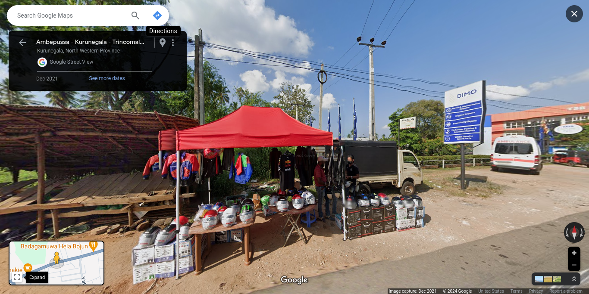

## Pelawa Ihalagama

**Pelawa Ihalagama** Grama Niladhari Division, **Yatinuwara** Divisional Secretariat Division, **Kandy** District, **Central** Province

**Yatinuwara** Polling Division, **Kandy** Electoral District

Population: 715 (2012)

(**LK-2136070**/138)

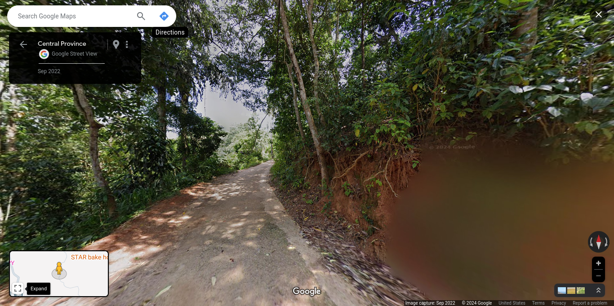

## Dummalasooriya

**Dummalasooriya** Grama Niladhari Division, **Udubaddawa** Divisional Secretariat Division, **Kurunegala** District, **North Western** Province

**Bingiriya** Polling Division, **Kurunegala** Electoral District

Population: 831 (2012)

(**LK-6175085**/1486)

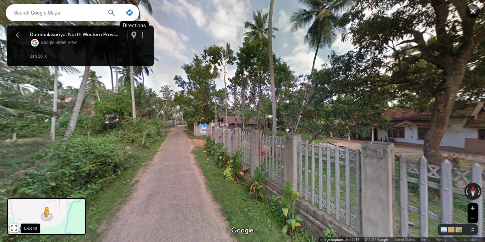

## Etaweeragollewa

**Etaweeragollewa** Grama Niladhari Division, **Medawachchiya** Divisional Secretariat Division, **Anuradhapura** District, **North Central** Province

**Medawachchiya** Polling Division, **Anuradhapura** Electoral District

Population: 1,017 (2012)

(**LK-7109035**/56)

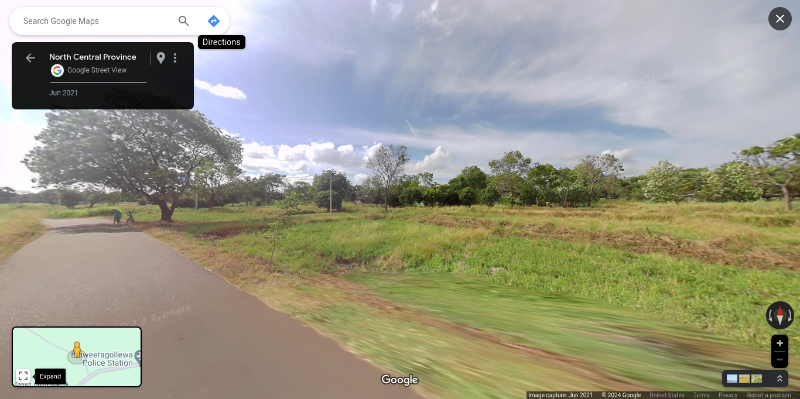

## Mount Vernon

**Mount Vernon** Grama Niladhari Division, **Nuwara Eliya** Divisional Secretariat Division, **Nuwara Eliya** District, **Central** Province

**Nuwara Eliya Maskeliya** Polling Division, **Nuwara-Eliya** Electoral District

Population: 2,319 (2012)

(**LK-2312010**/475Q)

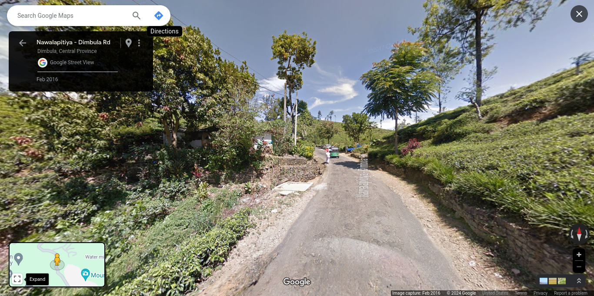

## Weliweriya West

**Weliweriya West** Grama Niladhari Division, **Matara Four Gravets** Divisional Secretariat Division, **Matara** District, **Southern** Province

**Matara** Polling Division, **Matara** Electoral District

Population: 1,350 (2012)

(**LK-3242120**/415A)

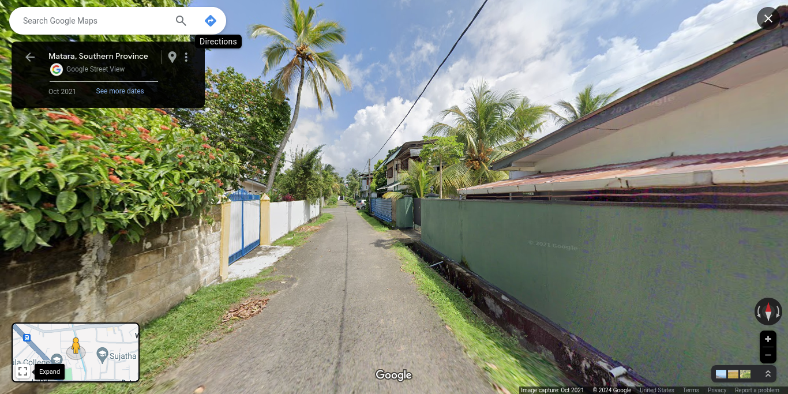

## Dompe

**Dompe** Grama Niladhari Division, **Dompe** Divisional Secretariat Division, **Gampaha** District, **Western** Province

**Dompe** Polling Division, **Gampaha** Electoral District

Population: 3,358 (2012)

(**LK-1230530**/405)

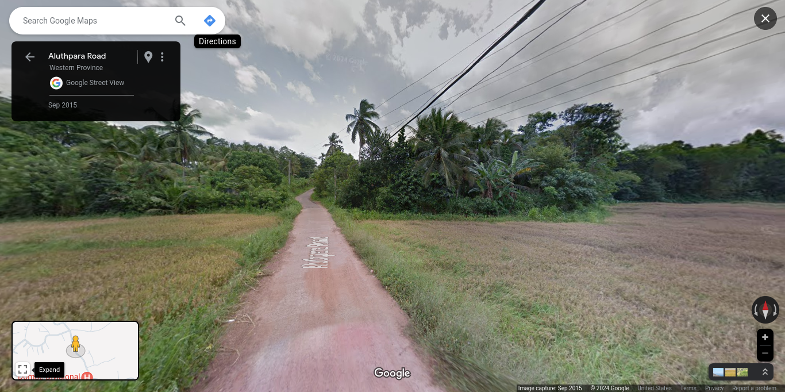

## Divithotawela

**Divithotawela** Grama Niladhari Division, **Welimada** Divisional Secretariat Division, **Badulla** District, **Uva** Province

**Welimada** Polling Division, **Badulla** Electoral District

Population: 1,863 (2012)

(**LK-8130085**/59D)

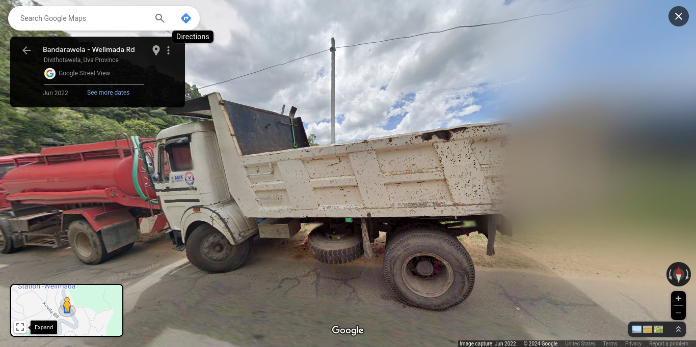

## Pathagama

**Pathagama** Grama Niladhari Division, **Kuruvita** Divisional Secretariat Division, **Ratnapura** District, **Sabaragamuwa** Province

**Eheliyagoda** Polling Division, **Ratnapura** Electoral District

Population: 2,974 (2012)

(**LK-9106170**/155D)

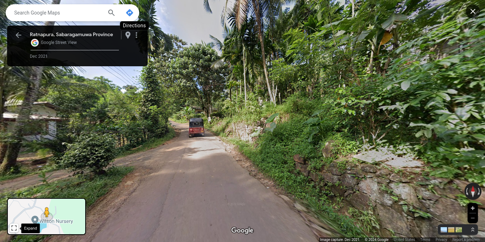

## Katupelella

**Katupelella** Grama Niladhari Division, **Badulla** Divisional Secretariat Division, **Badulla** District, **Uva** Province

**Badulla** Polling Division, **Badulla** Electoral District

Population: 2,437 (2012)

(**LK-8121080**/78H)

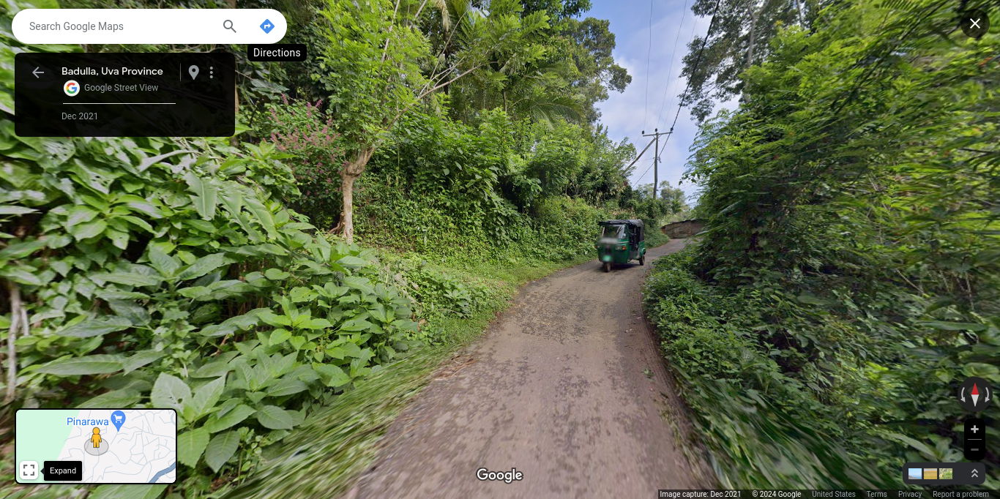

## Ranwanthalawa

**Ranwanthalawa** Grama Niladhari Division, **Kothmale** Divisional Secretariat Division, **Nuwara Eliya** District, **Central** Province

**Kothmale** Polling Division, **Nuwara-Eliya** Electoral District

Population: 332 (2012)

(**LK-2303120**/458)

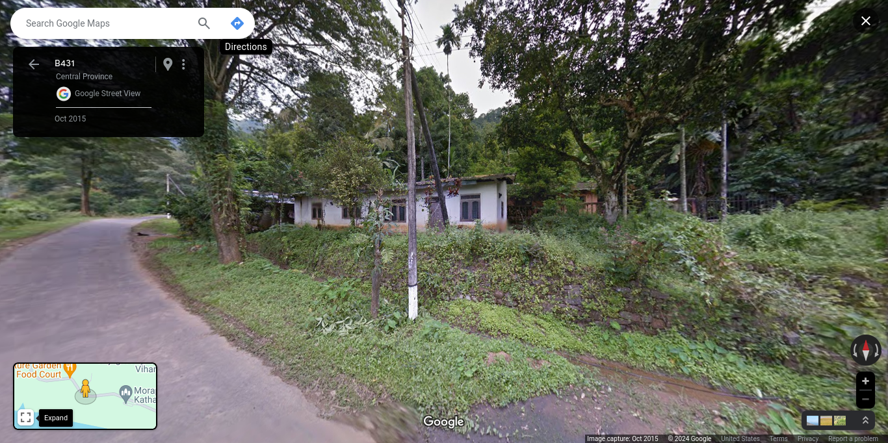

## Waddeniya

**Waddeniya** Grama Niladhari Division, **Warakapola** Divisional Secretariat Division, **Kegalle** District, **Sabaragamuwa** Province

**Dedigama** Polling Division, **Kegalle** Electoral District

Population: 1,634 (2012)

(**LK-9218005**/77)

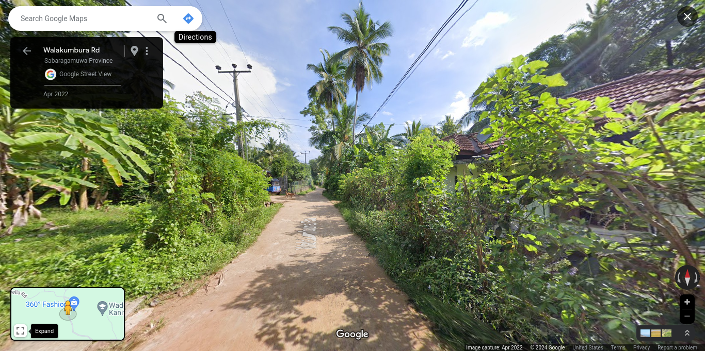

## Piyadigama West

**Piyadigama West** Grama Niladhari Division, **Habaraduwa** Divisional Secretariat Division, **Galle** District, **Southern** Province

**Habaraduwa** Polling Division, **Galle** Electoral District

Population: 1,000 (2012)

(**LK-3154245**/161)

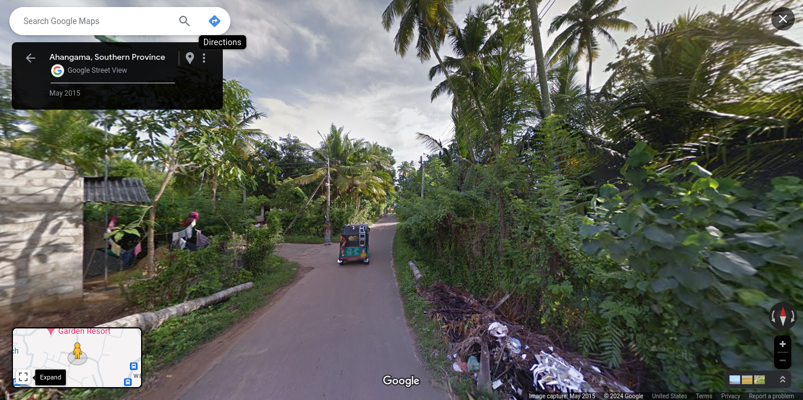

## Galagedara

**Galagedara** Grama Niladhari Division, **Panduwasnuwara East** Divisional Secretariat Division, **Kurunegala** District, **North Western** Province

**Panduwasnuwara** Polling Division, **Kurunegala** Electoral District

Population: 730 (2012)

(**LK-6148145**/1381)

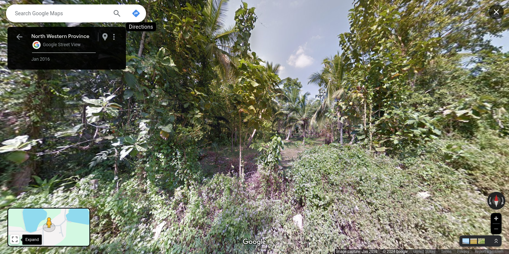

## Hokandara South

**Hokandara South** Grama Niladhari Division, **Kaduwela** Divisional Secretariat Division, **Colombo** District, **Western** Province

**Kaduwela** Polling Division, **Colombo** Electoral District

Population: 5,548 (2012)

(**LK-1109280**/494C)

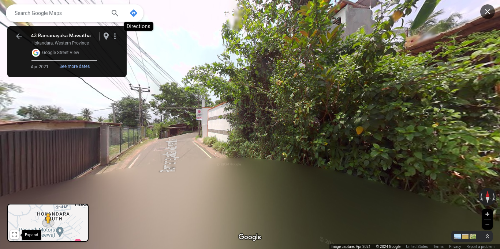

## Ihala Hanwella South

**Ihala Hanwella South** Grama Niladhari Division, **Seethawaka** Divisional Secretariat Division, **Colombo** District, **Western** Province

**Avissawella** Polling Division, **Colombo** Electoral District

Population: 1,041 (2012)

(**LK-1115270**/443C)

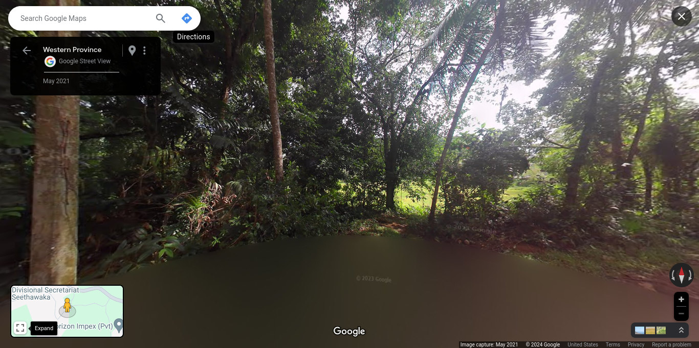

## Barathipuram

**Barathipuram** Grama Niladhari Division, **Manmunai North** Divisional Secretariat Division, **Batticaloa** District, **Eastern** Province

**Batticaloa** Polling Division, **Batticaloa** Electoral District

Population: 1,555 (2012)

(**LK-5118125**/173H)

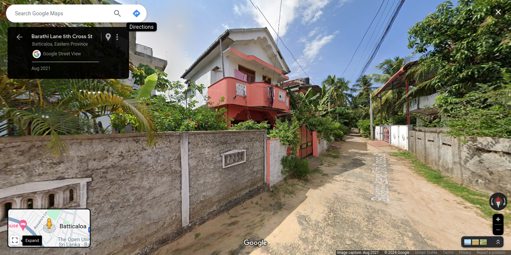

## Gnasooriyam Sathukam

**Gnasooriyam Sathukam** Grama Niladhari Division, **Manmunai North** Divisional Secretariat Division, **Batticaloa** District, **Eastern** Province

**Batticaloa** Polling Division, **Batticaloa** Electoral District

Population: 1,540 (2012)

(**LK-5118115**/173G)

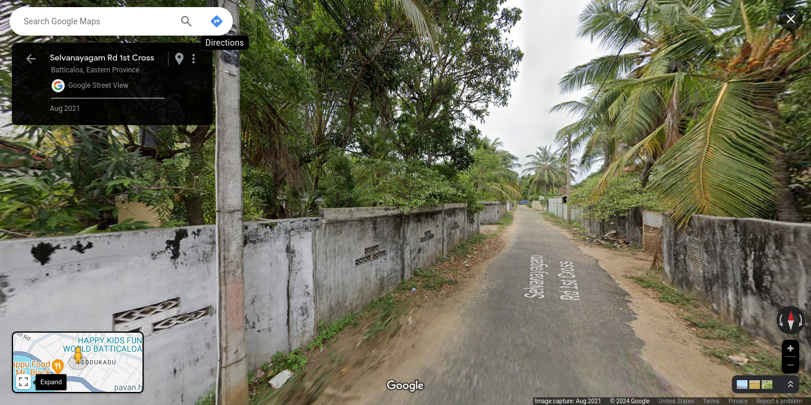

## Maha Buthgamuwa C

**Maha Buthgamuwa C** Grama Niladhari Division, **Kolonnawa** Divisional Secretariat Division, **Colombo** District, **Western** Province

**Kolonnawa** Polling Division, **Colombo** Electoral District

Population: 4,103 (2012)

(**LK-1106095**/506D)

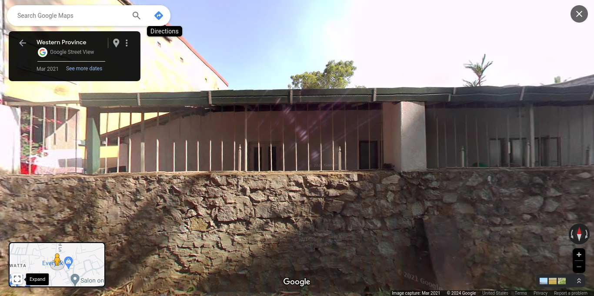

## Maligapurana

**Maligapurana** Grama Niladhari Division, **Ganga Ihala Korale** Divisional Secretariat Division, **Kandy** District, **Central** Province

**Nawalapitiya** Polling Division, **Kandy** Electoral District

Population: 1,972 (2012)

(**LK-2154030**/1078)

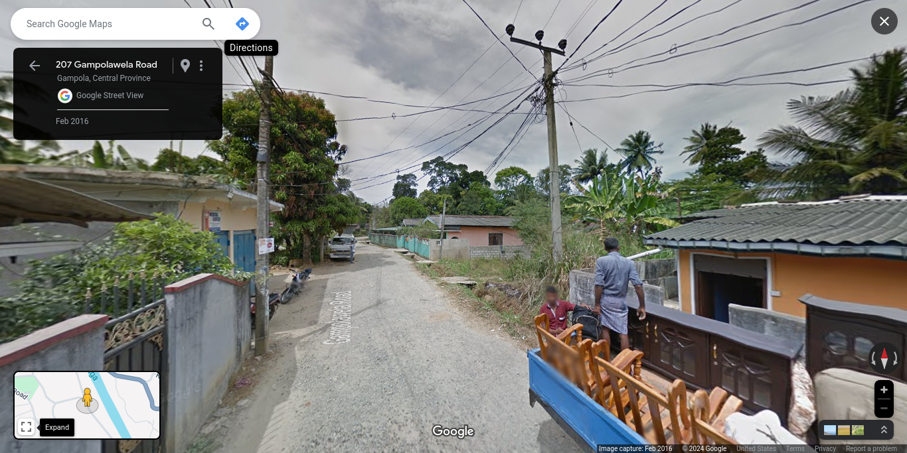

## Medaketiya

**Medaketiya** Grama Niladhari Division, **Tangalle** Divisional Secretariat Division, **Hambantota** District, **Southern** Province

**Tangalle** Polling Division, **Hambantota** Electoral District

Population: 1,562 (2012)

(**LK-3333225**/268)

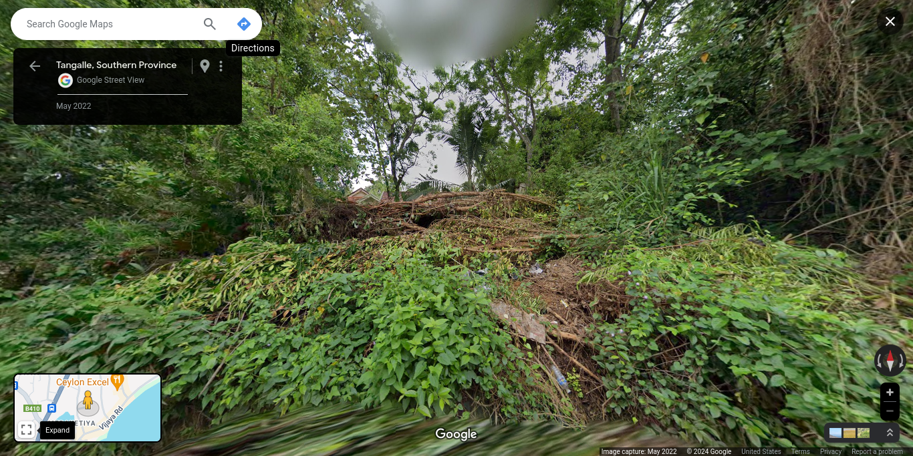

## Thittagonewa

**Thittagonewa** Grama Niladhari Division, **Kebithigollewa** Divisional Secretariat Division, **Anuradhapura** District, **North Central** Province

**Medawachchiya** Polling Division, **Anuradhapura** Electoral District

Population: 955 (2012)

(**LK-7106065**/33)

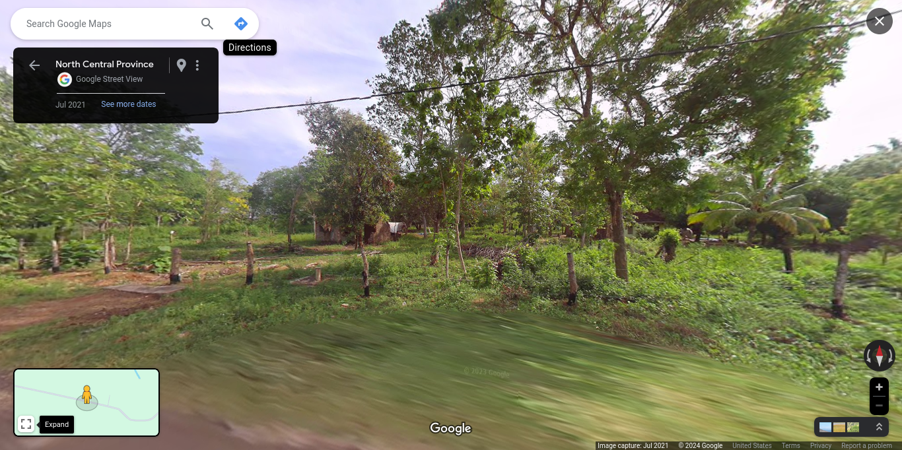

## Delpona

**Delpona** Grama Niladhari Division, **Elpitiya** Divisional Secretariat Division, **Galle** District, **Southern** Province

**Bentara Elpitiya** Polling Division, **Galle** Electoral District

Population: 580 (2012)

(**LK-3112040**/30C)

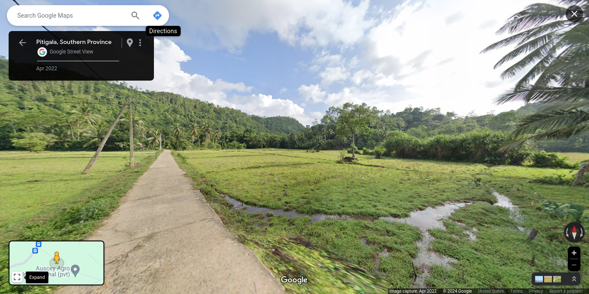

## Vellampokkady

**Vellampokkady** Grama Niladhari Division, **Thenmaradchi (Chavakachcheri)** Divisional Secretariat Division, **Jaffna** District, **Northern** Province

**Chavakachcheri** Polling Division, **Jaffna** Electoral District

Population: 671 (2012)

(**LK-4130180**/J/323)

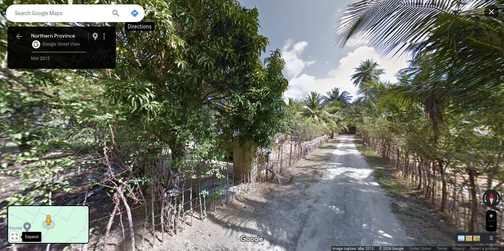

## Moraketiya

**Moraketiya** Grama Niladhari Division, **Embilipitiya** Divisional Secretariat Division, **Ratnapura** District, **Sabaragamuwa** Province

**Kolonna** Polling Division, **Ratnapura** Electoral District

Population: 4,196 (2012)

(**LK-9148110**/214C)

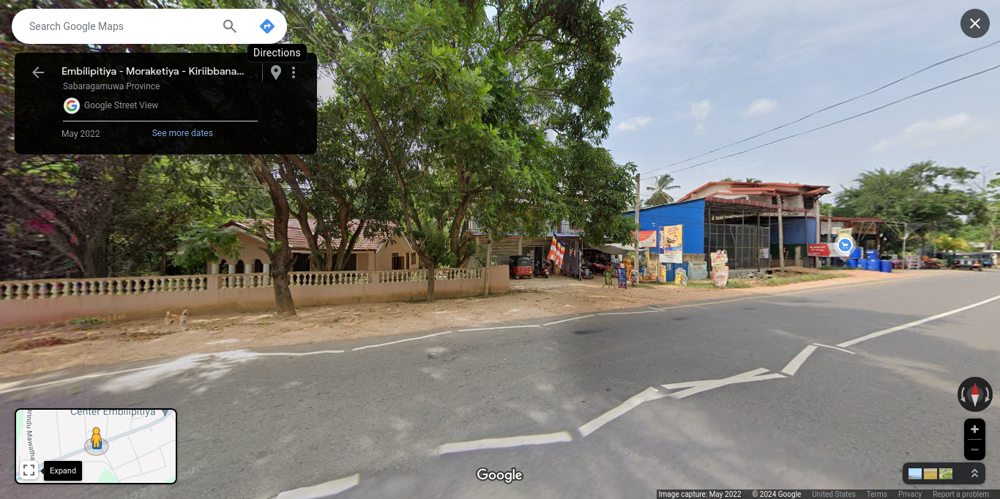

## Medakekila

**Medakekila** Grama Niladhari Division, **Deltota** Divisional Secretariat Division, **Kandy** District, **Central** Province

**Hewaheta** Polling Division, **Kandy** Electoral District

Population: 697 (2012)

(**LK-2148060**/1037)

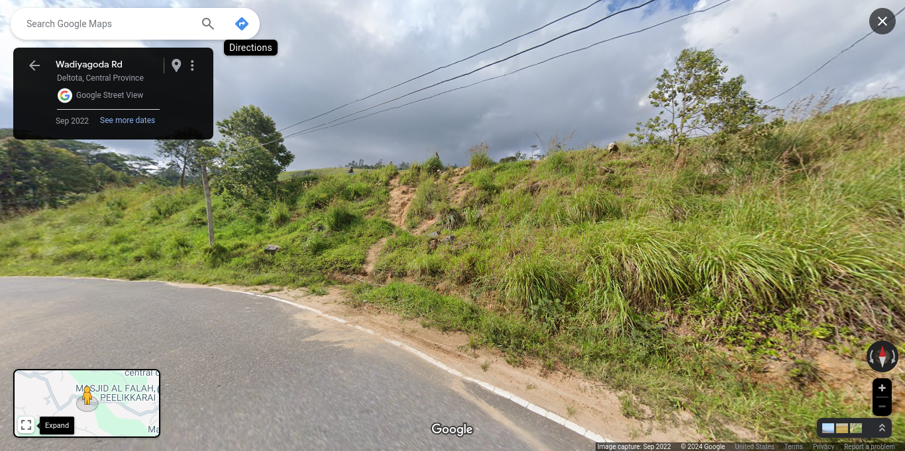

## Kallarichchel 01

**Kallarichchel 01** Grama Niladhari Division, **Samanthurai** Divisional Secretariat Division, **Ampara** District, **Eastern** Province

**Samanthurai** Polling Division, **Digamadulla** Electoral District

Population: 785 (2012)

(**LK-5218240**/79D)

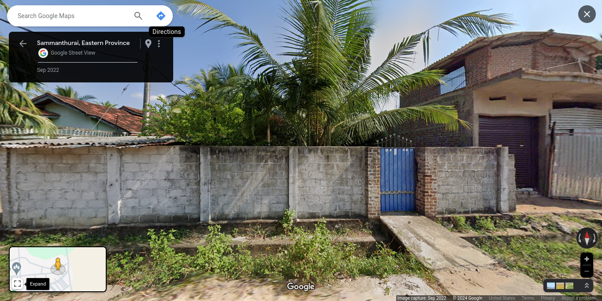

## Koralawella North

**Koralawella North** Grama Niladhari Division, **Moratuwa** Divisional Secretariat Division, **Colombo** District, **Western** Province

**Moratuwa** Polling Division, **Colombo** Electoral District

Population: 5,696 (2012)

(**LK-1133170**/554)

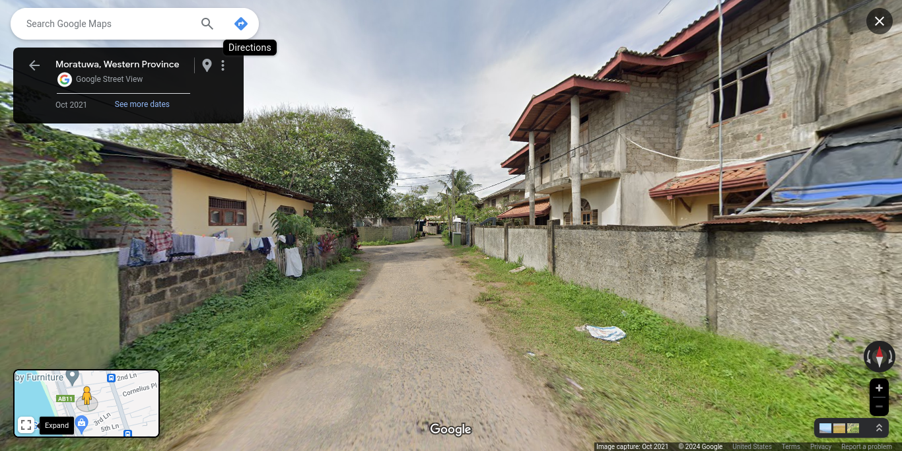

## Homagama Town

**Homagama Town** Grama Niladhari Division, **Homagama** Divisional Secretariat Division, **Colombo** District, **Western** Province

**Homagama** Polling Division, **Colombo** Electoral District

Population: 2,873 (2012)

(**LK-1112135**/486A)

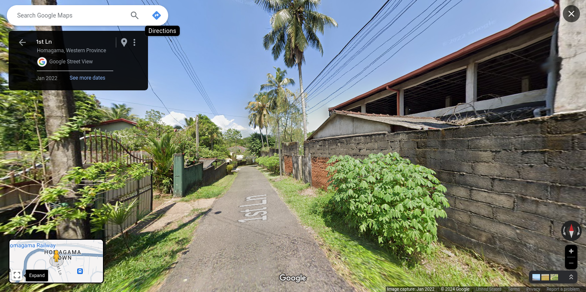

## Polgahawela South

**Polgahawela South** Grama Niladhari Division, **Polgahawela** Divisional Secretariat Division, **Kurunegala** District, **North Western** Province

**Polgahawela** Polling Division, **Kurunegala** Electoral District

Population: 1,644 (2012)

(**LK-6187400**/938)

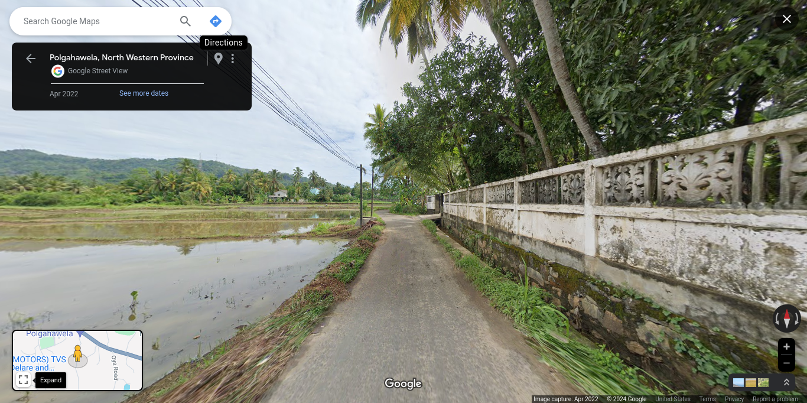

## Marakolliya

**Marakolliya** Grama Niladhari Division, **Tangalle** Divisional Secretariat Division, **Hambantota** District, **Southern** Province

**Tangalle** Polling Division, **Hambantota** Electoral District

Population: 1,198 (2012)

(**LK-3333115**/259)

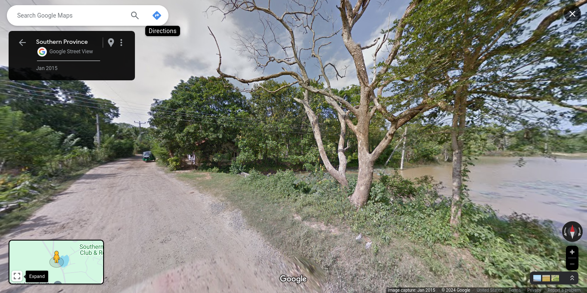

## Anpuvalipuram

**Anpuvalipuram** Grama Niladhari Division, **Trincomalee Town and Gravets** Divisional Secretariat Division, **Trincomalee** District, **Eastern** Province

**Trincomalee** Polling Division, **Trincomalee** Electoral District

Population: 4,205 (2012)

(**LK-5315085**/243C)

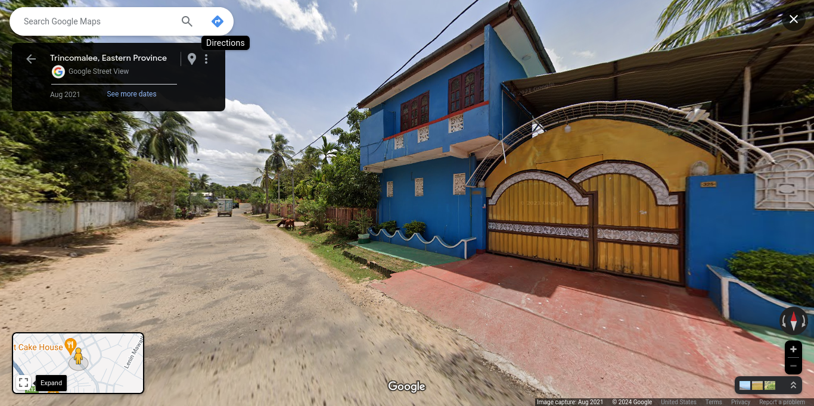

## Ududeniya

**Ududeniya** Grama Niladhari Division, **Doluwa** Divisional Secretariat Division, **Kandy** District, **Central** Province

**Gampola** Polling Division, **Kandy** Electoral District

Population: 878 (2012)

(**LK-2142145**/1134)

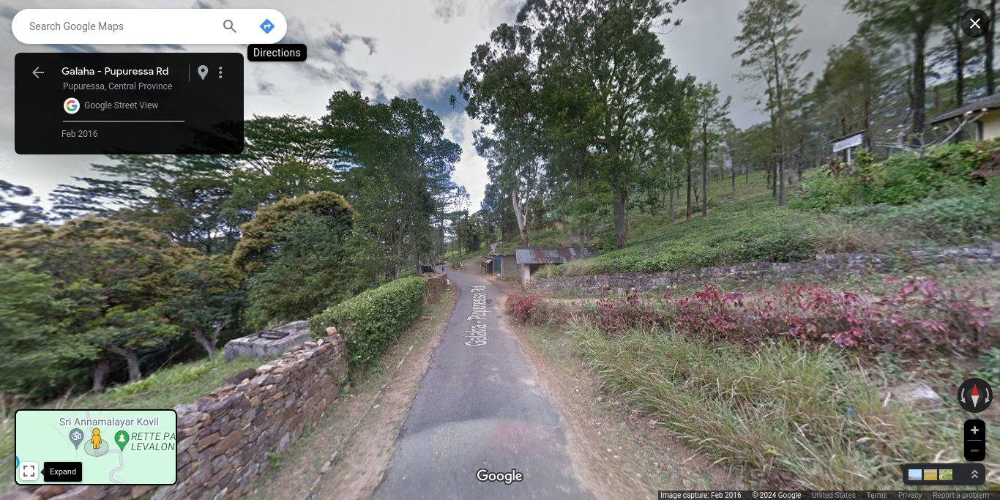

## Weeragaswewa

**Weeragaswewa** Grama Niladhari Division, **Angunakolapelessa** Divisional Secretariat Division, **Hambantota** District, **Southern** Province

**Tangalle** Polling Division, **Hambantota** Electoral District

Population: 511 (2012)

(**LK-3318125**/210)

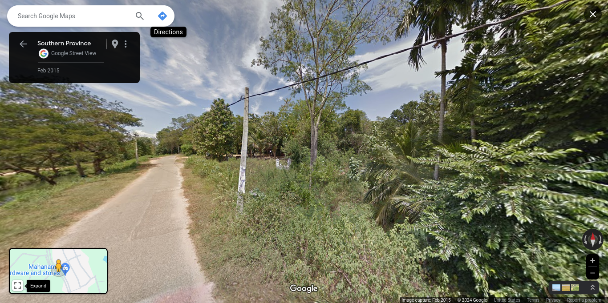

## Welikada West

**Welikada West** Grama Niladhari Division, **Sri Jayawardanapura Kotte** Divisional Secretariat Division, **Colombo** District, **Western** Province

**Kotte** Polling Division, **Colombo** Electoral District

Population: 7,004 (2012)

(**LK-1124010**/514A)

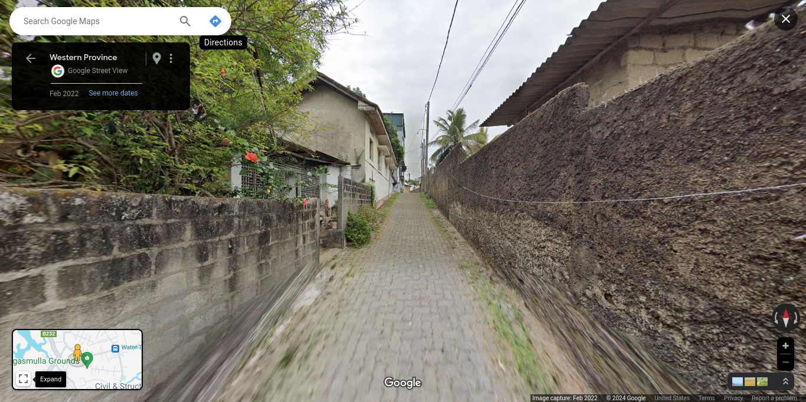

## Dadalla West

**Dadalla West** Grama Niladhari Division, **Galle Four Gravets** Divisional Secretariat Division, **Galle** District, **Southern** Province

**Galle** Polling Division, **Galle** Electoral District

Population: 1,770 (2012)

(**LK-3139135**/102)

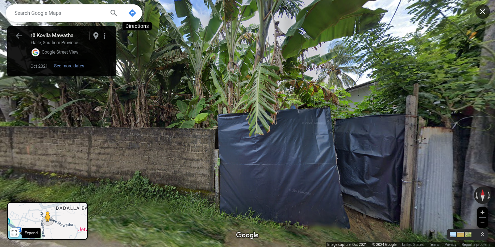

## Puliyanthivu East

**Puliyanthivu East** Grama Niladhari Division, **Manmunai North** Divisional Secretariat Division, **Batticaloa** District, **Eastern** Province

**Batticaloa** Polling Division, **Batticaloa** Electoral District

Population: 1,590 (2012)

(**LK-5118170**/179 A)

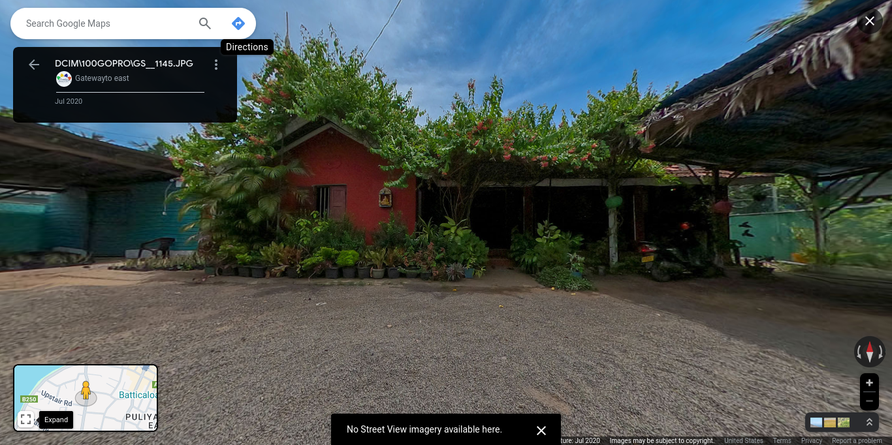

## Rathupaswala

**Rathupaswala** Grama Niladhari Division, **Gampaha** Divisional Secretariat Division, **Gampaha** District, **Western** Province

**Gampaha** Polling Division, **Gampaha** Electoral District

Population: 3,307 (2012)

(**LK-1224385**/239A)

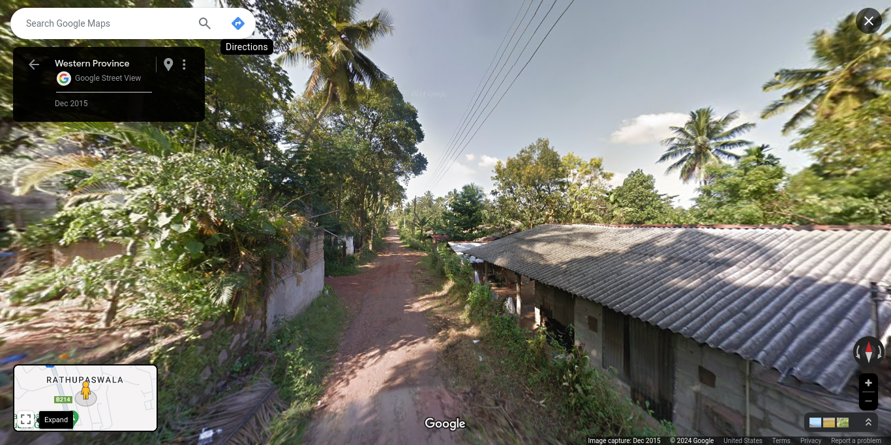

## Hettiyawala East

**Hettiyawala East** Grama Niladhari Division, **Kirinda Puhulwella** Divisional Secretariat Division, **Matara** District, **Southern** Province

**Kamburupitiya** Polling Division, **Matara** Electoral District

Population: 793 (2012)

(**LK-3233065**/325A)

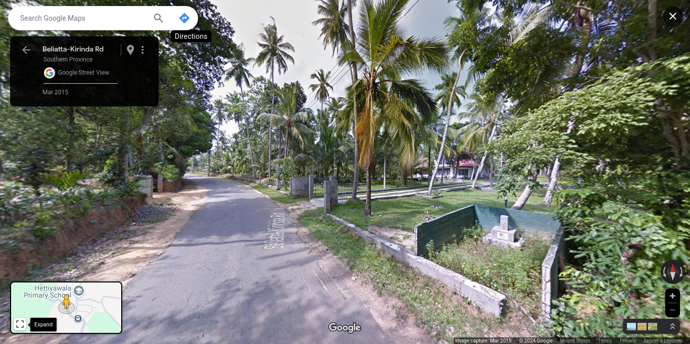

## Kodikaragoda West

**Kodikaragoda West** Grama Niladhari Division, **Pitabeddara** Divisional Secretariat Division, **Matara** District, **Southern** Province

**Deniyaya** Polling Division, **Matara** Electoral District

Population: 1,512 (2012)

(**LK-3203070**/262C)

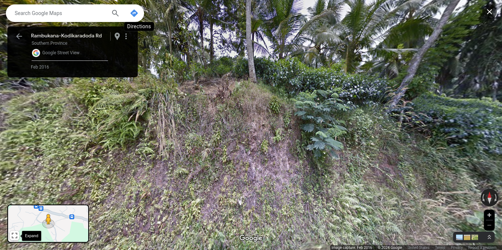

## Kimbulapitiya West

**Kimbulapitiya West** Grama Niladhari Division, **Katana** Divisional Secretariat Division, **Gampaha** District, **Western** Province

**Katana** Polling Division, **Gampaha** Electoral District

Population: 2,621 (2012)

(**LK-1206155**/92B)

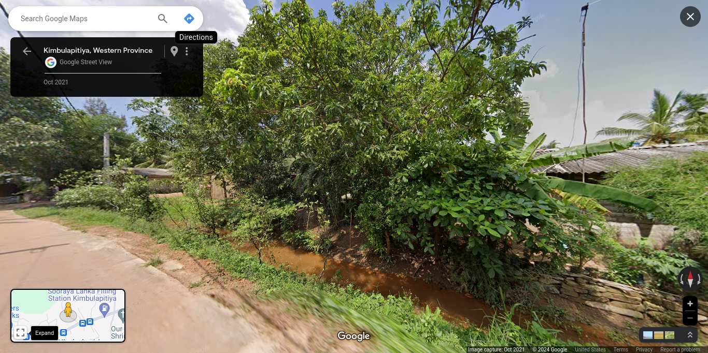

## Udadoolwala

**Udadoolwala** Grama Niladhari Division, **Harispattuwa** Divisional Secretariat Division, **Kandy** District, **Central** Province

**Harispattuwa** Polling Division, **Kandy** Electoral District

Population: 700 (2012)

(**LK-2133320**/442)

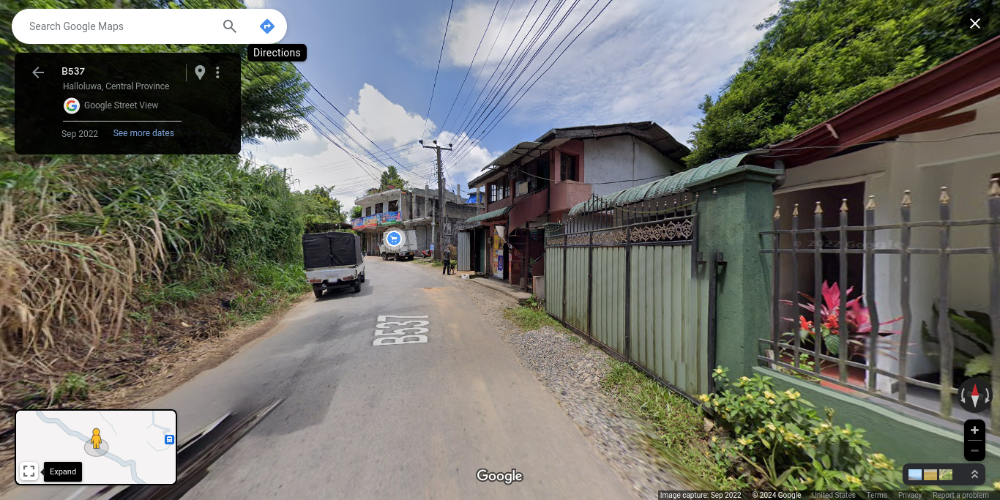

## Boraluwageaina

**Boraluwageaina** Grama Niladhari Division, **Kolonna** Divisional Secretariat Division, **Ratnapura** District, **Sabaragamuwa** Province

**Kolonna** Polling Division, **Ratnapura** Electoral District

Population: 2,368 (2012)

(**LK-9151095**/206A)

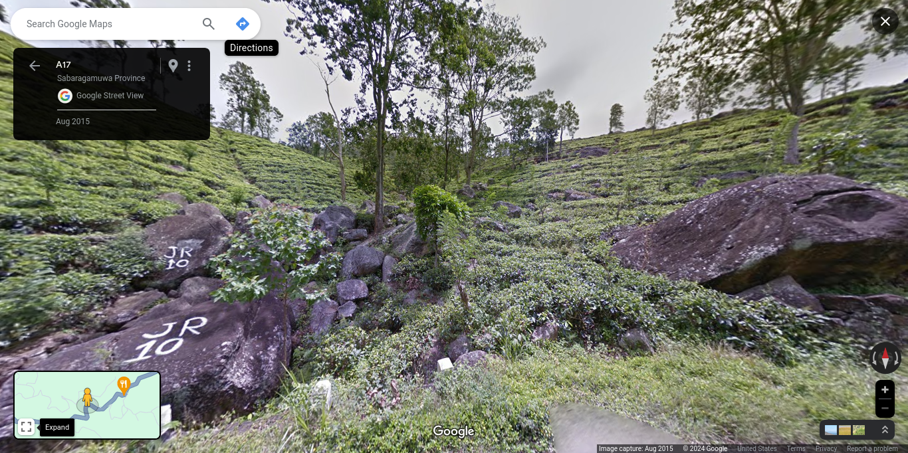

## Wellarawa

**Wellarawa** Grama Niladhari Division, **Bingiriya** Divisional Secretariat Division, **Kurunegala** District, **North Western** Province

**Bingiriya** Polling Division, **Kurunegala** Electoral District

Population: 1,689 (2012)

(**LK-6142155**/1468)

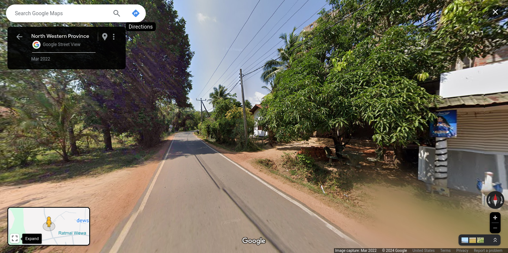

## Bendiyamulla North

**Bendiyamulla North** Grama Niladhari Division, **Gampaha** Divisional Secretariat Division, **Gampaha** District, **Western** Province

**Gampaha** Polling Division, **Gampaha** Electoral District

Population: 1,373 (2012)

(**LK-1224135**/234)

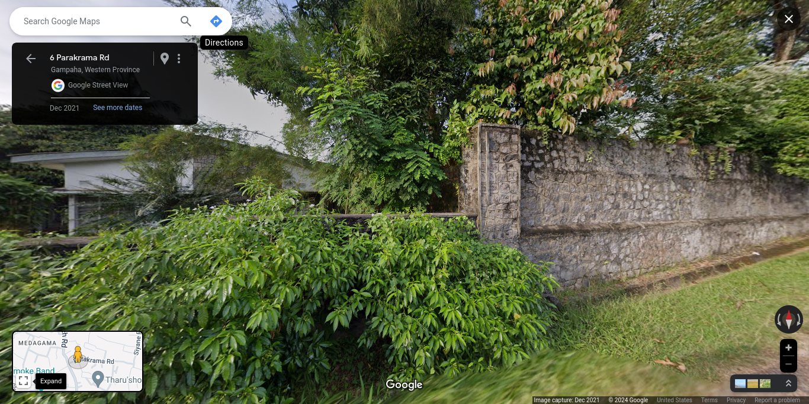

## Koodaluvila

**Koodaluvila** Grama Niladhari Division, **Seethawaka** Divisional Secretariat Division, **Colombo** District, **Western** Province

**Avissawella** Polling Division, **Colombo** Electoral District

Population: 2,807 (2012)

(**LK-1115285**/444D)

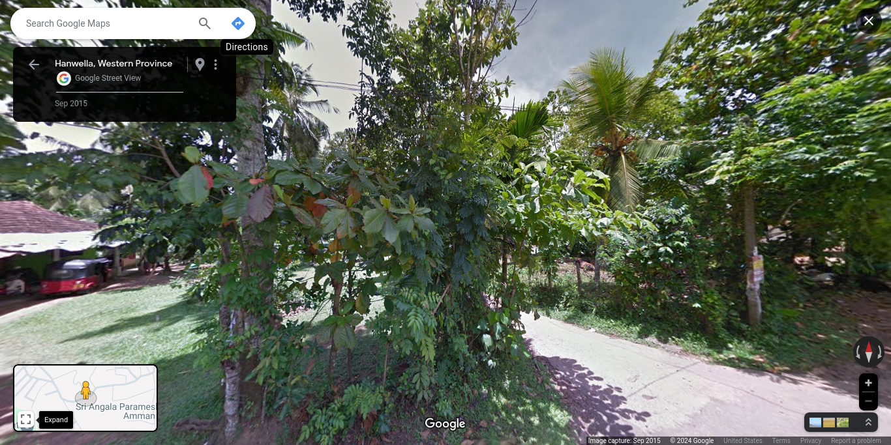

## Kaddaiparichchan North

**Kaddaiparichchan North** Grama Niladhari Division, **Muttur** Divisional Secretariat Division, **Trincomalee** District, **Eastern** Province

**Muttur** Polling Division, **Trincomalee** Electoral District

Population: 1,650 (2012)

(**LK-5327030**/222B)

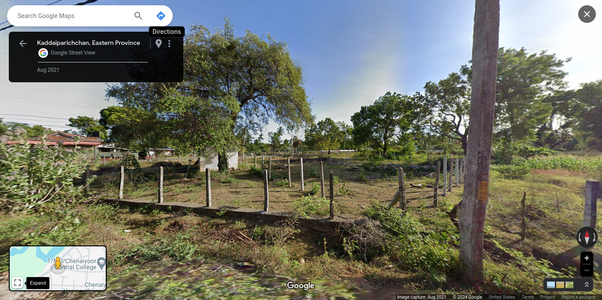

## Divulpitiya West

**Divulpitiya West** Grama Niladhari Division, **Kesbewa** Divisional Secretariat Division, **Colombo** District, **Western** Province

**Kesbewa** Polling Division, **Colombo** Electoral District

Population: 2,631 (2012)

(**LK-1136020**/535B)

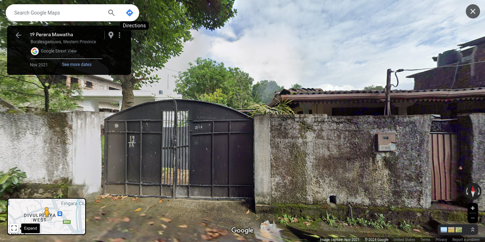

## Henarathgoda

**Henarathgoda** Grama Niladhari Division, **Gampaha** Divisional Secretariat Division, **Gampaha** District, **Western** Province

**Gampaha** Polling Division, **Gampaha** Electoral District

Population: 2,637 (2012)

(**LK-1224310**/232)

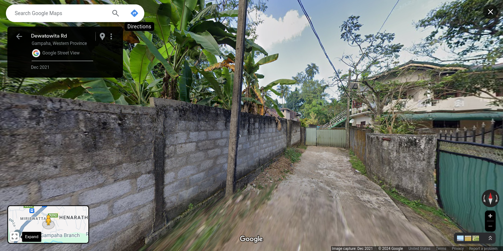

## Kotahena West

**Kotahena West** Grama Niladhari Division, **Colombo** Divisional Secretariat Division, **Colombo** District, **Western** Province

**Colombo North** Polling Division, **Colombo** Electoral District

Population: 9,409 (2012)

(**LK-1103050**/)

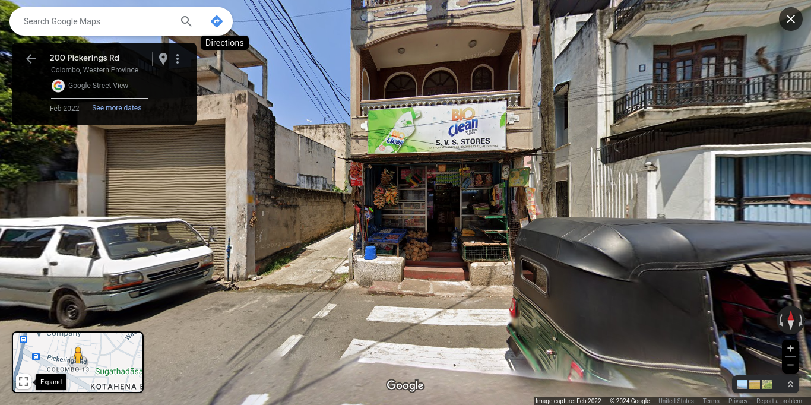

## Kotavila West

**Kotavila West** Grama Niladhari Division, **Weligama** Divisional Secretariat Division, **Matara** District, **Southern** Province

**Weligama** Polling Division, **Matara** Electoral District

Population: 1,399 (2012)

(**LK-3239075**/404B)

## Pahala Vithanamulla

**Pahala Vithanamulla** Grama Niladhari Division, **Minuwangoda** Divisional Secretariat Division, **Gampaha** District, **Western** Province

**Minuwangoda** Polling Division, **Gampaha** Electoral District

Population: 661 (2012)

(**LK-1215070**/98/5)

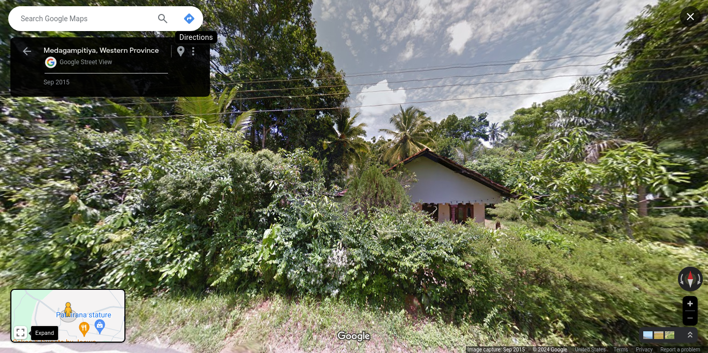

## Kuttivila

**Kuttivila** Grama Niladhari Division, **Dompe** Divisional Secretariat Division, **Gampaha** District, **Western** Province

**Dompe** Polling Division, **Gampaha** Electoral District

Population: 1,072 (2012)

(**LK-1230145**/377B)

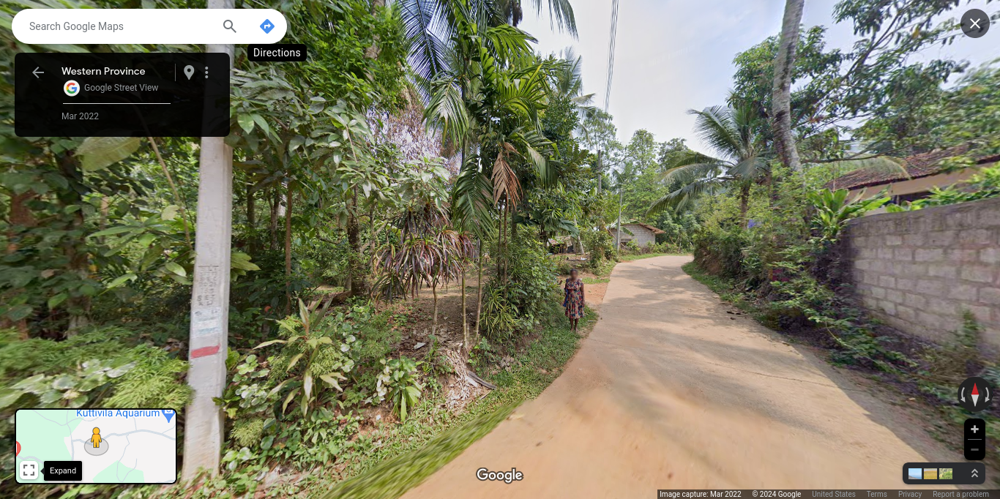

## Kerawalapitiya

**Kerawalapitiya** Grama Niladhari Division, **Wattala** Divisional Secretariat Division, **Gampaha** District, **Western** Province

**Wattala** Polling Division, **Gampaha** Electoral District

Population: 11,686 (2012)

(**LK-1218135**/171)

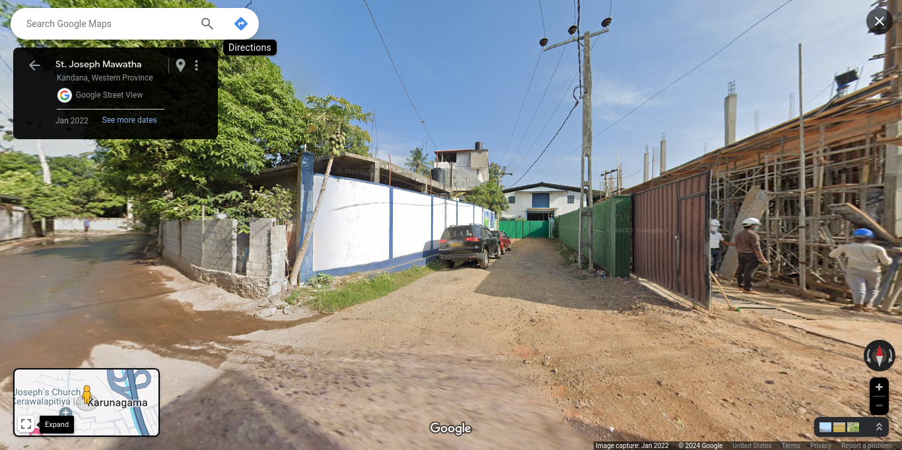

## Halapitiya

**Halapitiya** Grama Niladhari Division, **Horana** Divisional Secretariat Division, **Kalutara** District, **Western** Province

**Horana** Polling Division, **Kalutara** Electoral District

Population: 2,650 (2012)

(**LK-1309060**/606C)

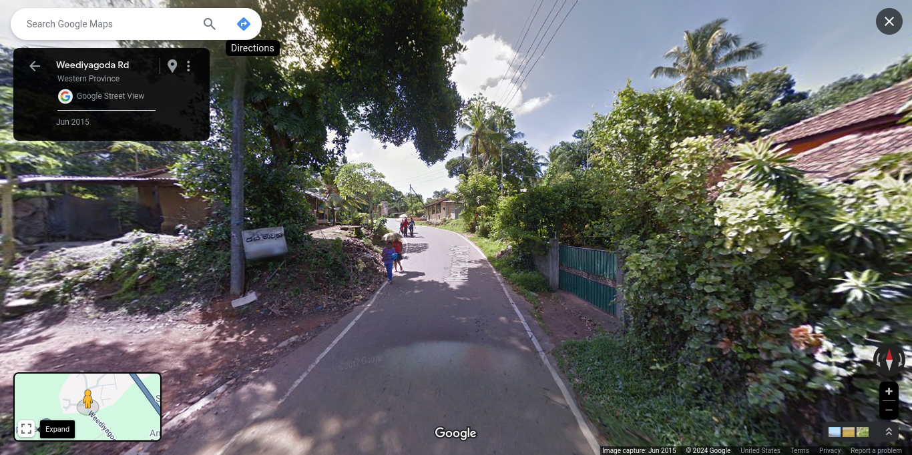

## Welagedara

**Welagedara** Grama Niladhari Division, **Attanagalla** Divisional Secretariat Division, **Gampaha** District, **Western** Province

**Attanagalla** Polling Division, **Gampaha** Electoral District

Population: 925 (2012)

(**LK-1227465**/353)

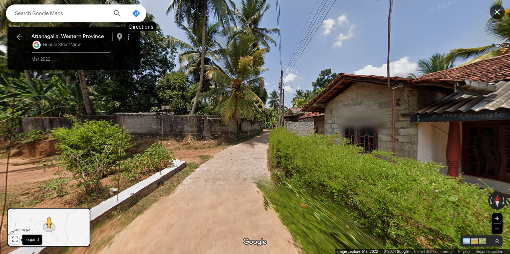

## Kottawa North

**Kottawa North** Grama Niladhari Division, **Maharagama** Divisional Secretariat Division, **Colombo** District, **Western** Province

**Maharagama** Polling Division, **Colombo** Electoral District

Population: 2,466 (2012)

(**LK-1121060**/496C)

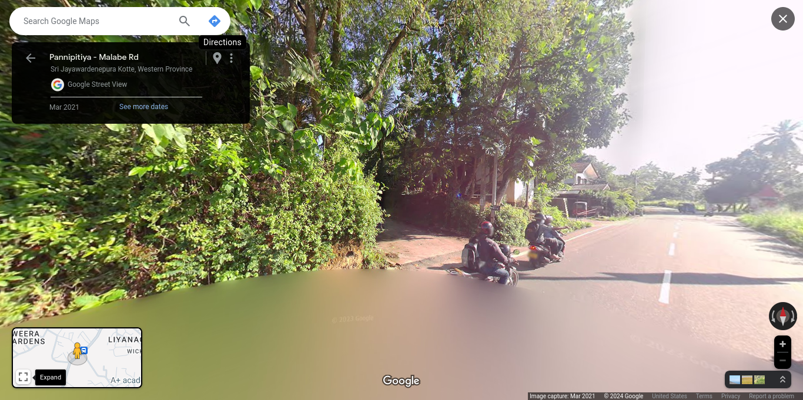

## Dalugama

**Dalugama** Grama Niladhari Division, **Kelaniya** Divisional Secretariat Division, **Gampaha** District, **Western** Province

**Kelaniya** Polling Division, **Gampaha** Electoral District

Population: 1,938 (2012)

(**LK-1236100**/260A)

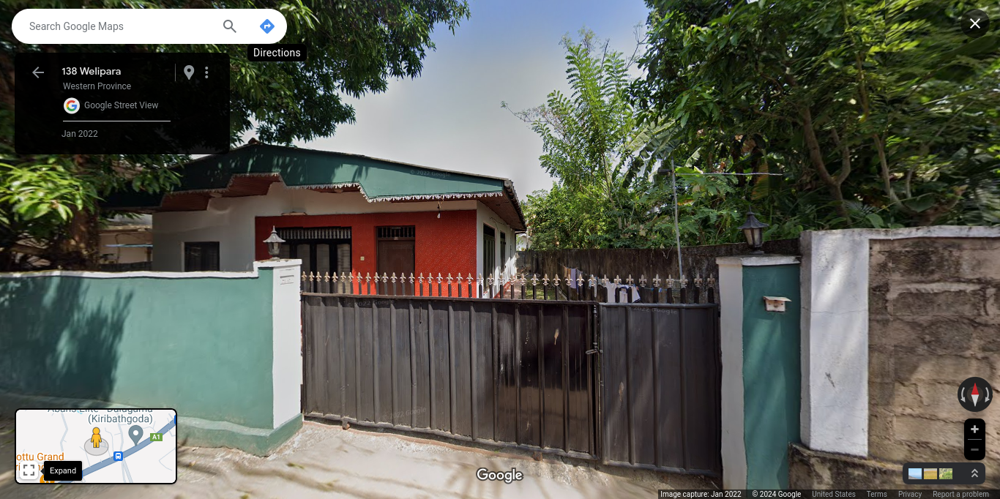

## Hewadiwela

**Hewadiwela** Grama Niladhari Division, **Rambukkana** Divisional Secretariat Division, **Kegalle** District, **Sabaragamuwa** Province

**Rambukkana** Polling Division, **Kegalle** Electoral District

Population: 894 (2012)

(**LK-9203050**/03D)

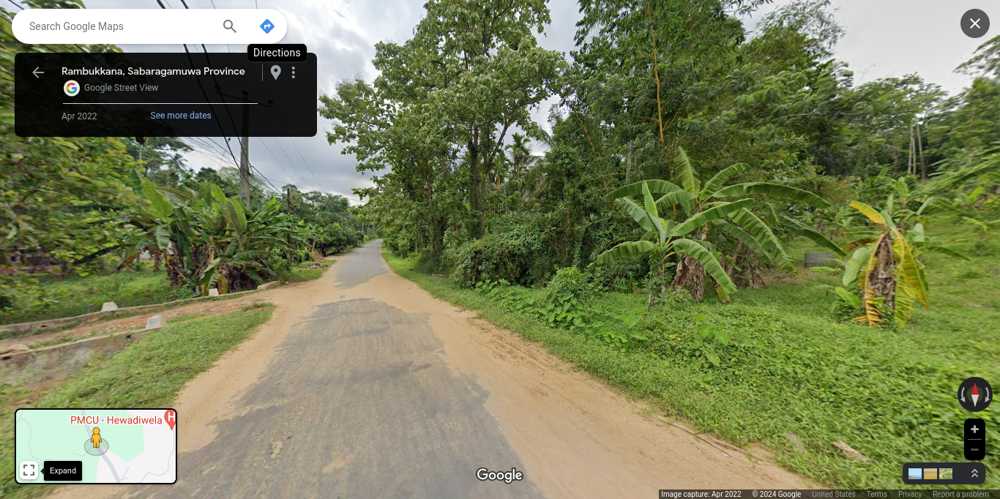

## Kanagapuram

**Kanagapuram** Grama Niladhari Division, **Karachchi** Divisional Secretariat Division, **Kilinochchi** District, **Northern** Province

**Kilinochchi** Polling Division, **Jaffna** Electoral District

Population: 877 (2012)

(**LK-4509045**/KN/26)

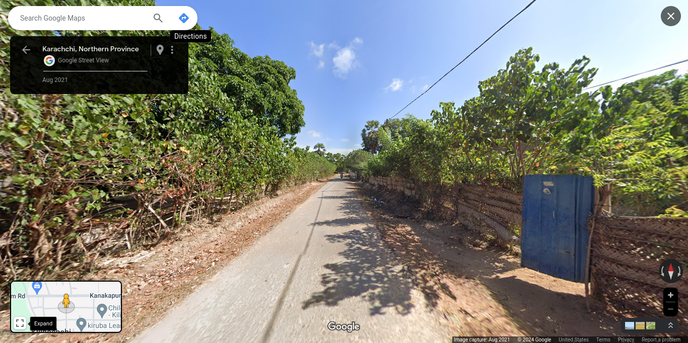

## Sinna Ullai

**Sinna Ullai** Grama Niladhari Division, **Pothuvil** Divisional Secretariat Division, **Ampara** District, **Eastern** Province

**Pothuvil** Polling Division, **Digamadulla** Electoral District

Population: 1,251 (2012)

(**LK-5248010**/P/18)

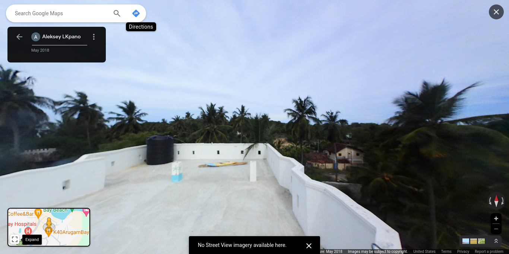

## Galahitiyawa North

**Galahitiyawa North** Grama Niladhari Division, **Gampaha** Divisional Secretariat Division, **Gampaha** District, **Western** Province

**Gampaha** Polling Division, **Gampaha** Electoral District

Population: 3,354 (2012)

(**LK-1224225**/215)

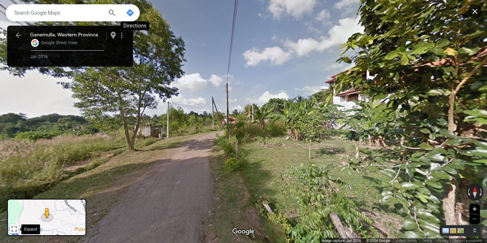

## Ja-Ela

**Ja-Ela** Grama Niladhari Division, **Ja-Ela** Divisional Secretariat Division, **Gampaha** District, **Western** Province

**Ja Ela** Polling Division, **Gampaha** Electoral District

Population: 2,167 (2012)

(**LK-1221110**/191A)

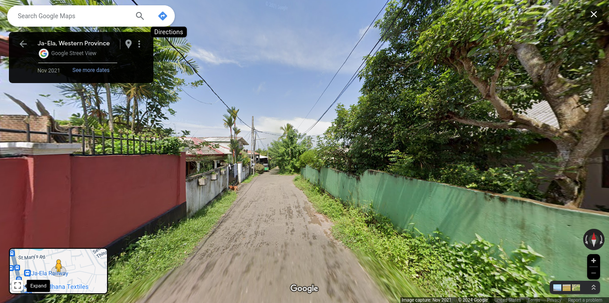

## Hingurugamuwa

**Hingurugamuwa** Grama Niladhari Division, **Badulla** Divisional Secretariat Division, **Badulla** District, **Uva** Province

**Badulla** Polling Division, **Badulla** Electoral District

Population: 4,139 (2012)

(**LK-8121140**/78E)

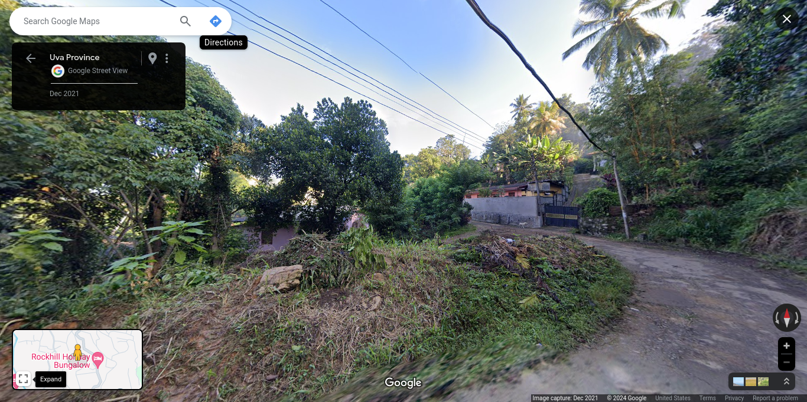

## Maraluwawa

**Maraluwawa** Grama Niladhari Division, **Mallawapitiya** Divisional Secretariat Division, **Kurunegala** District, **North Western** Province

**Mawathagama** Polling Division, **Kurunegala** Electoral District

Population: 1,518 (2012)

(**LK-6157045**/716)

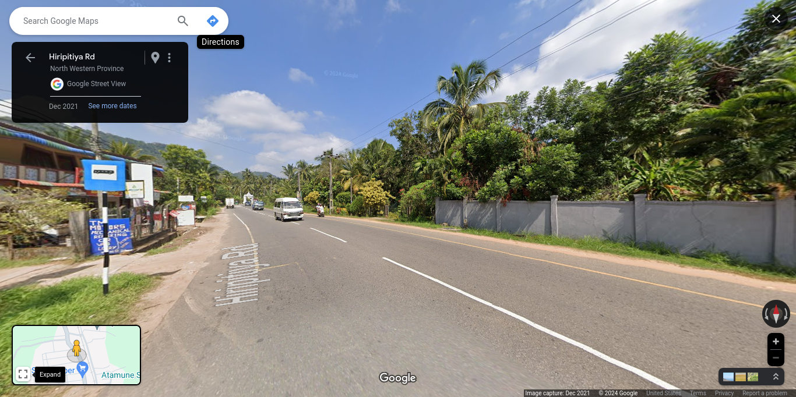

## Lakshapathiya North

**Lakshapathiya North** Grama Niladhari Division, **Moratuwa** Divisional Secretariat Division, **Colombo** District, **Western** Province

**Moratuwa** Polling Division, **Colombo** Electoral District

Population: 4,481 (2012)

(**LK-1133045**/550A)

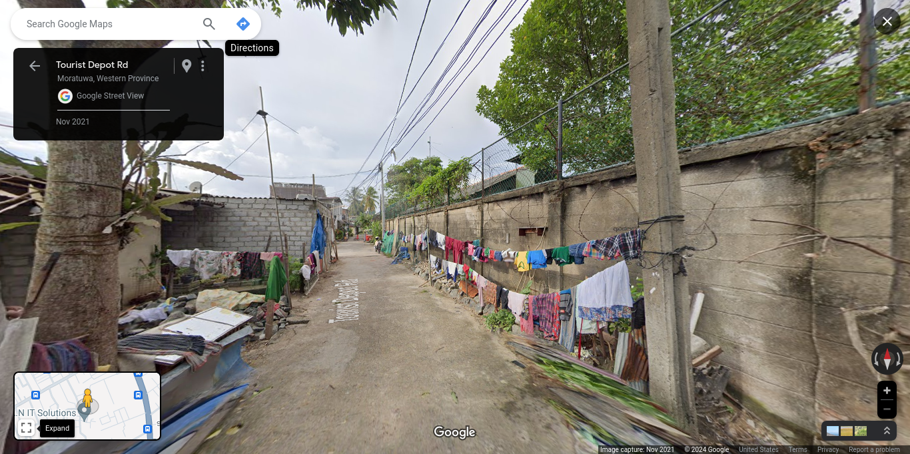

## Boralesgamuwa West B

**Boralesgamuwa West B** Grama Niladhari Division, **Kesbewa** Divisional Secretariat Division, **Colombo** District, **Western** Province

**Kesbewa** Polling Division, **Colombo** Electoral District

Population: 2,822 (2012)

(**LK-1136055**/533E)

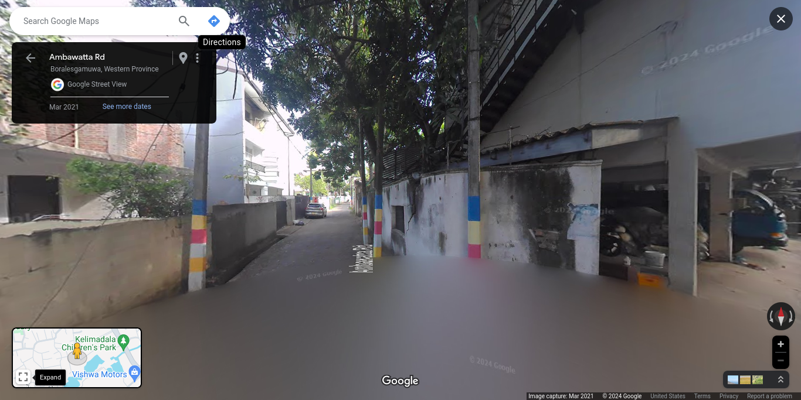

## Nape

**Nape** Grama Niladhari Division, **Balapitiya** Divisional Secretariat Division, **Galle** District, **Southern** Province

**Balapitiya** Polling Division, **Galle** Electoral District

Population: 1,291 (2012)

(**LK-3106050**/16)

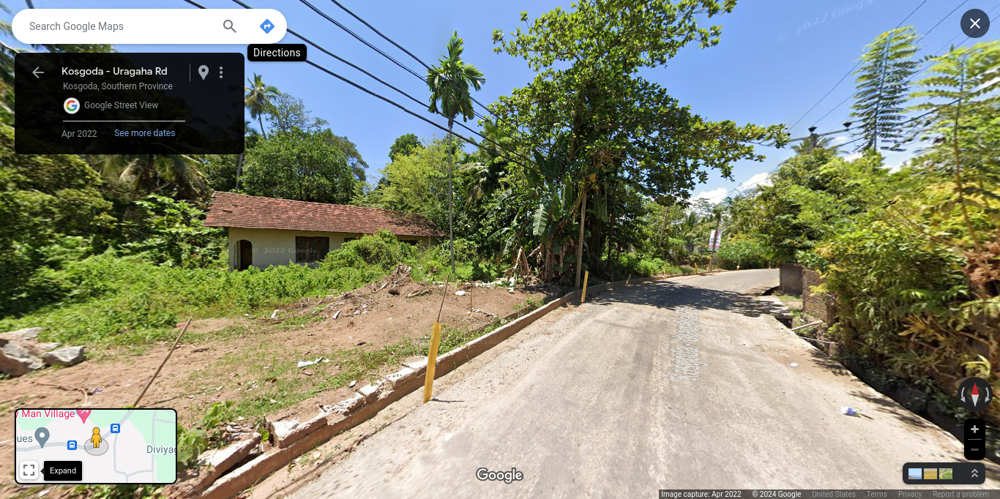

## Rathmalkatuwa

**Rathmalkatuwa** Grama Niladhari Division, **Dambulla** Divisional Secretariat Division, **Matale** District, **Central** Province

**Dambulla** Polling Division, **Matale** Electoral District

Population: 1,166 (2012)

(**LK-2206095**/E451C)

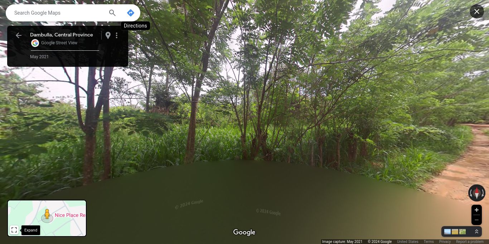

## Hathalispahuwa

**Hathalispahuwa** Grama Niladhari Division, **Polgahawela** Divisional Secretariat Division, **Kurunegala** District, **North Western** Province

**Polgahawela** Polling Division, **Kurunegala** Electoral District

Population: 459 (2012)

(**LK-6187250**/963)

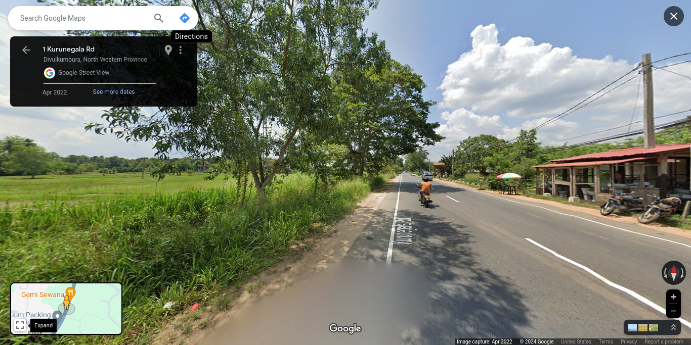

## Dematagoda

**Dematagoda** Grama Niladhari Division, **Thimbirigasyaya** Divisional Secretariat Division, **Colombo** District, **Western** Province

**Borella** Polling Division, **Colombo** Electoral District

Population: 18,602 (2012)

(**LK-1127030**/)

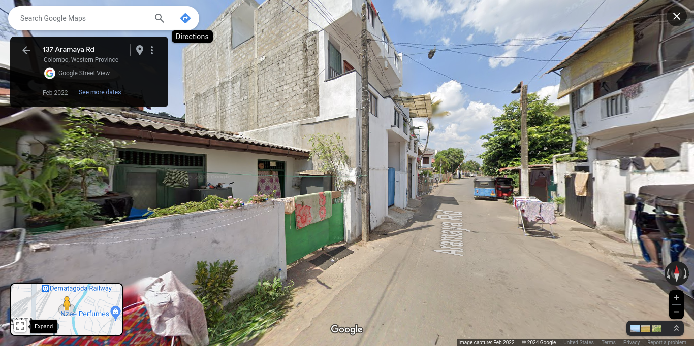

## Nawagiriyawa

**Nawagiriyawa** Grama Niladhari Division, **Uhana** Divisional Secretariat Division, **Ampara** District, **Eastern** Province

**Ampara** Polling Division, **Digamadulla** Electoral District

Population: 1,408 (2012)

(**LK-5212060**/W/104B)

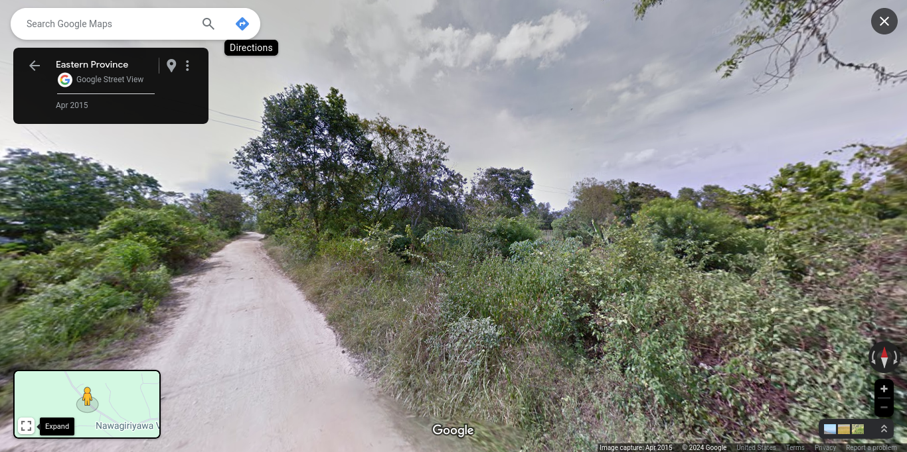

## Alakolamada

**Alakolamada** Grama Niladhari Division, **Rattota** Divisional Secretariat Division, **Matale** District, **Central** Province

**Rattota** Polling Division, **Matale** Electoral District

Population: 606 (2012)

(**LK-2230165**/E374C)

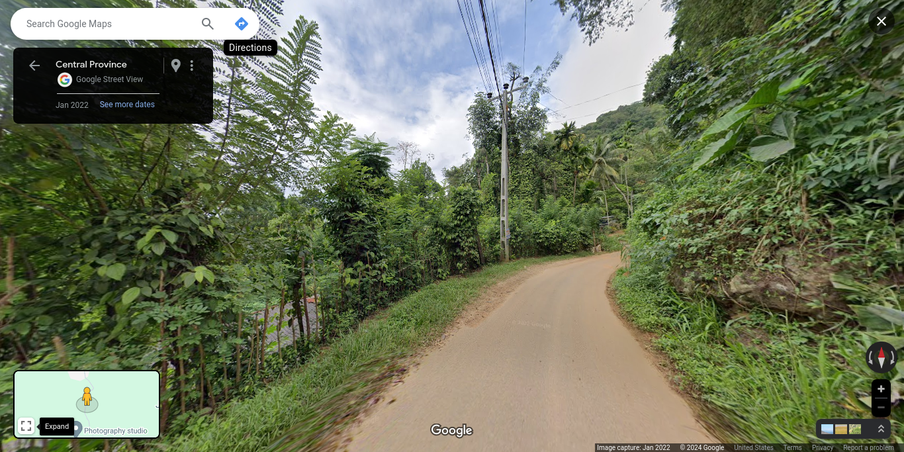

## Kattankudy division 1 South

**Kattankudy division 1 South** Grama Niladhari Division, **Kattankudy** Divisional Secretariat Division, **Batticaloa** District, **Eastern** Province

**Batticaloa** Polling Division, **Batticaloa** Electoral District

Population: 1,817 (2012)

(**LK-5124010**/167E)

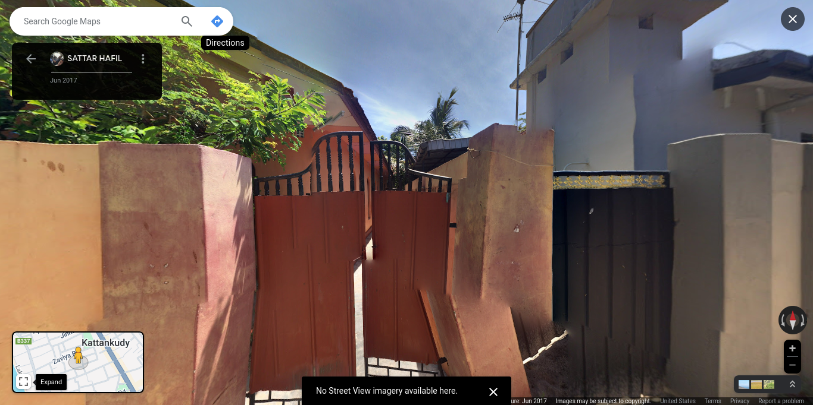

## Gelioya

**Gelioya** Grama Niladhari Division, **Udunuwara** Divisional Secretariat Division, **Kandy** District, **Central** Province

**Udunuwara** Polling Division, **Kandy** Electoral District

Population: 974 (2012)

(**LK-2139430**/38)

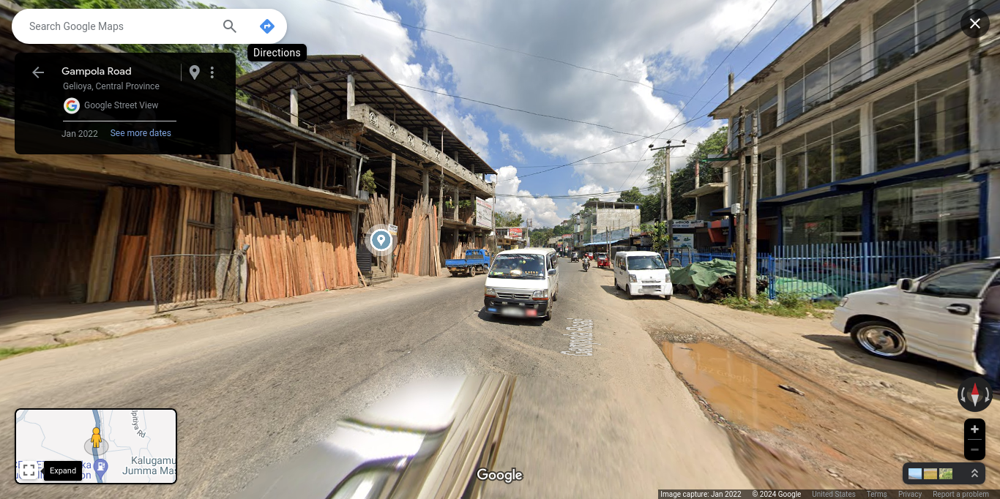

## Hemmeliya

**Hemmeliya** Grama Niladhari Division, **Baddegama** Divisional Secretariat Division, **Galle** District, **Southern** Province

**Baddegama** Polling Division, **Galle** Electoral District

Population: 1,131 (2012)

(**LK-3127040**/188)

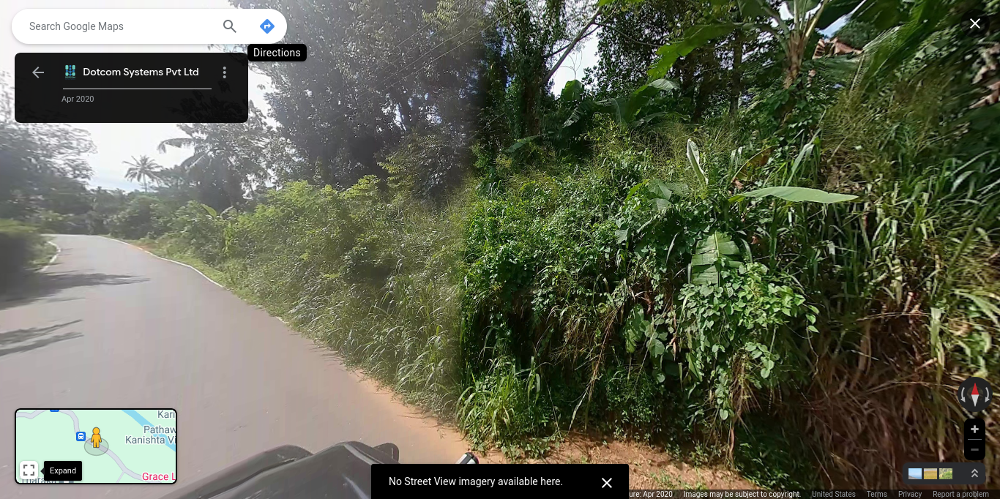

## Moraketiya

**Moraketiya** Grama Niladhari Division, **Embilipitiya** Divisional Secretariat Division, **Ratnapura** District, **Sabaragamuwa** Province

**Kolonna** Polling Division, **Ratnapura** Electoral District

Population: 4,196 (2012)

(**LK-9148110**/214C)

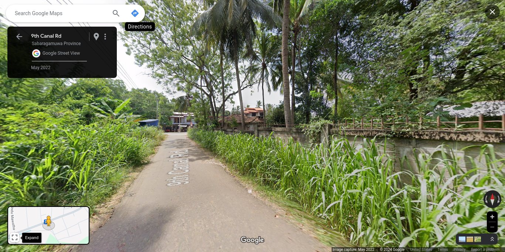

## Neduna

**Neduna** Grama Niladhari Division, **Gampaha** Divisional Secretariat Division, **Gampaha** District, **Western** Province

**Gampaha** Polling Division, **Gampaha** Electoral District

Population: 1,356 (2012)

(**LK-1224235**/236C)

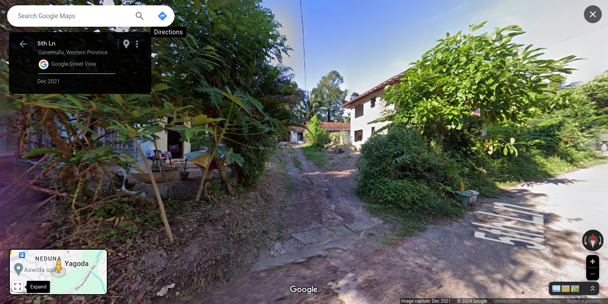

## Moor Street North

**Moor Street North** Grama Niladhari Division, **Jaffna** Divisional Secretariat Division, **Jaffna** District, **Northern** Province

**Jaffna** Polling Division, **Jaffna** Electoral District

Population: 1,538 (2012)

(**LK-4136135**/J/87)

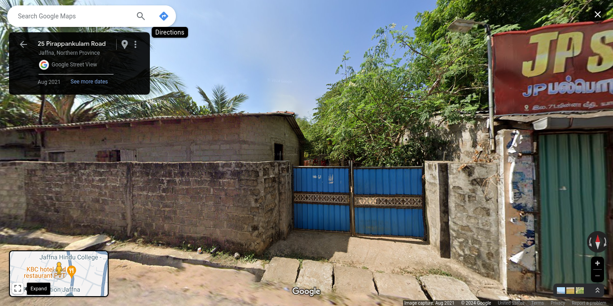

## Pahala Vitiyala East

**Pahala Vitiyala East** Grama Niladhari Division, **Thihagoda** Divisional Secretariat Division, **Matara** District, **Southern** Province

**Kamburupitiya** Polling Division, **Matara** Electoral District

Population: 698 (2012)

(**LK-3236015**/343)

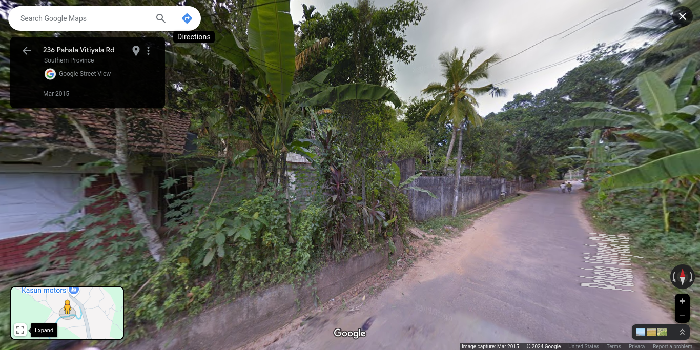

## Unakooruwa East

**Unakooruwa East** Grama Niladhari Division, **Tangalle** Divisional Secretariat Division, **Hambantota** District, **Southern** Province

**Tangalle** Polling Division, **Hambantota** Electoral District

Population: 1,183 (2012)

(**LK-3333295**/275)

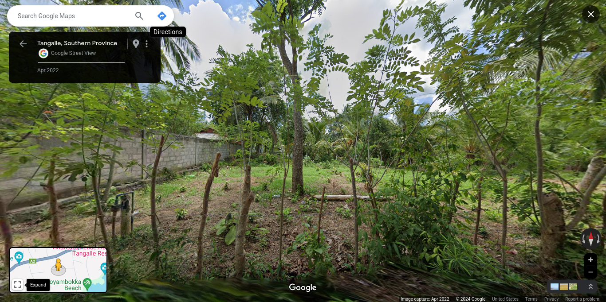

## Maragahadeniya

**Maragahadeniya** Grama Niladhari Division, **Palindanuwara** Divisional Secretariat Division, **Kalutara** District, **Western** Province

**Agalawatta** Polling Division, **Kalutara** Electoral District

Population: 2,315 (2012)

(**LK-1336075**/835C)

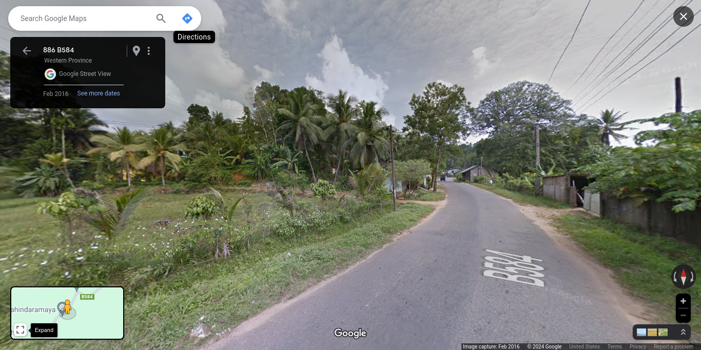

## Pahala Kiyaduwa

**Pahala Kiyaduwa** Grama Niladhari Division, **Malimbada** Divisional Secretariat Division, **Matara** District, **Southern** Province

**Akuressa** Polling Division, **Matara** Electoral District

Population: 1,022 (2012)

(**LK-3224010**/355B)

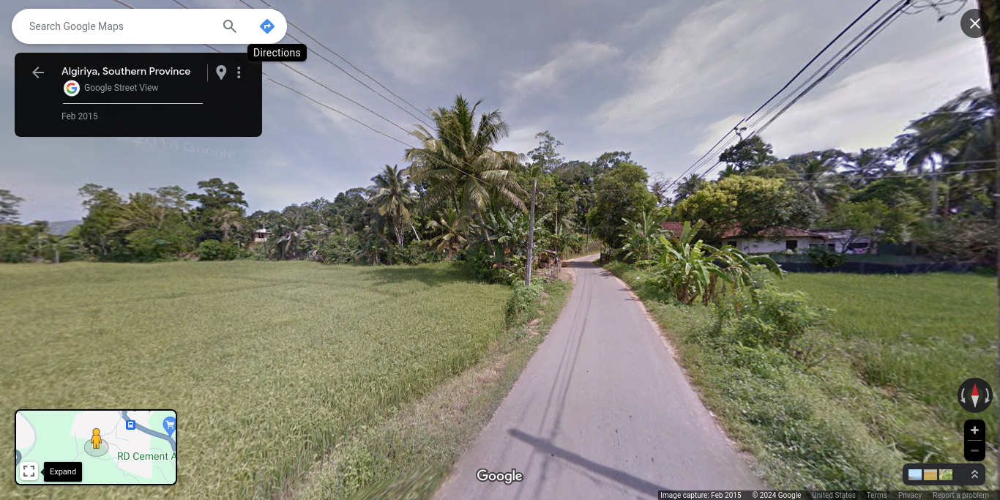

## Rajakadaluwa

**Rajakadaluwa** Grama Niladhari Division, **Arachchikattuwa** Divisional Secretariat Division, **Puttalam** District, **North Western** Province

**Chilaw** Polling Division, **Puttalam** Electoral District

Population: 2,122 (2012)

(**LK-6230130**/585A)

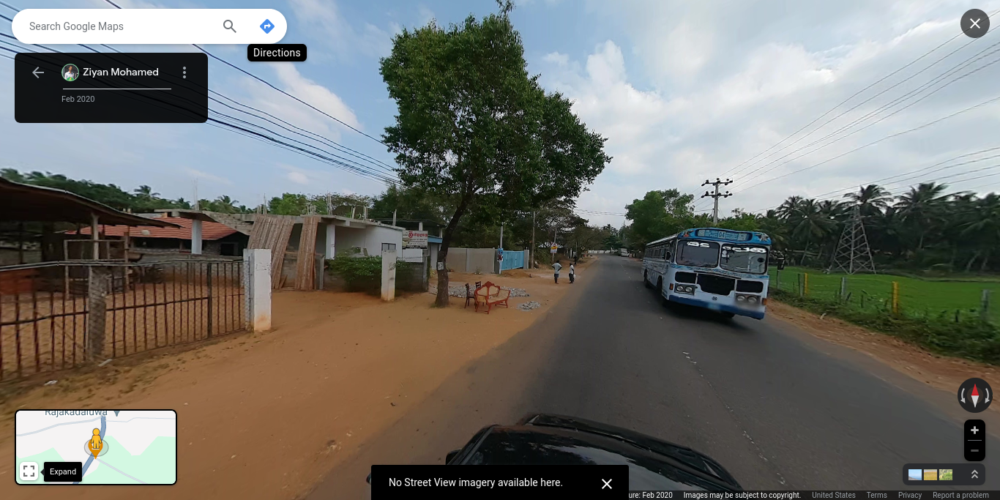

## Mahakeliya

**Mahakeliya** Grama Niladhari Division, **Bamunakotuwa** Divisional Secretariat Division, **Kurunegala** District, **North Western** Province

**Wariyapola** Polling Division, **Kurunegala** Electoral District

Population: 1,324 (2012)

(**LK-6149025**/1212)

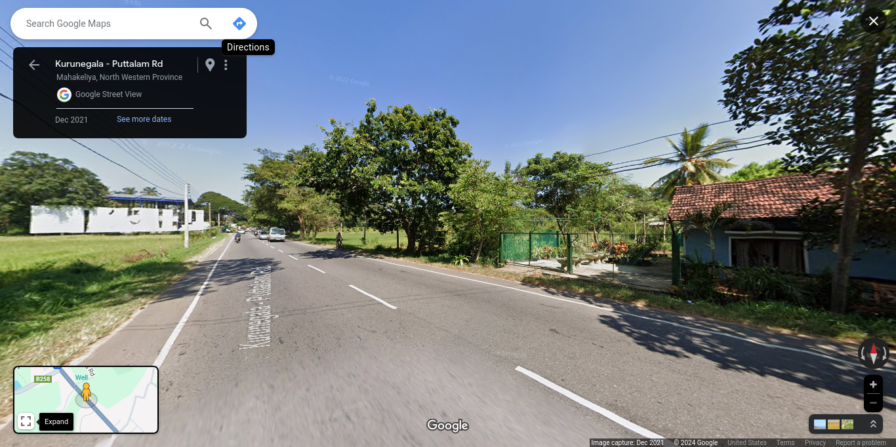

## Welimada Town

**Welimada Town** Grama Niladhari Division, **Welimada** Divisional Secretariat Division, **Badulla** District, **Uva** Province

**Welimada** Polling Division, **Badulla** Electoral District

Population: 2,051 (2012)

(**LK-8130075**/52A)

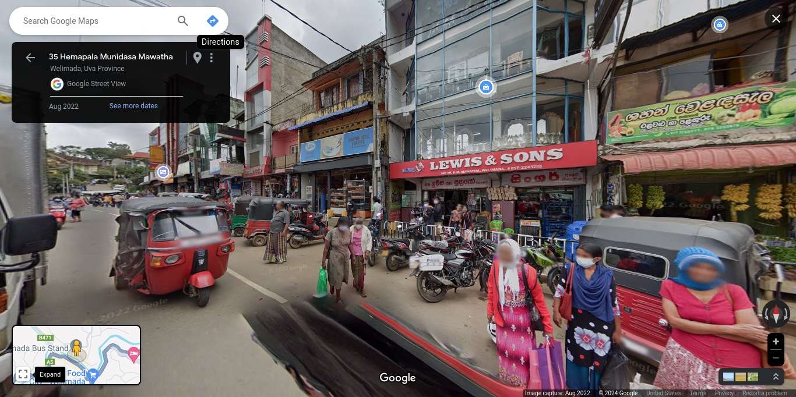

## Galahitiyawa North

**Galahitiyawa North** Grama Niladhari Division, **Gampaha** Divisional Secretariat Division, **Gampaha** District, **Western** Province

**Gampaha** Polling Division, **Gampaha** Electoral District

Population: 3,354 (2012)

(**LK-1224225**/215)

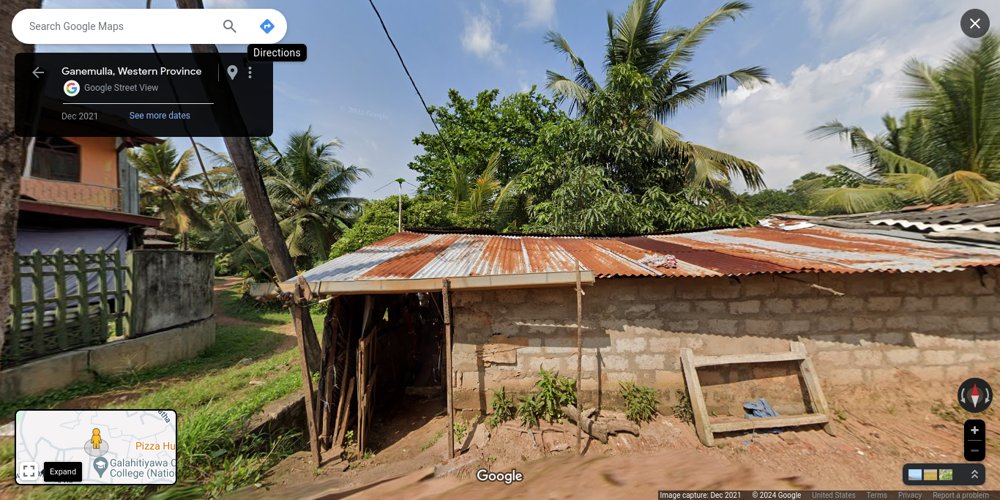

## Jayanthiwewa

**Jayanthiwewa** Grama Niladhari Division, **Padavi Sri Pura** Divisional Secretariat Division, **Trincomalee** District, **Eastern** Province

**Seruvila** Polling Division, **Trincomalee** Electoral District

Population: 1,787 (2012)

(**LK-5303050**/31I)

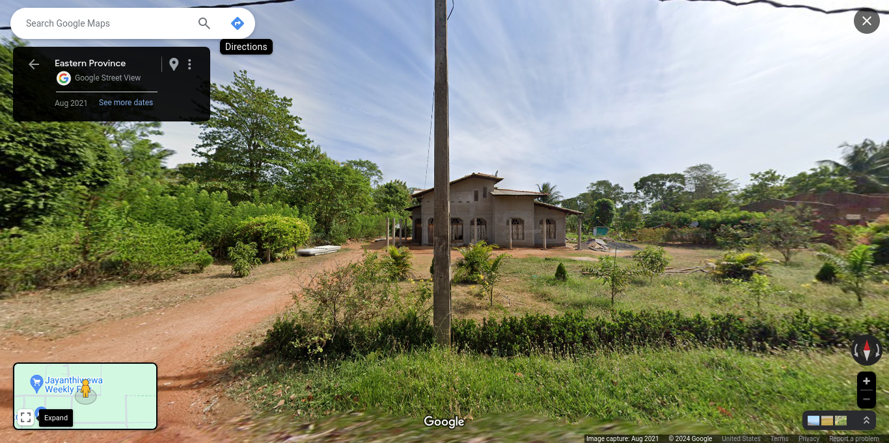

## Indipokunagoda South

**Indipokunagoda South** Grama Niladhari Division, **Tangalle** Divisional Secretariat Division, **Hambantota** District, **Southern** Province

**Tangalle** Polling Division, **Hambantota** Electoral District

Population: 573 (2012)

(**LK-3333250**/271)

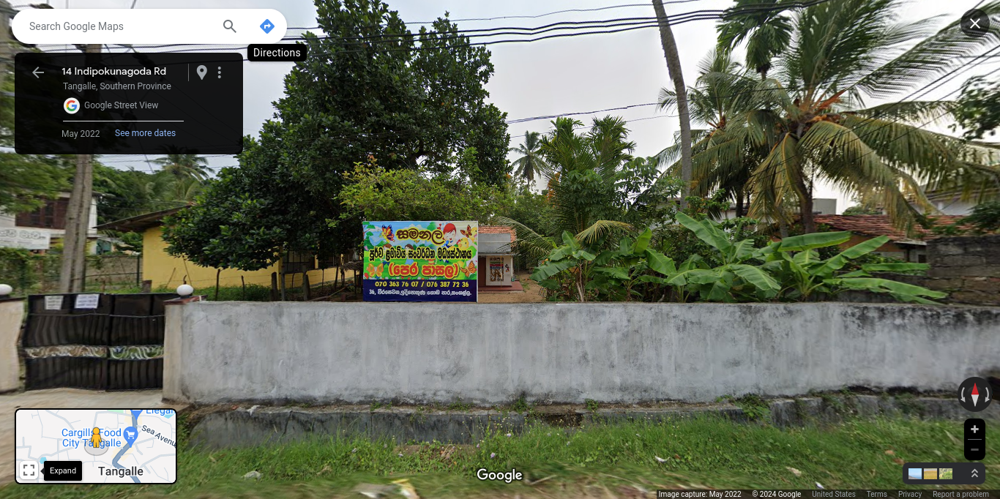

## Hetti  Weediya

**Hetti  Weediya** Grama Niladhari Division, **Weligama** Divisional Secretariat Division, **Matara** District, **Southern** Province

**Weligama** Polling Division, **Matara** Electoral District

Population: 2,397 (2012)

(**LK-3239055**/382B)

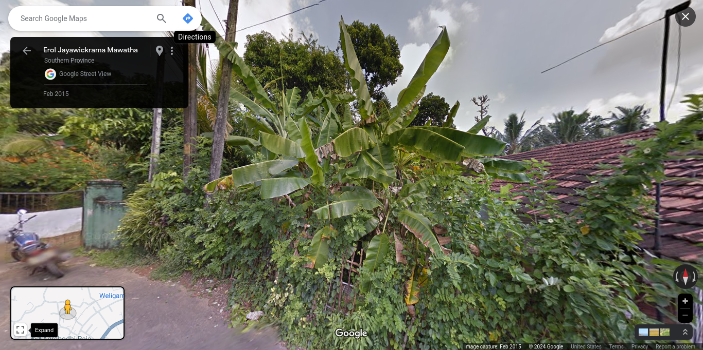

## Devanagala

**Devanagala** Grama Niladhari Division, **Aranayaka** Divisional Secretariat Division, **Kegalle** District, **Sabaragamuwa** Province

**Mawanella** Polling Division, **Kegalle** Electoral District

Population: 1,075 (2012)

(**LK-9209065**/33B)

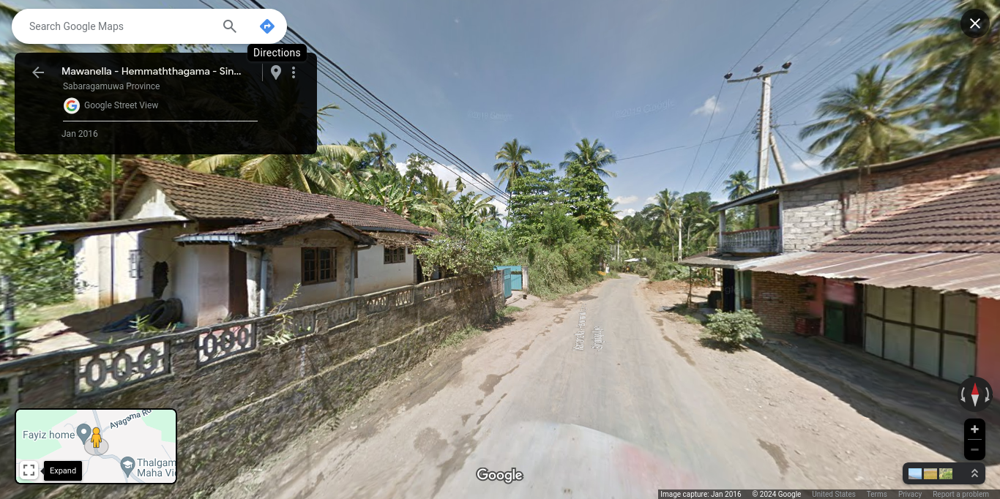

## Wewathenna

**Wewathenna** Grama Niladhari Division, **Doluwa** Divisional Secretariat Division, **Kandy** District, **Central** Province

**Gampola** Polling Division, **Kandy** Electoral District

Population: 886 (2012)

(**LK-2142095**/1152)

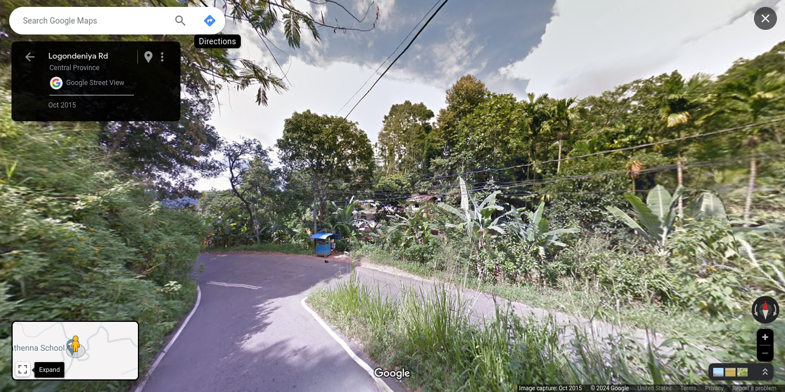

## Pothuvil 01/ Unit 2

**Pothuvil 01/ Unit 2** Grama Niladhari Division, **Pothuvil** Divisional Secretariat Division, **Ampara** District, **Eastern** Province

**Pothuvil** Polling Division, **Digamadulla** Electoral District

Population: 1,052 (2012)

(**LK-5248055**/P/02)

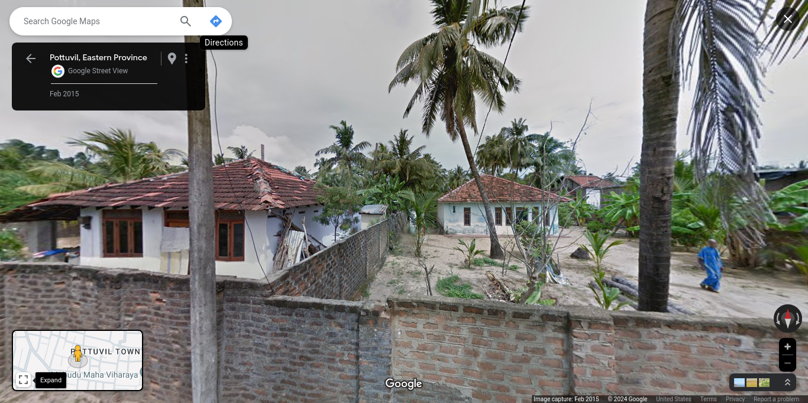

## Madarangoda

**Madarangoda** Grama Niladhari Division, **Yatinuwara** Divisional Secretariat Division, **Kandy** District, **Central** Province

**Yatinuwara** Polling Division, **Kandy** Electoral District

Population: 1,089 (2012)

(**LK-2136465**/176)

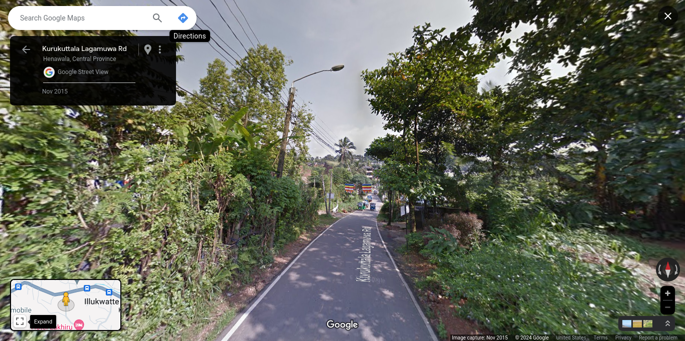

## Wattegedara

**Wattegedara** Grama Niladhari Division, **Maharagama** Divisional Secretariat Division, **Colombo** District, **Western** Province

**Maharagama** Polling Division, **Colombo** Electoral District

Population: 7,734 (2012)

(**LK-1121185**/532C)

## Katkovalam

**Katkovalam** Grama Niladhari Division, **Vadamaradchi North (Point Pedro)** Divisional Secretariat Division, **Jaffna** District, **Northern** Province

**Point Pedro** Polling Division, **Jaffna** Electoral District

Population: 2,432 (2012)

(**LK-4127120**/J/406)

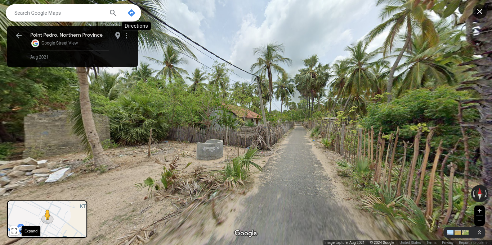

## Wewagedara

**Wewagedara** Grama Niladhari Division, **Wariyapola** Divisional Secretariat Division, **Kurunegala** District, **North Western** Province

**Wariyapola** Polling Division, **Kurunegala** Electoral District

Population: 2,000 (2012)

(**LK-6136250**/1243)

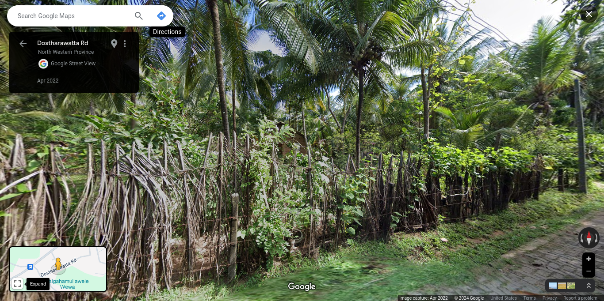

## Eriyagama

**Eriyagama** Grama Niladhari Division, **Thambuttegama** Divisional Secretariat Division, **Anuradhapura** District, **North Central** Province

**Kalawewa** Polling Division, **Anuradhapura** Electoral District

Population: 1,204 (2012)

(**LK-7145030**/430)

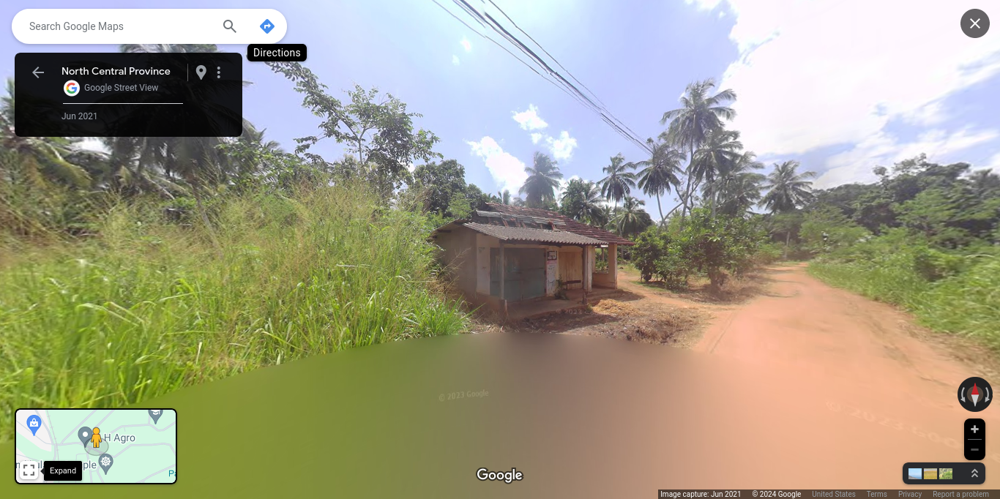

## Wattalpola

**Wattalpola** Grama Niladhari Division, **Panadura** Divisional Secretariat Division, **Kalutara** District, **Western** Province

**Panadura** Polling Division, **Kalutara** Electoral District

Population: 4,273 (2012)

(**LK-1303065**/674A)

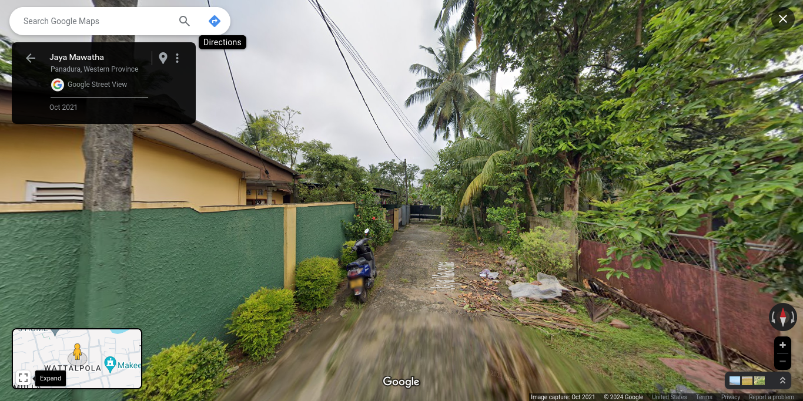

## Akkaraipattu 11

**Akkaraipattu 11** Grama Niladhari Division, **Akkaraipattu** Divisional Secretariat Division, **Ampara** District, **Eastern** Province

**Pothuvil** Polling Division, **Digamadulla** Electoral District

Population: 1,282 (2012)

(**LK-5236065**/AP/15/2)

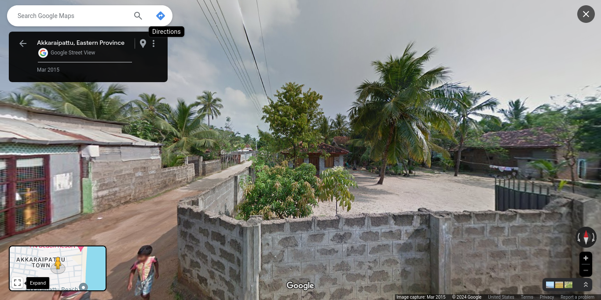

## Holeepitaya

**Holeepitaya** Grama Niladhari Division, **Kiriella** Divisional Secretariat Division, **Ratnapura** District, **Sabaragamuwa** Province

**Ratnapura** Polling Division, **Ratnapura** Electoral District

Population: 964 (2012)

(**LK-9109085**/150B)

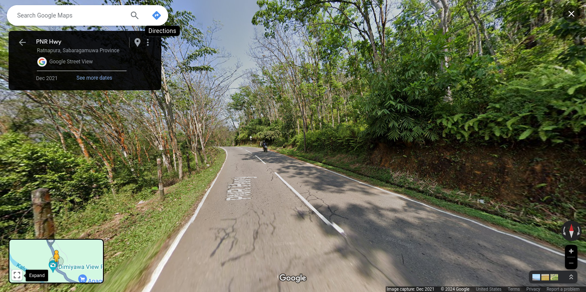

## Nabadagahawatta

**Nabadagahawatta** Grama Niladhari Division, **Galewela** Divisional Secretariat Division, **Matale** District, **Central** Province

**Dambulla** Polling Division, **Matale** Electoral District

Population: 1,927 (2012)

(**LK-2203165**/E434)

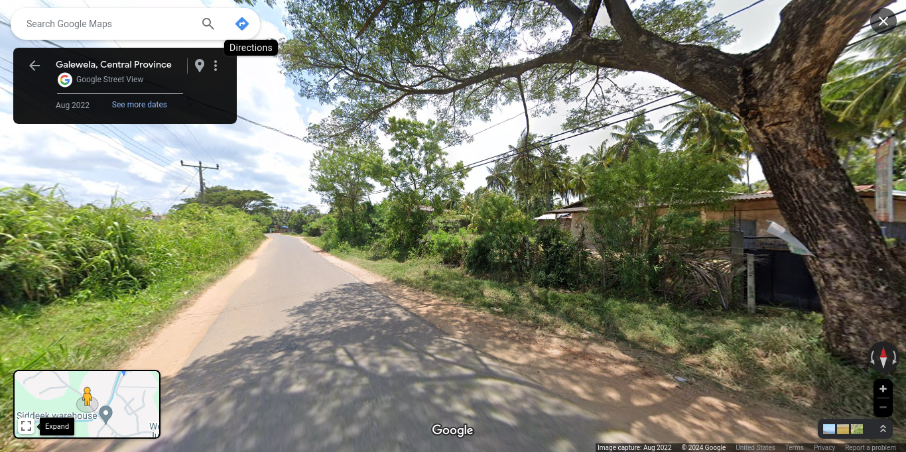

## Kallanchiya Gama

**Kallanchiya Gama** Grama Niladhari Division, **Ipalogama** Divisional Secretariat Division, **Anuradhapura** District, **North Central** Province

**Mihinthale** Polling Division, **Anuradhapura** Electoral District

Population: 1,405 (2012)

(**LK-7160100**/508)

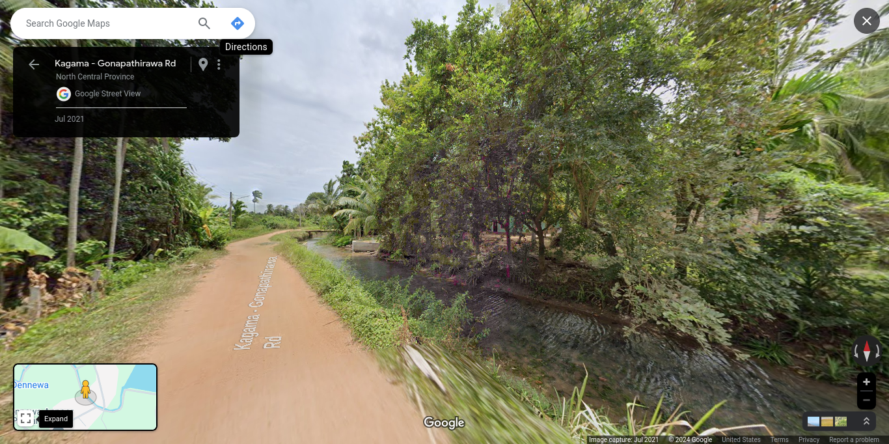

## Hiyadala Walpola

**Hiyadala Walpola** Grama Niladhari Division, **Thumpane** Divisional Secretariat Division, **Kandy** District, **Central** Province

**Galagedara** Polling Division, **Kandy** Electoral District

Population: 676 (2012)

(**LK-2103320**/294)

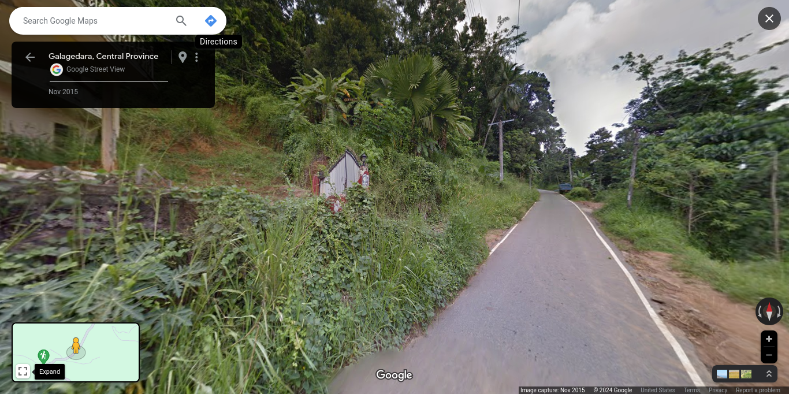

## Opanayaka

**Opanayaka** Grama Niladhari Division, **Opanayake** Divisional Secretariat Division, **Ratnapura** District, **Sabaragamuwa** Province

**Rakwana** Polling Division, **Ratnapura** Electoral District

Population: 2,477 (2012)

(**LK-9121045**/245)

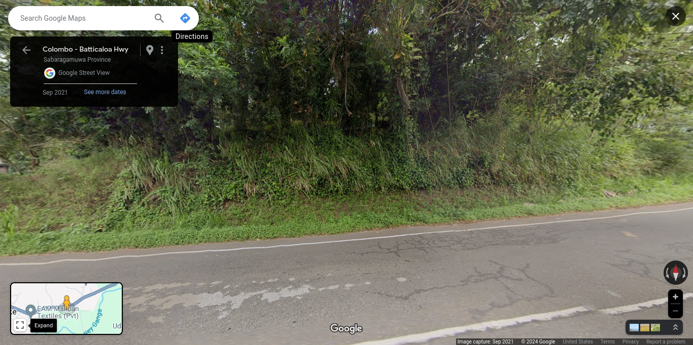

## Silvagewatta

**Silvagewatta** Grama Niladhari Division, **Bope-Poddala** Divisional Secretariat Division, **Galle** District, **Southern** Province

**Akmeemana** Polling Division, **Galle** Electoral District

Population: 697 (2012)

(**LK-3142090**/124B)

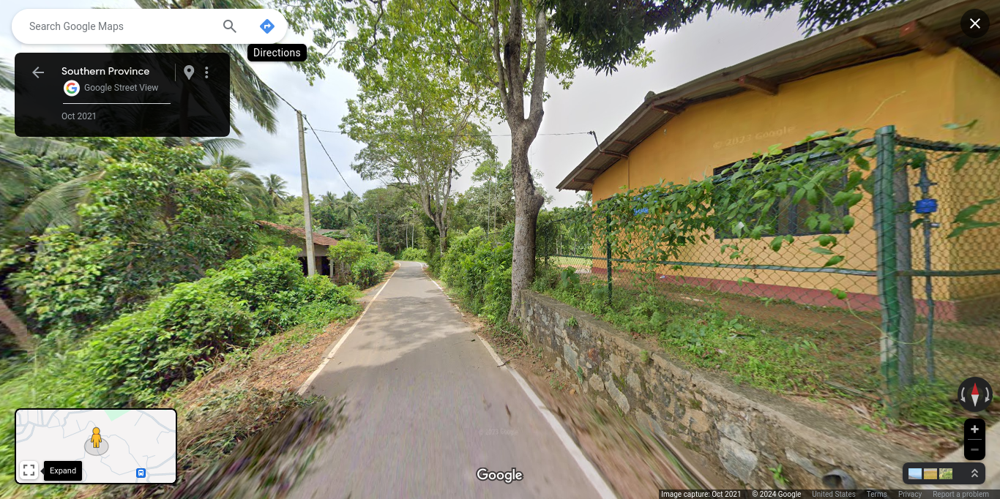

## Weradoowa

**Weradoowa** Grama Niladhari Division, **Matara Four Gravets** Divisional Secretariat Division, **Matara** District, **Southern** Province

**Matara** Polling Division, **Matara** Electoral District

Population: 1,123 (2012)

(**LK-3242180**/425A)

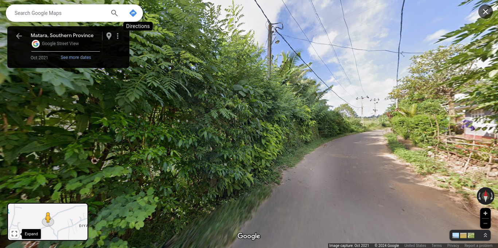

## Ibbanwala

**Ibbanwala** Grama Niladhari Division, **Colombo** Divisional Secretariat Division, **Colombo** District, **Western** Province

**Colombo Central** Polling Division, **Colombo** Electoral District

Population: 2,583 (2012)

(**LK-1103170**/)

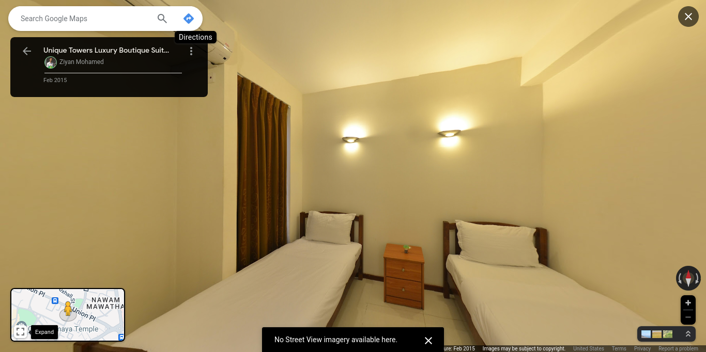

## Manipay East

**Manipay East** Grama Niladhari Division, **Valikamam South-West (Sandilipay)** Divisional Secretariat Division, **Jaffna** District, **Northern** Province

**Manipay** Polling Division, **Jaffna** Electoral District

Population: 2,183 (2012)

(**LK-4109050**/J/138)

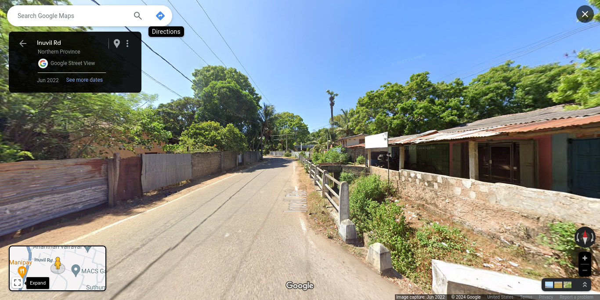

## Orugala

**Orugala** Grama Niladhari Division, **Giribawa** Divisional Secretariat Division, **Kurunegala** District, **North Western** Province

**Galgamuwa** Polling Division, **Kurunegala** Electoral District

Population: 987 (2012)

(**LK-6103050**/16)

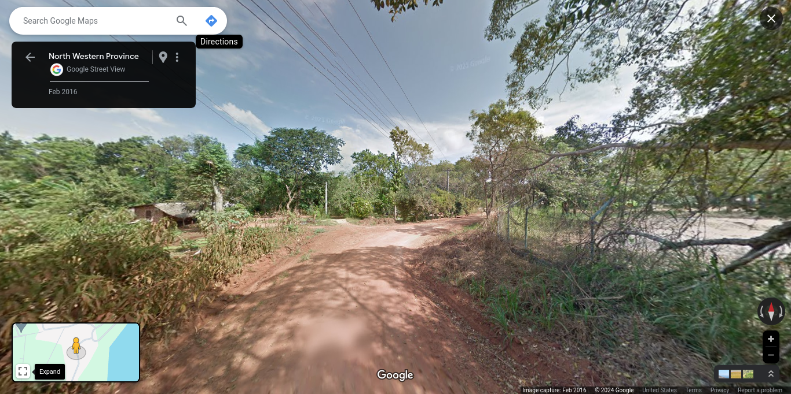

## Kurunduwatta

**Kurunduwatta** Grama Niladhari Division, **Balapitiya** Divisional Secretariat Division, **Galle** District, **Southern** Province

**Balapitiya** Polling Division, **Galle** Electoral District

Population: 1,178 (2012)

(**LK-3106220**/87F)

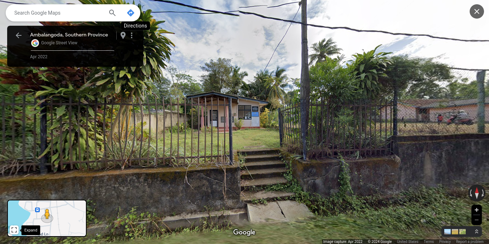

## Ninthavur 08

**Ninthavur 08** Grama Niladhari Division, **Ninthavur** Divisional Secretariat Division, **Ampara** District, **Eastern** Province

**Pothuvil** Polling Division, **Digamadulla** Electoral District

Population: 1,485 (2012)

(**LK-5230100**/37B)

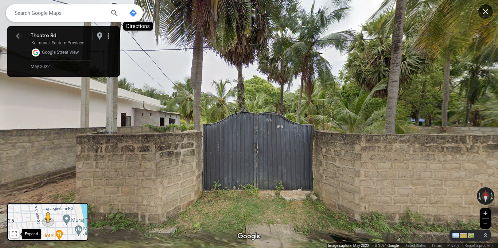

## Udubettawa West

**Udubettawa West** Grama Niladhari Division, **Yakkalamulla** Divisional Secretariat Division, **Galle** District, **Southern** Province

**Baddegama** Polling Division, **Galle** Electoral District

Population: 790 (2012)

(**LK-3148175**/183C)

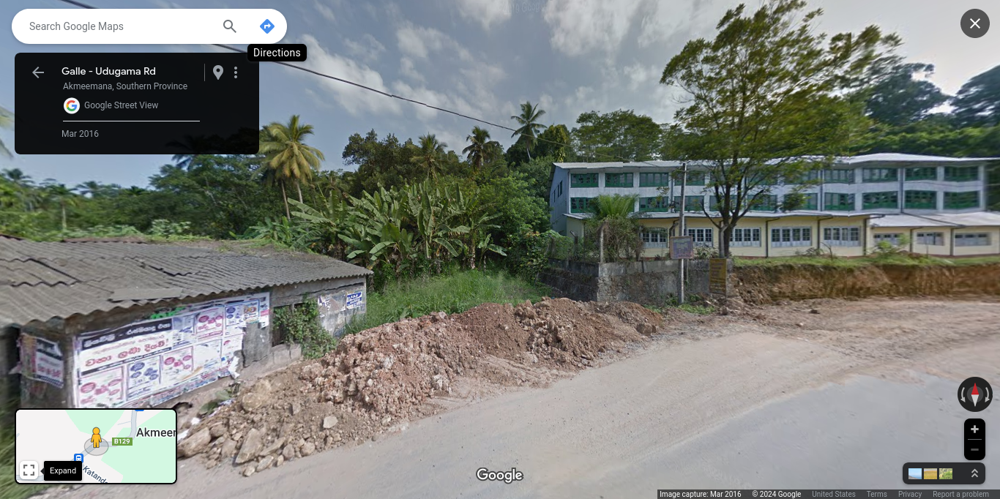

## Akbar Town

**Akbar Town** Grama Niladhari Division, **Mahara** Divisional Secretariat Division, **Gampaha** District, **Western** Province

**Mahara** Polling Division, **Gampaha** Electoral District

Population: 3,407 (2012)

(**LK-1233460**/255A)

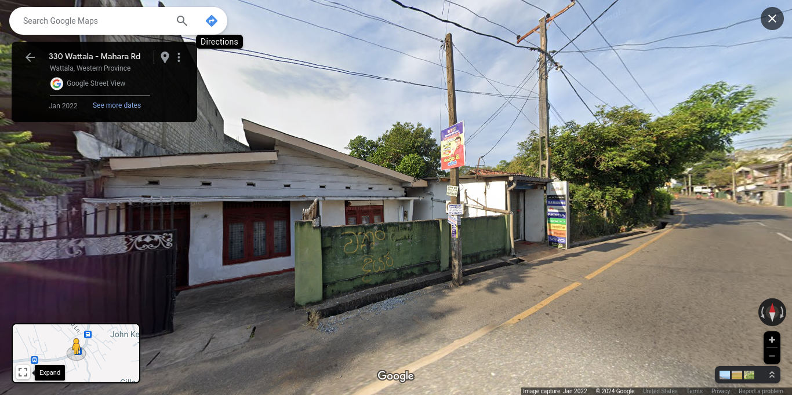

## Sandilipay Centre

**Sandilipay Centre** Grama Niladhari Division, **Valikamam South-West (Sandilipay)** Divisional Secretariat Division, **Jaffna** District, **Northern** Province

**Manipay** Polling Division, **Jaffna** Electoral District

Population: 2,066 (2012)

(**LK-4109070**/J/142)

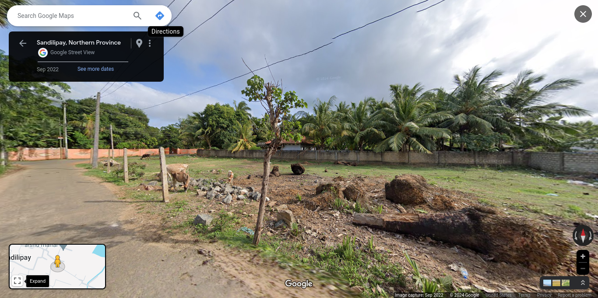

## Galwetiya

**Galwetiya** Grama Niladhari Division, **Wattala** Divisional Secretariat Division, **Gampaha** District, **Western** Province

**Wattala** Polling Division, **Gampaha** Electoral District

Population: 3,426 (2012)

(**LK-1218225**/176B)

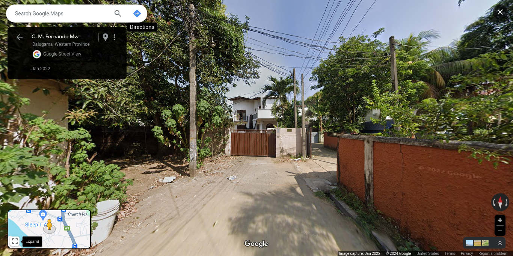

## Akkaraipattu 7

**Akkaraipattu 7** Grama Niladhari Division, **Alayadiwembu** Divisional Secretariat Division, **Ampara** District, **Eastern** Province

**Pothuvil** Polling Division, **Digamadulla** Electoral District

Population: 739 (2012)

(**LK-5239060**/AP/21)

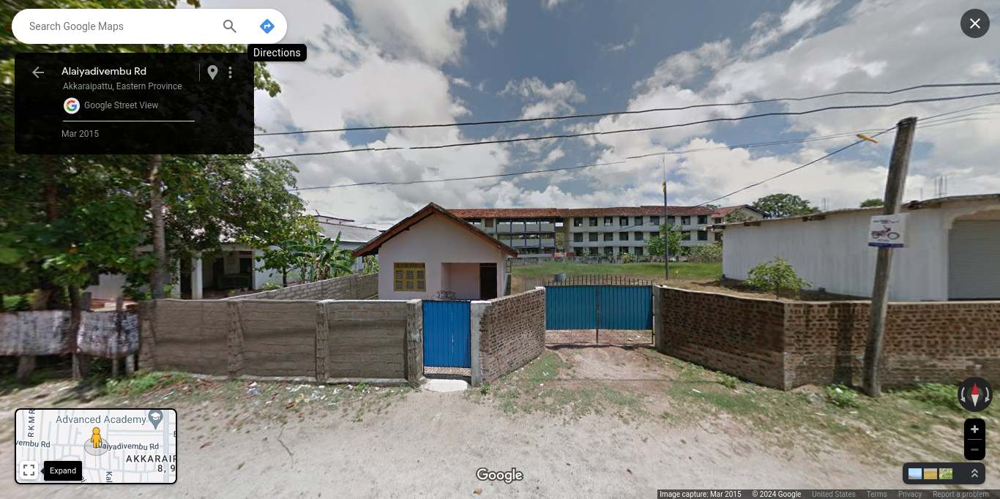

## Ambagaspitiya

**Ambagaspitiya** Grama Niladhari Division, **Mahara** Divisional Secretariat Division, **Gampaha** District, **Western** Province

**Mahara** Polling Division, **Gampaha** Electoral District

Population: 1,165 (2012)

(**LK-1233040**/307A)

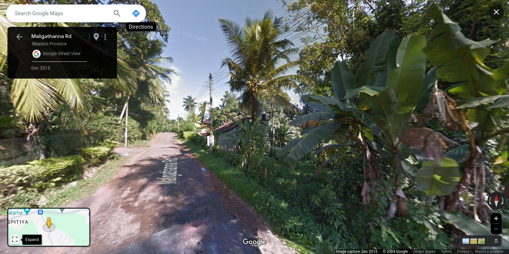

## Akkaraipattu 17

**Akkaraipattu 17** Grama Niladhari Division, **Akkaraipattu** Divisional Secretariat Division, **Ampara** District, **Eastern** Province

**Samanthurai** Polling Division, **Digamadulla** Electoral District

Population: 1,026 (2012)

(**LK-5236100**/AP/18A)

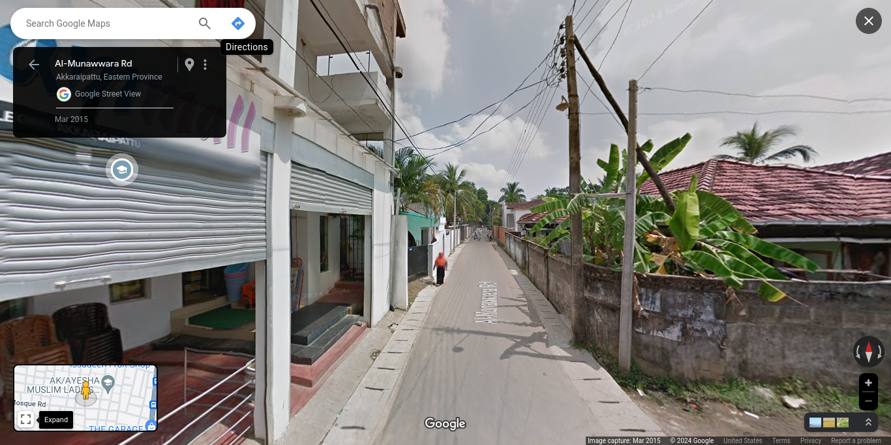

## Parakandeniya North 1

**Parakandeniya North 1** Grama Niladhari Division, **Gampaha** Divisional Secretariat Division, **Gampaha** District, **Western** Province

**Gampaha** Polling Division, **Gampaha** Electoral District

Population: 2,103 (2012)

(**LK-1224425**/244A)

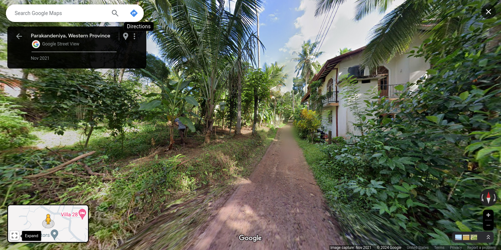

## Kumarimulla

**Kumarimulla** Grama Niladhari Division, **Dompe** Divisional Secretariat Division, **Gampaha** District, **Western** Province

**Dompe** Polling Division, **Gampaha** Electoral District

Population: 1,567 (2012)

(**LK-1230450**/419)

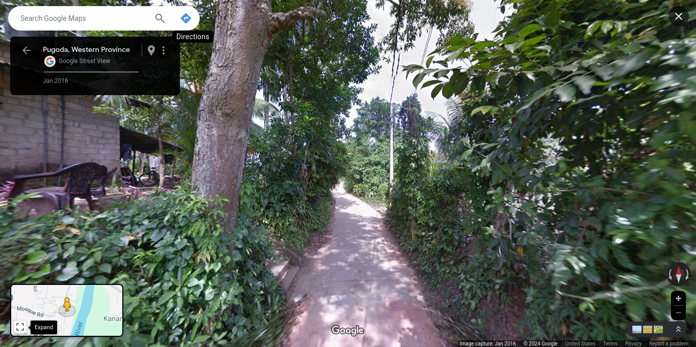

## Paranakade

**Paranakade** Grama Niladhari Division, **Weligama** Divisional Secretariat Division, **Matara** District, **Southern** Province

**Weligama** Polling Division, **Matara** Electoral District

Population: 1,380 (2012)

(**LK-3239125**/382A)

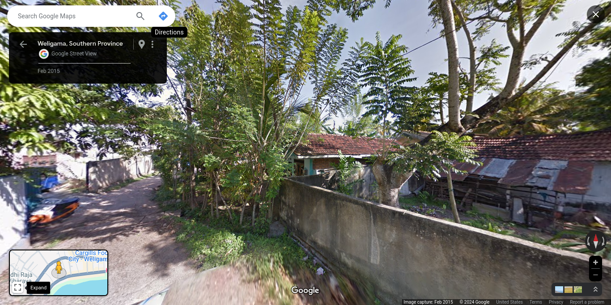

## Galwadugoda

**Galwadugoda** Grama Niladhari Division, **Galle Four Gravets** Divisional Secretariat Division, **Galle** District, **Southern** Province

**Galle** Polling Division, **Galle** Electoral District

Population: 2,960 (2012)

(**LK-3139110**/96B)

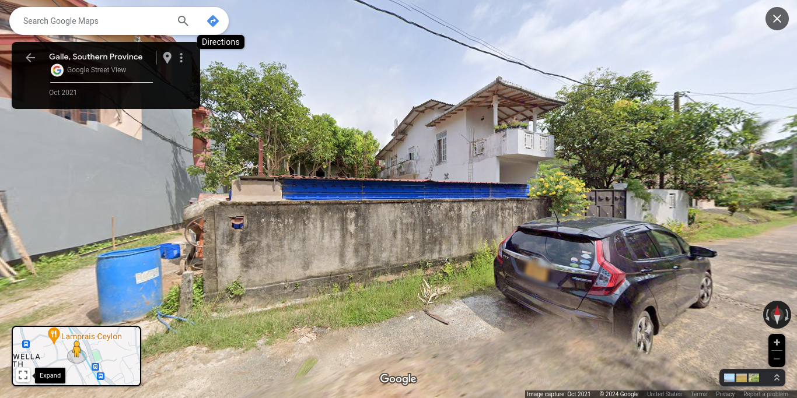

## Pakkiyawatta 1

**Pakkiyawatta 1** Grama Niladhari Division, **Pothuvil** Divisional Secretariat Division, **Ampara** District, **Eastern** Province

**Pothuvil** Polling Division, **Digamadulla** Electoral District

Population: 992 (2012)

(**LK-5248075**/P/13)

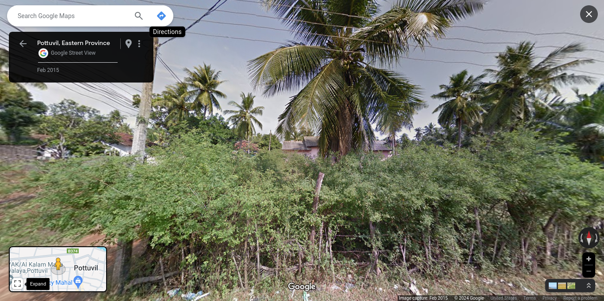

## Werahera

**Werahera** Grama Niladhari Division, **Dompe** Divisional Secretariat Division, **Gampaha** District, **Western** Province

**Dompe** Polling Division, **Gampaha** Electoral District

Population: 1,171 (2012)

(**LK-1230190**/382)

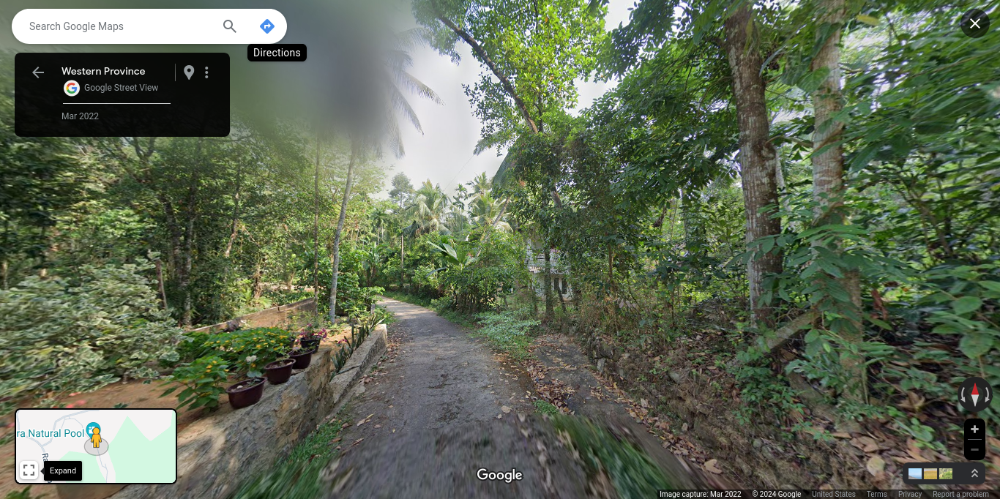

## Dombagammana

**Dombagammana** Grama Niladhari Division, **Pujapitiya** Divisional Secretariat Division, **Kandy** District, **Central** Province

**Harispattuwa** Polling Division, **Kandy** Electoral District

Population: 1,026 (2012)

(**LK-2106230**/515)

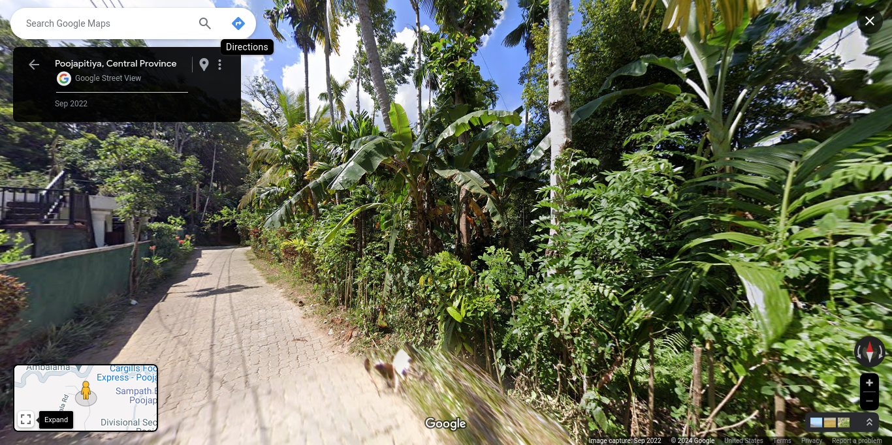

## Ambagaspitiya

**Ambagaspitiya** Grama Niladhari Division, **Mahara** Divisional Secretariat Division, **Gampaha** District, **Western** Province

**Mahara** Polling Division, **Gampaha** Electoral District

Population: 1,165 (2012)

(**LK-1233040**/307A)

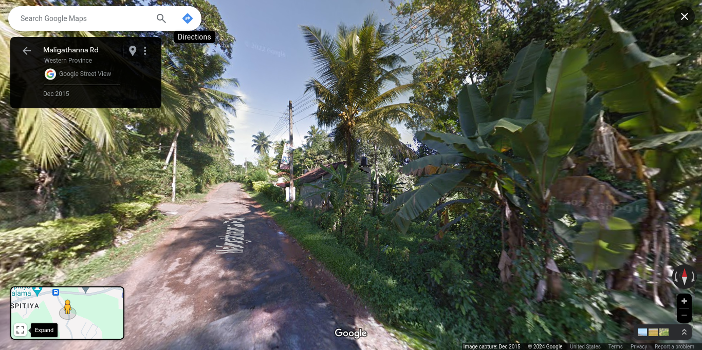

## Thirukadaloor

**Thirukadaloor** Grama Niladhari Division, **Trincomalee Town and Gravets** Divisional Secretariat Division, **Trincomalee** District, **Eastern** Province

**Trincomalee** Polling Division, **Trincomalee** Electoral District

Population: 3,358 (2012)

(**LK-5315110**/243F)

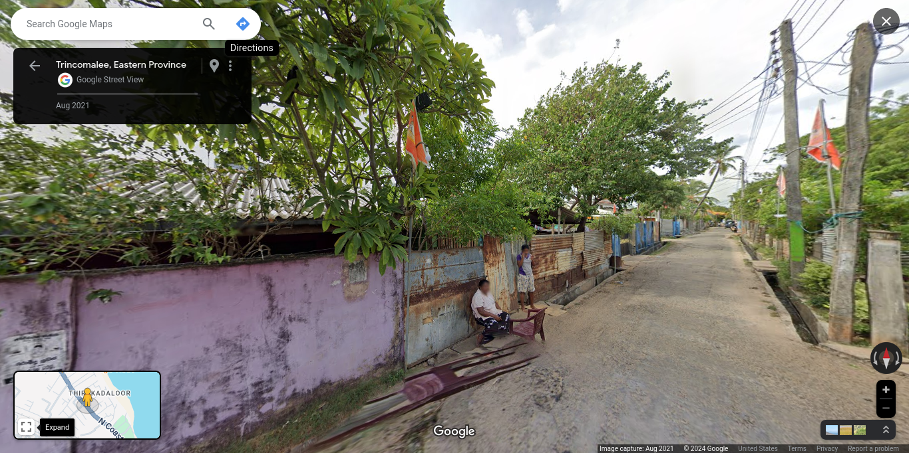

## Kallikaddaikkadu

**Kallikaddaikkadu** Grama Niladhari Division, **Mannar Town** Divisional Secretariat Division, **Mannar** District, **Northern** Province

**Mannar** Polling Division, **Vanni** Electoral District

Population: 393 (2012)

(**LK-4203220**/MN/90)

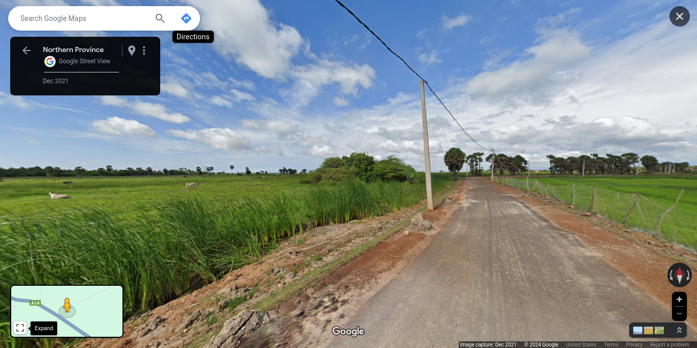

## Yakalla

**Yakalla** Grama Niladhari Division, **Galenbindunuwewa** Divisional Secretariat Division, **Anuradhapura** District, **North Central** Province

**Horowpothana** Polling Division, **Anuradhapura** Electoral District

Population: 2,044 (2012)

(**LK-7127195**/186)

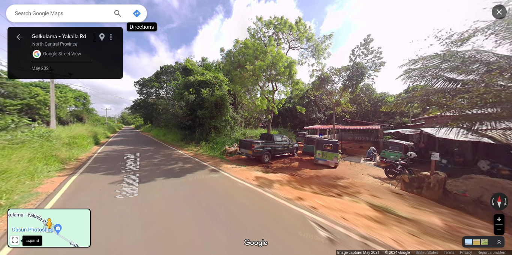

## Rathnapura Town West

**Rathnapura Town West** Grama Niladhari Division, **Ratnapura** Divisional Secretariat Division, **Ratnapura** District, **Sabaragamuwa** Province

**Ratnapura** Polling Division, **Ratnapura** Electoral District

Population: 1,106 (2012)

(**LK-9112200**/152F)

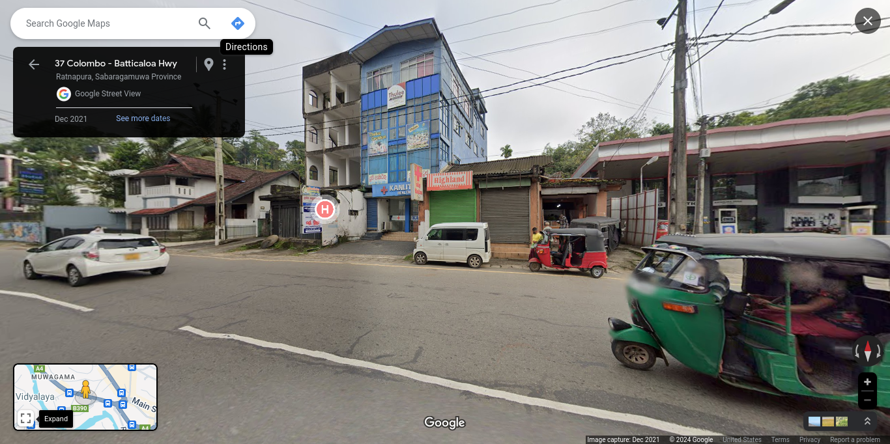

## Devinuwara Welegoda

**Devinuwara Welegoda** Grama Niladhari Division, **Devinuwara** Divisional Secretariat Division, **Matara** District, **Southern** Province

**Devinuwara** Polling Division, **Matara** Electoral District

Population: 877 (2012)

(**LK-3245195**/433G)

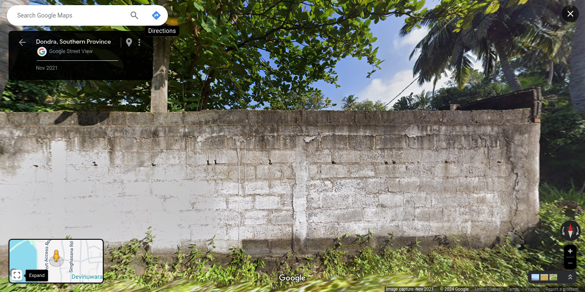

## Kanumale

**Kanumale** Grama Niladhari Division, **Weerambugedara** Divisional Secretariat Division, **Kurunegala** District, **North Western** Province

**Polgahawela** Polling Division, **Kurunegala** Electoral District

Population: 2,177 (2012)

(**LK-6166135**/855)

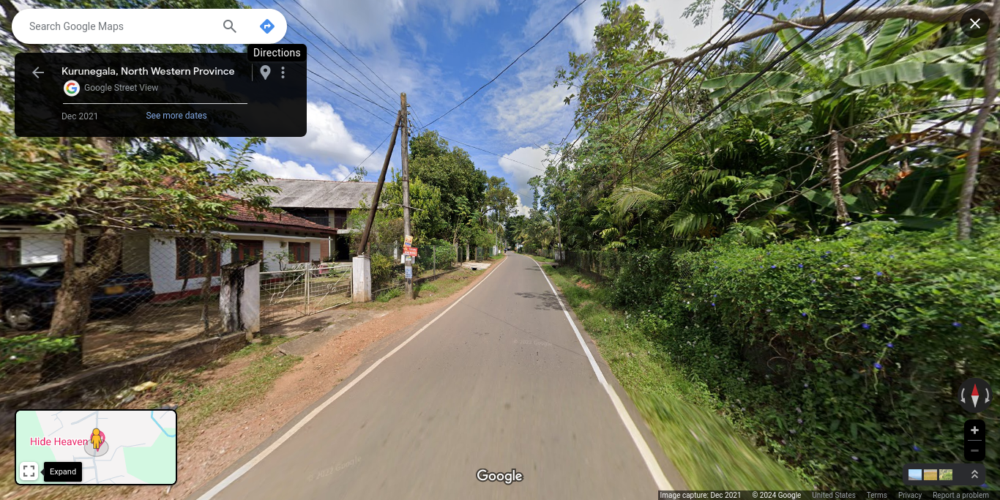

## Orugala

**Orugala** Grama Niladhari Division, **Giribawa** Divisional Secretariat Division, **Kurunegala** District, **North Western** Province

**Galgamuwa** Polling Division, **Kurunegala** Electoral District

Population: 987 (2012)

(**LK-6103050**/16)

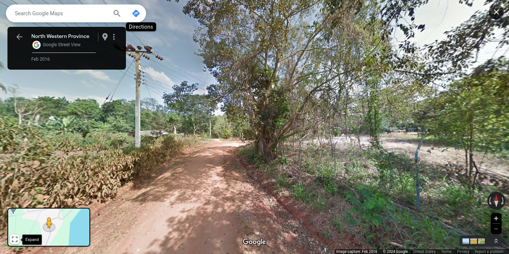

## Kurunegala Town - West

**Kurunegala Town - West** Grama Niladhari Division, **Kurunegala** Divisional Secretariat Division, **Kurunegala** District, **North Western** Province

**Kurunegala** Polling Division, **Kurunegala** Electoral District

Population: 3,717 (2012)

(**LK-6154145**/837)

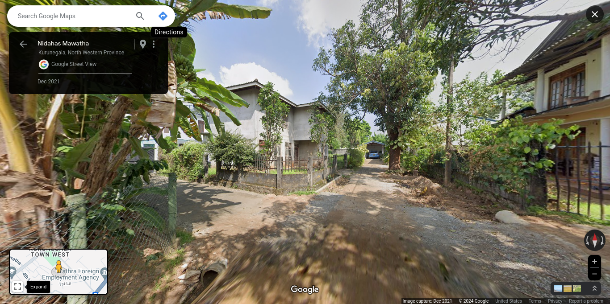

## Ethgala North

**Ethgala North** Grama Niladhari Division, **Ganga Ihala Korale** Divisional Secretariat Division, **Kandy** District, **Central** Province

**Nawalapitiya** Polling Division, **Kandy** Electoral District

Population: 971 (2012)

(**LK-2154040**/1073)

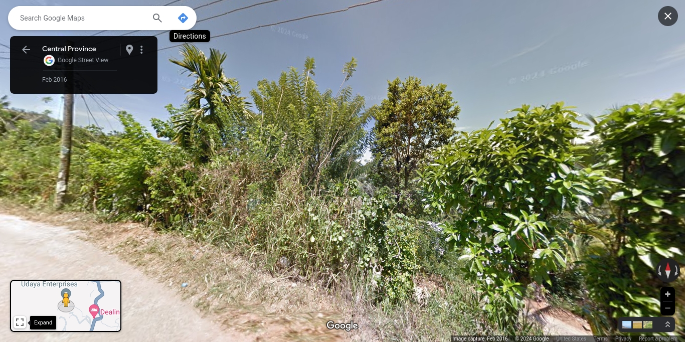

## Horathuduwa

**Horathuduwa** Grama Niladhari Division, **Kesbewa** Divisional Secretariat Division, **Colombo** District, **Western** Province

**Kesbewa** Polling Division, **Colombo** Electoral District

Population: 1,604 (2012)

(**LK-1136330**/570/71A)

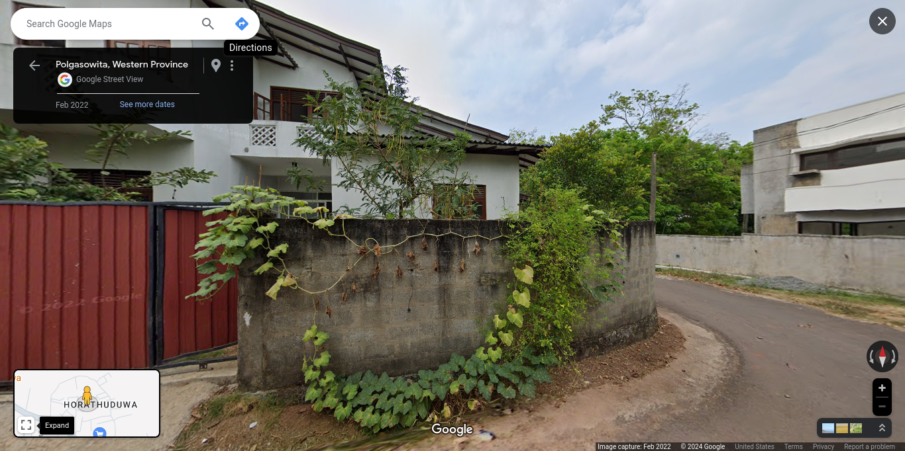

## Katupuliyankulama

**Katupuliyankulama** Grama Niladhari Division, **Rambewa** Divisional Secretariat Division, **Anuradhapura** District, **North Central** Province

**Anuradhapura West** Polling Division, **Anuradhapura** Electoral District

Population: 1,091 (2012)

(**LK-7118140**/112)

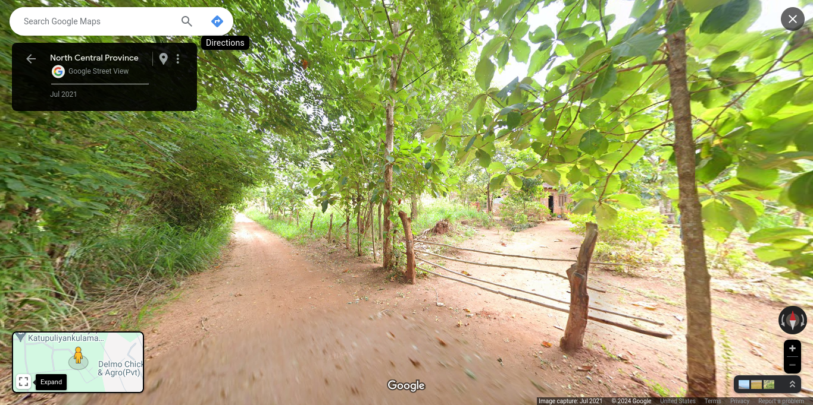

## Kolamunna

**Kolamunna** Grama Niladhari Division, **Kesbewa** Divisional Secretariat Division, **Colombo** District, **Western** Province

**Kesbewa** Polling Division, **Colombo** Electoral District

Population: 3,633 (2012)

(**LK-1136230**/563/73A)

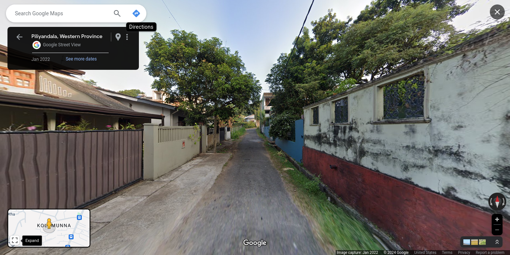

## Gorakapitiya

**Gorakapitiya** Grama Niladhari Division, **Kesbewa** Divisional Secretariat Division, **Colombo** District, **Western** Province

**Kesbewa** Polling Division, **Colombo** Electoral District

Population: 1,749 (2012)

(**LK-1136195**/584)

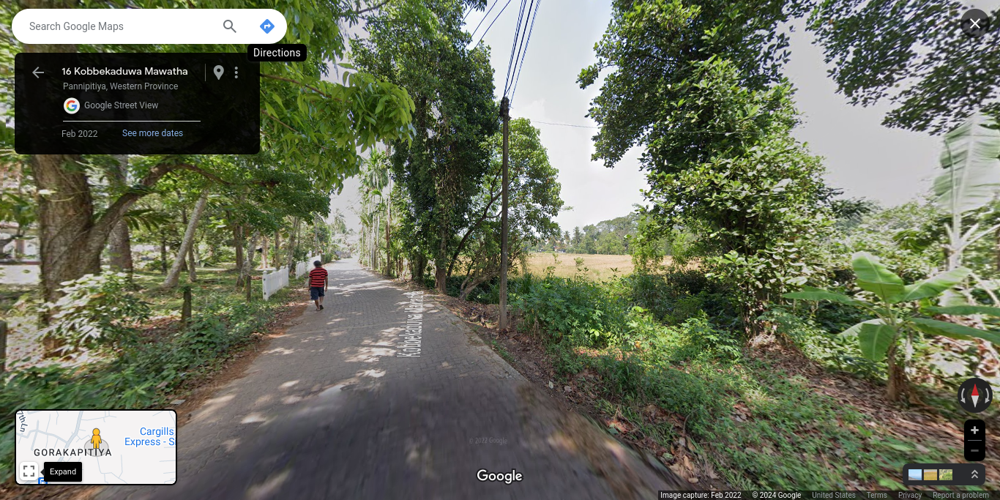

## Kotuwegoda South

**Kotuwegoda South** Grama Niladhari Division, **Matara Four Gravets** Divisional Secretariat Division, **Matara** District, **Southern** Province

**Matara** Polling Division, **Matara** Electoral District

Population: 1,134 (2012)

(**LK-3242330**/416B)

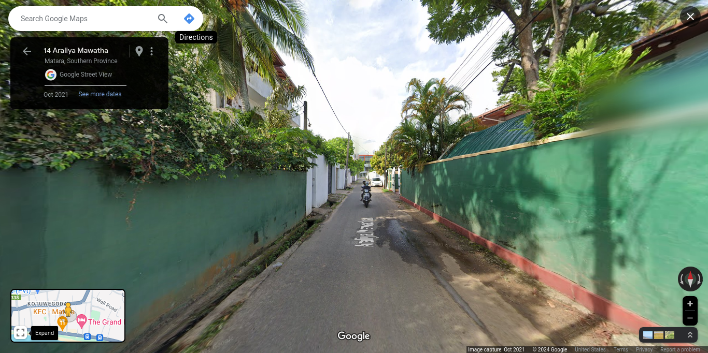

## Arumugathan Kudiyiruppu 1

**Arumugathan Kudiyiruppu 1** Grama Niladhari Division, **Eravur Pattu** Divisional Secretariat Division, **Batticaloa** District, **Eastern** Province

**Batticaloa** Polling Division, **Batticaloa** Electoral District

Population: 1,587 (2012)

(**LK-5112145**/189)

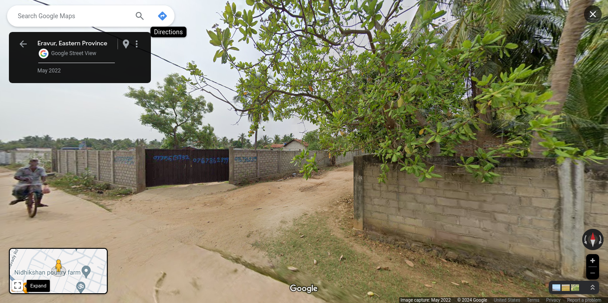

## Maharagama

**Maharagama** Grama Niladhari Division, **Mahara** Divisional Secretariat Division, **Gampaha** District, **Western** Province

**Mahara** Polling Division, **Gampaha** Electoral District

Population: 1,513 (2012)

(**LK-1233020**/303A)

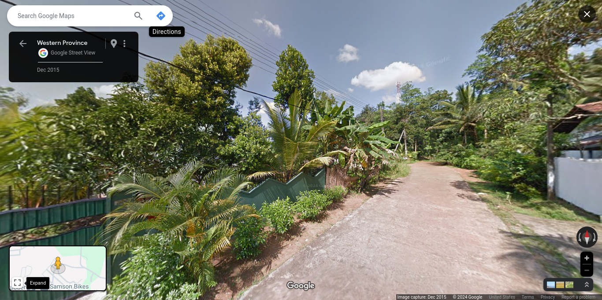

## Siddamulla North

**Siddamulla North** Grama Niladhari Division, **Homagama** Divisional Secretariat Division, **Colombo** District, **Western** Province

**Homagama** Polling Division, **Colombo** Electoral District

Population: 2,429 (2012)

(**LK-1112220**/591)

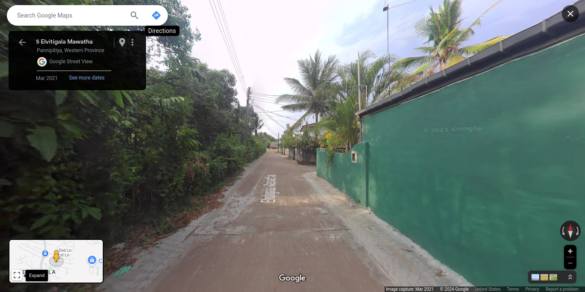

## Kalmunaikudi 04

**Kalmunaikudi 04** Grama Niladhari Division, **Kalmunai** Divisional Secretariat Division, **Ampara** District, **Eastern** Province

**Kalmunai** Polling Division, **Digamadulla** Electoral District

Population: 819 (2012)

(**LK-5224095**/KP/58B)

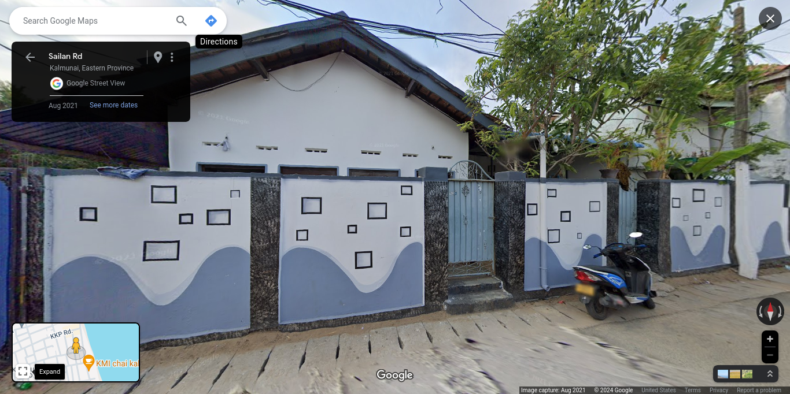

## Gopallawa

**Gopallawa** Grama Niladhari Division, **Rideegama** Divisional Secretariat Division, **Kurunegala** District, **North Western** Province

**Dodangaslanda** Polling Division, **Kurunegala** Electoral District

Population: 704 (2012)

(**LK-6163060**/552)

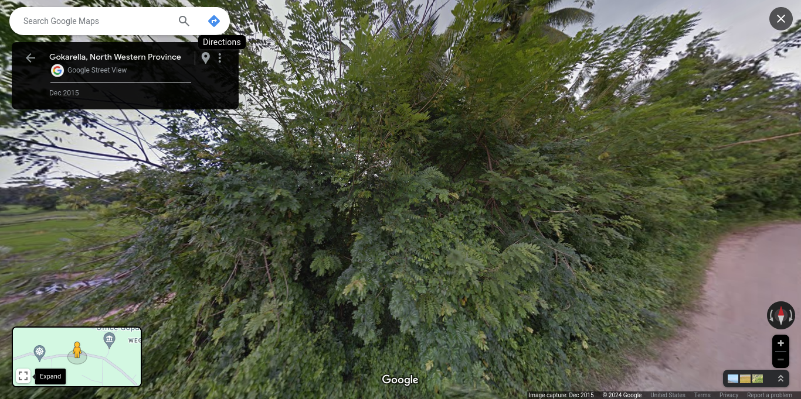

## Malayadikiramam 02

**Malayadikiramam 02** Grama Niladhari Division, **Samanthurai** Divisional Secretariat Division, **Ampara** District, **Eastern** Province

**Samanthurai** Polling Division, **Digamadulla** Electoral District

Population: 2,476 (2012)

(**LK-5218225**/79O)

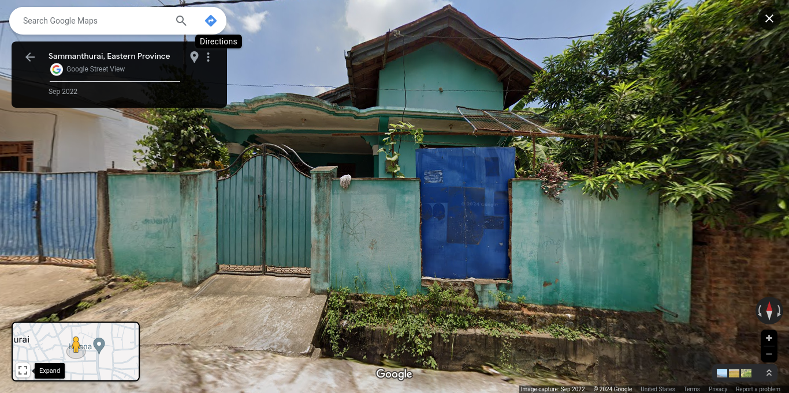

## Bendiyamulla North

**Bendiyamulla North** Grama Niladhari Division, **Gampaha** Divisional Secretariat Division, **Gampaha** District, **Western** Province

**Gampaha** Polling Division, **Gampaha** Electoral District

Population: 1,373 (2012)

(**LK-1224135**/234)

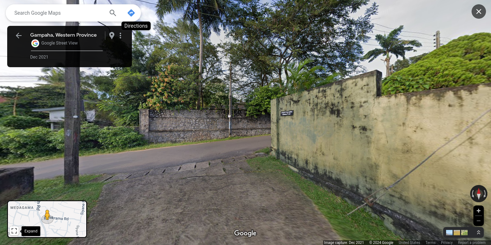

## Thissapura

**Thissapura** Grama Niladhari Division, **Ampara** Divisional Secretariat Division, **Ampara** District, **Eastern** Province

**Ampara** Polling Division, **Digamadulla** Electoral District

Population: 2,141 (2012)

(**LK-5215025**/W/89C)

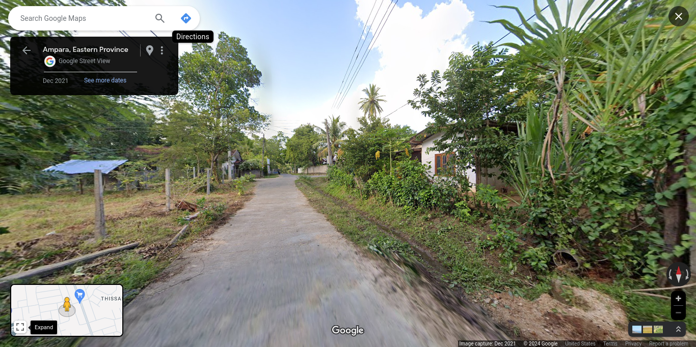

## Kotugoda 1

**Kotugoda 1** Grama Niladhari Division, **Minuwangoda** Divisional Secretariat Division, **Gampaha** District, **Western** Province

**Minuwangoda** Polling Division, **Gampaha** Electoral District

Population: 968 (2012)

(**LK-1215580**/119)

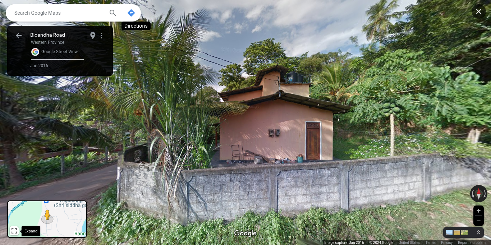

## Vishwakalawa

**Vishwakalawa** Grama Niladhari Division, **Kesbewa** Divisional Secretariat Division, **Colombo** District, **Western** Province

**Kesbewa** Polling Division, **Colombo** Electoral District

Population: 2,045 (2012)

(**LK-1136080**/574B)

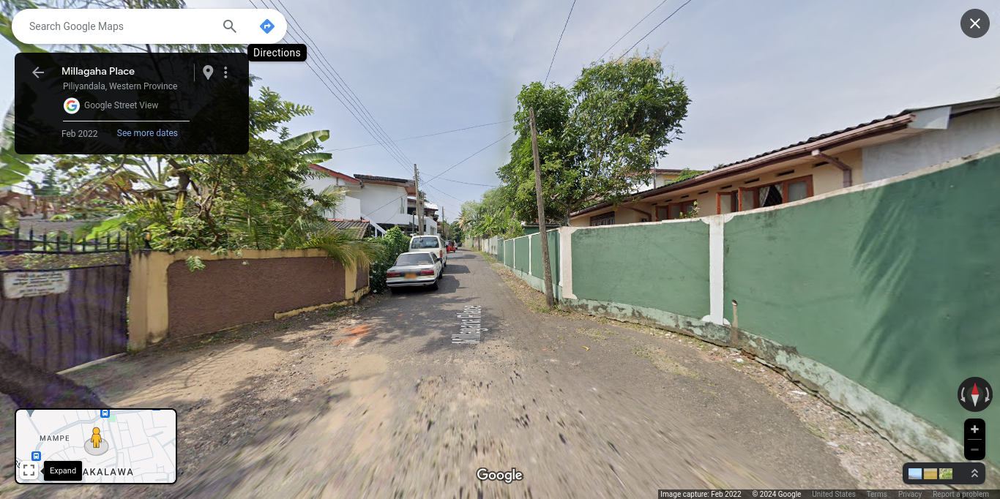

## Akaragama West

**Akaragama West** Grama Niladhari Division, **Divulapitiya** Divisional Secretariat Division, **Gampaha** District, **Western** Province

**Divulapitiya** Polling Division, **Gampaha** Electoral District

Population: 1,742 (2012)

(**LK-1209110**/58)

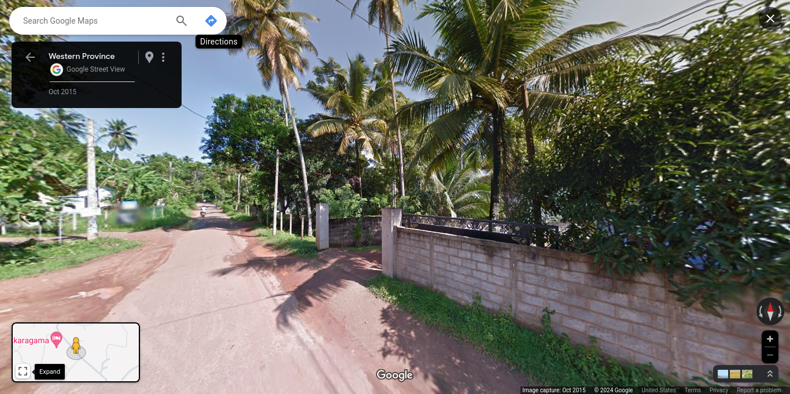

## Passaiyoor West

**Passaiyoor West** Grama Niladhari Division, **Jaffna** Divisional Secretariat Division, **Jaffna** District, **Northern** Province

**Jaffna** Polling Division, **Jaffna** Electoral District

Population: 1,178 (2012)

(**LK-4136025**/J/65)

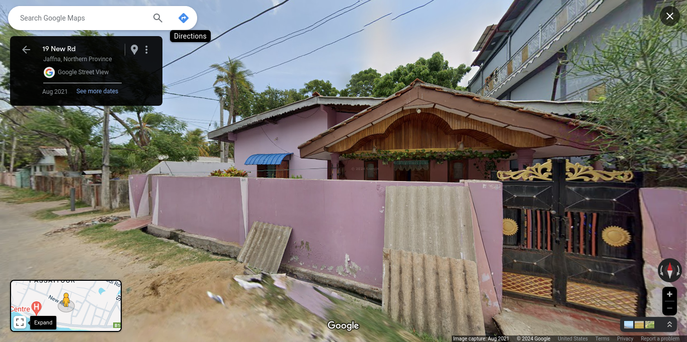

## Liyanagemulla South

**Liyanagemulla South** Grama Niladhari Division, **Katana** Divisional Secretariat Division, **Gampaha** District, **Western** Province

**Katana** Polling Division, **Gampaha** Electoral District

Population: 4,824 (2012)

(**LK-1206260**/144)

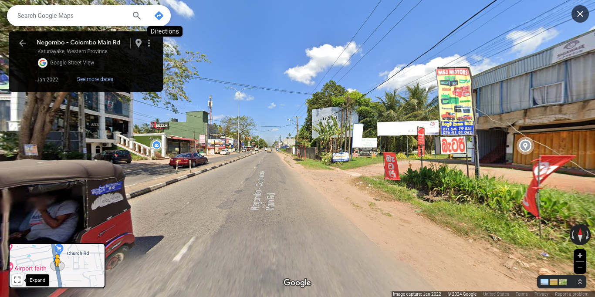

## Miriswatta

**Miriswatta** Grama Niladhari Division, **Bandaragama** Divisional Secretariat Division, **Kalutara** District, **Western** Province

**Bandaragama** Polling Division, **Kalutara** Electoral District

Population: 1,322 (2012)

(**LK-1306100**/690B)

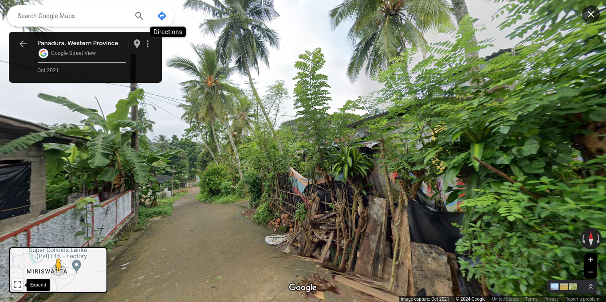

## Kusalanagama

**Kusalanagama** Grama Niladhari Division, **Ipalogama** Divisional Secretariat Division, **Anuradhapura** District, **North Central** Province

**Kalawewa** Polling Division, **Anuradhapura** Electoral District

Population: 1,529 (2012)

(**LK-7160150**/491)

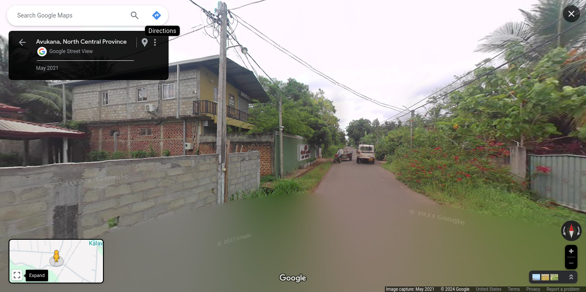

## Meemana

**Meemana** Grama Niladhari Division, **Horana** Divisional Secretariat Division, **Kalutara** District, **Western** Province

**Horana** Polling Division, **Kalutara** Electoral District

Population: 2,157 (2012)

(**LK-1309180**/611A)

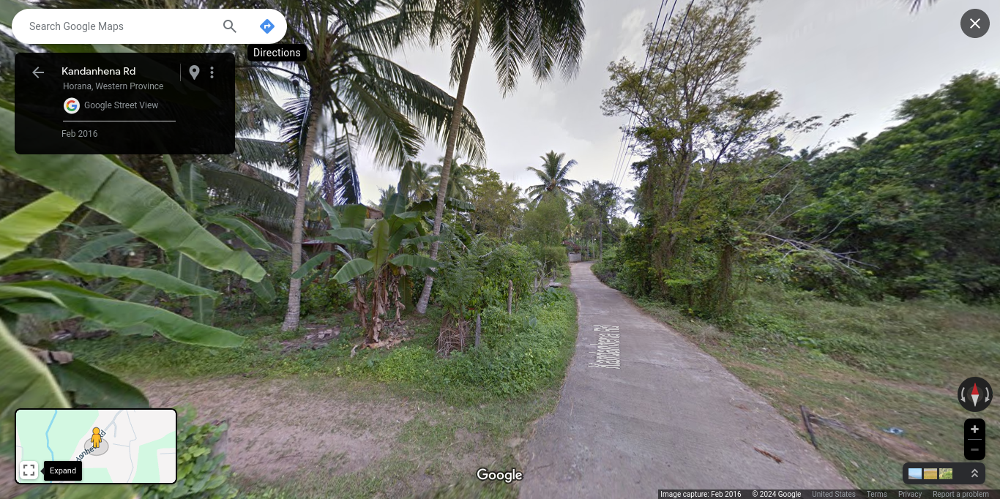

## Adungama Palkumbura

**Adungama Palkumbura** Grama Niladhari Division, **Thumpane** Divisional Secretariat Division, **Kandy** District, **Central** Province

**Galagedara** Polling Division, **Kandy** Electoral District

Population: 699 (2012)

(**LK-2103290**/360)

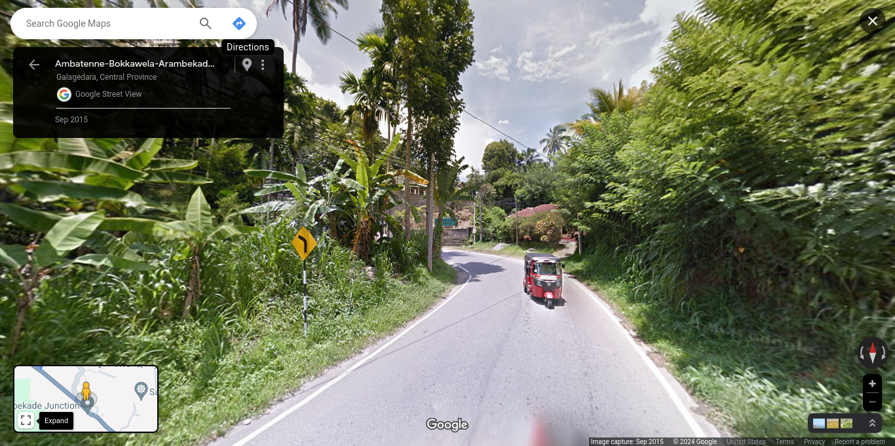

## Makilangamuwa

**Makilangamuwa** Grama Niladhari Division, **Gampaha** Divisional Secretariat Division, **Gampaha** District, **Western** Province

**Gampaha** Polling Division, **Gampaha** Electoral District

Population: 1,204 (2012)

(**LK-1224170**/221)

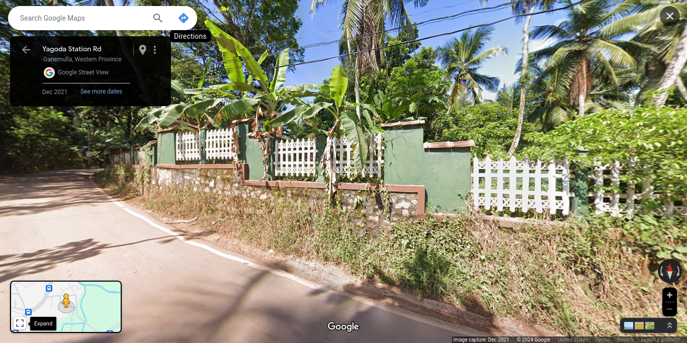

## Meddawatta

**Meddawatta** Grama Niladhari Division, **Matara Four Gravets** Divisional Secretariat Division, **Matara** District, **Southern** Province

**Matara** Polling Division, **Matara** Electoral District

Population: 1,671 (2012)

(**LK-3242295**/425)

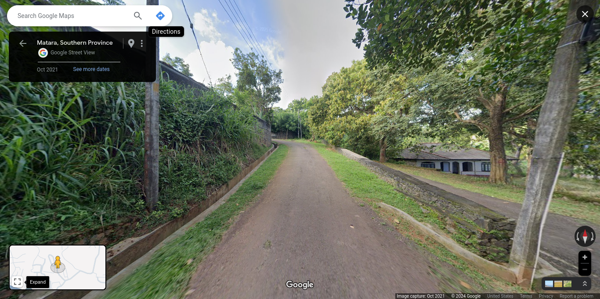

## Hatton East

**Hatton East** Grama Niladhari Division, **Ambagamuwa** Divisional Secretariat Division, **Nuwara Eliya** District, **Central** Province

**Nuwara Eliya Maskeliya** Polling Division, **Nuwara-Eliya** Electoral District

Population: 4,941 (2012)

(**LK-2315190**/319E)

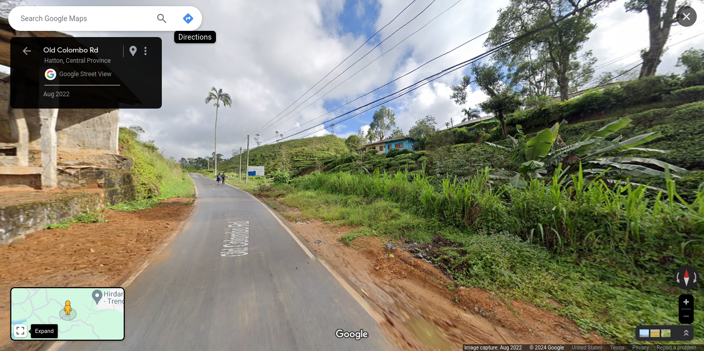

## Angammana

**Angammana** Grama Niladhari Division, **Ratnapura** Divisional Secretariat Division, **Ratnapura** District, **Sabaragamuwa** Province

**Ratnapura** Polling Division, **Ratnapura** Electoral District

Population: 2,224 (2012)

(**LK-9112255**/181C)

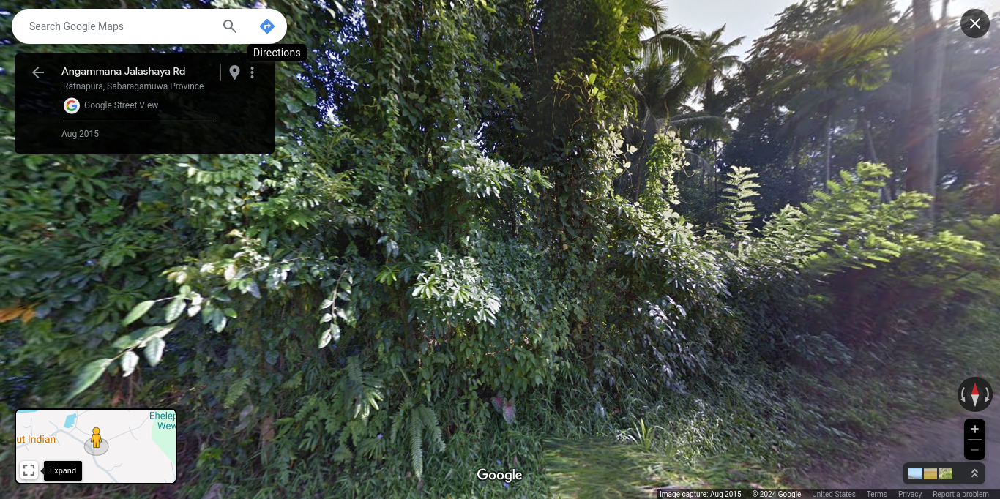

## Periyakallar 2

**Periyakallar 2** Grama Niladhari Division, **Manmunai South & Eruvil pattu** Divisional Secretariat Division, **Batticaloa** District, **Eastern** Province

**Paddiruppu** Polling Division, **Batticaloa** Electoral District

Population: 1,087 (2012)

(**LK-5136195**/75)

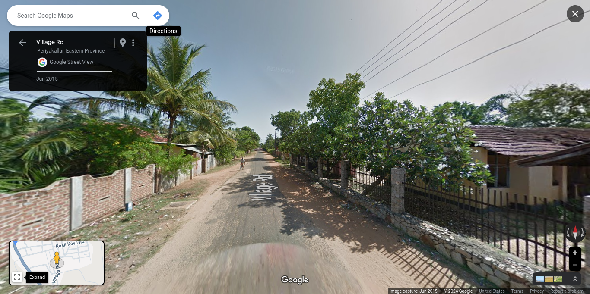

## Kekanadura Central

**Kekanadura Central** Grama Niladhari Division, **Matara Four Gravets** Divisional Secretariat Division, **Matara** District, **Southern** Province

**Matara** Polling Division, **Matara** Electoral District

Population: 1,915 (2012)

(**LK-3242035**/447A)

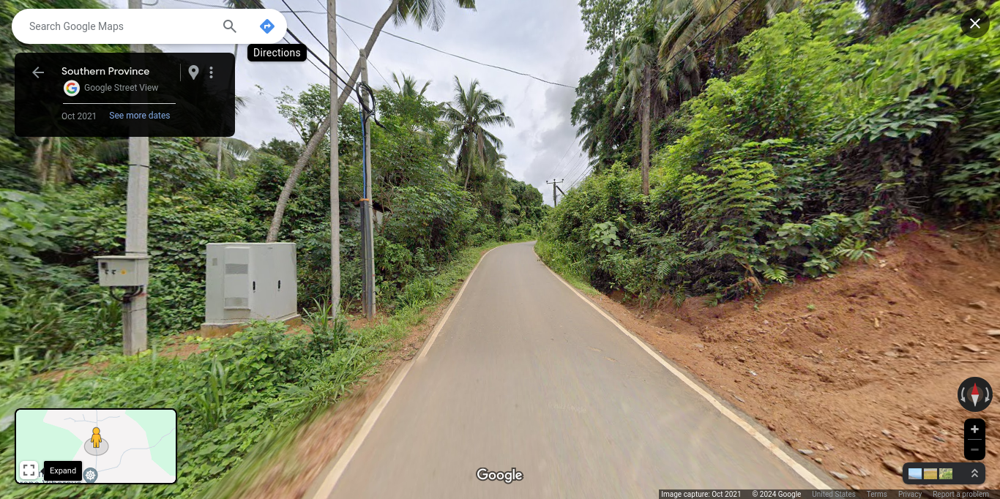

## Weligala

**Weligala** Grama Niladhari Division, **Ukuwela** Divisional Secretariat Division, **Matale** District, **Central** Province

**Rattota** Polling Division, **Matale** Electoral District

Population: 439 (2012)

(**LK-2233280**/E365)

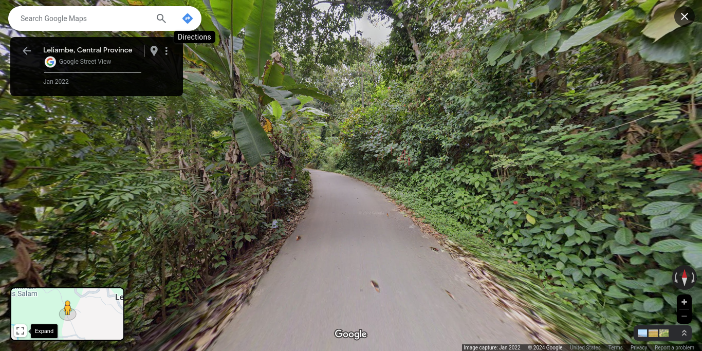

## Kaliyammahara

**Kaliyammahara** Grama Niladhari Division, **Kesbewa** Divisional Secretariat Division, **Colombo** District, **Western** Province

**Kesbewa** Polling Division, **Colombo** Electoral District

Population: 3,042 (2012)

(**LK-1136150**/580)

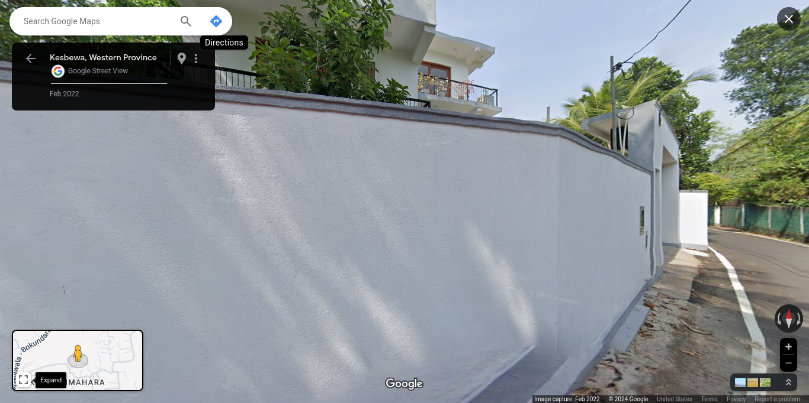

## Horewela

**Horewela** Grama Niladhari Division, **Walasmulla** Divisional Secretariat Division, **Hambantota** District, **Southern** Province

**Mulkirigala** Polling Division, **Hambantota** Electoral District

Population: 1,255 (2012)

(**LK-3325200**/574)

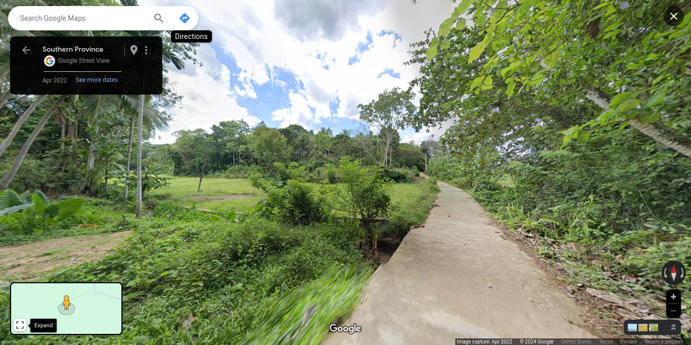

## Ettalapitiya

**Ettalapitiya** Grama Niladhari Division, **Bandarawela** Divisional Secretariat Division, **Badulla** District, **Uva** Province

**Bandarawela** Polling Division, **Badulla** Electoral District

Population: 2,445 (2012)

(**LK-8133025**/67)

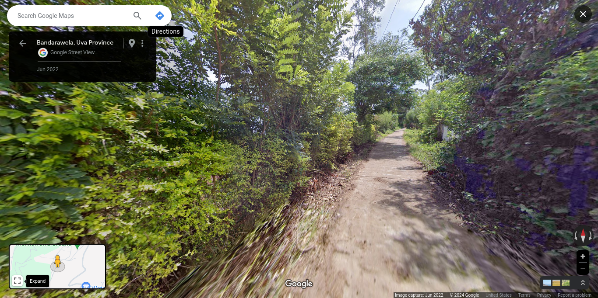

## Mankadawala

**Mankadawala** Grama Niladhari Division, **Nuwaragam Palatha Central** Divisional Secretariat Division, **Anuradhapura** District, **North Central** Province

**Anuradhapura West** Polling Division, **Anuradhapura** Electoral District

Population: 2,271 (2012)

(**LK-7115075**/313)

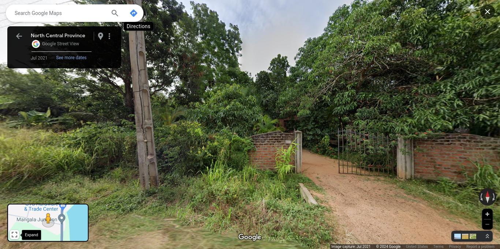

## Hanthna Pedesa

**Hanthna Pedesa** Grama Niladhari Division, **Kandy Four Gravets & Gangawata Korale** Divisional Secretariat Division, **Kandy** District, **Central** Province

**Senkadagala** Polling Division, **Kandy** Electoral District

Population: 1,766 (2012)

(**LK-2130220**/263)

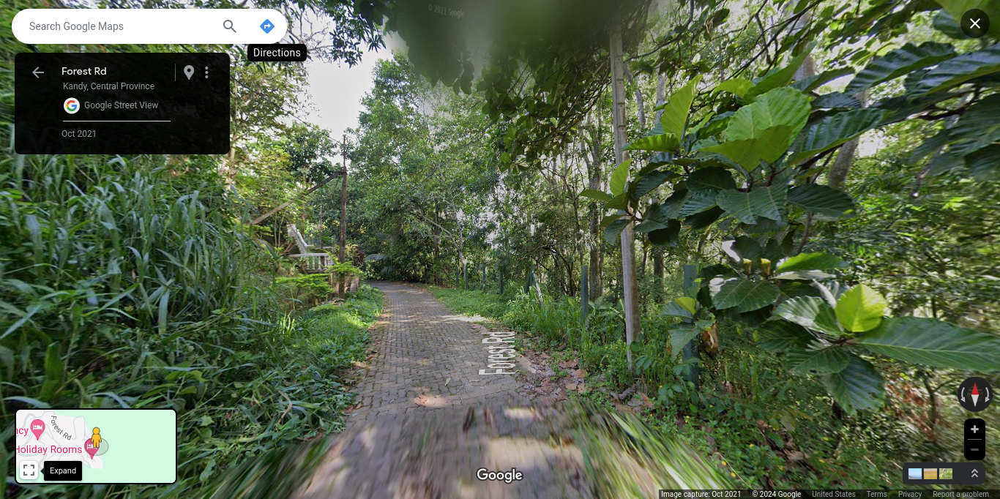

## Dodangolla

**Dodangolla** Grama Niladhari Division, **Akurana** Divisional Secretariat Division, **Kandy** District, **Central** Province

**Harispattuwa** Polling Division, **Kandy** Electoral District

Population: 3,106 (2012)

(**LK-2109115**/563)

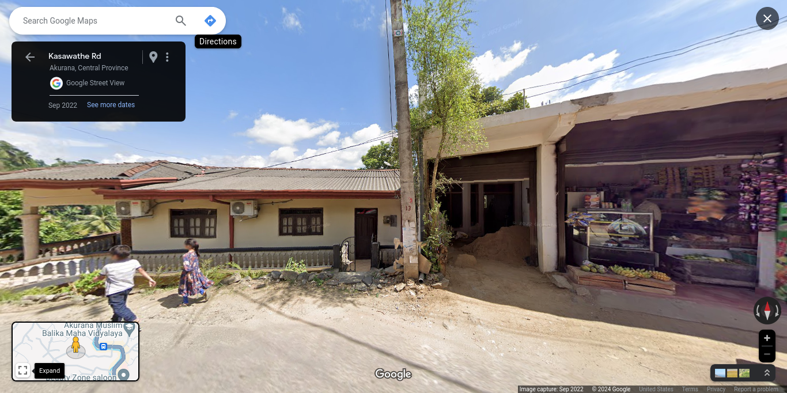

## Urumpirai North

**Urumpirai North** Grama Niladhari Division, **Valikamam East (Kopay)** Divisional Secretariat Division, **Jaffna** District, **Northern** Province

**Kopay** Polling Division, **Jaffna** Electoral District

Population: 2,397 (2012)

(**LK-4118040**/J/264)

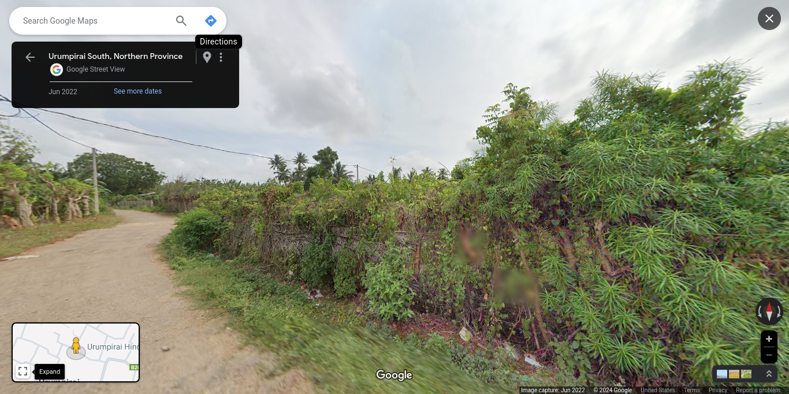

## Dharga Town East

**Dharga Town East** Grama Niladhari Division, **Beruwala** Divisional Secretariat Division, **Kalutara** District, **Western** Province

**Beruwala** Polling Division, **Kalutara** Electoral District

Population: 2,264 (2012)

(**LK-1324370**/766A)

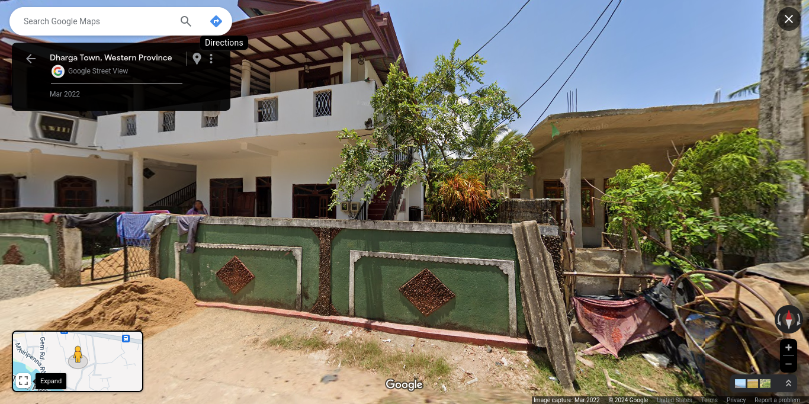

## Jamburaliya

**Jamburaliya** Grama Niladhari Division, **Kesbewa** Divisional Secretariat Division, **Colombo** District, **Western** Province

**Kesbewa** Polling Division, **Colombo** Electoral District

Population: 3,184 (2012)

(**LK-1136350**/597)

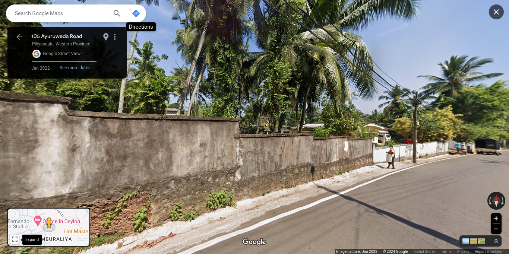

## Liyanagoda

**Liyanagoda** Grama Niladhari Division, **Maharagama** Divisional Secretariat Division, **Colombo** District, **Western** Province

**Maharagama** Polling Division, **Colombo** Electoral District

Population: 4,342 (2012)

(**LK-1121055**/496E)

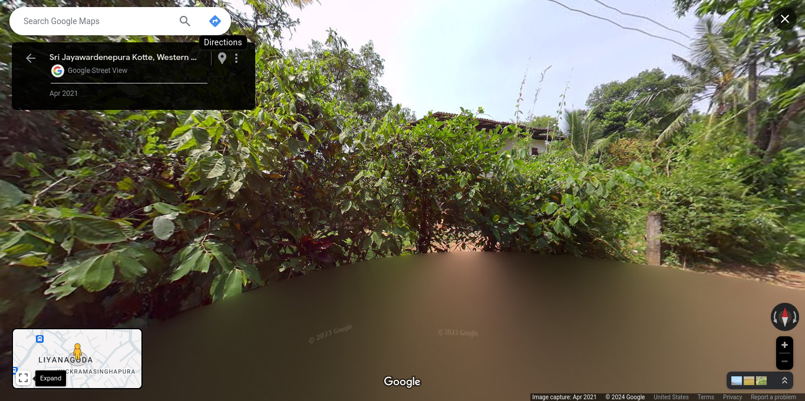

## Kommathurai East

**Kommathurai East** Grama Niladhari Division, **Eravur Pattu** Divisional Secretariat Division, **Batticaloa** District, **Eastern** Province

**Kalkudah** Polling Division, **Batticaloa** Electoral District

Population: 1,721 (2012)

(**LK-5112095**/196)

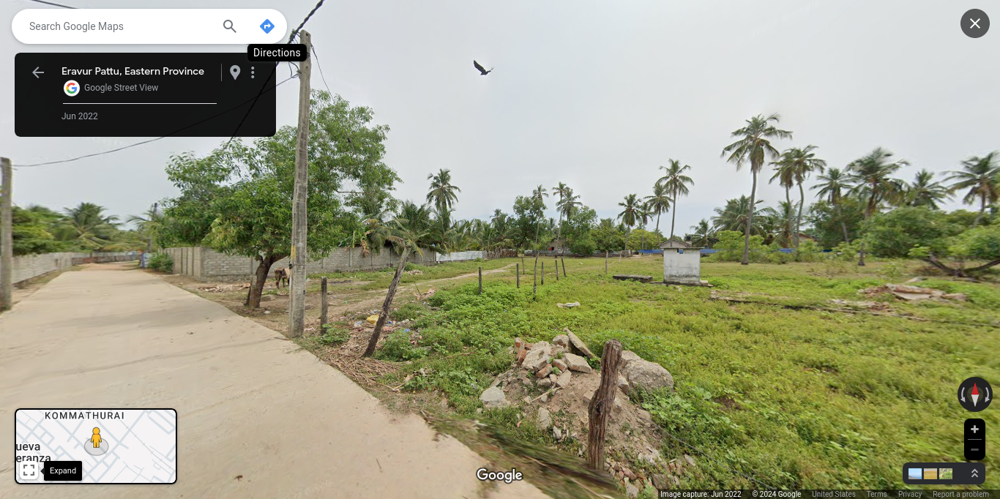

## Kallady

**Kallady** Grama Niladhari Division, **Manmunai North** Divisional Secretariat Division, **Batticaloa** District, **Eastern** Province

**Batticaloa** Polling Division, **Batticaloa** Electoral District

Population: 2,484 (2012)

(**LK-5118155**/171)

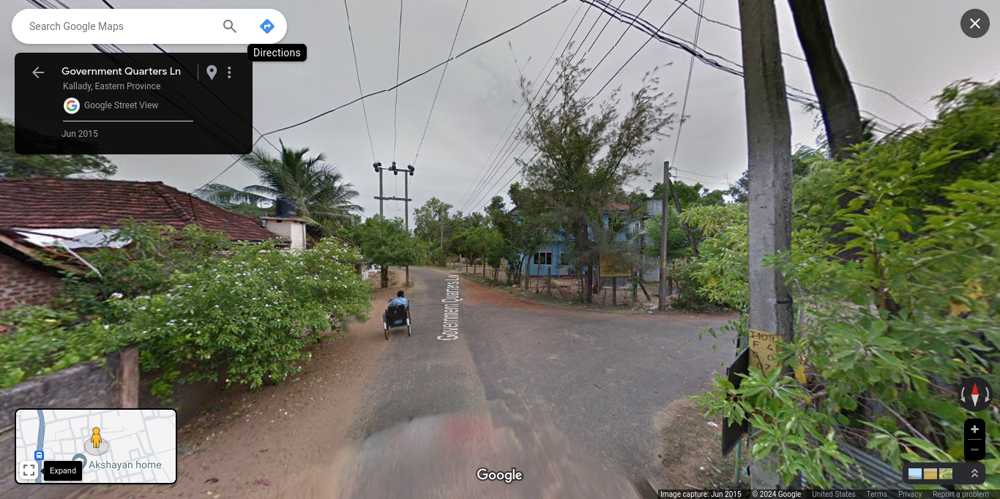

## Dangaswewa

**Dangaswewa** Grama Niladhari Division, **Karuwalagaswewa** Divisional Secretariat Division, **Puttalam** District, **North Western** Province

**Anamaduwa** Polling Division, **Puttalam** Electoral District

Population: 663 (2012)

(**LK-6209065**/642C)

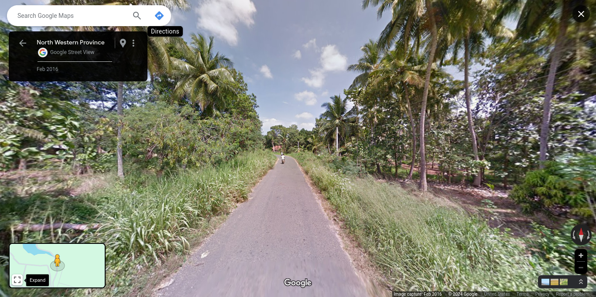

## Aluthgama

**Aluthgama** Grama Niladhari Division, **Yatawatta** Divisional Secretariat Division, **Matale** District, **Central** Province

**Matale** Polling Division, **Matale** Electoral District

Population: 430 (2012)

(**LK-2215200**/E338)

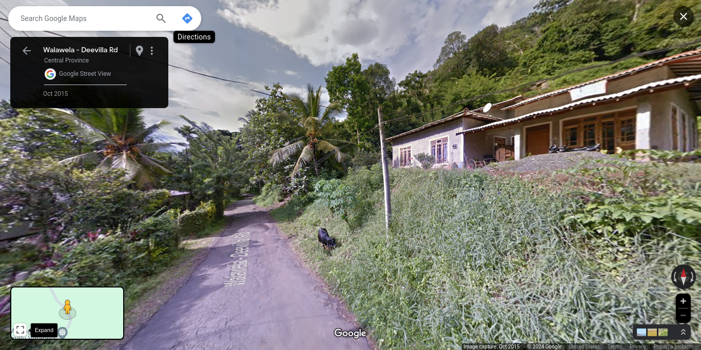

## Welipatha

**Welipatha** Grama Niladhari Division, **Galle Four Gravets** Divisional Secretariat Division, **Galle** District, **Southern** Province

**Galle** Polling Division, **Galle** Electoral District

Population: 2,043 (2012)

(**LK-3139085**/101D)

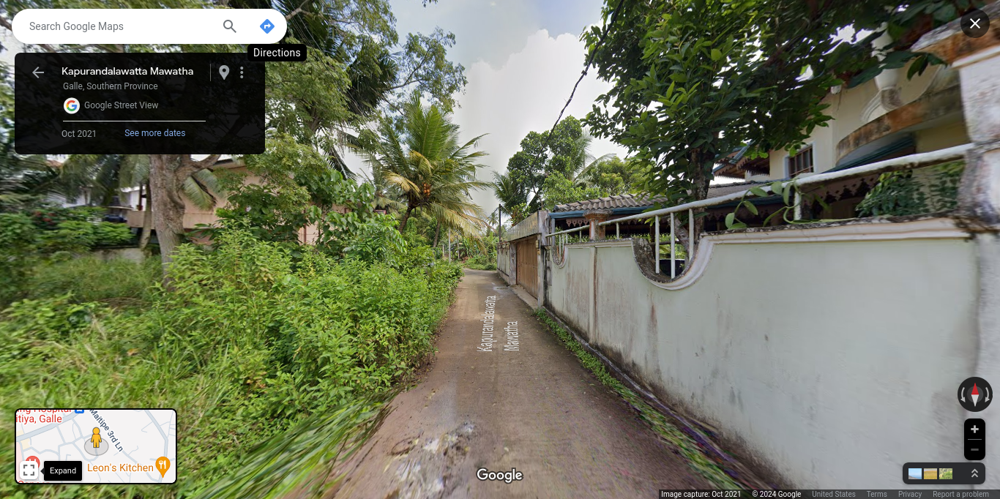

## Veeramunai 03

**Veeramunai 03** Grama Niladhari Division, **Samanthurai** Divisional Secretariat Division, **Ampara** District, **Eastern** Province

**Samanthurai** Polling Division, **Digamadulla** Electoral District

Population: 521 (2012)

(**LK-5218110**/92I)

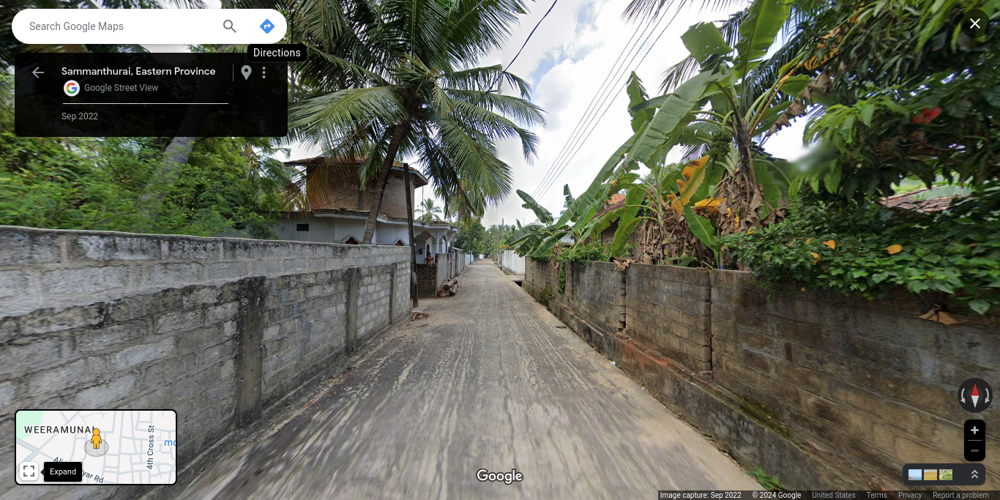

## Polwatta

**Polwatta** Grama Niladhari Division, **Maharagama** Divisional Secretariat Division, **Colombo** District, **Western** Province

**Maharagama** Polling Division, **Colombo** Electoral District

Population: 3,513 (2012)

(**LK-1121070**/529)

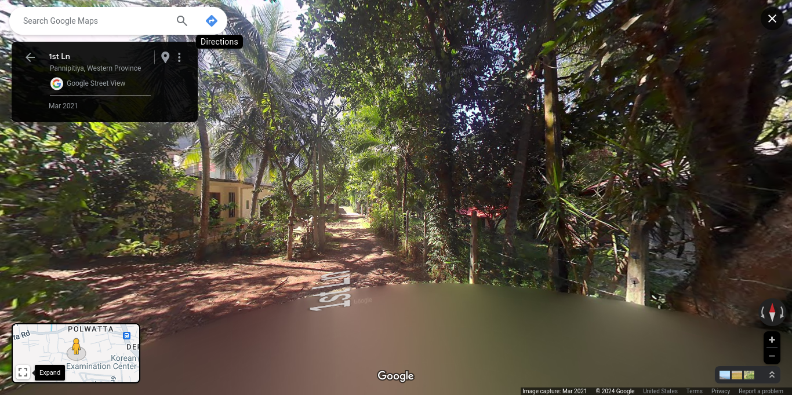

## Endagala

**Endagala** Grama Niladhari Division, **Thalawa** Divisional Secretariat Division, **Anuradhapura** District, **North Central** Province

**Kalawewa** Polling Division, **Anuradhapura** Electoral District

Population: 1,578 (2012)

(**LK-7148170**/393)

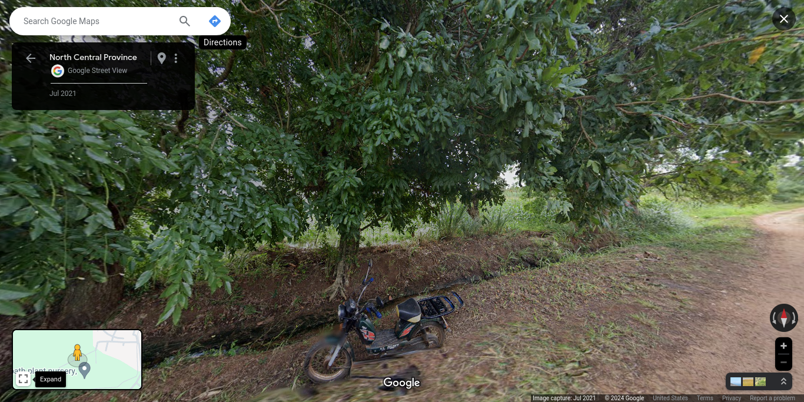

## Nuwaraeliya West

**Nuwaraeliya West** Grama Niladhari Division, **Nuwara Eliya** Divisional Secretariat Division, **Nuwara Eliya** District, **Central** Province

**Nuwara Eliya Maskeliya** Polling Division, **Nuwara-Eliya** Electoral District

Population: 2,481 (2012)

(**LK-2312070**/535L)

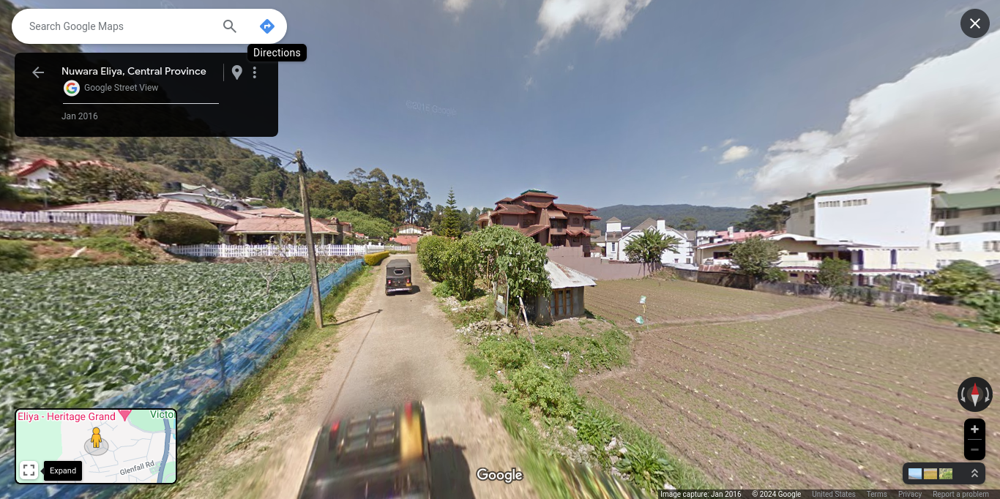

## Vilbawa

**Vilbawa** Grama Niladhari Division, **Kurunegala** Divisional Secretariat Division, **Kurunegala** District, **North Western** Province

**Kurunegala** Polling Division, **Kurunegala** Electoral District

Population: 1,566 (2012)

(**LK-6154235**/822)

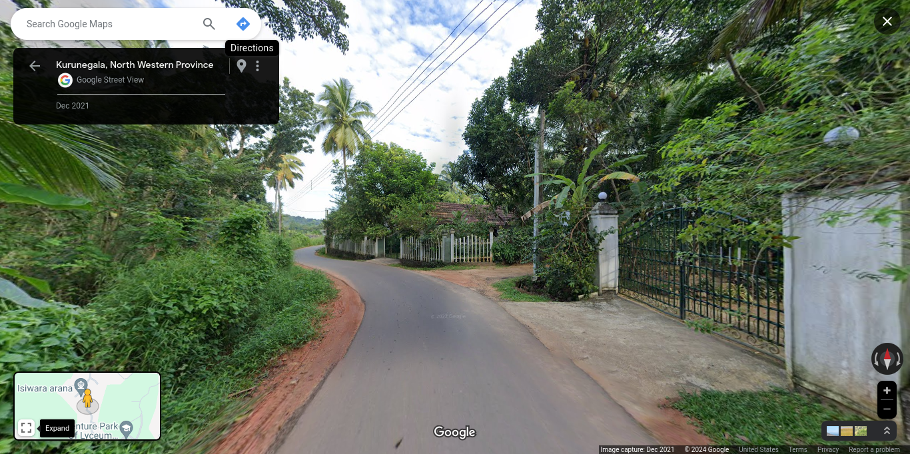

## Gallehepitiya

**Gallehepitiya** Grama Niladhari Division, **Panduwasnuwara East** Divisional Secretariat Division, **Kurunegala** District, **North Western** Province

**Panduwasnuwara** Polling Division, **Kurunegala** Electoral District

Population: 1,499 (2012)

(**LK-6148050**/1362)

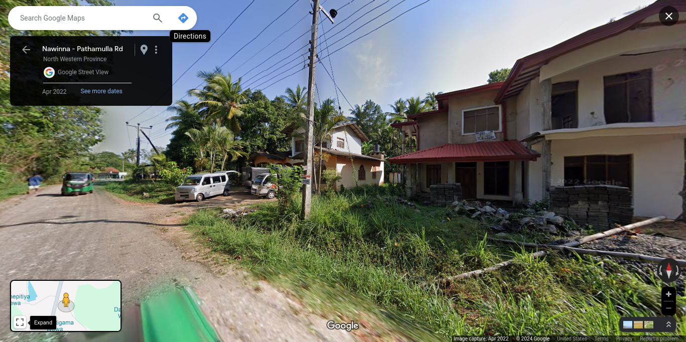

## Weeragama

**Weeragama** Grama Niladhari Division, **Hingurakgoda** Divisional Secretariat Division, **Polonnaruwa** District, **North Central** Province

**Minneriya** Polling Division, **Polonnaruwa** Electoral District

Population: 772 (2012)

(**LK-7203235**/44)

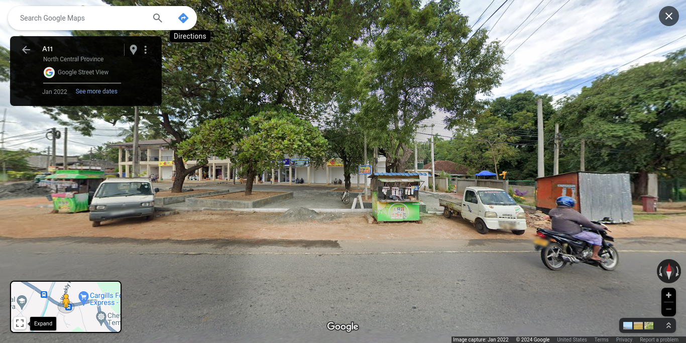

## Konwewa

**Konwewa** Grama Niladhari Division, **Thambuttegama** Divisional Secretariat Division, **Anuradhapura** District, **North Central** Province

**Kalawewa** Polling Division, **Anuradhapura** Electoral District

Population: 1,774 (2012)

(**LK-7145045**/425)

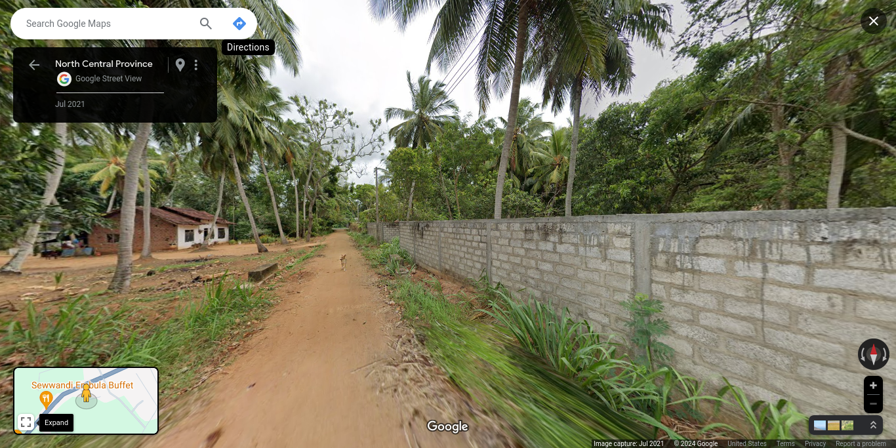

## Gedaramada

**Gedaramada** Grama Niladhari Division, **Udadumbara** Divisional Secretariat Division, **Kandy** District, **Central** Province

**Ududumbara** Polling Division, **Kandy** Electoral District

Population: 199 (2012)

(**LK-2118130**/876)

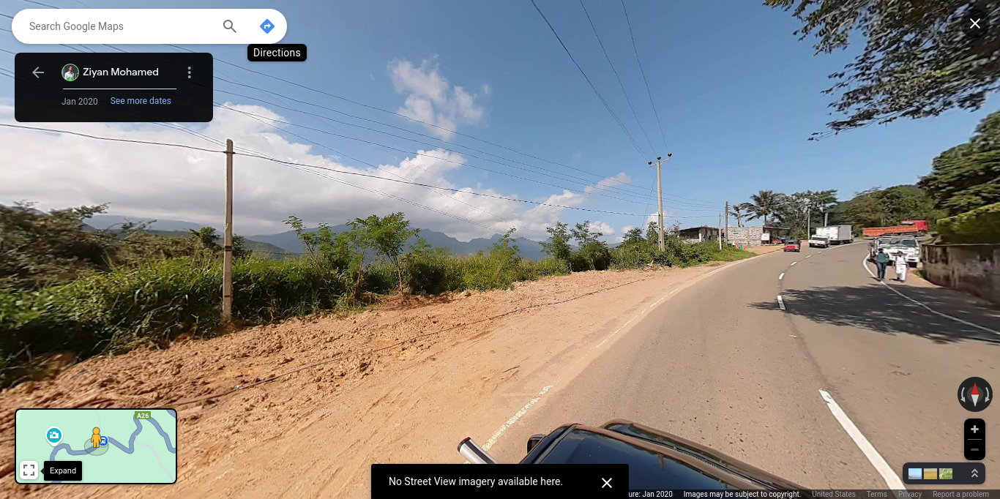

## Dematawewa

**Dematawewa** Grama Niladhari Division, **Horowpothana** Divisional Secretariat Division, **Anuradhapura** District, **North Central** Province

**Horowpothana** Polling Division, **Anuradhapura** Electoral District

Population: 622 (2012)

(**LK-7124185**/154)

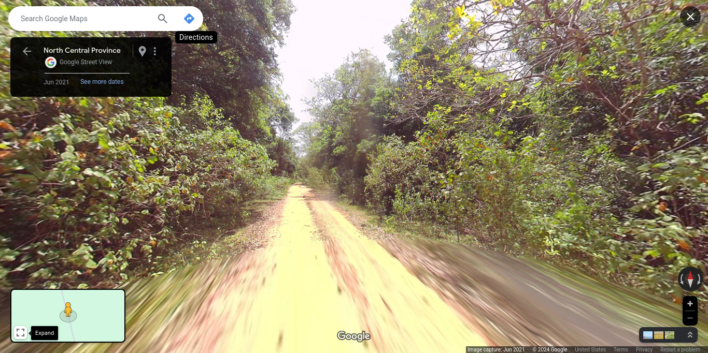

## Pamunuwa

**Pamunuwa** Grama Niladhari Division, **Maharagama** Divisional Secretariat Division, **Colombo** District, **Western** Province

**Maharagama** Polling Division, **Colombo** Electoral District

Population: 4,543 (2012)

(**LK-1121075**/528)

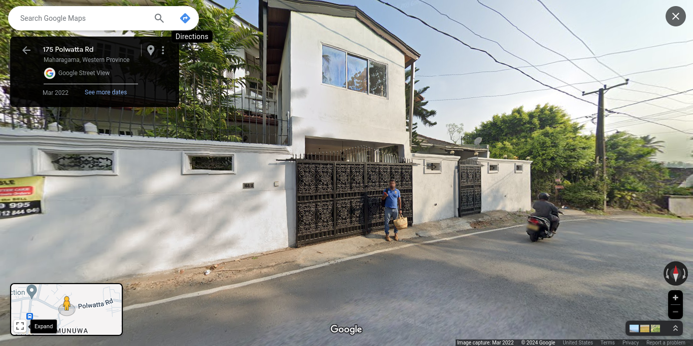

## Ulpathakumbura

**Ulpathakumbura** Grama Niladhari Division, **Kandy Four Gravets & Gangawata Korale** Divisional Secretariat Division, **Kandy** District, **Central** Province

**Senkadagala** Polling Division, **Kandy** Electoral District

Population: 2,314 (2012)

(**LK-2130265**/273)

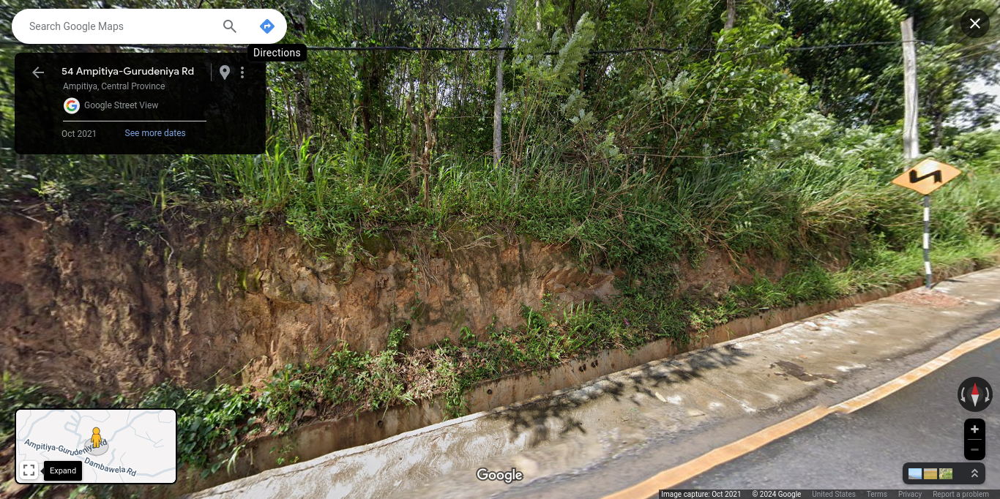

## Sinhapitiya South

**Sinhapitiya South** Grama Niladhari Division, **Udapalatha** Divisional Secretariat Division, **Kandy** District, **Central** Province

**Gampola** Polling Division, **Kandy** Electoral District

Population: 1,155 (2012)

(**LK-2151085**/1118)

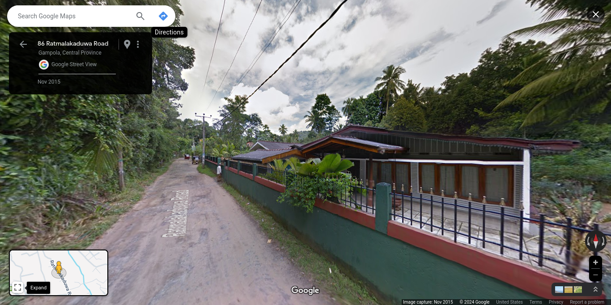

## Horagolla North

**Horagolla North** Grama Niladhari Division, **Gampaha** Divisional Secretariat Division, **Gampaha** District, **Western** Province

**Gampaha** Polling Division, **Gampaha** Electoral District

Population: 2,551 (2012)

(**LK-1224175**/216)

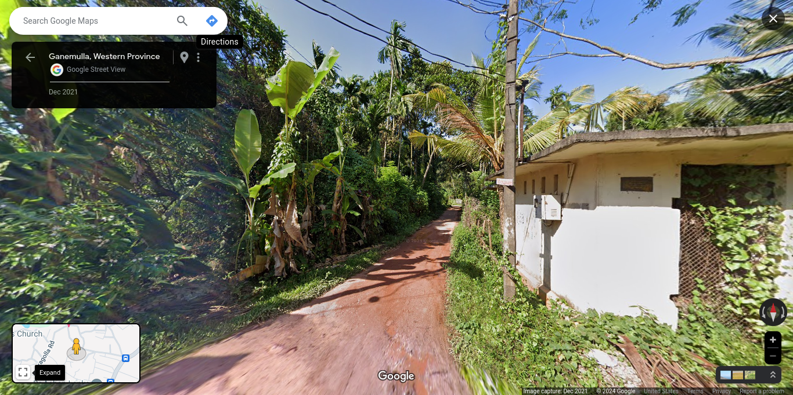

## Padavigama

**Padavigama** Grama Niladhari Division, **Lunugamvehera** Divisional Secretariat Division, **Hambantota** District, **Southern** Province

**Thissamaharama** Polling Division, **Hambantota** Electoral District

Population: 1,579 (2012)

(**LK-3306035**/51)

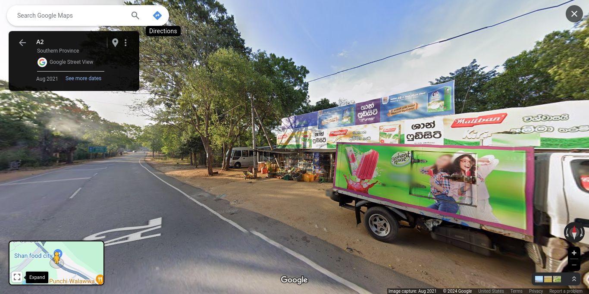

## Kongollewa

**Kongollewa** Grama Niladhari Division, **Thambuttegama** Divisional Secretariat Division, **Anuradhapura** District, **North Central** Province

**Kalawewa** Polling Division, **Anuradhapura** Electoral District

Population: 2,530 (2012)

(**LK-7145005**/431)

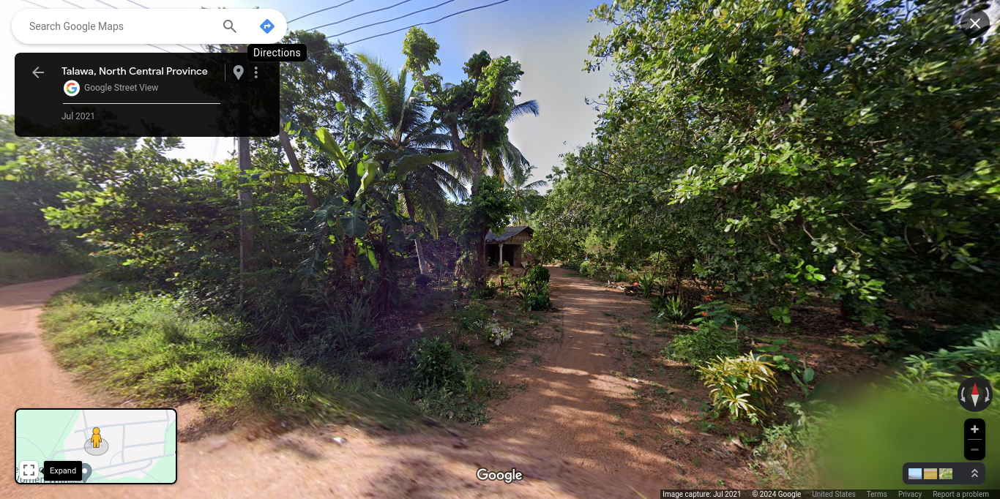

## Dellabada

**Dellabada** Grama Niladhari Division, **Elapatha** Divisional Secretariat Division, **Ratnapura** District, **Sabaragamuwa** Province

**Nivithigala** Polling Division, **Ratnapura** Electoral District

Population: 1,300 (2012)

(**LK-9127045**/188)

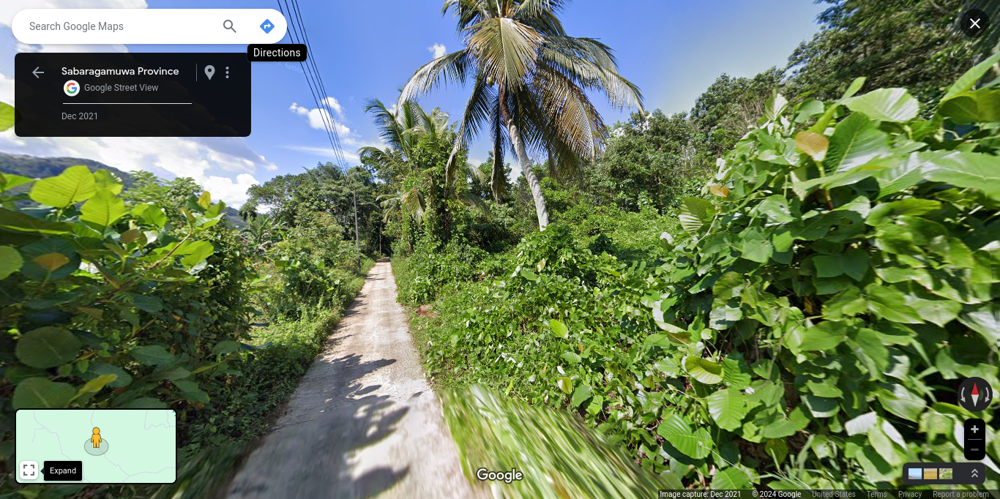

## Mahawattagama

**Mahawattagama** Grama Niladhari Division, **Hali-Ela** Divisional Secretariat Division, **Badulla** District, **Uva** Province

**Hali Ela** Polling Division, **Badulla** Electoral District

Population: 3,050 (2012)

(**LK-8124070**/82C)

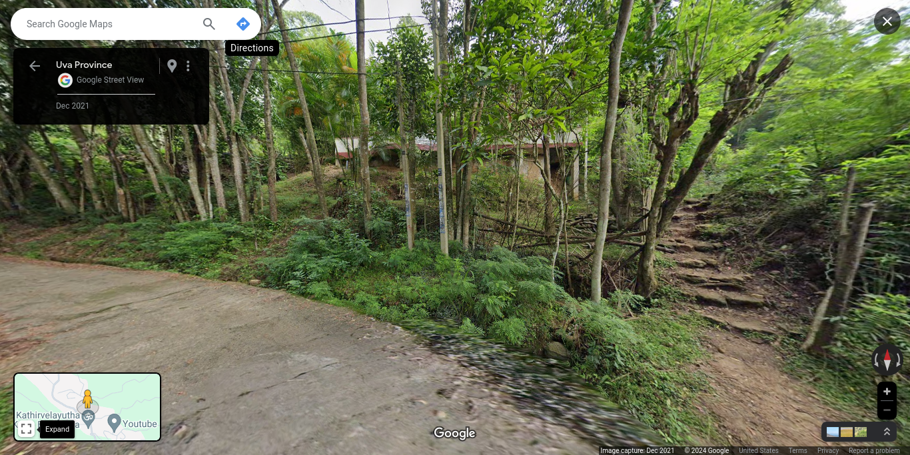

## Medagoda

**Medagoda** Grama Niladhari Division, **Narammala** Divisional Secretariat Division, **Kurunegala** District, **North Western** Province

**Dambadeniya** Polling Division, **Kurunegala** Electoral District

Population: 851 (2012)

(**LK-6181060**/1055)

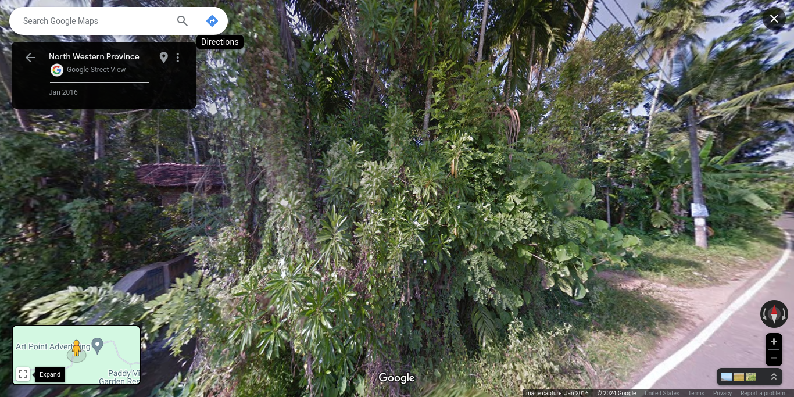

## Alubomulla West

**Alubomulla West** Grama Niladhari Division, **Bandaragama** Divisional Secretariat Division, **Kalutara** District, **Western** Province

**Bandaragama** Polling Division, **Kalutara** Electoral District

Population: 3,158 (2012)

(**LK-1306135**/691A)

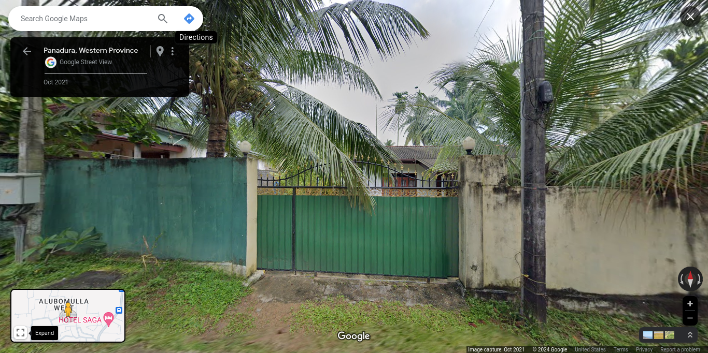

## Hendeniya West

**Hendeniya West** Grama Niladhari Division, **Udunuwara** Divisional Secretariat Division, **Kandy** District, **Central** Province

**Udunuwara** Polling Division, **Kandy** Electoral District

Population: 1,003 (2012)

(**LK-2139125**/9)

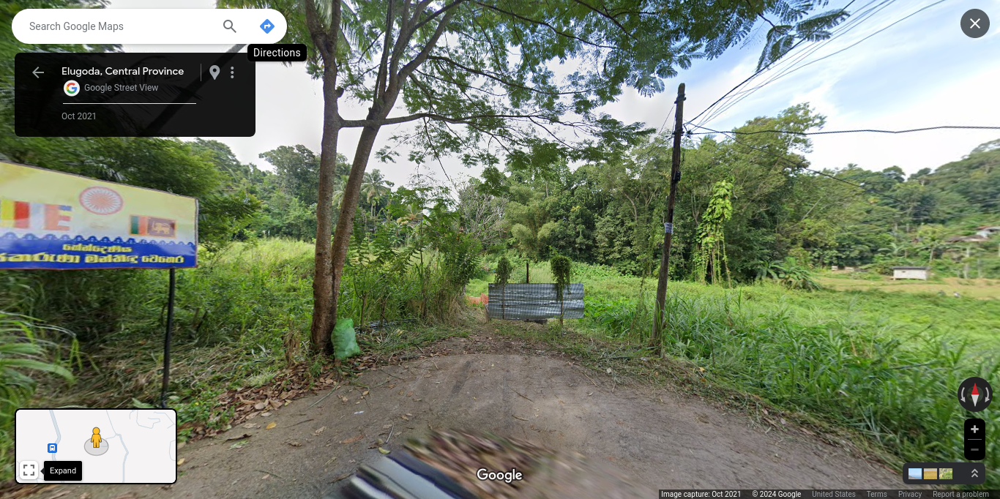

## Weweldoowa

**Weweldoowa** Grama Niladhari Division, **Kelaniya** Divisional Secretariat Division, **Gampaha** District, **Western** Province

**Kelaniya** Polling Division, **Gampaha** Electoral District

Population: 3,643 (2012)

(**LK-1236075**/258)

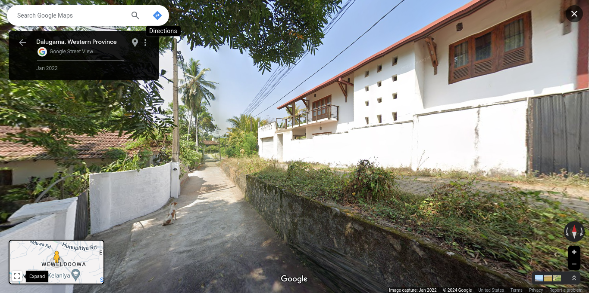

## Meedeniya

**Meedeniya** Grama Niladhari Division, **Ukuwela** Divisional Secretariat Division, **Matale** District, **Central** Province

**Rattota** Polling Division, **Matale** Electoral District

Population: 2,118 (2012)

(**LK-2233180**/E356B)

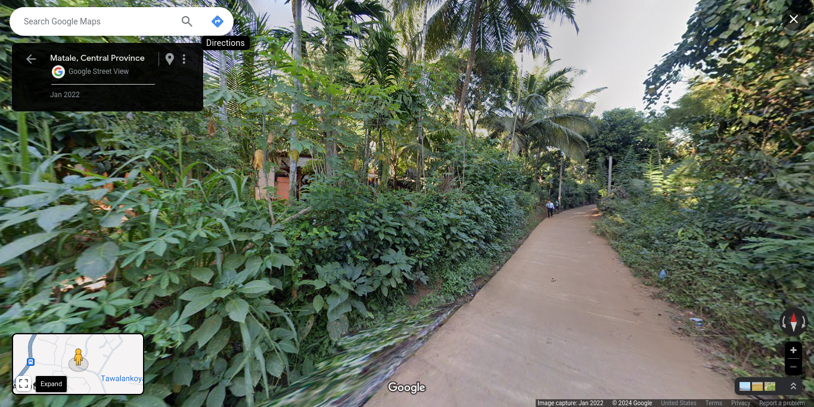

## Wattala

**Wattala** Grama Niladhari Division, **Wattala** Divisional Secretariat Division, **Gampaha** District, **Western** Province

**Wattala** Polling Division, **Gampaha** Electoral District

Population: 3,234 (2012)

(**LK-1218180**/176)

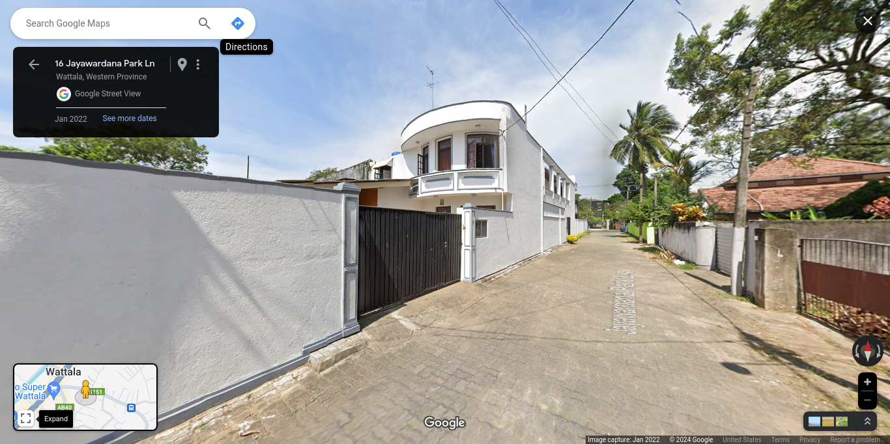

## Akbar Town

**Akbar Town** Grama Niladhari Division, **Mahara** Divisional Secretariat Division, **Gampaha** District, **Western** Province

**Mahara** Polling Division, **Gampaha** Electoral District

Population: 3,407 (2012)

(**LK-1233460**/255A)

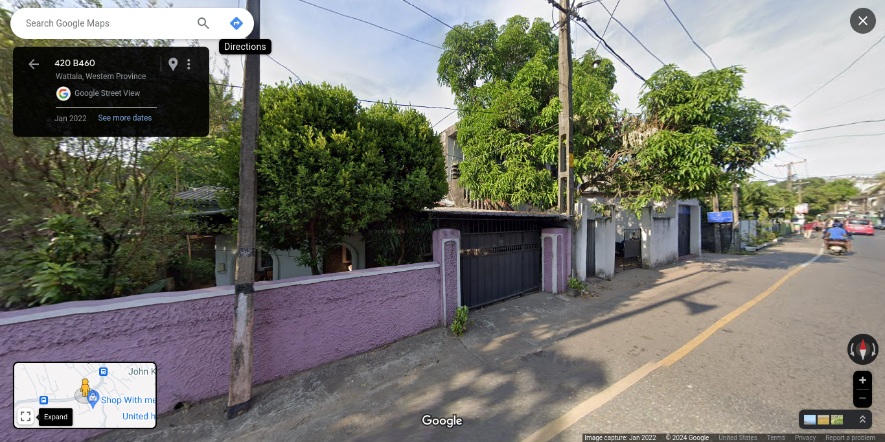

## Thuduwegedara

**Thuduwegedara** Grama Niladhari Division, **Wattala** Divisional Secretariat Division, **Gampaha** District, **Western** Province

**Wattala** Polling Division, **Gampaha** Electoral District

Population: 2,281 (2012)

(**LK-1218115**/254A)

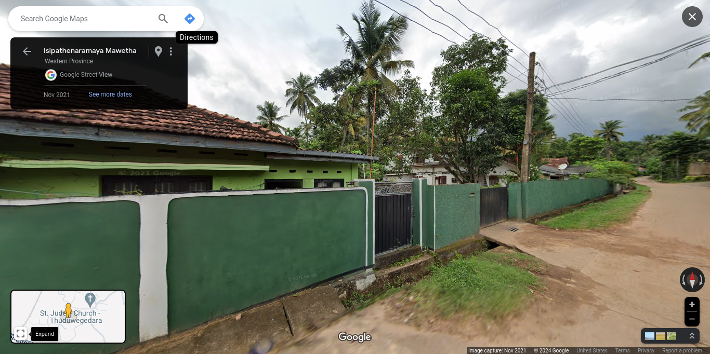

## Dehigama

**Dehigama** Grama Niladhari Division, **Kuliyapitiya East** Divisional Secretariat Division, **Kurunegala** District, **North Western** Province

**Kuliyapitiya** Polling Division, **Kurunegala** Electoral District

Population: 1,486 (2012)

(**LK-6169065**/1117)

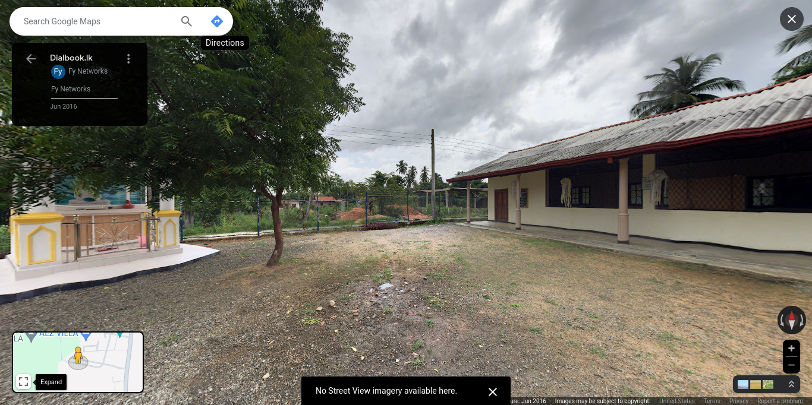

## Udadigana

**Udadigana** Grama Niladhari Division, **Maspotha** Divisional Secretariat Division, **Kurunegala** District, **North Western** Province

**Kurunegala** Polling Division, **Kurunegala** Electoral District

Population: 559 (2012)

(**LK-6151145**/801)

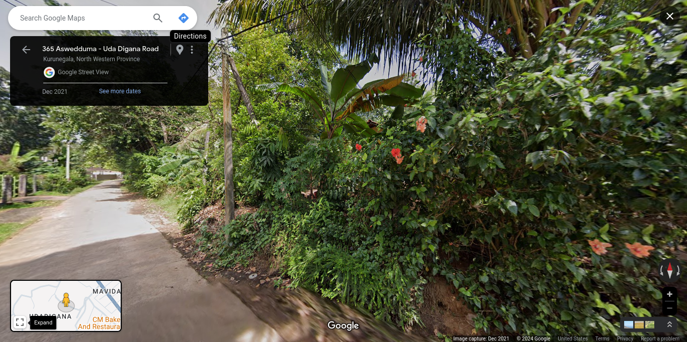

## Moratuwella West

**Moratuwella West** Grama Niladhari Division, **Moratuwa** Divisional Secretariat Division, **Colombo** District, **Western** Province

**Moratuwa** Polling Division, **Colombo** Electoral District

Population: 2,394 (2012)

(**LK-1133165**/553B)

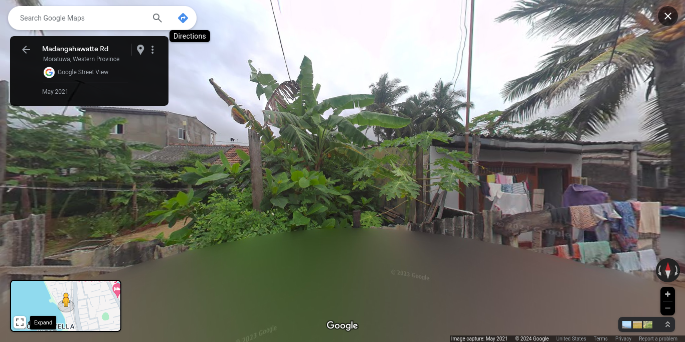

## Kirillawala West

**Kirillawala West** Grama Niladhari Division, **Mahara** Divisional Secretariat Division, **Gampaha** District, **Western** Province

**Mahara** Polling Division, **Gampaha** Electoral District

Population: 2,251 (2012)

(**LK-1233240**/287C)

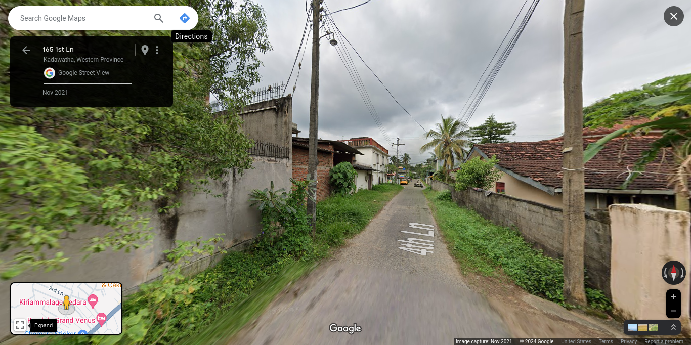

## Thenmylai

**Thenmylai** Grama Niladhari Division, **Valikamam North (Tellipallai)** Divisional Secretariat Division, **Jaffna** District, **Northern** Province

**Kayts** Polling Division, **Jaffna** Electoral District

Population: 0 (2012)

(**LK-4112145**/240)

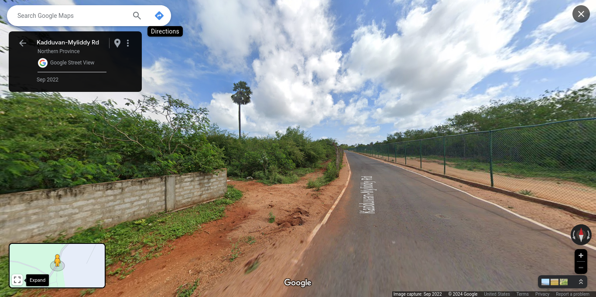

## Paranakade

**Paranakade** Grama Niladhari Division, **Beruwala** Divisional Secretariat Division, **Kalutara** District, **Western** Province

**Beruwala** Polling Division, **Kalutara** Electoral District

Population: 1,329 (2012)

(**LK-1324225**/753)

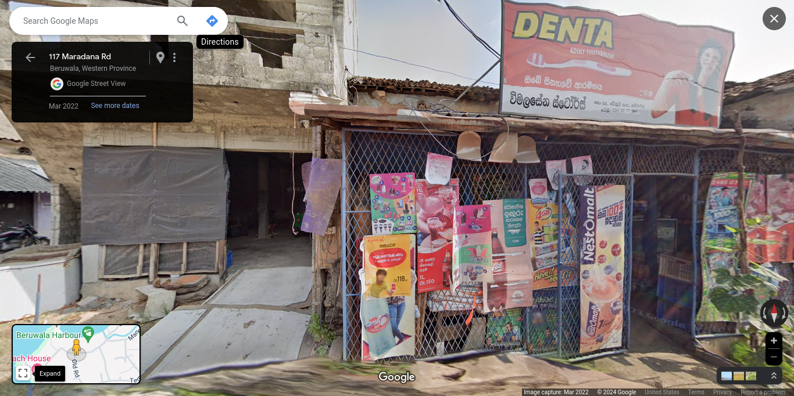

## Mampitiya

**Mampitiya** Grama Niladhari Division, **Udunuwara** Divisional Secretariat Division, **Kandy** District, **Central** Province

**Udunuwara** Polling Division, **Kandy** Electoral District

Population: 1,142 (2012)

(**LK-2139115**/7)

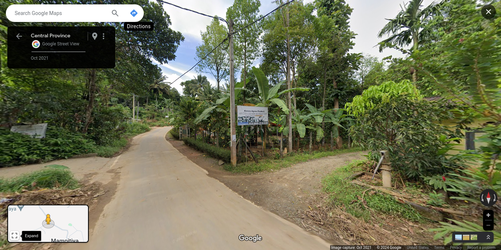

## Savatkaddu

**Savatkaddu** Grama Niladhari Division, **Valikamam South-West (Sandilipay)** Divisional Secretariat Division, **Jaffna** District, **Northern** Province

**Manipay** Polling Division, **Jaffna** Electoral District

Population: 1,713 (2012)

(**LK-4109015**/J/131)

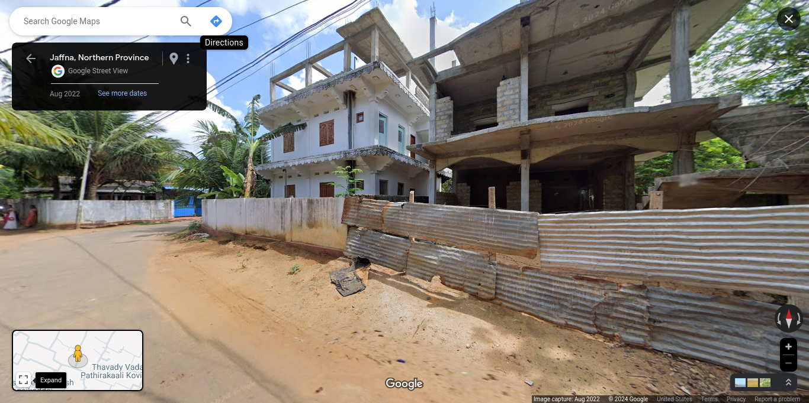

## Udahamulla

**Udahamulla** Grama Niladhari Division, **Panadura** Divisional Secretariat Division, **Kalutara** District, **Western** Province

**Panadura** Polling Division, **Kalutara** Electoral District

Population: 1,731 (2012)

(**LK-1303150**/682)

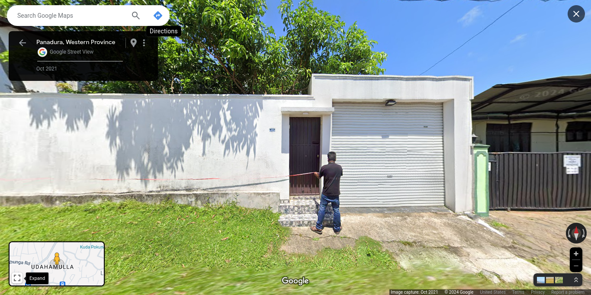

## Ganthalawa Unit 11

**Ganthalawa Unit 11** Grama Niladhari Division, **Kanthale** Divisional Secretariat Division, **Trincomalee** District, **Eastern** Province

**Seruvila** Polling Division, **Trincomalee** Electoral District

Population: 890 (2012)

(**LK-5321015**/227P)

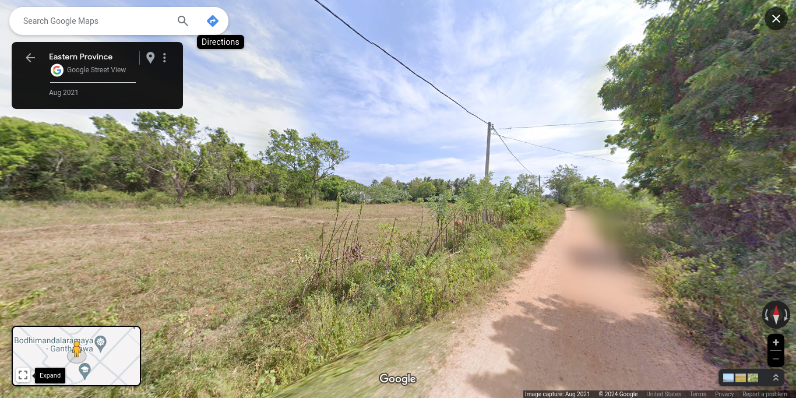

## Valvetty Centre

**Valvetty Centre** Grama Niladhari Division, **Vadamaradchi South-West (Karaveddy)** Divisional Secretariat Division, **Jaffna** District, **Northern** Province

**Udupiddy** Polling Division, **Jaffna** Electoral District

Population: 1,275 (2012)

(**LK-4121045**/J/356)

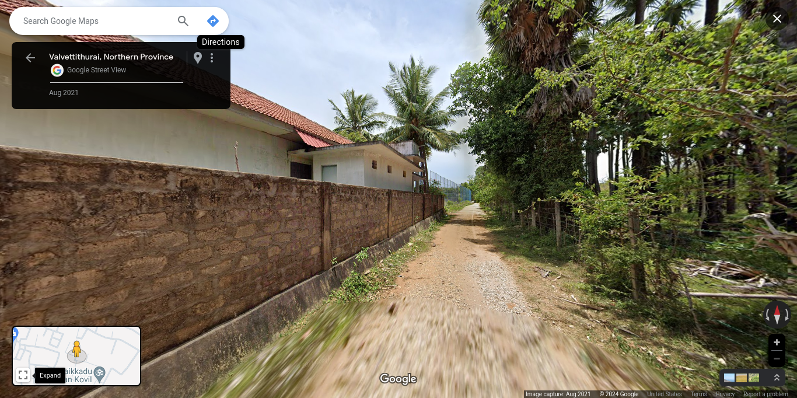

## Borella North

**Borella North** Grama Niladhari Division, **Thimbirigasyaya** Divisional Secretariat Division, **Colombo** District, **Western** Province

**Borella** Polling Division, **Colombo** Electoral District

Population: 21,326 (2012)

(**LK-1127040**/)

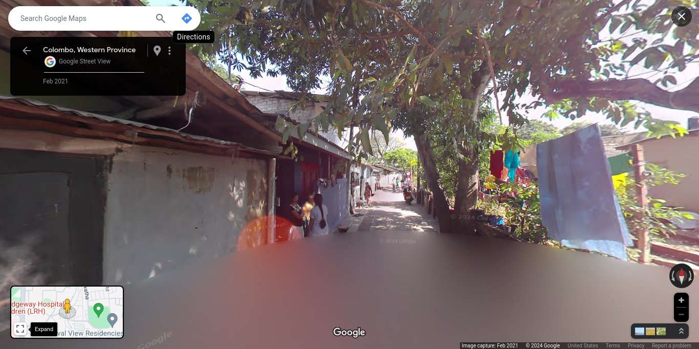

## Palamuna 02

**Palamuna 02** Grama Niladhari Division, **Addalachchenai** Divisional Secretariat Division, **Ampara** District, **Eastern** Province

**Pothuvil** Polling Division, **Digamadulla** Electoral District

Population: 1,342 (2012)

(**LK-5233050**/AD/34A)

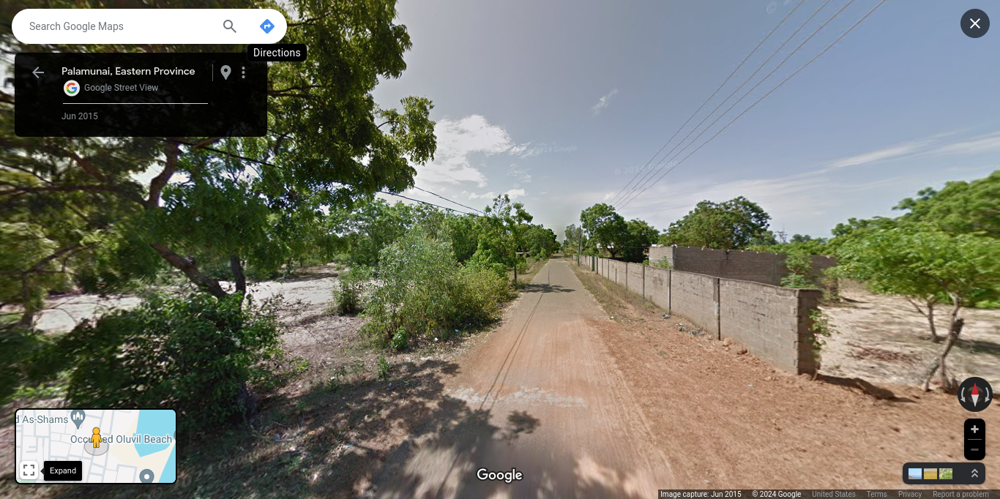

## Eravur 04

**Eravur 04** Grama Niladhari Division, **Eravur Town** Divisional Secretariat Division, **Batticaloa** District, **Eastern** Province

**Batticaloa** Polling Division, **Batticaloa** Electoral District

Population: 769 (2012)

(**LK-5115010**/194)

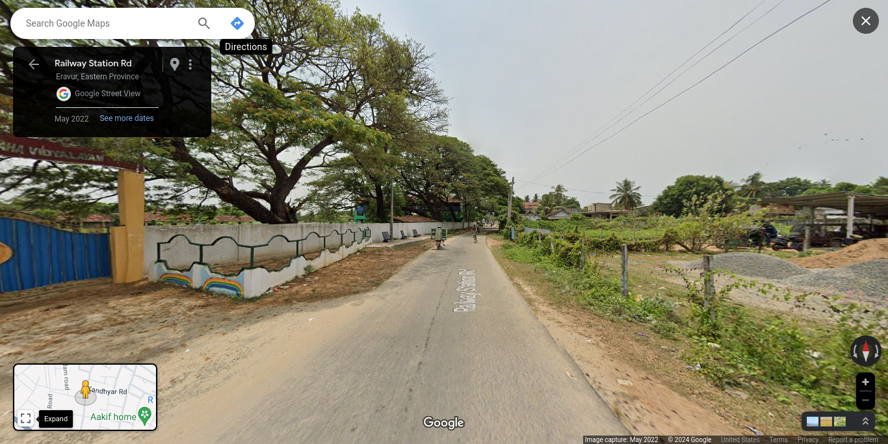

## Villorawatta West

**Villorawatta West** Grama Niladhari Division, **Moratuwa** Divisional Secretariat Division, **Colombo** District, **Western** Province

**Moratuwa** Polling Division, **Colombo** Electoral District

Population: 4,689 (2012)

(**LK-1133150**/560/61A)

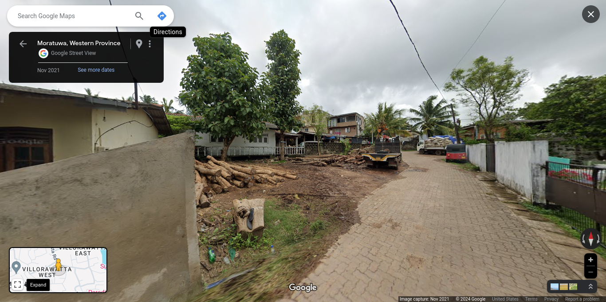

## Kalmunaikudi 07

**Kalmunaikudi 07** Grama Niladhari Division, **Kalmunai** Divisional Secretariat Division, **Ampara** District, **Eastern** Province

**Kalmunai** Polling Division, **Digamadulla** Electoral District

Population: 1,423 (2012)

(**LK-5224120**/KP/56E)

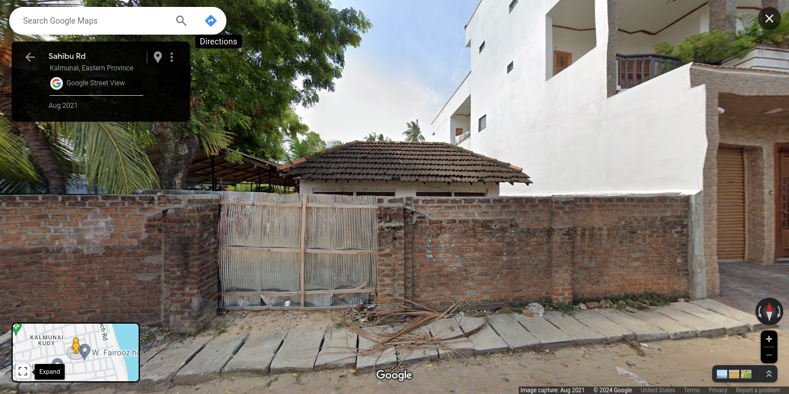

## Ginimellagaha West

**Ginimellagaha West** Grama Niladhari Division, **Baddegama** Divisional Secretariat Division, **Galle** District, **Southern** Province

**Ambalangoda** Polling Division, **Galle** Electoral District

Population: 1,498 (2012)

(**LK-3127165**/201A)

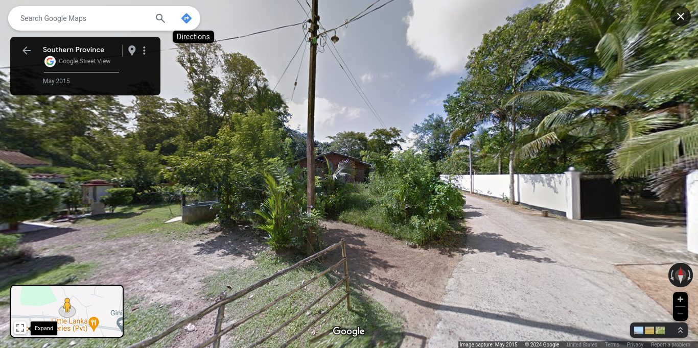

## Mavadivembu 1

**Mavadivembu 1** Grama Niladhari Division, **Eravur Pattu** Divisional Secretariat Division, **Batticaloa** District, **Eastern** Province

**Kalkudah** Polling Division, **Batticaloa** Electoral District

Population: 3,093 (2012)

(**LK-5112030**/197A)

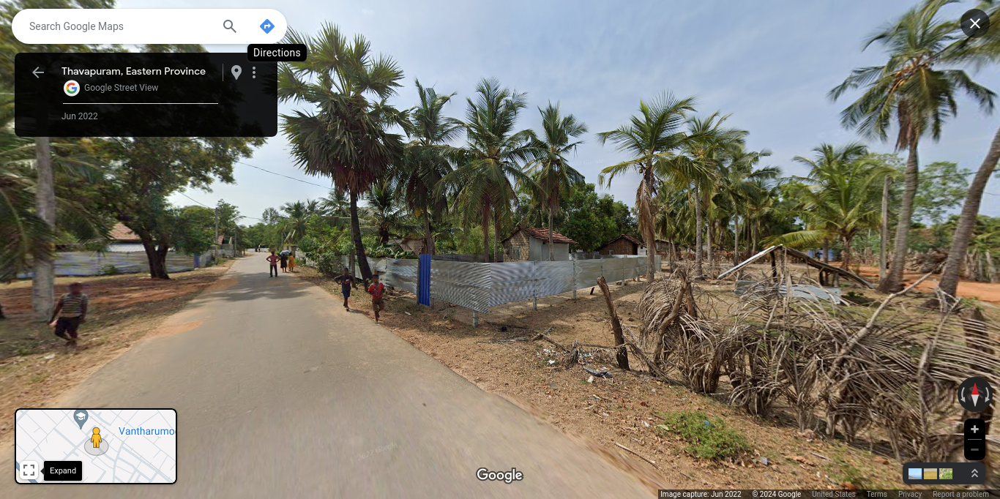

## Marakkalahawatta

**Marakkalahawatta** Grama Niladhari Division, **Beruwala** Divisional Secretariat Division, **Kalutara** District, **Western** Province

**Beruwala** Polling Division, **Kalutara** Electoral District

Population: 3,937 (2012)

(**LK-1324215**/747A)

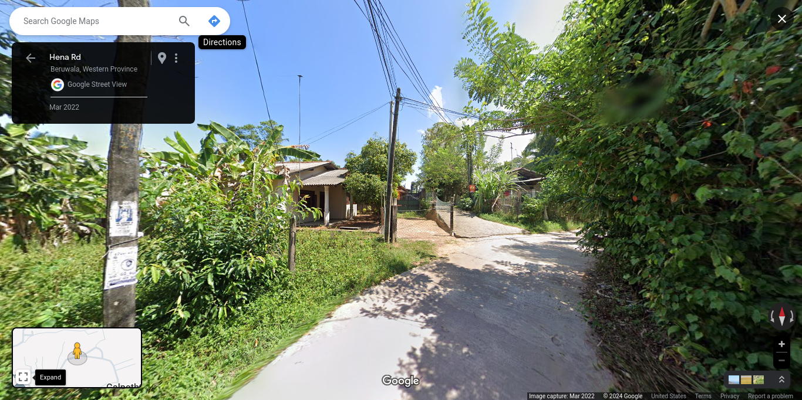

## Chavalakade

**Chavalakade** Grama Niladhari Division, **Navithanveli** Divisional Secretariat Division, **Ampara** District, **Eastern** Province

**Samanthurai** Polling Division, **Digamadulla** Electoral District

Population: 673 (2012)

(**LK-5216075**/SP/93)

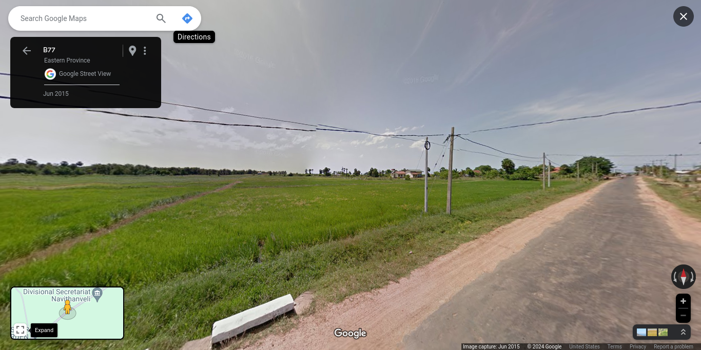

## Kottawa North

**Kottawa North** Grama Niladhari Division, **Maharagama** Divisional Secretariat Division, **Colombo** District, **Western** Province

**Maharagama** Polling Division, **Colombo** Electoral District

Population: 2,466 (2012)

(**LK-1121060**/496C)

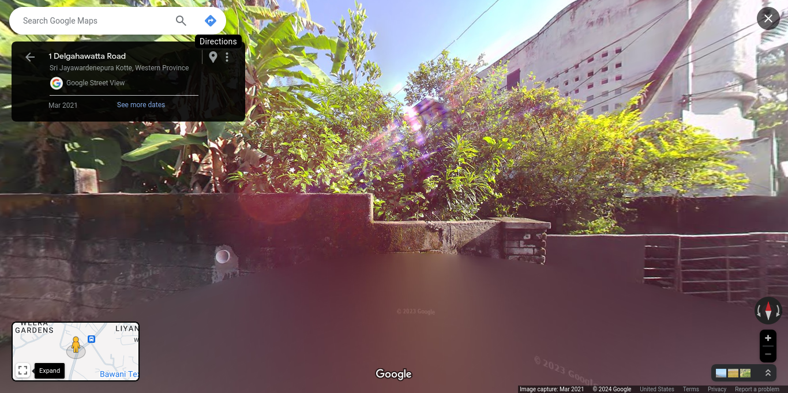

## Wekanda

**Wekanda** Grama Niladhari Division, **Colombo** Divisional Secretariat Division, **Colombo** District, **Western** Province

**Colombo Central** Polling Division, **Colombo** Electoral District

Population: 6,839 (2012)

(**LK-1103175**/)

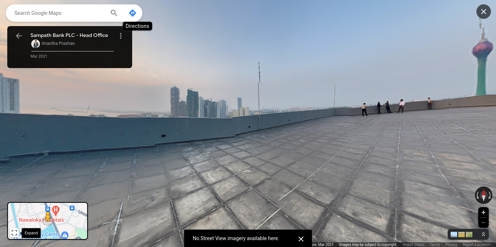

## Egodawewa

**Egodawewa** Grama Niladhari Division, **Dambulla** Divisional Secretariat Division, **Matale** District, **Central** Province

**Dambulla** Polling Division, **Matale** Electoral District

Population: 906 (2012)

(**LK-2206055**/E452B)

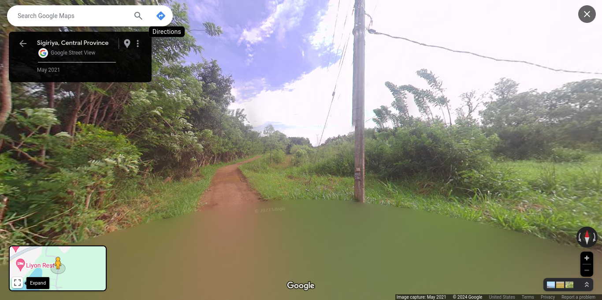

## Badulla West

**Badulla West** Grama Niladhari Division, **Badulla** Divisional Secretariat Division, **Badulla** District, **Uva** Province

**Badulla** Polling Division, **Badulla** Electoral District

Population: 2,753 (2012)

(**LK-8121075**/78C)

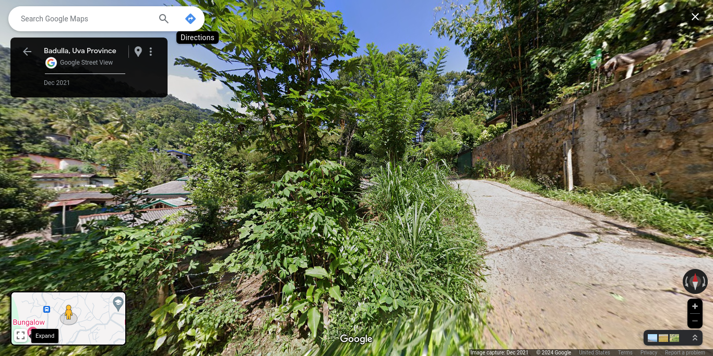

## Udagama North

**Udagama North** Grama Niladhari Division, **Kundasale** Divisional Secretariat Division, **Kandy** District, **Central** Province

**Kundasale** Polling Division, **Kandy** Electoral District

Population: 922 (2012)

(**LK-2127050**/672)

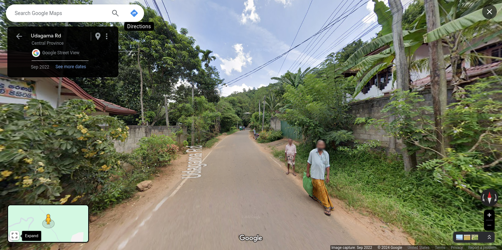

## Thammita

**Thammita** Grama Niladhari Division, **Minuwangoda** Divisional Secretariat Division, **Gampaha** District, **Western** Province

**Minuwangoda** Polling Division, **Gampaha** Electoral District

Population: 1,465 (2012)

(**LK-1215605**/136)

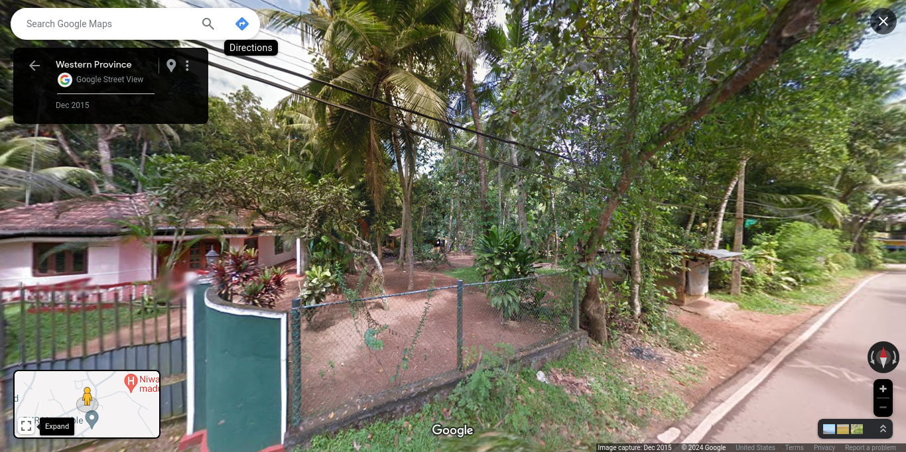

## Erewwala East

**Erewwala East** Grama Niladhari Division, **Kesbewa** Divisional Secretariat Division, **Colombo** District, **Western** Province

**Kesbewa** Polling Division, **Colombo** Electoral District

Population: 2,542 (2012)

(**LK-1136110**/581)

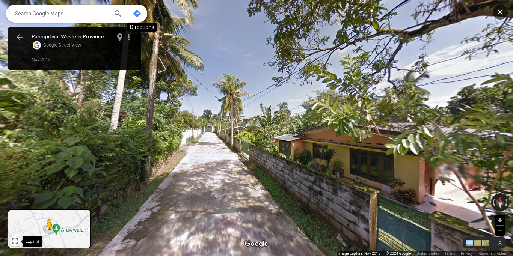

## Thoppuwa

**Thoppuwa** Grama Niladhari Division, **Katana** Divisional Secretariat Division, **Gampaha** District, **Western** Province

**Katana** Polling Division, **Gampaha** Electoral District

Population: 2,914 (2012)

(**LK-1206020**/65A)

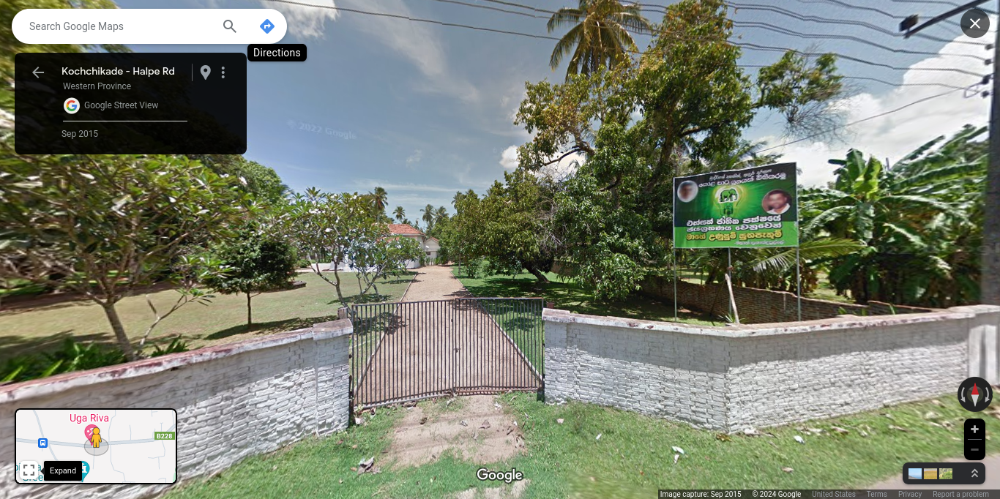

## Thennehenwala

**Thennehenwala** Grama Niladhari Division, **Walapane** Divisional Secretariat Division, **Nuwara Eliya** District, **Central** Province

**Walapane** Polling Division, **Nuwara-Eliya** Electoral District

Population: 460 (2012)

(**LK-2309075**/514D)

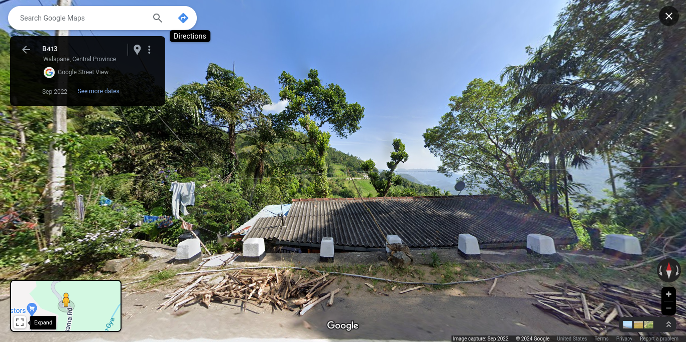

## Nugegoda

**Nugegoda** Grama Niladhari Division, **Sri Jayawardanapura Kotte** Divisional Secretariat Division, **Colombo** District, **Western** Province

**Kotte** Polling Division, **Colombo** Electoral District

Population: 3,365 (2012)

(**LK-1124080**/519)

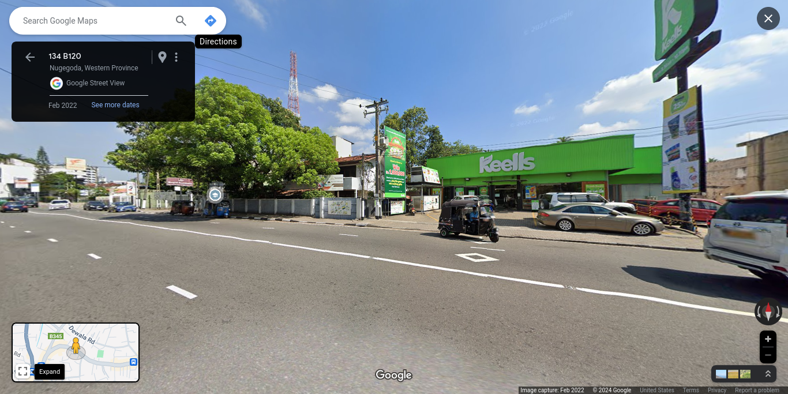

## Kanagapuram

**Kanagapuram** Grama Niladhari Division, **Karachchi** Divisional Secretariat Division, **Kilinochchi** District, **Northern** Province

**Kilinochchi** Polling Division, **Jaffna** Electoral District

Population: 877 (2012)

(**LK-4509045**/KN/26)

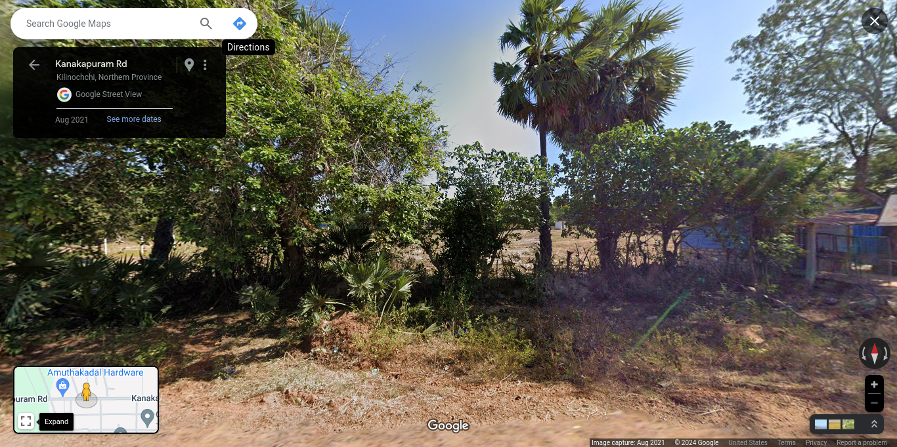

## Nagasthenna

**Nagasthenna** Grama Niladhari Division, **Kandy Four Gravets & Gangawata Korale** Divisional Secretariat Division, **Kandy** District, **Central** Province

**Mahanuwara** Polling Division, **Kandy** Electoral District

Population: 3,526 (2012)

(**LK-2130155**/262)

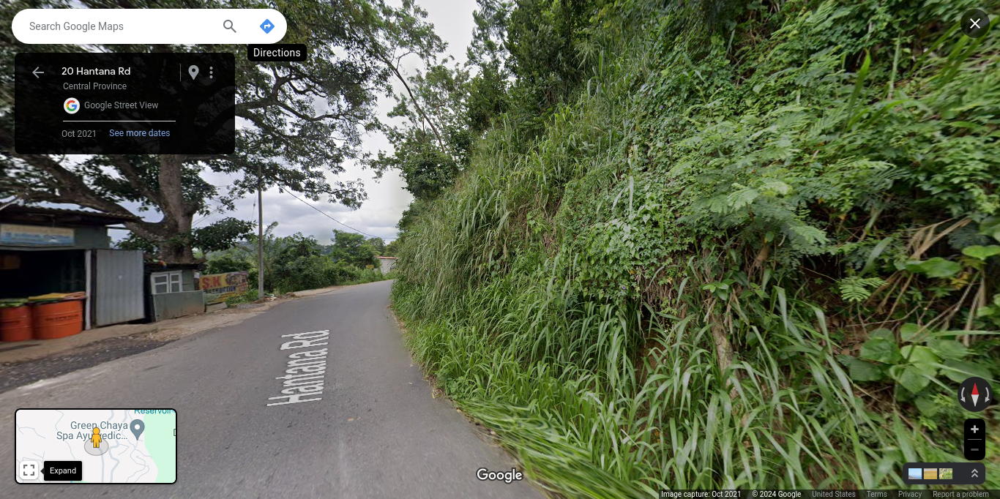

## Omatta

**Omatta** Grama Niladhari Division, **Agalawatta** Divisional Secretariat Division, **Kalutara** District, **Western** Province

**Bulathsinhala** Polling Division, **Kalutara** Electoral District

Population: 935 (2012)

(**LK-1333015**/826)

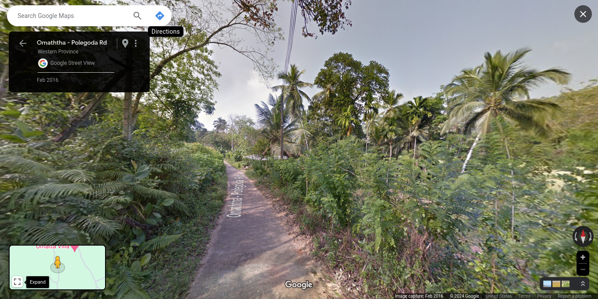

## Maviddapuram

**Maviddapuram** Grama Niladhari Division, **Valikamam North (Tellipallai)** Divisional Secretariat Division, **Jaffna** District, **Northern** Province

**Kayts** Polling Division, **Jaffna** Electoral District

Population: 47 (2012)

(**LK-4112100**/231)

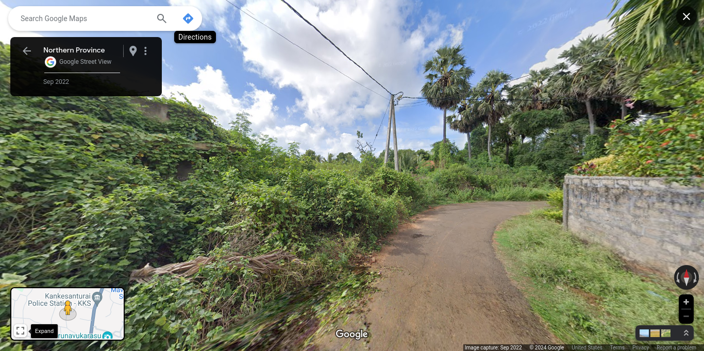

## Sillalai South

**Sillalai South** Grama Niladhari Division, **Valikamam South-West (Sandilipay)** Divisional Secretariat Division, **Jaffna** District, **Northern** Province

**Vaddukoddai** Polling Division, **Jaffna** Electoral District

Population: 824 (2012)

(**LK-4109105**/J/149)

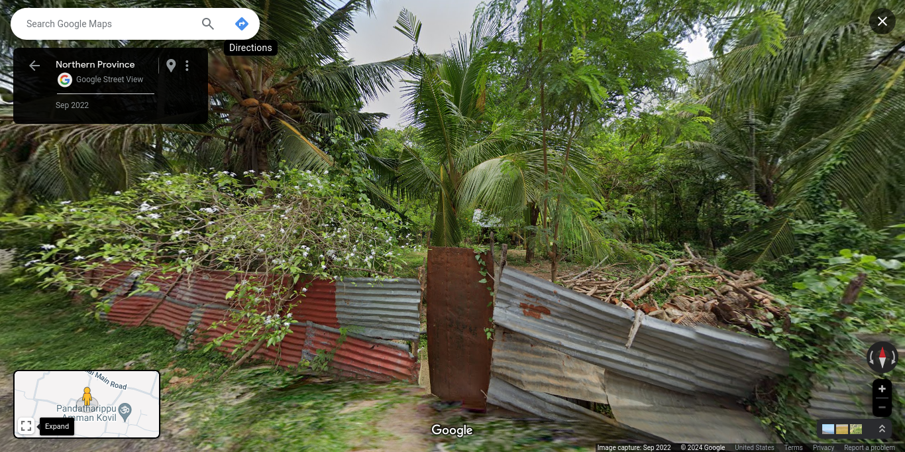

## Mottunna West

**Mottunna West** Grama Niladhari Division, **Mirigama** Divisional Secretariat Division, **Gampaha** District, **Western** Province

**Mirigama** Polling Division, **Gampaha** Electoral District

Population: 925 (2012)

(**LK-1212690**/339A)

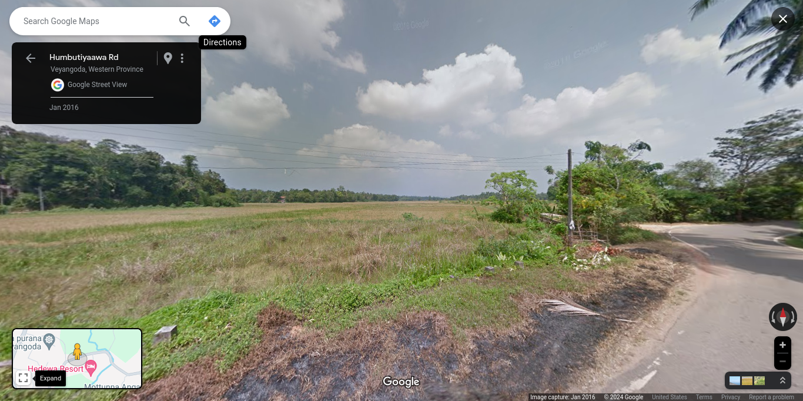

## Thambiluvil 2 East

**Thambiluvil 2 East** Grama Niladhari Division, **Thirukkovil** Divisional Secretariat Division, **Ampara** District, **Eastern** Province

**Pothuvil** Polling Division, **Digamadulla** Electoral District

Population: 1,276 (2012)

(**LK-5245045**/TK/11A)

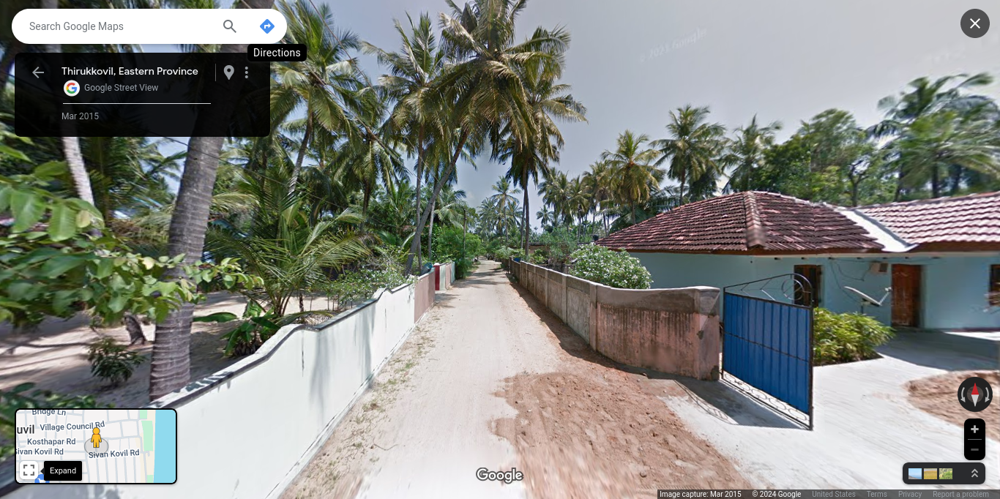

## Stonycliff

**Stonycliff** Grama Niladhari Division, **Nuwara Eliya** Divisional Secretariat Division, **Nuwara Eliya** District, **Central** Province

**Nuwara Eliya Maskeliya** Polling Division, **Nuwara-Eliya** Electoral District

Population: 3,214 (2012)

(**LK-2312105**/475M)

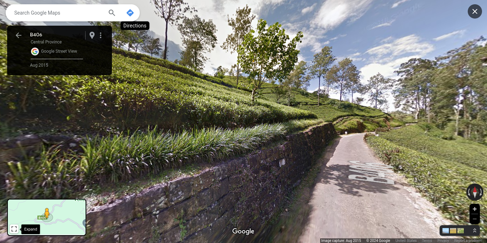

## Alexendrawatta

**Alexendrawatta** Grama Niladhari Division, **Ja-Ela** Divisional Secretariat Division, **Gampaha** District, **Western** Province

**Ja Ela** Polling Division, **Gampaha** Electoral District

Population: 5,926 (2012)

(**LK-1221075**/206A)

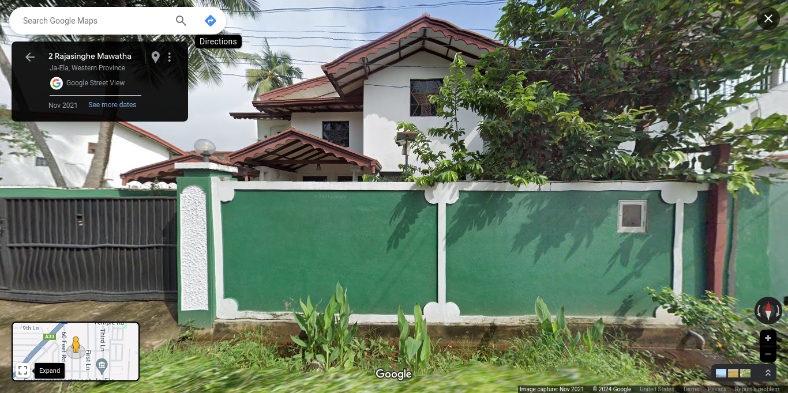

## Serugoda

**Serugoda** Grama Niladhari Division, **Ambanpola** Divisional Secretariat Division, **Kurunegala** District, **North Western** Province

**Yapahuwa** Polling Division, **Kurunegala** Electoral District

Population: 700 (2012)

(**LK-6112075**/155)

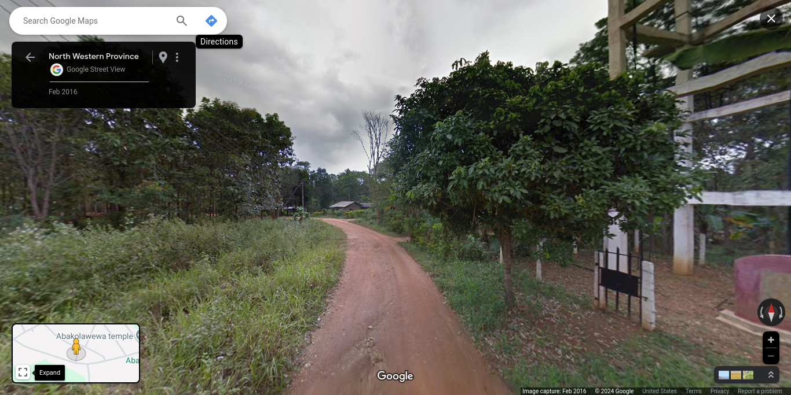

## Kalmunaikudi 05

**Kalmunaikudi 05** Grama Niladhari Division, **Kalmunai** Divisional Secretariat Division, **Ampara** District, **Eastern** Province

**Kalmunai** Polling Division, **Digamadulla** Electoral District

Population: 1,624 (2012)

(**LK-5224100**/KP/56)

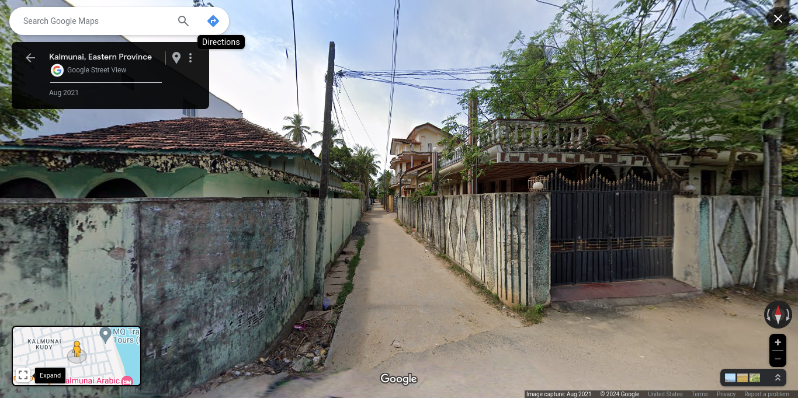

## Walliwala West

**Walliwala West** Grama Niladhari Division, **Weligama** Divisional Secretariat Division, **Matara** District, **Southern** Province

**Weligama** Polling Division, **Matara** Electoral District

Population: 1,218 (2012)

(**LK-3239145**/386A)

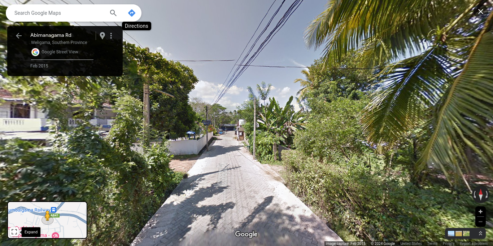

## Pagoda East

**Pagoda East** Grama Niladhari Division, **Sri Jayawardanapura Kotte** Divisional Secretariat Division, **Colombo** District, **Western** Province

**Kotte** Polling Division, **Colombo** Electoral District

Population: 5,944 (2012)

(**LK-1124085**/519C)

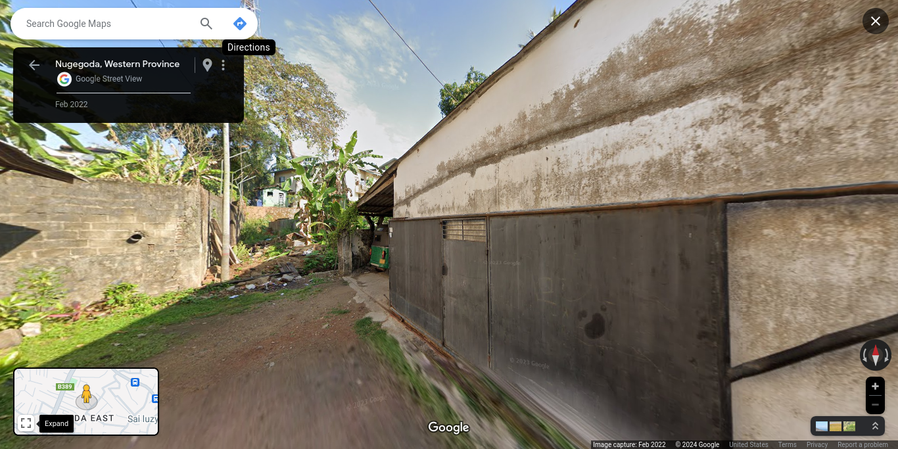

## Akaravita

**Akaravita** Grama Niladhari Division, **Seethawaka** Divisional Secretariat Division, **Colombo** District, **Western** Province

**Avissawella** Polling Division, **Colombo** Electoral District

Population: 1,195 (2012)

(**LK-1115085**/434)

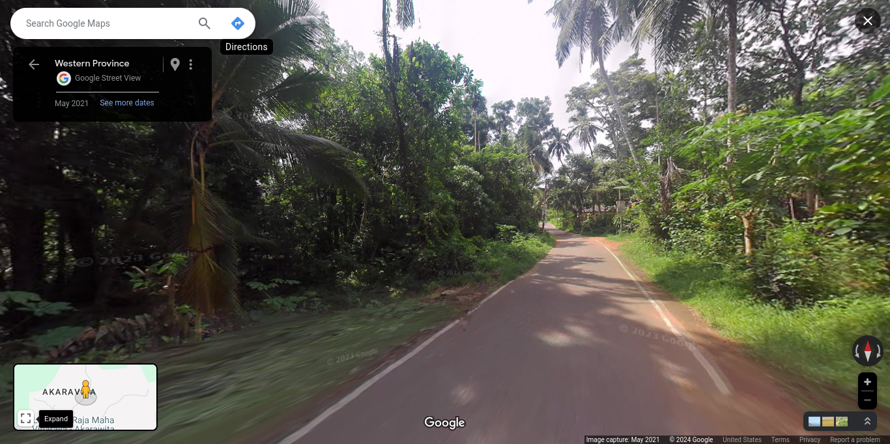

## Udahamulla West

**Udahamulla West** Grama Niladhari Division, **Maharagama** Divisional Secretariat Division, **Colombo** District, **Western** Province

**Maharagama** Polling Division, **Colombo** Electoral District

Population: 4,780 (2012)

(**LK-1121095**/525B)

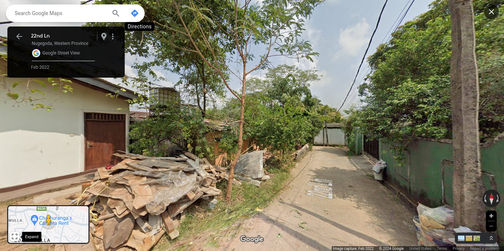

## Bokundara

**Bokundara** Grama Niladhari Division, **Kesbewa** Divisional Secretariat Division, **Colombo** District, **Western** Province

**Kesbewa** Polling Division, **Colombo** Electoral District

Population: 3,633 (2012)

(**LK-1136155**/575)

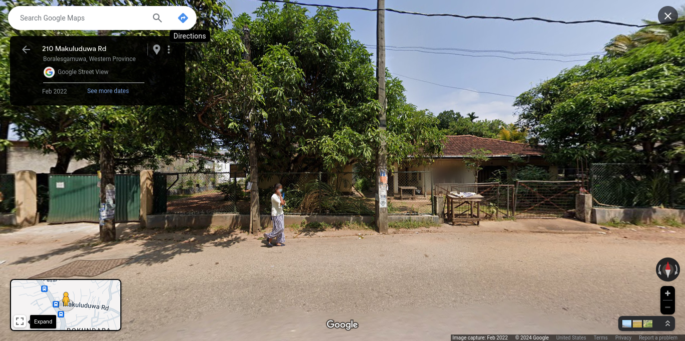

## Nittawela

**Nittawela** Grama Niladhari Division, **Kandy Four Gravets & Gangawata Korale** Divisional Secretariat Division, **Kandy** District, **Central** Province

**Senkadagala** Polling Division, **Kandy** Electoral District

Population: 3,138 (2012)

(**LK-2130030**/225)

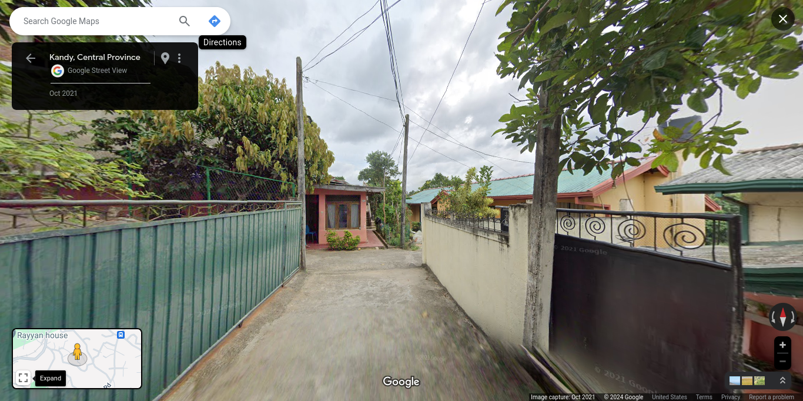

## Nallooruwa

**Nallooruwa** Grama Niladhari Division, **Panadura** Divisional Secretariat Division, **Kalutara** District, **Western** Province

**Panadura** Polling Division, **Kalutara** Electoral District

Population: 3,014 (2012)

(**LK-1303275**/692)

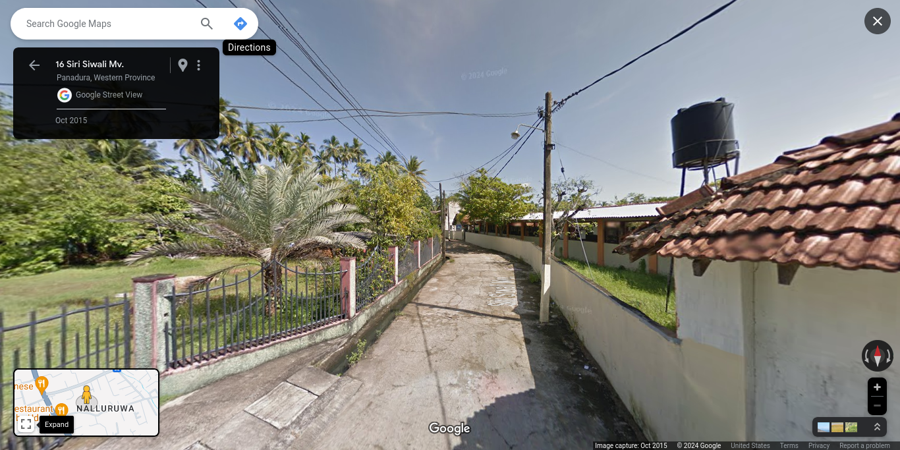

## Onthachimadam South

**Onthachimadam South** Grama Niladhari Division, **Manmunai South & Eruvil pattu** Divisional Secretariat Division, **Batticaloa** District, **Eastern** Province

**Paddiruppu** Polling Division, **Batticaloa** Electoral District

Population: 1,006 (2012)

(**LK-5136150**/111A)

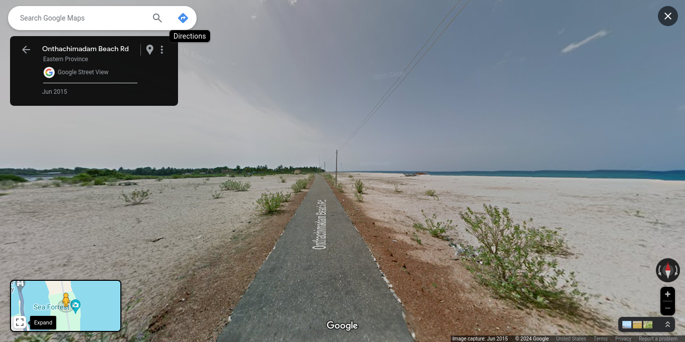

## Vitharandeniya North

**Vitharandeniya North** Grama Niladhari Division, **Tangalle** Divisional Secretariat Division, **Hambantota** District, **Southern** Province

**Beliatta** Polling Division, **Hambantota** Electoral District

Population: 643 (2012)

(**LK-3333070**/308)

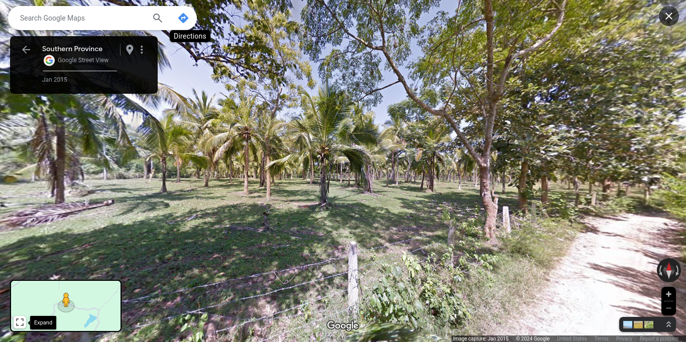

## Nallura

**Nallura** Grama Niladhari Division, **Panduwasnuwara West** Divisional Secretariat Division, **Kurunegala** District, **North Western** Province

**Panduwasnuwara** Polling Division, **Kurunegala** Electoral District

Population: 1,126 (2012)

(**LK-6145105**/1356)

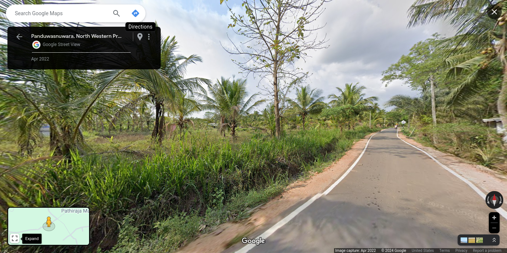

## Hinguloya

**Hinguloya** Grama Niladhari Division, **Mawanella** Divisional Secretariat Division, **Kegalle** District, **Sabaragamuwa** Province

**Mawanella** Polling Division, **Kegalle** Electoral District

Population: 4,833 (2012)

(**LK-9206125**/29C)

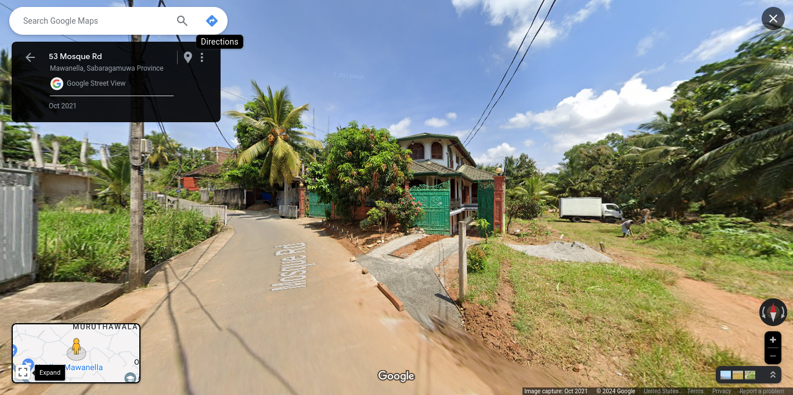

## Thalgamuwa

**Thalgamuwa** Grama Niladhari Division, **Aranayaka** Divisional Secretariat Division, **Kegalle** District, **Sabaragamuwa** Province

**Aranayaka** Polling Division, **Kegalle** Electoral District

Population: 1,073 (2012)

(**LK-9209150**/33)

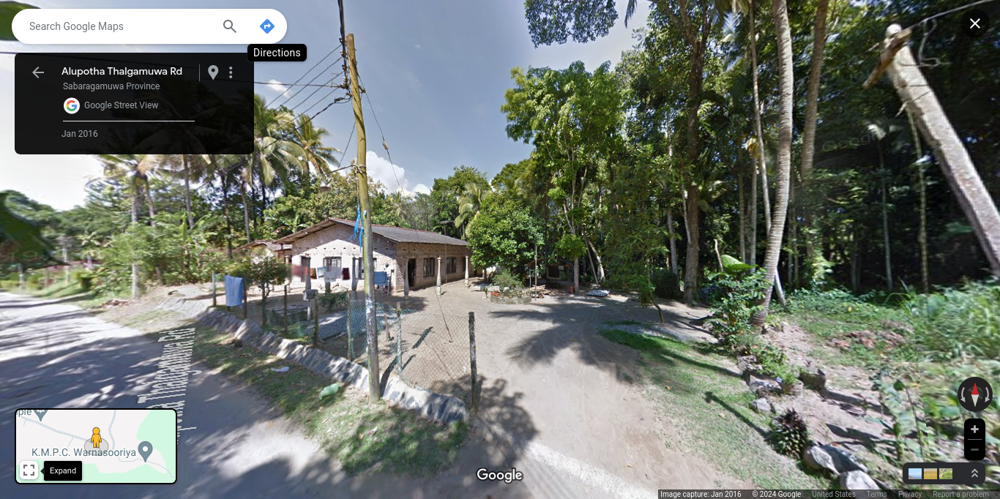

## Hendeniya West

**Hendeniya West** Grama Niladhari Division, **Udunuwara** Divisional Secretariat Division, **Kandy** District, **Central** Province

**Udunuwara** Polling Division, **Kandy** Electoral District

Population: 1,003 (2012)

(**LK-2139125**/9)

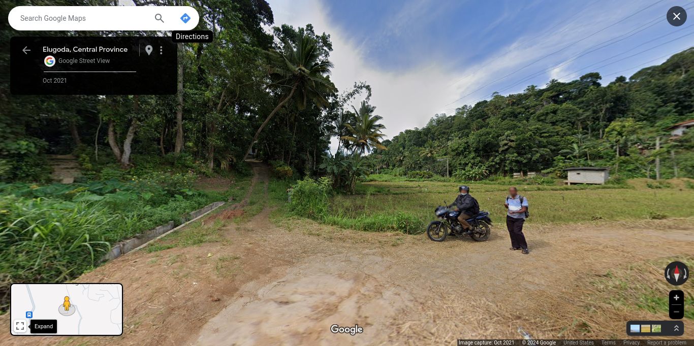

## Maddakalaputharavai 01

**Maddakalaputharavai 01** Grama Niladhari Division, **Samanthurai** Divisional Secretariat Division, **Ampara** District, **Eastern** Province

**Samanthurai** Polling Division, **Digamadulla** Electoral District

Population: 1,090 (2012)

(**LK-5218100**/77A)

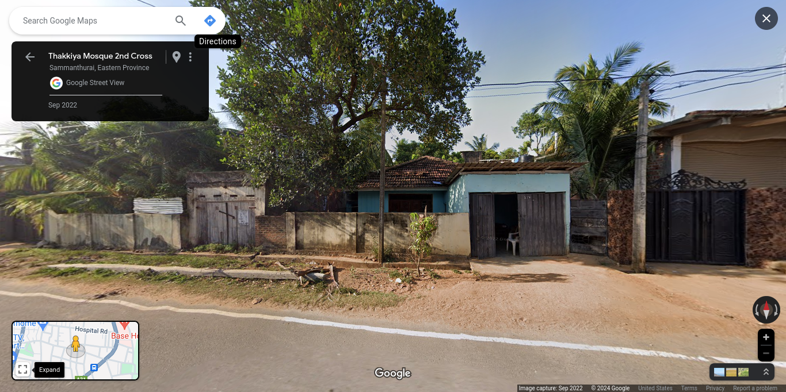

## Koskandawala

**Koskandawala** Grama Niladhari Division, **Attanagalla** Divisional Secretariat Division, **Gampaha** District, **Western** Province

**Attanagalla** Polling Division, **Gampaha** Electoral District

Population: 1,361 (2012)

(**LK-1227690**/308)

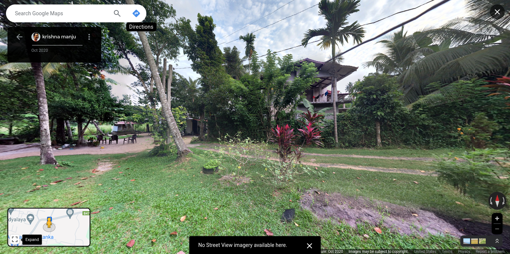

## Kirindawa

**Kirindawa** Grama Niladhari Division, **Kuliyapitiya West** Divisional Secretariat Division, **Kurunegala** District, **North Western** Province

**Kuliyapitiya** Polling Division, **Kurunegala** Electoral District

Population: 1,066 (2012)

(**LK-6172155**/1143)

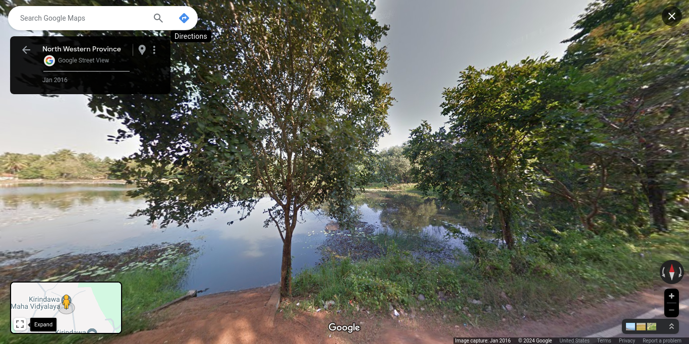

## Mirigama

**Mirigama** Grama Niladhari Division, **Mirigama** Divisional Secretariat Division, **Gampaha** District, **Western** Province

**Mirigama** Polling Division, **Gampaha** Electoral District

Population: 620 (2012)

(**LK-1212200**/15B)

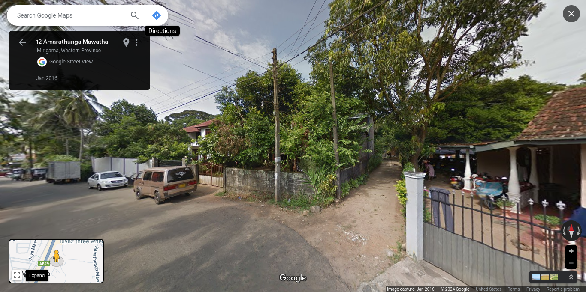

## Mulgirigala North

**Mulgirigala North** Grama Niladhari Division, **Weeraketiya** Divisional Secretariat Division, **Hambantota** District, **Southern** Province

**Mulkirigala** Polling Division, **Hambantota** Electoral District

Population: 419 (2012)

(**LK-3321260**/396)

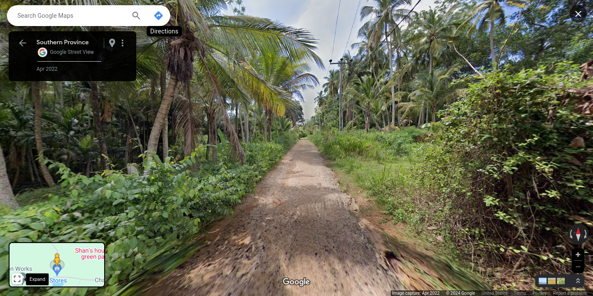

## Dangaswewa

**Dangaswewa** Grama Niladhari Division, **Karuwalagaswewa** Divisional Secretariat Division, **Puttalam** District, **North Western** Province

**Anamaduwa** Polling Division, **Puttalam** Electoral District

Population: 663 (2012)

(**LK-6209065**/642C)

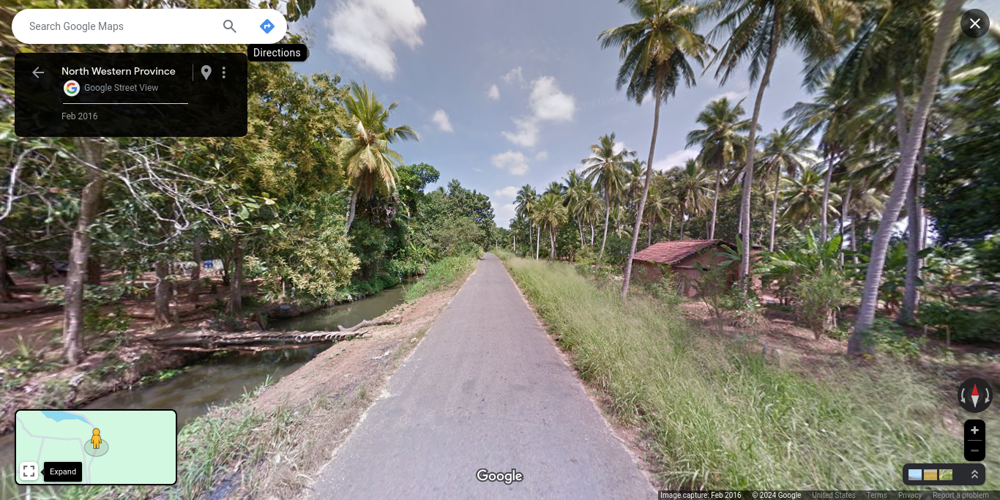

## Galahagama

**Galahagama** Grama Niladhari Division, **Uva Paranagama** Divisional Secretariat Division, **Badulla** District, **Uva** Province

**Uva Paranagama** Polling Division, **Badulla** Electoral District

Population: 1,994 (2012)

(**LK-8127265**/46B)

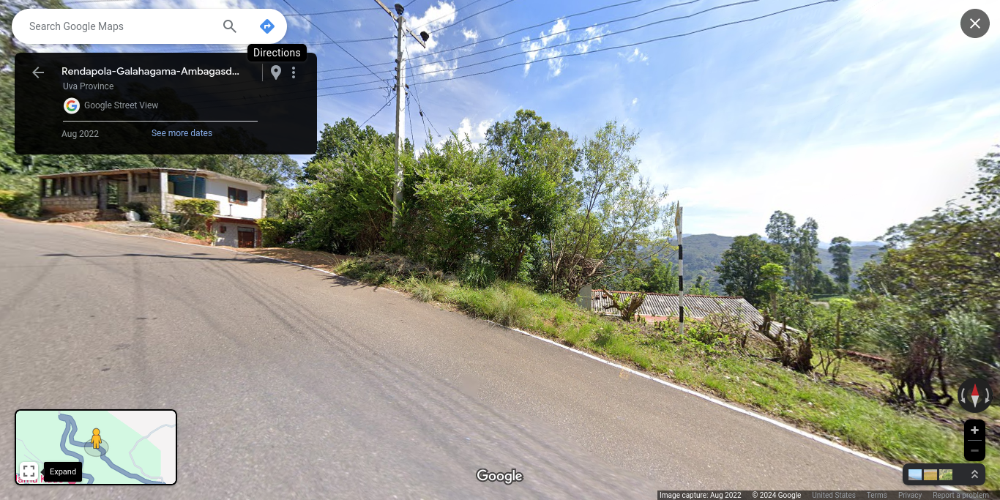

## Siyambalagahawela

**Siyambalagahawela** Grama Niladhari Division, **Galewela** Divisional Secretariat Division, **Matale** District, **Central** Province

**Dambulla** Polling Division, **Matale** Electoral District

Population: 921 (2012)

(**LK-2203210**/E427A)

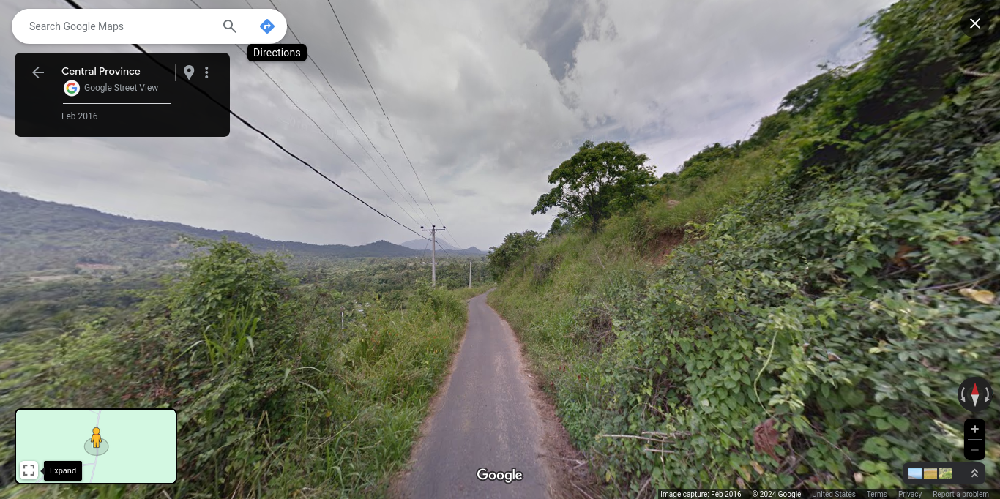

## Ihala Bomiriya

**Ihala Bomiriya** Grama Niladhari Division, **Kaduwela** Divisional Secretariat Division, **Colombo** District, **Western** Province

**Kaduwela** Polling Division, **Colombo** Electoral District

Population: 4,261 (2012)

(**LK-1109030**/471)

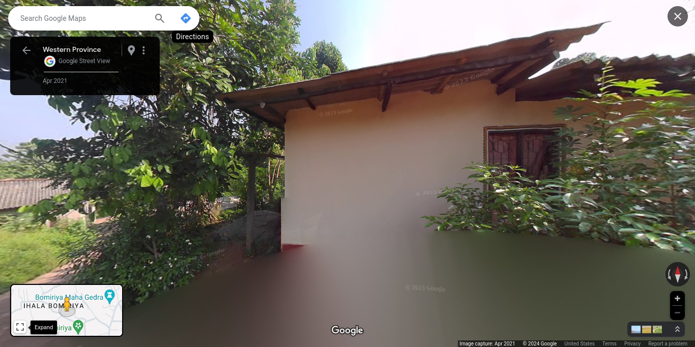

## Kadurupokuna East

**Kadurupokuna East** Grama Niladhari Division, **Tangalle** Divisional Secretariat Division, **Hambantota** District, **Southern** Province

**Tangalle** Polling Division, **Hambantota** Electoral District

Population: 1,221 (2012)

(**LK-3333245**/277)

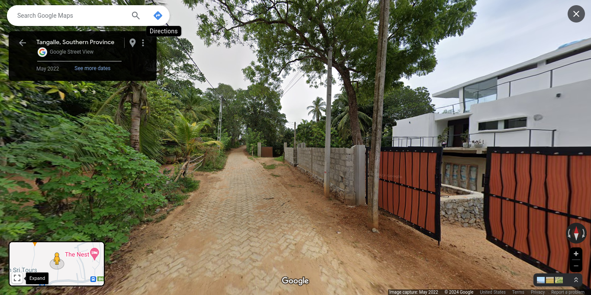

## Welipatha

**Welipatha** Grama Niladhari Division, **Galle Four Gravets** Divisional Secretariat Division, **Galle** District, **Southern** Province

**Galle** Polling Division, **Galle** Electoral District

Population: 2,043 (2012)

(**LK-3139085**/101D)

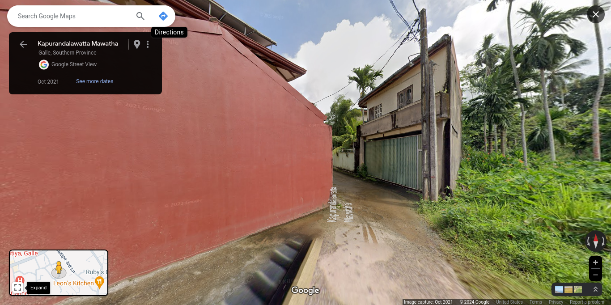

## Wattegama

**Wattegama** Grama Niladhari Division, **Pathadumbara** Divisional Secretariat Division, **Kandy** District, **Central** Province

**Pathadumbara** Polling Division, **Kandy** Electoral District

Population: 2,540 (2012)

(**LK-2112070**/594)

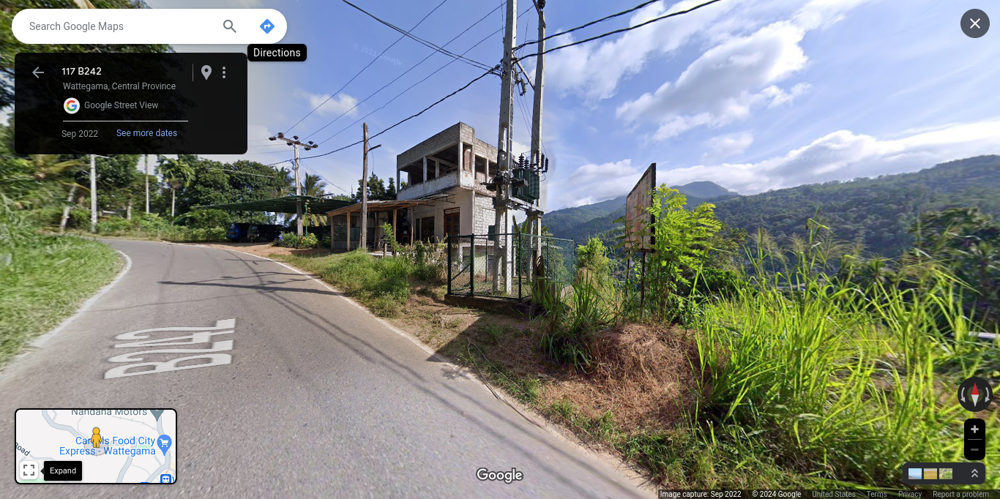

## Uggalbada East

**Uggalbada East** Grama Niladhari Division, **Kalutara** Divisional Secretariat Division, **Kalutara** District, **Western** Province

**Kalutara** Polling Division, **Kalutara** Electoral District

Population: 1,444 (2012)

(**LK-1321220**/716)

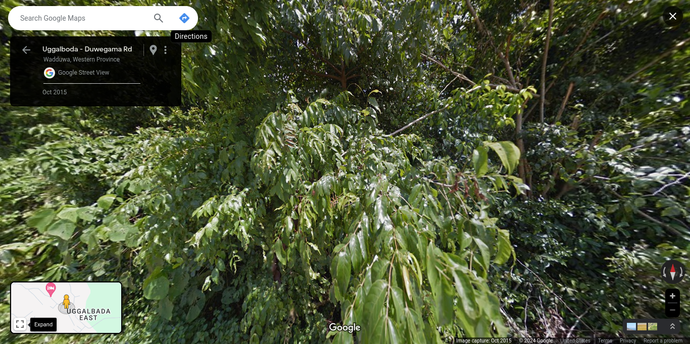

## Kudahakapola South

**Kudahakapola South** Grama Niladhari Division, **Ja-Ela** Divisional Secretariat Division, **Gampaha** District, **Western** Province

**Ja Ela** Polling Division, **Gampaha** Electoral District

Population: 1,612 (2012)

(**LK-1221040**/195)

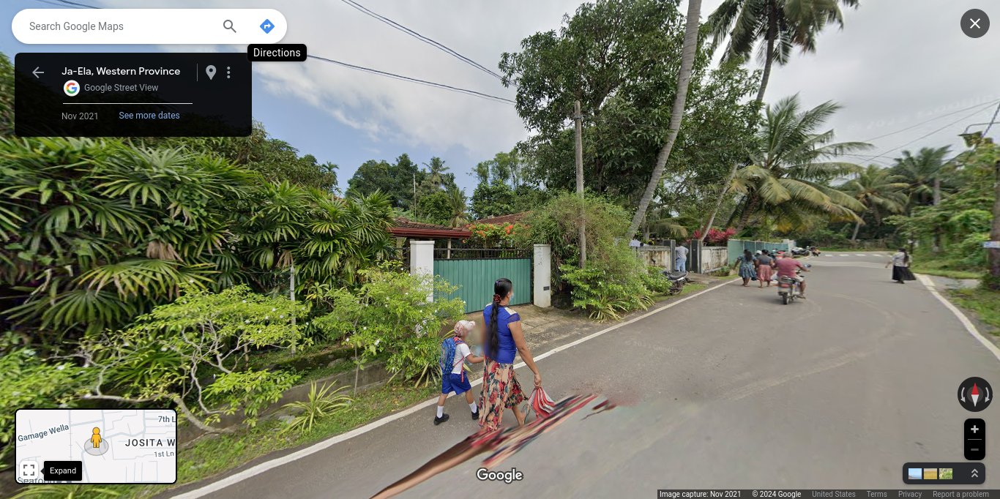

## Boraluwageaina

**Boraluwageaina** Grama Niladhari Division, **Kolonna** Divisional Secretariat Division, **Ratnapura** District, **Sabaragamuwa** Province

**Kolonna** Polling Division, **Ratnapura** Electoral District

Population: 2,368 (2012)

(**LK-9151095**/206A)

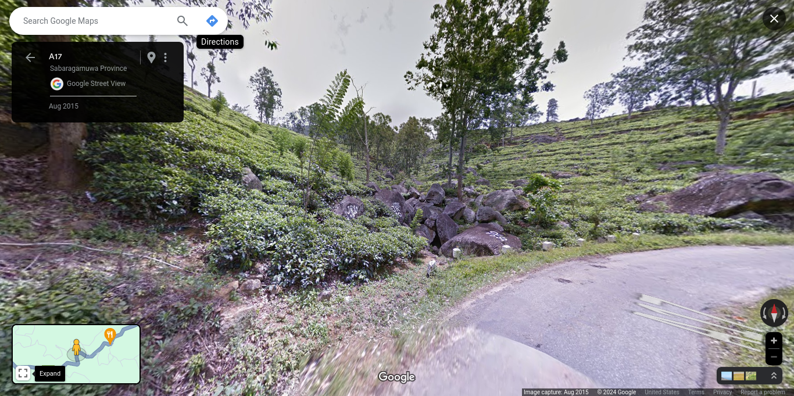

## Madiwela

**Madiwela** Grama Niladhari Division, **Maharagama** Divisional Secretariat Division, **Colombo** District, **Western** Province

**Maharagama** Polling Division, **Colombo** Electoral District

Population: 6,244 (2012)

(**LK-1121015**/524)

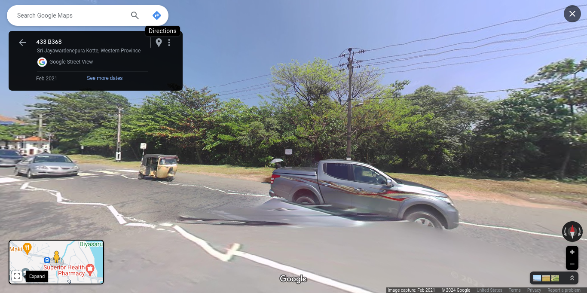

## Kelegala

**Kelegala** Grama Niladhari Division, **Nuwara Eliya** Divisional Secretariat Division, **Nuwara Eliya** District, **Central** Province

**Nuwara Eliya Maskeliya** Polling Division, **Nuwara-Eliya** Electoral District

Population: 1,829 (2012)

(**LK-2312225**/535C)

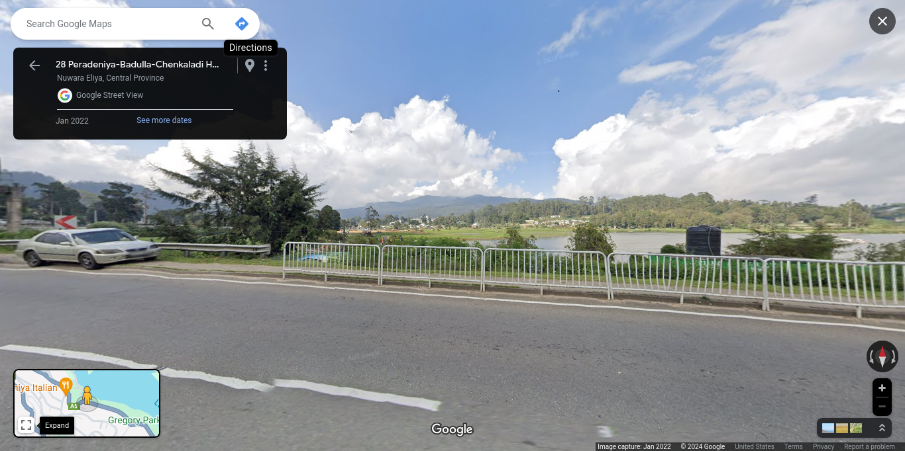

## Periyaththumunai

**Periyaththumunai** Grama Niladhari Division, **Kinniya** Divisional Secretariat Division, **Trincomalee** District, **Eastern** Province

**Muttur** Polling Division, **Trincomalee** Electoral District

Population: 1,597 (2012)

(**LK-5324095**/226)

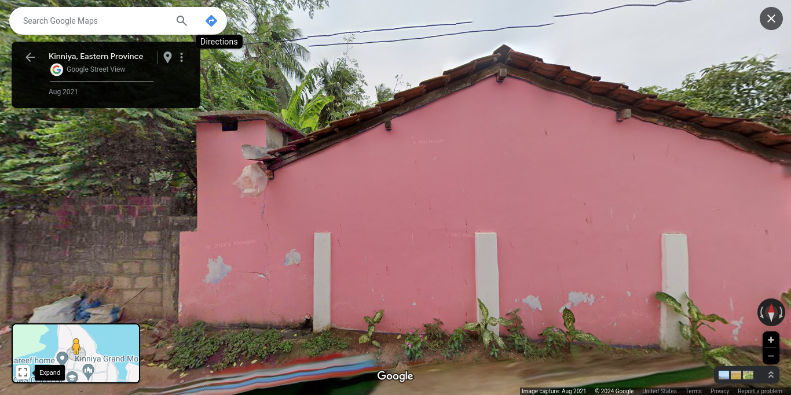

## Lindara Ihala

**Lindara Ihala** Grama Niladhari Division, **Mirigama** Divisional Secretariat Division, **Gampaha** District, **Western** Province

**Mirigama** Polling Division, **Gampaha** Electoral District

Population: 499 (2012)

(**LK-1212335**/16C)

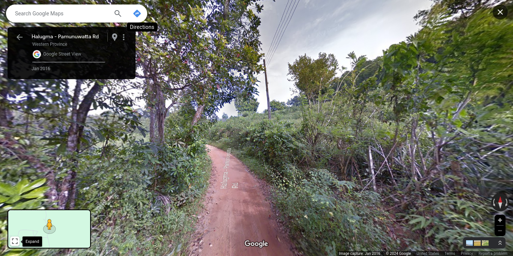

## Sainthamaruthu 01

**Sainthamaruthu 01** Grama Niladhari Division, **Sainthamaruthu** Divisional Secretariat Division, **Ampara** District, **Eastern** Province

**Kalmunai** Polling Division, **Digamadulla** Electoral District

Population: 1,938 (2012)

(**LK-5225005**/KP/53)

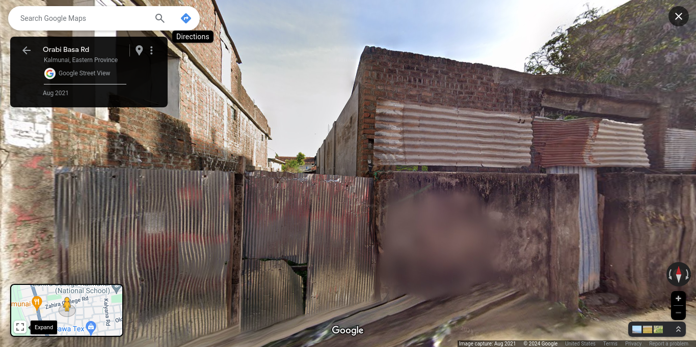

## Udahamulla

**Udahamulla** Grama Niladhari Division, **Panadura** Divisional Secretariat Division, **Kalutara** District, **Western** Province

**Panadura** Polling Division, **Kalutara** Electoral District

Population: 1,731 (2012)

(**LK-1303150**/682)

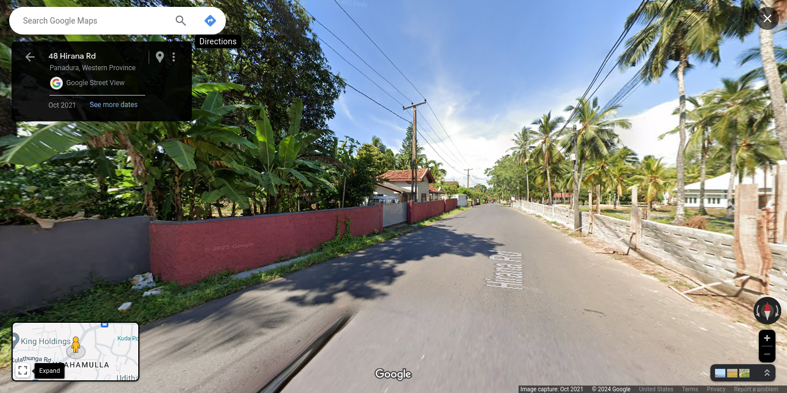

## Kaluwamodara North

**Kaluwamodara North** Grama Niladhari Division, **Beruwala** Divisional Secretariat Division, **Kalutara** District, **Western** Province

**Beruwala** Polling Division, **Kalutara** Electoral District

Population: 1,201 (2012)

(**LK-1324310**/762A)

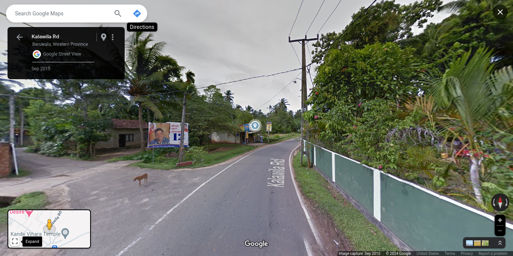

## Kaldemulla

**Kaldemulla** Grama Niladhari Division, **Moratuwa** Divisional Secretariat Division, **Colombo** District, **Western** Province

**Moratuwa** Polling Division, **Colombo** Electoral District

Population: 4,805 (2012)

(**LK-1133010**/548)

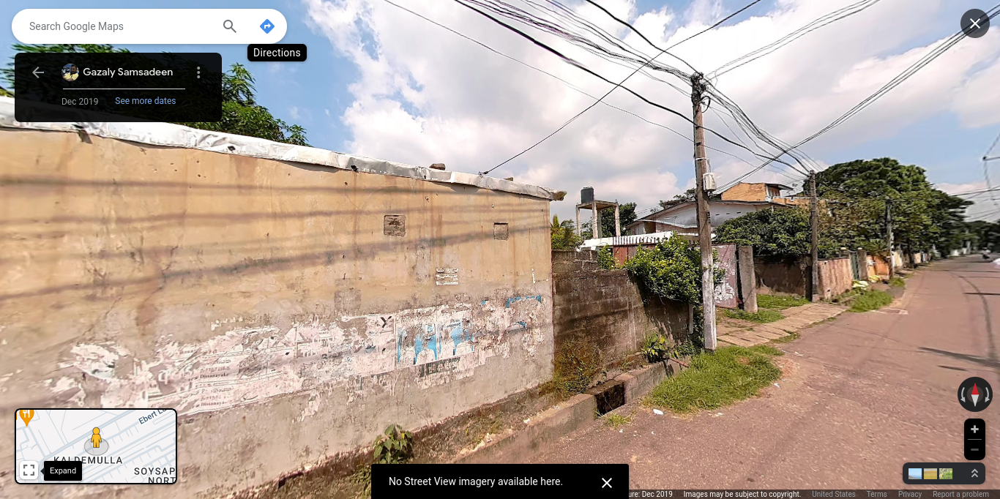

## Abhayapura

**Abhayapura** Grama Niladhari Division, **Padaviya** Divisional Secretariat Division, **Anuradhapura** District, **North Central** Province

**Medawachchiya** Polling Division, **Anuradhapura** Electoral District

Population: 1,779 (2012)

(**LK-7103015**/9)

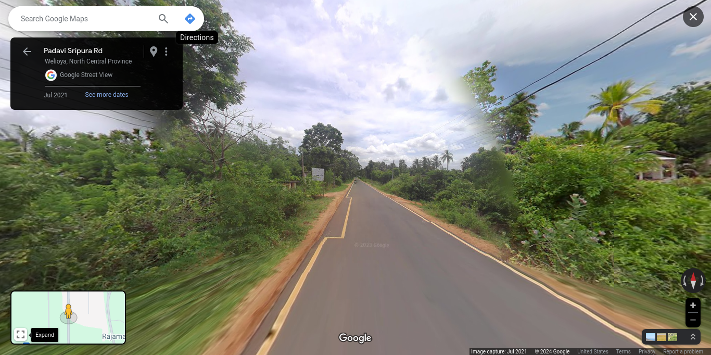

## Ankumbura North

**Ankumbura North** Grama Niladhari Division, **Pujapitiya** Divisional Secretariat Division, **Kandy** District, **Central** Province

**Harispattuwa** Polling Division, **Kandy** Electoral District

Population: 1,085 (2012)

(**LK-2106045**/533)

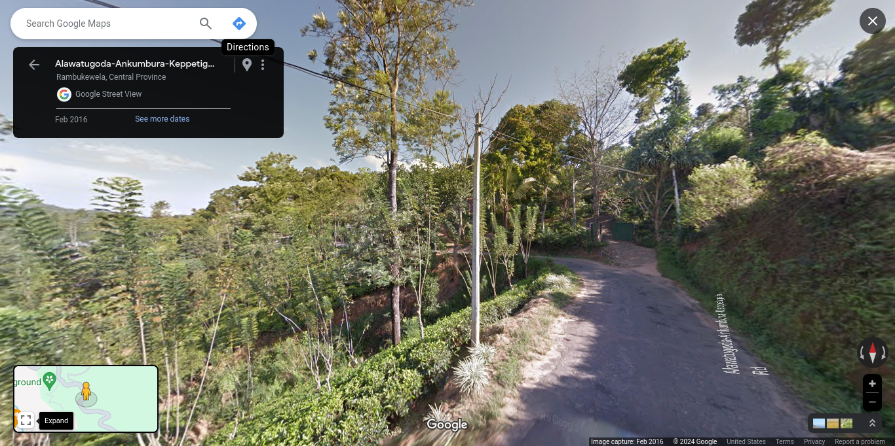

## Ruwan Ella

**Ruwan Ella** Grama Niladhari Division, **Matara Four Gravets** Divisional Secretariat Division, **Matara** District, **Southern** Province

**Matara** Polling Division, **Matara** Electoral District

Population: 1,699 (2012)

(**LK-3242140**/428A)

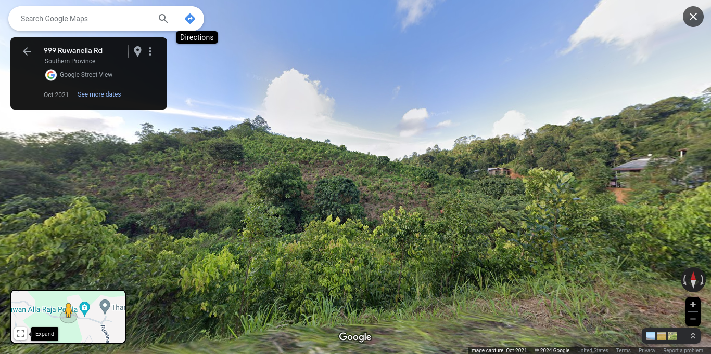

## Oddamavadi 02

**Oddamavadi 02** Grama Niladhari Division, **Koralai Pattu  West (Oddamavadi)** Divisional Secretariat Division, **Batticaloa** District, **Eastern** Province

**Kalkudah** Polling Division, **Batticaloa** Electoral District

Population: 2,238 (2012)

(**LK-5106020**/208C)

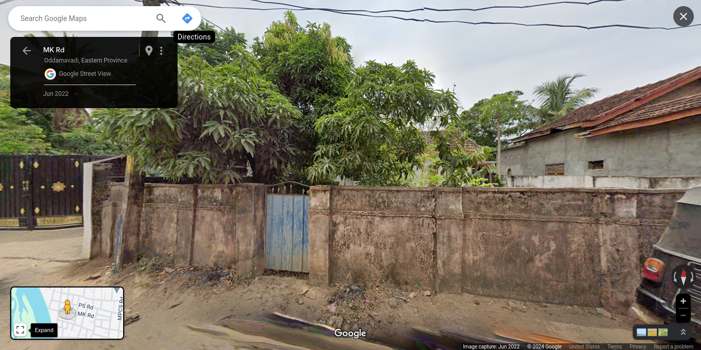

## Nishshankamalla Pedesa

**Nishshankamalla Pedesa** Grama Niladhari Division, **Thamankaduwa** Divisional Secretariat Division, **Polonnaruwa** District, **North Central** Province

**Polonnaruwa** Polling Division, **Polonnaruwa** Electoral District

Population: 1,782 (2012)

(**LK-7215240**/170)

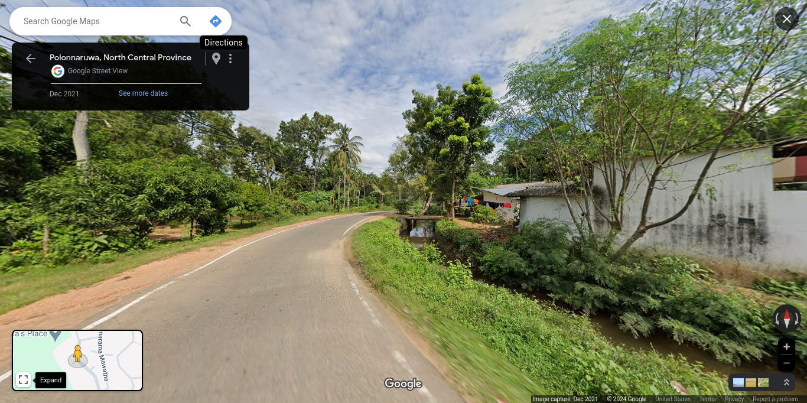

## Aluthgamgoda

**Aluthgamgoda** Grama Niladhari Division, **Mathugama** Divisional Secretariat Division, **Kalutara** District, **Western** Province

**Mathugama** Polling Division, **Kalutara** Electoral District

Population: 1,608 (2012)

(**LK-1330100**/796A)

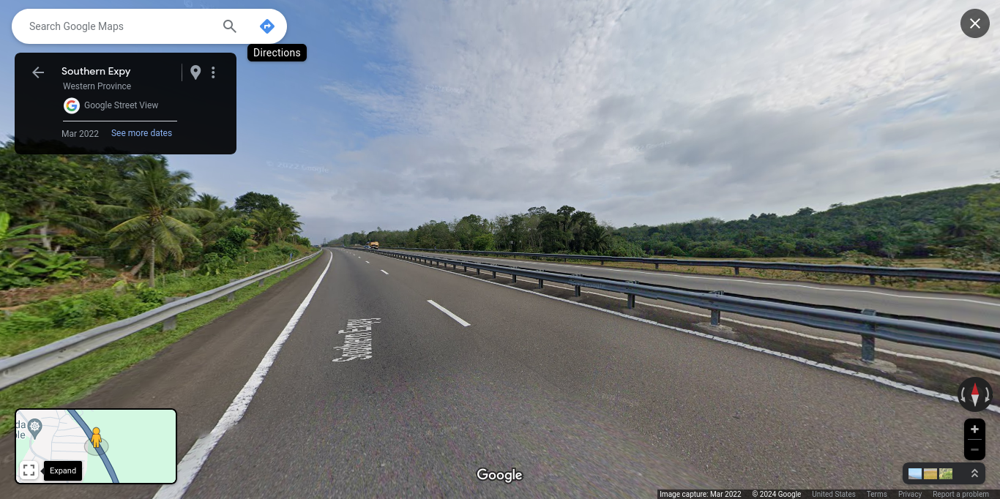

## Kinigama

**Kinigama** Grama Niladhari Division, **Mahara** Divisional Secretariat Division, **Gampaha** District, **Western** Province

**Mahara** Polling Division, **Gampaha** Electoral District

Population: 1,841 (2012)

(**LK-1233015**/304)

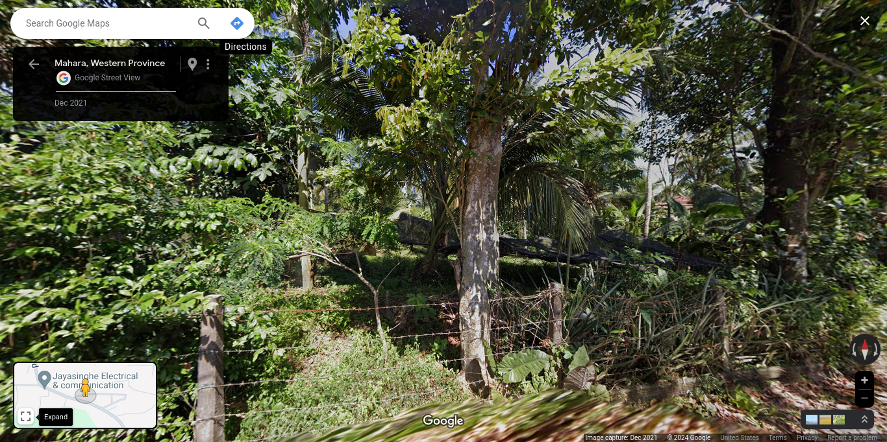

## Bandigoda

**Bandigoda** Grama Niladhari Division, **Ja-Ela** Divisional Secretariat Division, **Gampaha** District, **Western** Province

**Ja Ela** Polling Division, **Gampaha** Electoral District

Population: 3,352 (2012)

(**LK-1221080**/211B)

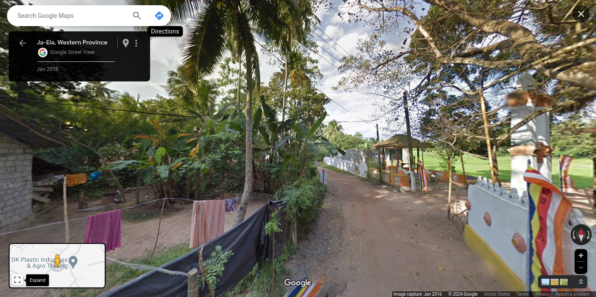

## Hapugoda West

**Hapugoda West** Grama Niladhari Division, **Ja-Ela** Divisional Secretariat Division, **Gampaha** District, **Western** Province

**Ja Ela** Polling Division, **Gampaha** Electoral District

Population: 1,648 (2012)

(**LK-1221150**/185A)

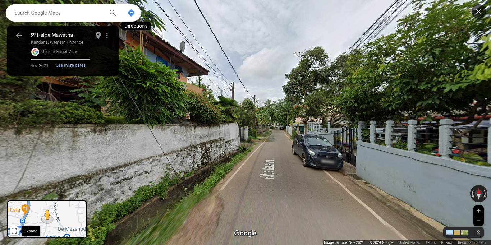

## Walathara

**Walathara** Grama Niladhari Division, **Beruwala** Divisional Secretariat Division, **Kalutara** District, **Western** Province

**Beruwala** Polling Division, **Kalutara** Electoral District

Population: 3,267 (2012)

(**LK-1324190**/750)

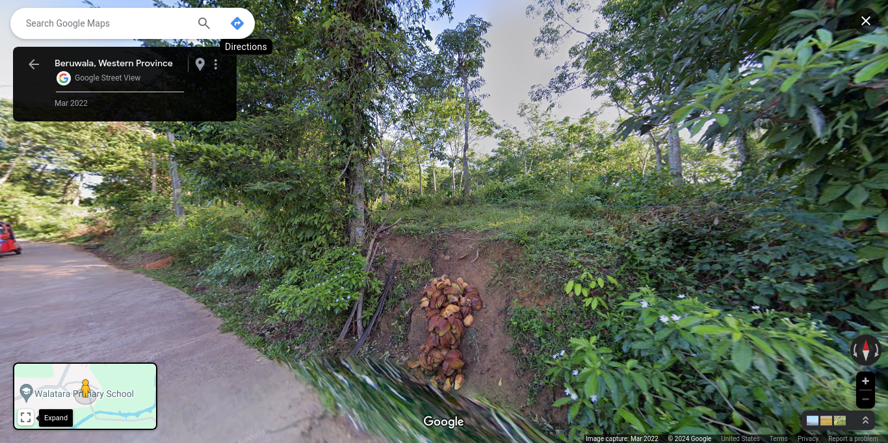

## Block 'J' East 02

**Block 'J' East 02** Grama Niladhari Division, **Samanthurai** Divisional Secretariat Division, **Ampara** District, **Eastern** Province

**Samanthurai** Polling Division, **Digamadulla** Electoral District

Population: 1,368 (2012)

(**LK-5218190**/79K)

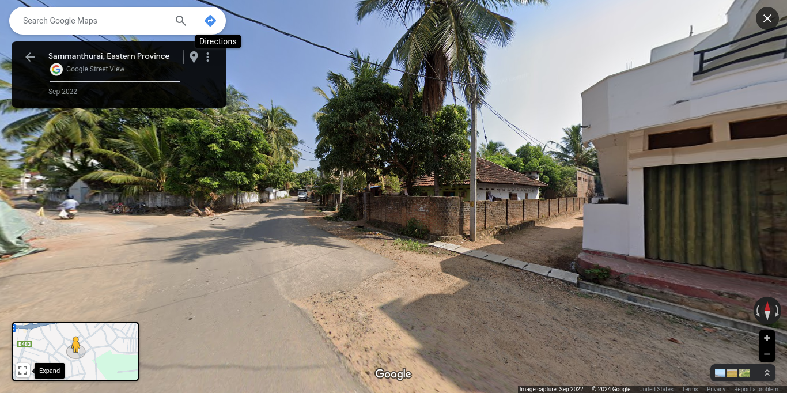

## Makandana East

**Makandana East** Grama Niladhari Division, **Kesbewa** Divisional Secretariat Division, **Colombo** District, **Western** Province

**Kesbewa** Polling Division, **Colombo** Electoral District

Population: 4,947 (2012)

(**LK-1136280**/569)

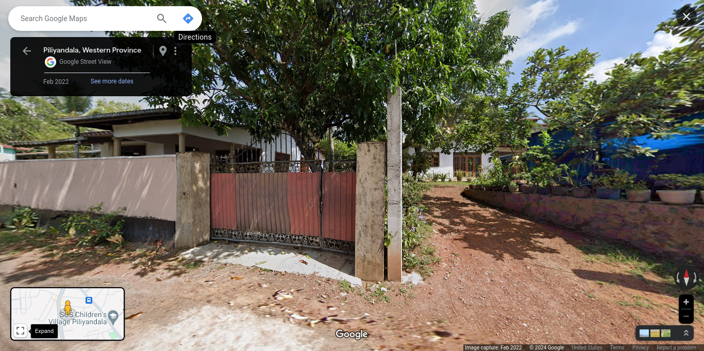

## Erukkalampiddy Centre

**Erukkalampiddy Centre** Grama Niladhari Division, **Mannar Town** Divisional Secretariat Division, **Mannar** District, **Northern** Province

**Mannar** Polling Division, **Vanni** Electoral District

Population: 513 (2012)

(**LK-4203095**/MN/67)

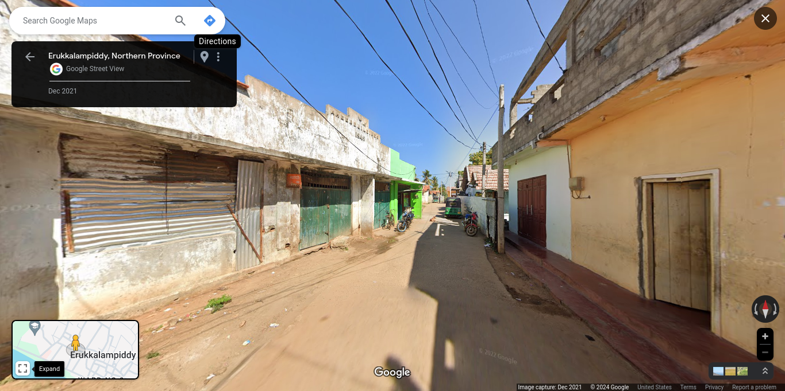

## Methagama

**Methagama** Grama Niladhari Division, **Kothmale** Divisional Secretariat Division, **Nuwara Eliya** District, **Central** Province

**Kothmale** Polling Division, **Nuwara-Eliya** Electoral District

Population: 660 (2012)

(**LK-2303335**/466)

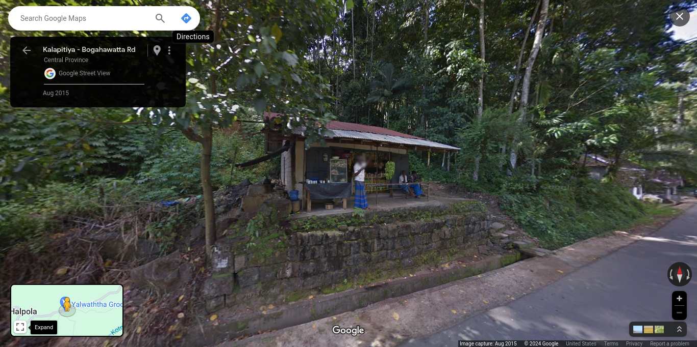

## Wahumuwa

**Wahumuwa** Grama Niladhari Division, **Kuliyapitiya West** Divisional Secretariat Division, **Kurunegala** District, **North Western** Province

**Kuliyapitiya** Polling Division, **Kurunegala** Electoral District

Population: 1,360 (2012)

(**LK-6172175**/1144)

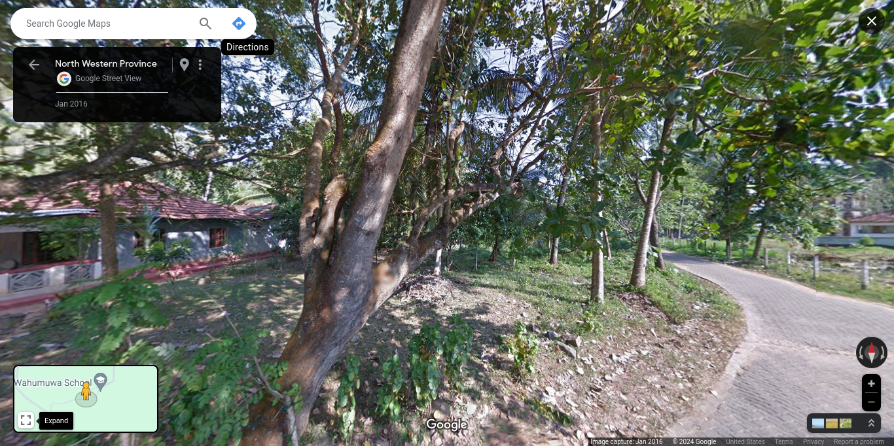

## Uragasgoda

**Uragasgoda** Grama Niladhari Division, **Habaraduwa** Divisional Secretariat Division, **Galle** District, **Southern** Province

**Habaraduwa** Polling Division, **Galle** Electoral District

Population: 816 (2012)

(**LK-3154090**/144F)

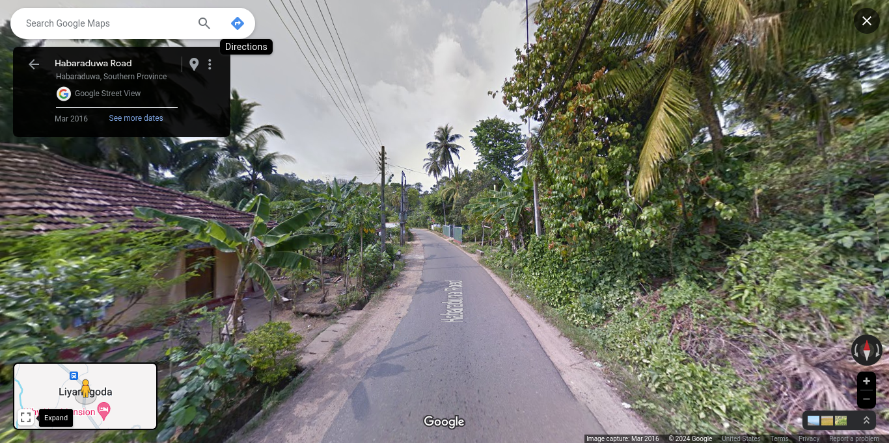

## Ganegama

**Ganegama** Grama Niladhari Division, **Beruwala** Divisional Secretariat Division, **Kalutara** District, **Western** Province

**Beruwala** Polling Division, **Kalutara** Electoral District

Population: 1,374 (2012)

(**LK-1324395**/763)

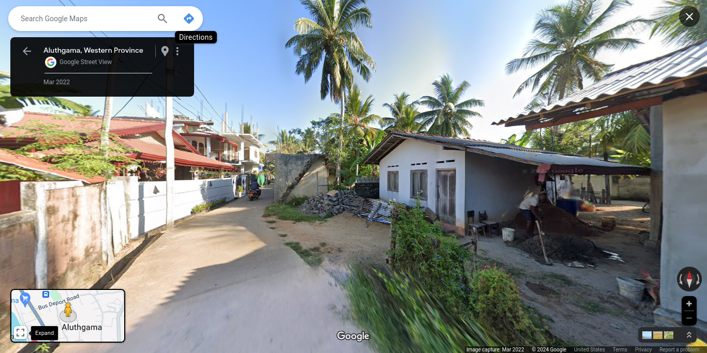

## Welhena

**Welhena** Grama Niladhari Division, **Minuwangoda** Divisional Secretariat Division, **Gampaha** District, **Western** Province

**Minuwangoda** Polling Division, **Gampaha** Electoral District

Population: 1,442 (2012)

(**LK-1215420**/117)

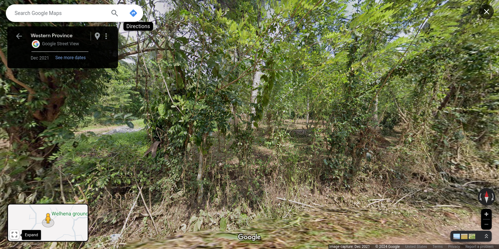

## Eliyadivulwewa

**Eliyadivulwewa** Grama Niladhari Division, **Thalawa** Divisional Secretariat Division, **Anuradhapura** District, **North Central** Province

**Mihinthale** Polling Division, **Anuradhapura** Electoral District

Population: 1,779 (2012)

(**LK-7148090**/388)

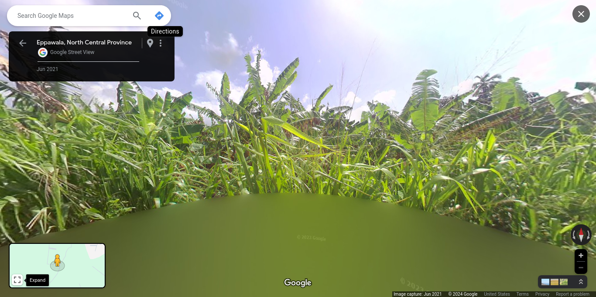

## Karaitheevu 02

**Karaitheevu 02** Grama Niladhari Division, **Karaitheevu** Divisional Secretariat Division, **Ampara** District, **Eastern** Province

**Pothuvil** Polling Division, **Digamadulla** Electoral District

Population: 557 (2012)

(**LK-5227035**/45)

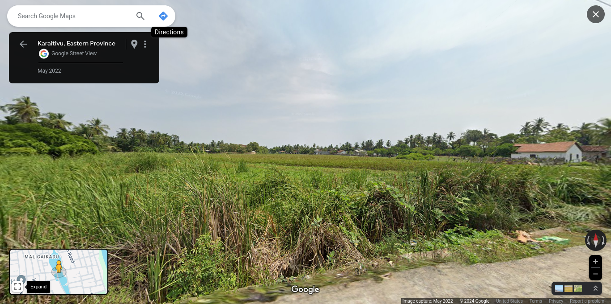

## Maussagolla West

**Maussagolla West** Grama Niladhari Division, **Passara** Divisional Secretariat Division, **Badulla** District, **Uva** Province

**Passara** Polling Division, **Badulla** Electoral District

Population: 1,318 (2012)

(**LK-8118165**/87A)

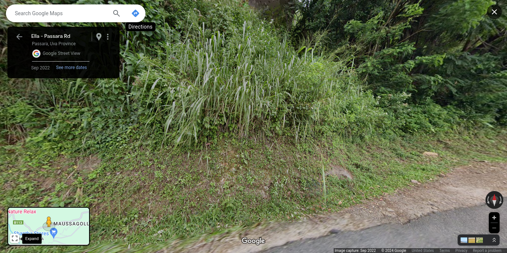

## Kurukulawa North

**Kurukulawa North** Grama Niladhari Division, **Wattala** Divisional Secretariat Division, **Gampaha** District, **Western** Province

**Wattala** Polling Division, **Gampaha** Electoral District

Population: 2,501 (2012)

(**LK-1218100**/250)

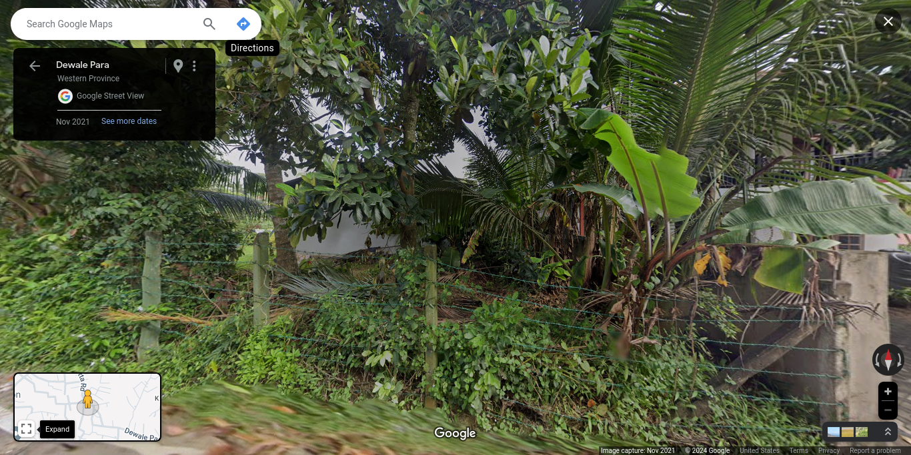

## Mawanella

**Mawanella** Grama Niladhari Division, **Mawanella** Divisional Secretariat Division, **Kegalle** District, **Sabaragamuwa** Province

**Mawanella** Polling Division, **Kegalle** Electoral District

Population: 1,293 (2012)

(**LK-9206135**/19B)

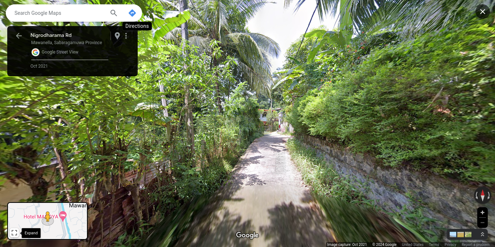

## Tholpuram  West

**Tholpuram  West** Grama Niladhari Division, **Valikamam West (Chankanai)** Divisional Secretariat Division, **Jaffna** District, **Northern** Province

**Vaddukoddai** Polling Division, **Jaffna** Electoral District

Population: 2,397 (2012)

(**LK-4106065**/J/169)

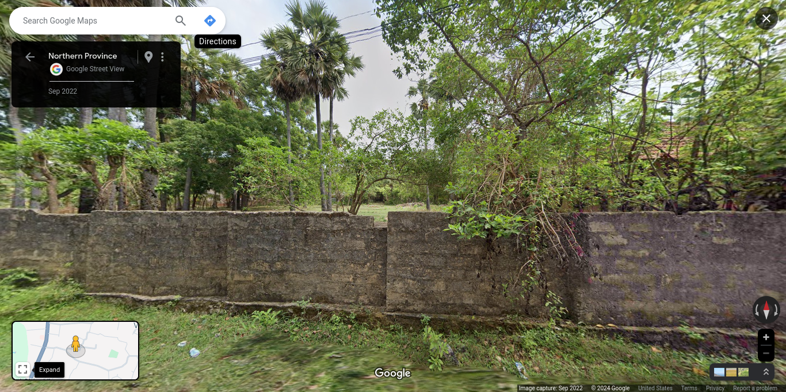

## Millagoda

**Millagoda** Grama Niladhari Division, **Nikaweratiya** Divisional Secretariat Division, **Kurunegala** District, **North Western** Province

**Nikaweratiya** Polling Division, **Kurunegala** Electoral District

Population: 1,531 (2012)

(**LK-6121185**/297)

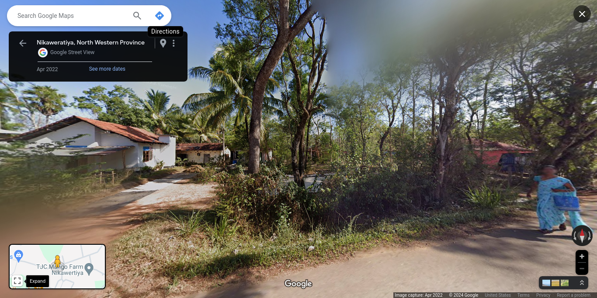

## Thirunagar North

**Thirunagar North** Grama Niladhari Division, **Karachchi** Divisional Secretariat Division, **Kilinochchi** District, **Northern** Province

**Kilinochchi** Polling Division, **Jaffna** Electoral District

Population: 1,109 (2012)

(**LK-4509145**/KN/28)

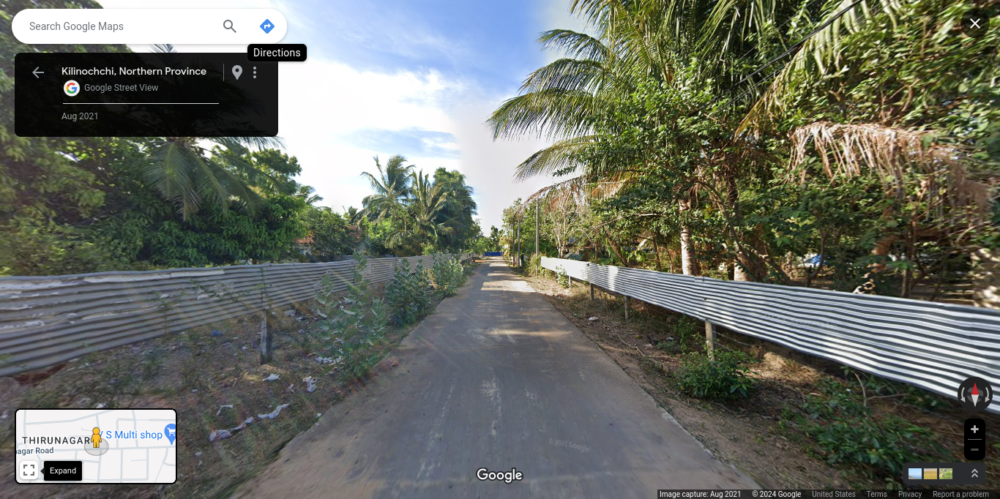

## Madiwela

**Madiwela** Grama Niladhari Division, **Maharagama** Divisional Secretariat Division, **Colombo** District, **Western** Province

**Maharagama** Polling Division, **Colombo** Electoral District

Population: 6,244 (2012)

(**LK-1121015**/524)

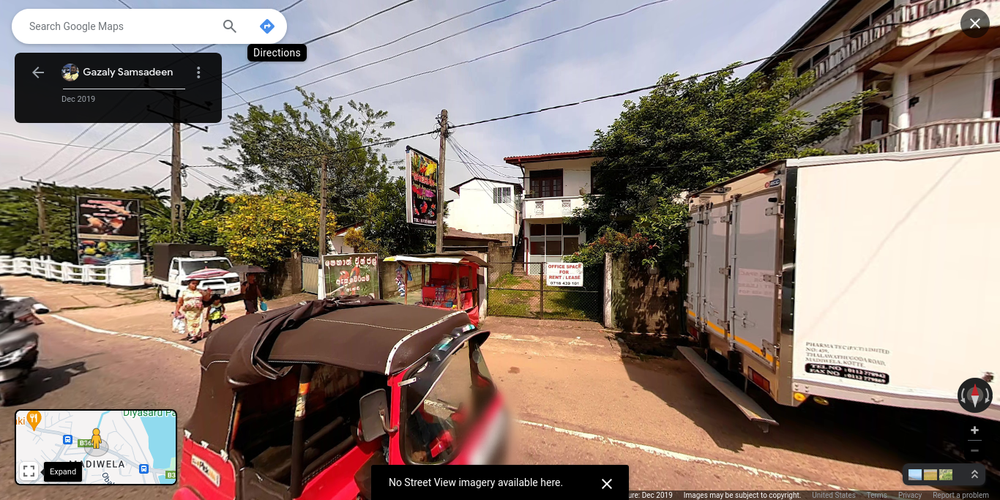

## Akkaraipattu 19

**Akkaraipattu 19** Grama Niladhari Division, **Akkaraipattu** Divisional Secretariat Division, **Ampara** District, **Eastern** Province

**Samanthurai** Polling Division, **Digamadulla** Electoral District

Population: 1,037 (2012)

(**LK-5236125**/AP/18/19/20)

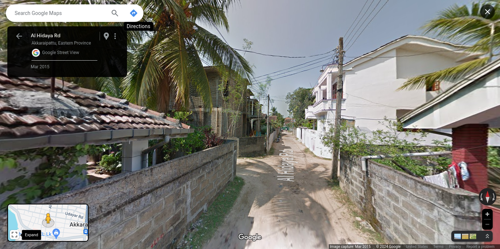

## Welipillewa

**Welipillewa** Grama Niladhari Division, **Kaduwela** Divisional Secretariat Division, **Colombo** District, **Western** Province

**Kaduwela** Polling Division, **Colombo** Electoral District

Population: 2,623 (2012)

(**LK-1109110**/480)

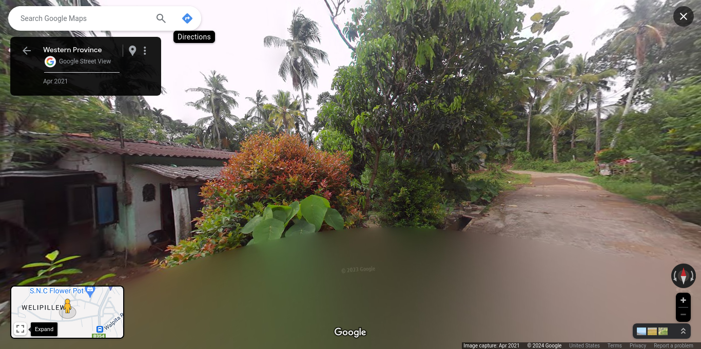

## Bollatha West

**Bollatha West** Grama Niladhari Division, **Gampaha** Divisional Secretariat Division, **Gampaha** District, **Western** Province

**Gampaha** Polling Division, **Gampaha** Electoral District

Population: 1,243 (2012)

(**LK-1224205**/209C)

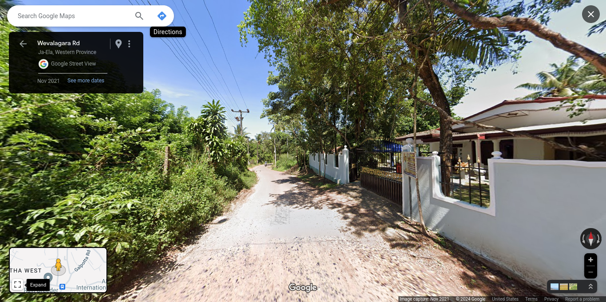

## Meeruppa

**Meeruppa** Grama Niladhari Division, **Pathahewaheta** Divisional Secretariat Division, **Kandy** District, **Central** Province

**Hewaheta** Polling Division, **Kandy** Electoral District

Population: 1,047 (2012)

(**LK-2145285**/1009)

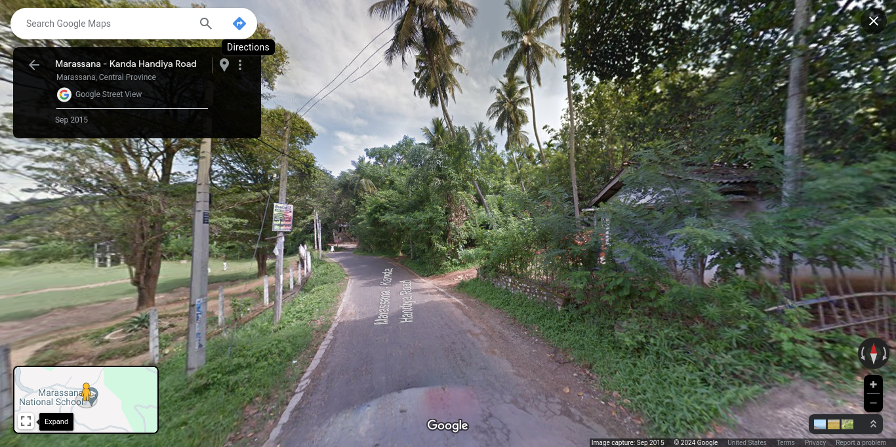

## Karuvelankandal

**Karuvelankandal** Grama Niladhari Division, **Oddusuddan** Divisional Secretariat Division, **Mullaitivu** District, **Northern** Province

**Mullaitivu** Polling Division, **Vanni** Electoral District

Population: 371 (2012)

(**LK-4412025**/MU/66)

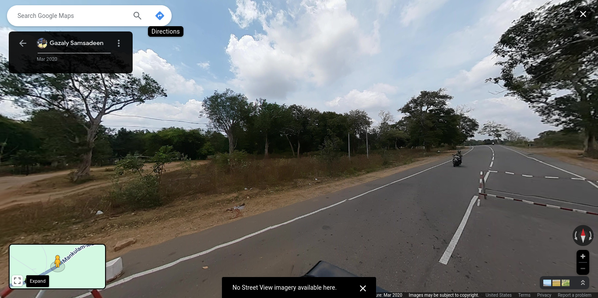

## Pothuwewa

**Pothuwewa** Grama Niladhari Division, **Wariyapola** Divisional Secretariat Division, **Kurunegala** District, **North Western** Province

**Wariyapola** Polling Division, **Kurunegala** Electoral District

Population: 538 (2012)

(**LK-6136130**/1256)

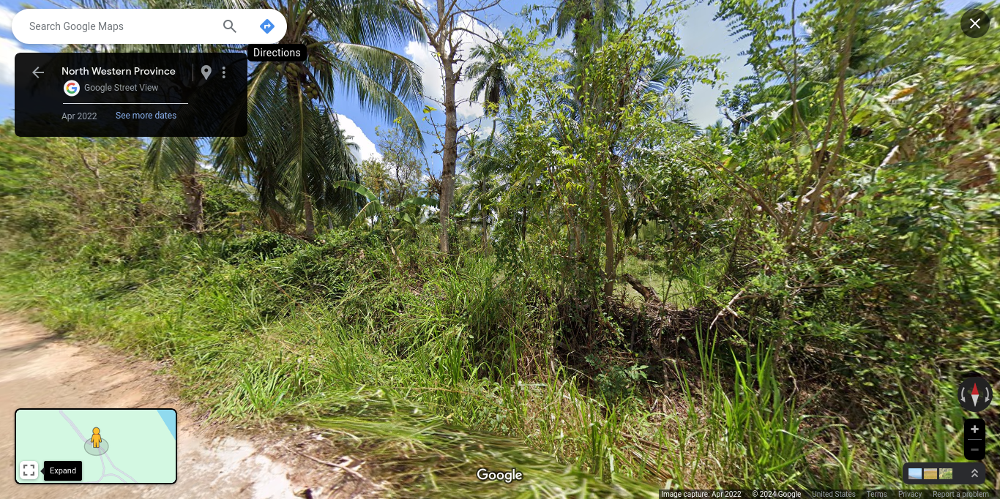

## Gan Imayaya

**Gan Imayaya** Grama Niladhari Division, **Naula** Divisional Secretariat Division, **Matale** District, **Central** Province

**Laggala** Polling Division, **Matale** Electoral District

Population: 543 (2012)

(**LK-2209155**/E412E)

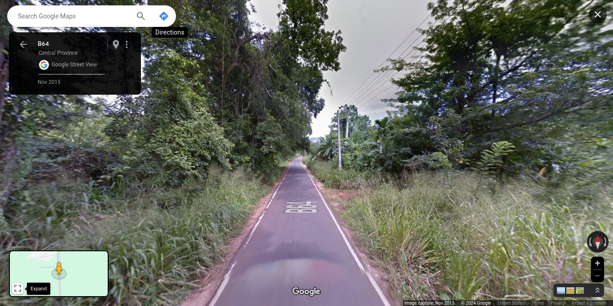

## Veeramunai 03

**Veeramunai 03** Grama Niladhari Division, **Samanthurai** Divisional Secretariat Division, **Ampara** District, **Eastern** Province

**Samanthurai** Polling Division, **Digamadulla** Electoral District

Population: 521 (2012)

(**LK-5218110**/92I)

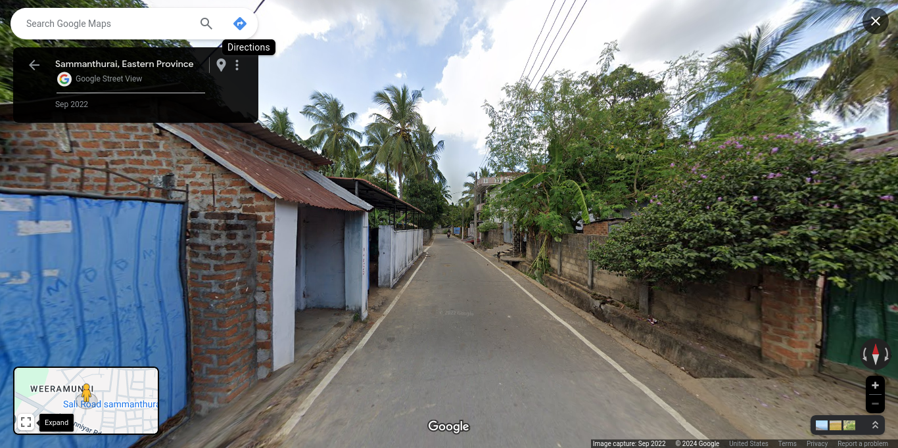

## Bowatta

**Bowatta** Grama Niladhari Division, **Pannala** Divisional Secretariat Division, **Kurunegala** District, **North Western** Province

**Katugampola** Polling Division, **Kurunegala** Electoral District

Population: 1,326 (2012)

(**LK-6178185**/1533)

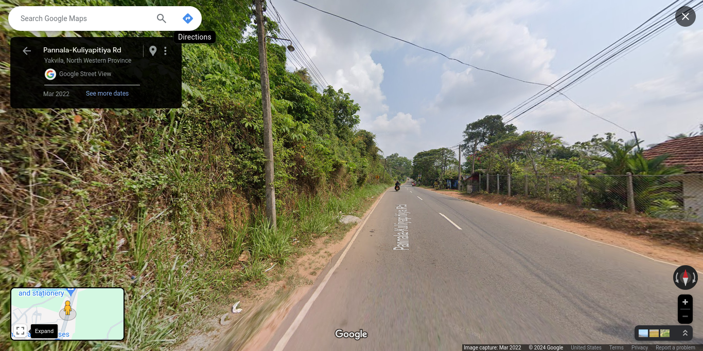

## Siyambalape Watta

**Siyambalape Watta** Grama Niladhari Division, **Biyagama** Divisional Secretariat Division, **Gampaha** District, **Western** Province

**Biyagama** Polling Division, **Gampaha** Electoral District

Population: 3,965 (2012)

(**LK-1239060**/274C)

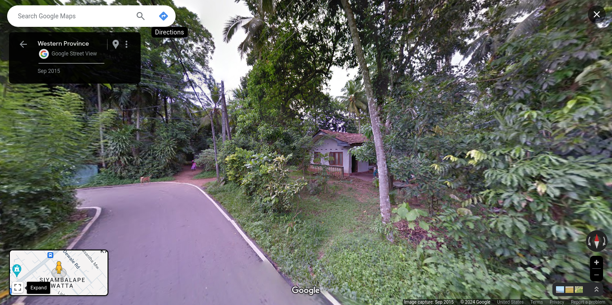

## Ihala Biyanvila Central

**Ihala Biyanvila Central** Grama Niladhari Division, **Biyagama** Divisional Secretariat Division, **Gampaha** District, **Western** Province

**Biyagama** Polling Division, **Gampaha** Electoral District

Population: 5,003 (2012)

(**LK-1239015**/269B)

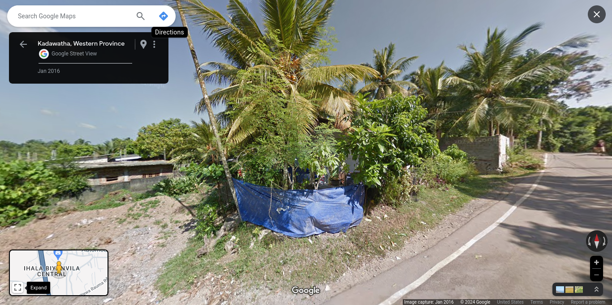

## Mancholai

**Mancholai** Grama Niladhari Division, **Kinniya** Divisional Secretariat Division, **Trincomalee** District, **Eastern** Province

**Muttur** Polling Division, **Trincomalee** Electoral District

Population: 2,603 (2012)

(**LK-5324015**/225C)

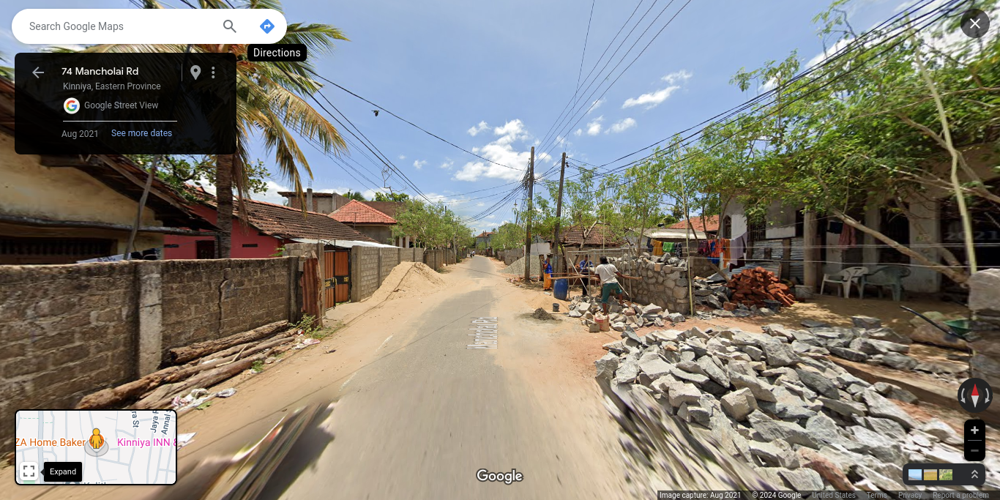

## Ethulkotte West

**Ethulkotte West** Grama Niladhari Division, **Sri Jayawardanapura Kotte** Divisional Secretariat Division, **Colombo** District, **Western** Province

**Kotte** Polling Division, **Colombo** Electoral District

Population: 3,371 (2012)

(**LK-1124040**/521A)

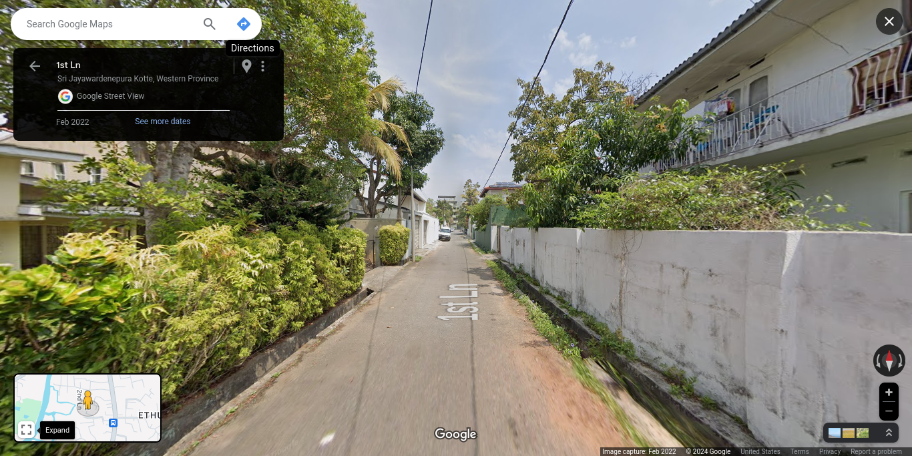

## Uduwa South

**Uduwa South** Grama Niladhari Division, **Horana** Divisional Secretariat Division, **Kalutara** District, **Western** Province

**Horana** Polling Division, **Kalutara** Electoral District

Population: 1,828 (2012)

(**LK-1309190**/614A)

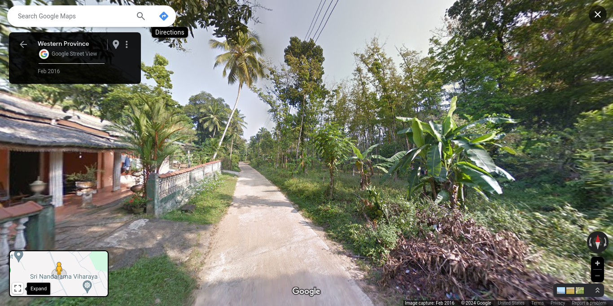

## Alagollewa

**Alagollewa** Grama Niladhari Division, **Thirappane** Divisional Secretariat Division, **Anuradhapura** District, **North Central** Province

**Mihinthale** Polling Division, **Anuradhapura** Electoral District

Population: 694 (2012)

(**LK-7151185**/543)

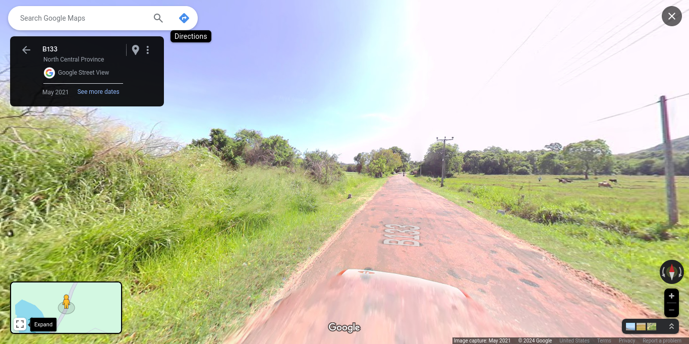

## Senkadagala

**Senkadagala** Grama Niladhari Division, **Kandy Four Gravets & Gangawata Korale** Divisional Secretariat Division, **Kandy** District, **Central** Province

**Senkadagala** Polling Division, **Kandy** Electoral District

Population: 2,065 (2012)

(**LK-2130020**/251)

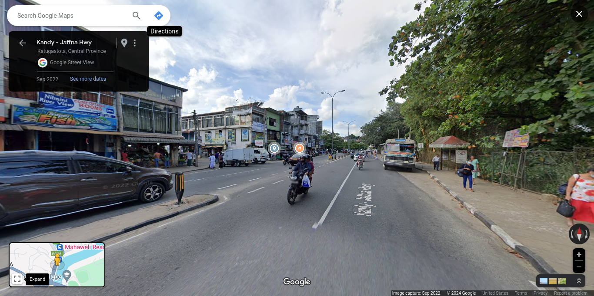

## Keraminiya

**Keraminiya** Grama Niladhari Division, **Ambalangoda** Divisional Secretariat Division, **Galle** District, **Southern** Province

**Ambalangoda** Polling Division, **Galle** Electoral District

Population: 1,704 (2012)

(**LK-3133030**/86B)

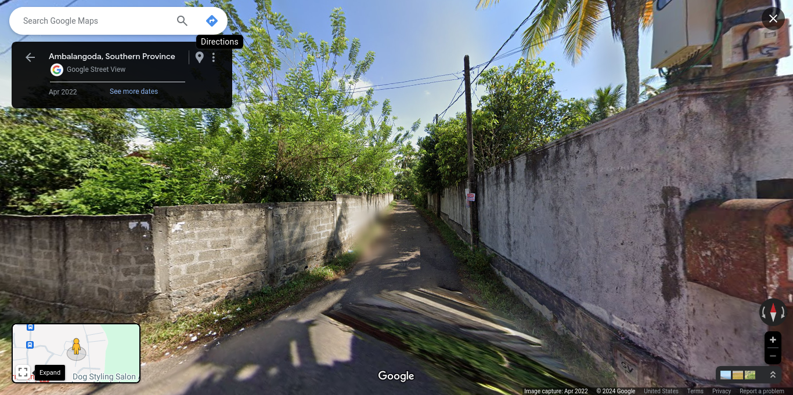

## Morukkuliya

**Morukkuliya** Grama Niladhari Division, **Dankotuwa** Divisional Secretariat Division, **Puttalam** District, **North Western** Province

**Wennappuwa** Polling Division, **Puttalam** Electoral District

Population: 2,437 (2012)

(**LK-6248205**/473A)

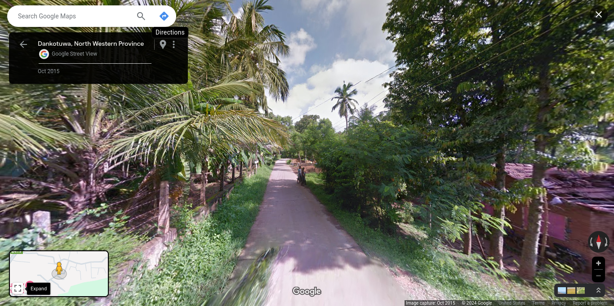

## Kovinna

**Kovinna** Grama Niladhari Division, **Katana** Divisional Secretariat Division, **Gampaha** District, **Western** Province

**Katana** Polling Division, **Gampaha** Electoral District

Population: 4,653 (2012)

(**LK-1206195**/151)

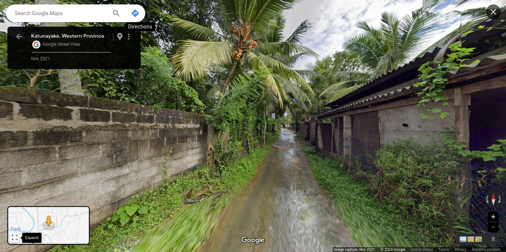

## Madawala North

**Madawala North** Grama Niladhari Division, **Weerambugedara** Divisional Secretariat Division, **Kurunegala** District, **North Western** Province

**Polgahawela** Polling Division, **Kurunegala** Electoral District

Population: 544 (2012)

(**LK-6166050**/871)

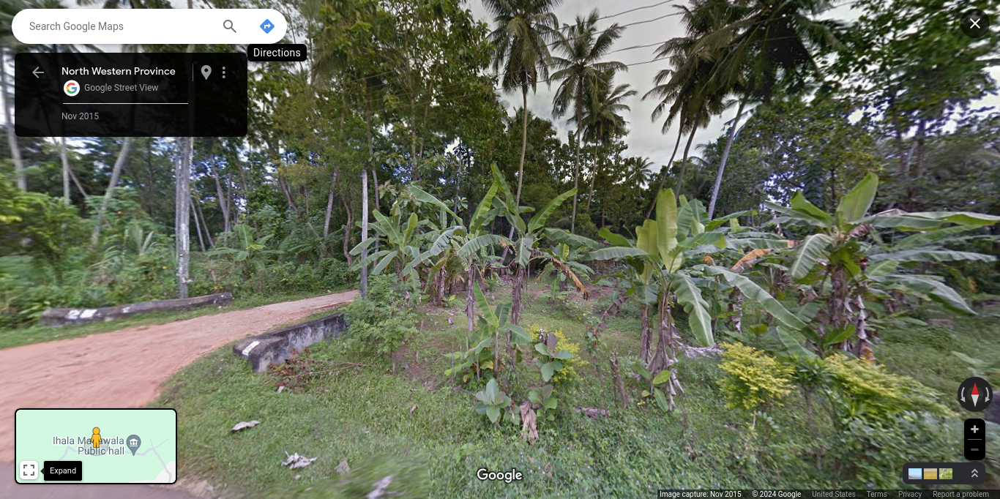

## Rajasinghagama

**Rajasinghagama** Grama Niladhari Division, **Kolonnawa** Divisional Secretariat Division, **Colombo** District, **Western** Province

**Kolonnawa** Polling Division, **Colombo** Electoral District

Population: 6,442 (2012)

(**LK-1106165**/502C)

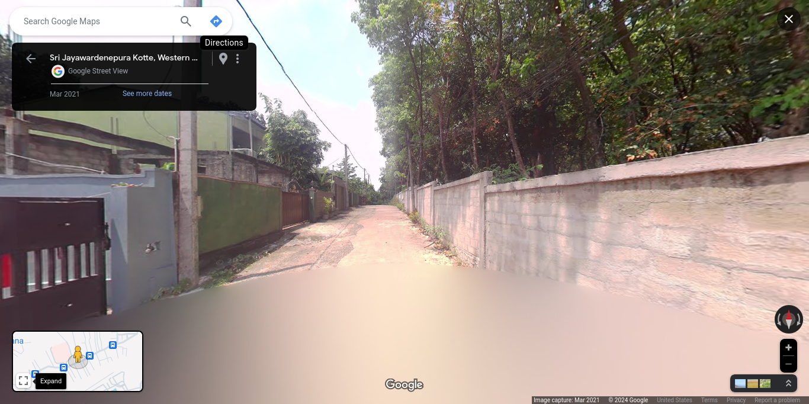

## Ethulkotte

**Ethulkotte** Grama Niladhari Division, **Sri Jayawardanapura Kotte** Divisional Secretariat Division, **Colombo** District, **Western** Province

**Kotte** Polling Division, **Colombo** Electoral District

Population: 5,929 (2012)

(**LK-1124045**/521)

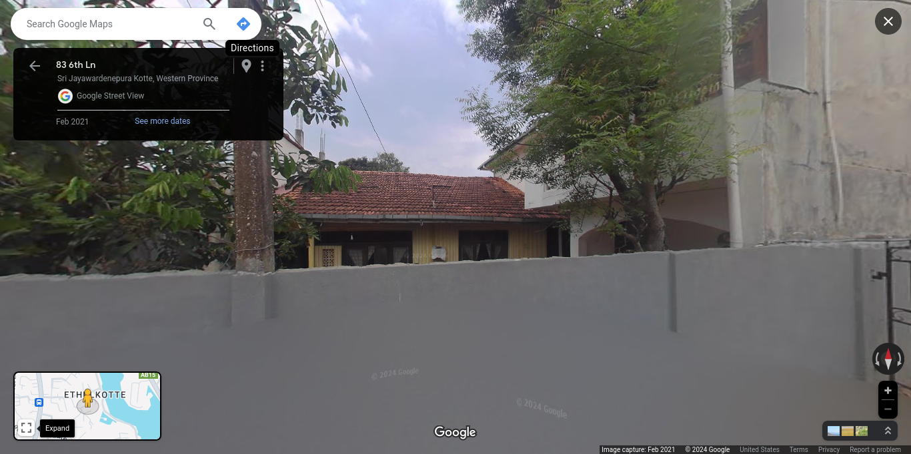

## Sevanagala

**Sevanagala** Grama Niladhari Division, **Sevanagala** Divisional Secretariat Division, **Moneragala** District, **Uva** Province

**Wellawaya** Polling Division, **Moneragala** Electoral District

Population: 4,795 (2012)

(**LK-8233035**/149E/1)

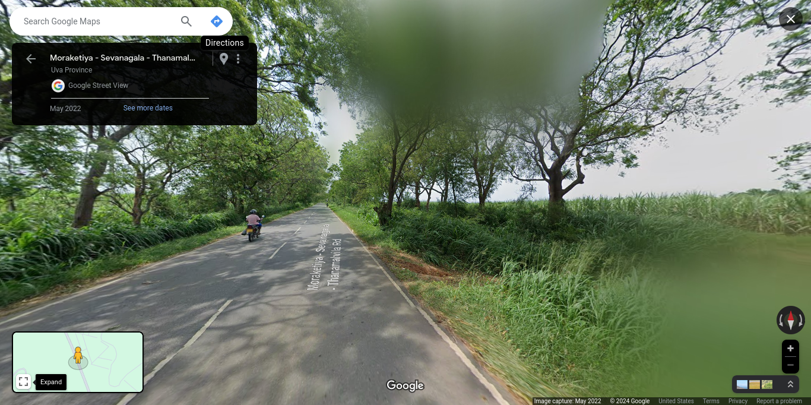

## Kaluwana North

**Kaluwana North** Grama Niladhari Division, **Pujapitiya** Divisional Secretariat Division, **Kandy** District, **Central** Province

**Harispattuwa** Polling Division, **Kandy** Electoral District

Population: 560 (2012)

(**LK-2106335**/556)

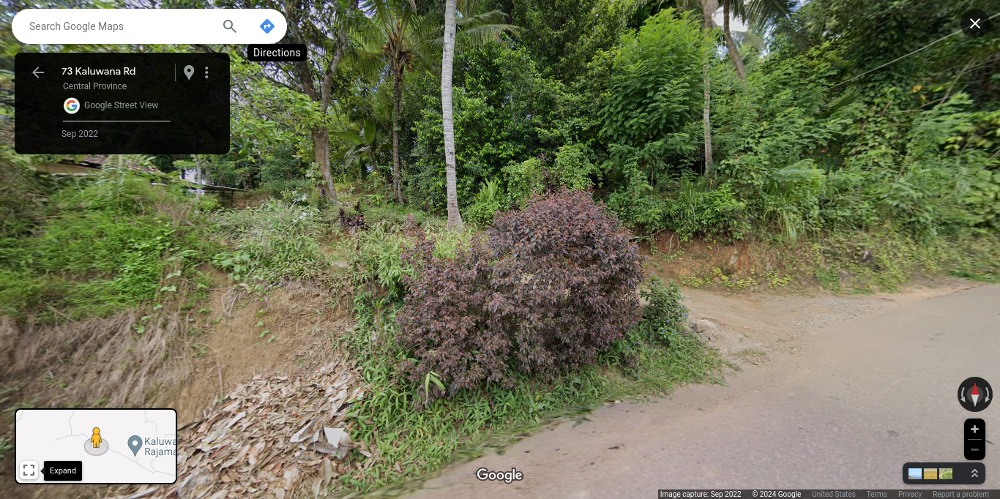

## Thalawattegedara

**Thalawattegedara** Grama Niladhari Division, **Polgahawela** Divisional Secretariat Division, **Kurunegala** District, **North Western** Province

**Polgahawela** Polling Division, **Kurunegala** Electoral District

Population: 630 (2012)

(**LK-6187170**/896)

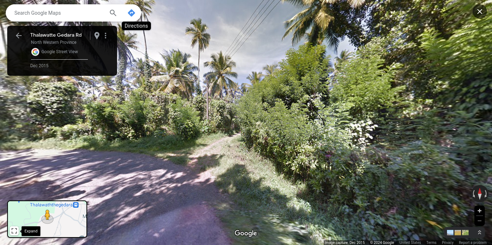

## Puhulyaya

**Puhulyaya** Grama Niladhari Division, **Ambalantota** Divisional Secretariat Division, **Hambantota** District, **Southern** Province

**Tangalle** Polling Division, **Hambantota** Electoral District

Population: 1,322 (2012)

(**LK-3315255**/146)

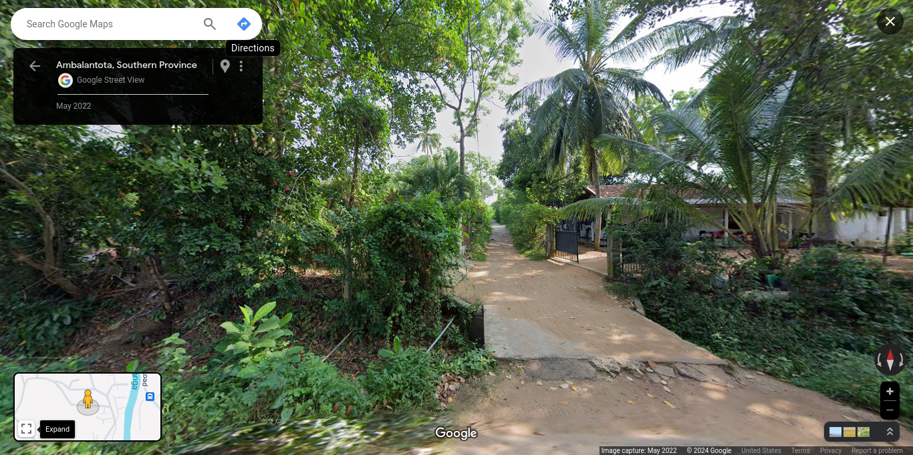

## Katiyawa Track 09

**Katiyawa Track 09** Grama Niladhari Division, **Thalawa** Divisional Secretariat Division, **Anuradhapura** District, **North Central** Province

**Kalawewa** Polling Division, **Anuradhapura** Electoral District

Population: 1,803 (2012)

(**LK-7148160**/384)

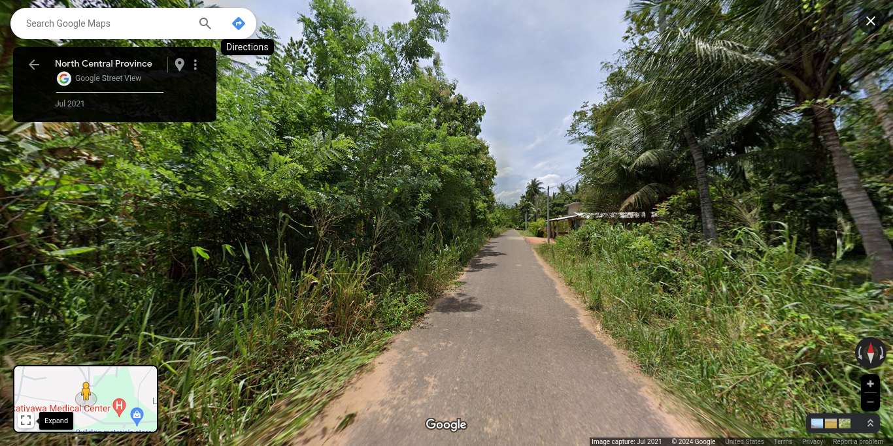

## Galbada

**Galbada** Grama Niladhari Division, **Bentota** Divisional Secretariat Division, **Galle** District, **Southern** Province

**Bentara Elpitiya** Polling Division, **Galle** Electoral District

Population: 978 (2012)

(**LK-3103065**/8A)

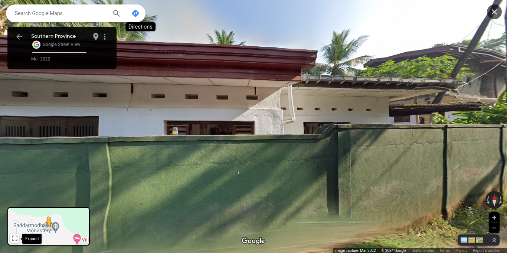

## Udakanampella South

**Udakanampella South** Grama Niladhari Division, **Dompe** Divisional Secretariat Division, **Gampaha** District, **Western** Province

**Dompe** Polling Division, **Gampaha** Electoral District

Population: 569 (2012)

(**LK-1230425**/424B)

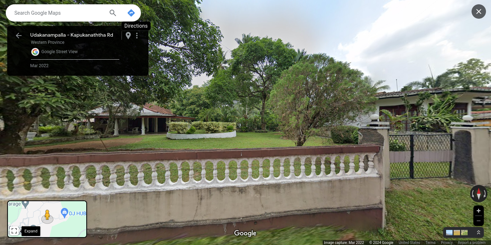

## Galukagama

**Galukagama** Grama Niladhari Division, **Kuruvita** Divisional Secretariat Division, **Ratnapura** District, **Sabaragamuwa** Province

**Ratnapura** Polling Division, **Ratnapura** Electoral District

Population: 2,369 (2012)

(**LK-9106195**/154C)

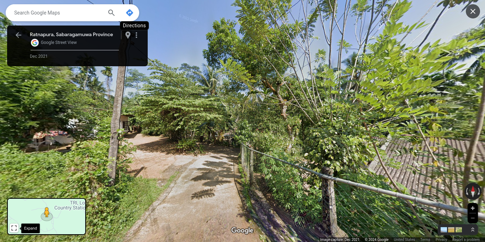

## Kendagolla

**Kendagolla** Grama Niladhari Division, **Alawwa** Divisional Secretariat Division, **Kurunegala** District, **North Western** Province

**Dambadeniya** Polling Division, **Kurunegala** Electoral District

Population: 771 (2012)

(**LK-6184145**/1030)

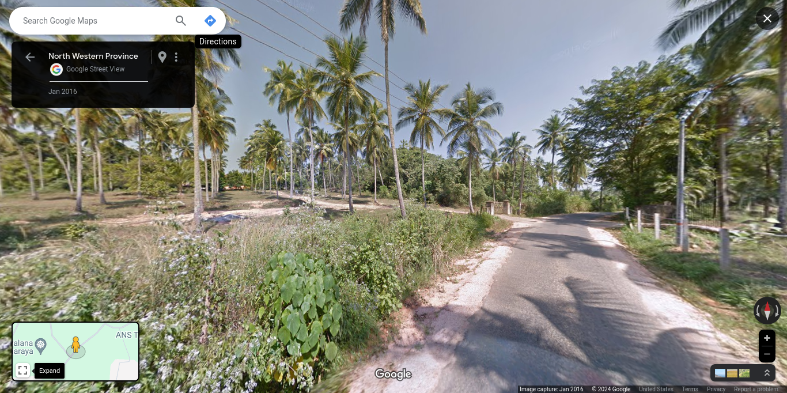

## Pahala Weerakodiyana

**Pahala Weerakodiyana** Grama Niladhari Division, **Udubaddawa** Divisional Secretariat Division, **Kurunegala** District, **North Western** Province

**Bingiriya** Polling Division, **Kurunegala** Electoral District

Population: 998 (2012)

(**LK-6175015**/1471)

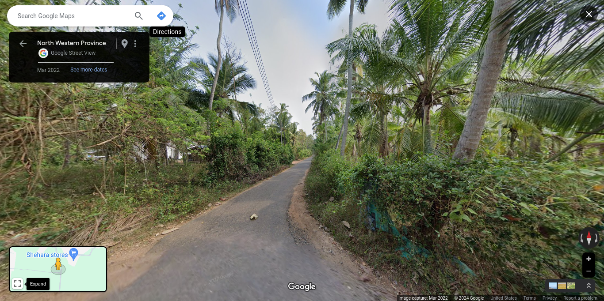

## Indibedda West

**Indibedda West** Grama Niladhari Division, **Moratuwa** Divisional Secretariat Division, **Colombo** District, **Western** Province

**Moratuwa** Polling Division, **Colombo** Electoral District

Population: 4,437 (2012)

(**LK-1133130**/559)

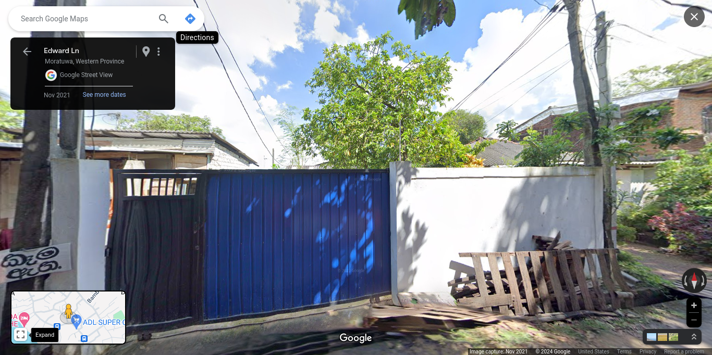

## Pahala Ellewewa

**Pahala Ellewewa** Grama Niladhari Division, **Dimbulagala** Divisional Secretariat Division, **Polonnaruwa** District, **North Central** Province

**Polonnaruwa** Polling Division, **Polonnaruwa** Electoral District

Population: 1,434 (2012)

(**LK-7212135**/215)

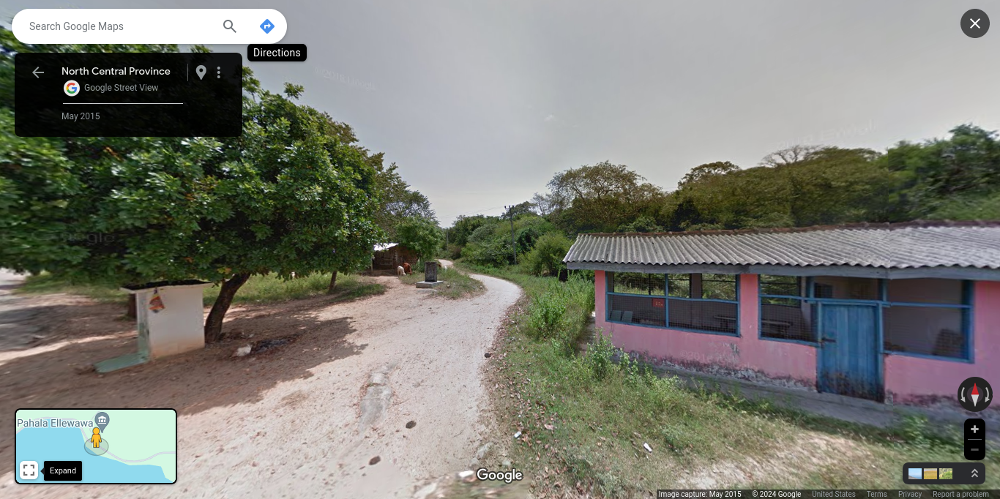

## Kochchikade South

**Kochchikade South** Grama Niladhari Division, **Colombo** Divisional Secretariat Division, **Colombo** District, **Western** Province

**Colombo Central** Polling Division, **Colombo** Electoral District

Population: 7,746 (2012)

(**LK-1103110**/)

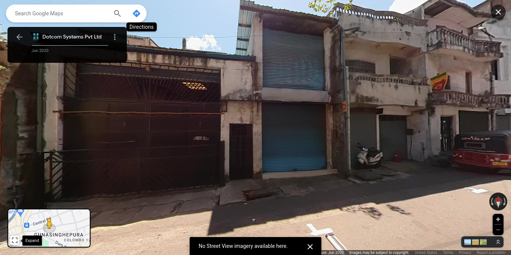

## Marassana

**Marassana** Grama Niladhari Division, **Pathahewaheta** Divisional Secretariat Division, **Kandy** District, **Central** Province

**Hewaheta** Polling Division, **Kandy** Electoral District

Population: 786 (2012)

(**LK-2145235**/1007)

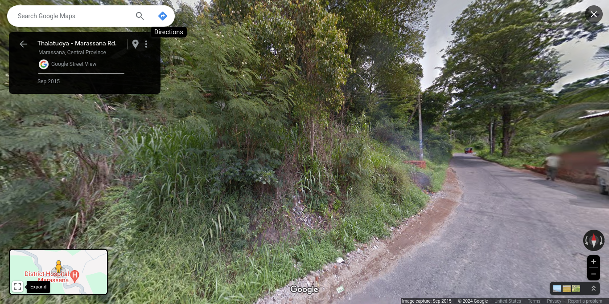

## Kollankalady

**Kollankalady** Grama Niladhari Division, **Valikamam North (Tellipallai)** Divisional Secretariat Division, **Jaffna** District, **Northern** Province

**Kayts** Polling Division, **Jaffna** Electoral District

Population: 849 (2012)

(**LK-4112070**/225)

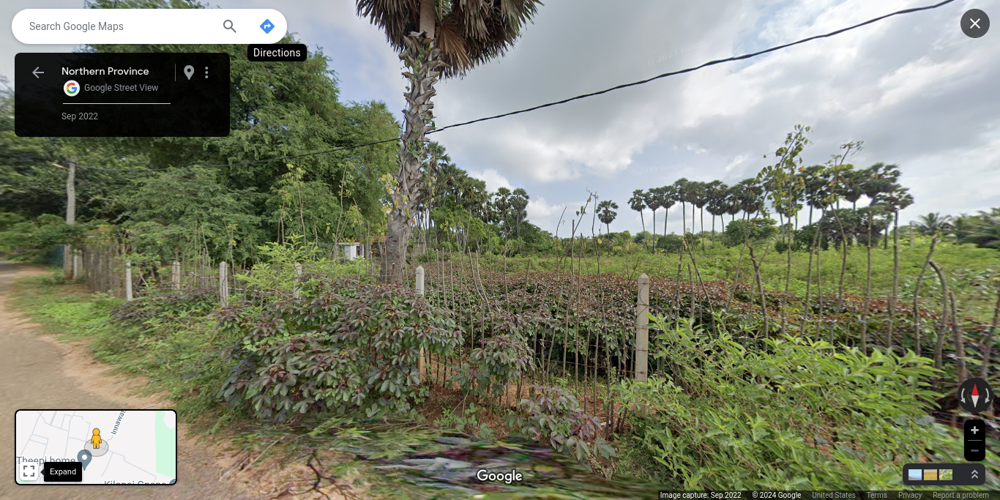

## Gallehepitiya

**Gallehepitiya** Grama Niladhari Division, **Panduwasnuwara East** Divisional Secretariat Division, **Kurunegala** District, **North Western** Province

**Panduwasnuwara** Polling Division, **Kurunegala** Electoral District

Population: 1,499 (2012)

(**LK-6148050**/1362)

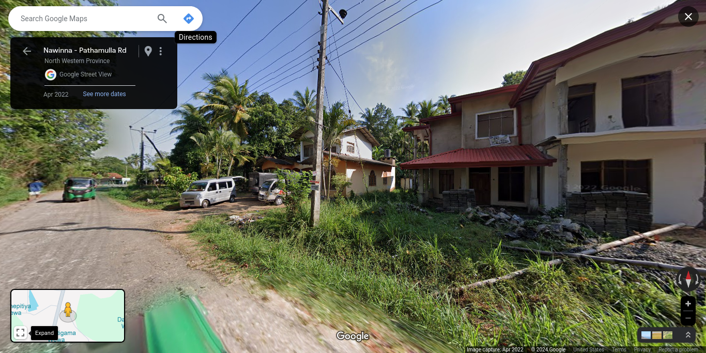

## Morawatta

**Morawatta** Grama Niladhari Division, **Ruwanwella** Divisional Secretariat Division, **Kegalle** District, **Sabaragamuwa** Province

**Ruwanwella** Polling Division, **Kegalle** Electoral District

Population: 2,252 (2012)

(**LK-9221110**/104)

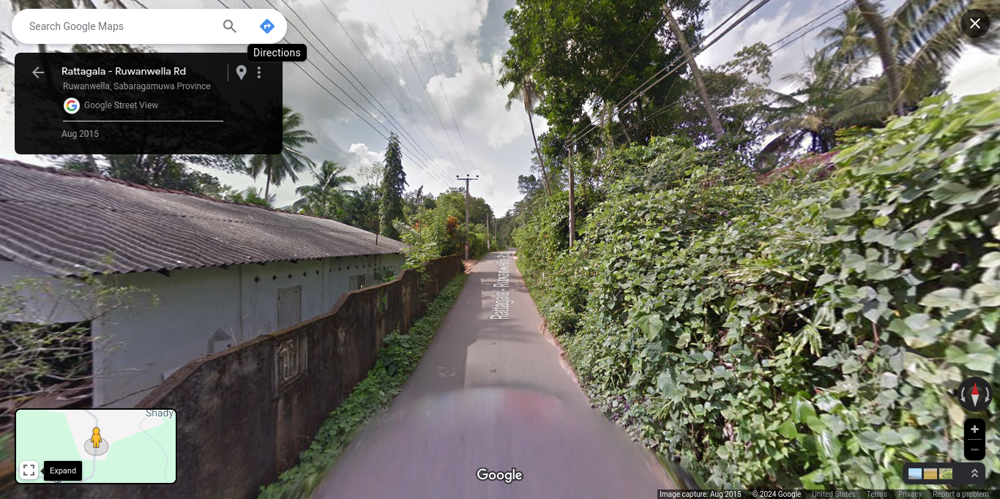

## Bandawa

**Bandawa** Grama Niladhari Division, **Polgahawela** Divisional Secretariat Division, **Kurunegala** District, **North Western** Province

**Polgahawela** Polling Division, **Kurunegala** Electoral District

Population: 1,935 (2012)

(**LK-6187245**/922)

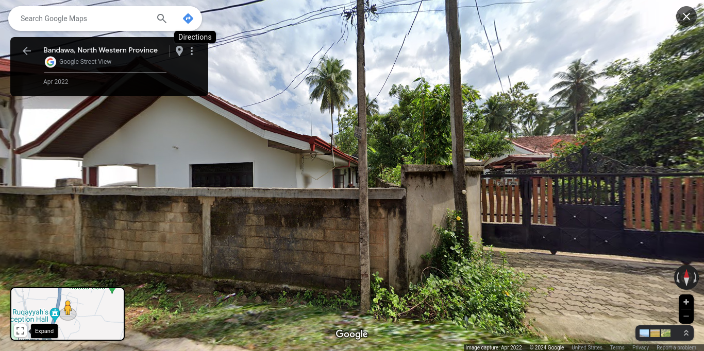

## Dambadeniya

**Dambadeniya** Grama Niladhari Division, **Mahaoya** Divisional Secretariat Division, **Ampara** District, **Eastern** Province

**Ampara** Polling Division, **Digamadulla** Electoral District

Population: 1,641 (2012)

(**LK-5209060**/137A/1)

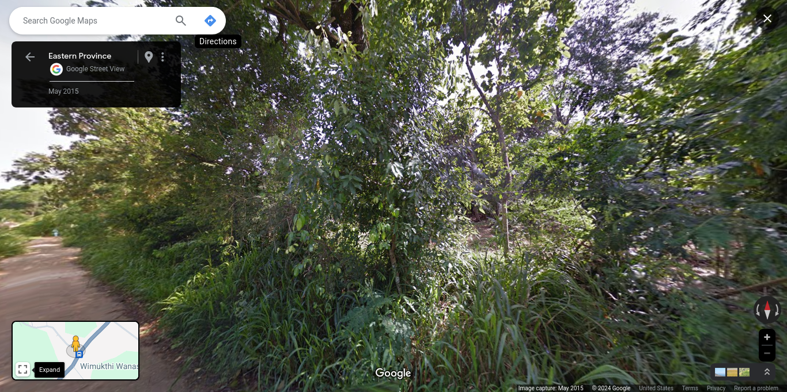

## Pahala Diggala

**Pahala Diggala** Grama Niladhari Division, **Galewela** Divisional Secretariat Division, **Matale** District, **Central** Province

**Dambulla** Polling Division, **Matale** Electoral District

Population: 1,397 (2012)

(**LK-2203050**/E438B)

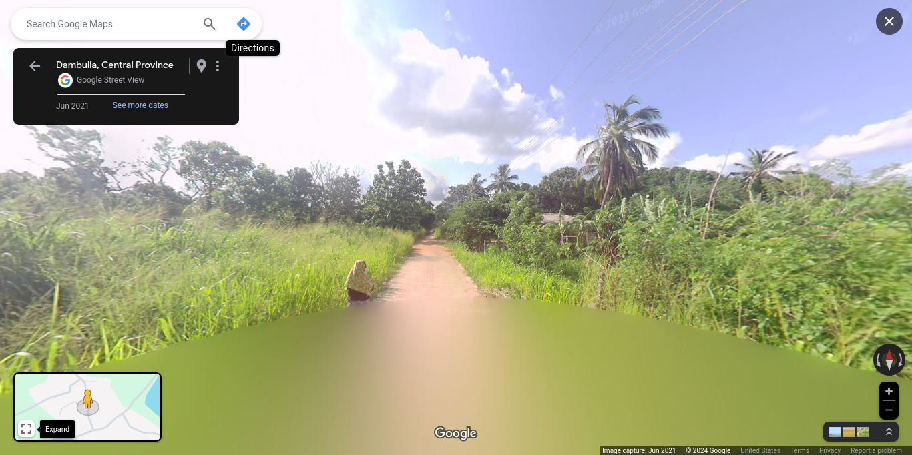

## Gampaha Aluthgama West

**Gampaha Aluthgama West** Grama Niladhari Division, **Gampaha** Divisional Secretariat Division, **Gampaha** District, **Western** Province

**Gampaha** Polling Division, **Gampaha** Electoral District

Population: 2,354 (2012)

(**LK-1224130**/225)

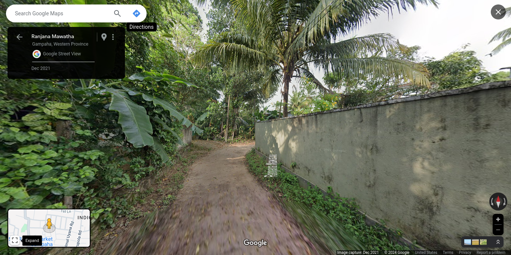

## Sitinamaluwa East

**Sitinamaluwa East** Grama Niladhari Division, **Beliatta** Divisional Secretariat Division, **Hambantota** District, **Southern** Province

**Beliatta** Polling Division, **Hambantota** Electoral District

Population: 1,437 (2012)

(**LK-3330220**/360)

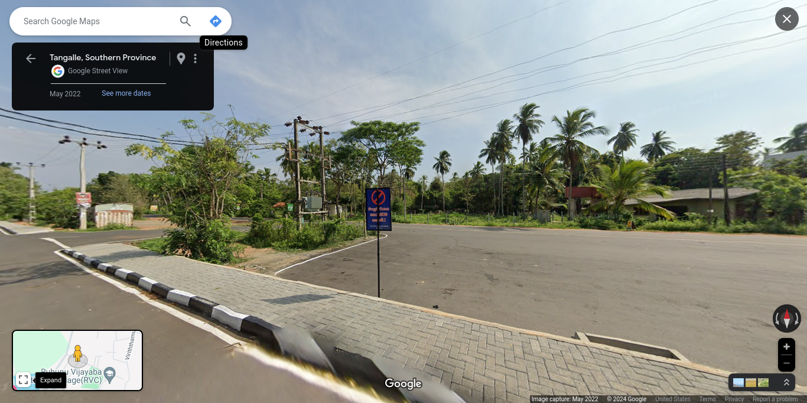

## Thammita

**Thammita** Grama Niladhari Division, **Minuwangoda** Divisional Secretariat Division, **Gampaha** District, **Western** Province

**Minuwangoda** Polling Division, **Gampaha** Electoral District

Population: 1,465 (2012)

(**LK-1215605**/136)

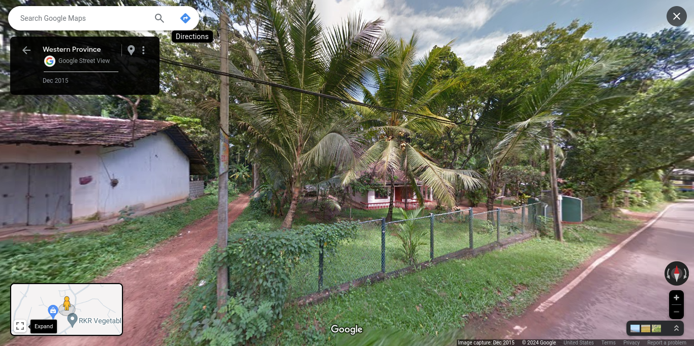

## Kavuduwawa

**Kavuduwawa** Grama Niladhari Division, **Godakawela** Divisional Secretariat Division, **Ratnapura** District, **Sabaragamuwa** Province

**Rakwana** Polling Division, **Ratnapura** Electoral District

Population: 1,548 (2012)

(**LK-9142060**/238B)

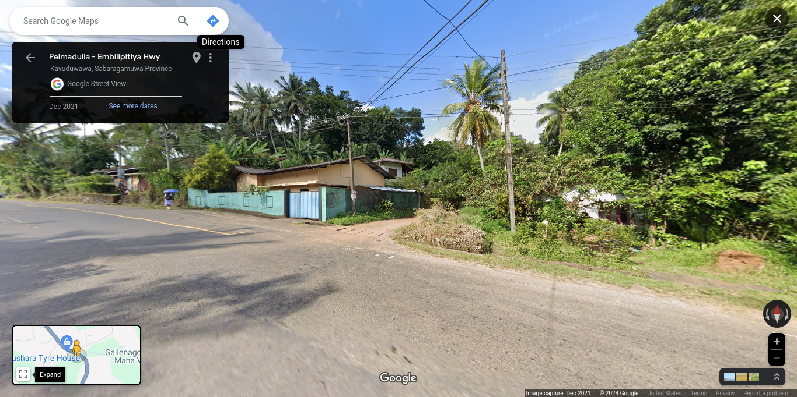

## Parawahera South

**Parawahera South** Grama Niladhari Division, **Matara Four Gravets** Divisional Secretariat Division, **Matara** District, **Southern** Province

**Matara** Polling Division, **Matara** Electoral District

Population: 1,721 (2012)

(**LK-3242155**/443A)

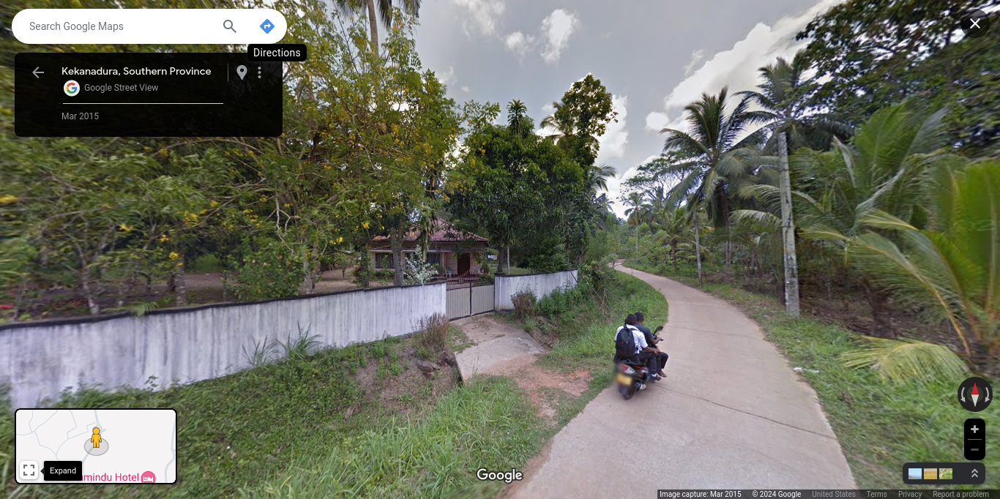

## Addalachchenai 16

**Addalachchenai 16** Grama Niladhari Division, **Addalachchenai** Divisional Secretariat Division, **Ampara** District, **Eastern** Province

**Pothuvil** Polling Division, **Digamadulla** Electoral District

Population: 1,405 (2012)

(**LK-5233145**/AD/30B/2)

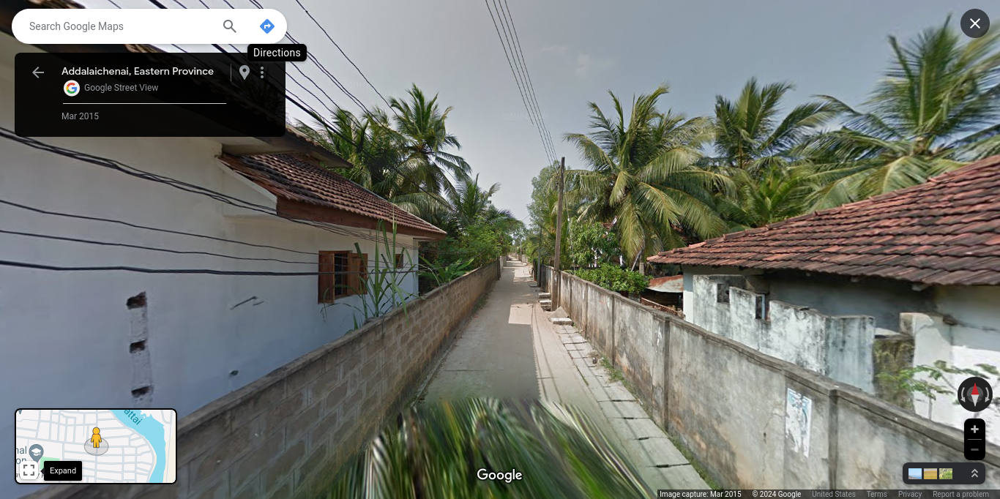

## Paragala

**Paragala** Grama Niladhari Division, **Ayagama** Divisional Secretariat Division, **Ratnapura** District, **Sabaragamuwa** Province

**Kalawana** Polling Division, **Ratnapura** Electoral District

Population: 1,260 (2012)

(**LK-9130095**/194)

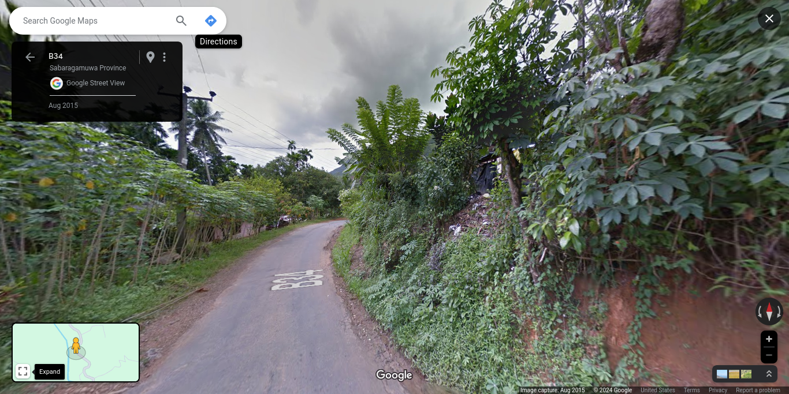

## Paranagampola

**Paranagampola** Grama Niladhari Division, **Kegalle** Divisional Secretariat Division, **Kegalle** District, **Sabaragamuwa** Province

**Kegalle** Polling Division, **Kegalle** Electoral District

Population: 2,030 (2012)

(**LK-9212060**/52C)

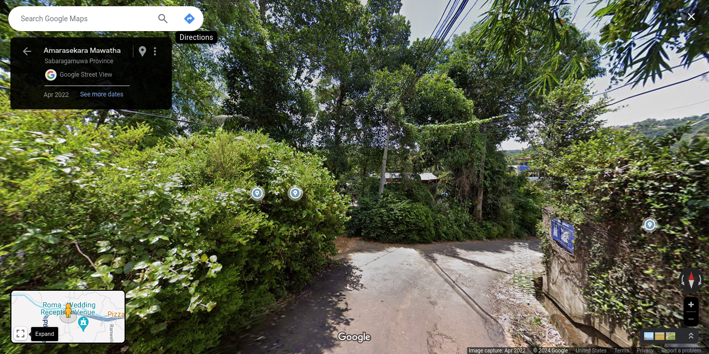

## Karaveddy East

**Karaveddy East** Grama Niladhari Division, **Vadamaradchi South-West (Karaveddy)** Divisional Secretariat Division, **Jaffna** District, **Northern** Province

**Udupiddy** Polling Division, **Jaffna** Electoral District

Population: 1,321 (2012)

(**LK-4121105**/J/368)

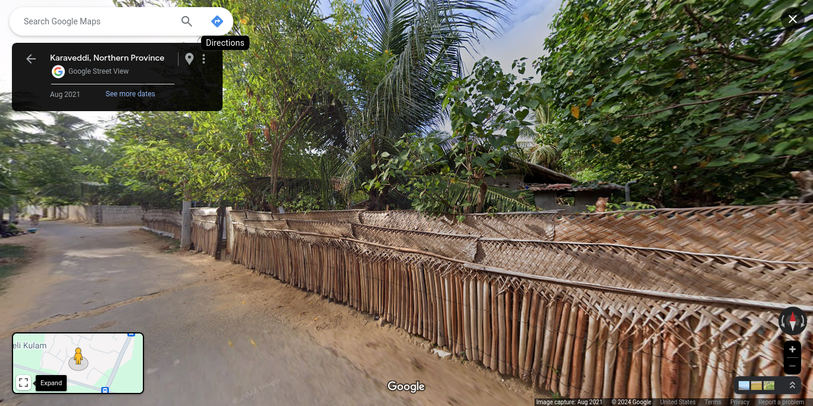

## Mawela East

**Mawela East** Grama Niladhari Division, **Kothmale** Divisional Secretariat Division, **Nuwara Eliya** District, **Central** Province

**Kothmale** Polling Division, **Nuwara-Eliya** Electoral District

Population: 432 (2012)

(**LK-2303105**/456)

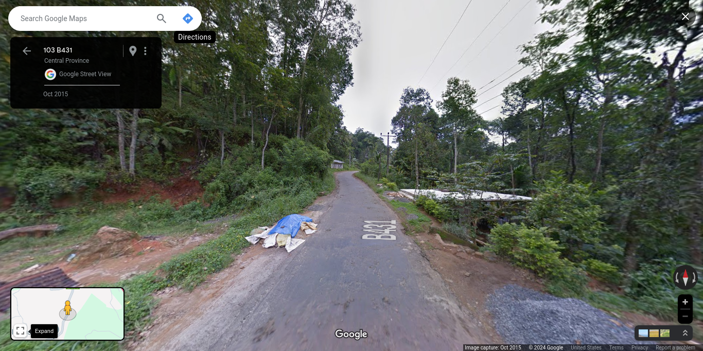

## Ihala Bokalagama

**Ihala Bokalagama** Grama Niladhari Division, **Mirigama** Divisional Secretariat Division, **Gampaha** District, **Western** Province

**Mirigama** Polling Division, **Gampaha** Electoral District

Population: 1,033 (2012)

(**LK-1212395**/31A)

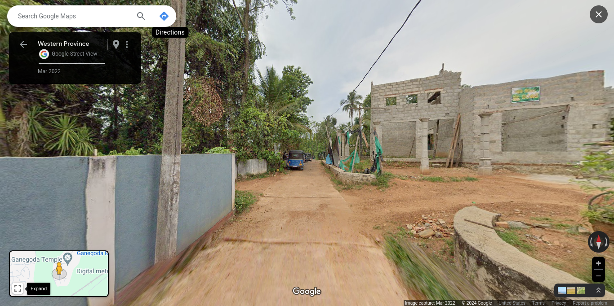

## Welihena South

**Welihena South** Grama Niladhari Division, **Katana** Divisional Secretariat Division, **Gampaha** District, **Western** Province

**Katana** Polling Division, **Gampaha** Electoral District

Population: 4,495 (2012)

(**LK-1206065**/69A)

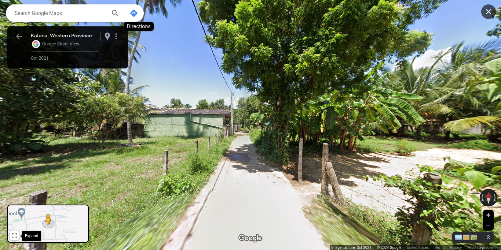

## Yalagala

**Yalagala** Grama Niladhari Division, **Millaniya** Divisional Secretariat Division, **Kalutara** District, **Western** Province

**Bandaragama** Polling Division, **Kalutara** Electoral District

Population: 1,196 (2012)

(**LK-1318090**/651)

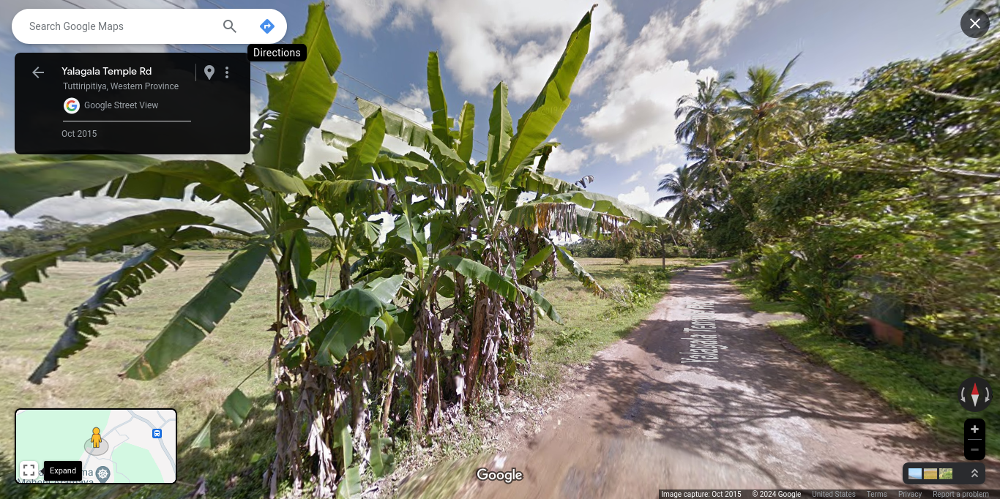

## Ganthalawa Unit 11

**Ganthalawa Unit 11** Grama Niladhari Division, **Kanthale** Divisional Secretariat Division, **Trincomalee** District, **Eastern** Province

**Seruvila** Polling Division, **Trincomalee** Electoral District

Population: 890 (2012)

(**LK-5321015**/227P)

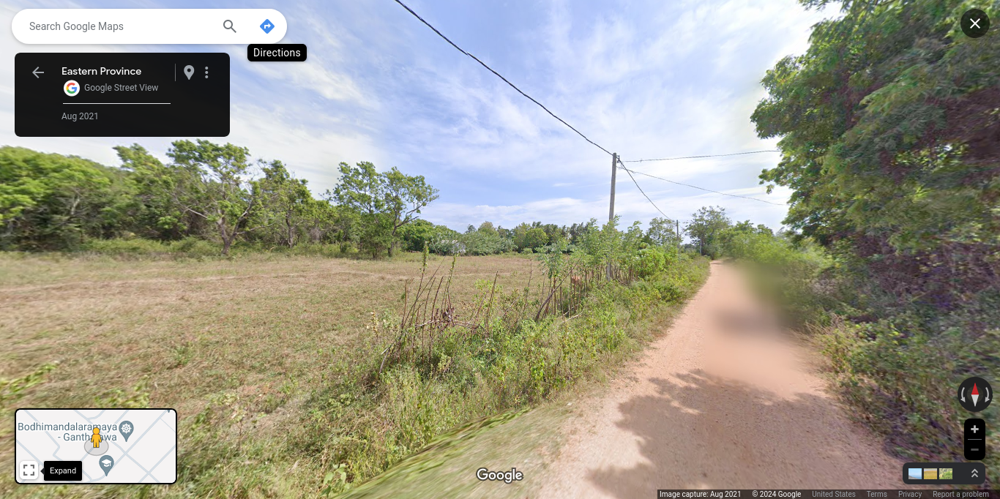

## Pitiharawa

**Pitiharawa** Grama Niladhari Division, **Baddegama** Divisional Secretariat Division, **Galle** District, **Southern** Province

**Baddegama** Polling Division, **Galle** Electoral District

Population: 1,263 (2012)

(**LK-3127335**/200B)

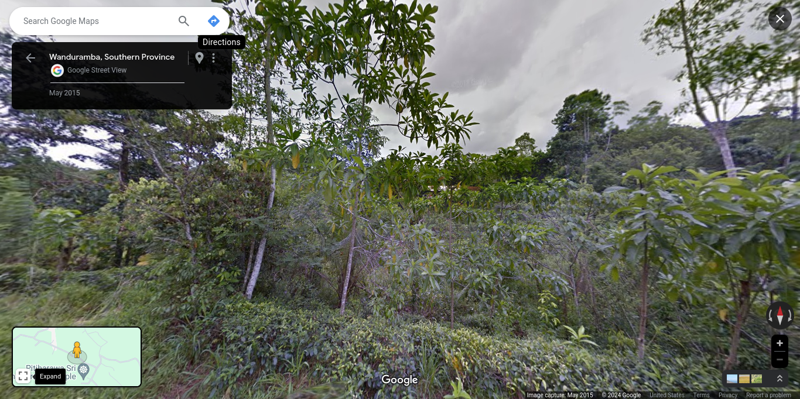

## Nawadevita

**Nawadevita** Grama Niladhari Division, **Udapalatha** Divisional Secretariat Division, **Kandy** District, **Central** Province

**Gampola** Polling Division, **Kandy** Electoral District

Population: 2,254 (2012)

(**LK-2151195**/1167)

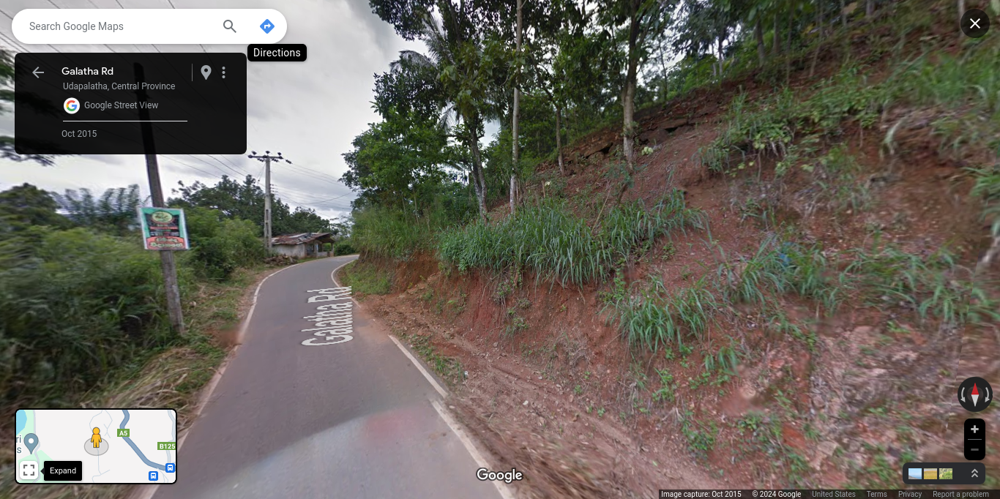

## Ihala Karagahamuna South

**Ihala Karagahamuna South** Grama Niladhari Division, **Mahara** Divisional Secretariat Division, **Gampaha** District, **Western** Province

**Mahara** Polling Division, **Gampaha** Electoral District

Population: 2,009 (2012)

(**LK-1233345**/248A)

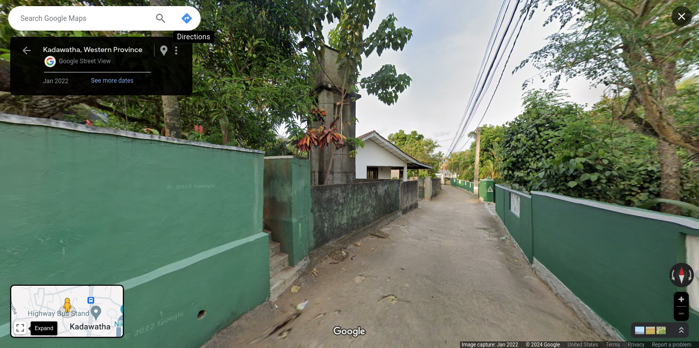

## Godigamuwa South B

**Godigamuwa South B** Grama Niladhari Division, **Maharagama** Divisional Secretariat Division, **Colombo** District, **Western** Province

**Maharagama** Polling Division, **Colombo** Electoral District

Population: 7,328 (2012)

(**LK-1121175**/532B)

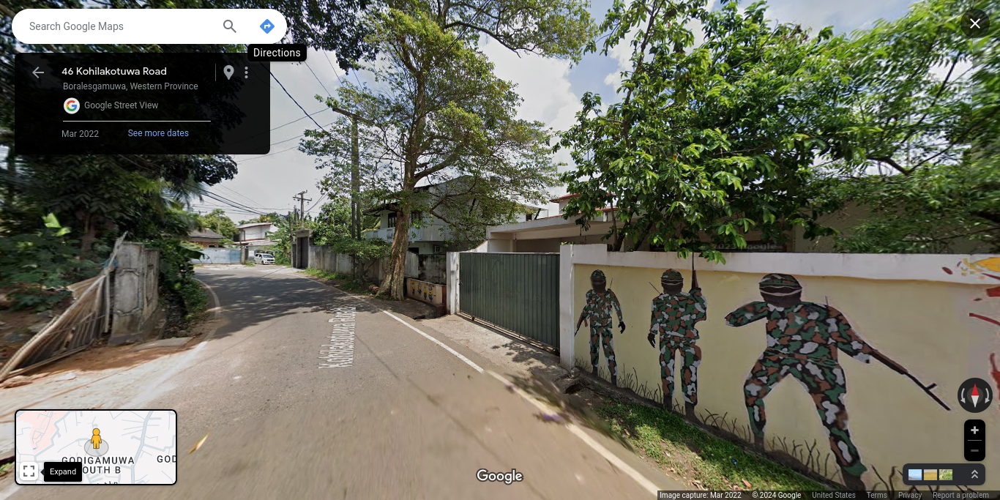

## Gammeddegoda-Rajgama

**Gammeddegoda-Rajgama** Grama Niladhari Division, **Hikkaduwa** Divisional Secretariat Division, **Galle** District, **Southern** Province

**Ratgama** Polling Division, **Galle** Electoral District

Population: 713 (2012)

(**LK-3136440**/47A)

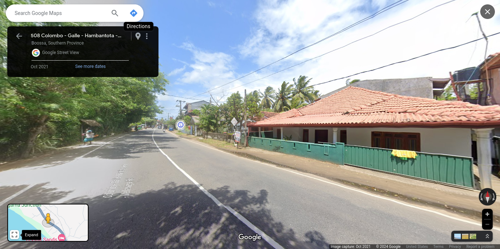

## Thunkama

**Thunkama** Grama Niladhari Division, **Embilipitiya** Divisional Secretariat Division, **Ratnapura** District, **Sabaragamuwa** Province

**Kolonna** Polling Division, **Ratnapura** Electoral District

Population: 5,499 (2012)

(**LK-9148180**/216)

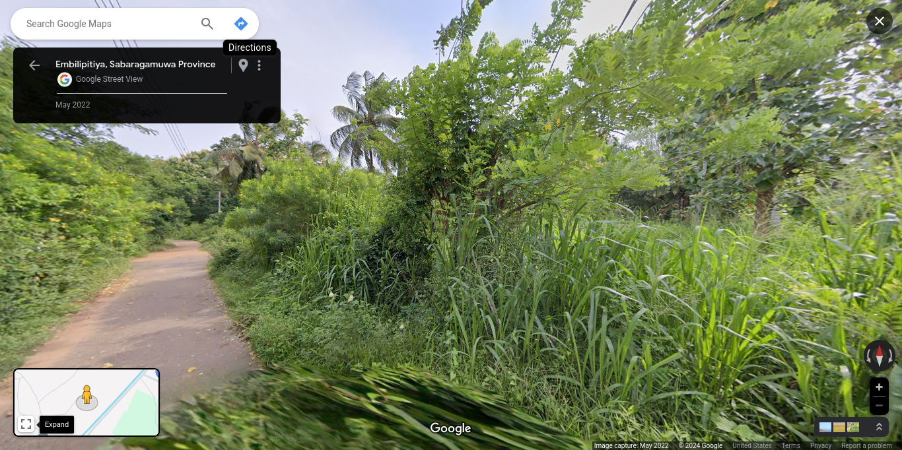

## Maharambaikulam

**Maharambaikulam** Grama Niladhari Division, **Vavuniya** Divisional Secretariat Division, **Vavuniya** District, **Northern** Province

**Vavuniya** Polling Division, **Vanni** Electoral District

Population: 6,229 (2012)

(**LK-4309080**/215A)

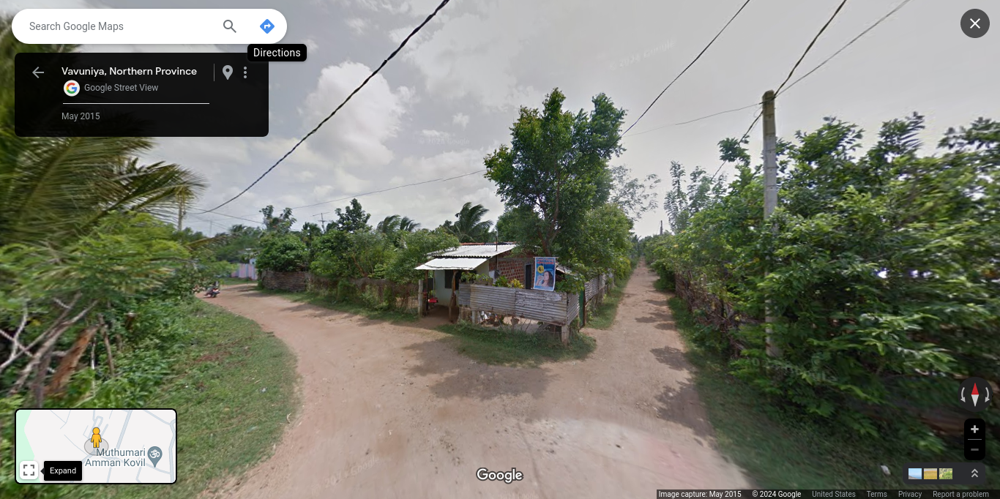

## Hijrapura

**Hijrapura** Grama Niladhari Division, **Medadumbara** Divisional Secretariat Division, **Kandy** District, **Central** Province

**Teldeniya** Polling Division, **Kandy** Electoral District

Population: 1,621 (2012)

(**LK-2124350**/832)

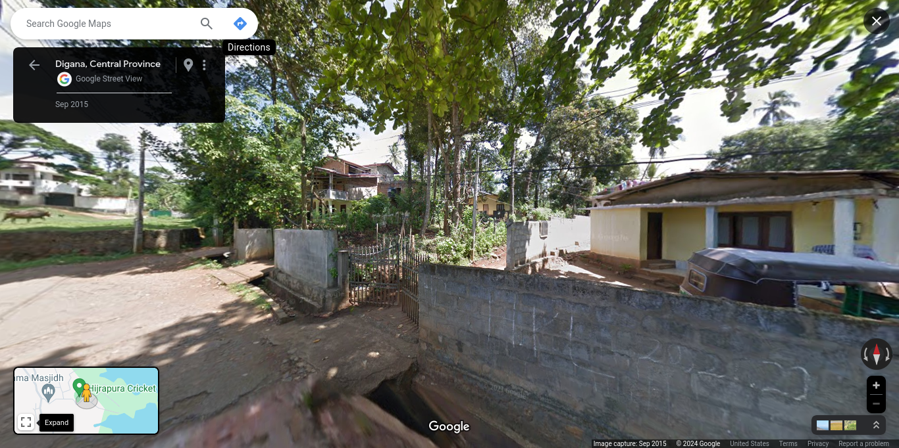

## Medapitigama

**Medapitigama** Grama Niladhari Division, **Hali-Ela** Divisional Secretariat Division, **Badulla** District, **Uva** Province

**Hali Ela** Polling Division, **Badulla** Electoral District

Population: 1,888 (2012)

(**LK-8124090**/74E)

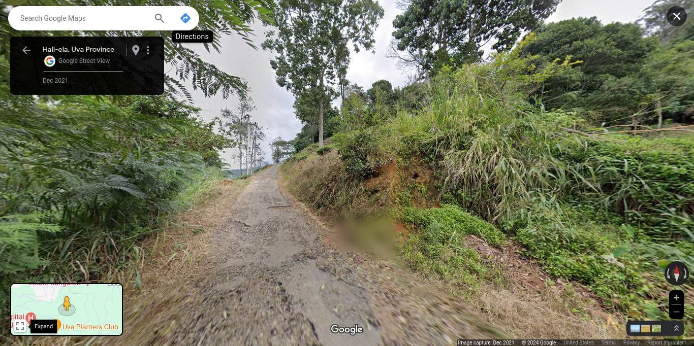

## Sammanthurai 10

**Sammanthurai 10** Grama Niladhari Division, **Samanthurai** Divisional Secretariat Division, **Ampara** District, **Eastern** Province

**Samanthurai** Polling Division, **Digamadulla** Electoral District

Population: 789 (2012)

(**LK-5218070**/92B)

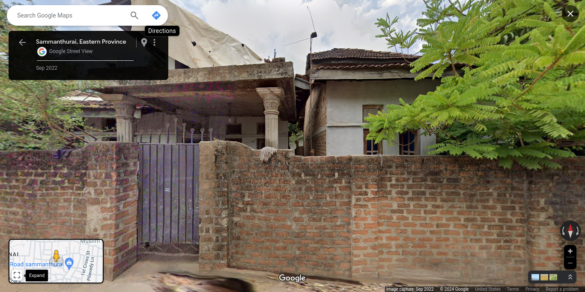

## Rajagiriya

**Rajagiriya** Grama Niladhari Division, **Udunuwara** Divisional Secretariat Division, **Kandy** District, **Central** Province

**Udunuwara** Polling Division, **Kandy** Electoral District

Population: 801 (2012)

(**LK-2139120**/8)

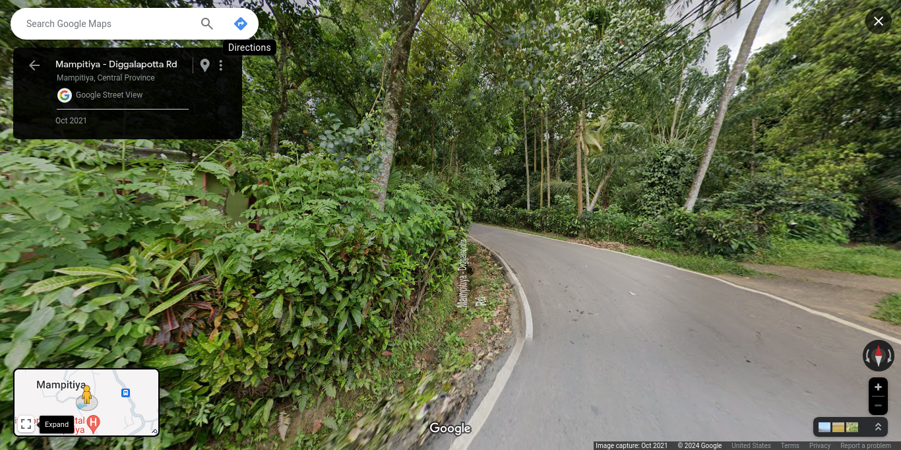

## Akkaraipattu 7/2

**Akkaraipattu 7/2** Grama Niladhari Division, **Alayadiwembu** Divisional Secretariat Division, **Ampara** District, **Eastern** Province

**Pothuvil** Polling Division, **Digamadulla** Electoral District

Population: 604 (2012)

(**LK-5239030**/AV/06)

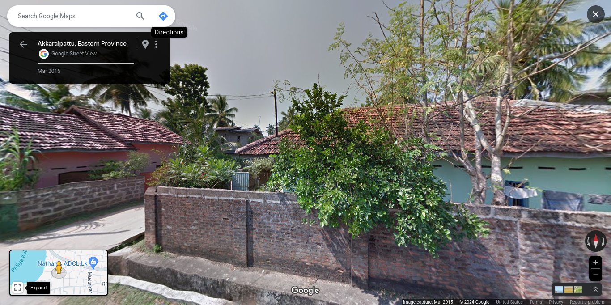

## Ruwaneliya

**Ruwaneliya** Grama Niladhari Division, **Nuwara Eliya** Divisional Secretariat Division, **Nuwara Eliya** District, **Central** Province

**Nuwara Eliya Maskeliya** Polling Division, **Nuwara-Eliya** Electoral District

Population: 2,972 (2012)

(**LK-2312240**/476D)

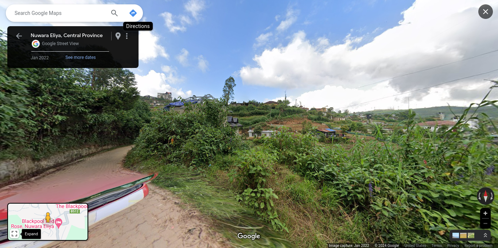

## Ukwatta

**Ukwatta** Grama Niladhari Division, **Seethawaka** Divisional Secretariat Division, **Colombo** District, **Western** Province

**Avissawella** Polling Division, **Colombo** Electoral District

Population: 2,649 (2012)

(**LK-1115055**/432C)

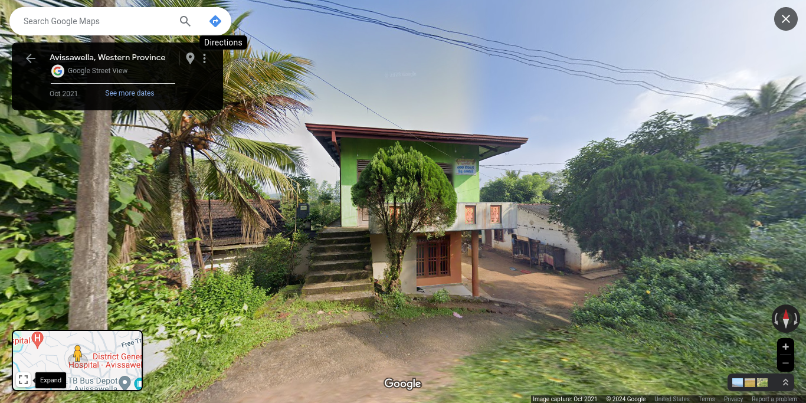

## Nallura

**Nallura** Grama Niladhari Division, **Panduwasnuwara West** Divisional Secretariat Division, **Kurunegala** District, **North Western** Province

**Panduwasnuwara** Polling Division, **Kurunegala** Electoral District

Population: 1,126 (2012)

(**LK-6145105**/1356)

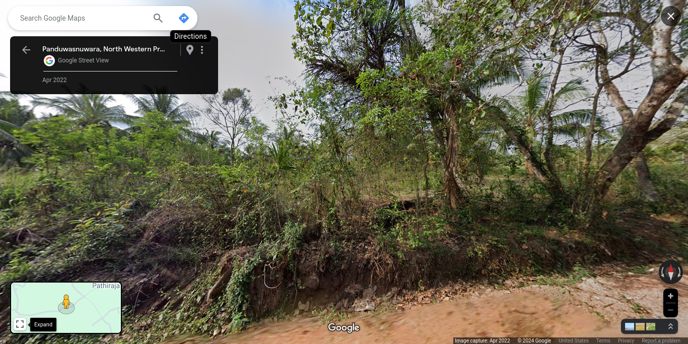

## Dickwella North

**Dickwella North** Grama Niladhari Division, **Dickwella** Divisional Secretariat Division, **Matara** District, **Southern** Province

**Devinuwara** Polling Division, **Matara** Electoral District

Population: 1,907 (2012)

(**LK-3248115**/452)

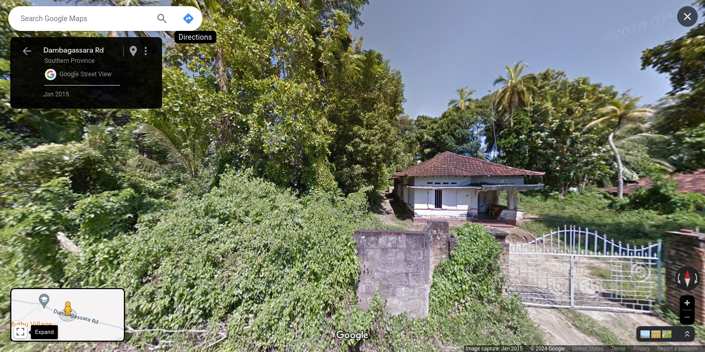

## Kudapaduwa North

**Kudapaduwa North** Grama Niladhari Division, **Negombo** Divisional Secretariat Division, **Gampaha** District, **Western** Province

**Negombo** Polling Division, **Gampaha** Electoral District

Population: 3,917 (2012)

(**LK-1203065**/73B)

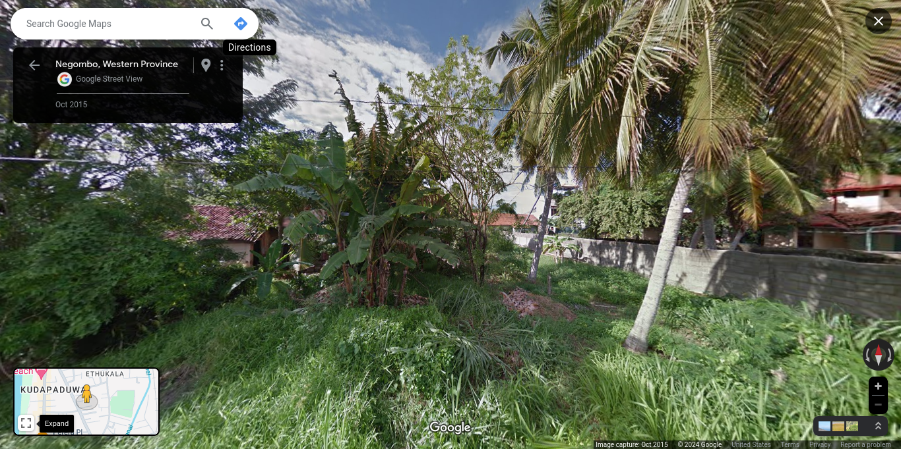

## Boralesgamuwa East A

**Boralesgamuwa East A** Grama Niladhari Division, **Kesbewa** Divisional Secretariat Division, **Colombo** District, **Western** Province

**Kesbewa** Polling Division, **Colombo** Electoral District

Population: 4,842 (2012)

(**LK-1136050**/533)

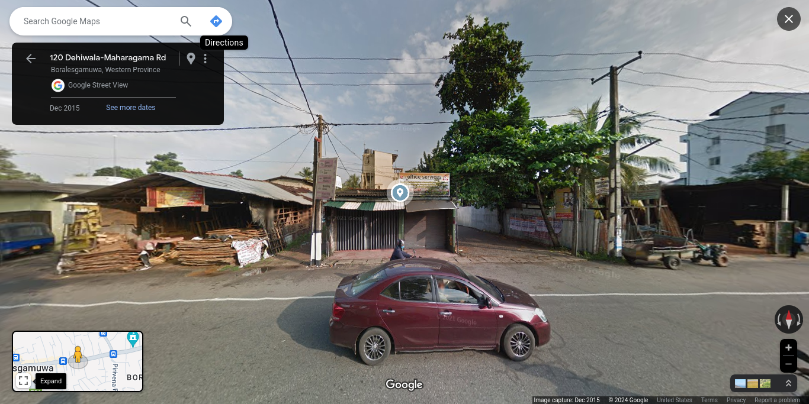

## Kondavil Centre  East

**Kondavil Centre  East** Grama Niladhari Division, **Nallur** Divisional Secretariat Division, **Jaffna** District, **Northern** Province

**Nallur** Polling Division, **Jaffna** Electoral District

Population: 2,050 (2012)

(**LK-4133150**/J/118)

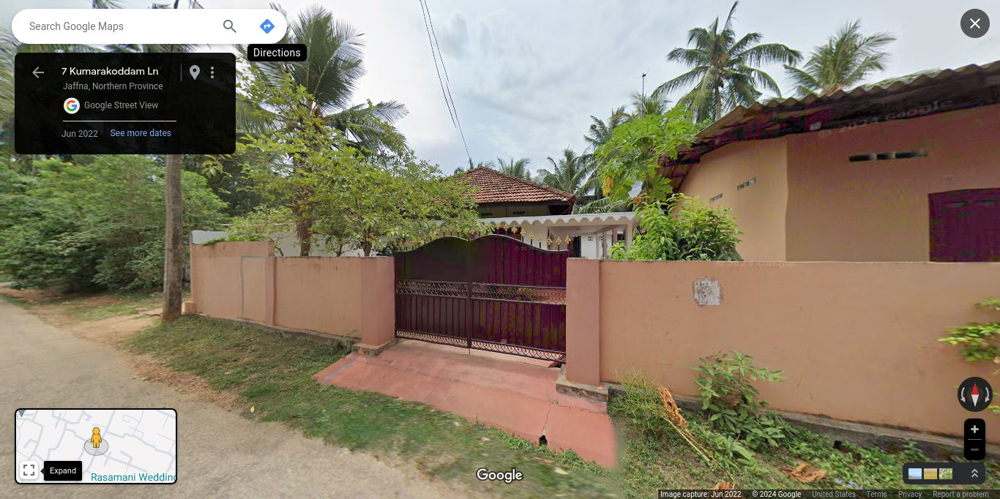

## Kithulgoda

**Kithulgoda** Grama Niladhari Division, **Agalawatta** Divisional Secretariat Division, **Kalutara** District, **Western** Province

**Agalawatta** Polling Division, **Kalutara** Electoral District

Population: 1,619 (2012)

(**LK-1333110**/833)

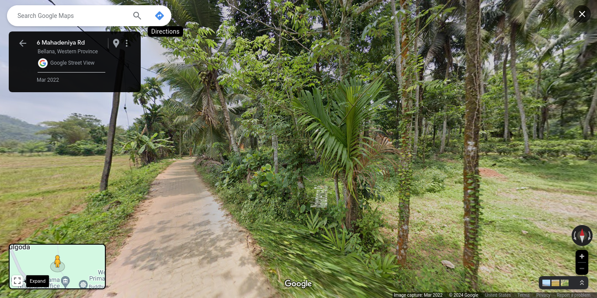

## Werahera North

**Werahera North** Grama Niladhari Division, **Kesbewa** Divisional Secretariat Division, **Colombo** District, **Western** Province

**Kesbewa** Polling Division, **Colombo** Electoral District

Population: 1,977 (2012)

(**LK-1136060**/577)

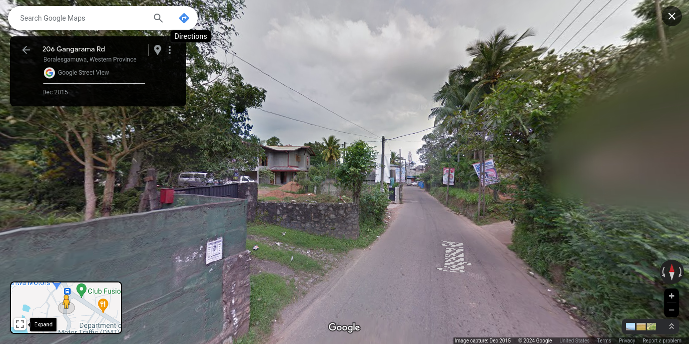

## Pitakotte

**Pitakotte** Grama Niladhari Division, **Sri Jayawardanapura Kotte** Divisional Secretariat Division, **Colombo** District, **Western** Province

**Kotte** Polling Division, **Colombo** Electoral District

Population: 3,634 (2012)

(**LK-1124055**/522B)

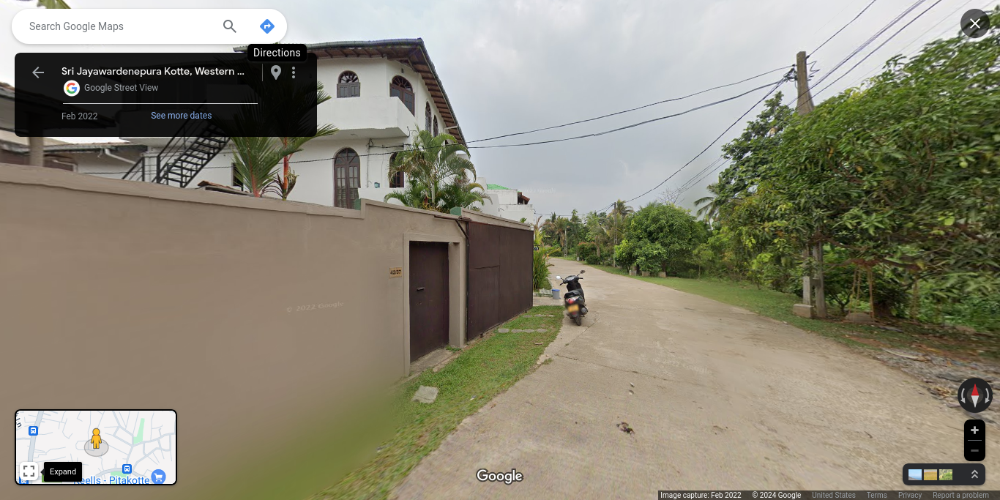

## Dalupatha

**Dalupatha** Grama Niladhari Division, **Negombo** Divisional Secretariat Division, **Gampaha** District, **Western** Province

**Negombo** Polling Division, **Gampaha** Electoral District

Population: 3,606 (2012)

(**LK-1203055**/72)

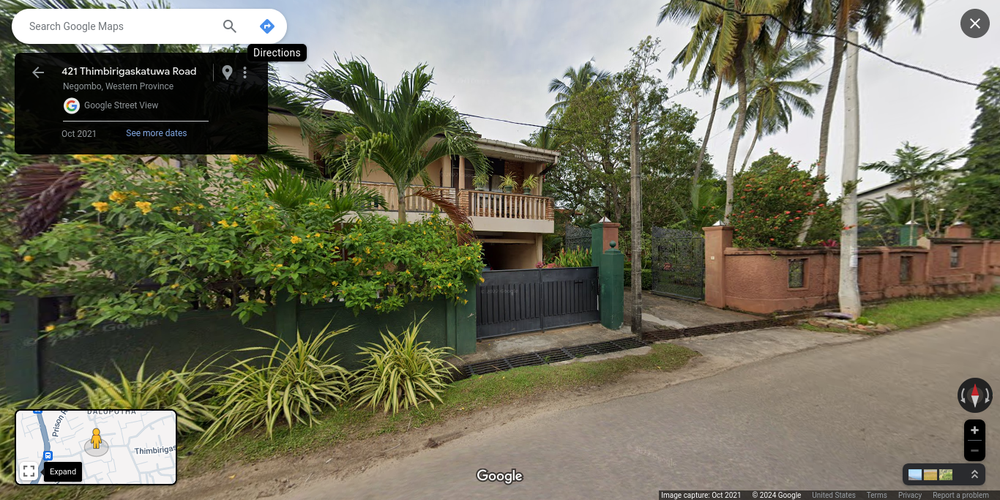

## Mawela West

**Mawela West** Grama Niladhari Division, **Kothmale** Divisional Secretariat Division, **Nuwara Eliya** District, **Central** Province

**Kothmale** Polling Division, **Nuwara-Eliya** Electoral District

Population: 795 (2012)

(**LK-2303110**/456B)

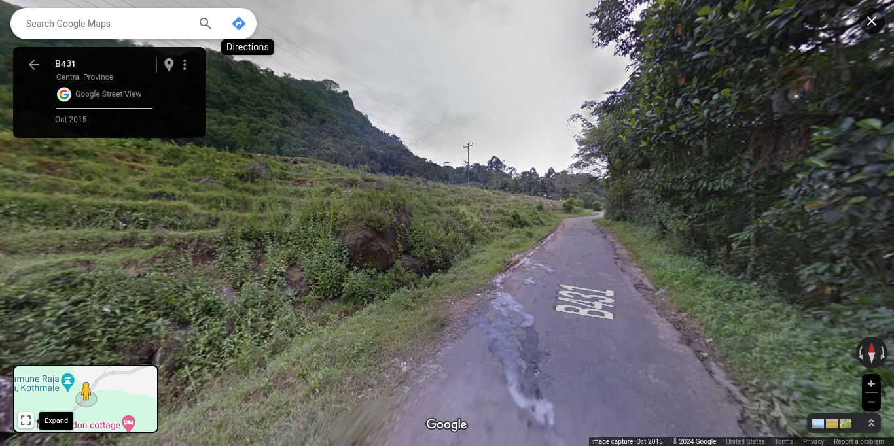

## Orr's Hill

**Orr's Hill** Grama Niladhari Division, **Trincomalee Town and Gravets** Divisional Secretariat Division, **Trincomalee** District, **Eastern** Province

**Trincomalee** Polling Division, **Trincomalee** Electoral District

Population: 5,169 (2012)

(**LK-5315180**/244P)

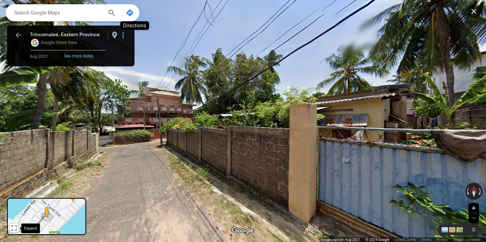

## Varani North

**Varani North** Grama Niladhari Division, **Thenmaradchi (Chavakachcheri)** Divisional Secretariat Division, **Jaffna** District, **Northern** Province

**Chavakachcheri** Polling Division, **Jaffna** Electoral District

Population: 1,017 (2012)

(**LK-4130260**/J/339)

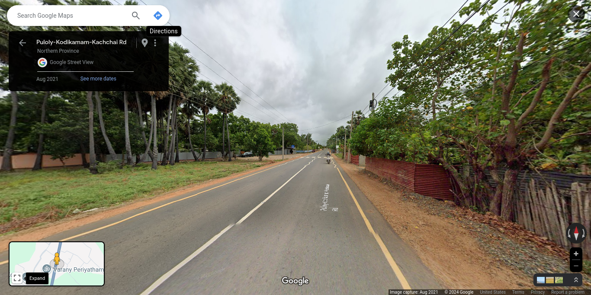

## Pothuvil 01/ Unit 2

**Pothuvil 01/ Unit 2** Grama Niladhari Division, **Pothuvil** Divisional Secretariat Division, **Ampara** District, **Eastern** Province

**Pothuvil** Polling Division, **Digamadulla** Electoral District

Population: 1,052 (2012)

(**LK-5248055**/P/02)

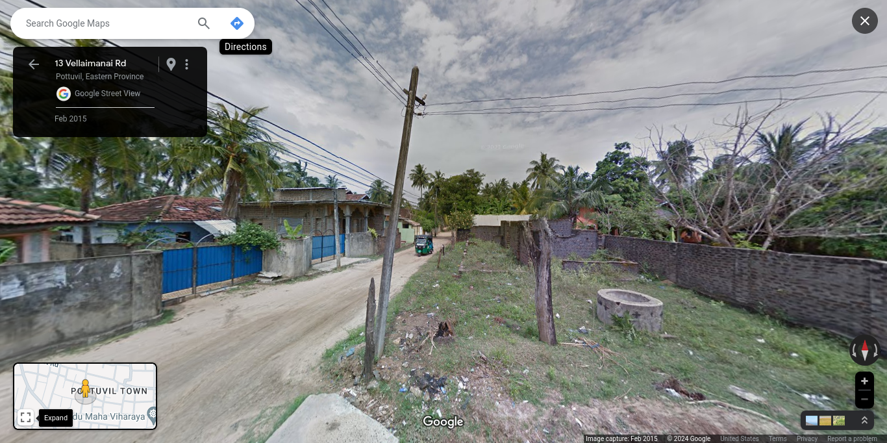

## Kuda Waskaduwa North

**Kuda Waskaduwa North** Grama Niladhari Division, **Kalutara** Divisional Secretariat Division, **Kalutara** District, **Western** Province

**Kalutara** Polling Division, **Kalutara** Electoral District

Population: 2,380 (2012)

(**LK-1321130**/710)

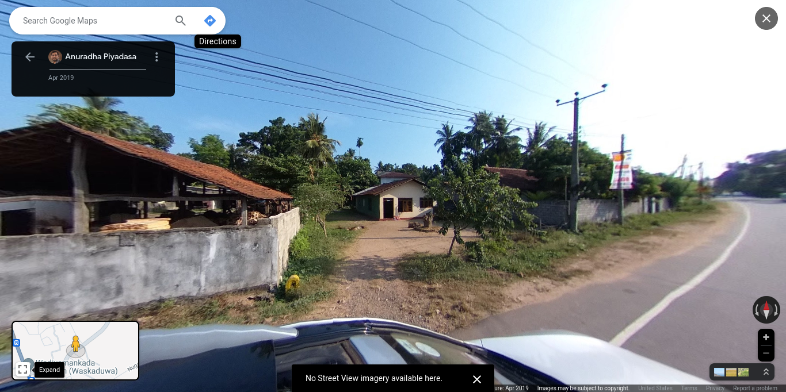

## Alawathupitiya

**Alawathupitiya** Grama Niladhari Division, **Katana** Divisional Secretariat Division, **Gampaha** District, **Western** Province

**Katana** Polling Division, **Gampaha** Electoral District

Population: 1,188 (2012)

(**LK-1206385**/198)

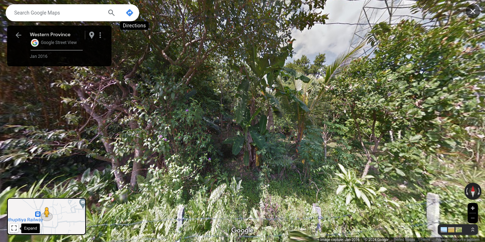

## Ambanpola South

**Ambanpola South** Grama Niladhari Division, **Ambanpola** Divisional Secretariat Division, **Kurunegala** District, **North Western** Province

**Yapahuwa** Polling Division, **Kurunegala** Electoral District

Population: 1,011 (2012)

(**LK-6112060**/190)

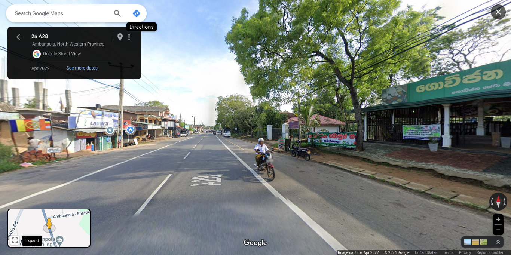

## Diyagama West

**Diyagama West** Grama Niladhari Division, **Homagama** Divisional Secretariat Division, **Colombo** District, **Western** Province

**Homagama** Polling Division, **Colombo** Electoral District

Population: 1,942 (2012)

(**LK-1112300**/589A)

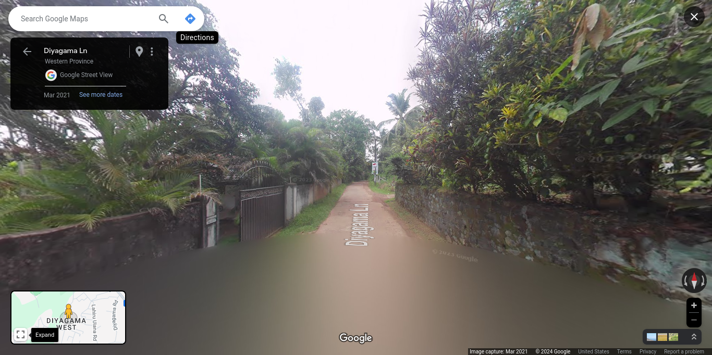

## Ja-Ela

**Ja-Ela** Grama Niladhari Division, **Ja-Ela** Divisional Secretariat Division, **Gampaha** District, **Western** Province

**Ja Ela** Polling Division, **Gampaha** Electoral District

Population: 2,167 (2012)

(**LK-1221110**/191A)

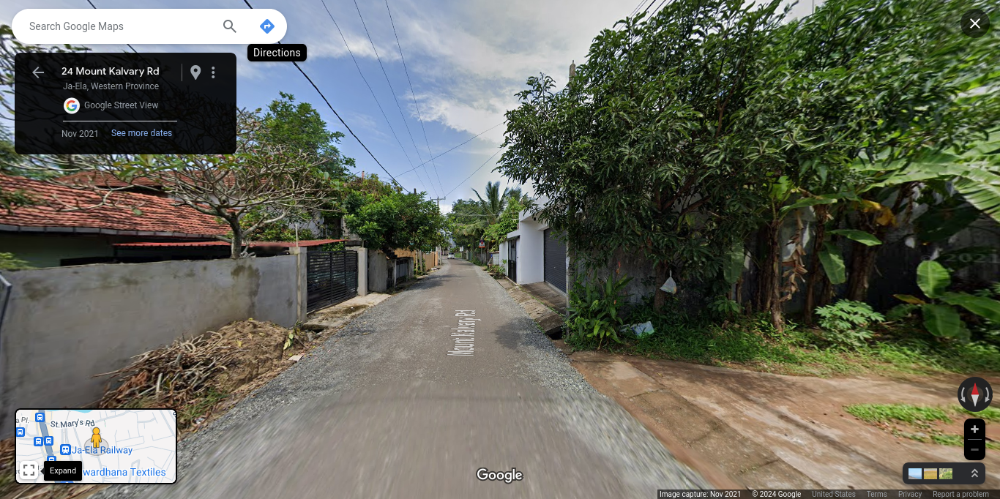

## Meethotamulla

**Meethotamulla** Grama Niladhari Division, **Kolonnawa** Divisional Secretariat Division, **Colombo** District, **Western** Province

**Kolonnawa** Polling Division, **Colombo** Electoral District

Population: 8,432 (2012)

(**LK-1106035**/510)

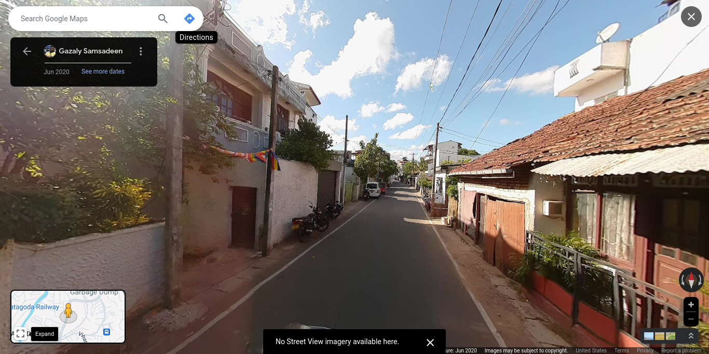

## Mahadeniya

**Mahadeniya** Grama Niladhari Division, **Kaduwela** Divisional Secretariat Division, **Colombo** District, **Western** Province

**Kaduwela** Polling Division, **Colombo** Electoral District

Population: 5,495 (2012)

(**LK-1109060**/475A)

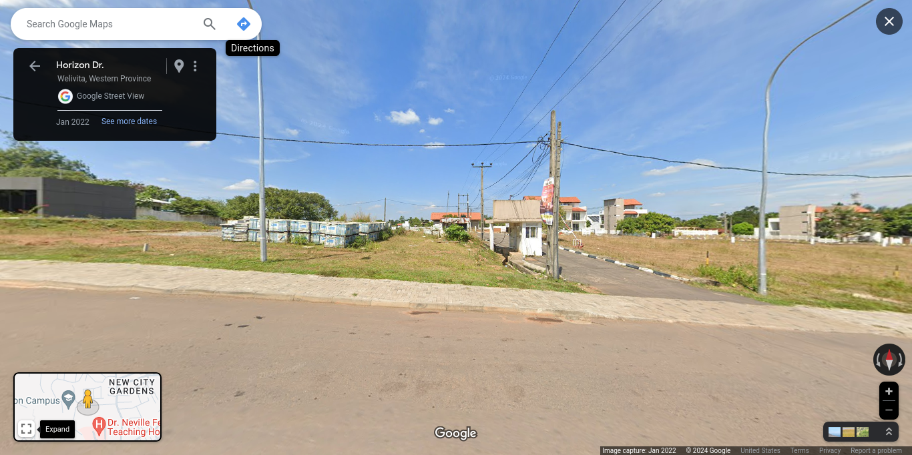

## Poramba

**Poramba** Grama Niladhari Division, **Akuressa** Divisional Secretariat Division, **Matara** District, **Southern** Province

**Akuressa** Polling Division, **Matara** Electoral District

Population: 1,582 (2012)

(**LK-3218160**/361A)

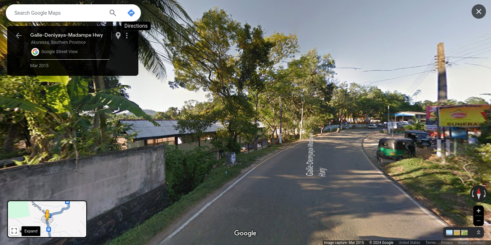

## Kimbulapitiya West

**Kimbulapitiya West** Grama Niladhari Division, **Katana** Divisional Secretariat Division, **Gampaha** District, **Western** Province

**Katana** Polling Division, **Gampaha** Electoral District

Population: 2,621 (2012)

(**LK-1206155**/92B)

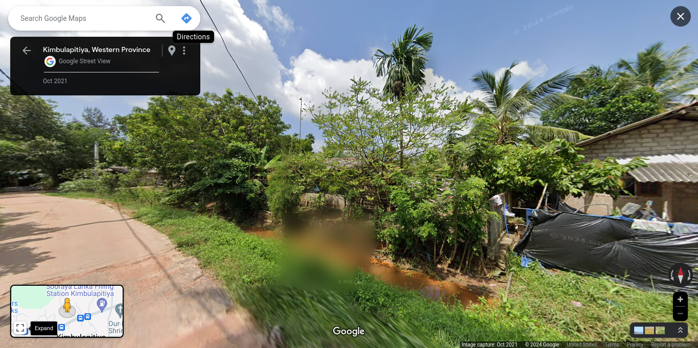

## Kurundugolla

**Kurundugolla** Grama Niladhari Division, **Uva Paranagama** Divisional Secretariat Division, **Badulla** District, **Uva** Province

**Uva Paranagama** Polling Division, **Badulla** Electoral District

Population: 917 (2012)

(**LK-8127230**/45C)

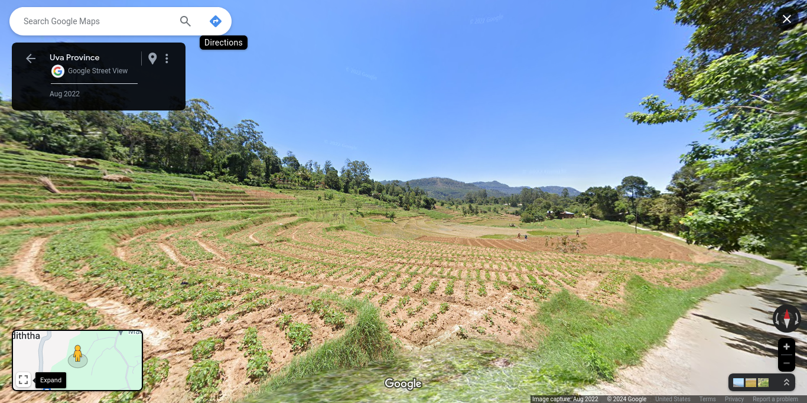

## Amupitiya

**Amupitiya** Grama Niladhari Division, **Medadumbara** Divisional Secretariat Division, **Kandy** District, **Central** Province

**Teldeniya** Polling Division, **Kandy** Electoral District

Population: 797 (2012)

(**LK-2124150**/778)

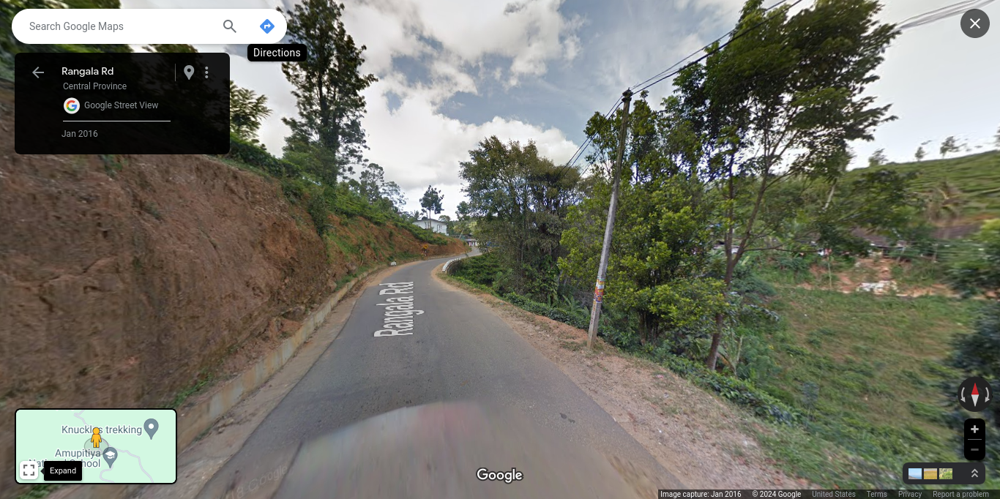

## Kapparathota South

**Kapparathota South** Grama Niladhari Division, **Weligama** Divisional Secretariat Division, **Matara** District, **Southern** Province

**Weligama** Polling Division, **Matara** Electoral District

Population: 1,339 (2012)

(**LK-3239195**/386C)

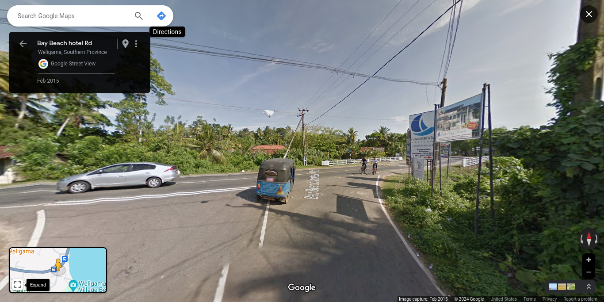

## Datagamuwa

**Datagamuwa** Grama Niladhari Division, **Katharagama** Divisional Secretariat Division, **Moneragala** District, **Uva** Province

**Wellawaya** Polling Division, **Moneragala** Electoral District

Population: 4,777 (2012)

(**LK-8227015**/146B)

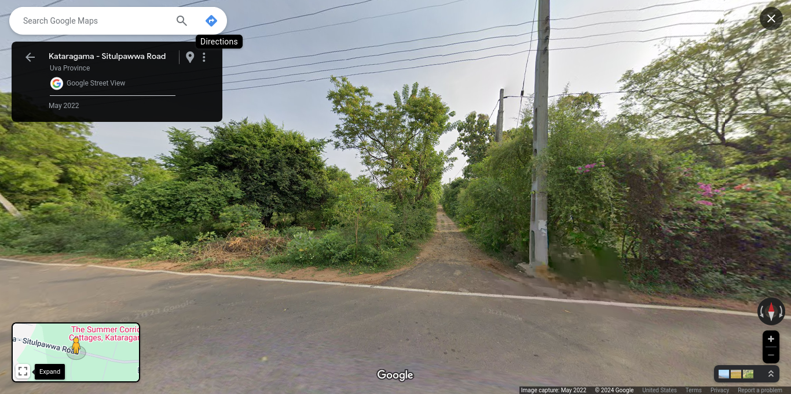

## Thennalanda

**Thennalanda** Grama Niladhari Division, **Medadumbara** Divisional Secretariat Division, **Kandy** District, **Central** Province

**Teldeniya** Polling Division, **Kandy** Electoral District

Population: 522 (2012)

(**LK-2124455**/820)

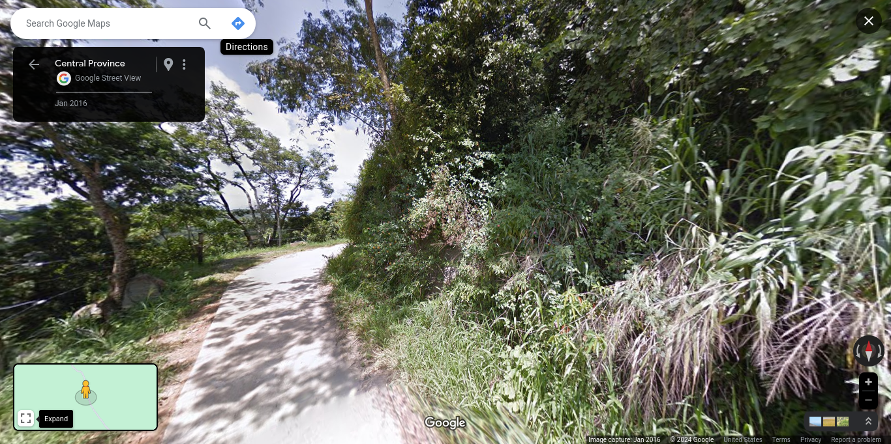

## Wennappuwa West

**Wennappuwa West** Grama Niladhari Division, **Wennappuwa** Divisional Secretariat Division, **Puttalam** District, **North Western** Province

**Wennappuwa** Polling Division, **Puttalam** Electoral District

Population: 1,684 (2012)

(**LK-6245075**/491C)

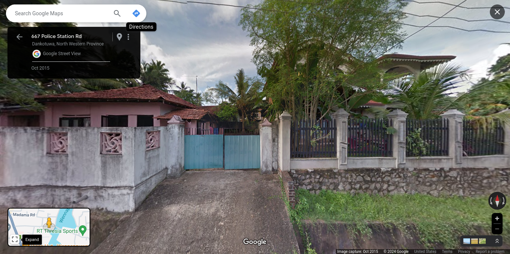

## C.P.Pura

**C.P.Pura** Grama Niladhari Division, **Hingurakgoda** Divisional Secretariat Division, **Polonnaruwa** District, **North Central** Province

**Minneriya** Polling Division, **Polonnaruwa** Electoral District

Population: 1,361 (2012)

(**LK-7203175**/54)

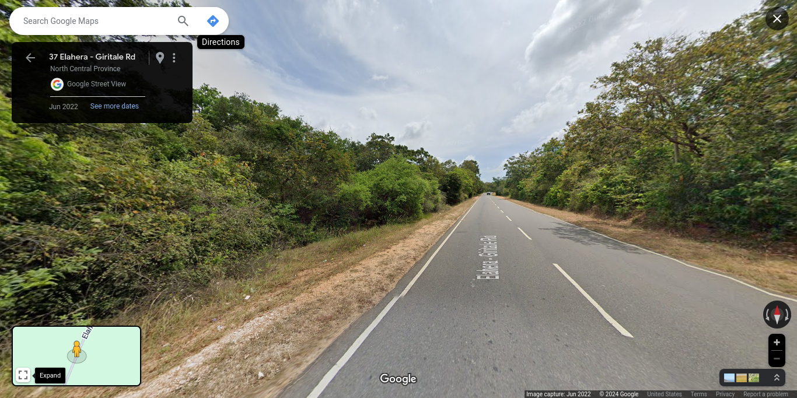

## Kahagalla

**Kahagalla** Grama Niladhari Division, **Bentota** Divisional Secretariat Division, **Galle** District, **Southern** Province

**Bentara Elpitiya** Polling Division, **Galle** Electoral District

Population: 662 (2012)

(**LK-3103045**/5A)

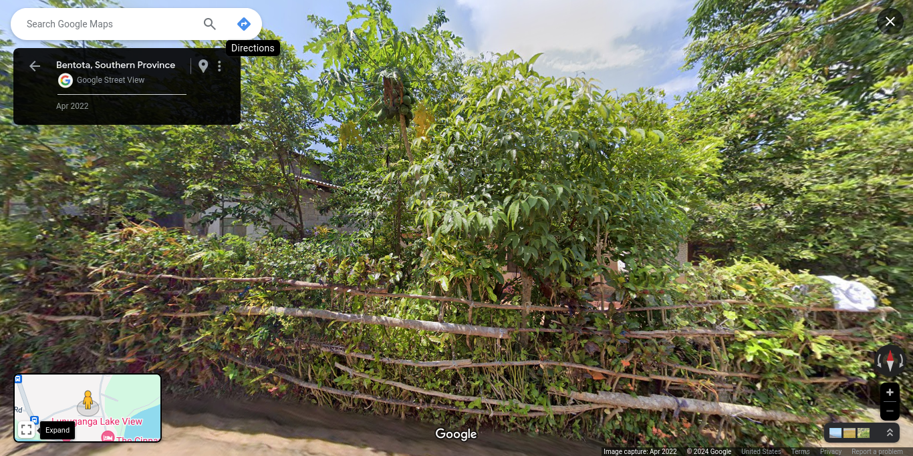

## Ihala Pannala

**Ihala Pannala** Grama Niladhari Division, **Walapane** Divisional Secretariat Division, **Nuwara Eliya** District, **Central** Province

**Walapane** Polling Division, **Nuwara-Eliya** Electoral District

Population: 311 (2012)

(**LK-2309115**/513D)

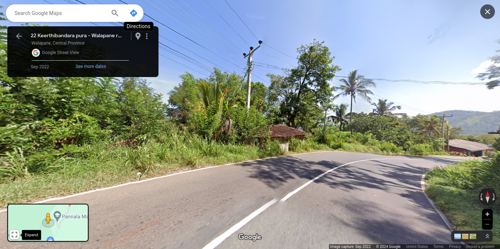

## Embilladeniya

**Embilladeniya** Grama Niladhari Division, **Kaduwela** Divisional Secretariat Division, **Colombo** District, **Western** Province

**Kaduwela** Polling Division, **Colombo** Electoral District

Population: 1,876 (2012)

(**LK-1109105**/480B)

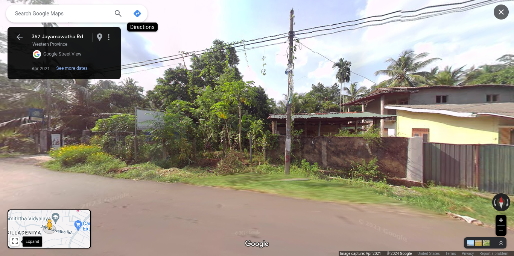

## Abhayapura

**Abhayapura** Grama Niladhari Division, **Padaviya** Divisional Secretariat Division, **Anuradhapura** District, **North Central** Province

**Medawachchiya** Polling Division, **Anuradhapura** Electoral District

Population: 1,779 (2012)

(**LK-7103015**/9)

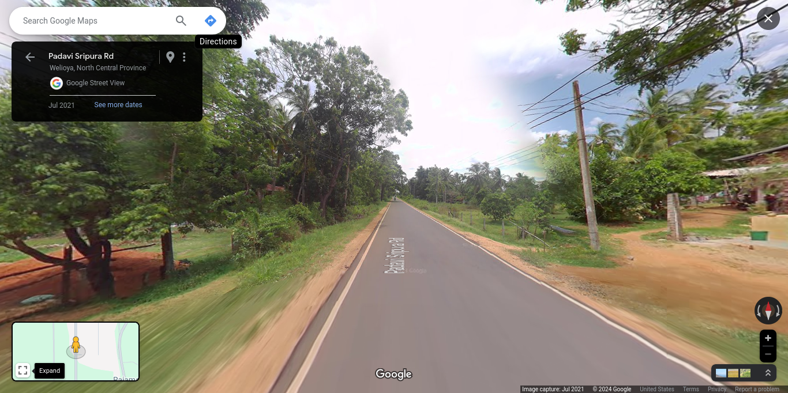

## Weralupa

**Weralupa** Grama Niladhari Division, **Ratnapura** Divisional Secretariat Division, **Ratnapura** District, **Sabaragamuwa** Province

**Ratnapura** Polling Division, **Ratnapura** Electoral District

Population: 5,019 (2012)

(**LK-9112185**/152B)

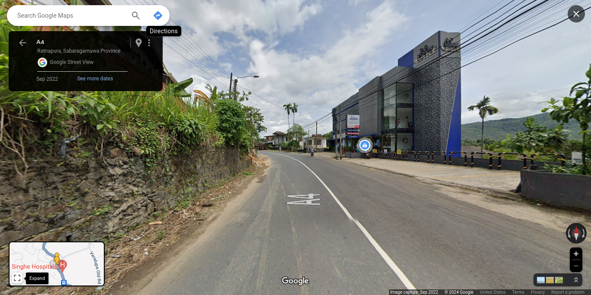

## Vantharumoolai East

**Vantharumoolai East** Grama Niladhari Division, **Eravur Pattu** Divisional Secretariat Division, **Batticaloa** District, **Eastern** Province

**Kalkudah** Polling Division, **Batticaloa** Electoral District

Population: 3,950 (2012)

(**LK-5112065**/197)

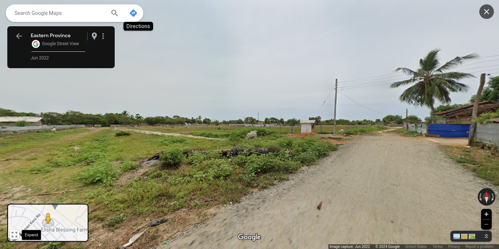

## Wehera West

**Wehera West** Grama Niladhari Division, **Kurunegala** Divisional Secretariat Division, **Kurunegala** District, **North Western** Province

**Kurunegala** Polling Division, **Kurunegala** Electoral District

Population: 1,213 (2012)

(**LK-6154205**/806)

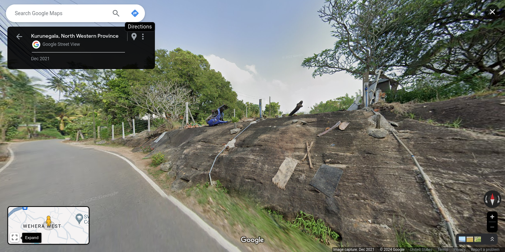

## Weragoda

**Weragoda** Grama Niladhari Division, **Mawanella** Divisional Secretariat Division, **Kegalle** District, **Sabaragamuwa** Province

**Mawanella** Polling Division, **Kegalle** Electoral District

Population: 546 (2012)

(**LK-9206285**/37C)

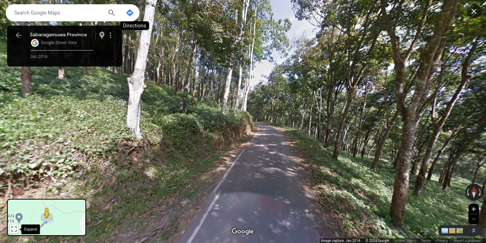

## Yakkala South

**Yakkala South** Grama Niladhari Division, **Gampaha** Divisional Secretariat Division, **Gampaha** District, **Western** Province

**Gampaha** Polling Division, **Gampaha** Electoral District

Population: 1,892 (2012)

(**LK-1224305**/231C)

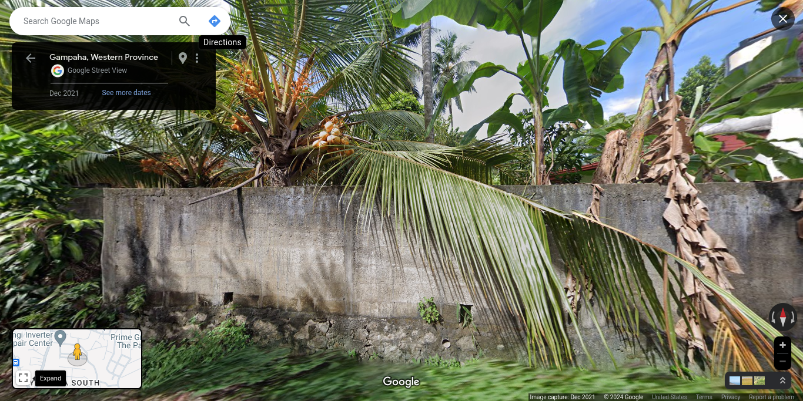

## Kurunegala Town - Bazaar

**Kurunegala Town - Bazaar** Grama Niladhari Division, **Kurunegala** Divisional Secretariat Division, **Kurunegala** District, **North Western** Province

**Kurunegala** Polling Division, **Kurunegala** Electoral District

Population: 475 (2012)

(**LK-6154160**/840)

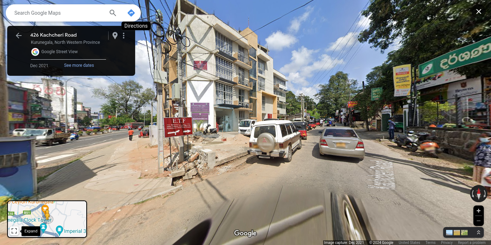

## Mahakanda

**Mahakanda** Grama Niladhari Division, **Ruwanwella** Divisional Secretariat Division, **Kegalle** District, **Sabaragamuwa** Province

**Ruwanwella** Polling Division, **Kegalle** Electoral District

Population: 1,125 (2012)

(**LK-9221025**/98B)

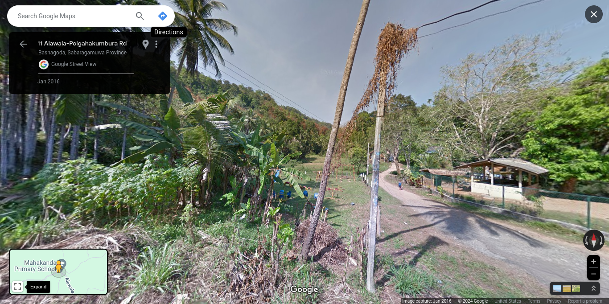

## Amandoluwa

**Amandoluwa** Grama Niladhari Division, **Katana** Divisional Secretariat Division, **Gampaha** District, **Western** Province

**Katana** Polling Division, **Gampaha** Electoral District

Population: 8,538 (2012)

(**LK-1206265**/148)

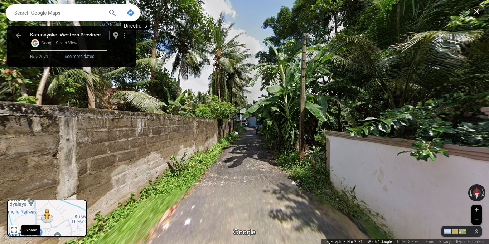

## Kadurugasmulla

**Kadurugasmulla** Grama Niladhari Division, **Beruwala** Divisional Secretariat Division, **Kalutara** District, **Western** Province

**Beruwala** Polling Division, **Kalutara** Electoral District

Population: 1,965 (2012)

(**LK-1324175**/745A)

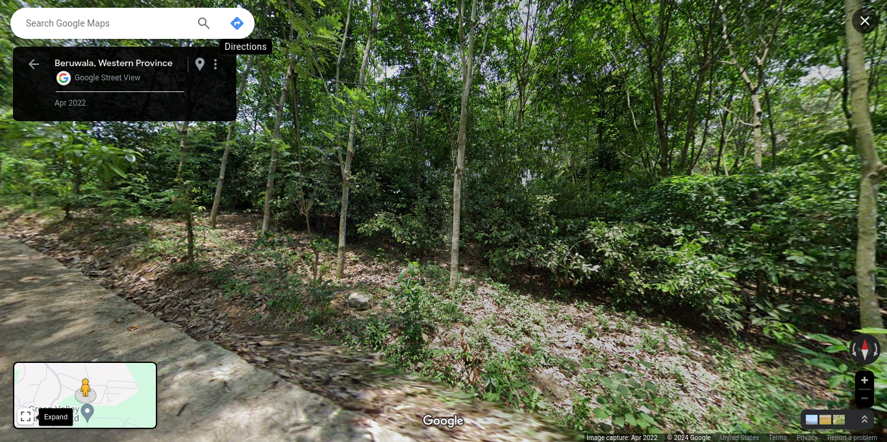

## Pakkiyawatta 2

**Pakkiyawatta 2** Grama Niladhari Division, **Pothuvil** Divisional Secretariat Division, **Ampara** District, **Eastern** Province

**Pothuvil** Polling Division, **Digamadulla** Electoral District

Population: 983 (2012)

(**LK-5248060**/P/14)

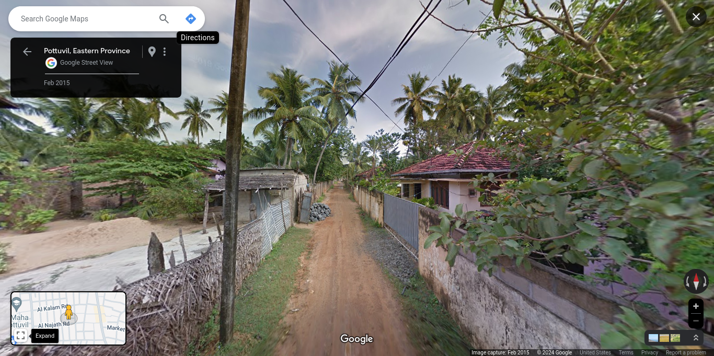

## Pinwatta

**Pinwatta** Grama Niladhari Division, **Panadura** Divisional Secretariat Division, **Kalutara** District, **Western** Province

**Panadura** Polling Division, **Kalutara** Electoral District

Population: 3,409 (2012)

(**LK-1303295**/696)

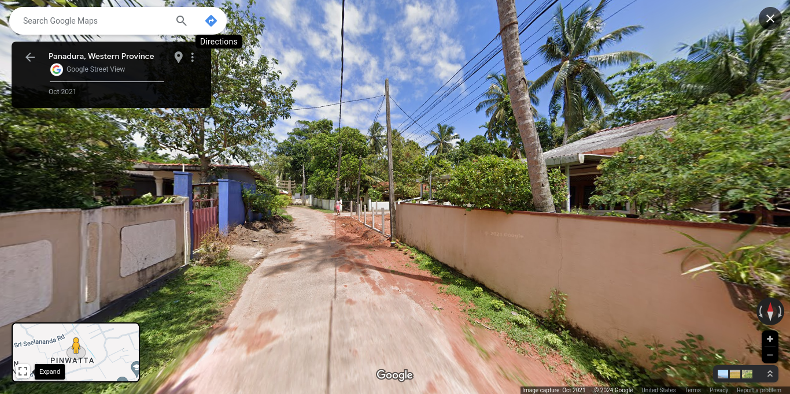

## Keraminiya

**Keraminiya** Grama Niladhari Division, **Ambalangoda** Divisional Secretariat Division, **Galle** District, **Southern** Province

**Ambalangoda** Polling Division, **Galle** Electoral District

Population: 1,704 (2012)

(**LK-3133030**/86B)

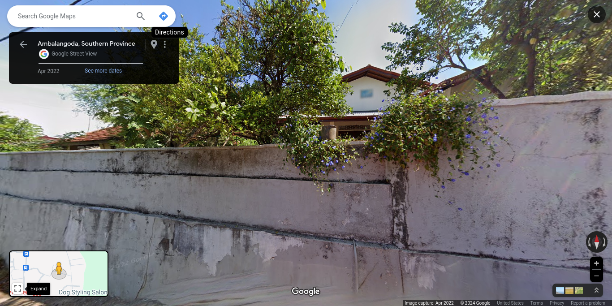

## Hikkaduwa West

**Hikkaduwa West** Grama Niladhari Division, **Hikkaduwa** Divisional Secretariat Division, **Galle** District, **Southern** Province

**Ratgama** Polling Division, **Galle** Electoral District

Population: 1,435 (2012)

(**LK-3136215**/59)

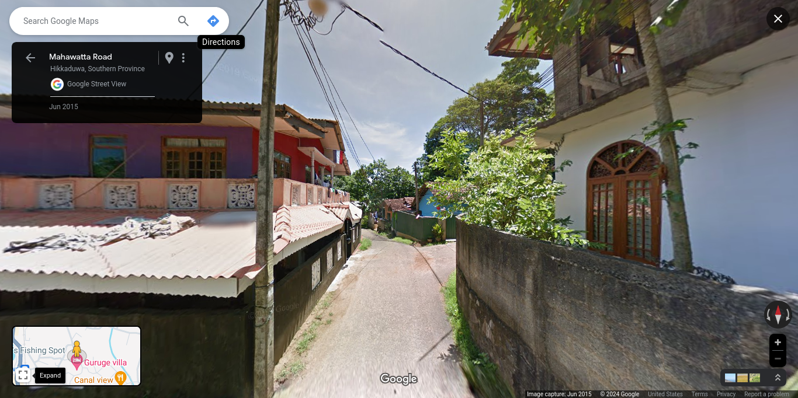

## Bogoda

**Bogoda** Grama Niladhari Division, **Bamunakotuwa** Divisional Secretariat Division, **Kurunegala** District, **North Western** Province

**Wariyapola** Polling Division, **Kurunegala** Electoral District

Population: 698 (2012)

(**LK-6149115**/1207)

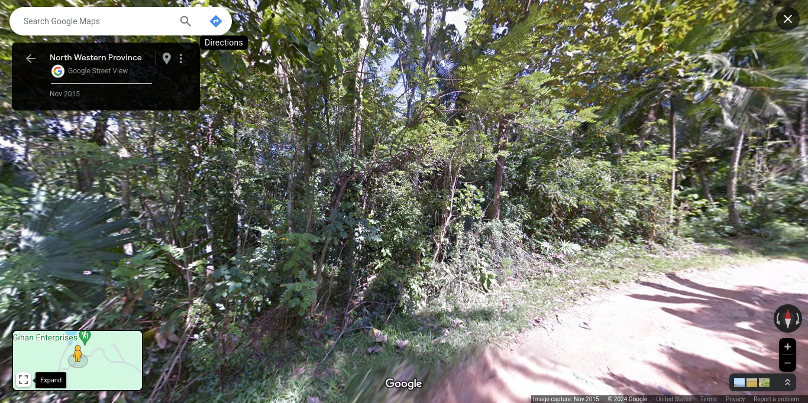

## Kuppilan South

**Kuppilan South** Grama Niladhari Division, **Valikamam South (Uduvil)** Divisional Secretariat Division, **Jaffna** District, **Northern** Province

**Manipay** Polling Division, **Jaffna** Electoral District

Population: 1,815 (2012)

(**LK-4115145**/J/210)

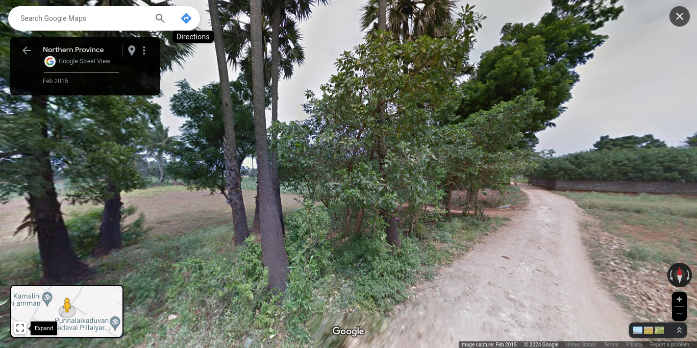

## Paragoda

**Paragoda** Grama Niladhari Division, **Hatharaliyadda** Divisional Secretariat Division, **Kandy** District, **Central** Province

**Galagedara** Polling Division, **Kandy** Electoral District

Population: 354 (2012)

(**LK-2134005**/375)

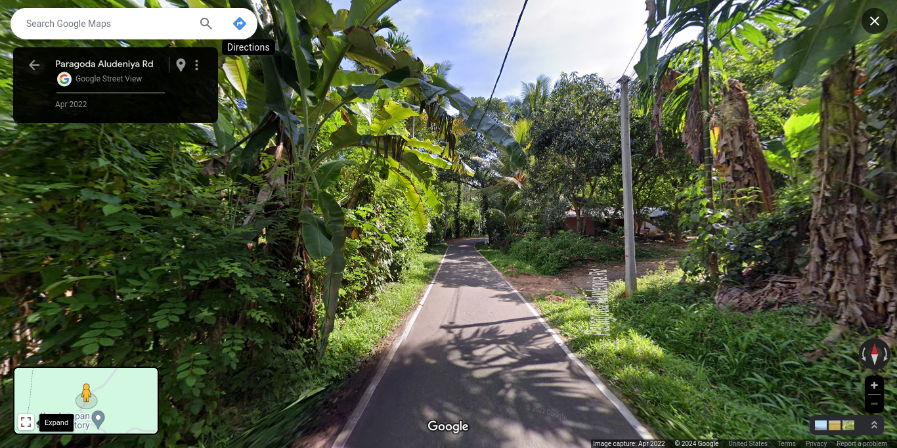

## Ketandola

**Ketandola** Grama Niladhari Division, **Akmeemana** Divisional Secretariat Division, **Galle** District, **Southern** Province

**Akmeemana** Polling Division, **Galle** Electoral District

Population: 822 (2012)

(**LK-3145030**/155C)

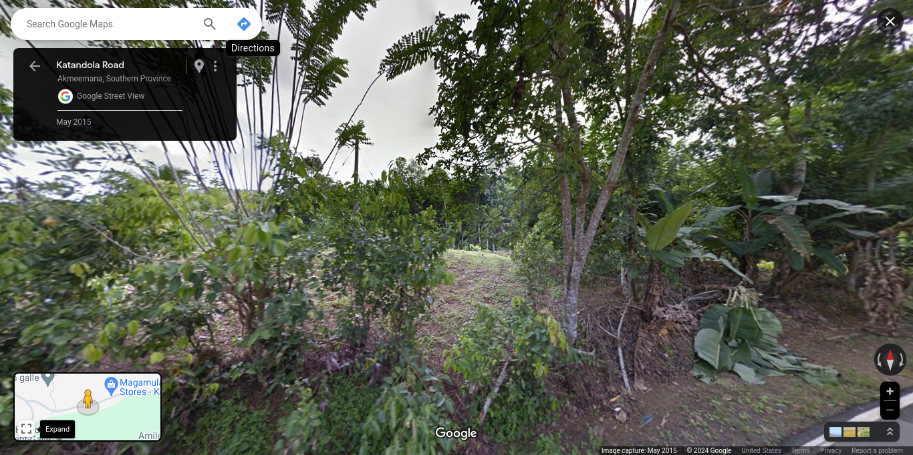

## Sinharoopagama

**Sinharoopagama** Grama Niladhari Division, **Bentota** Divisional Secretariat Division, **Galle** District, **Southern** Province

**Bentara Elpitiya** Polling Division, **Galle** Electoral District

Population: 1,154 (2012)

(**LK-3103010**/3B)

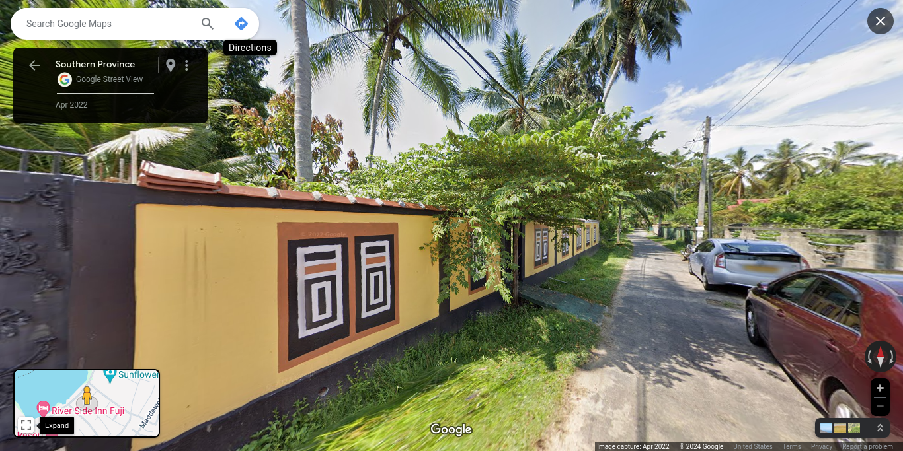

## Yabaraluwa South

**Yabaraluwa South** Grama Niladhari Division, **Biyagama** Divisional Secretariat Division, **Gampaha** District, **Western** Province

**Biyagama** Polling Division, **Gampaha** Electoral District

Population: 2,076 (2012)

(**LK-1239235**/280E)

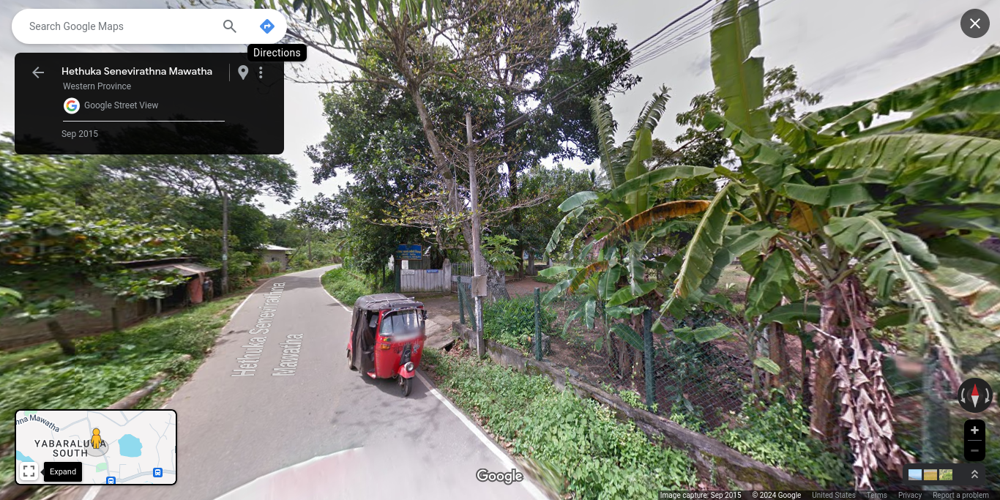

## Hathalispahuwa

**Hathalispahuwa** Grama Niladhari Division, **Polgahawela** Divisional Secretariat Division, **Kurunegala** District, **North Western** Province

**Polgahawela** Polling Division, **Kurunegala** Electoral District

Population: 459 (2012)

(**LK-6187250**/963)

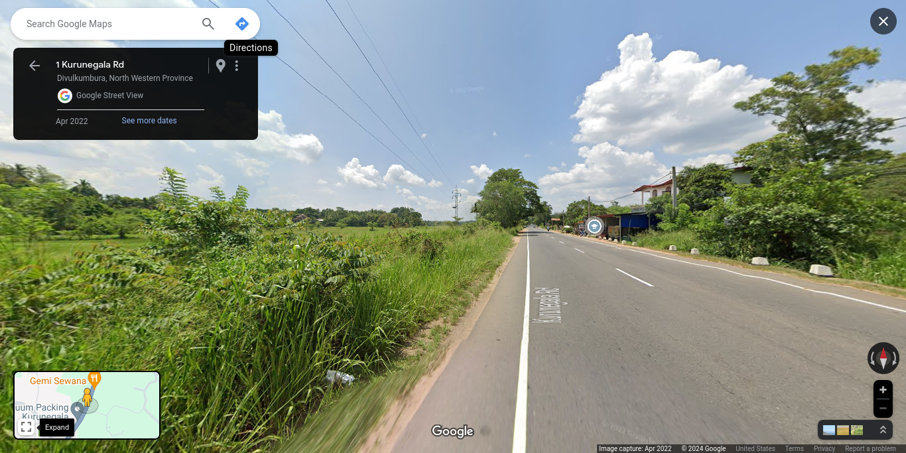

## Matagoda

**Matagoda** Grama Niladhari Division, **Wattala** Divisional Secretariat Division, **Gampaha** District, **Western** Province

**Wattala** Polling Division, **Gampaha** Electoral District

Population: 7,607 (2012)

(**LK-1218140**/171A)

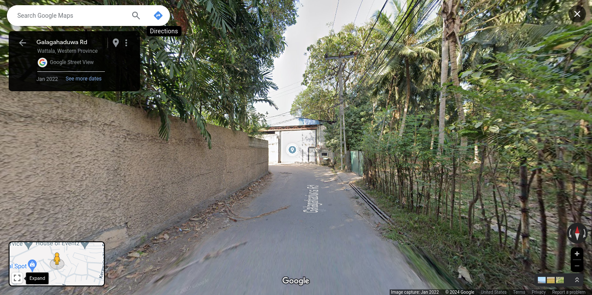

## Madapola

**Madapola** Grama Niladhari Division, **Medadumbara** Divisional Secretariat Division, **Kandy** District, **Central** Province

**Teldeniya** Polling Division, **Kandy** Electoral District

Population: 955 (2012)

(**LK-2124225**/761)

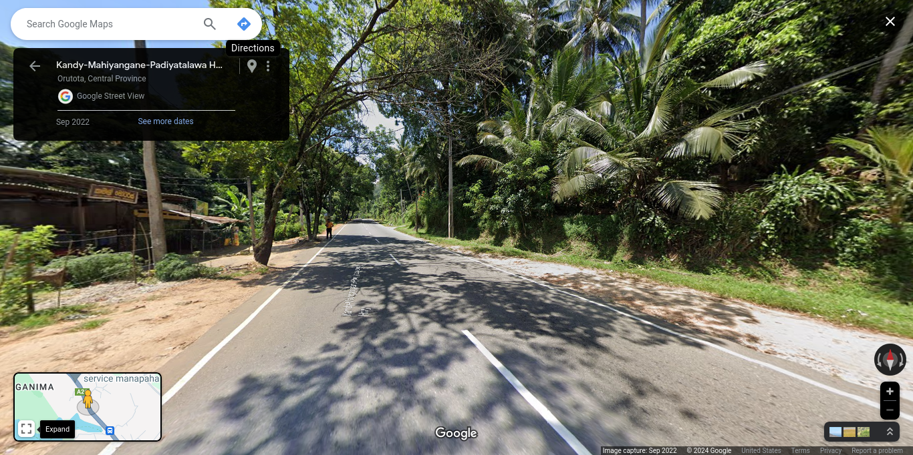

## Yagodamulla North

**Yagodamulla North** Grama Niladhari Division, **Minuwangoda** Divisional Secretariat Division, **Gampaha** District, **Western** Province

**Minuwangoda** Polling Division, **Gampaha** Electoral District

Population: 2,077 (2012)

(**LK-1215440**/119/3)

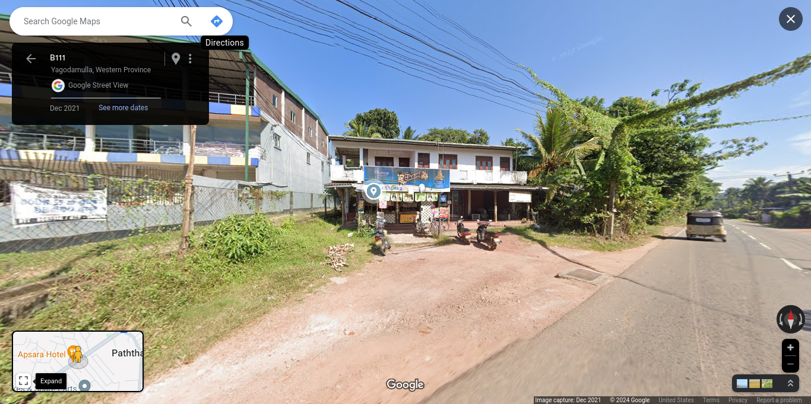

## Santhiveli

**Santhiveli** Grama Niladhari Division, **Koralai Pattu South (Kiran)** Divisional Secretariat Division, **Batticaloa** District, **Eastern** Province

**Kalkudah** Polling Division, **Batticaloa** Electoral District

Population: 3,156 (2012)

(**LK-5110065**/200)

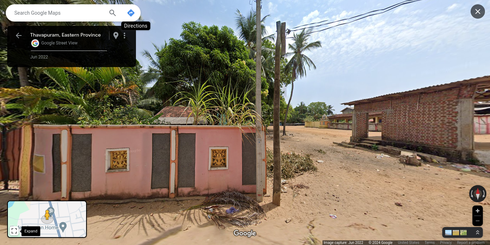

## Nelumvila

**Nelumvila** Grama Niladhari Division, **Thamankaduwa** Divisional Secretariat Division, **Polonnaruwa** District, **North Central** Province

**Polonnaruwa** Polling Division, **Polonnaruwa** Electoral District

Population: 1,528 (2012)

(**LK-7215185**/182)

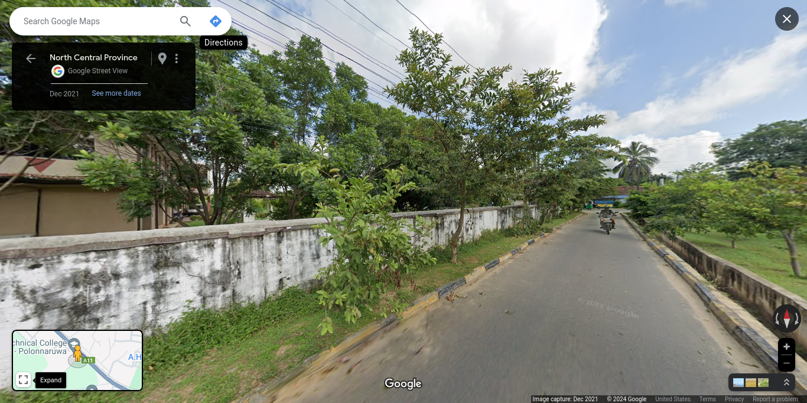

## Degaldoruwa

**Degaldoruwa** Grama Niladhari Division, **Kundasale** Divisional Secretariat Division, **Kandy** District, **Central** Province

**Kundasale** Polling Division, **Kandy** Electoral District

Population: 1,031 (2012)

(**LK-2127200**/652)

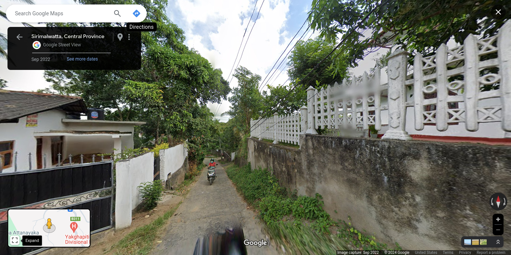

## Thavady South

**Thavady South** Grama Niladhari Division, **Valikamam South (Uduvil)** Divisional Secretariat Division, **Jaffna** District, **Northern** Province

**Manipay** Polling Division, **Jaffna** Electoral District

Population: 2,215 (2012)

(**LK-4115055**/J/192)

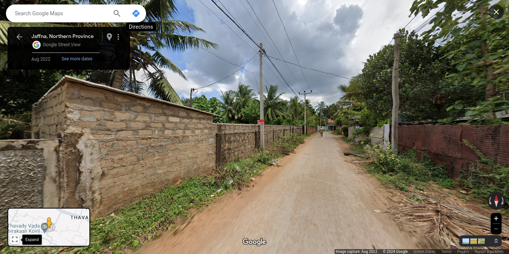

## Pulopallai West

**Pulopallai West** Grama Niladhari Division, **Pachchilaipalli** Divisional Secretariat Division, **Kilinochchi** District, **Northern** Province

**Kilinochchi** Polling Division, **Jaffna** Electoral District

Population: 428 (2012)

(**LK-4503070**/KN/88)

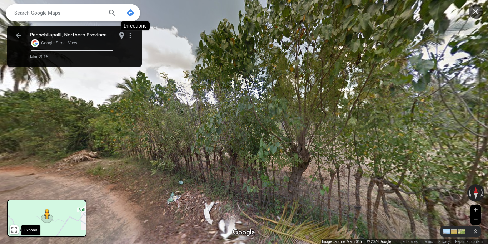

## Putupagala

**Putupagala** Grama Niladhari Division, **Dompe** Divisional Secretariat Division, **Gampaha** District, **Western** Province

**Dompe** Polling Division, **Gampaha** Electoral District

Population: 1,248 (2012)

(**LK-1230340**/396)

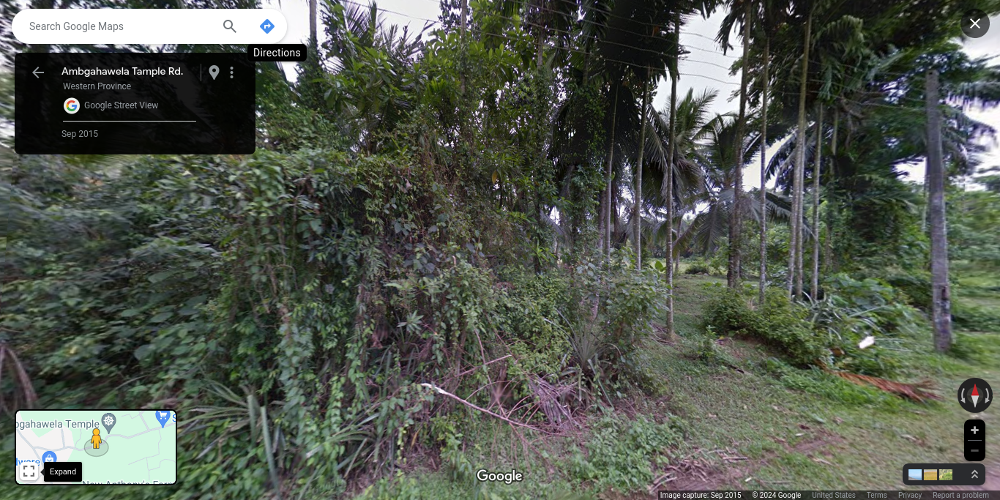

## Ninthavur 08

**Ninthavur 08** Grama Niladhari Division, **Ninthavur** Divisional Secretariat Division, **Ampara** District, **Eastern** Province

**Pothuvil** Polling Division, **Digamadulla** Electoral District

Population: 1,485 (2012)

(**LK-5230100**/37B)

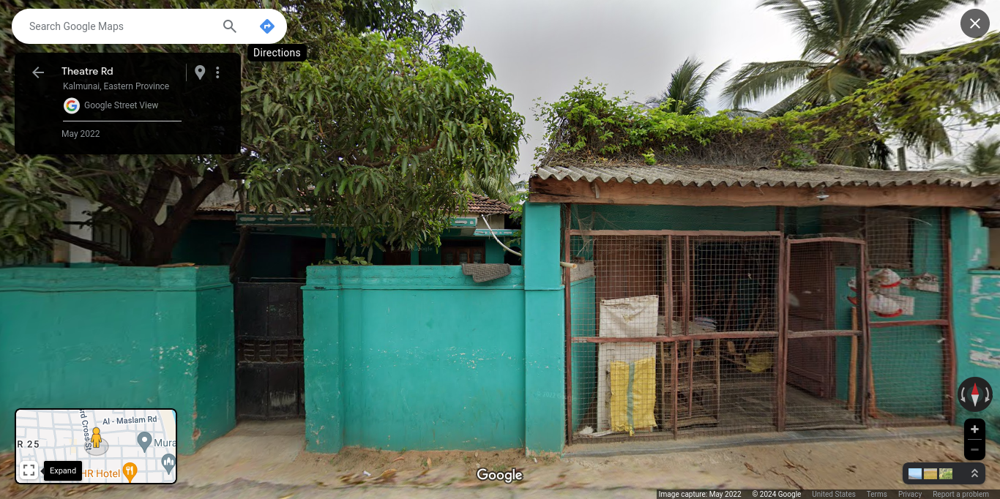

## Sinhapitiya South

**Sinhapitiya South** Grama Niladhari Division, **Udapalatha** Divisional Secretariat Division, **Kandy** District, **Central** Province

**Gampola** Polling Division, **Kandy** Electoral District

Population: 1,155 (2012)

(**LK-2151085**/1118)

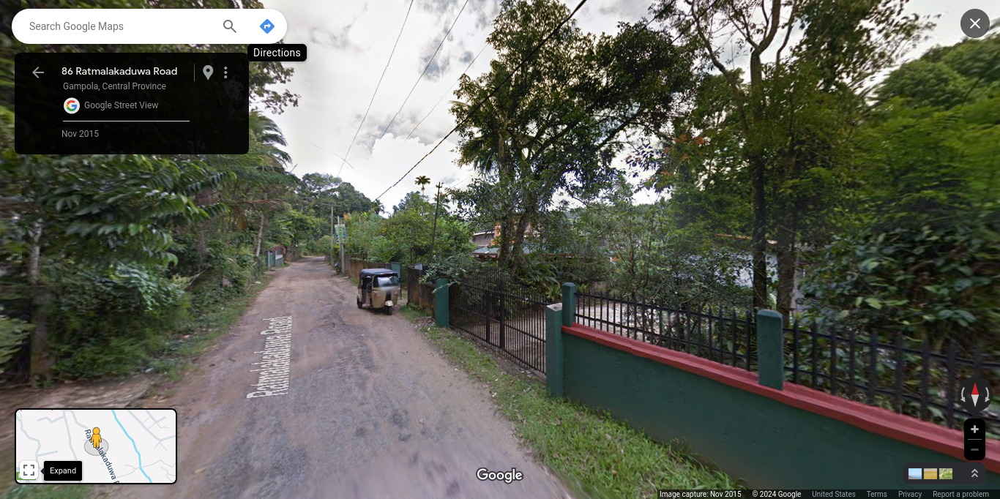

## Neelammahara

**Neelammahara** Grama Niladhari Division, **Kesbewa** Divisional Secretariat Division, **Colombo** District, **Western** Province

**Kesbewa** Polling Division, **Colombo** Electoral District

Population: 3,358 (2012)

(**LK-1136070**/579)

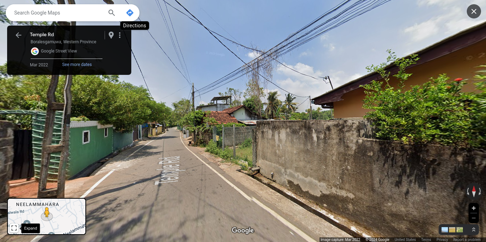

## Devinuwara Nugegoda

**Devinuwara Nugegoda** Grama Niladhari Division, **Devinuwara** Divisional Secretariat Division, **Matara** District, **Southern** Province

**Devinuwara** Polling Division, **Matara** Electoral District

Population: 1,497 (2012)

(**LK-3245165**/433D)

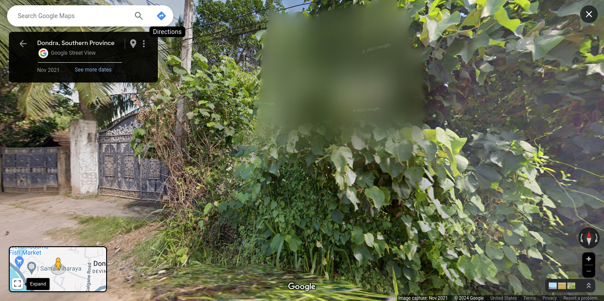

## Badulla East

**Badulla East** Grama Niladhari Division, **Badulla** Divisional Secretariat Division, **Badulla** District, **Uva** Province

**Badulla** Polling Division, **Badulla** Electoral District

Population: 4,159 (2012)

(**LK-8121090**/78B)

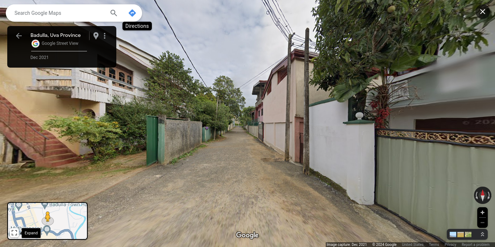

## Neelawala

**Neelawala** Grama Niladhari Division, **Pathahewaheta** Divisional Secretariat Division, **Kandy** District, **Central** Province

**Hewaheta** Polling Division, **Kandy** Electoral District

Population: 624 (2012)

(**LK-2145365**/1020)

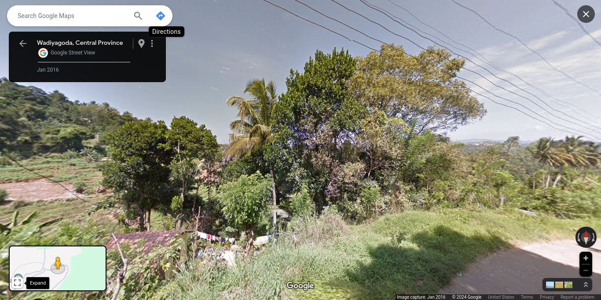

## Korakallimadu

**Korakallimadu** Grama Niladhari Division, **Koralai Pattu South (Kiran)** Divisional Secretariat Division, **Batticaloa** District, **Eastern** Province

**Kalkudah** Polling Division, **Batticaloa** Electoral District

Population: 2,030 (2012)

(**LK-5110060**/203C)

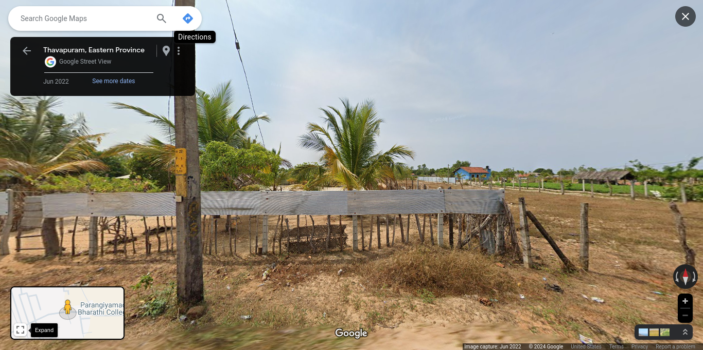

## Diyagala

**Diyagala** Grama Niladhari Division, **Mathugama** Divisional Secretariat Division, **Kalutara** District, **Western** Province

**Mathugama** Polling Division, **Kalutara** Electoral District

Population: 1,005 (2012)

(**LK-1330080**/802C)

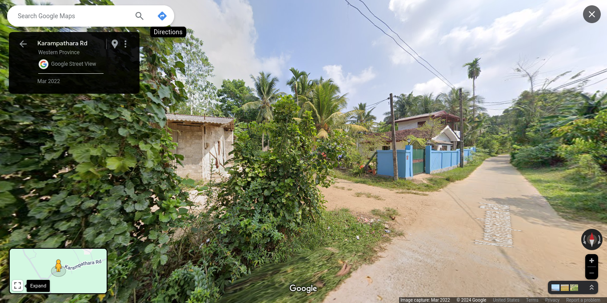

## Udagama

**Udagama** Grama Niladhari Division, **Dompe** Divisional Secretariat Division, **Gampaha** District, **Western** Province

**Dompe** Polling Division, **Gampaha** Electoral District

Population: 1,780 (2012)

(**LK-1230135**/384)

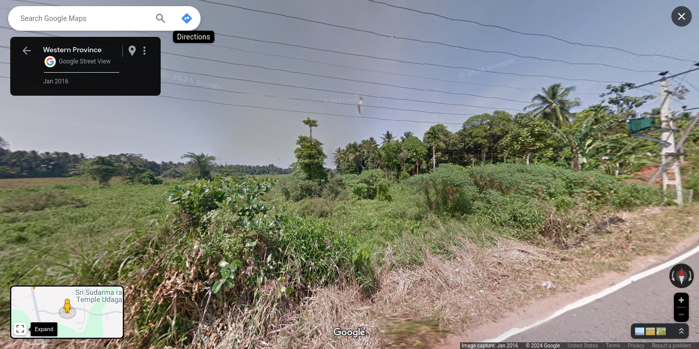

## Mihinthale

**Mihinthale** Grama Niladhari Division, **Mihinthale** Divisional Secretariat Division, **Anuradhapura** District, **North Central** Province

**Mihinthale** Polling Division, **Anuradhapura** Electoral District

Population: 4,263 (2012)

(**LK-7130060**/577)

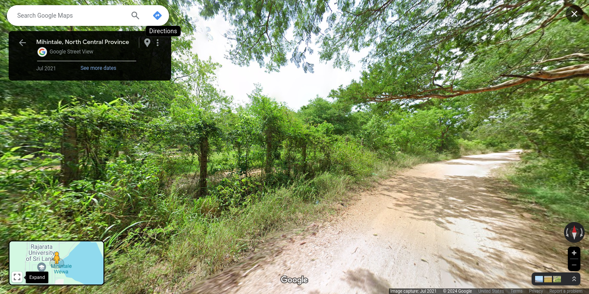

## Mahaulpatha

**Mahaulpatha** Grama Niladhari Division, **Dimbulagala** Divisional Secretariat Division, **Polonnaruwa** District, **North Central** Province

**Polonnaruwa** Polling Division, **Polonnaruwa** Electoral District

Population: 753 (2012)

(**LK-7212085**/251)

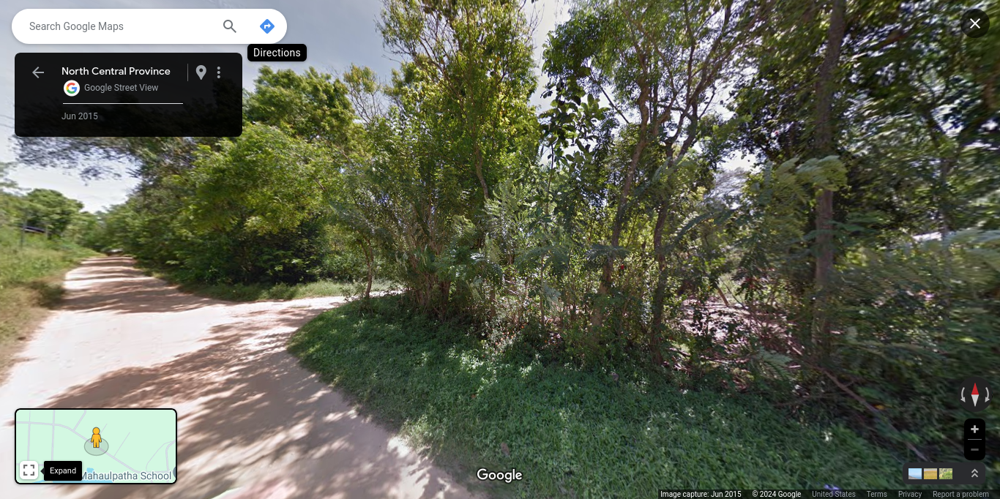

## Gangodavila North

**Gangodavila North** Grama Niladhari Division, **Sri Jayawardanapura Kotte** Divisional Secretariat Division, **Colombo** District, **Western** Province

**Kotte** Polling Division, **Colombo** Electoral District

Population: 5,352 (2012)

(**LK-1124090**/526)

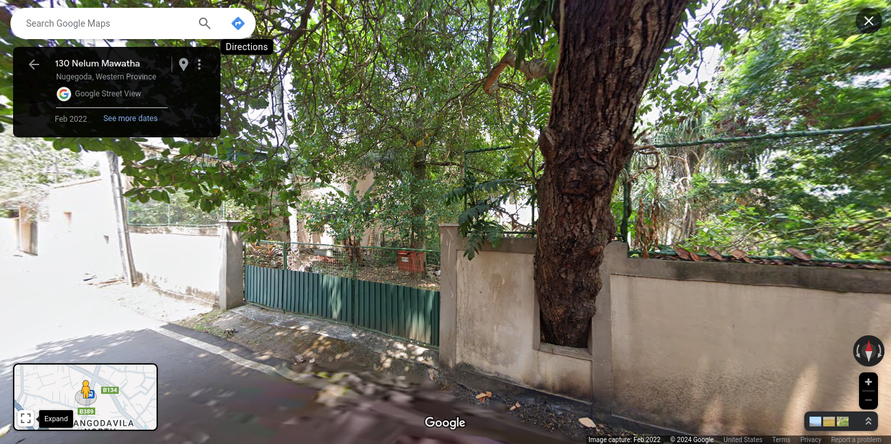

## Udagunnepana North

**Udagunnepana North** Grama Niladhari Division, **Kundasale** Divisional Secretariat Division, **Kandy** District, **Central** Province

**Kundasale** Polling Division, **Kandy** Electoral District

Population: 1,441 (2012)

(**LK-2127155**/666)

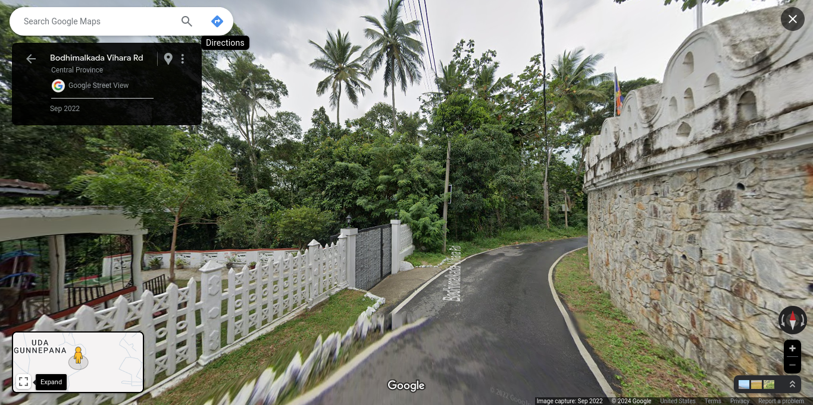

## Akkaraipattu 7

**Akkaraipattu 7** Grama Niladhari Division, **Alayadiwembu** Divisional Secretariat Division, **Ampara** District, **Eastern** Province

**Pothuvil** Polling Division, **Digamadulla** Electoral District

Population: 739 (2012)

(**LK-5239060**/AP/21)

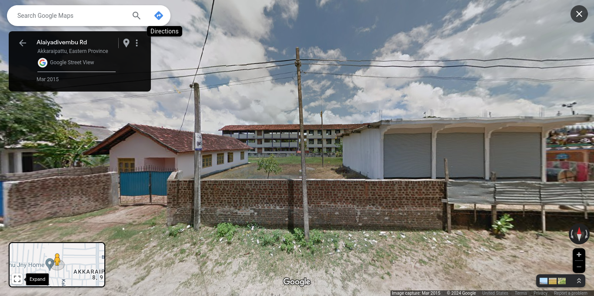

## Thaha Nagar

**Thaha Nagar** Grama Niladhari Division, **Muttur** Divisional Secretariat Division, **Trincomalee** District, **Eastern** Province

**Muttur** Polling Division, **Trincomalee** Electoral District

Population: 1,156 (2012)

(**LK-5327050**/224C)

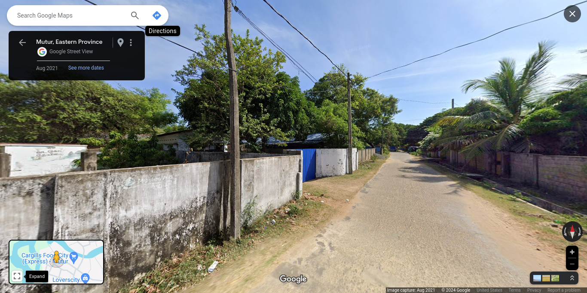

## Pulartan

**Pulartan** Grama Niladhari Division, **Kalutara** Divisional Secretariat Division, **Kalutara** District, **Western** Province

**Kalutara** Polling Division, **Kalutara** Electoral District

Population: 3,741 (2012)

(**LK-1321375**/729C)

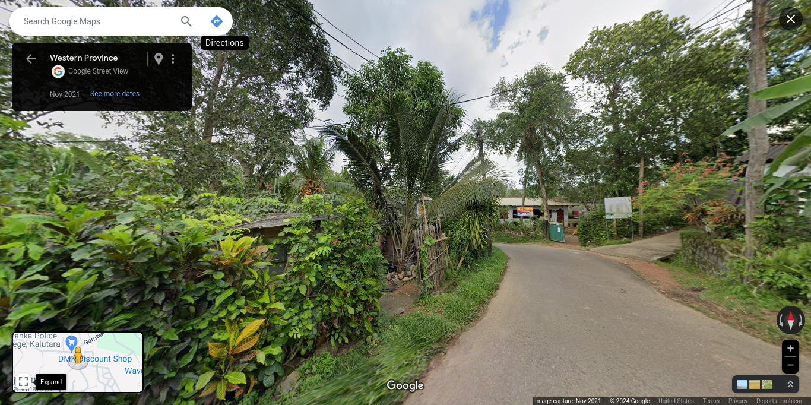

## Kadeweediya East

**Kadeweediya East** Grama Niladhari Division, **Matara Four Gravets** Divisional Secretariat Division, **Matara** District, **Southern** Province

**Matara** Polling Division, **Matara** Electoral District

Population: 2,064 (2012)

(**LK-3242195**/417A)

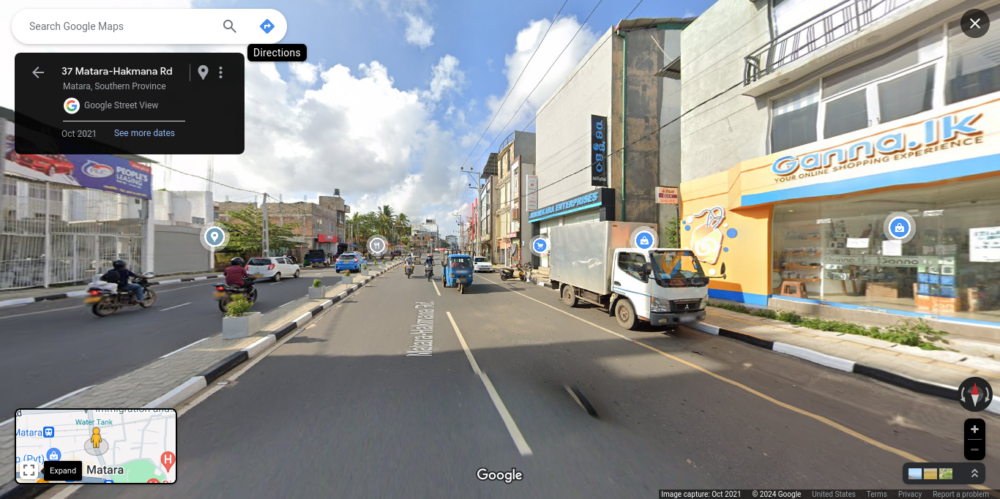

## Kotahena East

**Kotahena East** Grama Niladhari Division, **Colombo** Divisional Secretariat Division, **Colombo** District, **Western** Province

**Colombo North** Polling Division, **Colombo** Electoral District

Population: 6,385 (2012)

(**LK-1103045**/)

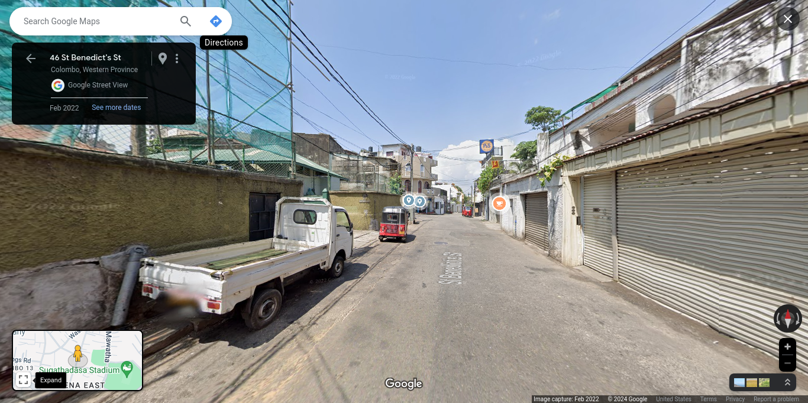

## Pahala Biyanvila West

**Pahala Biyanvila West** Grama Niladhari Division, **Biyagama** Divisional Secretariat Division, **Gampaha** District, **Western** Province

**Biyagama** Polling Division, **Gampaha** Electoral District

Population: 4,708 (2012)

(**LK-1239095**/268A)

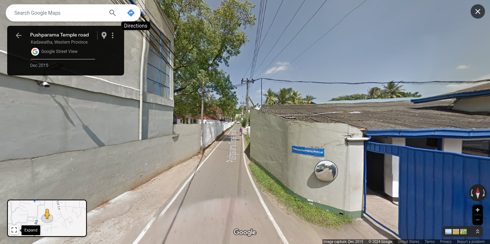

## Udakanampella

**Udakanampella** Grama Niladhari Division, **Dompe** Divisional Secretariat Division, **Gampaha** District, **Western** Province

**Dompe** Polling Division, **Gampaha** Electoral District

Population: 746 (2012)

(**LK-1230430**/424A)

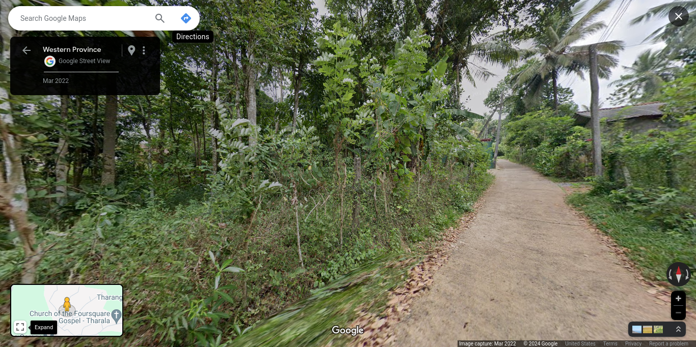

## Glenanore

**Glenanore** Grama Niladhari Division, **Haputale** Divisional Secretariat Division, **Badulla** District, **Uva** Province

**Haputale** Polling Division, **Badulla** Electoral District

Population: 2,383 (2012)

(**LK-8139090**/64F)

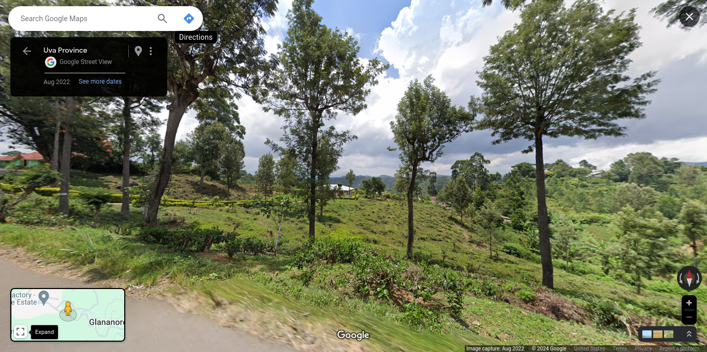

## Eravur 01B

**Eravur 01B** Grama Niladhari Division, **Eravur Town** Divisional Secretariat Division, **Batticaloa** District, **Eastern** Province

**Batticaloa** Polling Division, **Batticaloa** Electoral District

Population: 1,627 (2012)

(**LK-5115045**/190B)

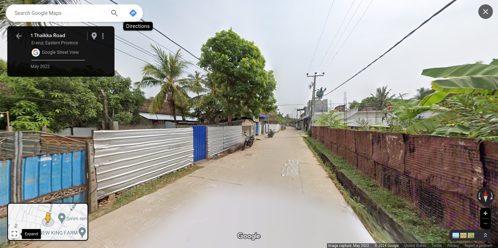

## Moragala

**Moragala** Grama Niladhari Division, **Eheliyagoda** Divisional Secretariat Division, **Ratnapura** District, **Sabaragamuwa** Province

**Eheliyagoda** Polling Division, **Ratnapura** Electoral District

Population: 1,721 (2012)

(**LK-9103110**/136D)

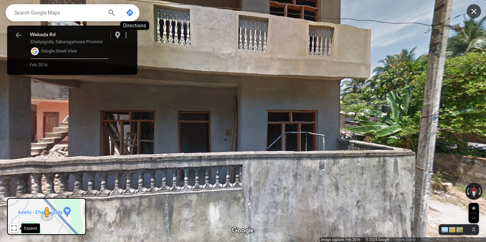

## Thennehenwala

**Thennehenwala** Grama Niladhari Division, **Walapane** Divisional Secretariat Division, **Nuwara Eliya** District, **Central** Province

**Walapane** Polling Division, **Nuwara-Eliya** Electoral District

Population: 460 (2012)

(**LK-2309075**/514D)

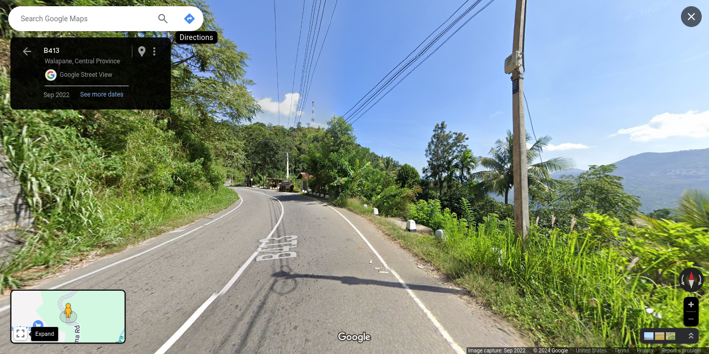

## Wathumulla

**Wathumulla** Grama Niladhari Division, **Ratmalana** Divisional Secretariat Division, **Colombo** District, **Western** Province

**Ratmalana** Polling Division, **Colombo** Electoral District

Population: 4,608 (2012)

(**LK-1131020**/544A)

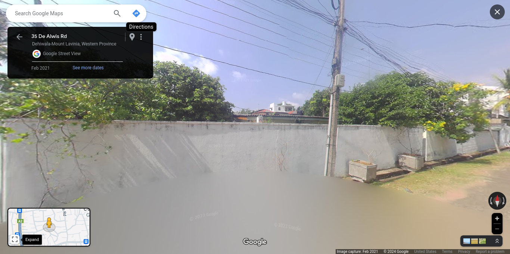

## Kohunugamuwa

**Kohunugamuwa** Grama Niladhari Division, **Weligama** Divisional Secretariat Division, **Matara** District, **Southern** Province

**Weligama** Polling Division, **Matara** Electoral District

Population: 1,368 (2012)

(**LK-3239025**/389)

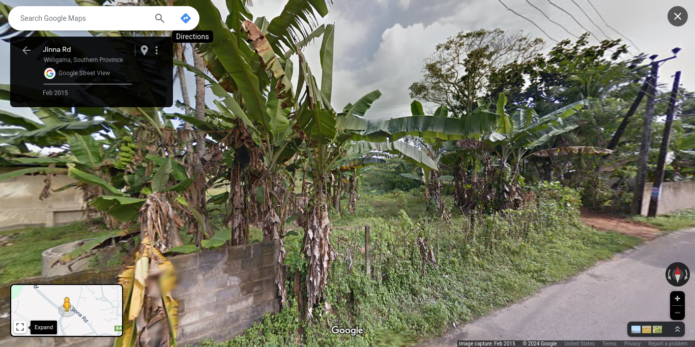

## Kadigawa Track3

**Kadigawa Track3** Grama Niladhari Division, **Rasnayakapura** Divisional Secretariat Division, **Kurunegala** District, **North Western** Province

**Nikaweratiya** Polling Division, **Kurunegala** Electoral District

Population: 943 (2012)

(**LK-6118130**/272)

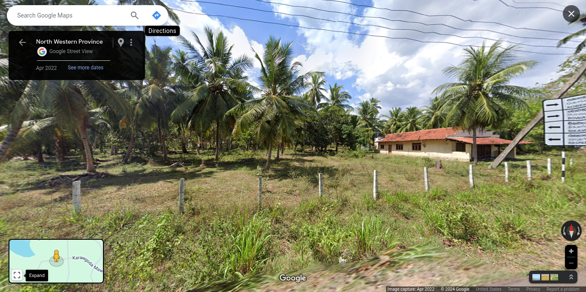

## Akkaraipattu 8/1

**Akkaraipattu 8/1** Grama Niladhari Division, **Alayadiwembu** Divisional Secretariat Division, **Ampara** District, **Eastern** Province

**Pothuvil** Polling Division, **Digamadulla** Electoral District

Population: 531 (2012)

(**LK-5239005**/AV/10)

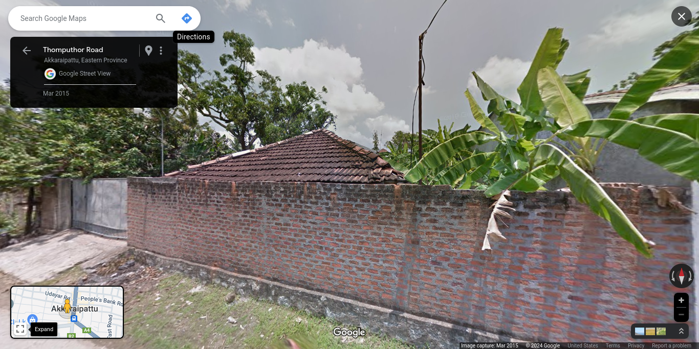

## Mahakanadarawa R.B. Track 1

**Mahakanadarawa R.B. Track 1** Grama Niladhari Division, **Rambewa** Divisional Secretariat Division, **Anuradhapura** District, **North Central** Province

**Anuradhapura East** Polling Division, **Anuradhapura** Electoral District

Population: 926 (2012)

(**LK-7118190**/94)

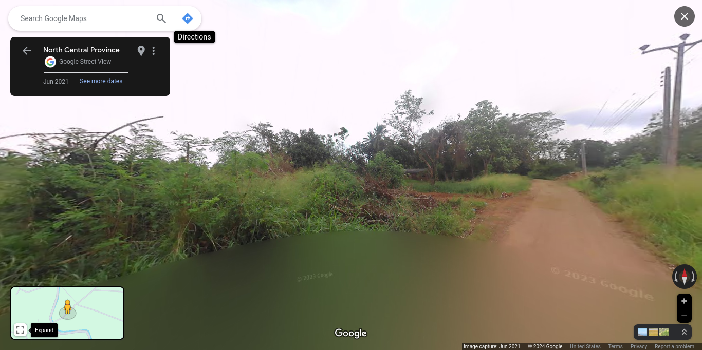

## Horombawa

**Horombawa** Grama Niladhari Division, **Kuliyapitiya East** Divisional Secretariat Division, **Kurunegala** District, **North Western** Province

**Kuliyapitiya** Polling Division, **Kurunegala** Electoral District

Population: 2,837 (2012)

(**LK-6169145**/1134)

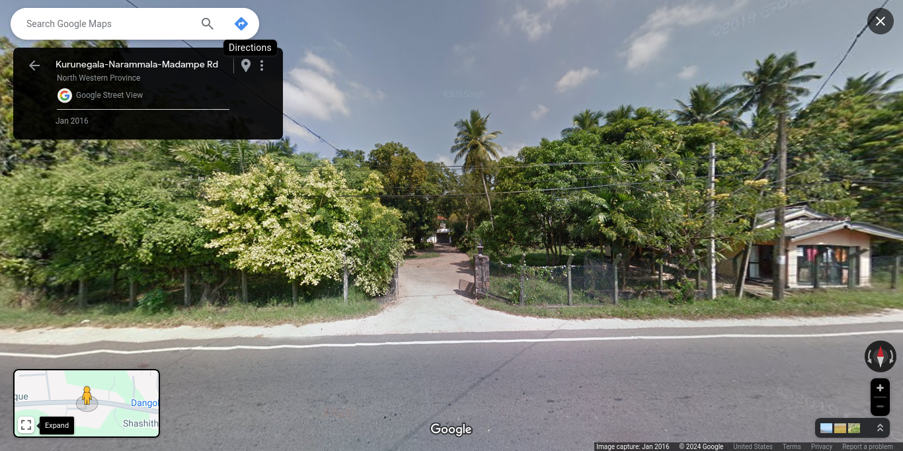

## Kapuwatta

**Kapuwatta** Grama Niladhari Division, **Welipitiya** Divisional Secretariat Division, **Matara** District, **Southern** Province

**Weligama** Polling Division, **Matara** Electoral District

Population: 1,209 (2012)

(**LK-3221175**/396)

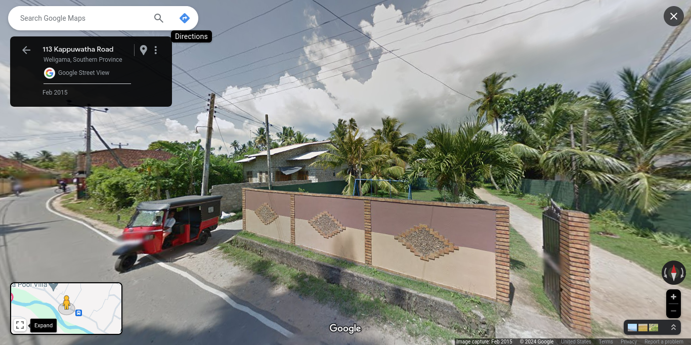

## Delgasgoda

**Delgasgoda** Grama Niladhari Division, **Akurana** Divisional Secretariat Division, **Kandy** District, **Central** Province

**Harispattuwa** Polling Division, **Kandy** Electoral District

Population: 1,658 (2012)

(**LK-2109045**/588)

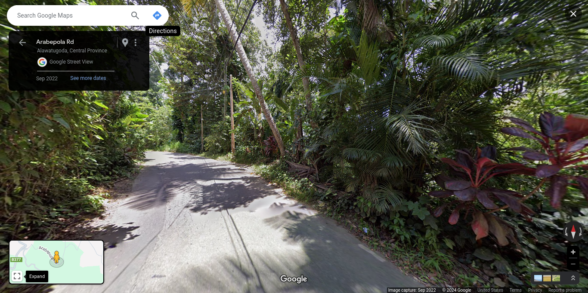

## Pakkiyawatta 2

**Pakkiyawatta 2** Grama Niladhari Division, **Pothuvil** Divisional Secretariat Division, **Ampara** District, **Eastern** Province

**Pothuvil** Polling Division, **Digamadulla** Electoral District

Population: 983 (2012)

(**LK-5248060**/P/14)

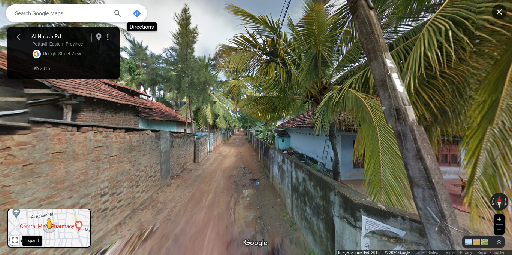

## Raddolugama South A

**Raddolugama South A** Grama Niladhari Division, **Katana** Divisional Secretariat Division, **Gampaha** District, **Western** Province

**Katana** Polling Division, **Gampaha** Electoral District

Population: 1,828 (2012)

(**LK-1206315**/199E)

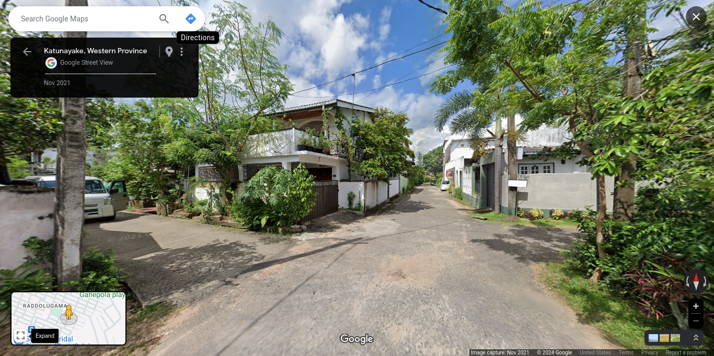

## Atchelu

**Atchelu** Grama Niladhari Division, **Valikamam East (Kopay)** Divisional Secretariat Division, **Jaffna** District, **Northern** Province

**Kopay** Polling Division, **Jaffna** Electoral District

Population: 3,241 (2012)

(**LK-4118115**/J/279)

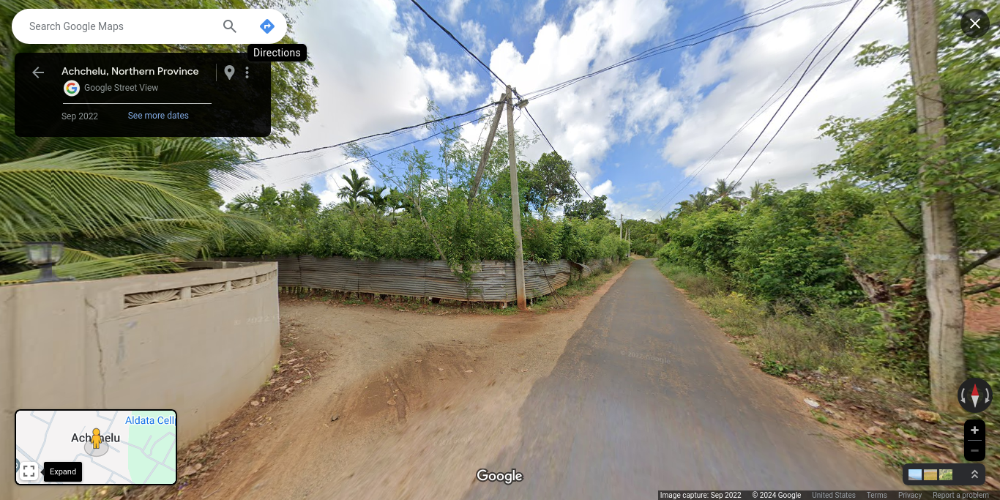

## Uda Eriyagama East

**Uda Eriyagama East** Grama Niladhari Division, **Yatinuwara** Divisional Secretariat Division, **Kandy** District, **Central** Province

**Yatinuwara** Polling Division, **Kandy** Electoral District

Population: 1,268 (2012)

(**LK-2136420**/151)

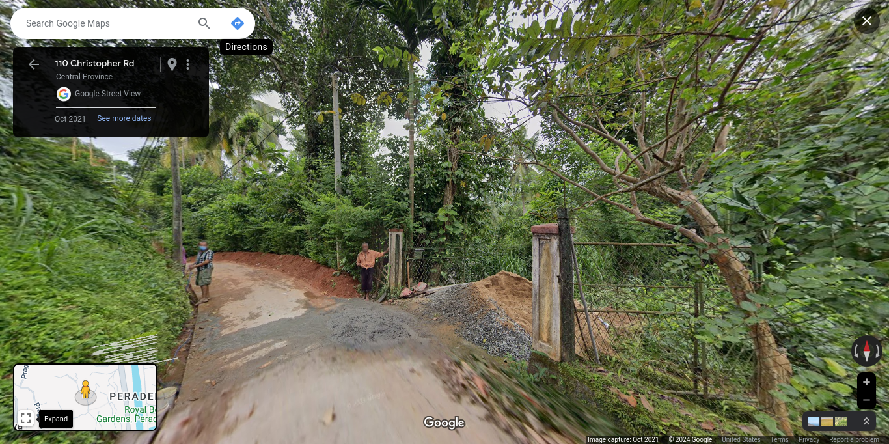

## Lolugaswewa

**Lolugaswewa** Grama Niladhari Division, **Galnewa** Divisional Secretariat Division, **Anuradhapura** District, **North Central** Province

**Kalawewa** Polling Division, **Anuradhapura** Electoral District

Population: 1,112 (2012)

(**LK-7163070**/469)

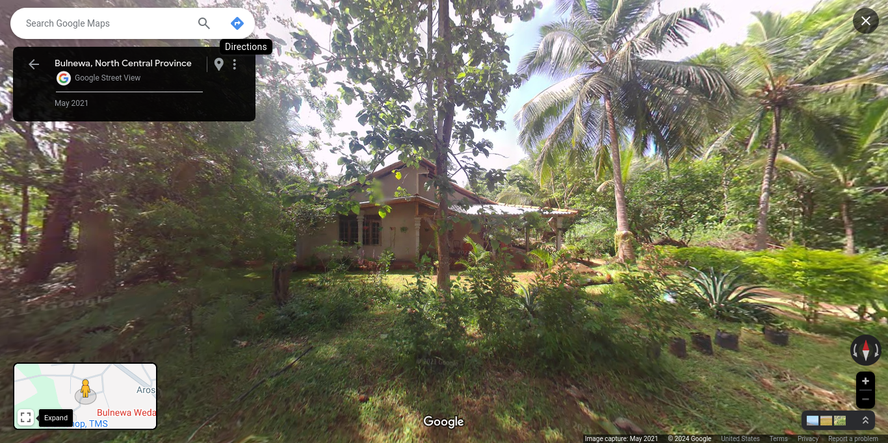

## Daluggala

**Daluggala** Grama Niladhari Division, **Rambukkana** Divisional Secretariat Division, **Kegalle** District, **Sabaragamuwa** Province

**Rambukkana** Polling Division, **Kegalle** Electoral District

Population: 427 (2012)

(**LK-9203265**/08J)

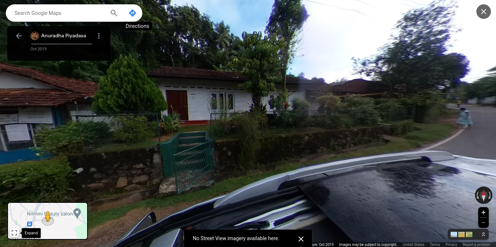

## Kuda Wewala

**Kuda Wewala** Grama Niladhari Division, **Hikkaduwa** Divisional Secretariat Division, **Galle** District, **Southern** Province

**Ratgama** Polling Division, **Galle** Electoral District

Population: 915 (2012)

(**LK-3136260**/56B)

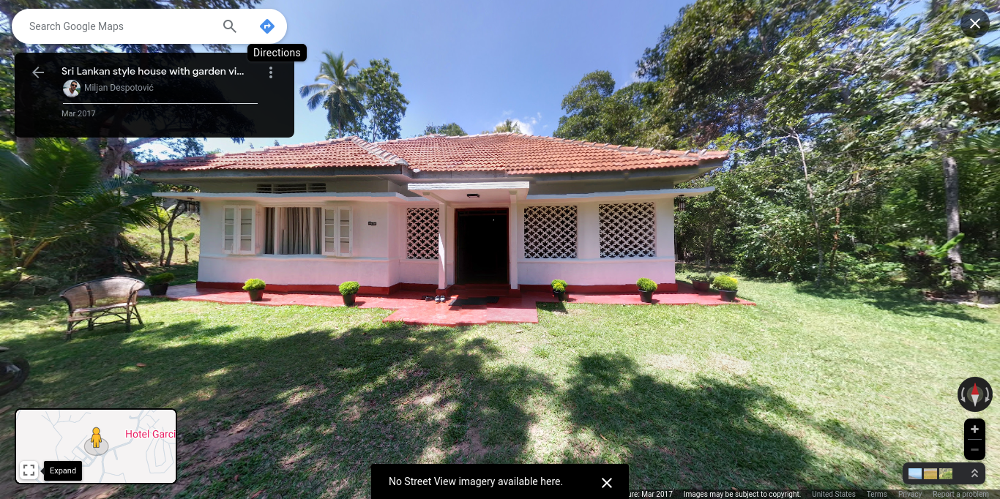

## Nagahawatta

**Nagahawatta** Grama Niladhari Division, **Akmeemana** Divisional Secretariat Division, **Galle** District, **Southern** Province

**Akmeemana** Polling Division, **Galle** Electoral District

Population: 722 (2012)

(**LK-3145315**/133C)

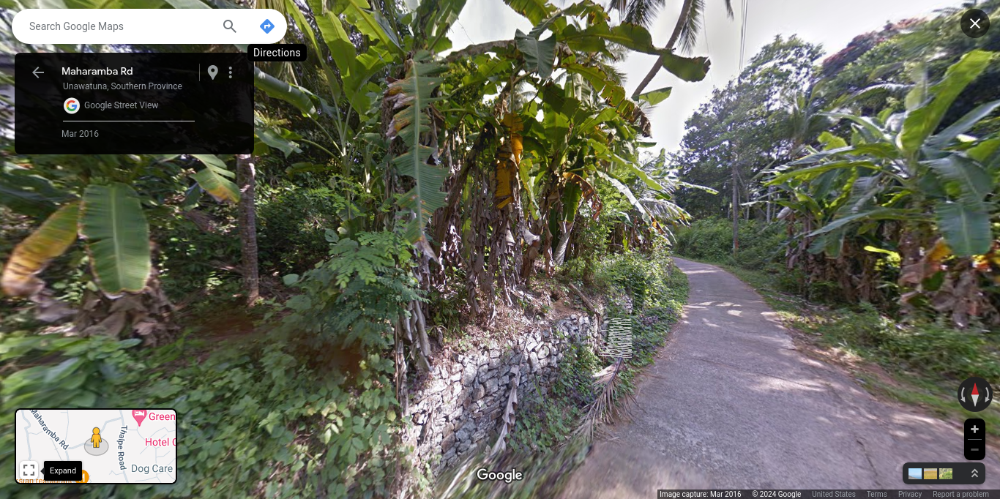

## Kuda Wadduwa

**Kuda Wadduwa** Grama Niladhari Division, **Panadura** Divisional Secretariat Division, **Kalutara** District, **Western** Province

**Panadura** Polling Division, **Kalutara** Electoral District

Population: 2,122 (2012)

(**LK-1303340**/702)

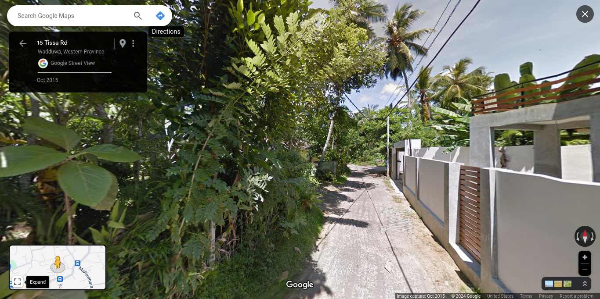

## Wegiriya

**Wegiriya** Grama Niladhari Division, **Harispattuwa** Divisional Secretariat Division, **Kandy** District, **Central** Province

**Harispattuwa** Polling Division, **Kandy** Electoral District

Population: 1,185 (2012)

(**LK-2133365**/421)

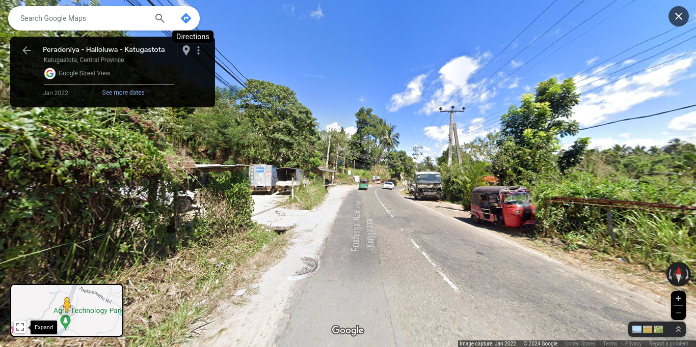

## Alwiswatta

**Alwiswatta** Grama Niladhari Division, **Kalutara** Divisional Secretariat Division, **Kalutara** District, **Western** Province

**Kalutara** Polling Division, **Kalutara** Electoral District

Population: 976 (2012)

(**LK-1321310**/723A)

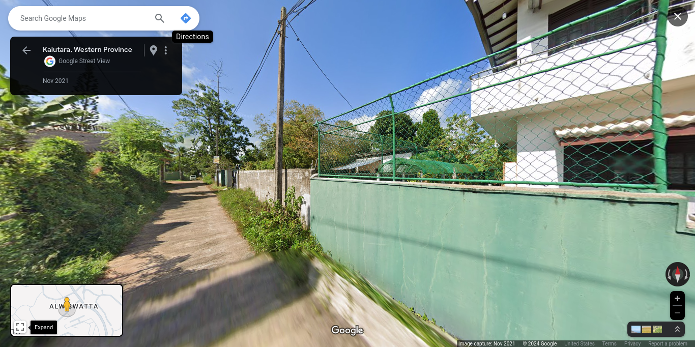

## Piligalla East

**Piligalla East** Grama Niladhari Division, **Udunuwara** Divisional Secretariat Division, **Kandy** District, **Central** Province

**Udunuwara** Polling Division, **Kandy** Electoral District

Population: 721 (2012)

(**LK-2139285**/22)

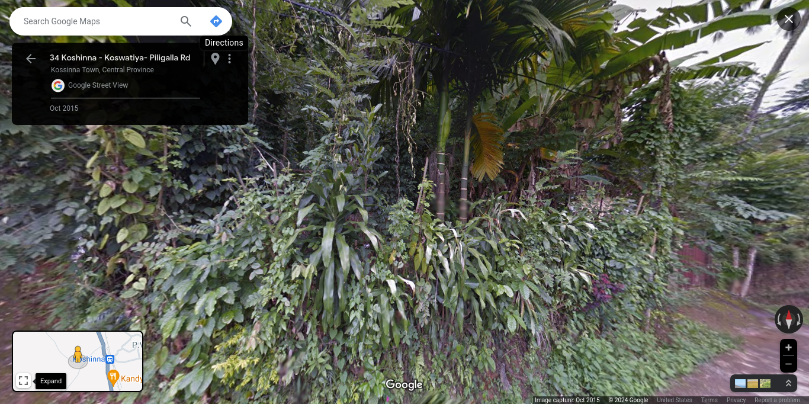

## Parana Veyangoda

**Parana Veyangoda** Grama Niladhari Division, **Attanagalla** Divisional Secretariat Division, **Gampaha** District, **Western** Province

**Attanagalla** Polling Division, **Gampaha** Electoral District

Population: 1,051 (2012)

(**LK-1227065**/346)

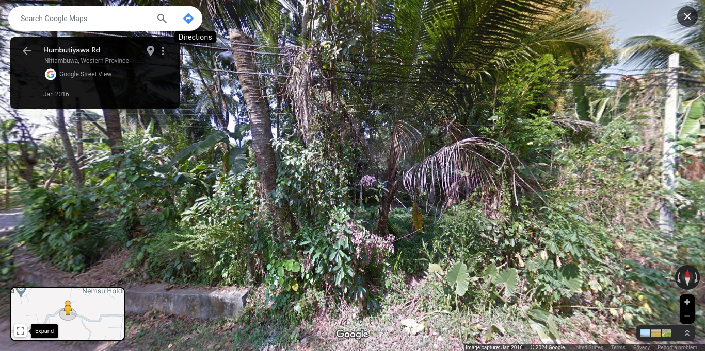

## Maitipe

**Maitipe** Grama Niladhari Division, **Galle Four Gravets** Divisional Secretariat Division, **Galle** District, **Southern** Province

**Galle** Polling Division, **Galle** Electoral District

Population: 1,875 (2012)

(**LK-3139080**/101)

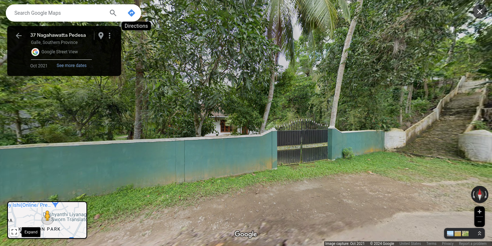

## Wadduwa West

**Wadduwa West** Grama Niladhari Division, **Panadura** Divisional Secretariat Division, **Kalutara** District, **Western** Province

**Panadura** Polling Division, **Kalutara** Electoral District

Population: 1,392 (2012)

(**LK-1303320**/699)

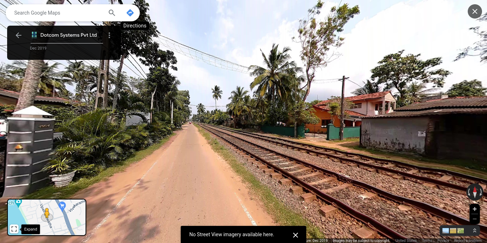

## Raddolugama South

**Raddolugama South** Grama Niladhari Division, **Katana** Divisional Secretariat Division, **Gampaha** District, **Western** Province

**Katana** Polling Division, **Gampaha** Electoral District

Population: 1,894 (2012)

(**LK-1206310**/199B)

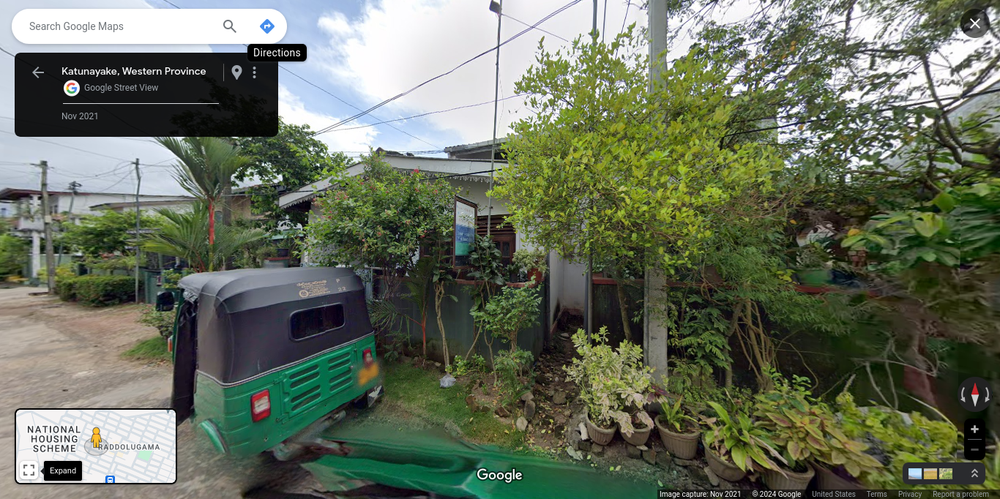

## Manampita

**Manampita** Grama Niladhari Division, **Niyagama** Divisional Secretariat Division, **Galle** District, **Southern** Province

**Hiniduma** Polling Division, **Galle** Electoral District

Population: 900 (2012)

(**LK-3115135**/37A/2)

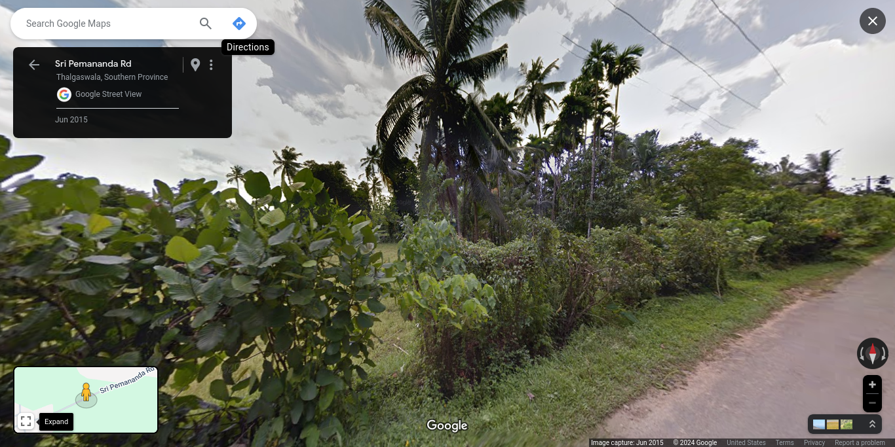

## Thalalla South

**Thalalla South** Grama Niladhari Division, **Devinuwara** Divisional Secretariat Division, **Matara** District, **Southern** Province

**Devinuwara** Polling Division, **Matara** Electoral District

Population: 1,424 (2012)

(**LK-3245080**/438)

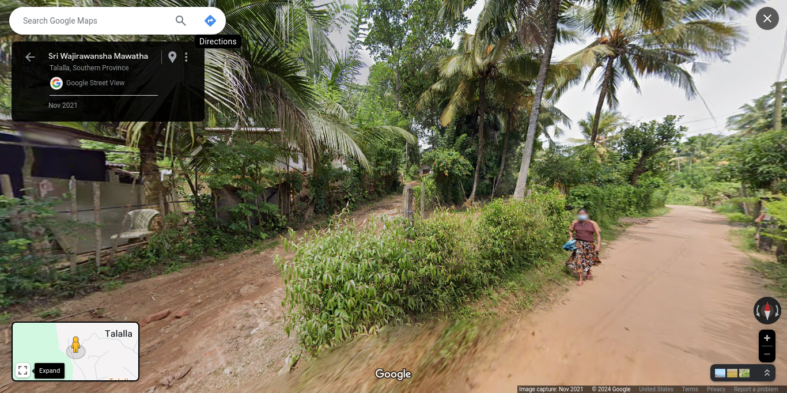

## Nallooruwa

**Nallooruwa** Grama Niladhari Division, **Panadura** Divisional Secretariat Division, **Kalutara** District, **Western** Province

**Panadura** Polling Division, **Kalutara** Electoral District

Population: 3,014 (2012)

(**LK-1303275**/692)

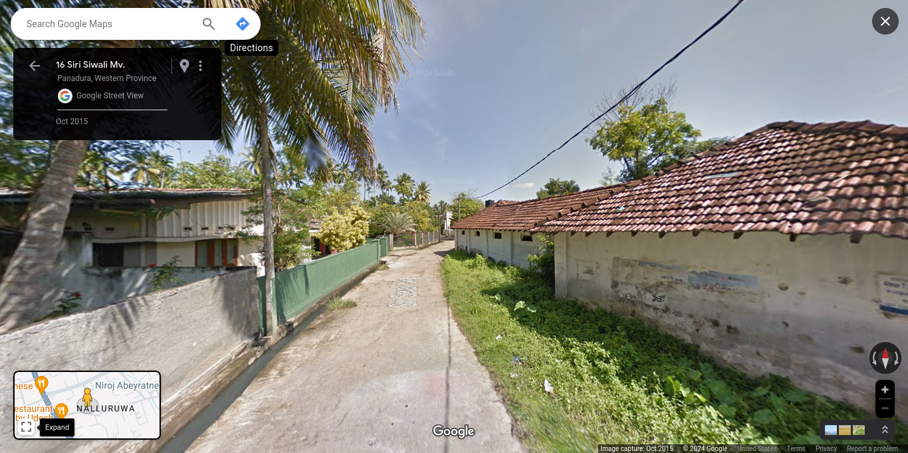

## Meegassegama

**Meegassegama** Grama Niladhari Division, **Thalawa** Divisional Secretariat Division, **Anuradhapura** District, **North Central** Province

**Anuradhapura East** Polling Division, **Anuradhapura** Electoral District

Population: 1,545 (2012)

(**LK-7148060**/400)

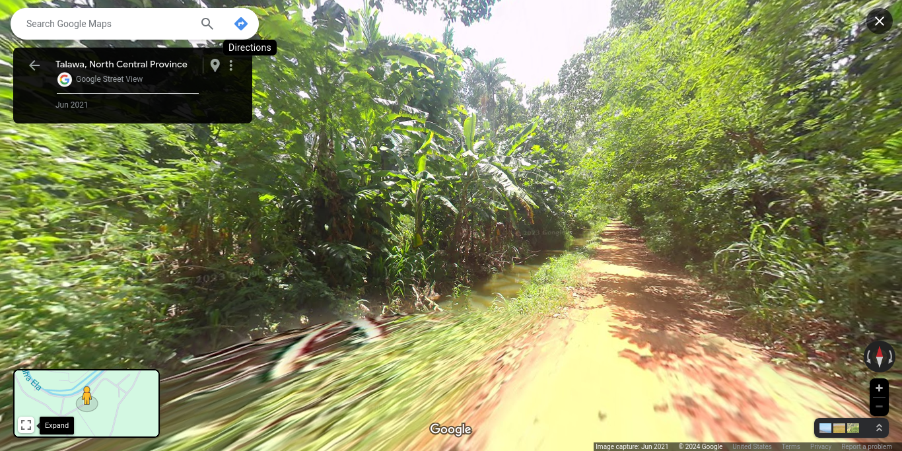

## Badulla North

**Badulla North** Grama Niladhari Division, **Badulla** Divisional Secretariat Division, **Badulla** District, **Uva** Province

**Badulla** Polling Division, **Badulla** Electoral District

Population: 4,062 (2012)

(**LK-8121010**/78A)

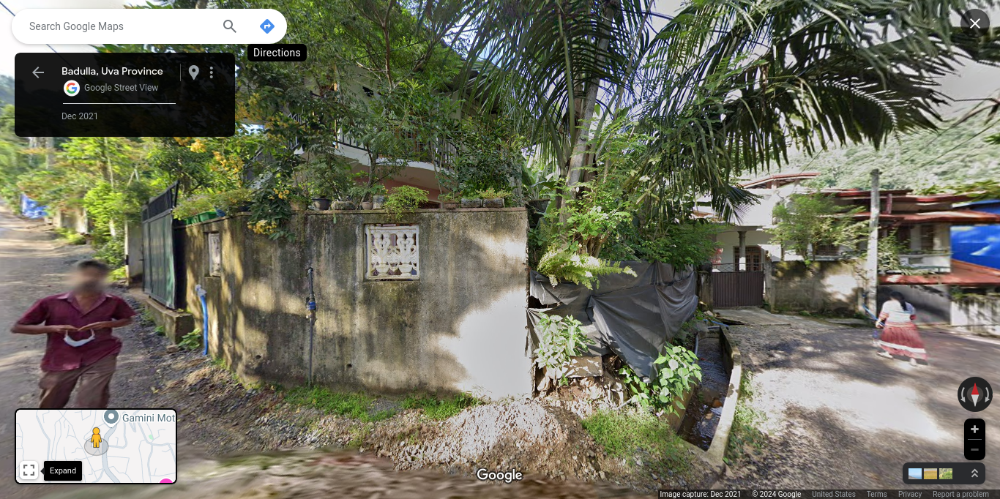

## Mugunuwatawana

**Mugunuwatawana** Grama Niladhari Division, **Chilaw** Divisional Secretariat Division, **Puttalam** District, **North Western** Province

**Chilaw** Polling Division, **Puttalam** Electoral District

Population: 1,263 (2012)

(**LK-6233115**/569)

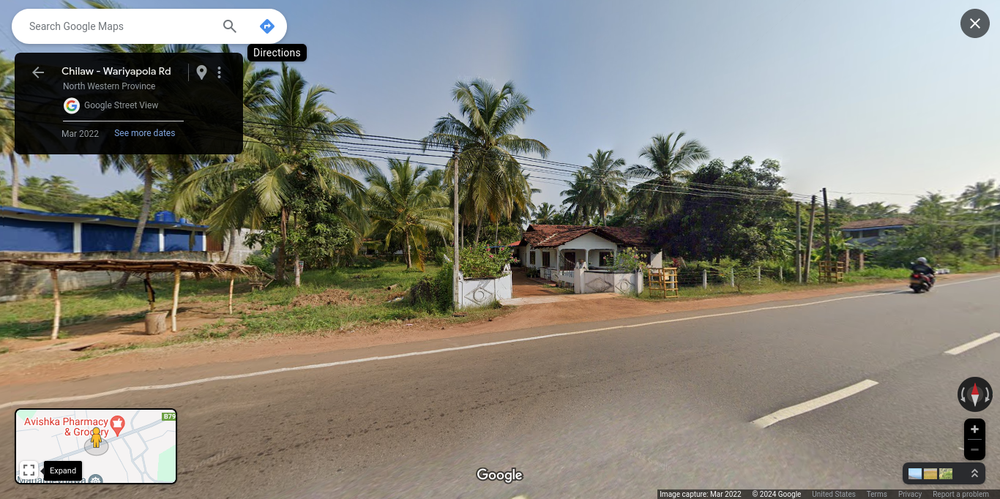

## Mookalangamuwa East

**Mookalangamuwa East** Grama Niladhari Division, **Katana** Divisional Secretariat Division, **Gampaha** District, **Western** Province

**Katana** Polling Division, **Gampaha** Electoral District

Population: 2,402 (2012)

(**LK-1206340**/145A)

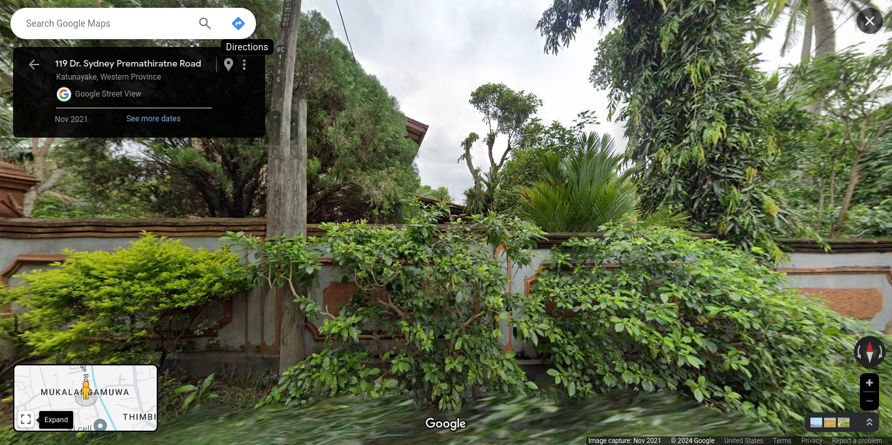

## Dandagamuwa West

**Dandagamuwa West** Grama Niladhari Division, **Kuliyapitiya West** Divisional Secretariat Division, **Kurunegala** District, **North Western** Province

**Kuliyapitiya** Polling Division, **Kurunegala** Electoral District

Population: 1,196 (2012)

(**LK-6172215**/1193)

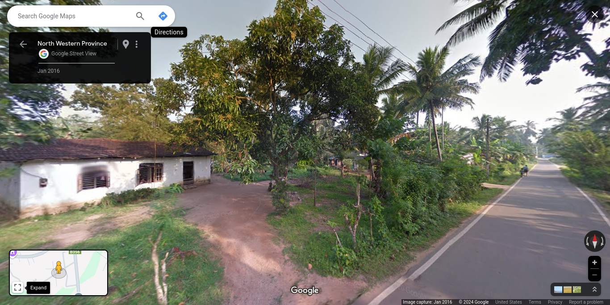

## Malkaduwawa

**Malkaduwawa** Grama Niladhari Division, **Kurunegala** Divisional Secretariat Division, **Kurunegala** District, **North Western** Province

**Kurunegala** Polling Division, **Kurunegala** Electoral District

Population: 2,386 (2012)

(**LK-6154130**/816)

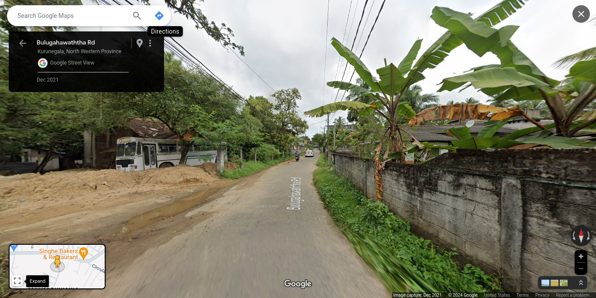

## Kumbuka South

**Kumbuka South** Grama Niladhari Division, **Horana** Divisional Secretariat Division, **Kalutara** District, **Western** Province

**Horana** Polling Division, **Kalutara** Electoral District

Population: 1,140 (2012)

(**LK-1309155**/607B)

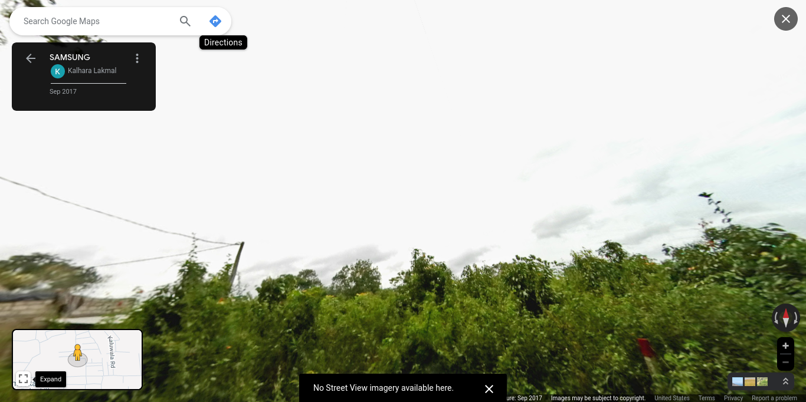

## Pandiruppu 01

**Pandiruppu 01** Grama Niladhari Division, **Kalmunai Tamil Division** Divisional Secretariat Division, **Ampara** District, **Eastern** Province

**Kalmunai** Polling Division, **Digamadulla** Electoral District

Population: 941 (2012)

(**LK-5221030**/KP/66/1)

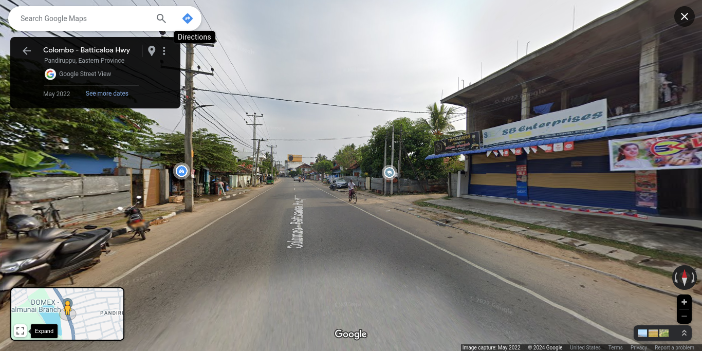

## Weragoda

**Weragoda** Grama Niladhari Division, **Mawanella** Divisional Secretariat Division, **Kegalle** District, **Sabaragamuwa** Province

**Mawanella** Polling Division, **Kegalle** Electoral District

Population: 546 (2012)

(**LK-9206285**/37C)

## Urelu

**Urelu** Grama Niladhari Division, **Valikamam East (Kopay)** Divisional Secretariat Division, **Jaffna** District, **Northern** Province

**Kopay** Polling Division, **Jaffna** Electoral District

Population: 3,295 (2012)

(**LK-4118055**/J/267)

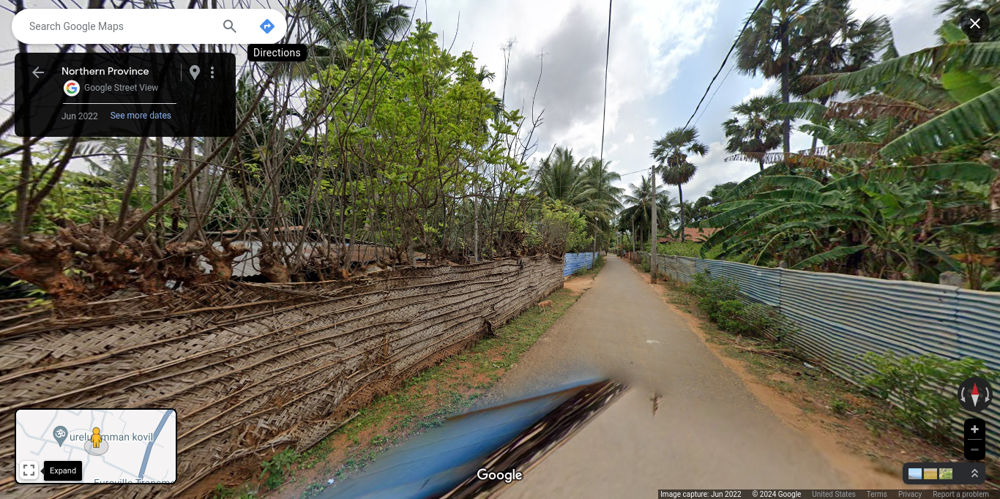

## Tharaperiya

**Tharaperiya** Grama Niladhari Division, **Beliatta** Divisional Secretariat Division, **Hambantota** District, **Southern** Province

**Beliatta** Polling Division, **Hambantota** Electoral District

Population: 442 (2012)

(**LK-3330075**/323)

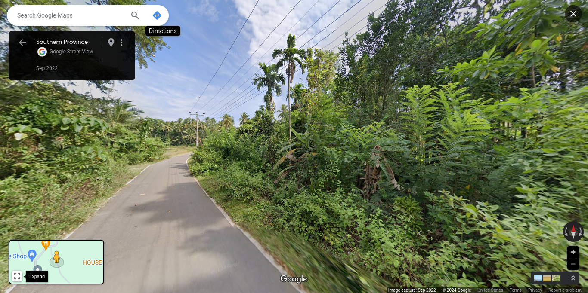

## Batapotha

**Batapotha** Grama Niladhari Division, **Kaduwela** Divisional Secretariat Division, **Colombo** District, **Western** Province

**Kaduwela** Polling Division, **Colombo** Electoral District

Population: 7,582 (2012)

(**LK-1109185**/479E)

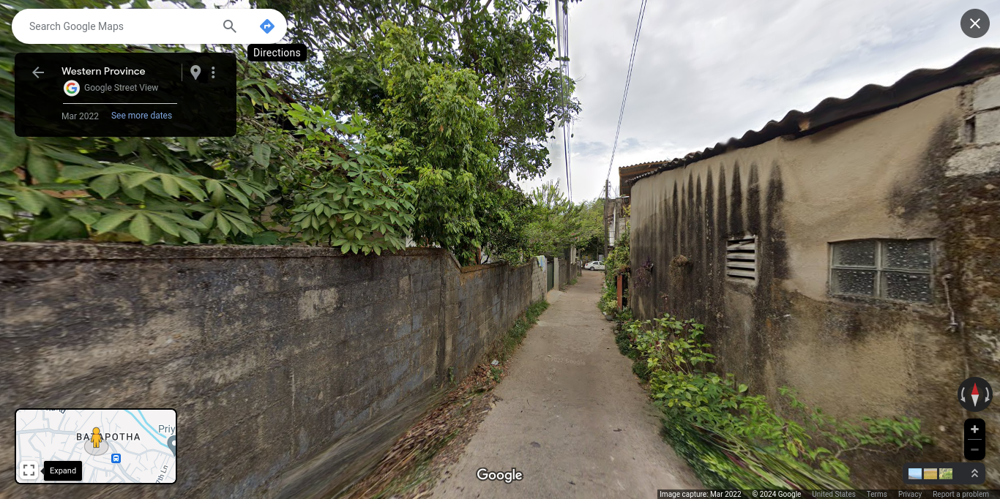

## Vairavapuliyankulam

**Vairavapuliyankulam** Grama Niladhari Division, **Vavuniya** Divisional Secretariat Division, **Vavuniya** District, **Northern** Province

**Vavuniya** Polling Division, **Vanni** Electoral District

Population: 5,021 (2012)

(**LK-4309195**/214D)

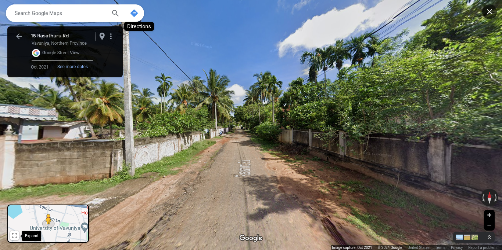

## Ihala Muruthawela

**Ihala Muruthawela** Grama Niladhari Division, **Walasmulla** Divisional Secretariat Division, **Hambantota** District, **Southern** Province

**Mulkirigala** Polling Division, **Hambantota** Electoral District

Population: 742 (2012)

(**LK-3325165**/434)

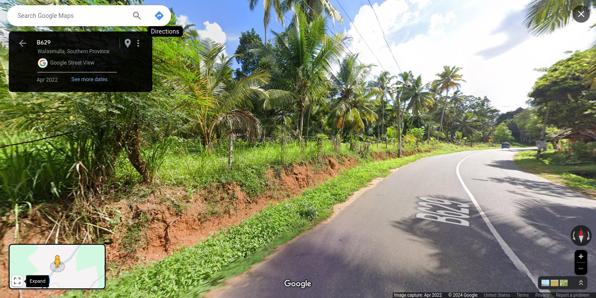

## Wadduwa West

**Wadduwa West** Grama Niladhari Division, **Panadura** Divisional Secretariat Division, **Kalutara** District, **Western** Province

**Panadura** Polling Division, **Kalutara** Electoral District

Population: 1,392 (2012)

(**LK-1303320**/699)

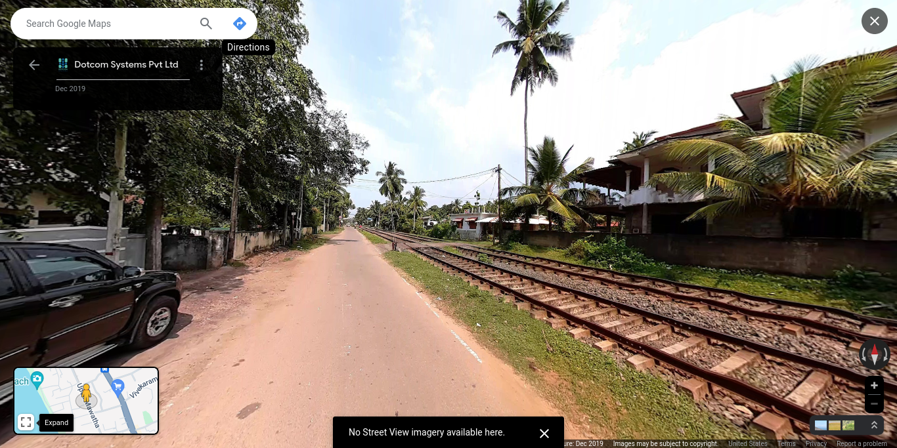

## Medakekila

**Medakekila** Grama Niladhari Division, **Deltota** Divisional Secretariat Division, **Kandy** District, **Central** Province

**Hewaheta** Polling Division, **Kandy** Electoral District

Population: 697 (2012)

(**LK-2148060**/1037)

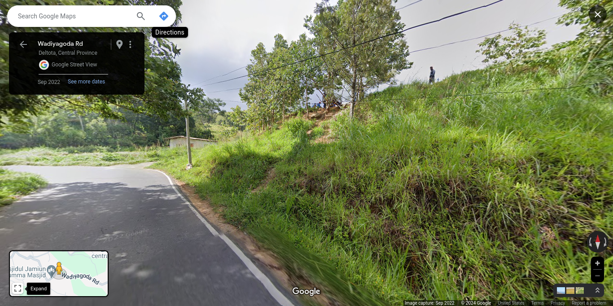

## Halpe

**Halpe** Grama Niladhari Division, **Ella** Divisional Secretariat Division, **Badulla** District, **Uva** Province

**Bandarawela** Polling Division, **Badulla** Electoral District

Population: 1,947 (2012)

(**LK-8136010**/68)

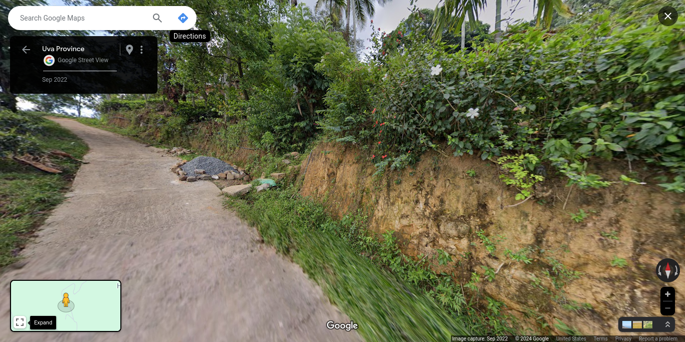

## Kudawella North

**Kudawella North** Grama Niladhari Division, **Tangalle** Divisional Secretariat Division, **Hambantota** District, **Southern** Province

**Beliatta** Polling Division, **Hambantota** Electoral District

Population: 1,098 (2012)

(**LK-3333330**/289)

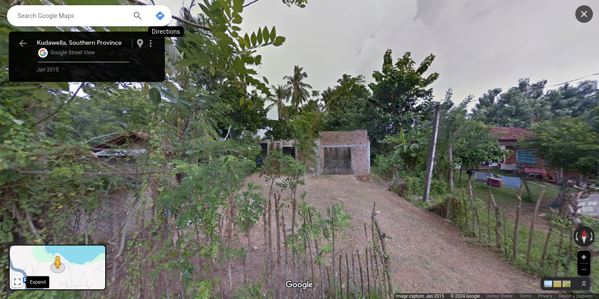

## Palamuna 05

**Palamuna 05** Grama Niladhari Division, **Addalachchenai** Divisional Secretariat Division, **Ampara** District, **Eastern** Province

**Pothuvil** Polling Division, **Digamadulla** Electoral District

Population: 1,524 (2012)

(**LK-5233070**/AD/34A/2)

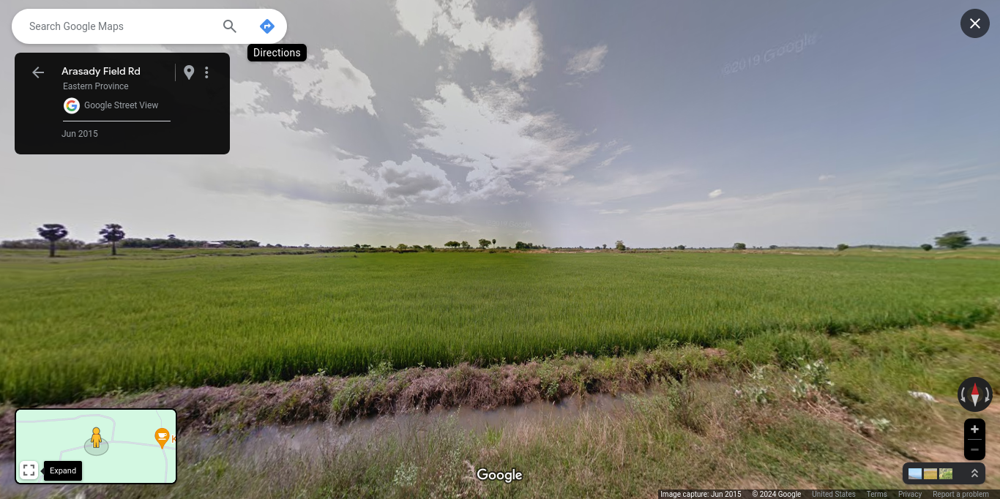

## Moratuwella North

**Moratuwella North** Grama Niladhari Division, **Moratuwa** Divisional Secretariat Division, **Colombo** District, **Western** Province

**Moratuwa** Polling Division, **Colombo** Electoral District

Population: 2,236 (2012)

(**LK-1133160**/553A)

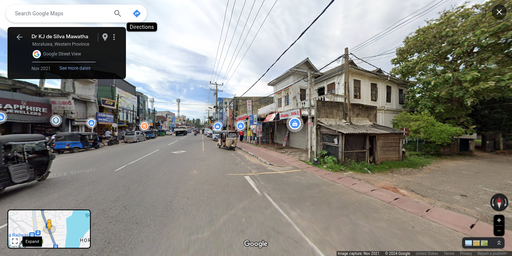

## Paranagama

**Paranagama** Grama Niladhari Division, **Attanagalla** Divisional Secretariat Division, **Gampaha** District, **Western** Province

**Attanagalla** Polling Division, **Gampaha** Electoral District

Population: 1,256 (2012)

(**LK-1227700**/370)

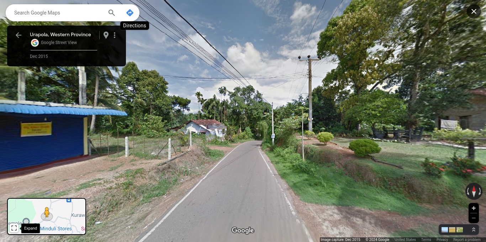

## Godella

**Godella** Grama Niladhari Division, **Dankotuwa** Divisional Secretariat Division, **Puttalam** District, **North Western** Province

**Wennappuwa** Polling Division, **Puttalam** Electoral District

Population: 1,725 (2012)

(**LK-6248200**/473)

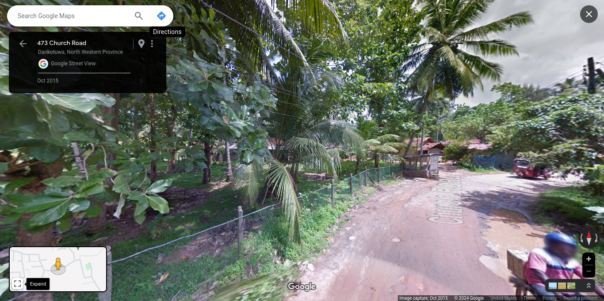

## Kirimetiyawatta

**Kirimetiyawatta** Grama Niladhari Division, **Dompe** Divisional Secretariat Division, **Gampaha** District, **Western** Province

**Dompe** Polling Division, **Gampaha** Electoral District

Population: 781 (2012)

(**LK-1230165**/378A)

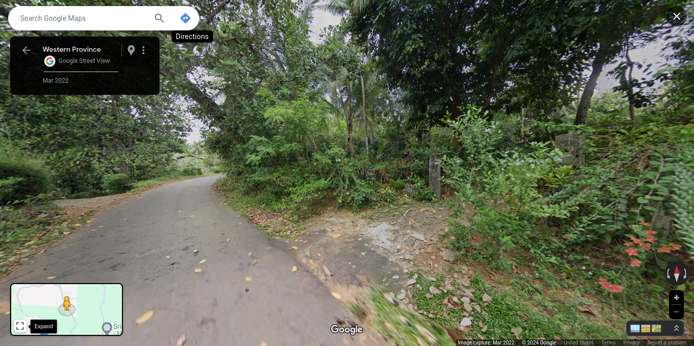

## Angampitiya

**Angampitiya** Grama Niladhari Division, **Padukka** Divisional Secretariat Division, **Colombo** District, **Western** Province

**Avissawella** Polling Division, **Colombo** Electoral District

Population: 2,157 (2012)

(**LK-1118110**/454A)

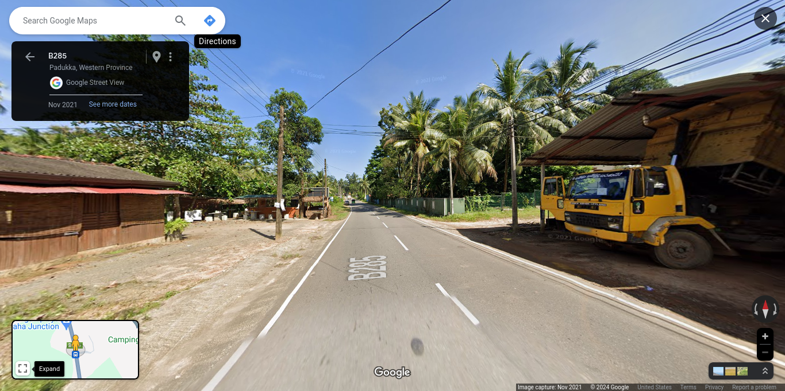

## Manalkudiyiruppu

**Manalkudiyiruppu** Grama Niladhari Division, **Maritimepattu** Divisional Secretariat Division, **Mullaitivu** District, **Northern** Province

**Mullaitivu** Polling Division, **Vanni** Electoral District

Population: 285 (2012)

(**LK-4415130**/MU/96)

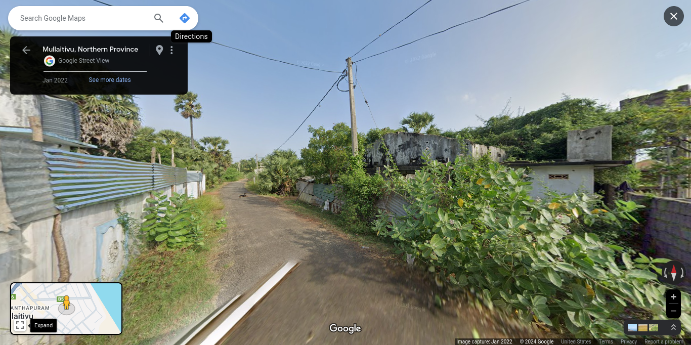

## Konthahela

**Konthahela** Grama Niladhari Division, **Bandarawela** Divisional Secretariat Division, **Badulla** District, **Uva** Province

**Bandarawela** Polling Division, **Badulla** Electoral District

Population: 1,243 (2012)

(**LK-8133010**/67A)

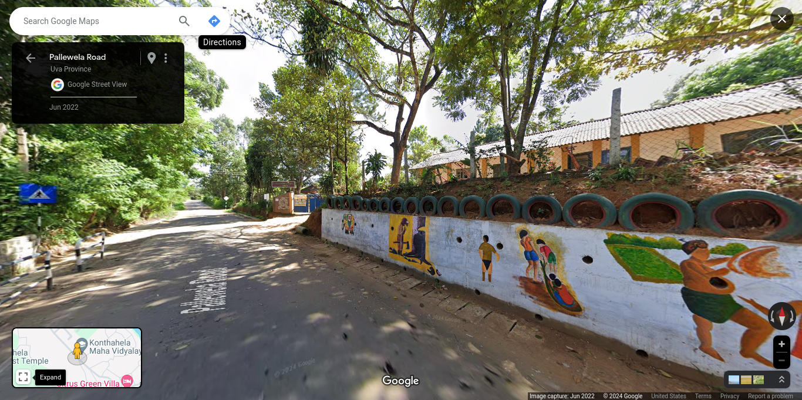

## Nikawala

**Nikawala** Grama Niladhari Division, **Dompe** Divisional Secretariat Division, **Gampaha** District, **Western** Province

**Dompe** Polling Division, **Gampaha** Electoral District

Population: 984 (2012)

(**LK-1230565**/418)

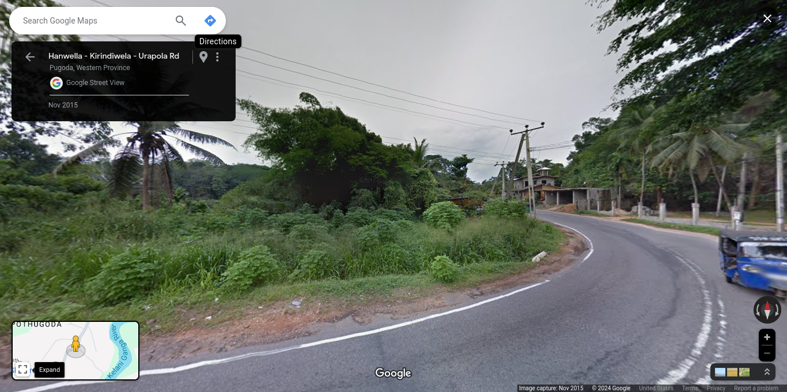

## Aluth Weediya

**Aluth Weediya** Grama Niladhari Division, **Weligama** Divisional Secretariat Division, **Matara** District, **Southern** Province

**Weligama** Polling Division, **Matara** Electoral District

Population: 3,223 (2012)

(**LK-3239060**/385A)

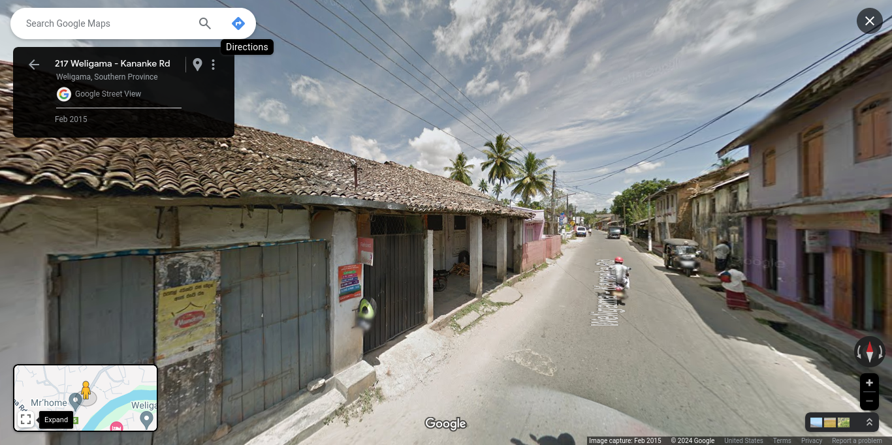

## Wellawatta North

**Wellawatta North** Grama Niladhari Division, **Thimbirigasyaya** Divisional Secretariat Division, **Colombo** District, **Western** Province

**Colombo West** Polling Division, **Colombo** Electoral District

Population: 14,876 (2012)

(**LK-1127085**/)

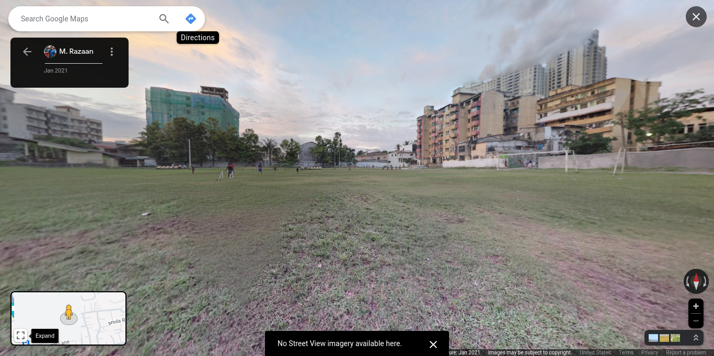

## Bogahamaditta

**Bogahamaditta** Grama Niladhari Division, **Hali-Ela** Divisional Secretariat Division, **Badulla** District, **Uva** Province

**Hali Ela** Polling Division, **Badulla** Electoral District

Population: 2,736 (2012)

(**LK-8124065**/74B)

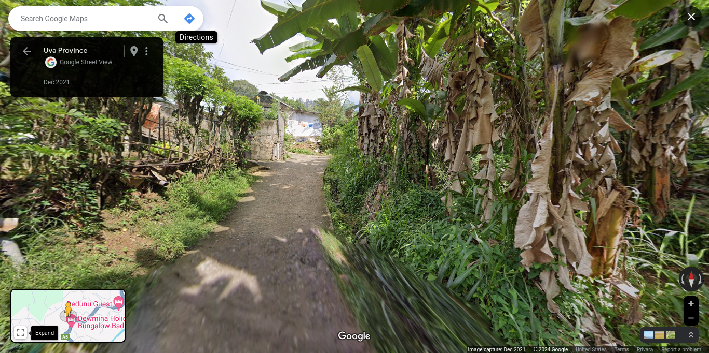

## Maligathenna

**Maligathenna** Grama Niladhari Division, **Hali-Ela** Divisional Secretariat Division, **Badulla** District, **Uva** Province

**Hali Ela** Polling Division, **Badulla** Electoral District

Population: 2,209 (2012)

(**LK-8124255**/57H)

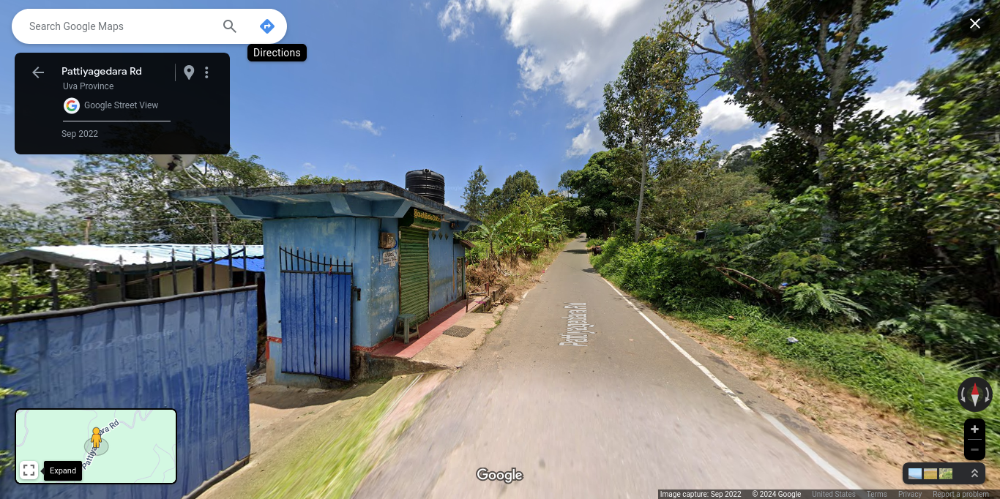

## Rukmale East A

**Rukmale East A** Grama Niladhari Division, **Maharagama** Divisional Secretariat Division, **Colombo** District, **Western** Province

**Maharagama** Polling Division, **Colombo** Electoral District

Population: 1,259 (2012)

(**LK-1121045**/497A)

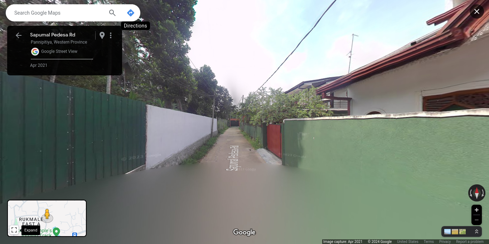

## Makevita South

**Makevita South** Grama Niladhari Division, **Gampaha** Divisional Secretariat Division, **Gampaha** District, **Western** Province

**Gampaha** Polling Division, **Gampaha** Electoral District

Population: 1,559 (2012)

(**LK-1224010**/218A)

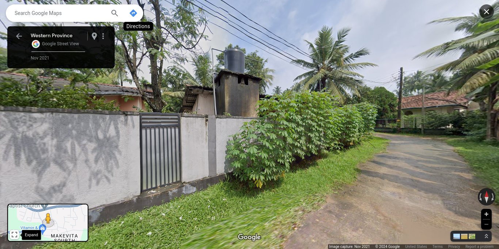

## Kinchigune South

**Kinchigune South** Grama Niladhari Division, **Weeraketiya** Divisional Secretariat Division, **Hambantota** District, **Southern** Province

**Mulkirigala** Polling Division, **Hambantota** Electoral District

Population: 546 (2012)

(**LK-3321160**/403)

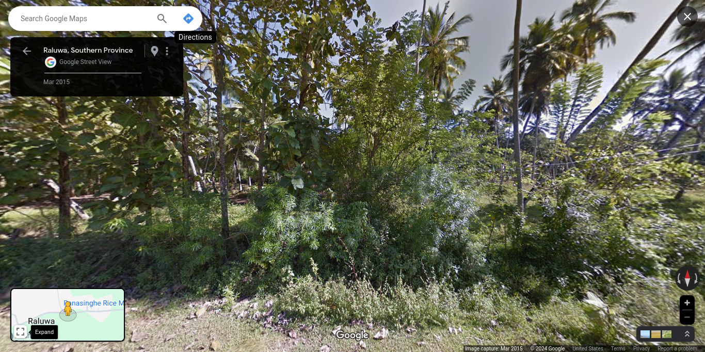

## Ihala Karagahamuna East

**Ihala Karagahamuna East** Grama Niladhari Division, **Mahara** Divisional Secretariat Division, **Gampaha** District, **Western** Province

**Mahara** Polling Division, **Gampaha** Electoral District

Population: 2,221 (2012)

(**LK-1233350**/248B)

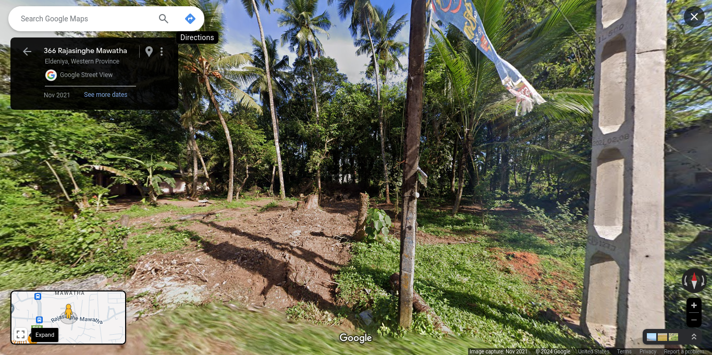

## Mawela East

**Mawela East** Grama Niladhari Division, **Kothmale** Divisional Secretariat Division, **Nuwara Eliya** District, **Central** Province

**Kothmale** Polling Division, **Nuwara-Eliya** Electoral District

Population: 432 (2012)

(**LK-2303105**/456)

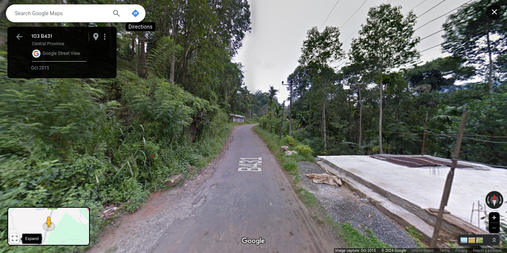

## Kekunagolla

**Kekunagolla** Grama Niladhari Division, **Kuliyapitiya East** Divisional Secretariat Division, **Kurunegala** District, **North Western** Province

**Kuliyapitiya** Polling Division, **Kurunegala** Electoral District

Population: 3,783 (2012)

(**LK-6169060**/1115)

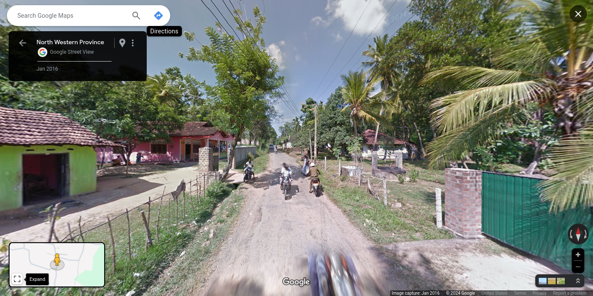

## Malewangoda

**Malewangoda** Grama Niladhari Division, **Beruwala** Divisional Secretariat Division, **Kalutara** District, **Western** Province

**Beruwala** Polling Division, **Kalutara** Electoral District

Population: 1,433 (2012)

(**LK-1324270**/768B)

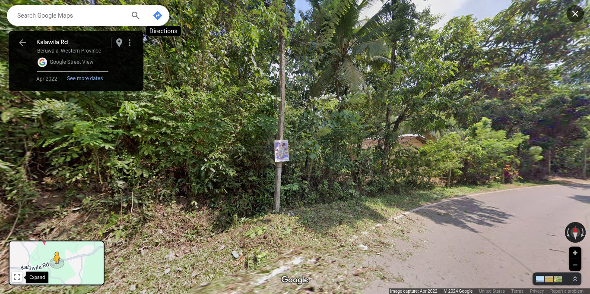

## Lakshapathiya North

**Lakshapathiya North** Grama Niladhari Division, **Moratuwa** Divisional Secretariat Division, **Colombo** District, **Western** Province

**Moratuwa** Polling Division, **Colombo** Electoral District

Population: 4,481 (2012)

(**LK-1133045**/550A)

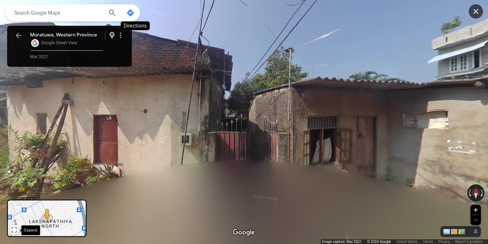

## Puwakgahakadawala

**Puwakgahakadawala** Grama Niladhari Division, **Bingiriya** Divisional Secretariat Division, **Kurunegala** District, **North Western** Province

**Bingiriya** Polling Division, **Kurunegala** Electoral District

Population: 888 (2012)

(**LK-6142050**/1447)

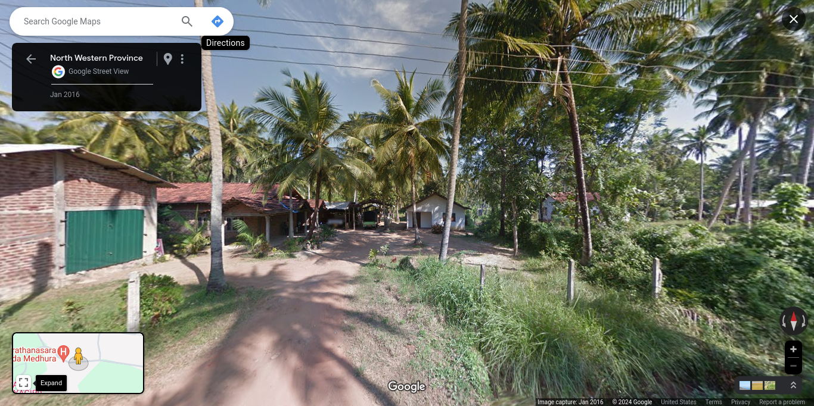

## Pulluhena

**Pulluhena** Grama Niladhari Division, **Wattala** Divisional Secretariat Division, **Gampaha** District, **Western** Province

**Wattala** Polling Division, **Gampaha** Electoral District

Population: 2,052 (2012)

(**LK-1218035**/165B)

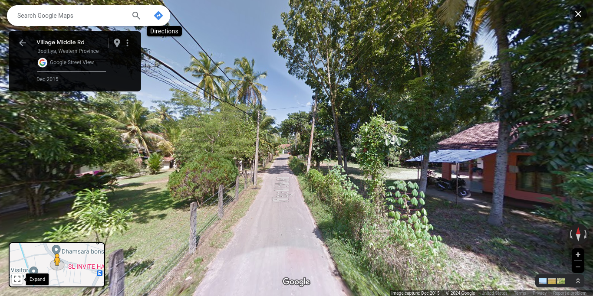

## Wekada East

**Wekada East** Grama Niladhari Division, **Panadura** Divisional Secretariat Division, **Kalutara** District, **Western** Province

**Panadura** Polling Division, **Kalutara** Electoral District

Population: 3,071 (2012)

(**LK-1303225**/687A)

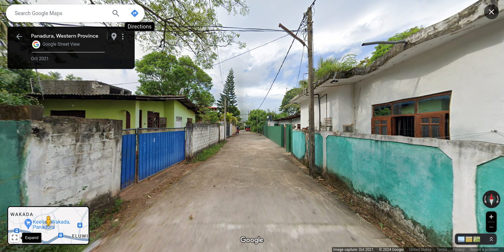

## Thunduwa West

**Thunduwa West** Grama Niladhari Division, **Bentota** Divisional Secretariat Division, **Galle** District, **Southern** Province

**Bentara Elpitiya** Polling Division, **Galle** Electoral District

Population: 1,024 (2012)

(**LK-3103090**/12C)

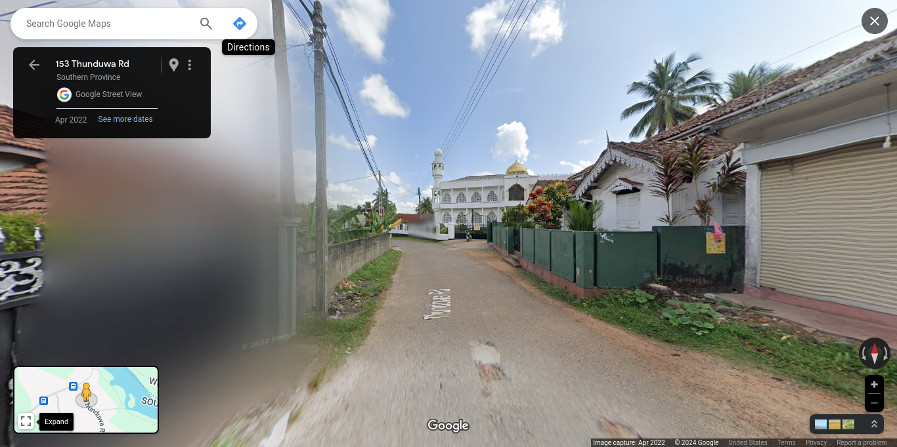

## Wahumuwa

**Wahumuwa** Grama Niladhari Division, **Kuliyapitiya West** Divisional Secretariat Division, **Kurunegala** District, **North Western** Province

**Kuliyapitiya** Polling Division, **Kurunegala** Electoral District

Population: 1,360 (2012)

(**LK-6172175**/1144)

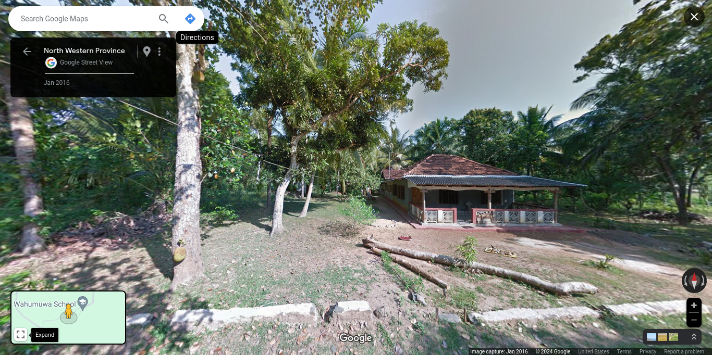

## Thalgaswewa

**Thalgaswewa** Grama Niladhari Division, **Nochchiyagama** Divisional Secretariat Division, **Anuradhapura** District, **North Central** Province

**Anuradhapura West** Polling Division, **Anuradhapura** Electoral District

Population: 858 (2012)

(**LK-7139040**/332)

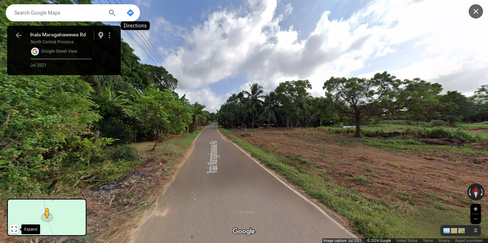

## Pahala Ellewewa

**Pahala Ellewewa** Grama Niladhari Division, **Dimbulagala** Divisional Secretariat Division, **Polonnaruwa** District, **North Central** Province

**Polonnaruwa** Polling Division, **Polonnaruwa** Electoral District

Population: 1,434 (2012)

(**LK-7212135**/215)

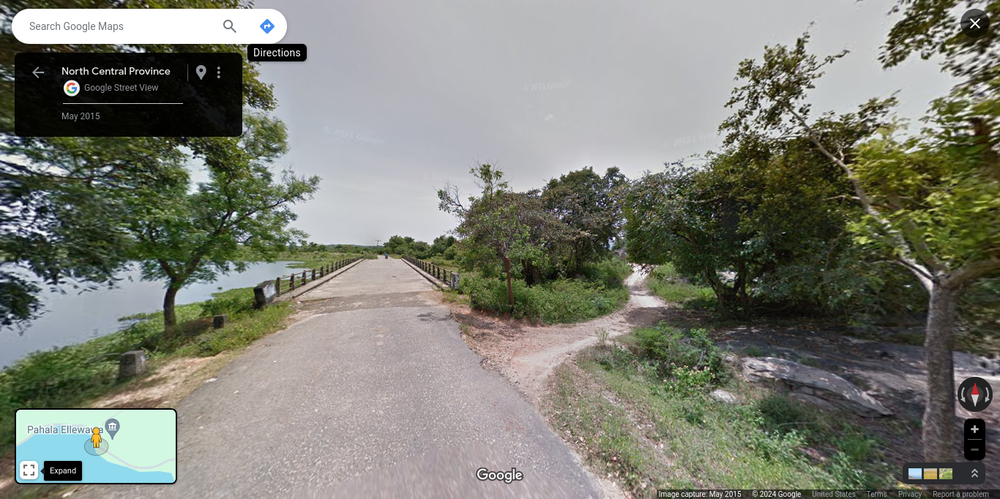

## Galpottayaya South

**Galpottayaya South** Grama Niladhari Division, **Weeraketiya** Divisional Secretariat Division, **Hambantota** District, **Southern** Province

**Mulkirigala** Polling Division, **Hambantota** Electoral District

Population: 466 (2012)

(**LK-3321075**/419)

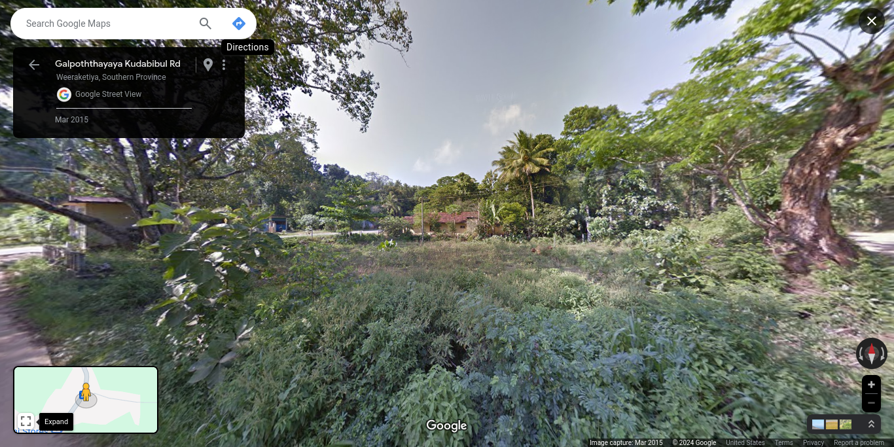

## Pelawatta

**Pelawatta** Grama Niladhari Division, **Bope-Poddala** Divisional Secretariat Division, **Galle** District, **Southern** Province

**Akmeemana** Polling Division, **Galle** Electoral District

Population: 1,370 (2012)

(**LK-3142160**/123B)

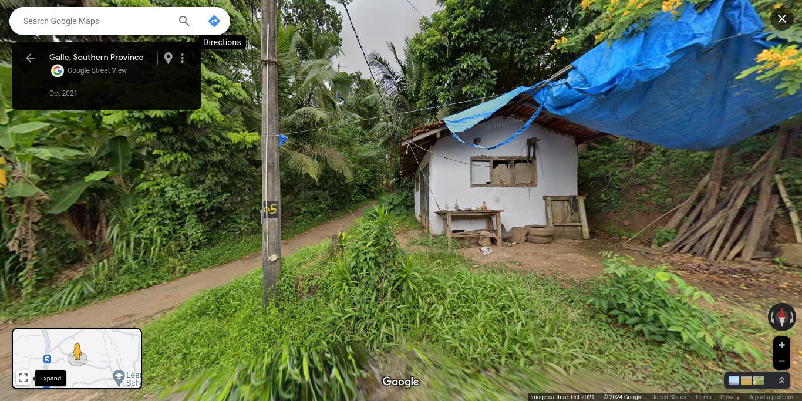

## Paratta West

**Paratta West** Grama Niladhari Division, **Panadura** Divisional Secretariat Division, **Kalutara** District, **Western** Province

**Panadura** Polling Division, **Kalutara** Electoral District

Population: 2,397 (2012)

(**LK-1303035**/672D)

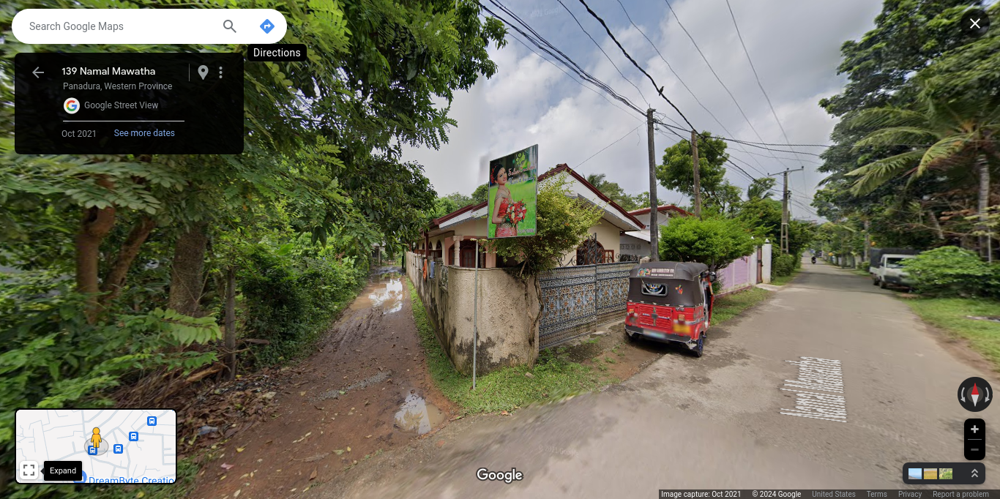

## Buddhiyagama East

**Buddhiyagama East** Grama Niladhari Division, **Weeraketiya** Divisional Secretariat Division, **Hambantota** District, **Southern** Province

**Mulkirigala** Polling Division, **Hambantota** Electoral District

Population: 1,197 (2012)

(**LK-3321230**/391)

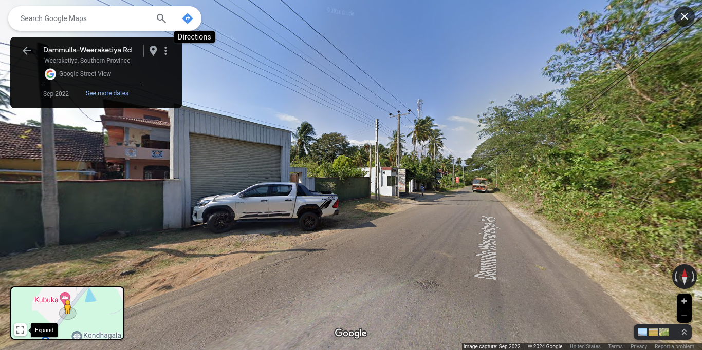

## Siriwardana Pedesa

**Siriwardana Pedesa** Grama Niladhari Division, **Negombo** Divisional Secretariat Division, **Gampaha** District, **Western** Province

**Negombo** Polling Division, **Gampaha** Electoral District

Population: 3,452 (2012)

(**LK-1203165**/156C)

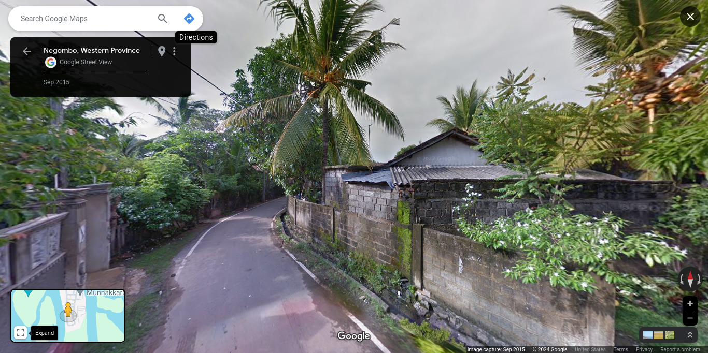

## Nanathota Palatha

**Nanathota Palatha** Grama Niladhari Division, **Balapitiya** Divisional Secretariat Division, **Galle** District, **Southern** Province

**Balapitiya** Polling Division, **Galle** Electoral District

Population: 2,692 (2012)

(**LK-3106010**/16D)

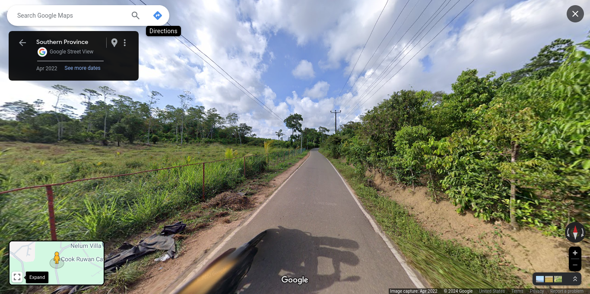

## Vettukkadu

**Vettukkadu** Grama Niladhari Division, **Manmunai North** Divisional Secretariat Division, **Batticaloa** District, **Eastern** Province

**Batticaloa** Polling Division, **Batticaloa** Electoral District

Population: 604 (2012)

(**LK-5118120**/173K)

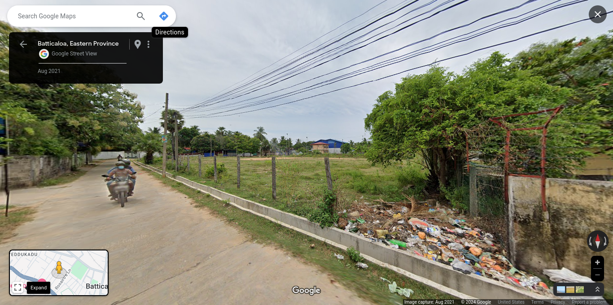

## Manipay North

**Manipay North** Grama Niladhari Division, **Valikamam South-West (Sandilipay)** Divisional Secretariat Division, **Jaffna** District, **Northern** Province

**Manipay** Polling Division, **Jaffna** Electoral District

Population: 1,343 (2012)

(**LK-4109045**/J/137)

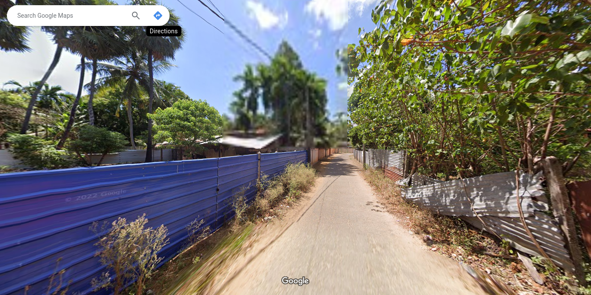

## Kesbewa East

**Kesbewa East** Grama Niladhari Division, **Kesbewa** Divisional Secretariat Division, **Colombo** District, **Western** Province

**Kesbewa** Polling Division, **Colombo** Electoral District

Population: 2,019 (2012)

(**LK-1136260**/572B)

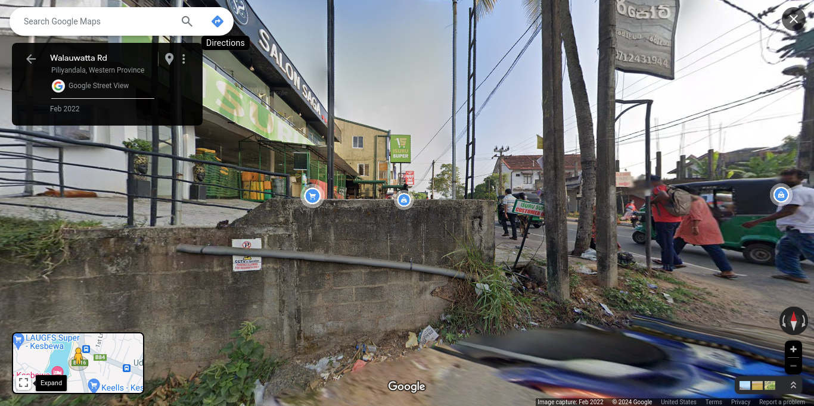

## Eravur 01

**Eravur 01** Grama Niladhari Division, **Eravur Town** Divisional Secretariat Division, **Batticaloa** District, **Eastern** Province

**Batticaloa** Polling Division, **Batticaloa** Electoral District

Population: 1,239 (2012)

(**LK-5115050**/190)

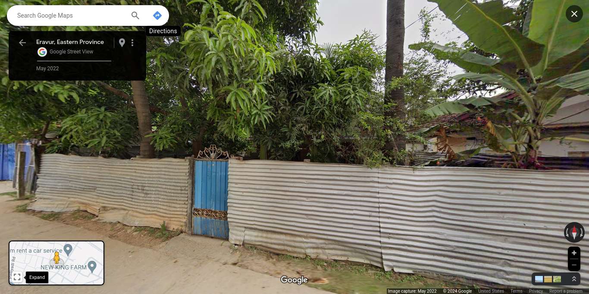

## Welage

**Welage** Grama Niladhari Division, **Balangoda** Divisional Secretariat Division, **Ratnapura** District, **Sabaragamuwa** Province

**Balangoda** Polling Division, **Ratnapura** Electoral District

Population: 1,095 (2012)

(**LK-9118255**/251)

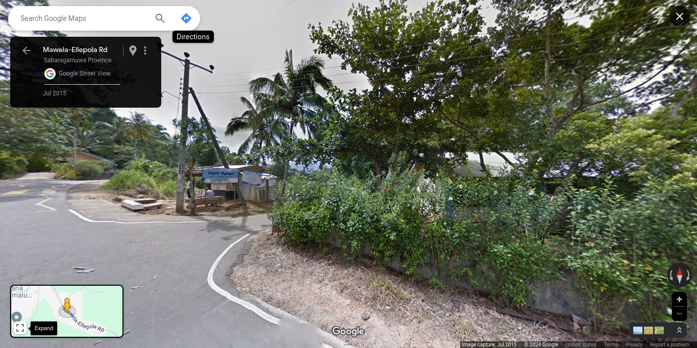

## Eravur 05

**Eravur 05** Grama Niladhari Division, **Eravur Town** Divisional Secretariat Division, **Batticaloa** District, **Eastern** Province

**Batticaloa** Polling Division, **Batticaloa** Electoral District

Population: 1,526 (2012)

(**LK-5115075**/194A)

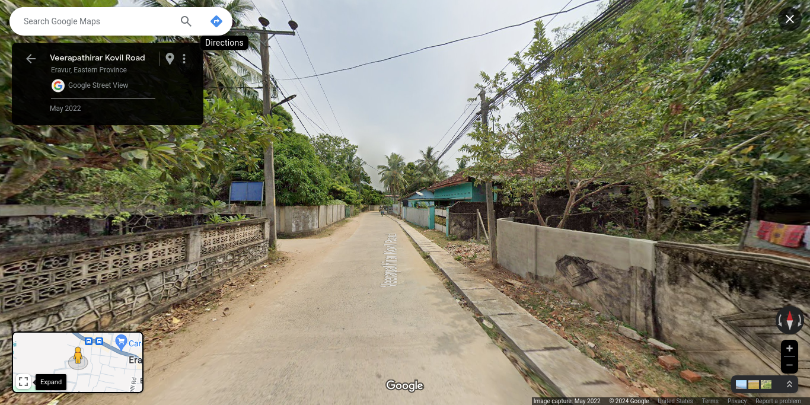

## Sapugasthenna

**Sapugasthenna** Grama Niladhari Division, **Attanagalla** Divisional Secretariat Division, **Gampaha** District, **Western** Province

**Attanagalla** Polling Division, **Gampaha** Electoral District

Population: 2,199 (2012)

(**LK-1227315**/323A)

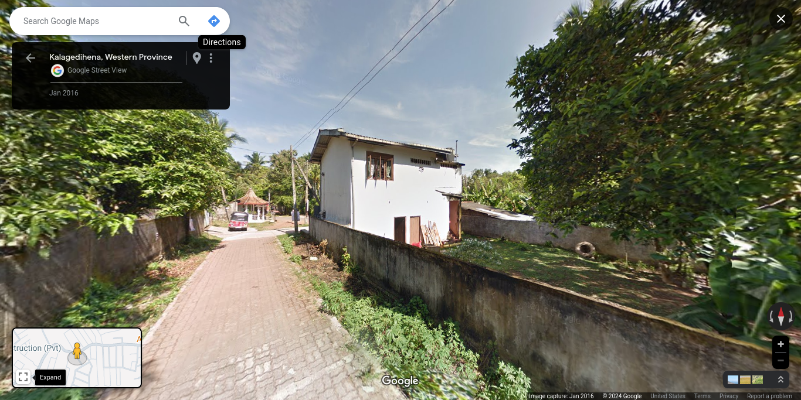

## Boowelikada

**Boowelikada** Grama Niladhari Division, **Kandy Four Gravets & Gangawata Korale** Divisional Secretariat Division, **Kandy** District, **Central** Province

**Senkadagala** Polling Division, **Kandy** Electoral District

Population: 1,372 (2012)

(**LK-2130135**/220)

## Hiripitiya

**Hiripitiya** Grama Niladhari Division, **Homagama** Divisional Secretariat Division, **Colombo** District, **Western** Province

**Homagama** Polling Division, **Colombo** Electoral District

Population: 4,467 (2012)

(**LK-1112205**/499G)

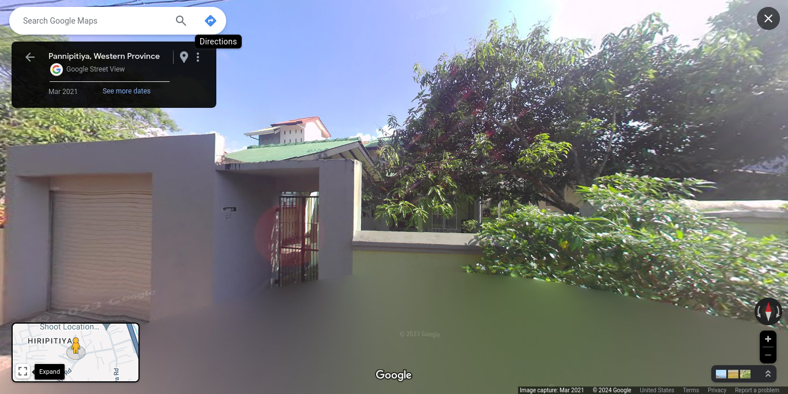

## Mandandawela

**Mandandawela** Grama Niladhari Division, **Pathadumbara** Divisional Secretariat Division, **Kandy** District, **Central** Province

**Pathadumbara** Polling Division, **Kandy** Electoral District

Population: 1,063 (2012)

(**LK-2112045**/632)

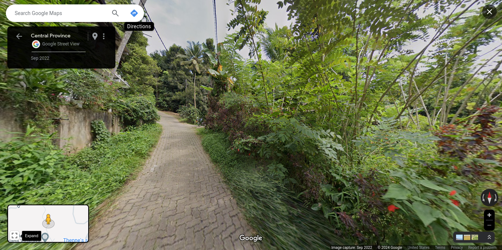

## Egodagama

**Egodagama** Grama Niladhari Division, **Seethawaka** Divisional Secretariat Division, **Colombo** District, **Western** Province

**Avissawella** Polling Division, **Colombo** Electoral District

Population: 1,301 (2012)

(**LK-1115160**/431D)

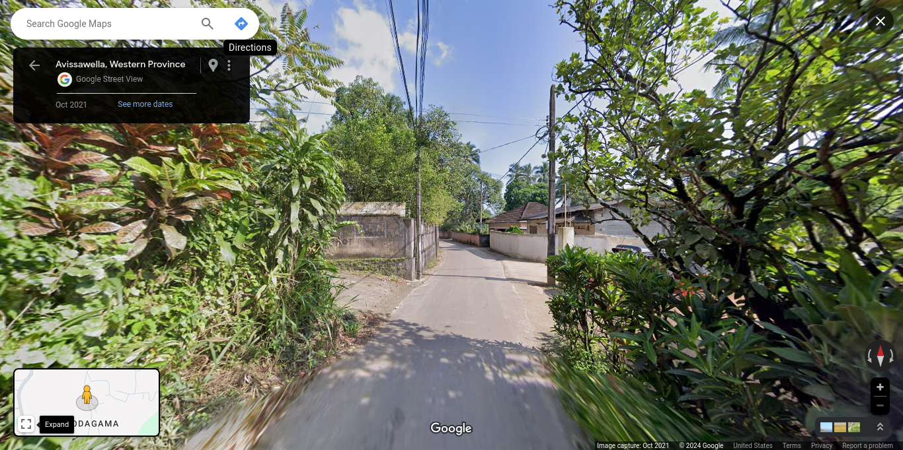

## Palugamuwa

**Palugamuwa** Grama Niladhari Division, **Udubaddawa** Divisional Secretariat Division, **Kurunegala** District, **North Western** Province

**Bingiriya** Polling Division, **Kurunegala** Electoral District

Population: 1,622 (2012)

(**LK-6175100**/1509)

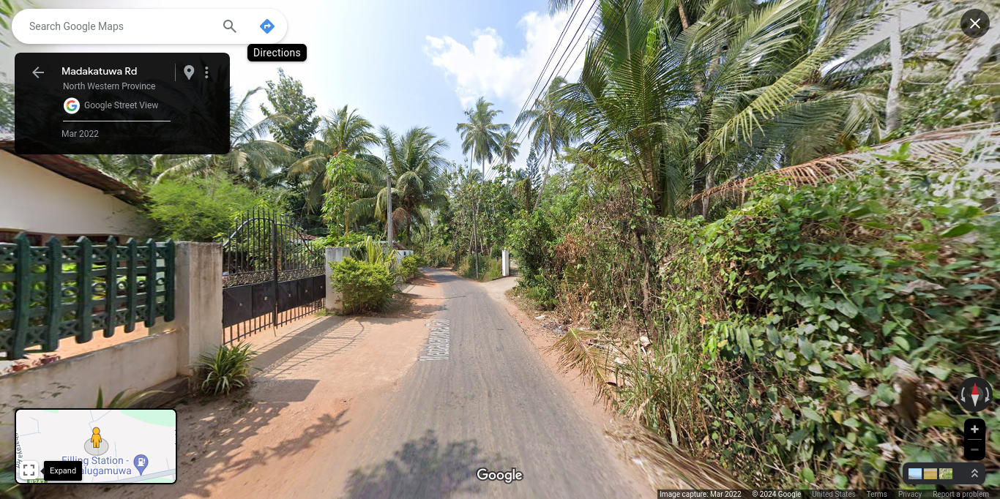

## Deshasthra Kalutara West

**Deshasthra Kalutara West** Grama Niladhari Division, **Kalutara** Divisional Secretariat Division, **Kalutara** District, **Western** Province

**Kalutara** Polling Division, **Kalutara** Electoral District

Population: 1,957 (2012)

(**LK-1321250**/717D)

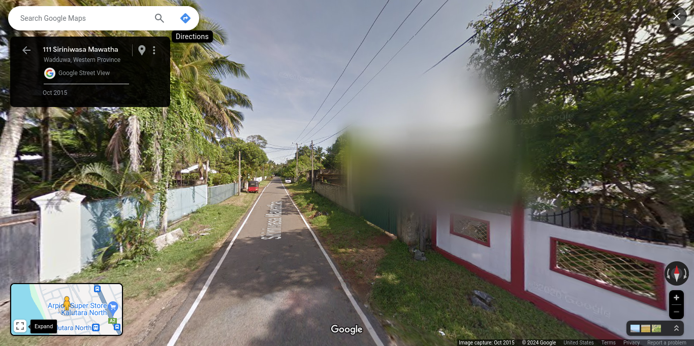

## Nedimala

**Nedimala** Grama Niladhari Division, **Dehiwala** Divisional Secretariat Division, **Colombo** District, **Western** Province

**Dehiwala** Polling Division, **Colombo** Electoral District

Population: 9,058 (2012)

(**LK-1130055**/536)

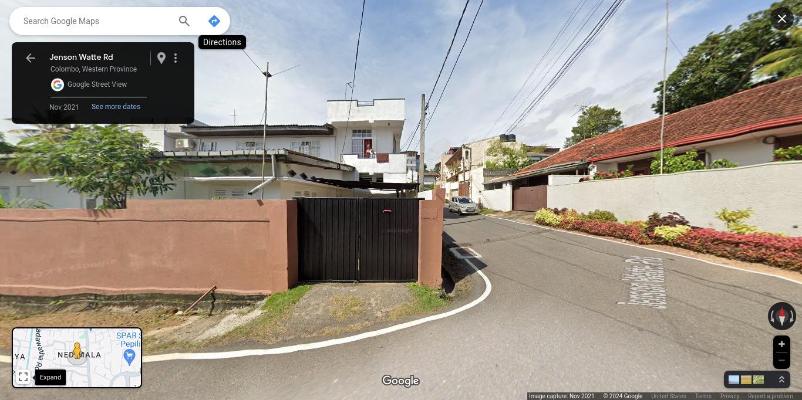

## Karasnagala South

**Karasnagala South** Grama Niladhari Division, **Attanagalla** Divisional Secretariat Division, **Gampaha** District, **Western** Province

**Attanagalla** Polling Division, **Gampaha** Electoral District

Population: 467 (2012)

(**LK-1227435**/365C)

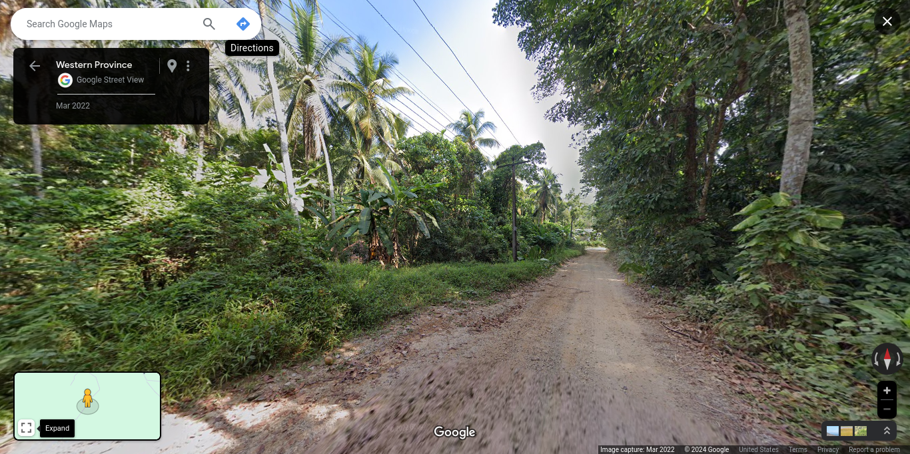

## Poramba

**Poramba** Grama Niladhari Division, **Akuressa** Divisional Secretariat Division, **Matara** District, **Southern** Province

**Akuressa** Polling Division, **Matara** Electoral District

Population: 1,582 (2012)

(**LK-3218160**/361A)

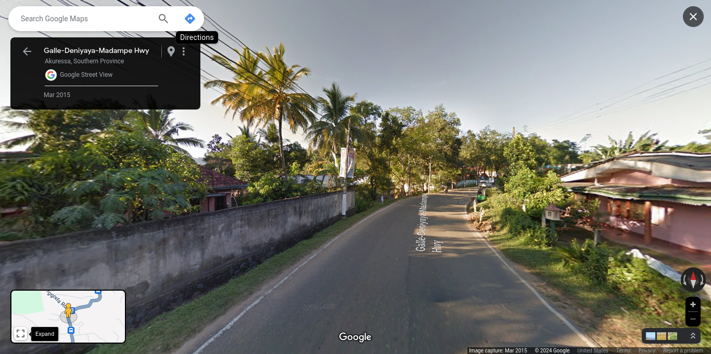

## Welekumbura

**Welekumbura** Grama Niladhari Division, **Balangoda** Divisional Secretariat Division, **Ratnapura** District, **Sabaragamuwa** Province

**Balangoda** Polling Division, **Ratnapura** Electoral District

Population: 1,637 (2012)

(**LK-9118010**/265A)

## Happawana

**Happawana** Grama Niladhari Division, **Habaraduwa** Divisional Secretariat Division, **Galle** District, **Southern** Province

**Habaraduwa** Polling Division, **Galle** Electoral District

Population: 685 (2012)

(**LK-3154110**/151)

## Erukkalampiddy Centre

**Erukkalampiddy Centre** Grama Niladhari Division, **Mannar Town** Divisional Secretariat Division, **Mannar** District, **Northern** Province

**Mannar** Polling Division, **Vanni** Electoral District

Population: 513 (2012)

(**LK-4203095**/MN/67)

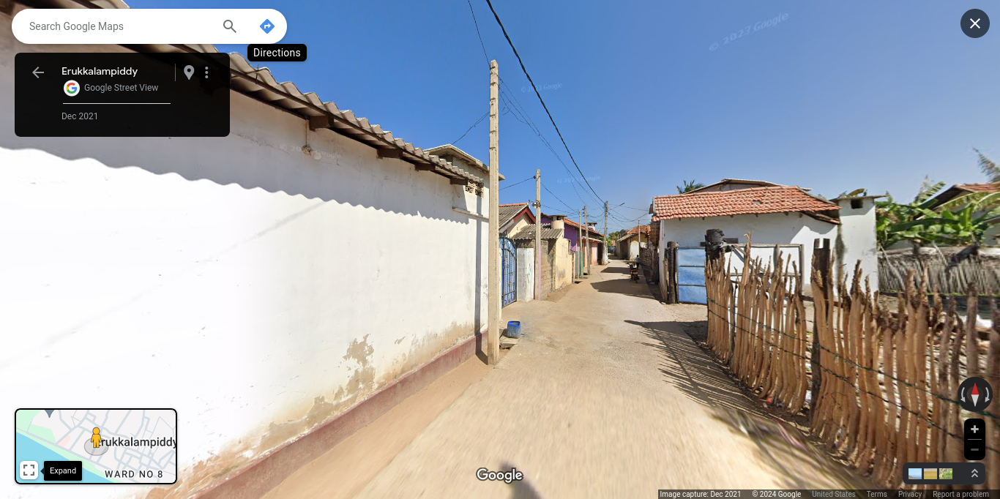

## Rahumaniya Nagar

**Rahumaniya Nagar** Grama Niladhari Division, **Kinniya** Divisional Secretariat Division, **Trincomalee** District, **Eastern** Province

**Muttur** Polling Division, **Trincomalee** Electoral District

Population: 1,976 (2012)

(**LK-5324135**/225)

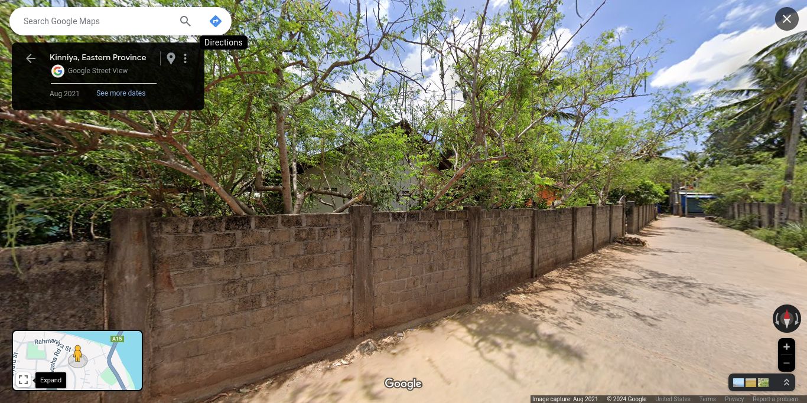

## Dolekanda

**Dolekanda** Grama Niladhari Division, **Kalawana** Divisional Secretariat Division, **Ratnapura** District, **Sabaragamuwa** Province

**Kalawana** Polling Division, **Ratnapura** Electoral District

Population: 1,349 (2012)

(**LK-9133125**/201C)

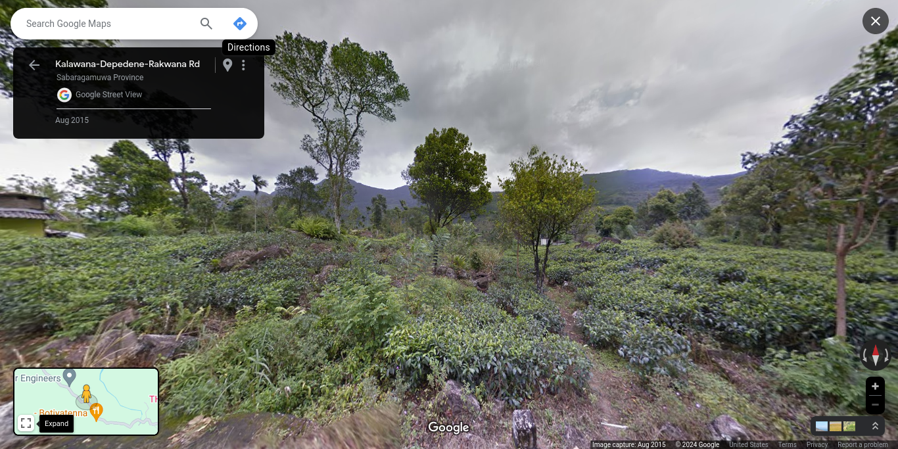

## Henamulla

**Henamulla** Grama Niladhari Division, **Panadura** Divisional Secretariat Division, **Kalutara** District, **Western** Province

**Panadura** Polling Division, **Kalutara** Electoral District

Population: 3,024 (2012)

(**LK-1303060**/673A)

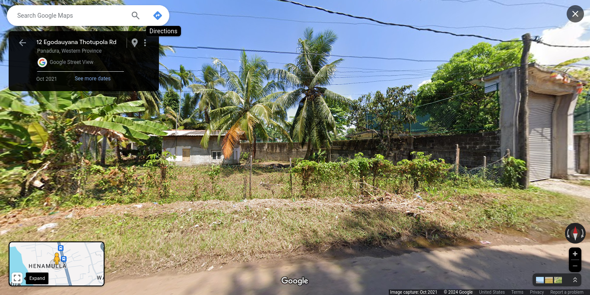

## Yahalewela

**Yahalewela** Grama Niladhari Division, **Balangoda** Divisional Secretariat Division, **Ratnapura** District, **Sabaragamuwa** Province

**Balangoda** Polling Division, **Ratnapura** Electoral District

Population: 1,138 (2012)

(**LK-9118035**/252B)

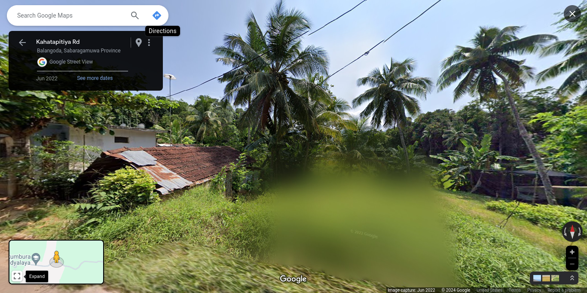

## Ninthavur 02

**Ninthavur 02** Grama Niladhari Division, **Ninthavur** Divisional Secretariat Division, **Ampara** District, **Eastern** Province

**Pothuvil** Polling Division, **Digamadulla** Electoral District

Population: 1,180 (2012)

(**LK-5230025**/40)

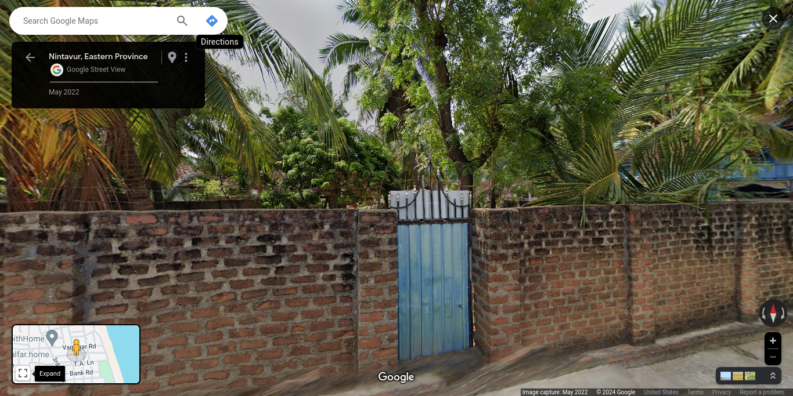

## Rathmetiya

**Rathmetiya** Grama Niladhari Division, **Hanguranketha** Divisional Secretariat Division, **Nuwara Eliya** District, **Central** Province

**Hanguranketha** Polling Division, **Nuwara-Eliya** Electoral District

Population: 711 (2012)

(**LK-2306235**/494C)

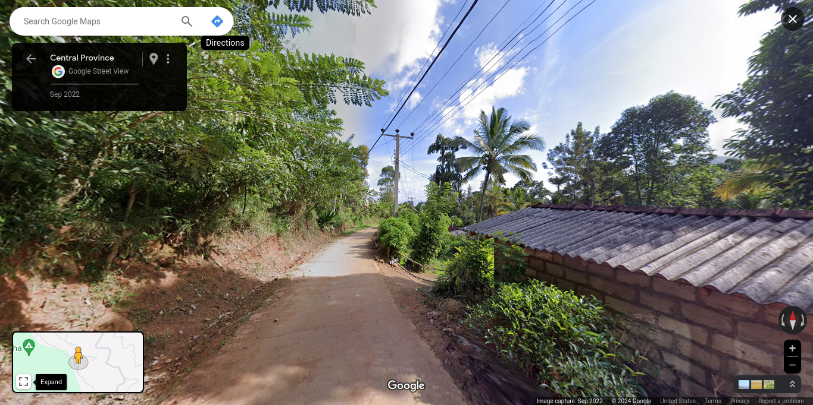

## Welage

**Welage** Grama Niladhari Division, **Balangoda** Divisional Secretariat Division, **Ratnapura** District, **Sabaragamuwa** Province

**Balangoda** Polling Division, **Ratnapura** Electoral District

Population: 1,095 (2012)

(**LK-9118255**/251)

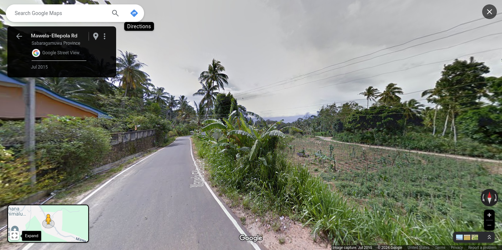

## Kaduruwela East

**Kaduruwela East** Grama Niladhari Division, **Thamankaduwa** Divisional Secretariat Division, **Polonnaruwa** District, **North Central** Province

**Polonnaruwa** Polling Division, **Polonnaruwa** Electoral District

Population: 1,703 (2012)

(**LK-7215160**/186)

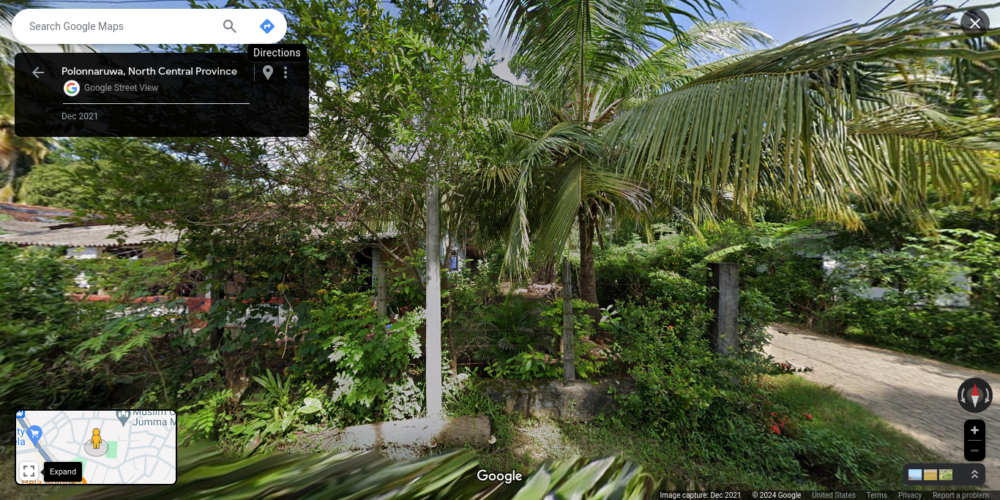

## Pallansena South

**Pallansena South** Grama Niladhari Division, **Negombo** Divisional Secretariat Division, **Gampaha** District, **Western** Province

**Negombo** Polling Division, **Gampaha** Electoral District

Population: 3,913 (2012)

(**LK-1203020**/76)

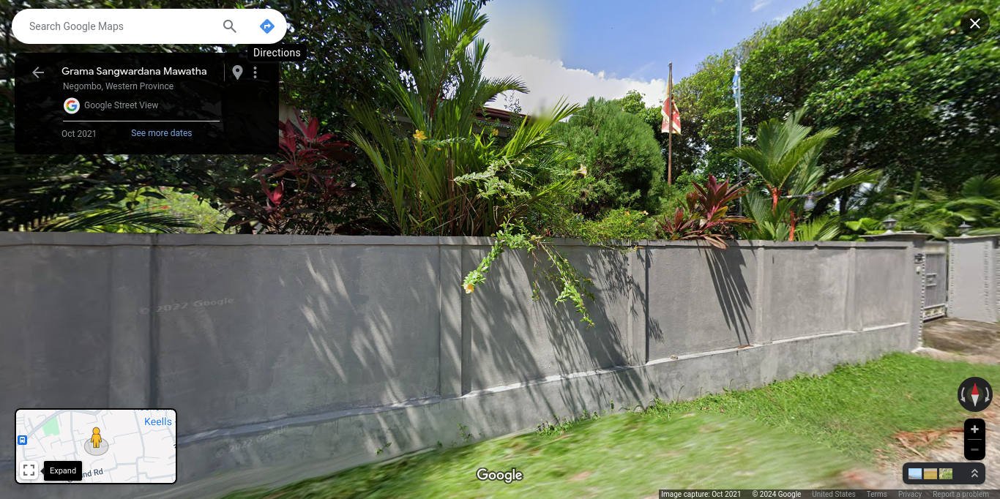

## Dalupatha

**Dalupatha** Grama Niladhari Division, **Negombo** Divisional Secretariat Division, **Gampaha** District, **Western** Province

**Negombo** Polling Division, **Gampaha** Electoral District

Population: 3,606 (2012)

(**LK-1203055**/72)

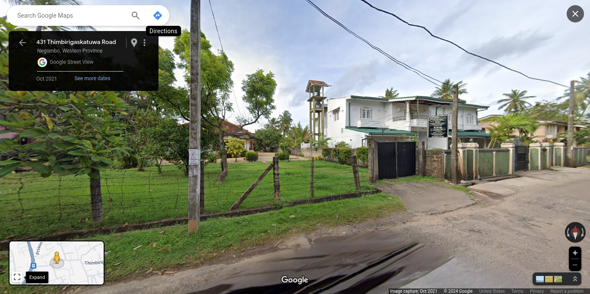

## Kommala

**Kommala** Grama Niladhari Division, **Bentota** Divisional Secretariat Division, **Galle** District, **Southern** Province

**Bentara Elpitiya** Polling Division, **Galle** Electoral District

Population: 1,480 (2012)

(**LK-3103020**/3C)

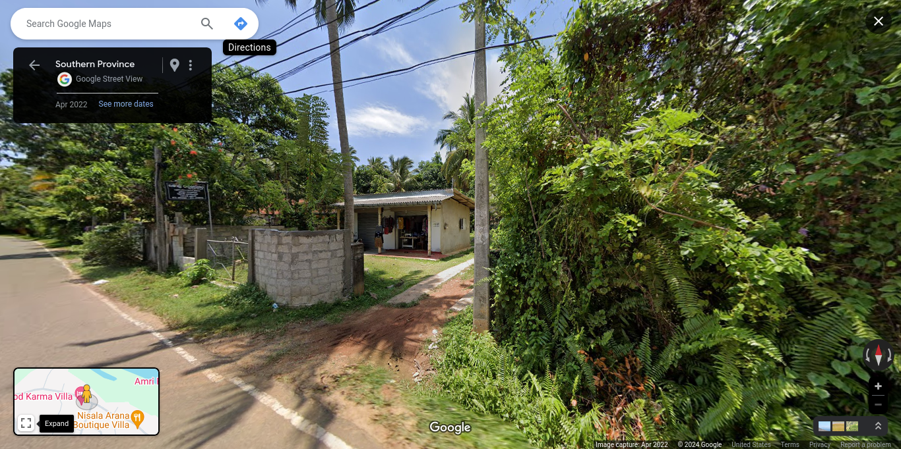

## Serugoda

**Serugoda** Grama Niladhari Division, **Ambanpola** Divisional Secretariat Division, **Kurunegala** District, **North Western** Province

**Yapahuwa** Polling Division, **Kurunegala** Electoral District

Population: 700 (2012)

(**LK-6112075**/155)

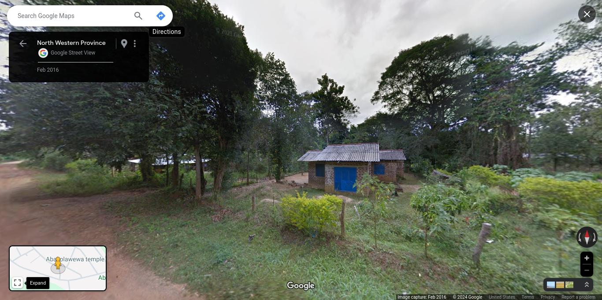

## Dampelessa Gama

**Dampelessa Gama** Grama Niladhari Division, **Ipalogama** Divisional Secretariat Division, **Anuradhapura** District, **North Central** Province

**Kekirawa** Polling Division, **Anuradhapura** Electoral District

Population: 813 (2012)

(**LK-7160055**/517)

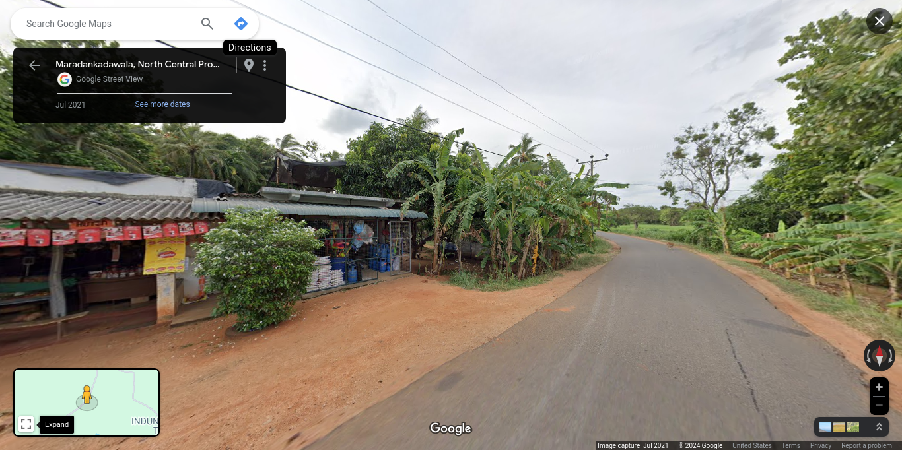

## Kahathuduwa West

**Kahathuduwa West** Grama Niladhari Division, **Homagama** Divisional Secretariat Division, **Colombo** District, **Western** Province

**Homagama** Polling Division, **Colombo** Electoral District

Population: 3,225 (2012)

(**LK-1112340**/602B)

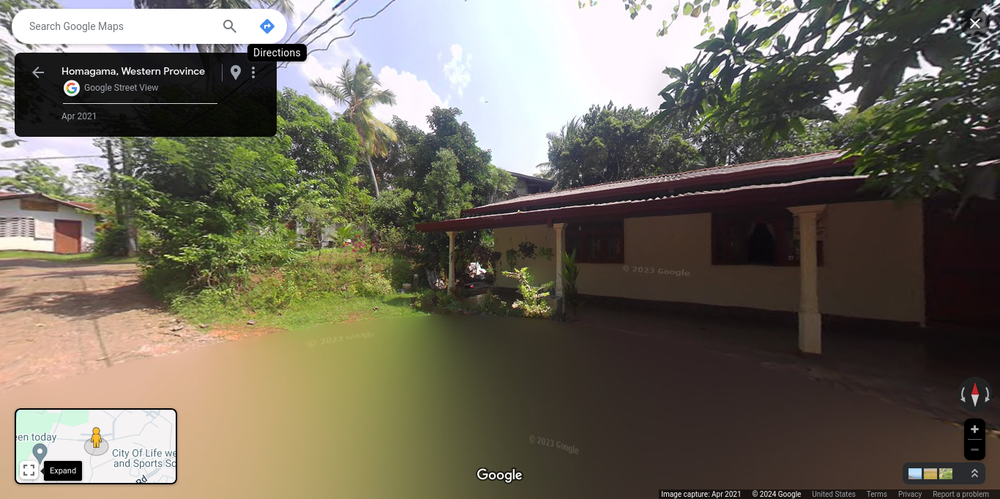

## Walpola East

**Walpola East** Grama Niladhari Division, **Ja-Ela** Divisional Secretariat Division, **Gampaha** District, **Western** Province

**Ja Ela** Polling Division, **Gampaha** Electoral District

Population: 4,459 (2012)

(**LK-1221215**/212B)

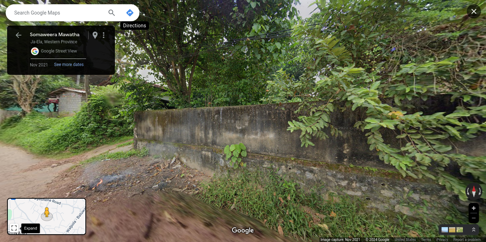

## Aruggammana

**Aruggammana** Grama Niladhari Division, **Galigamuwa** Divisional Secretariat Division, **Kegalle** District, **Sabaragamuwa** Province

**Galigamuwa** Polling Division, **Kegalle** Electoral District

Population: 1,287 (2012)

(**LK-9215255**/62)

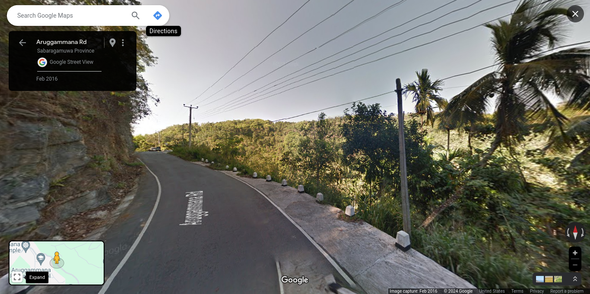

## Sooriyapaluwa East

**Sooriyapaluwa East** Grama Niladhari Division, **Mahara** Divisional Secretariat Division, **Gampaha** District, **Western** Province

**Mahara** Polling Division, **Gampaha** Electoral District

Population: 4,970 (2012)

(**LK-1233285**/245B)

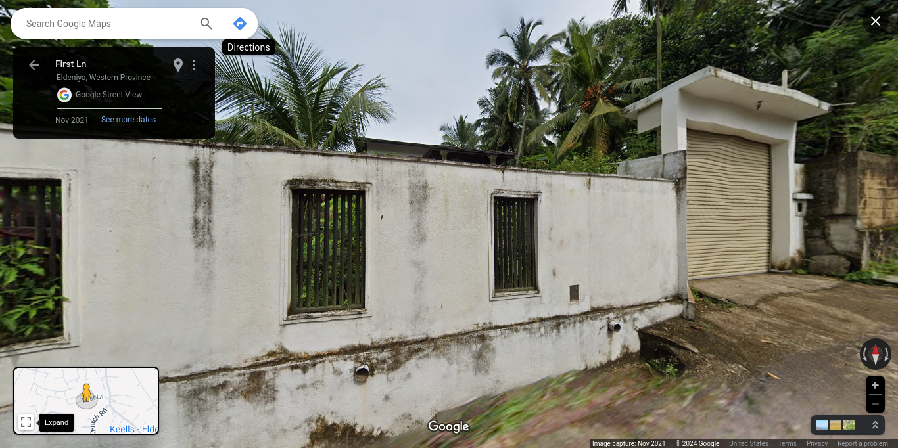

## Ariyalai Centre North

**Ariyalai Centre North** Grama Niladhari Division, **Nallur** Divisional Secretariat Division, **Jaffna** District, **Northern** Province

**Nallur** Polling Division, **Jaffna** Electoral District

Population: 879 (2012)

(**LK-4133030**/J/94)

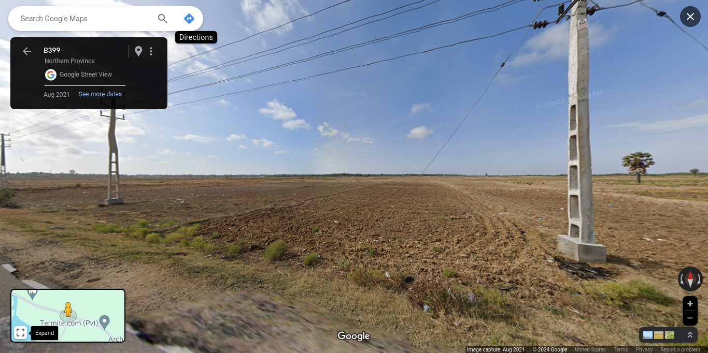

## Addalachchenai 15

**Addalachchenai 15** Grama Niladhari Division, **Addalachchenai** Divisional Secretariat Division, **Ampara** District, **Eastern** Province

**Pothuvil** Polling Division, **Digamadulla** Electoral District

Population: 1,731 (2012)

(**LK-5233140**/AD/30B/1)

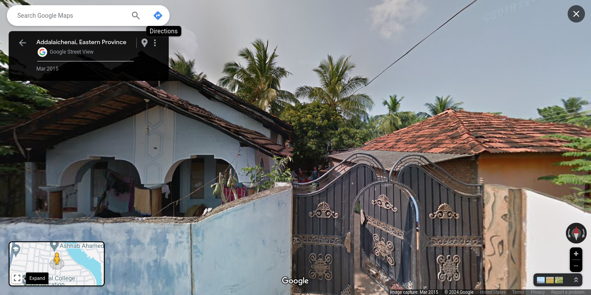

## Pahala Kosgama East

**Pahala Kosgama East** Grama Niladhari Division, **Seethawaka** Divisional Secretariat Division, **Colombo** District, **Western** Province

**Avissawella** Polling Division, **Colombo** Electoral District

Population: 1,830 (2012)

(**LK-1115110**/427)

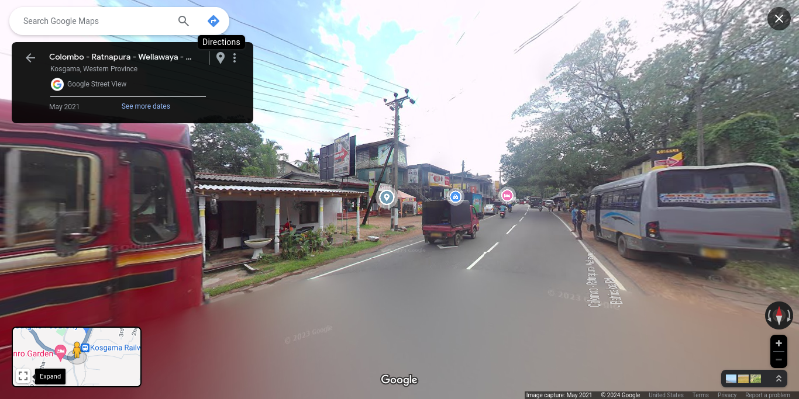

## Kadirapola

**Kadirapola** Grama Niladhari Division, **Pannala** Divisional Secretariat Division, **Kurunegala** District, **North Western** Province

**Katugampola** Polling Division, **Kurunegala** Electoral District

Population: 1,043 (2012)

(**LK-6178200**/1544)

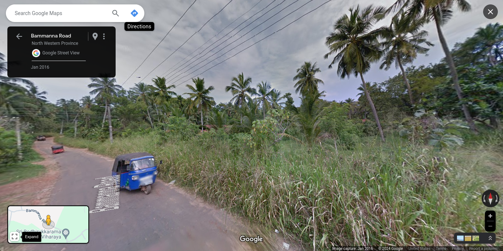

## Kadurupokuna North

**Kadurupokuna North** Grama Niladhari Division, **Tangalle** Divisional Secretariat Division, **Hambantota** District, **Southern** Province

**Tangalle** Polling Division, **Hambantota** Electoral District

Population: 624 (2012)

(**LK-3333270**/279)

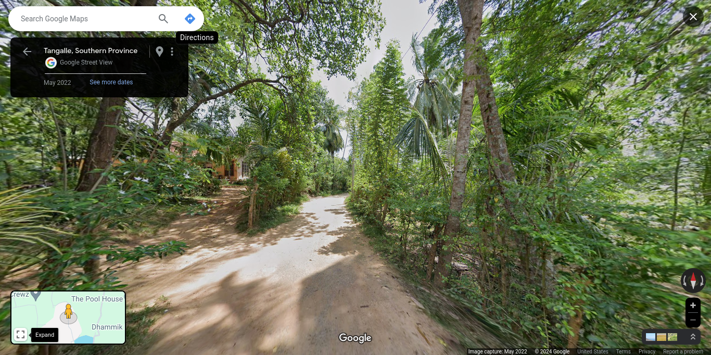

## Iruthayapuram Central

**Iruthayapuram Central** Grama Niladhari Division, **Manmunai North** Divisional Secretariat Division, **Batticaloa** District, **Eastern** Province

**Batticaloa** Polling Division, **Batticaloa** Electoral District

Population: 949 (2012)

(**LK-5118100**/176H)

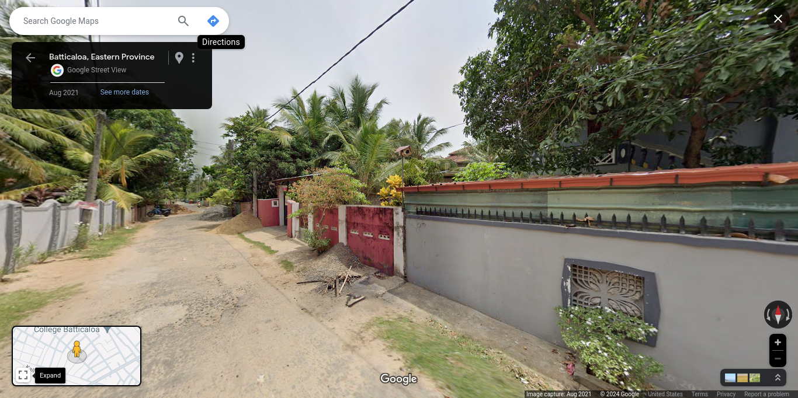

## Danduwana

**Danduwana** Grama Niladhari Division, **Imaduwa** Divisional Secretariat Division, **Galle** District, **Southern** Province

**Habaraduwa** Polling Division, **Galle** Electoral District

Population: 511 (2012)

(**LK-3151020**/153A)

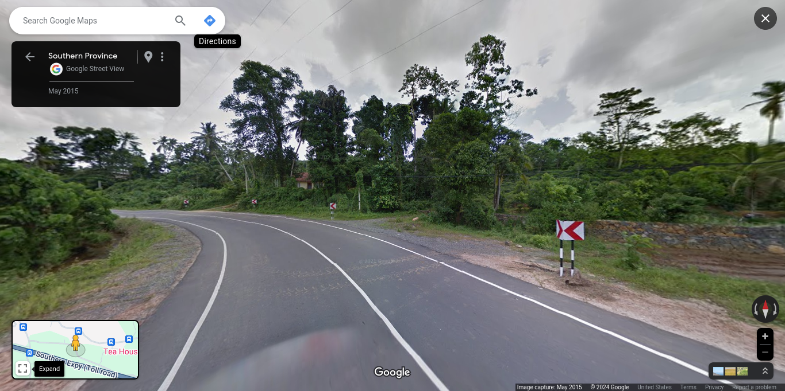

## Thoppur

**Thoppur** Grama Niladhari Division, **Muttur** Divisional Secretariat Division, **Trincomalee** District, **Eastern** Province

**Muttur** Polling Division, **Trincomalee** Electoral District

Population: 1,305 (2012)

(**LK-5327145**/216)

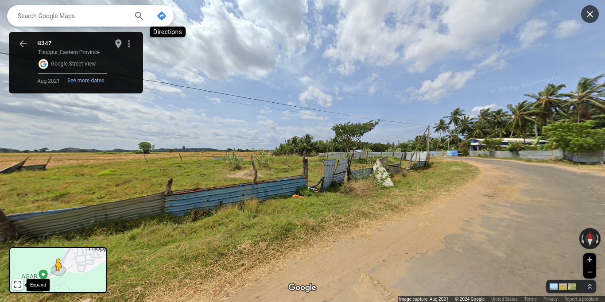

## Kadambawa

**Kadambawa** Grama Niladhari Division, **Maho** Divisional Secretariat Division, **Kurunegala** District, **North Western** Province

**Yapahuwa** Polling Division, **Kurunegala** Electoral District

Population: 989 (2012)

(**LK-6124260**/220)

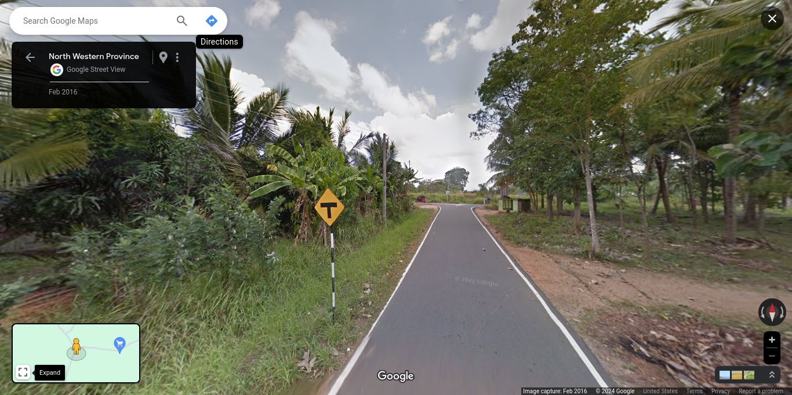

## Dunukewala

**Dunukewala** Grama Niladhari Division, **Rambukkana** Divisional Secretariat Division, **Kegalle** District, **Sabaragamuwa** Province

**Rambukkana** Polling Division, **Kegalle** Electoral District

Population: 1,296 (2012)

(**LK-9203315**/11B)

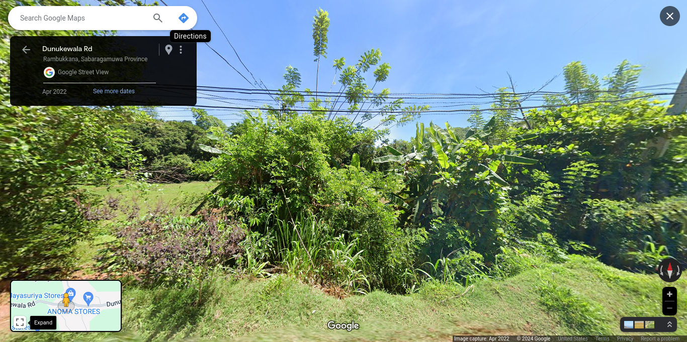

## Godamuna North

**Godamuna North** Grama Niladhari Division, **Niyagama** Divisional Secretariat Division, **Galle** District, **Southern** Province

**Hiniduma** Polling Division, **Galle** Electoral District

Population: 886 (2012)

(**LK-3115045**/33C)

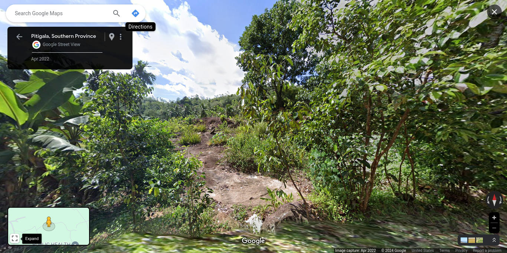

## Maligagodella

**Maligagodella** Grama Niladhari Division, **Kolonnawa** Divisional Secretariat Division, **Colombo** District, **Western** Province

**Kolonnawa** Polling Division, **Colombo** Electoral District

Population: 2,083 (2012)

(**LK-1106160**/502B)

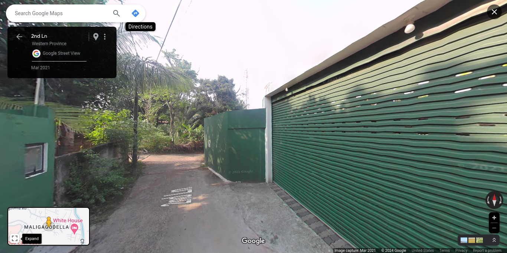

## Uduvil Centre North

**Uduvil Centre North** Grama Niladhari Division, **Valikamam South (Uduvil)** Divisional Secretariat Division, **Jaffna** District, **Northern** Province

**Manipay** Polling Division, **Jaffna** Electoral District

Population: 2,931 (2012)

(**LK-4115020**/J/185)

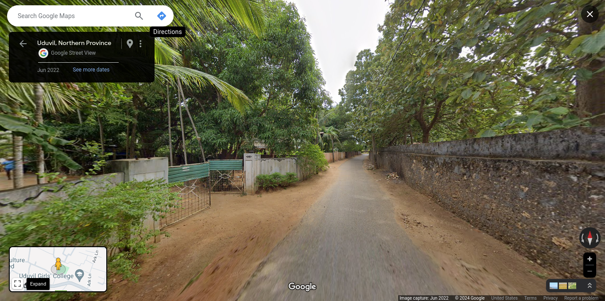

## Warakanatta

**Warakanatta** Grama Niladhari Division, **Kelaniya** Divisional Secretariat Division, **Gampaha** District, **Western** Province

**Kelaniya** Polling Division, **Gampaha** Electoral District

Population: 3,926 (2012)

(**LK-1236080**/259)

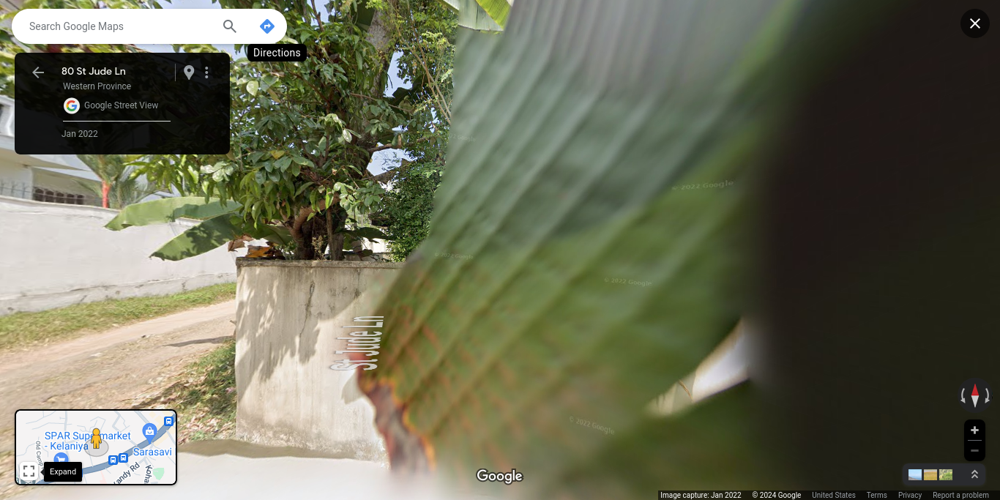

## Kotuwabendahena

**Kotuwabendahena** Grama Niladhari Division, **Bentota** Divisional Secretariat Division, **Galle** District, **Southern** Province

**Bentara Elpitiya** Polling Division, **Galle** Electoral District

Population: 371 (2012)

(**LK-3103235**/40A)

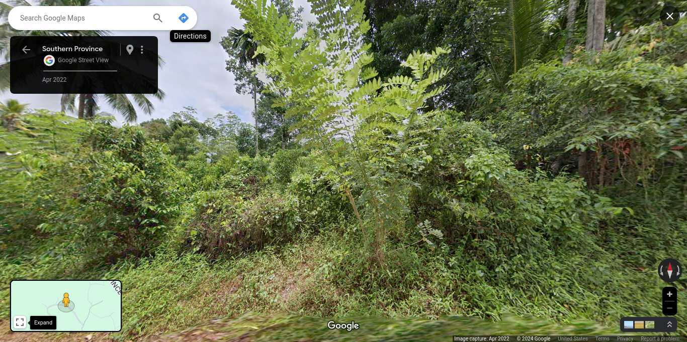

## Piranpattai

**Piranpattai** Grama Niladhari Division, **Valikamam South-West (Sandilipay)** Divisional Secretariat Division, **Jaffna** District, **Northern** Province

**Vaddukoddai** Polling Division, **Jaffna** Electoral District

Population: 1,788 (2012)

(**LK-4109095**/J/147)

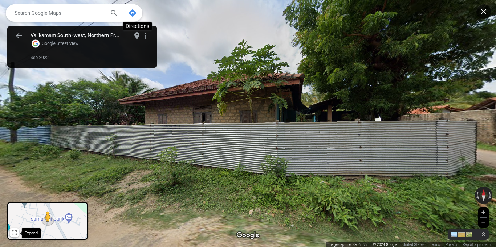

## kurinchakerny

**kurinchakerny** Grama Niladhari Division, **Kinniya** Divisional Secretariat Division, **Trincomalee** District, **Eastern** Province

**Muttur** Polling Division, **Trincomalee** Electoral District

Population: 2,357 (2012)

(**LK-5324070**/226G)

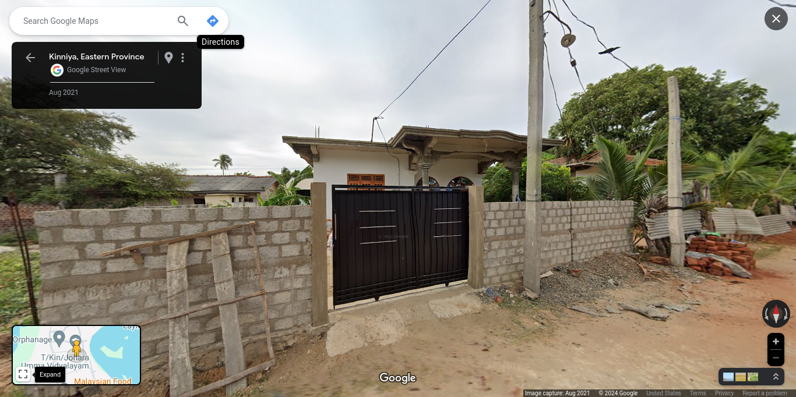

## Massalgoda

**Massalgoda** Grama Niladhari Division, **Beruwala** Divisional Secretariat Division, **Kalutara** District, **Western** Province

**Beruwala** Polling Division, **Kalutara** Electoral District

Population: 1,939 (2012)

(**LK-1324240**/757)

## Wanduruppa

**Wanduruppa** Grama Niladhari Division, **Ambalantota** Divisional Secretariat Division, **Hambantota** District, **Southern** Province

**Thissamaharama** Polling Division, **Hambantota** Electoral District

Population: 1,849 (2012)

(**LK-3315270**/142)

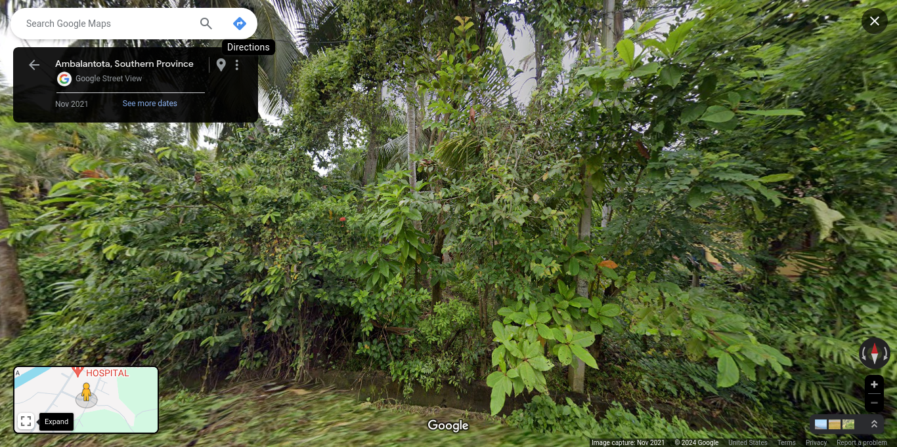

## Opanayaka

**Opanayaka** Grama Niladhari Division, **Opanayake** Divisional Secretariat Division, **Ratnapura** District, **Sabaragamuwa** Province

**Rakwana** Polling Division, **Ratnapura** Electoral District

Population: 2,477 (2012)

(**LK-9121045**/245)

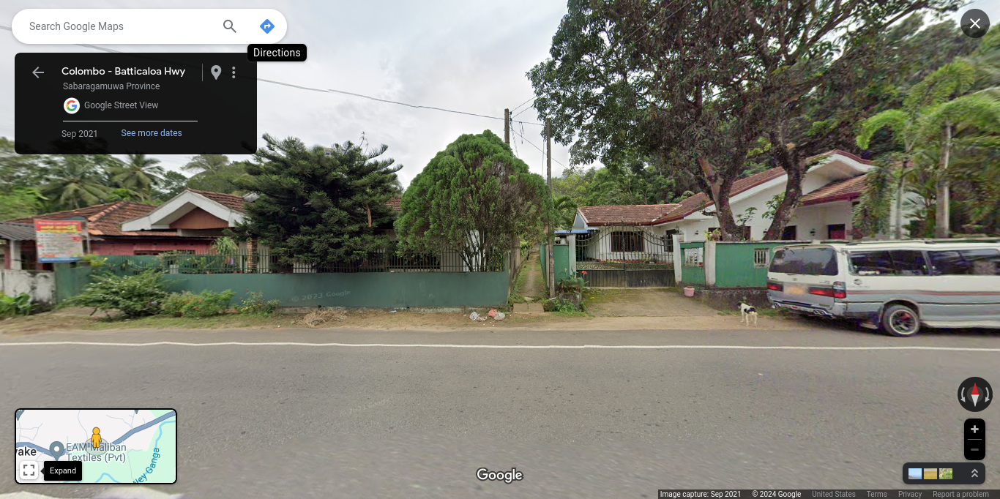

## Maha Aruggoda

**Maha Aruggoda** Grama Niladhari Division, **Bandaragama** Divisional Secretariat Division, **Kalutara** District, **Western** Province

**Bandaragama** Polling Division, **Kalutara** Electoral District

Population: 3,478 (2012)

(**LK-1306085**/678)

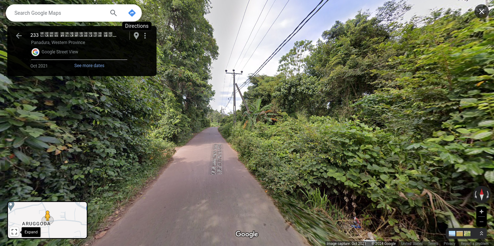

## Danthure

**Danthure** Grama Niladhari Division, **Yatinuwara** Divisional Secretariat Division, **Kandy** District, **Central** Province

**Yatinuwara** Polling Division, **Kandy** Electoral District

Population: 1,746 (2012)

(**LK-2136225**/161)

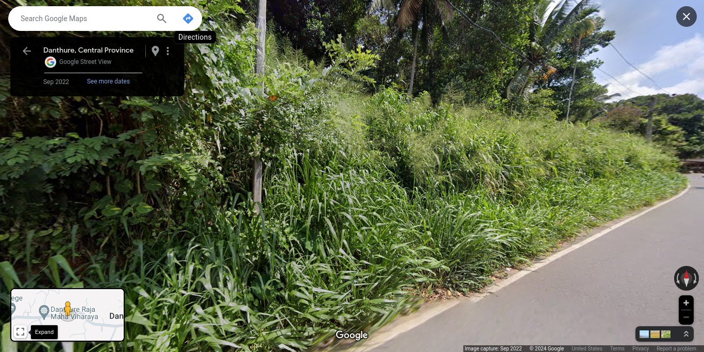

## Imbulliha

**Imbulliha** Grama Niladhari Division, **Bandaragama** Divisional Secretariat Division, **Kalutara** District, **Western** Province

**Bandaragama** Polling Division, **Kalutara** Electoral District

Population: 2,217 (2012)

(**LK-1306215**/694A)

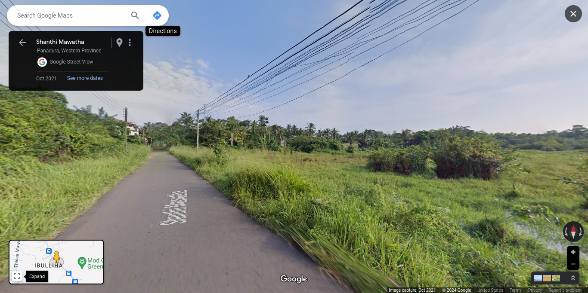

## Ruwan Ella

**Ruwan Ella** Grama Niladhari Division, **Matara Four Gravets** Divisional Secretariat Division, **Matara** District, **Southern** Province

**Matara** Polling Division, **Matara** Electoral District

Population: 1,699 (2012)

(**LK-3242140**/428A)

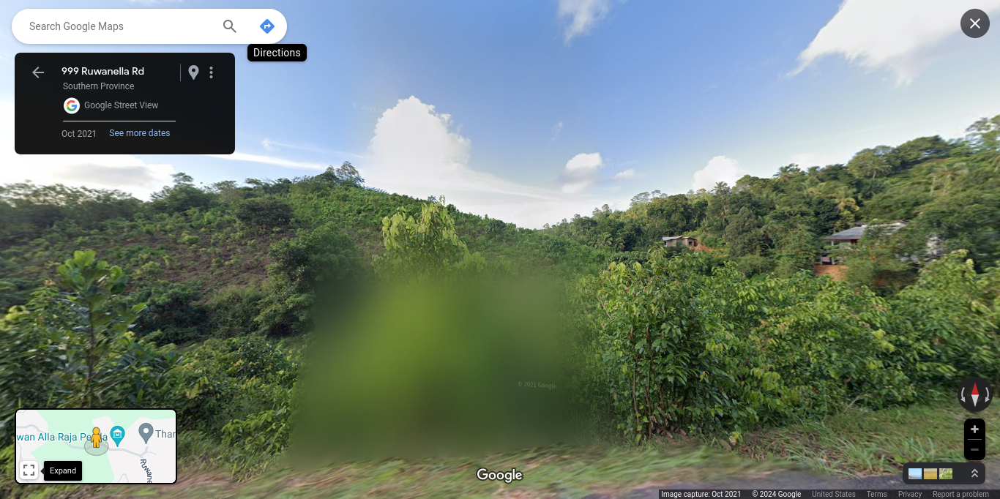

## Kalapugama

**Kalapugama** Grama Niladhari Division, **Kalutara** Divisional Secretariat Division, **Kalutara** District, **Western** Province

**Kalutara** Polling Division, **Kalutara** Electoral District

Population: 1,485 (2012)

(**LK-1321080**/709)

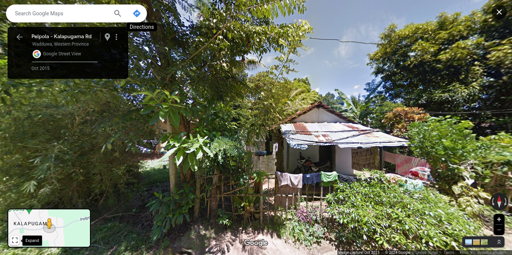

## Kithulampitiya

**Kithulampitiya** Grama Niladhari Division, **Bope-Poddala** Divisional Secretariat Division, **Galle** District, **Southern** Province

**Akmeemana** Polling Division, **Galle** Electoral District

Population: 1,759 (2012)

(**LK-3142180**/124)

## Diyasunnatha

**Diyasunnatha** Grama Niladhari Division, **Rambukkana** Divisional Secretariat Division, **Kegalle** District, **Sabaragamuwa** Province

**Rambukkana** Polling Division, **Kegalle** Electoral District

Population: 750 (2012)

(**LK-9203220**/08A)

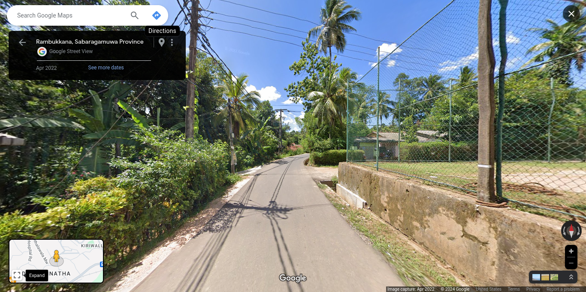

## Alaveddy West

**Alaveddy West** Grama Niladhari Division, **Valikamam North (Tellipallai)** Divisional Secretariat Division, **Jaffna** District, **Northern** Province

**Kayts** Polling Division, **Jaffna** Electoral District

Population: 2,134 (2012)

(**LK-4112045**/220)

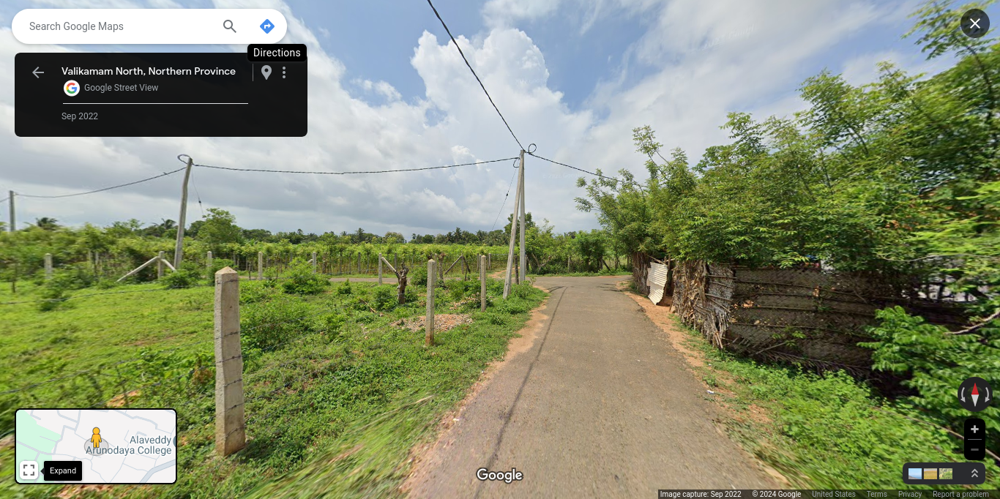

## Kiralogama

**Kiralogama** Grama Niladhari Division, **Thalawa** Divisional Secretariat Division, **Anuradhapura** District, **North Central** Province

**Anuradhapura East** Polling Division, **Anuradhapura** Electoral District

Population: 1,575 (2012)

(**LK-7148065**/398)

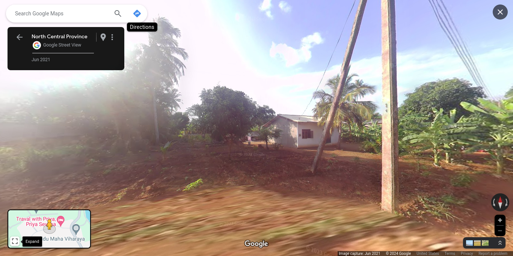

## Ambanwala

**Ambanwala** Grama Niladhari Division, **Udunuwara** Divisional Secretariat Division, **Kandy** District, **Central** Province

**Udunuwara** Polling Division, **Kandy** Electoral District

Population: 649 (2012)

(**LK-2139350**/105)

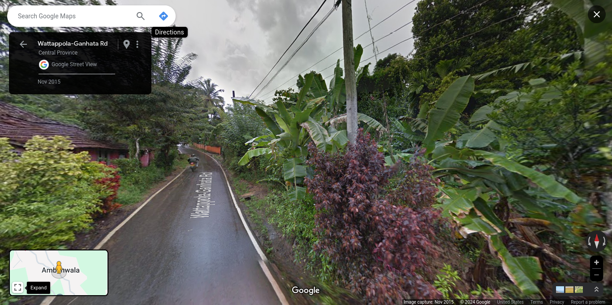

## Karainagar South

**Karainagar South** Grama Niladhari Division, **Karainagar** Divisional Secretariat Division, **Jaffna** District, **Northern** Province

**Vaddukoddai** Polling Division, **Jaffna** Electoral District

Population: 1,250 (2012)

(**LK-4104040**/J/44)

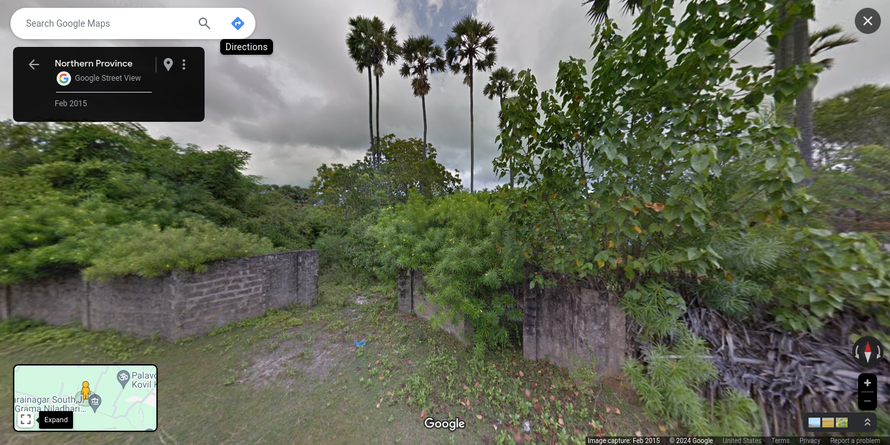

## Muthuwadiya

**Muthuwadiya** Grama Niladhari Division, **Katana** Divisional Secretariat Division, **Gampaha** District, **Western** Province

**Katana** Polling Division, **Gampaha** Electoral District

Population: 1,758 (2012)

(**LK-1206250**/201)

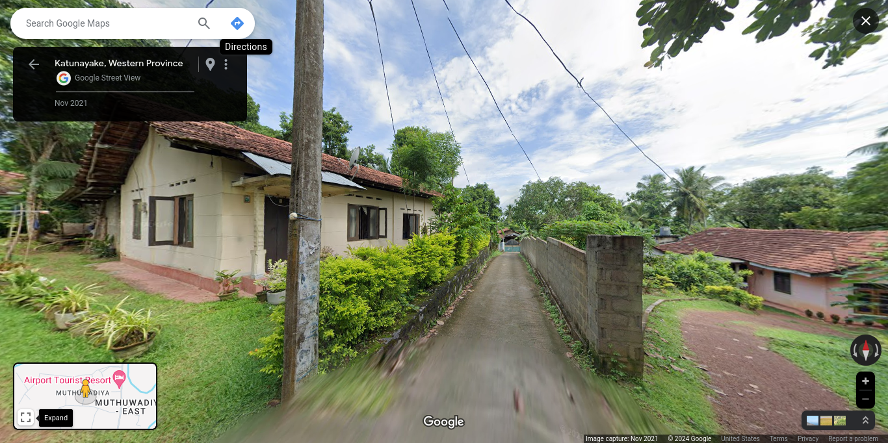

## Isurumuniya

**Isurumuniya** Grama Niladhari Division, **Nuwaragam Palatha Central** Divisional Secretariat Division, **Anuradhapura** District, **North Central** Province

**Anuradhapura West** Polling Division, **Anuradhapura** Electoral District

Population: 1,525 (2012)

(**LK-7115180**/296)

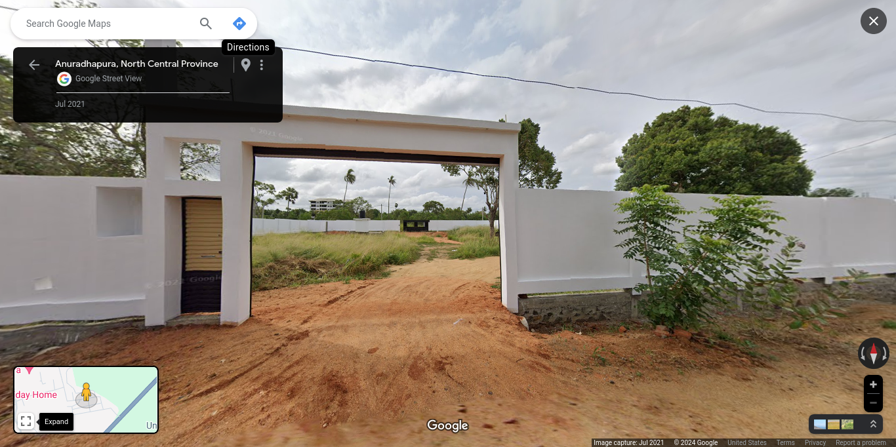

## Loolbadduwa

**Loolbadduwa** Grama Niladhari Division, **Walallavita** Divisional Secretariat Division, **Kalutara** District, **Western** Province

**Agalawatta** Polling Division, **Kalutara** Electoral District

Population: 1,294 (2012)

(**LK-1339130**/780)

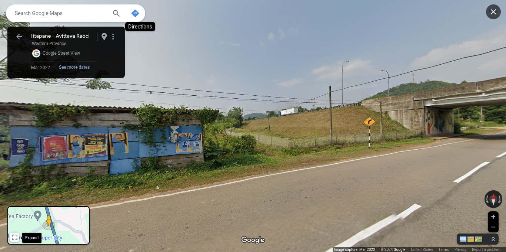

## Nebadagahayaya

**Nebadagahayaya** Grama Niladhari Division, **Nattandiya** Divisional Secretariat Division, **Puttalam** District, **North Western** Province

**Nattandiya** Polling Division, **Puttalam** Electoral District

Population: 1,518 (2012)

(**LK-6242195**/495D)

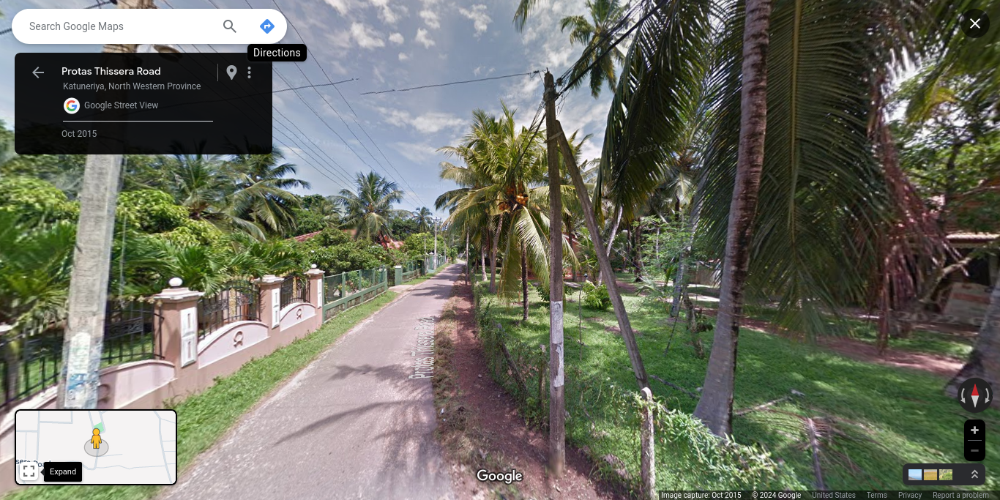

## Siyambalagahawela

**Siyambalagahawela** Grama Niladhari Division, **Galewela** Divisional Secretariat Division, **Matale** District, **Central** Province

**Dambulla** Polling Division, **Matale** Electoral District

Population: 921 (2012)

(**LK-2203210**/E427A)

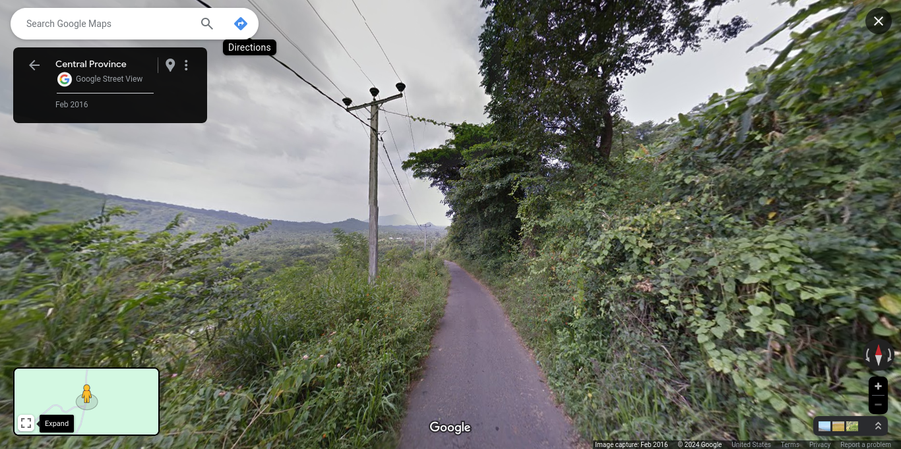

## Welivita Ihala North

**Welivita Ihala North** Grama Niladhari Division, **Hatharaliyadda** Divisional Secretariat Division, **Kandy** District, **Central** Province

**Galagedara** Polling Division, **Kandy** Electoral District

Population: 548 (2012)

(**LK-2134120**/340)

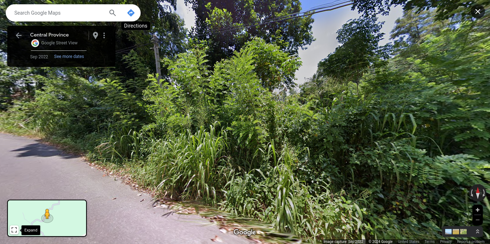

## Ninthavur 16

**Ninthavur 16** Grama Niladhari Division, **Ninthavur** Divisional Secretariat Division, **Ampara** District, **Eastern** Province

**Pothuvil** Polling Division, **Digamadulla** Electoral District

Population: 794 (2012)

(**LK-5230055**/38B)

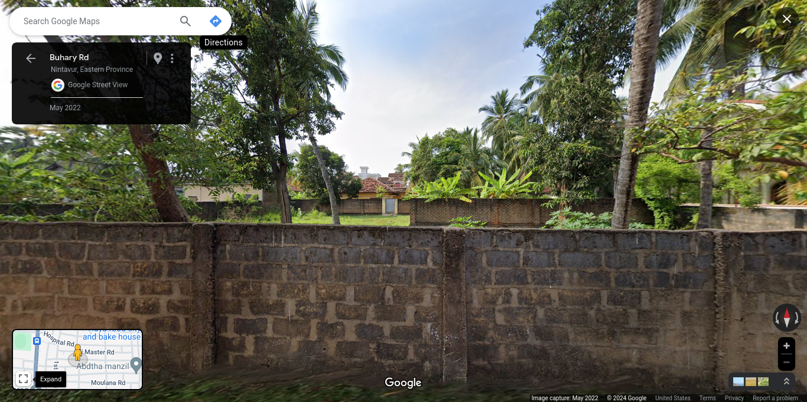

## Ranpokunagama A Zone

**Ranpokunagama A Zone** Grama Niladhari Division, **Attanagalla** Divisional Secretariat Division, **Gampaha** District, **Western** Province

**Attanagalla** Polling Division, **Gampaha** Electoral District

Population: 1,443 (2012)

(**LK-1227205**/349A)

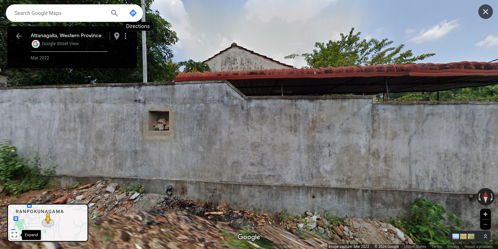

## Deddugoda North

**Deddugoda North** Grama Niladhari Division, **Galle Four Gravets** Divisional Secretariat Division, **Galle** District, **Southern** Province

**Galle** Polling Division, **Galle** Electoral District

Population: 2,887 (2012)

(**LK-3139070**/101C)

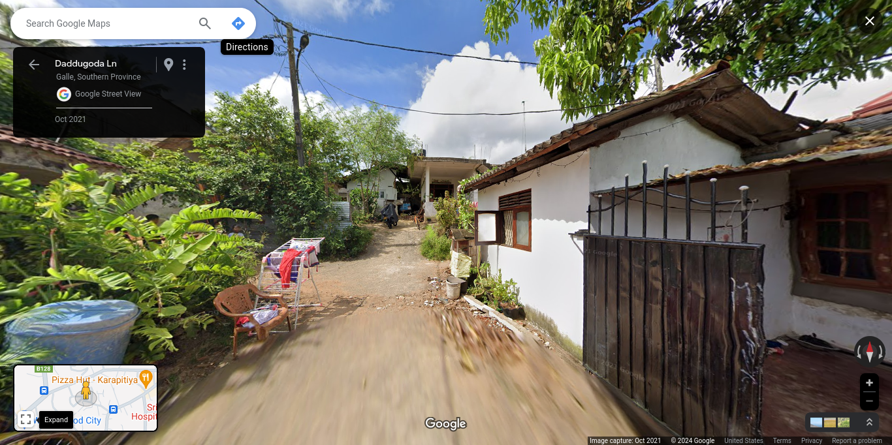

## Divulwewa

**Divulwewa** Grama Niladhari Division, **Anamaduwa** Divisional Secretariat Division, **Puttalam** District, **North Western** Province

**Anamaduwa** Polling Division, **Puttalam** Electoral District

Population: 1,070 (2012)

(**LK-6224150**/658C)

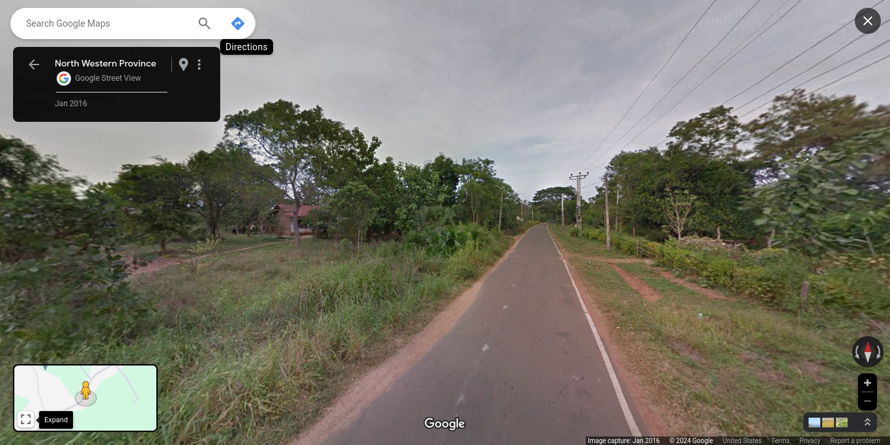

## Kumarapuram

**Kumarapuram** Grama Niladhari Division, **Kandavalai** Divisional Secretariat Division, **Kilinochchi** District, **Northern** Province

**Kilinochchi** Polling Division, **Jaffna** Electoral District

Population: 1,145 (2012)

(**LK-4506025**/KN/43)

## Railway Town

**Railway Town** Grama Niladhari Division, **Kekirawa** Divisional Secretariat Division, **Anuradhapura** District, **North Central** Province

**Kekirawa** Polling Division, **Anuradhapura** Electoral District

Population: 1,069 (2012)

(**LK-7154095**/620)

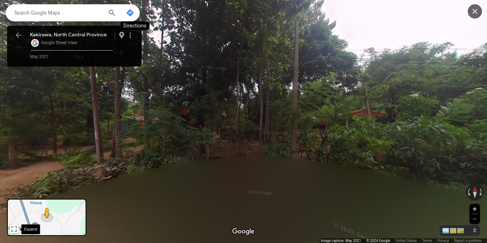

## Kosgahagoda

**Kosgahagoda** Grama Niladhari Division, **Beliatta** Divisional Secretariat Division, **Hambantota** District, **Southern** Province

**Beliatta** Polling Division, **Hambantota** Electoral District

Population: 624 (2012)

(**LK-3330110**/317)

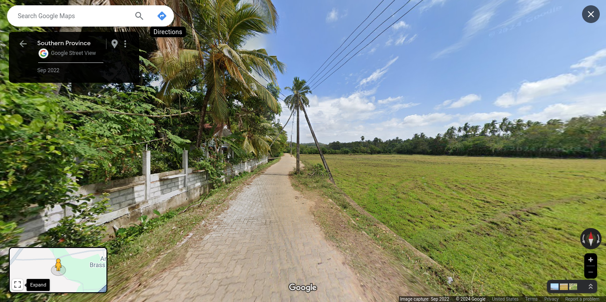

## Alawathugoda

**Alawathugoda** Grama Niladhari Division, **Akurana** Divisional Secretariat Division, **Kandy** District, **Central** Province

**Harispattuwa** Polling Division, **Kandy** Electoral District

Population: 3,835 (2012)

(**LK-2109025**/583)

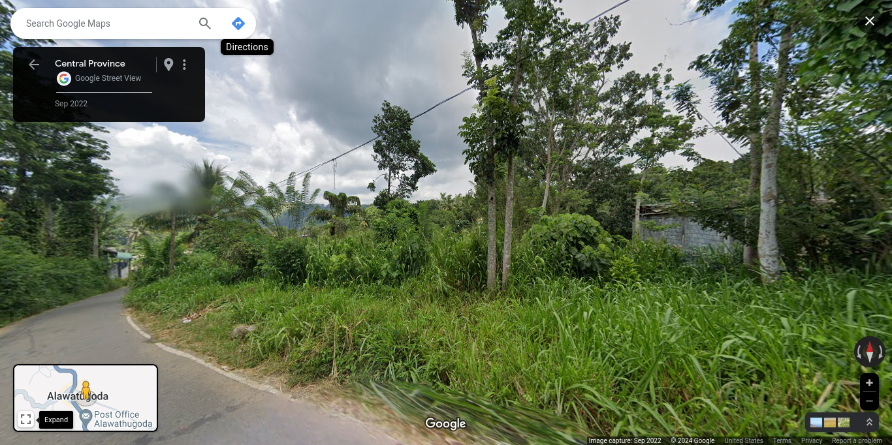

## Central Camp 06

**Central Camp 06** Grama Niladhari Division, **Navithanveli** Divisional Secretariat Division, **Ampara** District, **Eastern** Province

**Samanthurai** Polling Division, **Digamadulla** Electoral District

Population: 1,106 (2012)

(**LK-5216025**/SP/93/F)

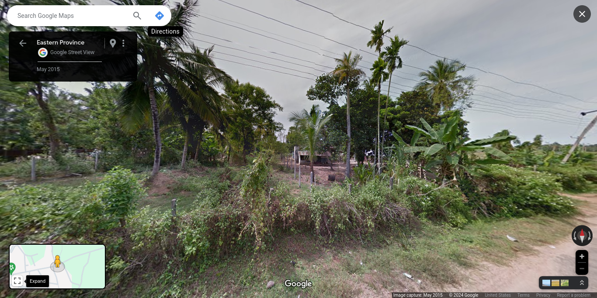

## Point Pedro South

**Point Pedro South** Grama Niladhari Division, **Vadamaradchi North (Point Pedro)** Divisional Secretariat Division, **Jaffna** District, **Northern** Province

**Point Pedro** Polling Division, **Jaffna** Electoral District

Population: 1,373 (2012)

(**LK-4127100**/J/402)

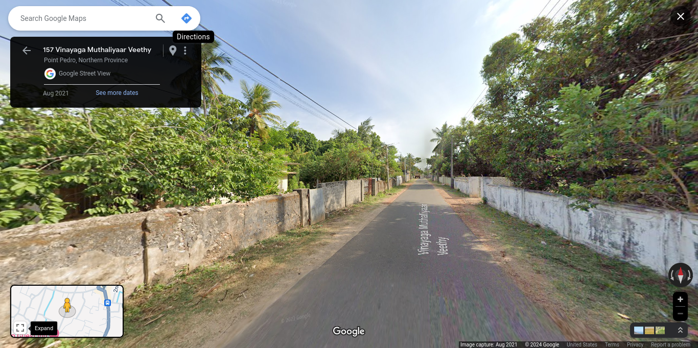

## Bulathsinhala East

**Bulathsinhala East** Grama Niladhari Division, **Bulathsinhala** Divisional Secretariat Division, **Kalutara** District, **Western** Province

**Bulathsinhala** Polling Division, **Kalutara** Electoral District

Population: 1,281 (2012)

(**LK-1312150**/824E)

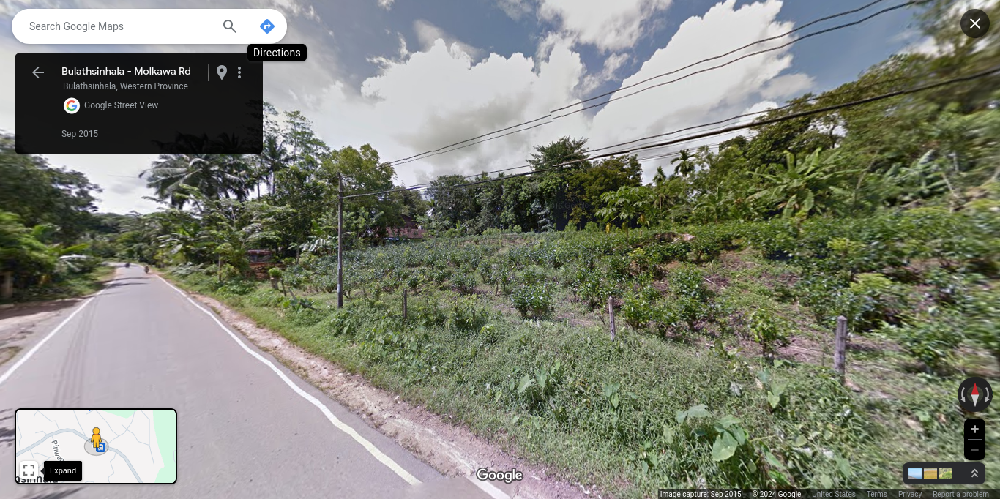

## Meda Walahapitiya

**Meda Walahapitiya** Grama Niladhari Division, **Mahawewa** Divisional Secretariat Division, **Puttalam** District, **North Western** Province

**Nattandiya** Polling Division, **Puttalam** Electoral District

Population: 974 (2012)

(**LK-6239085**/518A)

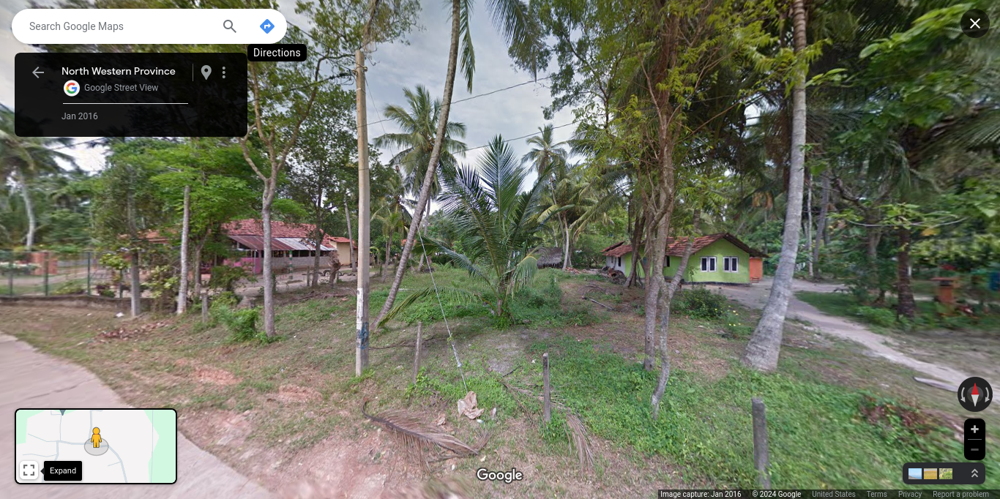

## Ihala Millewa South

**Ihala Millewa South** Grama Niladhari Division, **Horana** Divisional Secretariat Division, **Kalutara** District, **Western** Province

**Horana** Polling Division, **Kalutara** Electoral District

Population: 2,885 (2012)

(**LK-1309025**/628D)

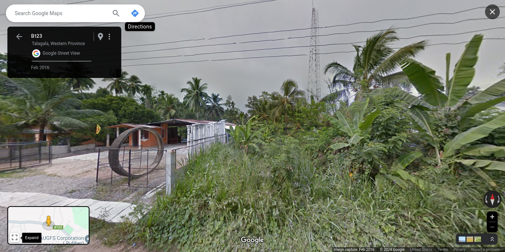

## Bandarawela East

**Bandarawela East** Grama Niladhari Division, **Bandarawela** Divisional Secretariat Division, **Badulla** District, **Uva** Province

**Bandarawela** Polling Division, **Badulla** Electoral District

Population: 3,182 (2012)

(**LK-8133070**/65G)

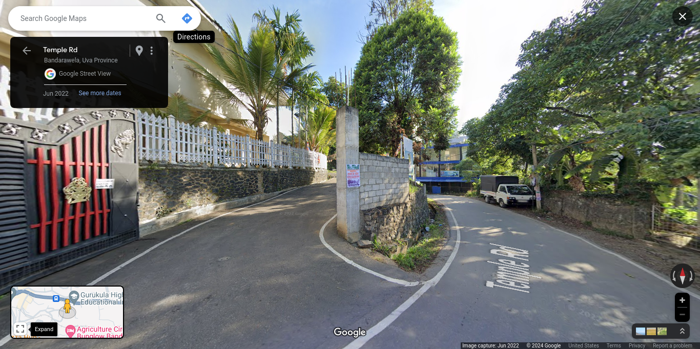

## Pinnagolla

**Pinnagolla** Grama Niladhari Division, **Pathahewaheta** Divisional Secretariat Division, **Kandy** District, **Central** Province

**Hewaheta** Polling Division, **Kandy** Electoral District

Population: 778 (2012)

(**LK-2145055**/986)

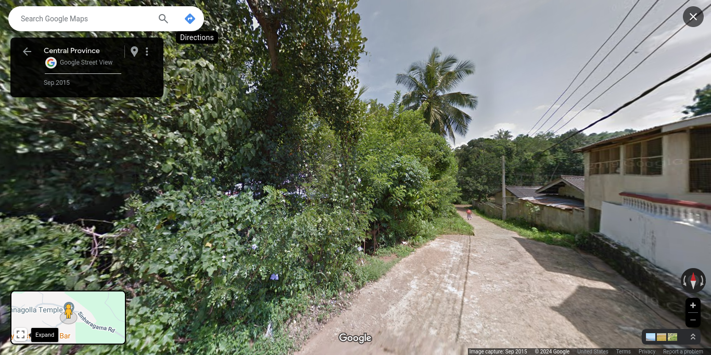

## Kalapaluwawa

**Kalapaluwawa** Grama Niladhari Division, **Kaduwela** Divisional Secretariat Division, **Colombo** District, **Western** Province

**Kaduwela** Polling Division, **Colombo** Electoral District

Population: 4,287 (2012)

(**LK-1109160**/491)

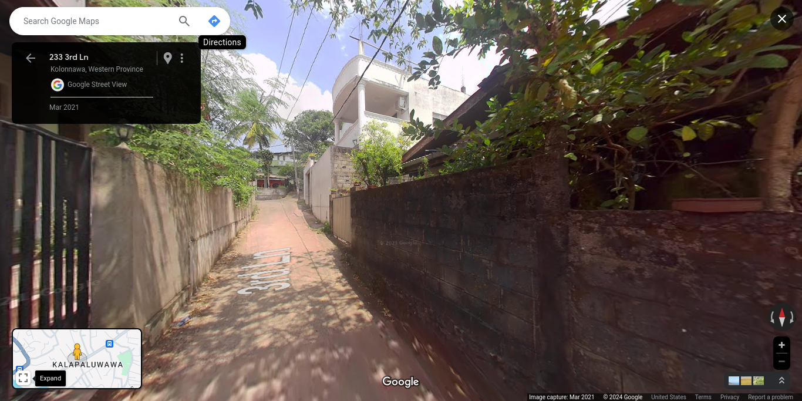

## Addalachchenai 15

**Addalachchenai 15** Grama Niladhari Division, **Addalachchenai** Divisional Secretariat Division, **Ampara** District, **Eastern** Province

**Pothuvil** Polling Division, **Digamadulla** Electoral District

Population: 1,731 (2012)

(**LK-5233140**/AD/30B/1)

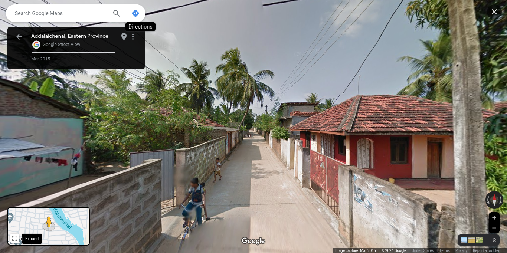

## Wedikanda

**Wedikanda** Grama Niladhari Division, **Ratmalana** Divisional Secretariat Division, **Colombo** District, **Western** Province

**Ratmalana** Polling Division, **Colombo** Electoral District

Population: 7,585 (2012)

(**LK-1131045**/546A)

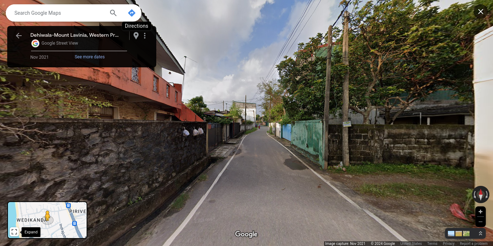

## Batugoda North

**Batugoda North** Grama Niladhari Division, **Pujapitiya** Divisional Secretariat Division, **Kandy** District, **Central** Province

**Harispattuwa** Polling Division, **Kandy** Electoral District

Population: 632 (2012)

(**LK-2106290**/550)

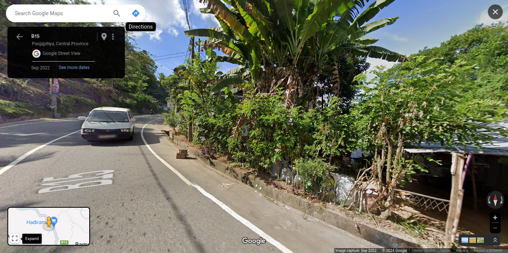

## Arunagirinagar

**Arunagirinagar** Grama Niladhari Division, **Trincomalee Town and Gravets** Divisional Secretariat Division, **Trincomalee** District, **Eastern** Province

**Trincomalee** Polling Division, **Trincomalee** Electoral District

Population: 2,009 (2012)

(**LK-5315205**/244G)

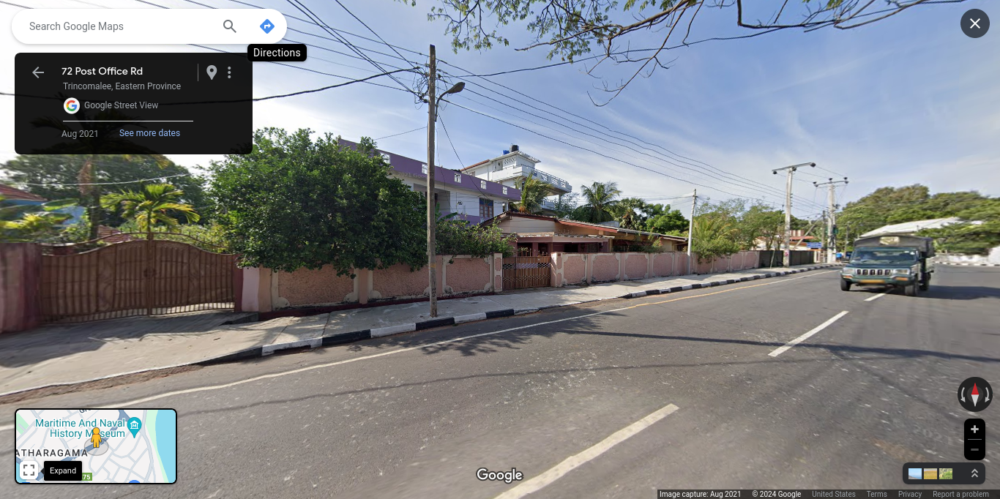

## Karanavai East

**Karanavai East** Grama Niladhari Division, **Vadamaradchi South-West (Karaveddy)** Divisional Secretariat Division, **Jaffna** District, **Northern** Province

**Udupiddy** Polling Division, **Jaffna** Electoral District

Population: 1,348 (2012)

(**LK-4121020**/J/351)

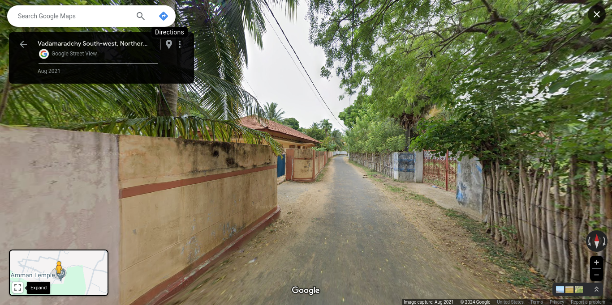

## Bogahamulugoda

**Bogahamulugoda** Grama Niladhari Division, **Habaraduwa** Divisional Secretariat Division, **Galle** District, **Southern** Province

**Habaraduwa** Polling Division, **Galle** Electoral District

Population: 743 (2012)

(**LK-3154105**/151C)

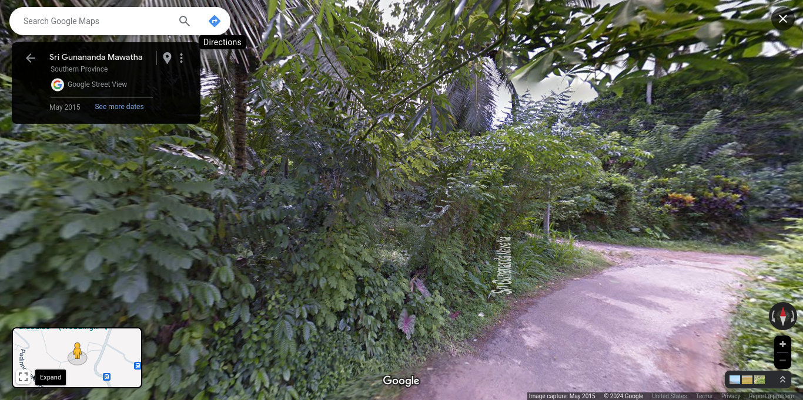

## Aluthepola West

**Aluthepola West** Grama Niladhari Division, **Divulapitiya** Divisional Secretariat Division, **Gampaha** District, **Western** Province

**Divulapitiya** Polling Division, **Gampaha** Electoral District

Population: 1,715 (2012)

(**LK-1209515**/89)

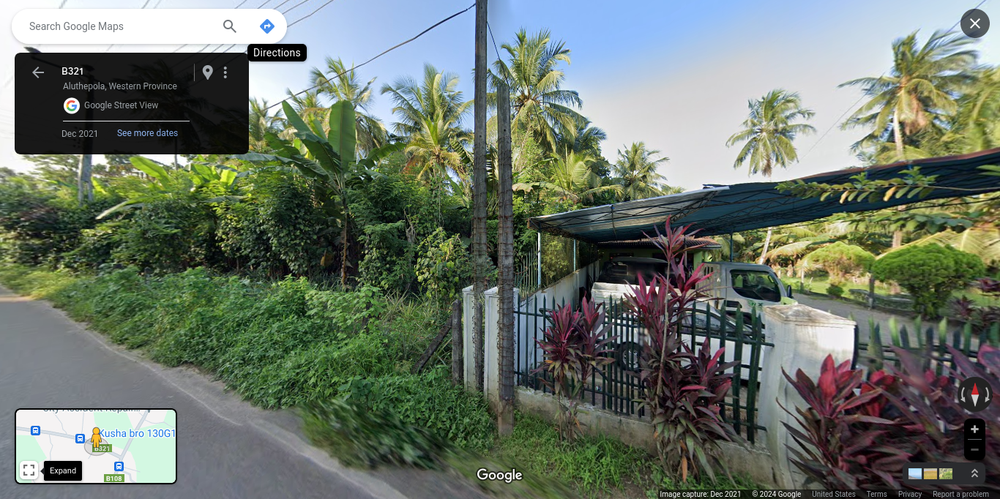

## Addalachchenai 12

**Addalachchenai 12** Grama Niladhari Division, **Addalachchenai** Divisional Secretariat Division, **Ampara** District, **Eastern** Province

**Pothuvil** Polling Division, **Digamadulla** Electoral District

Population: 833 (2012)

(**LK-5233120**/AD/30A/1)

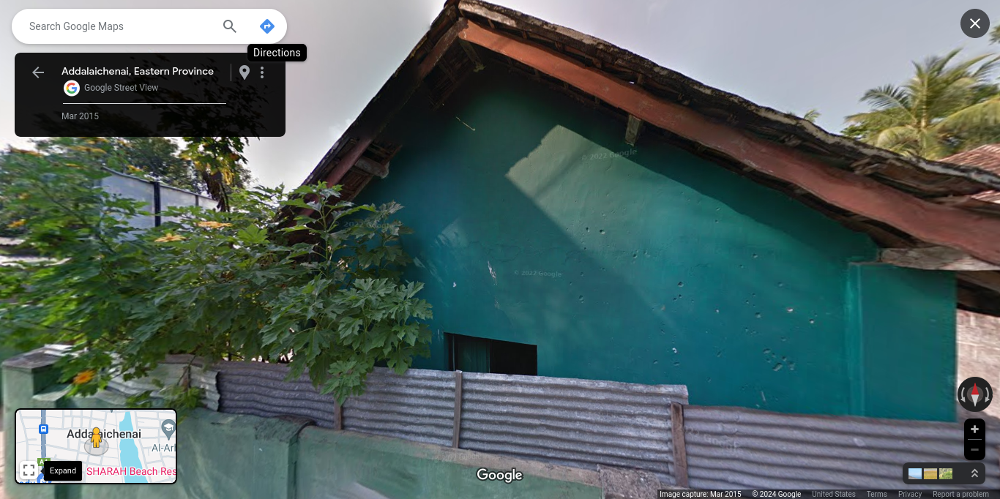

## Thavady East

**Thavady East** Grama Niladhari Division, **Valikamam South (Uduvil)** Divisional Secretariat Division, **Jaffna** District, **Northern** Province

**Manipay** Polling Division, **Jaffna** Electoral District

Population: 1,458 (2012)

(**LK-4115060**/J/193)

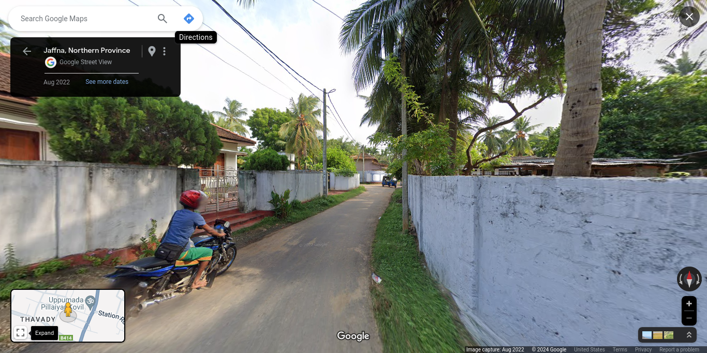

## Ihala Biyanvila Central

**Ihala Biyanvila Central** Grama Niladhari Division, **Biyagama** Divisional Secretariat Division, **Gampaha** District, **Western** Province

**Biyagama** Polling Division, **Gampaha** Electoral District

Population: 5,003 (2012)

(**LK-1239015**/269B)

## Orr's Hill

**Orr's Hill** Grama Niladhari Division, **Trincomalee Town and Gravets** Divisional Secretariat Division, **Trincomalee** District, **Eastern** Province

**Trincomalee** Polling Division, **Trincomalee** Electoral District

Population: 5,169 (2012)

(**LK-5315180**/244P)

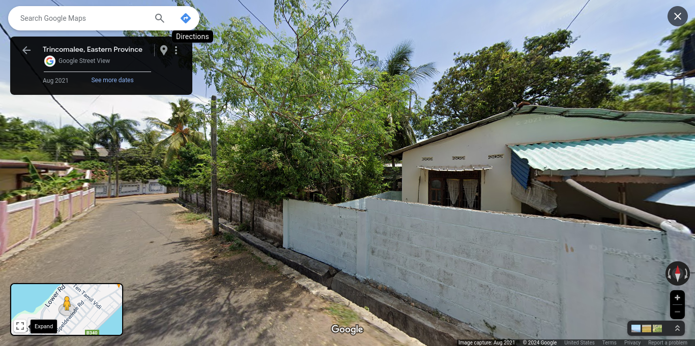

## Dadalla East

**Dadalla East** Grama Niladhari Division, **Galle Four Gravets** Divisional Secretariat Division, **Galle** District, **Southern** Province

**Galle** Polling Division, **Galle** Electoral District

Population: 1,370 (2012)

(**LK-3139130**/102A)

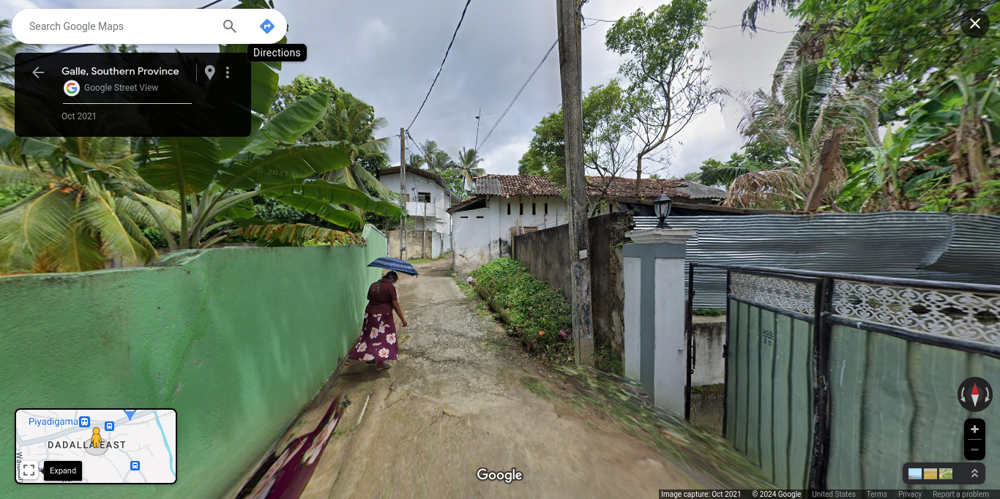

## Ambagaswewa

**Ambagaswewa** Grama Niladhari Division, **Maho** Divisional Secretariat Division, **Kurunegala** District, **North Western** Province

**Yapahuwa** Polling Division, **Kurunegala** Electoral District

Population: 692 (2012)

(**LK-6124310**/204)

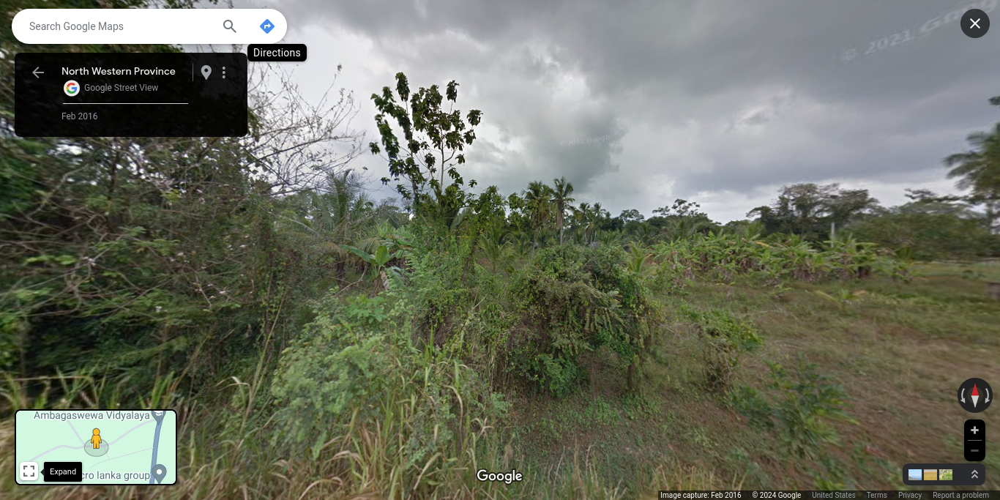

## Batapotha Ela

**Batapotha Ela** Grama Niladhari Division, **Pannala** Divisional Secretariat Division, **Kurunegala** District, **North Western** Province

**Katugampola** Polling Division, **Kurunegala** Electoral District

Population: 1,266 (2012)

(**LK-6178050**/1557)

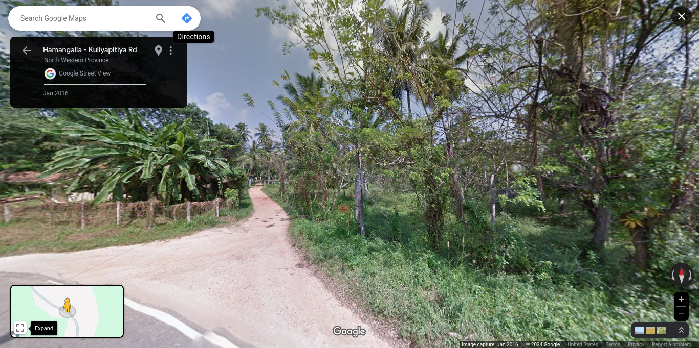

## Kahatagasdigiliya East

**Kahatagasdigiliya East** Grama Niladhari Division, **Kahatagasdigiliya** Divisional Secretariat Division, **Anuradhapura** District, **North Central** Province

**Horowpothana** Polling Division, **Anuradhapura** Electoral District

Population: 1,746 (2012)

(**LK-7121085**/231)

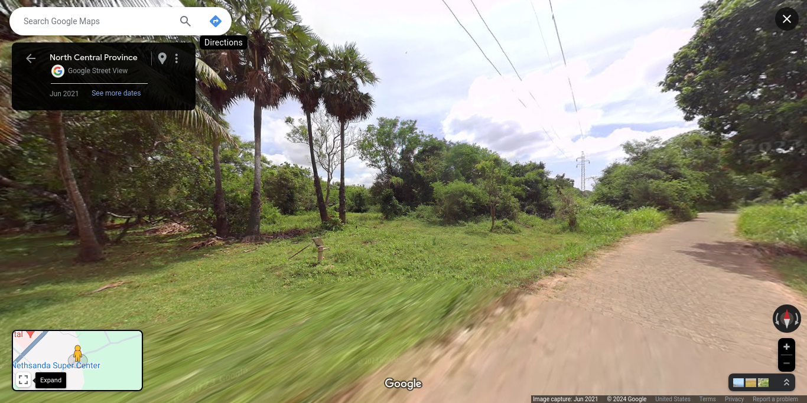

## Bedigama South

**Bedigama South** Grama Niladhari Division, **Weeraketiya** Divisional Secretariat Division, **Hambantota** District, **Southern** Province

**Beliatta** Polling Division, **Hambantota** Electoral District

Population: 948 (2012)

(**LK-3321290**/381)

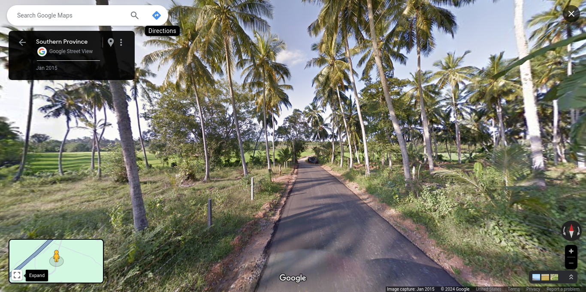

## Andeniya

**Andeniya** Grama Niladhari Division, **Badulla** Divisional Secretariat Division, **Badulla** District, **Uva** Province

**Badulla** Polling Division, **Badulla** Electoral District

Population: 2,168 (2012)

(**LK-8121025**/79A)

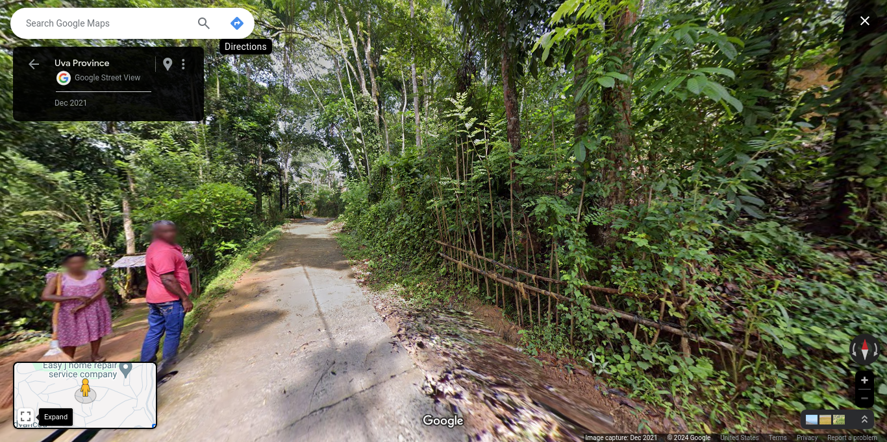

## Wahamalgollewa Track 3

**Wahamalgollewa Track 3** Grama Niladhari Division, **Rambewa** Divisional Secretariat Division, **Anuradhapura** District, **North Central** Province

**Medawachchiya** Polling Division, **Anuradhapura** Electoral District

Population: 676 (2012)

(**LK-7118120**/109)

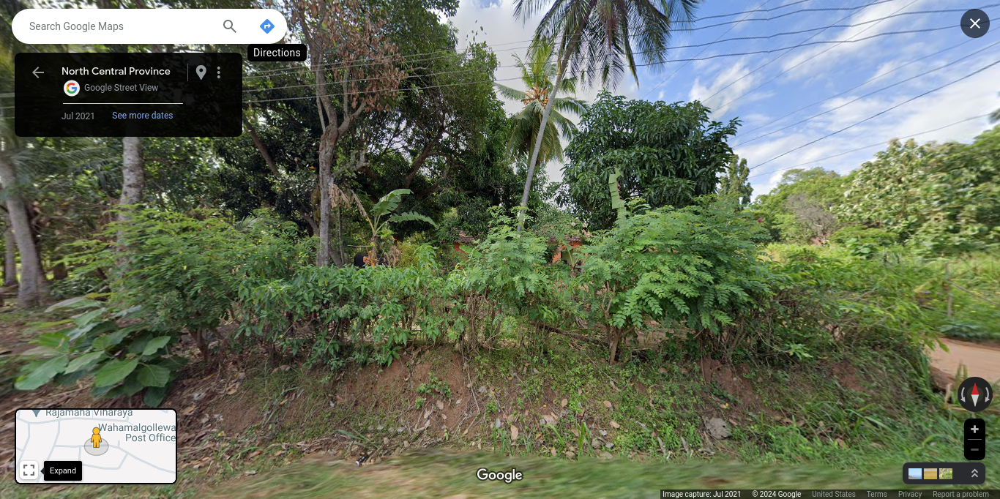

## Valvetty

**Valvetty** Grama Niladhari Division, **Vadamaradchi South-West (Karaveddy)** Divisional Secretariat Division, **Jaffna** District, **Northern** Province

**Udupiddy** Polling Division, **Jaffna** Electoral District

Population: 997 (2012)

(**LK-4121040**/J/355)

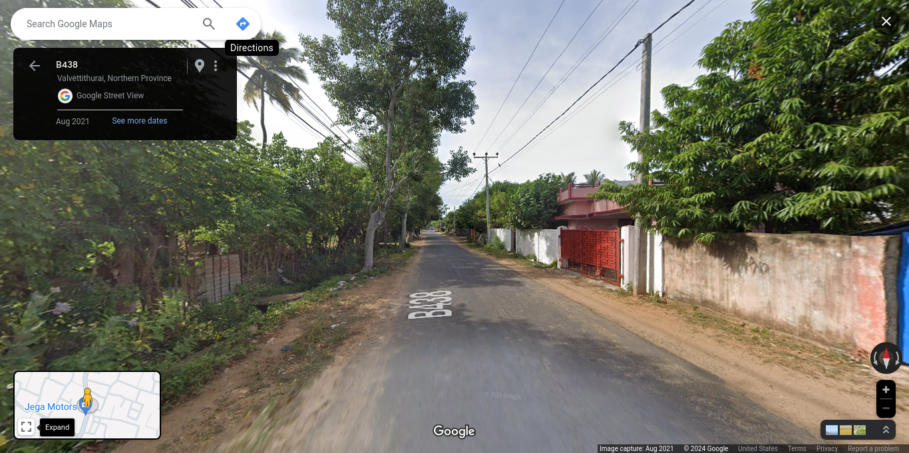

## Ninthavur 20

**Ninthavur 20** Grama Niladhari Division, **Ninthavur** Divisional Secretariat Division, **Ampara** District, **Eastern** Province

**Pothuvil** Polling Division, **Digamadulla** Electoral District

Population: 500 (2012)

(**LK-5230090**/37E)

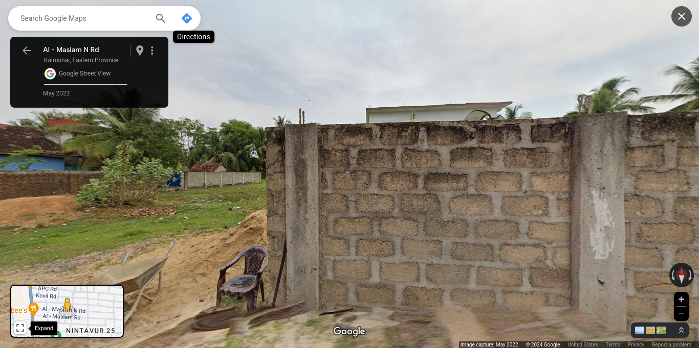

## Vishakawatta

**Vishakawatta** Grama Niladhari Division, **Ja-Ela** Divisional Secretariat Division, **Gampaha** District, **Western** Province

**Ja Ela** Polling Division, **Gampaha** Electoral District

Population: 5,136 (2012)

(**LK-1221050**/206B)

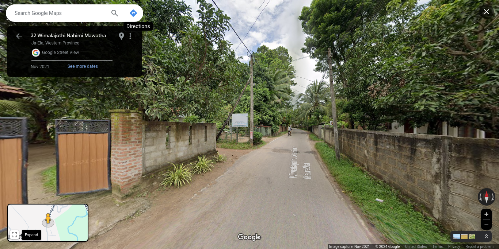

## Eppawela

**Eppawela** Grama Niladhari Division, **Palugaswewa** Divisional Secretariat Division, **Anuradhapura** District, **North Central** Province

**Kekirawa** Polling Division, **Anuradhapura** Electoral District

Population: 821 (2012)

(**LK-7157020**/597)

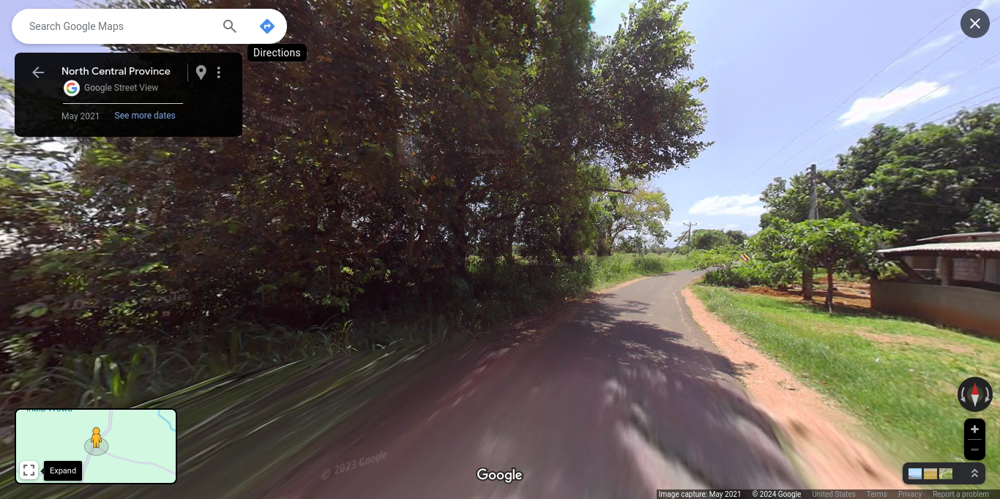

## Kattankudy Division 4 West

**Kattankudy Division 4 West** Grama Niladhari Division, **Kattankudy** Divisional Secretariat Division, **Batticaloa** District, **Eastern** Province

**Batticaloa** Polling Division, **Batticaloa** Electoral District

Population: 1,424 (2012)

(**LK-5124050**/164C)

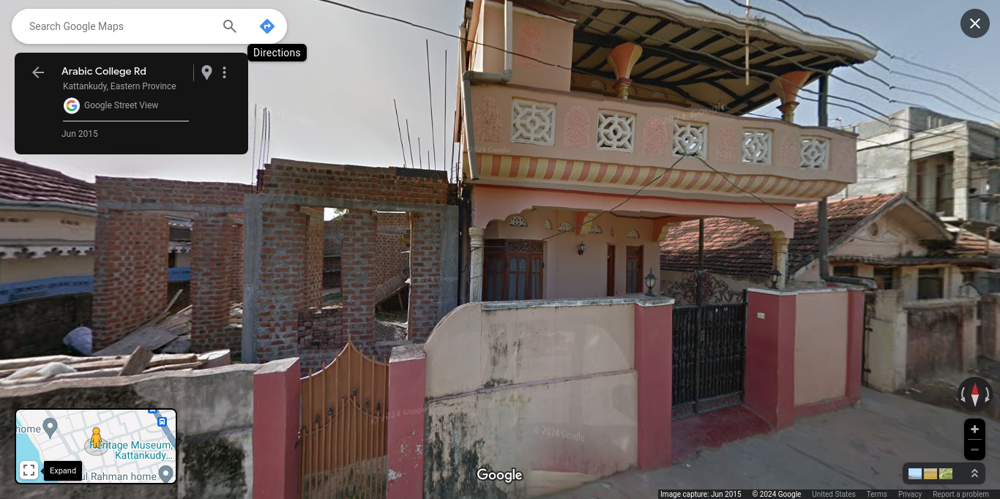

## Suthumalai South

**Suthumalai South** Grama Niladhari Division, **Valikamam South-West (Sandilipay)** Divisional Secretariat Division, **Jaffna** District, **Northern** Province

**Manipay** Polling Division, **Jaffna** Electoral District

Population: 2,067 (2012)

(**LK-4109010**/J/130)

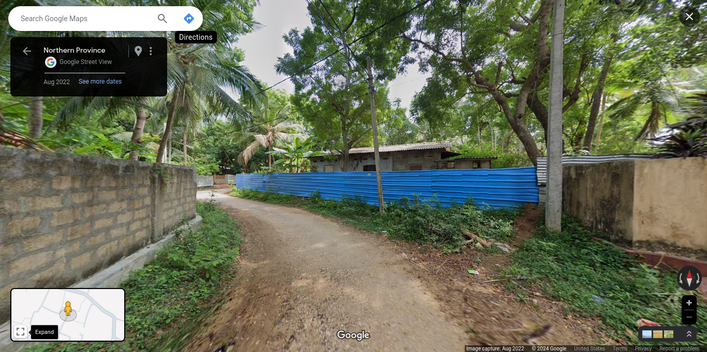

## Munneshwarama

**Munneshwarama** Grama Niladhari Division, **Chilaw** Divisional Secretariat Division, **Puttalam** District, **North Western** Province

**Chilaw** Polling Division, **Puttalam** Electoral District

Population: 1,130 (2012)

(**LK-6233105**/568)

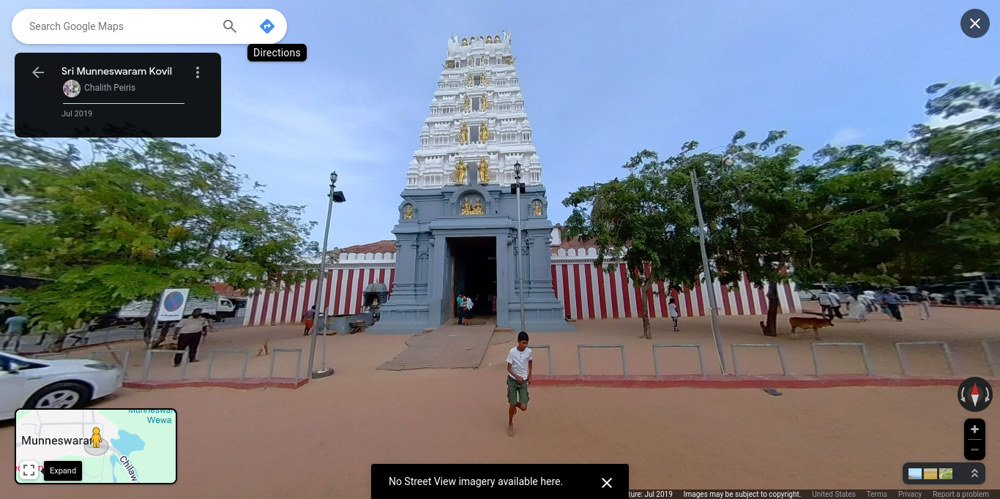

## Kumaraveliar Kiramam

**Kumaraveliar Kiramam** Grama Niladhari Division, **Eravur Pattu** Divisional Secretariat Division, **Batticaloa** District, **Eastern** Province

**Kalkudah** Polling Division, **Batticaloa** Electoral District

Population: 2,079 (2012)

(**LK-5112150**/195B)

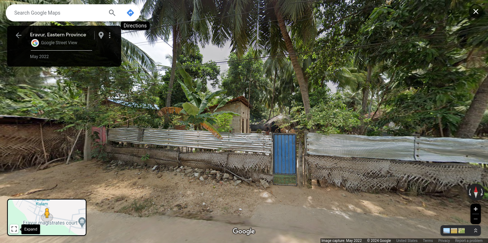

## Moor Street

**Moor Street** Grama Niladhari Division, **Mannar Town** Divisional Secretariat Division, **Mannar** District, **Northern** Province

**Mannar** Polling Division, **Vanni** Electoral District

Population: 2,180 (2012)

(**LK-4203105**/MN/81)

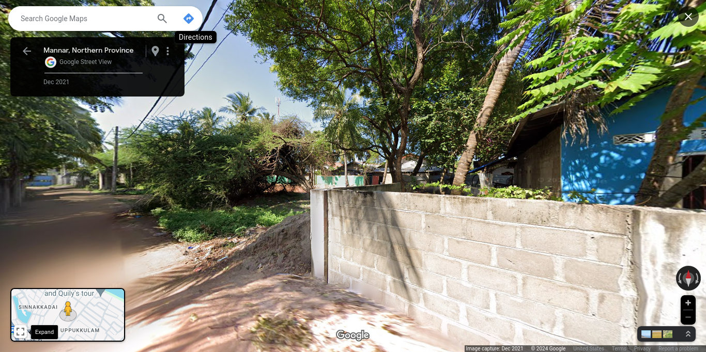

## Mullegama North

**Mullegama North** Grama Niladhari Division, **Pujapitiya** Divisional Secretariat Division, **Kandy** District, **Central** Province

**Harispattuwa** Polling Division, **Kandy** Electoral District

Population: 1,028 (2012)

(**LK-2106310**/554)

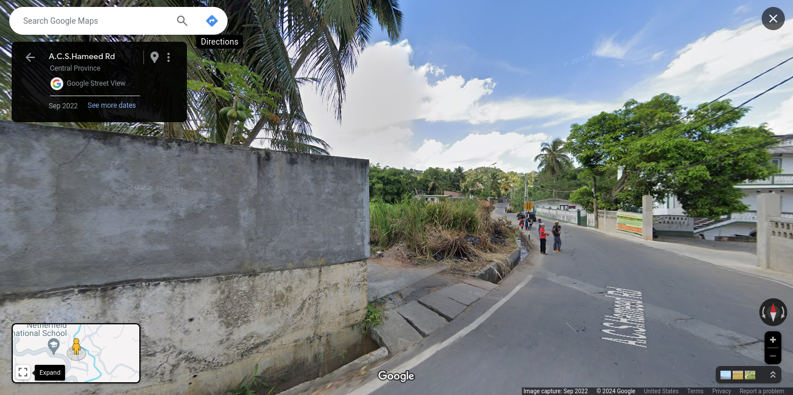

## Madapola

**Madapola** Grama Niladhari Division, **Medadumbara** Divisional Secretariat Division, **Kandy** District, **Central** Province

**Teldeniya** Polling Division, **Kandy** Electoral District

Population: 955 (2012)

(**LK-2124225**/761)

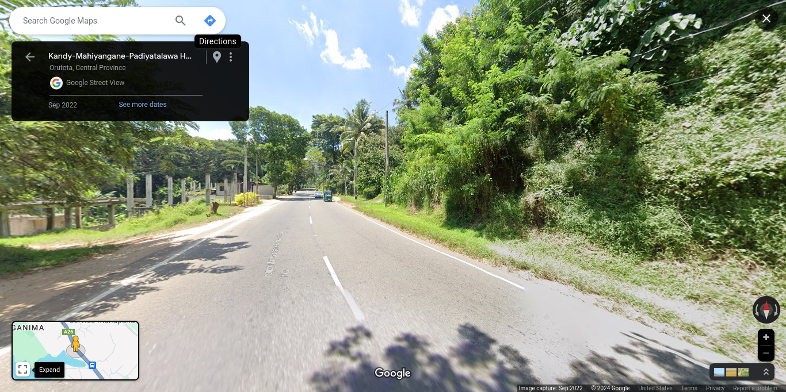

## Asgiriya South

**Asgiriya South** Grama Niladhari Division, **Minuwangoda** Divisional Secretariat Division, **Gampaha** District, **Western** Province

**Minuwangoda** Polling Division, **Gampaha** Electoral District

Population: 1,876 (2012)

(**LK-1215505**/134/2)

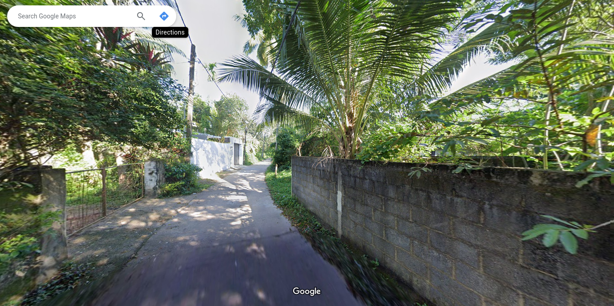

## Kuda Aruggoda East

**Kuda Aruggoda East** Grama Niladhari Division, **Bandaragama** Divisional Secretariat Division, **Kalutara** District, **Western** Province

**Bandaragama** Polling Division, **Kalutara** Electoral District

Population: 3,235 (2012)

(**LK-1306080**/678A)

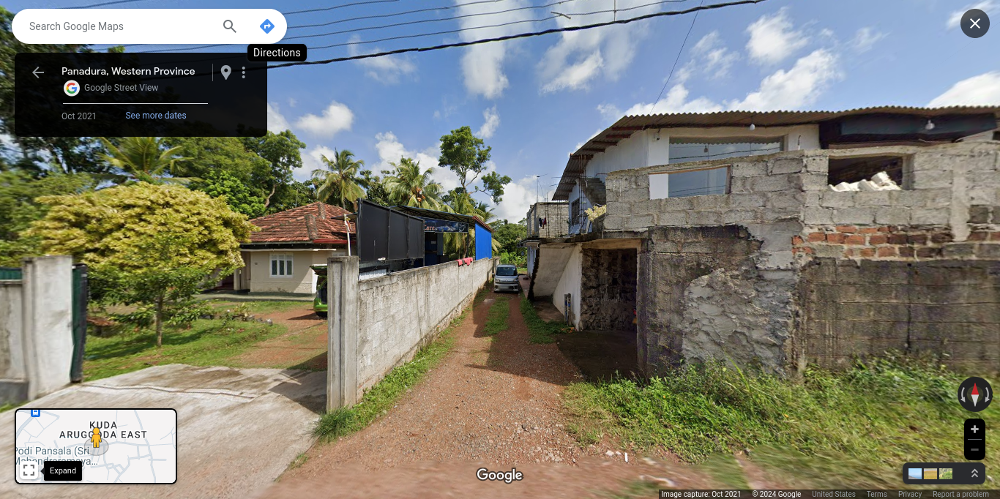

## Nallur Irajathani

**Nallur Irajathani** Grama Niladhari Division, **Nallur** Divisional Secretariat Division, **Jaffna** District, **Northern** Province

**Nallur** Polling Division, **Jaffna** Electoral District

Population: 591 (2012)

(**LK-4133095**/J/107)

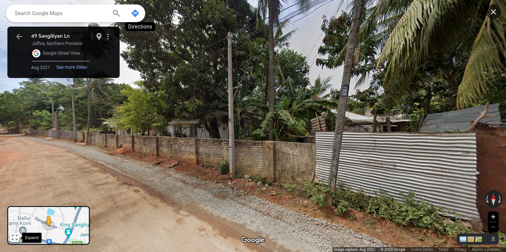

## Pandiruppu 01

**Pandiruppu 01** Grama Niladhari Division, **Kalmunai Tamil Division** Divisional Secretariat Division, **Ampara** District, **Eastern** Province

**Kalmunai** Polling Division, **Digamadulla** Electoral District

Population: 941 (2012)

(**LK-5221030**/KP/66/1)

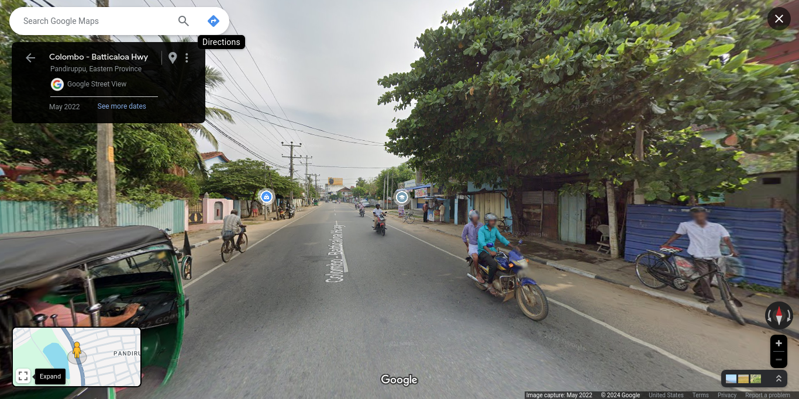

## Ihala Biyanvila North

**Ihala Biyanvila North** Grama Niladhari Division, **Biyagama** Divisional Secretariat Division, **Gampaha** District, **Western** Province

**Biyagama** Polling Division, **Gampaha** Electoral District

Population: 3,407 (2012)

(**LK-1239010**/269)

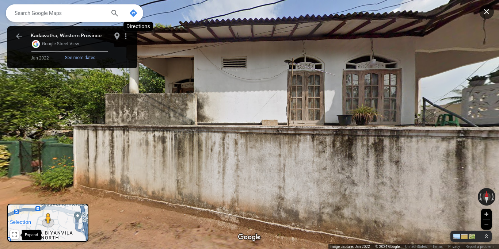

## Dummalasooriya

**Dummalasooriya** Grama Niladhari Division, **Udubaddawa** Divisional Secretariat Division, **Kurunegala** District, **North Western** Province

**Bingiriya** Polling Division, **Kurunegala** Electoral District

Population: 831 (2012)

(**LK-6175085**/1486)

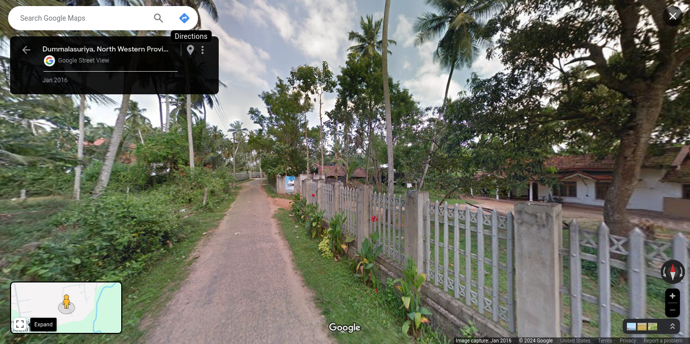

## Kochchikade North

**Kochchikade North** Grama Niladhari Division, **Colombo** Divisional Secretariat Division, **Colombo** District, **Western** Province

**Colombo Central** Polling Division, **Colombo** Electoral District

Population: 9,339 (2012)

(**LK-1103055**/)

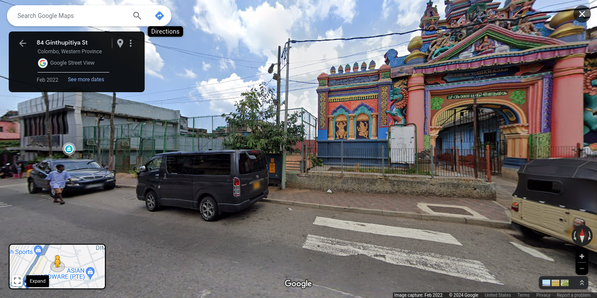

## Pinwatta

**Pinwatta** Grama Niladhari Division, **Panadura** Divisional Secretariat Division, **Kalutara** District, **Western** Province

**Panadura** Polling Division, **Kalutara** Electoral District

Population: 3,409 (2012)

(**LK-1303295**/696)

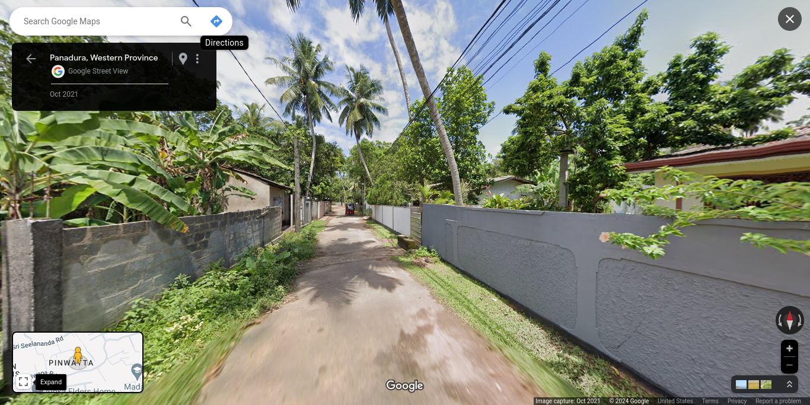

## Bogambara

**Bogambara** Grama Niladhari Division, **Kandy Four Gravets & Gangawata Korale** Divisional Secretariat Division, **Kandy** District, **Central** Province

**Senkadagala** Polling Division, **Kandy** Electoral District

Population: 3,195 (2012)

(**LK-2130145**/264)

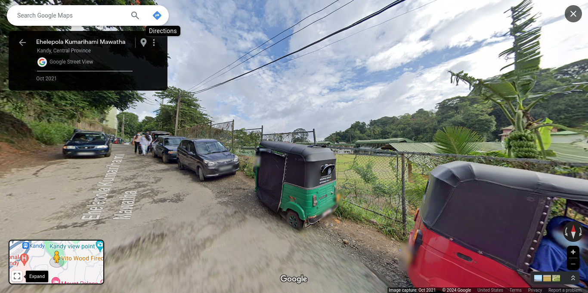

## Kirimetiyawa

**Kirimetiyawa** Grama Niladhari Division, **Nawagattegama** Divisional Secretariat Division, **Puttalam** District, **North Western** Province

**Anamaduwa** Polling Division, **Puttalam** Electoral District

Population: 1,392 (2012)

(**LK-6212020**/644)

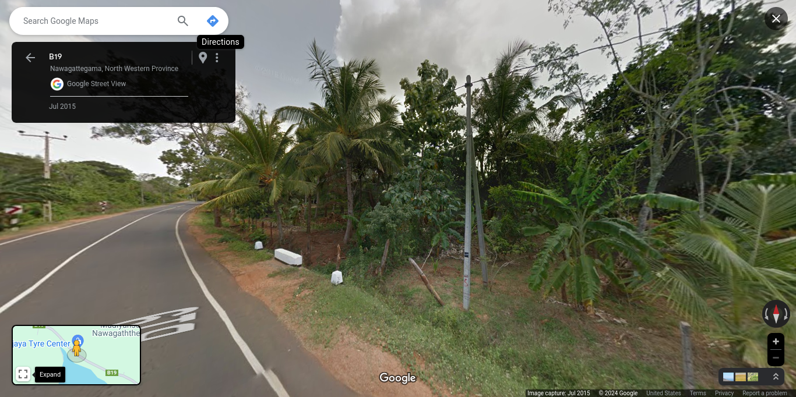

## Vellaveli

**Vellaveli** Grama Niladhari Division, **Porativu Pattu** Divisional Secretariat Division, **Batticaloa** District, **Eastern** Province

**Paddiruppu** Polling Division, **Batticaloa** Electoral District

Population: 953 (2012)

(**LK-5133100**/99)

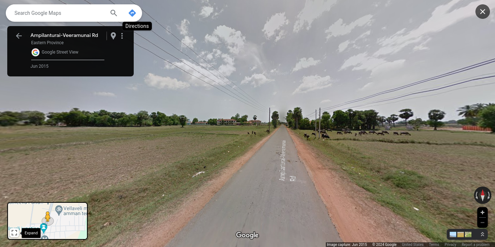

## Indigolla

**Indigolla** Grama Niladhari Division, **Gampaha** Divisional Secretariat Division, **Gampaha** District, **Western** Province

**Gampaha** Polling Division, **Gampaha** Electoral District

Population: 1,675 (2012)

(**LK-1224125**/225C)

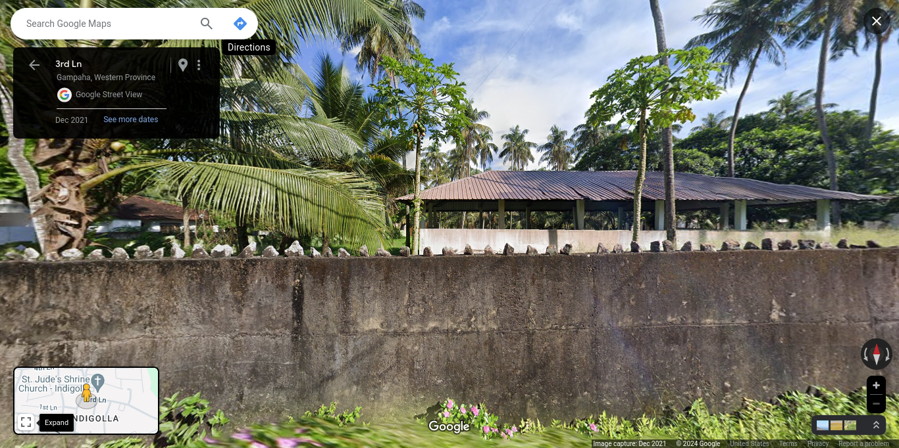

## Medakumbura North

**Medakumbura North** Grama Niladhari Division, **Kothmale** Divisional Secretariat Division, **Nuwara Eliya** District, **Central** Province

**Kothmale** Polling Division, **Nuwara-Eliya** Electoral District

Population: 2,852 (2012)

(**LK-2303480**/468K)

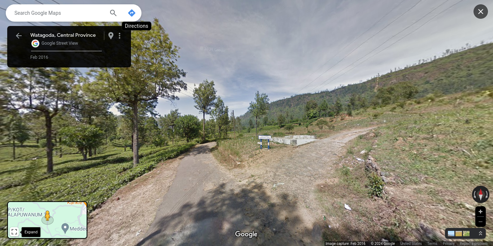

## Thanmmennagama

**Thanmmennagama** Grama Niladhari Division, **Anamaduwa** Divisional Secretariat Division, **Puttalam** District, **North Western** Province

**Anamaduwa** Polling Division, **Puttalam** Electoral District

Population: 1,825 (2012)

(**LK-6224115**/656B)

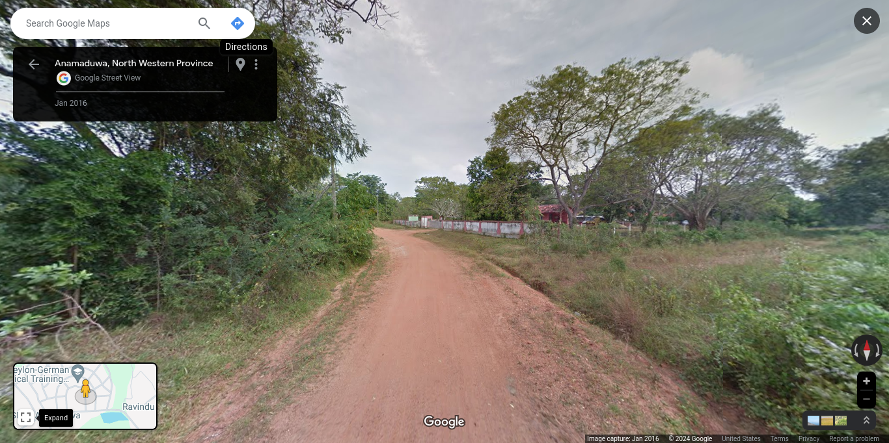

## Perimiyankulama

**Perimiyankulama** Grama Niladhari Division, **Nuwaragam Palatha Central** Divisional Secretariat Division, **Anuradhapura** District, **North Central** Province

**Anuradhapura West** Polling Division, **Anuradhapura** Electoral District

Population: 1,299 (2012)

(**LK-7115090**/300)

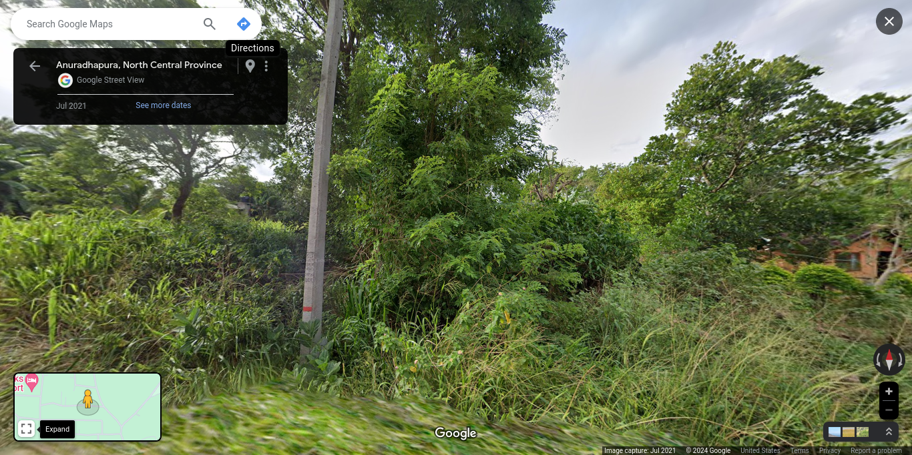

## Pandiyankulam

**Pandiyankulam** Grama Niladhari Division, **Manthai East** Divisional Secretariat Division, **Mullaitivu** District, **Northern** Province

**Mullaitivu** Polling Division, **Vanni** Electoral District

Population: 731 (2012)

(**LK-4406040**/MU/009)

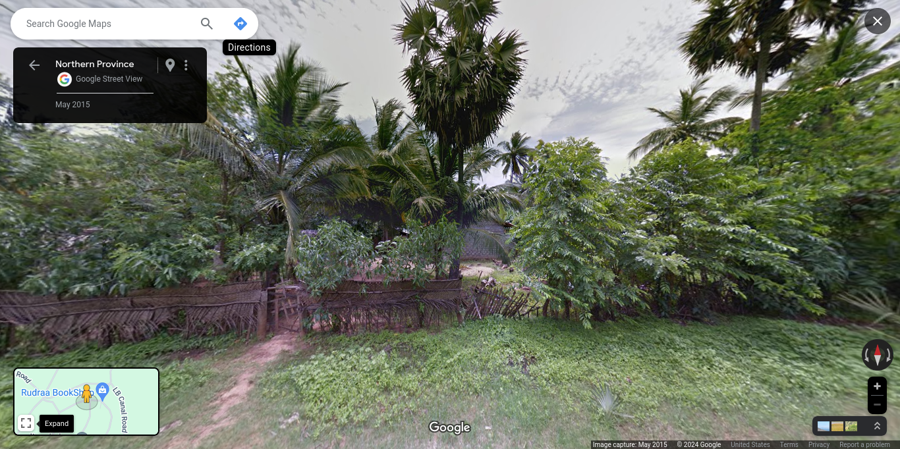

## Kadugoda South

**Kadugoda South** Grama Niladhari Division, **Seethawaka** Divisional Secretariat Division, **Colombo** District, **Western** Province

**Avissawella** Polling Division, **Colombo** Electoral District

Population: 1,732 (2012)

(**LK-1115225**/430A)

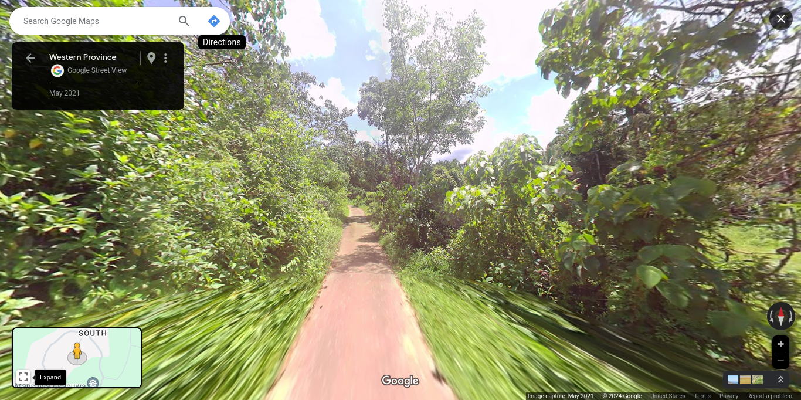

## Rawanaella

**Rawanaella** Grama Niladhari Division, **Ella** Divisional Secretariat Division, **Badulla** District, **Uva** Province

**Bandarawela** Polling Division, **Badulla** Electoral District

Population: 509 (2012)

(**LK-8136130**/69F)

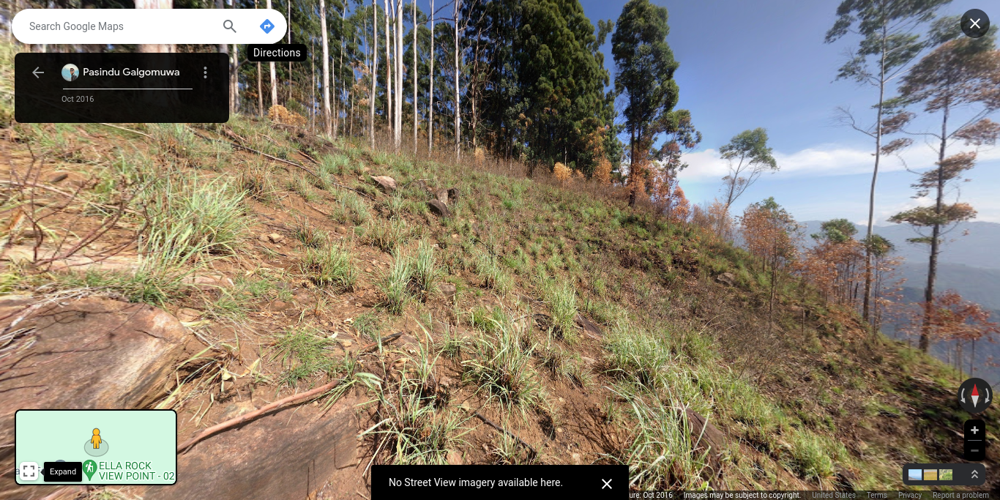

## Thethathivu North

**Thethathivu North** Grama Niladhari Division, **Manmunai South & Eruvil pattu** Divisional Secretariat Division, **Batticaloa** District, **Eastern** Province

**Paddiruppu** Polling Division, **Batticaloa** Electoral District

Population: 1,169 (2012)

(**LK-5136030**/122)

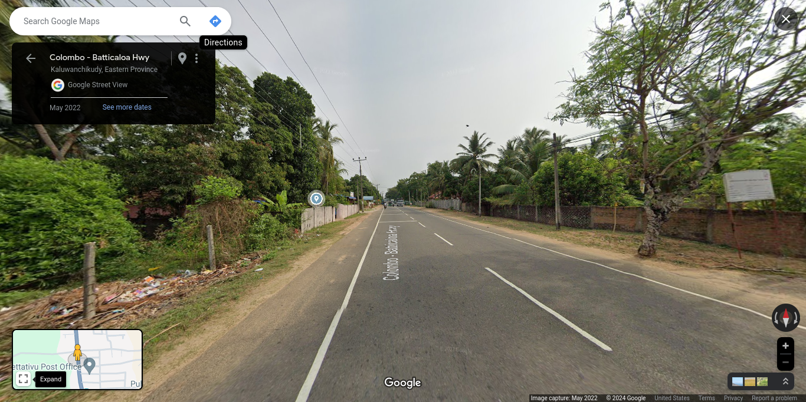

## Yakmaditta

**Yakmaditta** Grama Niladhari Division, **Kolonna** Divisional Secretariat Division, **Ratnapura** District, **Sabaragamuwa** Province

**Kolonna** Polling Division, **Ratnapura** Electoral District

Population: 785 (2012)

(**LK-9151015**/204A)

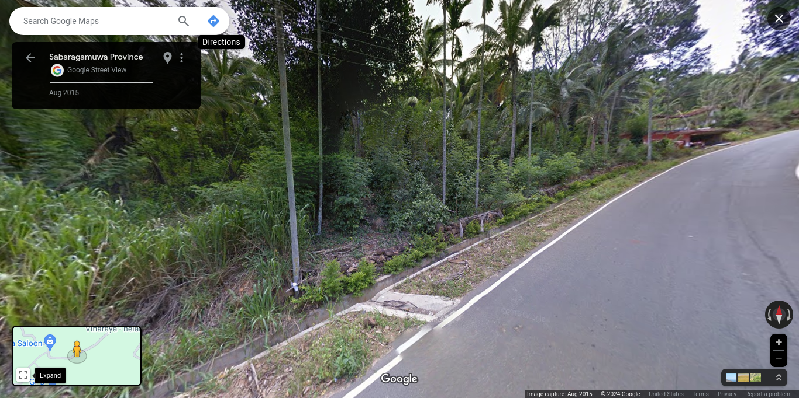

## Pelawatta

**Pelawatta** Grama Niladhari Division, **Bope-Poddala** Divisional Secretariat Division, **Galle** District, **Southern** Province

**Akmeemana** Polling Division, **Galle** Electoral District

Population: 1,370 (2012)

(**LK-3142160**/123B)

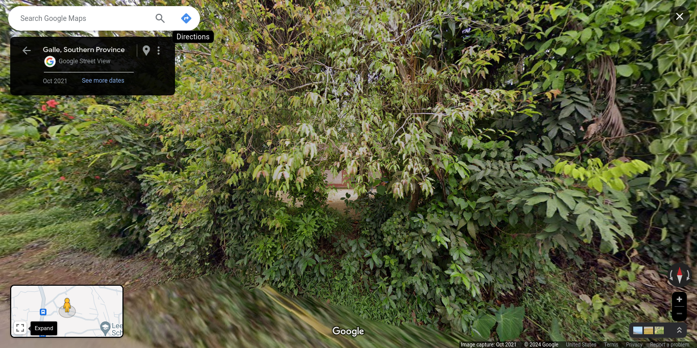

## Hurimaluwa

**Hurimaluwa** Grama Niladhari Division, **Rambukkana** Divisional Secretariat Division, **Kegalle** District, **Sabaragamuwa** Province

**Rambukkana** Polling Division, **Kegalle** Electoral District

Population: 2,678 (2012)

(**LK-9203205**/08B)

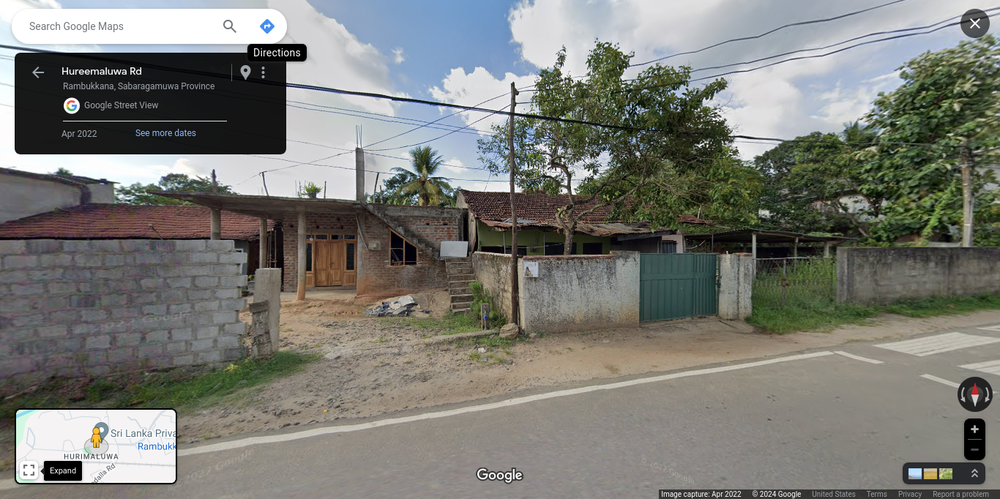

## Hatton East

**Hatton East** Grama Niladhari Division, **Ambagamuwa** Divisional Secretariat Division, **Nuwara Eliya** District, **Central** Province

**Nuwara Eliya Maskeliya** Polling Division, **Nuwara-Eliya** Electoral District

Population: 4,941 (2012)

(**LK-2315190**/319E)

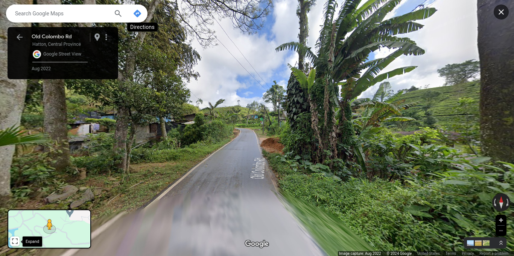

## Pattalagedara East

**Pattalagedara East** Grama Niladhari Division, **Attanagalla** Divisional Secretariat Division, **Gampaha** District, **Western** Province

**Attanagalla** Polling Division, **Gampaha** Electoral District

Population: 1,393 (2012)

(**LK-1227115**/328/B)

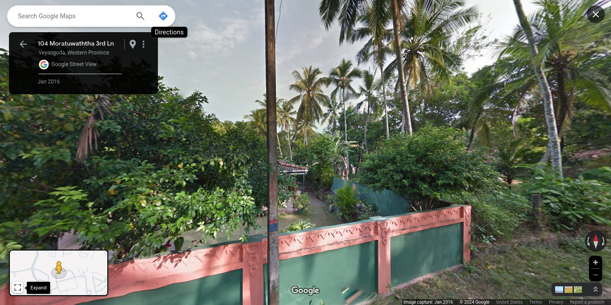

## Wickramasinghapura

**Wickramasinghapura** Grama Niladhari Division, **Kaduwela** Divisional Secretariat Division, **Colombo** District, **Western** Province

**Kaduwela** Polling Division, **Colombo** Electoral District

Population: 3,136 (2012)

(**LK-1109270**/479C)

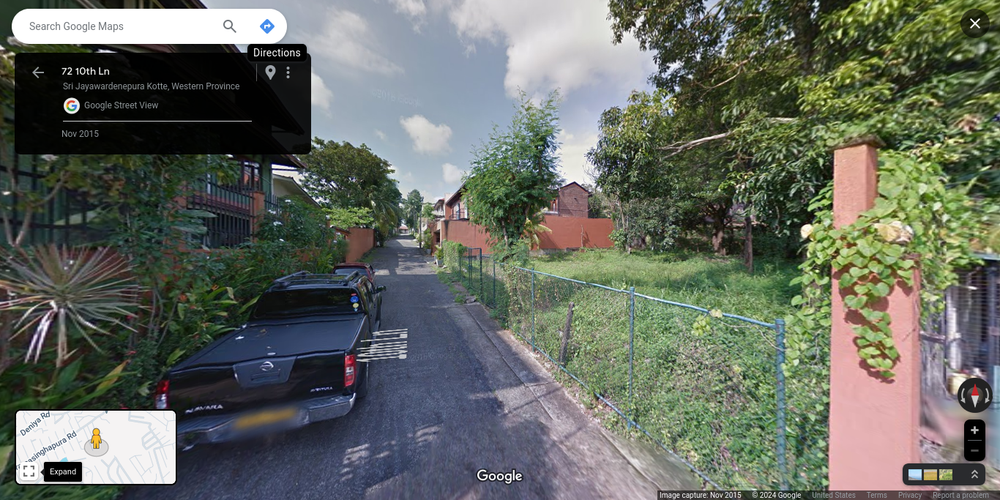

## Navatkudah

**Navatkudah** Grama Niladhari Division, **Manmunai North** Divisional Secretariat Division, **Batticaloa** District, **Eastern** Province

**Batticaloa** Polling Division, **Batticaloa** Electoral District

Population: 1,270 (2012)

(**LK-5118220**/168B)

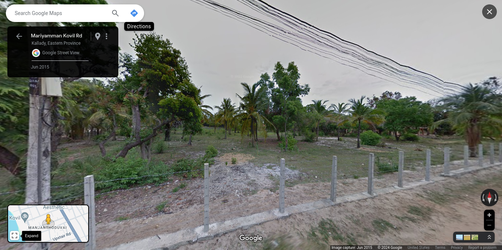

## Thammennagama

**Thammennagama** Grama Niladhari Division, **Thambuttegama** Divisional Secretariat Division, **Anuradhapura** District, **North Central** Province

**Kalawewa** Polling Division, **Anuradhapura** Electoral District

Population: 3,304 (2012)

(**LK-7145065**/424)

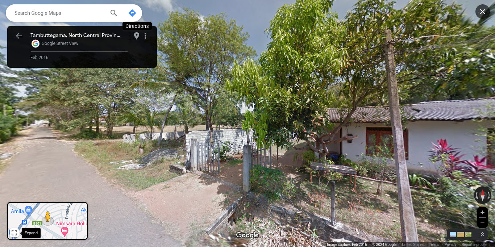

## Hiripitiya Central

**Hiripitiya Central** Grama Niladhari Division, **Attanagalla** Divisional Secretariat Division, **Gampaha** District, **Western** Province

**Attanagalla** Polling Division, **Gampaha** Electoral District

Population: 551 (2012)

(**LK-1227025**/329C)

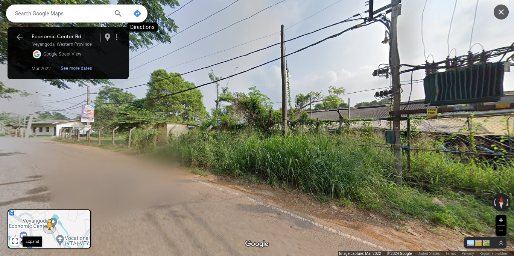

## Kattankudy Division 5

**Kattankudy Division 5** Grama Niladhari Division, **Kattankudy** Divisional Secretariat Division, **Batticaloa** District, **Eastern** Province

**Batticaloa** Polling Division, **Batticaloa** Electoral District

Population: 2,043 (2012)

(**LK-5124085**/164A)

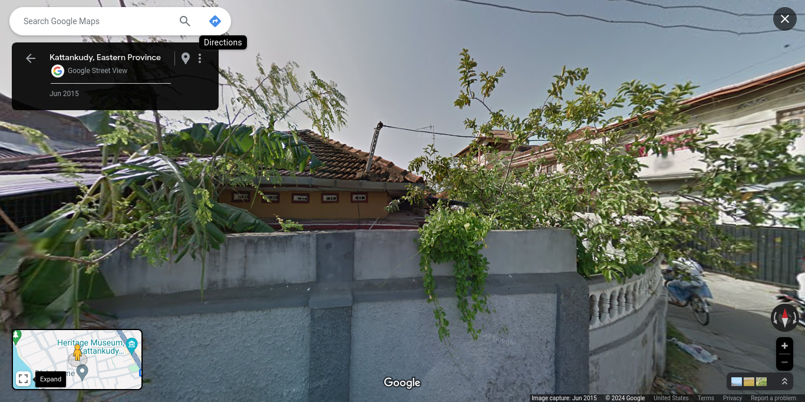

## Kolinjadiya North

**Kolinjadiya North** Grama Niladhari Division, **Wennappuwa** Divisional Secretariat Division, **Puttalam** District, **North Western** Province

**Wennappuwa** Polling Division, **Puttalam** Electoral District

Population: 1,036 (2012)

(**LK-6245010**/493B)

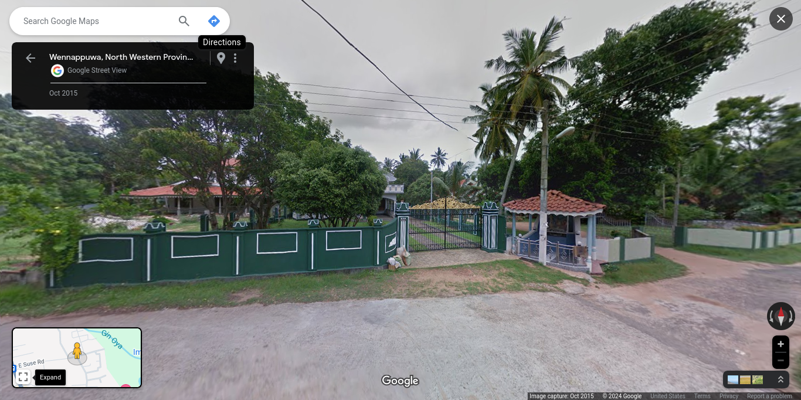

## Kattimahana

**Kattimahana** Grama Niladhari Division, **Udubaddawa** Divisional Secretariat Division, **Kurunegala** District, **North Western** Province

**Bingiriya** Polling Division, **Kurunegala** Electoral District

Population: 1,080 (2012)

(**LK-6175095**/1510)

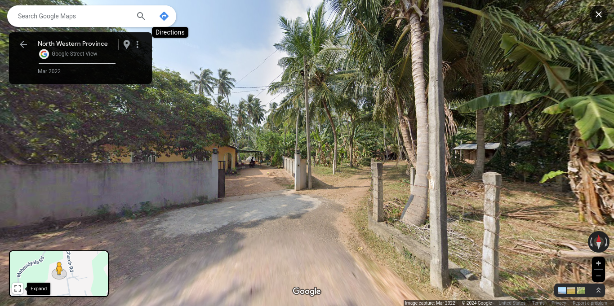

## Bogahakotuwa

**Bogahakotuwa** Grama Niladhari Division, **Matale** Divisional Secretariat Division, **Matale** District, **Central** Province

**Matale** Polling Division, **Matale** Electoral District

Population: 1,776 (2012)

(**LK-2218165**/E352E)

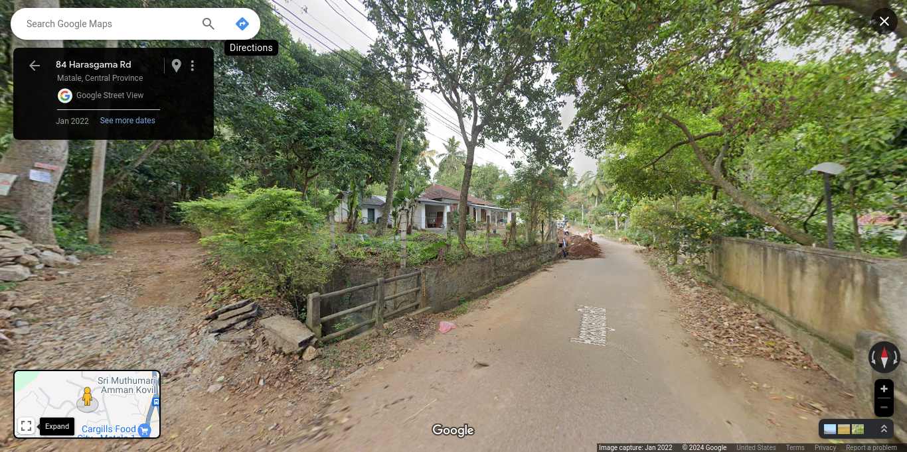

## Kekunawala

**Kekunawala** Grama Niladhari Division, **Udubaddawa** Divisional Secretariat Division, **Kurunegala** District, **North Western** Province

**Bingiriya** Polling Division, **Kurunegala** Electoral District

Population: 1,915 (2012)

(**LK-6175035**/1493)

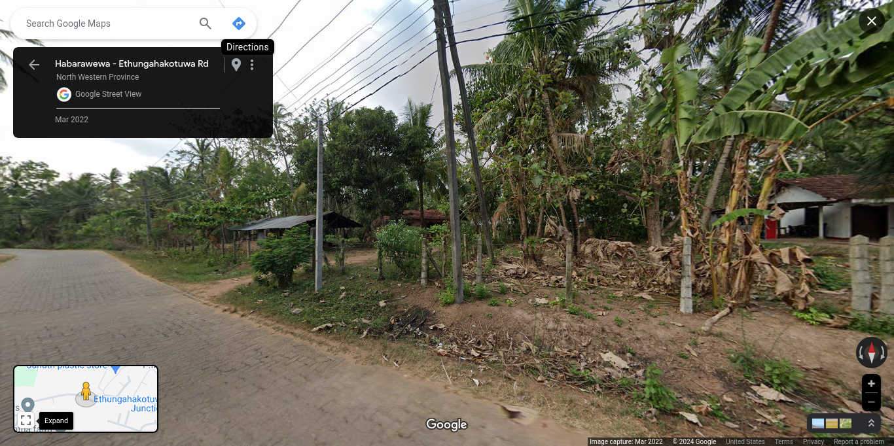

## Kotugoda

**Kotugoda** Grama Niladhari Division, **Katana** Divisional Secretariat Division, **Gampaha** District, **Western** Province

**Katana** Polling Division, **Gampaha** Electoral District

Population: 2,691 (2012)

(**LK-1206370**/204)

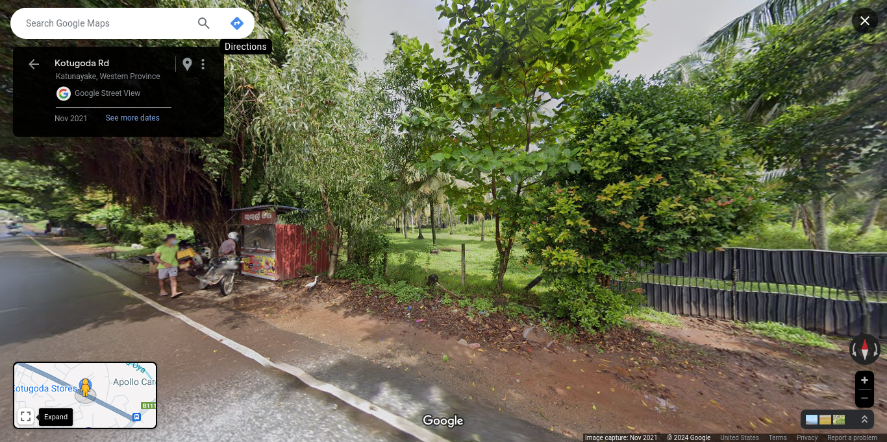

## Ampitiyawatta

**Ampitiyawatta** Grama Niladhari Division, **Balangoda** Divisional Secretariat Division, **Ratnapura** District, **Sabaragamuwa** Province

**Balangoda** Polling Division, **Ratnapura** Electoral District

Population: 1,490 (2012)

(**LK-9118175**/254B)

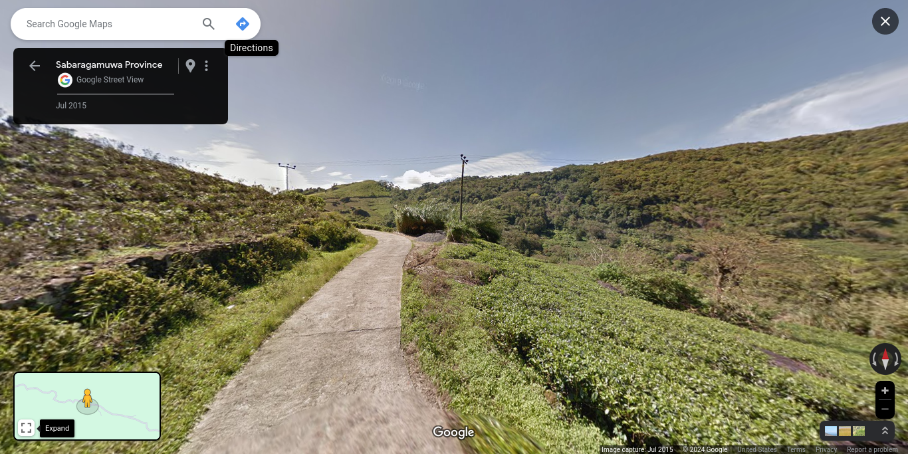

## Peralanda

**Peralanda** Grama Niladhari Division, **Ja-Ela** Divisional Secretariat Division, **Gampaha** District, **Western** Province

**Ja Ela** Polling Division, **Gampaha** Electoral District

Population: 5,799 (2012)

(**LK-1221240**/181D)

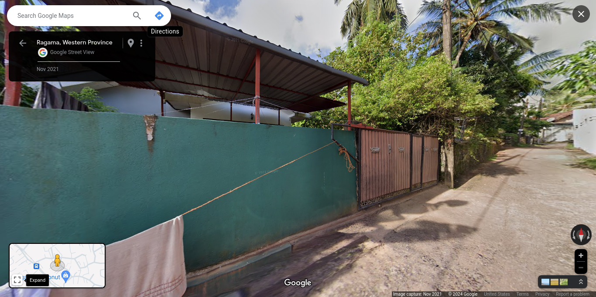

## Dewanampiyathissa Pura

**Dewanampiyathissa Pura** Grama Niladhari Division, **Nuwaragam Palatha Central** Divisional Secretariat Division, **Anuradhapura** District, **North Central** Province

**Anuradhapura West** Polling Division, **Anuradhapura** Electoral District

Population: 6,063 (2012)

(**LK-7115125**/295A)

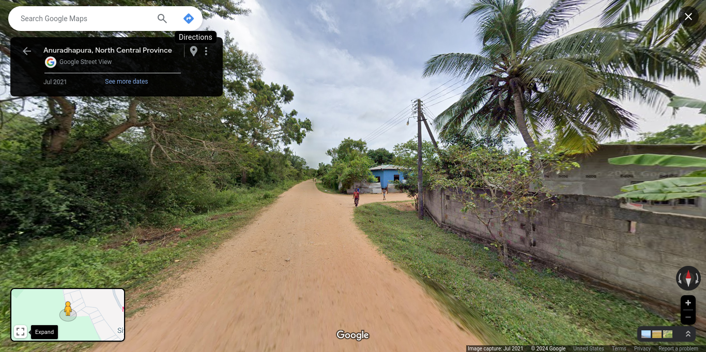

## Mattegoda Central 'B'

**Mattegoda Central 'B'** Grama Niladhari Division, **Homagama** Divisional Secretariat Division, **Colombo** District, **Western** Province

**Homagama** Polling Division, **Colombo** Electoral District

Population: 2,968 (2012)

(**LK-1112310**/587B)

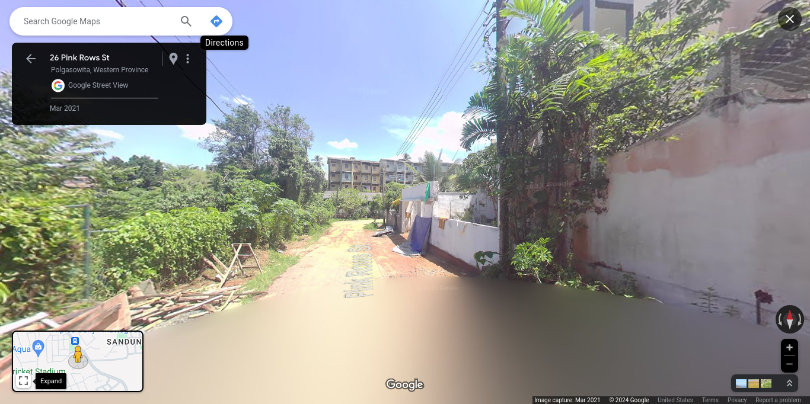

## Nikagolla

**Nikagolla** Grama Niladhari Division, **Yatawatta** Divisional Secretariat Division, **Matale** District, **Central** Province

**Matale** Polling Division, **Matale** Electoral District

Population: 525 (2012)

(**LK-2215080**/E333)

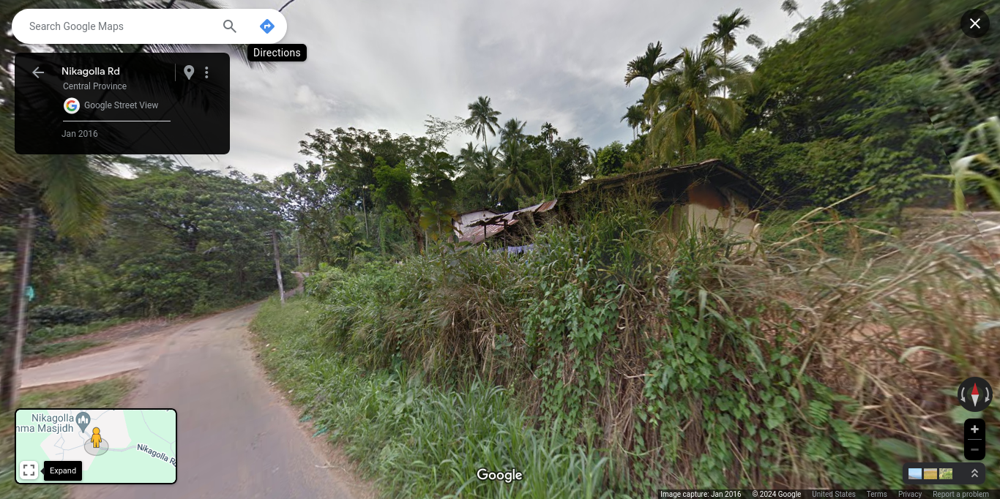

## Jaffna Town West

**Jaffna Town West** Grama Niladhari Division, **Jaffna** Divisional Secretariat Division, **Jaffna** District, **Northern** Province

**Jaffna** Polling Division, **Jaffna** Electoral District

Population: 2,142 (2012)

(**LK-4136065**/J/73)

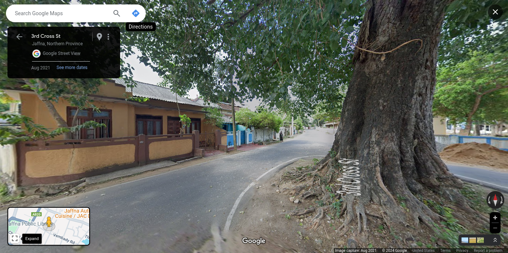

## Polikandy West

**Polikandy West** Grama Niladhari Division, **Vadamaradchi North (Point Pedro)** Divisional Secretariat Division, **Jaffna** District, **Northern** Province

**Udupiddy** Polling Division, **Jaffna** Electoral District

Population: 1,889 (2012)

(**LK-4127055**/J/393)

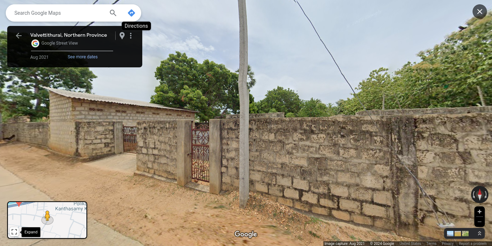

## Rajagiriya

**Rajagiriya** Grama Niladhari Division, **Udunuwara** Divisional Secretariat Division, **Kandy** District, **Central** Province

**Udunuwara** Polling Division, **Kandy** Electoral District

Population: 801 (2012)

(**LK-2139120**/8)

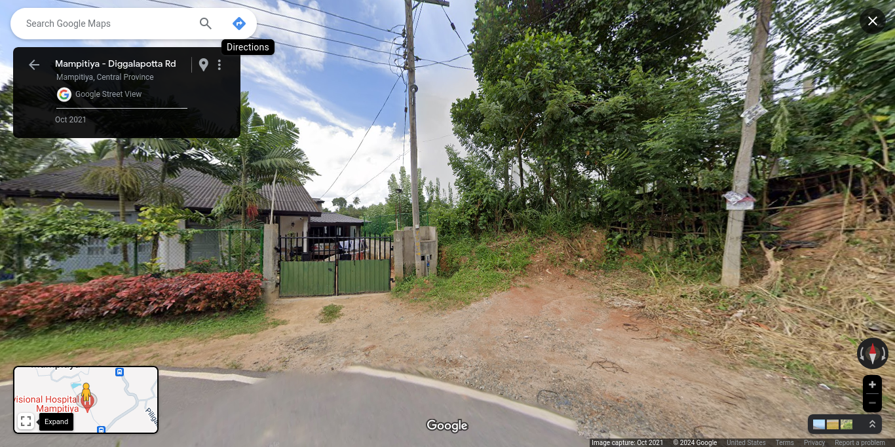

## Galgamuwa Town

**Galgamuwa Town** Grama Niladhari Division, **Galgamuwa** Divisional Secretariat Division, **Kurunegala** District, **North Western** Province

**Galgamuwa** Polling Division, **Kurunegala** Electoral District

Population: 1,227 (2012)

(**LK-6106200**/57)

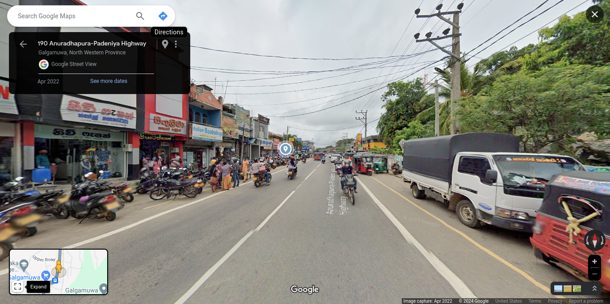

## Rajathalawa

**Rajathalawa** Grama Niladhari Division, **Doluwa** Divisional Secretariat Division, **Kandy** District, **Central** Province

**Gampola** Polling Division, **Kandy** Electoral District

Population: 996 (2012)

(**LK-2142155**/1182)

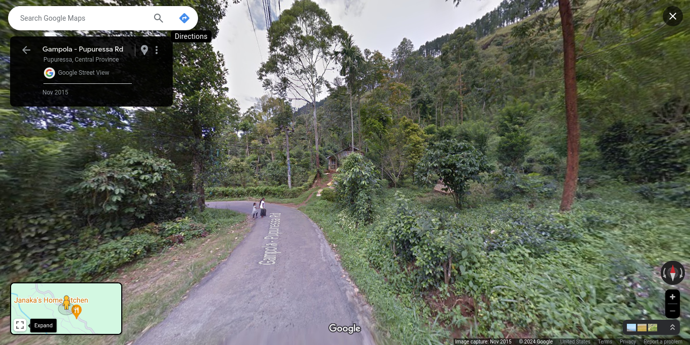

## Vantharumoolai East

**Vantharumoolai East** Grama Niladhari Division, **Eravur Pattu** Divisional Secretariat Division, **Batticaloa** District, **Eastern** Province

**Kalkudah** Polling Division, **Batticaloa** Electoral District

Population: 3,950 (2012)

(**LK-5112065**/197)

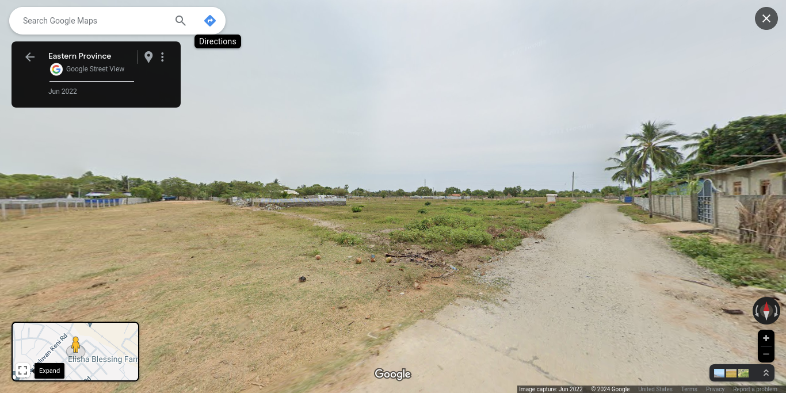

## Wewathenna

**Wewathenna** Grama Niladhari Division, **Doluwa** Divisional Secretariat Division, **Kandy** District, **Central** Province

**Gampola** Polling Division, **Kandy** Electoral District

Population: 886 (2012)

(**LK-2142095**/1152)

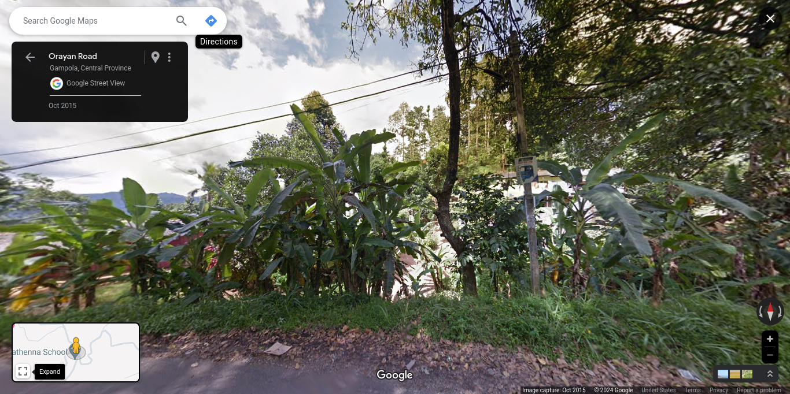

## Sammanthurai 07

**Sammanthurai 07** Grama Niladhari Division, **Samanthurai** Divisional Secretariat Division, **Ampara** District, **Eastern** Province

**Samanthurai** Polling Division, **Digamadulla** Electoral District

Population: 957 (2012)

(**LK-5218080**/80A)

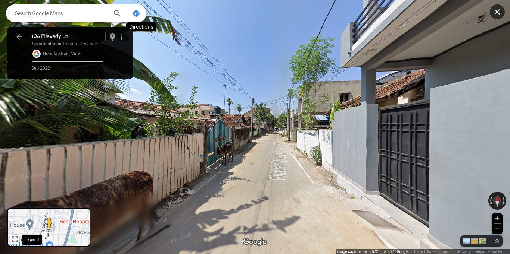

## Godapola East

**Godapola East** Grama Niladhari Division, **Udunuwara** Divisional Secretariat Division, **Kandy** District, **Central** Province

**Udunuwara** Polling Division, **Kandy** Electoral District

Population: 856 (2012)

(**LK-2139295**/27)

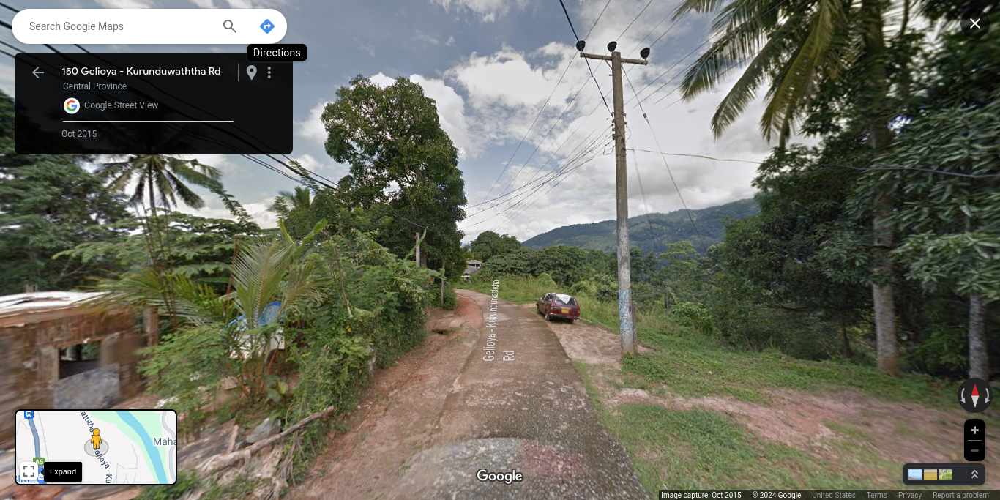

## Kahahena

**Kahahena** Grama Niladhari Division, **Seethawaka** Divisional Secretariat Division, **Colombo** District, **Western** Province

**Avissawella** Polling Division, **Colombo** Electoral District

Population: 1,627 (2012)

(**LK-1115255**/441A)

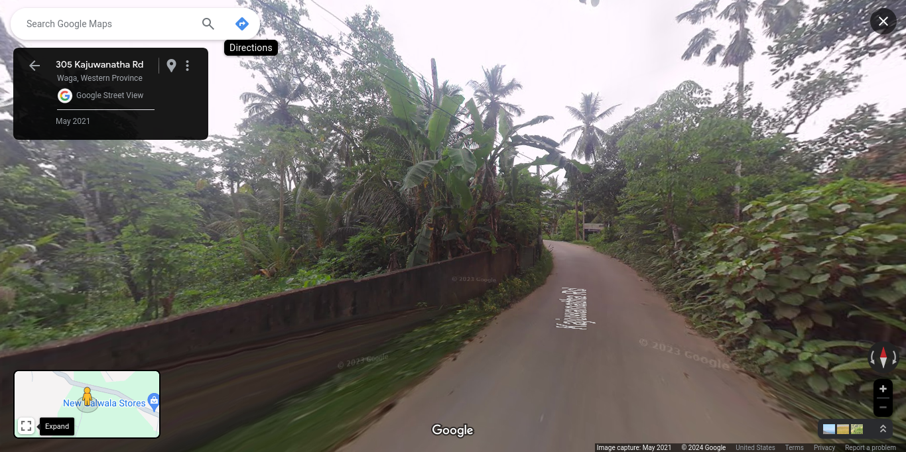

## Uduvil South West

**Uduvil South West** Grama Niladhari Division, **Valikamam South (Uduvil)** Divisional Secretariat Division, **Jaffna** District, **Northern** Province

**Manipay** Polling Division, **Jaffna** Electoral District

Population: 1,479 (2012)

(**LK-4115005**/J/182)

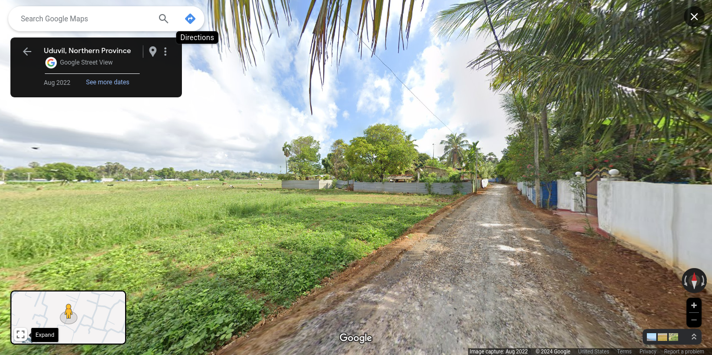

## Rukmale West

**Rukmale West** Grama Niladhari Division, **Maharagama** Divisional Secretariat Division, **Colombo** District, **Western** Province

**Maharagama** Polling Division, **Colombo** Electoral District

Population: 4,471 (2012)

(**LK-1121040**/497)

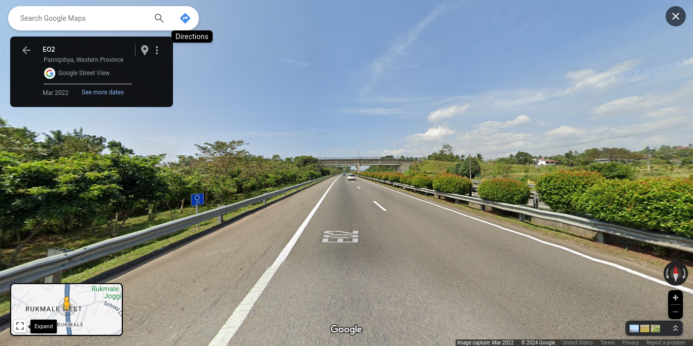

## Valvettithurai North East

**Valvettithurai North East** Grama Niladhari Division, **Vadamaradchi North (Point Pedro)** Divisional Secretariat Division, **Jaffna** District, **Northern** Province

**Udupiddy** Polling Division, **Jaffna** Electoral District

Population: 582 (2012)

(**LK-4127040**/J/390)

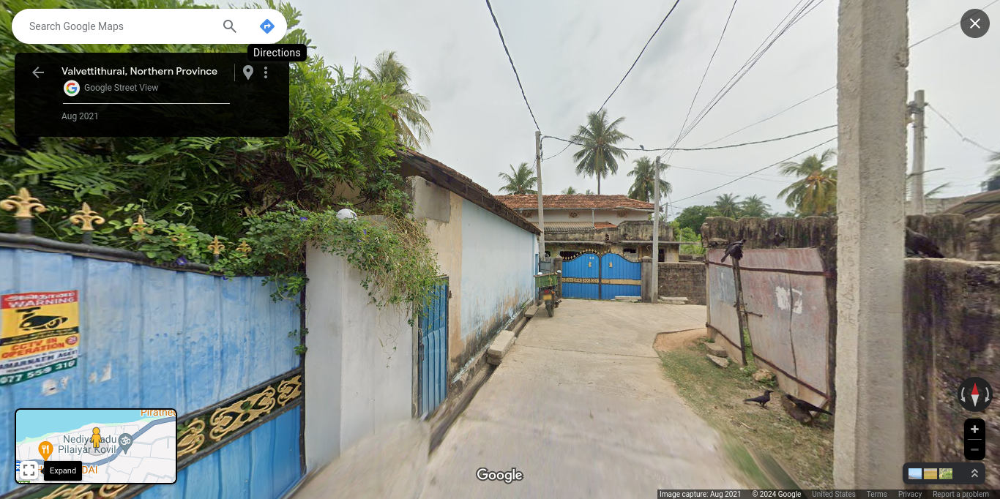

## Karukkuwatawana

**Karukkuwatawana** Grama Niladhari Division, **Madampe** Divisional Secretariat Division, **Puttalam** District, **North Western** Province

**Chilaw** Polling Division, **Puttalam** Electoral District

Population: 879 (2012)

(**LK-6236140**/552)

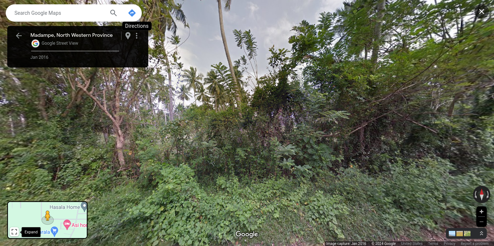

## Mihinthale

**Mihinthale** Grama Niladhari Division, **Mihinthale** Divisional Secretariat Division, **Anuradhapura** District, **North Central** Province

**Mihinthale** Polling Division, **Anuradhapura** Electoral District

Population: 4,263 (2012)

(**LK-7130060**/577)

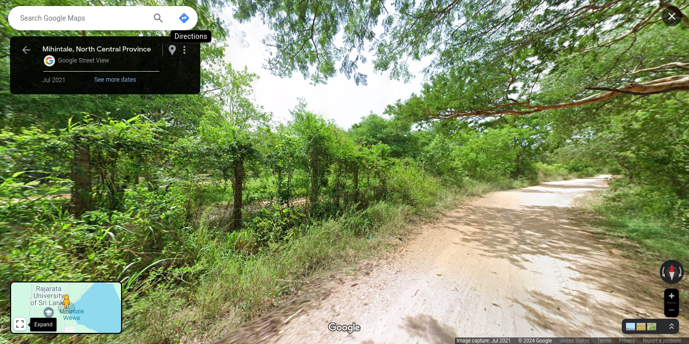

## Kirilipana

**Kirilipana** Grama Niladhari Division, **Pasgoda** Divisional Secretariat Division, **Matara** District, **Southern** Province

**Hakmana** Polling Division, **Matara** Electoral District

Population: 1,702 (2012)

(**LK-3209060**/251)

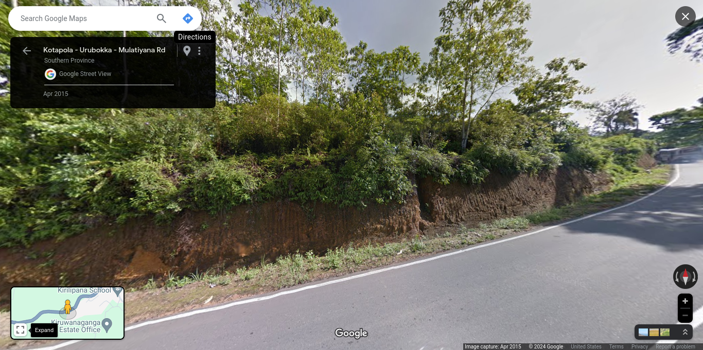

## Wewakele

**Wewakele** Grama Niladhari Division, **Walapane** Divisional Secretariat Division, **Nuwara Eliya** District, **Central** Province

**Walapane** Polling Division, **Nuwara-Eliya** Electoral District

Population: 387 (2012)

(**LK-2309120**/513C)

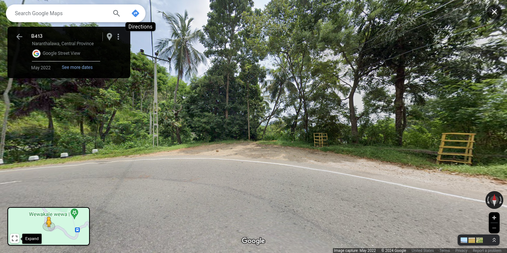

## Thalvila

**Thalvila** Grama Niladhari Division, **Mahawewa** Divisional Secretariat Division, **Puttalam** District, **North Western** Province

**Nattandiya** Polling Division, **Puttalam** Electoral District

Population: 1,535 (2012)

(**LK-6239180**/511)

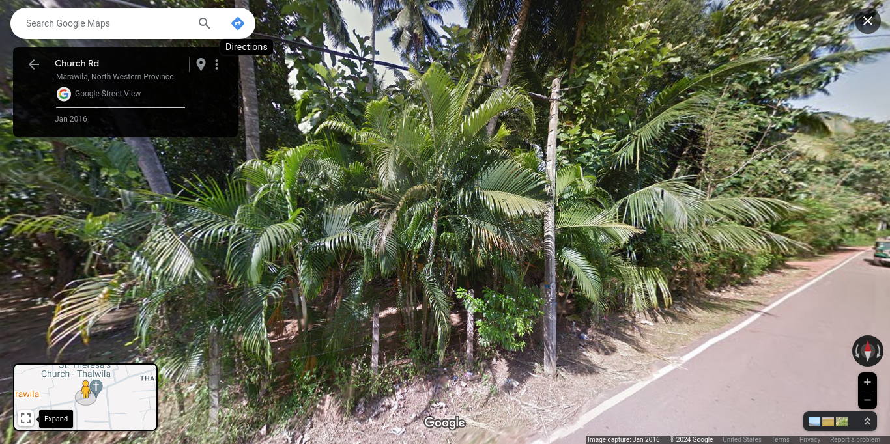

## Poregedara

**Poregedara** Grama Niladhari Division, **Padukka** Divisional Secretariat Division, **Colombo** District, **Western** Province

**Homagama** Polling Division, **Colombo** Electoral District

Population: 1,071 (2012)

(**LK-1118130**/462A)

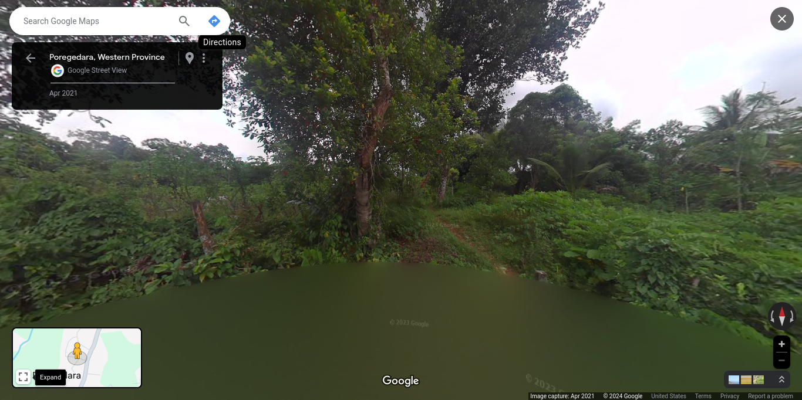

## Hatharaliyadda

**Hatharaliyadda** Grama Niladhari Division, **Hatharaliyadda** Divisional Secretariat Division, **Kandy** District, **Central** Province

**Galagedara** Polling Division, **Kandy** Electoral District

Population: 690 (2012)

(**LK-2134100**/350)

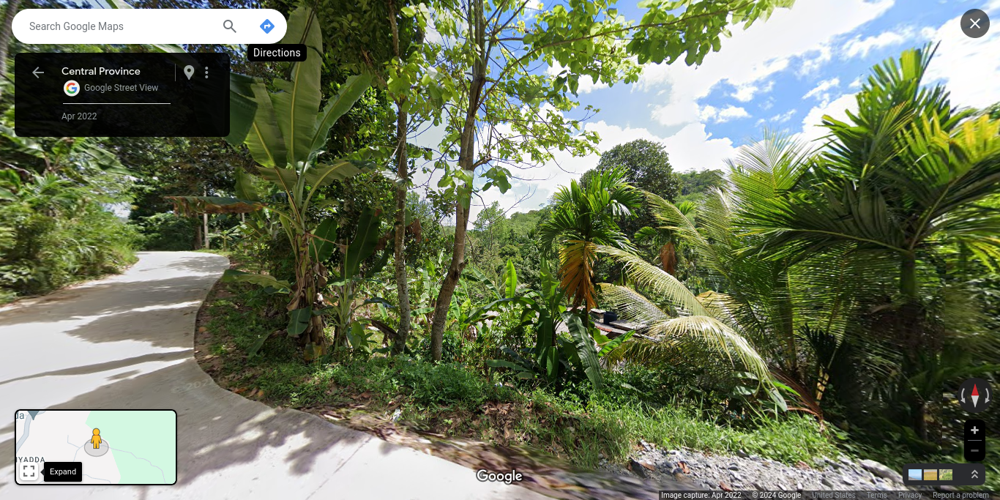

## Uyankele

**Uyankele** Grama Niladhari Division, **Panadura** Divisional Secretariat Division, **Kalutara** District, **Western** Province

**Panadura** Polling Division, **Kalutara** Electoral District

Population: 1,777 (2012)

(**LK-1303245**/686A)

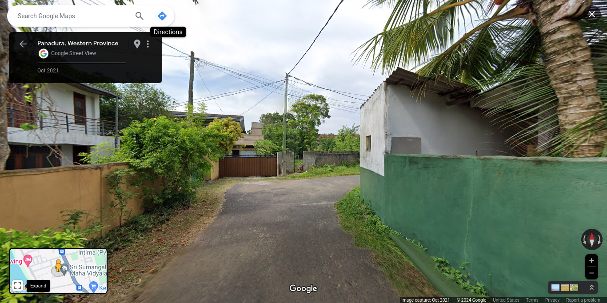

## Kattankudy Division 3 East

**Kattankudy Division 3 East** Grama Niladhari Division, **Kattankudy** Divisional Secretariat Division, **Batticaloa** District, **Eastern** Province

**Batticaloa** Polling Division, **Batticaloa** Electoral District

Population: 1,289 (2012)

(**LK-5124035**/165B)

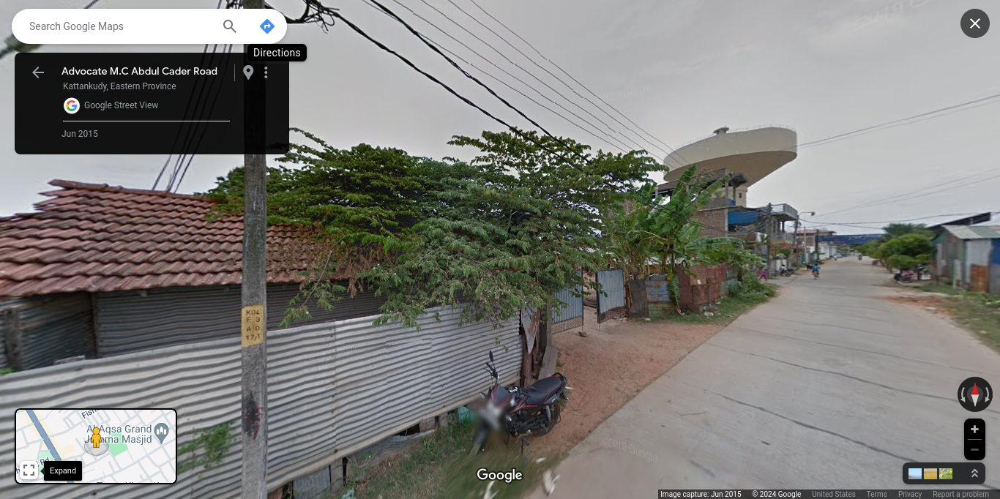

## Bogahamaditta

**Bogahamaditta** Grama Niladhari Division, **Hali-Ela** Divisional Secretariat Division, **Badulla** District, **Uva** Province

**Hali Ela** Polling Division, **Badulla** Electoral District

Population: 2,736 (2012)

(**LK-8124065**/74B)

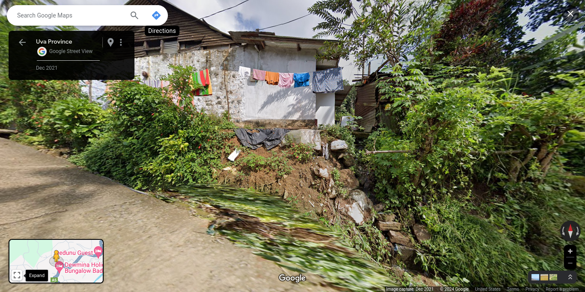

## Liyanagoda

**Liyanagoda** Grama Niladhari Division, **Maharagama** Divisional Secretariat Division, **Colombo** District, **Western** Province

**Maharagama** Polling Division, **Colombo** Electoral District

Population: 4,342 (2012)

(**LK-1121055**/496E)

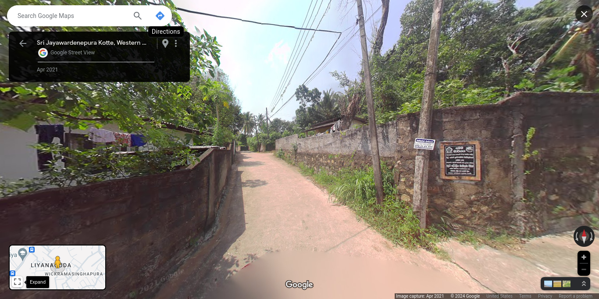

## Hettiyakanda

**Hettiyakanda** Grama Niladhari Division, **Beruwala** Divisional Secretariat Division, **Kalutara** District, **Western** Province

**Beruwala** Polling Division, **Kalutara** Electoral District

Population: 2,753 (2012)

(**LK-1324235**/753A)

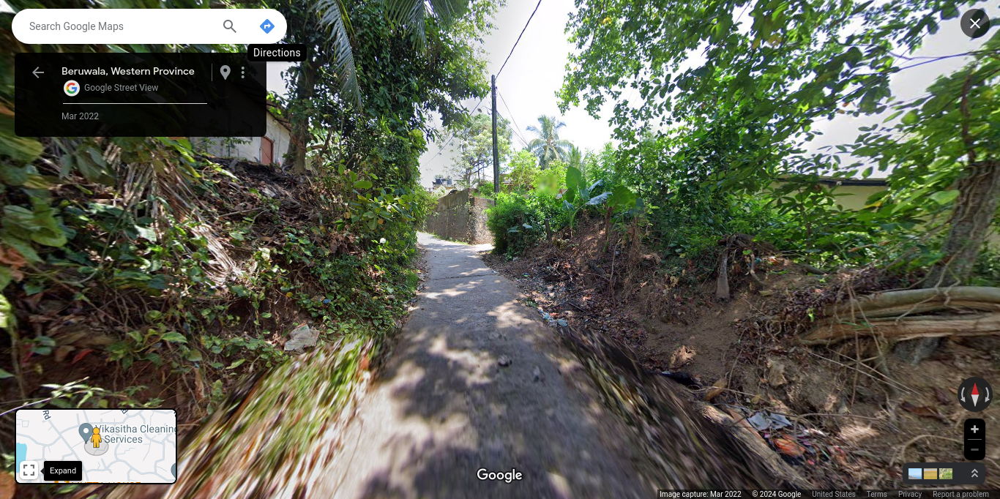

## Madapola

**Madapola** Grama Niladhari Division, **Medadumbara** Divisional Secretariat Division, **Kandy** District, **Central** Province

**Teldeniya** Polling Division, **Kandy** Electoral District

Population: 955 (2012)

(**LK-2124225**/761)

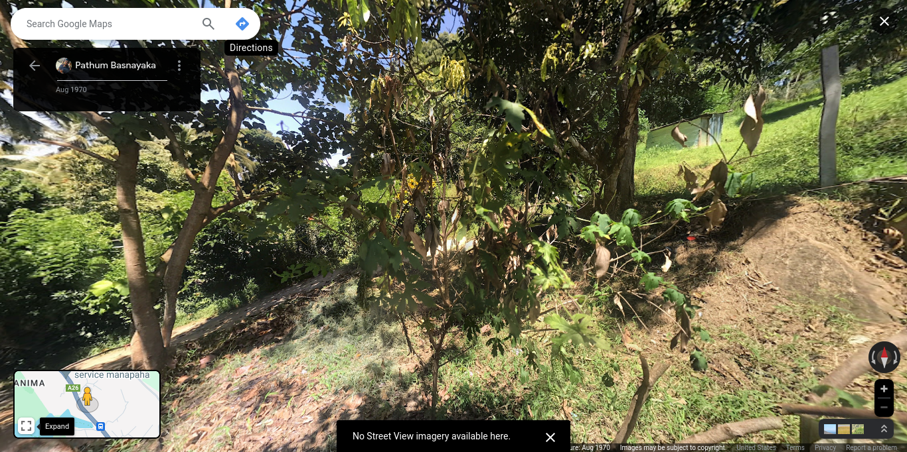

## Ihalagama

**Ihalagama** Grama Niladhari Division, **Udapalatha** Divisional Secretariat Division, **Kandy** District, **Central** Province

**Gampola** Polling Division, **Kandy** Electoral District

Population: 1,541 (2012)

(**LK-2151175**/1174)

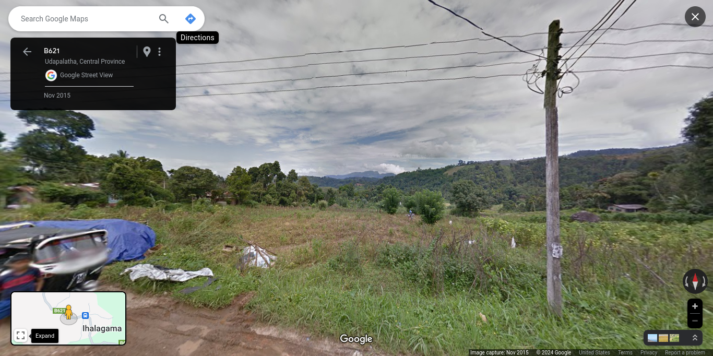

## Wattalpola

**Wattalpola** Grama Niladhari Division, **Panadura** Divisional Secretariat Division, **Kalutara** District, **Western** Province

**Panadura** Polling Division, **Kalutara** Electoral District

Population: 4,273 (2012)

(**LK-1303065**/674A)

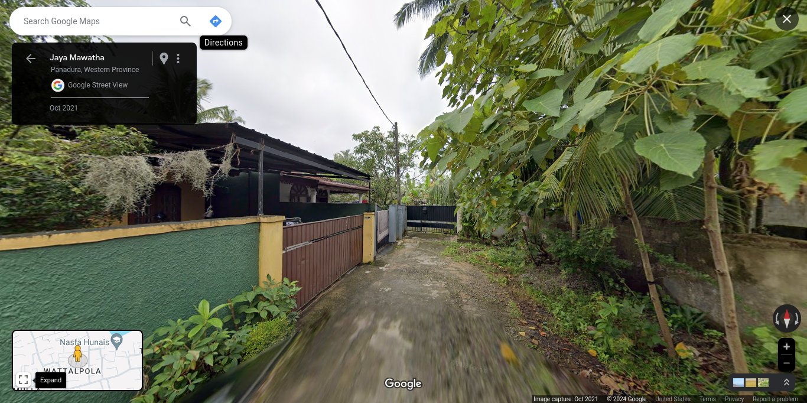

## Ilandagahawewa

**Ilandagahawewa** Grama Niladhari Division, **Nuwaragam Palatha Central** Divisional Secretariat Division, **Anuradhapura** District, **North Central** Province

**Anuradhapura West** Polling Division, **Anuradhapura** Electoral District

Population: 1,161 (2012)

(**LK-7115110**/285)

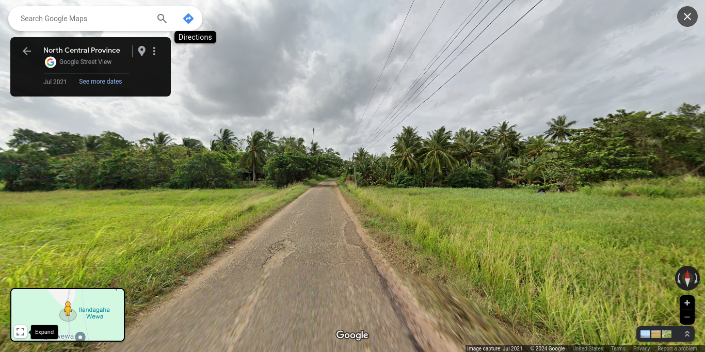

## Sinnakadai

**Sinnakadai** Grama Niladhari Division, **Mannar Town** Divisional Secretariat Division, **Mannar** District, **Northern** Province

**Mannar** Polling Division, **Vanni** Electoral District

Population: 1,386 (2012)

(**LK-4203155**/MN/78)

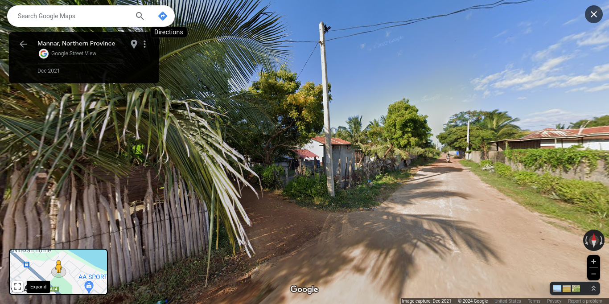

## Megoda Kolonnawa

**Megoda Kolonnawa** Grama Niladhari Division, **Kolonnawa** Divisional Secretariat Division, **Colombo** District, **Western** Province

**Kolonnawa** Polling Division, **Colombo** Electoral District

Population: 10,149 (2012)

(**LK-1106125**/513A)

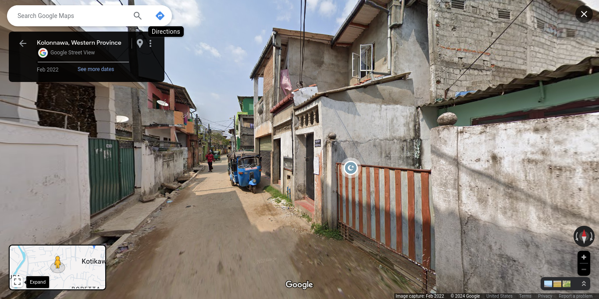

## Weliweriya West

**Weliweriya West** Grama Niladhari Division, **Matara Four Gravets** Divisional Secretariat Division, **Matara** District, **Southern** Province

**Matara** Polling Division, **Matara** Electoral District

Population: 1,350 (2012)

(**LK-3242120**/415A)

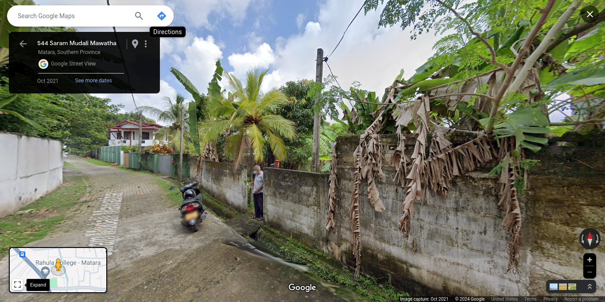

## Godapitiya

**Godapitiya** Grama Niladhari Division, **Athuraliya** Divisional Secretariat Division, **Matara** District, **Southern** Province

**Akuressa** Polling Division, **Matara** Electoral District

Population: 1,735 (2012)

(**LK-3215070**/308A)

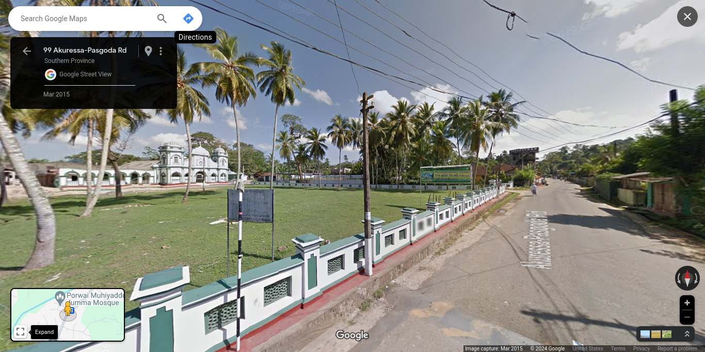

## Emil Nagar

**Emil Nagar** Grama Niladhari Division, **Mannar Town** Divisional Secretariat Division, **Mannar** District, **Northern** Province

**Mannar** Polling Division, **Vanni** Electoral District

Population: 2,114 (2012)

(**LK-4203110**/MN/74)

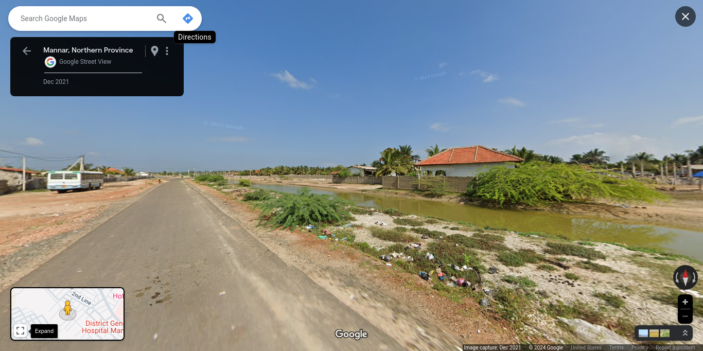

## Dedigamuwa

**Dedigamuwa** Grama Niladhari Division, **Kaduwela** Divisional Secretariat Division, **Colombo** District, **Western** Province

**Kaduwela** Polling Division, **Colombo** Electoral District

Population: 2,105 (2012)

(**LK-1109100**/480A)

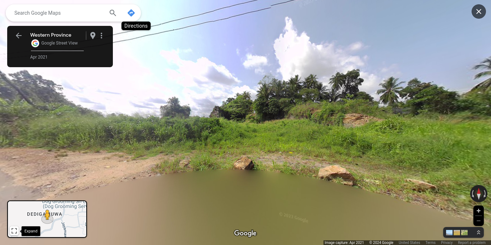

## Gurunagar East

**Gurunagar East** Grama Niladhari Division, **Jaffna** Divisional Secretariat Division, **Jaffna** District, **Northern** Province

**Jaffna** Polling Division, **Jaffna** Electoral District

Population: 1,974 (2012)

(**LK-4136050**/J/70)

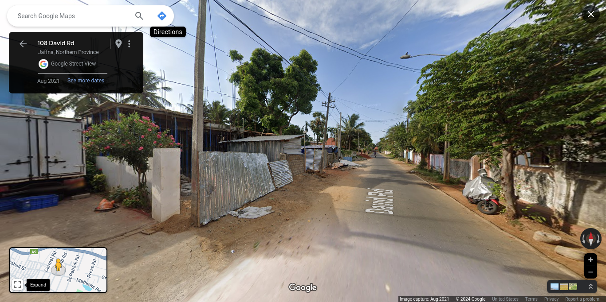

## Makavita

**Makavita** Grama Niladhari Division, **Matara Four Gravets** Divisional Secretariat Division, **Matara** District, **Southern** Province

**Matara** Polling Division, **Matara** Electoral District

Population: 1,294 (2012)

(**LK-3242175**/426C)

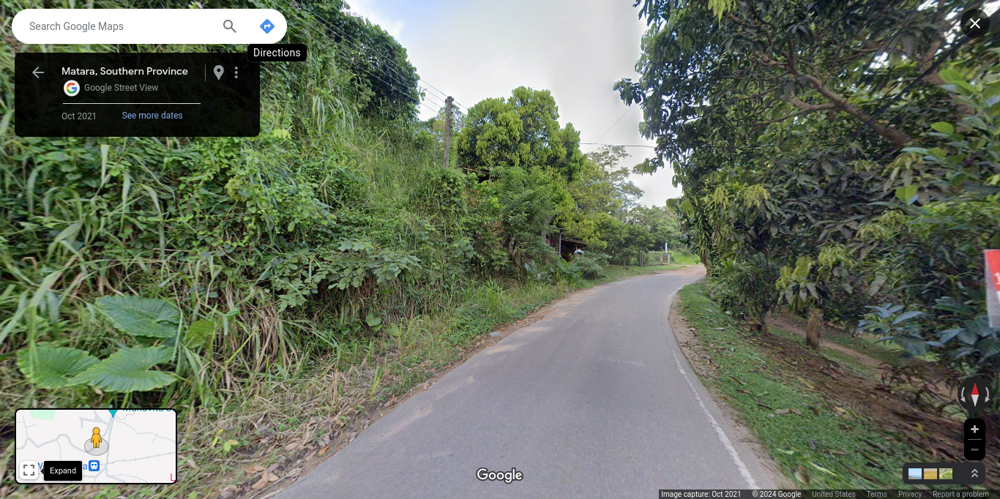

## Miriswatta

**Miriswatta** Grama Niladhari Division, **Beliatta** Divisional Secretariat Division, **Hambantota** District, **Southern** Province

**Beliatta** Polling Division, **Hambantota** Electoral District

Population: 812 (2012)

(**LK-3330285**/369)

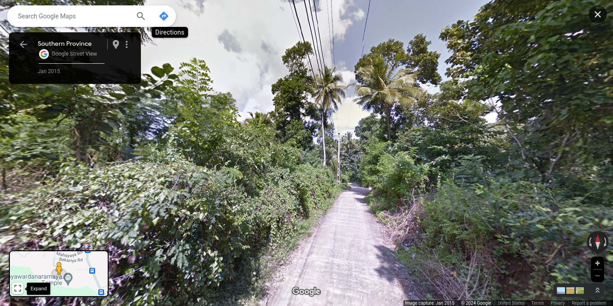

## Yatigaloluwa

**Yatigaloluwa** Grama Niladhari Division, **Alawwa** Divisional Secretariat Division, **Kurunegala** District, **North Western** Province

**Dambadeniya** Polling Division, **Kurunegala** Electoral District

Population: 973 (2012)

(**LK-6184185**/974)

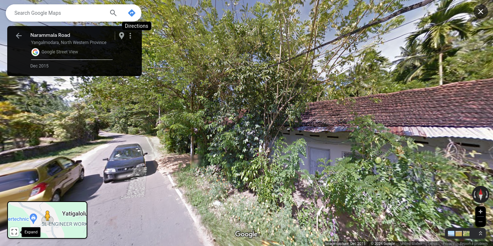

## Kottagoda

**Kottagoda** Grama Niladhari Division, **Matale** Divisional Secretariat Division, **Matale** District, **Central** Province

**Matale** Polling Division, **Matale** Electoral District

Population: 882 (2012)

(**LK-2218100**/E325B)

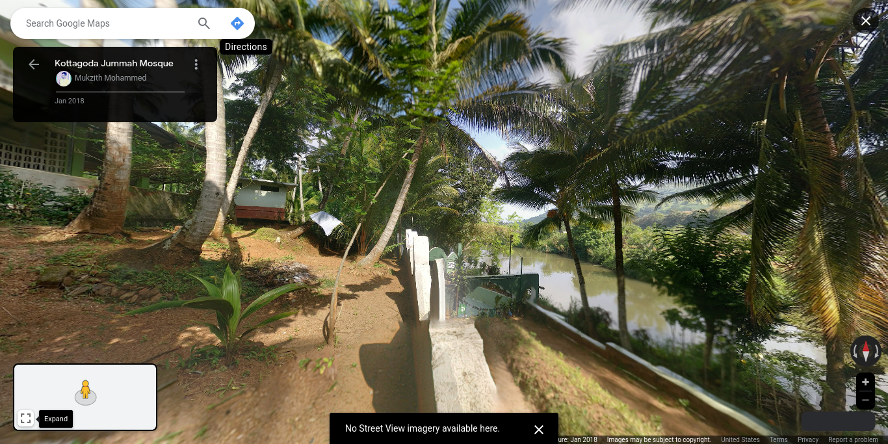

## Hanguranketha

**Hanguranketha** Grama Niladhari Division, **Hanguranketha** Divisional Secretariat Division, **Nuwara Eliya** District, **Central** Province

**Hanguranketha** Polling Division, **Nuwara-Eliya** Electoral District

Population: 885 (2012)

(**LK-2306140**/495)

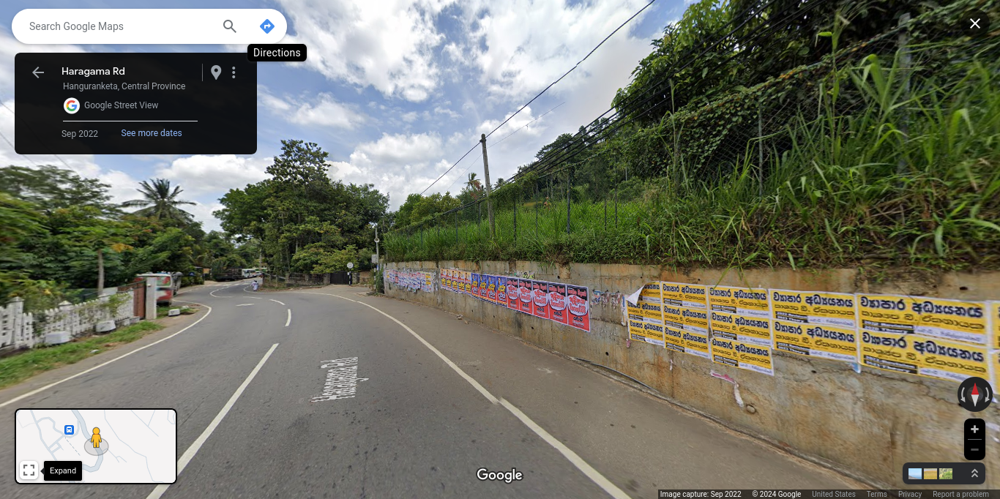

## Vankalai West

**Vankalai West** Grama Niladhari Division, **Nanattan** Divisional Secretariat Division, **Mannar** District, **Northern** Province

**Mannar** Polling Division, **Vanni** Electoral District

Population: 710 (2012)

(**LK-4212010**/MN/98)

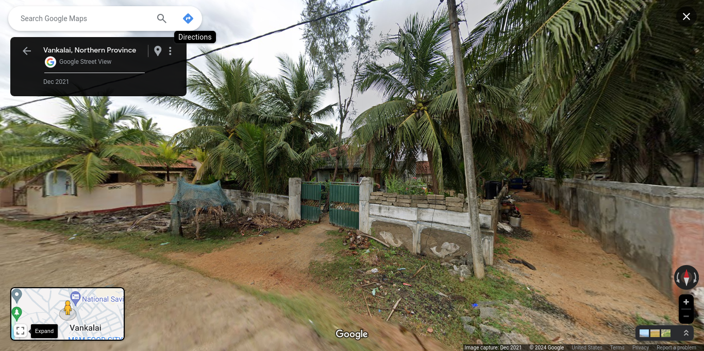

## Henarathgoda

**Henarathgoda** Grama Niladhari Division, **Gampaha** Divisional Secretariat Division, **Gampaha** District, **Western** Province

**Gampaha** Polling Division, **Gampaha** Electoral District

Population: 2,637 (2012)

(**LK-1224310**/232)

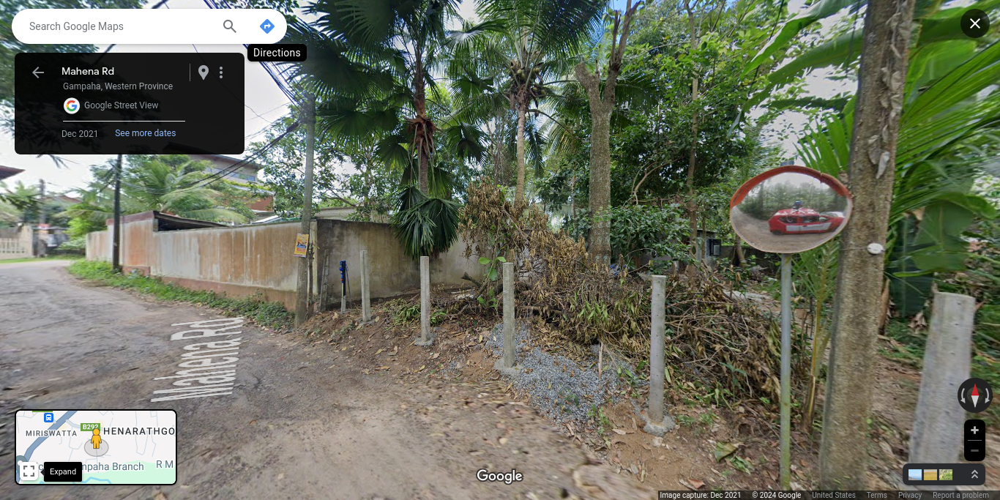

## Deekirimadawala

**Deekirimadawala** Grama Niladhari Division, **Kundasale** Divisional Secretariat Division, **Kandy** District, **Central** Province

**Kundasale** Polling Division, **Kandy** Electoral District

Population: 1,324 (2012)

(**LK-2127205**/659)

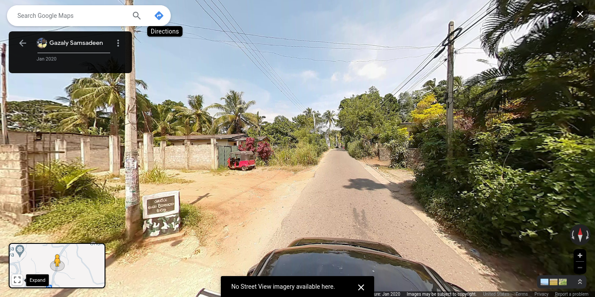

## Senkadagala

**Senkadagala** Grama Niladhari Division, **Kandy Four Gravets & Gangawata Korale** Divisional Secretariat Division, **Kandy** District, **Central** Province

**Senkadagala** Polling Division, **Kandy** Electoral District

Population: 2,065 (2012)

(**LK-2130020**/251)

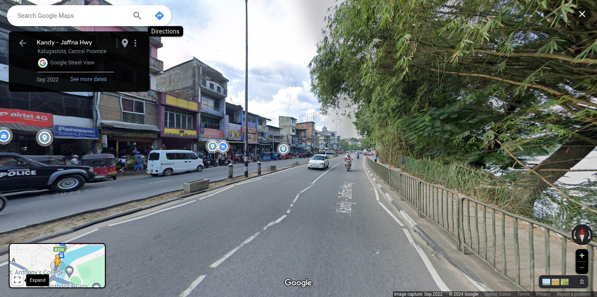

## Kaduwela

**Kaduwela** Grama Niladhari Division, **Kaduwela** Divisional Secretariat Division, **Colombo** District, **Western** Province

**Kaduwela** Polling Division, **Colombo** Electoral District

Population: 4,342 (2012)

(**LK-1109020**/473A)

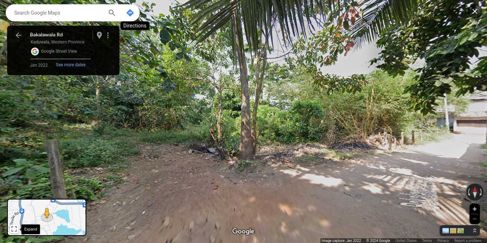

## Ranpokunagama A Zone

**Ranpokunagama A Zone** Grama Niladhari Division, **Attanagalla** Divisional Secretariat Division, **Gampaha** District, **Western** Province

**Attanagalla** Polling Division, **Gampaha** Electoral District

Population: 1,443 (2012)

(**LK-1227205**/349A)

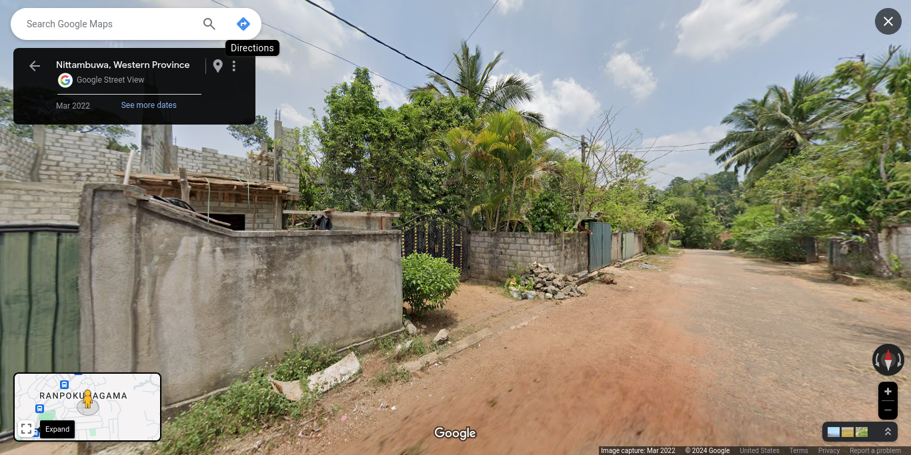

## Kadurupokuna South

**Kadurupokuna South** Grama Niladhari Division, **Tangalle** Divisional Secretariat Division, **Hambantota** District, **Southern** Province

**Tangalle** Polling Division, **Hambantota** Electoral District

Population: 1,744 (2012)

(**LK-3333265**/280)

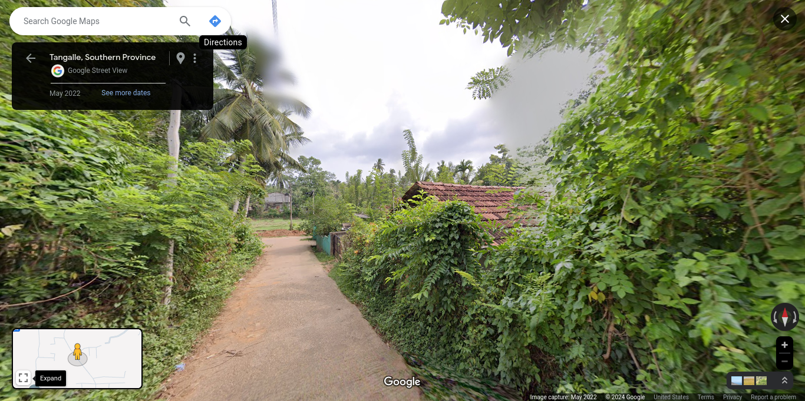

## Kalmunaikudi 04

**Kalmunaikudi 04** Grama Niladhari Division, **Kalmunai** Divisional Secretariat Division, **Ampara** District, **Eastern** Province

**Kalmunai** Polling Division, **Digamadulla** Electoral District

Population: 819 (2012)

(**LK-5224095**/KP/58B)

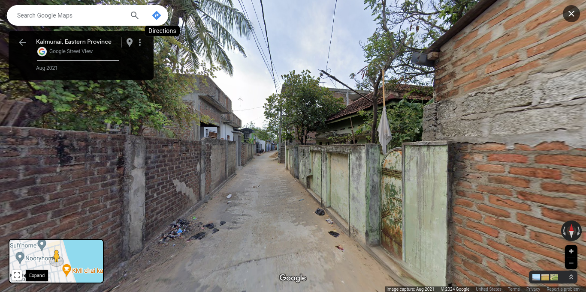

## Pattanichchi puliyankulam

**Pattanichchi puliyankulam** Grama Niladhari Division, **Vavuniya** Divisional Secretariat Division, **Vavuniya** District, **Northern** Province

**Vavuniya** Polling Division, **Vanni** Electoral District

Population: 6,367 (2012)

(**LK-4309095**/214B)

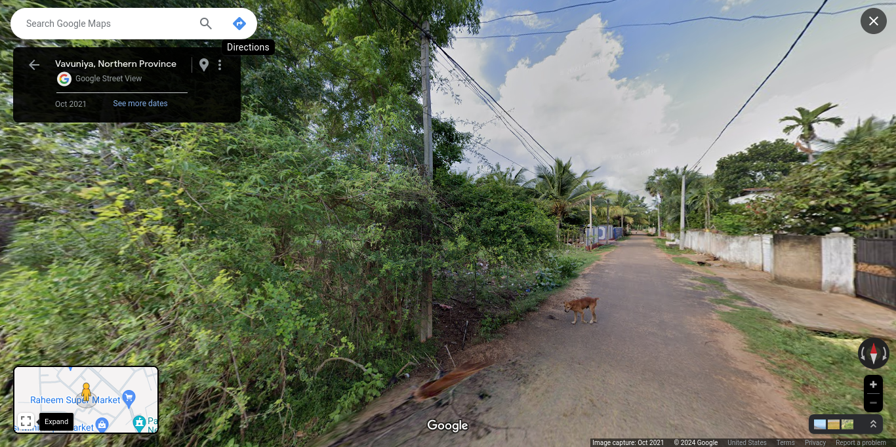

## Ibbanwala

**Ibbanwala** Grama Niladhari Division, **Colombo** Divisional Secretariat Division, **Colombo** District, **Western** Province

**Colombo Central** Polling Division, **Colombo** Electoral District

Population: 2,583 (2012)

(**LK-1103170**/)

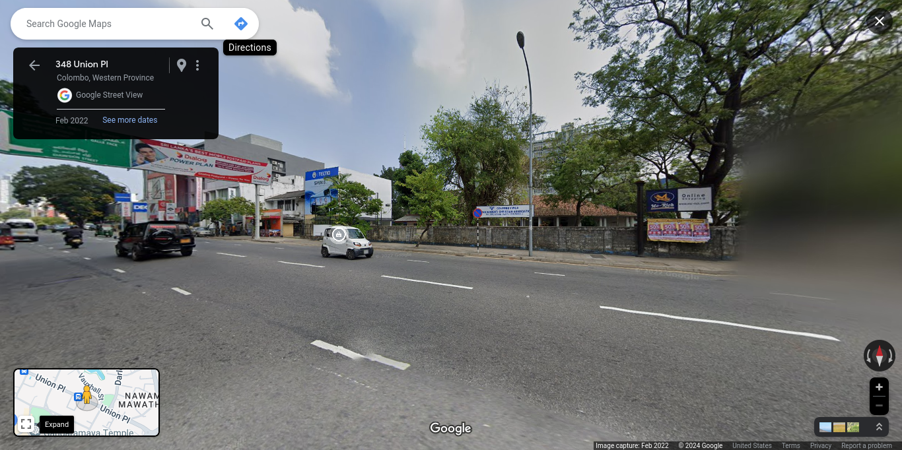

## Galthotamulla

**Galthotamulla** Grama Niladhari Division, **Gampaha** Divisional Secretariat Division, **Gampaha** District, **Western** Province

**Gampaha** Polling Division, **Gampaha** Electoral District

Population: 1,334 (2012)

(**LK-1224285**/230C)

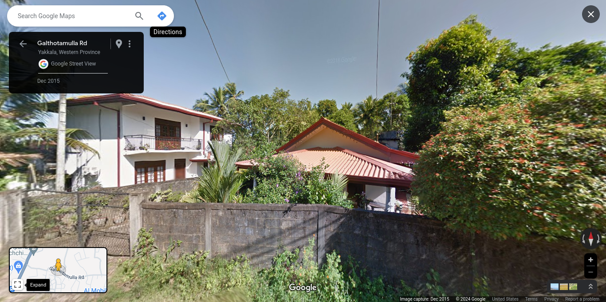

## Akkaraipattu 04

**Akkaraipattu 04** Grama Niladhari Division, **Akkaraipattu** Divisional Secretariat Division, **Ampara** District, **Eastern** Province

**Samanthurai** Polling Division, **Digamadulla** Electoral District

Population: 1,219 (2012)

(**LK-5236035**/AP/18)

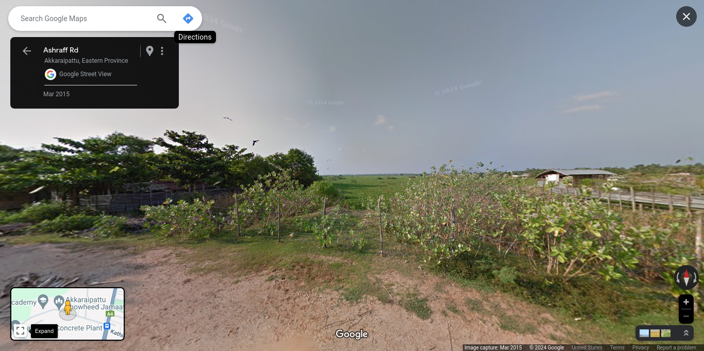

## Ehelape

**Ehelape** Grama Niladhari Division, **Akuressa** Divisional Secretariat Division, **Matara** District, **Southern** Province

**Akuressa** Polling Division, **Matara** Electoral District

Population: 1,587 (2012)

(**LK-3218060**/367)

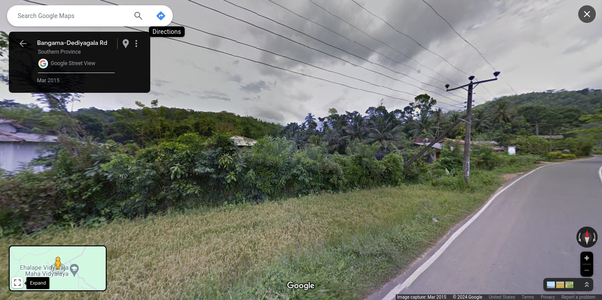

## Dippitigala

**Dippitigala** Grama Niladhari Division, **Pelmadulla** Divisional Secretariat Division, **Ratnapura** District, **Sabaragamuwa** Province

**Pelmadulla** Polling Division, **Ratnapura** Electoral District

Population: 1,580 (2012)

(**LK-9124050**/172C)

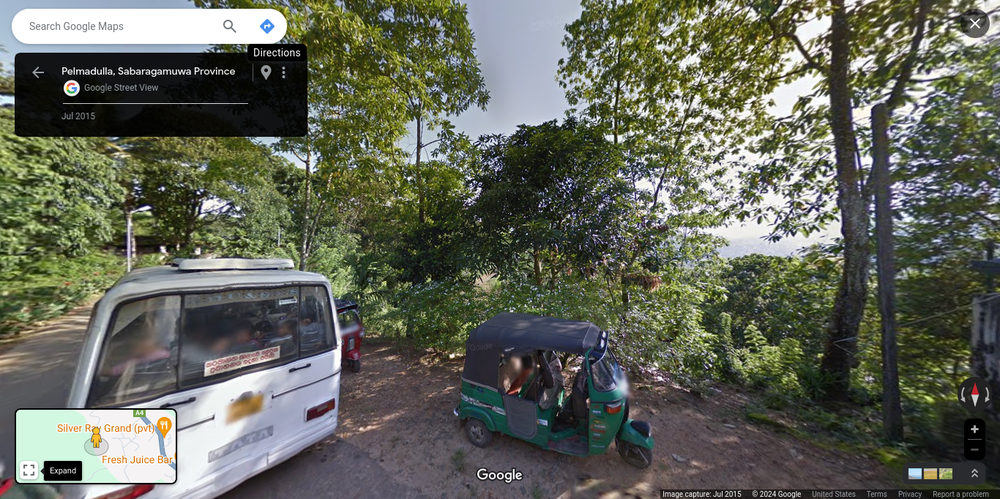

## Pothuvil 01 / Unit 1

**Pothuvil 01 / Unit 1** Grama Niladhari Division, **Pothuvil** Divisional Secretariat Division, **Ampara** District, **Eastern** Province

**Pothuvil** Polling Division, **Digamadulla** Electoral District

Population: 694 (2012)

(**LK-5248120**/P/01)

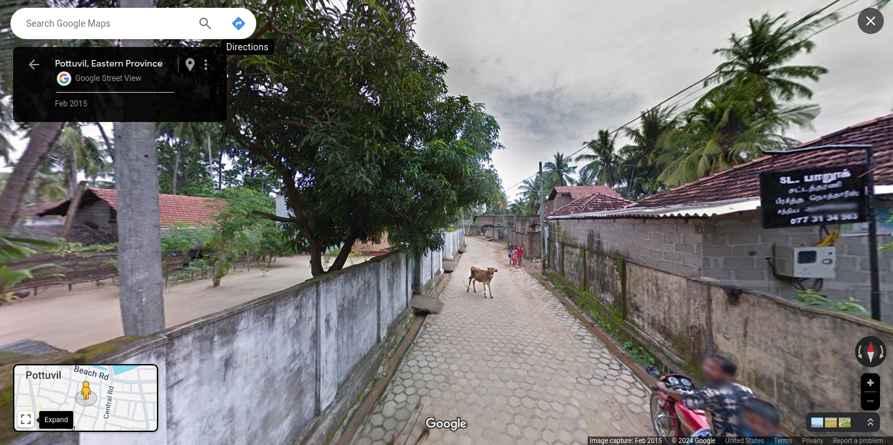

## Pokkuruni

**Pokkuruni** Grama Niladhari Division, **Thambalagamuwa** Divisional Secretariat Division, **Trincomalee** District, **Eastern** Province

**Trincomalee** Polling Division, **Trincomalee** Electoral District

Population: 1,250 (2012)

(**LK-5318020**/228I)

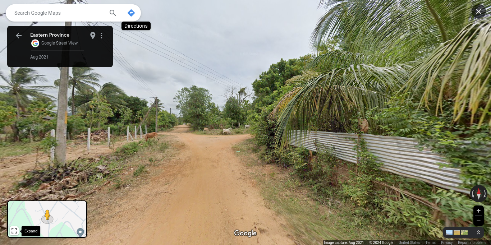

## Mihindupura

**Mihindupura** Grama Niladhari Division, **Nuwara Eliya** Divisional Secretariat Division, **Nuwara Eliya** District, **Central** Province

**Nuwara Eliya Maskeliya** Polling Division, **Nuwara-Eliya** Electoral District

Population: 1,226 (2012)

(**LK-2312295**/476G)

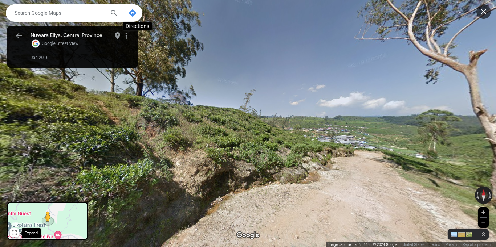

## Dehigasthalawa

**Dehigasthalawa** Grama Niladhari Division, **Balangoda** Divisional Secretariat Division, **Ratnapura** District, **Sabaragamuwa** Province

**Balangoda** Polling Division, **Ratnapura** Electoral District

Population: 4,741 (2012)

(**LK-9118130**/250B)

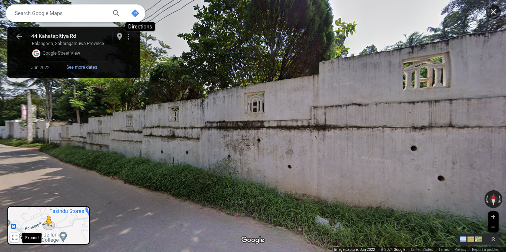

## Rathnapura Town North

**Rathnapura Town North** Grama Niladhari Division, **Ratnapura** Divisional Secretariat Division, **Ratnapura** District, **Sabaragamuwa** Province

**Ratnapura** Polling Division, **Ratnapura** Electoral District

Population: 3,353 (2012)

(**LK-9112205**/152E)

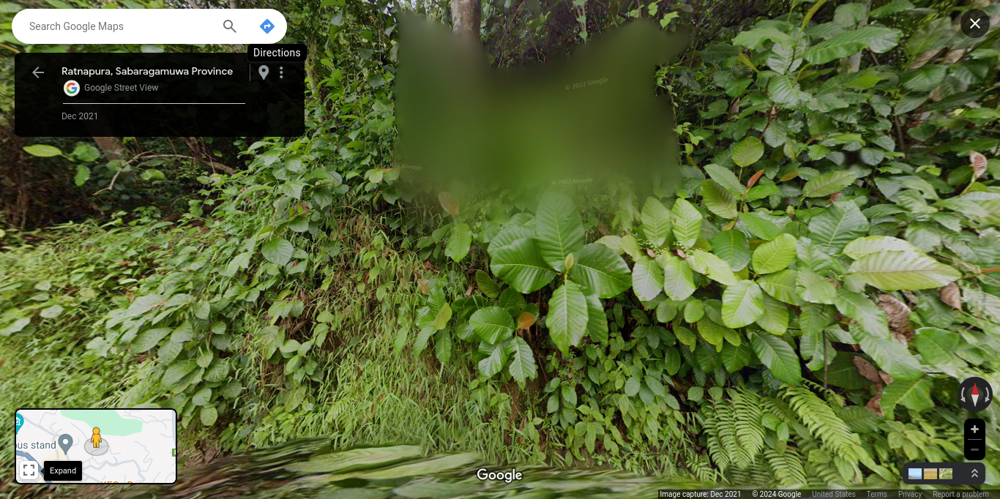

## Orugodawatta

**Orugodawatta** Grama Niladhari Division, **Kolonnawa** Divisional Secretariat Division, **Colombo** District, **Western** Province

**Kolonnawa** Polling Division, **Colombo** Electoral District

Population: 5,900 (2012)

(**LK-1106030**/510A)

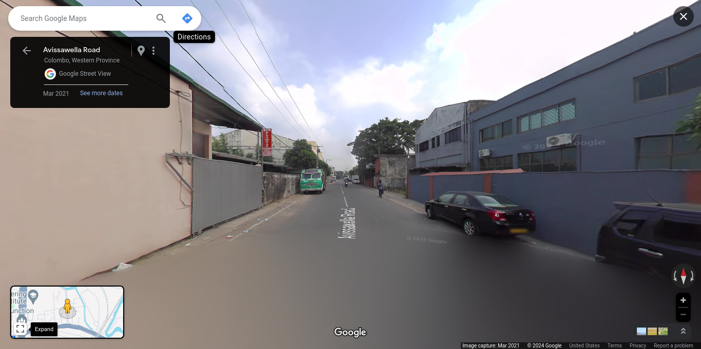

## Wetasyaya

**Wetasyaya** Grama Niladhari Division, **Rattota** Divisional Secretariat Division, **Matale** District, **Central** Province

**Rattota** Polling Division, **Matale** Electoral District

Population: 704 (2012)

(**LK-2230190**/E368B)

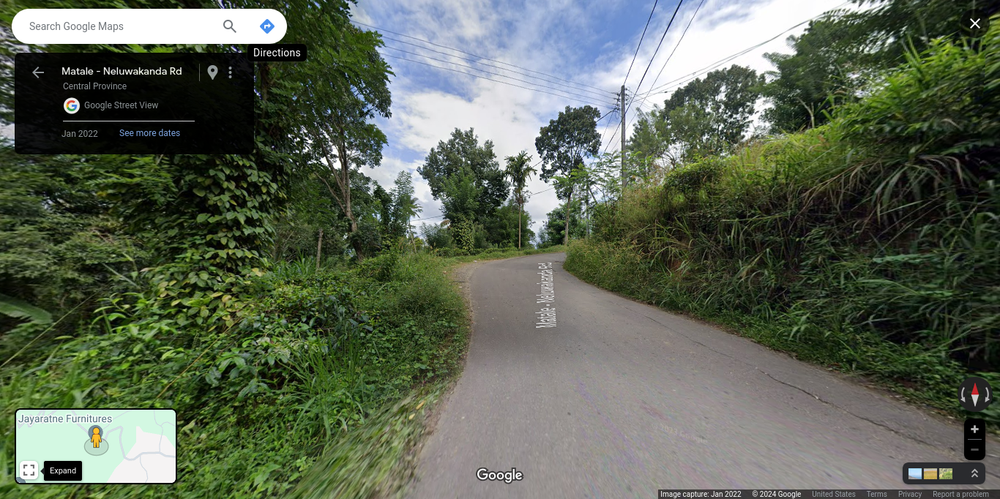

## Pidurangala

**Pidurangala** Grama Niladhari Division, **Dambulla** Divisional Secretariat Division, **Matale** District, **Central** Province

**Dambulla** Polling Division, **Matale** Electoral District

Population: 550 (2012)

(**LK-2206020**/E455C)

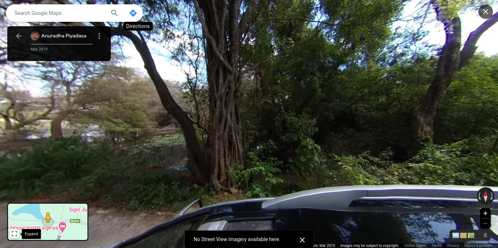

## Valluvarpuram

**Valluvarpuram** Grama Niladhari Division, **Puthukkudiyiruppu** Divisional Secretariat Division, **Mullaitivu** District, **Northern** Province

**Mullaitivu** Polling Division, **Vanni** Electoral District

Population: 970 (2012)

(**LK-4409085**/MU/53)

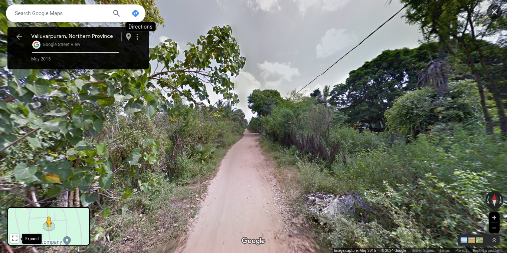

## Maharagama

**Maharagama** Grama Niladhari Division, **Mahara** Divisional Secretariat Division, **Gampaha** District, **Western** Province

**Mahara** Polling Division, **Gampaha** Electoral District

Population: 1,513 (2012)

(**LK-1233020**/303A)

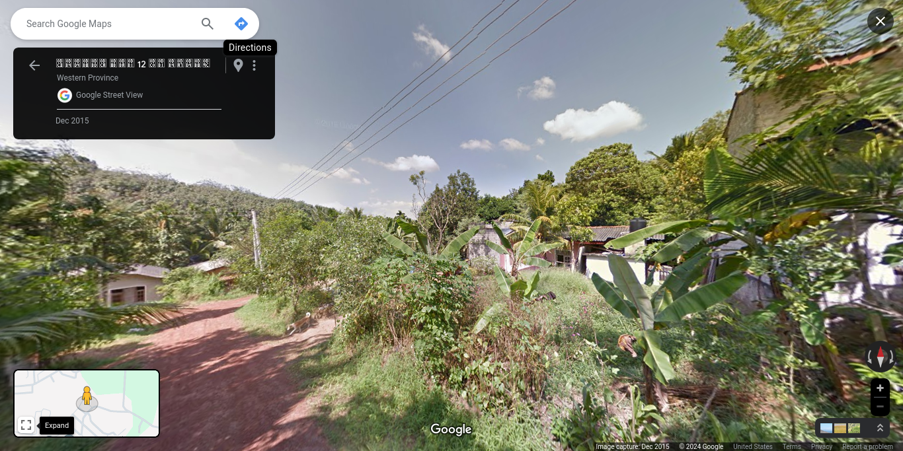

## Illawathura

**Illawathura** Grama Niladhari Division, **Udapalatha** Divisional Secretariat Division, **Kandy** District, **Central** Province

**Gampola** Polling Division, **Kandy** Electoral District

Population: 2,705 (2012)

(**LK-2151100**/1110)

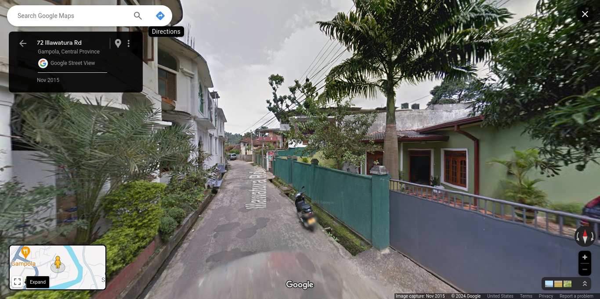

## Batagalla South

**Batagalla South** Grama Niladhari Division, **Pujapitiya** Divisional Secretariat Division, **Kandy** District, **Central** Province

**Harispattuwa** Polling Division, **Kandy** Electoral District

Population: 510 (2012)

(**LK-2106295**/549)

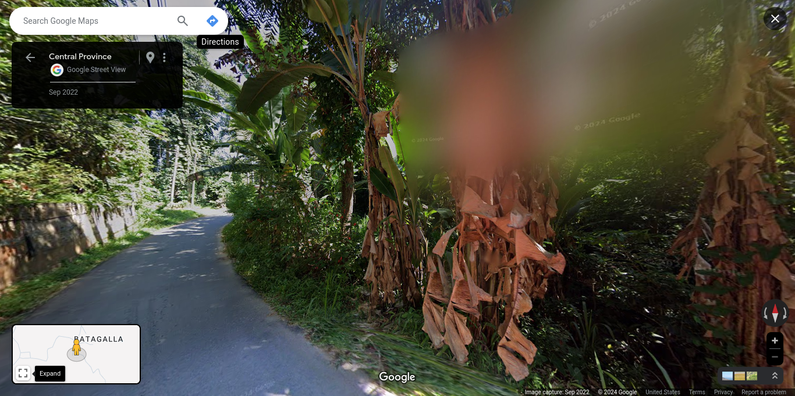

## Meegahapelessa

**Meegahapelessa** Grama Niladhari Division, **Udubaddawa** Divisional Secretariat Division, **Kurunegala** District, **North Western** Province

**Bingiriya** Polling Division, **Kurunegala** Electoral District

Population: 1,329 (2012)

(**LK-6175165**/1521)

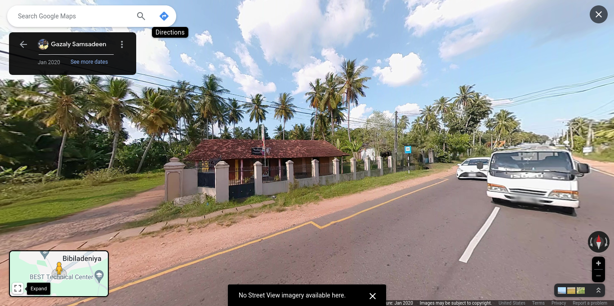

## Thaladoowa

**Thaladoowa** Grama Niladhari Division, **Negombo** Divisional Secretariat Division, **Gampaha** District, **Western** Province

**Negombo** Polling Division, **Gampaha** Electoral District

Population: 6,757 (2012)

(**LK-1203140**/160A)

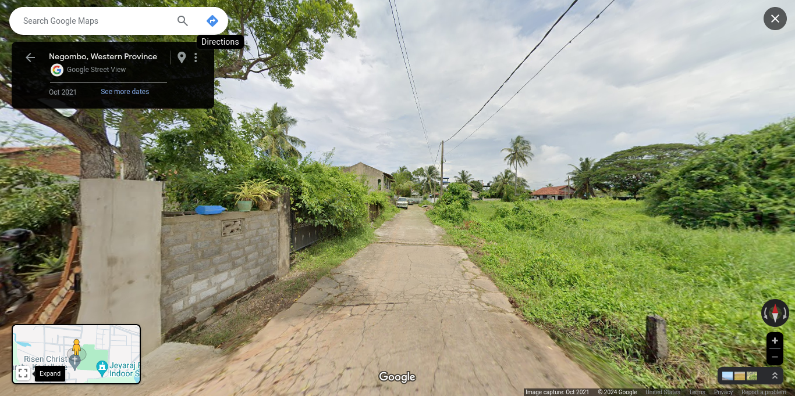

## Balangoda Town

**Balangoda Town** Grama Niladhari Division, **Balangoda** Divisional Secretariat Division, **Ratnapura** District, **Sabaragamuwa** Province

**Balangoda** Polling Division, **Ratnapura** Electoral District

Population: 2,136 (2012)

(**LK-9118135**/256A)

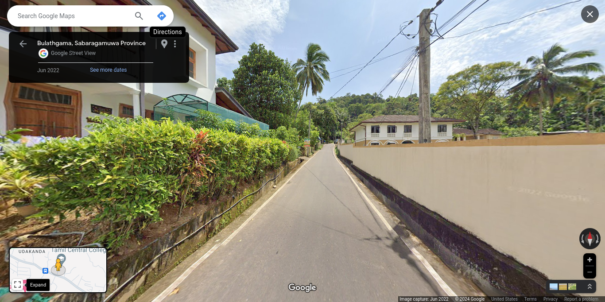

## Kalmunai  03

**Kalmunai  03** Grama Niladhari Division, **Kalmunai Tamil Division** Divisional Secretariat Division, **Ampara** District, **Eastern** Province

**Kalmunai** Polling Division, **Digamadulla** Electoral District

Population: 579 (2012)

(**LK-5221140**/KP/59/1)

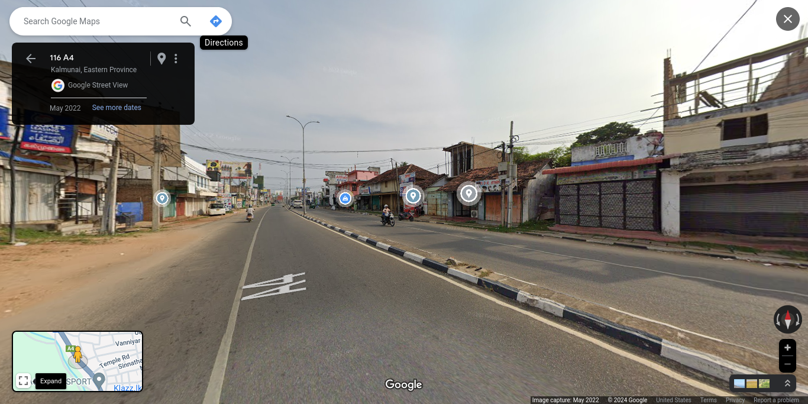

## Pattivila North

**Pattivila North** Grama Niladhari Division, **Biyagama** Divisional Secretariat Division, **Gampaha** District, **Western** Province

**Biyagama** Polling Division, **Gampaha** Electoral District

Population: 2,048 (2012)

(**LK-1239185**/279)

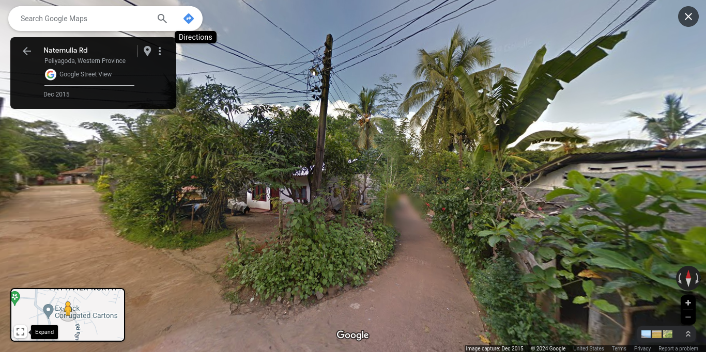

## Yaggala

**Yaggala** Grama Niladhari Division, **Hatharaliyadda** Divisional Secretariat Division, **Kandy** District, **Central** Province

**Galagedara** Polling Division, **Kandy** Electoral District

Population: 356 (2012)

(**LK-2134190**/390)

## Galapitaambe

**Galapitaambe** Grama Niladhari Division, **Kundasale** Divisional Secretariat Division, **Kandy** District, **Central** Province

**Kundasale** Polling Division, **Kandy** Electoral District

Population: 1,213 (2012)

(**LK-2127215**/663)

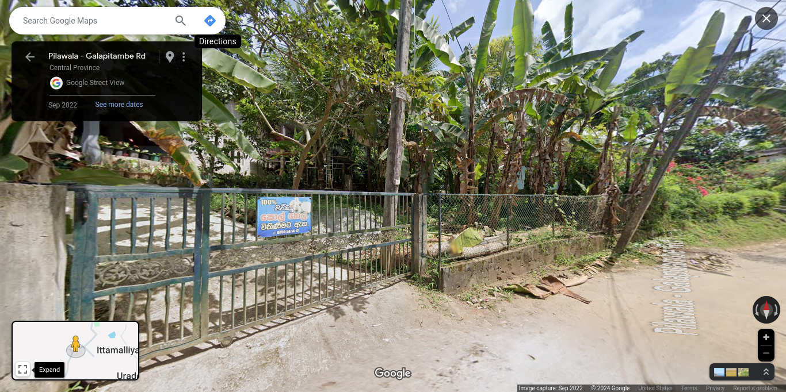

## Wanchawala

**Wanchawala** Grama Niladhari Division, **Akmeemana** Divisional Secretariat Division, **Galle** District, **Southern** Province

**Akmeemana** Polling Division, **Galle** Electoral District

Population: 798 (2012)

(**LK-3145270**/134E)

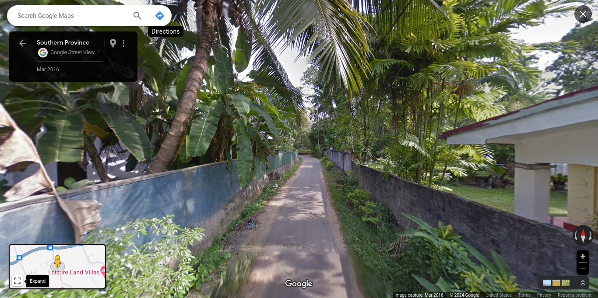

## Ambathalawa

**Ambathalawa** Grama Niladhari Division, **Kothmale** Divisional Secretariat Division, **Nuwara Eliya** District, **Central** Province

**Kothmale** Polling Division, **Nuwara-Eliya** Electoral District

Population: 1,087 (2012)

(**LK-2303230**/470A)

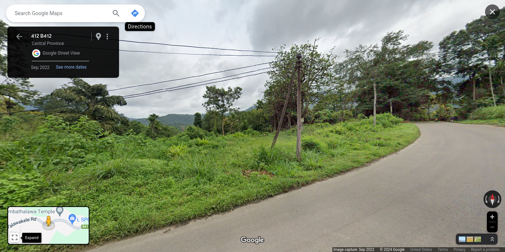

## Arali Centre

**Arali Centre** Grama Niladhari Division, **Valikamam West (Chankanai)** Divisional Secretariat Division, **Jaffna** District, **Northern** Province

**Vaddukoddai** Polling Division, **Jaffna** Electoral District

Population: 1,968 (2012)

(**LK-4106025**/J/161)

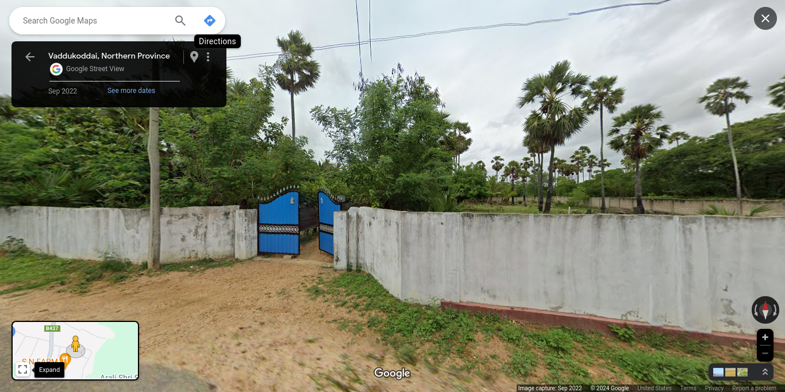

## Badabedda

**Badabedda** Grama Niladhari Division, **Pannala** Divisional Secretariat Division, **Kurunegala** District, **North Western** Province

**Katugampola** Polling Division, **Kurunegala** Electoral District

Population: 2,022 (2012)

(**LK-6178385**/1550)

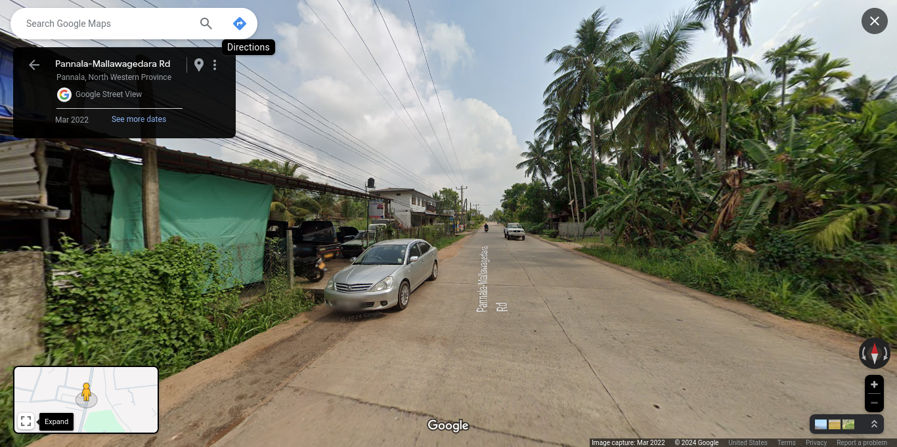

## Dikovita

**Dikovita** Grama Niladhari Division, **Wattala** Divisional Secretariat Division, **Gampaha** District, **Western** Province

**Wattala** Polling Division, **Gampaha** Electoral District

Population: 1,623 (2012)

(**LK-1218150**/168B)

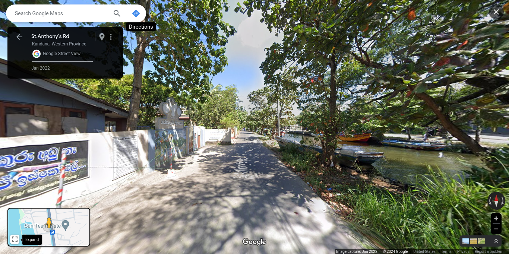

## Naimbala 1

**Naimbala 1** Grama Niladhari Division, **Thihagoda** Divisional Secretariat Division, **Matara** District, **Southern** Province

**Kamburupitiya** Polling Division, **Matara** Electoral District

Population: 579 (2012)

(**LK-3236110**/336)

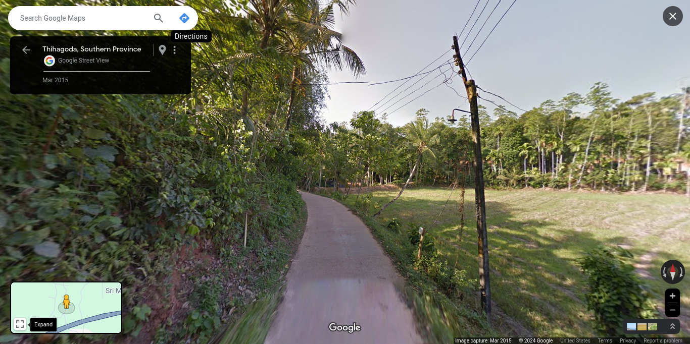

## Perimiyankulama

**Perimiyankulama** Grama Niladhari Division, **Nuwaragam Palatha Central** Divisional Secretariat Division, **Anuradhapura** District, **North Central** Province

**Anuradhapura West** Polling Division, **Anuradhapura** Electoral District

Population: 1,299 (2012)

(**LK-7115090**/300)

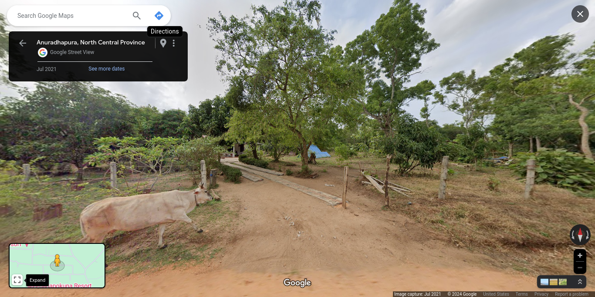

## Bandigoda

**Bandigoda** Grama Niladhari Division, **Ja-Ela** Divisional Secretariat Division, **Gampaha** District, **Western** Province

**Ja Ela** Polling Division, **Gampaha** Electoral District

Population: 3,352 (2012)

(**LK-1221080**/211B)

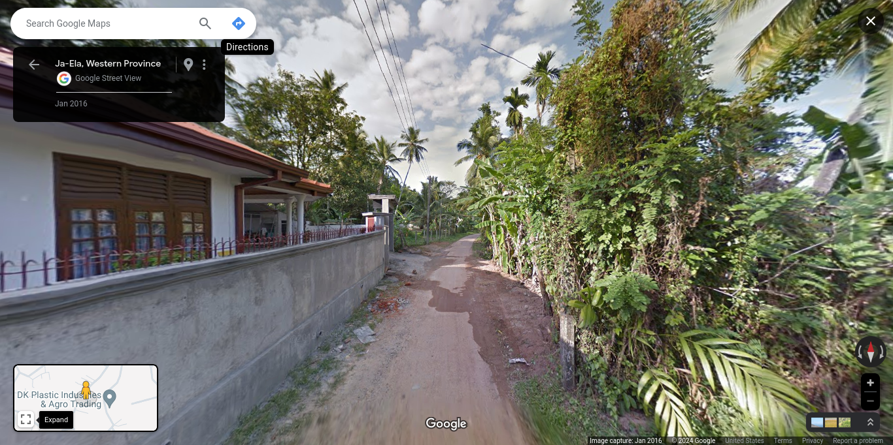

## Sangiliyan Thoppu

**Sangiliyan Thoppu** Grama Niladhari Division, **Nallur** Divisional Secretariat Division, **Jaffna** District, **Northern** Province

**Nallur** Polling Division, **Jaffna** Electoral District

Population: 3,611 (2012)

(**LK-4133105**/J/109)

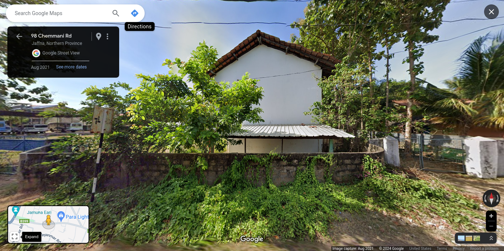

## Kurunduwatta

**Kurunduwatta** Grama Niladhari Division, **Okewela** Divisional Secretariat Division, **Hambantota** District, **Southern** Province

**Beliatta** Polling Division, **Hambantota** Electoral District

Population: 611 (2012)

(**LK-3327030**/472)

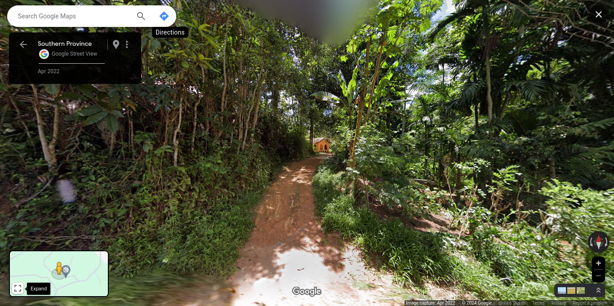

## Beliatta West

**Beliatta West** Grama Niladhari Division, **Beliatta** Divisional Secretariat Division, **Hambantota** District, **Southern** Province

**Beliatta** Polling Division, **Hambantota** Electoral District

Population: 645 (2012)

(**LK-3330185**/353)

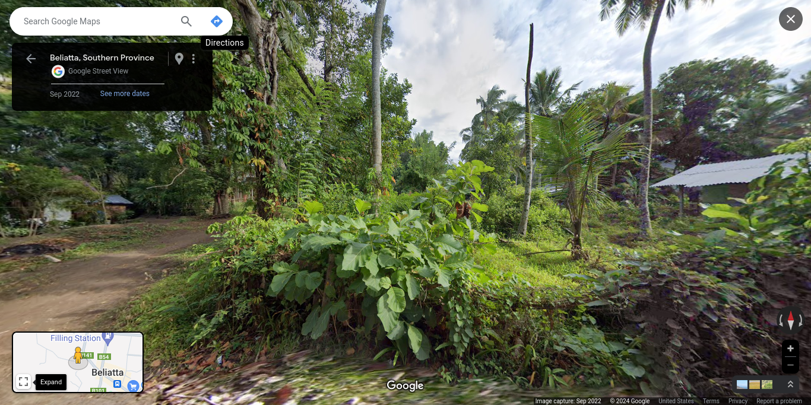

## Kalamulla North

**Kalamulla North** Grama Niladhari Division, **Kalutara** Divisional Secretariat Division, **Kalutara** District, **Western** Province

**Kalutara** Polling Division, **Kalutara** Electoral District

Population: 1,993 (2012)

(**LK-1321390**/731)

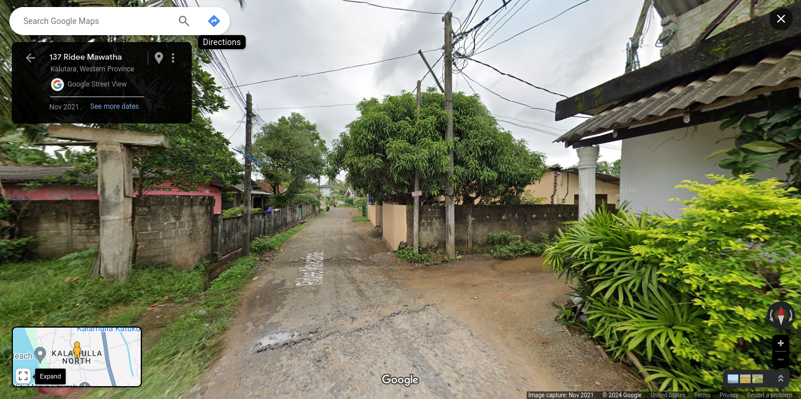

## Maddakalaputharavai 01

**Maddakalaputharavai 01** Grama Niladhari Division, **Samanthurai** Divisional Secretariat Division, **Ampara** District, **Eastern** Province

**Samanthurai** Polling Division, **Digamadulla** Electoral District

Population: 1,090 (2012)

(**LK-5218100**/77A)

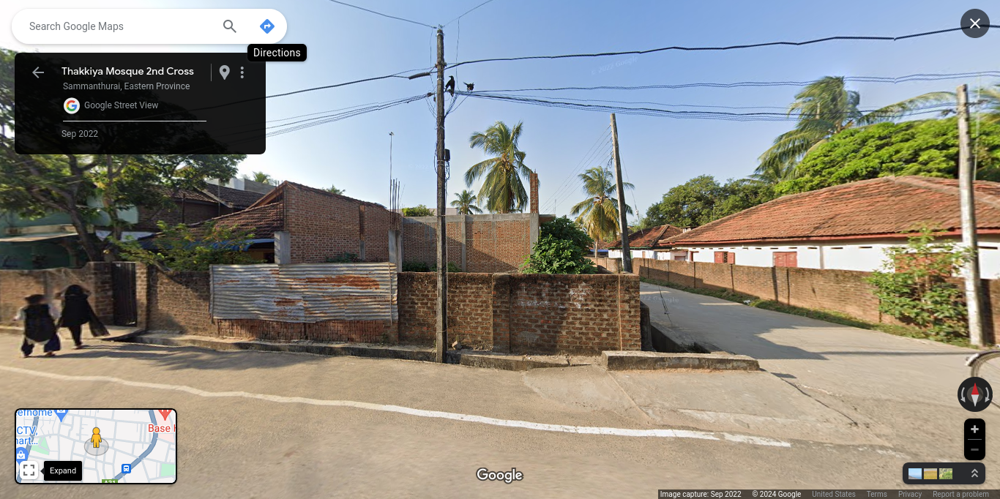

## Eluthur

**Eluthur** Grama Niladhari Division, **Mannar Town** Divisional Secretariat Division, **Mannar** District, **Northern** Province

**Mannar** Polling Division, **Vanni** Electoral District

Population: 3,407 (2012)

(**LK-4203140**/MN/72)

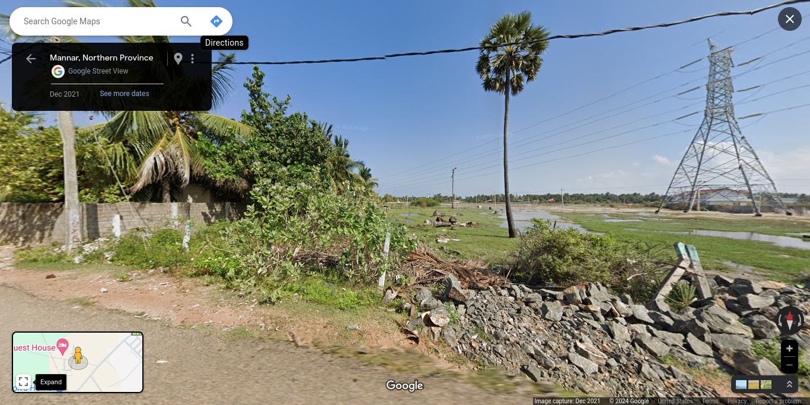

## Balathawa

**Balathawa** Grama Niladhari Division, **Mirigama** Divisional Secretariat Division, **Gampaha** District, **Western** Province

**Mirigama** Polling Division, **Gampaha** Electoral District

Population: 861 (2012)

(**LK-1212160**/13C)

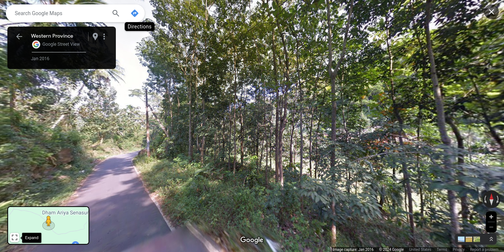

## Embilmeegama North

**Embilmeegama North** Grama Niladhari Division, **Yatinuwara** Divisional Secretariat Division, **Kandy** District, **Central** Province

**Yatinuwara** Polling Division, **Kandy** Electoral District

Population: 1,051 (2012)

(**LK-2136380**/166)

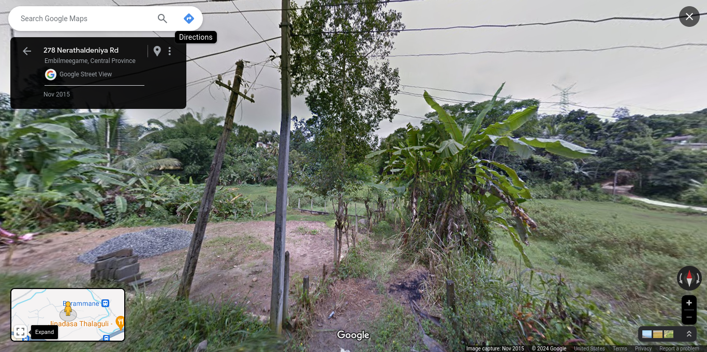

## Pattivila North

**Pattivila North** Grama Niladhari Division, **Biyagama** Divisional Secretariat Division, **Gampaha** District, **Western** Province

**Biyagama** Polling Division, **Gampaha** Electoral District

Population: 2,048 (2012)

(**LK-1239185**/279)

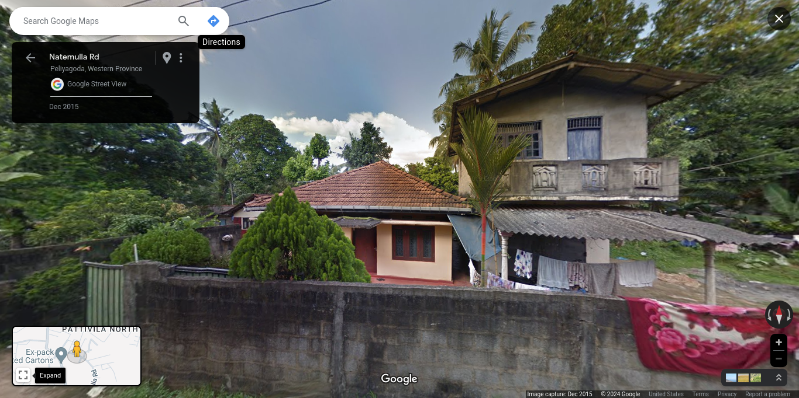

## Thalagala North

**Thalagala North** Grama Niladhari Division, **Horana** Divisional Secretariat Division, **Kalutara** District, **Western** Province

**Horana** Polling Division, **Kalutara** Electoral District

Population: 3,981 (2012)

(**LK-1309035**/613)

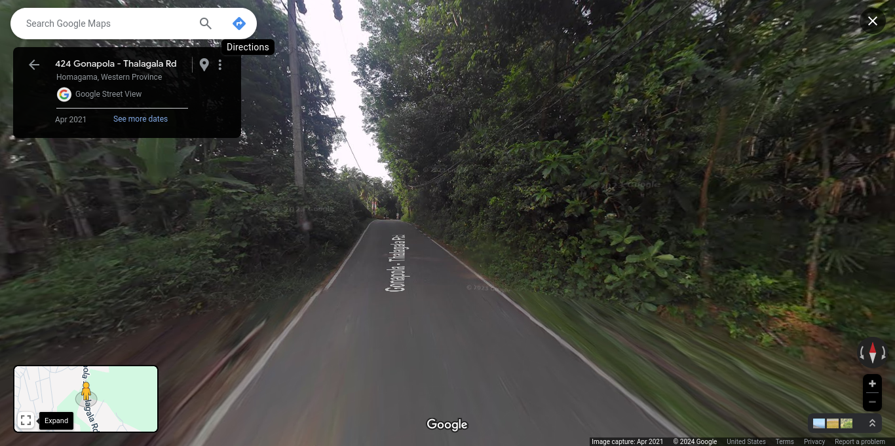

## Moolai

**Moolai** Grama Niladhari Division, **Valikamam West (Chankanai)** Divisional Secretariat Division, **Jaffna** District, **Northern** Province

**Vaddukoddai** Polling Division, **Jaffna** Electoral District

Population: 3,178 (2012)

(**LK-4106075**/J/171)

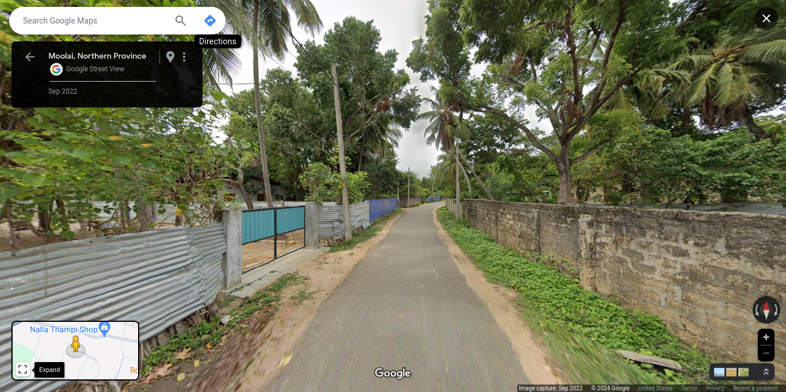

## Nallur Irajathani

**Nallur Irajathani** Grama Niladhari Division, **Nallur** Divisional Secretariat Division, **Jaffna** District, **Northern** Province

**Nallur** Polling Division, **Jaffna** Electoral District

Population: 591 (2012)

(**LK-4133095**/J/107)

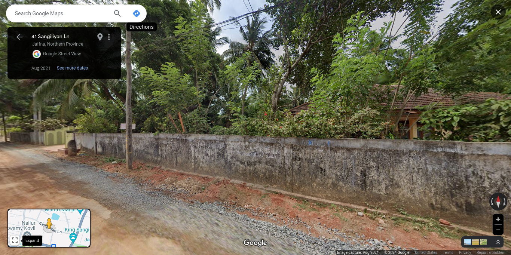

## Ninthavur 12

**Ninthavur 12** Grama Niladhari Division, **Ninthavur** Divisional Secretariat Division, **Ampara** District, **Eastern** Province

**Pothuvil** Polling Division, **Digamadulla** Electoral District

Population: 968 (2012)

(**LK-5230015**/41B)

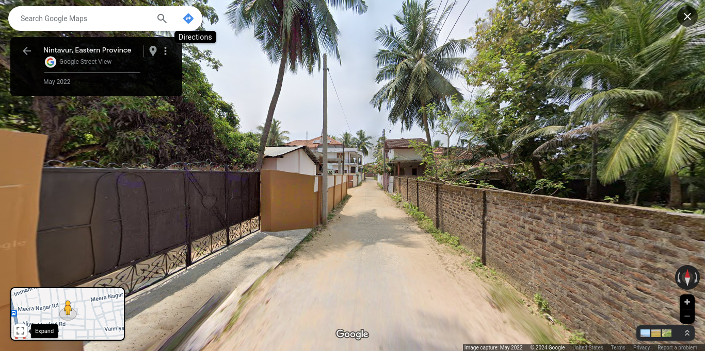

## Theppanawa Pahalagama

**Theppanawa Pahalagama** Grama Niladhari Division, **Kuruvita** Divisional Secretariat Division, **Ratnapura** District, **Sabaragamuwa** Province

**Ratnapura** Polling Division, **Ratnapura** Electoral District

Population: 1,272 (2012)

(**LK-9106175**/156B)

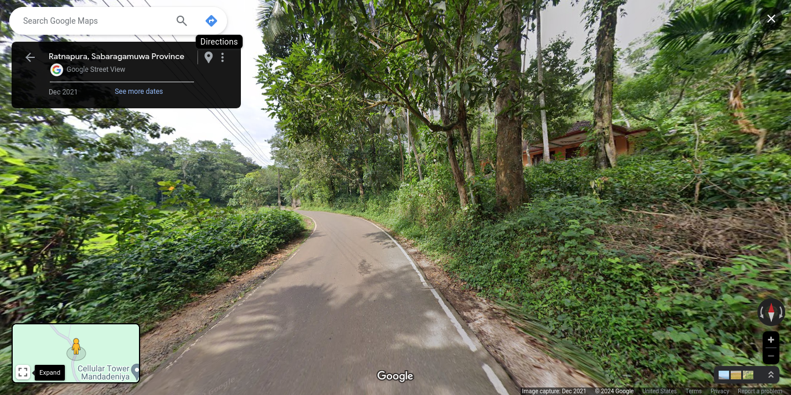

## Yakgaha

**Yakgaha** Grama Niladhari Division, **Akmeemana** Divisional Secretariat Division, **Galle** District, **Southern** Province

**Akmeemana** Polling Division, **Galle** Electoral District

Population: 921 (2012)

(**LK-3145170**/112B)

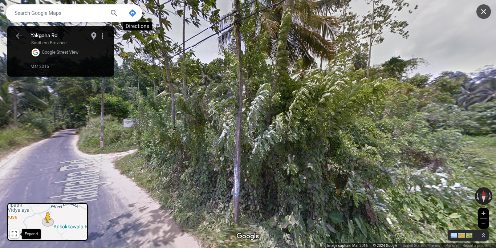

## Suwarapola East

**Suwarapola East** Grama Niladhari Division, **Kesbewa** Divisional Secretariat Division, **Colombo** District, **Western** Province

**Kesbewa** Polling Division, **Colombo** Electoral District

Population: 2,779 (2012)

(**LK-1136235**/562A)

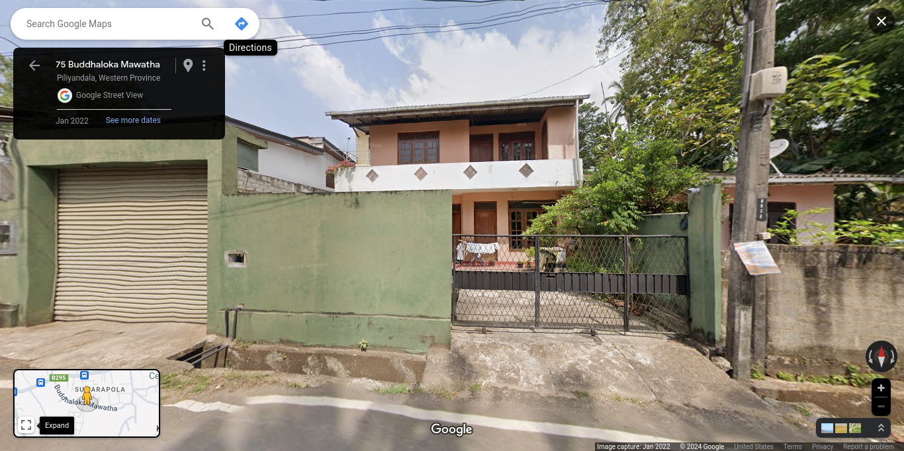

## Sinnapaduwa

**Sinnapaduwa** Grama Niladhari Division, **Mundel** Divisional Secretariat Division, **Puttalam** District, **North Western** Province

**Puttalam** Polling Division, **Puttalam** Electoral District

Population: 1,364 (2012)

(**LK-6218115**/597B)

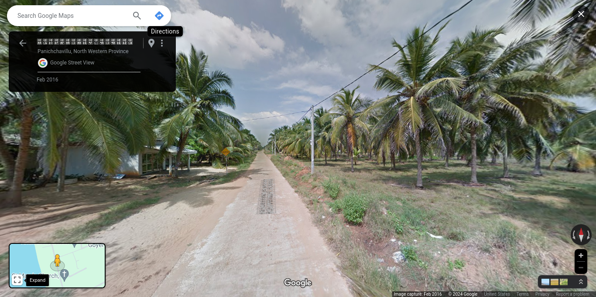

## Mottunna West

**Mottunna West** Grama Niladhari Division, **Mirigama** Divisional Secretariat Division, **Gampaha** District, **Western** Province

**Mirigama** Polling Division, **Gampaha** Electoral District

Population: 925 (2012)

(**LK-1212690**/339A)

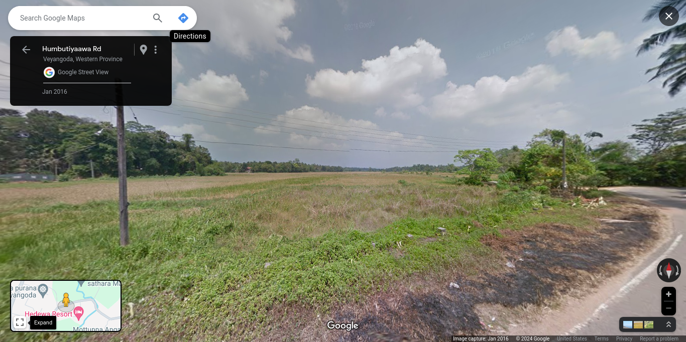

## Parape South

**Parape South** Grama Niladhari Division, **Rambukkana** Divisional Secretariat Division, **Kegalle** District, **Sabaragamuwa** Province

**Rambukkana** Polling Division, **Kegalle** Electoral District

Population: 983 (2012)

(**LK-9203120**/03F)

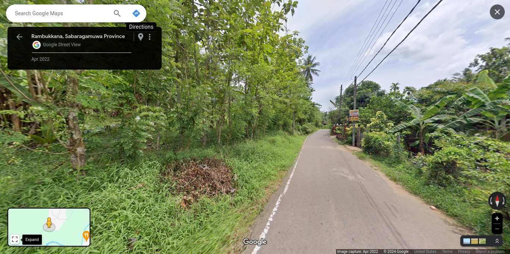

## Waharakgoda South

**Waharakgoda South** Grama Niladhari Division, **Beliatta** Divisional Secretariat Division, **Hambantota** District, **Southern** Province

**Beliatta** Polling Division, **Hambantota** Electoral District

Population: 439 (2012)

(**LK-3330100**/331)

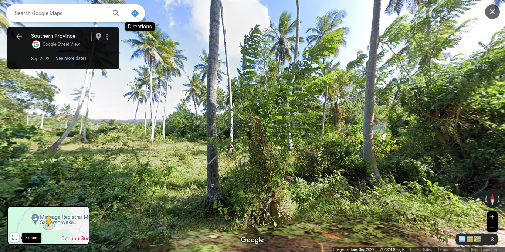

## Imayanan East

**Imayanan East** Grama Niladhari Division, **Vadamaradchi South-West (Karaveddy)** Divisional Secretariat Division, **Jaffna** District, **Northern** Province

**Udupiddy** Polling Division, **Jaffna** Electoral District

Population: 2,213 (2012)

(**LK-4121060**/J/359)

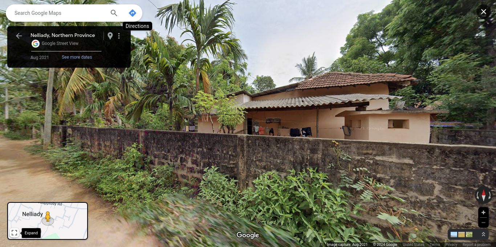

## Puwakgahakadawala

**Puwakgahakadawala** Grama Niladhari Division, **Bingiriya** Divisional Secretariat Division, **Kurunegala** District, **North Western** Province

**Bingiriya** Polling Division, **Kurunegala** Electoral District

Population: 888 (2012)

(**LK-6142050**/1447)

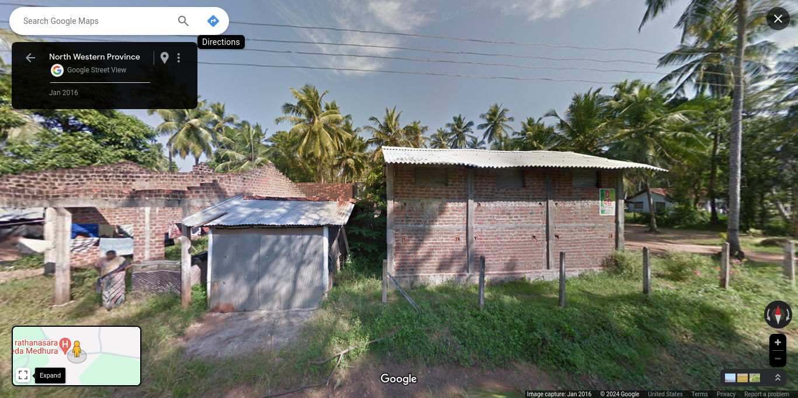

## Attiaddy

**Attiaddy** Grama Niladhari Division, **Jaffna** Divisional Secretariat Division, **Jaffna** District, **Northern** Province

**Jaffna** Polling Division, **Jaffna** Electoral District

Population: 1,911 (2012)

(**LK-4136090**/J/78)

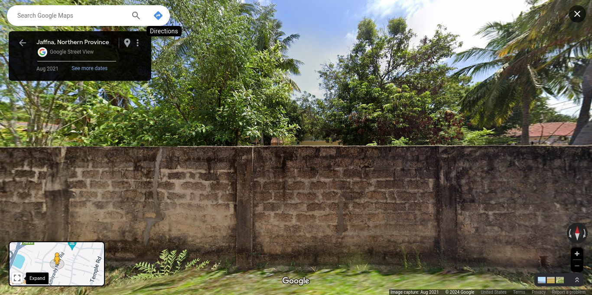

## Eravur 06A

**Eravur 06A** Grama Niladhari Division, **Eravur Town** Divisional Secretariat Division, **Batticaloa** District, **Eastern** Province

**Batticaloa** Polling Division, **Batticaloa** Electoral District

Population: 1,512 (2012)

(**LK-5115060**/192C)

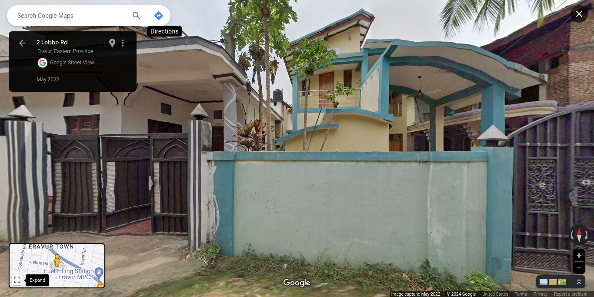

## Karasnagala South

**Karasnagala South** Grama Niladhari Division, **Attanagalla** Divisional Secretariat Division, **Gampaha** District, **Western** Province

**Attanagalla** Polling Division, **Gampaha** Electoral District

Population: 467 (2012)

(**LK-1227435**/365C)

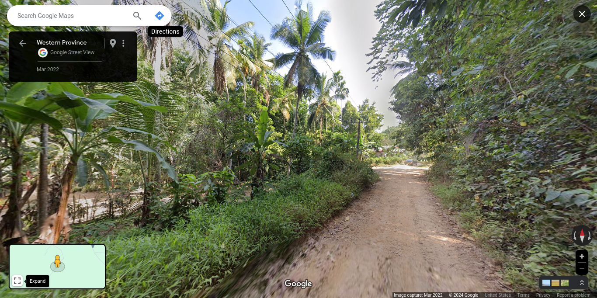

## Welihena North

**Welihena North** Grama Niladhari Division, **Katana** Divisional Secretariat Division, **Gampaha** District, **Western** Province

**Katana** Polling Division, **Gampaha** Electoral District

Population: 1,823 (2012)

(**LK-1206060**/69)

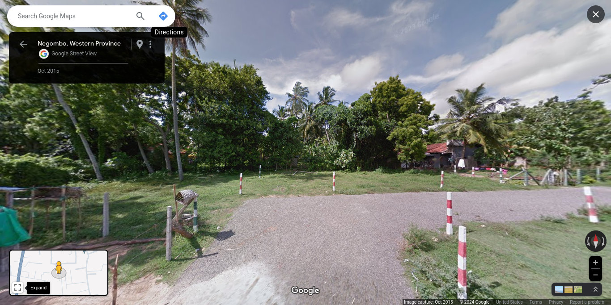

## Batagoda

**Batagoda** Grama Niladhari Division, **Millaniya** Divisional Secretariat Division, **Kalutara** District, **Western** Province

**Bandaragama** Polling Division, **Kalutara** Electoral District

Population: 1,133 (2012)

(**LK-1318150**/649)

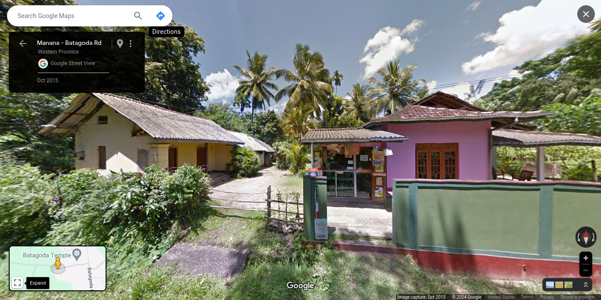

## Mallakam North

**Mallakam North** Grama Niladhari Division, **Valikamam North (Tellipallai)** Divisional Secretariat Division, **Jaffna** District, **Northern** Province

**Kayts** Polling Division, **Jaffna** Electoral District

Population: 2,493 (2012)

(**LK-4112015**/214)

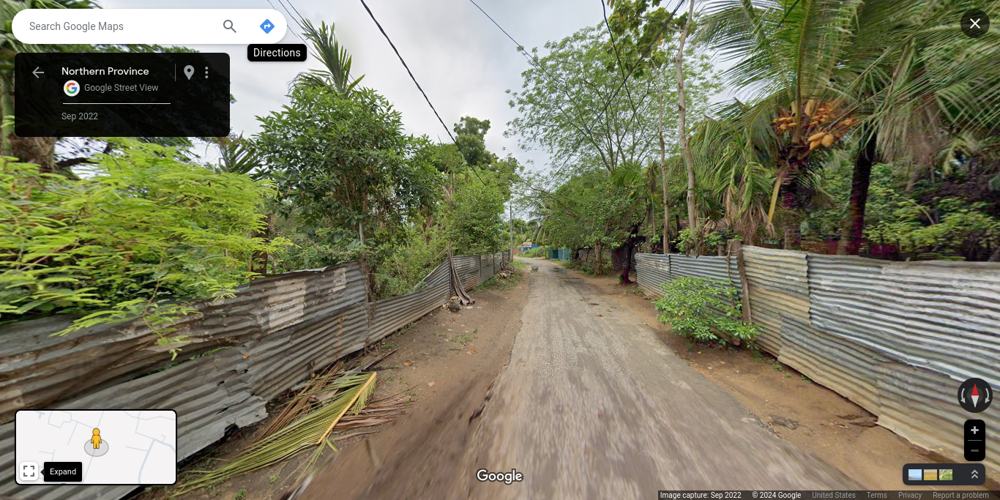

## Keselpotha North

**Keselpotha North** Grama Niladhari Division, **Rideemaliyadda** Divisional Secretariat Division, **Badulla** District, **Uva** Province

**Mahiyanganaya** Polling Division, **Badulla** Electoral District

Population: 1,960 (2012)

(**LK-8106020**/02B)

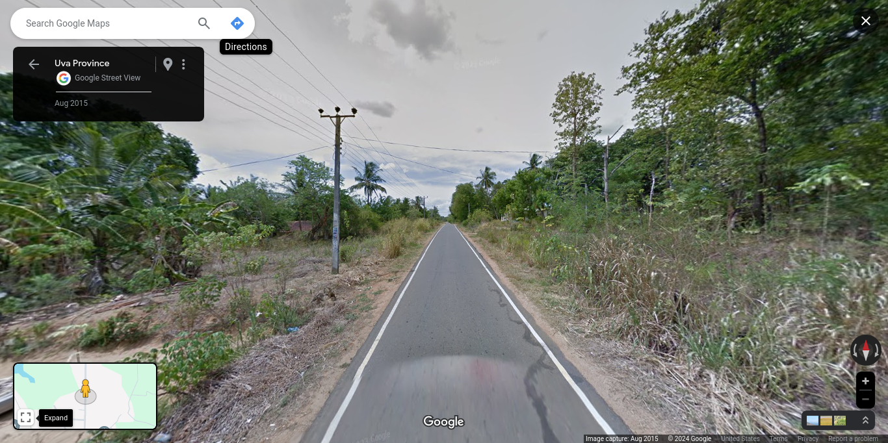

## Idamegama

**Idamegama** Grama Niladhari Division, **Uva Paranagama** Divisional Secretariat Division, **Badulla** District, **Uva** Province

**Uva Paranagama** Polling Division, **Badulla** Electoral District

Population: 809 (2012)

(**LK-8127150**/43C)

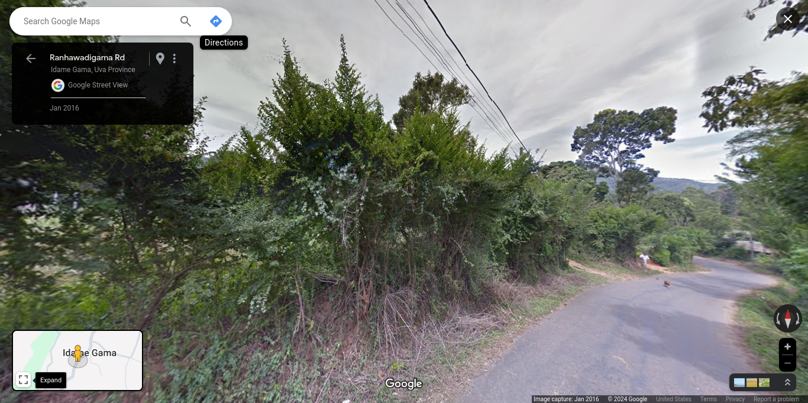

## Erlalai East

**Erlalai East** Grama Niladhari Division, **Valikamam South (Uduvil)** Divisional Secretariat Division, **Jaffna** District, **Northern** Province

**Manipay** Polling Division, **Jaffna** Electoral District

Population: 1,322 (2012)

(**LK-4115115**/J/204)

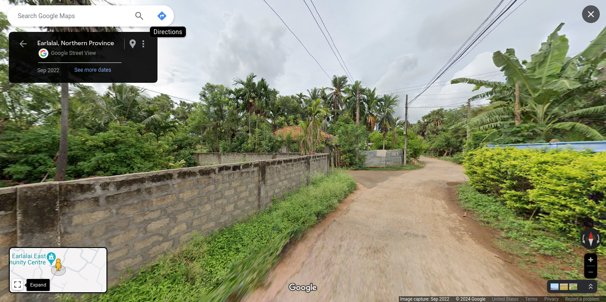

## Malwatta

**Malwatta** Grama Niladhari Division, **Matale** Divisional Secretariat Division, **Matale** District, **Central** Province

**Matale** Polling Division, **Matale** Electoral District

Population: 2,386 (2012)

(**LK-2218180**/E352D)

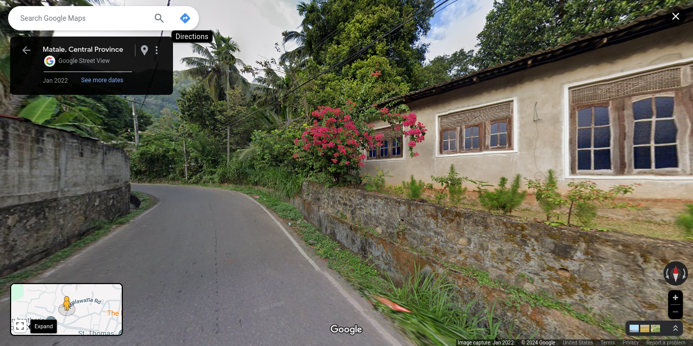

## Indurupathvila

**Indurupathvila** Grama Niladhari Division, **Baddegama** Divisional Secretariat Division, **Galle** District, **Southern** Province

**Baddegama** Polling Division, **Galle** Electoral District

Population: 1,170 (2012)

(**LK-3127130**/186A)

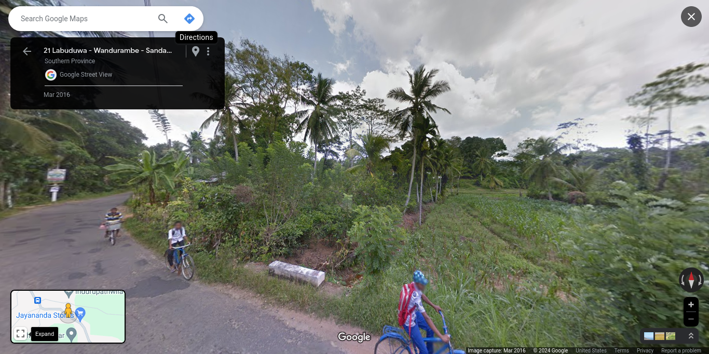

## Ampitithenna

**Ampitithenna** Grama Niladhari Division, **Haldummulla** Divisional Secretariat Division, **Badulla** District, **Uva** Province

**Haputale** Polling Division, **Badulla** Electoral District

Population: 988 (2012)

(**LK-8142080**/155K)

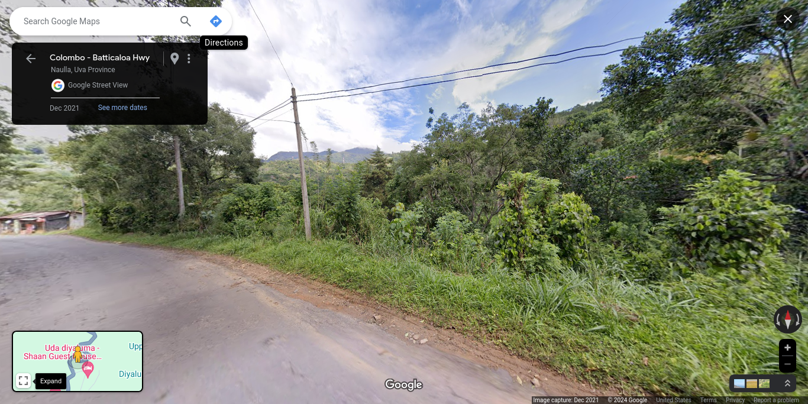

## Boralessa North

**Boralessa North** Grama Niladhari Division, **Wennappuwa** Divisional Secretariat Division, **Puttalam** District, **North Western** Province

**Wennappuwa** Polling Division, **Puttalam** Electoral District

Population: 993 (2012)

(**LK-6245170**/488B)

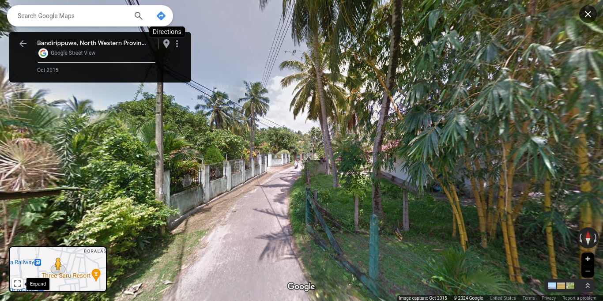

## Morenna

**Morenna** Grama Niladhari Division, **Gampaha** Divisional Secretariat Division, **Gampaha** District, **Western** Province

**Gampaha** Polling Division, **Gampaha** Electoral District

Population: 1,323 (2012)

(**LK-1224110**/230A)

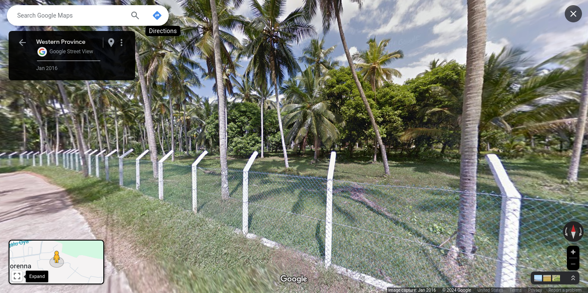

## Kohobagaskada

**Kohobagaskada** Grama Niladhari Division, **Kahatagasdigiliya** Divisional Secretariat Division, **Anuradhapura** District, **North Central** Province

**Horowpothana** Polling Division, **Anuradhapura** Electoral District

Population: 933 (2012)

(**LK-7121130**/220)

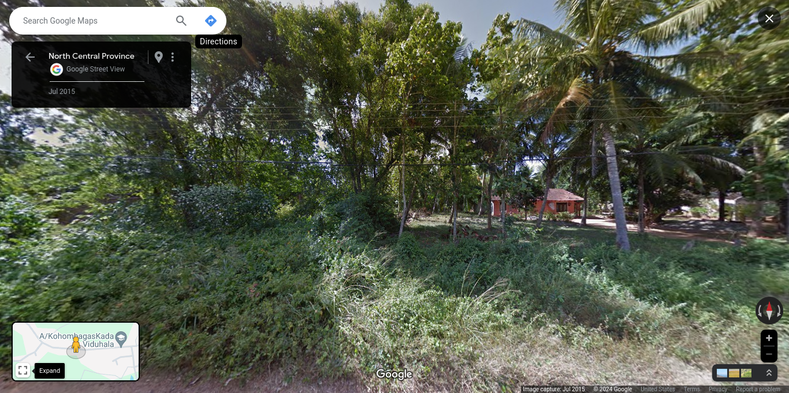

## Kadeweediya East

**Kadeweediya East** Grama Niladhari Division, **Matara Four Gravets** Divisional Secretariat Division, **Matara** District, **Southern** Province

**Matara** Polling Division, **Matara** Electoral District

Population: 2,064 (2012)

(**LK-3242195**/417A)

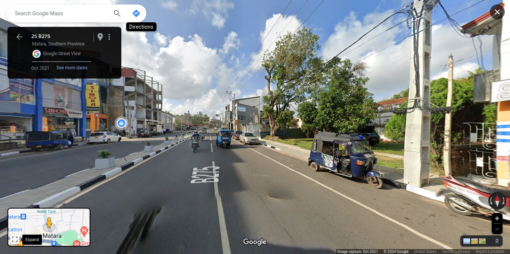

## Thalgasgoda

**Thalgasgoda** Grama Niladhari Division, **Mathugama** Divisional Secretariat Division, **Kalutara** District, **Western** Province

**Mathugama** Polling Division, **Kalutara** Electoral District

Population: 2,080 (2012)

(**LK-1330240**/771B)

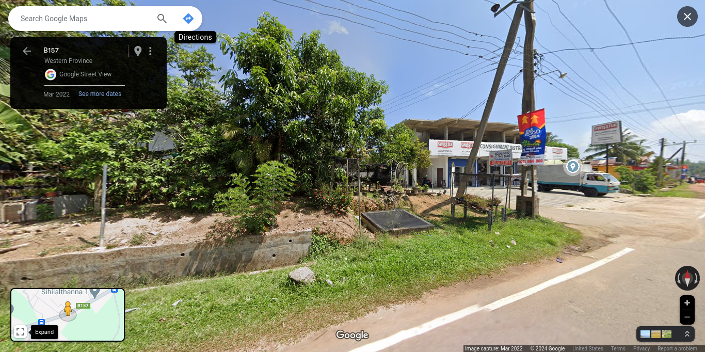

## Chunnakam Town North

**Chunnakam Town North** Grama Niladhari Division, **Valikamam South (Uduvil)** Divisional Secretariat Division, **Jaffna** District, **Northern** Province

**Manipay** Polling Division, **Jaffna** Electoral District

Population: 1,227 (2012)

(**LK-4115070**/J/195)

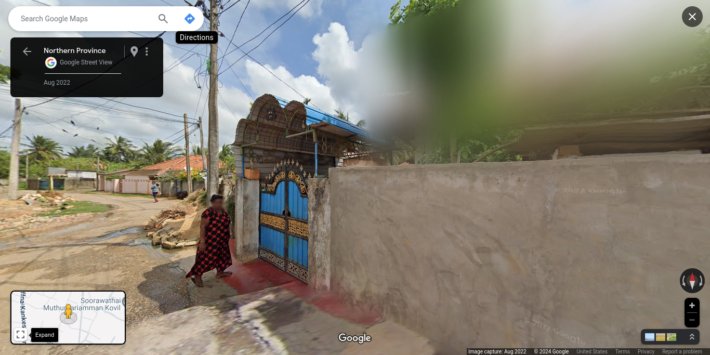

## Pahala Imbulgoda East

**Pahala Imbulgoda East** Grama Niladhari Division, **Gampaha** Divisional Secretariat Division, **Gampaha** District, **Western** Province

**Gampaha** Polling Division, **Gampaha** Electoral District

Population: 986 (2012)

(**LK-1224460**/243)

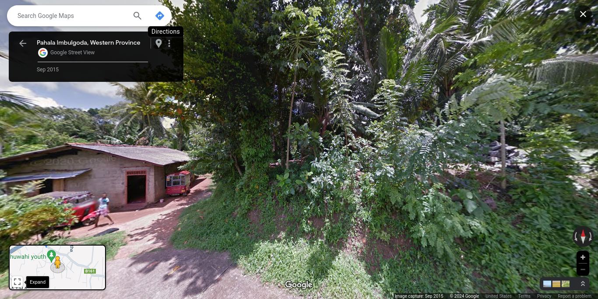

## Warakagoda

**Warakagoda** Grama Niladhari Division, **Udunuwara** Divisional Secretariat Division, **Kandy** District, **Central** Province

**Udunuwara** Polling Division, **Kandy** Electoral District

Population: 566 (2012)

(**LK-2139085**/86)

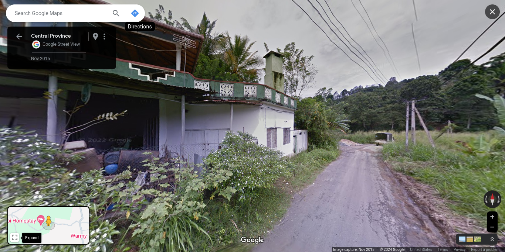

## Yaddigama

**Yaddigama** Grama Niladhari Division, **Maho** Divisional Secretariat Division, **Kurunegala** District, **North Western** Province

**Yapahuwa** Polling Division, **Kurunegala** Electoral District

Population: 847 (2012)

(**LK-6124030**/136)

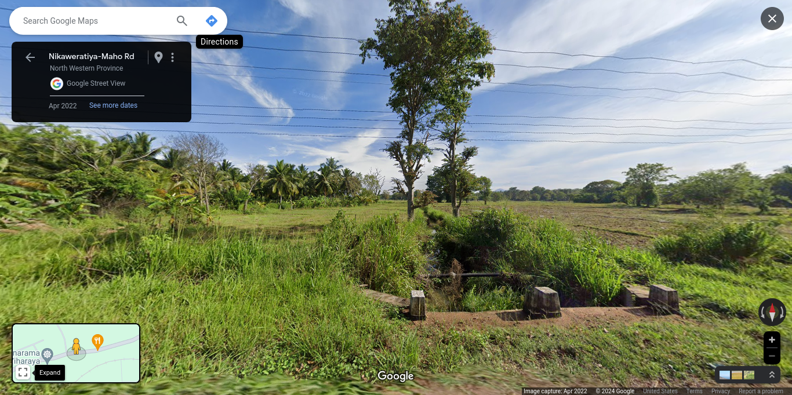

## Munagama West

**Munagama West** Grama Niladhari Division, **Horana** Divisional Secretariat Division, **Kalutara** District, **Western** Province

**Horana** Polling Division, **Kalutara** Electoral District

Population: 1,129 (2012)

(**LK-1309265**/616)

## Kurunduwatta

**Kurunduwatta** Grama Niladhari Division, **Thimbirigasyaya** Divisional Secretariat Division, **Colombo** District, **Western** Province

**Borella** Polling Division, **Colombo** Electoral District

Population: 9,865 (2012)

(**LK-1127015**/)

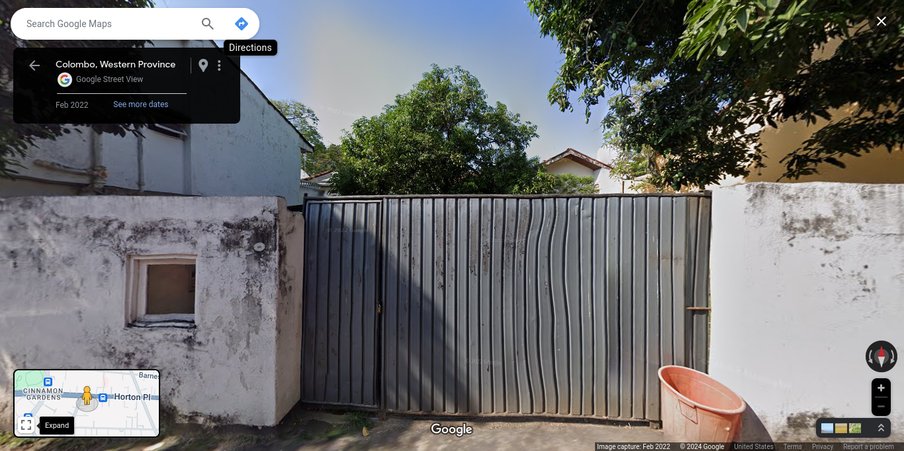

## Buddhiyagama North

**Buddhiyagama North** Grama Niladhari Division, **Weeraketiya** Divisional Secretariat Division, **Hambantota** District, **Southern** Province

**Mulkirigala** Polling Division, **Hambantota** Electoral District

Population: 876 (2012)

(**LK-3321185**/440)

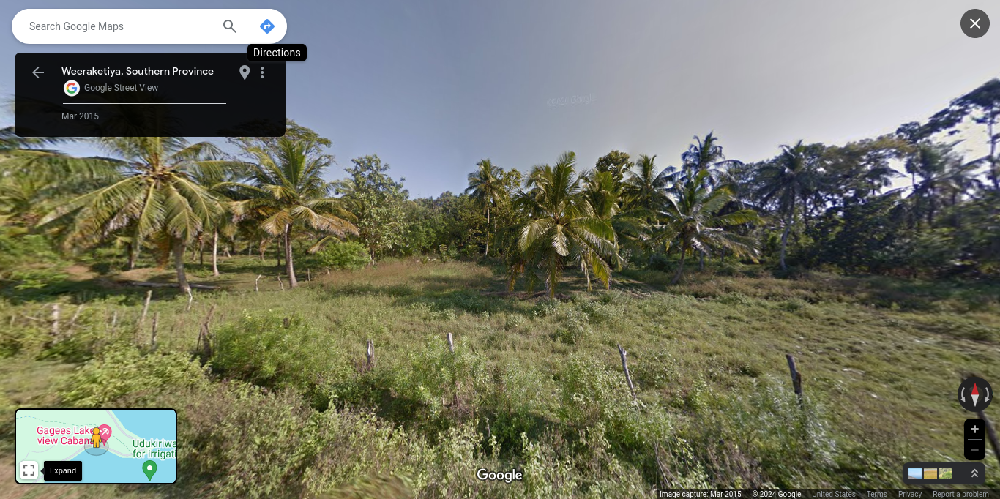

## Gothatuwa New Town

**Gothatuwa New Town** Grama Niladhari Division, **Kolonnawa** Divisional Secretariat Division, **Colombo** District, **Western** Province

**Kolonnawa** Polling Division, **Colombo** Electoral District

Population: 1,944 (2012)

(**LK-1106190**/505B)

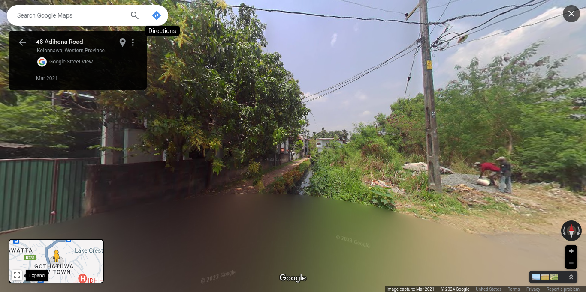

## Meethotamulla

**Meethotamulla** Grama Niladhari Division, **Kolonnawa** Divisional Secretariat Division, **Colombo** District, **Western** Province

**Kolonnawa** Polling Division, **Colombo** Electoral District

Population: 8,432 (2012)

(**LK-1106035**/510)

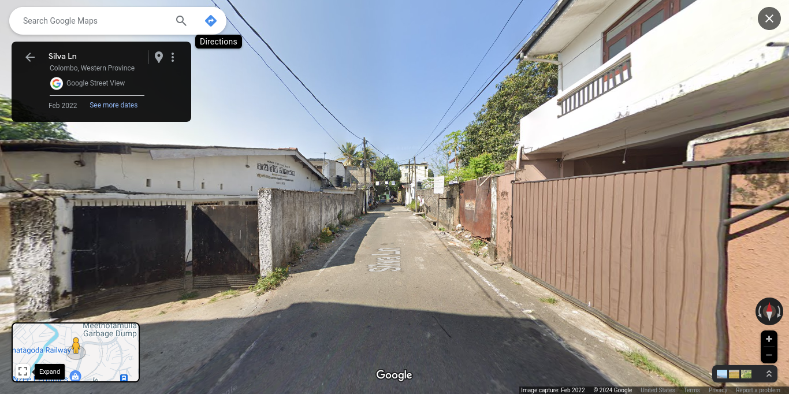

## Walgampatha

**Walgampatha** Grama Niladhari Division, **Ruwanwella** Divisional Secretariat Division, **Kegalle** District, **Sabaragamuwa** Province

**Ruwanwella** Polling Division, **Kegalle** Electoral District

Population: 906 (2012)

(**LK-9221015**/98)

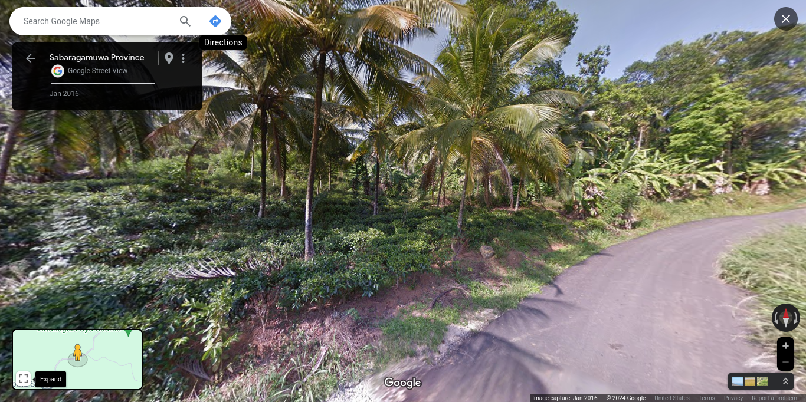

## Millagaspitiya

**Millagaspitiya** Grama Niladhari Division, **Udapalatha** Divisional Secretariat Division, **Kandy** District, **Central** Province

**Gampola** Polling Division, **Kandy** Electoral District

Population: 1,001 (2012)

(**LK-2151150**/1172)

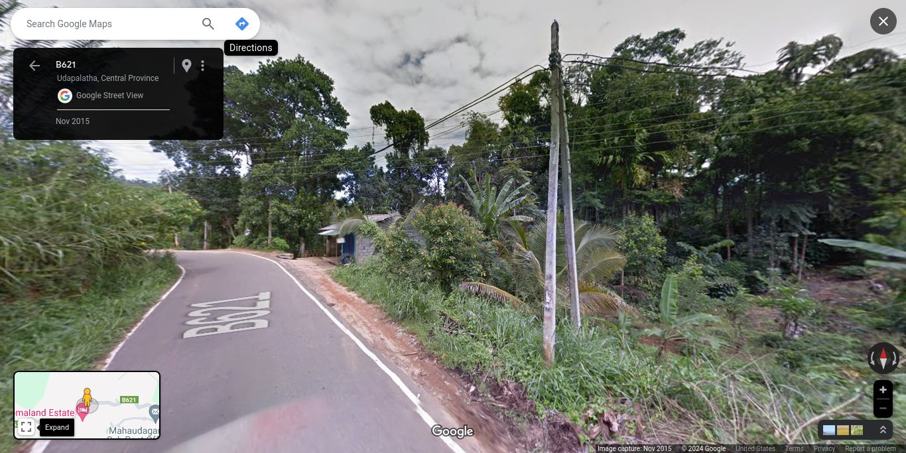

## Brandigampala

**Brandigampala** Grama Niladhari Division, **Seethawaka** Divisional Secretariat Division, **Colombo** District, **Western** Province

**Avissawella** Polling Division, **Colombo** Electoral District

Population: 1,173 (2012)

(**LK-1115220**/440A)

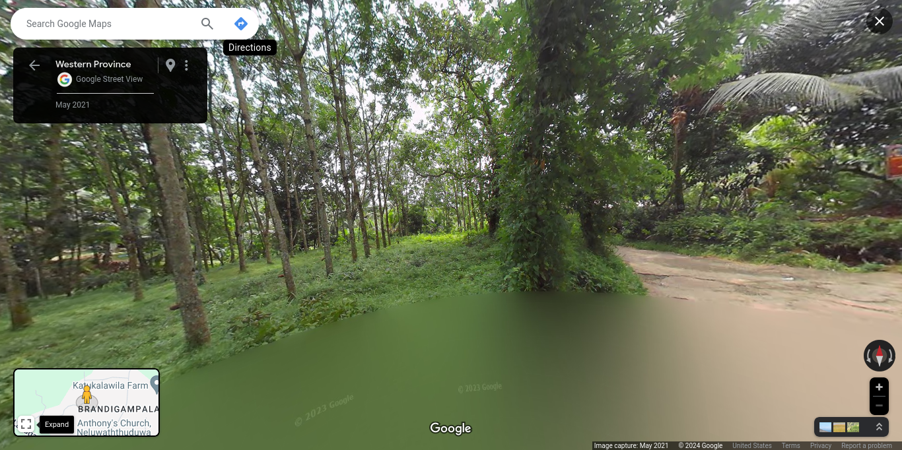

## Ampitiya Pallegama

**Ampitiya Pallegama** Grama Niladhari Division, **Kandy Four Gravets & Gangawata Korale** Divisional Secretariat Division, **Kandy** District, **Central** Province

**Senkadagala** Polling Division, **Kandy** Electoral District

Population: 2,620 (2012)

(**LK-2130245**/271)

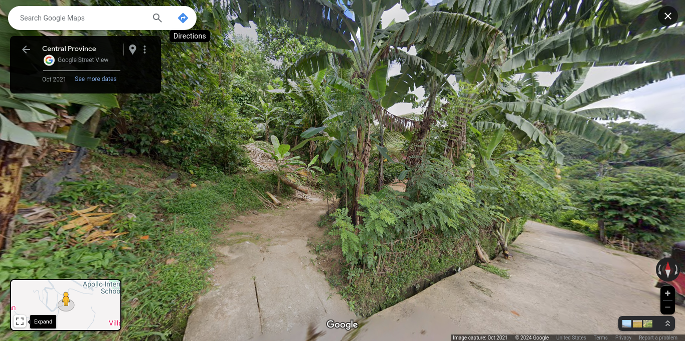

## Batadoowa west

**Batadoowa west** Grama Niladhari Division, **Akmeemana** Divisional Secretariat Division, **Galle** District, **Southern** Province

**Akmeemana** Polling Division, **Galle** Electoral District

Population: 1,317 (2012)

(**LK-3145285**/113A)

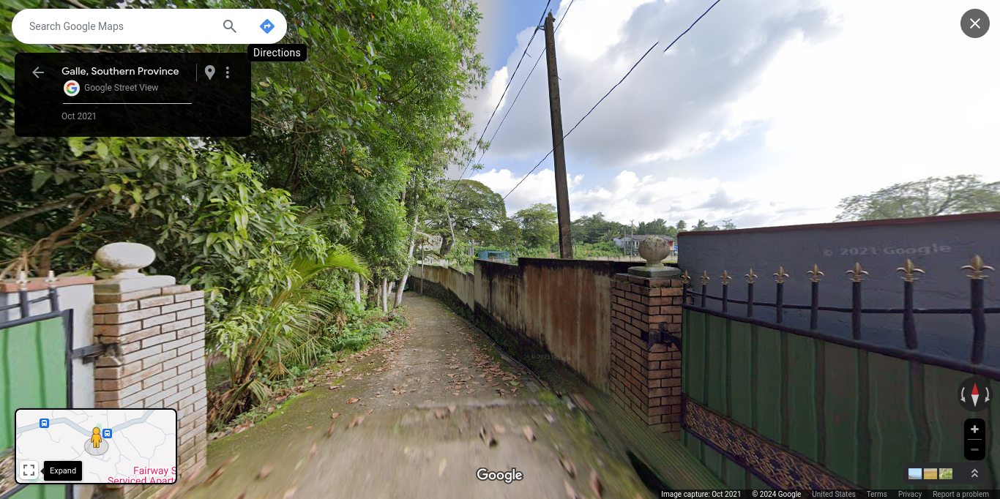

## Kerangapokuna

**Kerangapokuna** Grama Niladhari Division, **Wattala** Divisional Secretariat Division, **Gampaha** District, **Western** Province

**Wattala** Polling Division, **Gampaha** Electoral District

Population: 3,226 (2012)

(**LK-1218130**/177A)

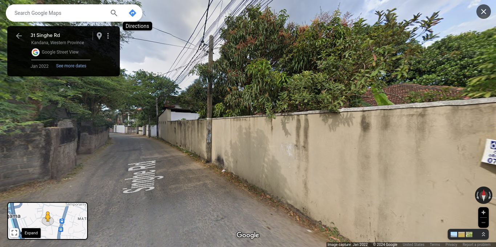

## Katuwalamulla North

**Katuwalamulla North** Grama Niladhari Division, **Gampaha** Divisional Secretariat Division, **Gampaha** District, **Western** Province

**Gampaha** Polling Division, **Gampaha** Electoral District

Population: 1,808 (2012)

(**LK-1224435**/244C)

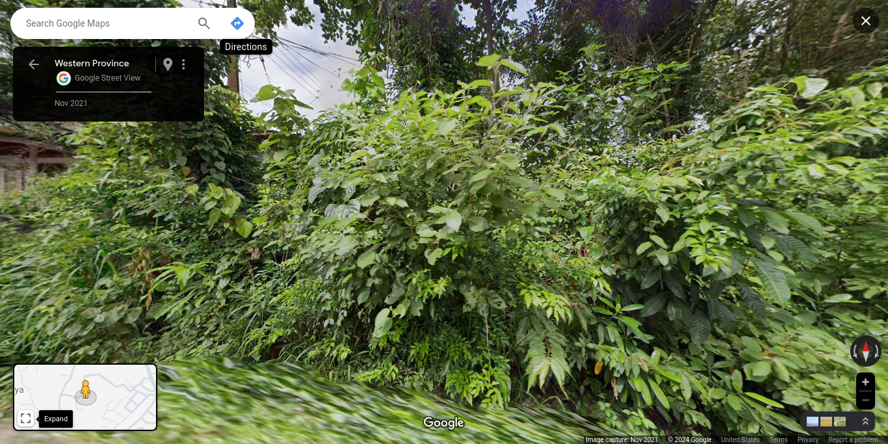

## Mulendiyawala

**Mulendiyawala** Grama Niladhari Division, **Embilipitiya** Divisional Secretariat Division, **Ratnapura** District, **Sabaragamuwa** Province

**Kolonna** Polling Division, **Ratnapura** Electoral District

Population: 2,394 (2012)

(**LK-9148155**/213A)

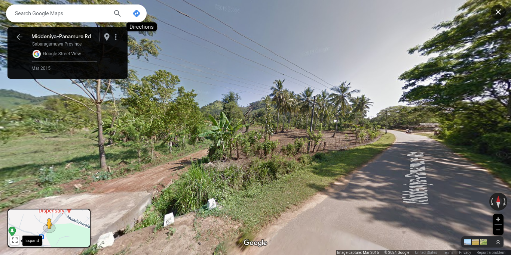

## Kadalana

**Kadalana** Grama Niladhari Division, **Moratuwa** Divisional Secretariat Division, **Colombo** District, **Western** Province

**Moratuwa** Polling Division, **Colombo** Electoral District

Population: 3,544 (2012)

(**LK-1133105**/558A)

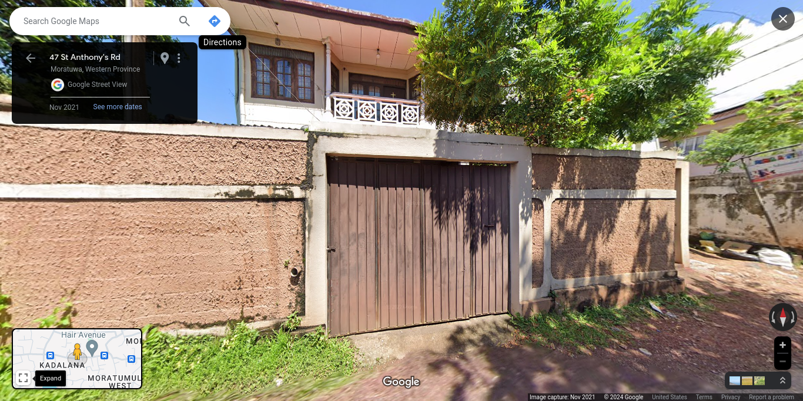

## Thandavanveli

**Thandavanveli** Grama Niladhari Division, **Manmunai North** Divisional Secretariat Division, **Batticaloa** District, **Eastern** Province

**Batticaloa** Polling Division, **Batticaloa** Electoral District

Population: 2,907 (2012)

(**LK-5118130**/177)

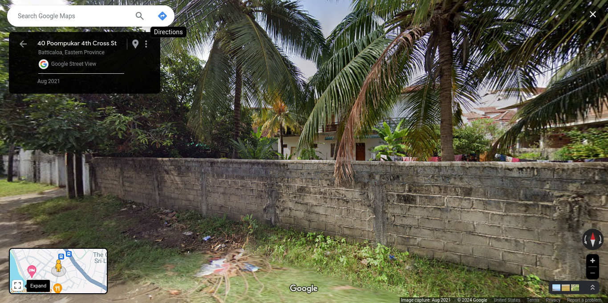

## Nedalagamuwa North

**Nedalagamuwa North** Grama Niladhari Division, **Pannala** Divisional Secretariat Division, **Kurunegala** District, **North Western** Province

**Katugampola** Polling Division, **Kurunegala** Electoral District

Population: 1,632 (2012)

(**LK-6178120**/1537)

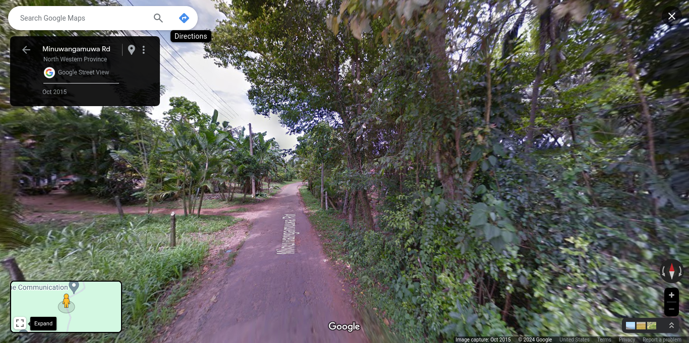

## pelmadulla Town

**pelmadulla Town** Grama Niladhari Division, **Pelmadulla** Divisional Secretariat Division, **Ratnapura** District, **Sabaragamuwa** Province

**Pelmadulla** Polling Division, **Ratnapura** Electoral District

Population: 2,677 (2012)

(**LK-9124125**/168A)

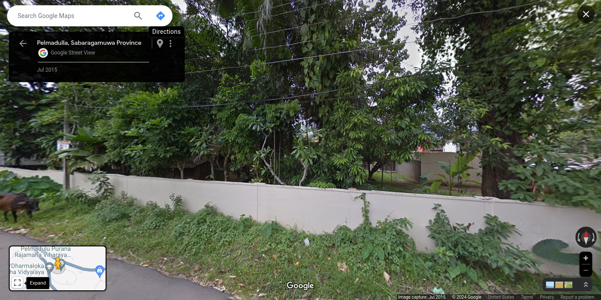

## Kottawa

**Kottawa** Grama Niladhari Division, **Yakkalamulla** Divisional Secretariat Division, **Galle** District, **Southern** Province

**Baddegama** Polling Division, **Galle** Electoral District

Population: 1,283 (2012)

(**LK-3148075**/176)

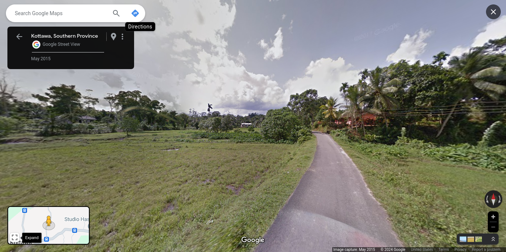

## Raddoluwa South

**Raddoluwa South** Grama Niladhari Division, **Katana** Divisional Secretariat Division, **Gampaha** District, **Western** Province

**Katana** Polling Division, **Gampaha** Electoral District

Population: 3,062 (2012)

(**LK-1206360**/199A)

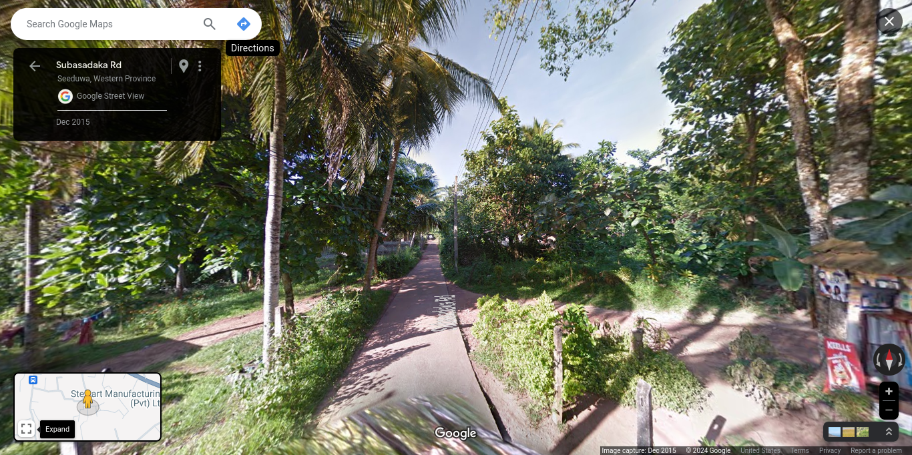

## Ranpokunagama D Zone

**Ranpokunagama D Zone** Grama Niladhari Division, **Attanagalla** Divisional Secretariat Division, **Gampaha** District, **Western** Province

**Attanagalla** Polling Division, **Gampaha** Electoral District

Population: 1,156 (2012)

(**LK-1227225**/349E)

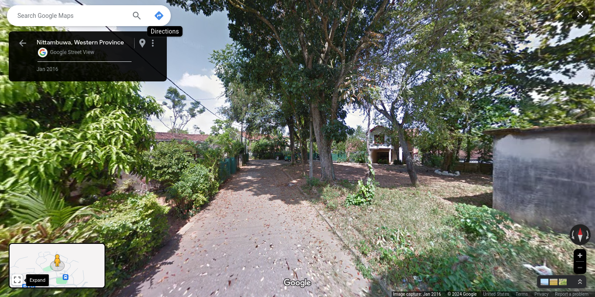

## Solama

**Solama** Grama Niladhari Division, **Thambuttegama** Divisional Secretariat Division, **Anuradhapura** District, **North Central** Province

**Kalawewa** Polling Division, **Anuradhapura** Electoral District

Population: 1,129 (2012)

(**LK-7145020**/434)

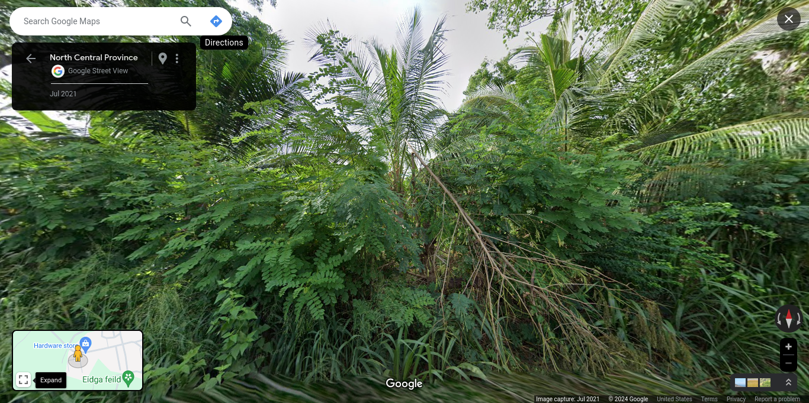

## Mattegoda Central 'B'

**Mattegoda Central 'B'** Grama Niladhari Division, **Homagama** Divisional Secretariat Division, **Colombo** District, **Western** Province

**Homagama** Polling Division, **Colombo** Electoral District

Population: 2,968 (2012)

(**LK-1112310**/587B)

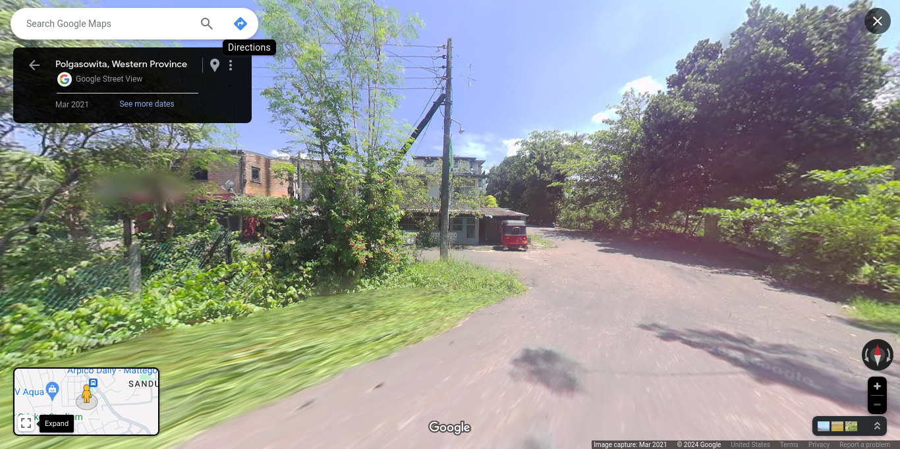

## Divulpitiya West

**Divulpitiya West** Grama Niladhari Division, **Kesbewa** Divisional Secretariat Division, **Colombo** District, **Western** Province

**Kesbewa** Polling Division, **Colombo** Electoral District

Population: 2,631 (2012)

(**LK-1136020**/535B)

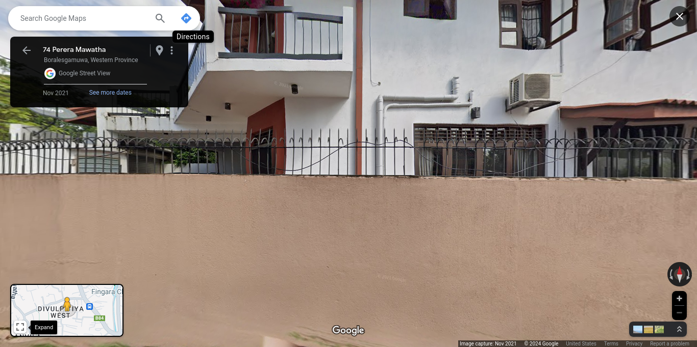

## Uhumeeya

**Uhumeeya** Grama Niladhari Division, **Weerambugedara** Divisional Secretariat Division, **Kurunegala** District, **North Western** Province

**Polgahawela** Polling Division, **Kurunegala** Electoral District

Population: 1,278 (2012)

(**LK-6166120**/843)

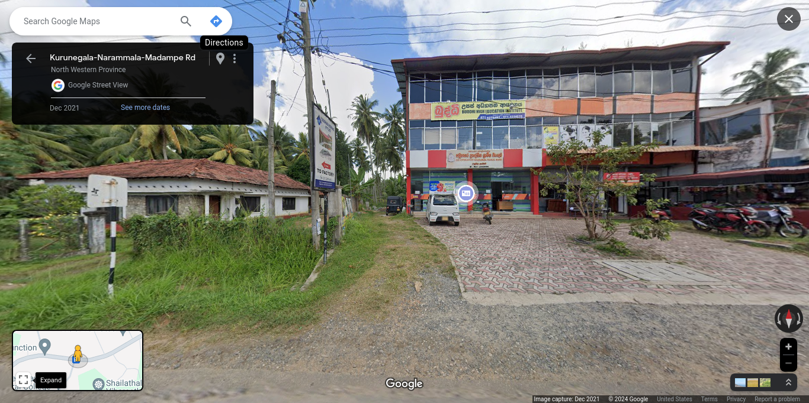

## Nedungamuwa

**Nedungamuwa** Grama Niladhari Division, **Welimada** Divisional Secretariat Division, **Badulla** District, **Uva** Province

**Welimada** Polling Division, **Badulla** Electoral District

Population: 1,967 (2012)

(**LK-8130175**/52)

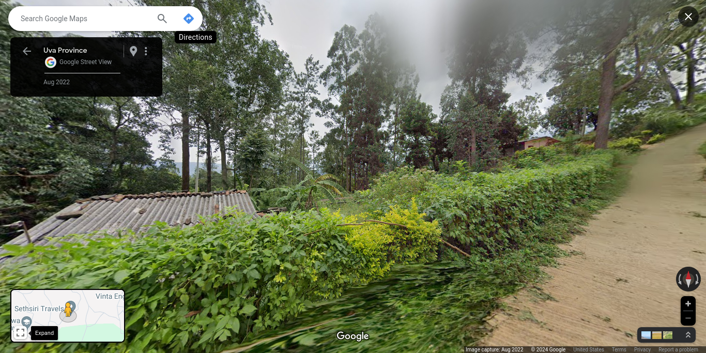

## Weeragama

**Weeragama** Grama Niladhari Division, **Hingurakgoda** Divisional Secretariat Division, **Polonnaruwa** District, **North Central** Province

**Minneriya** Polling Division, **Polonnaruwa** Electoral District

Population: 772 (2012)

(**LK-7203235**/44)

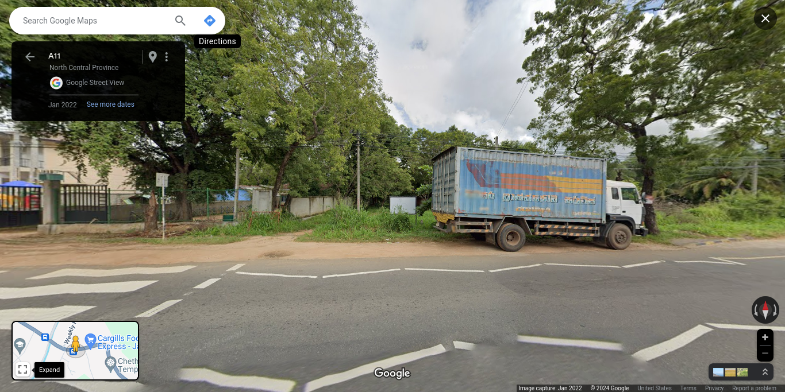

## Maha Buthgamuwa B

**Maha Buthgamuwa B** Grama Niladhari Division, **Kolonnawa** Divisional Secretariat Division, **Colombo** District, **Western** Province

**Kolonnawa** Polling Division, **Colombo** Electoral District

Population: 3,703 (2012)

(**LK-1106055**/506C)

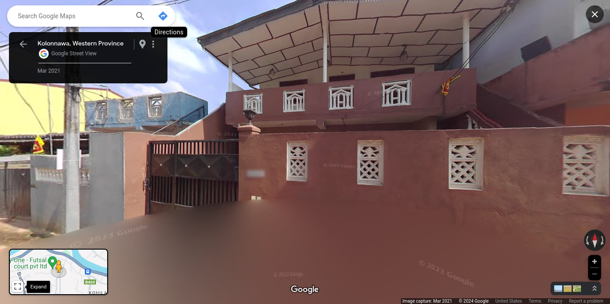

## Bambarenda West

**Bambarenda West** Grama Niladhari Division, **Dickwella** Divisional Secretariat Division, **Matara** District, **Southern** Province

**Devinuwara** Polling Division, **Matara** Electoral District

Population: 1,020 (2012)

(**LK-3248200**/441A)

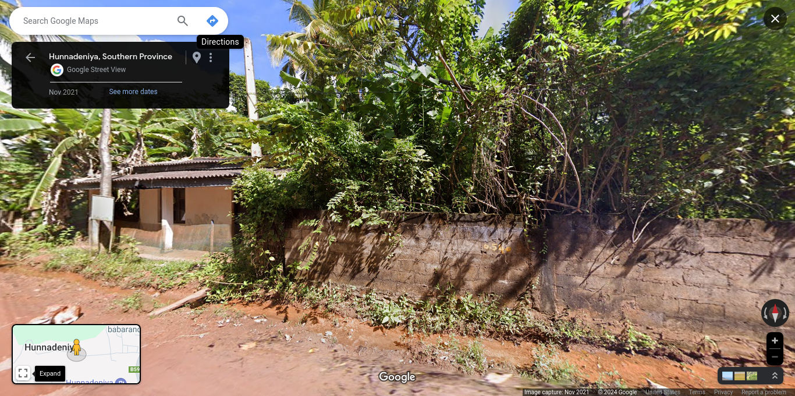

## Kahapola

**Kahapola** Grama Niladhari Division, **Kesbewa** Divisional Secretariat Division, **Colombo** District, **Western** Province

**Kesbewa** Polling Division, **Colombo** Electoral District

Population: 3,283 (2012)

(**LK-1136365**/598)

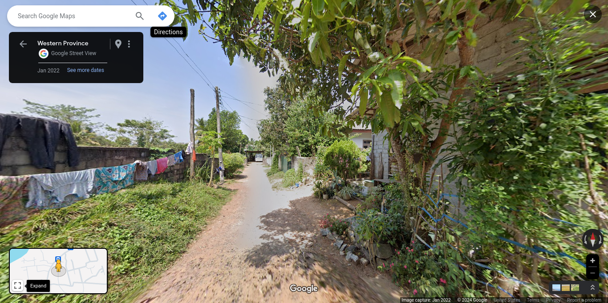

## Mirihana South

**Mirihana South** Grama Niladhari Division, **Maharagama** Divisional Secretariat Division, **Colombo** District, **Western** Province

**Maharagama** Polling Division, **Colombo** Electoral District

Population: 6,043 (2012)

(**LK-1121005**/523A)

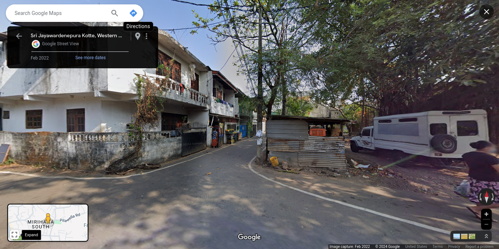

## Yatawathura

**Yatawathura** Grama Niladhari Division, **Padukka** Divisional Secretariat Division, **Colombo** District, **Western** Province

**Avissawella** Polling Division, **Colombo** Electoral District

Population: 764 (2012)

(**LK-1118205**/468)

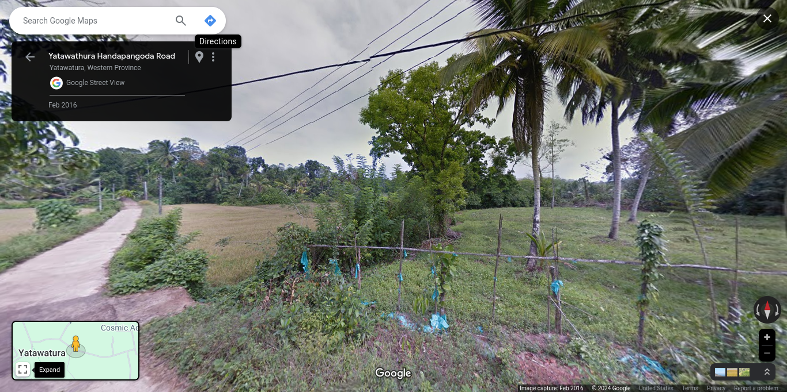

## Kahagolla

**Kahagolla** Grama Niladhari Division, **Haputale** Divisional Secretariat Division, **Badulla** District, **Uva** Province

**Haputale** Polling Division, **Badulla** Electoral District

Population: 2,120 (2012)

(**LK-8139030**/64)

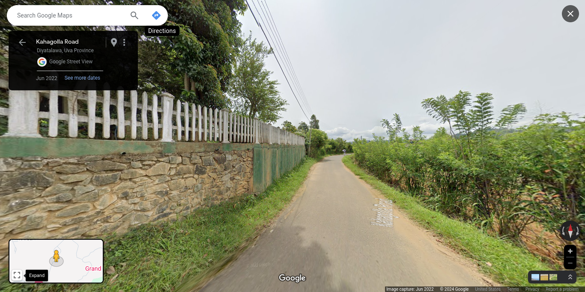

## Indipokunagoda North

**Indipokunagoda North** Grama Niladhari Division, **Tangalle** Divisional Secretariat Division, **Hambantota** District, **Southern** Province

**Tangalle** Polling Division, **Hambantota** Electoral District

Population: 1,921 (2012)

(**LK-3333235**/270)

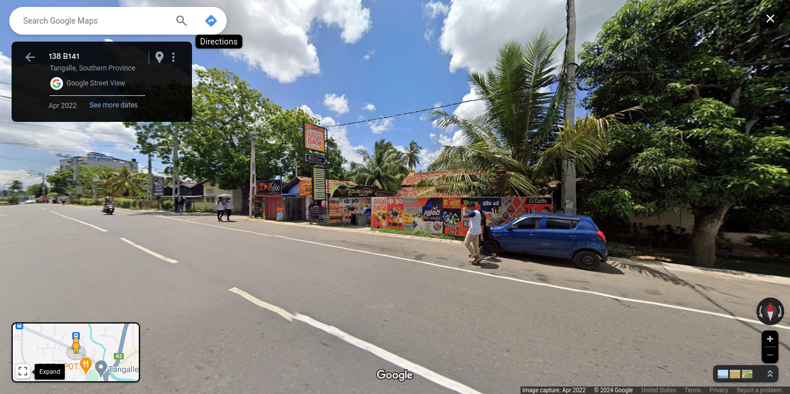

## Palavi

**Palavi** Grama Niladhari Division, **Thenmaradchi (Chavakachcheri)** Divisional Secretariat Division, **Jaffna** District, **Northern** Province

**Chavakachcheri** Polling Division, **Jaffna** Electoral District

Population: 1,018 (2012)

(**LK-4130190**/J/325)

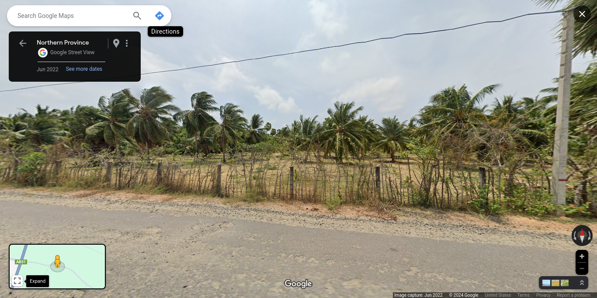

## Selvanayahapuram

**Selvanayahapuram** Grama Niladhari Division, **Trincomalee Town and Gravets** Divisional Secretariat Division, **Trincomalee** District, **Eastern** Province

**Trincomalee** Polling Division, **Trincomalee** Electoral District

Population: 2,220 (2012)

(**LK-5315095**/243M)

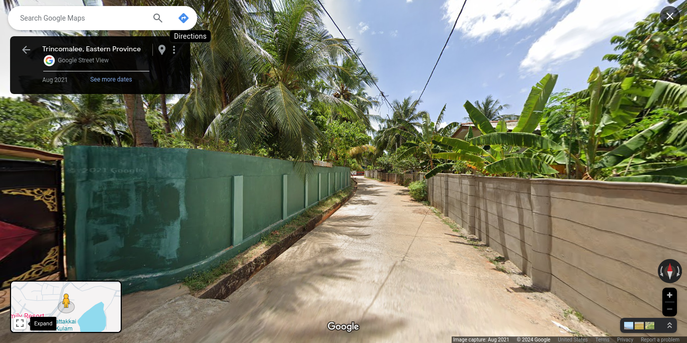

## Kanumale

**Kanumale** Grama Niladhari Division, **Weerambugedara** Divisional Secretariat Division, **Kurunegala** District, **North Western** Province

**Polgahawela** Polling Division, **Kurunegala** Electoral District

Population: 2,177 (2012)

(**LK-6166135**/855)

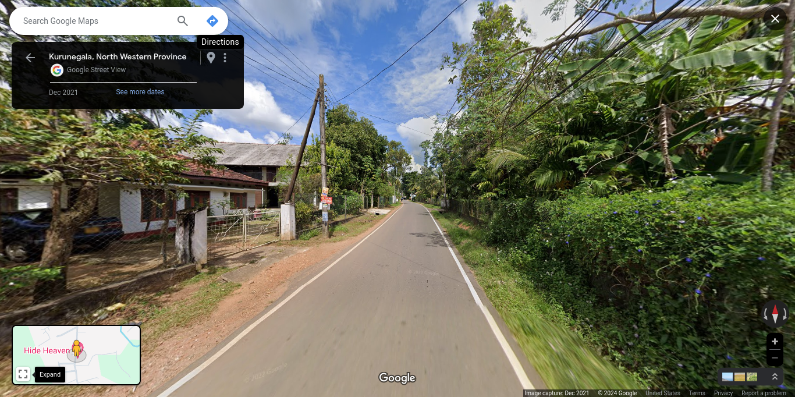

## Walpita South

**Walpita South** Grama Niladhari Division, **Baddegama** Divisional Secretariat Division, **Galle** District, **Southern** Province

**Baddegama** Polling Division, **Galle** Electoral District

Population: 1,127 (2012)

(**LK-3127260**/206A)

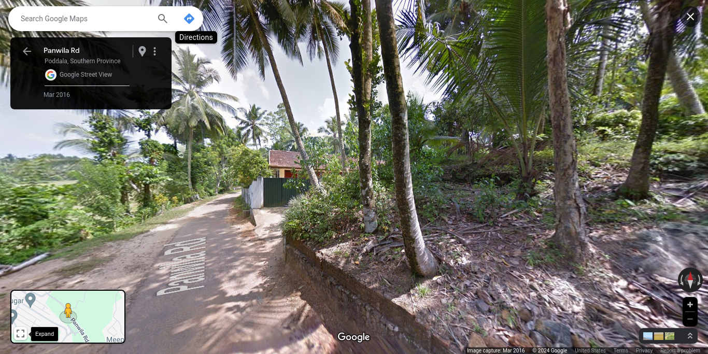

## Mavadichenai

**Mavadichenai** Grama Niladhari Division, **Koralai Pattu Central** Divisional Secretariat Division, **Batticaloa** District, **Eastern** Province

**Kalkudah** Polling Division, **Batticaloa** Electoral District

Population: 2,810 (2012)

(**LK-5104040**/208A)

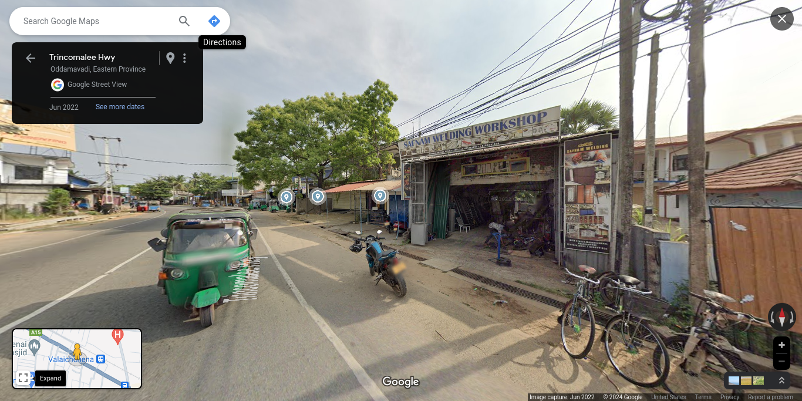

## Peliyagodawatta

**Peliyagodawatta** Grama Niladhari Division, **Kelaniya** Divisional Secretariat Division, **Gampaha** District, **Western** Province

**Kelaniya** Polling Division, **Gampaha** Electoral District

Population: 3,688 (2012)

(**LK-1236125**/174A)

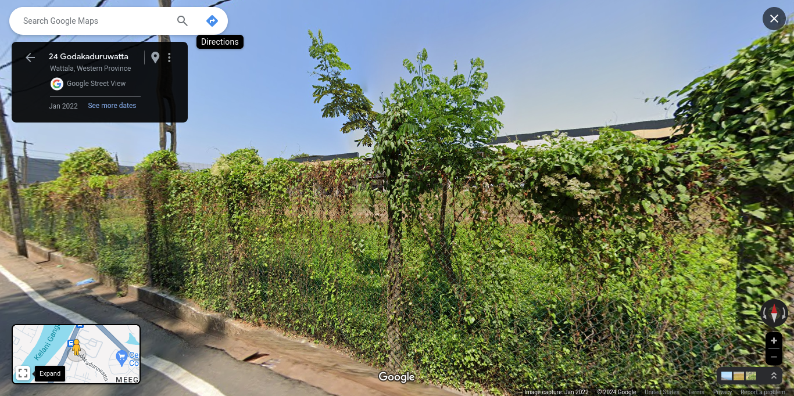

## Ambadeniya

**Ambadeniya** Grama Niladhari Division, **Mawanella** Divisional Secretariat Division, **Kegalle** District, **Sabaragamuwa** Province

**Mawanella** Polling Division, **Kegalle** Electoral District

Population: 1,013 (2012)

(**LK-9206280**/37B)

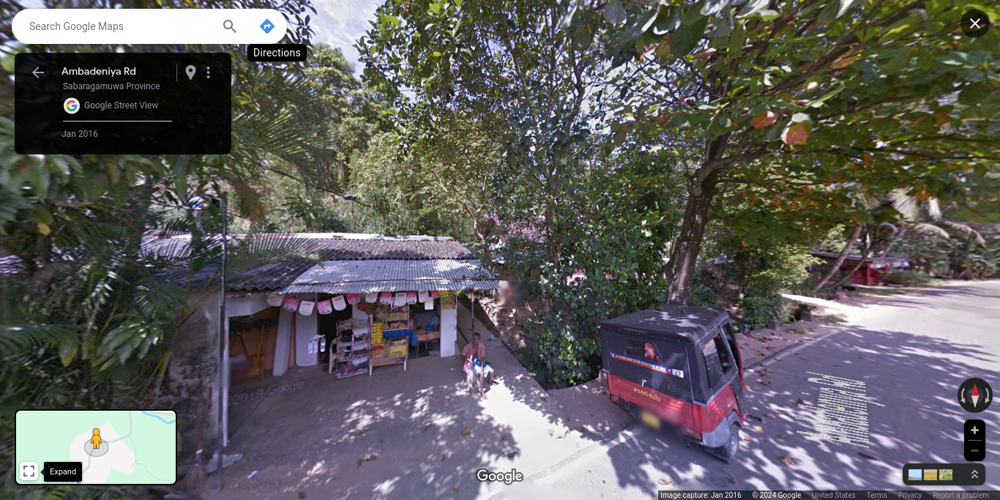

## Udadigana

**Udadigana** Grama Niladhari Division, **Maspotha** Divisional Secretariat Division, **Kurunegala** District, **North Western** Province

**Kurunegala** Polling Division, **Kurunegala** Electoral District

Population: 559 (2012)

(**LK-6151145**/801)

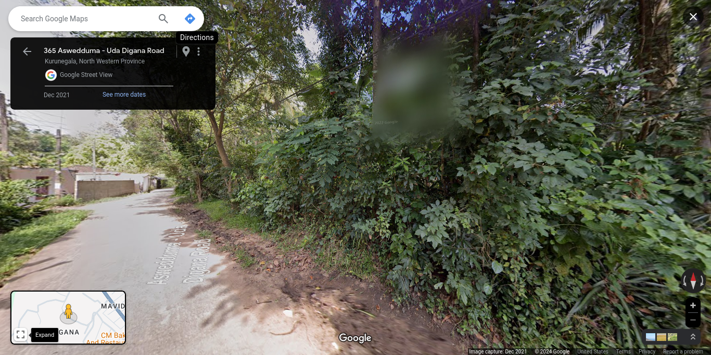

## Sainthamaruthu 04

**Sainthamaruthu 04** Grama Niladhari Division, **Sainthamaruthu** Divisional Secretariat Division, **Ampara** District, **Eastern** Province

**Kalmunai** Polling Division, **Digamadulla** Electoral District

Population: 1,325 (2012)

(**LK-5225020**/KP/52B)

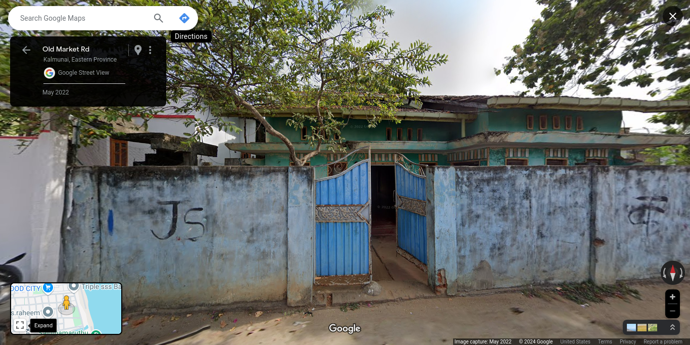

## Batugedara

**Batugedara** Grama Niladhari Division, **Ratnapura** Divisional Secretariat Division, **Ratnapura** District, **Sabaragamuwa** Province

**Ratnapura** Polling Division, **Ratnapura** Electoral District

Population: 1,989 (2012)

(**LK-9112250**/181)

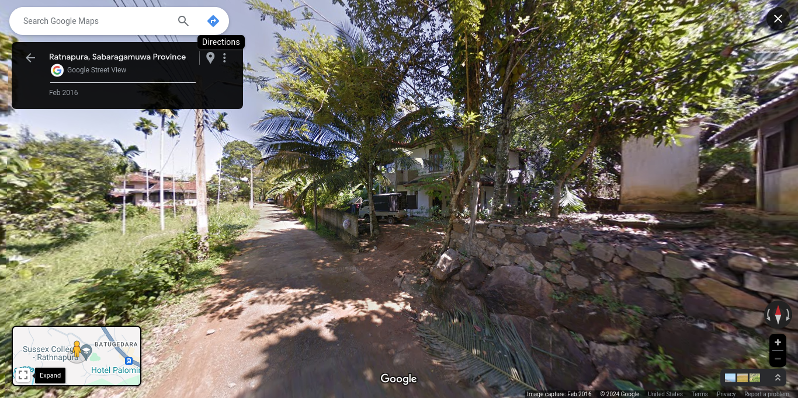

## Cheena Koratuwa

**Cheena Koratuwa** Grama Niladhari Division, **Galle Four Gravets** Divisional Secretariat Division, **Galle** District, **Southern** Province

**Galle** Polling Division, **Galle** Electoral District

Population: 1,051 (2012)

(**LK-3139225**/96G)

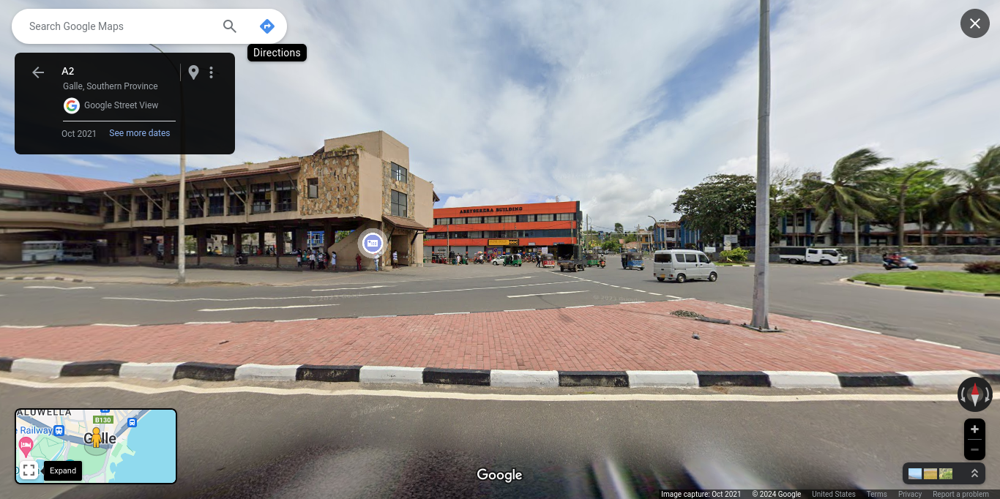

## Kotugoda 1

**Kotugoda 1** Grama Niladhari Division, **Minuwangoda** Divisional Secretariat Division, **Gampaha** District, **Western** Province

**Minuwangoda** Polling Division, **Gampaha** Electoral District

Population: 968 (2012)

(**LK-1215580**/119)

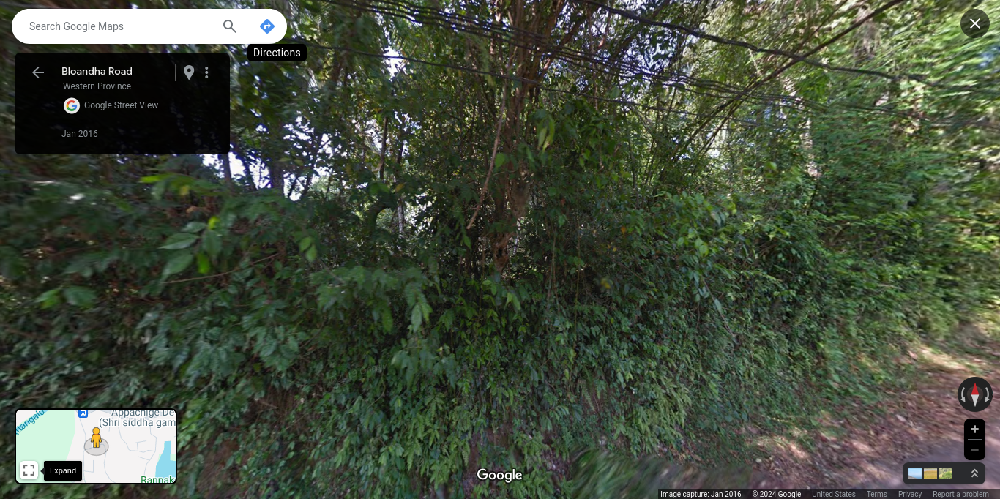

## Pahala Imbulgoda East

**Pahala Imbulgoda East** Grama Niladhari Division, **Gampaha** Divisional Secretariat Division, **Gampaha** District, **Western** Province

**Gampaha** Polling Division, **Gampaha** Electoral District

Population: 986 (2012)

(**LK-1224460**/243)

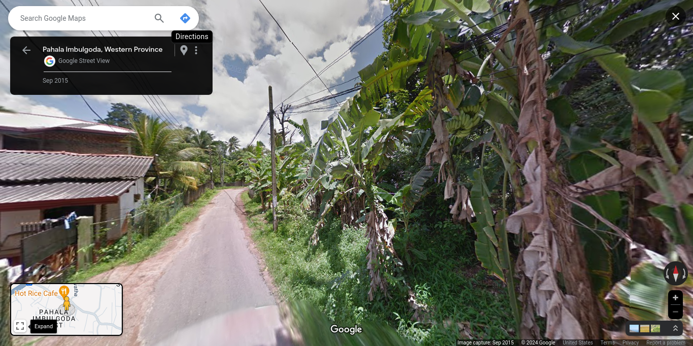

## Springvalley Estate

**Springvalley Estate** Grama Niladhari Division, **Hali-Ela** Divisional Secretariat Division, **Badulla** District, **Uva** Province

**Hali Ela** Polling Division, **Badulla** Electoral District

Population: 1,626 (2012)

(**LK-8124175**/86B)

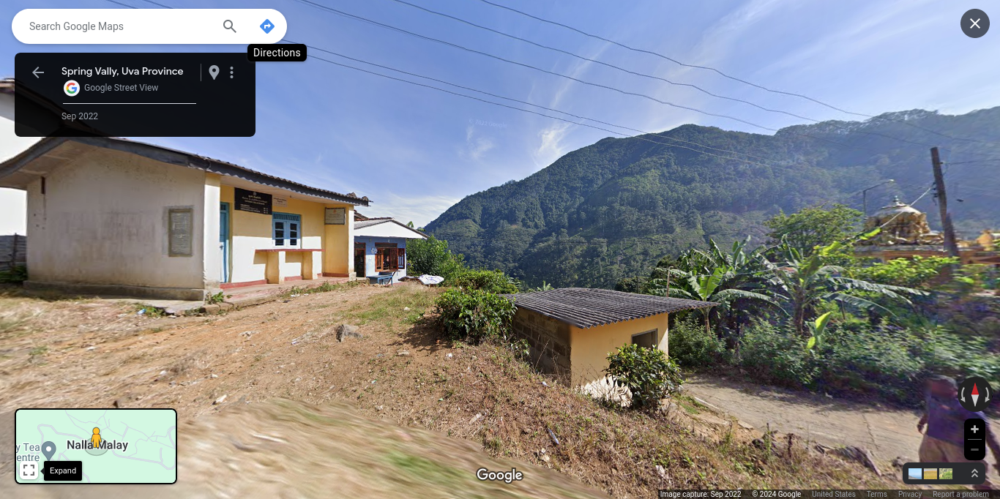

## Badulupitiya

**Badulupitiya** Grama Niladhari Division, **Badulla** Divisional Secretariat Division, **Badulla** District, **Uva** Province

**Badulla** Polling Division, **Badulla** Electoral District

Population: 5,153 (2012)

(**LK-8121065**/78J)

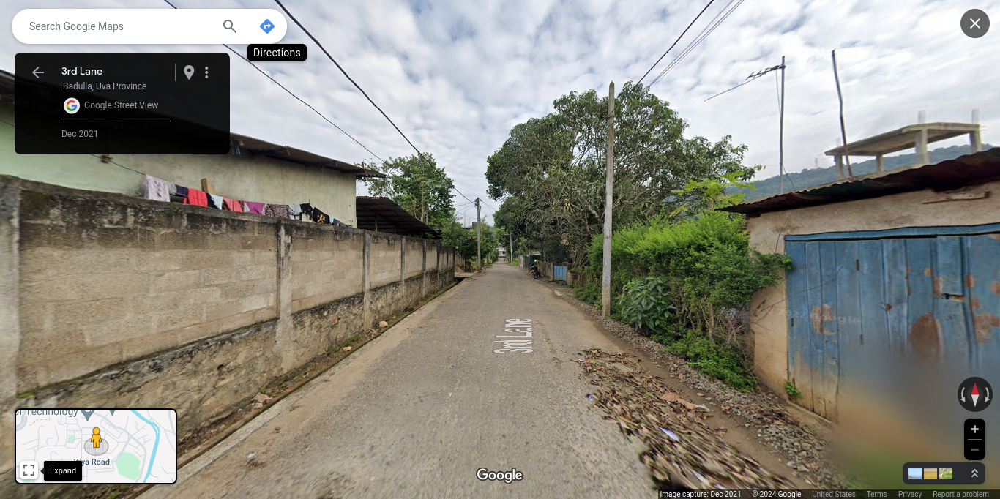

## Ketakumbura

**Ketakumbura** Grama Niladhari Division, **Udunuwara** Divisional Secretariat Division, **Kandy** District, **Central** Province

**Udunuwara** Polling Division, **Kandy** Electoral District

Population: 1,565 (2012)

(**LK-2139455**/56)

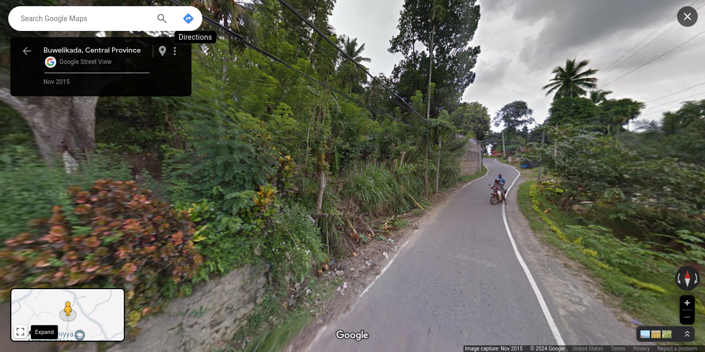

## Kolamunna

**Kolamunna** Grama Niladhari Division, **Kesbewa** Divisional Secretariat Division, **Colombo** District, **Western** Province

**Kesbewa** Polling Division, **Colombo** Electoral District

Population: 3,633 (2012)

(**LK-1136230**/563/73A)

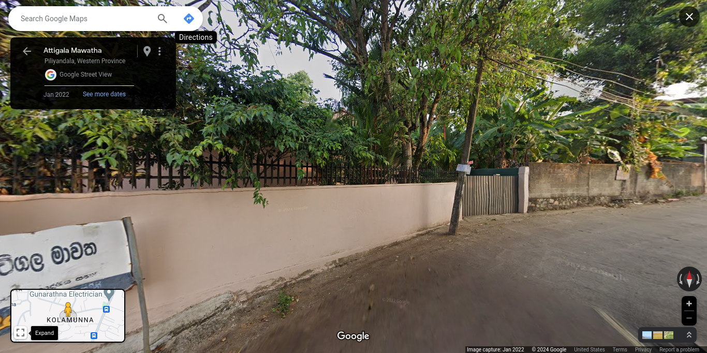

## Ulapane North

**Ulapane North** Grama Niladhari Division, **Ganga Ihala Korale** Divisional Secretariat Division, **Kandy** District, **Central** Province

**Nawalapitiya** Polling Division, **Kandy** Electoral District

Population: 2,177 (2012)

(**LK-2154110**/1071)

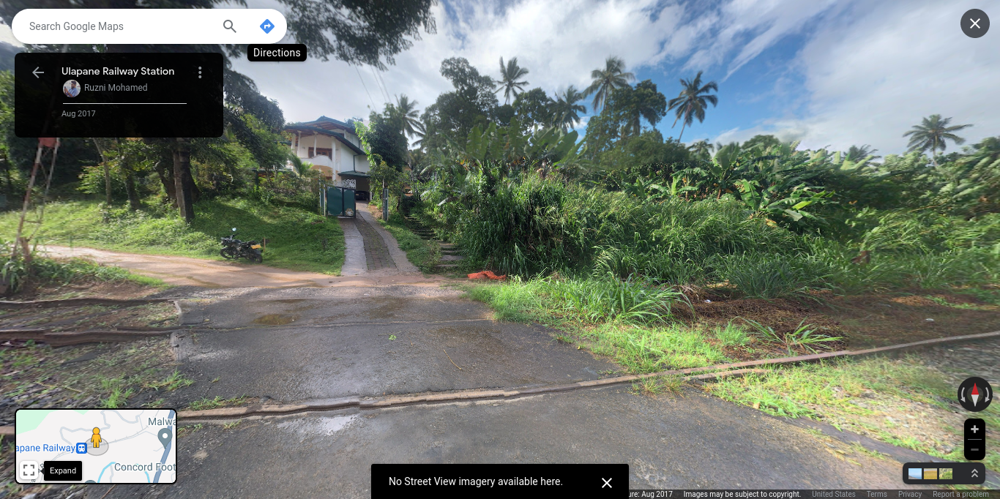

## Barandana

**Barandana** Grama Niladhari Division, **Mawathagama** Divisional Secretariat Division, **Kurunegala** District, **North Western** Province

**Mawathagama** Polling Division, **Kurunegala** Electoral District

Population: 783 (2012)

(**LK-6160010**/704)

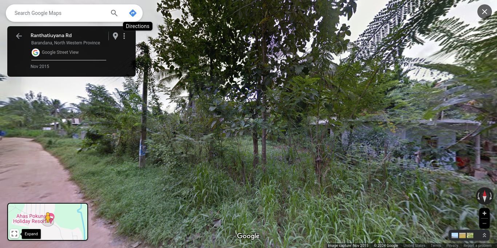

## Barathipuram

**Barathipuram** Grama Niladhari Division, **Muttur** Divisional Secretariat Division, **Trincomalee** District, **Eastern** Province

**Muttur** Polling Division, **Trincomalee** Electoral District

Population: 1,248 (2012)

(**LK-5327195**/218G)

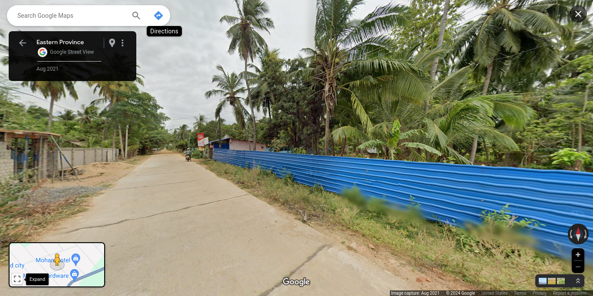

## Ingiriya North

**Ingiriya North** Grama Niladhari Division, **Ingiriya** Divisional Secretariat Division, **Kalutara** District, **Western** Province

**Horana** Polling Division, **Kalutara** Electoral District

Population: 2,658 (2012)

(**LK-1310090**/620C)

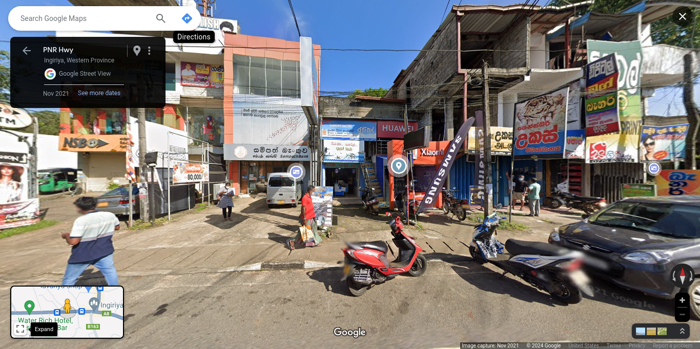

## Mahawatta

**Mahawatta** Grama Niladhari Division, **Colombo** Divisional Secretariat Division, **Colombo** District, **Western** Province

**Colombo North** Polling Division, **Colombo** Electoral District

Population: 8,809 (2012)

(**LK-1103025**/)

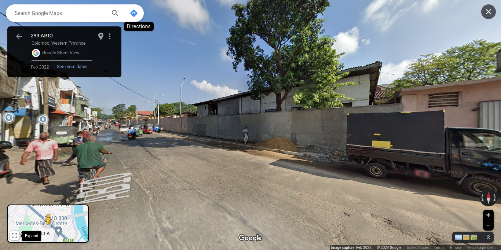

## Kandegama

**Kandegama** Grama Niladhari Division, **Deltota** Divisional Secretariat Division, **Kandy** District, **Central** Province

**Hewaheta** Polling Division, **Kandy** Electoral District

Population: 218 (2012)

(**LK-2148080**/1046)

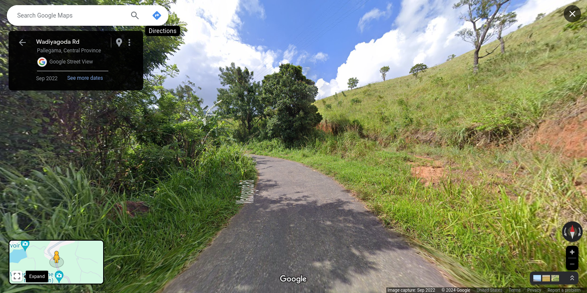

## Mayadunna

**Mayadunna** Grama Niladhari Division, **Uhana** Divisional Secretariat Division, **Ampara** District, **Eastern** Province

**Ampara** Polling Division, **Digamadulla** Electoral District

Population: 2,337 (2012)

(**LK-5212055**/W/104A)

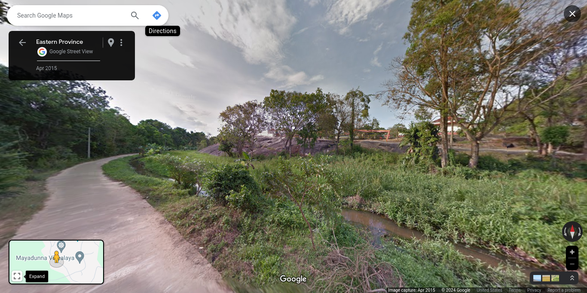

## Ariyalai North West

**Ariyalai North West** Grama Niladhari Division, **Nallur** Divisional Secretariat Division, **Jaffna** District, **Northern** Province

**Nallur** Polling Division, **Jaffna** Electoral District

Population: 1,831 (2012)

(**LK-4133015**/J/91)

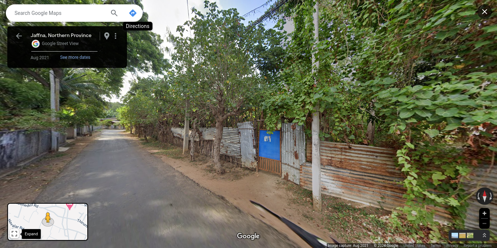

## Soragune

**Soragune** Grama Niladhari Division, **Haldummulla** Divisional Secretariat Division, **Badulla** District, **Uva** Province

**Haputale** Polling Division, **Badulla** Electoral District

Population: 587 (2012)

(**LK-8142110**/157)

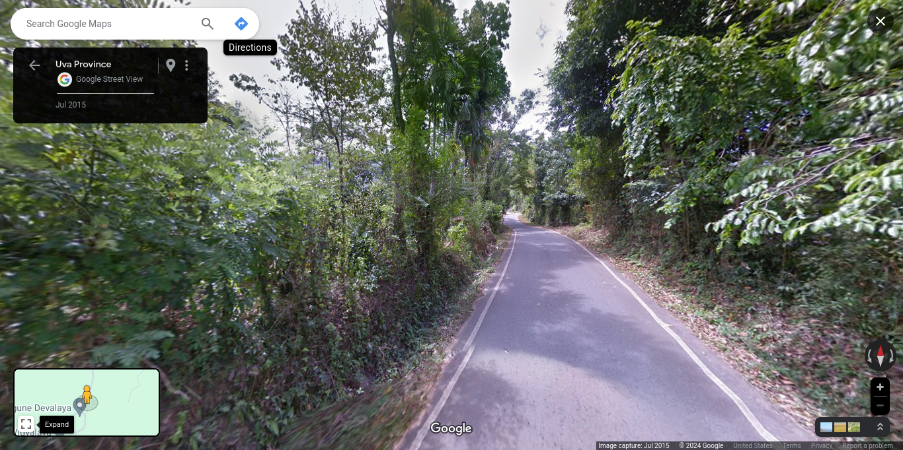

## Yakagala

**Yakagala** Grama Niladhari Division, **Angunakolapelessa** Divisional Secretariat Division, **Hambantota** District, **Southern** Province

**Tangalle** Polling Division, **Hambantota** Electoral District

Population: 2,508 (2012)

(**LK-3318225**/189)

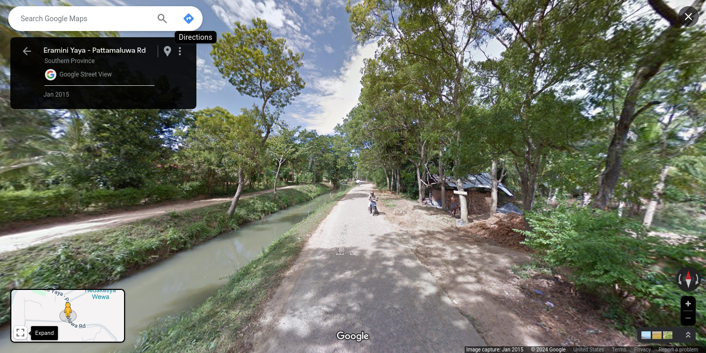

## Neelawala

**Neelawala** Grama Niladhari Division, **Pathahewaheta** Divisional Secretariat Division, **Kandy** District, **Central** Province

**Hewaheta** Polling Division, **Kandy** Electoral District

Population: 624 (2012)

(**LK-2145365**/1020)

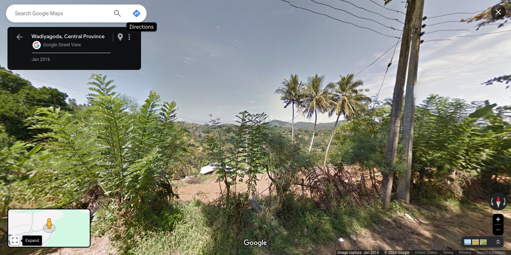

## Maeliya South

**Maeliya South** Grama Niladhari Division, **Polpithigama** Divisional Secretariat Division, **Kurunegala** District, **North Western** Province

**Yapahuwa** Polling Division, **Kurunegala** Electoral District

Population: 1,325 (2012)

(**LK-6127340**/372)

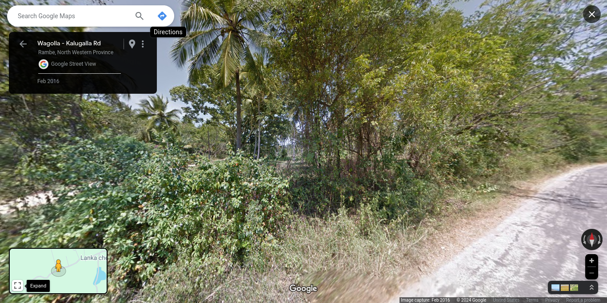

## Kolongalla

**Kolongalla** Grama Niladhari Division, **Kegalle** Divisional Secretariat Division, **Kegalle** District, **Sabaragamuwa** Province

**Kegalle** Polling Division, **Kegalle** Electoral District

Population: 1,592 (2012)

(**LK-9212020**/14D)

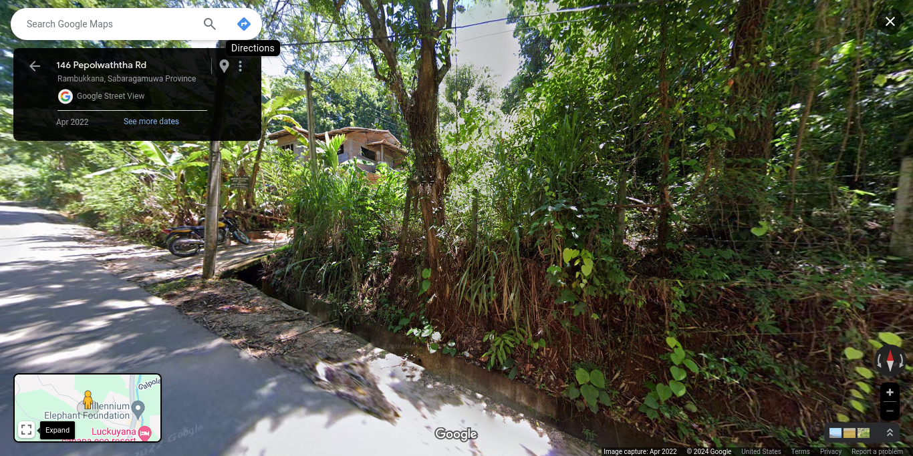

## Thudella North

**Thudella North** Grama Niladhari Division, **Ja-Ela** Divisional Secretariat Division, **Gampaha** District, **Western** Province

**Ja Ela** Polling Division, **Gampaha** Electoral District

Population: 2,425 (2012)

(**LK-1221055**/192B)

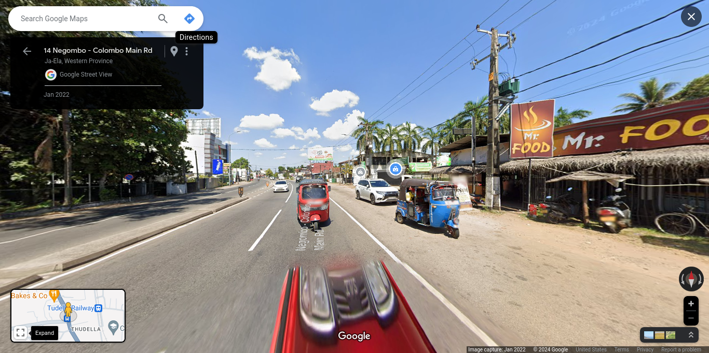

## Pettigalawatta

**Pettigalawatta** Grama Niladhari Division, **Galle Four Gravets** Divisional Secretariat Division, **Galle** District, **Southern** Province

**Galle** Polling Division, **Galle** Electoral District

Population: 1,237 (2012)

(**LK-3139195**/99B)

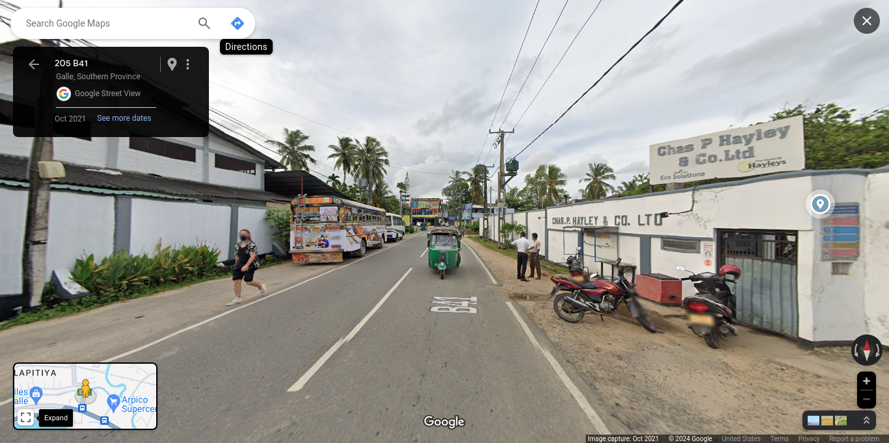

## Kanupelella

**Kanupelella** Grama Niladhari Division, **Badulla** Divisional Secretariat Division, **Badulla** District, **Uva** Province

**Badulla** Polling Division, **Badulla** Electoral District

Population: 1,990 (2012)

(**LK-8121145**/78F)

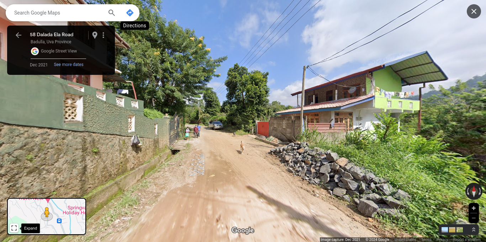

## Pathamailapitiya South

**Pathamailapitiya South** Grama Niladhari Division, **Pathahewaheta** Divisional Secretariat Division, **Kandy** District, **Central** Province

**Hewaheta** Polling Division, **Kandy** Electoral District

Population: 1,233 (2012)

(**LK-2145215**/1006)

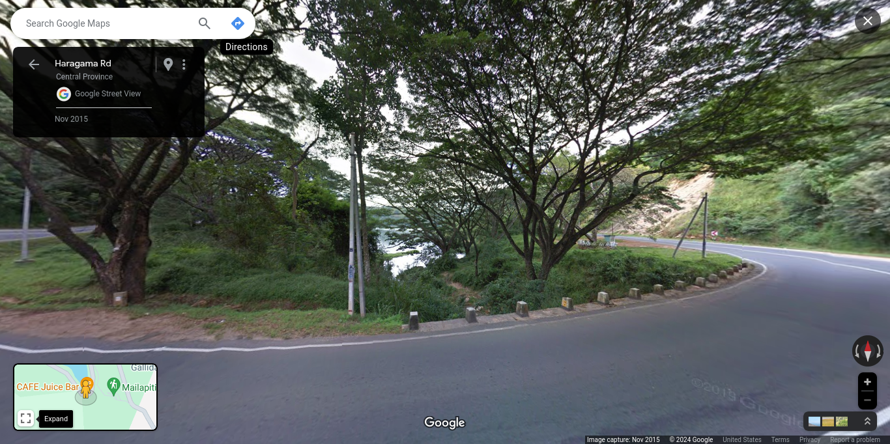

## Heenkenda

**Heenkenda** Grama Niladhari Division, **Wattala** Divisional Secretariat Division, **Gampaha** District, **Western** Province

**Wattala** Polling Division, **Gampaha** Electoral District

Population: 3,199 (2012)

(**LK-1218110**/254)

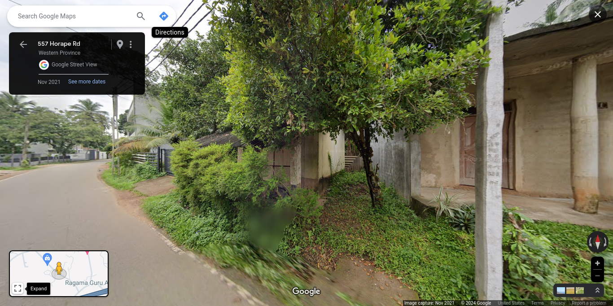

## Weragoda

**Weragoda** Grama Niladhari Division, **Mawanella** Divisional Secretariat Division, **Kegalle** District, **Sabaragamuwa** Province

**Mawanella** Polling Division, **Kegalle** Electoral District

Population: 546 (2012)

(**LK-9206285**/37C)

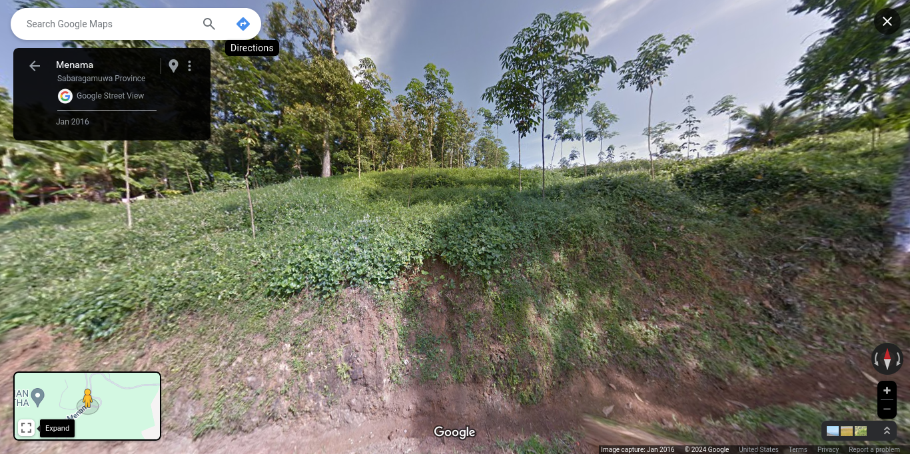

## Thenagama North

**Thenagama North** Grama Niladhari Division, **Tangalle** Divisional Secretariat Division, **Hambantota** District, **Southern** Province

**Beliatta** Polling Division, **Hambantota** Electoral District

Population: 436 (2012)

(**LK-3333080**/305)

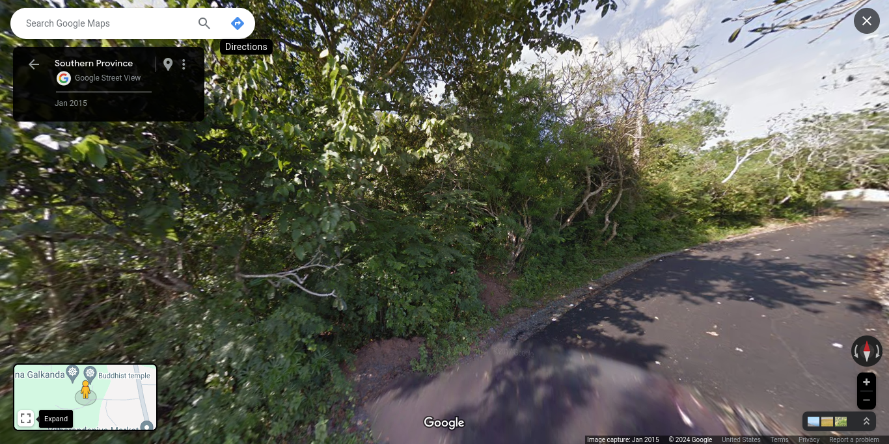

## Mahagama

**Mahagama** Grama Niladhari Division, **Kuliyapitiya East** Divisional Secretariat Division, **Kurunegala** District, **North Western** Province

**Kuliyapitiya** Polling Division, **Kurunegala** Electoral District

Population: 721 (2012)

(**LK-6169160**/1136)

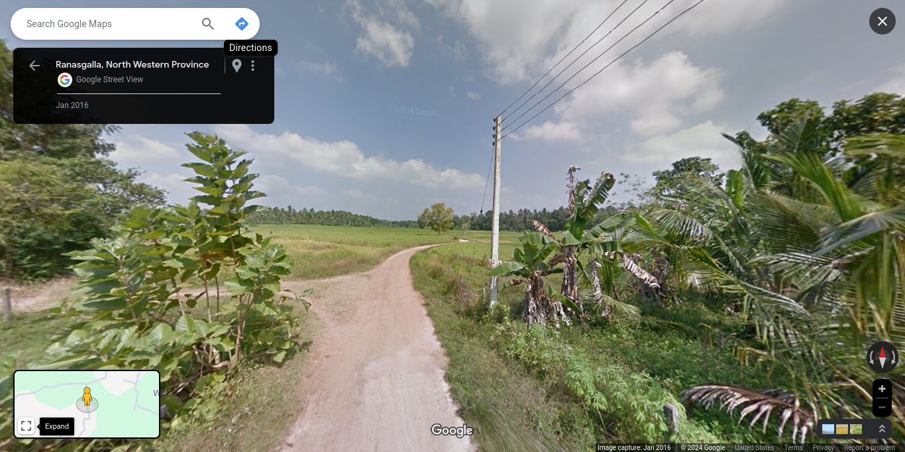

## Hikkaduwa East

**Hikkaduwa East** Grama Niladhari Division, **Gonapeenuwala** Divisional Secretariat Division, **Galle** District, **Southern** Province

**Ambalangoda** Polling Division, **Galle** Electoral District

Population: 1,335 (2012)

(**LK-3134070**/59A)

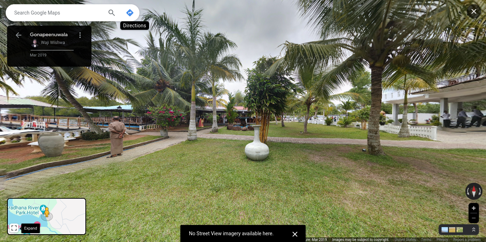

## Dambahena

**Dambahena** Grama Niladhari Division, **Maharagama** Divisional Secretariat Division, **Colombo** District, **Western** Province

**Maharagama** Polling Division, **Colombo** Electoral District

Population: 5,233 (2012)

(**LK-1121115**/528A)

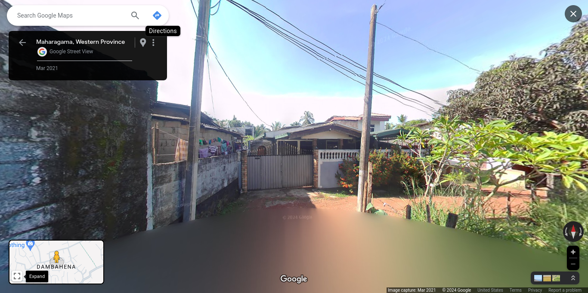

## Walapala Pattiya

**Walapala Pattiya** Grama Niladhari Division, **Panadura** Divisional Secretariat Division, **Kalutara** District, **Western** Province

**Panadura** Polling Division, **Kalutara** Electoral District

Population: 1,771 (2012)

(**LK-1303210**/683A)

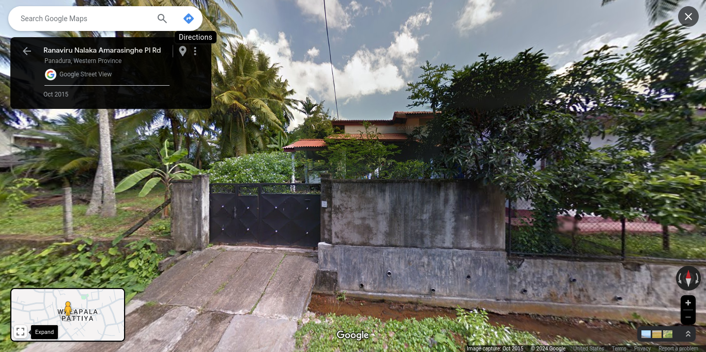

## Hiriwala

**Hiriwala** Grama Niladhari Division, **Mirigama** Divisional Secretariat Division, **Gampaha** District, **Western** Province

**Mirigama** Polling Division, **Gampaha** Electoral District

Population: 1,646 (2012)

(**LK-1212320**/40D)

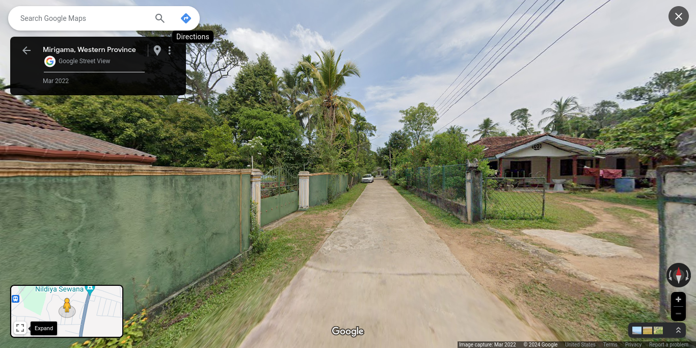

## Magammana West

**Magammana West** Grama Niladhari Division, **Homagama** Divisional Secretariat Division, **Colombo** District, **Western** Province

**Homagama** Polling Division, **Colombo** Electoral District

Population: 2,502 (2012)

(**LK-1112255**/590A)

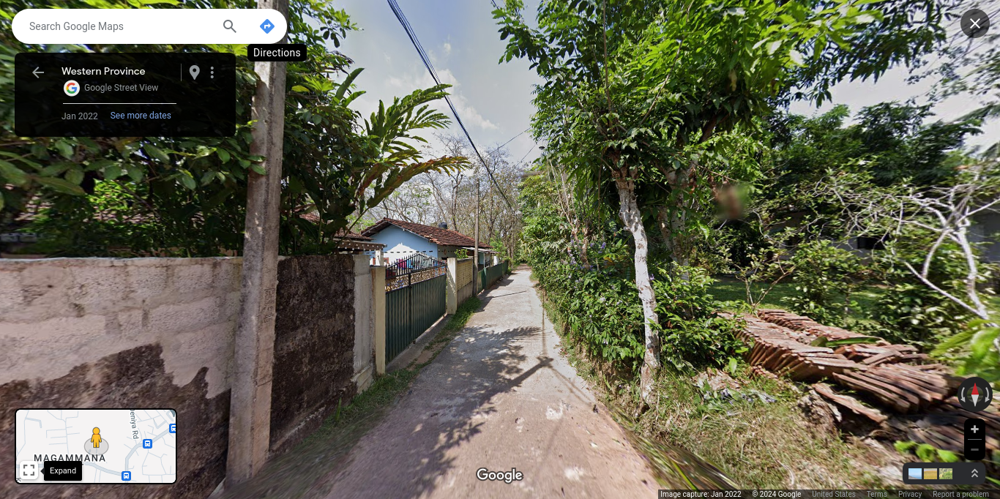

## Piyumgalla

**Piyumgalla** Grama Niladhari Division, **Wariyapola** Divisional Secretariat Division, **Kurunegala** District, **North Western** Province

**Wariyapola** Polling Division, **Kurunegala** Electoral District

Population: 976 (2012)

(**LK-6136240**/1248)

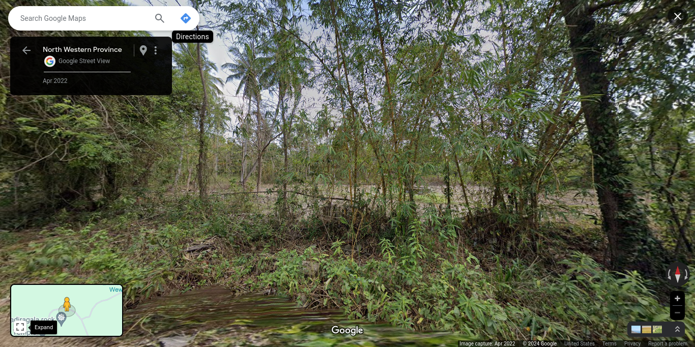

## Godagama South

**Godagama South** Grama Niladhari Division, **Hikkaduwa** Divisional Secretariat Division, **Galle** District, **Southern** Province

**Ratgama** Polling Division, **Galle** Electoral District

Population: 309 (2012)

(**LK-3136125**/70)

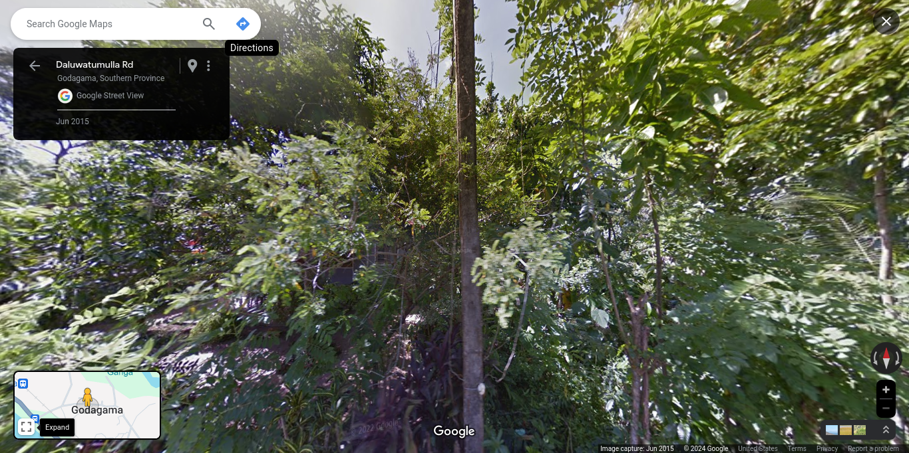

## Mahavila

**Mahavila** Grama Niladhari Division, **Bandaragama** Divisional Secretariat Division, **Kalutara** District, **Western** Province

**Bandaragama** Polling Division, **Kalutara** Electoral District

Population: 2,606 (2012)

(**LK-1306125**/690)

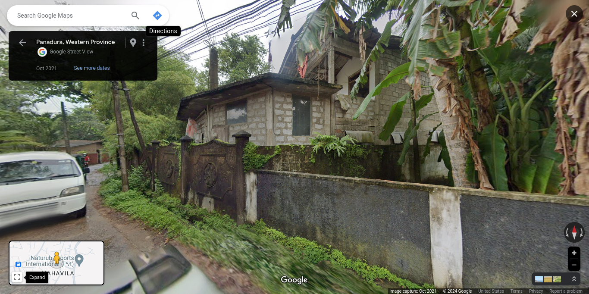

## Eravur 03A

**Eravur 03A** Grama Niladhari Division, **Eravur Town** Divisional Secretariat Division, **Batticaloa** District, **Eastern** Province

**Batticaloa** Polling Division, **Batticaloa** Electoral District

Population: 3,292 (2012)

(**LK-5115020**/192B)

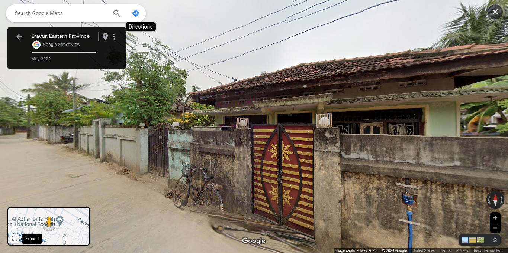

## Ranpokunagama C Zone

**Ranpokunagama C Zone** Grama Niladhari Division, **Attanagalla** Divisional Secretariat Division, **Gampaha** District, **Western** Province

**Attanagalla** Polling Division, **Gampaha** Electoral District

Population: 388 (2012)

(**LK-1227230**/349D)

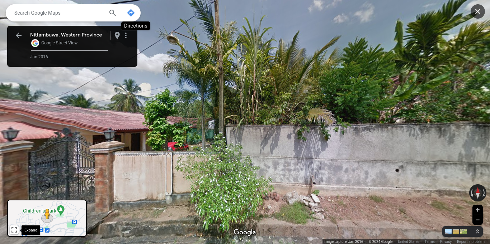

## Unawatuna East

**Unawatuna East** Grama Niladhari Division, **Habaraduwa** Divisional Secretariat Division, **Galle** District, **Southern** Province

**Habaraduwa** Polling Division, **Galle** Electoral District

Population: 1,838 (2012)

(**LK-3154020**/136)

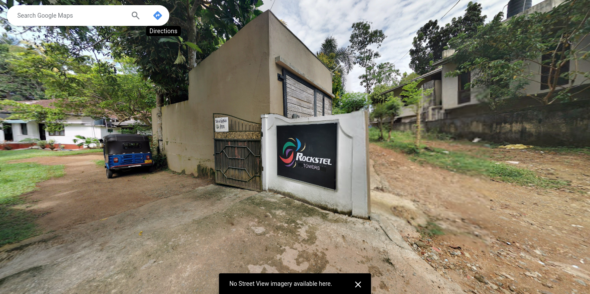

## Pamankada East

**Pamankada East** Grama Niladhari Division, **Thimbirigasyaya** Divisional Secretariat Division, **Colombo** District, **Western** Province

**Colombo East** Polling Division, **Colombo** Electoral District

Population: 12,389 (2012)

(**LK-1127100**/)

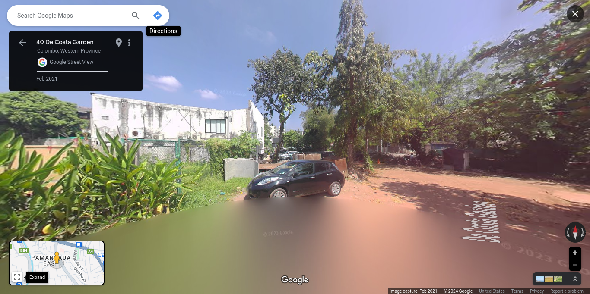

## Kajugahawatta

**Kajugahawatta** Grama Niladhari Division, **Kolonnawa** Divisional Secretariat Division, **Colombo** District, **Western** Province

**Kolonnawa** Polling Division, **Colombo** Electoral District

Population: 2,567 (2012)

(**LK-1106195**/513C)

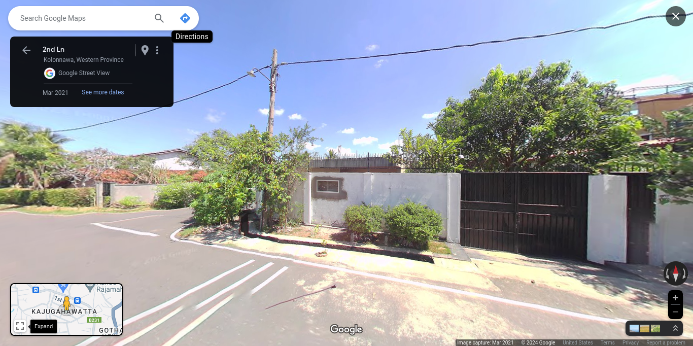

## Yabaraluwa South

**Yabaraluwa South** Grama Niladhari Division, **Biyagama** Divisional Secretariat Division, **Gampaha** District, **Western** Province

**Biyagama** Polling Division, **Gampaha** Electoral District

Population: 2,076 (2012)

(**LK-1239235**/280E)

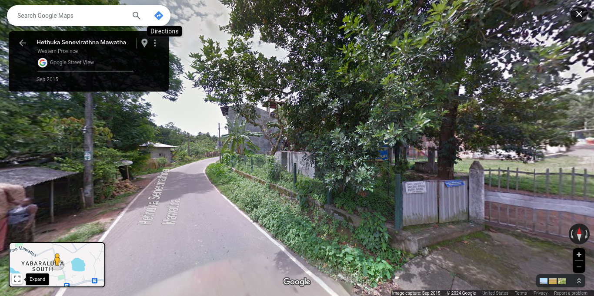

## Dodandugoda

**Dodandugoda** Grama Niladhari Division, **Hikkaduwa** Divisional Secretariat Division, **Galle** District, **Southern** Province

**Ratgama** Polling Division, **Galle** Electoral District

Population: 1,180 (2012)

(**LK-3136340**/52A)

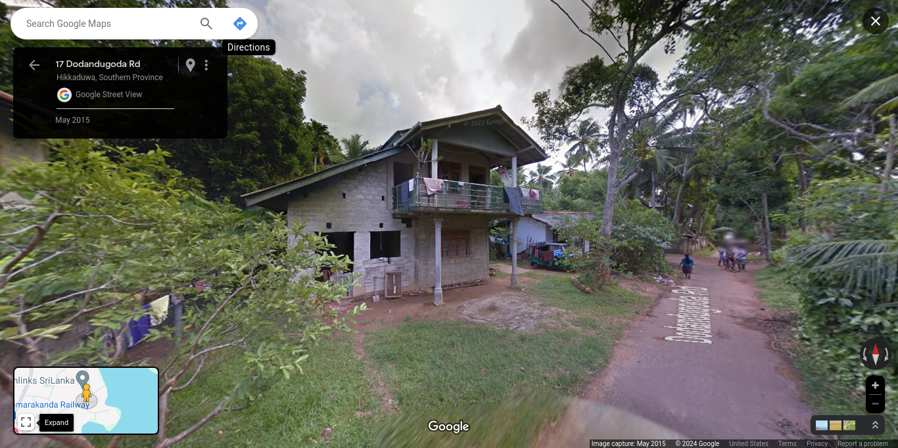

## Katukurunduwatta

**Katukurunduwatta** Grama Niladhari Division, **Ratmalana** Divisional Secretariat Division, **Colombo** District, **Western** Province

**Ratmalana** Polling Division, **Colombo** Electoral District

Population: 12,166 (2012)

(**LK-1131025**/545A)

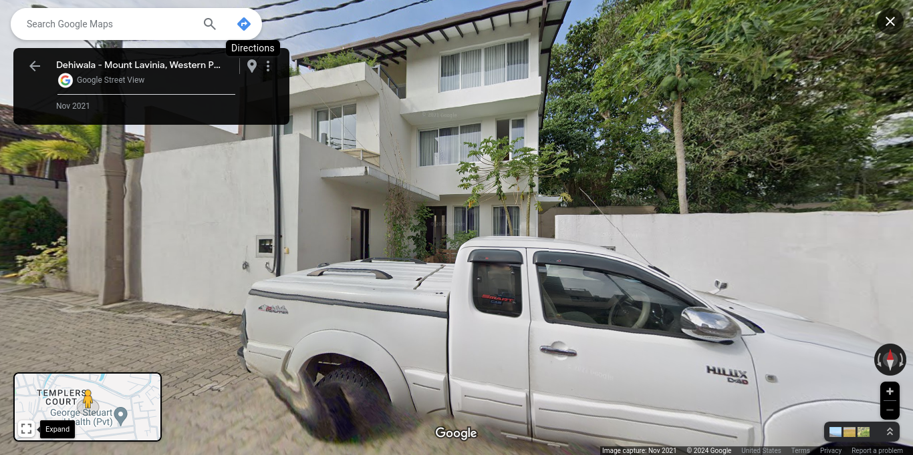

## Hetti  Weediya

**Hetti  Weediya** Grama Niladhari Division, **Weligama** Divisional Secretariat Division, **Matara** District, **Southern** Province

**Weligama** Polling Division, **Matara** Electoral District

Population: 2,397 (2012)

(**LK-3239055**/382B)

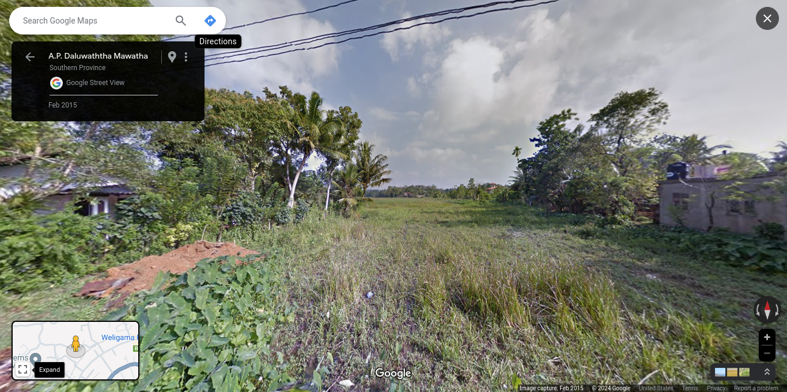

## Puloly South

**Puloly South** Grama Niladhari Division, **Vadamaradchi North (Point Pedro)** Divisional Secretariat Division, **Jaffna** District, **Northern** Province

**Point Pedro** Polling Division, **Jaffna** Electoral District

Population: 853 (2012)

(**LK-4127160**/J/414)

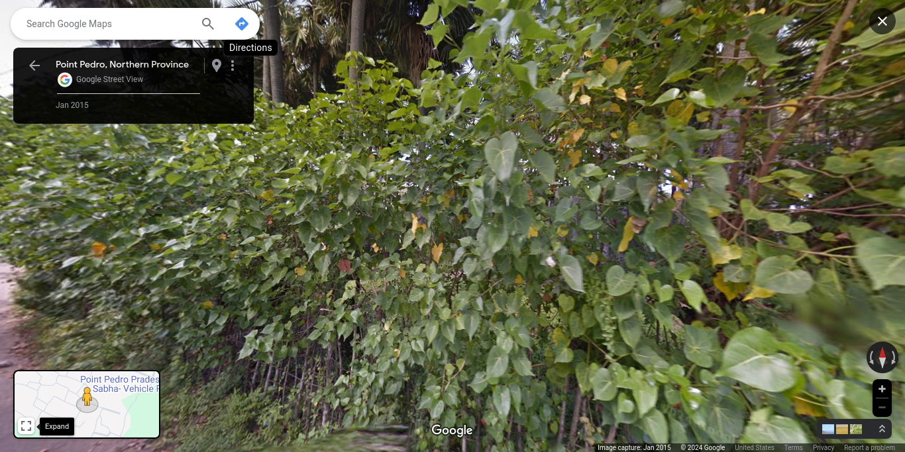

## Sainthamaruthu 02

**Sainthamaruthu 02** Grama Niladhari Division, **Sainthamaruthu** Divisional Secretariat Division, **Ampara** District, **Eastern** Province

**Kalmunai** Polling Division, **Digamadulla** Electoral District

Population: 1,843 (2012)

(**LK-5225010**/KP/53A)

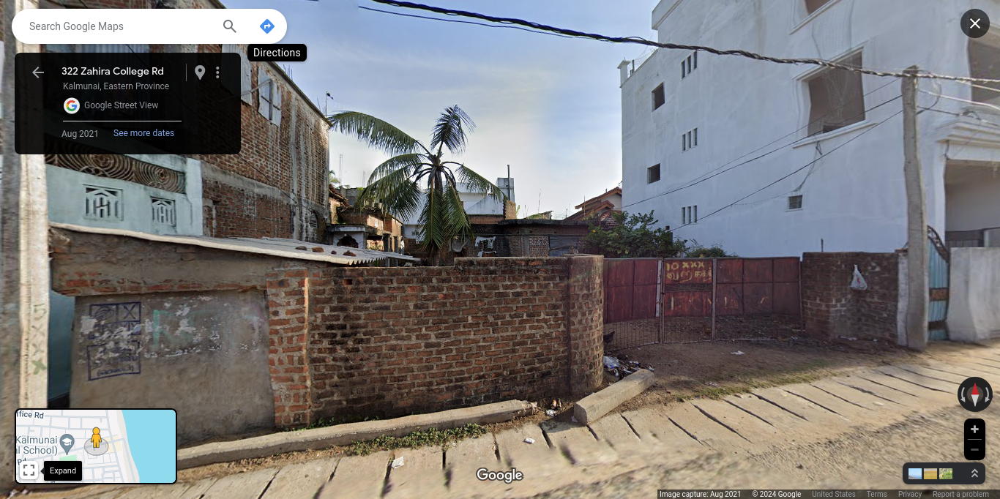

## Kalmunaikudi 06

**Kalmunaikudi 06** Grama Niladhari Division, **Kalmunai** Divisional Secretariat Division, **Ampara** District, **Eastern** Province

**Kalmunai** Polling Division, **Digamadulla** Electoral District

Population: 1,140 (2012)

(**LK-5224105**/KP/56F)

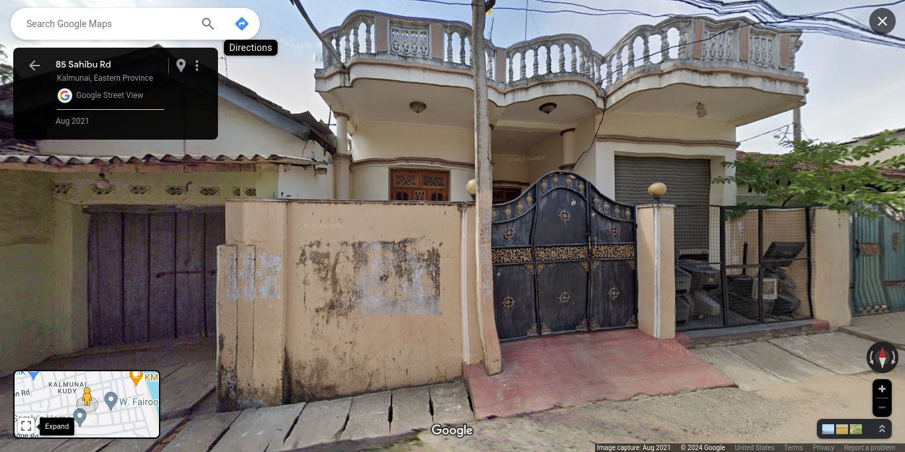

## Henpita

**Henpita** Grama Niladhari Division, **Homagama** Divisional Secretariat Division, **Colombo** District, **Western** Province

**Homagama** Polling Division, **Colombo** Electoral District

Population: 1,484 (2012)

(**LK-1112010**/451)

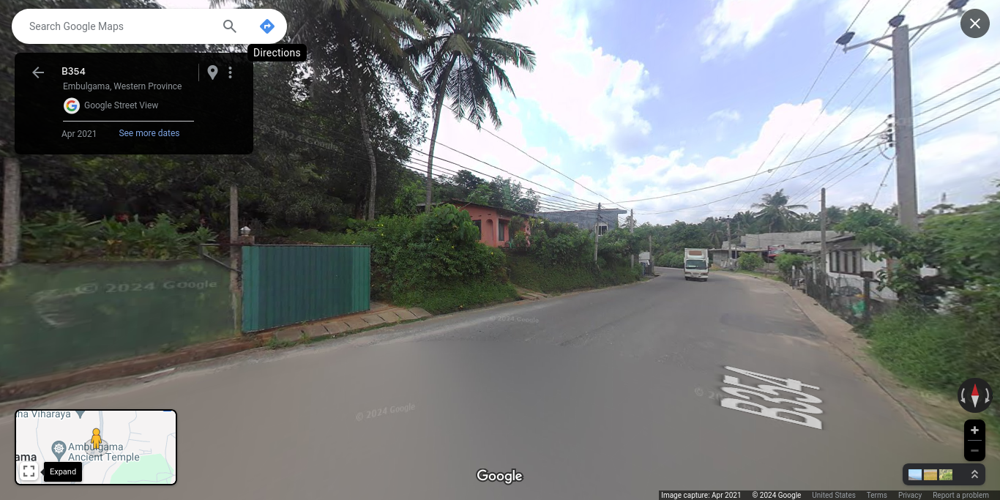

## Pamburana

**Pamburana** Grama Niladhari Division, **Matara Four Gravets** Divisional Secretariat Division, **Matara** District, **Southern** Province

**Matara** Polling Division, **Matara** Electoral District

Population: 2,610 (2012)

(**LK-3242260**/412B)

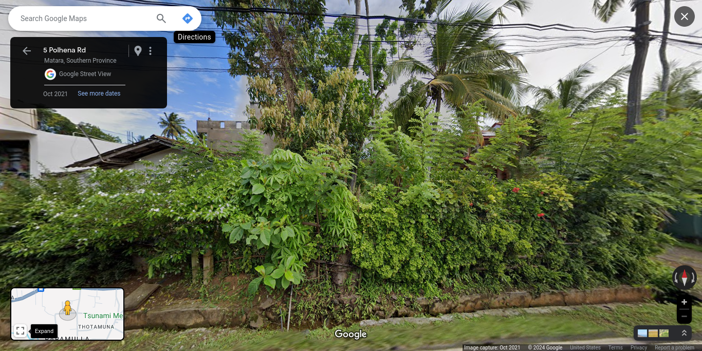

## Makandana west

**Makandana west** Grama Niladhari Division, **Kesbewa** Divisional Secretariat Division, **Colombo** District, **Western** Province

**Kesbewa** Polling Division, **Colombo** Electoral District

Population: 4,434 (2012)

(**LK-1136315**/569A)

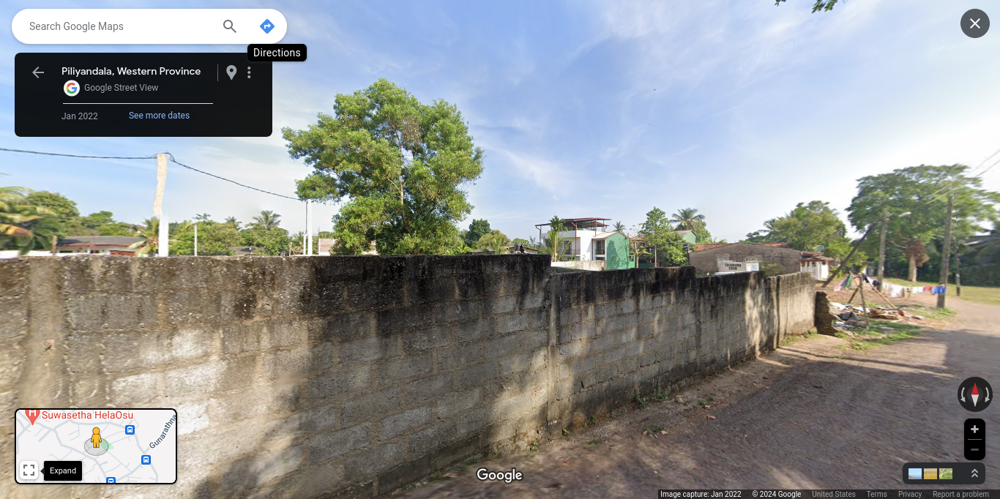

## Horathuduwa

**Horathuduwa** Grama Niladhari Division, **Kesbewa** Divisional Secretariat Division, **Colombo** District, **Western** Province

**Kesbewa** Polling Division, **Colombo** Electoral District

Population: 1,604 (2012)

(**LK-1136330**/570/71A)

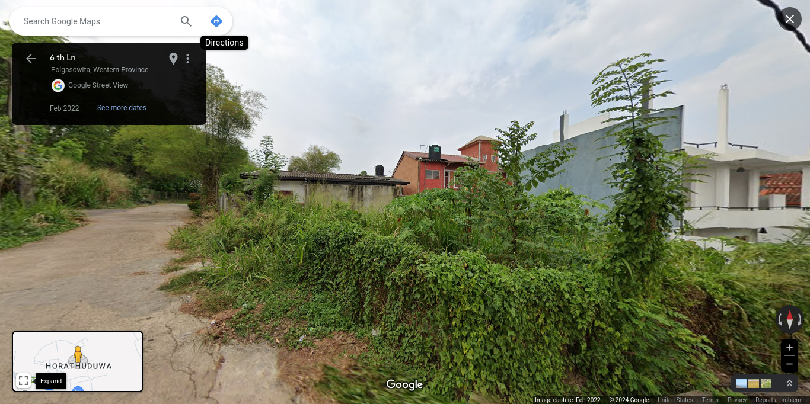

## Halpitiya

**Halpitiya** Grama Niladhari Division, **Rambukkana** Divisional Secretariat Division, **Kegalle** District, **Sabaragamuwa** Province

**Rambukkana** Polling Division, **Kegalle** Electoral District

Population: 839 (2012)

(**LK-9203280**/11A)

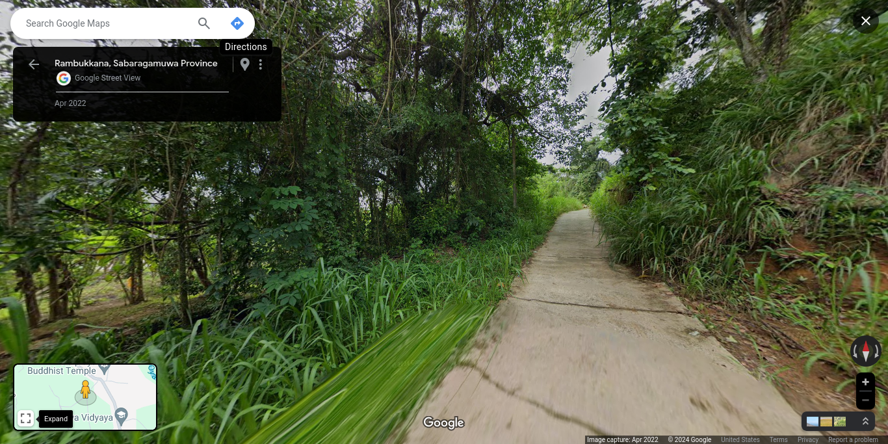

## Amunugoda North

**Amunugoda North** Grama Niladhari Division, **Gampaha** Divisional Secretariat Division, **Gampaha** District, **Western** Province

**Gampaha** Polling Division, **Gampaha** Electoral District

Population: 3,148 (2012)

(**LK-1224360**/238)

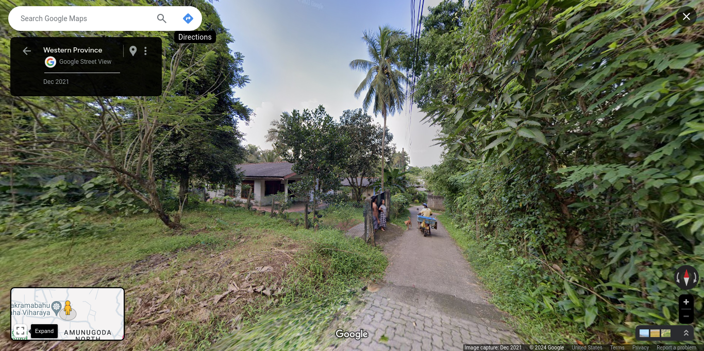

## Denagama East

**Denagama East** Grama Niladhari Division, **Hakmana** Divisional Secretariat Division, **Matara** District, **Southern** Province

**Hakmana** Polling Division, **Matara** Electoral District

Population: 1,035 (2012)

(**LK-3230005**/280)

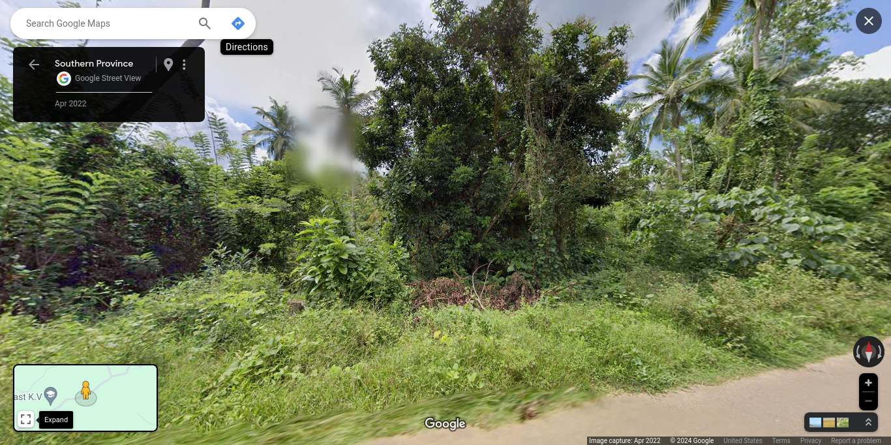

## Daluwathumulla

**Daluwathumulla** Grama Niladhari Division, **Hikkaduwa** Divisional Secretariat Division, **Galle** District, **Southern** Province

**Ratgama** Polling Division, **Galle** Electoral District

Population: 516 (2012)

(**LK-3136135**/67C)

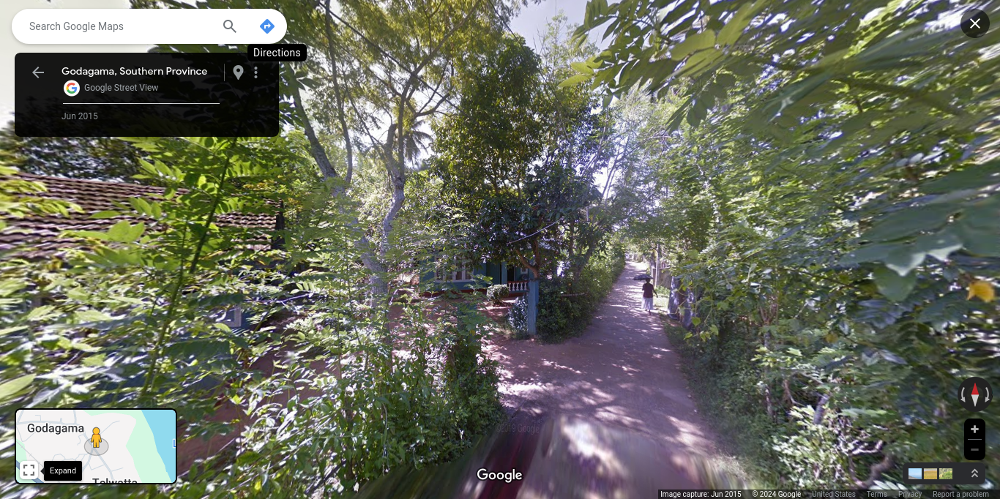

## Thebuwana East

**Thebuwana East** Grama Niladhari Division, **Dodangoda** Divisional Secretariat Division, **Kalutara** District, **Western** Province

**Mathugama** Polling Division, **Kalutara** Electoral District

Population: 2,162 (2012)

(**LK-1327050**/809)

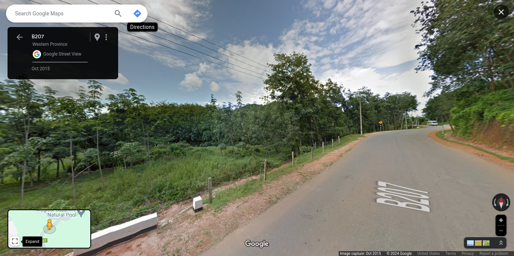

## Muttettugoda

**Muttettugoda** Grama Niladhari Division, **Kaduwela** Divisional Secretariat Division, **Colombo** District, **Western** Province

**Kaduwela** Polling Division, **Colombo** Electoral District

Population: 6,734 (2012)

(**LK-1109145**/477B)

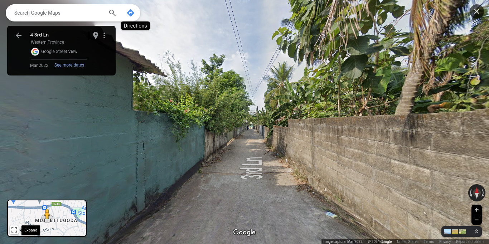

## Hettiyawala North

**Hettiyawala North** Grama Niladhari Division, **Kirinda Puhulwella** Divisional Secretariat Division, **Matara** District, **Southern** Province

**Kamburupitiya** Polling Division, **Matara** Electoral District

Population: 970 (2012)

(**LK-3233040**/325G)

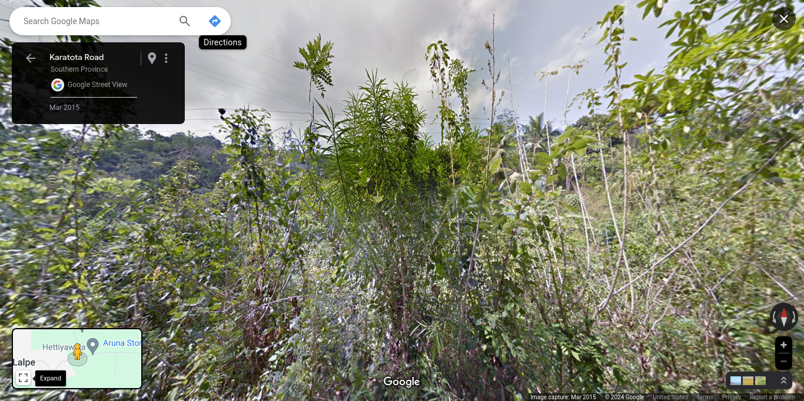

## Albian

**Albian** Grama Niladhari Division, **Nuwara Eliya** Divisional Secretariat Division, **Nuwara Eliya** District, **Central** Province

**Nuwara Eliya Maskeliya** Polling Division, **Nuwara-Eliya** Electoral District

Population: 3,811 (2012)

(**LK-2312340**/476K)

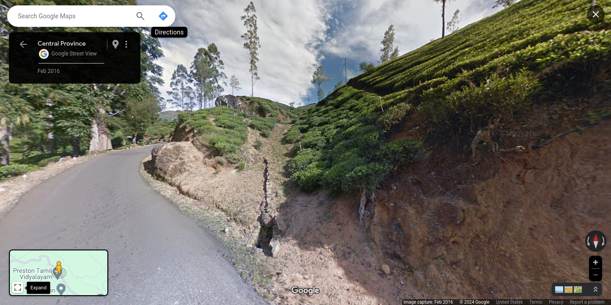

## Hatton North

**Hatton North** Grama Niladhari Division, **Ambagamuwa** Divisional Secretariat Division, **Nuwara Eliya** District, **Central** Province

**Nuwara Eliya Maskeliya** Polling Division, **Nuwara-Eliya** Electoral District

Population: 7,636 (2012)

(**LK-2315215**/319B)

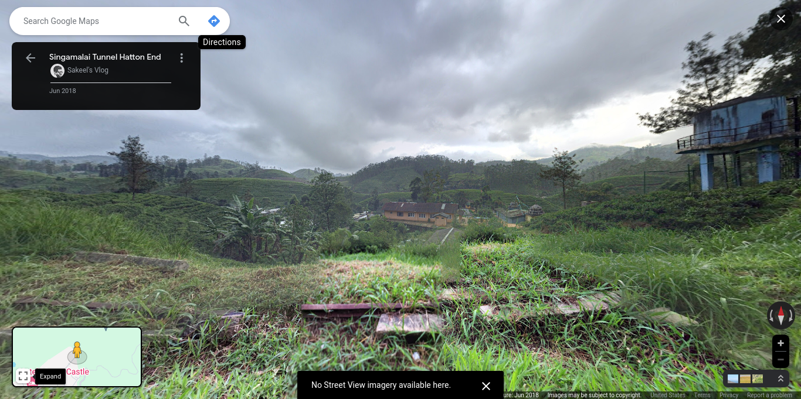

## Nallura

**Nallura** Grama Niladhari Division, **Panduwasnuwara West** Divisional Secretariat Division, **Kurunegala** District, **North Western** Province

**Panduwasnuwara** Polling Division, **Kurunegala** Electoral District

Population: 1,126 (2012)

(**LK-6145105**/1356)

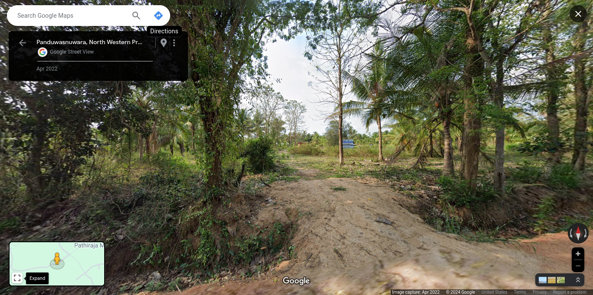

## Block 'J' West 01

**Block 'J' West 01** Grama Niladhari Division, **Samanthurai** Divisional Secretariat Division, **Ampara** District, **Eastern** Province

**Samanthurai** Polling Division, **Digamadulla** Electoral District

Population: 1,120 (2012)

(**LK-5218150**/79A)

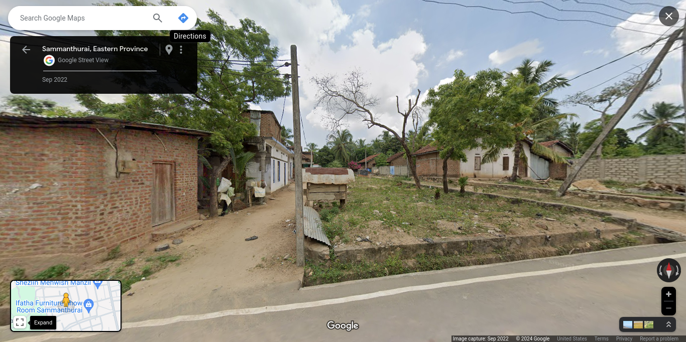

## Boralessa East

**Boralessa East** Grama Niladhari Division, **Wennappuwa** Divisional Secretariat Division, **Puttalam** District, **North Western** Province

**Wennappuwa** Polling Division, **Puttalam** Electoral District

Population: 1,489 (2012)

(**LK-6245175**/488)

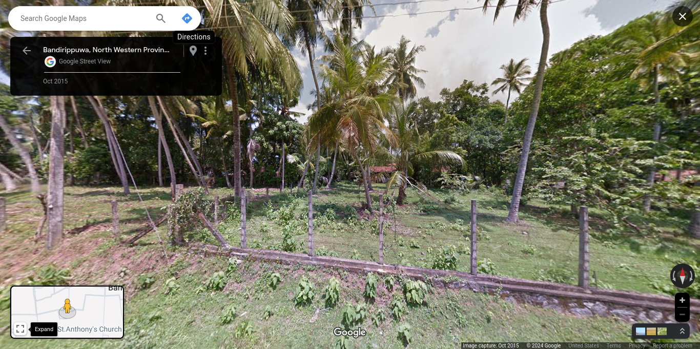

## Thambalawatta

**Thambalawatta** Grama Niladhari Division, **Porativu Pattu** Divisional Secretariat Division, **Batticaloa** District, **Eastern** Province

**Paddiruppu** Polling Division, **Batticaloa** Electoral District

Population: 1,279 (2012)

(**LK-5133165**/98)

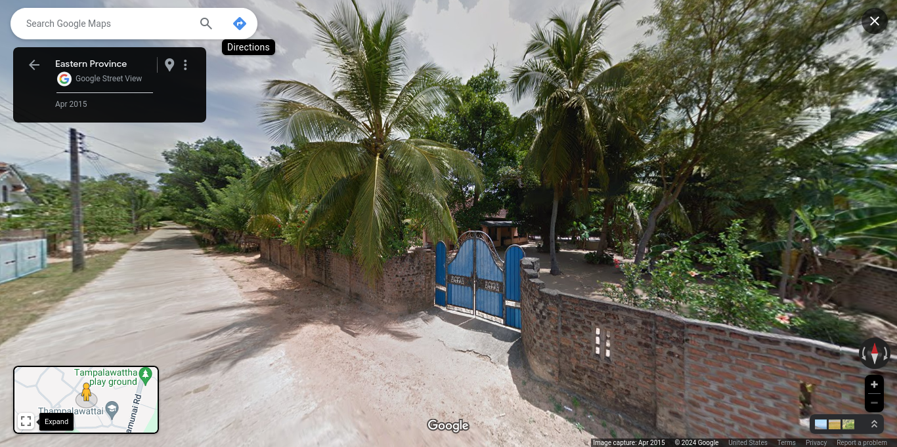

## Puloly Centre

**Puloly Centre** Grama Niladhari Division, **Vadamaradchi North (Point Pedro)** Divisional Secretariat Division, **Jaffna** District, **Northern** Province

**Point Pedro** Polling Division, **Jaffna** Electoral District

Population: 1,602 (2012)

(**LK-4127135**/J/409)

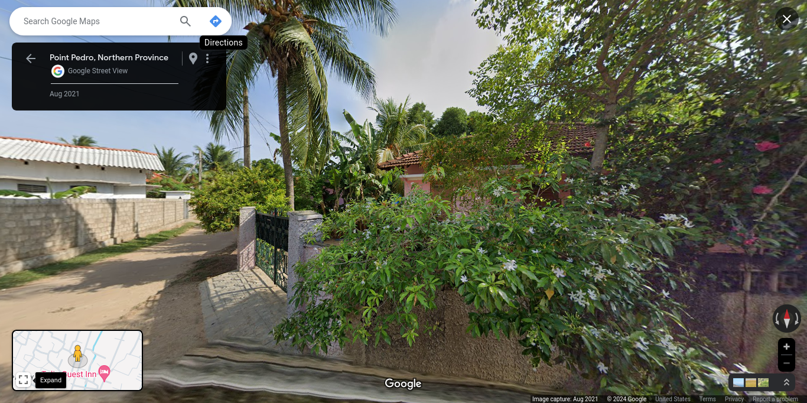

## Kaithady West

**Kaithady West** Grama Niladhari Division, **Thenmaradchi (Chavakachcheri)** Divisional Secretariat Division, **Jaffna** District, **Northern** Province

**Chavakachcheri** Polling Division, **Jaffna** Electoral District

Population: 1,212 (2012)

(**LK-4130030**/J/293)

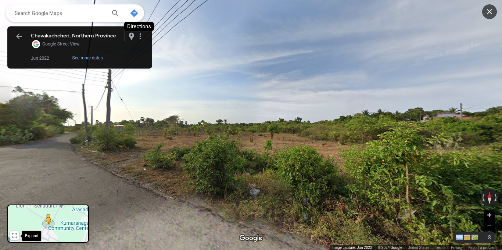

## Uduwawala East

**Uduwawala East** Grama Niladhari Division, **Harispattuwa** Divisional Secretariat Division, **Kandy** District, **Central** Province

**Harispattuwa** Polling Division, **Kandy** Electoral District

Population: 1,371 (2012)

(**LK-2133190**/419)

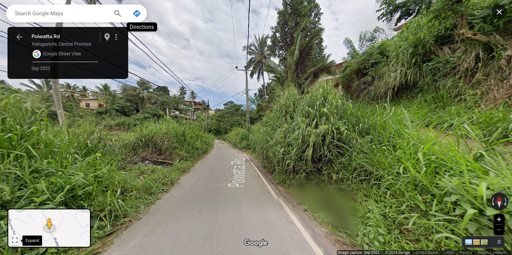

## Pothupitiya North

**Pothupitiya North** Grama Niladhari Division, **Kalutara** Divisional Secretariat Division, **Kalutara** District, **Western** Province

**Kalutara** Polling Division, **Kalutara** Electoral District

Population: 1,296 (2012)

(**LK-1321110**/708)

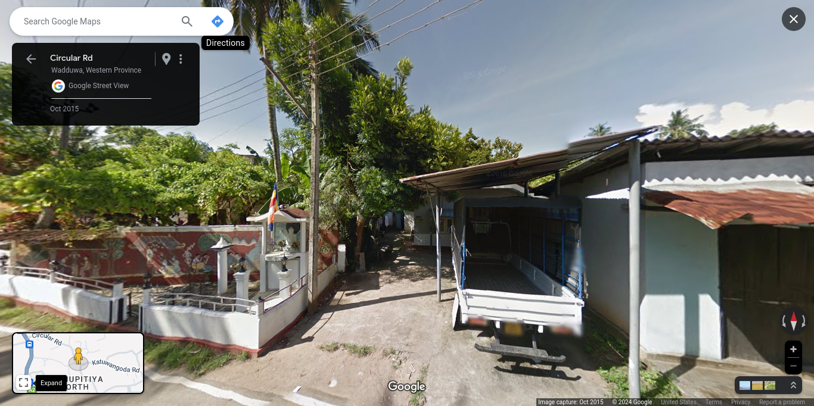

## Fort

**Fort** Grama Niladhari Division, **Matara Four Gravets** Divisional Secretariat Division, **Matara** District, **Southern** Province

**Matara** Polling Division, **Matara** Electoral District

Population: 1,082 (2012)

(**LK-3242280**/416C)

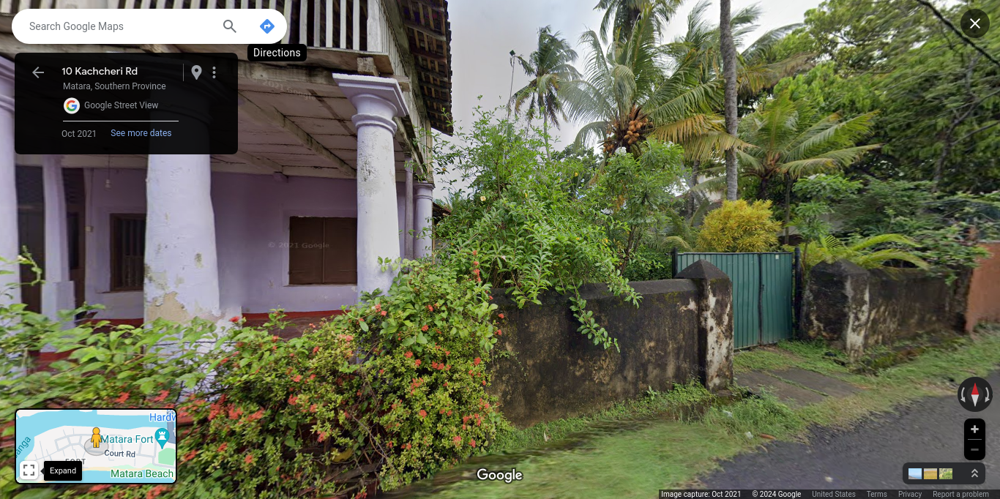

## Puloly West

**Puloly West** Grama Niladhari Division, **Vadamaradchi North (Point Pedro)** Divisional Secretariat Division, **Jaffna** District, **Northern** Province

**Point Pedro** Polling Division, **Jaffna** Electoral District

Population: 1,367 (2012)

(**LK-4127140**/J/410)

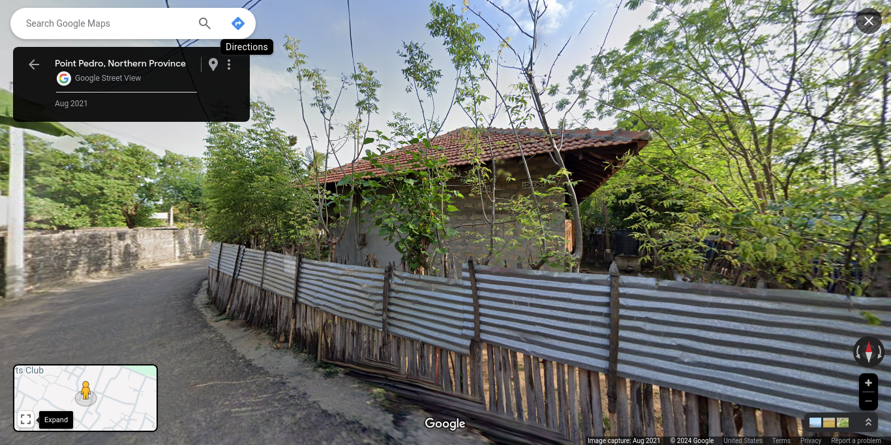

## Nonagama

**Nonagama** Grama Niladhari Division, **Ambalantota** Divisional Secretariat Division, **Hambantota** District, **Southern** Province

**Tangalle** Polling Division, **Hambantota** Electoral District

Population: 1,347 (2012)

(**LK-3315235**/155)

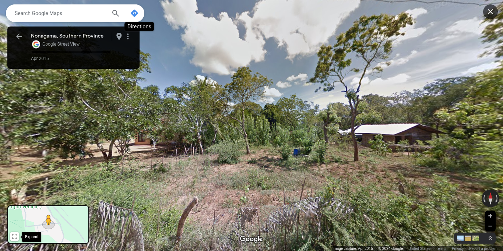

## Track 4

**Track 4** Grama Niladhari Division, **Rajanganaya** Divisional Secretariat Division, **Anuradhapura** District, **North Central** Province

**Kalawewa** Polling Division, **Anuradhapura** Electoral District

Population: 1,355 (2012)

(**LK-7142060**/445)

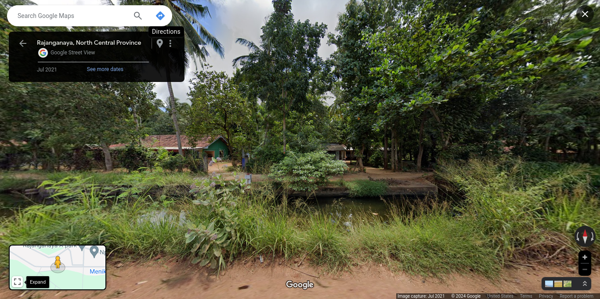

## Mudungoda West

**Mudungoda West** Grama Niladhari Division, **Gampaha** Divisional Secretariat Division, **Gampaha** District, **Western** Province

**Gampaha** Polling Division, **Gampaha** Electoral District

Population: 927 (2012)

(**LK-1224315**/232D)

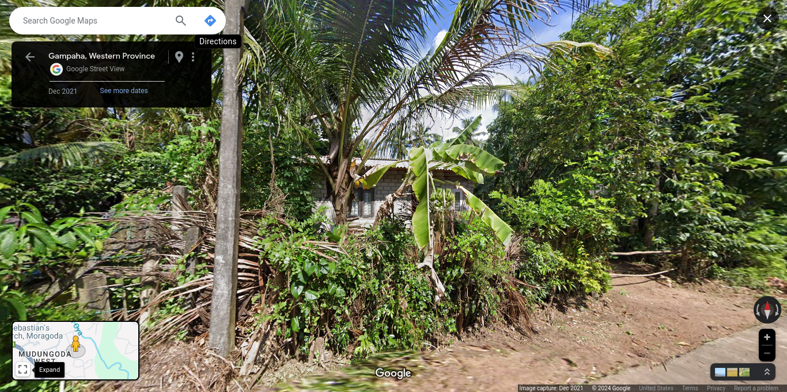

## Wehera East

**Wehera East** Grama Niladhari Division, **Kurunegala** Divisional Secretariat Division, **Kurunegala** District, **North Western** Province

**Kurunegala** Polling Division, **Kurunegala** Electoral District

Population: 1,438 (2012)

(**LK-6154200**/805)

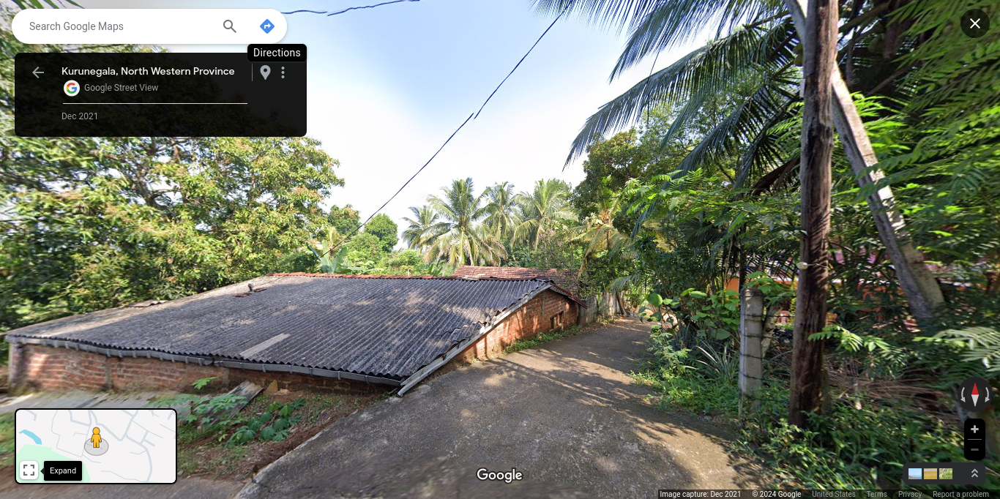

## Uhana

**Uhana** Grama Niladhari Division, **Uhana** Divisional Secretariat Division, **Ampara** District, **Eastern** Province

**Ampara** Polling Division, **Digamadulla** Electoral District

Population: 2,742 (2012)

(**LK-5212195**/W/88)

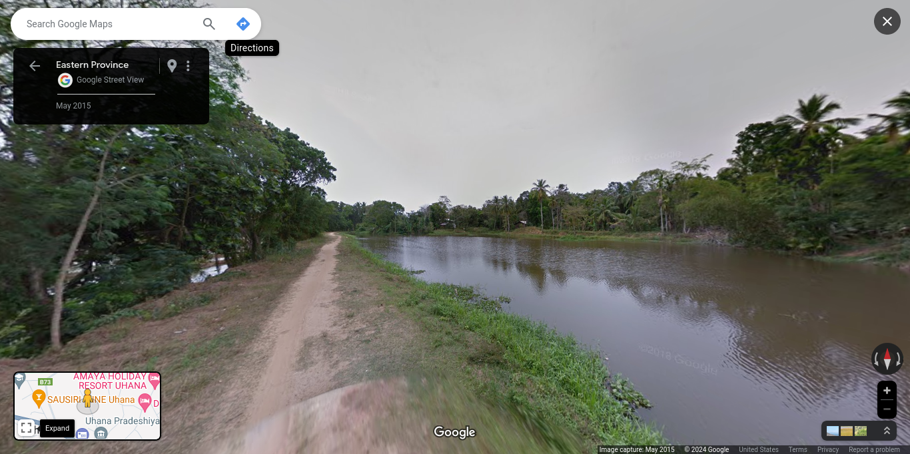

## Samaneliya

**Samaneliya** Grama Niladhari Division, **Kothmale** Divisional Secretariat Division, **Nuwara Eliya** District, **Central** Province

**Kothmale** Polling Division, **Nuwara-Eliya** Electoral District

Population: 595 (2012)

(**LK-2303385**/474H)

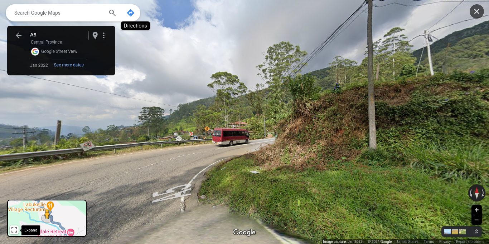

## Udumulla North

**Udumulla North** Grama Niladhari Division, **Kolonnawa** Divisional Secretariat Division, **Colombo** District, **Western** Province

**Kolonnawa** Polling Division, **Colombo** Electoral District

Population: 2,643 (2012)

(**LK-1106155**/502)

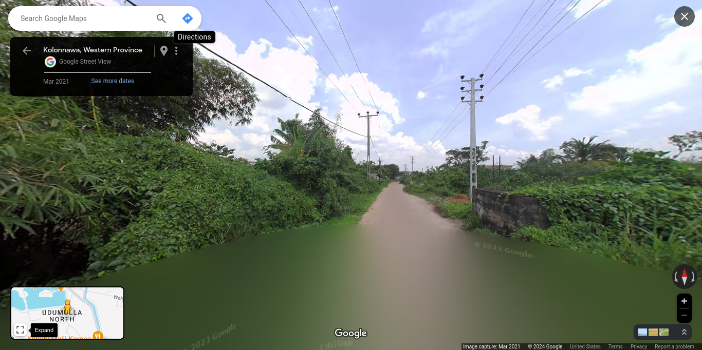

## Moor Street

**Moor Street** Grama Niladhari Division, **Mannar Town** Divisional Secretariat Division, **Mannar** District, **Northern** Province

**Mannar** Polling Division, **Vanni** Electoral District

Population: 2,180 (2012)

(**LK-4203105**/MN/81)

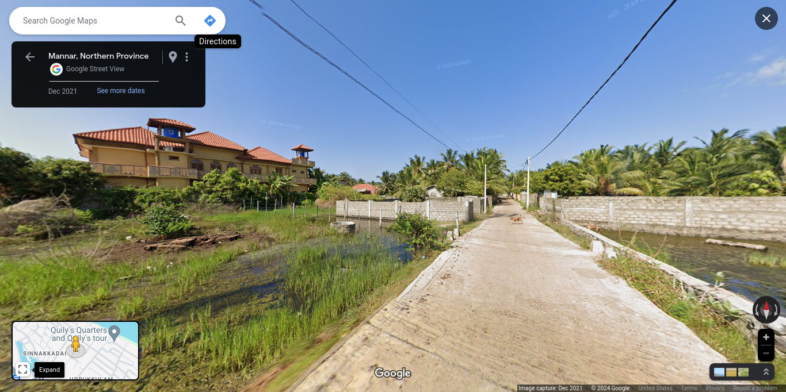

## Andiambalama West

**Andiambalama West** Grama Niladhari Division, **Katana** Divisional Secretariat Division, **Gampaha** District, **Western** Province

**Katana** Polling Division, **Gampaha** Electoral District

Population: 6,567 (2012)

(**LK-1206175**/155)

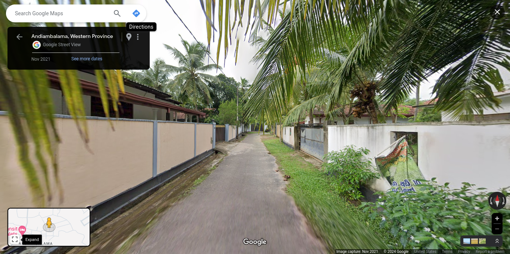

## Moor Street North

**Moor Street North** Grama Niladhari Division, **Jaffna** Divisional Secretariat Division, **Jaffna** District, **Northern** Province

**Jaffna** Polling Division, **Jaffna** Electoral District

Population: 1,538 (2012)

(**LK-4136135**/J/87)

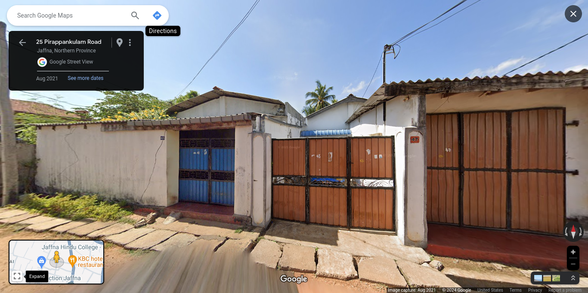

## Muwanwellegedara

**Muwanwellegedara** Grama Niladhari Division, **Wariyapola** Divisional Secretariat Division, **Kurunegala** District, **North Western** Province

**Wariyapola** Polling Division, **Kurunegala** Electoral District

Population: 783 (2012)

(**LK-6136100**/1272)

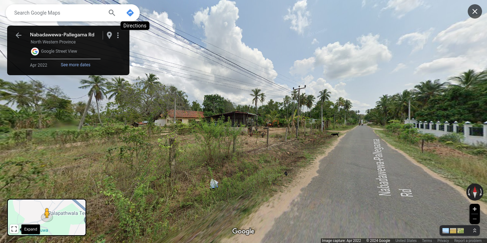

## Udawela

**Udawela** Grama Niladhari Division, **Badulla** Divisional Secretariat Division, **Badulla** District, **Uva** Province

**Badulla** Polling Division, **Badulla** Electoral District

Population: 2,193 (2012)

(**LK-8121135**/80D)

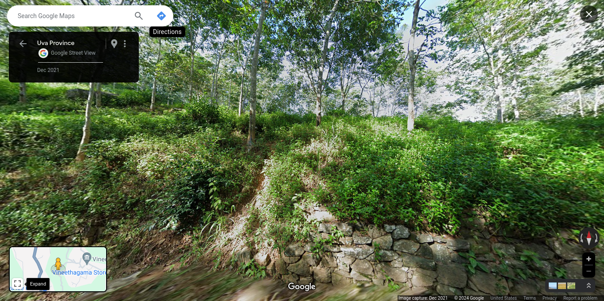

## Raddolugama South

**Raddolugama South** Grama Niladhari Division, **Katana** Divisional Secretariat Division, **Gampaha** District, **Western** Province

**Katana** Polling Division, **Gampaha** Electoral District

Population: 1,894 (2012)

(**LK-1206310**/199B)

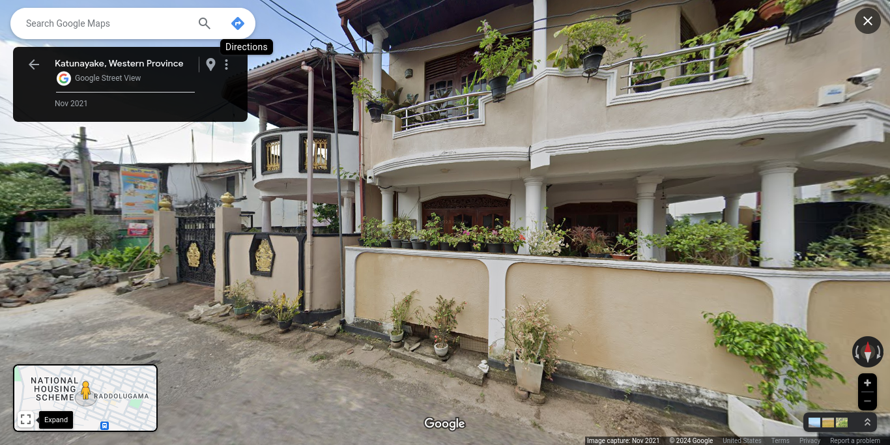

## Sinna Ullai

**Sinna Ullai** Grama Niladhari Division, **Pothuvil** Divisional Secretariat Division, **Ampara** District, **Eastern** Province

**Pothuvil** Polling Division, **Digamadulla** Electoral District

Population: 1,251 (2012)

(**LK-5248010**/P/18)

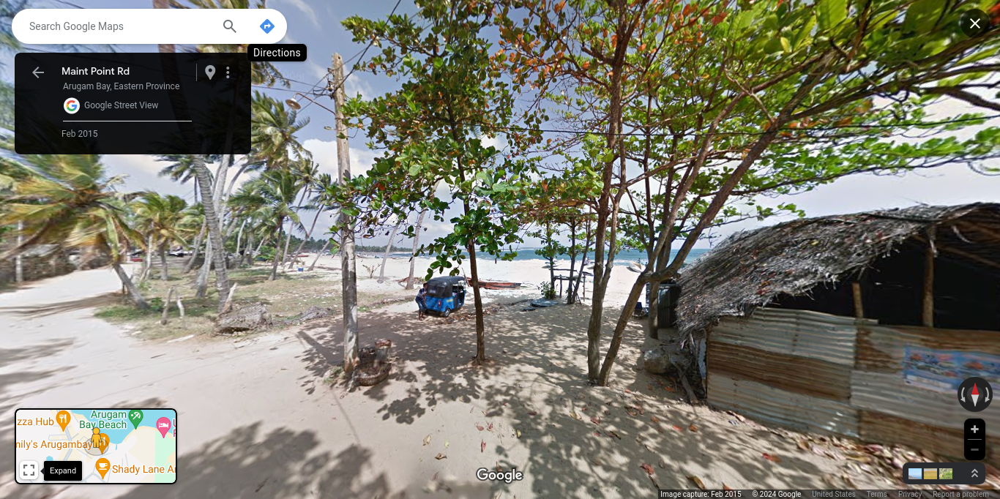

## Weerapokuna

**Weerapokuna** Grama Niladhari Division, **Bingiriya** Divisional Secretariat Division, **Kurunegala** District, **North Western** Province

**Bingiriya** Polling Division, **Kurunegala** Electoral District

Population: 1,035 (2012)

(**LK-6142055**/1445)

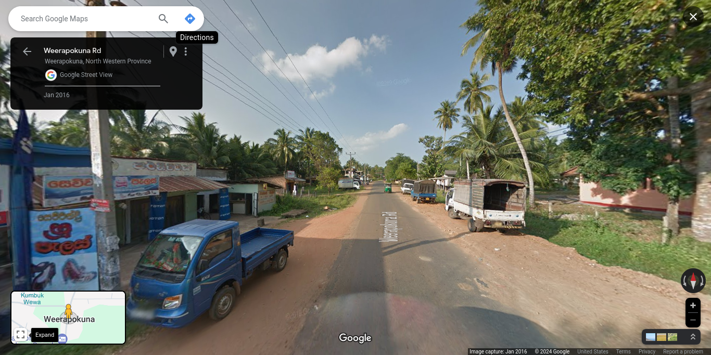

## Lathpandura

**Lathpandura** Grama Niladhari Division, **Palindanuwara** Divisional Secretariat Division, **Kalutara** District, **Western** Province

**Agalawatta** Polling Division, **Kalutara** Electoral District

Population: 1,496 (2012)

(**LK-1336110**/835)

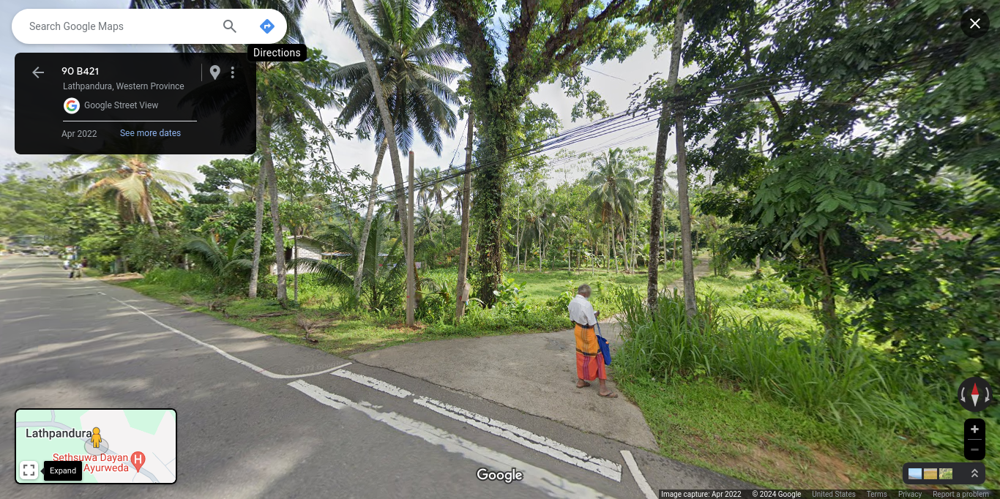

## Uda Padiyapelella

**Uda Padiyapelella** Grama Niladhari Division, **Hanguranketha** Divisional Secretariat Division, **Nuwara Eliya** District, **Central** Province

**Hanguranketha** Polling Division, **Nuwara-Eliya** Electoral District

Population: 643 (2012)

(**LK-2306505**/510A)

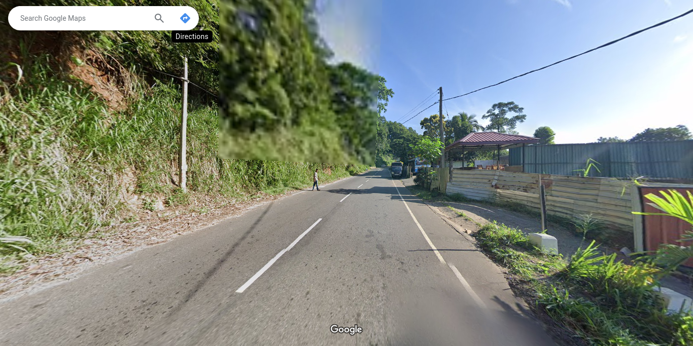

## Ninthavur 17

**Ninthavur 17** Grama Niladhari Division, **Ninthavur** Divisional Secretariat Division, **Ampara** District, **Eastern** Province

**Pothuvil** Polling Division, **Digamadulla** Electoral District

Population: 758 (2012)

(**LK-5230060**/38C)

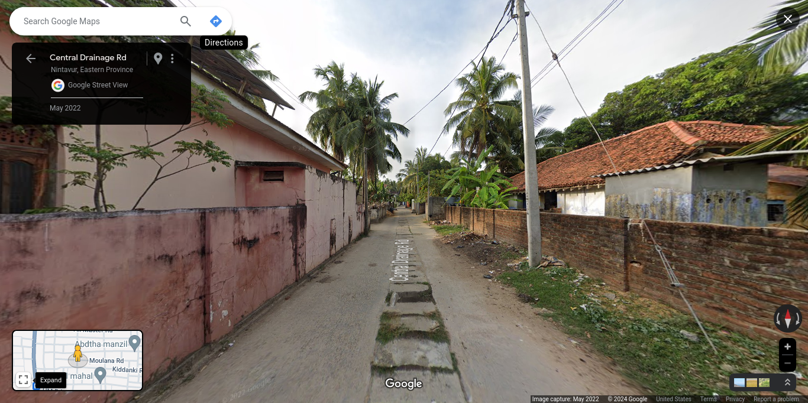

## Puloly Centre

**Puloly Centre** Grama Niladhari Division, **Vadamaradchi North (Point Pedro)** Divisional Secretariat Division, **Jaffna** District, **Northern** Province

**Point Pedro** Polling Division, **Jaffna** Electoral District

Population: 1,602 (2012)

(**LK-4127135**/J/409)

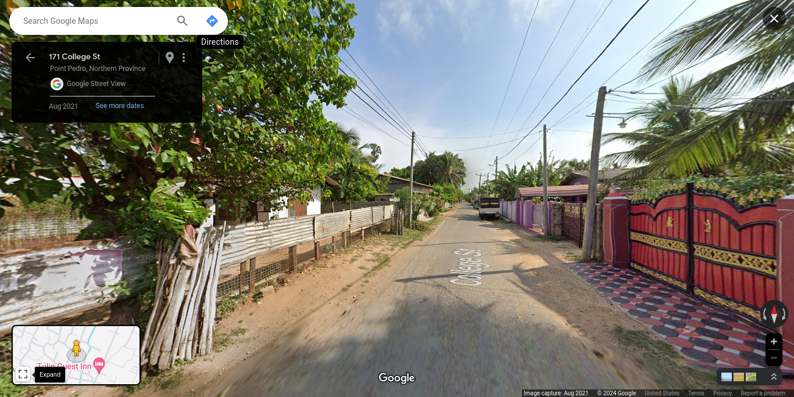

## Kudahakapola North

**Kudahakapola North** Grama Niladhari Division, **Ja-Ela** Divisional Secretariat Division, **Gampaha** District, **Western** Province

**Ja Ela** Polling Division, **Gampaha** Electoral District

Population: 1,819 (2012)

(**LK-1221020**/196)

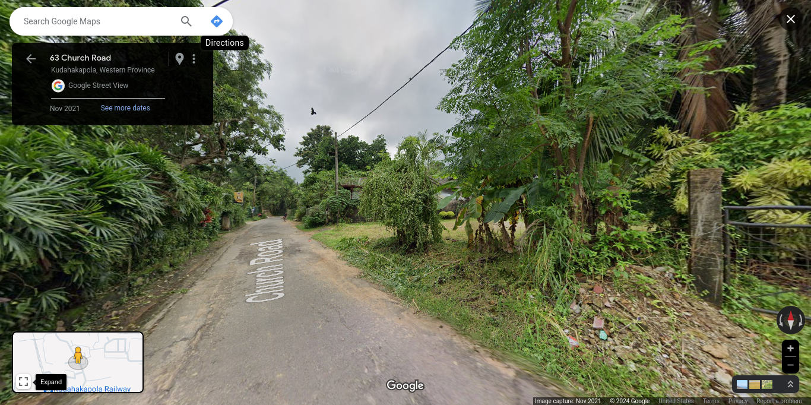

## Makandana west

**Makandana west** Grama Niladhari Division, **Kesbewa** Divisional Secretariat Division, **Colombo** District, **Western** Province

**Kesbewa** Polling Division, **Colombo** Electoral District

Population: 4,434 (2012)

(**LK-1136315**/569A)

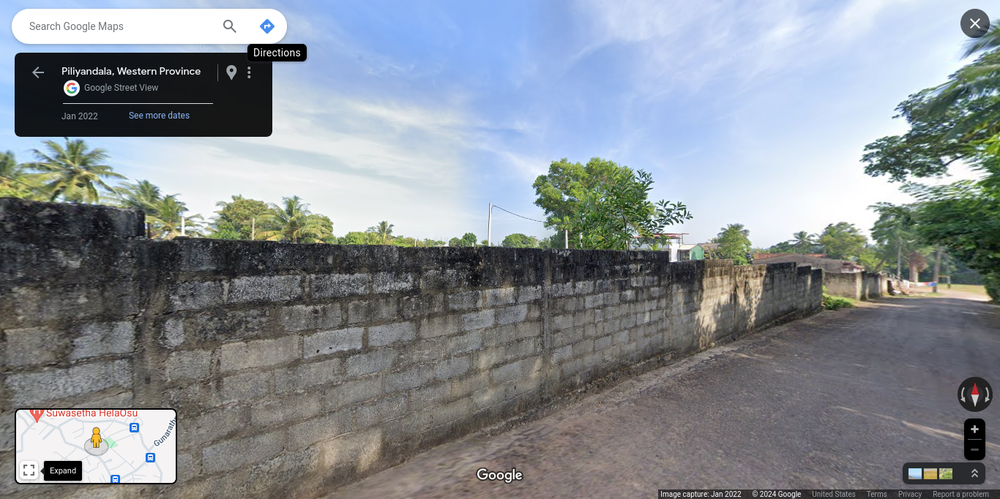

## Bope West

**Bope West** Grama Niladhari Division, **Galle Four Gravets** Divisional Secretariat Division, **Galle** District, **Southern** Province

**Galle** Polling Division, **Galle** Electoral District

Population: 1,758 (2012)

(**LK-3139120**/119)

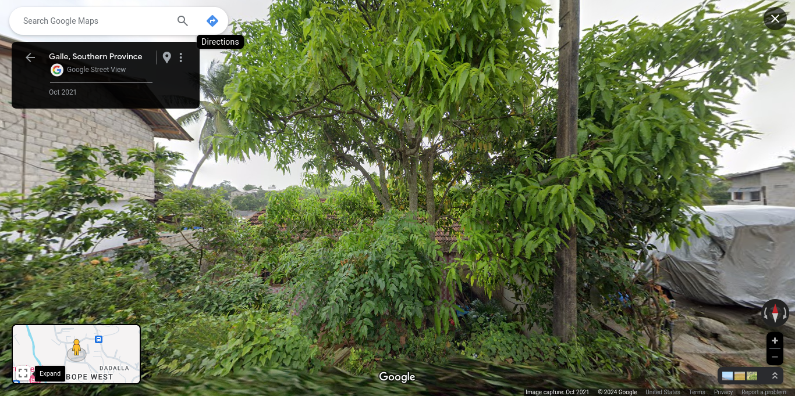

## Havelock Town

**Havelock Town** Grama Niladhari Division, **Thimbirigasyaya** Divisional Secretariat Division, **Colombo** District, **Western** Province

**Colombo West** Polling Division, **Colombo** Electoral District

Population: 7,400 (2012)

(**LK-1127070**/)

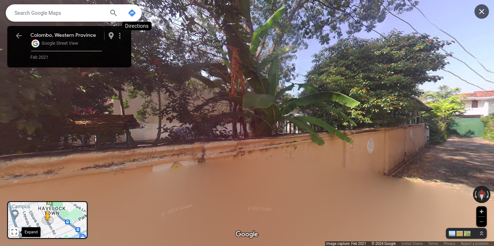

## Indipokunagoda South

**Indipokunagoda South** Grama Niladhari Division, **Tangalle** Divisional Secretariat Division, **Hambantota** District, **Southern** Province

**Tangalle** Polling Division, **Hambantota** Electoral District

Population: 573 (2012)

(**LK-3333250**/271)

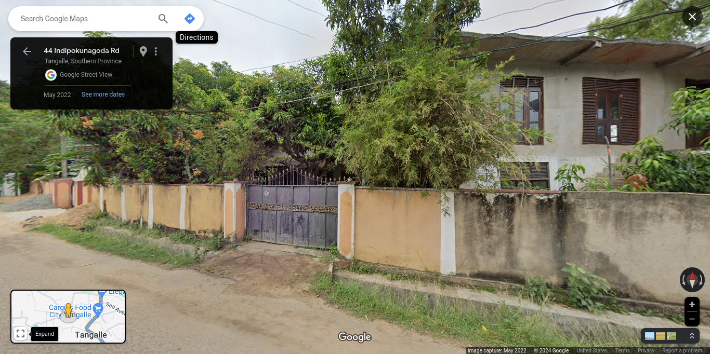

## Vigoda

**Vigoda** Grama Niladhari Division, **Minuwangoda** Divisional Secretariat Division, **Gampaha** District, **Western** Province

**Minuwangoda** Polling Division, **Gampaha** Electoral District

Population: 1,864 (2012)

(**LK-1215375**/128)

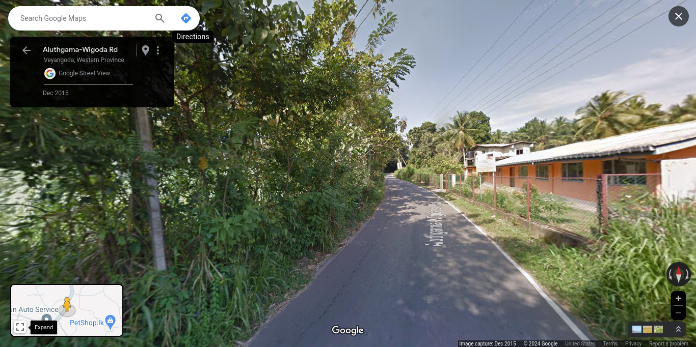

## Manabharana

**Manabharana** Grama Niladhari Division, **Siyambalanduwa** Divisional Secretariat Division, **Moneragala** District, **Uva** Province

**Monaragala** Polling Division, **Moneragala** Electoral District

Population: 1,202 (2012)

(**LK-8212125**/123F)

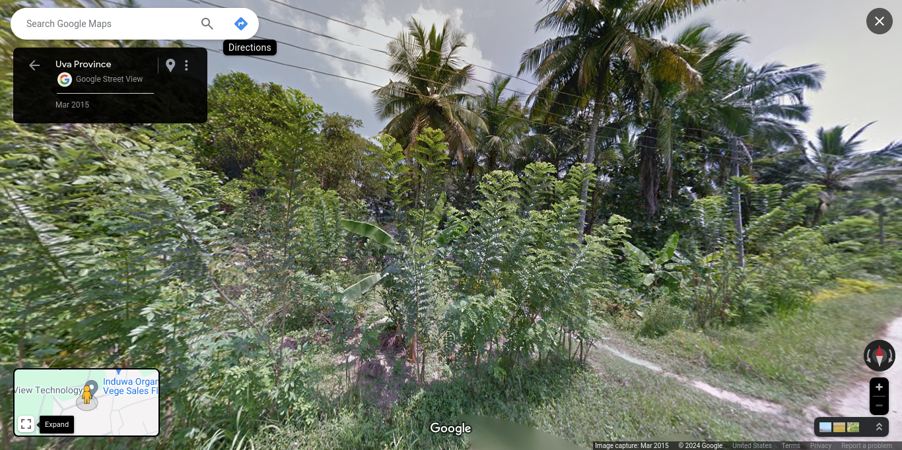

## Kandewela

**Kandewela** Grama Niladhari Division, **Pathahewaheta** Divisional Secretariat Division, **Kandy** District, **Central** Province

**Hewaheta** Polling Division, **Kandy** Electoral District

Population: 534 (2012)

(**LK-2145275**/1013)

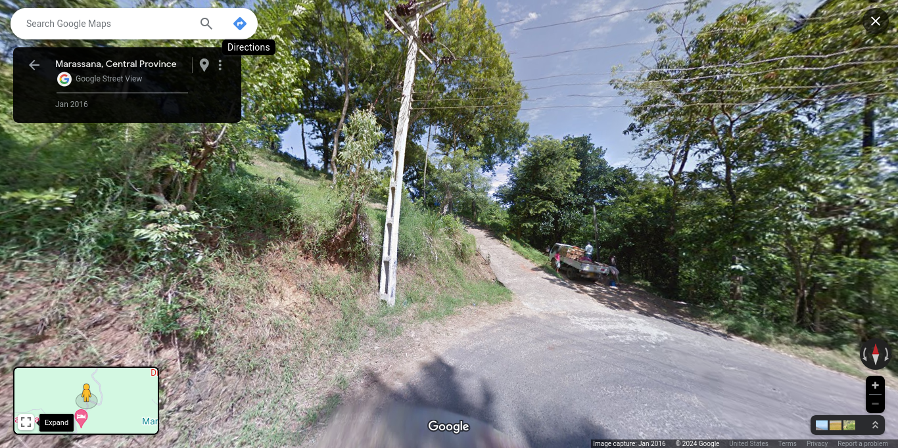

## Pangamvilayaya

**Pangamvilayaya** Grama Niladhari Division, **Katuwana** Divisional Secretariat Division, **Hambantota** District, **Southern** Province

**Mulkirigala** Polling Division, **Hambantota** Electoral District

Population: 838 (2012)

(**LK-3324180**/536)

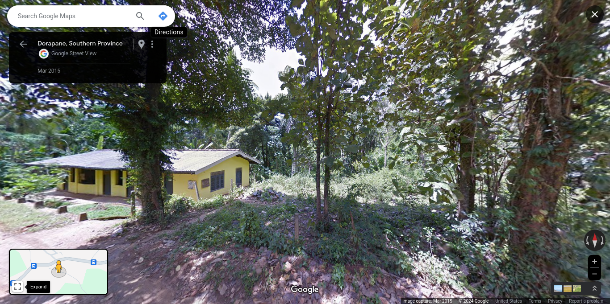

## Handessa

**Handessa** Grama Niladhari Division, **Udunuwara** Divisional Secretariat Division, **Kandy** District, **Central** Province

**Udunuwara** Polling Division, **Kandy** Electoral District

Population: 738 (2012)

(**LK-2139275**/14)

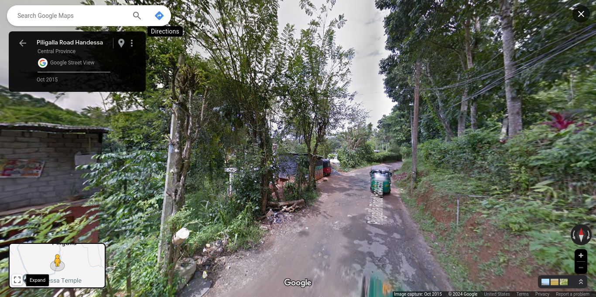

## Kalmunaikudi 07

**Kalmunaikudi 07** Grama Niladhari Division, **Kalmunai** Divisional Secretariat Division, **Ampara** District, **Eastern** Province

**Kalmunai** Polling Division, **Digamadulla** Electoral District

Population: 1,423 (2012)

(**LK-5224120**/KP/56E)

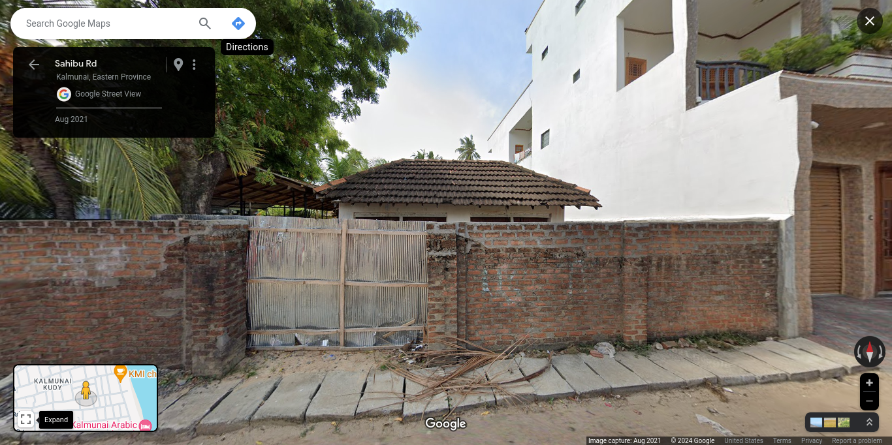

## Udagirigama East

**Udagirigama East** Grama Niladhari Division, **Uhana** Divisional Secretariat Division, **Ampara** District, **Eastern** Province

**Ampara** Polling Division, **Digamadulla** Electoral District

Population: 1,088 (2012)

(**LK-5212165**/W/88B)

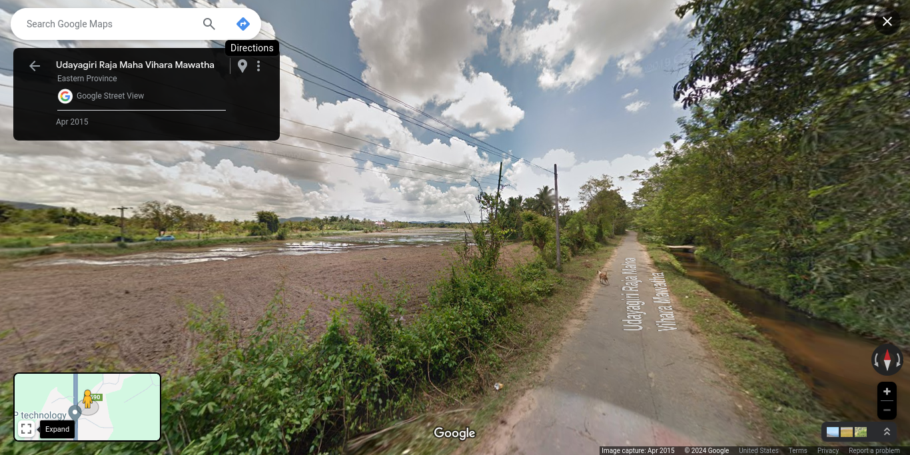

## Malamulla

**Malamulla** Grama Niladhari Division, **Panadura** Divisional Secretariat Division, **Kalutara** District, **Western** Province

**Bandaragama** Polling Division, **Kalutara** Electoral District

Population: 3,731 (2012)

(**LK-1303170**/684)

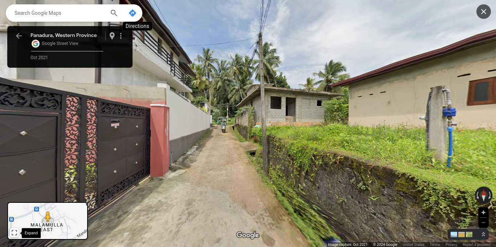

## Nawagampura

**Nawagampura** Grama Niladhari Division, **Ampara** Divisional Secretariat Division, **Ampara** District, **Eastern** Province

**Ampara** Polling Division, **Digamadulla** Electoral District

Population: 3,756 (2012)

(**LK-5215030**/W/89I)

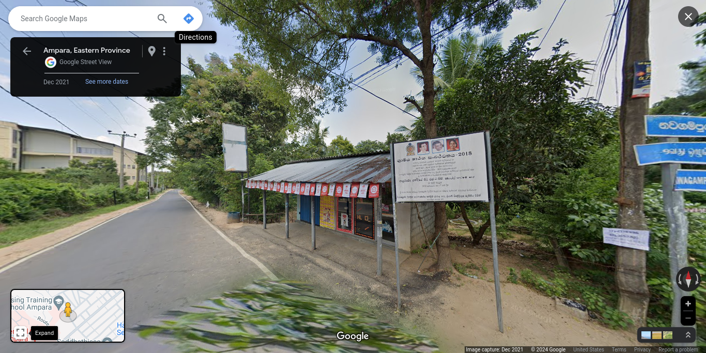

## Abasingama

**Abasingama** Grama Niladhari Division, **Pathadumbara** Divisional Secretariat Division, **Kandy** District, **Central** Province

**Pathadumbara** Polling Division, **Kandy** Electoral District

Population: 1,175 (2012)

(**LK-2112255**/635)

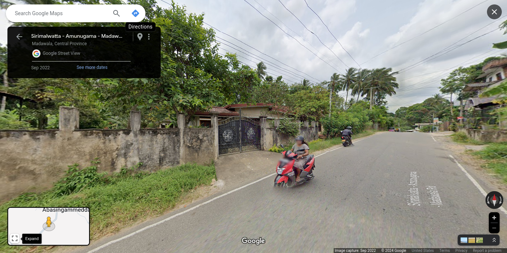

## Halapitiya

**Halapitiya** Grama Niladhari Division, **Horana** Divisional Secretariat Division, **Kalutara** District, **Western** Province

**Horana** Polling Division, **Kalutara** Electoral District

Population: 2,650 (2012)

(**LK-1309060**/606C)

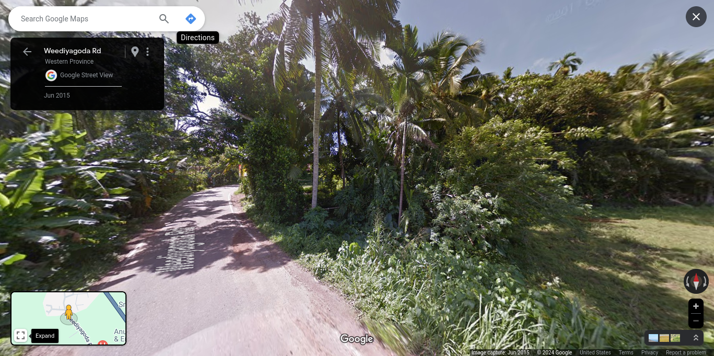

## Dodandoowa

**Dodandoowa** Grama Niladhari Division, **Hikkaduwa** Divisional Secretariat Division, **Galle** District, **Southern** Province

**Ratgama** Polling Division, **Galle** Electoral District

Population: 1,180 (2012)

(**LK-3136350**/51)

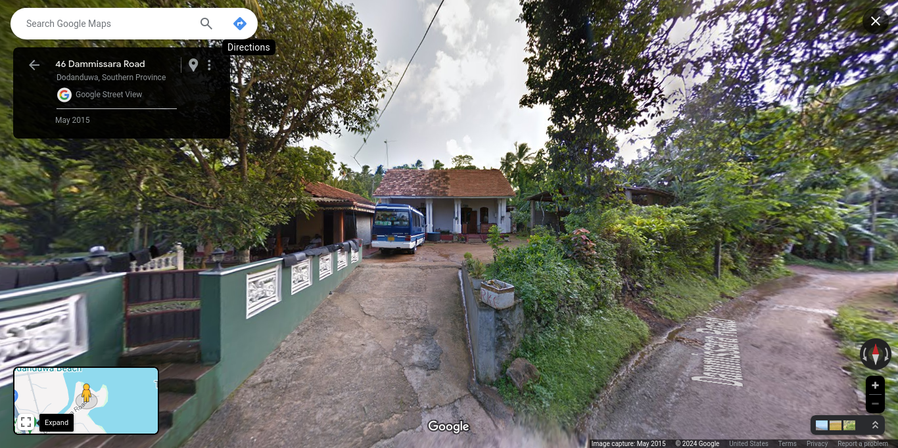

## Badungoda Colony

**Badungoda Colony** Grama Niladhari Division, **Akmeemana** Divisional Secretariat Division, **Galle** District, **Southern** Province

**Akmeemana** Polling Division, **Galle** Electoral District

Population: 786 (2012)

(**LK-3145110**/109H)

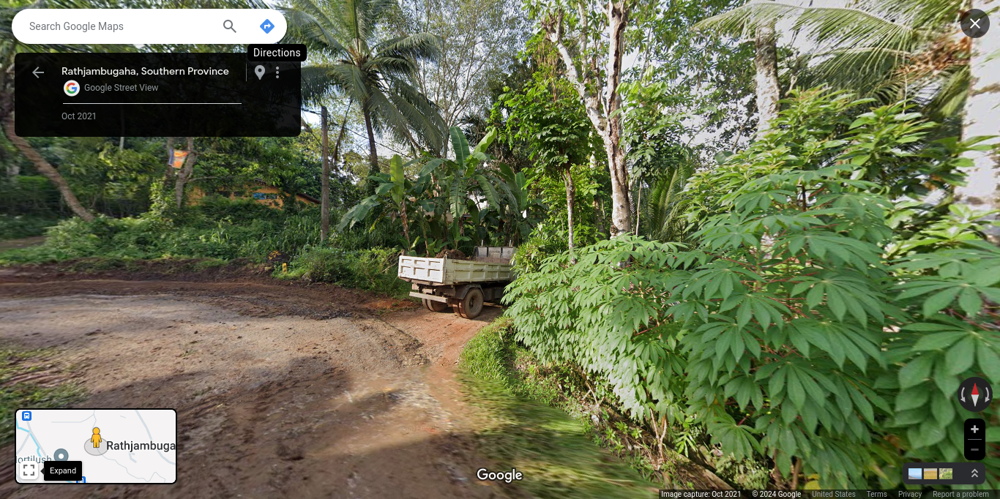

## Selvanayahapuram

**Selvanayahapuram** Grama Niladhari Division, **Trincomalee Town and Gravets** Divisional Secretariat Division, **Trincomalee** District, **Eastern** Province

**Trincomalee** Polling Division, **Trincomalee** Electoral District

Population: 2,220 (2012)

(**LK-5315095**/243M)

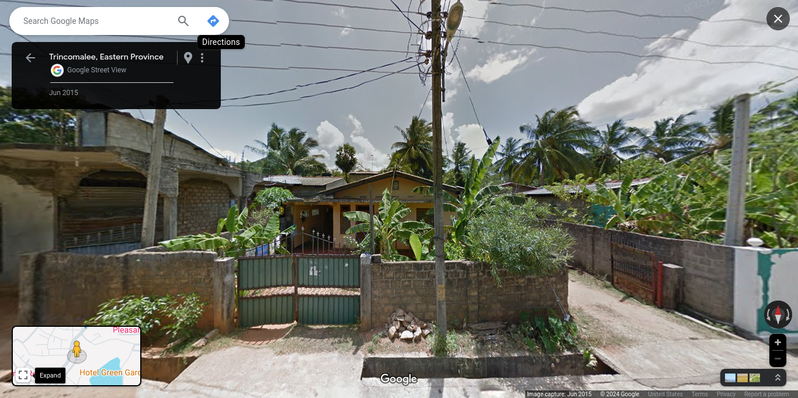

## Dadalla East

**Dadalla East** Grama Niladhari Division, **Galle Four Gravets** Divisional Secretariat Division, **Galle** District, **Southern** Province

**Galle** Polling Division, **Galle** Electoral District

Population: 1,370 (2012)

(**LK-3139130**/102A)

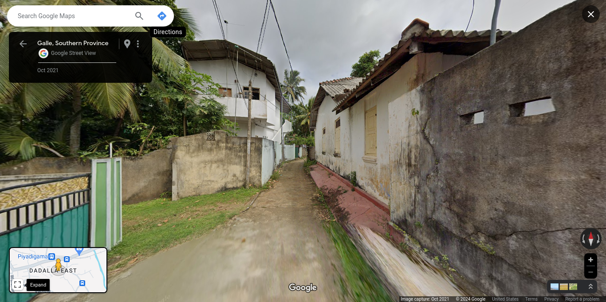

## Doragamuwa

**Doragamuwa** Grama Niladhari Division, **Pathadumbara** Divisional Secretariat Division, **Kandy** District, **Central** Province

**Pathadumbara** Polling Division, **Kandy** Electoral District

Population: 2,115 (2012)

(**LK-2112025**/600)

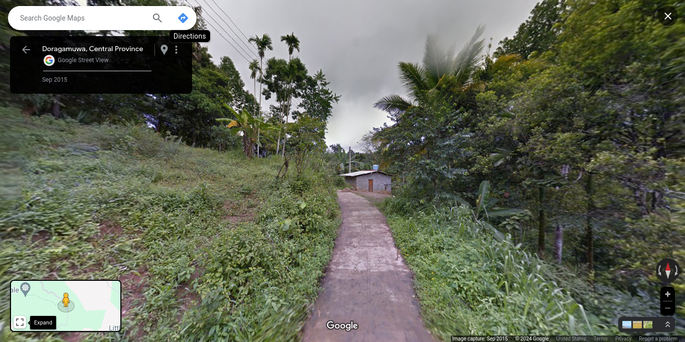

## Kusalanagama

**Kusalanagama** Grama Niladhari Division, **Ipalogama** Divisional Secretariat Division, **Anuradhapura** District, **North Central** Province

**Kalawewa** Polling Division, **Anuradhapura** Electoral District

Population: 1,529 (2012)

(**LK-7160150**/491)

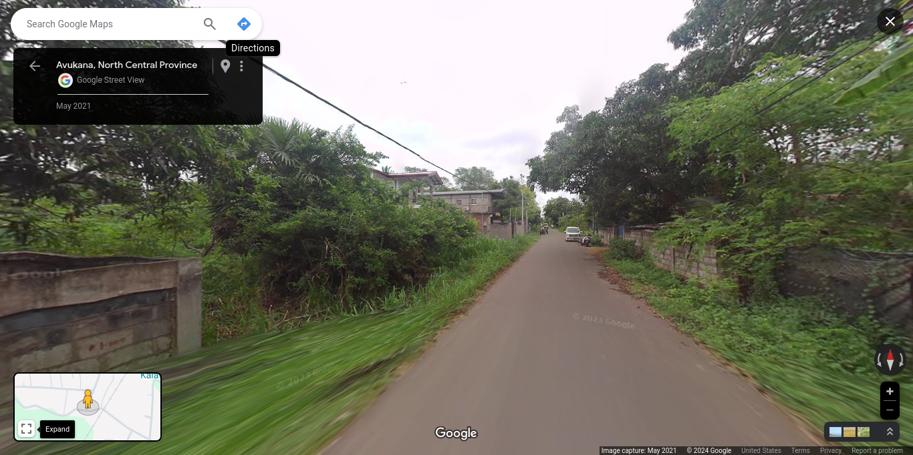

## Aththai

**Aththai** Grama Niladhari Division, **Vadamaradchi South-West (Karaveddy)** Divisional Secretariat Division, **Jaffna** District, **Northern** Province

**Point Pedro** Polling Division, **Jaffna** Electoral District

Population: 746 (2012)

(**LK-4121170**/J/381)

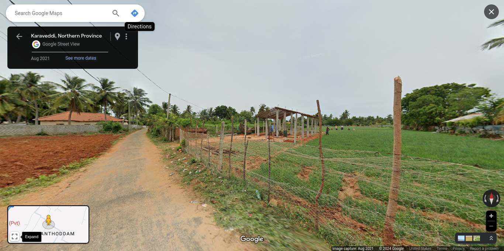

## Thavady North

**Thavady North** Grama Niladhari Division, **Valikamam South (Uduvil)** Divisional Secretariat Division, **Jaffna** District, **Northern** Province

**Manipay** Polling Division, **Jaffna** Electoral District

Population: 1,705 (2012)

(**LK-4115065**/J/194)

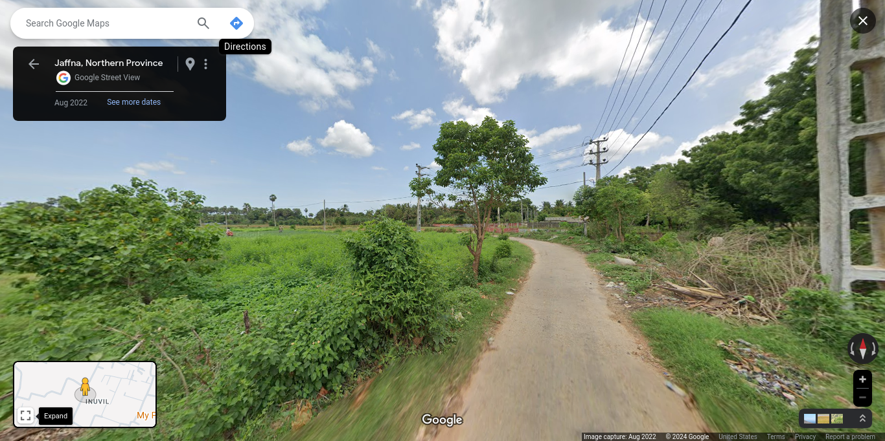

## Kotuwegedara South

**Kotuwegedara South** Grama Niladhari Division, **Matale** Divisional Secretariat Division, **Matale** District, **Central** Province

**Matale** Polling Division, **Matale** Electoral District

Population: 1,563 (2012)

(**LK-2218260**/E348B)

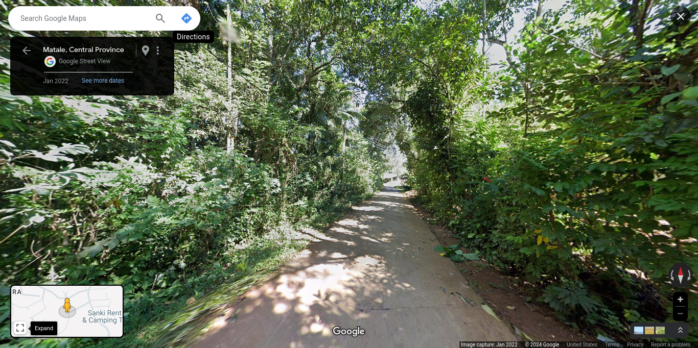

## Kaithady Nunavil

**Kaithady Nunavil** Grama Niladhari Division, **Thenmaradchi (Chavakachcheri)** Divisional Secretariat Division, **Jaffna** District, **Northern** Province

**Chavakachcheri** Polling Division, **Jaffna** Electoral District

Population: 706 (2012)

(**LK-4130110**/J/309)

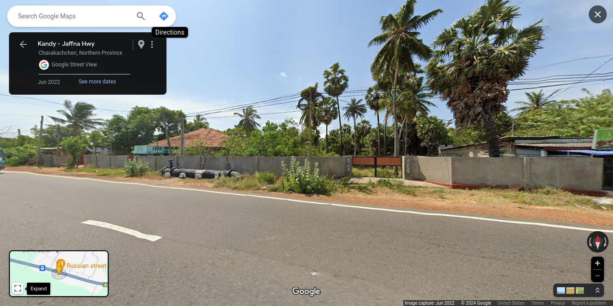

## Uggalbada East

**Uggalbada East** Grama Niladhari Division, **Kalutara** Divisional Secretariat Division, **Kalutara** District, **Western** Province

**Kalutara** Polling Division, **Kalutara** Electoral District

Population: 1,444 (2012)

(**LK-1321220**/716)

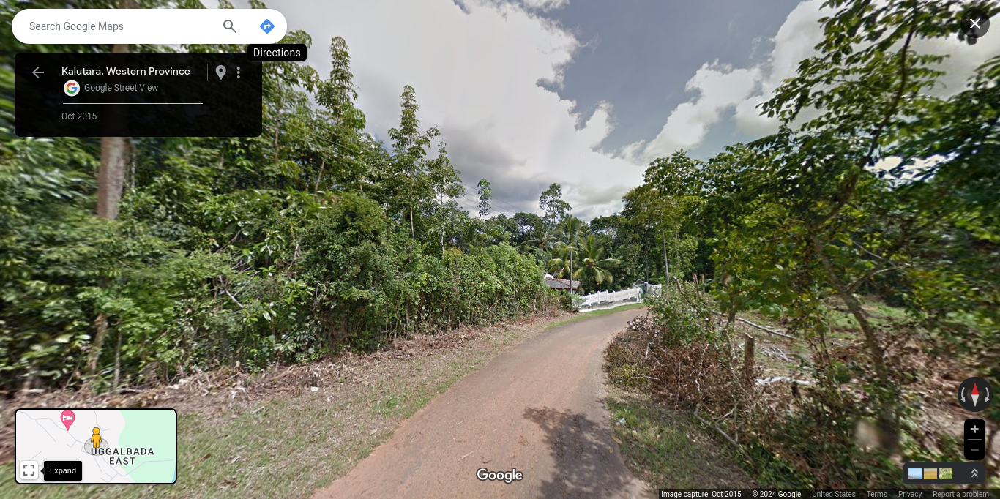

## Mankadawala

**Mankadawala** Grama Niladhari Division, **Nuwaragam Palatha Central** Divisional Secretariat Division, **Anuradhapura** District, **North Central** Province

**Anuradhapura West** Polling Division, **Anuradhapura** Electoral District

Population: 2,271 (2012)

(**LK-7115075**/313)

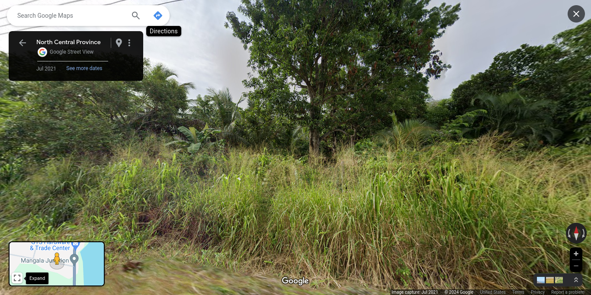

## Parakramapura

**Parakramapura** Grama Niladhari Division, **Lunugamvehera** Divisional Secretariat Division, **Hambantota** District, **Southern** Province

**Thissamaharama** Polling Division, **Hambantota** Electoral District

Population: 448 (2012)

(**LK-3306165**/74)

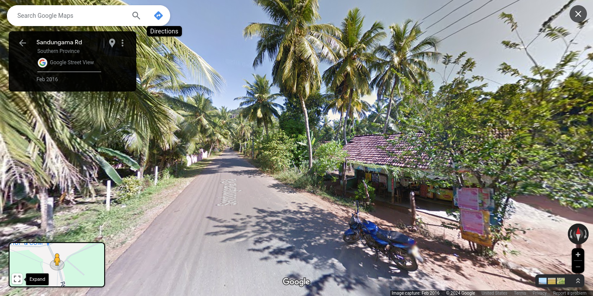

## Vannarponnai N.E. (North)

**Vannarponnai N.E. (North)** Grama Niladhari Division, **Nallur** Divisional Secretariat Division, **Jaffna** District, **Northern** Province

**Nallur** Polling Division, **Jaffna** Electoral District

Population: 2,260 (2012)

(**LK-4133060**/J/100)

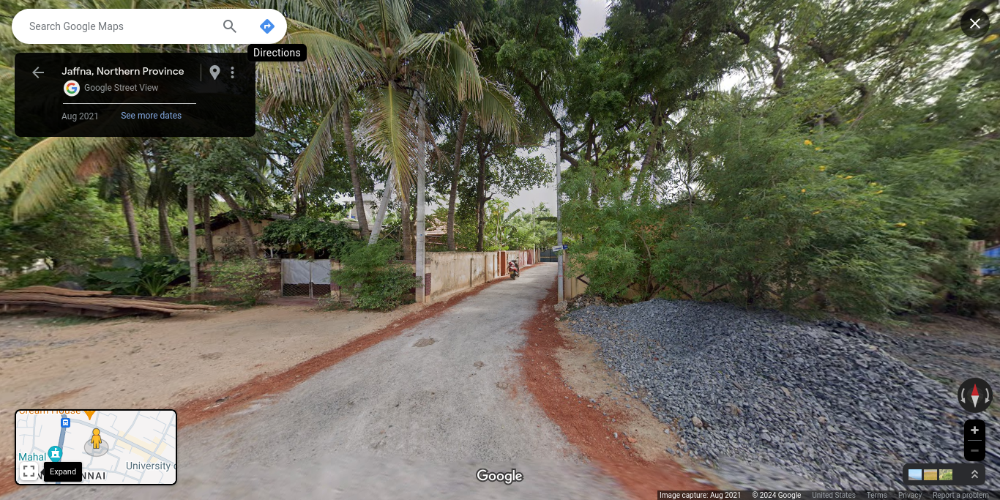

## Thunnalai

**Thunnalai** Grama Niladhari Division, **Vadamaradchi South-West (Karaveddy)** Divisional Secretariat Division, **Jaffna** District, **Northern** Province

**Udupiddy** Polling Division, **Jaffna** Electoral District

Population: 678 (2012)

(**LK-4121125**/J/372)

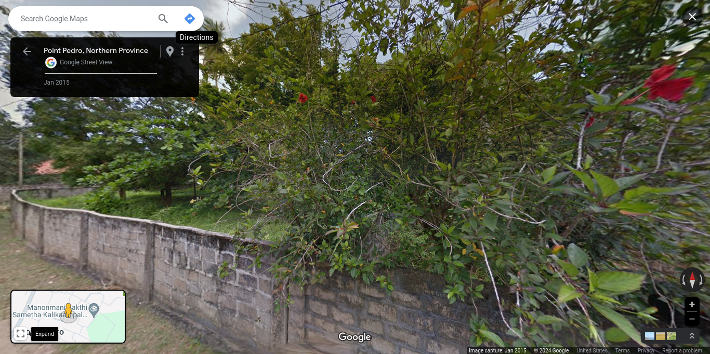

## Wevurukannala

**Wevurukannala** Grama Niladhari Division, **Dickwella** Divisional Secretariat Division, **Matara** District, **Southern** Province

**Devinuwara** Polling Division, **Matara** Electoral District

Population: 1,147 (2012)

(**LK-3248110**/452A)

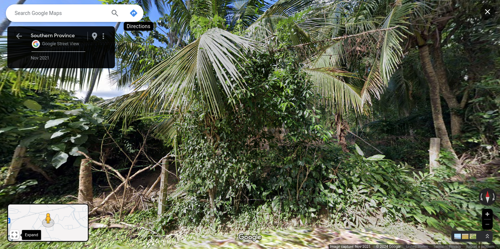

## Humbuluwa East

**Humbuluwa East** Grama Niladhari Division, **Alawwa** Divisional Secretariat Division, **Kurunegala** District, **North Western** Province

**Dambadeniya** Polling Division, **Kurunegala** Electoral District

Population: 1,227 (2012)

(**LK-6184210**/1006)

## Obesekarapura

**Obesekarapura** Grama Niladhari Division, **Sri Jayawardanapura Kotte** Divisional Secretariat Division, **Colombo** District, **Western** Province

**Kotte** Polling Division, **Colombo** Electoral District

Population: 11,963 (2012)

(**LK-1124005**/514C)

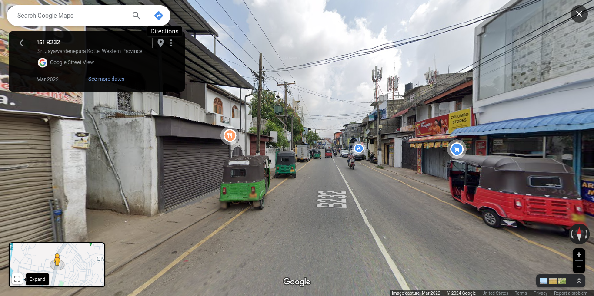

## Dangedara West

**Dangedara West** Grama Niladhari Division, **Galle Four Gravets** Divisional Secretariat Division, **Galle** District, **Southern** Province

**Galle** Polling Division, **Galle** Electoral District

Population: 1,834 (2012)

(**LK-3139100**/98D)

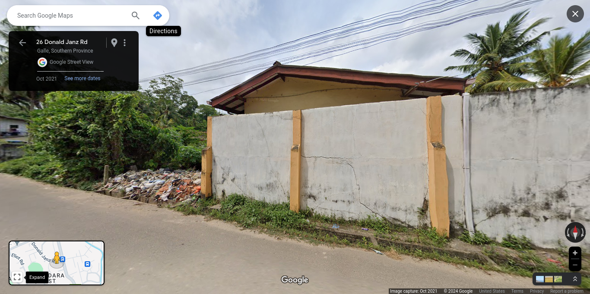

## Pudukudirippuwa

**Pudukudirippuwa** Grama Niladhari Division, **Puttalam** Divisional Secretariat Division, **Puttalam** District, **North Western** Province

**Puttalam** Polling Division, **Puttalam** Electoral District

Population: 6,751 (2012)

(**LK-6215035**/617F)

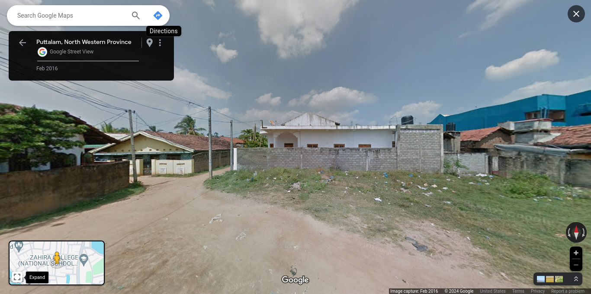

## Kalutara South

**Kalutara South** Grama Niladhari Division, **Kalutara** Divisional Secretariat Division, **Kalutara** District, **Western** Province

**Kalutara** Polling Division, **Kalutara** Electoral District

Population: 1,721 (2012)

(**LK-1321280**/725)

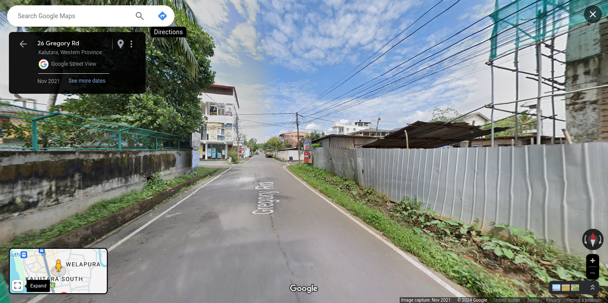

## Puliyankulam

**Puliyankulam** Grama Niladhari Division, **Oddusuddan** Divisional Secretariat Division, **Mullaitivu** District, **Northern** Province

**Mullaitivu** Polling Division, **Vanni** Electoral District

Population: 314 (2012)

(**LK-4412110**/MU/67)

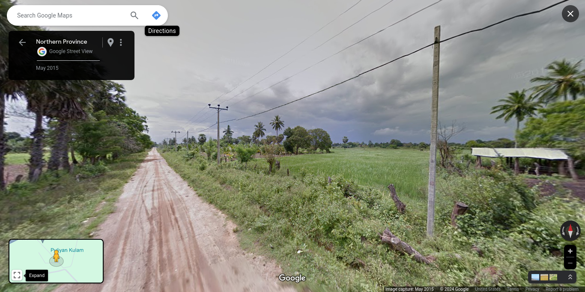

## Maligaspe

**Maligaspe** Grama Niladhari Division, **Galle Four Gravets** Divisional Secretariat Division, **Galle** District, **Southern** Province

**Galle** Polling Division, **Galle** Electoral District

Population: 983 (2012)

(**LK-3139090**/101E)

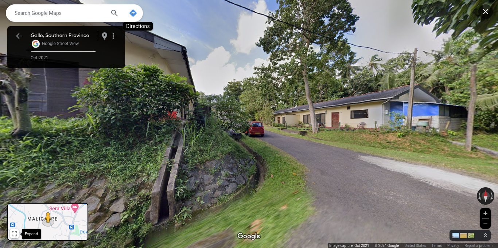

## Katuwapitiya

**Katuwapitiya** Grama Niladhari Division, **Katana** Divisional Secretariat Division, **Gampaha** District, **Western** Province

**Katana** Polling Division, **Gampaha** Electoral District

Population: 2,345 (2012)

(**LK-1206120**/161B)

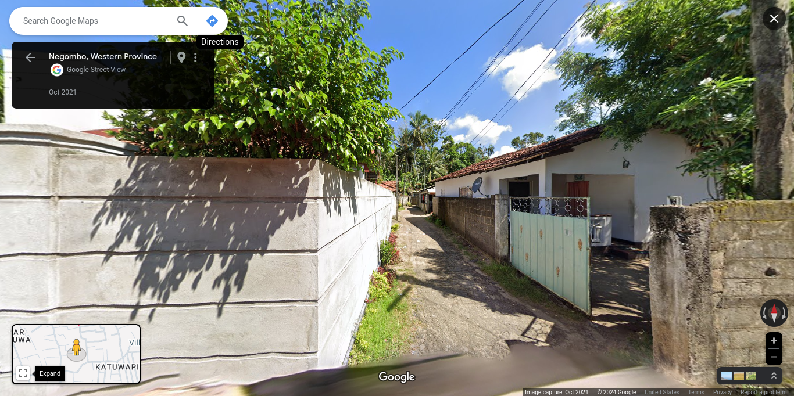

## Koorempola

**Koorempola** Grama Niladhari Division, **Rambukkana** Divisional Secretariat Division, **Kegalle** District, **Sabaragamuwa** Province

**Rambukkana** Polling Division, **Kegalle** Electoral District

Population: 1,436 (2012)

(**LK-9203275**/10B)

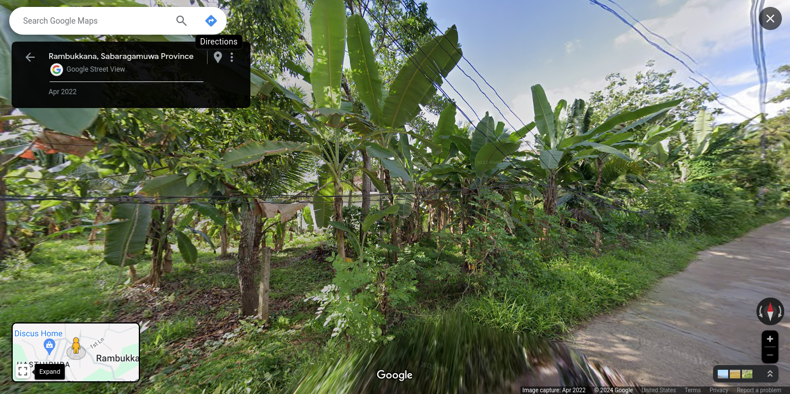

## Karuwaddukal 01

**Karuwaddukal 01** Grama Niladhari Division, **Samanthurai** Divisional Secretariat Division, **Ampara** District, **Eastern** Province

**Samanthurai** Polling Division, **Digamadulla** Electoral District

Population: 1,333 (2012)

(**LK-5218050**/92A)

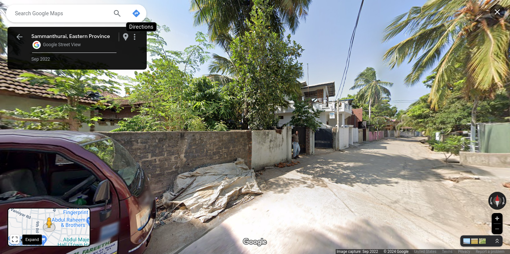

## Malabe West

**Malabe West** Grama Niladhari Division, **Kaduwela** Divisional Secretariat Division, **Colombo** District, **Western** Province

**Kaduwela** Polling Division, **Colombo** Electoral District

Population: 5,141 (2012)

(**LK-1109130**/476A)

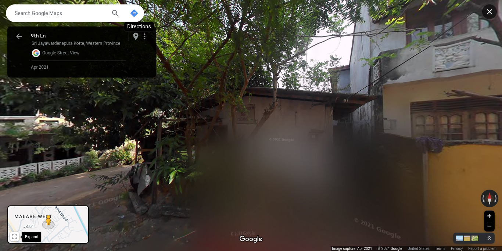

## Malwatta

**Malwatta** Grama Niladhari Division, **Attanagalla** Divisional Secretariat Division, **Gampaha** District, **Western** Province

**Attanagalla** Polling Division, **Gampaha** Electoral District

Population: 2,288 (2012)

(**LK-1227255**/348/E)

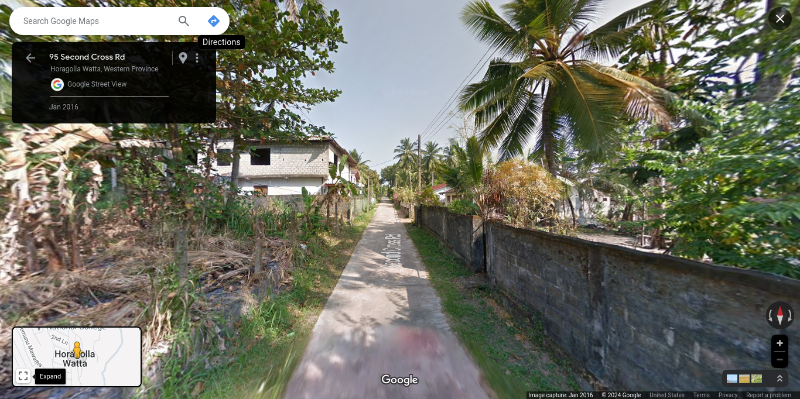

## Lindara Ihala

**Lindara Ihala** Grama Niladhari Division, **Mirigama** Divisional Secretariat Division, **Gampaha** District, **Western** Province

**Mirigama** Polling Division, **Gampaha** Electoral District

Population: 499 (2012)

(**LK-1212335**/16C)

## Hathnagoda

**Hathnagoda** Grama Niladhari Division, **Udunuwara** Divisional Secretariat Division, **Kandy** District, **Central** Province

**Udunuwara** Polling Division, **Kandy** Electoral District

Population: 1,032 (2012)

(**LK-2139450**/62)

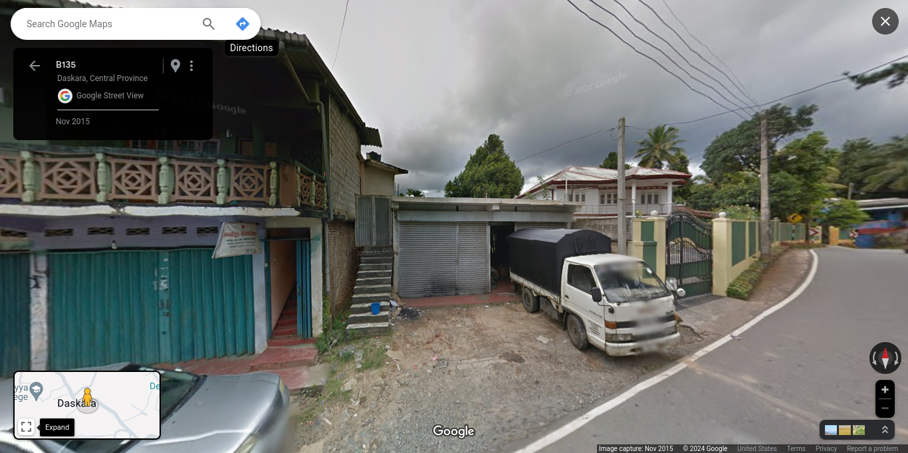

## Henegama

**Henegama** Grama Niladhari Division, **Pujapitiya** Divisional Secretariat Division, **Kandy** District, **Central** Province

**Harispattuwa** Polling Division, **Kandy** Electoral District

Population: 550 (2012)

(**LK-2106185**/495)

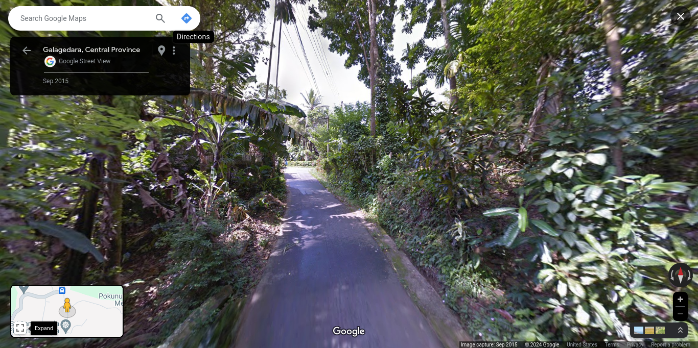

## Agra Pedesa

**Agra Pedesa** Grama Niladhari Division, **Seethawaka** Divisional Secretariat Division, **Colombo** District, **Western** Province

**Avissawella** Polling Division, **Colombo** Electoral District

Population: 2,001 (2012)

(**LK-1115060**/432G)

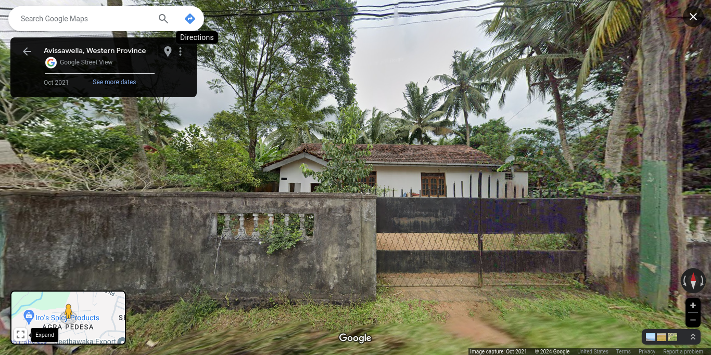

## Kondavil South East

**Kondavil South East** Grama Niladhari Division, **Nallur** Divisional Secretariat Division, **Jaffna** District, **Northern** Province

**Nallur** Polling Division, **Jaffna** Electoral District

Population: 1,589 (2012)

(**LK-4133160**/J/120)

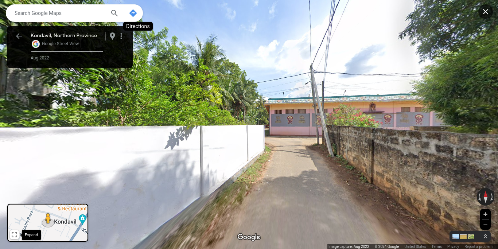

## Elapatha

**Elapatha** Grama Niladhari Division, **Elapatha** Divisional Secretariat Division, **Ratnapura** District, **Sabaragamuwa** Province

**Nivithigala** Polling Division, **Ratnapura** Electoral District

Population: 2,611 (2012)

(**LK-9127050**/185)

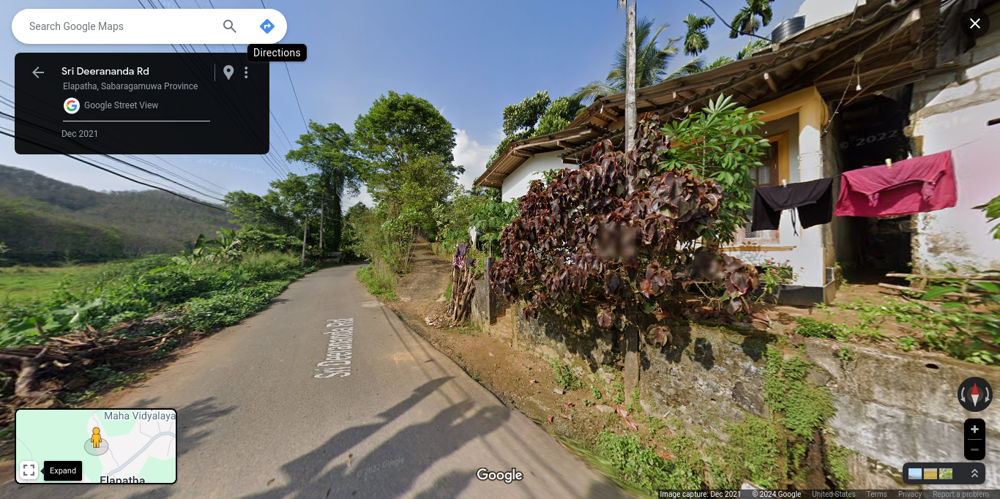

## Neluwa

**Neluwa** Grama Niladhari Division, **Hali-Ela** Divisional Secretariat Division, **Badulla** District, **Uva** Province

**Hali Ela** Polling Division, **Badulla** Electoral District

Population: 2,012 (2012)

(**LK-8124240**/56C)

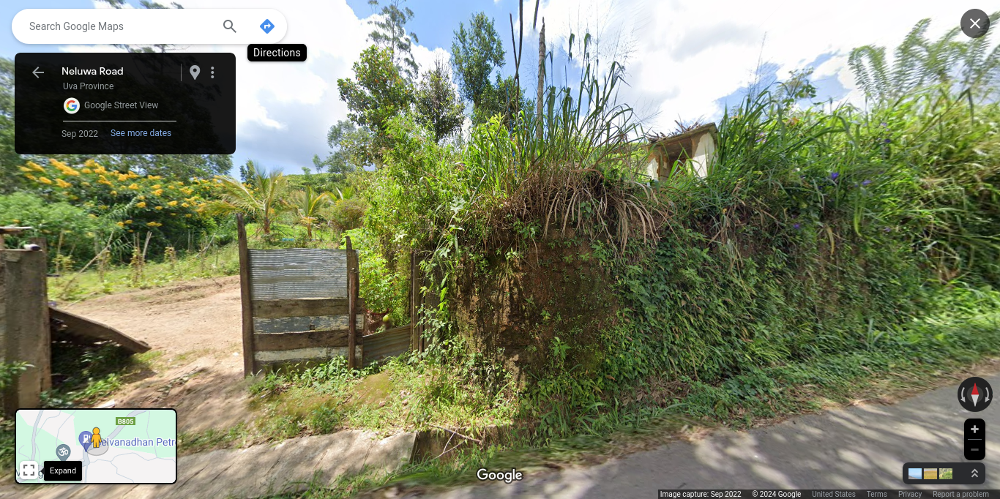

## Diddenipotha South

**Diddenipotha South** Grama Niladhari Division, **Mulatiyana** Divisional Secretariat Division, **Matara** District, **Southern** Province

**Hakmana** Polling Division, **Matara** Electoral District

Population: 1,014 (2012)

(**LK-3212100**/302A)

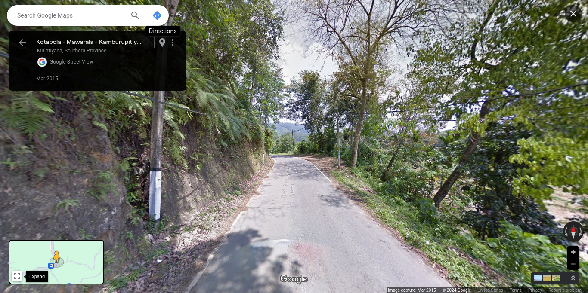

## Parape South

**Parape South** Grama Niladhari Division, **Rambukkana** Divisional Secretariat Division, **Kegalle** District, **Sabaragamuwa** Province

**Rambukkana** Polling Division, **Kegalle** Electoral District

Population: 983 (2012)

(**LK-9203120**/03F)

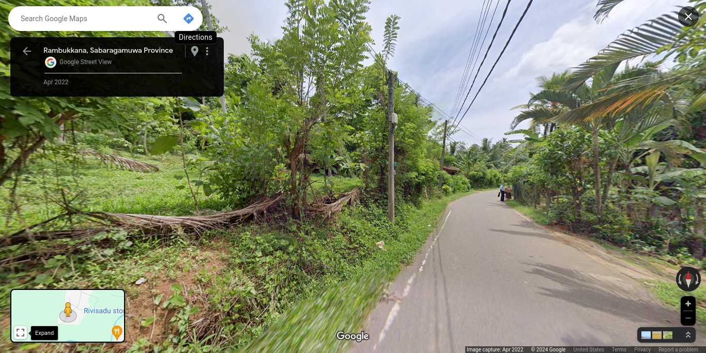

## Batadoowa west

**Batadoowa west** Grama Niladhari Division, **Akmeemana** Divisional Secretariat Division, **Galle** District, **Southern** Province

**Akmeemana** Polling Division, **Galle** Electoral District

Population: 1,317 (2012)

(**LK-3145285**/113A)

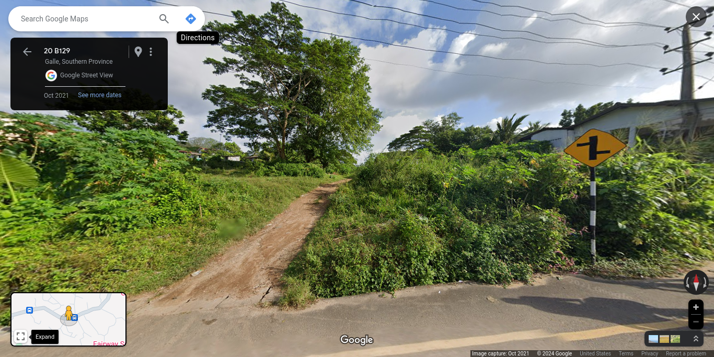

## Bandarawatta West

**Bandarawatta West** Grama Niladhari Division, **Katana** Divisional Secretariat Division, **Gampaha** District, **Western** Province

**Katana** Polling Division, **Gampaha** Electoral District

Population: 4,127 (2012)

(**LK-1206350**/145)

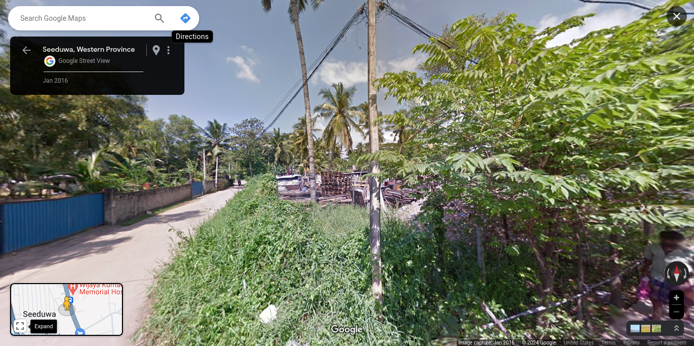

## Ganemulla North

**Ganemulla North** Grama Niladhari Division, **Gampaha** Divisional Secretariat Division, **Gampaha** District, **Western** Province

**Gampaha** Polling Division, **Gampaha** Electoral District

Population: 2,127 (2012)

(**LK-1224340**/236B)

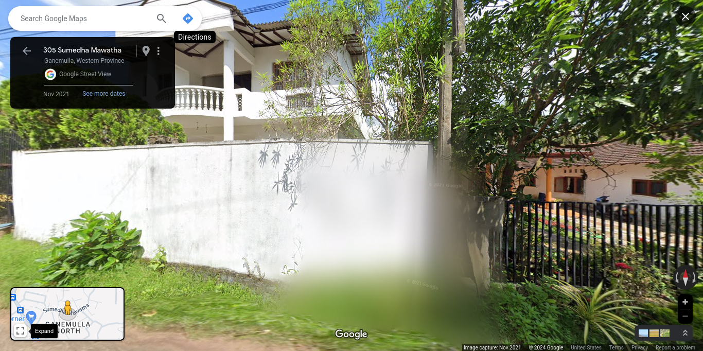

## Dodamwatta

**Dodamwatta** Grama Niladhari Division, **Haputale** Divisional Secretariat Division, **Badulla** District, **Uva** Province

**Haputale** Polling Division, **Badulla** Electoral District

Population: 1,500 (2012)

(**LK-8139035**/63G)

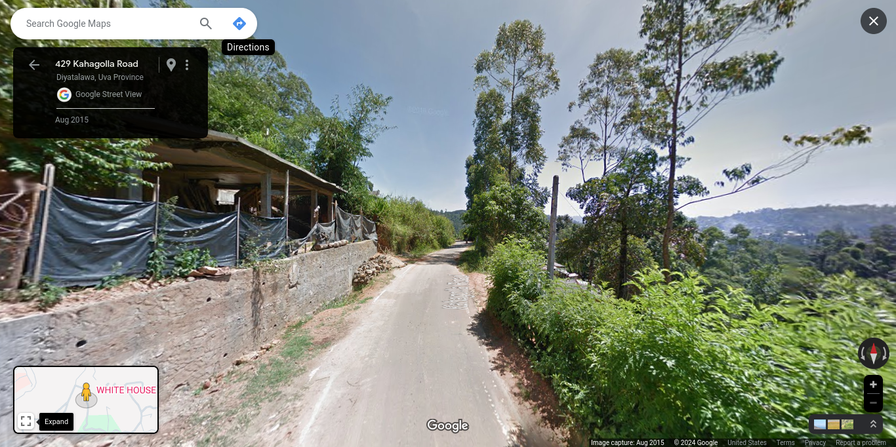

## Galpottayaya South

**Galpottayaya South** Grama Niladhari Division, **Weeraketiya** Divisional Secretariat Division, **Hambantota** District, **Southern** Province

**Mulkirigala** Polling Division, **Hambantota** Electoral District

Population: 466 (2012)

(**LK-3321075**/419)

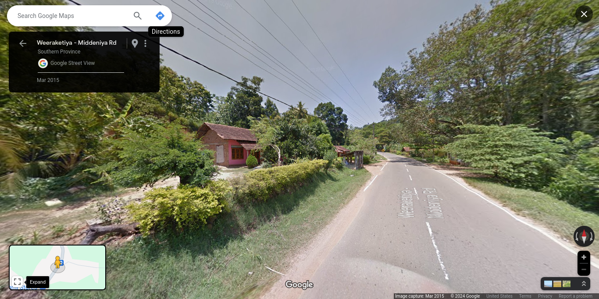

## Mambulgoda

**Mambulgoda** Grama Niladhari Division, **Homagama** Divisional Secretariat Division, **Colombo** District, **Western** Province

**Homagama** Polling Division, **Colombo** Electoral District

Population: 2,983 (2012)

(**LK-1112210**/500A)

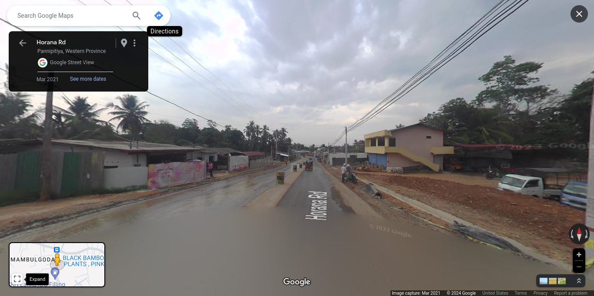

## Werahera South

**Werahera South** Grama Niladhari Division, **Kesbewa** Divisional Secretariat Division, **Colombo** District, **Western** Province

**Kesbewa** Polling Division, **Colombo** Electoral District

Population: 5,213 (2012)

(**LK-1136085**/577A)

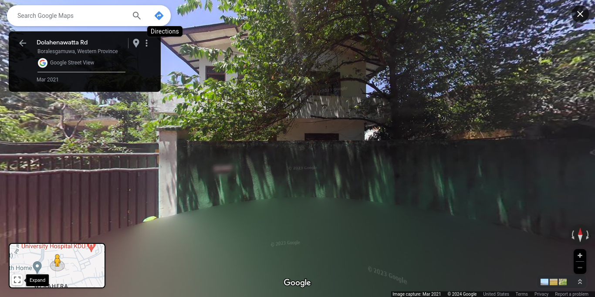

## Doowemodara

**Doowemodara** Grama Niladhari Division, **Balapitiya** Divisional Secretariat Division, **Galle** District, **Southern** Province

**Balapitiya** Polling Division, **Galle** Electoral District

Population: 1,536 (2012)

(**LK-3106005**/15)

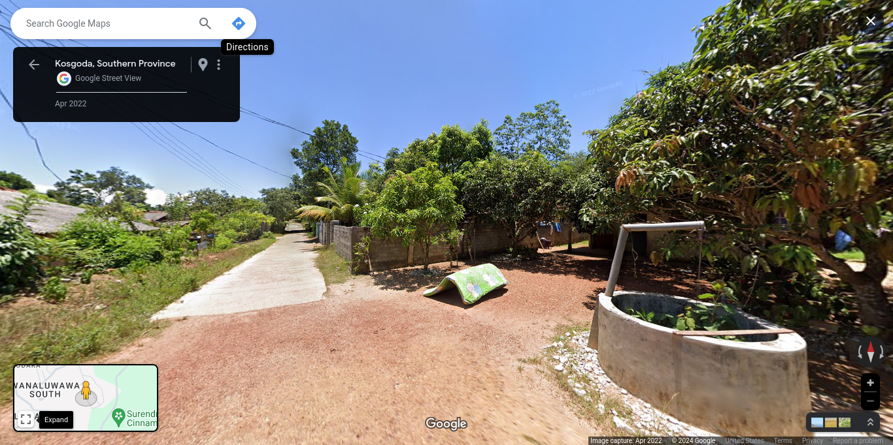

## Wewala East

**Wewala East** Grama Niladhari Division, **Horana** Divisional Secretariat Division, **Kalutara** District, **Western** Province

**Horana** Polling Division, **Kalutara** Electoral District

Population: 2,012 (2012)

(**LK-1309300**/615G)

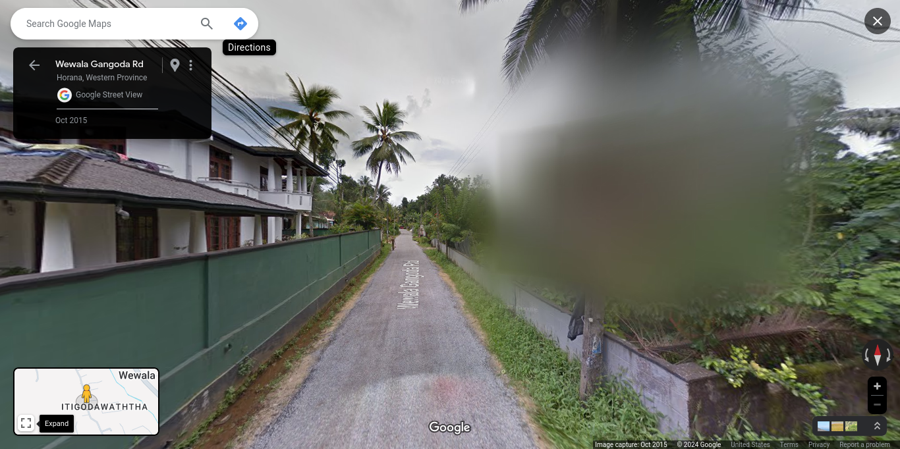

## Sainthamaruthu 08

**Sainthamaruthu 08** Grama Niladhari Division, **Sainthamaruthu** Divisional Secretariat Division, **Ampara** District, **Eastern** Province

**Kalmunai** Polling Division, **Digamadulla** Electoral District

Population: 1,149 (2012)

(**LK-5225040**/KP/50B)

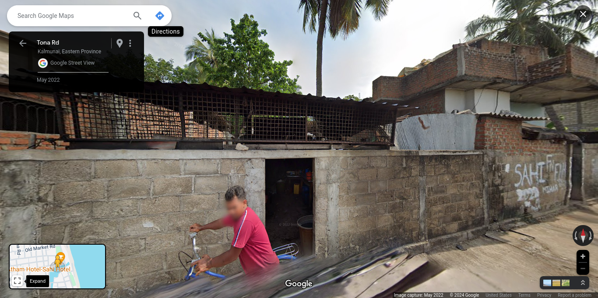

## Ettiligoda North

**Ettiligoda North** Grama Niladhari Division, **Akmeemana** Divisional Secretariat Division, **Galle** District, **Southern** Province

**Akmeemana** Polling Division, **Galle** Electoral District

Population: 886 (2012)

(**LK-3145220**/130A)

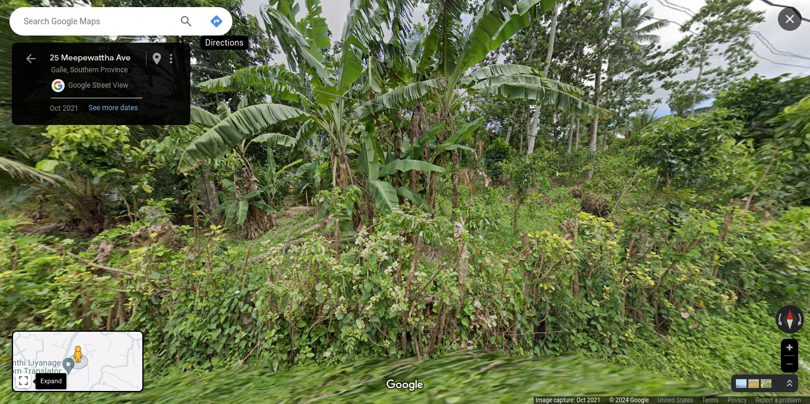

## Jambuketiya

**Jambuketiya** Grama Niladhari Division, **Akmeemana** Divisional Secretariat Division, **Galle** District, **Southern** Province

**Akmeemana** Polling Division, **Galle** Electoral District

Population: 951 (2012)

(**LK-3145230**/130D)

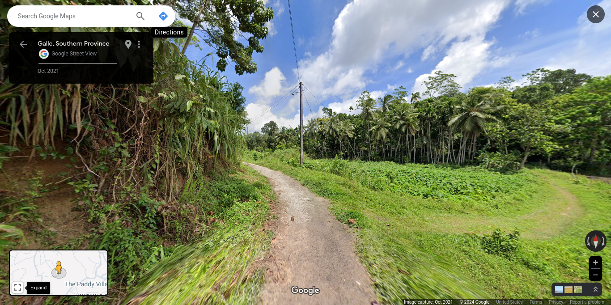

## Doranuwa

**Doranuwa** Grama Niladhari Division, **Ruwanwella** Divisional Secretariat Division, **Kegalle** District, **Sabaragamuwa** Province

**Ruwanwella** Polling Division, **Kegalle** Electoral District

Population: 2,865 (2012)

(**LK-9221100**/105B)

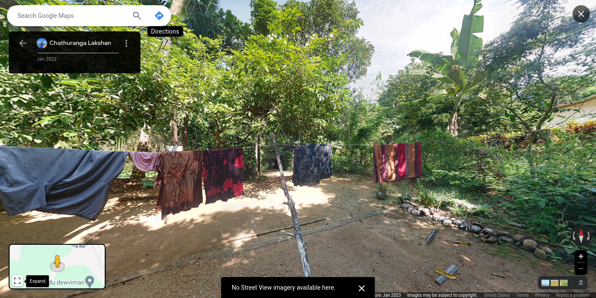

## Track 4

**Track 4** Grama Niladhari Division, **Rajanganaya** Divisional Secretariat Division, **Anuradhapura** District, **North Central** Province

**Kalawewa** Polling Division, **Anuradhapura** Electoral District

Population: 1,355 (2012)

(**LK-7142060**/445)

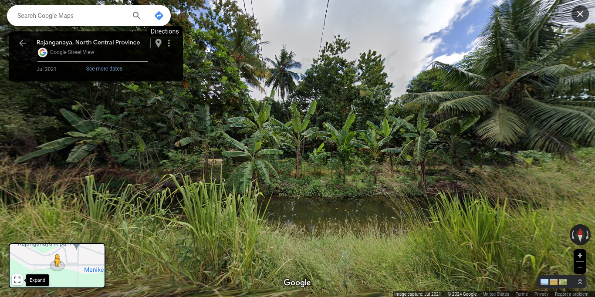

## Egoda Uyana South

**Egoda Uyana South** Grama Niladhari Division, **Moratuwa** Divisional Secretariat Division, **Colombo** District, **Western** Province

**Moratuwa** Polling Division, **Colombo** Electoral District

Population: 5,123 (2012)

(**LK-1133210**/556B)

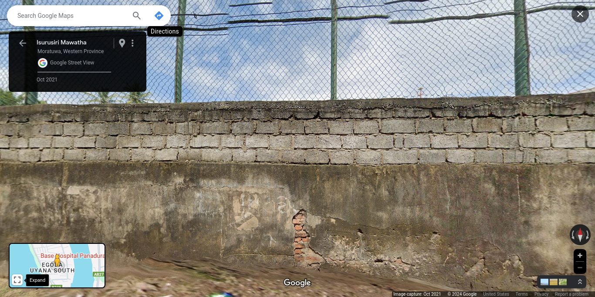

## Rekawa

**Rekawa** Grama Niladhari Division, **Maspotha** Divisional Secretariat Division, **Kurunegala** District, **North Western** Province

**Kurunegala** Polling Division, **Kurunegala** Electoral District

Population: 842 (2012)

(**LK-6151015**/773)

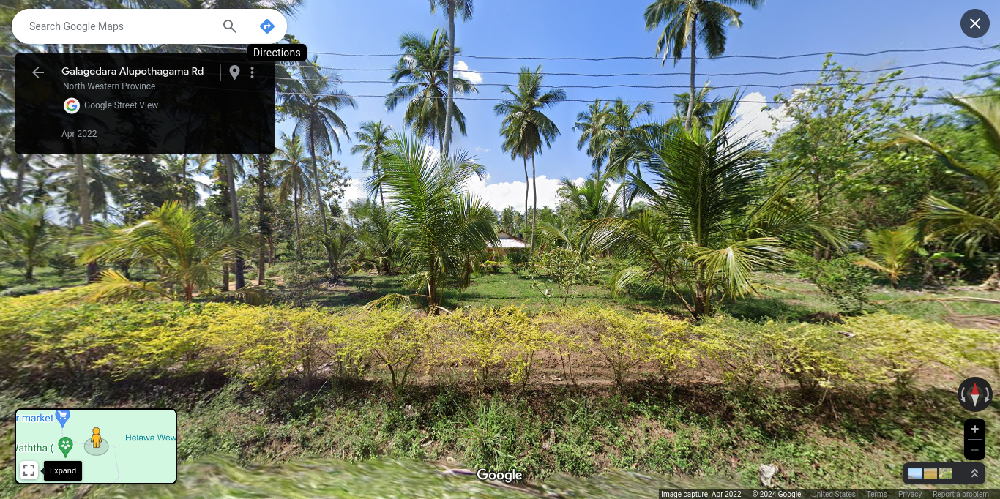

## Olu Ara

**Olu Ara** Grama Niladhari Division, **Okewela** Divisional Secretariat Division, **Hambantota** District, **Southern** Province

**Beliatta** Polling Division, **Hambantota** Electoral District

Population: 708 (2012)

(**LK-3327010**/467)

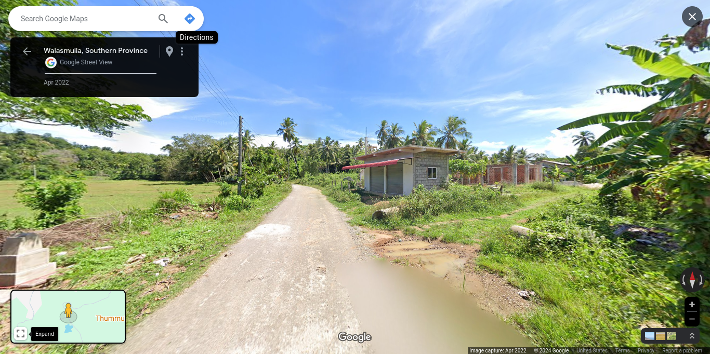

## Akkaraipattu 14

**Akkaraipattu 14** Grama Niladhari Division, **Akkaraipattu** Divisional Secretariat Division, **Ampara** District, **Eastern** Province

**Pothuvil** Polling Division, **Digamadulla** Electoral District

Population: 2,347 (2012)

(**LK-5236050**/AP/15/5)

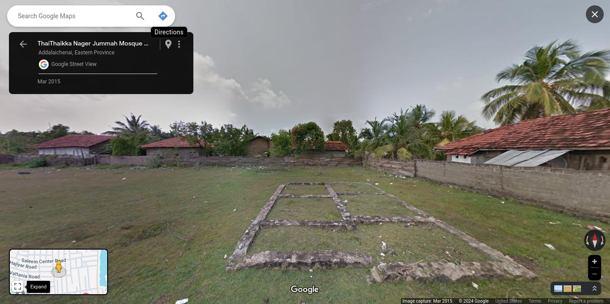

## Railway Town

**Railway Town** Grama Niladhari Division, **Kekirawa** Divisional Secretariat Division, **Anuradhapura** District, **North Central** Province

**Kekirawa** Polling Division, **Anuradhapura** Electoral District

Population: 1,069 (2012)

(**LK-7154095**/620)

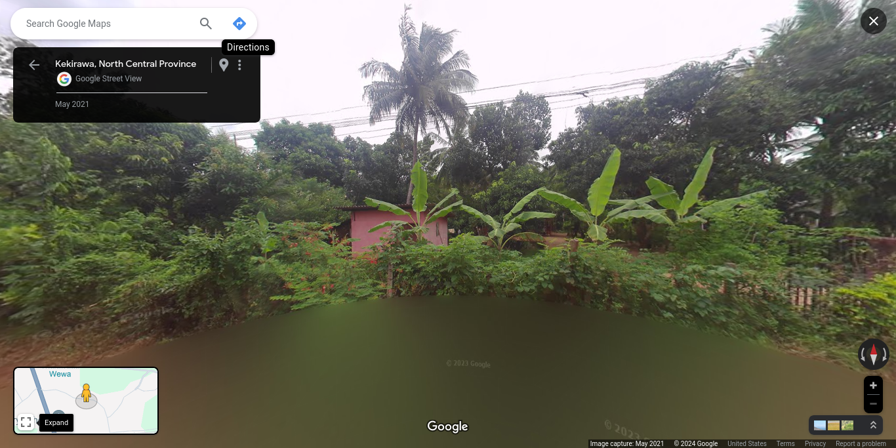

## Kokuvi South West

**Kokuvi South West** Grama Niladhari Division, **Nallur** Divisional Secretariat Division, **Jaffna** District, **Northern** Province

**Nallur** Polling Division, **Jaffna** Electoral District

Population: 1,420 (2012)

(**LK-4133195**/J/127)

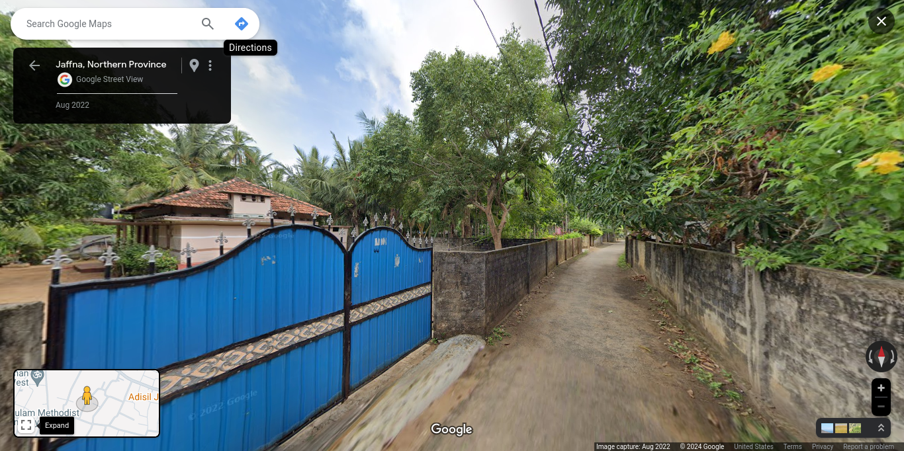

## Poorna Watta West

**Poorna Watta West** Grama Niladhari Division, **Kandy Four Gravets & Gangawata Korale** Divisional Secretariat Division, **Kandy** District, **Central** Province

**Mahanuwara** Polling Division, **Kandy** Electoral District

Population: 5,238 (2012)

(**LK-2130080**/240)

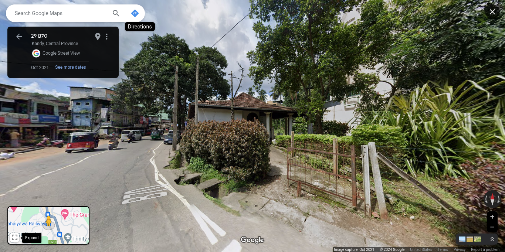

## Athurugiriya South

**Athurugiriya South** Grama Niladhari Division, **Kaduwela** Divisional Secretariat Division, **Colombo** District, **Western** Province

**Kaduwela** Polling Division, **Colombo** Electoral District

Population: 3,718 (2012)

(**LK-1109285**/490A)

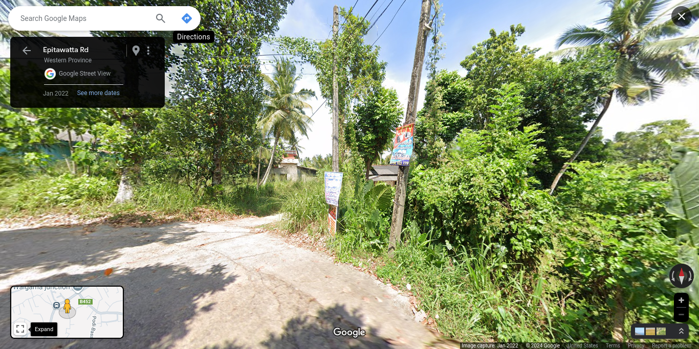

## Rathmalkatuwa

**Rathmalkatuwa** Grama Niladhari Division, **Dambulla** Divisional Secretariat Division, **Matale** District, **Central** Province

**Dambulla** Polling Division, **Matale** Electoral District

Population: 1,166 (2012)

(**LK-2206095**/E451C)

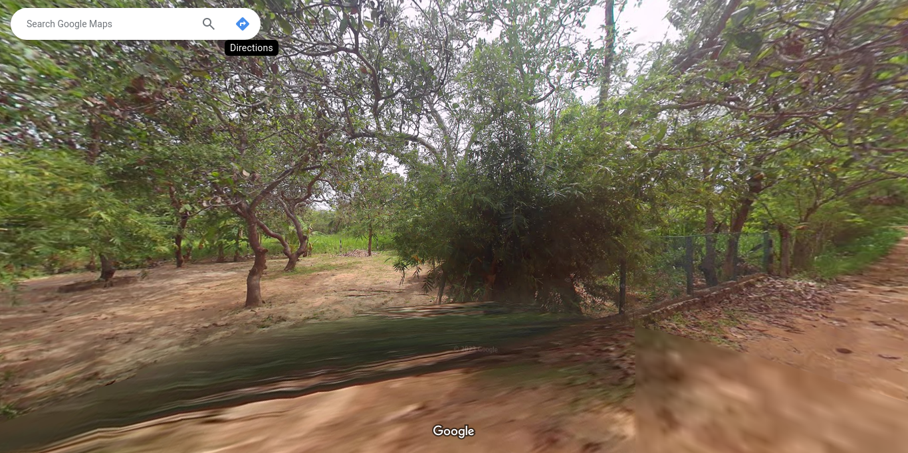

## Badulla South

**Badulla South** Grama Niladhari Division, **Badulla** Divisional Secretariat Division, **Badulla** District, **Uva** Province

**Badulla** Polling Division, **Badulla** Electoral District

Population: 3,557 (2012)

(**LK-8121085**/78)

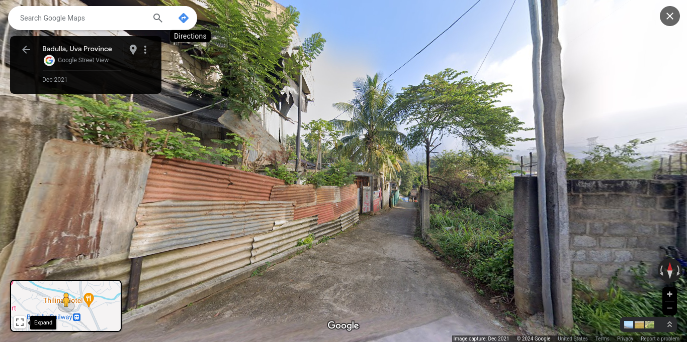

## Ihagama

**Ihagama** Grama Niladhari Division, **Harispattuwa** Divisional Secretariat Division, **Kandy** District, **Central** Province

**Harispattuwa** Polling Division, **Kandy** Electoral District

Population: 890 (2012)

(**LK-2133015**/489)

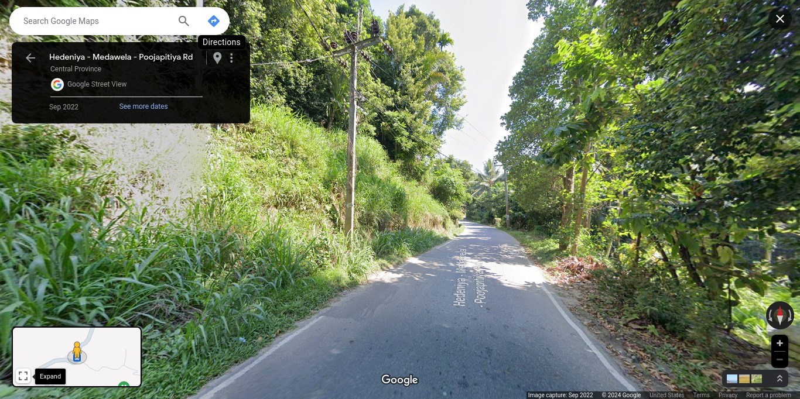

## Badulla East

**Badulla East** Grama Niladhari Division, **Badulla** Divisional Secretariat Division, **Badulla** District, **Uva** Province

**Badulla** Polling Division, **Badulla** Electoral District

Population: 4,159 (2012)

(**LK-8121090**/78B)

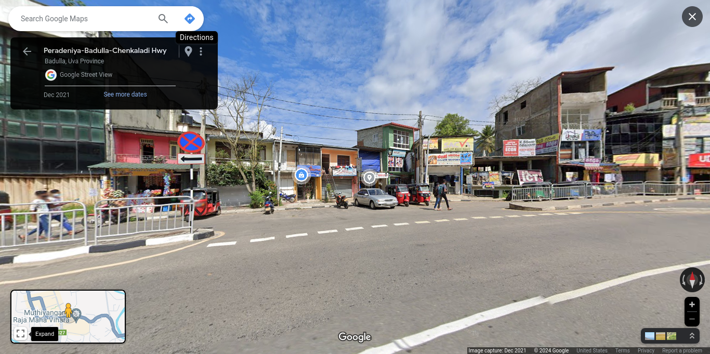

## Egoda Uyana Central

**Egoda Uyana Central** Grama Niladhari Division, **Moratuwa** Divisional Secretariat Division, **Colombo** District, **Western** Province

**Moratuwa** Polling Division, **Colombo** Electoral District

Population: 2,869 (2012)

(**LK-1133205**/556A)

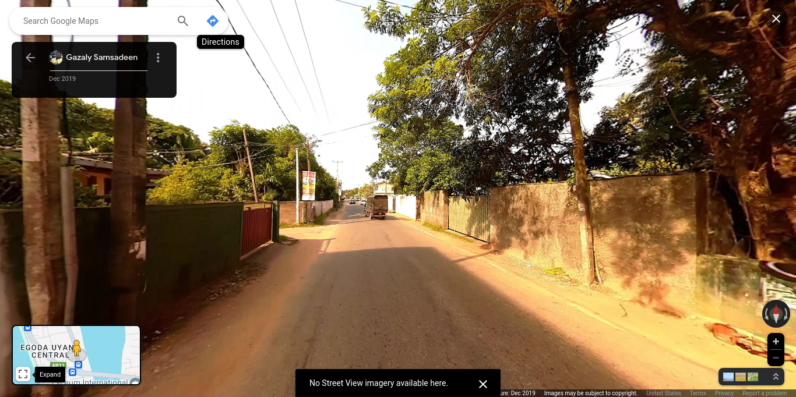

## Gonavila North

**Gonavila North** Grama Niladhari Division, **Dankotuwa** Divisional Secretariat Division, **Puttalam** District, **North Western** Province

**Wennappuwa** Polling Division, **Puttalam** Electoral District

Population: 660 (2012)

(**LK-6248110**/477)

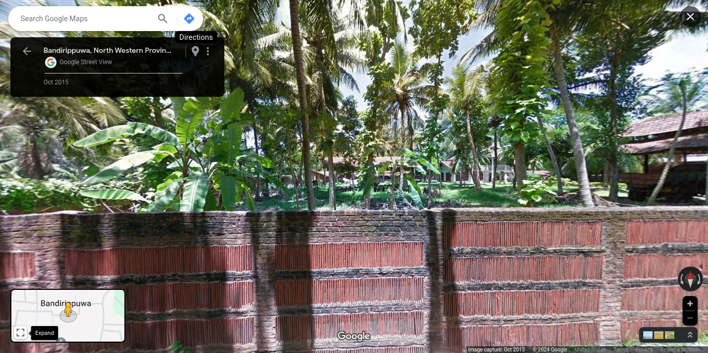

## Walasgala East

**Walasgala East** Grama Niladhari Division, **Dickwella** Divisional Secretariat Division, **Matara** District, **Southern** Province

**Devinuwara** Polling Division, **Matara** Electoral District

Population: 1,690 (2012)

(**LK-3248105**/452B)

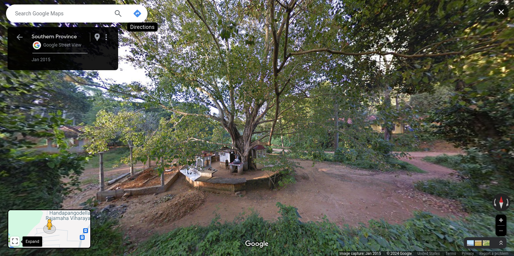

## Galawewa

**Galawewa** Grama Niladhari Division, **Kebithigollewa** Divisional Secretariat Division, **Anuradhapura** District, **North Central** Province

**Medawachchiya** Polling Division, **Anuradhapura** Electoral District

Population: 967 (2012)

(**LK-7106060**/30)

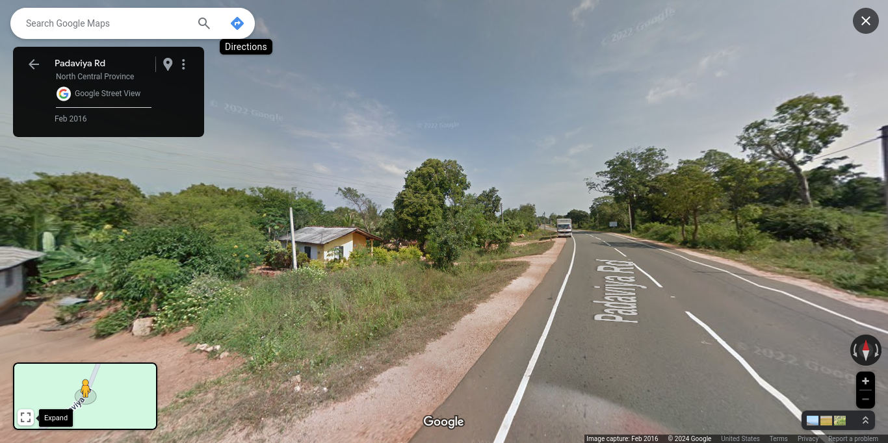

## Wattegama

**Wattegama** Grama Niladhari Division, **Dickwella** Divisional Secretariat Division, **Matara** District, **Southern** Province

**Devinuwara** Polling Division, **Matara** Electoral District

Population: 1,135 (2012)

(**LK-3248090**/451)

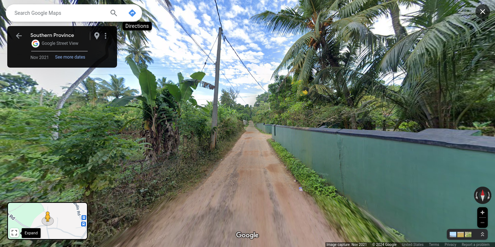

## Pahala Talawa

**Pahala Talawa** Grama Niladhari Division, **Thalawa** Divisional Secretariat Division, **Anuradhapura** District, **North Central** Province

**Kalawewa** Polling Division, **Anuradhapura** Electoral District

Population: 1,173 (2012)

(**LK-7148010**/407)

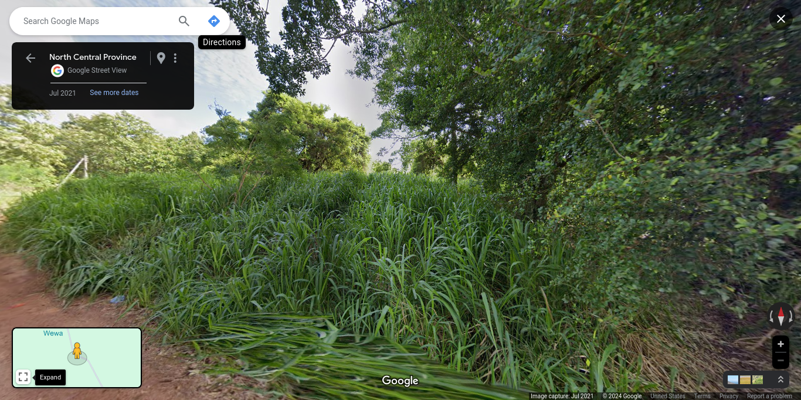

## Thunnana West

**Thunnana West** Grama Niladhari Division, **Seethawaka** Divisional Secretariat Division, **Colombo** District, **Western** Province

**Avissawella** Polling Division, **Colombo** Electoral District

Population: 1,713 (2012)

(**LK-1115330**/444B)

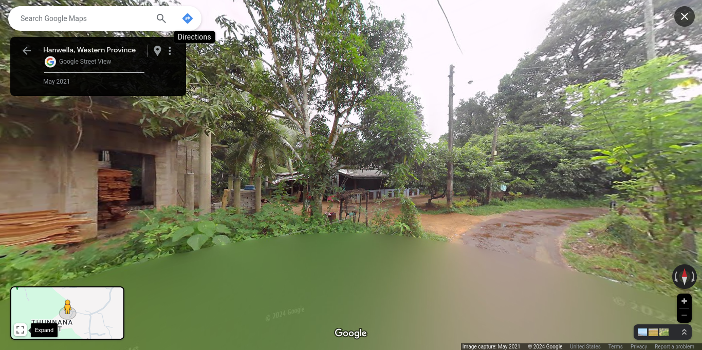

## Sanghamittapura

**Sanghamittapura** Grama Niladhari Division, **Galle Four Gravets** Divisional Secretariat Division, **Galle** District, **Southern** Province

**Galle** Polling Division, **Galle** Electoral District

Population: 998 (2012)

(**LK-3139165**/98C)

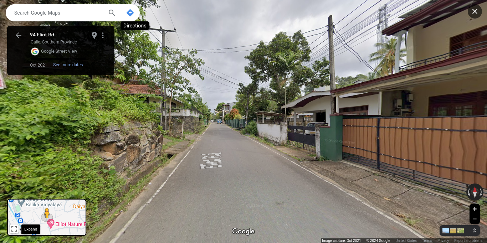

## Maha Elagamuwa

**Maha Elagamuwa** Grama Niladhari Division, **Kekirawa** Divisional Secretariat Division, **Anuradhapura** District, **North Central** Province

**Kekirawa** Polling Division, **Anuradhapura** Electoral District

Population: 1,732 (2012)

(**LK-7154210**/641)

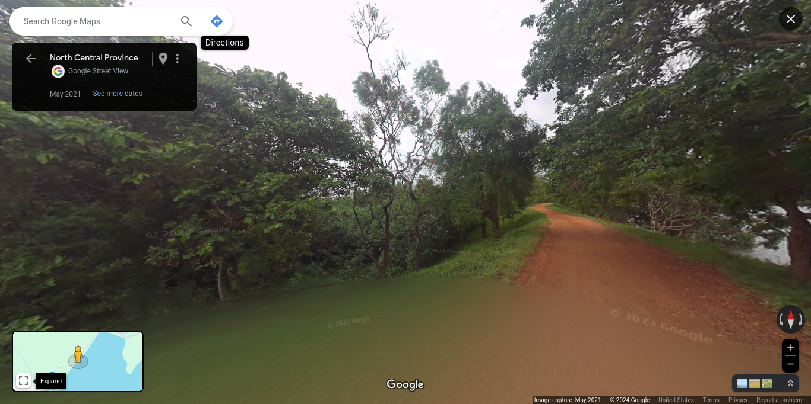

## Viruthodai

**Viruthodai** Grama Niladhari Division, **Mundel** Divisional Secretariat Division, **Puttalam** District, **North Western** Province

**Puttalam** Polling Division, **Puttalam** Electoral District

Population: 3,232 (2012)

(**LK-6218010**/601)

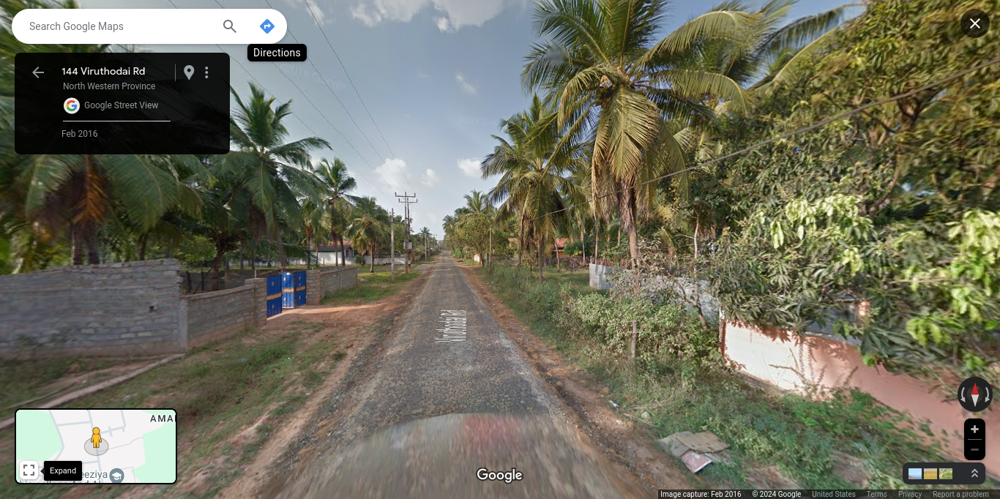

## Heiyanthuduwa North

**Heiyanthuduwa North** Grama Niladhari Division, **Biyagama** Divisional Secretariat Division, **Gampaha** District, **Western** Province

**Biyagama** Polling Division, **Gampaha** Electoral District

Population: 5,516 (2012)

(**LK-1239075**/275)

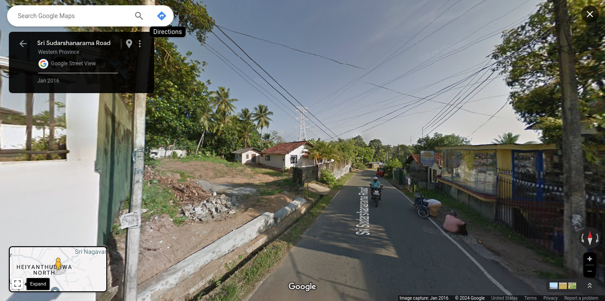

## Akbar Town

**Akbar Town** Grama Niladhari Division, **Mahara** Divisional Secretariat Division, **Gampaha** District, **Western** Province

**Mahara** Polling Division, **Gampaha** Electoral District

Population: 3,407 (2012)

(**LK-1233460**/255A)

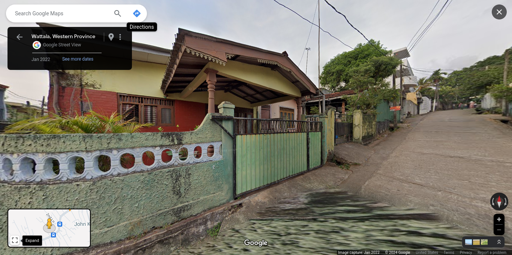

## Mollipothana North

**Mollipothana North** Grama Niladhari Division, **Thambalagamuwa** Divisional Secretariat Division, **Trincomalee** District, **Eastern** Province

**Muttur** Polling Division, **Trincomalee** Electoral District

Population: 3,858 (2012)

(**LK-5318045**/228G)

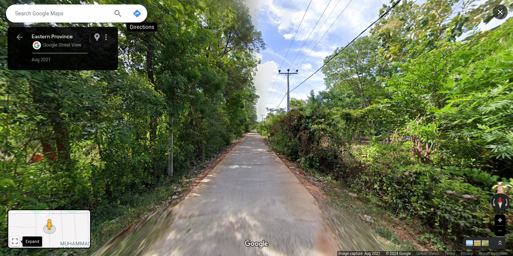

## Thambiluvil 2 East

**Thambiluvil 2 East** Grama Niladhari Division, **Thirukkovil** Divisional Secretariat Division, **Ampara** District, **Eastern** Province

**Pothuvil** Polling Division, **Digamadulla** Electoral District

Population: 1,276 (2012)

(**LK-5245045**/TK/11A)

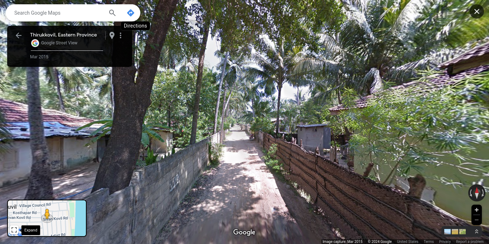

## Namadagaswewa

**Namadagaswewa** Grama Niladhari Division, **Sooriyawewa** Divisional Secretariat Division, **Hambantota** District, **Southern** Province

**Thissamaharama** Polling Division, **Hambantota** Electoral District

Population: 1,740 (2012)

(**LK-3303085**/110)

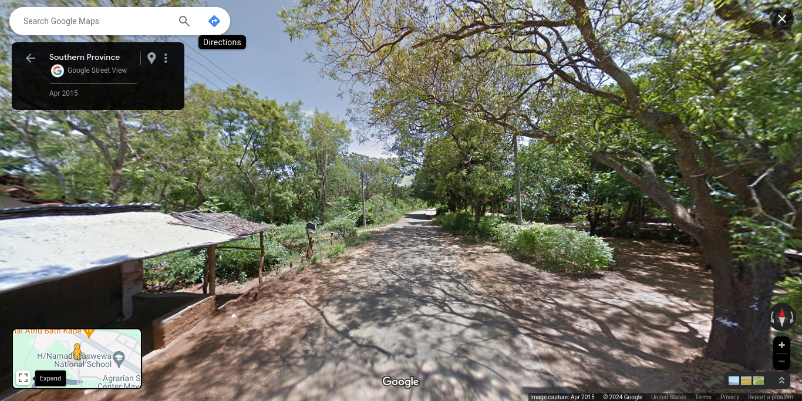

## Sammanthurai 09

**Sammanthurai 09** Grama Niladhari Division, **Samanthurai** Divisional Secretariat Division, **Ampara** District, **Eastern** Province

**Samanthurai** Polling Division, **Digamadulla** Electoral District

Population: 1,477 (2012)

(**LK-5218075**/81A)

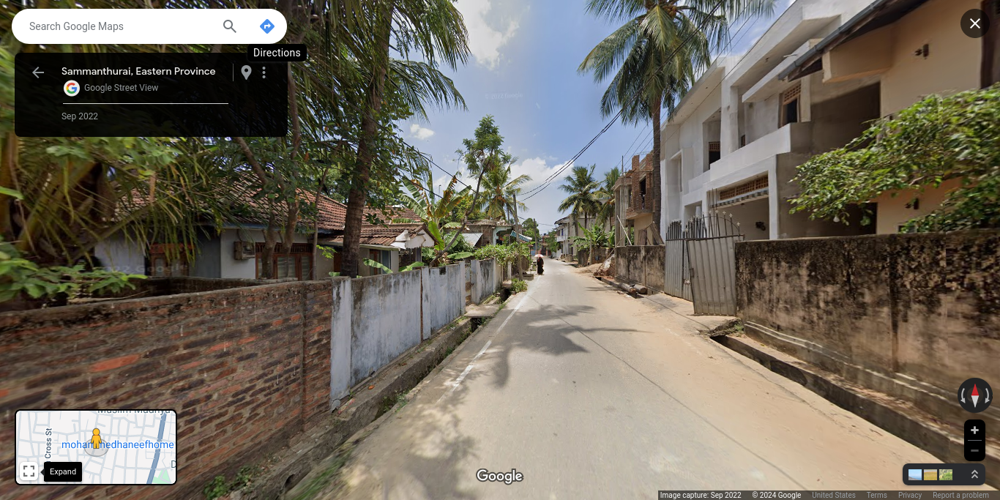

## Gorakapola

**Gorakapola** Grama Niladhari Division, **Panadura** Divisional Secretariat Division, **Kalutara** District, **Western** Province

**Panadura** Polling Division, **Kalutara** Electoral District

Population: 1,998 (2012)

(**LK-1303090**/674)

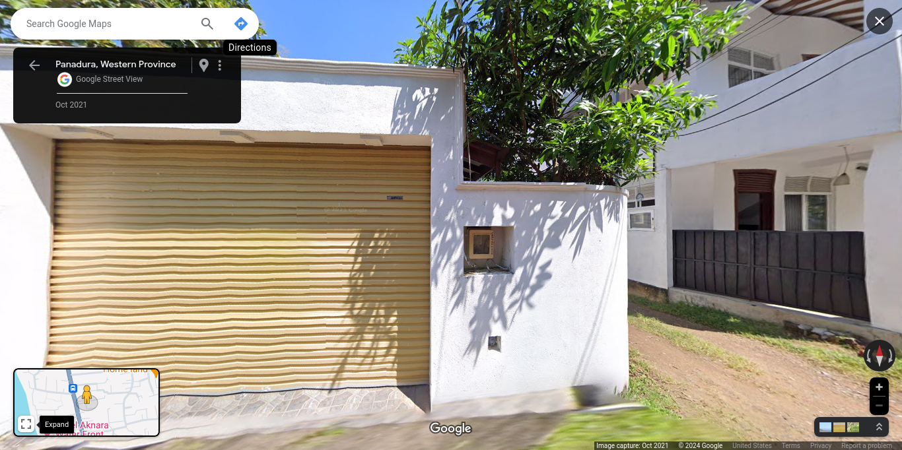

## Palai Veemankamam North

**Palai Veemankamam North** Grama Niladhari Division, **Valikamam North (Tellipallai)** Divisional Secretariat Division, **Jaffna** District, **Northern** Province

**Kayts** Polling Division, **Jaffna** Electoral District

Population: 12 (2012)

(**LK-4112125**/236)

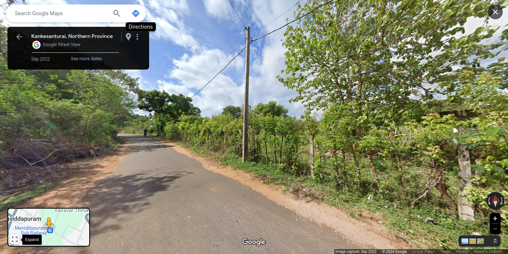

## Wathuyaya

**Wathuyaya** Grama Niladhari Division, **Kuruvita** Divisional Secretariat Division, **Ratnapura** District, **Sabaragamuwa** Province

**Ratnapura** Polling Division, **Ratnapura** Electoral District

Population: 1,655 (2012)

(**LK-9106130**/159)

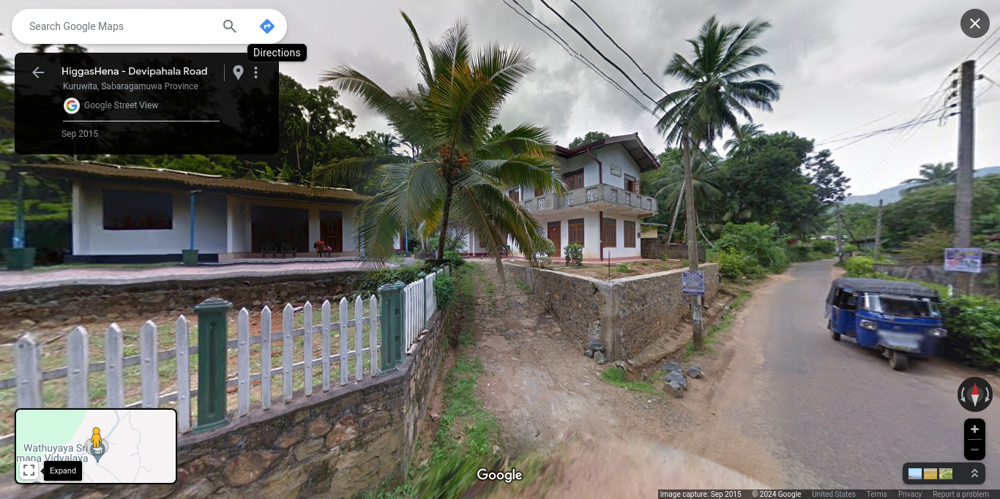

## Harannagala

**Harannagala** Grama Niladhari Division, **Hikkaduwa** Divisional Secretariat Division, **Galle** District, **Southern** Province

**Ratgama** Polling Division, **Galle** Electoral District

Population: 326 (2012)

(**LK-3136120**/72B)

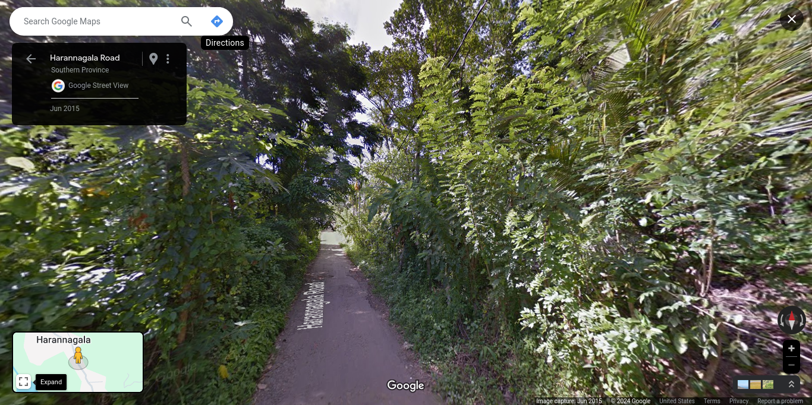

## Katugoda

**Katugoda** Grama Niladhari Division, **Galle Four Gravets** Divisional Secretariat Division, **Galle** District, **Southern** Province

**Galle** Polling Division, **Galle** Electoral District

Population: 3,326 (2012)

(**LK-3139245**/100)

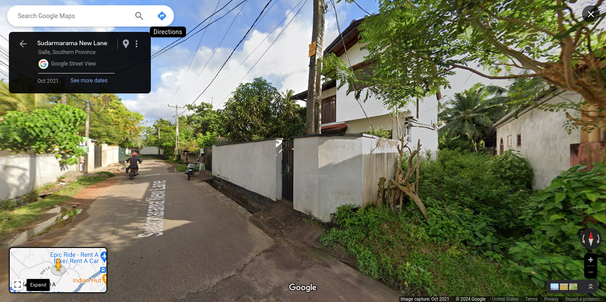

## Rajagiriya

**Rajagiriya** Grama Niladhari Division, **Udunuwara** Divisional Secretariat Division, **Kandy** District, **Central** Province

**Udunuwara** Polling Division, **Kandy** Electoral District

Population: 801 (2012)

(**LK-2139120**/8)

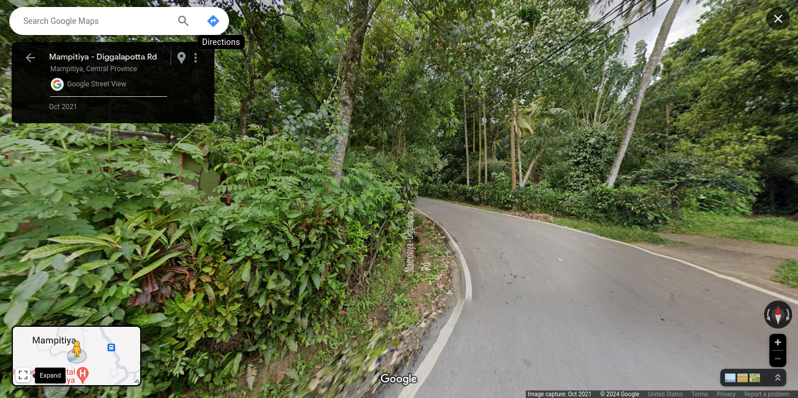

## Mahaiyawa

**Mahaiyawa** Grama Niladhari Division, **Kandy Four Gravets & Gangawata Korale** Divisional Secretariat Division, **Kandy** District, **Central** Province

**Mahanuwara** Polling Division, **Kandy** Electoral District

Population: 2,111 (2012)

(**LK-2130065**/239)

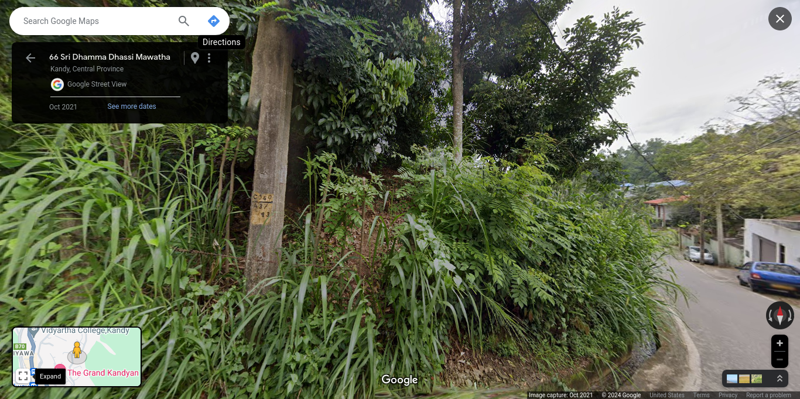

## Magasthota

**Magasthota** Grama Niladhari Division, **Nuwara Eliya** Divisional Secretariat Division, **Nuwara Eliya** District, **Central** Province

**Nuwara Eliya Maskeliya** Polling Division, **Nuwara-Eliya** Electoral District

Population: 1,408 (2012)

(**LK-2312235**/535A)

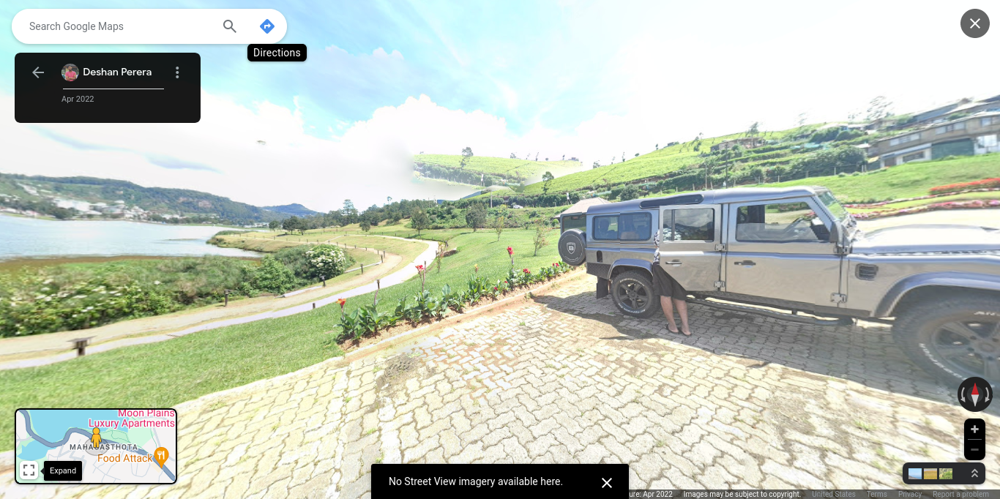

## Malpettawa

**Malpettawa** Grama Niladhari Division, **Ambalantota** Divisional Secretariat Division, **Hambantota** District, **Southern** Province

**Tangalle** Polling Division, **Hambantota** Electoral District

Population: 1,092 (2012)

(**LK-3315250**/148)

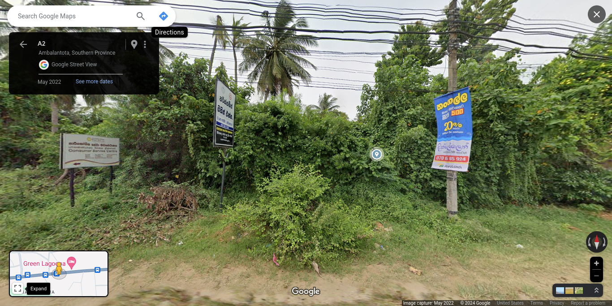

## Dandagamuwa West

**Dandagamuwa West** Grama Niladhari Division, **Kuliyapitiya West** Divisional Secretariat Division, **Kurunegala** District, **North Western** Province

**Kuliyapitiya** Polling Division, **Kurunegala** Electoral District

Population: 1,196 (2012)

(**LK-6172215**/1193)

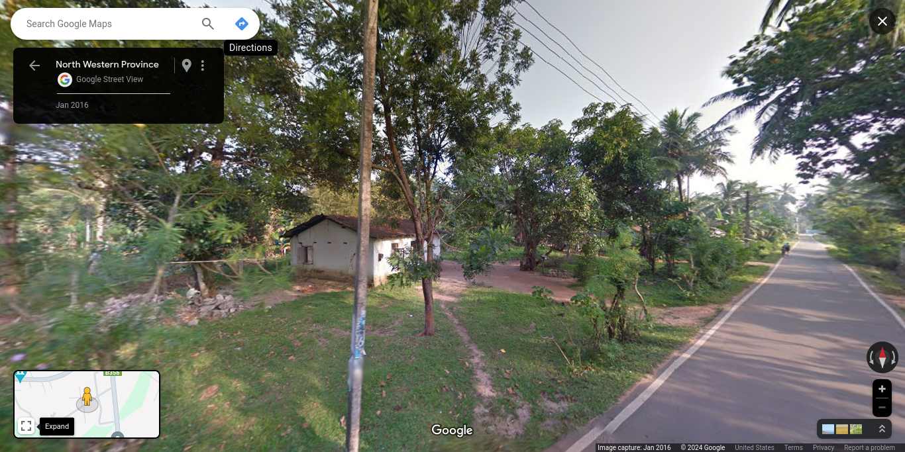

## Belagama

**Belagama** Grama Niladhari Division, **Kolonnawa** Divisional Secretariat Division, **Colombo** District, **Western** Province

**Kolonnawa** Polling Division, **Colombo** Electoral District

Population: 3,283 (2012)

(**LK-1106080**/504A)

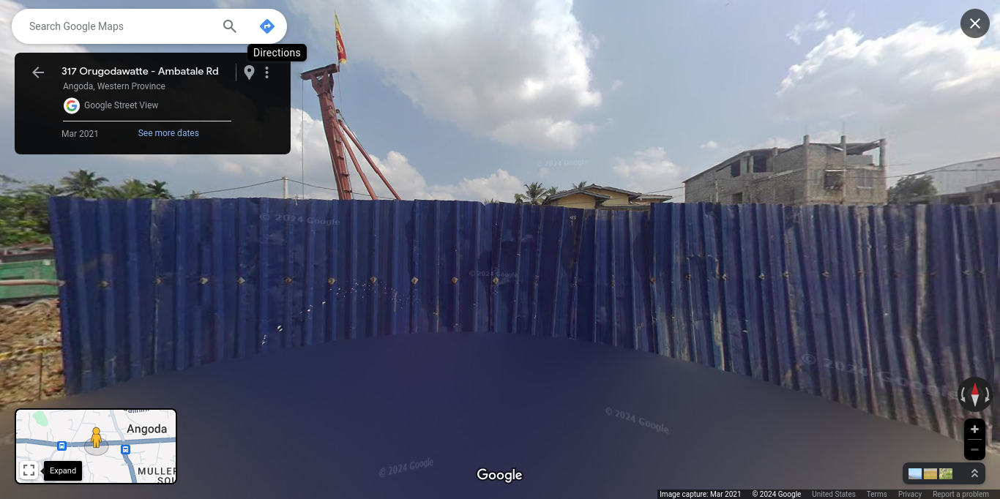

## Mahavila

**Mahavila** Grama Niladhari Division, **Bandaragama** Divisional Secretariat Division, **Kalutara** District, **Western** Province

**Bandaragama** Polling Division, **Kalutara** Electoral District

Population: 2,606 (2012)

(**LK-1306125**/690)

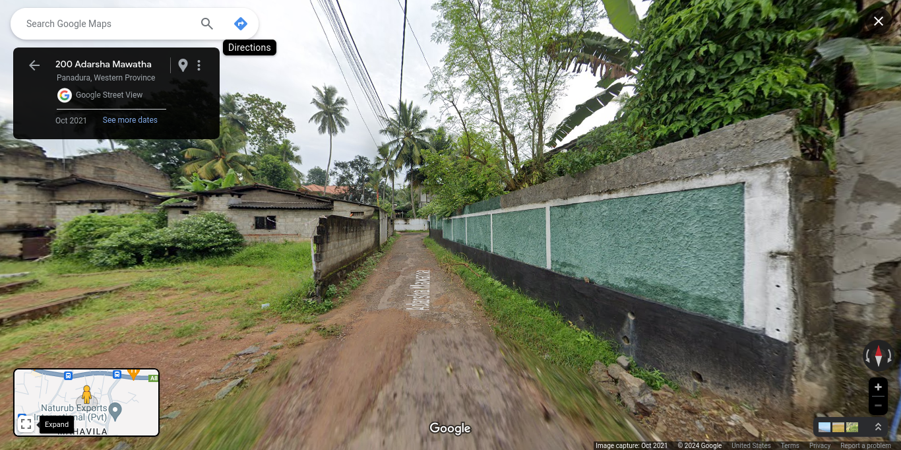

## Ihala Walasmulla

**Ihala Walasmulla** Grama Niladhari Division, **Walasmulla** Divisional Secretariat Division, **Hambantota** District, **Southern** Province

**Mulkirigala** Polling Division, **Hambantota** Electoral District

Population: 743 (2012)

(**LK-3325220**/457)

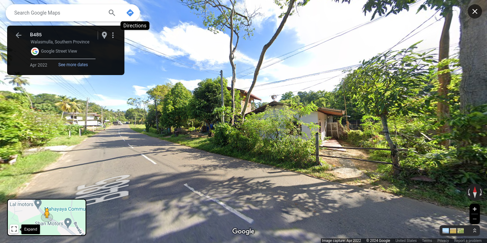

## Pahala Keembiya

**Pahala Keembiya** Grama Niladhari Division, **Baddegama** Divisional Secretariat Division, **Galle** District, **Southern** Province

**Baddegama** Polling Division, **Galle** Electoral District

Population: 593 (2012)

(**LK-3127245**/208)

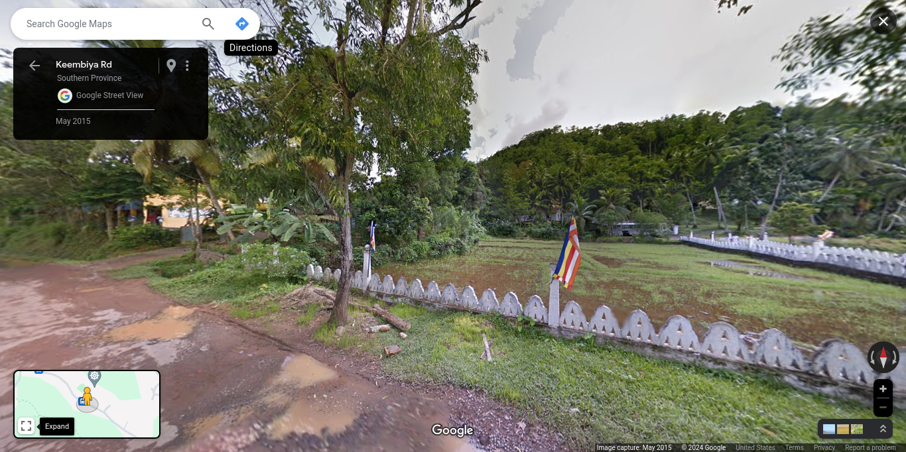

## Sammanthurai 11

**Sammanthurai 11** Grama Niladhari Division, **Samanthurai** Divisional Secretariat Division, **Ampara** District, **Eastern** Province

**Samanthurai** Polling Division, **Digamadulla** Electoral District

Population: 493 (2012)

(**LK-5218065**/92C)

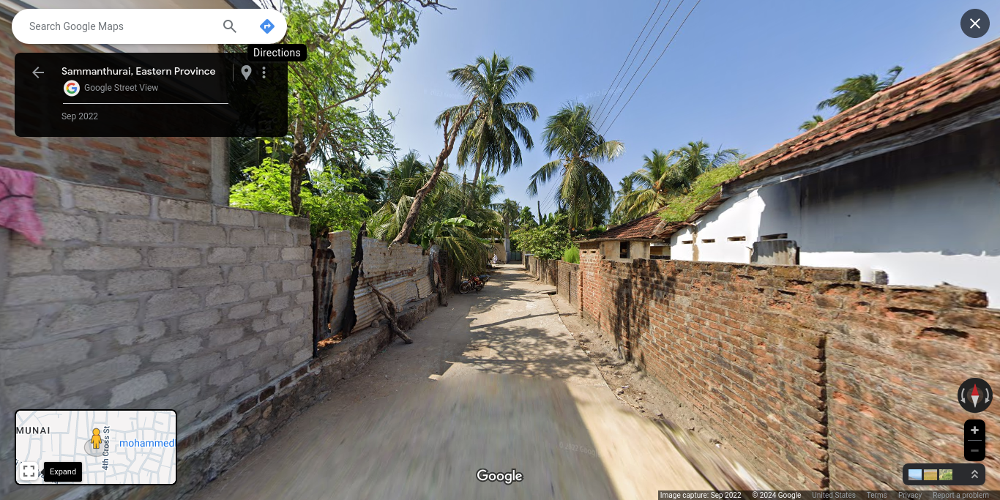

## Ranawana East

**Ranawana East** Grama Niladhari Division, **Harispattuwa** Divisional Secretariat Division, **Kandy** District, **Central** Province

**Harispattuwa** Polling Division, **Kandy** Electoral District

Population: 1,605 (2012)

(**LK-2133185**/410)

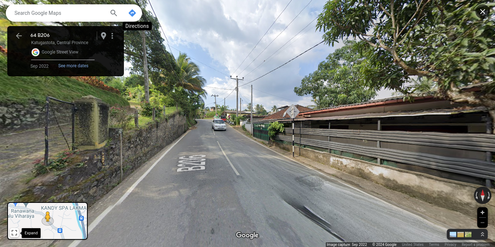

## Aniwatta West

**Aniwatta West** Grama Niladhari Division, **Kandy Four Gravets & Gangawata Korale** Divisional Secretariat Division, **Kandy** District, **Central** Province

**Mahanuwara** Polling Division, **Kandy** Electoral District

Population: 1,698 (2012)

(**LK-2130175**/233)

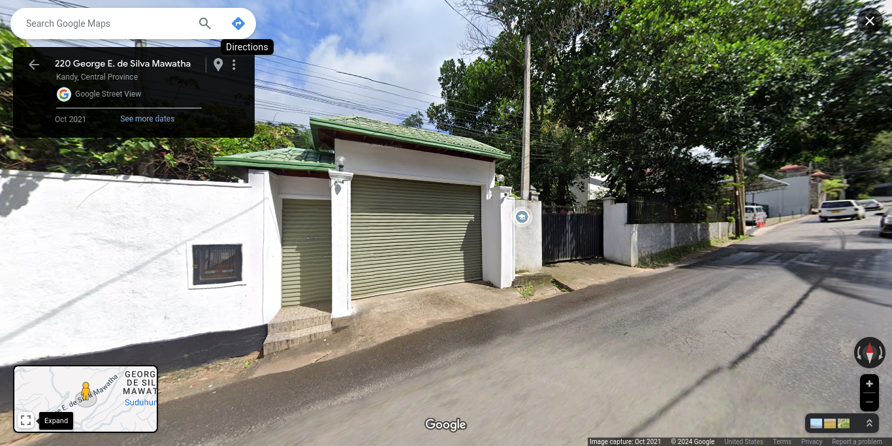

## Weerakumandaluwa

**Weerakumandaluwa** Grama Niladhari Division, **Arachchikattuwa** Divisional Secretariat Division, **Puttalam** District, **North Western** Province

**Chilaw** Polling Division, **Puttalam** Electoral District

Population: 2,556 (2012)

(**LK-6230150**/574)

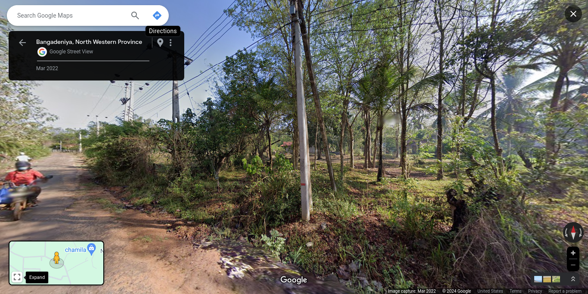

## Nedungolla South

**Nedungolla South** Grama Niladhari Division, **Dompe** Divisional Secretariat Division, **Gampaha** District, **Western** Province

**Dompe** Polling Division, **Gampaha** Electoral District

Population: 525 (2012)

(**LK-1230215**/392D)

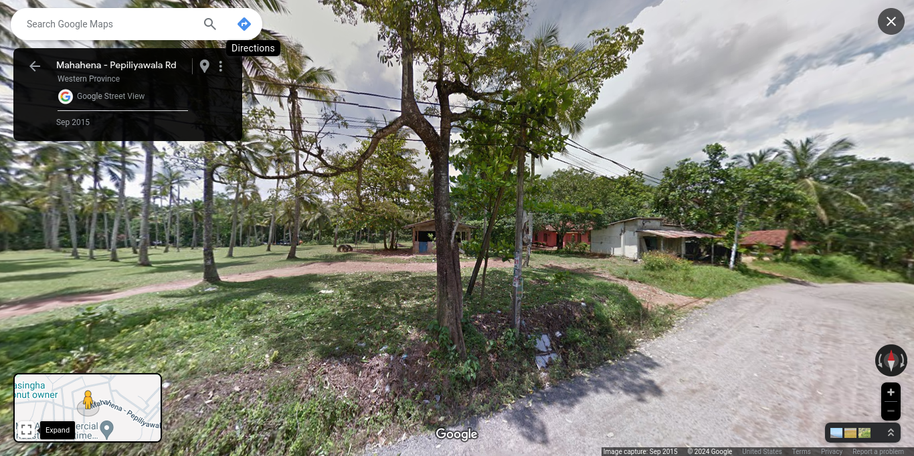

## Makevita South

**Makevita South** Grama Niladhari Division, **Gampaha** Divisional Secretariat Division, **Gampaha** District, **Western** Province

**Gampaha** Polling Division, **Gampaha** Electoral District

Population: 1,559 (2012)

(**LK-1224010**/218A)

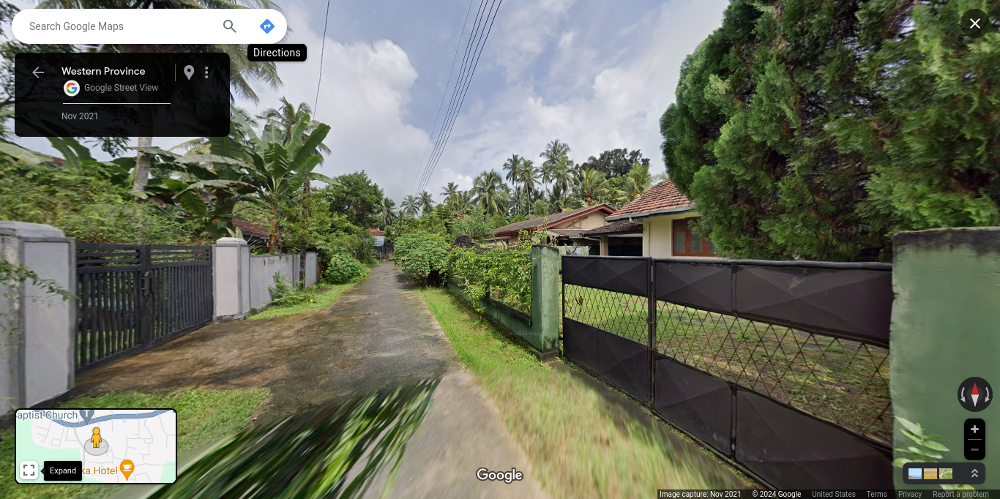

## Singharagama

**Singharagama** Grama Niladhari Division, **Pathahewaheta** Divisional Secretariat Division, **Kandy** District, **Central** Province

**Hewaheta** Polling Division, **Kandy** Electoral District

Population: 565 (2012)

(**LK-2145060**/988)

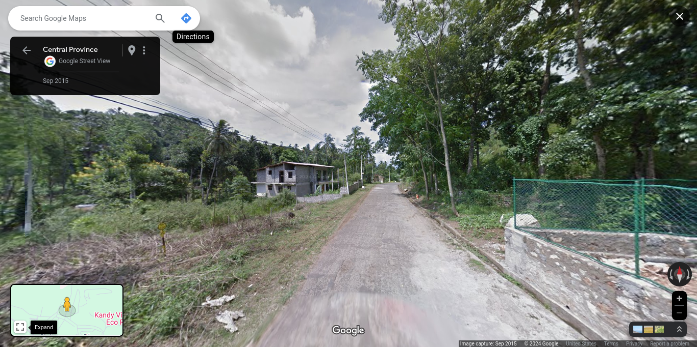

## Kudawella North

**Kudawella North** Grama Niladhari Division, **Tangalle** Divisional Secretariat Division, **Hambantota** District, **Southern** Province

**Beliatta** Polling Division, **Hambantota** Electoral District

Population: 1,098 (2012)

(**LK-3333330**/289)

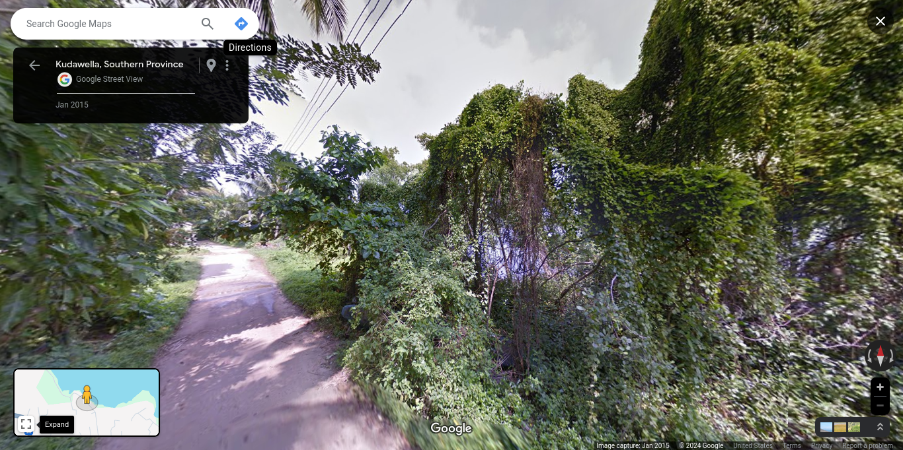

## Neeravipiddy West

**Neeravipiddy West** Grama Niladhari Division, **Maritimepattu** Divisional Secretariat Division, **Mullaitivu** District, **Northern** Province

**Mullaitivu** Polling Division, **Vanni** Electoral District

Population: 499 (2012)

(**LK-4415190**/MU/114)

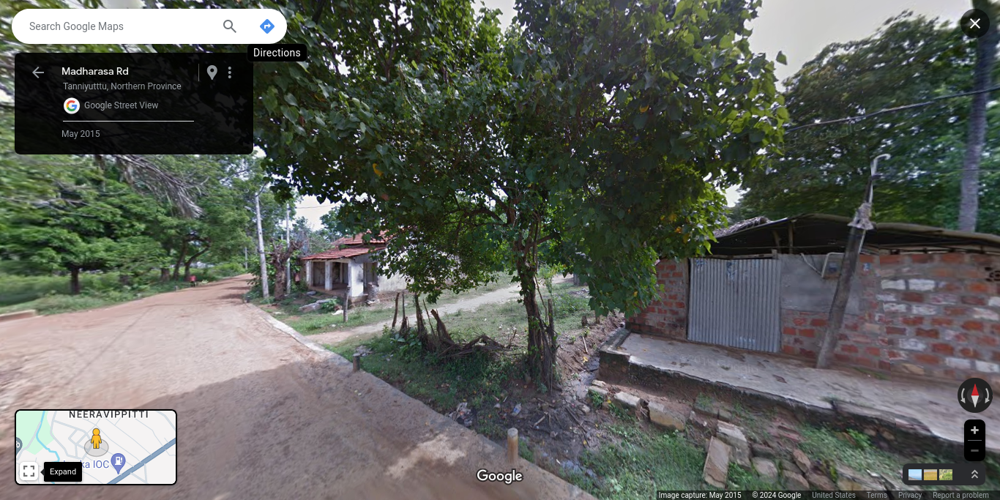

## Galthude North

**Galthude North** Grama Niladhari Division, **Panadura** Divisional Secretariat Division, **Kalutara** District, **Western** Province

**Bandaragama** Polling Division, **Kalutara** Electoral District

Population: 1,736 (2012)

(**LK-1303105**/677A)

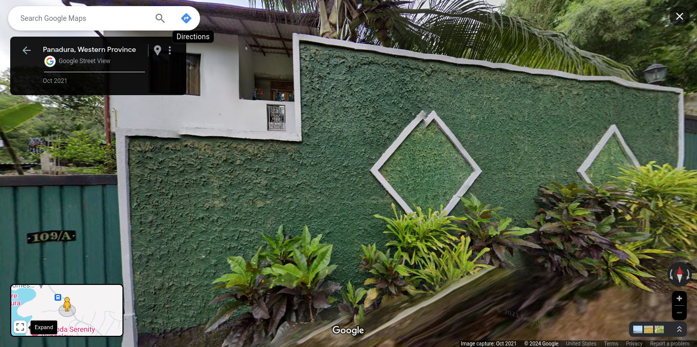

## Morampitigoda

**Morampitigoda** Grama Niladhari Division, **Habaraduwa** Divisional Secretariat Division, **Galle** District, **Southern** Province

**Habaraduwa** Polling Division, **Galle** Electoral District

Population: 1,125 (2012)

(**LK-3154085**/144B)

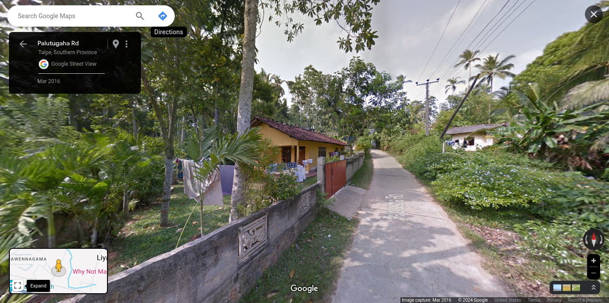

## Thenagama South

**Thenagama South** Grama Niladhari Division, **Tangalle** Divisional Secretariat Division, **Hambantota** District, **Southern** Province

**Beliatta** Polling Division, **Hambantota** Electoral District

Population: 504 (2012)

(**LK-3333075**/306)

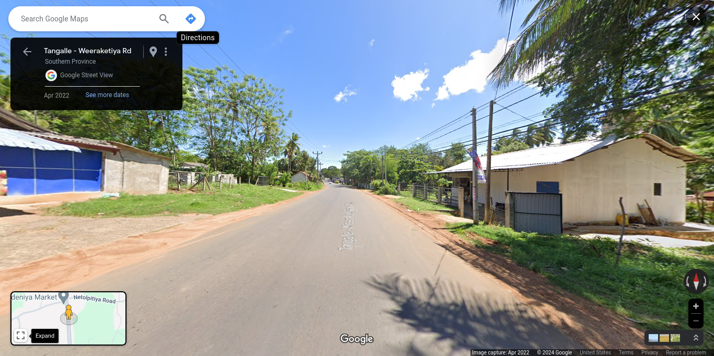

## Hatton West

**Hatton West** Grama Niladhari Division, **Ambagamuwa** Divisional Secretariat Division, **Nuwara Eliya** District, **Central** Province

**Nuwara Eliya Maskeliya** Polling Division, **Nuwara-Eliya** Electoral District

Population: 2,011 (2012)

(**LK-2315210**/319C)

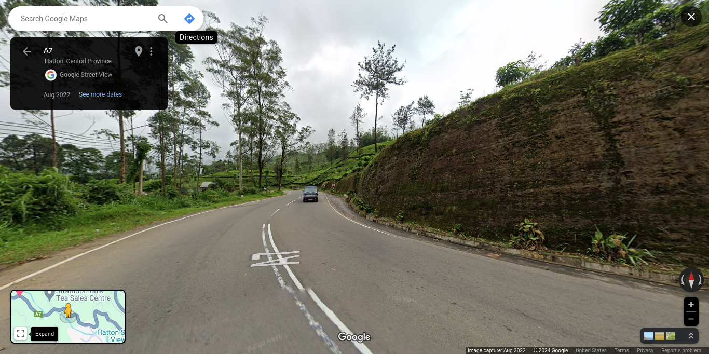

## Nawa Elpitiya North

**Nawa Elpitiya North** Grama Niladhari Division, **Udunuwara** Divisional Secretariat Division, **Kandy** District, **Central** Province

**Udunuwara** Polling Division, **Kandy** Electoral District

Population: 873 (2012)

(**LK-2139425**/39)

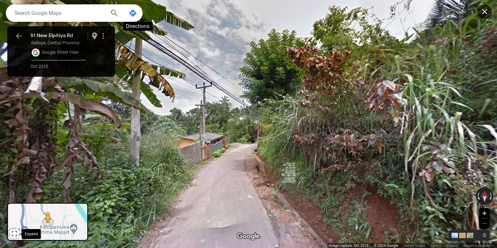

## Galagedara

**Galagedara** Grama Niladhari Division, **Kuliyapitiya West** Divisional Secretariat Division, **Kurunegala** District, **North Western** Province

**Kuliyapitiya** Polling Division, **Kurunegala** Electoral District

Population: 366 (2012)

(**LK-6172255**/1196)

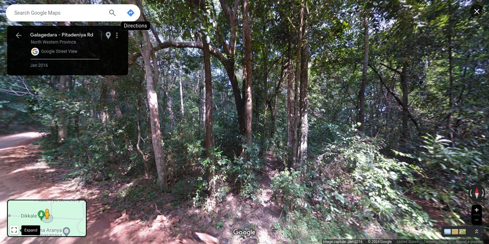

## Moravinna

**Moravinna** Grama Niladhari Division, **Panadura** Divisional Secretariat Division, **Kalutara** District, **Western** Province

**Panadura** Polling Division, **Kalutara** Electoral District

Population: 3,884 (2012)

(**LK-1303265**/689A)

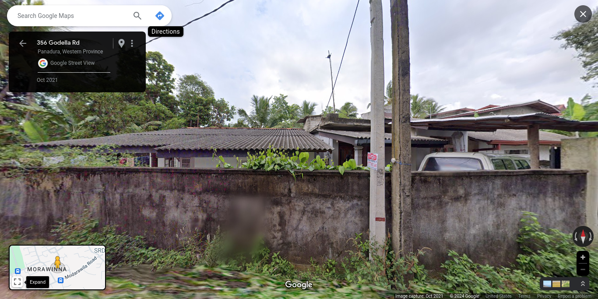

## Galapitaambe

**Galapitaambe** Grama Niladhari Division, **Kundasale** Divisional Secretariat Division, **Kandy** District, **Central** Province

**Kundasale** Polling Division, **Kandy** Electoral District

Population: 1,213 (2012)

(**LK-2127215**/663)

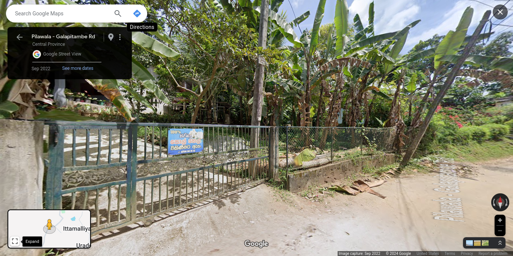

## Iranapalai

**Iranapalai** Grama Niladhari Division, **Puthukkudiyiruppu** Divisional Secretariat Division, **Mullaitivu** District, **Northern** Province

**Mullaitivu** Polling Division, **Vanni** Electoral District

Population: 1,120 (2012)

(**LK-4409010**/MU/43)

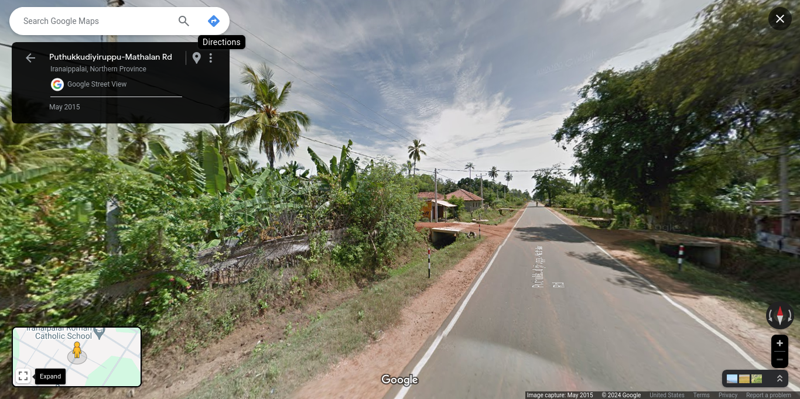

## Humbuluwa East

**Humbuluwa East** Grama Niladhari Division, **Alawwa** Divisional Secretariat Division, **Kurunegala** District, **North Western** Province

**Dambadeniya** Polling Division, **Kurunegala** Electoral District

Population: 1,227 (2012)

(**LK-6184210**/1006)

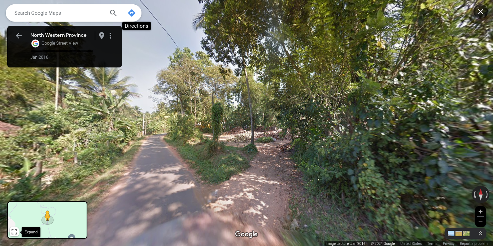

## Welegoda East

**Welegoda East** Grama Niladhari Division, **Matara Four Gravets** Divisional Secretariat Division, **Matara** District, **Southern** Province

**Matara** Polling Division, **Matara** Electoral District

Population: 3,616 (2012)

(**LK-3242205**/414)

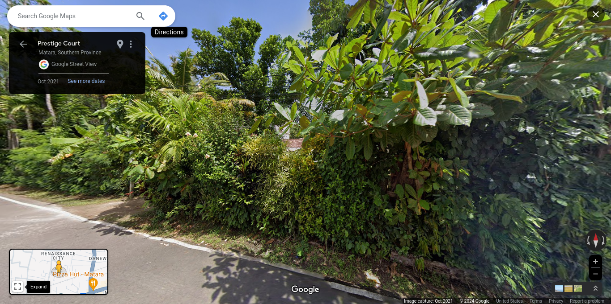

## Unawatuna West

**Unawatuna West** Grama Niladhari Division, **Habaraduwa** Divisional Secretariat Division, **Galle** District, **Southern** Province

**Habaraduwa** Polling Division, **Galle** Electoral District

Population: 813 (2012)

(**LK-3154015**/137)

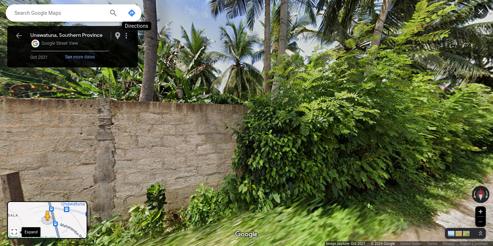

## Sirupiddy West

**Sirupiddy West** Grama Niladhari Division, **Valikamam East (Kopay)** Divisional Secretariat Division, **Jaffna** District, **Northern** Province

**Kopay** Polling Division, **Jaffna** Electoral District

Population: 2,088 (2012)

(**LK-4118080**/J/272)

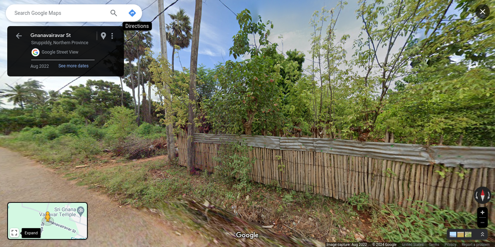

## Malawa

**Malawa** Grama Niladhari Division, **Kekirawa** Divisional Secretariat Division, **Anuradhapura** District, **North Central** Province

**Kekirawa** Polling Division, **Anuradhapura** Electoral District

Population: 1,462 (2012)

(**LK-7154135**/626)

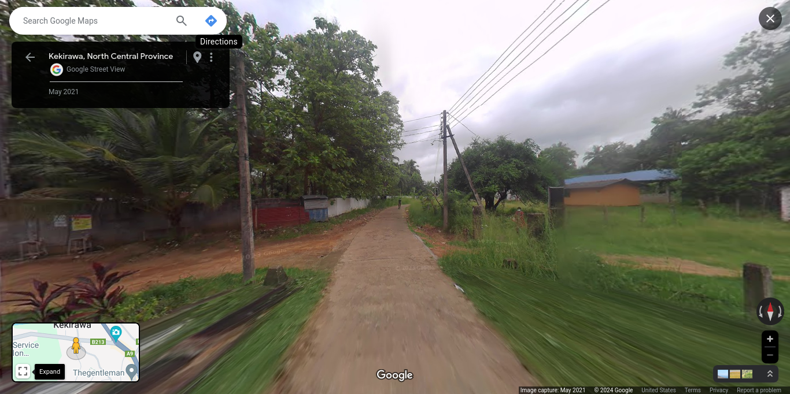

## Olaganduwa

**Olaganduwa** Grama Niladhari Division, **Bentota** Divisional Secretariat Division, **Galle** District, **Southern** Province

**Bentara Elpitiya** Polling Division, **Galle** Electoral District

Population: 1,071 (2012)

(**LK-3103120**/8B)

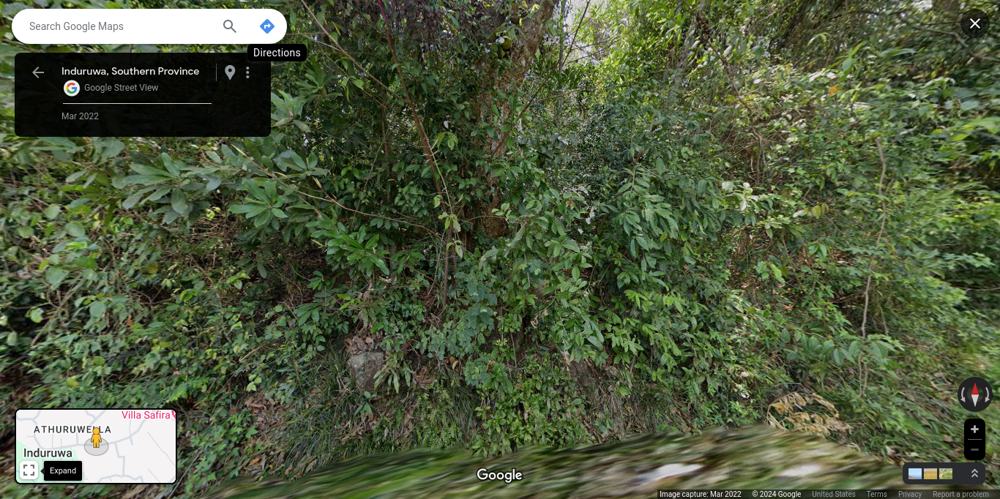

## Obadella

**Obadella** Grama Niladhari Division, **Bandarawela** Divisional Secretariat Division, **Badulla** District, **Uva** Province

**Bandarawela** Polling Division, **Badulla** Electoral District

Population: 1,687 (2012)

(**LK-8133120**/65F)

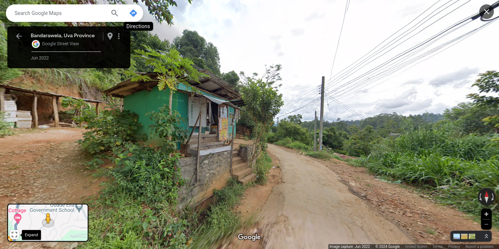

## Delgamuwa

**Delgamuwa** Grama Niladhari Division, **Kuruvita** Divisional Secretariat Division, **Ratnapura** District, **Sabaragamuwa** Province

**Ratnapura** Polling Division, **Ratnapura** Electoral District

Population: 2,694 (2012)

(**LK-9106145**/155B)

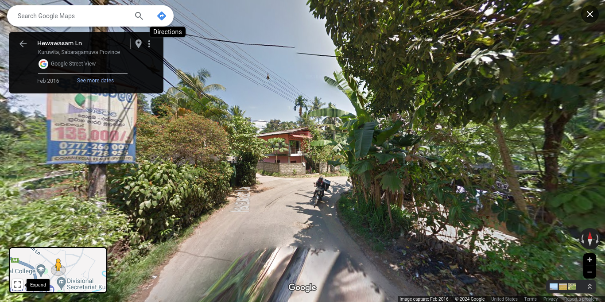

## Katupuliyankulama

**Katupuliyankulama** Grama Niladhari Division, **Rambewa** Divisional Secretariat Division, **Anuradhapura** District, **North Central** Province

**Anuradhapura West** Polling Division, **Anuradhapura** Electoral District

Population: 1,091 (2012)

(**LK-7118140**/112)

## Siththankerni

**Siththankerni** Grama Niladhari Division, **Valikamam West (Chankanai)** Divisional Secretariat Division, **Jaffna** District, **Northern** Province

**Vaddukoddai** Polling Division, **Jaffna** Electoral District

Population: 1,370 (2012)

(**LK-4106105**/J/177)

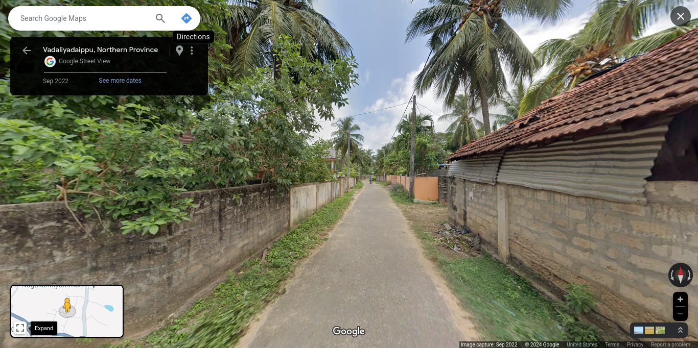

## Maligaikadu Central

**Maligaikadu Central** Grama Niladhari Division, **Karaitheevu** Divisional Secretariat Division, **Ampara** District, **Eastern** Province

**Pothuvil** Polling Division, **Digamadulla** Electoral District

Population: 1,250 (2012)

(**LK-5227020**/44B)

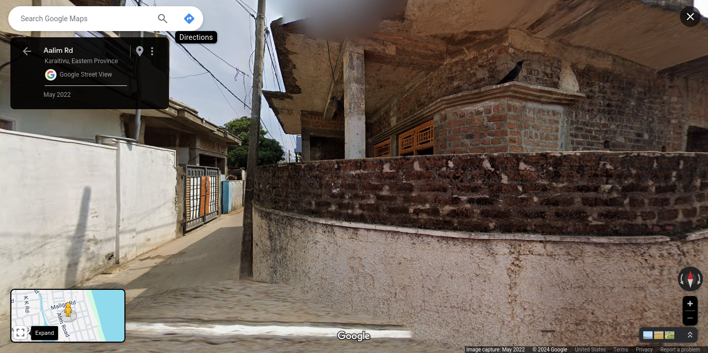

## Madawala

**Madawala** Grama Niladhari Division, **Palugaswewa** Divisional Secretariat Division, **Anuradhapura** District, **North Central** Province

**Kekirawa** Polling Division, **Anuradhapura** Electoral District

Population: 965 (2012)

(**LK-7157015**/598)

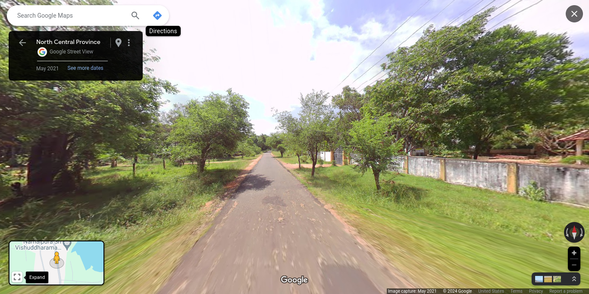

## Mulana East

**Mulana East** Grama Niladhari Division, **Bope-Poddala** Divisional Secretariat Division, **Galle** District, **Southern** Province

**Akmeemana** Polling Division, **Galle** Electoral District

Population: 607 (2012)

(**LK-3142020**/111F)

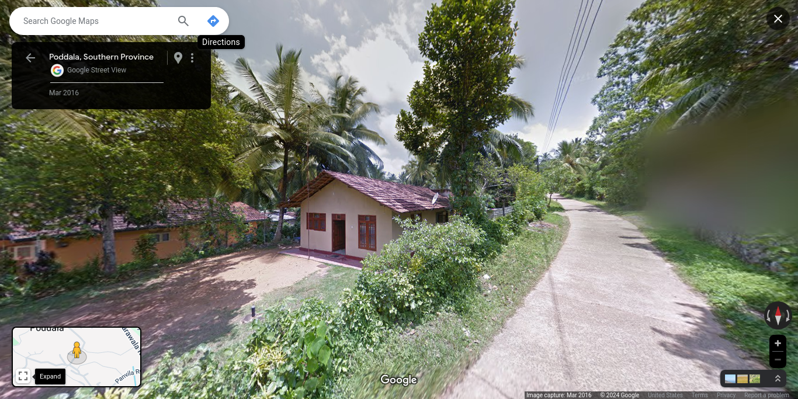

## Hulangamuwa North

**Hulangamuwa North** Grama Niladhari Division, **Matale** Divisional Secretariat Division, **Matale** District, **Central** Province

**Matale** Polling Division, **Matale** Electoral District

Population: 1,608 (2012)

(**LK-2218220**/E353B)

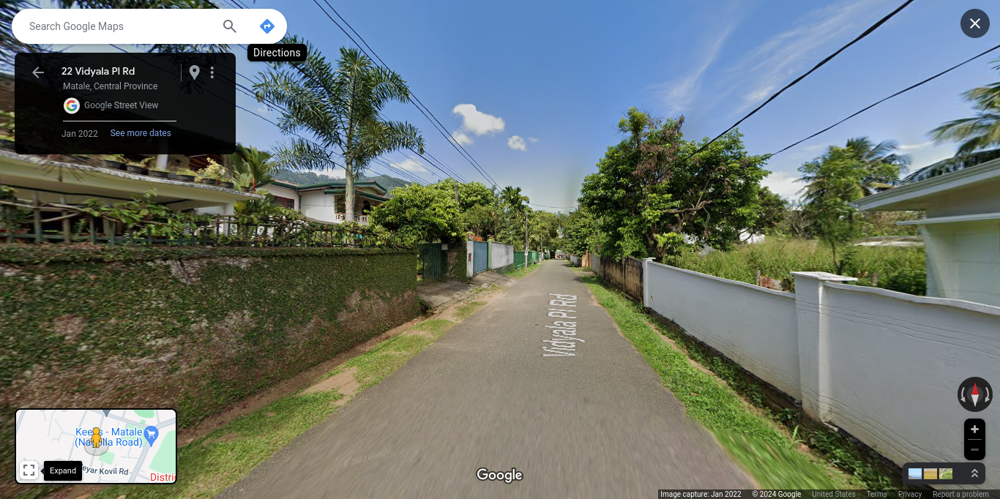

## Arumugathan Kudiyiruppu 1

**Arumugathan Kudiyiruppu 1** Grama Niladhari Division, **Eravur Pattu** Divisional Secretariat Division, **Batticaloa** District, **Eastern** Province

**Batticaloa** Polling Division, **Batticaloa** Electoral District

Population: 1,587 (2012)

(**LK-5112145**/189)

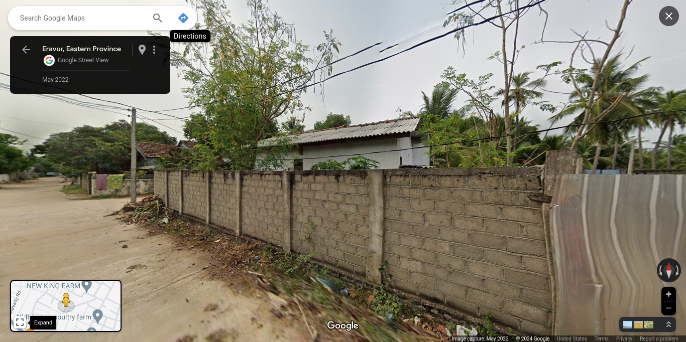

## Maharagama East

**Maharagama East** Grama Niladhari Division, **Maharagama** Divisional Secretariat Division, **Colombo** District, **Western** Province

**Maharagama** Polling Division, **Colombo** Electoral District

Population: 3,695 (2012)

(**LK-1121105**/527B)

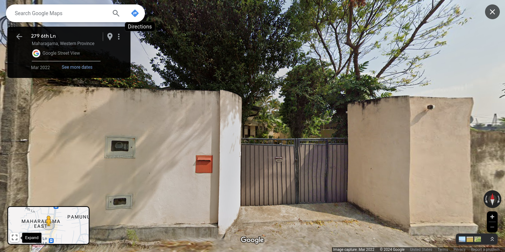

## Mahasenpura

**Mahasenpura** Grama Niladhari Division, **Buttala** Divisional Secretariat Division, **Moneragala** District, **Uva** Province

**Wellawaya** Polling Division, **Moneragala** Electoral District

Population: 1,889 (2012)

(**LK-8224110**/143/A/1)

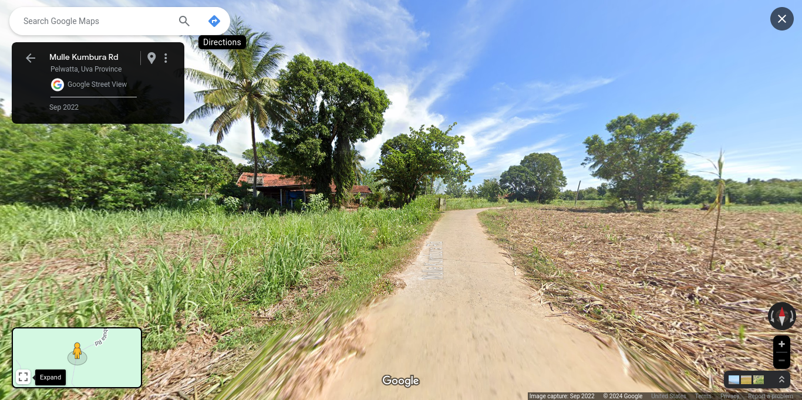

## Godigamuwa North

**Godigamuwa North** Grama Niladhari Division, **Maharagama** Divisional Secretariat Division, **Colombo** District, **Western** Province

**Maharagama** Polling Division, **Colombo** Electoral District

Population: 4,094 (2012)

(**LK-1121180**/532)

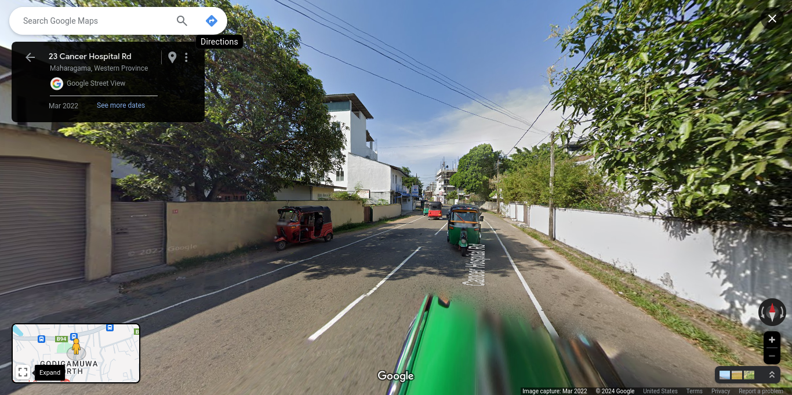

## Yakmaditta

**Yakmaditta** Grama Niladhari Division, **Kolonna** Divisional Secretariat Division, **Ratnapura** District, **Sabaragamuwa** Province

**Kolonna** Polling Division, **Ratnapura** Electoral District

Population: 785 (2012)

(**LK-9151015**/204A)

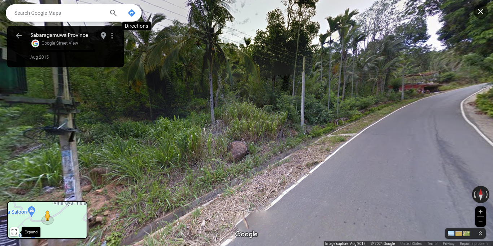

## Kadigamuwa

**Kadigamuwa** Grama Niladhari Division, **Rambukkana** Divisional Secretariat Division, **Kegalle** District, **Sabaragamuwa** Province

**Rambukkana** Polling Division, **Kegalle** Electoral District

Population: 1,573 (2012)

(**LK-9203240**/21)

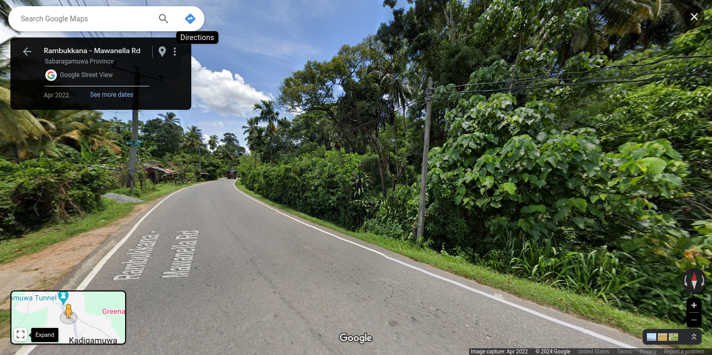

## Lenadora North

**Lenadora North** Grama Niladhari Division, **Dambulla** Divisional Secretariat Division, **Matale** District, **Central** Province

**Dambulla** Polling Division, **Matale** Electoral District

Population: 979 (2012)

(**LK-2206285**/E441)

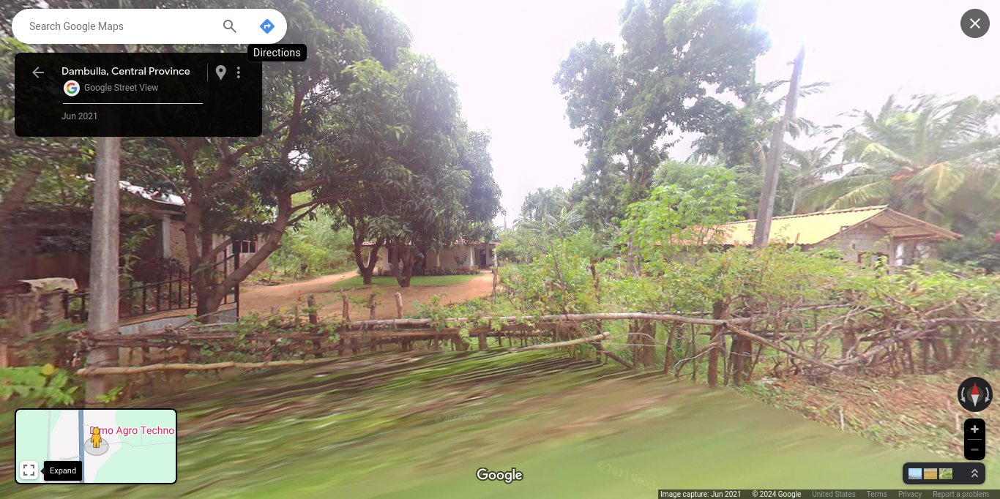

## Batukachchiya

**Batukachchiya** Grama Niladhari Division, **Kanthale** Divisional Secretariat Division, **Trincomalee** District, **Eastern** Province

**Seruvila** Polling Division, **Trincomalee** Electoral District

Population: 2,150 (2012)

(**LK-5321105**/227T)

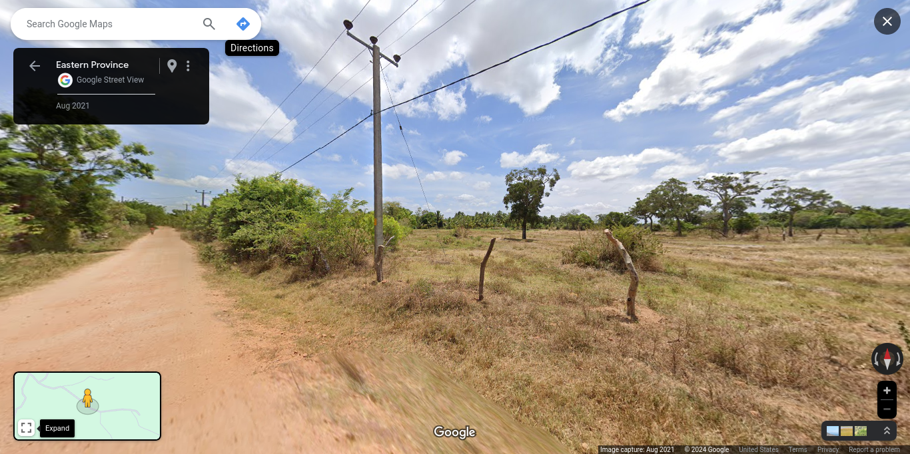

## Mathalana North

**Mathalana North** Grama Niladhari Division, **Attanagalla** Divisional Secretariat Division, **Gampaha** District, **Western** Province

**Attanagalla** Polling Division, **Gampaha** Electoral District

Population: 741 (2012)

(**LK-1227475**/352F)

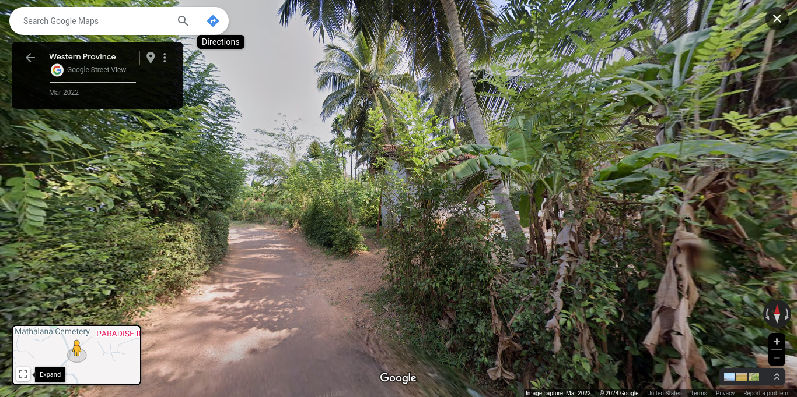

## Hene Watta

**Hene Watta** Grama Niladhari Division, **Mihinthale** Divisional Secretariat Division, **Anuradhapura** District, **North Central** Province

**Anuradhapura West** Polling Division, **Anuradhapura** Electoral District

Population: 2,126 (2012)

(**LK-7130040**/572)

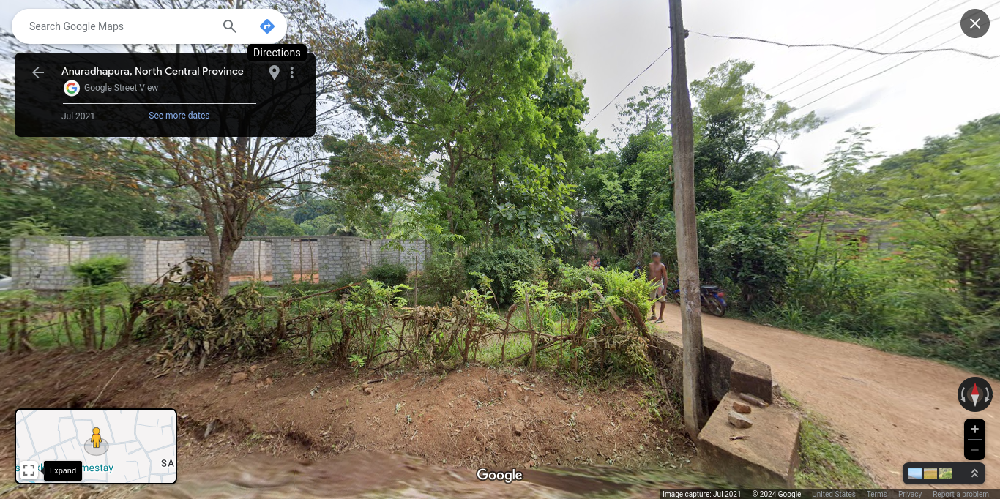

## Kalmunaikudi 13

**Kalmunaikudi 13** Grama Niladhari Division, **Kalmunai** Divisional Secretariat Division, **Ampara** District, **Eastern** Province

**Kalmunai** Polling Division, **Digamadulla** Electoral District

Population: 1,620 (2012)

(**LK-5224140**/KP/54A)

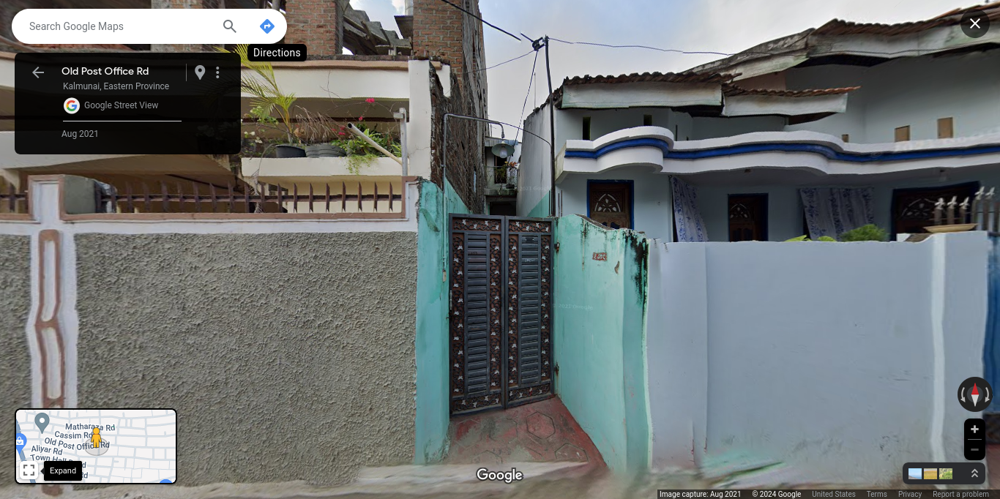

## Kochchikade North

**Kochchikade North** Grama Niladhari Division, **Colombo** Divisional Secretariat Division, **Colombo** District, **Western** Province

**Colombo Central** Polling Division, **Colombo** Electoral District

Population: 9,339 (2012)

(**LK-1103055**/)

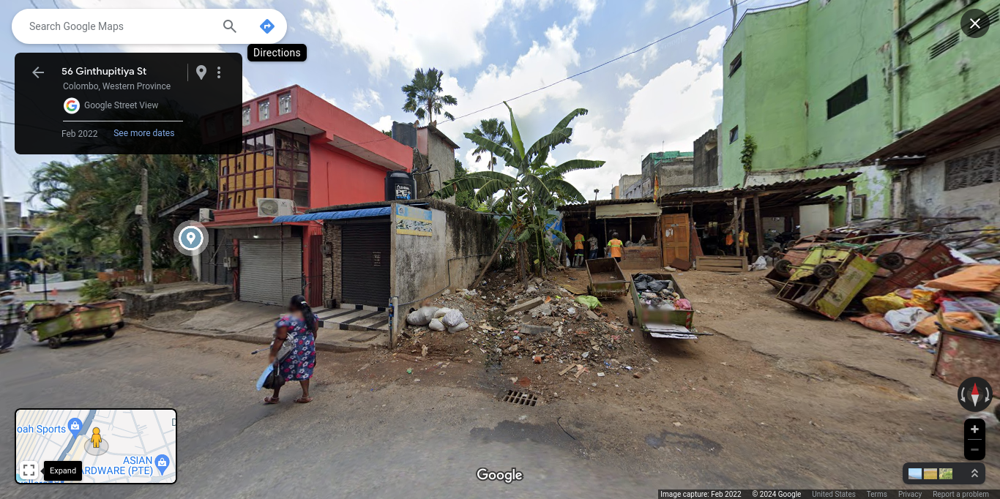

## Lakshapathiya North

**Lakshapathiya North** Grama Niladhari Division, **Moratuwa** Divisional Secretariat Division, **Colombo** District, **Western** Province

**Moratuwa** Polling Division, **Colombo** Electoral District

Population: 4,481 (2012)

(**LK-1133045**/550A)

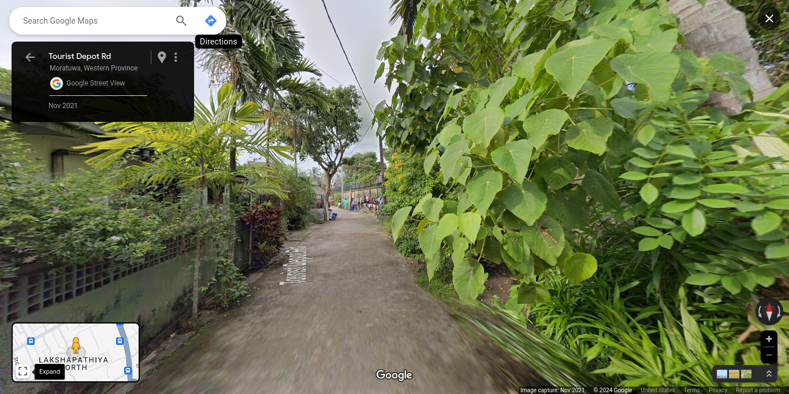

## Varani-Iyattalai

**Varani-Iyattalai** Grama Niladhari Division, **Thenmaradchi (Chavakachcheri)** Divisional Secretariat Division, **Jaffna** District, **Northern** Province

**Chavakachcheri** Polling Division, **Jaffna** Electoral District

Population: 1,123 (2012)

(**LK-4130280**/J/343)

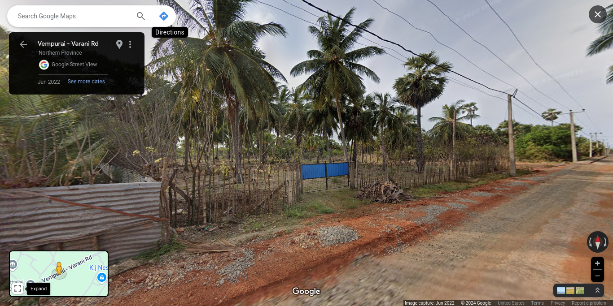

## Kinigama East

**Kinigama East** Grama Niladhari Division, **Thumpane** Divisional Secretariat Division, **Kandy** District, **Central** Province

**Galagedara** Polling Division, **Kandy** Electoral District

Population: 540 (2012)

(**LK-2103180**/316)

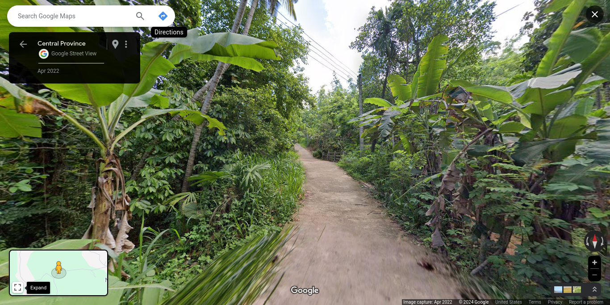

## Hewelwela

**Hewelwela** Grama Niladhari Division, **Bibile** Divisional Secretariat Division, **Moneragala** District, **Uva** Province

**Bibile** Polling Division, **Moneragala** Electoral District

Population: 889 (2012)

(**LK-8203180**/100E)

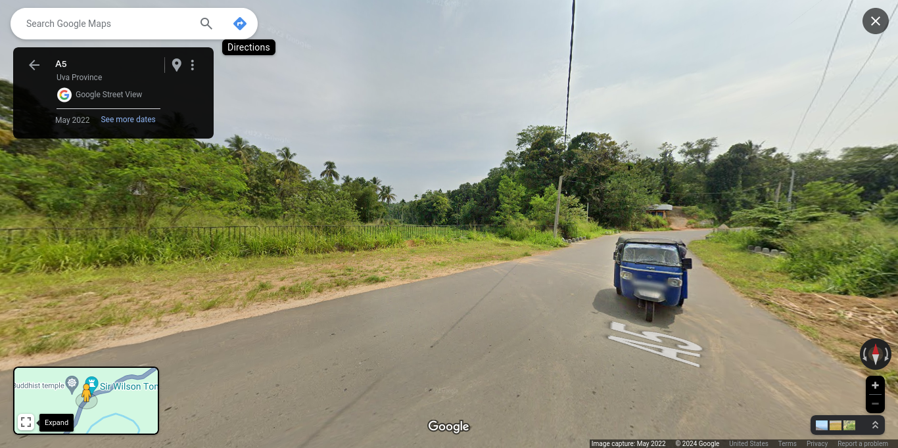

## Thalpavila South

**Thalpavila South** Grama Niladhari Division, **Matara Four Gravets** Divisional Secretariat Division, **Matara** District, **Southern** Province

**Matara** Polling Division, **Matara** Electoral District

Population: 920 (2012)

(**LK-3242310**/430)

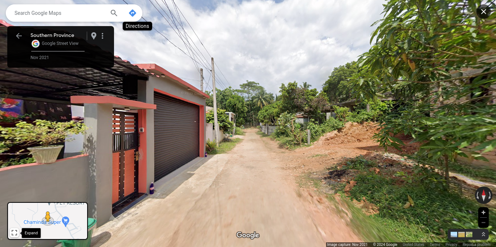

## Wathumulla

**Wathumulla** Grama Niladhari Division, **Ratmalana** Divisional Secretariat Division, **Colombo** District, **Western** Province

**Ratmalana** Polling Division, **Colombo** Electoral District

Population: 4,608 (2012)

(**LK-1131020**/544A)

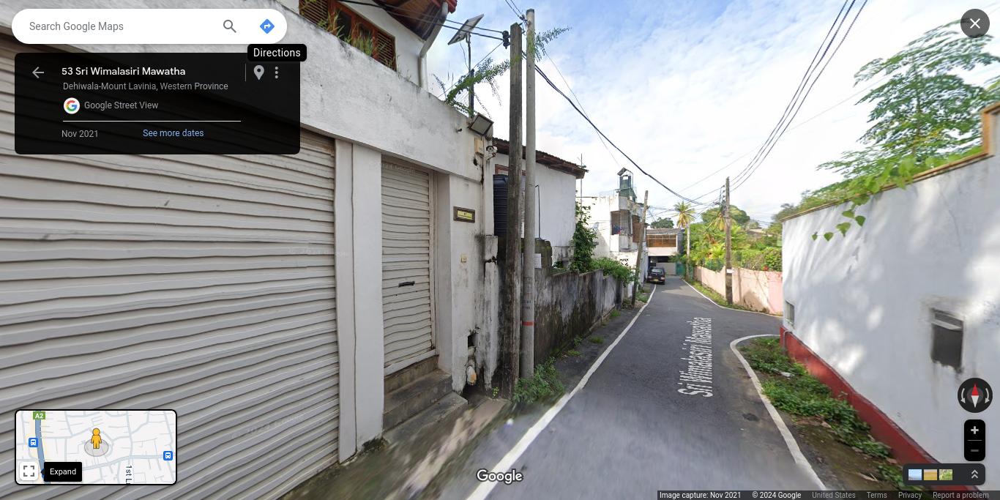

## Thandavanveli

**Thandavanveli** Grama Niladhari Division, **Manmunai North** Divisional Secretariat Division, **Batticaloa** District, **Eastern** Province

**Batticaloa** Polling Division, **Batticaloa** Electoral District

Population: 2,907 (2012)

(**LK-5118130**/177)

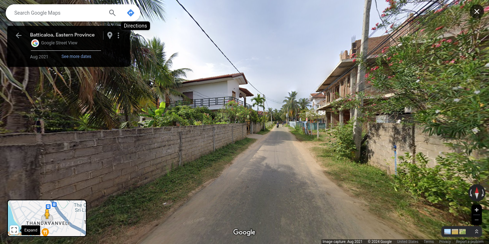

## Pannalagama

**Pannalagama** Grama Niladhari Division, **Uva Paranagama** Divisional Secretariat Division, **Badulla** District, **Uva** Province

**Uva Paranagama** Polling Division, **Badulla** Electoral District

Population: 1,351 (2012)

(**LK-8127240**/47F)

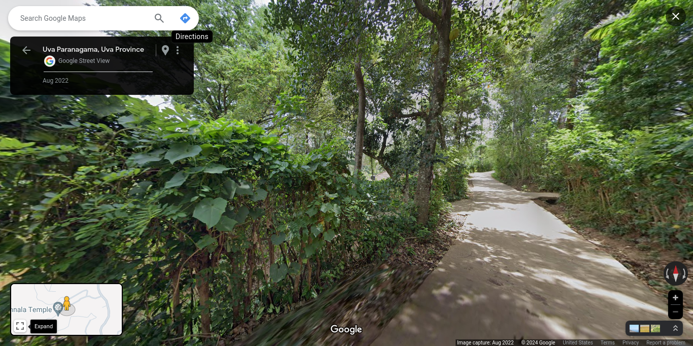

## Amunukumbura

**Amunukumbura** Grama Niladhari Division, **Mahara** Divisional Secretariat Division, **Gampaha** District, **Western** Province

**Mahara** Polling Division, **Gampaha** Electoral District

Population: 1,459 (2012)

(**LK-1233075**/296)

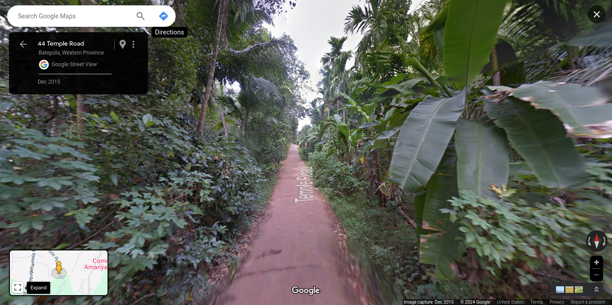

## Kuliyapitiya Town

**Kuliyapitiya Town** Grama Niladhari Division, **Kuliyapitiya West** Divisional Secretariat Division, **Kurunegala** District, **North Western** Province

**Kuliyapitiya** Polling Division, **Kurunegala** Electoral District

Population: 2,076 (2012)

(**LK-6172100**/1157)

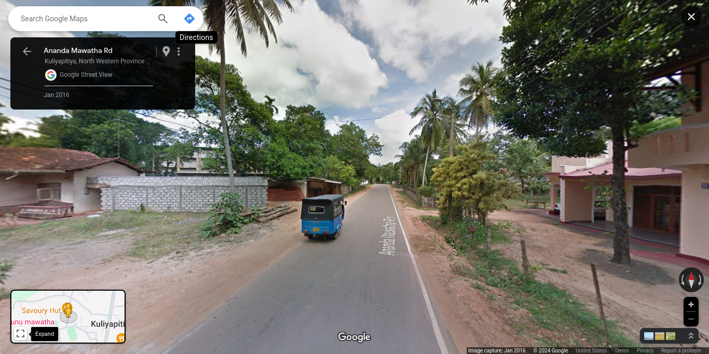

## Pallansena North

**Pallansena North** Grama Niladhari Division, **Negombo** Divisional Secretariat Division, **Gampaha** District, **Western** Province

**Negombo** Polling Division, **Gampaha** Electoral District

Population: 3,722 (2012)

(**LK-1203010**/77)

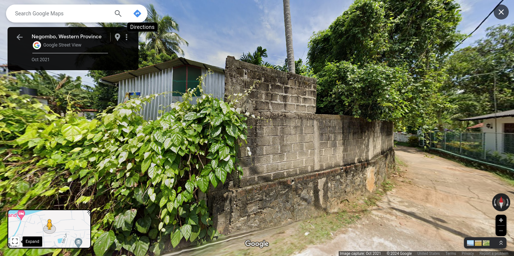

## Malewana

**Malewana** Grama Niladhari Division, **Beruwala** Divisional Secretariat Division, **Kalutara** District, **Western** Province

**Beruwala** Polling Division, **Kalutara** Electoral District

Population: 2,442 (2012)

(**LK-1324340**/766F)

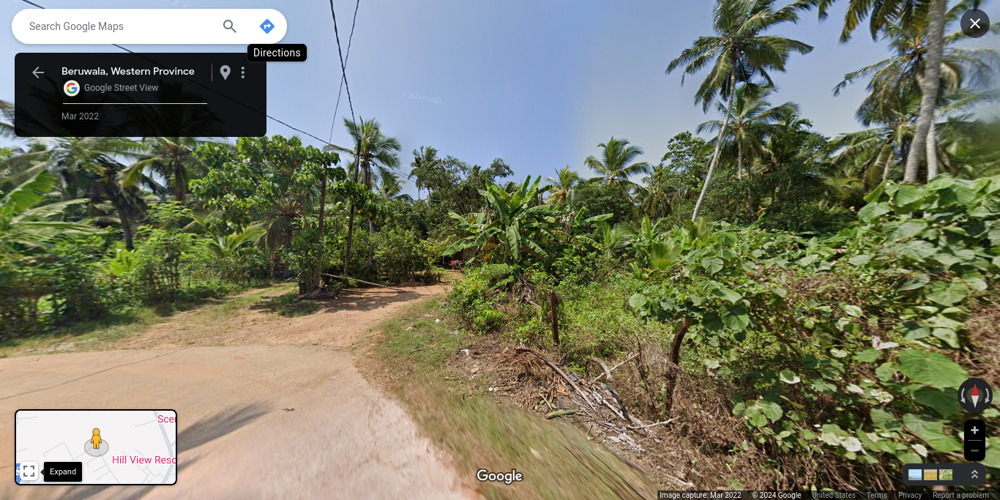

## Thunadahena

**Thunadahena** Grama Niladhari Division, **Kaduwela** Divisional Secretariat Division, **Colombo** District, **Western** Province

**Kaduwela** Polling Division, **Colombo** Electoral District

Population: 4,405 (2012)

(**LK-1109075**/488B)

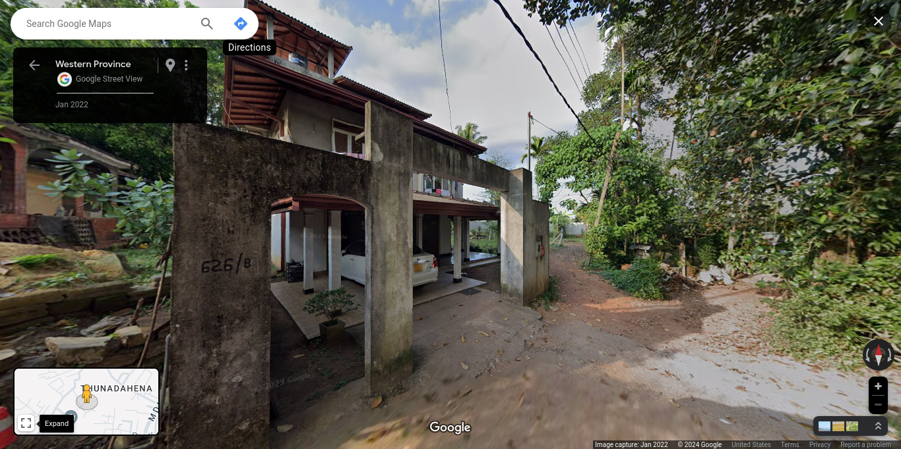

## Ariyalai S. W. (East)

**Ariyalai S. W. (East)** Grama Niladhari Division, **Nallur** Divisional Secretariat Division, **Jaffna** District, **Northern** Province

**Nallur** Polling Division, **Jaffna** Electoral District

Population: 1,105 (2012)

(**LK-4133025**/J/93)

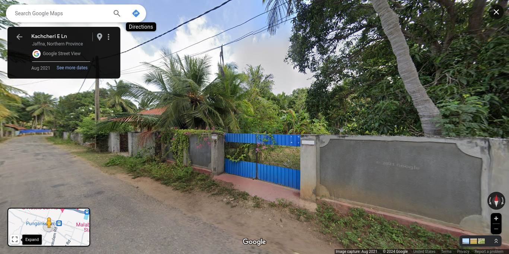

## Pitiyegedara

**Pitiyegedara** Grama Niladhari Division, **Pathadumbara** Divisional Secretariat Division, **Kandy** District, **Central** Province

**Pathadumbara** Polling Division, **Kandy** Electoral District

Population: 1,129 (2012)

(**LK-2112090**/642)

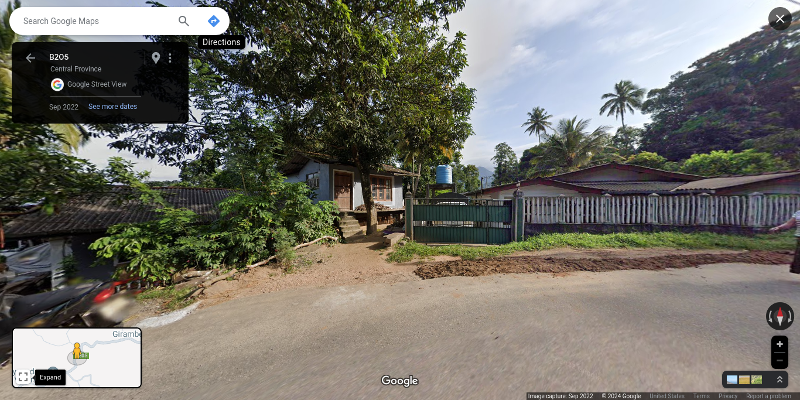

## Kumbalwella South

**Kumbalwella South** Grama Niladhari Division, **Galle Four Gravets** Divisional Secretariat Division, **Galle** District, **Southern** Province

**Galle** Polling Division, **Galle** Electoral District

Population: 2,083 (2012)

(**LK-3139145**/96)

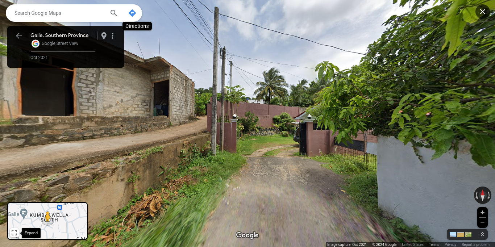

## Senapura

**Senapura** Grama Niladhari Division, **Bandaragama** Divisional Secretariat Division, **Kalutara** District, **Western** Province

**Bandaragama** Polling Division, **Kalutara** Electoral District

Population: 2,617 (2012)

(**LK-1306015**/669C)

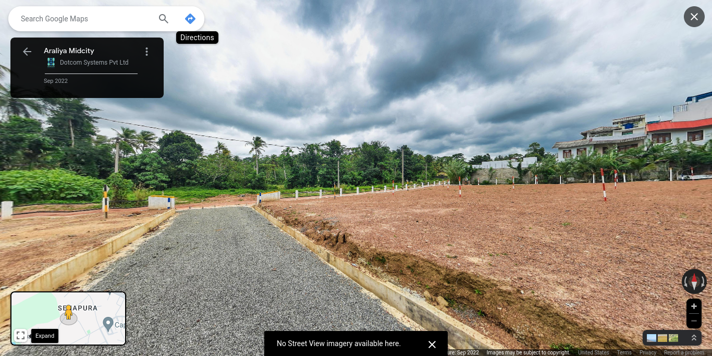

## Akkaraipattu 02

**Akkaraipattu 02** Grama Niladhari Division, **Akkaraipattu** Divisional Secretariat Division, **Ampara** District, **Eastern** Province

**Samanthurai** Polling Division, **Digamadulla** Electoral District

Population: 1,206 (2012)

(**LK-5236090**/AP/16)

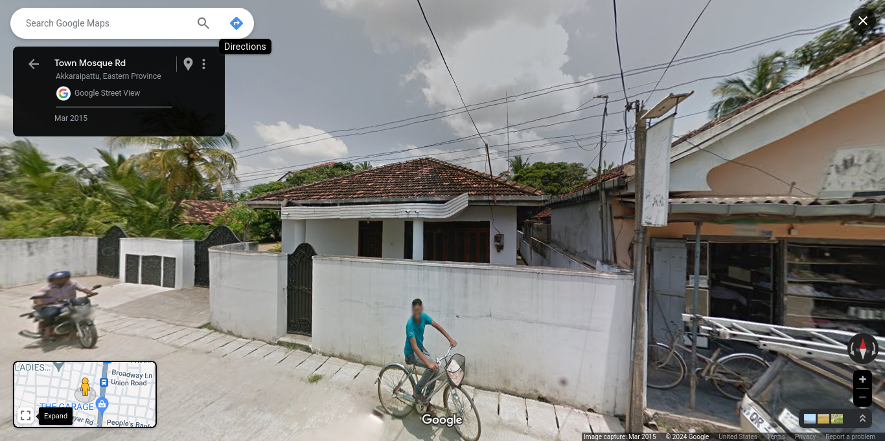

## Parakandeniya North 2

**Parakandeniya North 2** Grama Niladhari Division, **Gampaha** Divisional Secretariat Division, **Gampaha** District, **Western** Province

**Gampaha** Polling Division, **Gampaha** Electoral District

Population: 1,749 (2012)

(**LK-1224450**/244B)

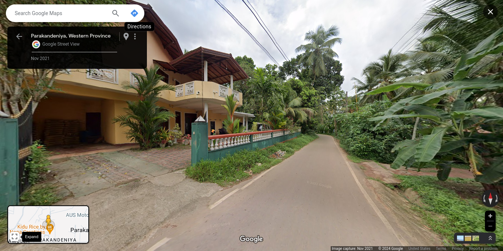

## Pahala Kosgama East

**Pahala Kosgama East** Grama Niladhari Division, **Seethawaka** Divisional Secretariat Division, **Colombo** District, **Western** Province

**Avissawella** Polling Division, **Colombo** Electoral District

Population: 1,830 (2012)

(**LK-1115110**/427)

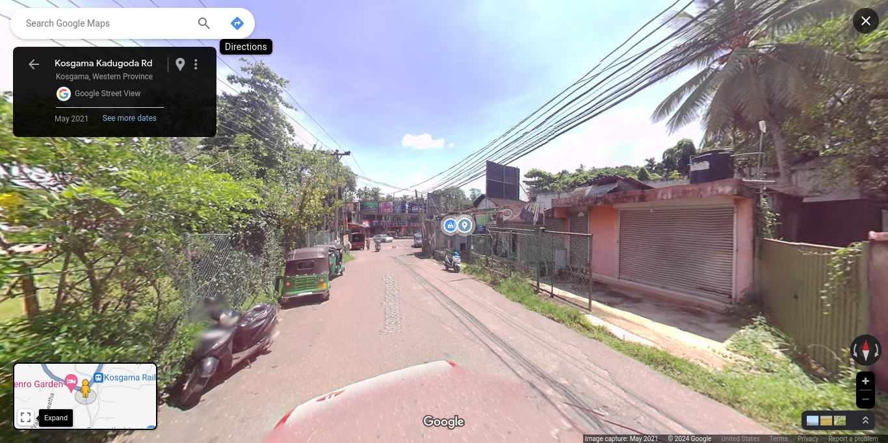

## Mahara Nugegoda South

**Mahara Nugegoda South** Grama Niladhari Division, **Mahara** Divisional Secretariat Division, **Gampaha** District, **Western** Province

**Mahara** Polling Division, **Gampaha** Electoral District

Population: 2,994 (2012)

(**LK-1233360**/247C)

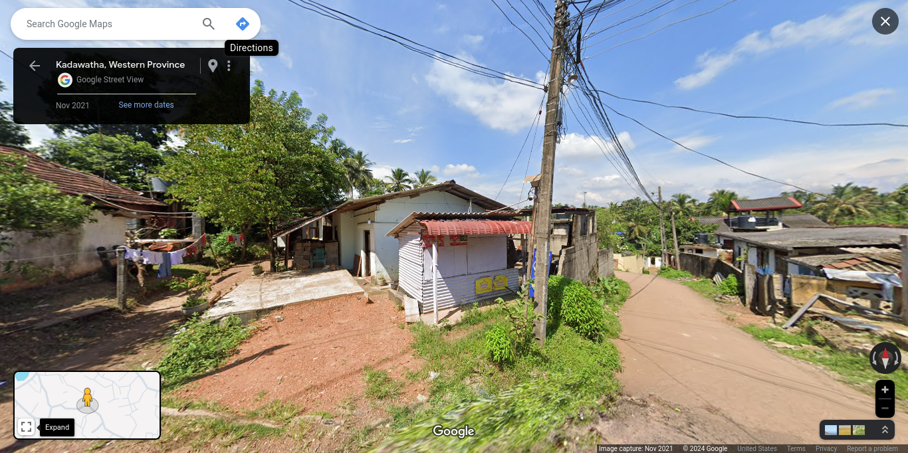

## Wadduwa West

**Wadduwa West** Grama Niladhari Division, **Panadura** Divisional Secretariat Division, **Kalutara** District, **Western** Province

**Panadura** Polling Division, **Kalutara** Electoral District

Population: 1,392 (2012)

(**LK-1303320**/699)

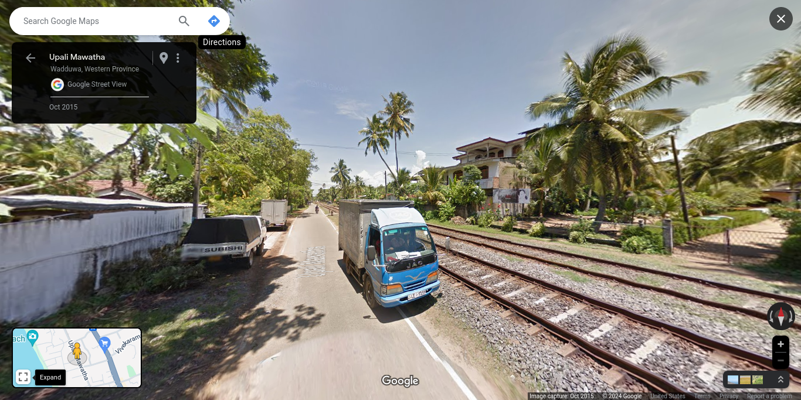

## Ketagewatta

**Ketagewatta** Grama Niladhari Division, **Ja-Ela** Divisional Secretariat Division, **Gampaha** District, **Western** Province

**Ja Ela** Polling Division, **Gampaha** Electoral District

Population: 3,975 (2012)

(**LK-1221275**/181F)

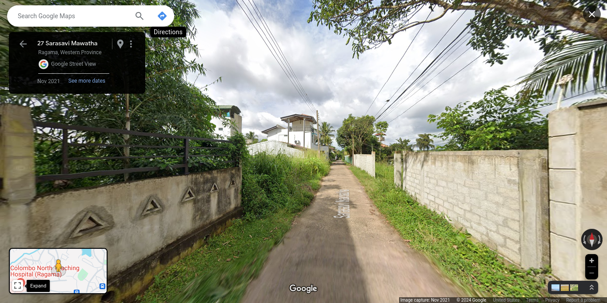

## Uyanwatta

**Uyanwatta** Grama Niladhari Division, **Harispattuwa** Divisional Secretariat Division, **Kandy** District, **Central** Province

**Harispattuwa** Polling Division, **Kandy** Electoral District

Population: 924 (2012)

(**LK-2133205**/491)

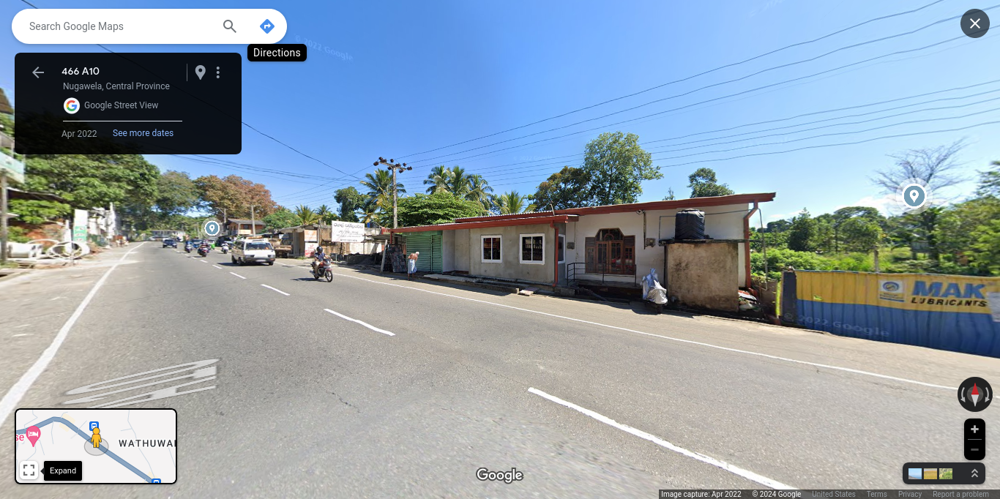

## Nilannoruwa

**Nilannoruwa** Grama Niladhari Division, **Pallepola** Divisional Secretariat Division, **Matale** District, **Central** Province

**Dambulla** Polling Division, **Matale** Electoral District

Population: 808 (2012)

(**LK-2212030**/E426A)

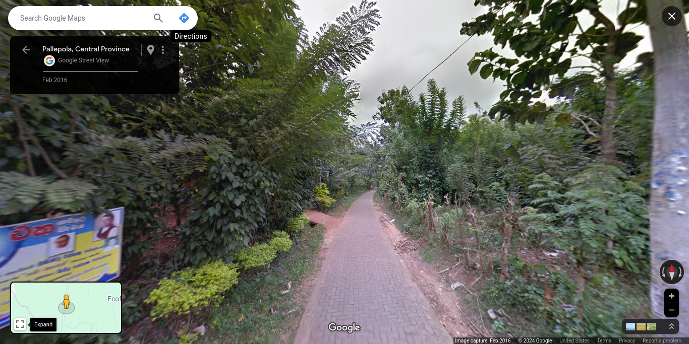

## Meda Pothupitiya

**Meda Pothupitiya** Grama Niladhari Division, **Kalutara** Divisional Secretariat Division, **Kalutara** District, **Western** Province

**Kalutara** Polling Division, **Kalutara** Electoral District

Population: 1,232 (2012)

(**LK-1321120**/708D)

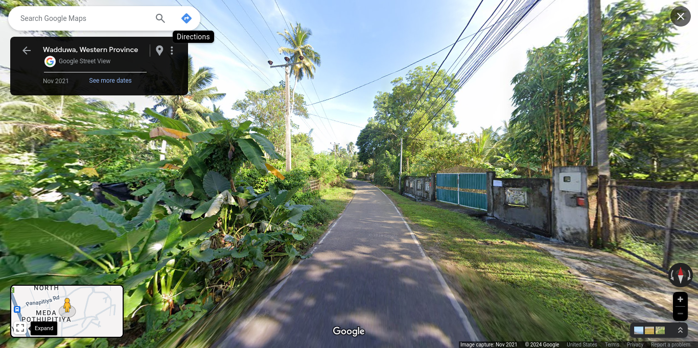

## Valayoothu

**Valayoothu** Grama Niladhari Division, **Kuchchaveli** Divisional Secretariat Division, **Trincomalee** District, **Eastern** Province

**Trincomalee** Polling Division, **Trincomalee** Electoral District

Population: 1,305 (2012)

(**LK-5306120**/241G)

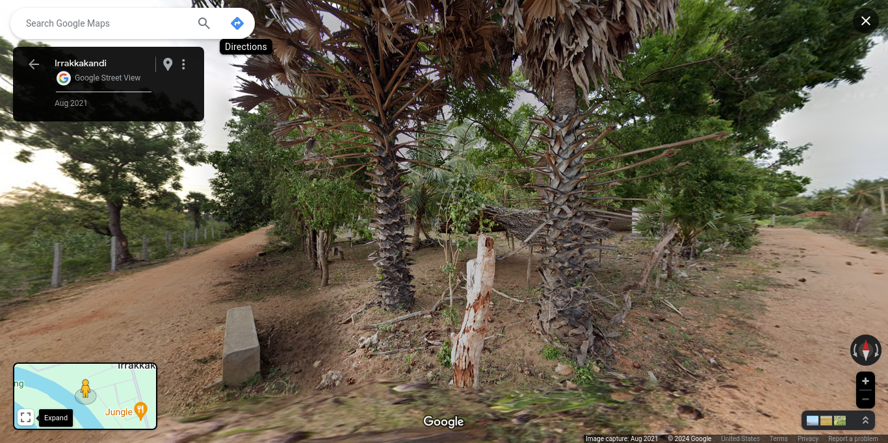

## Thennakumbura

**Thennakumbura** Grama Niladhari Division, **Kandy Four Gravets & Gangawata Korale** Divisional Secretariat Division, **Kandy** District, **Central** Province

**Senkadagala** Polling Division, **Kandy** Electoral District

Population: 6,195 (2012)

(**LK-2130240**/275)

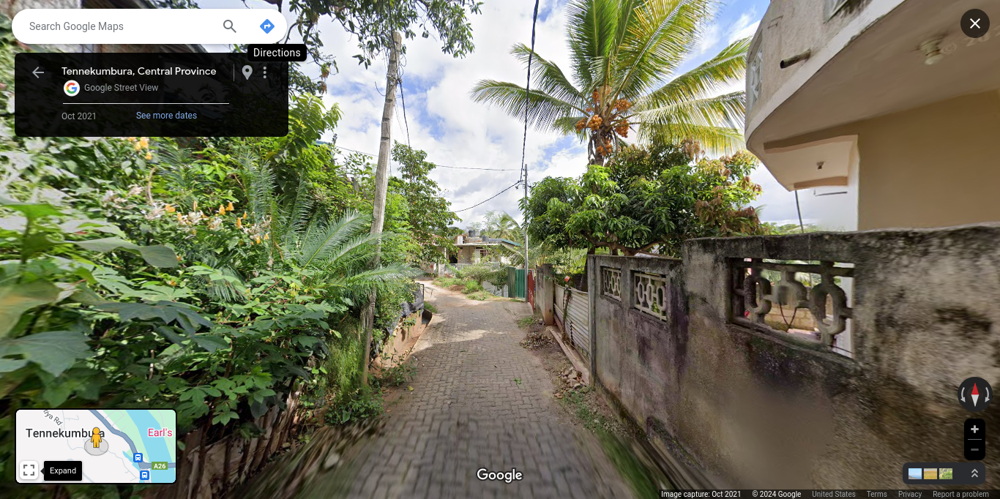

## Thebuwana East

**Thebuwana East** Grama Niladhari Division, **Dodangoda** Divisional Secretariat Division, **Kalutara** District, **Western** Province

**Mathugama** Polling Division, **Kalutara** Electoral District

Population: 2,162 (2012)

(**LK-1327050**/809)

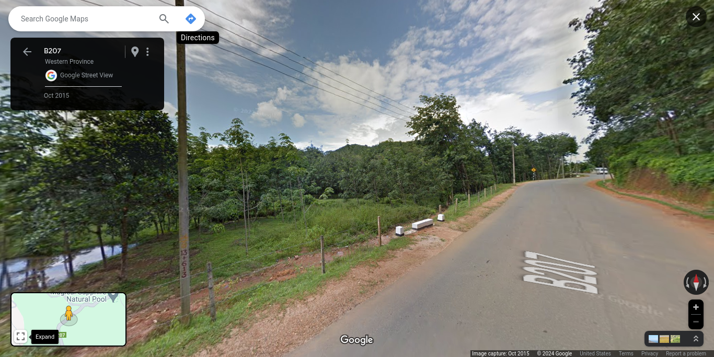

## Makilangamuwa

**Makilangamuwa** Grama Niladhari Division, **Gampaha** Divisional Secretariat Division, **Gampaha** District, **Western** Province

**Gampaha** Polling Division, **Gampaha** Electoral District

Population: 1,204 (2012)

(**LK-1224170**/221)

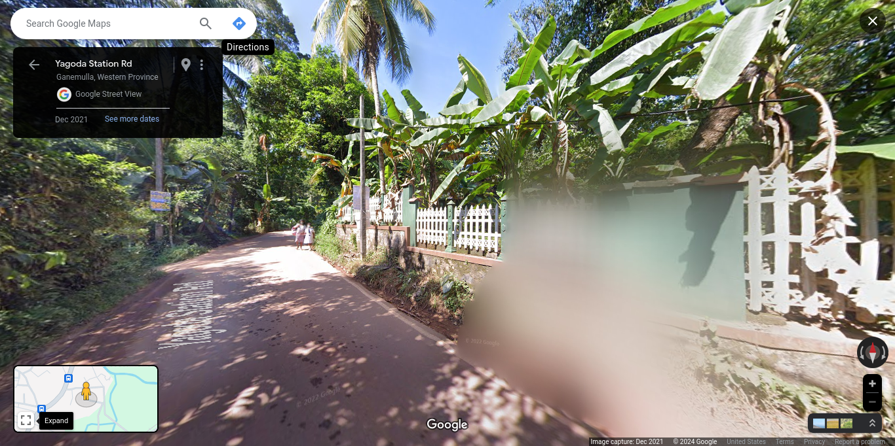

## Dehiyagatha South

**Dehiyagatha South** Grama Niladhari Division, **Ja-Ela** Divisional Secretariat Division, **Gampaha** District, **Western** Province

**Ja Ela** Polling Division, **Gampaha** Electoral District

Population: 1,114 (2012)

(**LK-1221035**/194A)

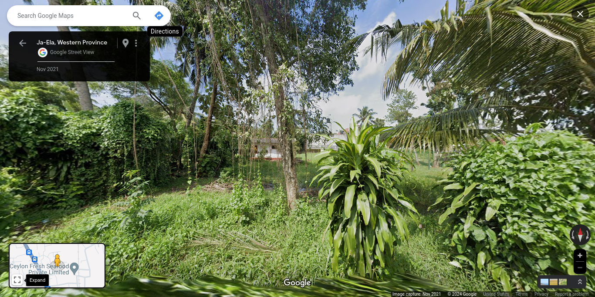

## Nagasena

**Nagasena** Grama Niladhari Division, **Nuwara Eliya** Divisional Secretariat Division, **Nuwara Eliya** District, **Central** Province

**Nuwara Eliya Maskeliya** Polling Division, **Nuwara-Eliya** Electoral District

Population: 5,022 (2012)

(**LK-2312255**/475H)

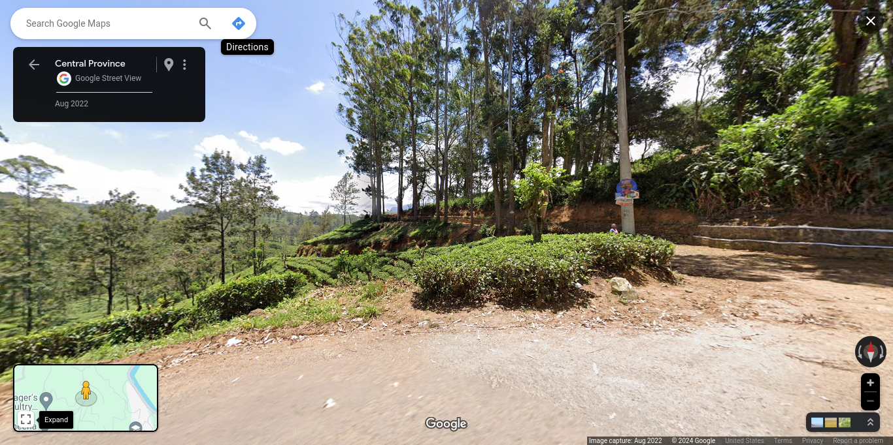

## Kankesanthurai Centre

**Kankesanthurai Centre** Grama Niladhari Division, **Valikamam North (Tellipallai)** Divisional Secretariat Division, **Jaffna** District, **Northern** Province

**Kayts** Polling Division, **Jaffna** Electoral District

Population: 325 (2012)

(**LK-4112115**/234)

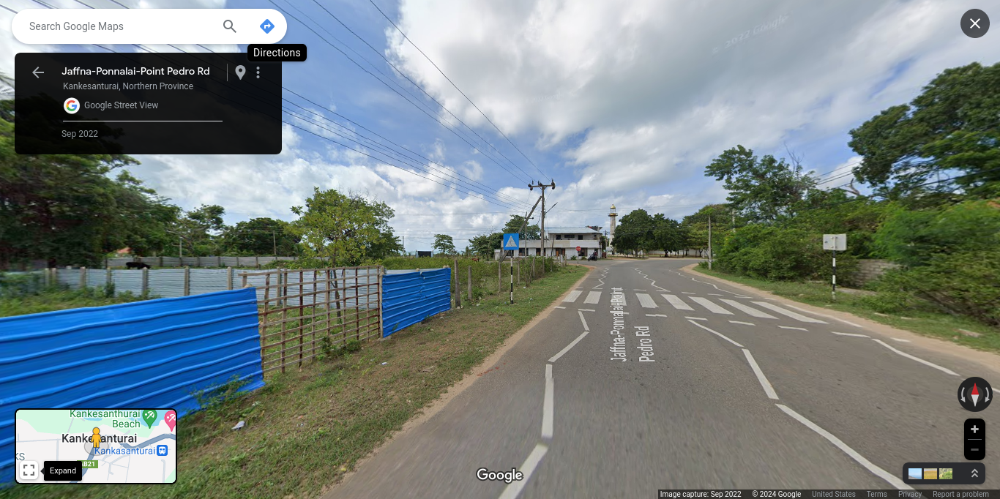

## Pidurangala

**Pidurangala** Grama Niladhari Division, **Dambulla** Divisional Secretariat Division, **Matale** District, **Central** Province

**Dambulla** Polling Division, **Matale** Electoral District

Population: 550 (2012)

(**LK-2206020**/E455C)

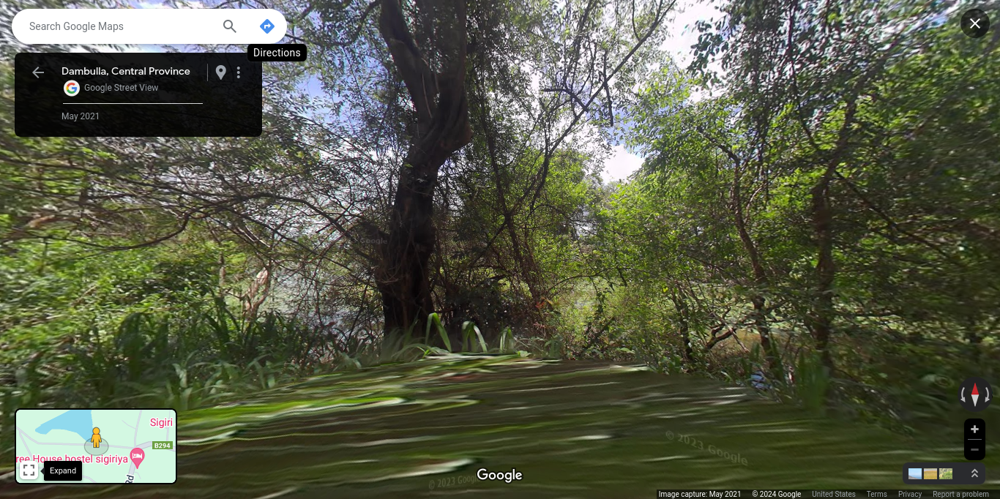

## Elagamuwa

**Elagamuwa** Grama Niladhari Division, **Polpithigama** Divisional Secretariat Division, **Kurunegala** District, **North Western** Province

**Yapahuwa** Polling Division, **Kurunegala** Electoral District

Population: 863 (2012)

(**LK-6127200**/398)

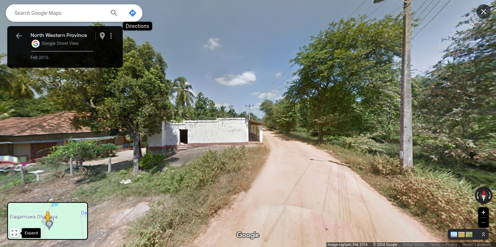

## Kumbukwewa

**Kumbukwewa** Grama Niladhari Division, **Galenbindunuwewa** Divisional Secretariat Division, **Anuradhapura** District, **North Central** Province

**Horowpothana** Polling Division, **Anuradhapura** Electoral District

Population: 1,514 (2012)

(**LK-7127135**/175)

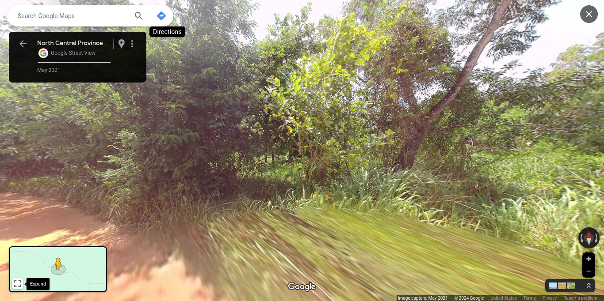

## Muttakkarai  North

**Muttakkarai  North** Grama Niladhari Division, **Negombo** Divisional Secretariat Division, **Gampaha** District, **Western** Province

**Negombo** Polling Division, **Gampaha** Electoral District

Population: 2,852 (2012)

(**LK-1203110**/156A)

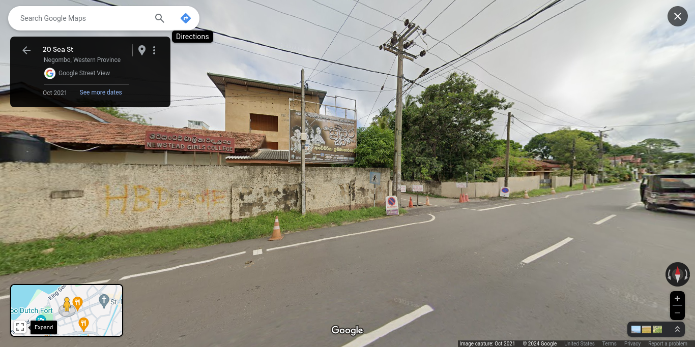

## Ihagama

**Ihagama** Grama Niladhari Division, **Harispattuwa** Divisional Secretariat Division, **Kandy** District, **Central** Province

**Harispattuwa** Polling Division, **Kandy** Electoral District

Population: 890 (2012)

(**LK-2133015**/489)

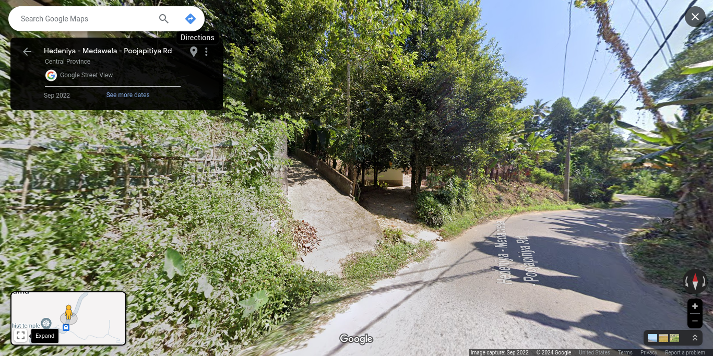

## Yakarawatta

**Yakarawatta** Grama Niladhari Division, **Kuliyapitiya West** Divisional Secretariat Division, **Kurunegala** District, **North Western** Province

**Kuliyapitiya** Polling Division, **Kurunegala** Electoral District

Population: 1,063 (2012)

(**LK-6172190**/1152)

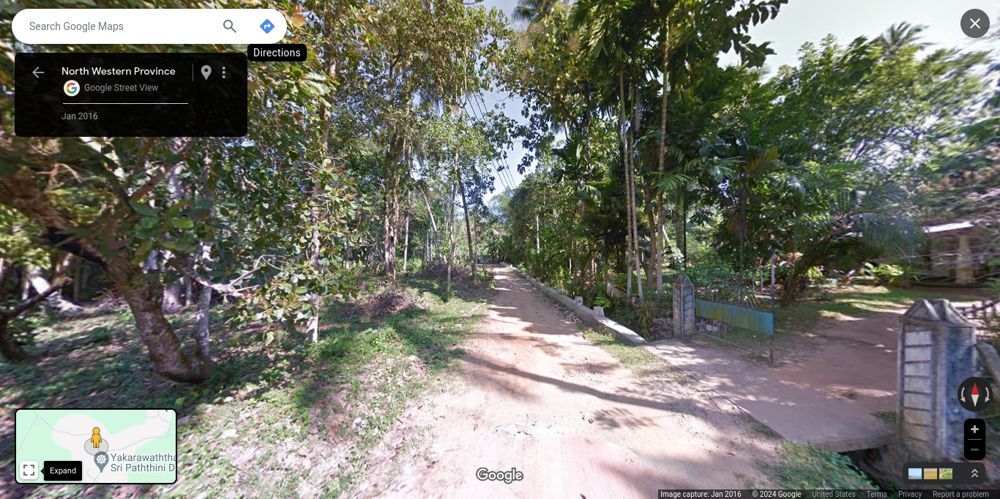

## Polkotuwa

**Polkotuwa** Grama Niladhari Division, **Beruwala** Divisional Secretariat Division, **Kalutara** District, **Western** Province

**Beruwala** Polling Division, **Kalutara** Electoral District

Population: 3,383 (2012)

(**LK-1324220**/748)

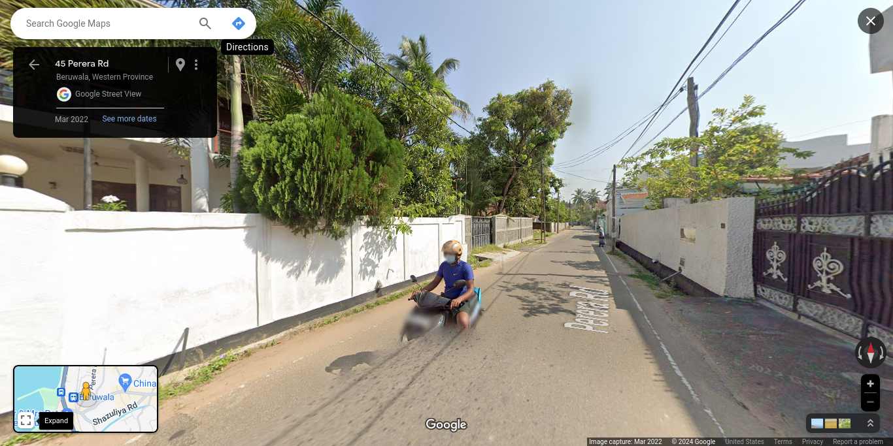

## Avudangawa

**Avudangawa** Grama Niladhari Division, **Dambulla** Divisional Secretariat Division, **Matale** District, **Central** Province

**Dambulla** Polling Division, **Matale** Electoral District

Population: 608 (2012)

(**LK-2206010**/E453)

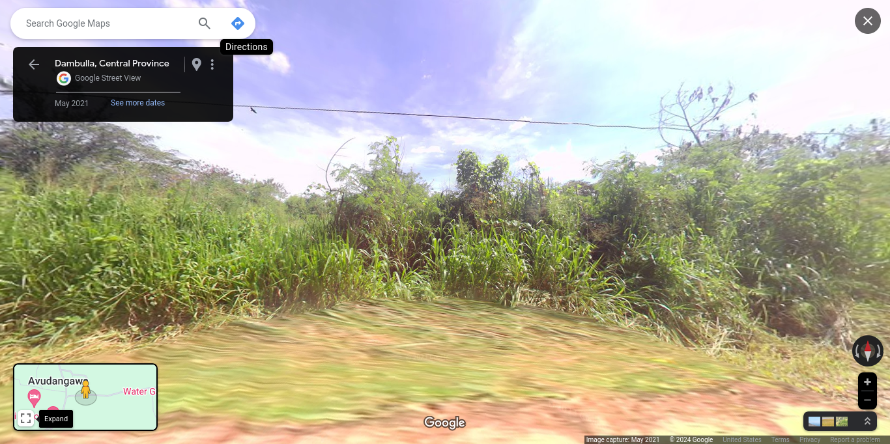

## Saddhathissapura

**Saddhathissapura** Grama Niladhari Division, **Ampara** Divisional Secretariat Division, **Ampara** District, **Eastern** Province

**Ampara** Polling Division, **Digamadulla** Electoral District

Population: 2,232 (2012)

(**LK-5215055**/W/89F)

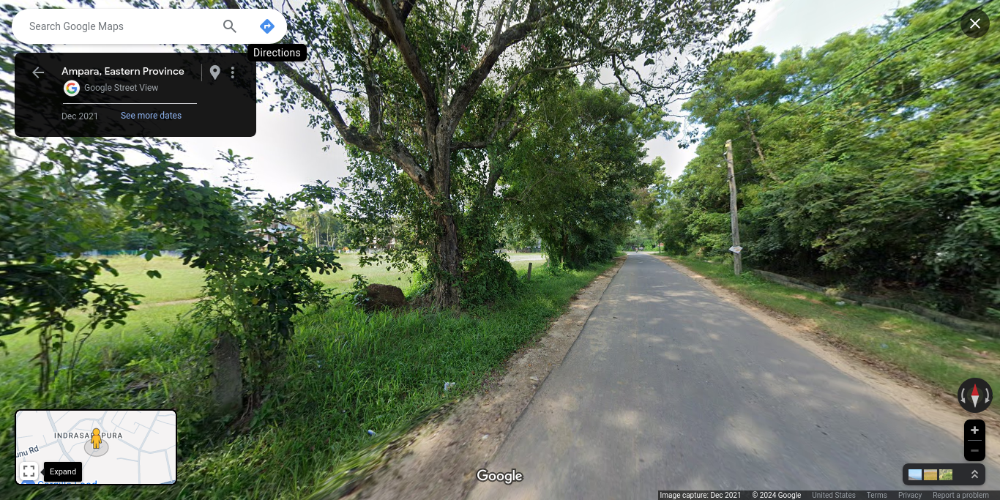

## Boralesgamuwa West B

**Boralesgamuwa West B** Grama Niladhari Division, **Kesbewa** Divisional Secretariat Division, **Colombo** District, **Western** Province

**Kesbewa** Polling Division, **Colombo** Electoral District

Population: 2,822 (2012)

(**LK-1136055**/533E)

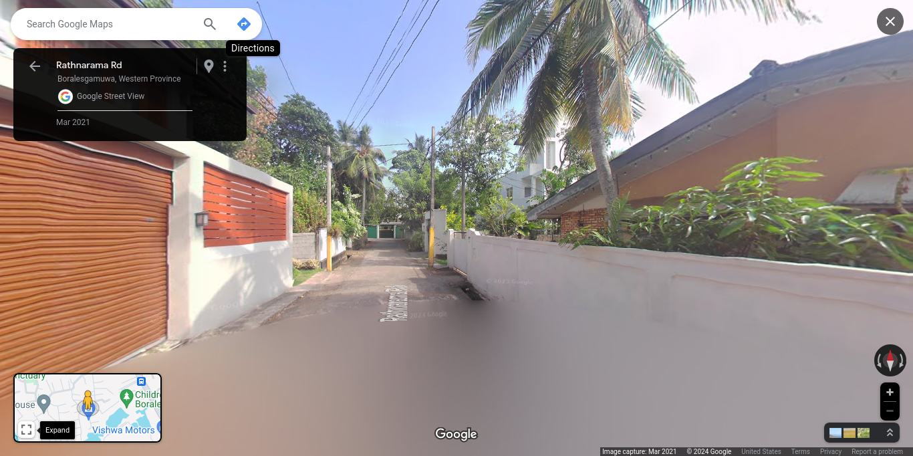

## Gediyaroda

**Gediyaroda** Grama Niladhari Division, **Bandarawela** Divisional Secretariat Division, **Badulla** District, **Uva** Province

**Bandarawela** Polling Division, **Badulla** Electoral District

Population: 1,883 (2012)

(**LK-8133060**/67K)

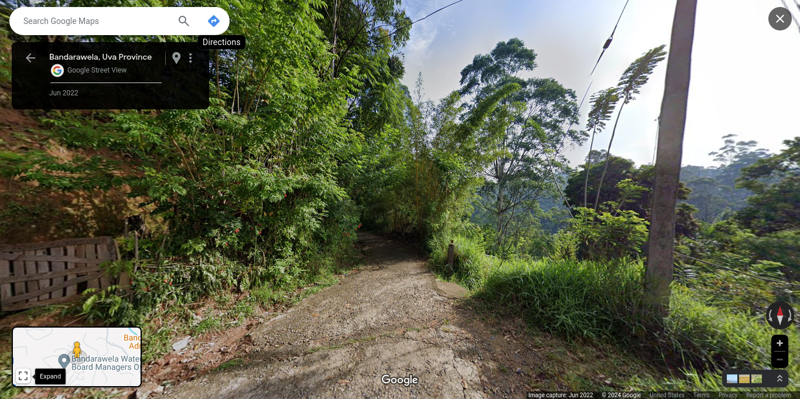

## Moor Street South

**Moor Street South** Grama Niladhari Division, **Jaffna** Divisional Secretariat Division, **Jaffna** District, **Northern** Province

**Jaffna** Polling Division, **Jaffna** Electoral District

Population: 1,272 (2012)

(**LK-4136130**/J/86)

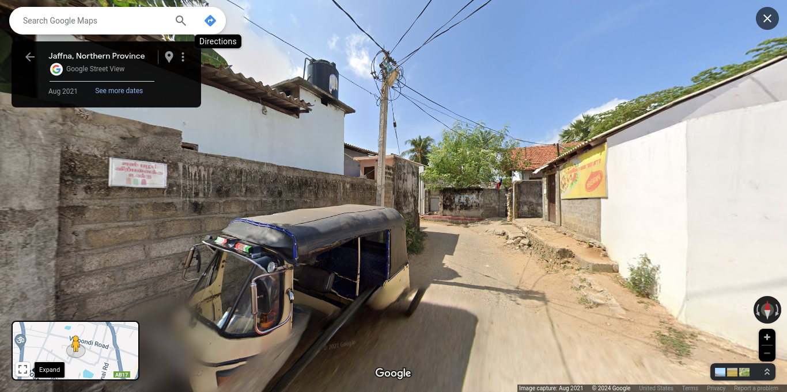

## Kottawa South

**Kottawa South** Grama Niladhari Division, **Maharagama** Divisional Secretariat Division, **Colombo** District, **Western** Province

**Maharagama** Polling Division, **Colombo** Electoral District

Population: 7,159 (2012)

(**LK-1121130**/496)

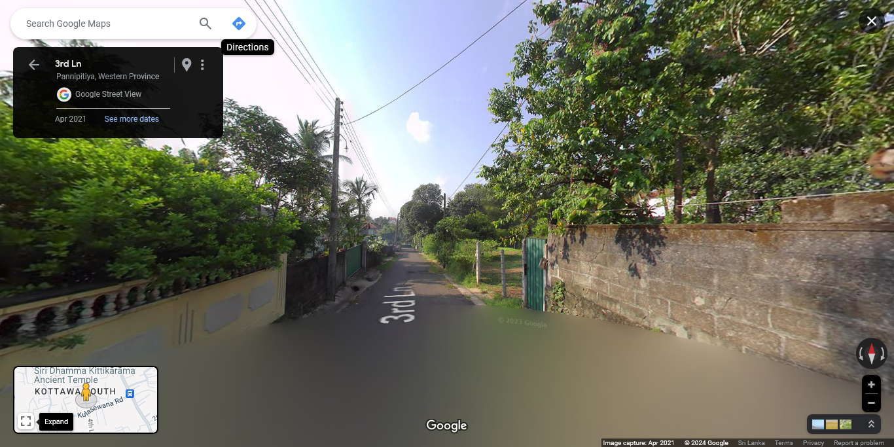

## Katuwana

**Katuwana** Grama Niladhari Division, **Homagama** Divisional Secretariat Division, **Colombo** District, **Western** Province

**Homagama** Polling Division, **Colombo** Electoral District

Population: 4,223 (2012)

(**LK-1112190**/486E)

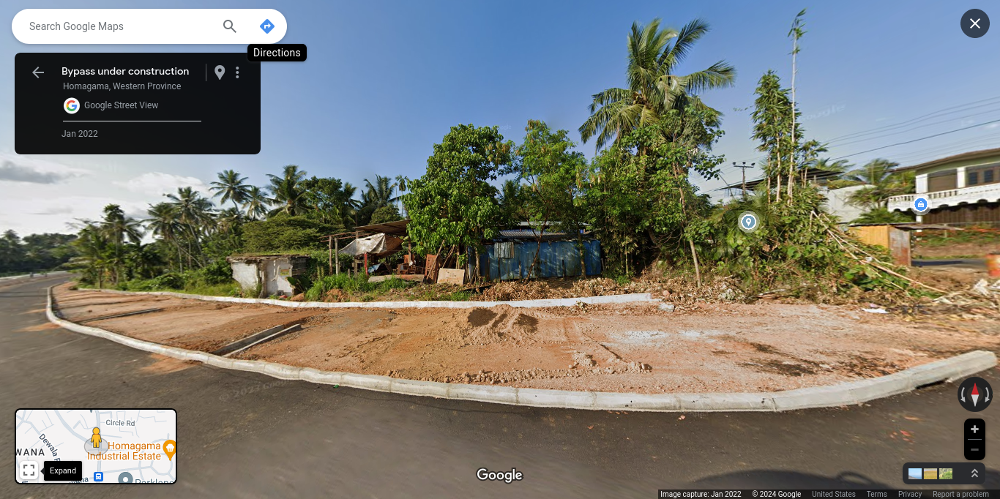

## Kalmunaikudi 09

**Kalmunaikudi 09** Grama Niladhari Division, **Kalmunai** Divisional Secretariat Division, **Ampara** District, **Eastern** Province

**Kalmunai** Polling Division, **Digamadulla** Electoral District

Population: 2,498 (2012)

(**LK-5224115**/KP/56B)

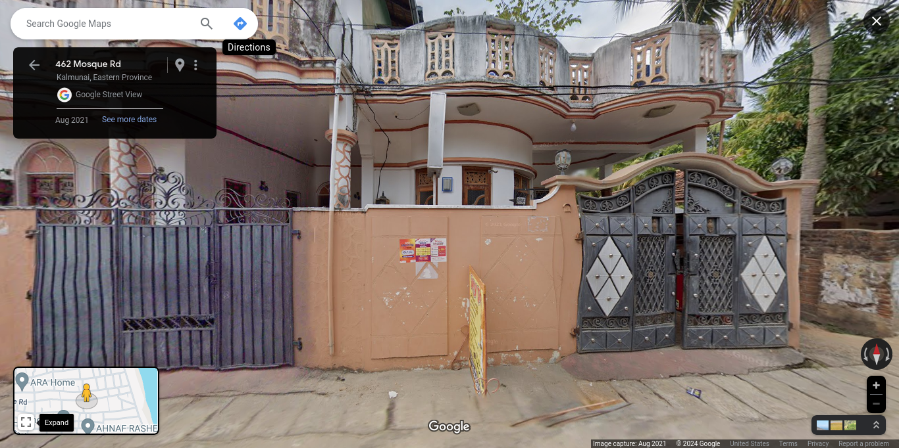

## Dalupitiya West

**Dalupitiya West** Grama Niladhari Division, **Mahara** Divisional Secretariat Division, **Gampaha** District, **Western** Province

**Mahara** Polling Division, **Gampaha** Electoral District

Population: 1,498 (2012)

(**LK-1233405**/252A)

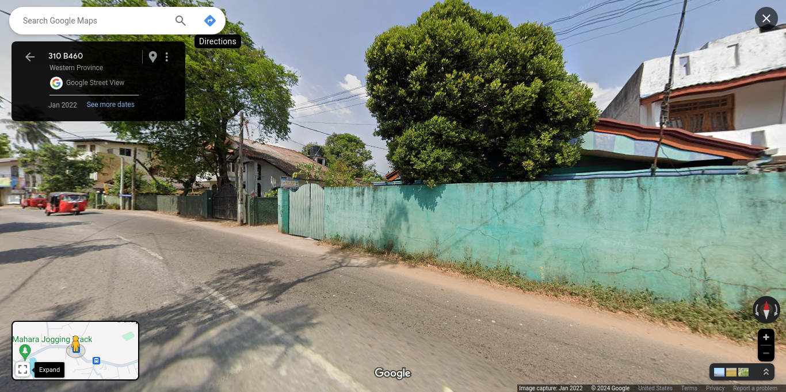

## Kadawedduwa West

**Kadawedduwa West** Grama Niladhari Division, **Devinuwara** Divisional Secretariat Division, **Matara** District, **Southern** Province

**Devinuwara** Polling Division, **Matara** Electoral District

Population: 1,420 (2012)

(**LK-3245005**/449A)

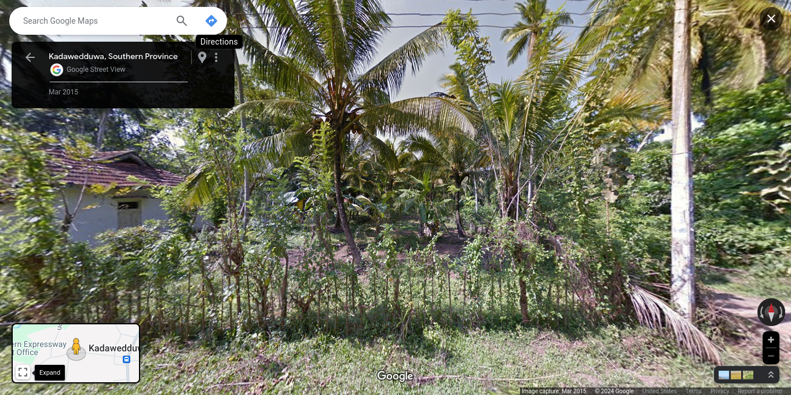

## Naotunna Central

**Naotunna Central** Grama Niladhari Division, **Devinuwara** Divisional Secretariat Division, **Matara** District, **Southern** Province

**Devinuwara** Polling Division, **Matara** Electoral District

Population: 715 (2012)

(**LK-3245085**/442A)

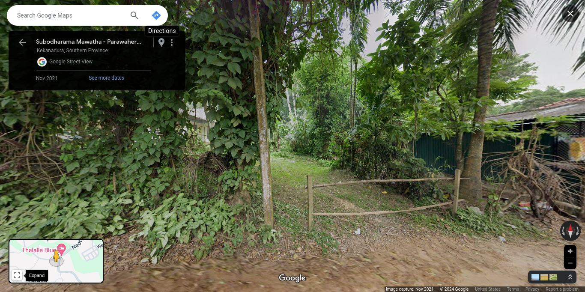

## Egodagama

**Egodagama** Grama Niladhari Division, **Bandarawela** Divisional Secretariat Division, **Badulla** District, **Uva** Province

**Bandarawela** Polling Division, **Badulla** Electoral District

Population: 1,532 (2012)

(**LK-8133085**/66E)

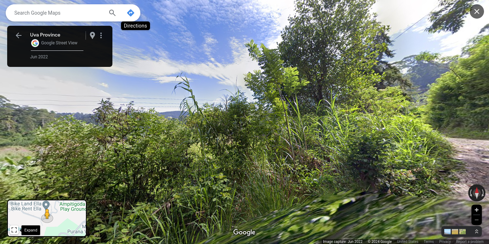

## Koralawella South

**Koralawella South** Grama Niladhari Division, **Moratuwa** Divisional Secretariat Division, **Colombo** District, **Western** Province

**Moratuwa** Polling Division, **Colombo** Electoral District

Population: 3,582 (2012)

(**LK-1133185**/554A)

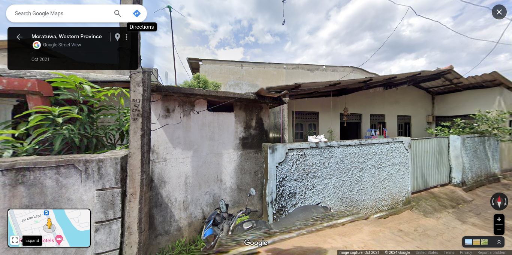

## Karaitheevu 01

**Karaitheevu 01** Grama Niladhari Division, **Karaitheevu** Divisional Secretariat Division, **Ampara** District, **Eastern** Province

**Pothuvil** Polling Division, **Digamadulla** Electoral District

Population: 999 (2012)

(**LK-5227040**/44)

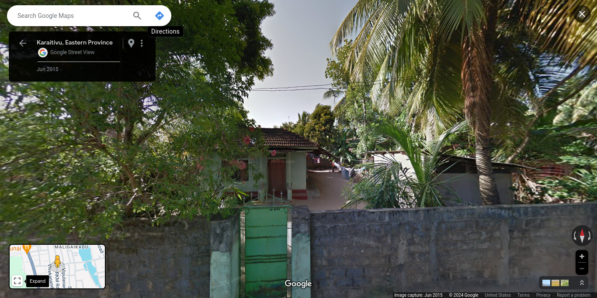

## Mahadeniya

**Mahadeniya** Grama Niladhari Division, **Kaduwela** Divisional Secretariat Division, **Colombo** District, **Western** Province

**Kaduwela** Polling Division, **Colombo** Electoral District

Population: 5,495 (2012)

(**LK-1109060**/475A)

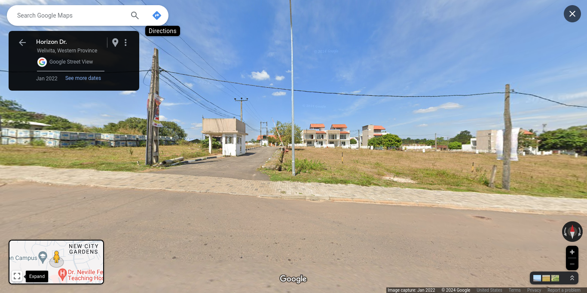

## Kevitiyagala North

**Kevitiyagala North** Grama Niladhari Division, **Agalawatta** Divisional Secretariat Division, **Kalutara** District, **Western** Province

**Agalawatta** Polling Division, **Kalutara** Electoral District

Population: 737 (2012)

(**LK-1333130**/846B)

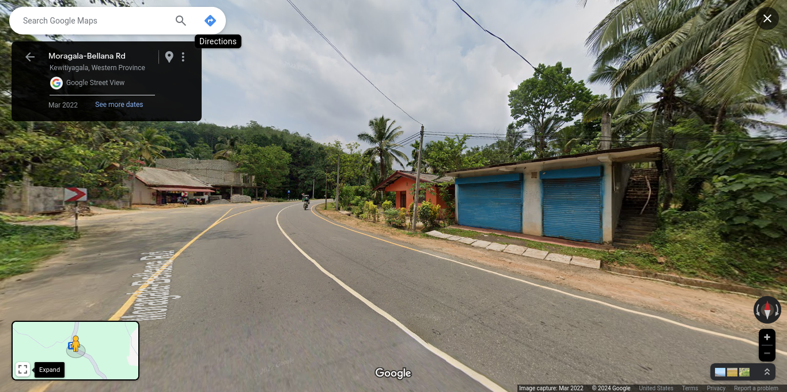

## Palangathure

**Palangathure** Grama Niladhari Division, **Negombo** Divisional Secretariat Division, **Gampaha** District, **Western** Province

**Negombo** Polling Division, **Gampaha** Electoral District

Population: 5,025 (2012)

(**LK-1203030**/75A)

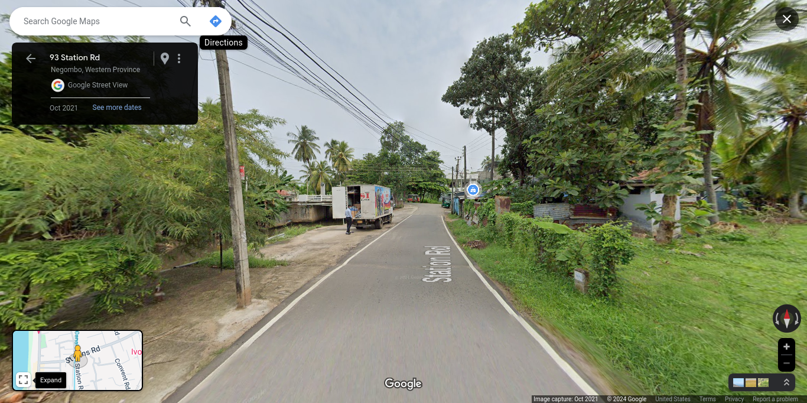

## Neervely West

**Neervely West** Grama Niladhari Division, **Valikamam East (Kopay)** Divisional Secretariat Division, **Jaffna** District, **Northern** Province

**Kopay** Polling Division, **Jaffna** Electoral District

Population: 1,159 (2012)

(**LK-4118070**/J/270)

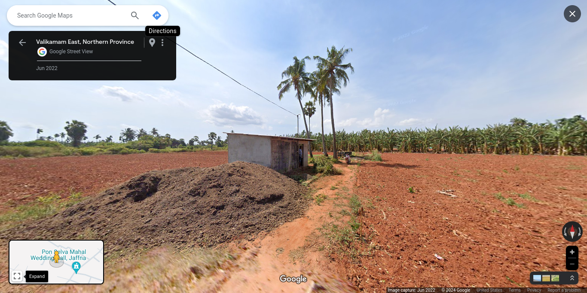

## Madduvilnadu East

**Madduvilnadu East** Grama Niladhari Division, **Poonakary** Divisional Secretariat Division, **Kilinochchi** District, **Northern** Province

**Kilinochchi** Polling Division, **Jaffna** Electoral District

Population: 461 (2012)

(**LK-4512055**/KN/64)

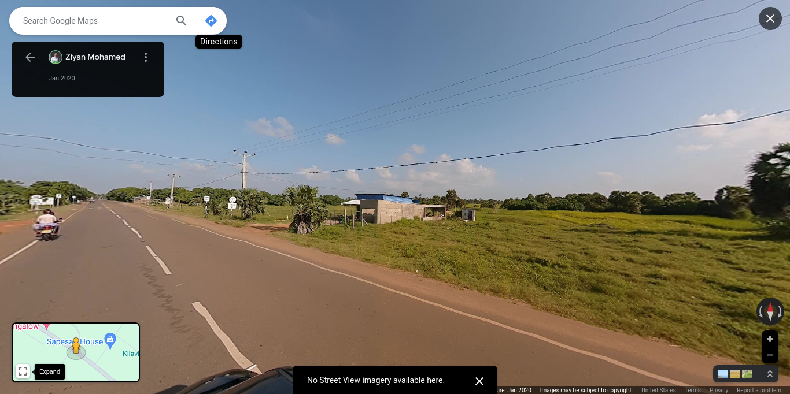

## Kudapaduwa South

**Kudapaduwa South** Grama Niladhari Division, **Negombo** Divisional Secretariat Division, **Gampaha** District, **Western** Province

**Negombo** Polling Division, **Gampaha** Electoral District

Population: 3,353 (2012)

(**LK-1203070**/73C)

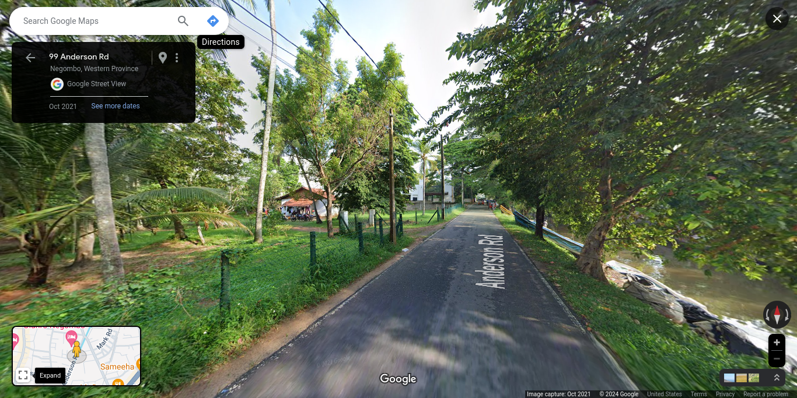

## Karasnagala South

**Karasnagala South** Grama Niladhari Division, **Attanagalla** Divisional Secretariat Division, **Gampaha** District, **Western** Province

**Attanagalla** Polling Division, **Gampaha** Electoral District

Population: 467 (2012)

(**LK-1227435**/365C)

## Maruthamunai 05

**Maruthamunai 05** Grama Niladhari Division, **Kalmunai** Divisional Secretariat Division, **Ampara** District, **Eastern** Province

**Kalmunai** Polling Division, **Digamadulla** Electoral District

Population: 1,203 (2012)

(**LK-5224035**/KP/67D)

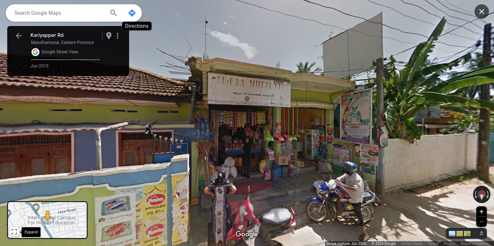

## Weerasekarapura

**Weerasekarapura** Grama Niladhari Division, **Kothmale** Divisional Secretariat Division, **Nuwara Eliya** District, **Central** Province

**Kothmale** Polling Division, **Nuwara-Eliya** Electoral District

Population: 553 (2012)

(**LK-2303280**/465G)

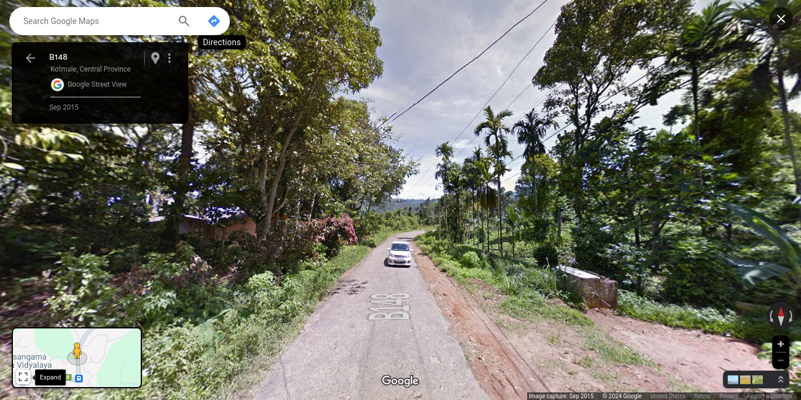

## Karaveddy  South

**Karaveddy  South** Grama Niladhari Division, **Vadamaradchi South-West (Karaveddy)** Divisional Secretariat Division, **Jaffna** District, **Northern** Province

**Udupiddy** Polling Division, **Jaffna** Electoral District

Population: 751 (2012)

(**LK-4121090**/J/365)

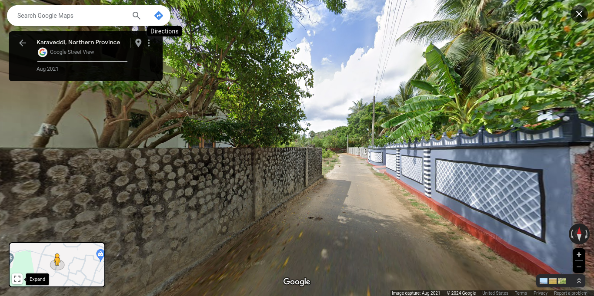

## Daluggala

**Daluggala** Grama Niladhari Division, **Rambukkana** Divisional Secretariat Division, **Kegalle** District, **Sabaragamuwa** Province

**Rambukkana** Polling Division, **Kegalle** Electoral District

Population: 427 (2012)

(**LK-9203265**/08J)

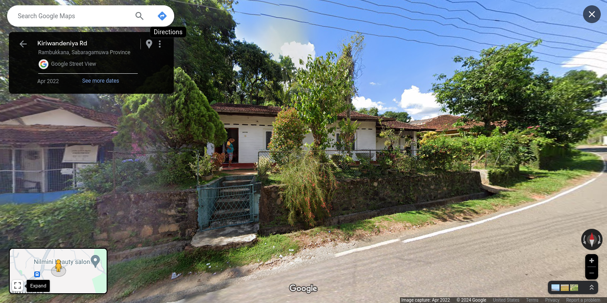

## Vidyasara

**Vidyasara** Grama Niladhari Division, **Kalutara** Divisional Secretariat Division, **Kalutara** District, **Western** Province

**Kalutara** Polling Division, **Kalutara** Electoral District

Population: 2,226 (2012)

(**LK-1321255**/717C)

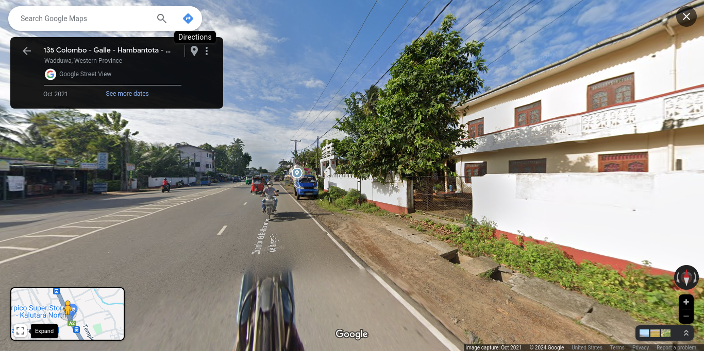

## Walagedara South

**Walagedara South** Grama Niladhari Division, **Udunuwara** Divisional Secretariat Division, **Kandy** District, **Central** Province

**Udunuwara** Polling Division, **Kandy** Electoral District

Population: 674 (2012)

(**LK-2139235**/111)

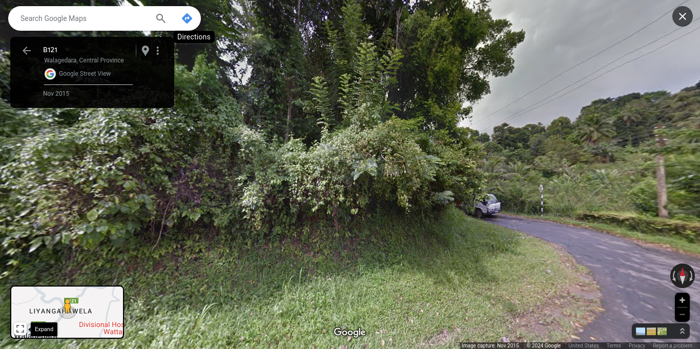

## Inikambedda

**Inikambedda** Grama Niladhari Division, **Bandarawela** Divisional Secretariat Division, **Badulla** District, **Uva** Province

**Bandarawela** Polling Division, **Badulla** Electoral District

Population: 3,184 (2012)

(**LK-8133110**/65E)

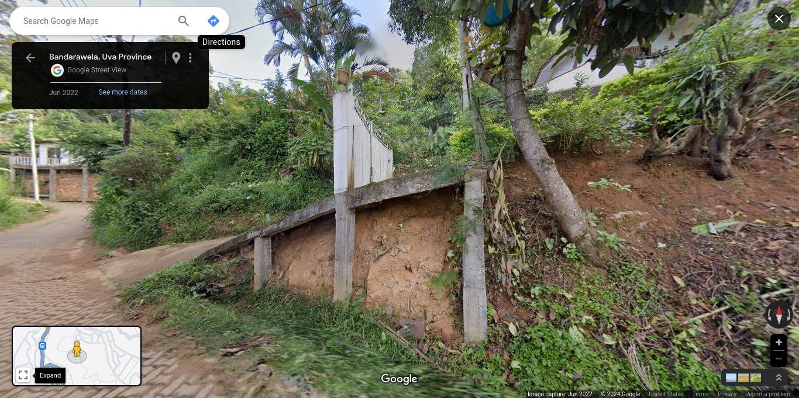

## Ahugoda Meda

**Ahugoda Meda** Grama Niladhari Division, **Polgahawela** Divisional Secretariat Division, **Kurunegala** District, **North Western** Province

**Polgahawela** Polling Division, **Kurunegala** Electoral District

Population: 604 (2012)

(**LK-6187030**/882)

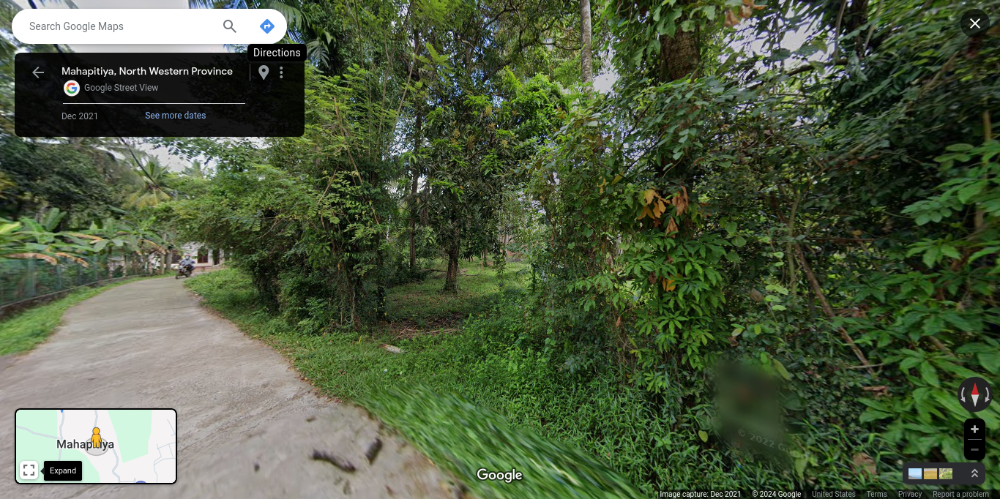

## Periyapalli Kudiyiruppuwa

**Periyapalli Kudiyiruppuwa** Grama Niladhari Division, **Puttalam** Divisional Secretariat Division, **Puttalam** District, **North Western** Province

**Puttalam** Polling Division, **Puttalam** Electoral District

Population: 626 (2012)

(**LK-6215070**/617E)

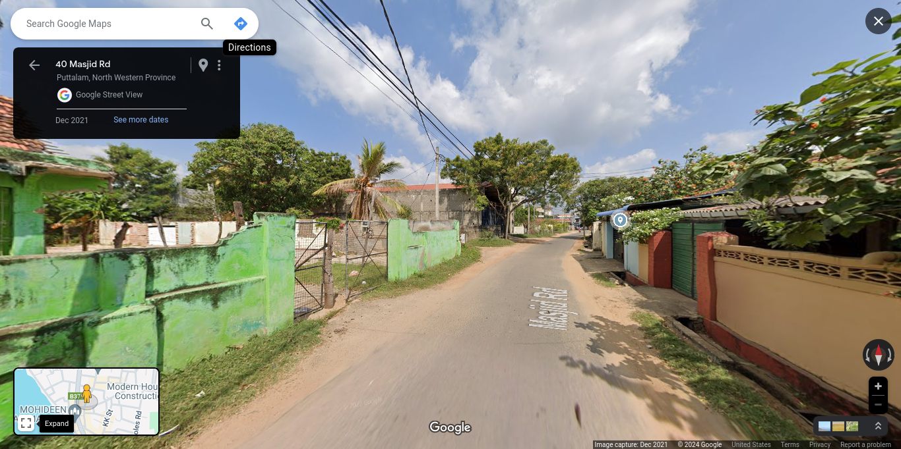

## Vantharumoolai East

**Vantharumoolai East** Grama Niladhari Division, **Eravur Pattu** Divisional Secretariat Division, **Batticaloa** District, **Eastern** Province

**Kalkudah** Polling Division, **Batticaloa** Electoral District

Population: 3,950 (2012)

(**LK-5112065**/197)

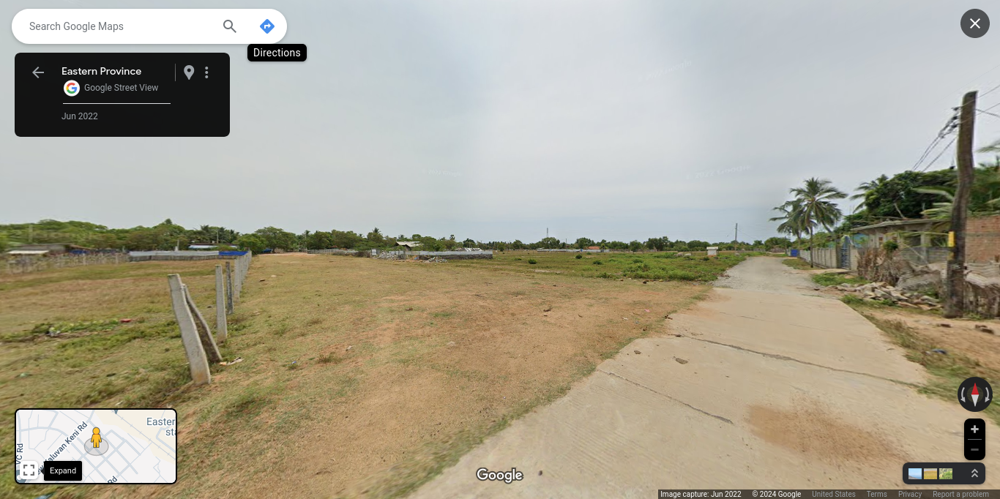

## Vidyasara

**Vidyasara** Grama Niladhari Division, **Kalutara** Divisional Secretariat Division, **Kalutara** District, **Western** Province

**Kalutara** Polling Division, **Kalutara** Electoral District

Population: 2,226 (2012)

(**LK-1321255**/717C)

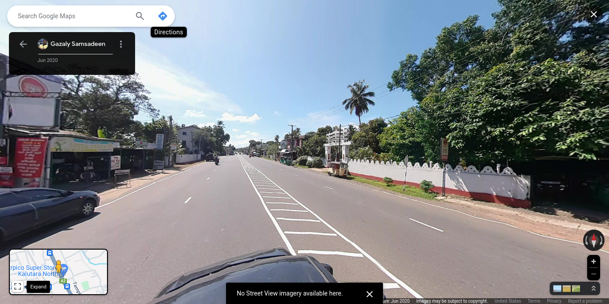

## Yakkaduwa

**Yakkaduwa** Grama Niladhari Division, **Ja-Ela** Divisional Secretariat Division, **Gampaha** District, **Western** Province

**Ja Ela** Polling Division, **Gampaha** Electoral District

Population: 3,991 (2012)

(**LK-1221085**/207A)

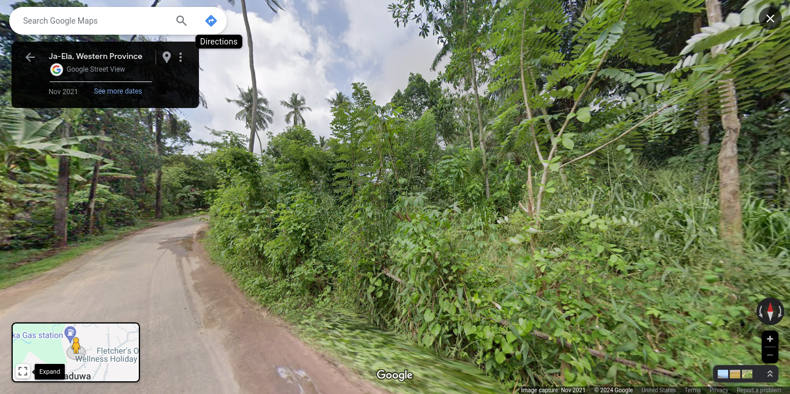

## Kanukerny West

**Kanukerny West** Grama Niladhari Division, **Maritimepattu** Divisional Secretariat Division, **Mullaitivu** District, **Northern** Province

**Mullaitivu** Polling Division, **Vanni** Electoral District

Population: 605 (2012)

(**LK-4415060**/MU/117)

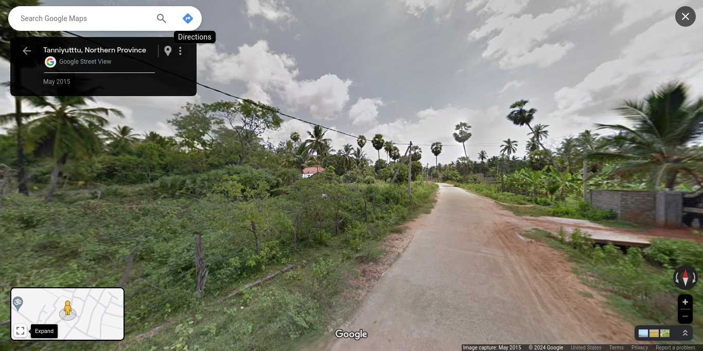

## Halthotiyawatta

**Halthotiyawatta** Grama Niladhari Division, **Horana** Divisional Secretariat Division, **Kalutara** District, **Western** Province

**Horana** Polling Division, **Kalutara** Electoral District

Population: 1,233 (2012)

(**LK-1309290**/615D)

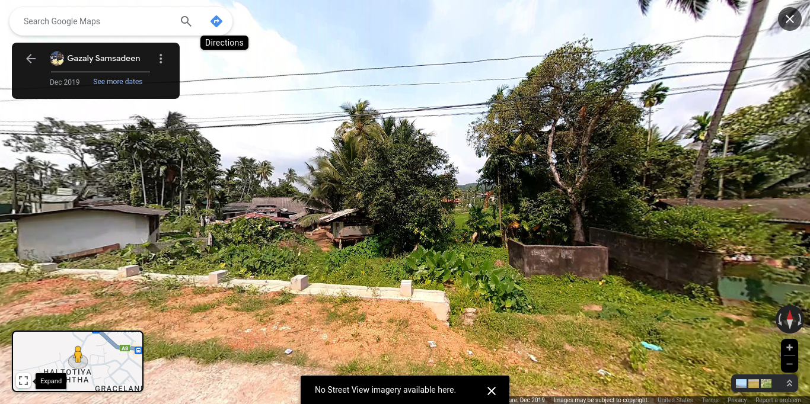

## Pawakkulama

**Pawakkulama** Grama Niladhari Division, **Nachchaduwa** Divisional Secretariat Division, **Anuradhapura** District, **North Central** Province

**Anuradhapura East** Polling Division, **Anuradhapura** Electoral District

Population: 1,147 (2012)

(**LK-7136050**/267)

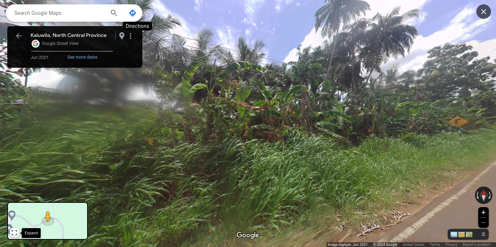

## Rajamalwatta

**Rajamalwatta** Grama Niladhari Division, **Kaduwela** Divisional Secretariat Division, **Colombo** District, **Western** Province

**Kaduwela** Polling Division, **Colombo** Electoral District

Population: 2,014 (2012)

(**LK-1109260**/492D)

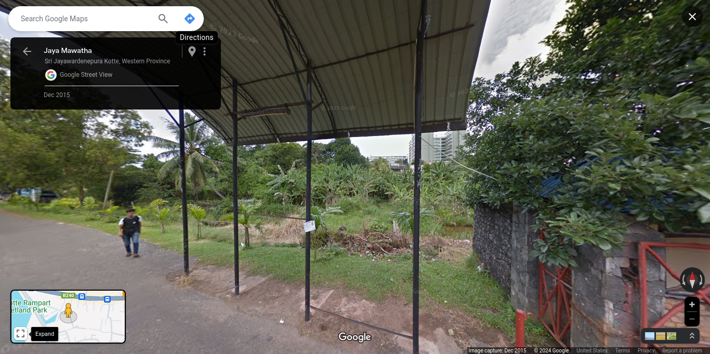

## Galaha

**Galaha** Grama Niladhari Division, **Deltota** Divisional Secretariat Division, **Kandy** District, **Central** Province

**Hewaheta** Polling Division, **Kandy** Electoral District

Population: 1,882 (2012)

(**LK-2148025**/978)

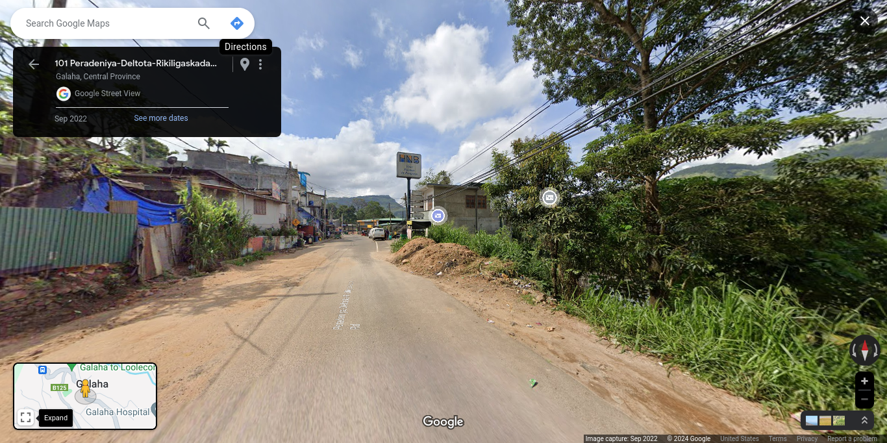

## Karuvelankandal

**Karuvelankandal** Grama Niladhari Division, **Oddusuddan** Divisional Secretariat Division, **Mullaitivu** District, **Northern** Province

**Mullaitivu** Polling Division, **Vanni** Electoral District

Population: 371 (2012)

(**LK-4412025**/MU/66)

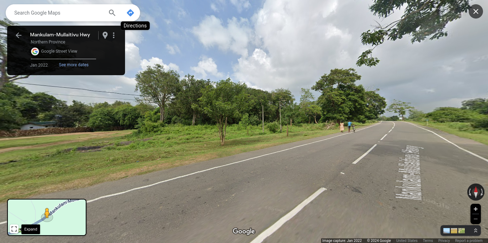

## Pamankada East

**Pamankada East** Grama Niladhari Division, **Thimbirigasyaya** Divisional Secretariat Division, **Colombo** District, **Western** Province

**Colombo East** Polling Division, **Colombo** Electoral District

Population: 12,389 (2012)

(**LK-1127100**/)

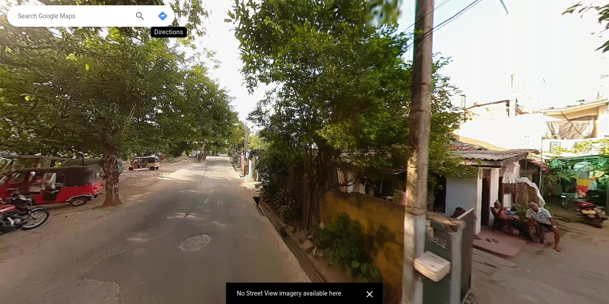

## Samavechchativu

**Samavechchativu** Grama Niladhari Division, **Kinniya** Divisional Secretariat Division, **Trincomalee** District, **Eastern** Province

**Muttur** Polling Division, **Trincomalee** Electoral District

Population: 1,650 (2012)

(**LK-5324140**/225I)

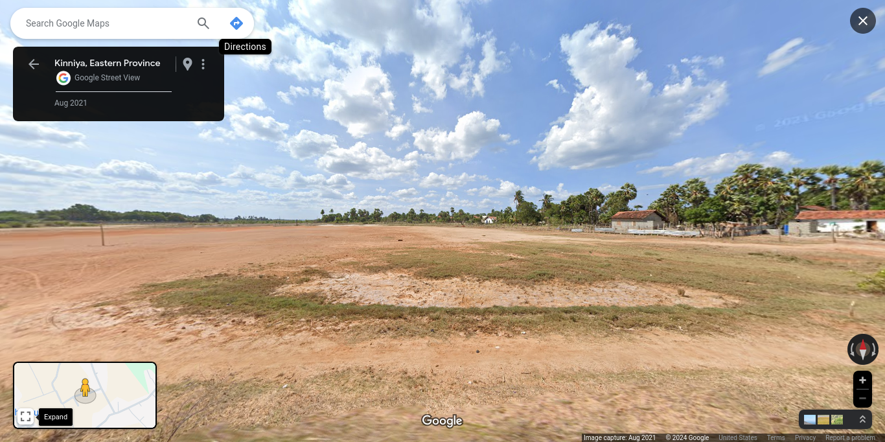

## Veeramunai 02

**Veeramunai 02** Grama Niladhari Division, **Samanthurai** Divisional Secretariat Division, **Ampara** District, **Eastern** Province

**Samanthurai** Polling Division, **Digamadulla** Electoral District

Population: 567 (2012)

(**LK-5218115**/92E)

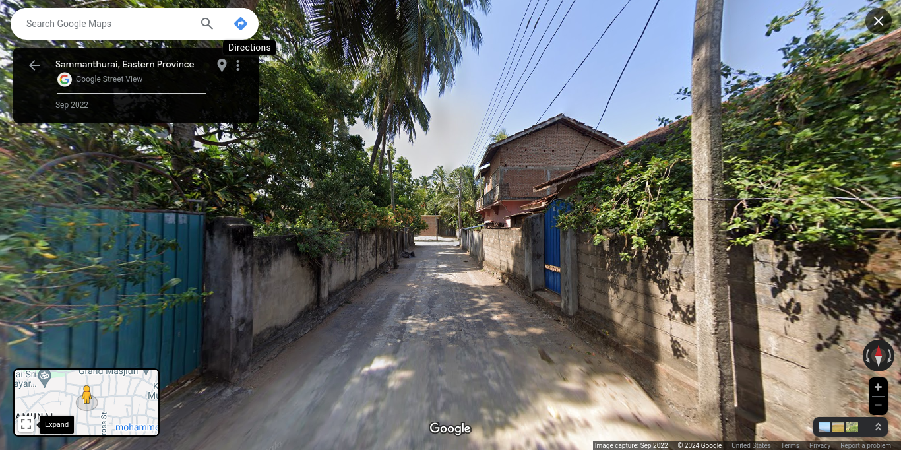

## Talaimannar

**Talaimannar** Grama Niladhari Division, **Mannar Town** Divisional Secretariat Division, **Mannar** District, **Northern** Province

**Mannar** Polling Division, **Vanni** Electoral District

Population: 754 (2012)

(**LK-4203020**/MN/52)

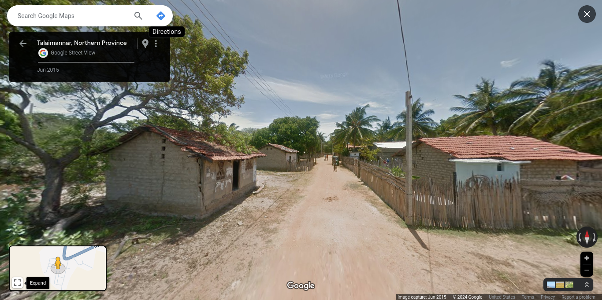

## Uduwa South

**Uduwa South** Grama Niladhari Division, **Horana** Divisional Secretariat Division, **Kalutara** District, **Western** Province

**Horana** Polling Division, **Kalutara** Electoral District

Population: 1,828 (2012)

(**LK-1309190**/614A)

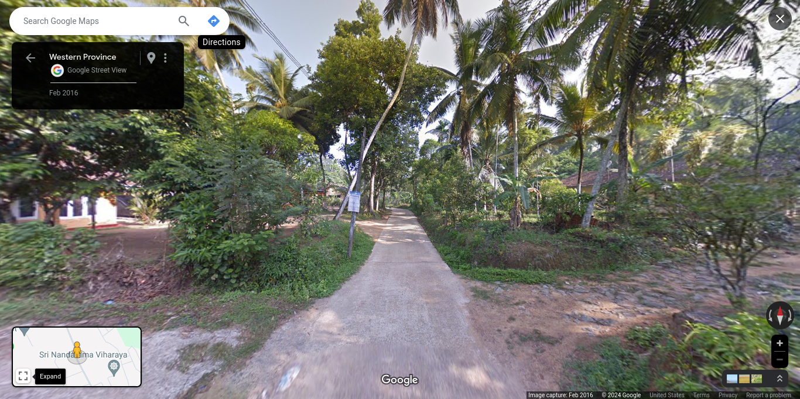

## Weediyawatta

**Weediyawatta** Grama Niladhari Division, **Gampaha** Divisional Secretariat Division, **Gampaha** District, **Western** Province

**Gampaha** Polling Division, **Gampaha** Electoral District

Population: 1,401 (2012)

(**LK-1224115**/230B)

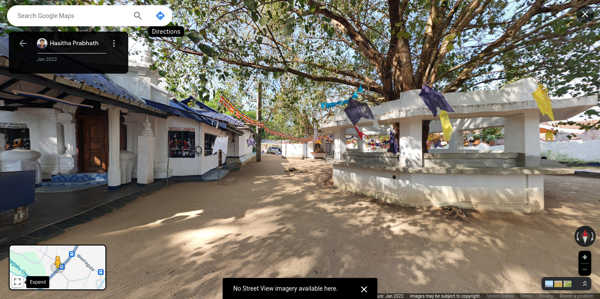

## Watapuluwa

**Watapuluwa** Grama Niladhari Division, **Kandy Four Gravets & Gangawata Korale** Divisional Secretariat Division, **Kandy** District, **Central** Province

**Senkadagala** Polling Division, **Kandy** Electoral District

Population: 1,987 (2012)

(**LK-2130035**/228)

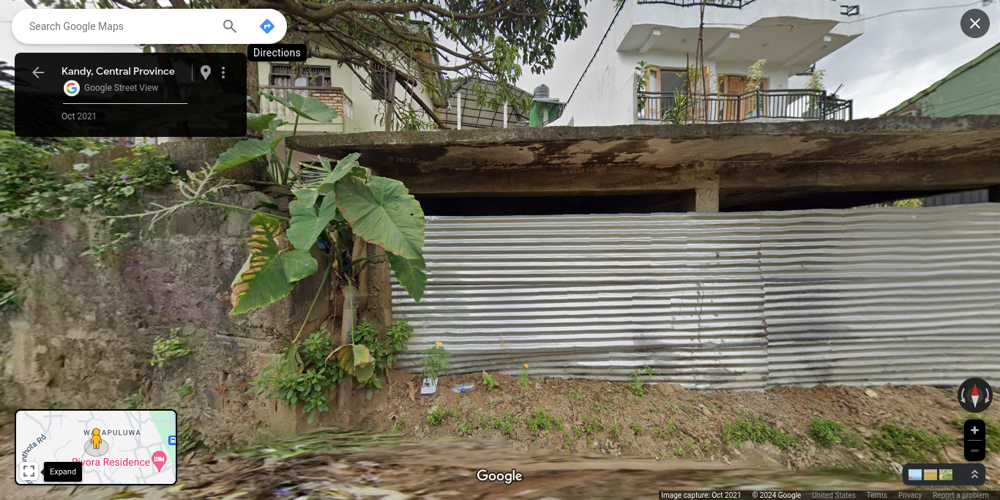

## Keselwatta

**Keselwatta** Grama Niladhari Division, **Panadura** Divisional Secretariat Division, **Kalutara** District, **Western** Province

**Panadura** Polling Division, **Kalutara** Electoral District

Population: 6,270 (2012)

(**LK-1303050**/672)

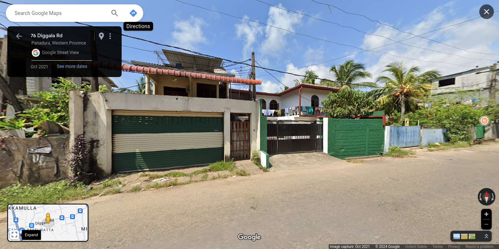

## Rattanapitiya

**Rattanapitiya** Grama Niladhari Division, **Kesbewa** Divisional Secretariat Division, **Colombo** District, **Western** Province

**Kesbewa** Polling Division, **Colombo** Electoral District

Population: 4,768 (2012)

(**LK-1136040**/533A)

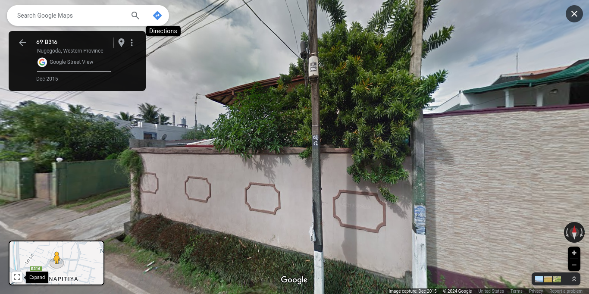

## Evariwatta

**Evariwatta** Grama Niladhari Division, **Wattala** Divisional Secretariat Division, **Gampaha** District, **Western** Province

**Wattala** Polling Division, **Gampaha** Electoral District

Population: 4,527 (2012)

(**LK-1218215**/175 A)

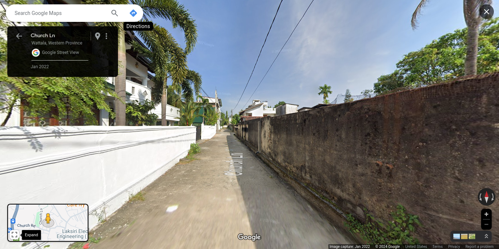

## Agra Pedesa

**Agra Pedesa** Grama Niladhari Division, **Seethawaka** Divisional Secretariat Division, **Colombo** District, **Western** Province

**Avissawella** Polling Division, **Colombo** Electoral District

Population: 2,001 (2012)

(**LK-1115060**/432G)

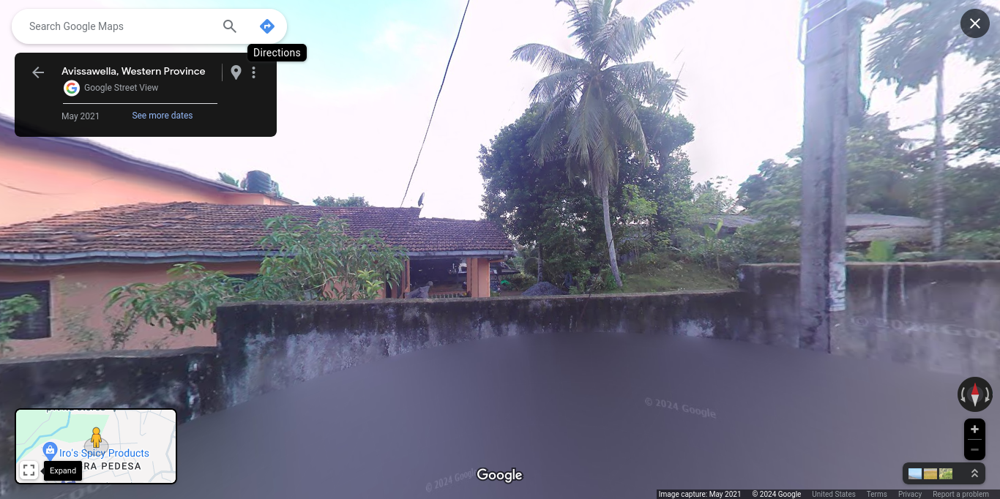

## Mahara Nugegoda South

**Mahara Nugegoda South** Grama Niladhari Division, **Mahara** Divisional Secretariat Division, **Gampaha** District, **Western** Province

**Mahara** Polling Division, **Gampaha** Electoral District

Population: 2,994 (2012)

(**LK-1233360**/247C)

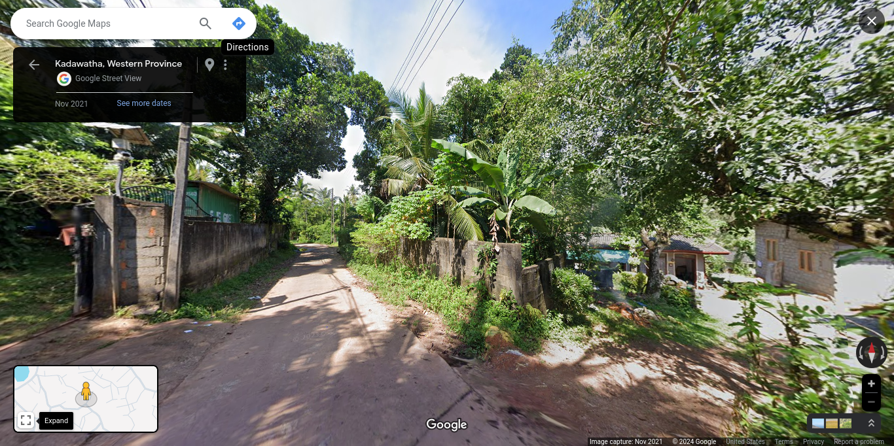

## Ambala West

**Ambala West** Grama Niladhari Division, **Beliatta** Divisional Secretariat Division, **Hambantota** District, **Southern** Province

**Beliatta** Polling Division, **Hambantota** Electoral District

Population: 653 (2012)

(**LK-3330280**/370)

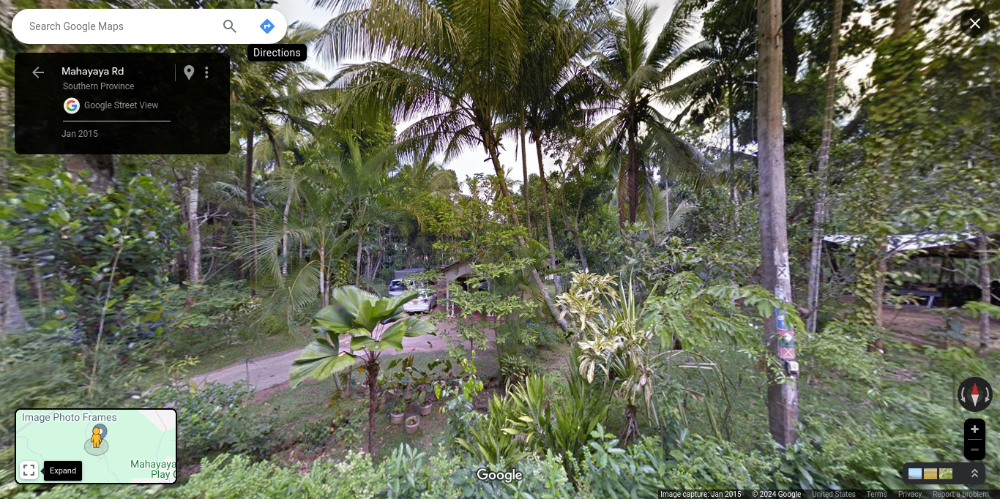

## Meegas Ara

**Meegas Ara** Grama Niladhari Division, **Weeraketiya** Divisional Secretariat Division, **Hambantota** District, **Southern** Province

**Mulkirigala** Polling Division, **Hambantota** Electoral District

Population: 1,121 (2012)

(**LK-3321090**/441)

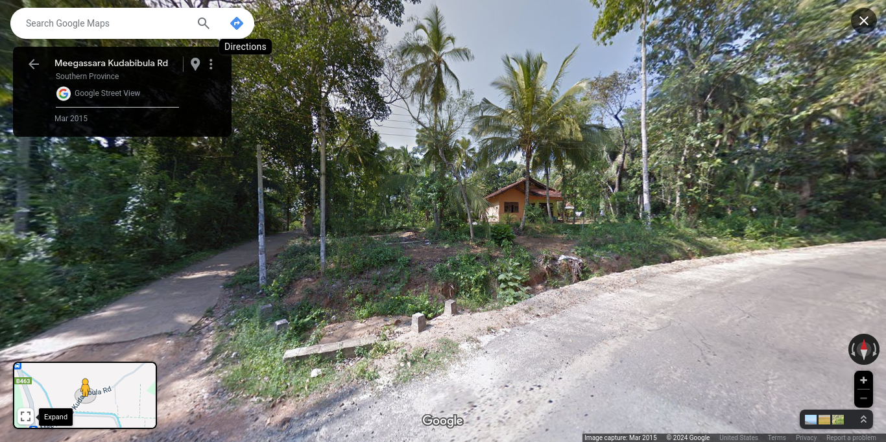

## Panichalady

**Panichalady** Grama Niladhari Division, **Manmunai North** Divisional Secretariat Division, **Batticaloa** District, **Eastern** Province

**Batticaloa** Polling Division, **Batticaloa** Electoral District

Population: 1,312 (2012)

(**LK-5118035**/176D)

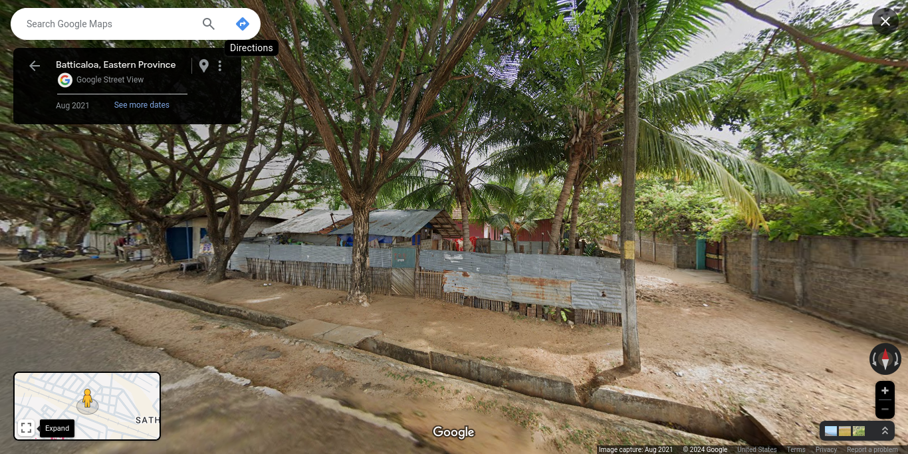

## Varani North

**Varani North** Grama Niladhari Division, **Thenmaradchi (Chavakachcheri)** Divisional Secretariat Division, **Jaffna** District, **Northern** Province

**Chavakachcheri** Polling Division, **Jaffna** Electoral District

Population: 1,017 (2012)

(**LK-4130260**/J/339)

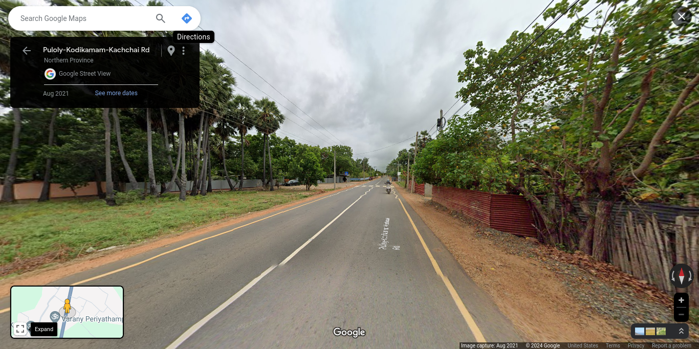

## Pahala Udugampola West

**Pahala Udugampola West** Grama Niladhari Division, **Minuwangoda** Divisional Secretariat Division, **Gampaha** District, **Western** Province

**Minuwangoda** Polling Division, **Gampaha** Electoral District

Population: 1,466 (2012)

(**LK-1215410**/131/3)

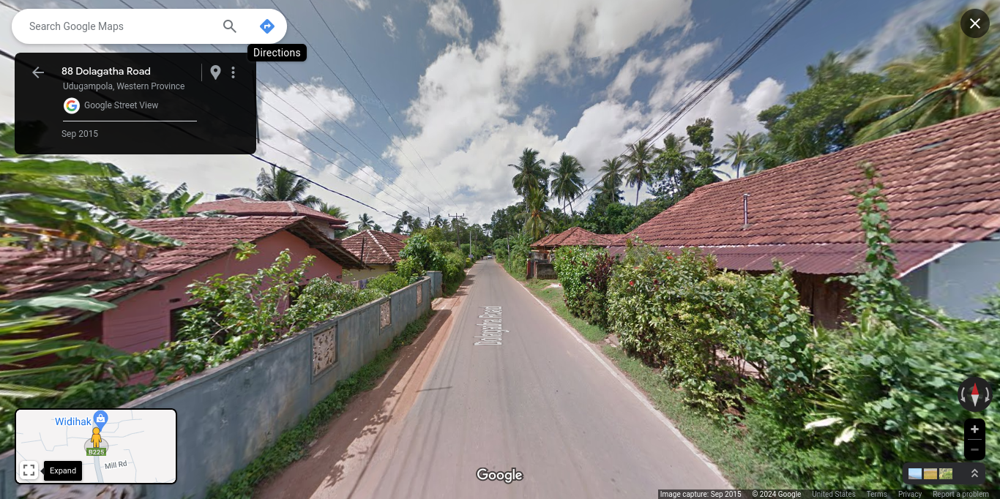

## Medaketiya

**Medaketiya** Grama Niladhari Division, **Tangalle** Divisional Secretariat Division, **Hambantota** District, **Southern** Province

**Tangalle** Polling Division, **Hambantota** Electoral District

Population: 1,562 (2012)

(**LK-3333225**/268)

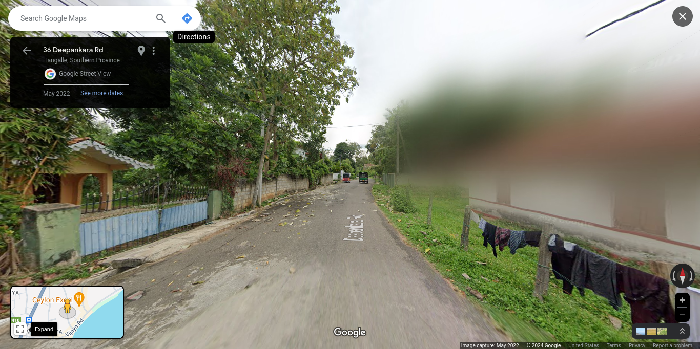

## Rikillagaskada

**Rikillagaskada** Grama Niladhari Division, **Hanguranketha** Divisional Secretariat Division, **Nuwara Eliya** District, **Central** Province

**Hanguranketha** Polling Division, **Nuwara-Eliya** Electoral District

Population: 1,995 (2012)

(**LK-2306320**/492A)

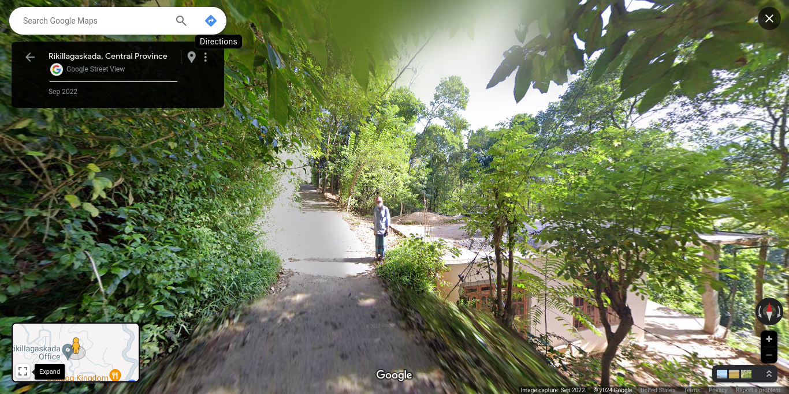

## Nugegoda West

**Nugegoda West** Grama Niladhari Division, **Sri Jayawardanapura Kotte** Divisional Secretariat Division, **Colombo** District, **Western** Province

**Kotte** Polling Division, **Colombo** Electoral District

Population: 5,627 (2012)

(**LK-1124070**/519B)

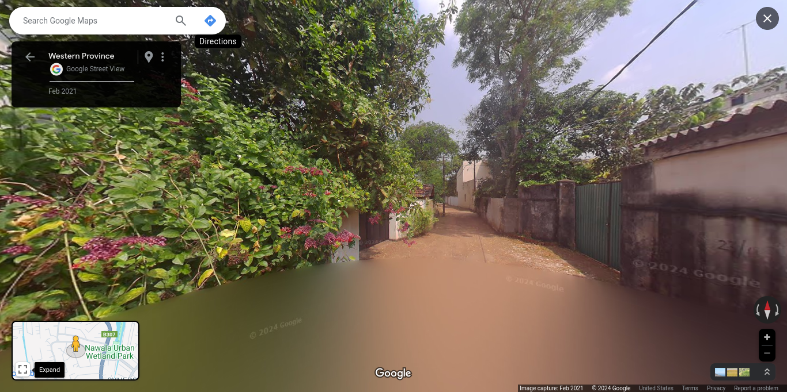

## Sammanthurai 07

**Sammanthurai 07** Grama Niladhari Division, **Samanthurai** Divisional Secretariat Division, **Ampara** District, **Eastern** Province

**Samanthurai** Polling Division, **Digamadulla** Electoral District

Population: 957 (2012)

(**LK-5218080**/80A)

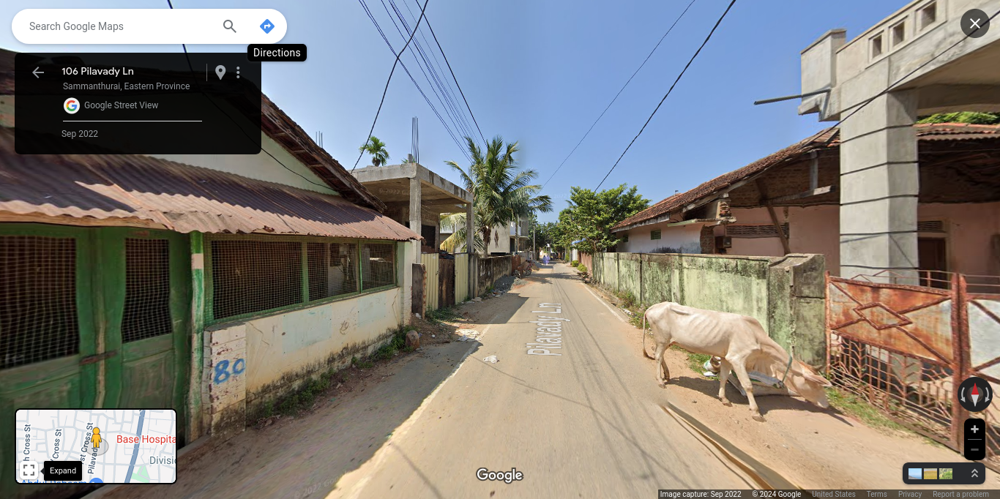

## Kalutara South

**Kalutara South** Grama Niladhari Division, **Kalutara** Divisional Secretariat Division, **Kalutara** District, **Western** Province

**Kalutara** Polling Division, **Kalutara** Electoral District

Population: 1,721 (2012)

(**LK-1321280**/725)

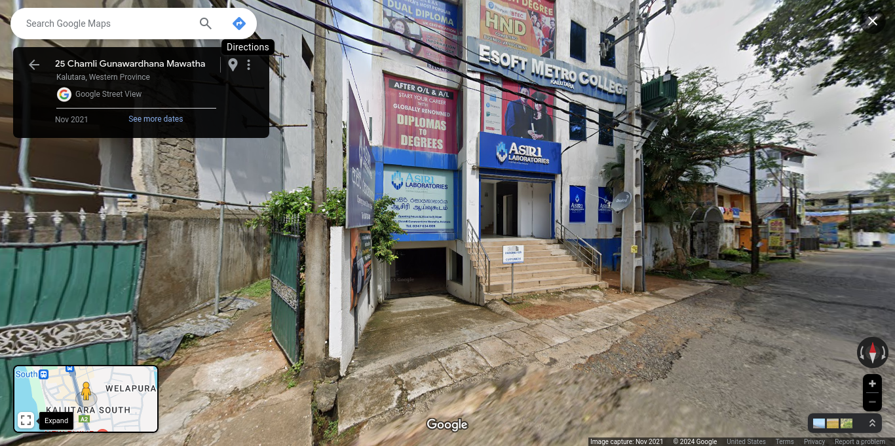

## Raniswala

**Raniswala** Grama Niladhari Division, **Attanagalla** Divisional Secretariat Division, **Gampaha** District, **Western** Province

**Attanagalla** Polling Division, **Gampaha** Electoral District

Population: 836 (2012)

(**LK-1227310**/323)

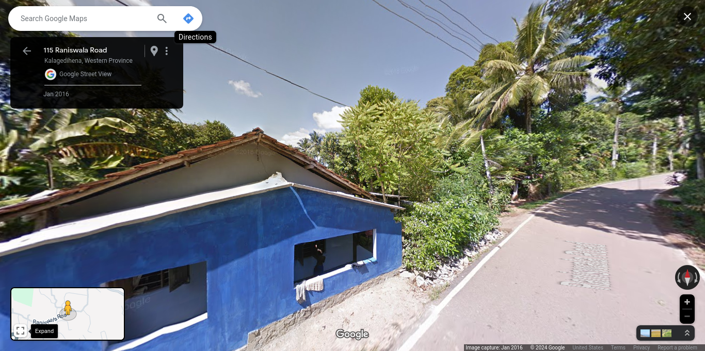

## Uda Bowala

**Uda Bowala** Grama Niladhari Division, **Kandy Four Gravets & Gangawata Korale** Divisional Secretariat Division, **Kandy** District, **Central** Province

**Senkadagala** Polling Division, **Kandy** Electoral District

Population: 4,127 (2012)

(**LK-2130200**/244)

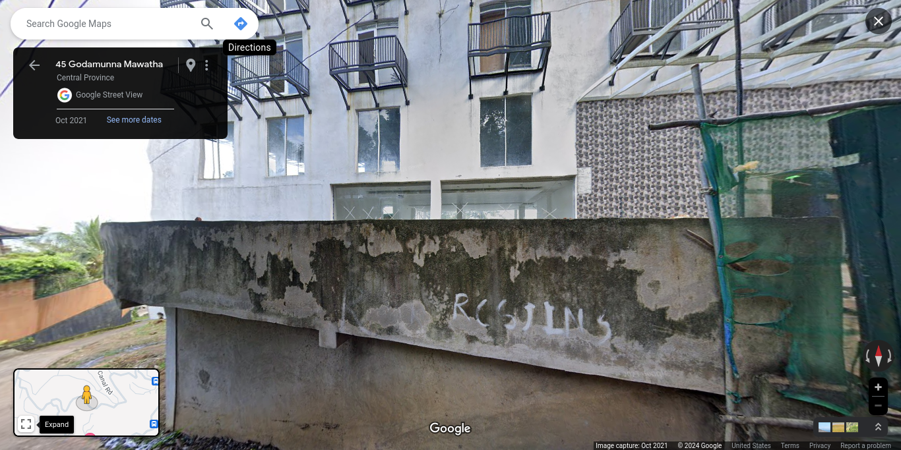

## Maradankulama

**Maradankulama** Grama Niladhari Division, **Chilaw** Divisional Secretariat Division, **Puttalam** District, **North Western** Province

**Chilaw** Polling Division, **Puttalam** Electoral District

Population: 700 (2012)

(**LK-6233230**/558)

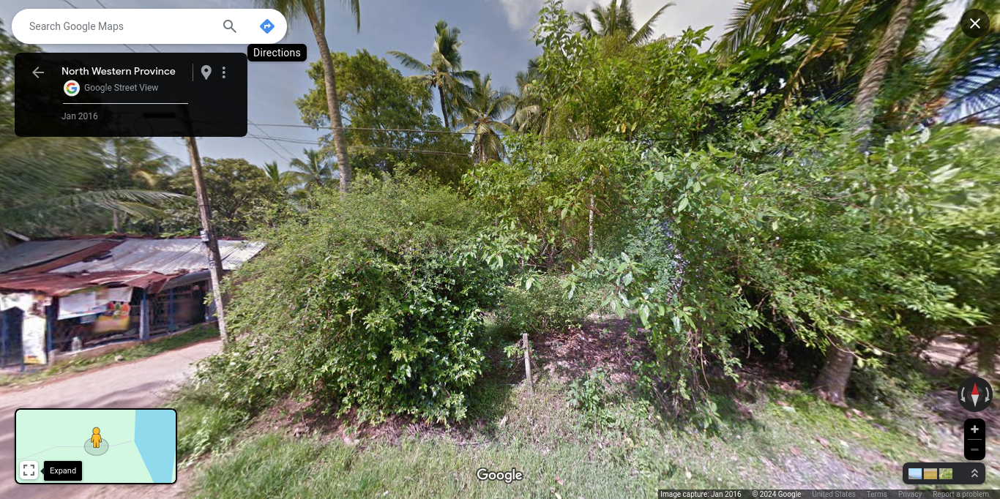

## Jinnanagar

**Jinnanagar** Grama Niladhari Division, **Trincomalee Town and Gravets** Divisional Secretariat Division, **Trincomalee** District, **Eastern** Province

**Trincomalee** Polling Division, **Trincomalee** Electoral District

Population: 2,855 (2012)

(**LK-5315100**/244O)

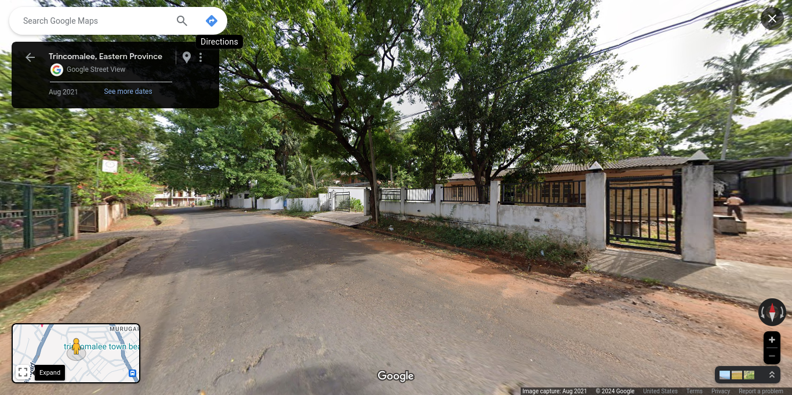

## Etambagahawatta

**Etambagahawatta** Grama Niladhari Division, **Dompe** Divisional Secretariat Division, **Gampaha** District, **Western** Province

**Dompe** Polling Division, **Gampaha** Electoral District

Population: 797 (2012)

(**LK-1230085**/389C)

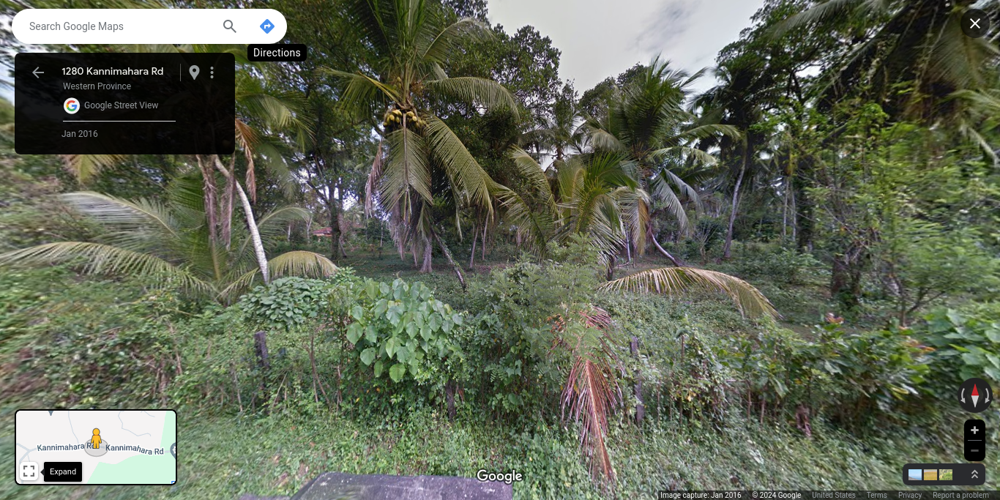

## Nayakakanda South

**Nayakakanda South** Grama Niladhari Division, **Wattala** Divisional Secretariat Division, **Gampaha** District, **Western** Province

**Wattala** Polling Division, **Gampaha** Electoral District

Population: 2,624 (2012)

(**LK-1218195**/172C)

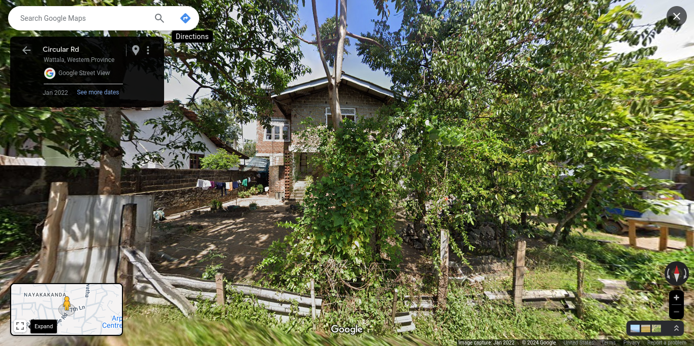

## Maligapurana

**Maligapurana** Grama Niladhari Division, **Ganga Ihala Korale** Divisional Secretariat Division, **Kandy** District, **Central** Province

**Nawalapitiya** Polling Division, **Kandy** Electoral District

Population: 1,972 (2012)

(**LK-2154030**/1078)

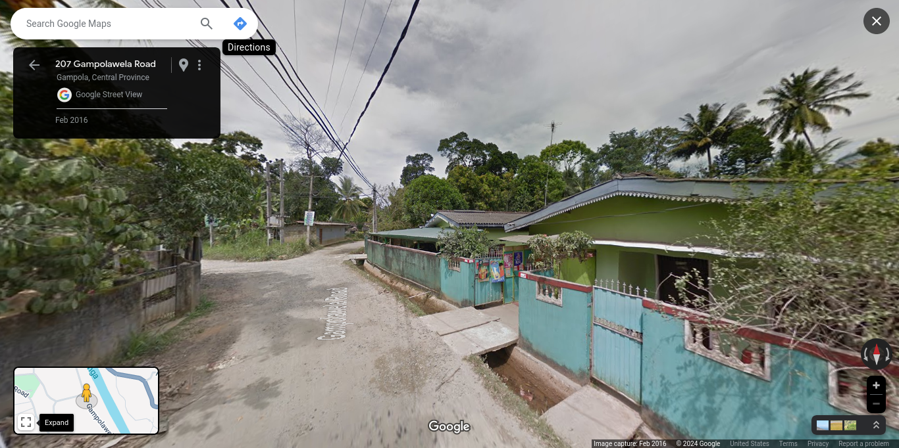

## Rathmetiya

**Rathmetiya** Grama Niladhari Division, **Hanguranketha** Divisional Secretariat Division, **Nuwara Eliya** District, **Central** Province

**Hanguranketha** Polling Division, **Nuwara-Eliya** Electoral District

Population: 711 (2012)

(**LK-2306235**/494C)

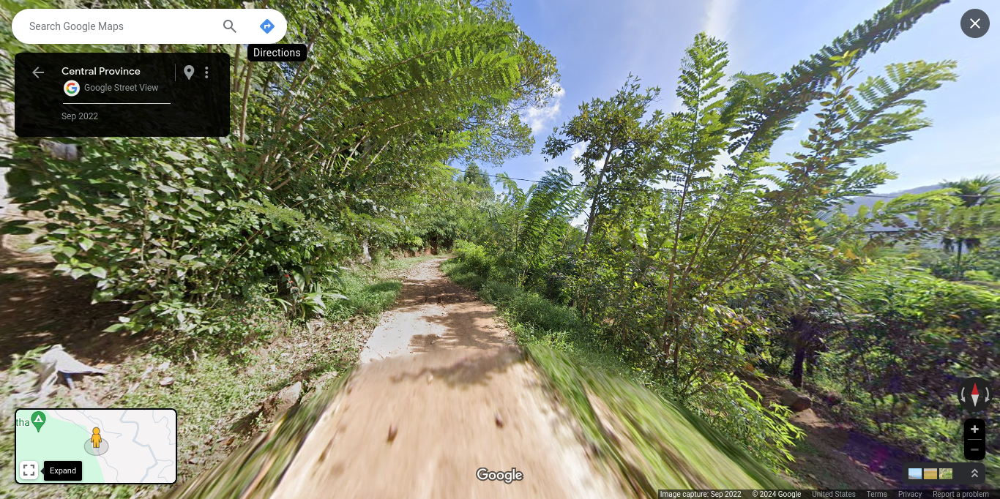

## Bogambara

**Bogambara** Grama Niladhari Division, **Kandy Four Gravets & Gangawata Korale** Divisional Secretariat Division, **Kandy** District, **Central** Province

**Senkadagala** Polling Division, **Kandy** Electoral District

Population: 3,195 (2012)

(**LK-2130145**/264)

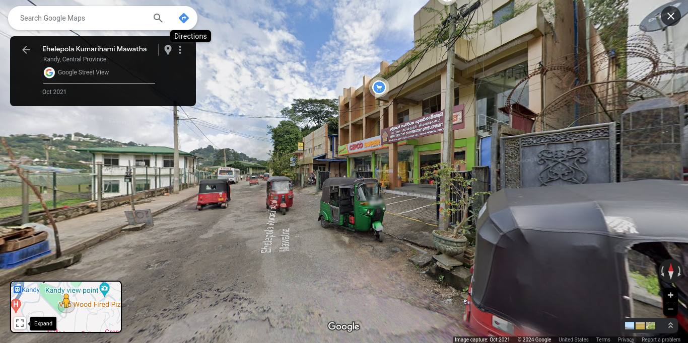

## Galgamuwa North

**Galgamuwa North** Grama Niladhari Division, **Alawwa** Divisional Secretariat Division, **Kurunegala** District, **North Western** Province

**Dambadeniya** Polling Division, **Kurunegala** Electoral District

Population: 940 (2012)

(**LK-6184075**/990)

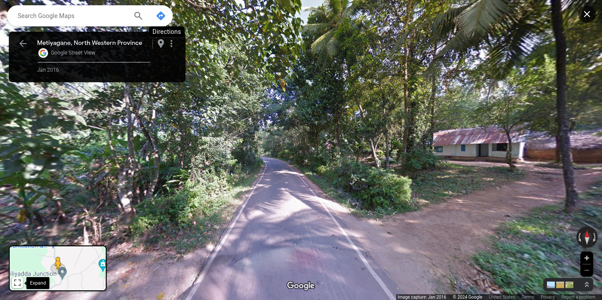

## Kekulandala North

**Kekulandala North** Grama Niladhari Division, **Agalawatta** Divisional Secretariat Division, **Kalutara** District, **Western** Province

**Agalawatta** Polling Division, **Kalutara** Electoral District

Population: 1,422 (2012)

(**LK-1333070**/829A)

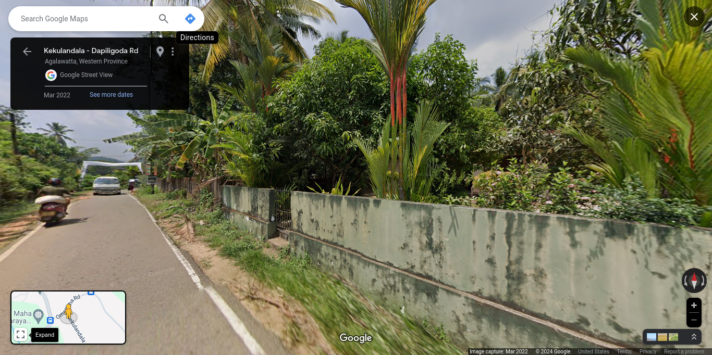

## Eldeniya West

**Eldeniya West** Grama Niladhari Division, **Mahara** Divisional Secretariat Division, **Gampaha** District, **Western** Province

**Mahara** Polling Division, **Gampaha** Electoral District

Population: 2,754 (2012)

(**LK-1233335**/286B)

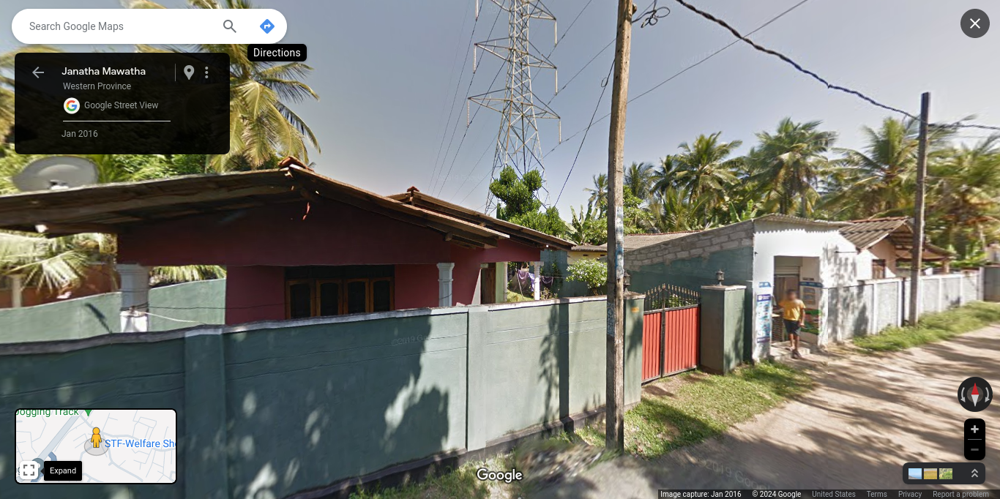

## Rukmale East A

**Rukmale East A** Grama Niladhari Division, **Maharagama** Divisional Secretariat Division, **Colombo** District, **Western** Province

**Maharagama** Polling Division, **Colombo** Electoral District

Population: 1,259 (2012)

(**LK-1121045**/497A)

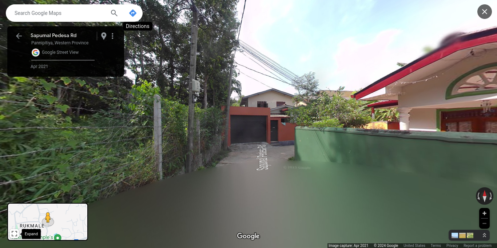

## Nathuduwa West

**Nathuduwa West** Grama Niladhari Division, **Mahara** Divisional Secretariat Division, **Gampaha** District, **Western** Province

**Mahara** Polling Division, **Gampaha** Electoral District

Population: 1,745 (2012)

(**LK-1233455**/253A)

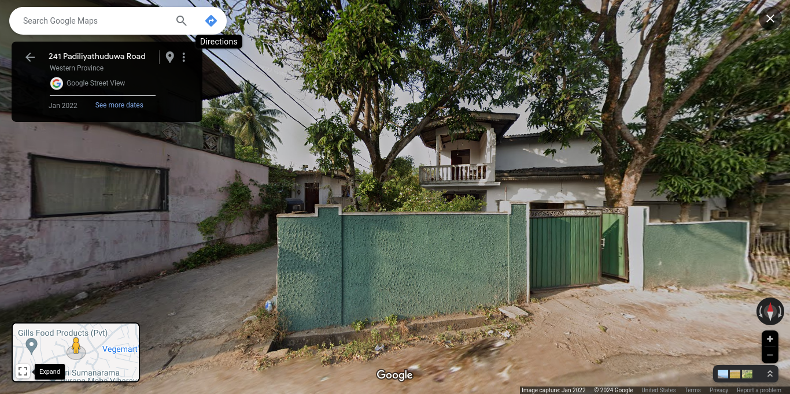

## Medagama iii

**Medagama iii** Grama Niladhari Division, **Gampaha** Divisional Secretariat Division, **Gampaha** District, **Western** Province

**Gampaha** Polling Division, **Gampaha** Electoral District

Population: 1,178 (2012)

(**LK-1224145**/223B)

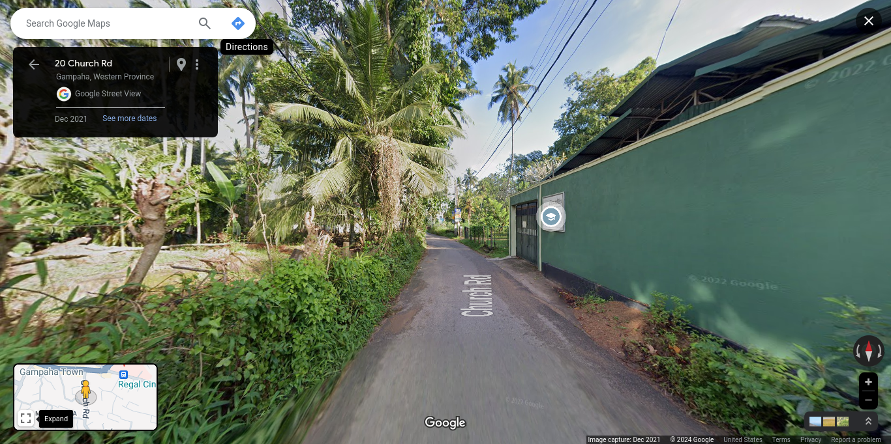

## Thibbatugoda

**Thibbatugoda** Grama Niladhari Division, **Walapane** Divisional Secretariat Division, **Nuwara Eliya** District, **Central** Province

**Walapane** Polling Division, **Nuwara-Eliya** Electoral District

Population: 302 (2012)

(**LK-2309250**/517)

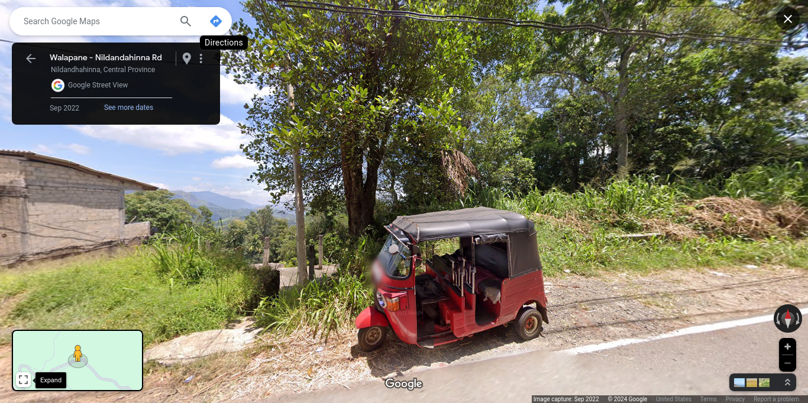

## Sandalankawa

**Sandalankawa** Grama Niladhari Division, **Pannala** Divisional Secretariat Division, **Kurunegala** District, **North Western** Province

**Katugampola** Polling Division, **Kurunegala** Electoral District

Population: 1,956 (2012)

(**LK-6178335**/1604)

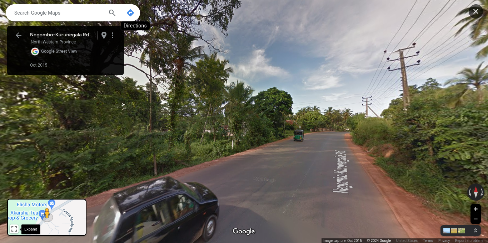

## Hingula

**Hingula** Grama Niladhari Division, **Mawanella** Divisional Secretariat Division, **Kegalle** District, **Sabaragamuwa** Province

**Mawanella** Polling Division, **Kegalle** Electoral District

Population: 2,521 (2012)

(**LK-9206115**/29)

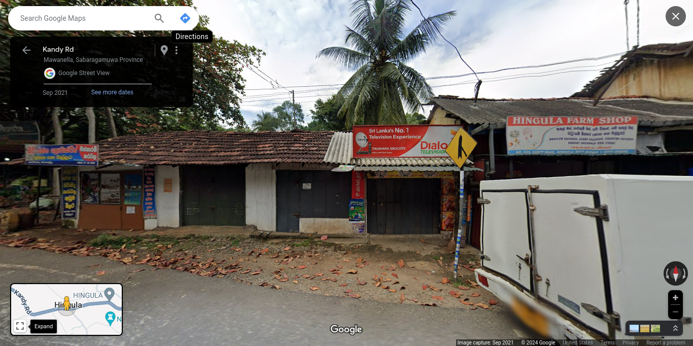

## Maha Kiribbewa

**Maha Kiribbewa** Grama Niladhari Division, **Kahatagasdigiliya** Divisional Secretariat Division, **Anuradhapura** District, **North Central** Province

**Horowpothana** Polling Division, **Anuradhapura** Electoral District

Population: 1,081 (2012)

(**LK-7121040**/233)

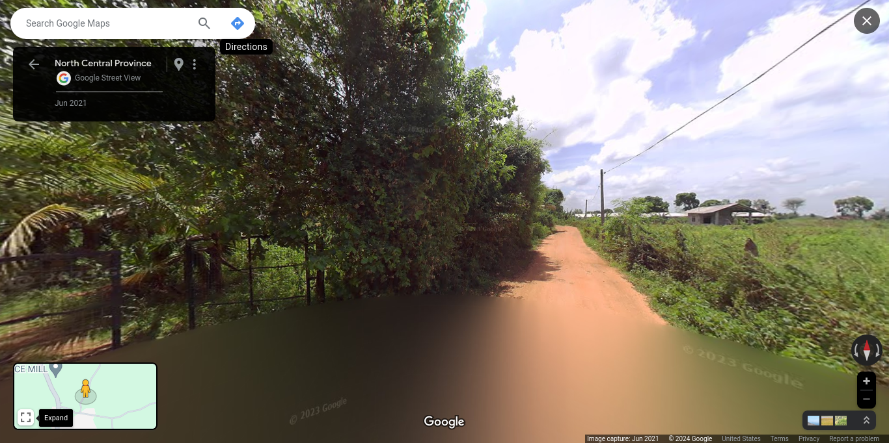

## Kithulhena

**Kithulhena** Grama Niladhari Division, **Homagama** Divisional Secretariat Division, **Colombo** District, **Western** Province

**Homagama** Polling Division, **Colombo** Electoral District

Population: 1,581 (2012)

(**LK-1112215**/591C)

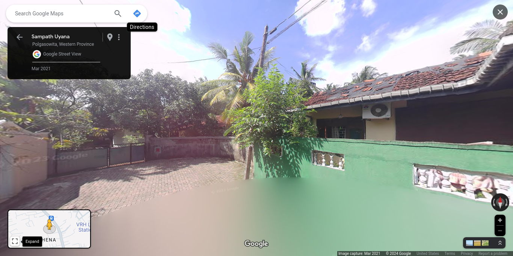

## Devinuwara East

**Devinuwara East** Grama Niladhari Division, **Devinuwara** Divisional Secretariat Division, **Matara** District, **Southern** Province

**Devinuwara** Polling Division, **Matara** Electoral District

Population: 1,025 (2012)

(**LK-3245175**/433B)

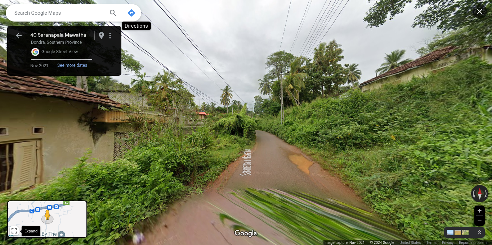

## Nagasena

**Nagasena** Grama Niladhari Division, **Nuwara Eliya** Divisional Secretariat Division, **Nuwara Eliya** District, **Central** Province

**Nuwara Eliya Maskeliya** Polling Division, **Nuwara-Eliya** Electoral District

Population: 5,022 (2012)

(**LK-2312255**/475H)

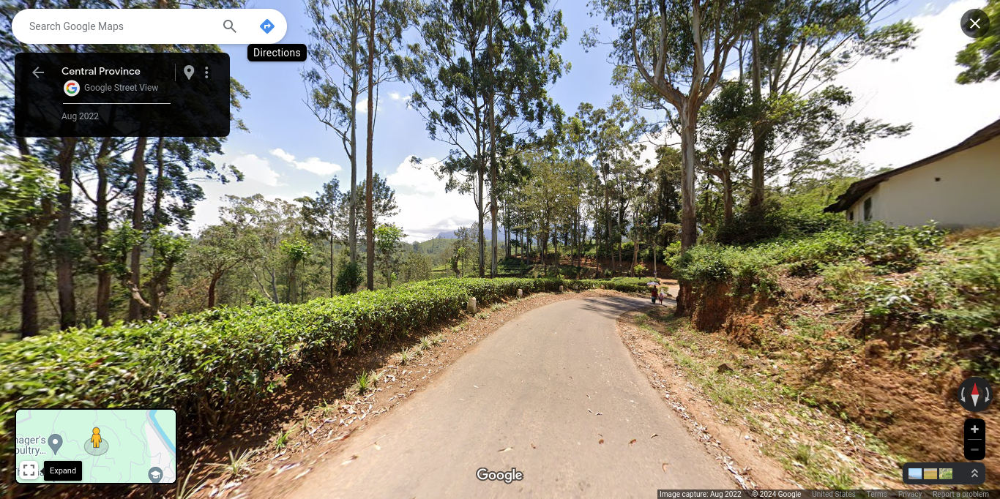

## Idamegama

**Idamegama** Grama Niladhari Division, **Uva Paranagama** Divisional Secretariat Division, **Badulla** District, **Uva** Province

**Uva Paranagama** Polling Division, **Badulla** Electoral District

Population: 809 (2012)

(**LK-8127150**/43C)

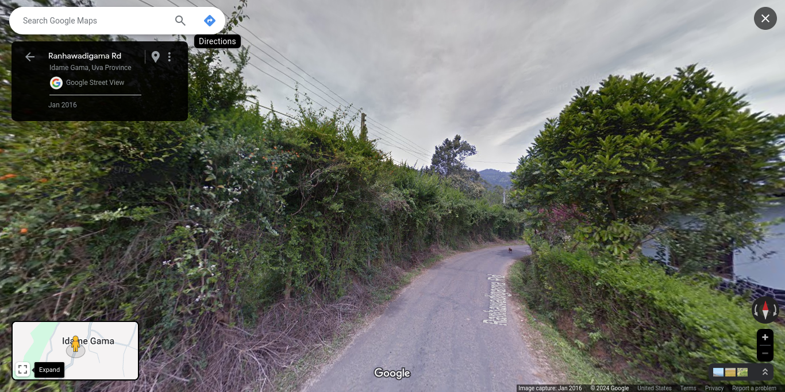

## Medaketiya

**Medaketiya** Grama Niladhari Division, **Tangalle** Divisional Secretariat Division, **Hambantota** District, **Southern** Province

**Tangalle** Polling Division, **Hambantota** Electoral District

Population: 1,562 (2012)

(**LK-3333225**/268)

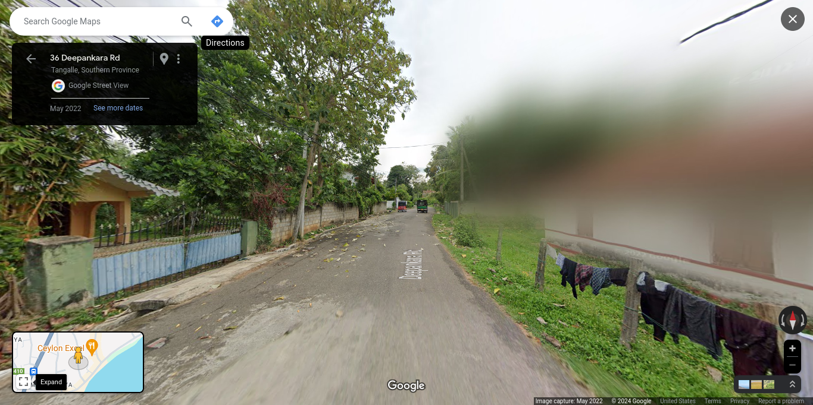

## Kuda Nelumkulama

**Kuda Nelumkulama** Grama Niladhari Division, **Nuwaragam Palatha East** Divisional Secretariat Division, **Anuradhapura** District, **North Central** Province

**Anuradhapura East** Polling Division, **Anuradhapura** Electoral District

Population: 1,639 (2012)

(**LK-7133030**/277)

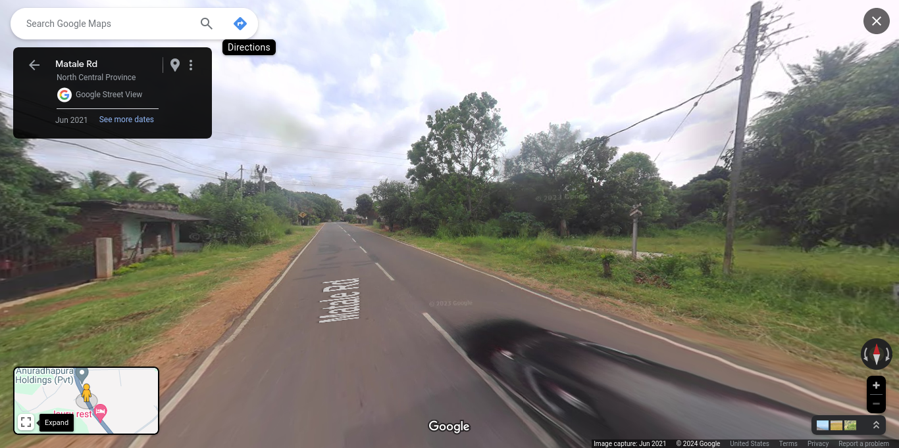

## Kirimetiyana North

**Kirimetiyana North** Grama Niladhari Division, **Dankotuwa** Divisional Secretariat Division, **Puttalam** District, **North Western** Province

**Wennappuwa** Polling Division, **Puttalam** Electoral District

Population: 1,505 (2012)

(**LK-6248050**/466D)

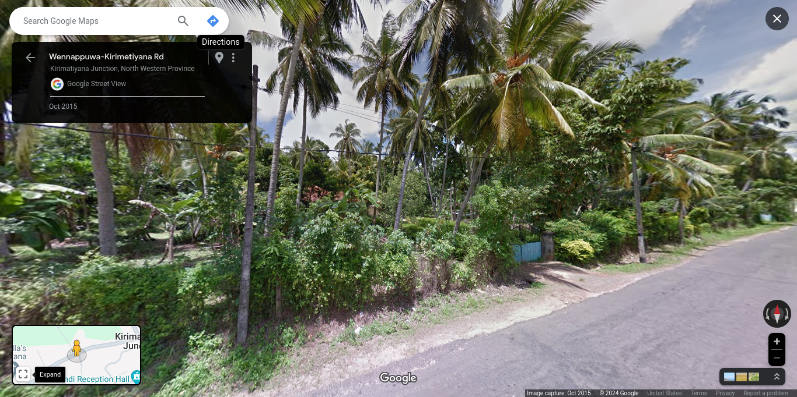

## Bulanawewa

**Bulanawewa** Grama Niladhari Division, **Galewela** Divisional Secretariat Division, **Matale** District, **Central** Province

**Dambulla** Polling Division, **Matale** Electoral District

Population: 2,575 (2012)

(**LK-2203045**/E437A)

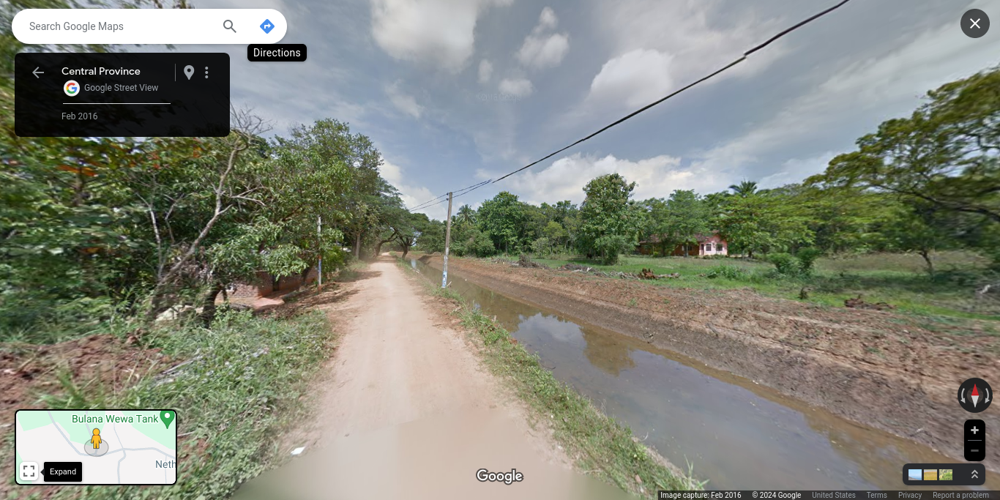

## Thalagala South

**Thalagala South** Grama Niladhari Division, **Horana** Divisional Secretariat Division, **Kalutara** District, **Western** Province

**Horana** Polling Division, **Kalutara** Electoral District

Population: 2,861 (2012)

(**LK-1309090**/613A)

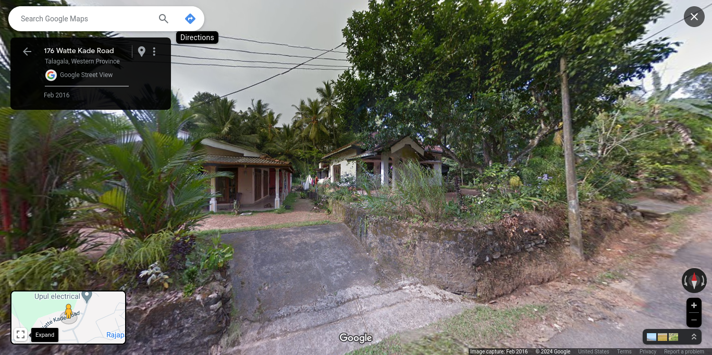

## Egodawatta

**Egodawatta** Grama Niladhari Division, **Kesbewa** Divisional Secretariat Division, **Colombo** District, **Western** Province

**Kesbewa** Polling Division, **Colombo** Electoral District

Population: 3,310 (2012)

(**LK-1136045**/533C)

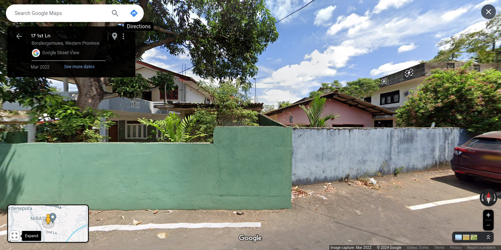

## Akkara 50

**Akkara 50** Grama Niladhari Division, **Katana** Divisional Secretariat Division, **Gampaha** District, **Western** Province

**Katana** Polling Division, **Gampaha** Electoral District

Population: 6,995 (2012)

(**LK-1206145**/93D)

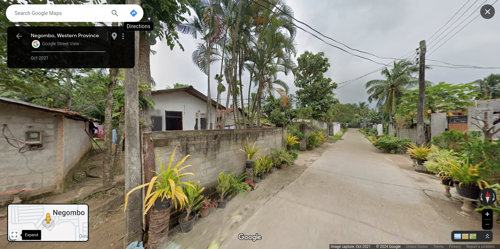

## Maragahadeniya

**Maragahadeniya** Grama Niladhari Division, **Palindanuwara** Divisional Secretariat Division, **Kalutara** District, **Western** Province

**Agalawatta** Polling Division, **Kalutara** Electoral District

Population: 2,315 (2012)

(**LK-1336075**/835C)

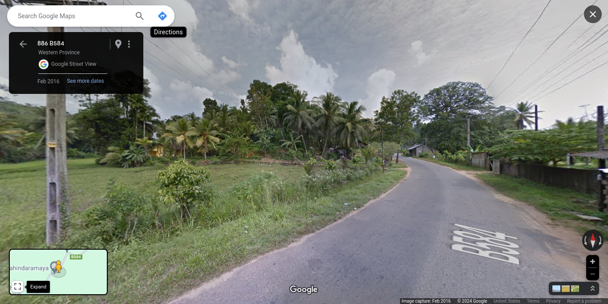

## Kongala East

**Kongala East** Grama Niladhari Division, **Hakmana** Divisional Secretariat Division, **Matara** District, **Southern** Province

**Hakmana** Polling Division, **Matara** Electoral District

Population: 639 (2012)

(**LK-3230150**/295)

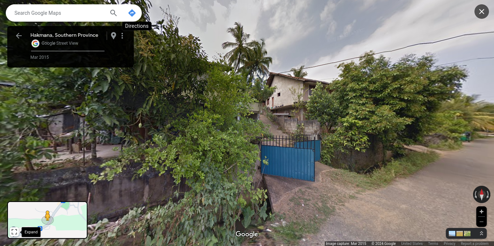

## Hennathota

**Hennathota** Grama Niladhari Division, **Hikkaduwa** Divisional Secretariat Division, **Galle** District, **Southern** Province

**Ratgama** Polling Division, **Galle** Electoral District

Population: 1,182 (2012)

(**LK-3136295**/53B)

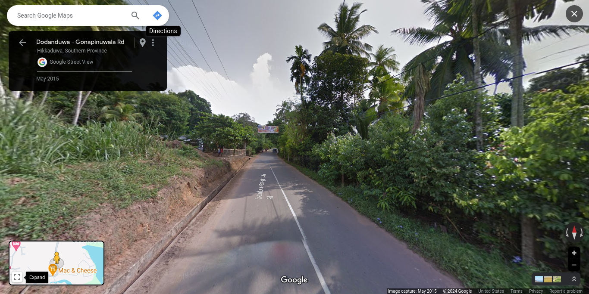

## Pallegama

**Pallegama** Grama Niladhari Division, **Pasbage Korale** Divisional Secretariat Division, **Kandy** District, **Central** Province

**Nawalapitiya** Polling Division, **Kandy** Electoral District

Population: 1,684 (2012)

(**LK-2157005**/1104)

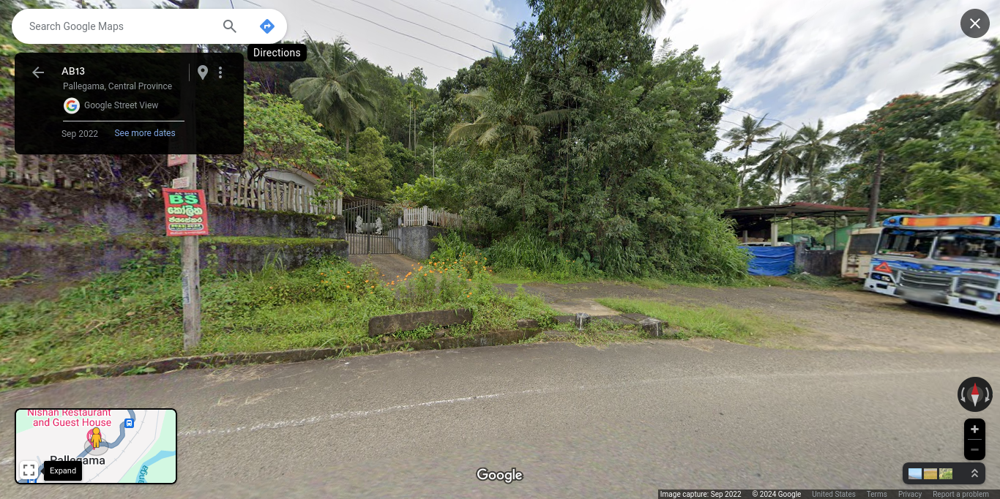

## Ihalagoda East

**Ihalagoda East** Grama Niladhari Division, **Akmeemana** Divisional Secretariat Division, **Galle** District, **Southern** Province

**Akmeemana** Polling Division, **Galle** Electoral District

Population: 3,560 (2012)

(**LK-3145020**/109A)

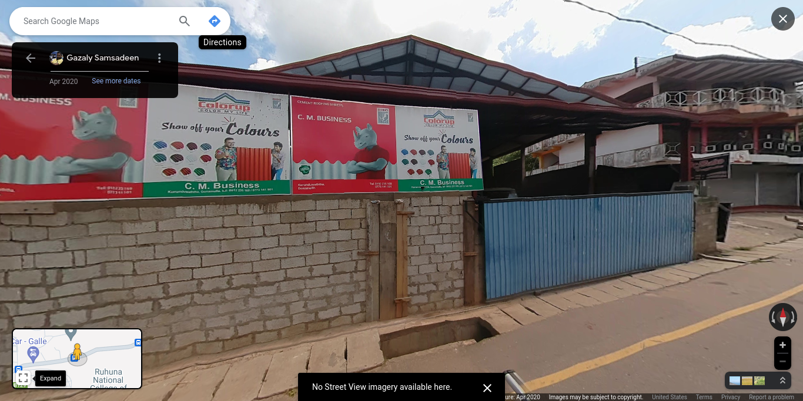

## Madakumbura

**Madakumbura** Grama Niladhari Division, **Rattota** Divisional Secretariat Division, **Matale** District, **Central** Province

**Rattota** Polling Division, **Matale** Electoral District

Population: 795 (2012)

(**LK-2230075**/E375F)

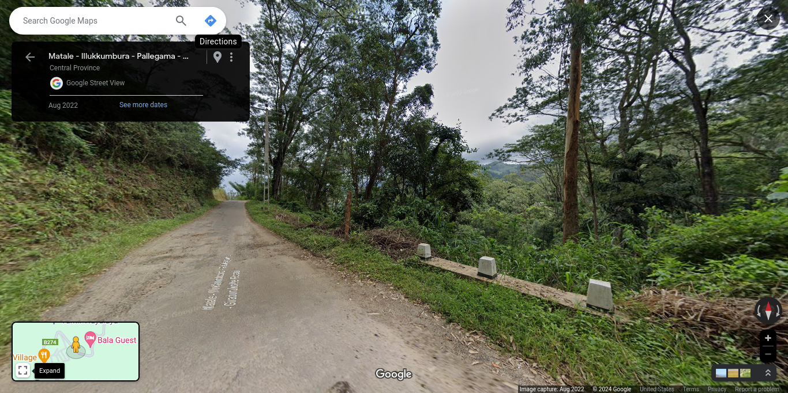

## Thiruketheeswaram

**Thiruketheeswaram** Grama Niladhari Division, **Mannar Town** Divisional Secretariat Division, **Mannar** District, **Northern** Province

**Mannar** Polling Division, **Vanni** Electoral District

Population: 442 (2012)

(**LK-4203200**/MN/86)

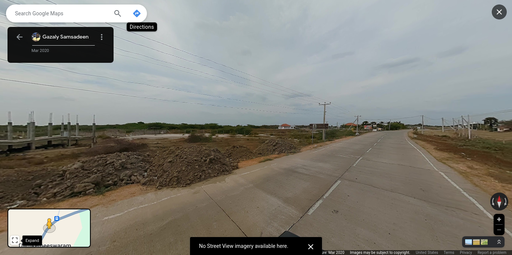

## Ketagewatta

**Ketagewatta** Grama Niladhari Division, **Ja-Ela** Divisional Secretariat Division, **Gampaha** District, **Western** Province

**Ja Ela** Polling Division, **Gampaha** Electoral District

Population: 3,975 (2012)

(**LK-1221275**/181F)

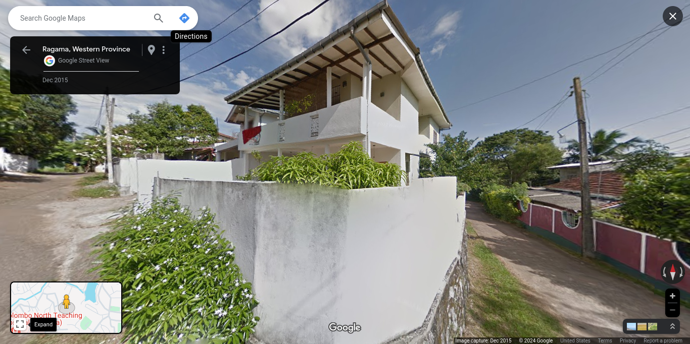

## Bandaragama East

**Bandaragama East** Grama Niladhari Division, **Bandaragama** Divisional Secretariat Division, **Kalutara** District, **Western** Province

**Bandaragama** Polling Division, **Kalutara** Electoral District

Population: 1,609 (2012)

(**LK-1306190**/663A)

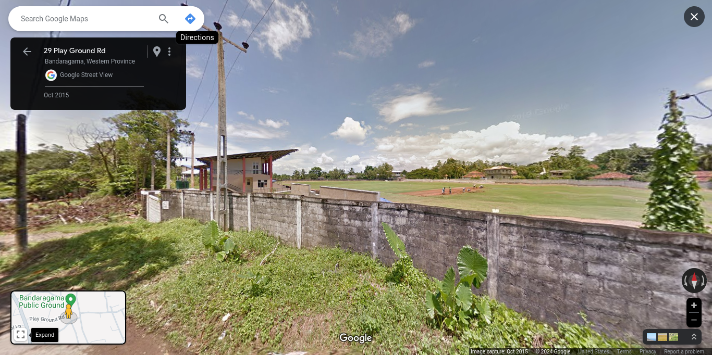

## Dimuthugama

**Dimuthugama** Grama Niladhari Division, **Welimada** Divisional Secretariat Division, **Badulla** District, **Uva** Province

**Welimada** Polling Division, **Badulla** Electoral District

Population: 2,078 (2012)

(**LK-8130070**/50H)

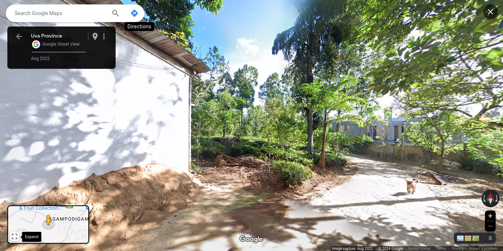

## Rawathawatta South

**Rawathawatta South** Grama Niladhari Division, **Moratuwa** Divisional Secretariat Division, **Colombo** District, **Western** Province

**Moratuwa** Polling Division, **Colombo** Electoral District

Population: 2,144 (2012)

(**LK-1133070**/557B)

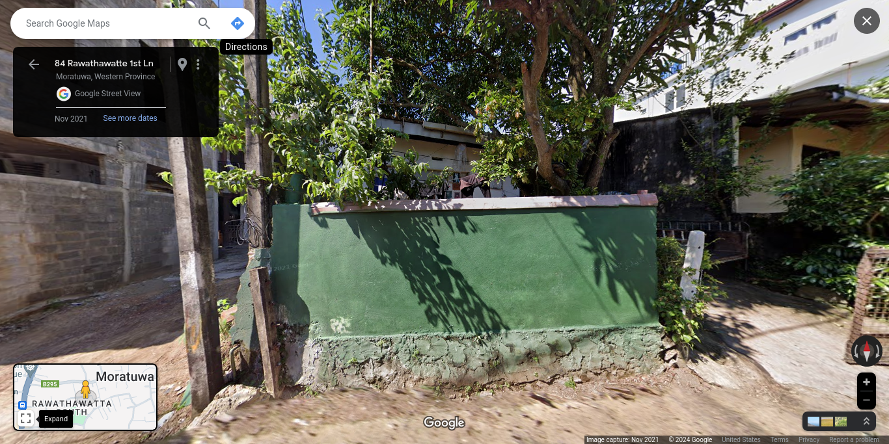

## Madiha East

**Madiha East** Grama Niladhari Division, **Matara Four Gravets** Divisional Secretariat Division, **Matara** District, **Southern** Province

**Matara** Polling Division, **Matara** Electoral District

Population: 965 (2012)

(**LK-3242250**/411B)

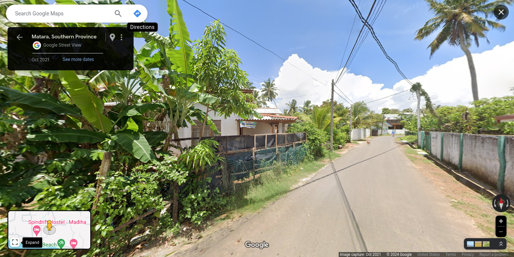

## Polgahaanga

**Polgahaanga** Grama Niladhari Division, **Udunuwara** Divisional Secretariat Division, **Kandy** District, **Central** Province

**Udunuwara** Polling Division, **Kandy** Electoral District

Population: 961 (2012)

(**LK-2139560**/44)

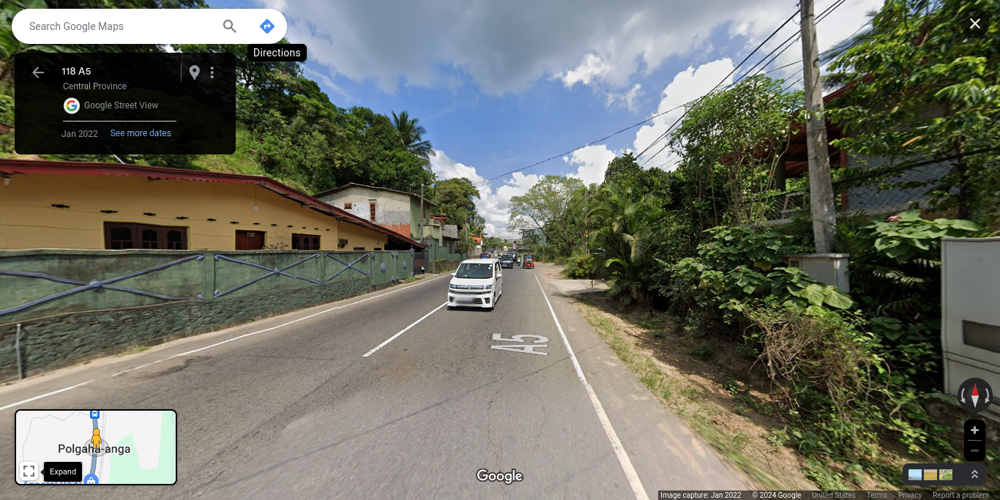

## Embawa

**Embawa** Grama Niladhari Division, **Kuliyapitiya West** Divisional Secretariat Division, **Kurunegala** District, **North Western** Province

**Kuliyapitiya** Polling Division, **Kurunegala** Electoral District

Population: 1,035 (2012)

(**LK-6172105**/1180)

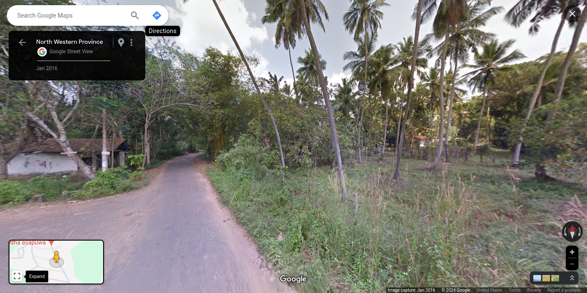

## Keselwatta

**Keselwatta** Grama Niladhari Division, **Panadura** Divisional Secretariat Division, **Kalutara** District, **Western** Province

**Panadura** Polling Division, **Kalutara** Electoral District

Population: 6,270 (2012)

(**LK-1303050**/672)

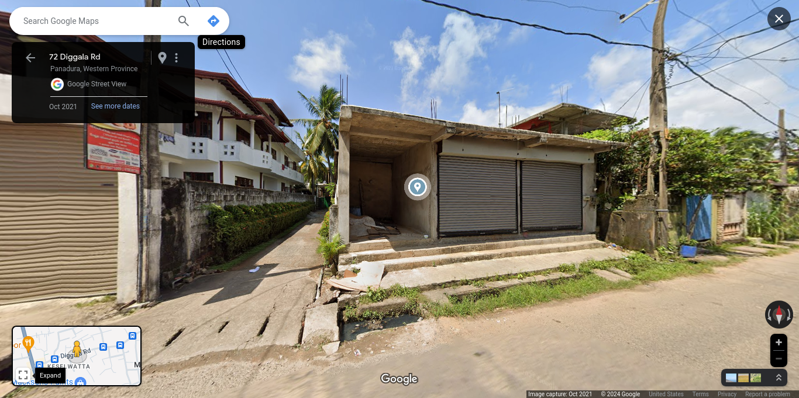

## Jinnanagar

**Jinnanagar** Grama Niladhari Division, **Trincomalee Town and Gravets** Divisional Secretariat Division, **Trincomalee** District, **Eastern** Province

**Trincomalee** Polling Division, **Trincomalee** Electoral District

Population: 2,855 (2012)

(**LK-5315100**/244O)

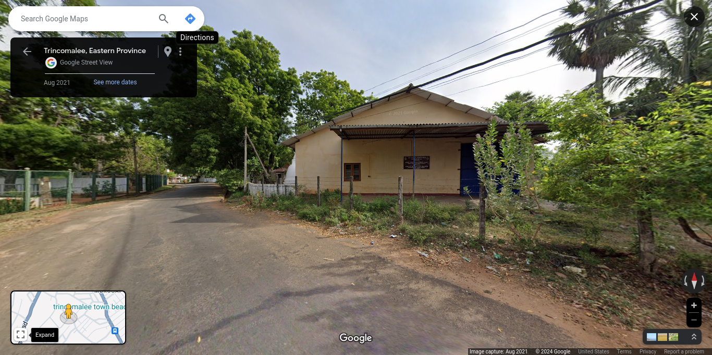

## Ariyalai Centre

**Ariyalai Centre** Grama Niladhari Division, **Nallur** Divisional Secretariat Division, **Jaffna** District, **Northern** Province

**Nallur** Polling Division, **Jaffna** Electoral District

Population: 1,649 (2012)

(**LK-4133035**/J/95)

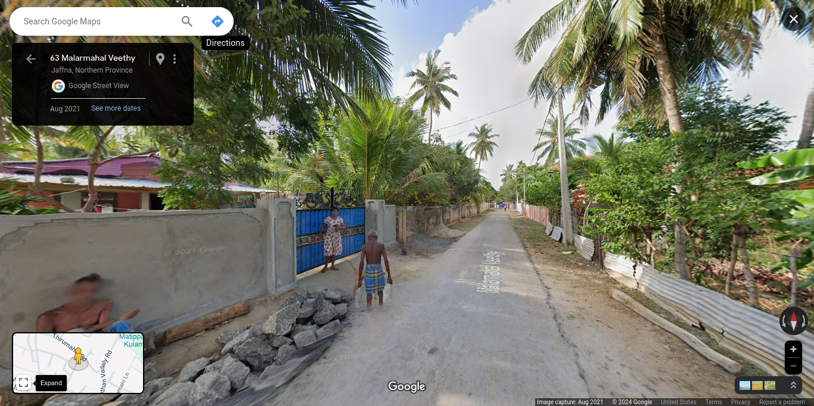

## Etambagasmulla

**Etambagasmulla** Grama Niladhari Division, **Akmeemana** Divisional Secretariat Division, **Galle** District, **Southern** Province

**Akmeemana** Polling Division, **Galle** Electoral District

Population: 697 (2012)

(**LK-3145070**/109G)

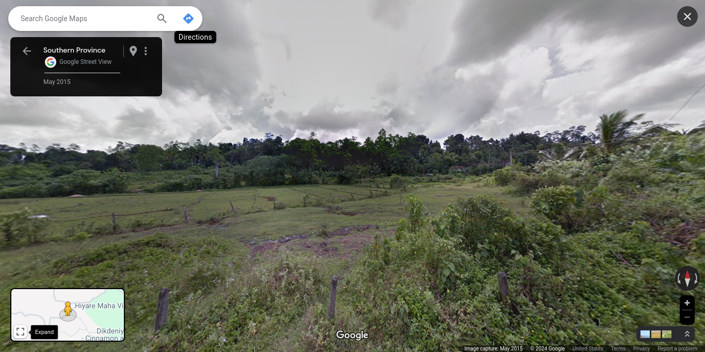

## Napawala

**Napawala** Grama Niladhari Division, **Dehiovita** Divisional Secretariat Division, **Kegalle** District, **Sabaragamuwa** Province

**Ruwanwella** Polling Division, **Kegalle** Electoral District

Population: 2,695 (2012)

(**LK-9230070**/117B)

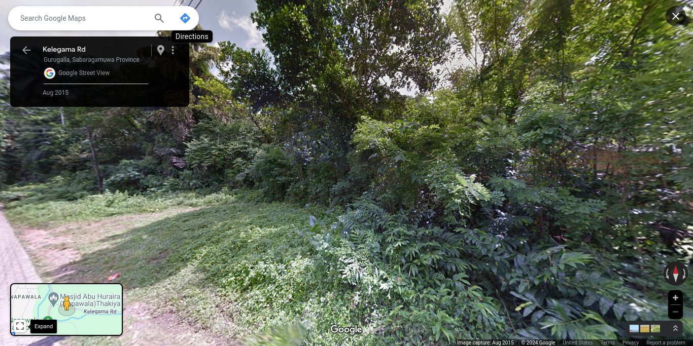

## Kendakaduwa

**Kendakaduwa** Grama Niladhari Division, **Yatinuwara** Divisional Secretariat Division, **Kandy** District, **Central** Province

**Yatinuwara** Polling Division, **Kandy** Electoral District

Population: 1,894 (2012)

(**LK-2136410**/134)

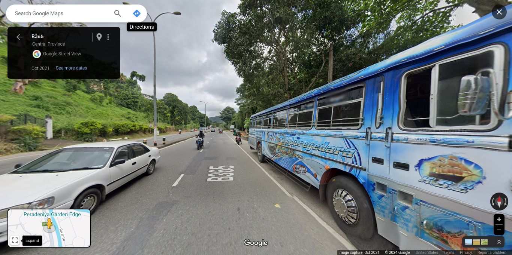

## Kuttiyagolla

**Kuttiyagolla** Grama Niladhari Division, **Soranathota** Divisional Secretariat Division, **Badulla** District, **Uva** Province

**Viyaluwa** Polling Division, **Badulla** Electoral District

Population: 1,019 (2012)

(**LK-8115090**/25A)

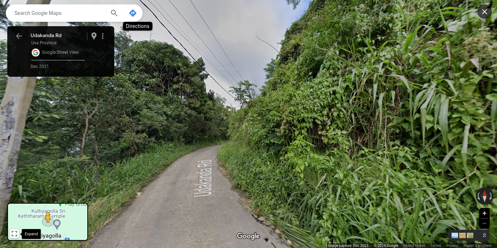

## Esseddawa

**Esseddawa** Grama Niladhari Division, **Kuliyapitiya West** Divisional Secretariat Division, **Kurunegala** District, **North Western** Province

**Kuliyapitiya** Polling Division, **Kurunegala** Electoral District

Population: 1,161 (2012)

(**LK-6172120**/1158)

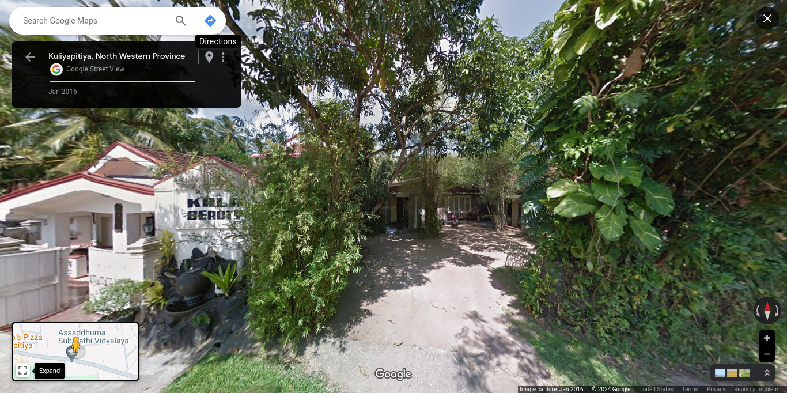

## Batagama South

**Batagama South** Grama Niladhari Division, **Ja-Ela** Divisional Secretariat Division, **Gampaha** District, **Western** Province

**Ja Ela** Polling Division, **Gampaha** Electoral District

Population: 3,124 (2012)

(**LK-1221195**/185)

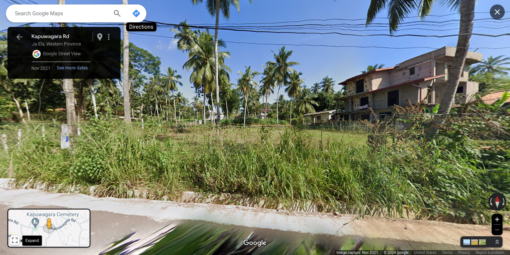

## Soysapura South

**Soysapura South** Grama Niladhari Division, **Moratuwa** Divisional Secretariat Division, **Colombo** District, **Western** Province

**Moratuwa** Polling Division, **Colombo** Electoral District

Population: 2,711 (2012)

(**LK-1133020**/548B)

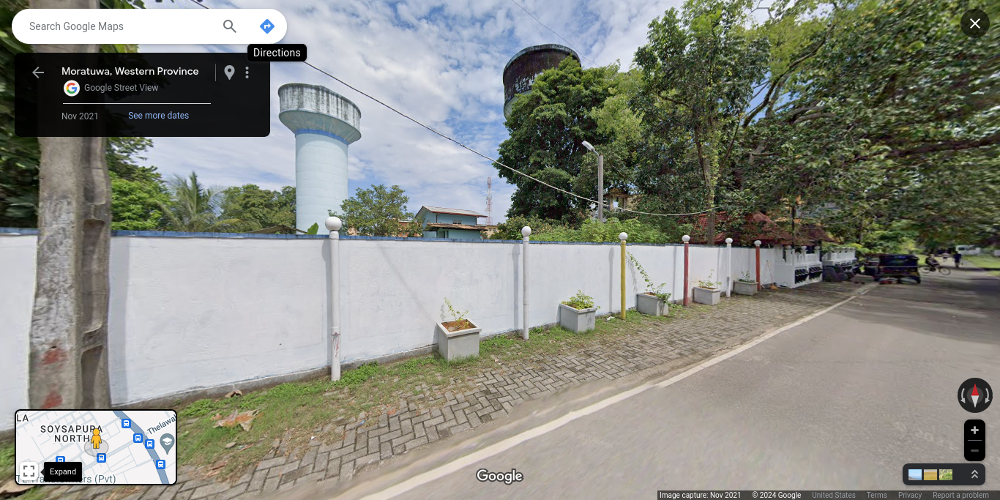

## Uragasmanhandiya East

**Uragasmanhandiya East** Grama Niladhari Division, **Karandeniya** Divisional Secretariat Division, **Galle** District, **Southern** Province

**Karandeniya** Polling Division, **Galle** Electoral District

Population: 1,634 (2012)

(**LK-3109040**/39C)

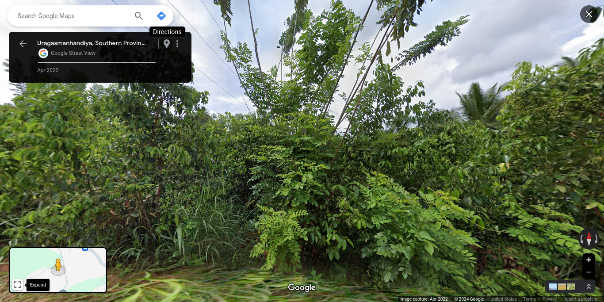

## Town Division 01

**Town Division 01** Grama Niladhari Division, **Akkaraipattu** Divisional Secretariat Division, **Ampara** District, **Eastern** Province

**Pothuvil** Polling Division, **Digamadulla** Electoral District

Population: 1,098 (2012)

(**LK-5236130**/AP/15A)

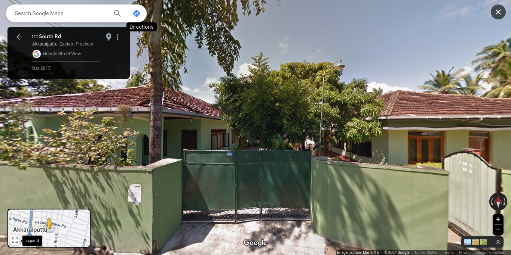

## Pinwatta West

**Pinwatta West** Grama Niladhari Division, **Panadura** Divisional Secretariat Division, **Kalutara** District, **Western** Province

**Panadura** Polling Division, **Kalutara** Electoral District

Population: 2,212 (2012)

(**LK-1303300**/696B)

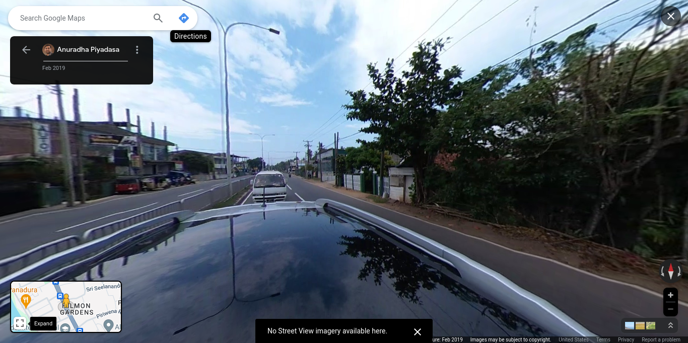

## Vankalai West

**Vankalai West** Grama Niladhari Division, **Nanattan** Divisional Secretariat Division, **Mannar** District, **Northern** Province

**Mannar** Polling Division, **Vanni** Electoral District

Population: 710 (2012)

(**LK-4212010**/MN/98)

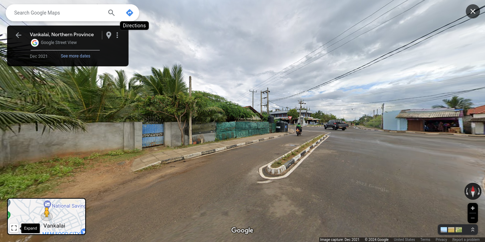

## Gurunagar East

**Gurunagar East** Grama Niladhari Division, **Jaffna** Divisional Secretariat Division, **Jaffna** District, **Northern** Province

**Jaffna** Polling Division, **Jaffna** Electoral District

Population: 1,974 (2012)

(**LK-4136050**/J/70)

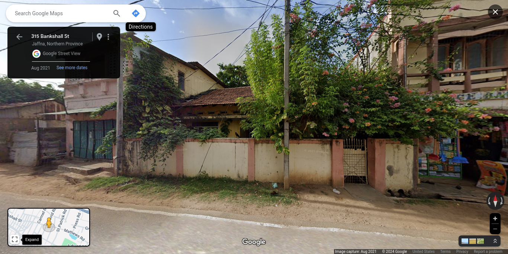

## Noope

**Noope** Grama Niladhari Division, **Matara Four Gravets** Divisional Secretariat Division, **Matara** District, **Southern** Province

**Matara** Polling Division, **Matara** Electoral District

Population: 934 (2012)

(**LK-3242265**/415)

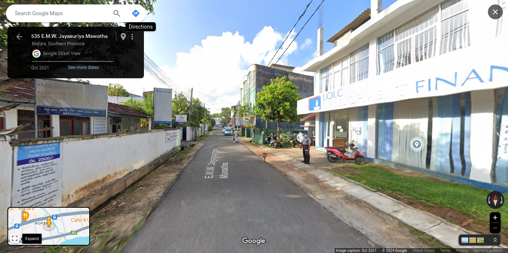

## Pothupitiya North

**Pothupitiya North** Grama Niladhari Division, **Kalutara** Divisional Secretariat Division, **Kalutara** District, **Western** Province

**Kalutara** Polling Division, **Kalutara** Electoral District

Population: 1,296 (2012)

(**LK-1321110**/708)

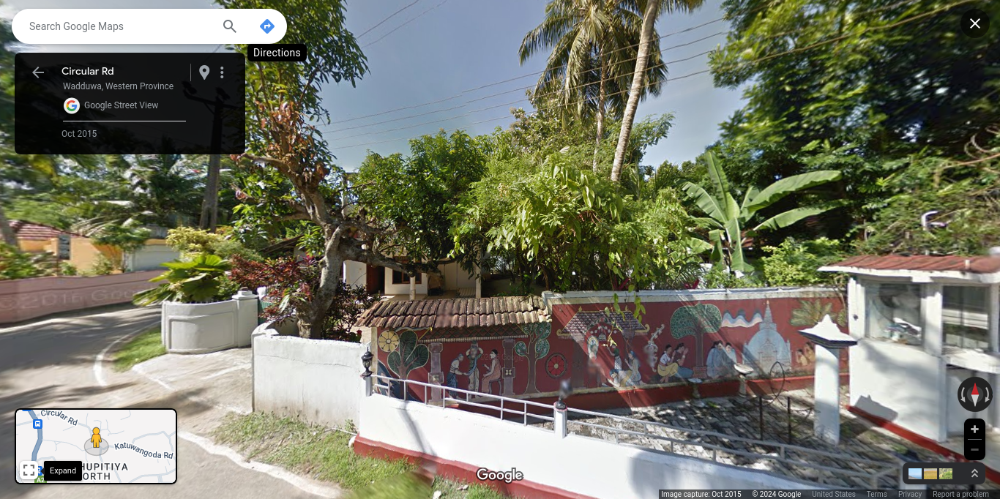

## Wetakepotha

**Wetakepotha** Grama Niladhari Division, **Deltota** Divisional Secretariat Division, **Kandy** District, **Central** Province

**Hewaheta** Polling Division, **Kandy** Electoral District

Population: 781 (2012)

(**LK-2148085**/1034)

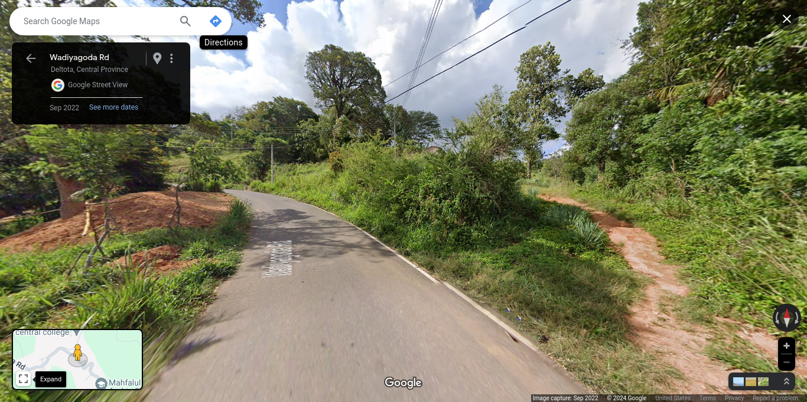

## Weligodawatta

**Weligodawatta** Grama Niladhari Division, **Pasbage Korale** Divisional Secretariat Division, **Kandy** District, **Central** Province

**Nawalapitiya** Polling Division, **Kandy** Electoral District

Population: 1,824 (2012)

(**LK-2157015**/1102)

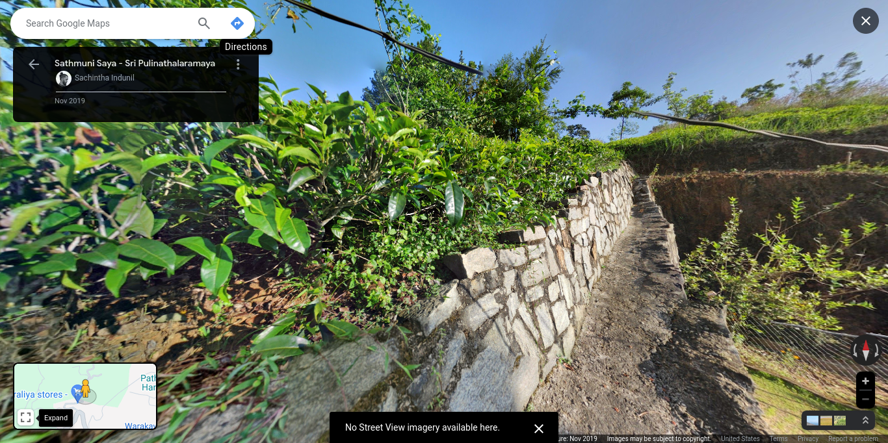

## Batugoda North

**Batugoda North** Grama Niladhari Division, **Pujapitiya** Divisional Secretariat Division, **Kandy** District, **Central** Province

**Harispattuwa** Polling Division, **Kandy** Electoral District

Population: 632 (2012)

(**LK-2106290**/550)

## Maha Buthgamuwa C

**Maha Buthgamuwa C** Grama Niladhari Division, **Kolonnawa** Divisional Secretariat Division, **Colombo** District, **Western** Province

**Kolonnawa** Polling Division, **Colombo** Electoral District

Population: 4,103 (2012)

(**LK-1106095**/506D)

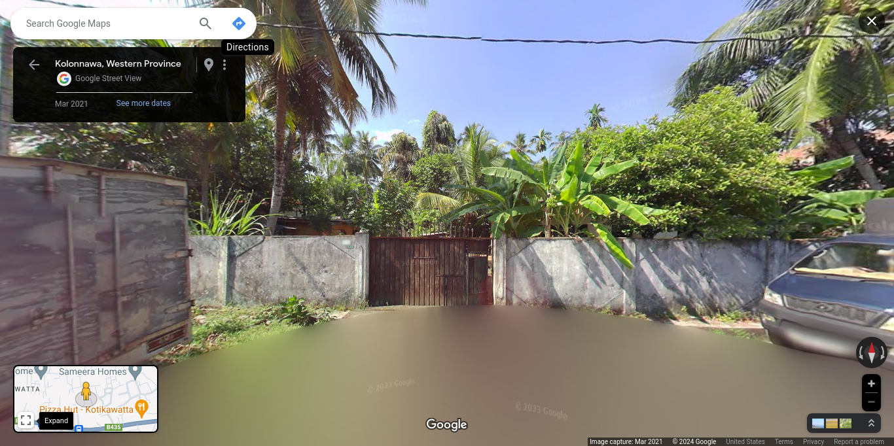

## Godagama West

**Godagama West** Grama Niladhari Division, **Attanagalla** Divisional Secretariat Division, **Gampaha** District, **Western** Province

**Attanagalla** Polling Division, **Gampaha** Electoral District

Population: 491 (2012)

(**LK-1227395**/361/A)

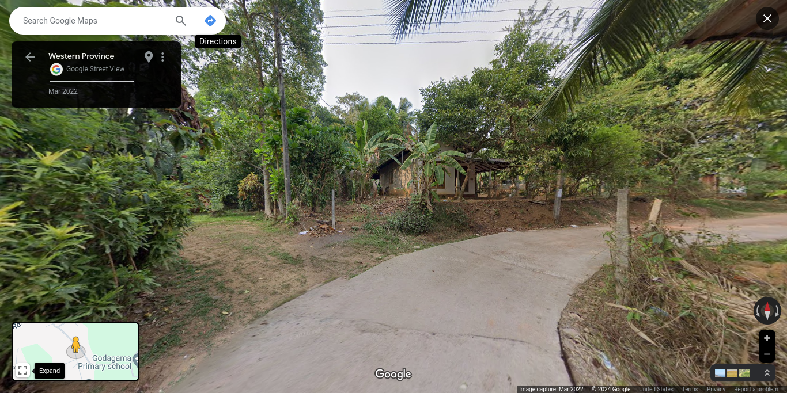

## Bandaragama West

**Bandaragama West** Grama Niladhari Division, **Bandaragama** Divisional Secretariat Division, **Kalutara** District, **Western** Province

**Bandaragama** Polling Division, **Kalutara** Electoral District

Population: 1,895 (2012)

(**LK-1306235**/663B)

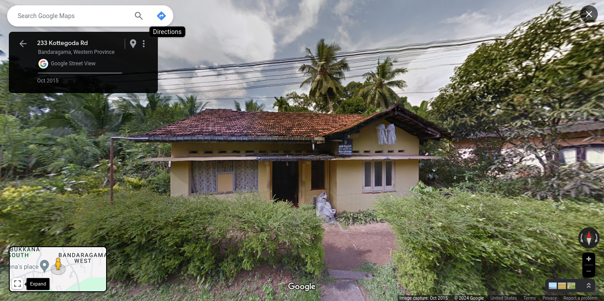

## Hittetiya Meda

**Hittetiya Meda** Grama Niladhari Division, **Matara Four Gravets** Divisional Secretariat Division, **Matara** District, **Southern** Province

**Matara** Polling Division, **Matara** Electoral District

Population: 3,719 (2012)

(**LK-3242085**/414B)

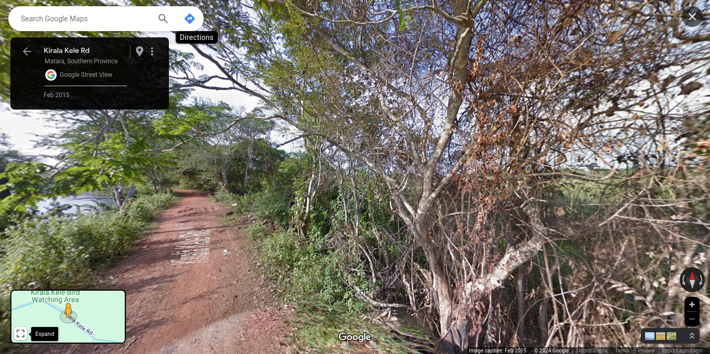

## Dematawewa

**Dematawewa** Grama Niladhari Division, **Horowpothana** Divisional Secretariat Division, **Anuradhapura** District, **North Central** Province

**Horowpothana** Polling Division, **Anuradhapura** Electoral District

Population: 622 (2012)

(**LK-7124185**/154)

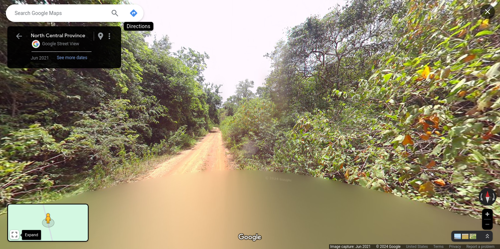

## K.C. De Silva Puraya

**K.C. De Silva Puraya** Grama Niladhari Division, **Katana** Divisional Secretariat Division, **Gampaha** District, **Western** Province

**Katana** Polling Division, **Gampaha** Electoral District

Population: 3,711 (2012)

(**LK-1206105**/70B)

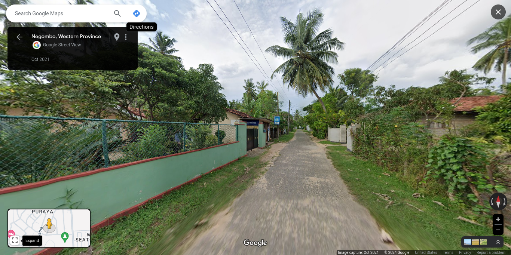

## Gangoda

**Gangoda** Grama Niladhari Division, **Kurunegala** Divisional Secretariat Division, **Kurunegala** District, **North Western** Province

**Kurunegala** Polling Division, **Kurunegala** Electoral District

Population: 2,020 (2012)

(**LK-6154110**/832)

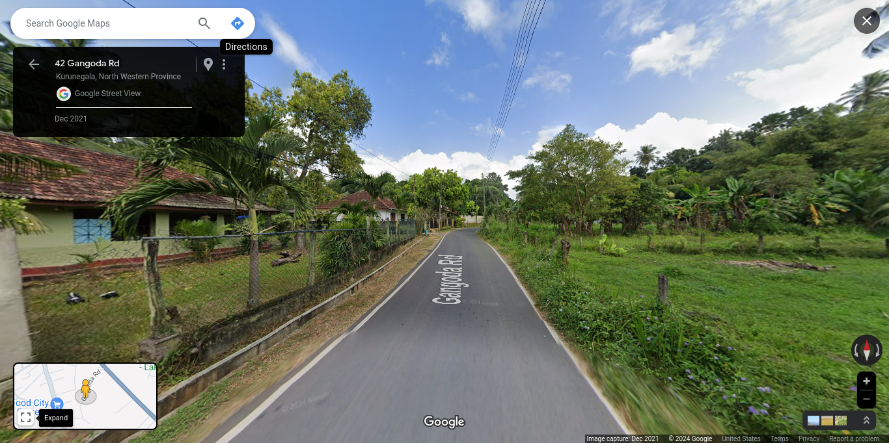

## Iruthayapuram west

**Iruthayapuram west** Grama Niladhari Division, **Manmunai North** Divisional Secretariat Division, **Batticaloa** District, **Eastern** Province

**Batticaloa** Polling Division, **Batticaloa** Electoral District

Population: 2,495 (2012)

(**LK-5118105**/176E)

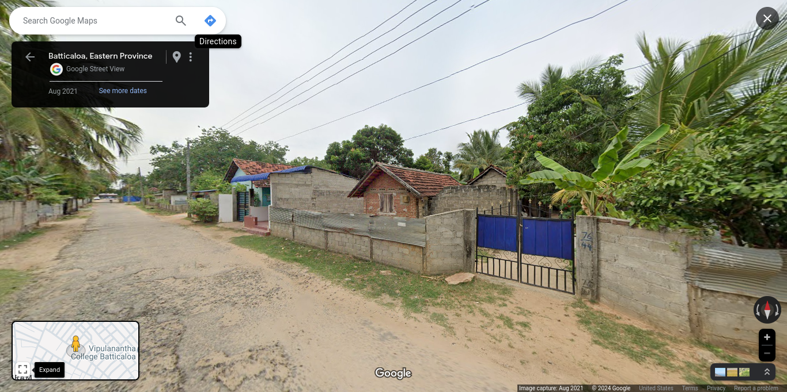

## Thethathivu South 2

**Thethathivu South 2** Grama Niladhari Division, **Manmunai South & Eruvil pattu** Divisional Secretariat Division, **Batticaloa** District, **Eastern** Province

**Paddiruppu** Polling Division, **Batticaloa** Electoral District

Population: 1,019 (2012)

(**LK-5136040**/122C)

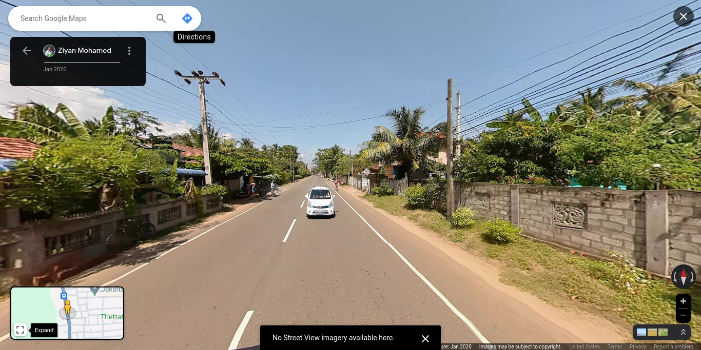

## Ganepola

**Ganepola** Grama Niladhari Division, **Katana** Divisional Secretariat Division, **Gampaha** District, **Western** Province

**Katana** Polling Division, **Gampaha** Electoral District

Population: 1,961 (2012)

(**LK-1206280**/203)

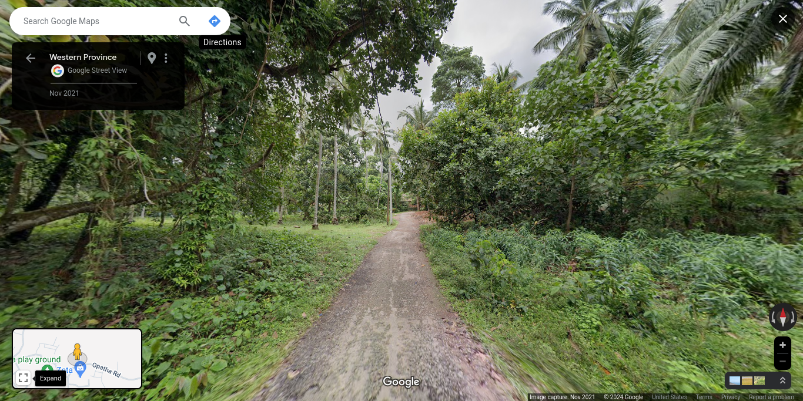

## kurinchakerny

**kurinchakerny** Grama Niladhari Division, **Kinniya** Divisional Secretariat Division, **Trincomalee** District, **Eastern** Province

**Muttur** Polling Division, **Trincomalee** Electoral District

Population: 2,357 (2012)

(**LK-5324070**/226G)

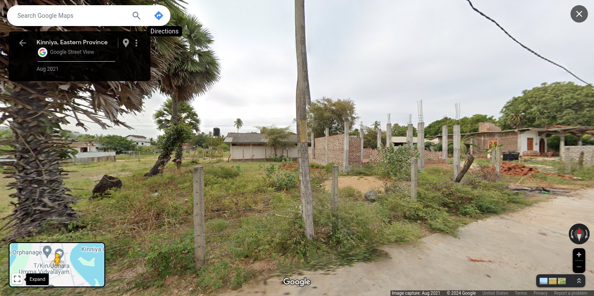

## Paldeniya

**Paldeniya** Grama Niladhari Division, **Pallepola** Divisional Secretariat Division, **Matale** District, **Central** Province

**Dambulla** Polling Division, **Matale** Electoral District

Population: 742 (2012)

(**LK-2212195**/E421)

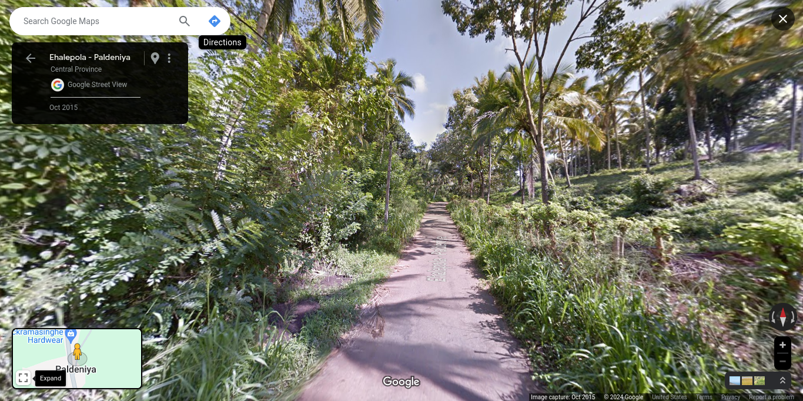

## Ariyalai Centre

**Ariyalai Centre** Grama Niladhari Division, **Nallur** Divisional Secretariat Division, **Jaffna** District, **Northern** Province

**Nallur** Polling Division, **Jaffna** Electoral District

Population: 1,649 (2012)

(**LK-4133035**/J/95)

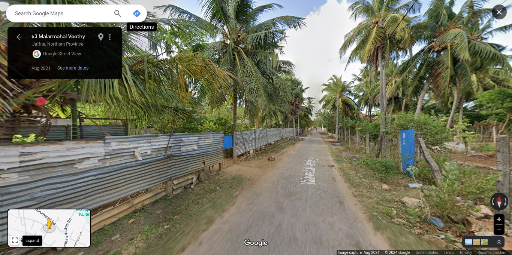

## Lindara

**Lindara** Grama Niladhari Division, **Mirigama** Divisional Secretariat Division, **Gampaha** District, **Western** Province

**Mirigama** Polling Division, **Gampaha** Electoral District

Population: 993 (2012)

(**LK-1212235**/16)

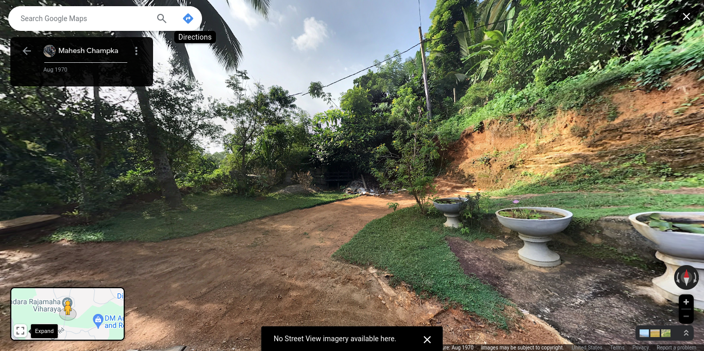

## Padagoda

**Padagoda** Grama Niladhari Division, **Beruwala** Divisional Secretariat Division, **Kalutara** District, **Western** Province

**Beruwala** Polling Division, **Kalutara** Electoral District

Population: 1,461 (2012)

(**LK-1324275**/768)

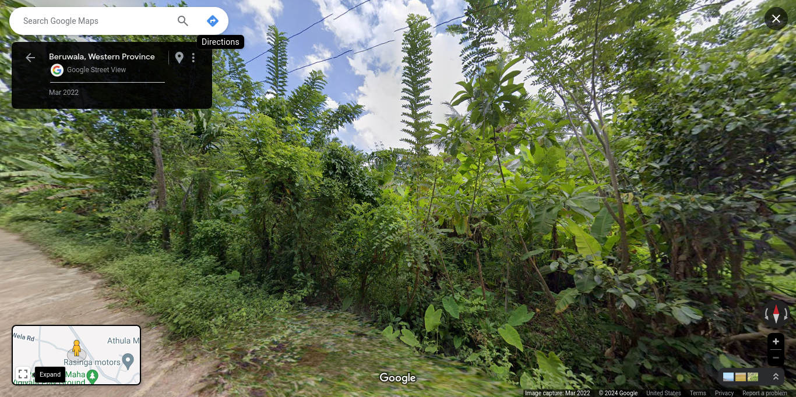

## Kalalgoda

**Kalalgoda** Grama Niladhari Division, **Maharagama** Divisional Secretariat Division, **Colombo** District, **Western** Province

**Maharagama** Polling Division, **Colombo** Electoral District

Population: 4,956 (2012)

(**LK-1121030**/493)

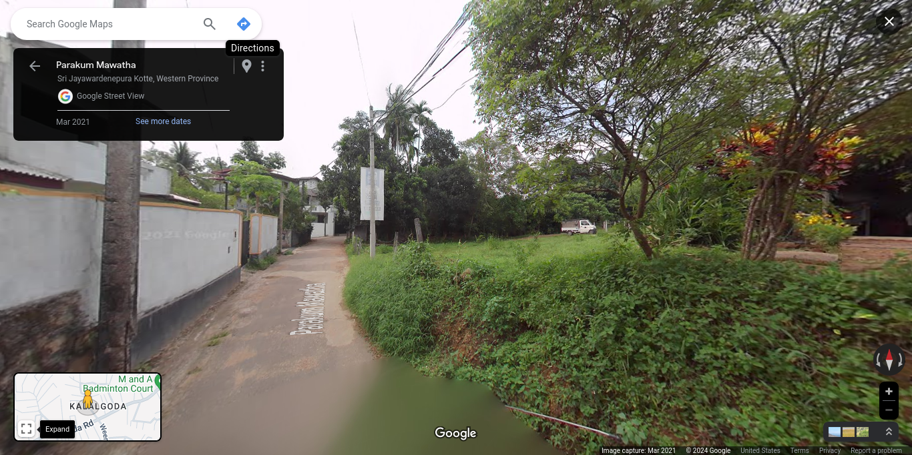

## Theliyagonna

**Theliyagonna** Grama Niladhari Division, **Kurunegala** Divisional Secretariat Division, **Kurunegala** District, **North Western** Province

**Kurunegala** Polling Division, **Kurunegala** Electoral District

Population: 2,745 (2012)

(**LK-6154175**/836)

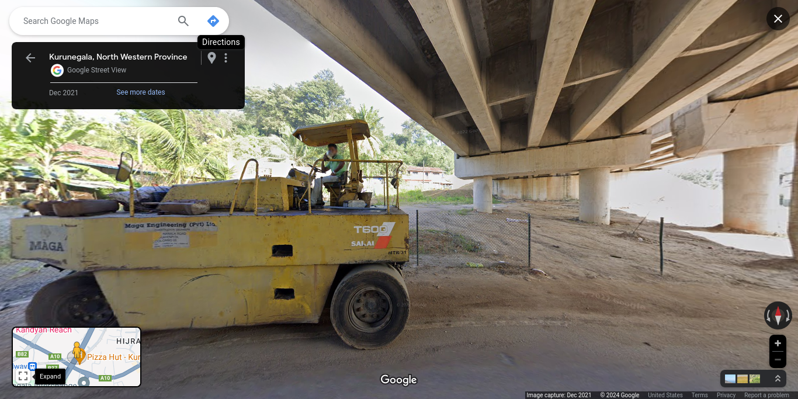

## Galahitiyawa South

**Galahitiyawa South** Grama Niladhari Division, **Gampaha** Divisional Secretariat Division, **Gampaha** District, **Western** Province

**Gampaha** Polling Division, **Gampaha** Electoral District

Population: 3,339 (2012)

(**LK-1224350**/215A)

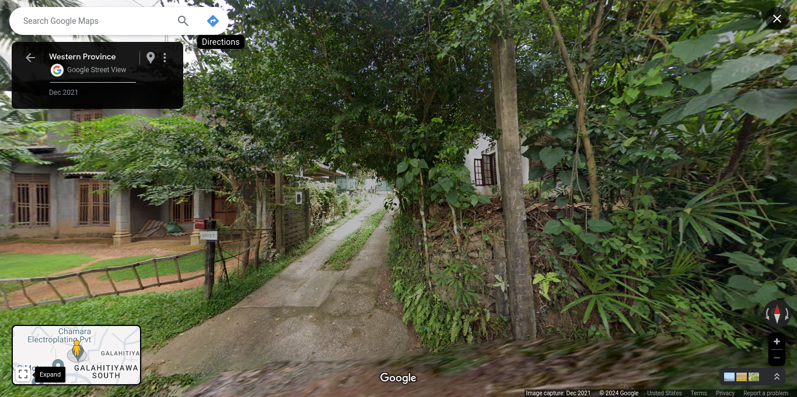

## Kalatuwakanda

**Kalatuwakanda** Grama Niladhari Division, **Weligepola** Divisional Secretariat Division, **Ratnapura** District, **Sabaragamuwa** Province

**Rakwana** Polling Division, **Ratnapura** Electoral District

Population: 709 (2012)

(**LK-9145115**/220B)

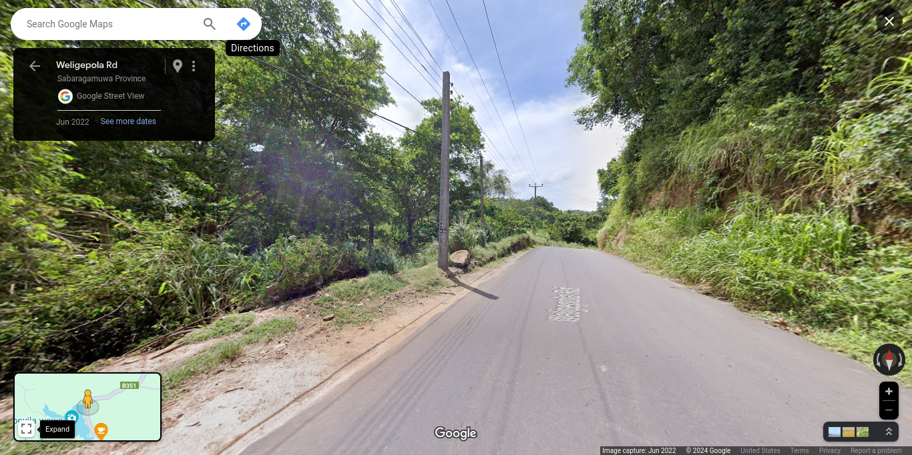

## Amunugama

**Amunugama** Grama Niladhari Division, **Polgahawela** Divisional Secretariat Division, **Kurunegala** District, **North Western** Province

**Polgahawela** Polling Division, **Kurunegala** Electoral District

Population: 937 (2012)

(**LK-6187010**/884)

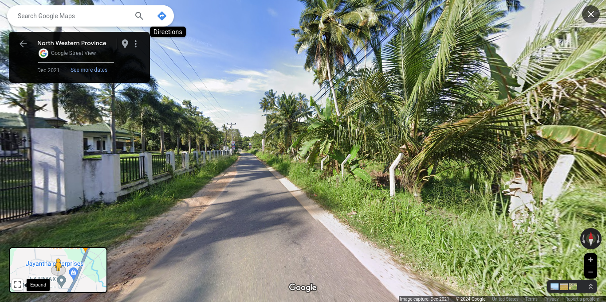

## Point Pedro East

**Point Pedro East** Grama Niladhari Division, **Vadamaradchi North (Point Pedro)** Divisional Secretariat Division, **Jaffna** District, **Northern** Province

**Point Pedro** Polling Division, **Jaffna** Electoral District

Population: 2,956 (2012)

(**LK-4127105**/J/403)

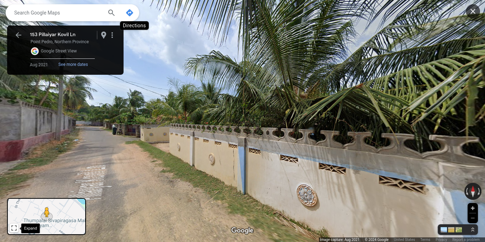

## Bogambara

**Bogambara** Grama Niladhari Division, **Kandy Four Gravets & Gangawata Korale** Divisional Secretariat Division, **Kandy** District, **Central** Province

**Senkadagala** Polling Division, **Kandy** Electoral District

Population: 3,195 (2012)

(**LK-2130145**/264)

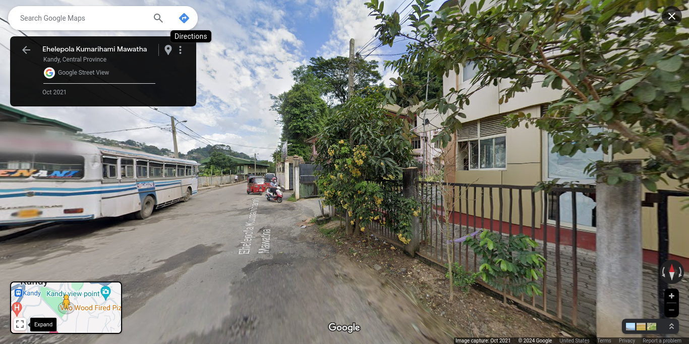

## Pandiyankulam

**Pandiyankulam** Grama Niladhari Division, **Manthai East** Divisional Secretariat Division, **Mullaitivu** District, **Northern** Province

**Mullaitivu** Polling Division, **Vanni** Electoral District

Population: 731 (2012)

(**LK-4406040**/MU/009)

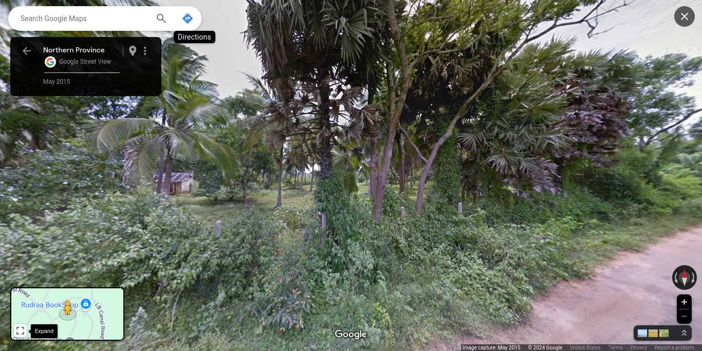

## Batukachchiya

**Batukachchiya** Grama Niladhari Division, **Kanthale** Divisional Secretariat Division, **Trincomalee** District, **Eastern** Province

**Seruvila** Polling Division, **Trincomalee** Electoral District

Population: 2,150 (2012)

(**LK-5321105**/227T)

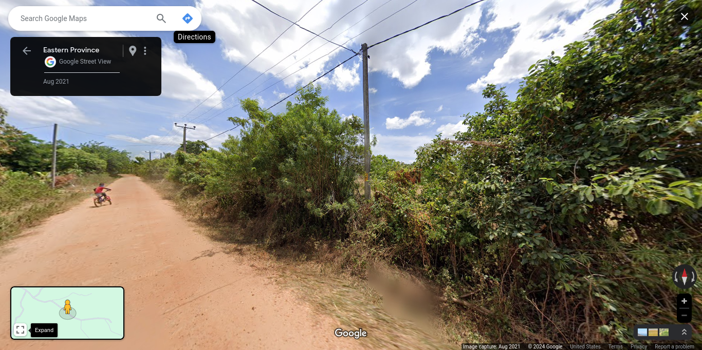

## Deenapamunuwa West

**Deenapamunuwa West** Grama Niladhari Division, **Attanagalla** Divisional Secretariat Division, **Gampaha** District, **Western** Province

**Attanagalla** Polling Division, **Gampaha** Electoral District

Population: 706 (2012)

(**LK-1227575**/366D)

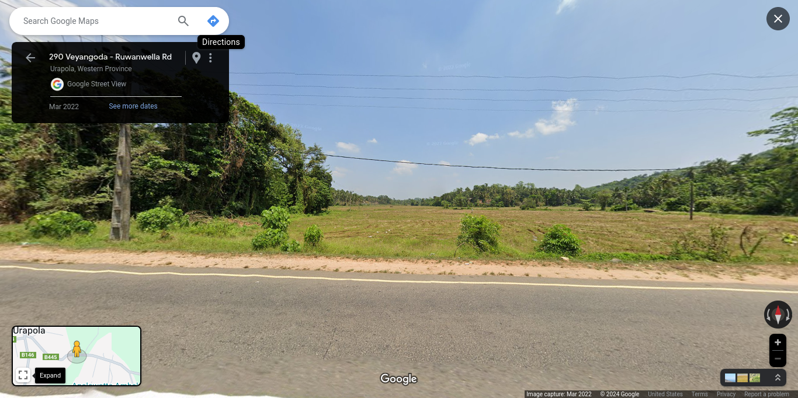

## Alanduwaka

**Alanduwaka** Grama Niladhari Division, **Udunuwara** Divisional Secretariat Division, **Kandy** District, **Central** Province

**Udunuwara** Polling Division, **Kandy** Electoral District

Population: 1,347 (2012)

(**LK-2139050**/122)

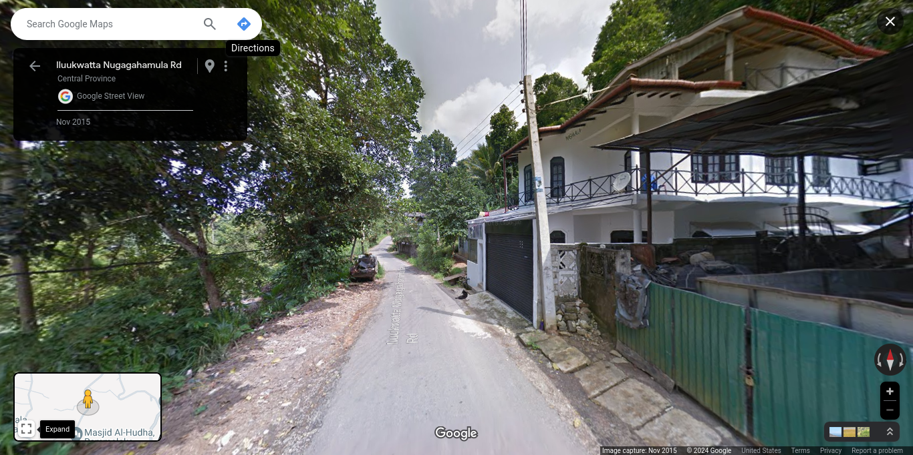

## Megodagama

**Megodagama** Grama Niladhari Division, **Pathadumbara** Divisional Secretariat Division, **Kandy** District, **Central** Province

**Pathadumbara** Polling Division, **Kandy** Electoral District

Population: 860 (2012)

(**LK-2112150**/618)

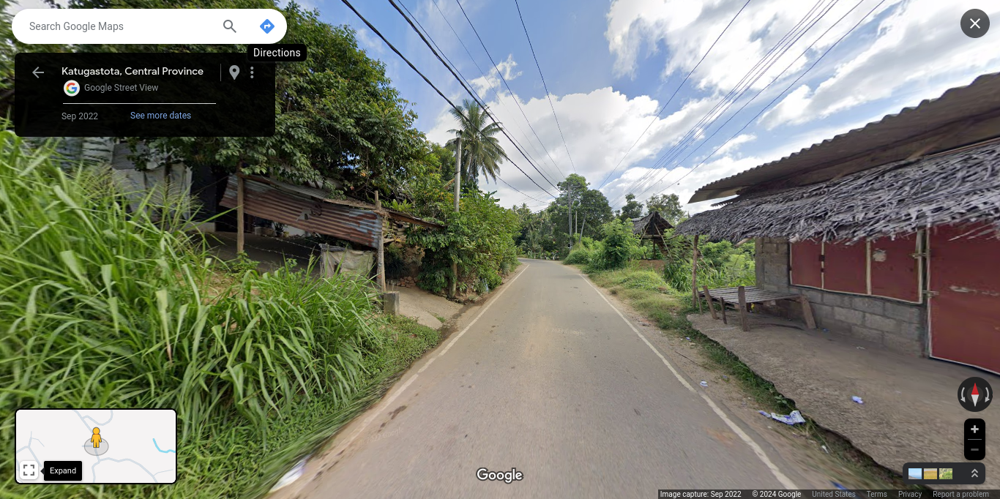

## Yogiyana

**Yogiyana** Grama Niladhari Division, **Dankotuwa** Divisional Secretariat Division, **Puttalam** District, **North Western** Province

**Wennappuwa** Polling Division, **Puttalam** Electoral District

Population: 865 (2012)

(**LK-6248230**/459)

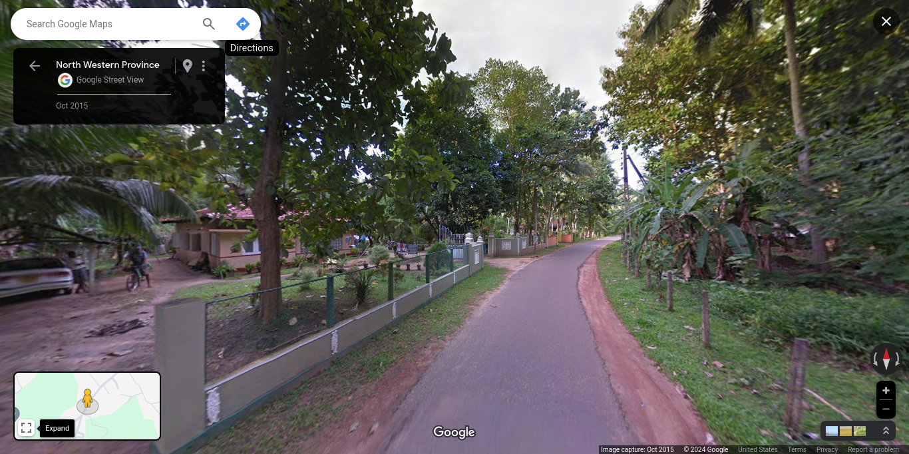

## Bambukuliya

**Bambukuliya** Grama Niladhari Division, **Katana** Divisional Secretariat Division, **Gampaha** District, **Western** Province

**Katana** Polling Division, **Gampaha** Electoral District

Population: 2,657 (2012)

(**LK-1206025**/65)

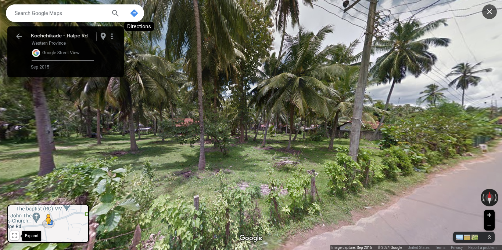

## Neduna

**Neduna** Grama Niladhari Division, **Gampaha** Divisional Secretariat Division, **Gampaha** District, **Western** Province

**Gampaha** Polling Division, **Gampaha** Electoral District

Population: 1,356 (2012)

(**LK-1224235**/236C)

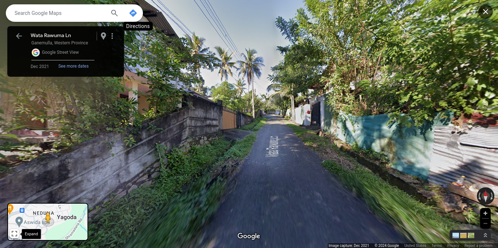

## Pattivila North

**Pattivila North** Grama Niladhari Division, **Biyagama** Divisional Secretariat Division, **Gampaha** District, **Western** Province

**Biyagama** Polling Division, **Gampaha** Electoral District

Population: 2,048 (2012)

(**LK-1239185**/279)

## Welegoda

**Welegoda** Grama Niladhari Division, **Kelaniya** Divisional Secretariat Division, **Gampaha** District, **Western** Province

**Kelaniya** Polling Division, **Gampaha** Electoral District

Population: 6,646 (2012)

(**LK-1236005**/256B)

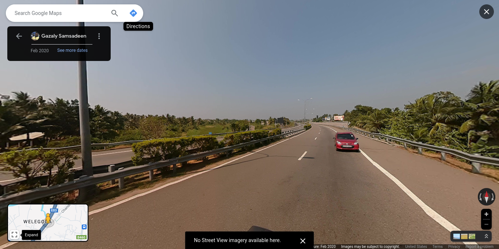

## Belideniya

**Belideniya** Grama Niladhari Division, **Dickwella** Divisional Secretariat Division, **Matara** District, **Southern** Province

**Devinuwara** Polling Division, **Matara** Electoral District

Population: 952 (2012)

(**LK-3248205**/444B)

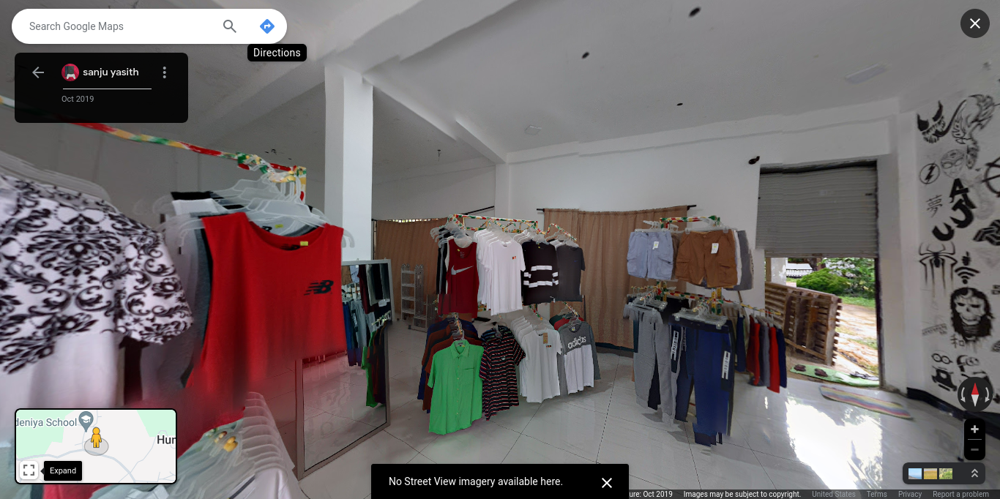

## Kankanamgoda

**Kankanamgoda** Grama Niladhari Division, **Beruwala** Divisional Secretariat Division, **Kalutara** District, **Western** Province

**Beruwala** Polling Division, **Kalutara** Electoral District

Population: 5,833 (2012)

(**LK-1324245**/749)

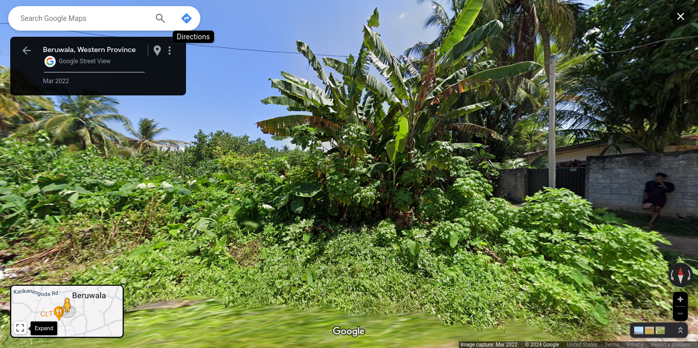

## Thammita

**Thammita** Grama Niladhari Division, **Minuwangoda** Divisional Secretariat Division, **Gampaha** District, **Western** Province

**Minuwangoda** Polling Division, **Gampaha** Electoral District

Population: 1,465 (2012)

(**LK-1215605**/136)

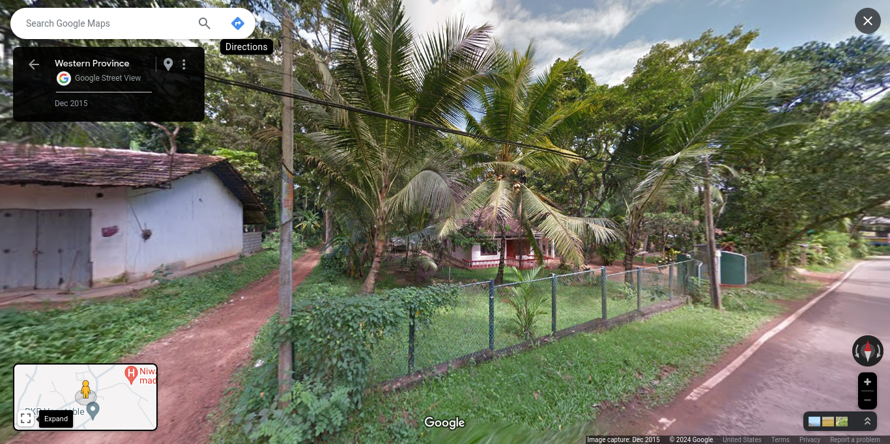

## Deshasthra Kalutara West

**Deshasthra Kalutara West** Grama Niladhari Division, **Kalutara** Divisional Secretariat Division, **Kalutara** District, **Western** Province

**Kalutara** Polling Division, **Kalutara** Electoral District

Population: 1,957 (2012)

(**LK-1321250**/717D)

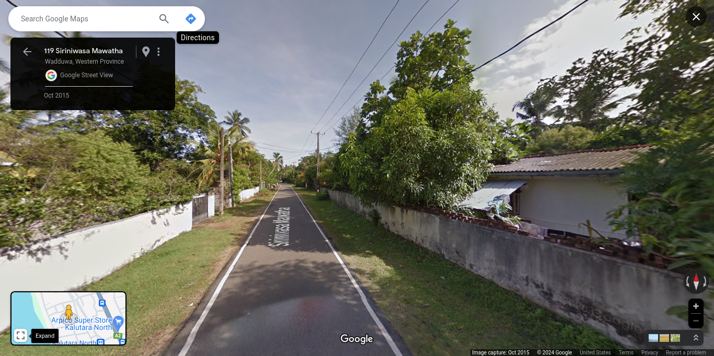

## Uduvil Centre North

**Uduvil Centre North** Grama Niladhari Division, **Valikamam South (Uduvil)** Divisional Secretariat Division, **Jaffna** District, **Northern** Province

**Manipay** Polling Division, **Jaffna** Electoral District

Population: 2,931 (2012)

(**LK-4115020**/J/185)

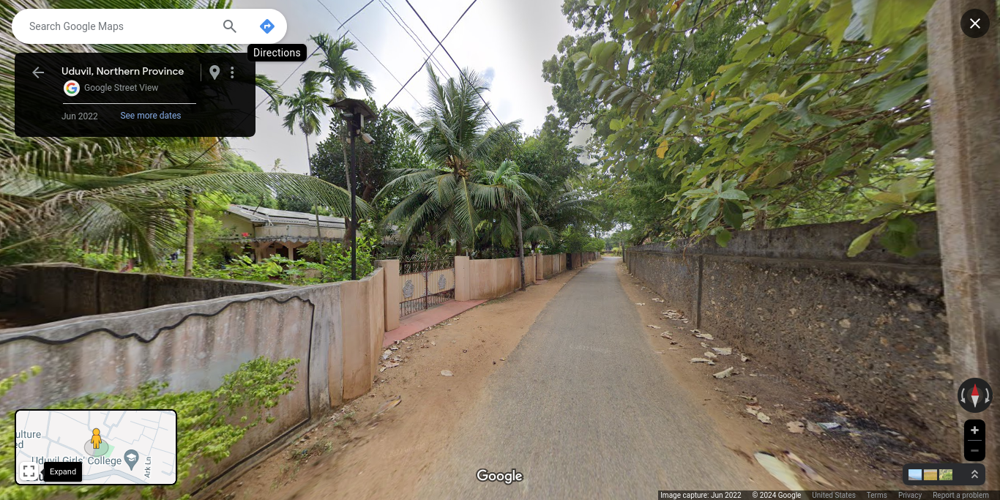

## Pannampitiya

**Pannampitiya** Grama Niladhari Division, **Dambulla** Divisional Secretariat Division, **Matale** District, **Central** Province

**Dambulla** Polling Division, **Matale** Electoral District

Population: 1,257 (2012)

(**LK-2206270**/E441A)

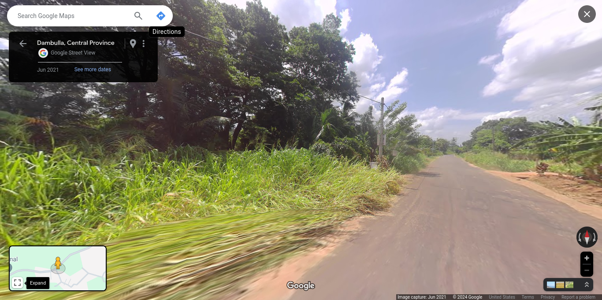

## Hangawela

**Hangawela** Grama Niladhari Division, **Rambukkana** Divisional Secretariat Division, **Kegalle** District, **Sabaragamuwa** Province

**Rambukkana** Polling Division, **Kegalle** Electoral District

Population: 486 (2012)

(**LK-9203095**/06C)

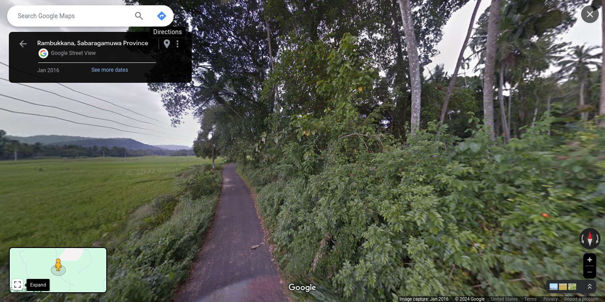

## Murungasyaya East

**Murungasyaya East** Grama Niladhari Division, **Katuwana** Divisional Secretariat Division, **Hambantota** District, **Southern** Province

**Mulkirigala** Polling Division, **Hambantota** Electoral District

Population: 1,117 (2012)

(**LK-3324085**/495)

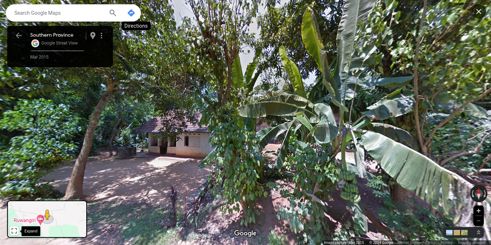

## Egoda Uyana Central

**Egoda Uyana Central** Grama Niladhari Division, **Moratuwa** Divisional Secretariat Division, **Colombo** District, **Western** Province

**Moratuwa** Polling Division, **Colombo** Electoral District

Population: 2,869 (2012)

(**LK-1133205**/556A)

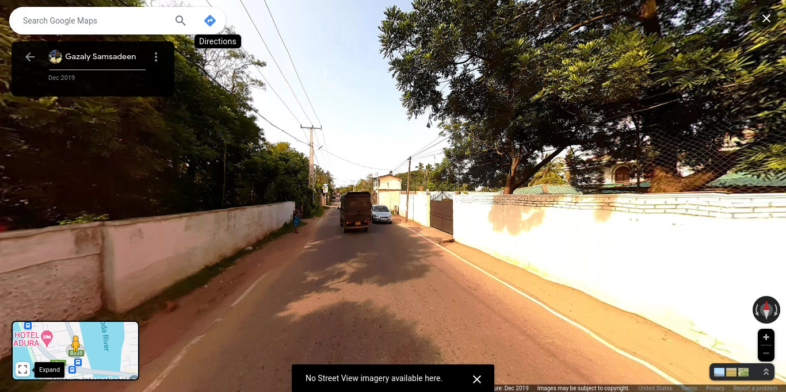

## Rathmale

**Rathmale** Grama Niladhari Division, **Dickwella** Divisional Secretariat Division, **Matara** District, **Southern** Province

**Devinuwara** Polling Division, **Matara** Electoral District

Population: 945 (2012)

(**LK-3248075**/450C)

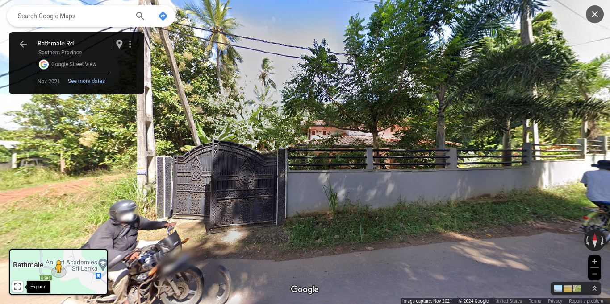

## Madiha West

**Madiha West** Grama Niladhari Division, **Matara Four Gravets** Divisional Secretariat Division, **Matara** District, **Southern** Province

**Matara** Polling Division, **Matara** Electoral District

Population: 2,044 (2012)

(**LK-3242230**/411A)

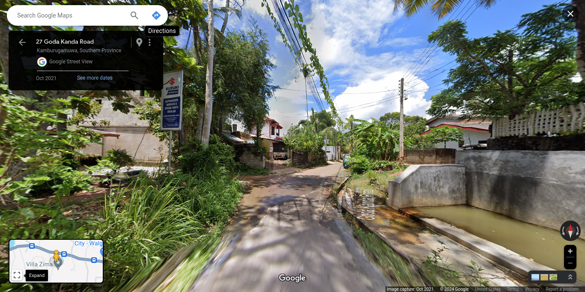

## Uyanwatta

**Uyanwatta** Grama Niladhari Division, **Harispattuwa** Divisional Secretariat Division, **Kandy** District, **Central** Province

**Harispattuwa** Polling Division, **Kandy** Electoral District

Population: 924 (2012)

(**LK-2133205**/491)

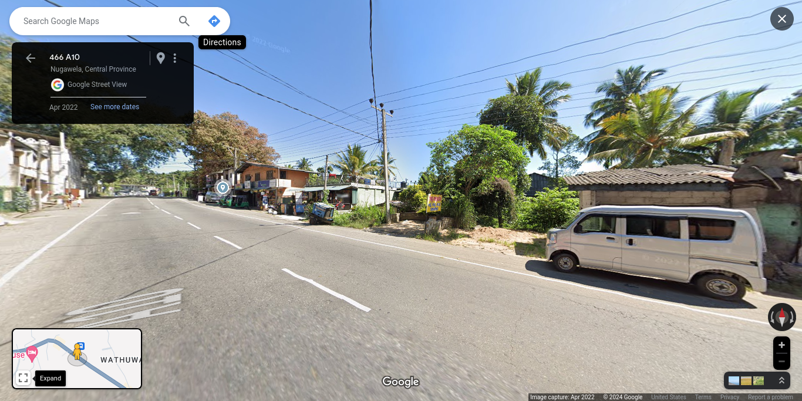

## Ariyagama

**Ariyagama** Grama Niladhari Division, **Kalutara** Divisional Secretariat Division, **Kalutara** District, **Western** Province

**Kalutara** Polling Division, **Kalutara** Electoral District

Population: 2,123 (2012)

(**LK-1321090**/709D)

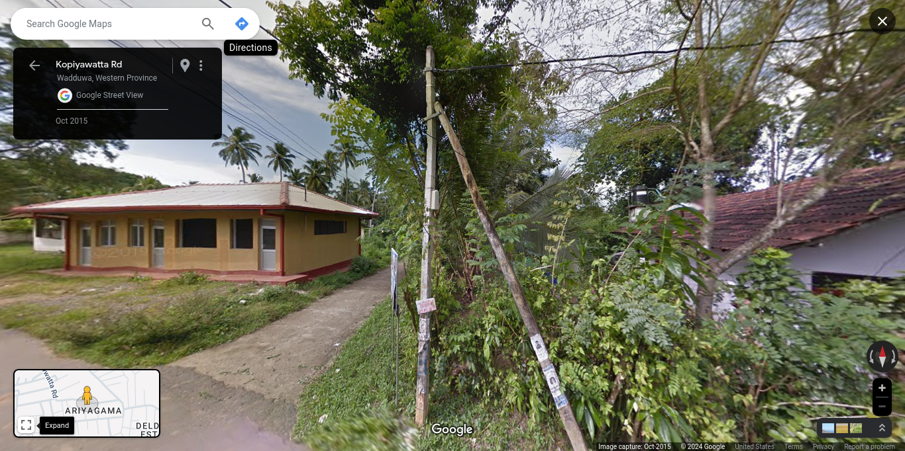

## Hiriyamalkumbura

**Hiriyamalkumbura** Grama Niladhari Division, **Yakkalamulla** Divisional Secretariat Division, **Galle** District, **Southern** Province

**Baddegama** Polling Division, **Galle** Electoral District

Population: 933 (2012)

(**LK-3148185**/180C)

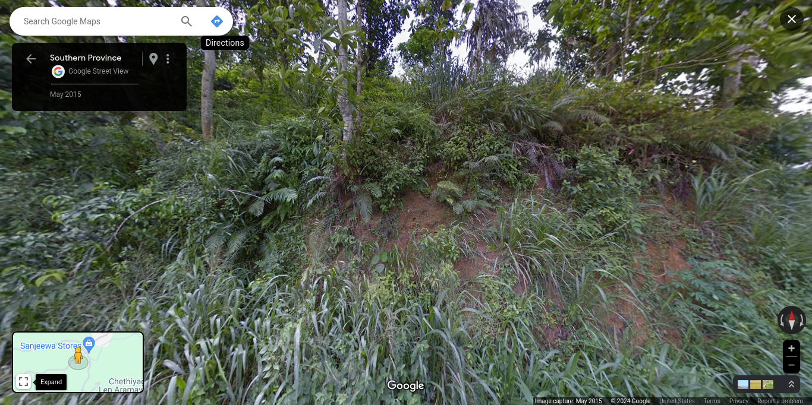

## Wehera West

**Wehera West** Grama Niladhari Division, **Kurunegala** Divisional Secretariat Division, **Kurunegala** District, **North Western** Province

**Kurunegala** Polling Division, **Kurunegala** Electoral District

Population: 1,213 (2012)

(**LK-6154205**/806)

## Duldeniya

**Duldeniya** Grama Niladhari Division, **Aranayaka** Divisional Secretariat Division, **Kegalle** District, **Sabaragamuwa** Province

**Aranayaka** Polling Division, **Kegalle** Electoral District

Population: 1,316 (2012)

(**LK-9209215**/42A)

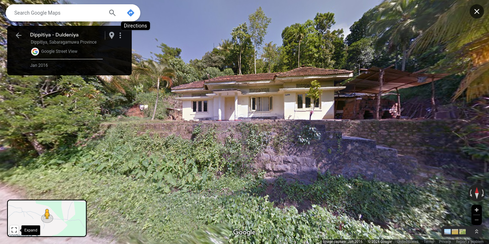

## Dambarawa

**Dambarawa** Grama Niladhari Division, **Kundasale** Divisional Secretariat Division, **Kandy** District, **Central** Province

**Kundasale** Polling Division, **Kandy** Electoral District

Population: 1,575 (2012)

(**LK-2127300**/706)

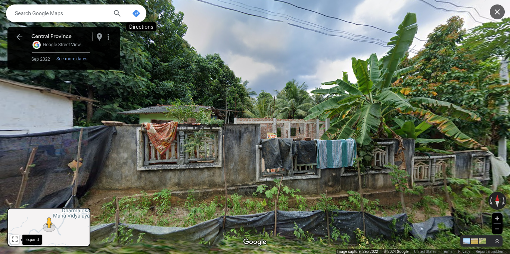

## Ninthavur 07

**Ninthavur 07** Grama Niladhari Division, **Ninthavur** Divisional Secretariat Division, **Ampara** District, **Eastern** Province

**Pothuvil** Polling Division, **Digamadulla** Electoral District

Population: 1,146 (2012)

(**LK-5230095**/37A)

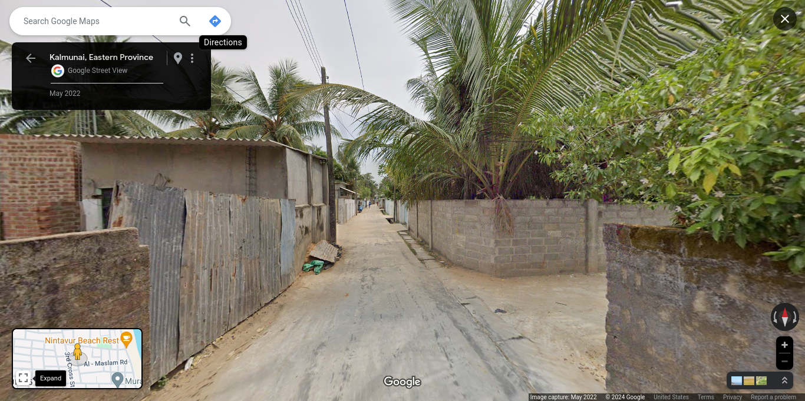

## Helamada

**Helamada** Grama Niladhari Division, **Galigamuwa** Divisional Secretariat Division, **Kegalle** District, **Sabaragamuwa** Province

**Galigamuwa** Polling Division, **Kegalle** Electoral District

Population: 1,730 (2012)

(**LK-9215005**/76B)

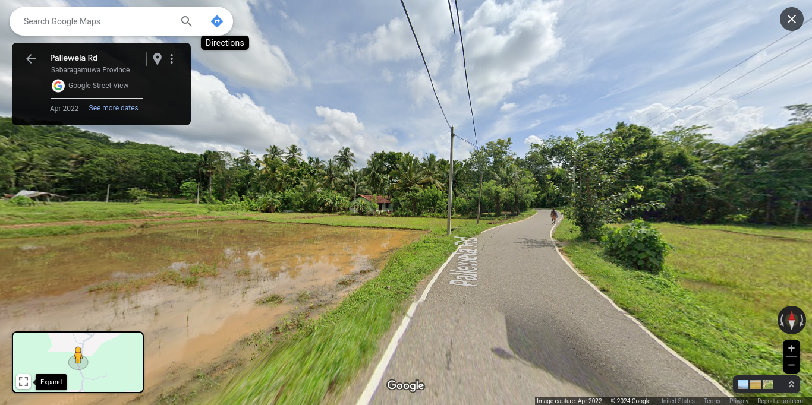

## Thalalla

**Thalalla** Grama Niladhari Division, **Devinuwara** Divisional Secretariat Division, **Matara** District, **Southern** Province

**Devinuwara** Polling Division, **Matara** Electoral District

Population: 1,355 (2012)

(**LK-3245135**/438C)

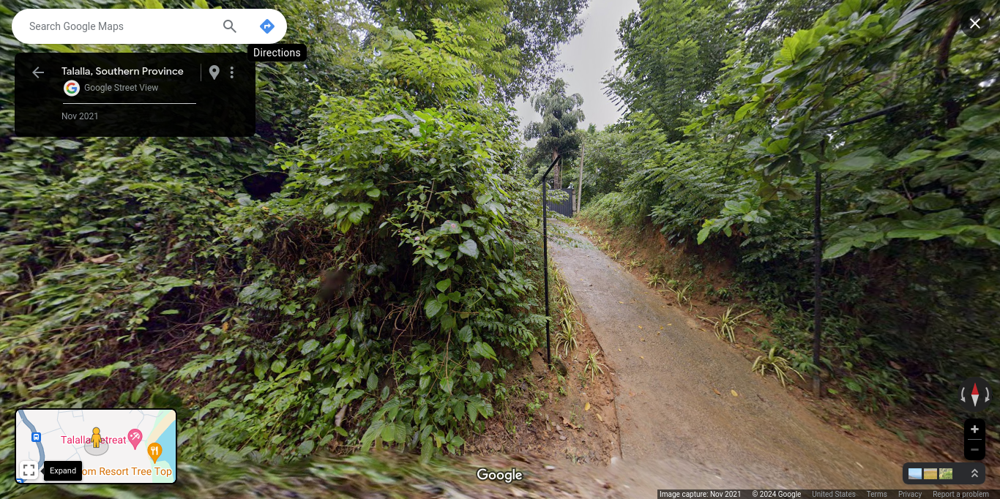

## Slave Island

**Slave Island** Grama Niladhari Division, **Colombo** Divisional Secretariat Division, **Colombo** District, **Western** Province

**Colombo Central** Polling Division, **Colombo** Electoral District

Population: 3,795 (2012)

(**LK-1103130**/)

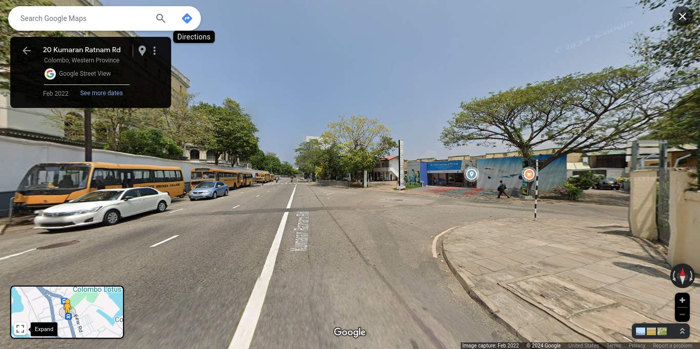

## Kadeweediya West

**Kadeweediya West** Grama Niladhari Division, **Matara Four Gravets** Divisional Secretariat Division, **Matara** District, **Southern** Province

**Matara** Polling Division, **Matara** Electoral District

Population: 1,771 (2012)

(**LK-3242200**/417F)

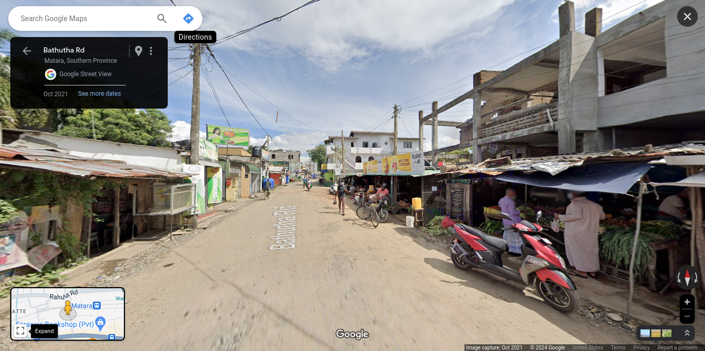

## Walgampatha

**Walgampatha** Grama Niladhari Division, **Ruwanwella** Divisional Secretariat Division, **Kegalle** District, **Sabaragamuwa** Province

**Ruwanwella** Polling Division, **Kegalle** Electoral District

Population: 906 (2012)

(**LK-9221015**/98)

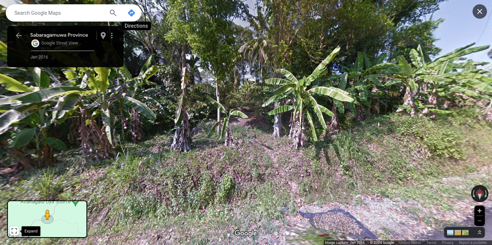

## Wavinna

**Wavinna** Grama Niladhari Division, **Kundasale** Divisional Secretariat Division, **Kandy** District, **Central** Province

**Kundasale** Polling Division, **Kandy** Electoral District

Population: 1,122 (2012)

(**LK-2127035**/671)

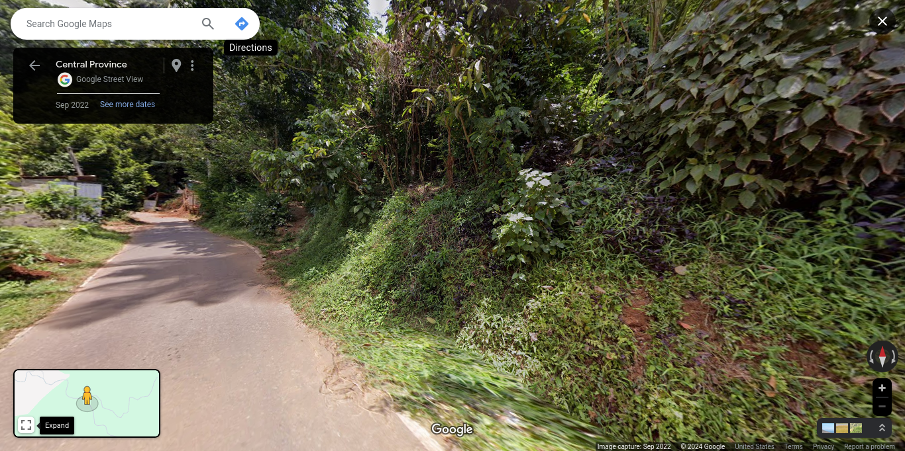

## Koralawella South

**Koralawella South** Grama Niladhari Division, **Moratuwa** Divisional Secretariat Division, **Colombo** District, **Western** Province

**Moratuwa** Polling Division, **Colombo** Electoral District

Population: 3,582 (2012)

(**LK-1133185**/554A)

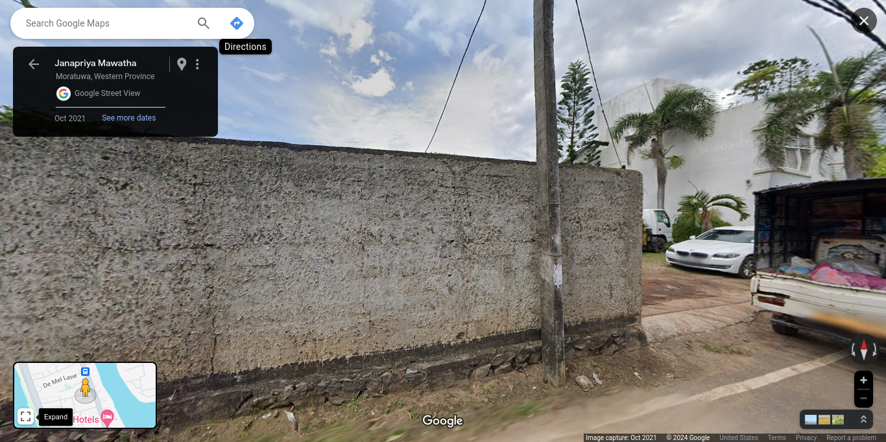

## Kochchikade South

**Kochchikade South** Grama Niladhari Division, **Colombo** Divisional Secretariat Division, **Colombo** District, **Western** Province

**Colombo Central** Polling Division, **Colombo** Electoral District

Population: 7,746 (2012)

(**LK-1103110**/)

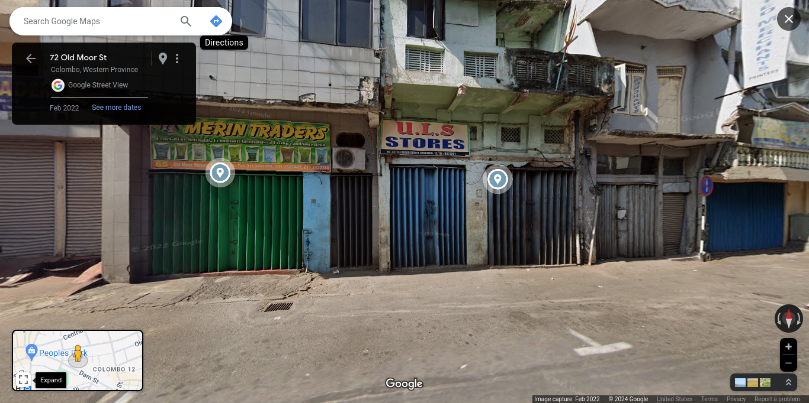

## Richmond Kanda

**Richmond Kanda** Grama Niladhari Division, **Galle Four Gravets** Divisional Secretariat Division, **Galle** District, **Southern** Province

**Galle** Polling Division, **Galle** Electoral District

Population: 940 (2012)

(**LK-3139115**/96E)

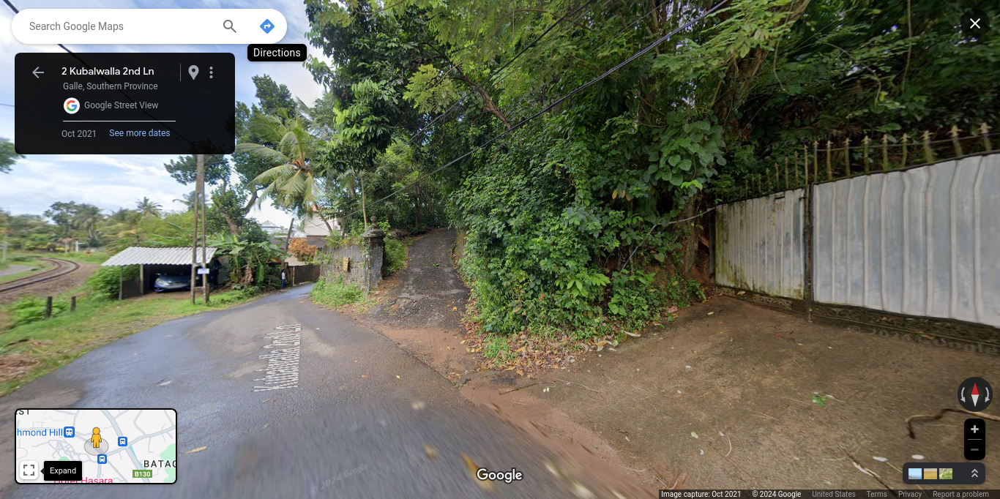

## Mahaoya

**Mahaoya** Grama Niladhari Division, **Mahaoya** Divisional Secretariat Division, **Ampara** District, **Eastern** Province

**Ampara** Polling Division, **Digamadulla** Electoral District

Population: 1,219 (2012)

(**LK-5209040**/144)

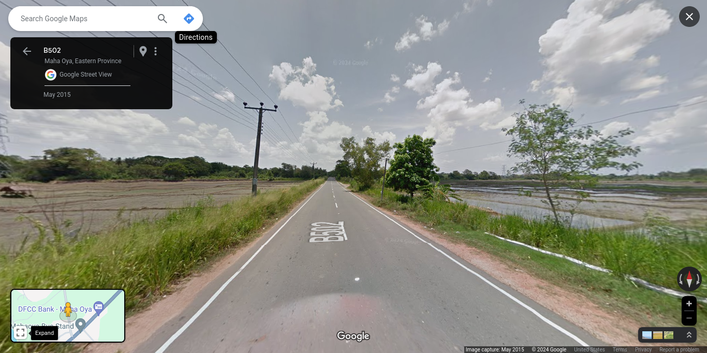

## Eliyadivulwewa

**Eliyadivulwewa** Grama Niladhari Division, **Thalawa** Divisional Secretariat Division, **Anuradhapura** District, **North Central** Province

**Mihinthale** Polling Division, **Anuradhapura** Electoral District

Population: 1,779 (2012)

(**LK-7148090**/388)

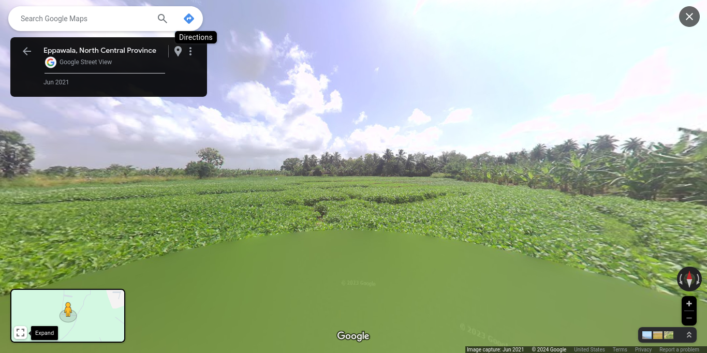

## Boralugoda

**Boralugoda** Grama Niladhari Division, **Kaduwela** Divisional Secretariat Division, **Colombo** District, **Western** Province

**Kaduwela** Polling Division, **Colombo** Electoral District

Population: 3,149 (2012)

(**LK-1109215**/489A)

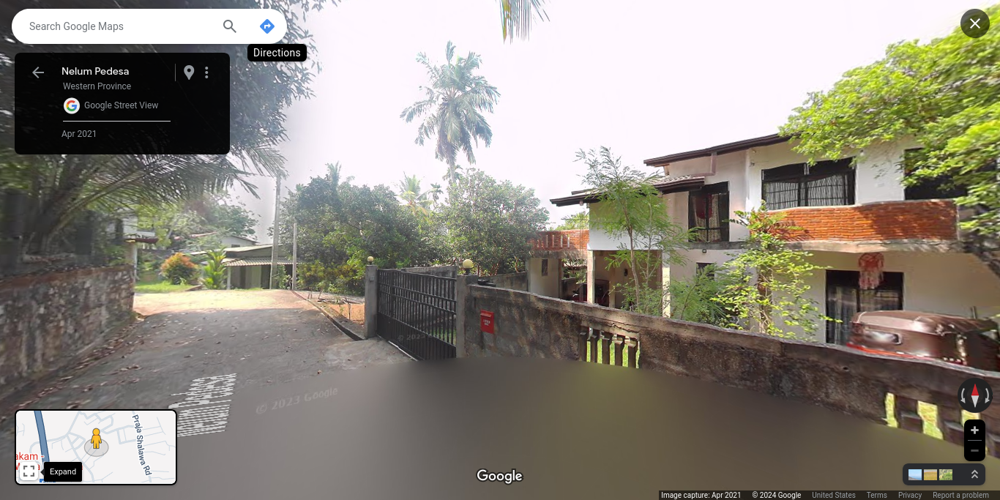

## Mihindupura

**Mihindupura** Grama Niladhari Division, **Beliatta** Divisional Secretariat Division, **Hambantota** District, **Southern** Province

**Beliatta** Polling Division, **Hambantota** Electoral District

Population: 734 (2012)

(**LK-3330300**/364)

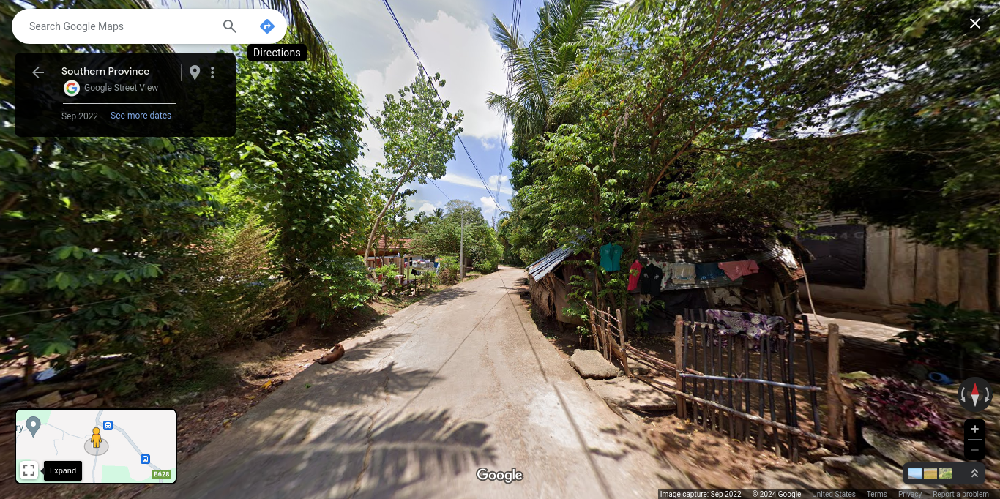

## Kalubovila

**Kalubovila** Grama Niladhari Division, **Dehiwala** Divisional Secretariat Division, **Colombo** District, **Western** Province

**Dehiwala** Polling Division, **Colombo** Electoral District

Population: 5,517 (2012)

(**LK-1130025**/538)

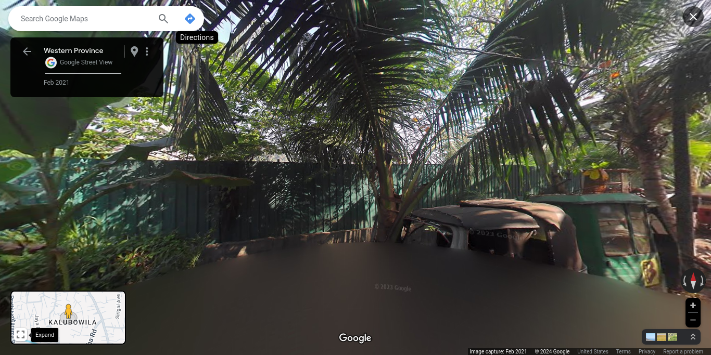

## Horakandawala

**Horakandawala** Grama Niladhari Division, **Padukka** Divisional Secretariat Division, **Colombo** District, **Western** Province

**Homagama** Polling Division, **Colombo** Electoral District

Population: 2,059 (2012)

(**LK-1118160**/464C)

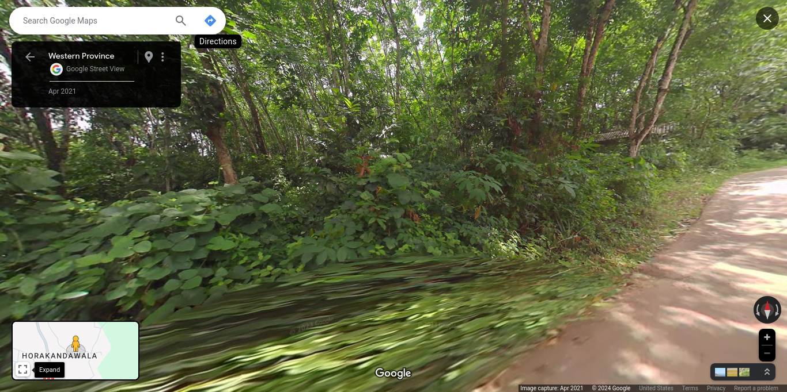

## Enderamulla East

**Enderamulla East** Grama Niladhari Division, **Mahara** Divisional Secretariat Division, **Gampaha** District, **Western** Province

**Mahara** Polling Division, **Gampaha** Electoral District

Population: 2,847 (2012)

(**LK-1233435**/255E)

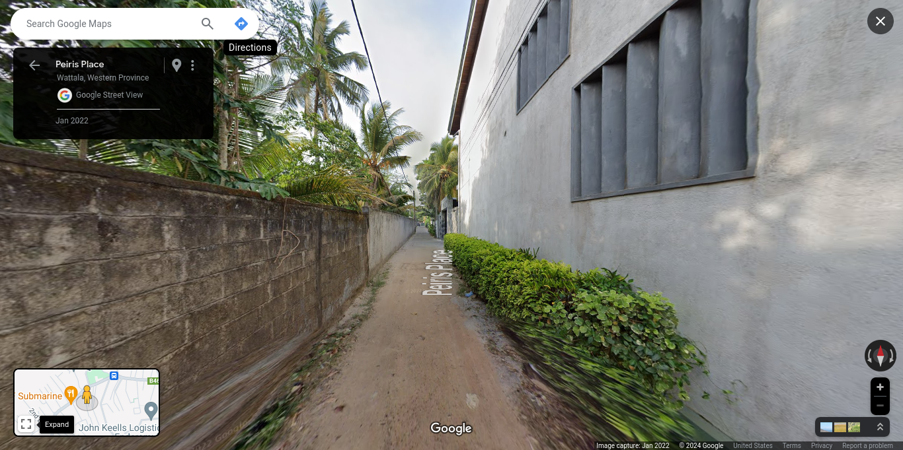

## Dutugemunu

**Dutugemunu** Grama Niladhari Division, **Dehiwala** Divisional Secretariat Division, **Colombo** District, **Western** Province

**Dehiwala** Polling Division, **Colombo** Electoral District

Population: 4,806 (2012)

(**LK-1130015**/537A)

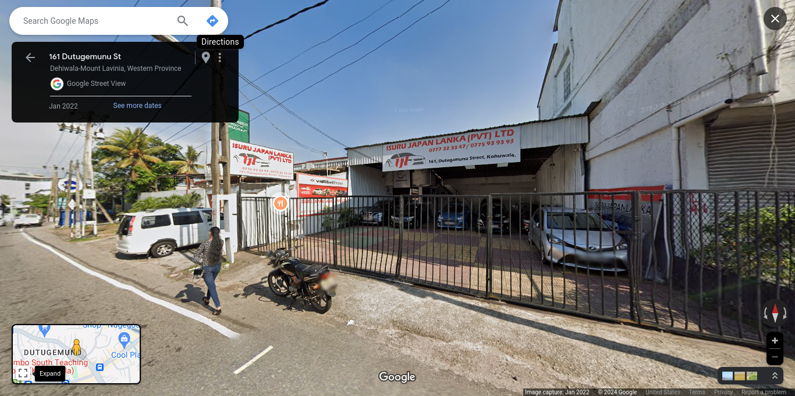

## Lewella

**Lewella** Grama Niladhari Division, **Kandy Four Gravets & Gangawata Korale** Divisional Secretariat Division, **Kandy** District, **Central** Province

**Senkadagala** Polling Division, **Kandy** Electoral District

Population: 1,778 (2012)

(**LK-2130125**/222)

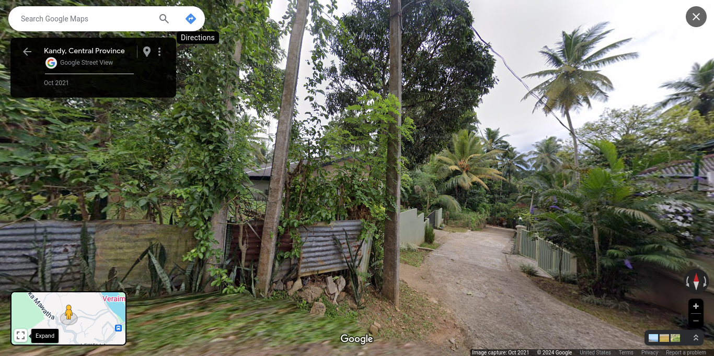

## Ampitiya South

**Ampitiya South** Grama Niladhari Division, **Kandy Four Gravets & Gangawata Korale** Divisional Secretariat Division, **Kandy** District, **Central** Province

**Senkadagala** Polling Division, **Kandy** Electoral District

Population: 1,705 (2012)

(**LK-2130225**/253)

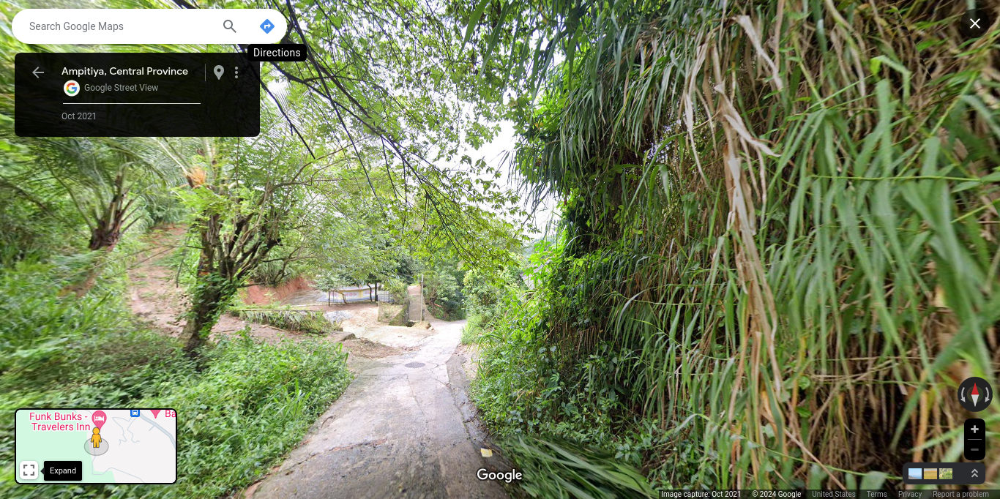

## Aluthwatta

**Aluthwatta** Grama Niladhari Division, **Chilaw** Divisional Secretariat Division, **Puttalam** District, **North Western** Province

**Chilaw** Polling Division, **Puttalam** Electoral District

Population: 1,582 (2012)

(**LK-6233090**/576)

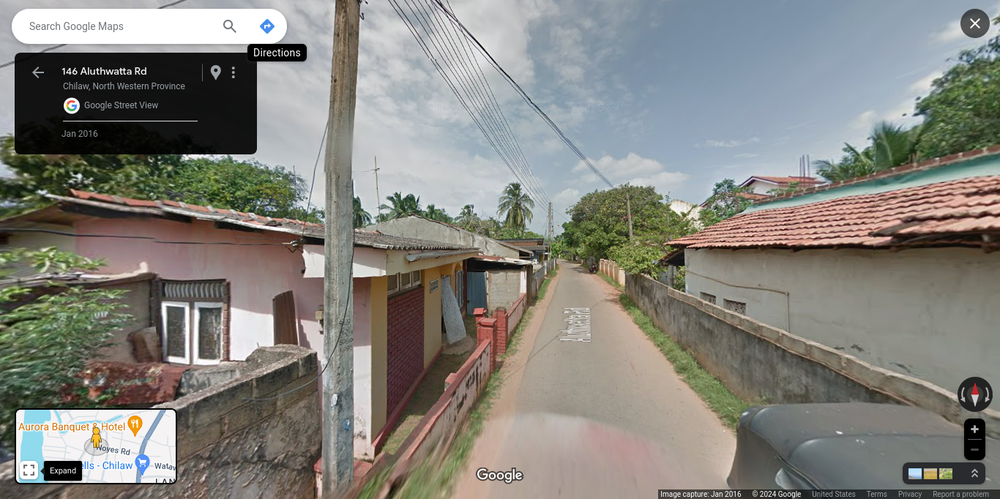

## Rathnapura Town West

**Rathnapura Town West** Grama Niladhari Division, **Ratnapura** Divisional Secretariat Division, **Ratnapura** District, **Sabaragamuwa** Province

**Ratnapura** Polling Division, **Ratnapura** Electoral District

Population: 1,106 (2012)

(**LK-9112200**/152F)

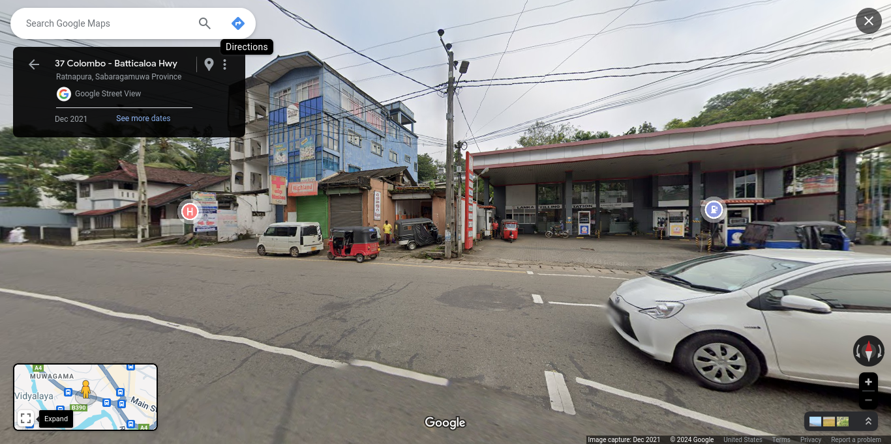

## Pattalagedara

**Pattalagedara** Grama Niladhari Division, **Attanagalla** Divisional Secretariat Division, **Gampaha** District, **Western** Province

**Attanagalla** Polling Division, **Gampaha** Electoral District

Population: 2,333 (2012)

(**LK-1227120**/328)

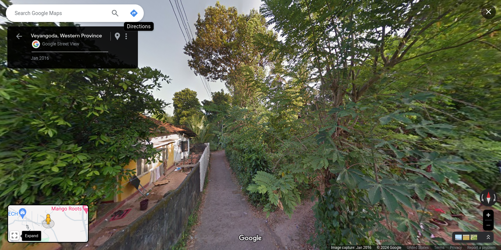

## Mambula

**Mambula** Grama Niladhari Division, **Seethawaka** Divisional Secretariat Division, **Colombo** District, **Western** Province

**Avissawella** Polling Division, **Colombo** Electoral District

Population: 1,128 (2012)

(**LK-1115245**/441)

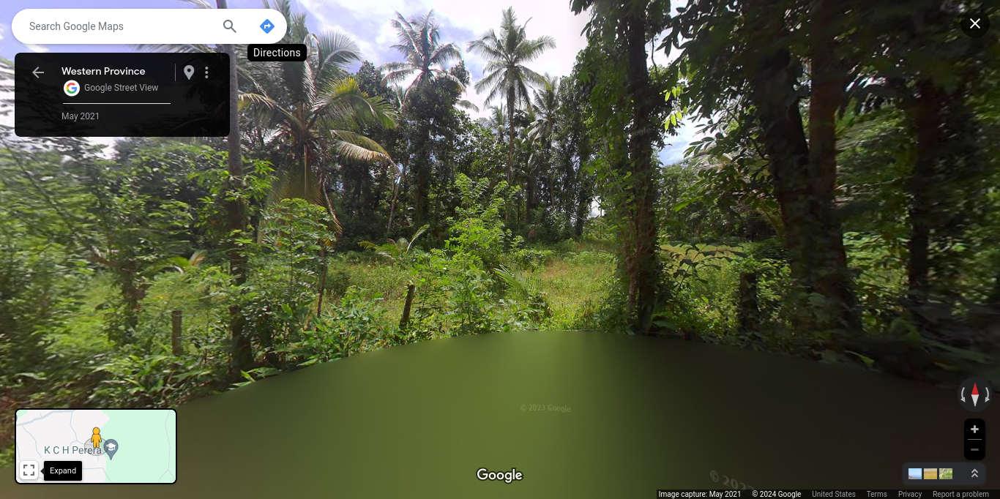

## Mahara

**Mahara** Grama Niladhari Division, **Eheliyagoda** Divisional Secretariat Division, **Ratnapura** District, **Sabaragamuwa** Province

**Eheliyagoda** Polling Division, **Ratnapura** Electoral District

Population: 660 (2012)

(**LK-9103135**/126)

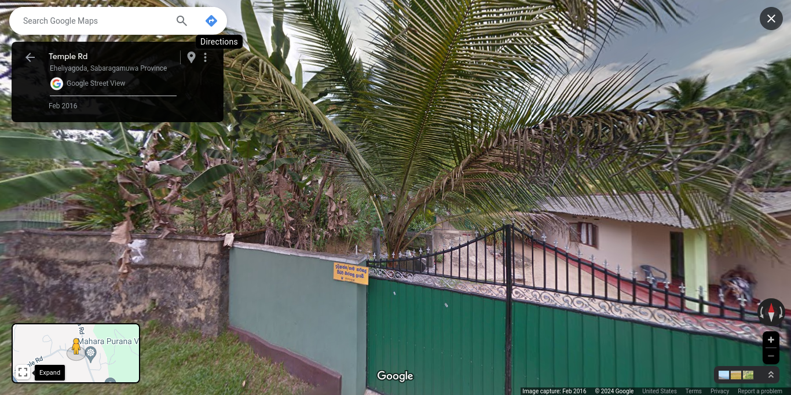

## Angulana North

**Angulana North** Grama Niladhari Division, **Moratuwa** Divisional Secretariat Division, **Colombo** District, **Western** Province

**Moratuwa** Polling Division, **Colombo** Electoral District

Population: 4,201 (2012)

(**LK-1133005**/547)

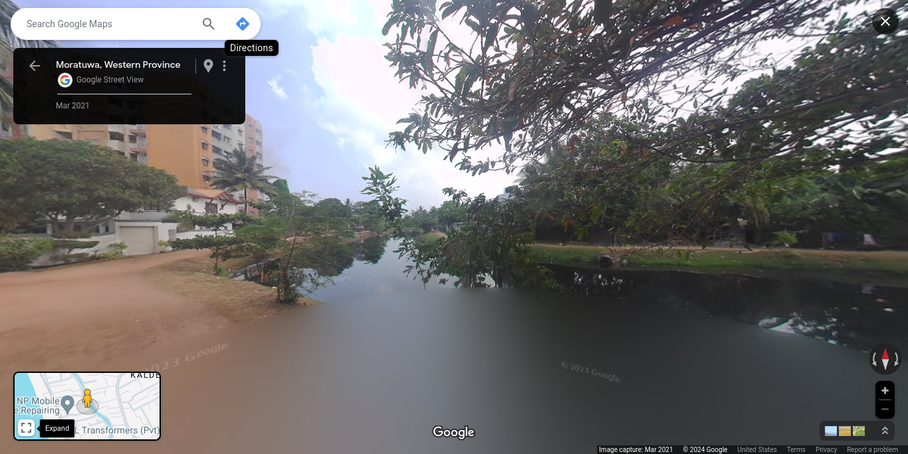

## Uda Bowala

**Uda Bowala** Grama Niladhari Division, **Kandy Four Gravets & Gangawata Korale** Divisional Secretariat Division, **Kandy** District, **Central** Province

**Senkadagala** Polling Division, **Kandy** Electoral District

Population: 4,127 (2012)

(**LK-2130200**/244)

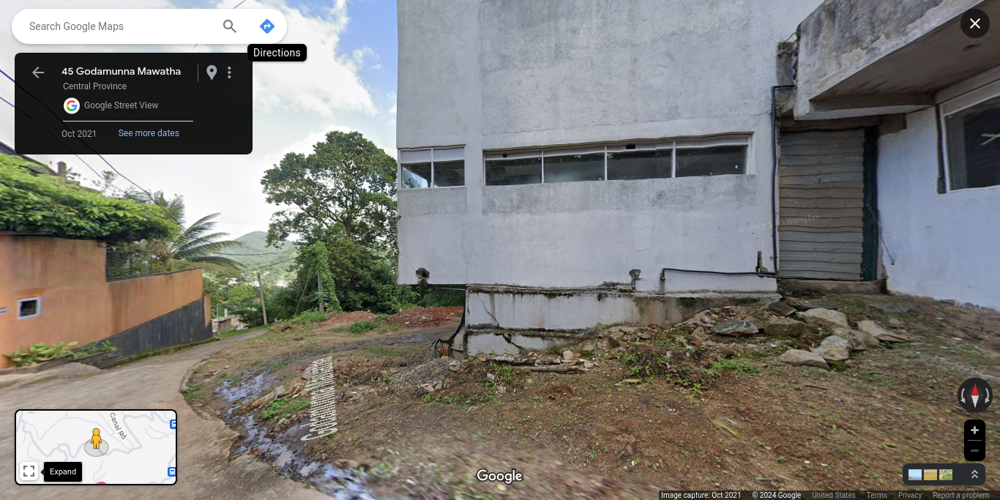

## Poorna Watta West

**Poorna Watta West** Grama Niladhari Division, **Kandy Four Gravets & Gangawata Korale** Divisional Secretariat Division, **Kandy** District, **Central** Province

**Mahanuwara** Polling Division, **Kandy** Electoral District

Population: 5,238 (2012)

(**LK-2130080**/240)

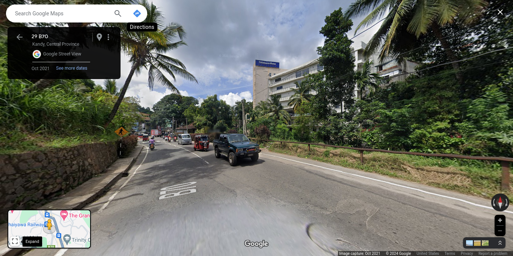

## Baswatta

**Baswatta** Grama Niladhari Division, **Bope-Poddala** Divisional Secretariat Division, **Galle** District, **Southern** Province

**Akmeemana** Polling Division, **Galle** Electoral District

Population: 960 (2012)

(**LK-3142045**/111D)

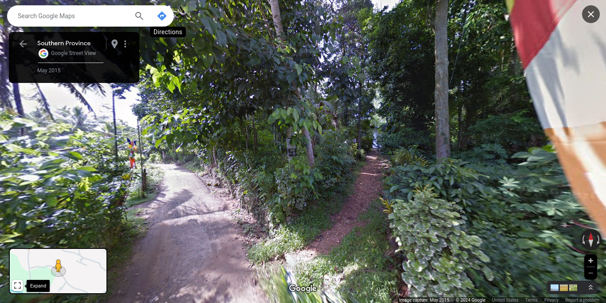

## Palangathure

**Palangathure** Grama Niladhari Division, **Negombo** Divisional Secretariat Division, **Gampaha** District, **Western** Province

**Negombo** Polling Division, **Gampaha** Electoral District

Population: 5,025 (2012)

(**LK-1203030**/75A)

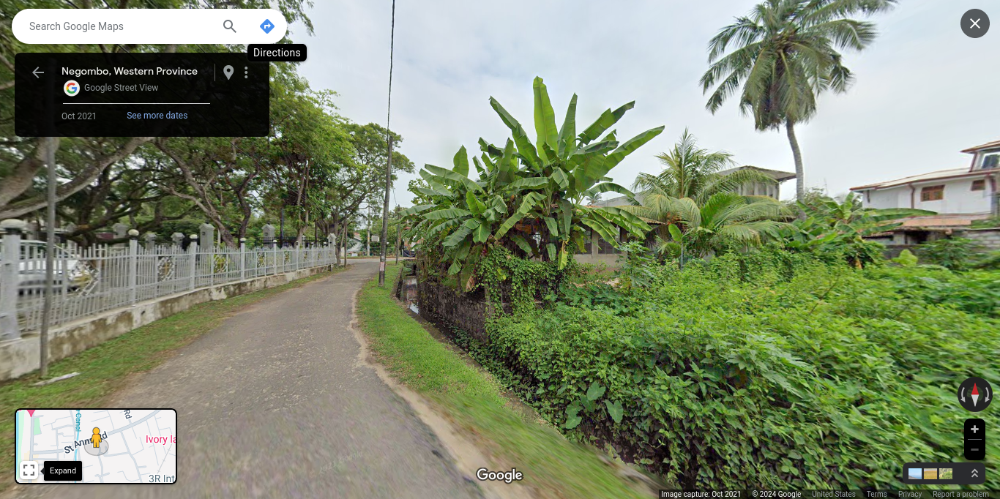

## Galmatta

**Galmatta** Grama Niladhari Division, **Mathugama** Divisional Secretariat Division, **Kalutara** District, **Western** Province

**Mathugama** Polling Division, **Kalutara** Electoral District

Population: 934 (2012)

(**LK-1330205**/774A)

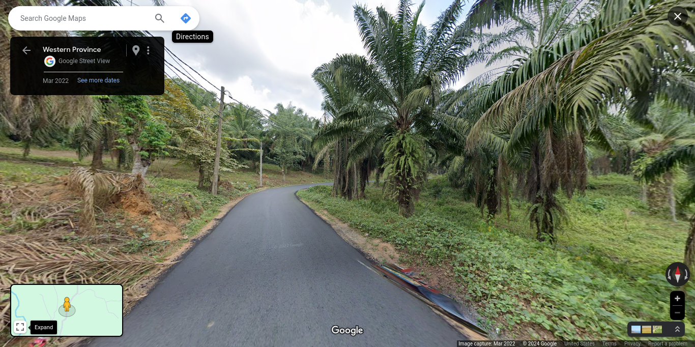

## Paranagampola

**Paranagampola** Grama Niladhari Division, **Kegalle** Divisional Secretariat Division, **Kegalle** District, **Sabaragamuwa** Province

**Kegalle** Polling Division, **Kegalle** Electoral District

Population: 2,030 (2012)

(**LK-9212060**/52C)

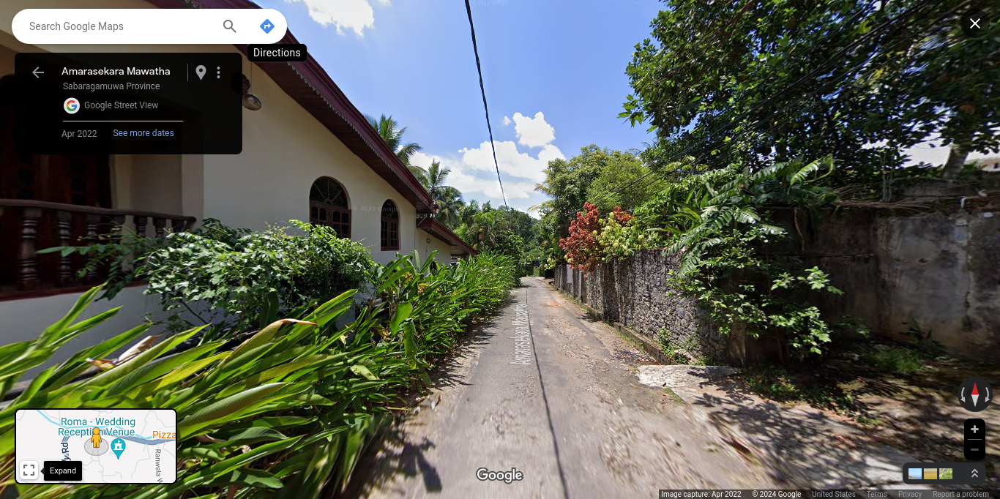

## Palathuduwa

**Palathuduwa** Grama Niladhari Division, **Tangalle** Divisional Secretariat Division, **Hambantota** District, **Southern** Province

**Tangalle** Polling Division, **Hambantota** Electoral District

Population: 627 (2012)

(**LK-3333110**/267)

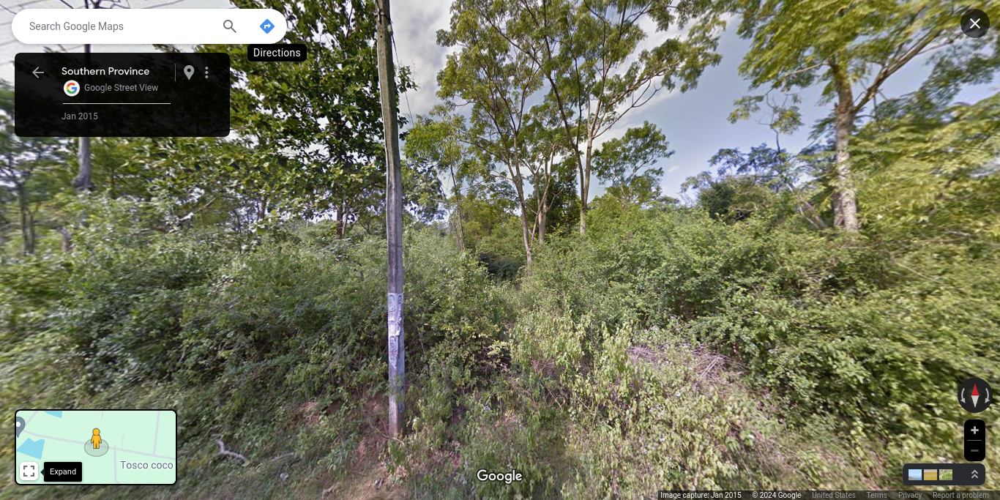

## Kattuwa

**Kattuwa** Grama Niladhari Division, **Negombo** Divisional Secretariat Division, **Gampaha** District, **Western** Province

**Negombo** Polling Division, **Gampaha** Electoral District

Population: 4,921 (2012)

(**LK-1203045**/75)

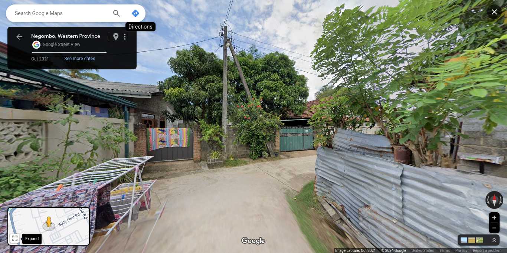

## Galagedara

**Galagedara** Grama Niladhari Division, **Panduwasnuwara East** Divisional Secretariat Division, **Kurunegala** District, **North Western** Province

**Panduwasnuwara** Polling Division, **Kurunegala** Electoral District

Population: 730 (2012)

(**LK-6148145**/1381)

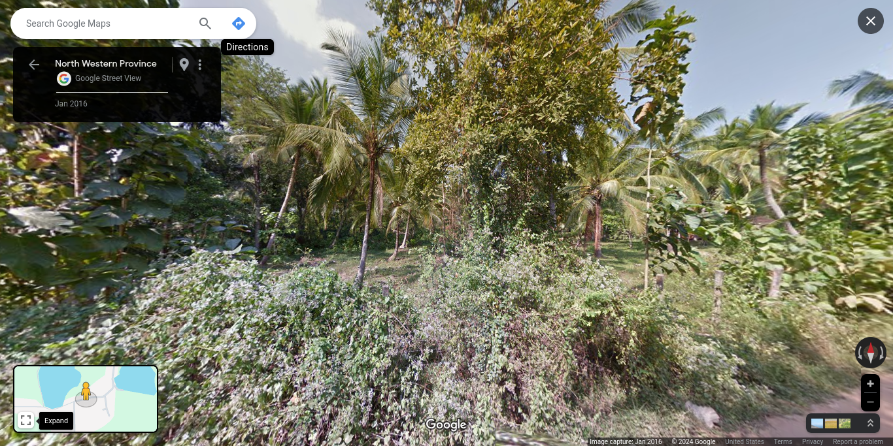

## Ariyalai East

**Ariyalai East** Grama Niladhari Division, **Nallur** Divisional Secretariat Division, **Jaffna** District, **Northern** Province

**Nallur** Polling Division, **Jaffna** Electoral District

Population: 1,098 (2012)

(**LK-4133010**/J/90)

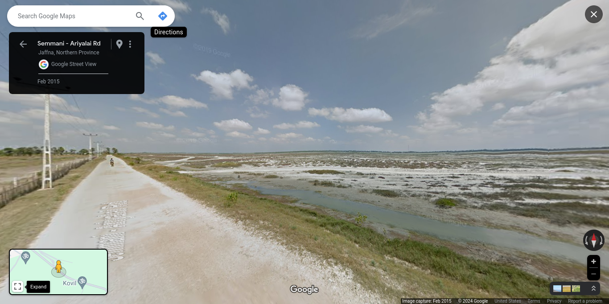

## Katukenda West

**Katukenda West** Grama Niladhari Division, **Dankotuwa** Divisional Secretariat Division, **Puttalam** District, **North Western** Province

**Wennappuwa** Polling Division, **Puttalam** Electoral District

Population: 564 (2012)

(**LK-6248120**/475A)

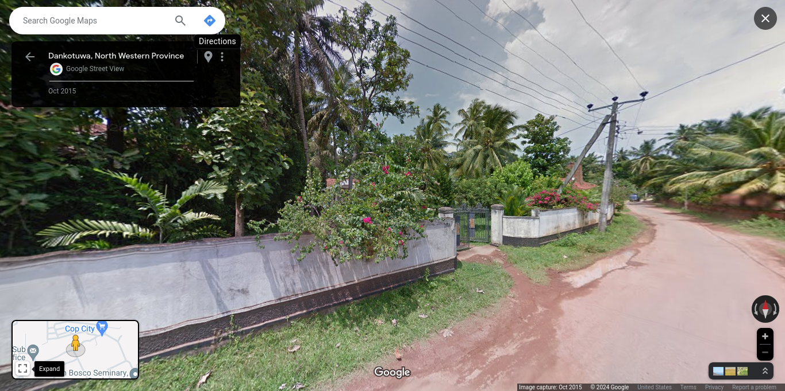

## Ninthavur 18

**Ninthavur 18** Grama Niladhari Division, **Ninthavur** Divisional Secretariat Division, **Ampara** District, **Eastern** Province

**Pothuvil** Polling Division, **Digamadulla** Electoral District

Population: 659 (2012)

(**LK-5230065**/37D)

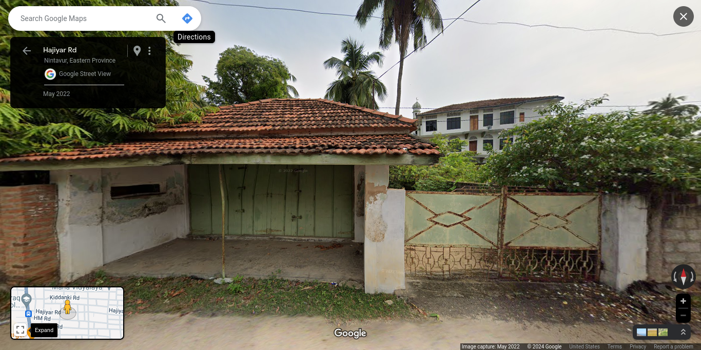

## Oddamavadi 02

**Oddamavadi 02** Grama Niladhari Division, **Koralai Pattu  West (Oddamavadi)** Divisional Secretariat Division, **Batticaloa** District, **Eastern** Province

**Kalkudah** Polling Division, **Batticaloa** Electoral District

Population: 2,238 (2012)

(**LK-5106020**/208C)

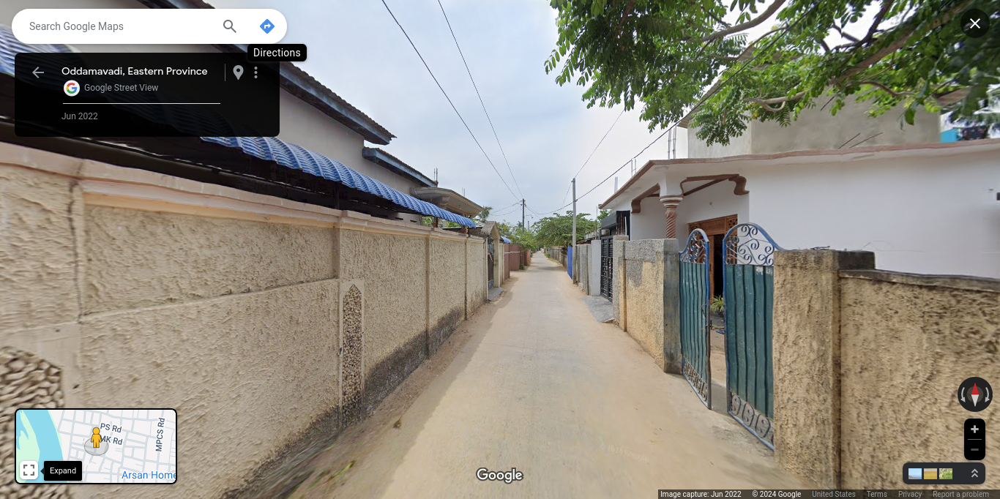

## Weeragaswewa

**Weeragaswewa** Grama Niladhari Division, **Angunakolapelessa** Divisional Secretariat Division, **Hambantota** District, **Southern** Province

**Tangalle** Polling Division, **Hambantota** Electoral District

Population: 511 (2012)

(**LK-3318125**/210)

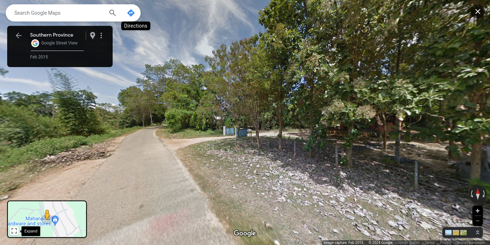

## Grandpass South

**Grandpass South** Grama Niladhari Division, **Colombo** Divisional Secretariat Division, **Colombo** District, **Western** Province

**Colombo Central** Polling Division, **Colombo** Electoral District

Population: 17,588 (2012)

(**LK-1103075**/)

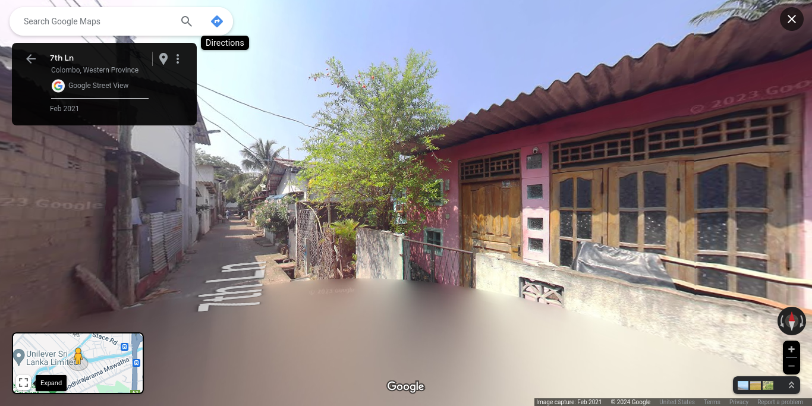

## Manjanthoduvai South

**Manjanthoduvai South** Grama Niladhari Division, **Manmunai North** Divisional Secretariat Division, **Batticaloa** District, **Eastern** Province

**Batticaloa** Polling Division, **Batticaloa** Electoral District

Population: 3,191 (2012)

(**LK-5118240**/168A)

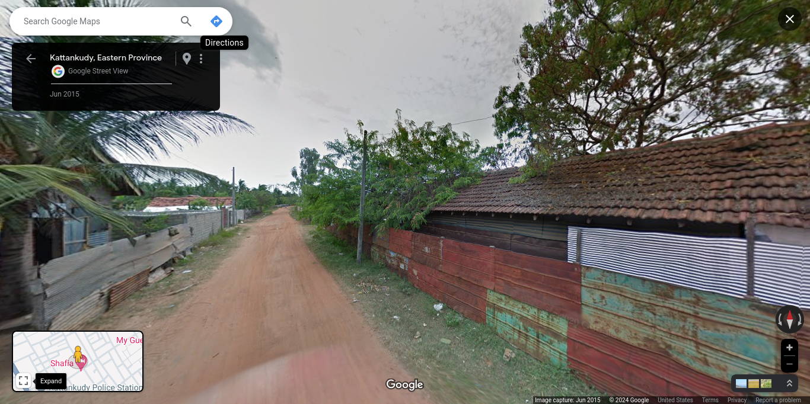

## Kalatuwakanda

**Kalatuwakanda** Grama Niladhari Division, **Weligepola** Divisional Secretariat Division, **Ratnapura** District, **Sabaragamuwa** Province

**Rakwana** Polling Division, **Ratnapura** Electoral District

Population: 709 (2012)

(**LK-9145115**/220B)

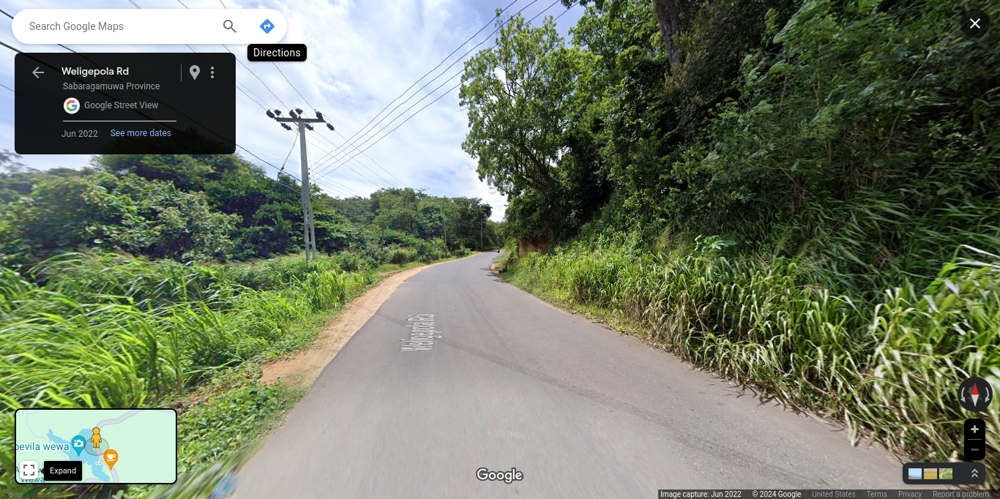

## Sooriyagahapathana Ihala

**Sooriyagahapathana Ihala** Grama Niladhari Division, **Walapane** Divisional Secretariat Division, **Nuwara Eliya** District, **Central** Province

**Walapane** Polling Division, **Nuwara-Eliya** Electoral District

Population: 444 (2012)

(**LK-2309605**/533G)

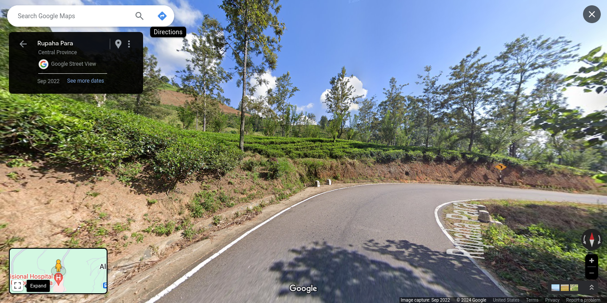

## Hendeniya West

**Hendeniya West** Grama Niladhari Division, **Udunuwara** Divisional Secretariat Division, **Kandy** District, **Central** Province

**Udunuwara** Polling Division, **Kandy** Electoral District

Population: 1,003 (2012)

(**LK-2139125**/9)

## Dedigamuwa

**Dedigamuwa** Grama Niladhari Division, **Kaduwela** Divisional Secretariat Division, **Colombo** District, **Western** Province

**Kaduwela** Polling Division, **Colombo** Electoral District

Population: 2,105 (2012)

(**LK-1109100**/480A)

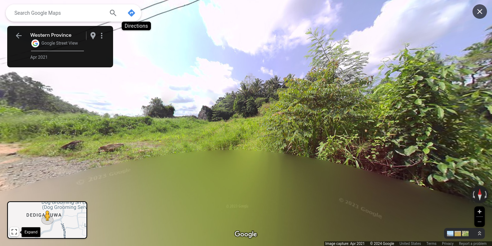

## Palapotha East

**Palapotha East** Grama Niladhari Division, **Beliatta** Divisional Secretariat Division, **Hambantota** District, **Southern** Province

**Beliatta** Polling Division, **Hambantota** Electoral District

Population: 930 (2012)

(**LK-3330305**/363)

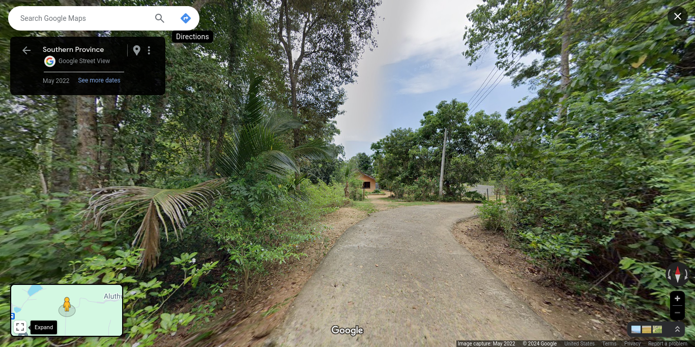

## Deiyannewela

**Deiyannewela** Grama Niladhari Division, **Kandy Four Gravets & Gangawata Korale** Divisional Secretariat Division, **Kandy** District, **Central** Province

**Mahanuwara** Polling Division, **Kandy** Electoral District

Population: 2,412 (2012)

(**LK-2130150**/261)

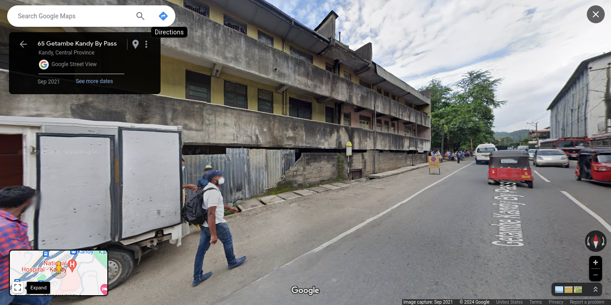

## Walapane

**Walapane** Grama Niladhari Division, **Walapane** Divisional Secretariat Division, **Nuwara Eliya** District, **Central** Province

**Walapane** Polling Division, **Nuwara-Eliya** Electoral District

Population: 1,161 (2012)

(**LK-2309265**/515B)

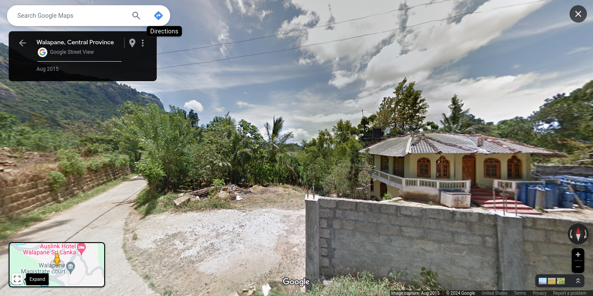

## Kudahakapola South

**Kudahakapola South** Grama Niladhari Division, **Ja-Ela** Divisional Secretariat Division, **Gampaha** District, **Western** Province

**Ja Ela** Polling Division, **Gampaha** Electoral District

Population: 1,612 (2012)

(**LK-1221040**/195)

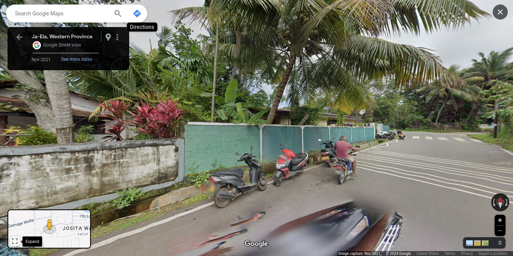

## Kudawella North

**Kudawella North** Grama Niladhari Division, **Tangalle** Divisional Secretariat Division, **Hambantota** District, **Southern** Province

**Beliatta** Polling Division, **Hambantota** Electoral District

Population: 1,098 (2012)

(**LK-3333330**/289)

## Karalliyadda

**Karalliyadda** Grama Niladhari Division, **Hanguranketha** Divisional Secretariat Division, **Nuwara Eliya** District, **Central** Province

**Hanguranketha** Polling Division, **Nuwara-Eliya** Electoral District

Population: 626 (2012)

(**LK-2306030**/485)

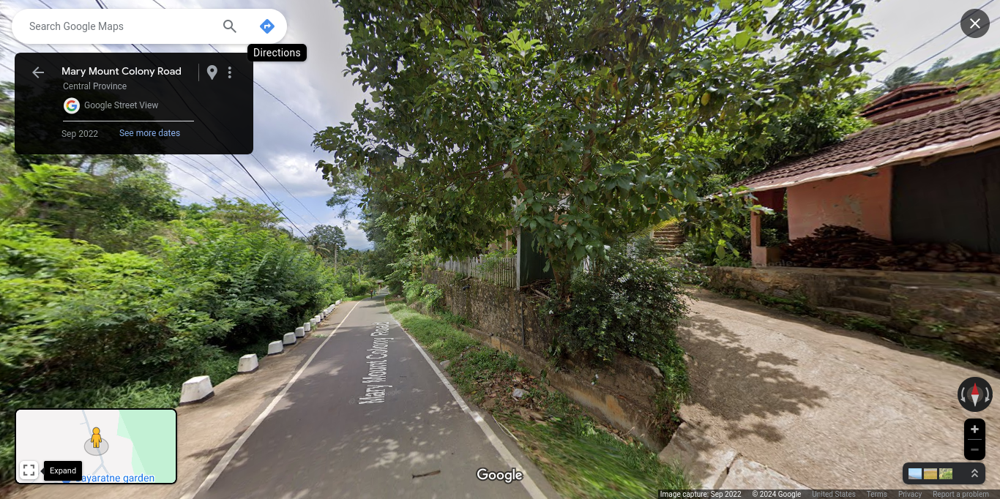

## Kiribathgoda

**Kiribathgoda** Grama Niladhari Division, **Kelaniya** Divisional Secretariat Division, **Gampaha** District, **Western** Province

**Kelaniya** Polling Division, **Gampaha** Electoral District

Population: 3,302 (2012)

(**LK-1236025**/267A)

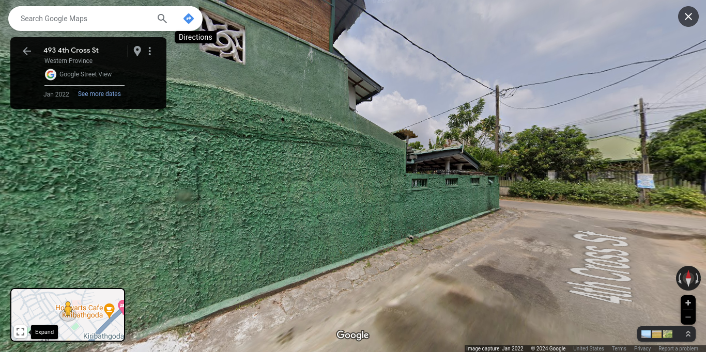

## Kadigawa Track3

**Kadigawa Track3** Grama Niladhari Division, **Rasnayakapura** Divisional Secretariat Division, **Kurunegala** District, **North Western** Province

**Nikaweratiya** Polling Division, **Kurunegala** Electoral District

Population: 943 (2012)

(**LK-6118130**/272)

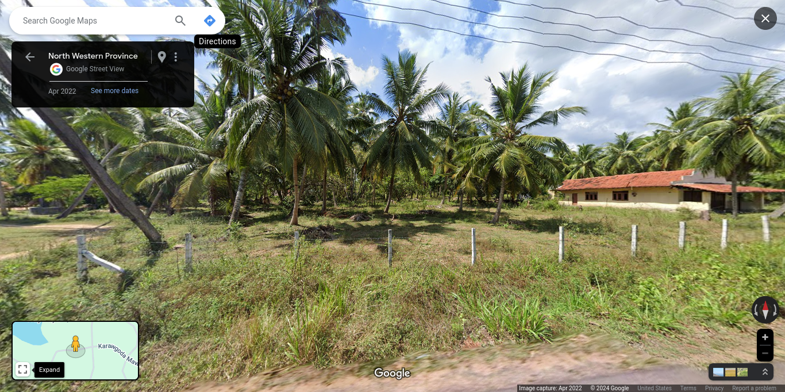

## Thethathivu North

**Thethathivu North** Grama Niladhari Division, **Manmunai South & Eruvil pattu** Divisional Secretariat Division, **Batticaloa** District, **Eastern** Province

**Paddiruppu** Polling Division, **Batticaloa** Electoral District

Population: 1,169 (2012)

(**LK-5136030**/122)

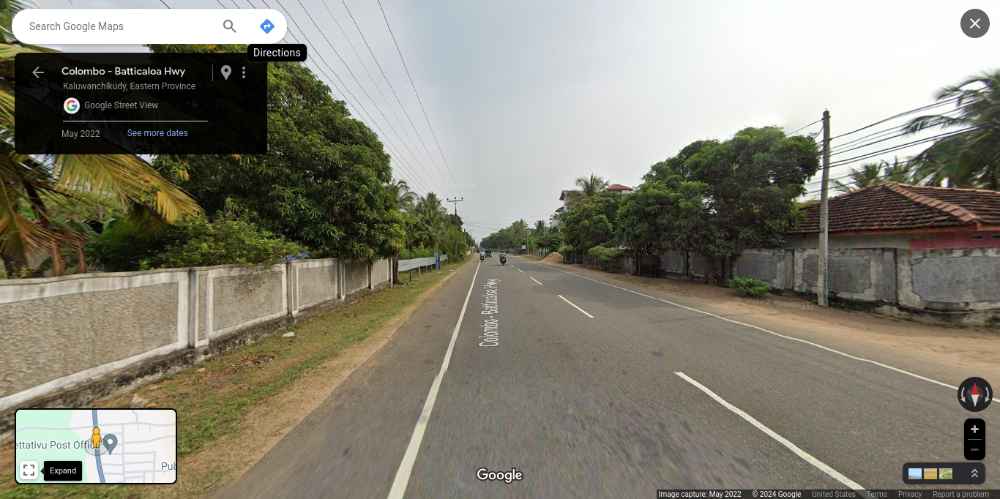

## Kalutara South A

**Kalutara South A** Grama Niladhari Division, **Kalutara** Divisional Secretariat Division, **Kalutara** District, **Western** Province

**Kalutara** Polling Division, **Kalutara** Electoral District

Population: 1,522 (2012)

(**LK-1321330**/725A)

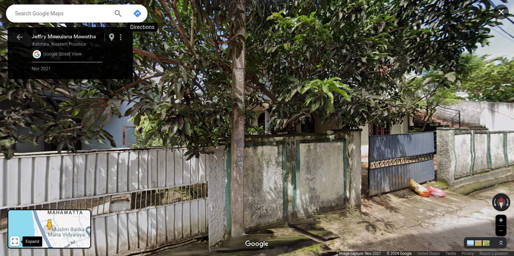

## Sooriyapaluwa East

**Sooriyapaluwa East** Grama Niladhari Division, **Mahara** Divisional Secretariat Division, **Gampaha** District, **Western** Province

**Mahara** Polling Division, **Gampaha** Electoral District

Population: 4,970 (2012)

(**LK-1233285**/245B)

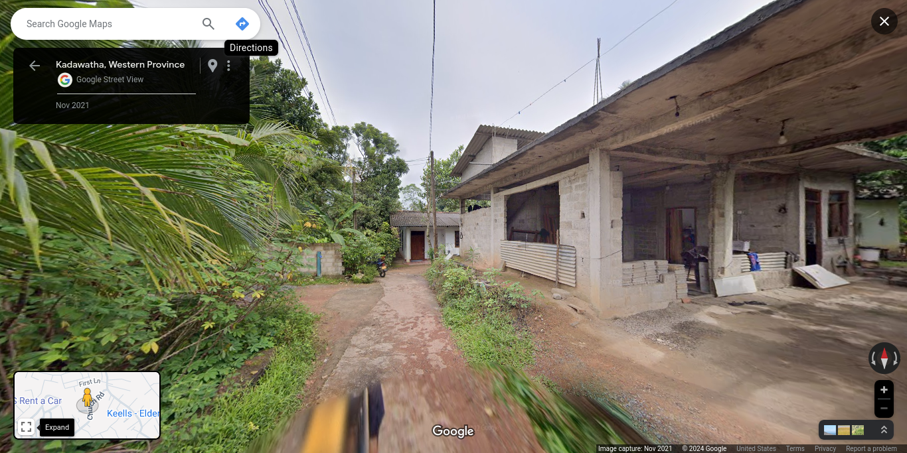

## Davugalagama

**Davugalagama** Grama Niladhari Division, **Kalawana** Divisional Secretariat Division, **Ratnapura** District, **Sabaragamuwa** Province

**Kalawana** Polling Division, **Ratnapura** Electoral District

Population: 1,839 (2012)

(**LK-9133060**/196F)

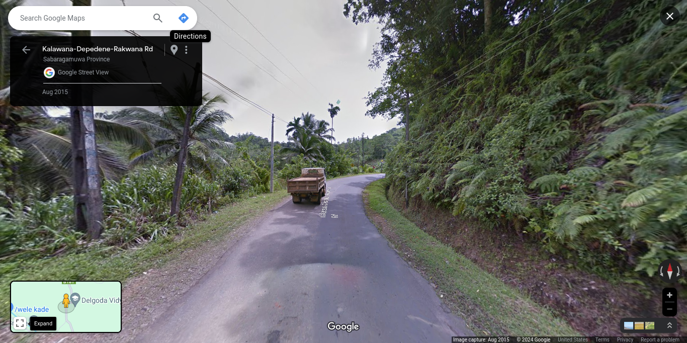

## Kahagalla

**Kahagalla** Grama Niladhari Division, **Bentota** Divisional Secretariat Division, **Galle** District, **Southern** Province

**Bentara Elpitiya** Polling Division, **Galle** Electoral District

Population: 662 (2012)

(**LK-3103045**/5A)

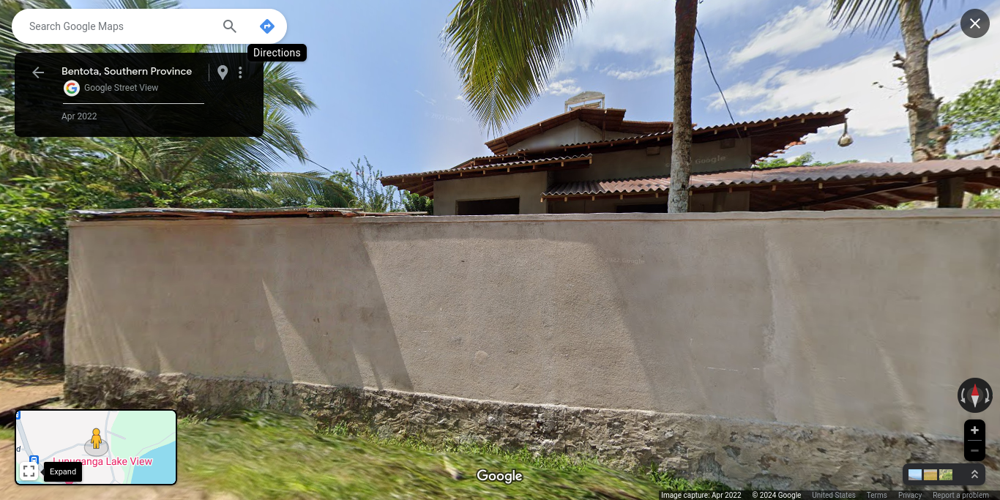

## Bellanvila

**Bellanvila** Grama Niladhari Division, **Kesbewa** Divisional Secretariat Division, **Colombo** District, **Western** Province

**Kesbewa** Polling Division, **Colombo** Electoral District

Population: 3,413 (2012)

(**LK-1136025**/535A)

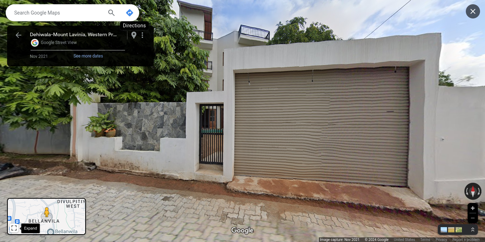

## Dedigamuwa

**Dedigamuwa** Grama Niladhari Division, **Kaduwela** Divisional Secretariat Division, **Colombo** District, **Western** Province

**Kaduwela** Polling Division, **Colombo** Electoral District

Population: 2,105 (2012)

(**LK-1109100**/480A)

## Dellabada

**Dellabada** Grama Niladhari Division, **Elapatha** Divisional Secretariat Division, **Ratnapura** District, **Sabaragamuwa** Province

**Nivithigala** Polling Division, **Ratnapura** Electoral District

Population: 1,300 (2012)

(**LK-9127045**/188)

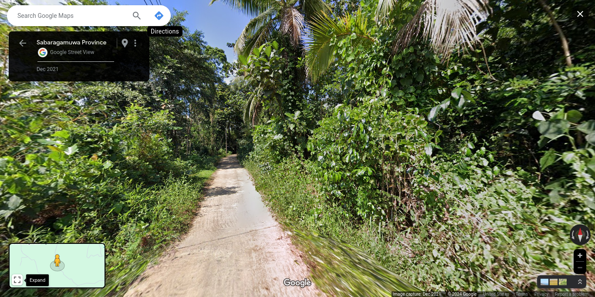

## Horethuduwa Central

**Horethuduwa Central** Grama Niladhari Division, **Panadura** Divisional Secretariat Division, **Kalutara** District, **Western** Province

**Panadura** Polling Division, **Kalutara** Electoral District

Population: 1,312 (2012)

(**LK-1303015**/670C)

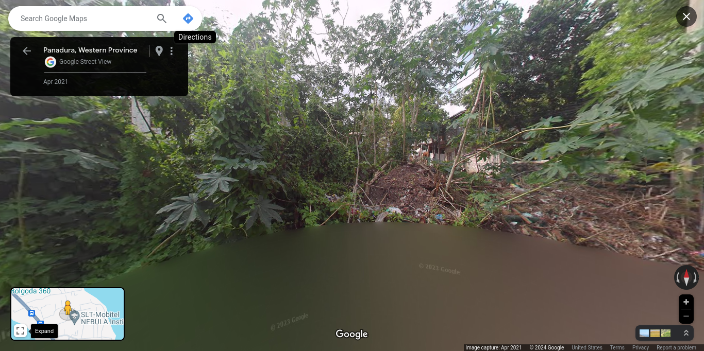

## Imbulgolla

**Imbulgolla** Grama Niladhari Division, **Ambanganga Korale** Divisional Secretariat Division, **Matale** District, **Central** Province

**Laggala** Polling Division, **Matale** Electoral District

Population: 544 (2012)

(**LK-2221030**/E381B)

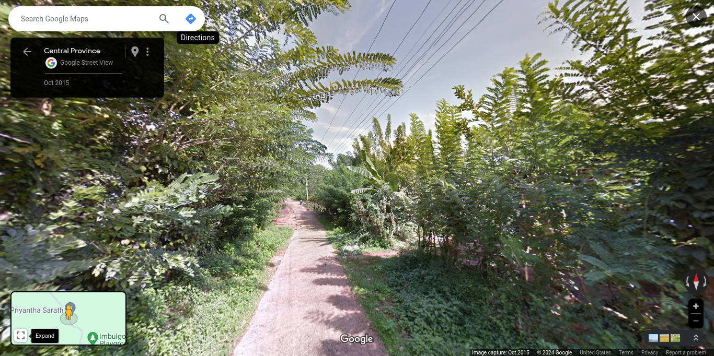

## Katubedda

**Katubedda** Grama Niladhari Division, **Moratuwa** Divisional Secretariat Division, **Colombo** District, **Western** Province

**Moratuwa** Polling Division, **Colombo** Electoral District

Population: 10,596 (2012)

(**LK-1133090**/551)

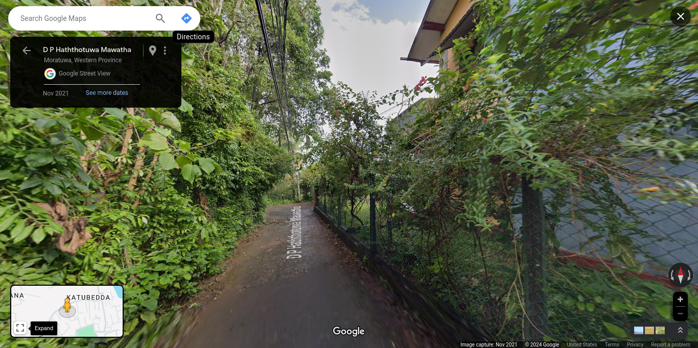

## Balayawewa

**Balayawewa** Grama Niladhari Division, **Padaviya** Divisional Secretariat Division, **Anuradhapura** District, **North Central** Province

**Medawachchiya** Polling Division, **Anuradhapura** Electoral District

Population: 940 (2012)

(**LK-7103045**/15)

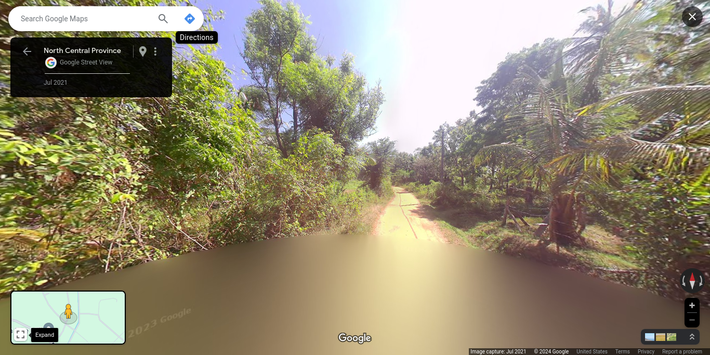

## Doluwa

**Doluwa** Grama Niladhari Division, **Doluwa** Divisional Secretariat Division, **Kandy** District, **Central** Province

**Gampola** Polling Division, **Kandy** Electoral District

Population: 953 (2012)

(**LK-2142070**/1155)

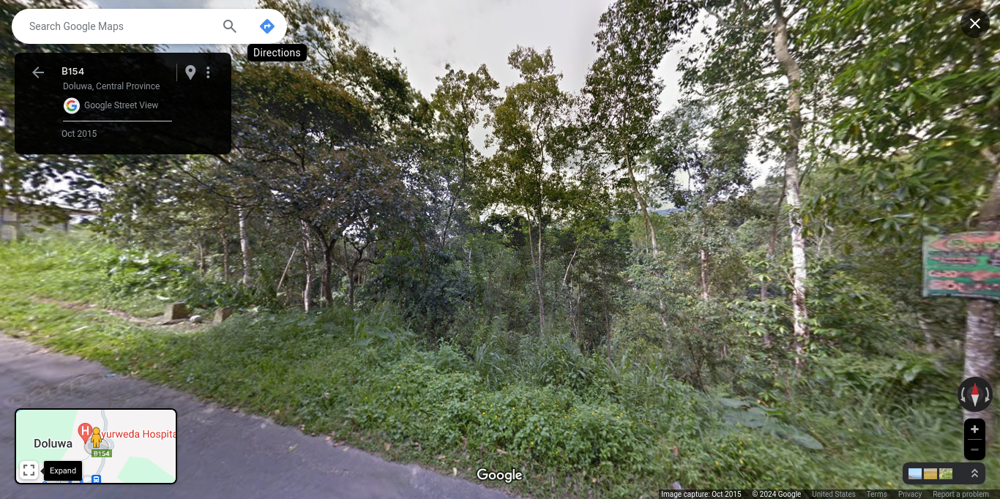

## Dombawela

**Dombawela** Grama Niladhari Division, **Matale** Divisional Secretariat Division, **Matale** District, **Central** Province

**Matale** Polling Division, **Matale** Electoral District

Population: 968 (2012)

(**LK-2218060**/E329)

## Walapane

**Walapane** Grama Niladhari Division, **Walapane** Divisional Secretariat Division, **Nuwara Eliya** District, **Central** Province

**Walapane** Polling Division, **Nuwara-Eliya** Electoral District

Population: 1,161 (2012)

(**LK-2309265**/515B)

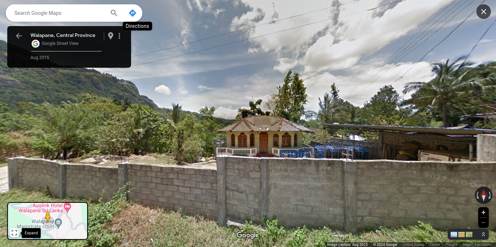

## Galambalama

**Galambalama** Grama Niladhari Division, **Medadumbara** Divisional Secretariat Division, **Kandy** District, **Central** Province

**Teldeniya** Polling Division, **Kandy** Electoral District

Population: 818 (2012)

(**LK-2124355**/831)

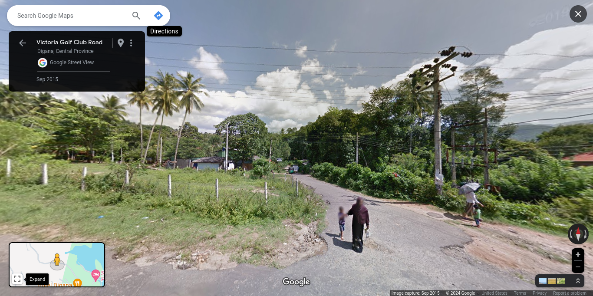

## Kittampahuwa

**Kittampahuwa** Grama Niladhari Division, **Kolonnawa** Divisional Secretariat Division, **Colombo** District, **Western** Province

**Kolonnawa** Polling Division, **Colombo** Electoral District

Population: 5,761 (2012)

(**LK-1106045**/508)

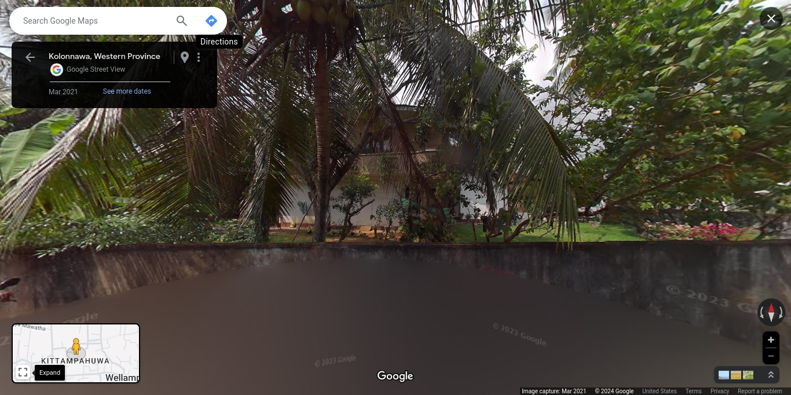

## Singhapura

**Singhapura** Grama Niladhari Division, **Kolonnawa** Divisional Secretariat Division, **Colombo** District, **Western** Province

**Kolonnawa** Polling Division, **Colombo** Electoral District

Population: 4,078 (2012)

(**LK-1106120**/512B)

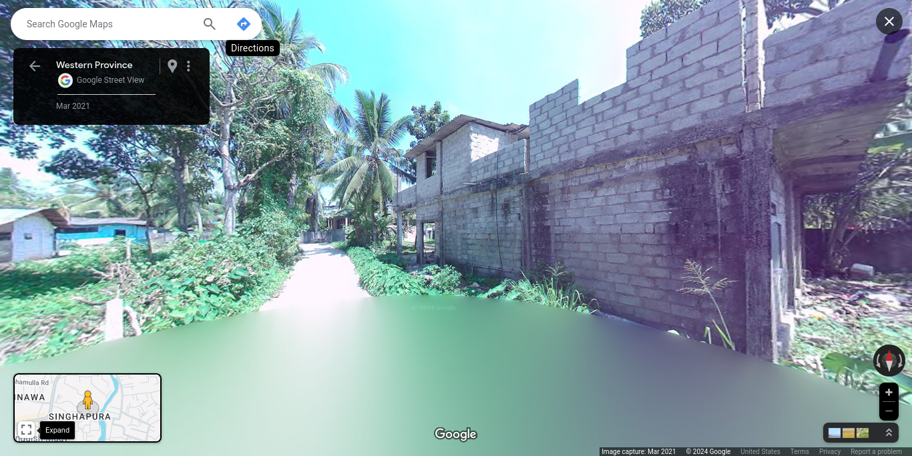

## Pitawalawatta

**Pitawalawatta** Grama Niladhari Division, **Udunuwara** Divisional Secretariat Division, **Kandy** District, **Central** Province

**Udunuwara** Polling Division, **Kandy** Electoral District

Population: 1,065 (2012)

(**LK-2139550**/43)

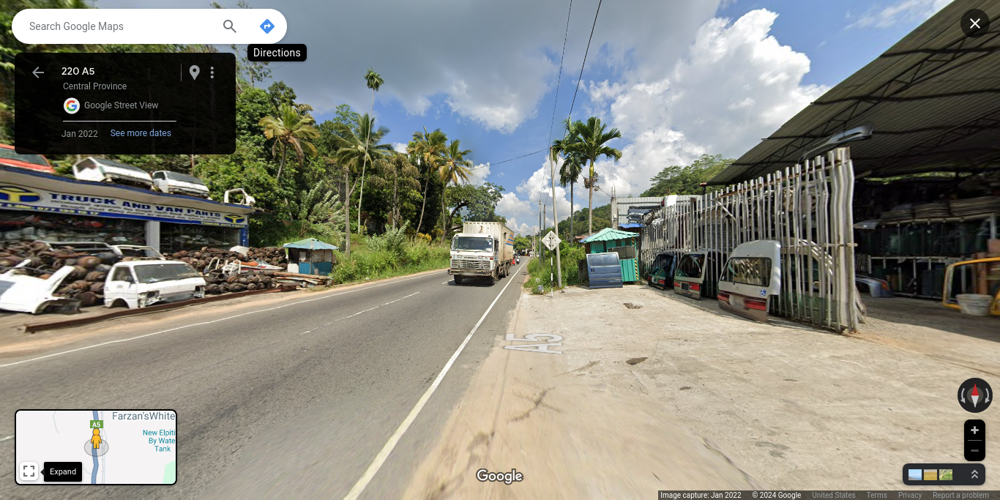

## Nalagama East

**Nalagama East** Grama Niladhari Division, **Tangalle** Divisional Secretariat Division, **Hambantota** District, **Southern** Province

**Beliatta** Polling Division, **Hambantota** Electoral District

Population: 414 (2012)

(**LK-3333200**/301)

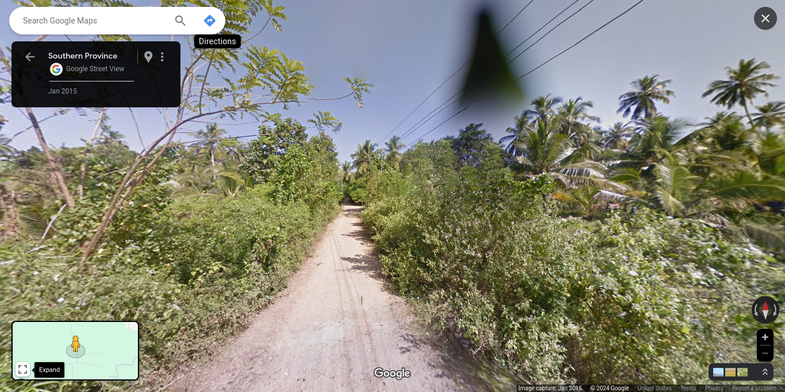

## Peellawatta

**Peellawatta** Grama Niladhari Division, **Minuwangoda** Divisional Secretariat Division, **Gampaha** District, **Western** Province

**Minuwangoda** Polling Division, **Gampaha** Electoral District

Population: 1,718 (2012)

(**LK-1215145**/123/1)

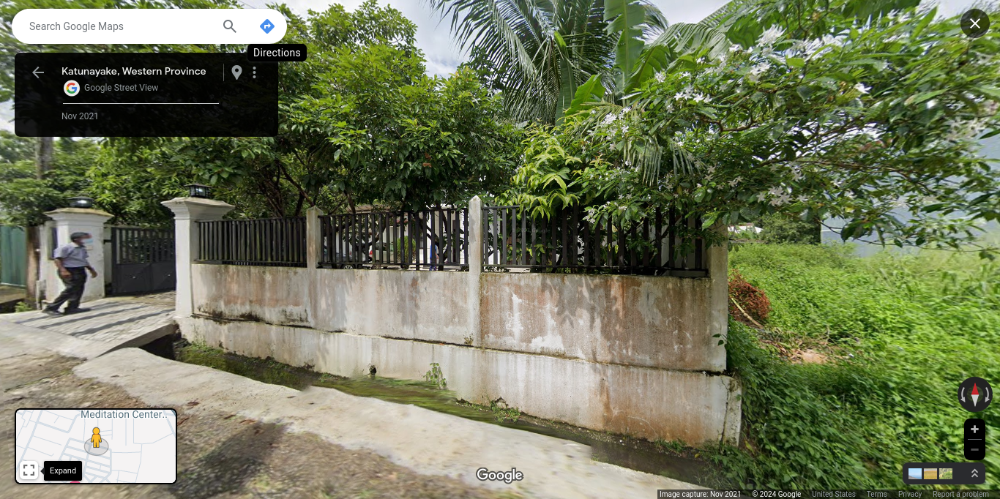

## Rammuthugala

**Rammuthugala** Grama Niladhari Division, **Mahara** Divisional Secretariat Division, **Gampaha** District, **Western** Province

**Mahara** Polling Division, **Gampaha** Electoral District

Population: 3,048 (2012)

(**LK-1233295**/287A)

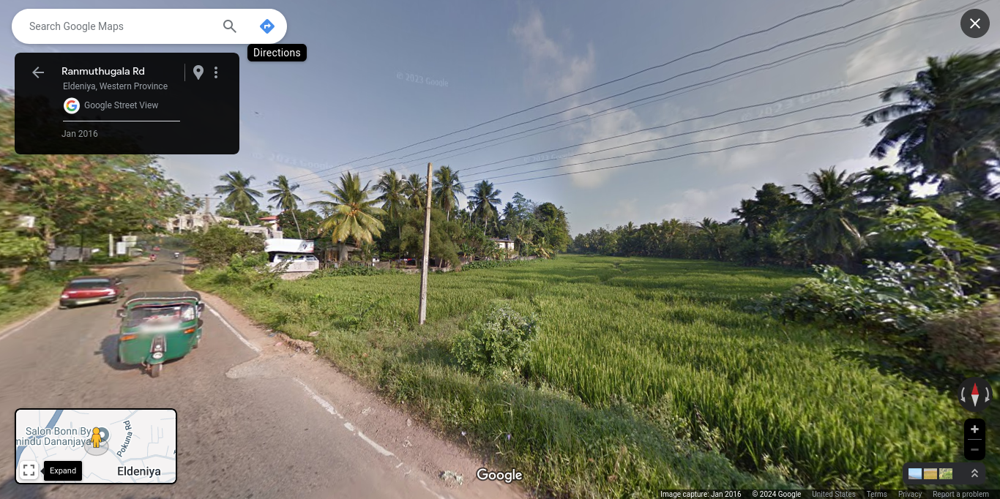

## Wanduramulla East

**Wanduramulla East** Grama Niladhari Division, **Bandaragama** Divisional Secretariat Division, **Kalutara** District, **Western** Province

**Bandaragama** Polling Division, **Kalutara** Electoral District

Population: 2,051 (2012)

(**LK-1306120**/688C)

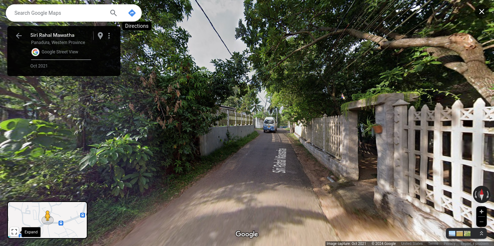

## Karaitheevu 03

**Karaitheevu 03** Grama Niladhari Division, **Karaitheevu** Divisional Secretariat Division, **Ampara** District, **Eastern** Province

**Pothuvil** Polling Division, **Digamadulla** Electoral District

Population: 402 (2012)

(**LK-5227030**/45A)

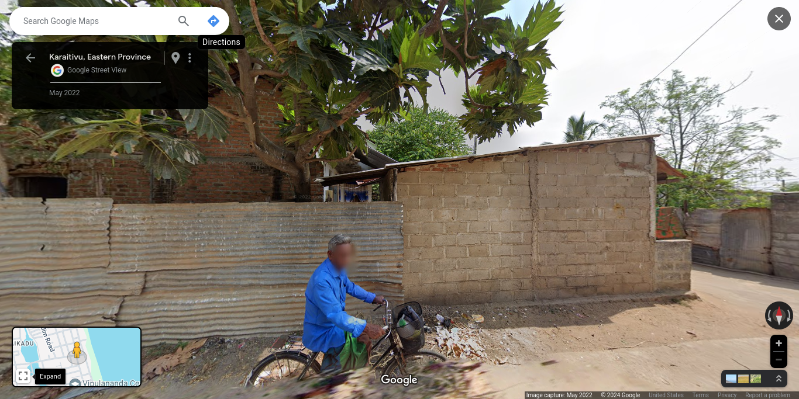

## Eravur 03

**Eravur 03** Grama Niladhari Division, **Eravur Town** Divisional Secretariat Division, **Batticaloa** District, **Eastern** Province

**Batticaloa** Polling Division, **Batticaloa** Electoral District

Population: 3,193 (2012)

(**LK-5115015**/192)

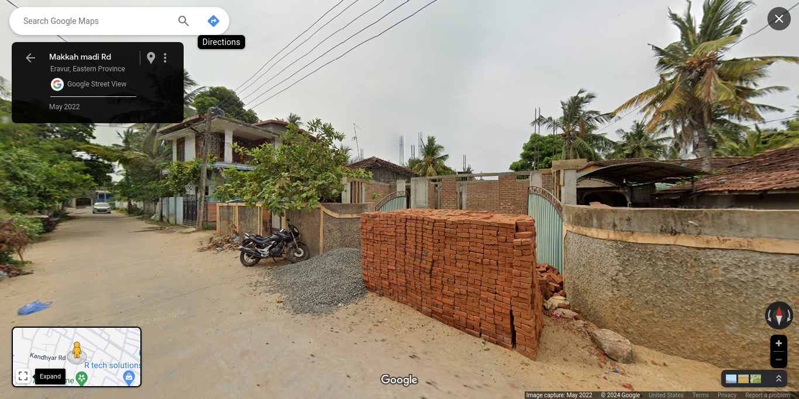

## Bombuwala North-Central

**Bombuwala North-Central** Grama Niladhari Division, **Dodangoda** Divisional Secretariat Division, **Kalutara** District, **Western** Province

**Mathugama** Polling Division, **Kalutara** Electoral District

Population: 1,735 (2012)

(**LK-1327100**/728B)

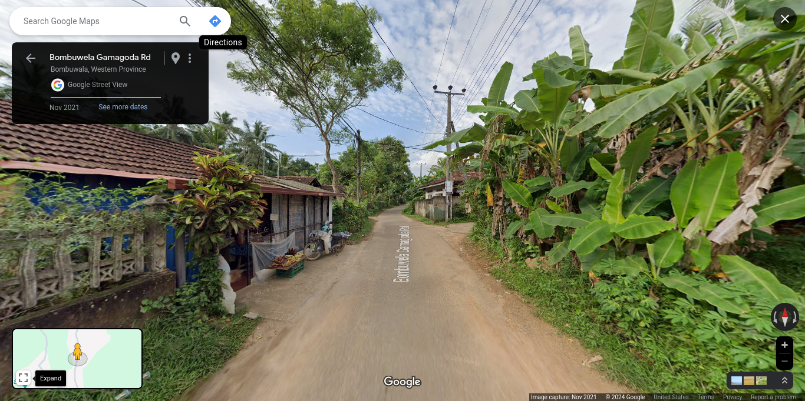

## Araipattai 3

**Araipattai 3** Grama Niladhari Division, **Manmunai Pattu (Araipattai)** Divisional Secretariat Division, **Batticaloa** District, **Eastern** Province

**Batticaloa** Polling Division, **Batticaloa** Electoral District

Population: 603 (2012)

(**LK-5127080**/156)

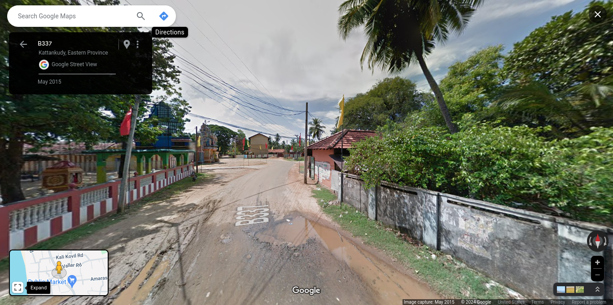

## Rambukandana

**Rambukandana** Grama Niladhari Division, **Rideegama** Divisional Secretariat Division, **Kurunegala** District, **North Western** Province

**Dodangaslanda** Polling Division, **Kurunegala** Electoral District

Population: 1,534 (2012)

(**LK-6163150**/606)

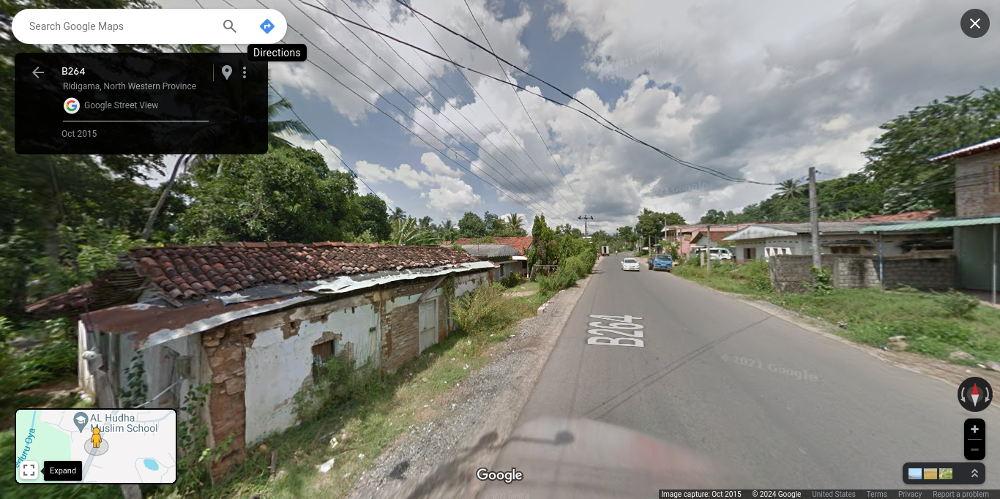

## Ninthavur 14

**Ninthavur 14** Grama Niladhari Division, **Ninthavur** Divisional Secretariat Division, **Ampara** District, **Eastern** Province

**Pothuvil** Polling Division, **Digamadulla** Electoral District

Population: 729 (2012)

(**LK-5230035**/39A)

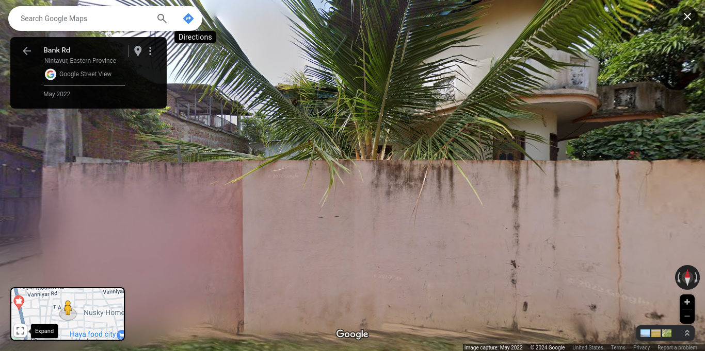

## Borella South

**Borella South** Grama Niladhari Division, **Thimbirigasyaya** Divisional Secretariat Division, **Colombo** District, **Western** Province

**Borella** Polling Division, **Colombo** Electoral District

Population: 5,127 (2012)

(**LK-1127045**/)

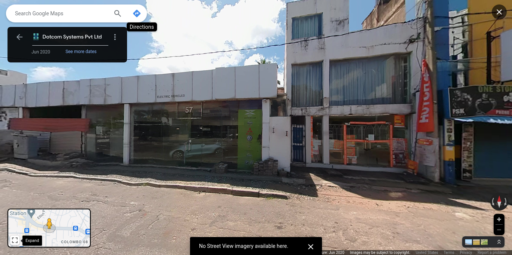

## Balangoda

**Balangoda** Grama Niladhari Division, **Balangoda** Divisional Secretariat Division, **Ratnapura** District, **Sabaragamuwa** Province

**Balangoda** Polling Division, **Ratnapura** Electoral District

Population: 3,821 (2012)

(**LK-9118140**/256)

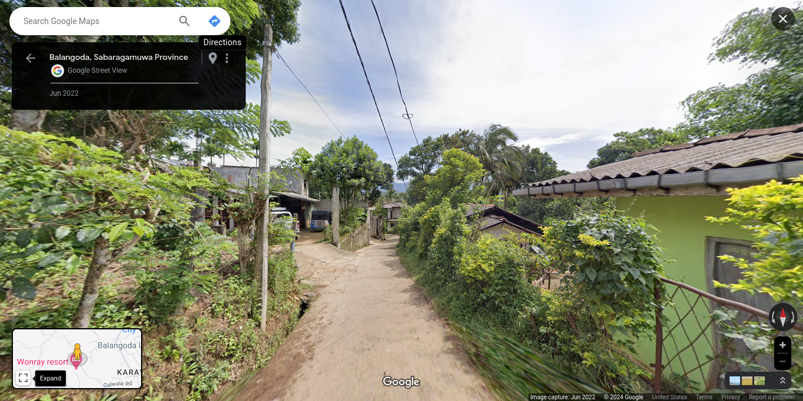

## Mirissankotuwa South

**Mirissankotuwa South** Grama Niladhari Division, **Wennappuwa** Divisional Secretariat Division, **Puttalam** District, **North Western** Province

**Wennappuwa** Polling Division, **Puttalam** Electoral District

Population: 882 (2012)

(**LK-6245200**/487A)

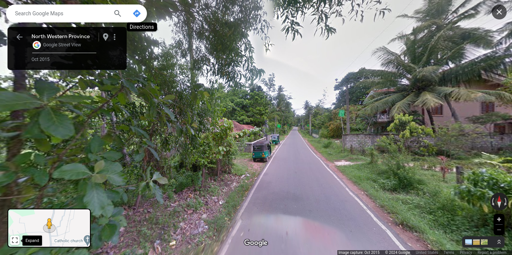

## Kahanda Athireka 1

**Kahanda Athireka 1** Grama Niladhari Division, **Imaduwa** Divisional Secretariat Division, **Galle** District, **Southern** Province

**Habaraduwa** Polling Division, **Galle** Electoral District

Population: 859 (2012)

(**LK-3151110**/167A)

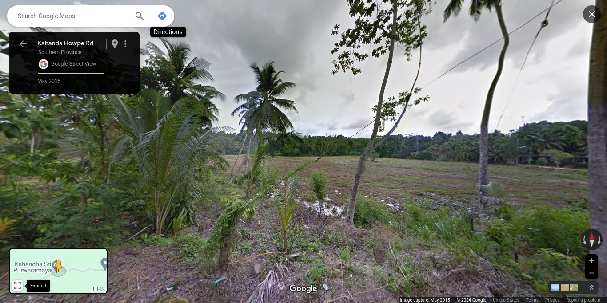

## Dutch Bar

**Dutch Bar** Grama Niladhari Division, **Manmunai North** Divisional Secretariat Division, **Batticaloa** District, **Eastern** Province

**Batticaloa** Polling Division, **Batticaloa** Electoral District

Population: 343 (2012)

(**LK-5118085**/172C)

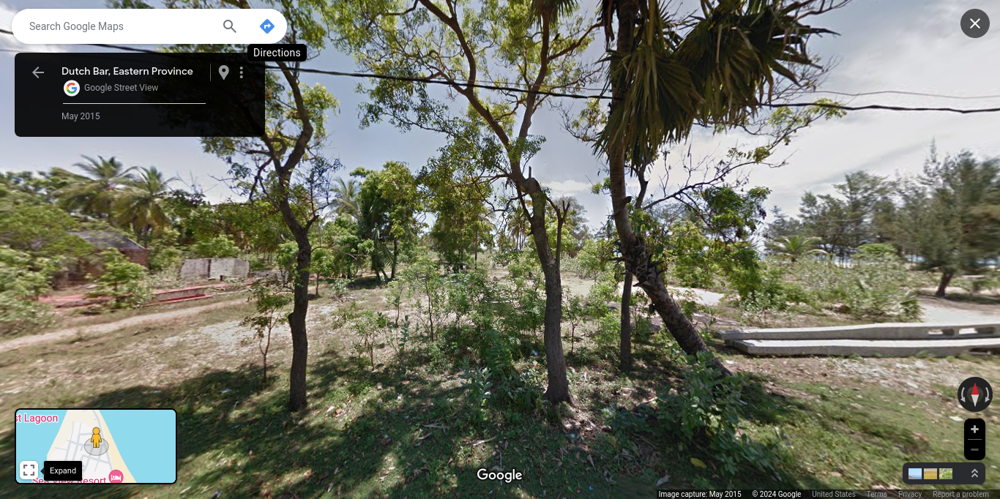

## Ududeniya

**Ududeniya** Grama Niladhari Division, **Naula** Divisional Secretariat Division, **Matale** District, **Central** Province

**Laggala** Polling Division, **Matale** Electoral District

Population: 910 (2012)

(**LK-2209215**/E415B)

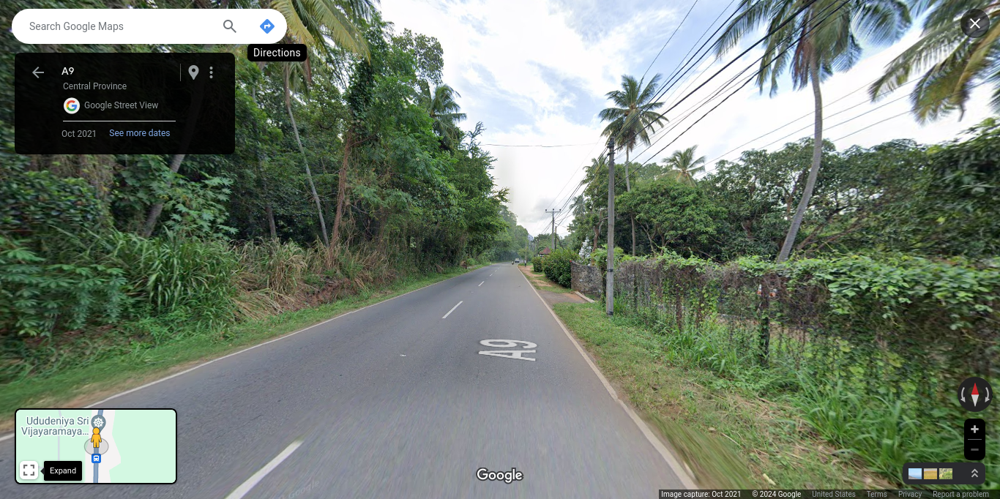

## Nuwara Wewa

**Nuwara Wewa** Grama Niladhari Division, **Nuwaragam Palatha East** Divisional Secretariat Division, **Anuradhapura** District, **North Central** Province

**Anuradhapura West** Polling Division, **Anuradhapura** Electoral District

Population: 1,894 (2012)

(**LK-7133005**/250)

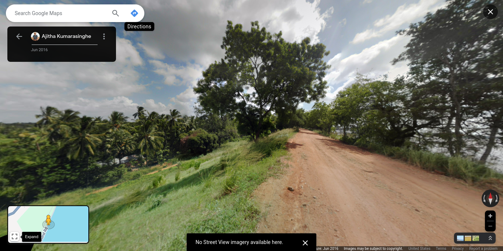

## Kodikaragoda West

**Kodikaragoda West** Grama Niladhari Division, **Pitabeddara** Divisional Secretariat Division, **Matara** District, **Southern** Province

**Deniyaya** Polling Division, **Matara** Electoral District

Population: 1,512 (2012)

(**LK-3203070**/262C)

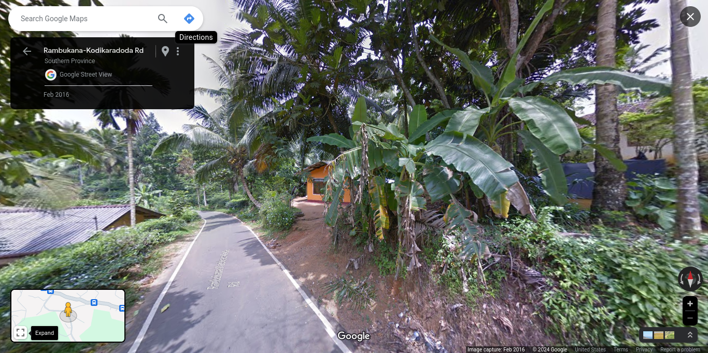

## Selesthimaduwa

**Selesthimaduwa** Grama Niladhari Division, **Thirappane** Divisional Secretariat Division, **Anuradhapura** District, **North Central** Province

**Mihinthale** Polling Division, **Anuradhapura** Electoral District

Population: 919 (2012)

(**LK-7151110**/537)

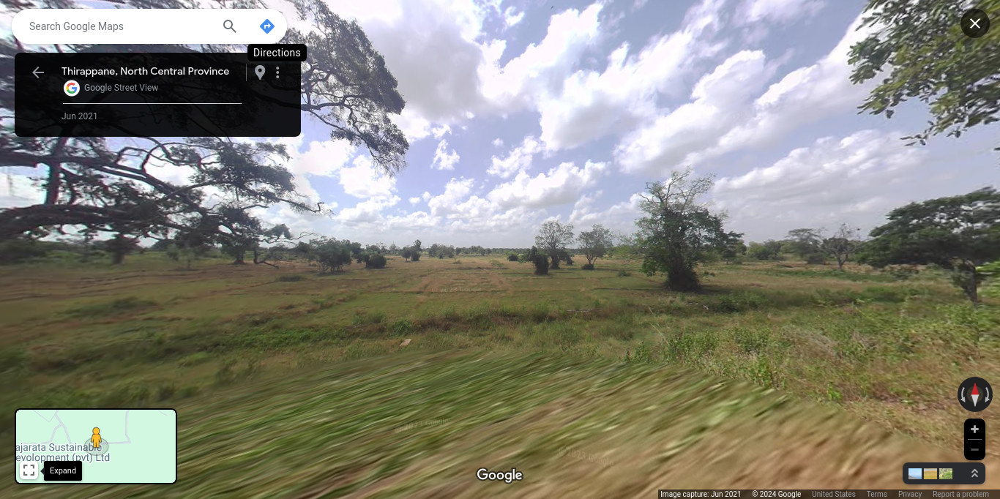

## Molagodayawatta

**Molagodayawatta** Grama Niladhari Division, **Pathadumbara** Divisional Secretariat Division, **Kandy** District, **Central** Province

**Pathadumbara** Polling Division, **Kandy** Electoral District

Population: 1,605 (2012)

(**LK-2112145**/619)

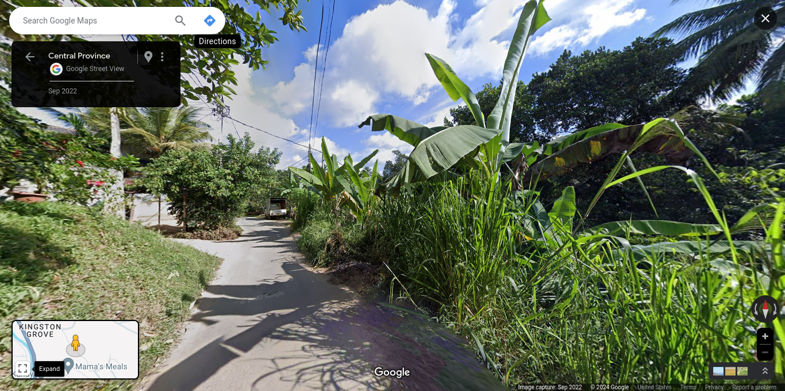

## Hittetiya West

**Hittetiya West** Grama Niladhari Division, **Matara Four Gravets** Divisional Secretariat Division, **Matara** District, **Southern** Province

**Matara** Polling Division, **Matara** Electoral District

Population: 1,321 (2012)

(**LK-3242110**/414A)

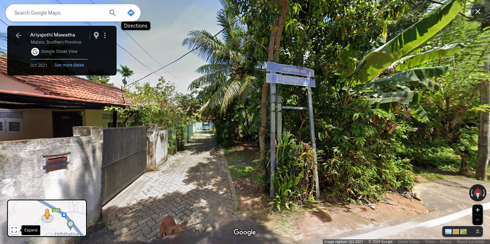

## Maddakalaputharavai 01

**Maddakalaputharavai 01** Grama Niladhari Division, **Samanthurai** Divisional Secretariat Division, **Ampara** District, **Eastern** Province

**Samanthurai** Polling Division, **Digamadulla** Electoral District

Population: 1,090 (2012)

(**LK-5218100**/77A)

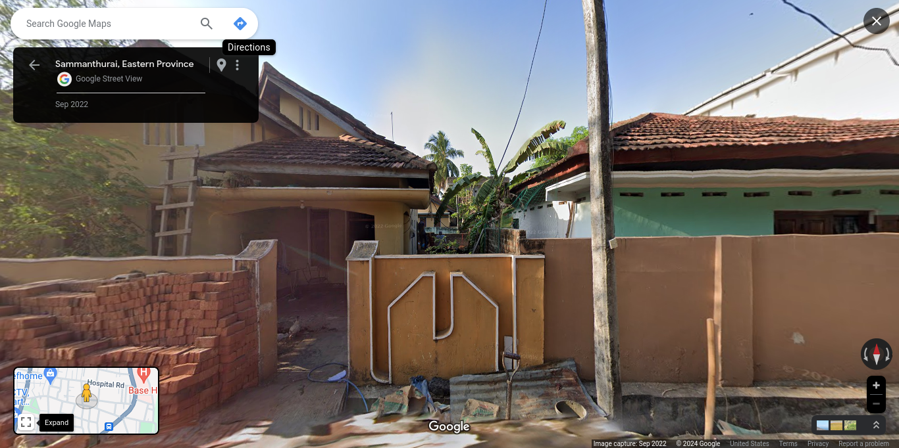

## Pahala Doolwala

**Pahala Doolwala** Grama Niladhari Division, **Harispattuwa** Divisional Secretariat Division, **Kandy** District, **Central** Province

**Harispattuwa** Polling Division, **Kandy** Electoral District

Population: 598 (2012)

(**LK-2133350**/443)

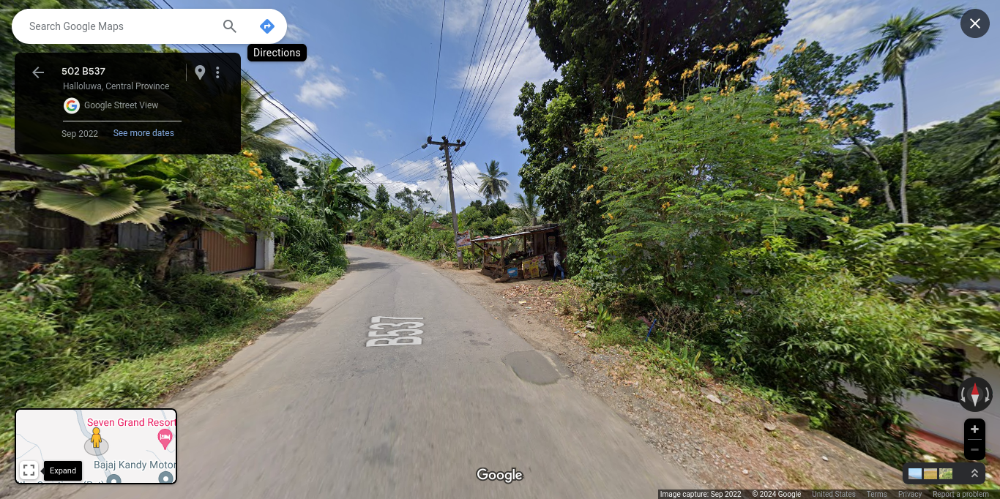

## Paragahathota

**Paragahathota** Grama Niladhari Division, **Balapitiya** Divisional Secretariat Division, **Galle** District, **Southern** Province

**Balapitiya** Polling Division, **Galle** Electoral District

Population: 1,479 (2012)

(**LK-3106210**/87)

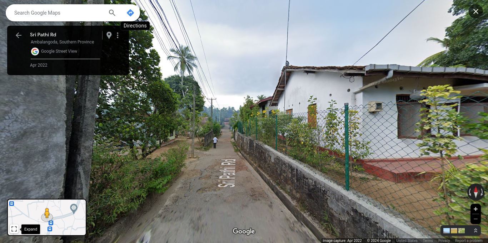

## Kirimetiyana South

**Kirimetiyana South** Grama Niladhari Division, **Dankotuwa** Divisional Secretariat Division, **Puttalam** District, **North Western** Province

**Wennappuwa** Polling Division, **Puttalam** Electoral District

Population: 894 (2012)

(**LK-6248060**/466E)

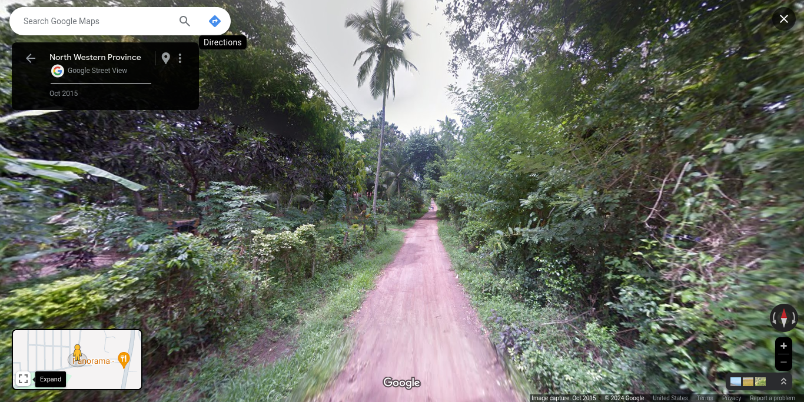

## Ninthavur 22

**Ninthavur 22** Grama Niladhari Division, **Ninthavur** Divisional Secretariat Division, **Ampara** District, **Eastern** Province

**Pothuvil** Polling Division, **Digamadulla** Electoral District

Population: 1,222 (2012)

(**LK-5230110**/37G)

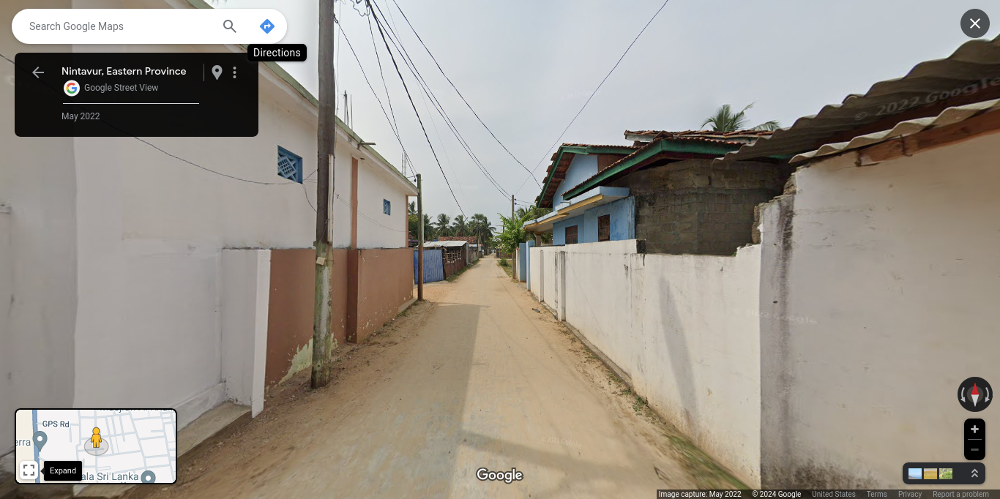

## Pahala Imbulgoda West

**Pahala Imbulgoda West** Grama Niladhari Division, **Gampaha** Divisional Secretariat Division, **Gampaha** District, **Western** Province

**Gampaha** Polling Division, **Gampaha** Electoral District

Population: 3,064 (2012)

(**LK-1224415**/243A)

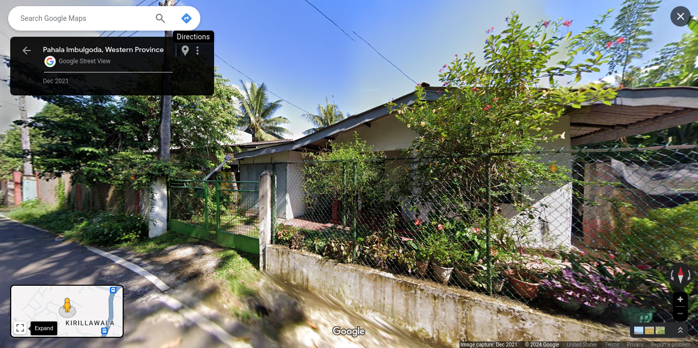

## Dodangoda West-Central

**Dodangoda West-Central** Grama Niladhari Division, **Dodangoda** Divisional Secretariat Division, **Kalutara** District, **Western** Province

**Mathugama** Polling Division, **Kalutara** Electoral District

Population: 892 (2012)

(**LK-1327180**/800E)

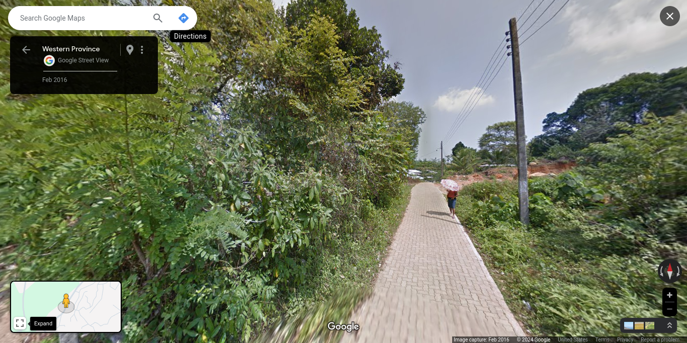

## Henwala West

**Henwala West** Grama Niladhari Division, **Weligama** Divisional Secretariat Division, **Matara** District, **Southern** Province

**Weligama** Polling Division, **Matara** Electoral District

Population: 976 (2012)

(**LK-3239165**/405D)

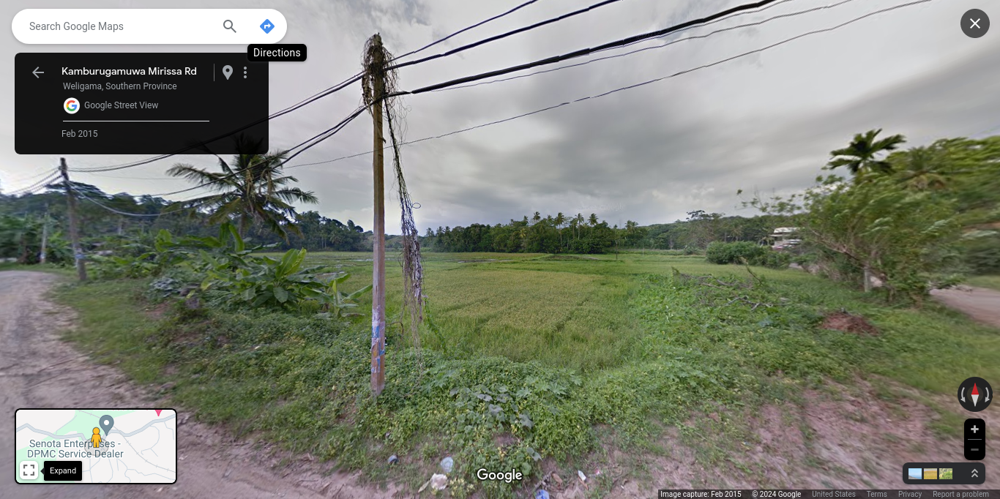

## Karuwaddukal 03

**Karuwaddukal 03** Grama Niladhari Division, **Samanthurai** Divisional Secretariat Division, **Ampara** District, **Eastern** Province

**Samanthurai** Polling Division, **Digamadulla** Electoral District

Population: 1,672 (2012)

(**LK-5218055**/92H)

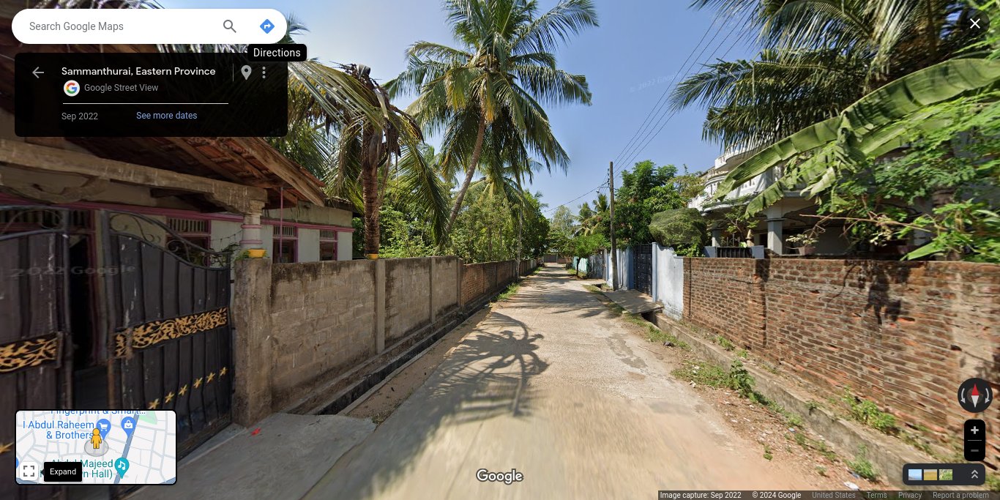

## Hiyadala Walpola

**Hiyadala Walpola** Grama Niladhari Division, **Thumpane** Divisional Secretariat Division, **Kandy** District, **Central** Province

**Galagedara** Polling Division, **Kandy** Electoral District

Population: 676 (2012)

(**LK-2103320**/294)

## Balagoda

**Balagoda** Grama Niladhari Division, **Baddegama** Divisional Secretariat Division, **Galle** District, **Southern** Province

**Baddegama** Polling Division, **Galle** Electoral District

Population: 884 (2012)

(**LK-3127265**/206B)

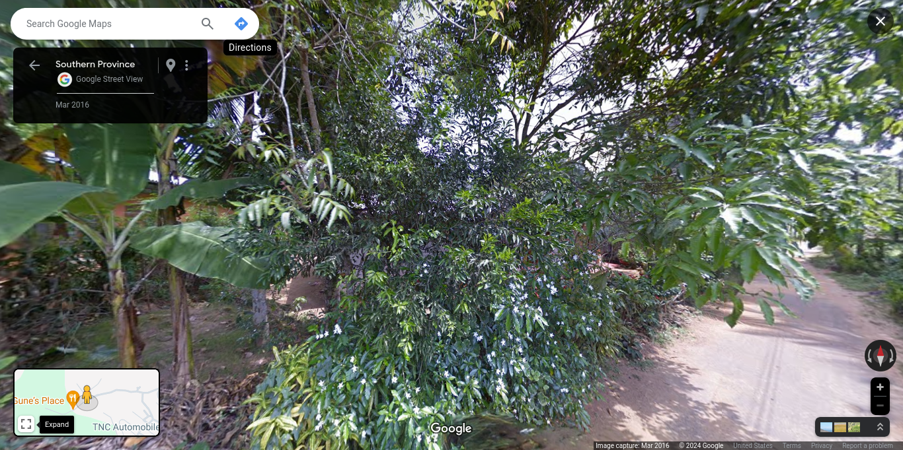

## Koralawella South

**Koralawella South** Grama Niladhari Division, **Moratuwa** Divisional Secretariat Division, **Colombo** District, **Western** Province

**Moratuwa** Polling Division, **Colombo** Electoral District

Population: 3,582 (2012)

(**LK-1133185**/554A)

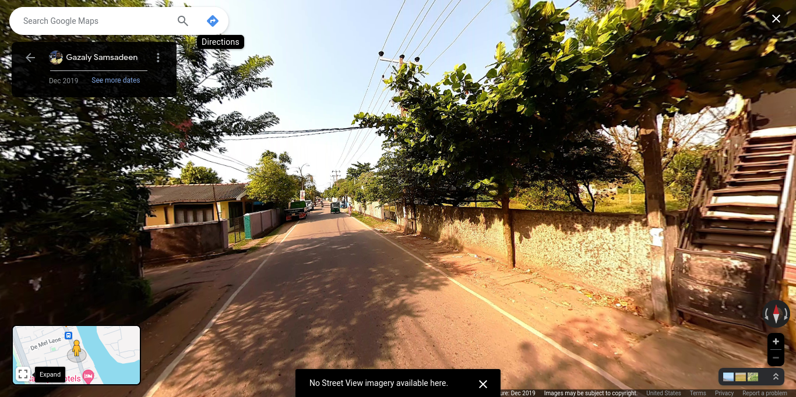

## Hallala

**Hallala** Grama Niladhari Division, **Welipitiya** Divisional Secretariat Division, **Matara** District, **Southern** Province

**Weligama** Polling Division, **Matara** Electoral District

Population: 1,095 (2012)

(**LK-3221065**/375)

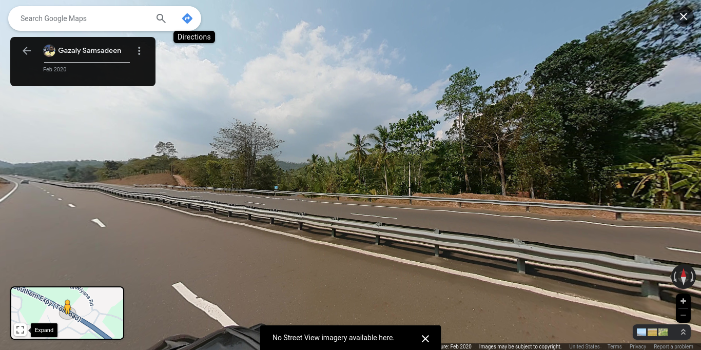

## Pahala Bujjampola

**Pahala Bujjampola** Grama Niladhari Division, **Dankotuwa** Divisional Secretariat Division, **Puttalam** District, **North Western** Province

**Wennappuwa** Polling Division, **Puttalam** Electoral District

Population: 1,906 (2012)

(**LK-6248085**/470)

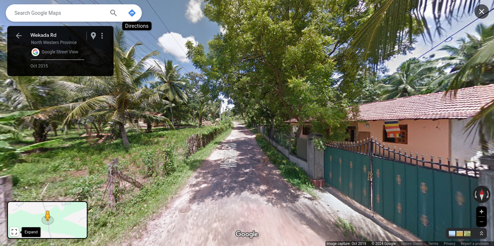

## Pahala Dummalakotuwa

**Pahala Dummalakotuwa** Grama Niladhari Division, **Dankotuwa** Divisional Secretariat Division, **Puttalam** District, **North Western** Province

**Wennappuwa** Polling Division, **Puttalam** Electoral District

Population: 1,391 (2012)

(**LK-6248180**/474E)

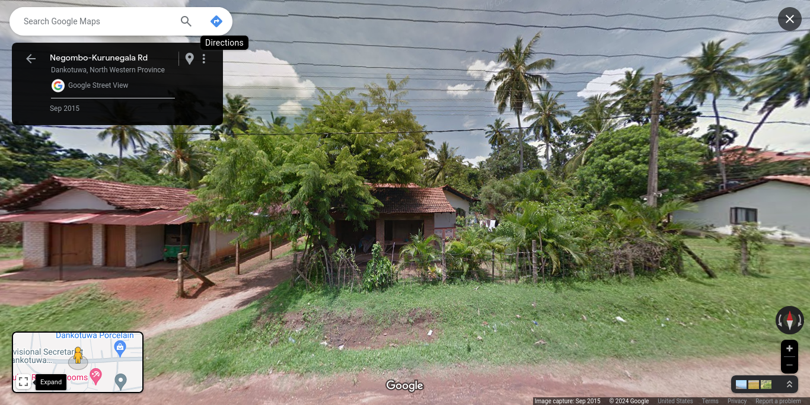

## Ethulkotte West

**Ethulkotte West** Grama Niladhari Division, **Sri Jayawardanapura Kotte** Divisional Secretariat Division, **Colombo** District, **Western** Province

**Kotte** Polling Division, **Colombo** Electoral District

Population: 3,371 (2012)

(**LK-1124040**/521A)

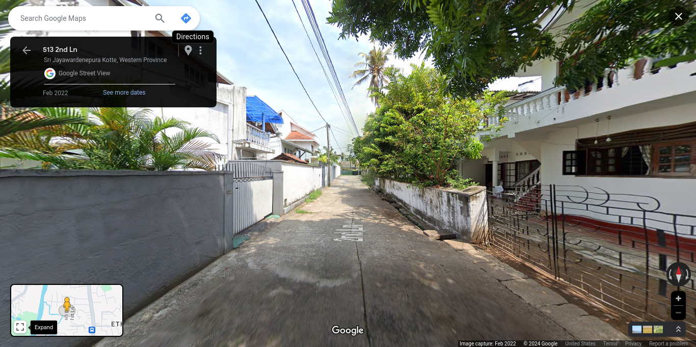

## Hatton East

**Hatton East** Grama Niladhari Division, **Ambagamuwa** Divisional Secretariat Division, **Nuwara Eliya** District, **Central** Province

**Nuwara Eliya Maskeliya** Polling Division, **Nuwara-Eliya** Electoral District

Population: 4,941 (2012)

(**LK-2315190**/319E)

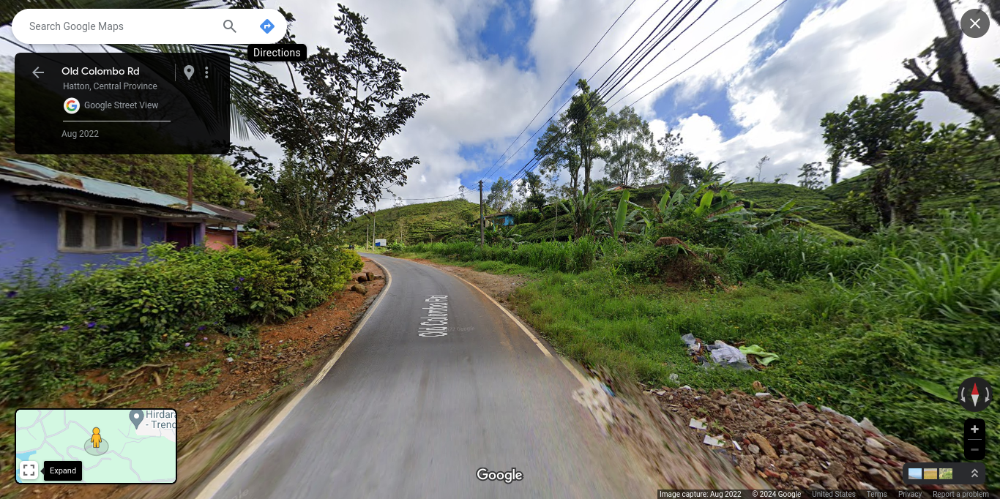

## Batheegama East

**Batheegama East** Grama Niladhari Division, **Dickwella** Divisional Secretariat Division, **Matara** District, **Southern** Province

**Devinuwara** Polling Division, **Matara** Electoral District

Population: 1,150 (2012)

(**LK-3248175**/451C)

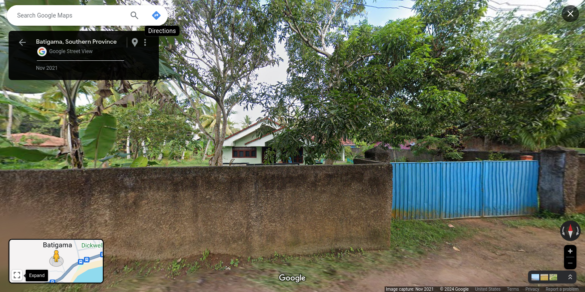

## Balayawewa

**Balayawewa** Grama Niladhari Division, **Padaviya** Divisional Secretariat Division, **Anuradhapura** District, **North Central** Province

**Medawachchiya** Polling Division, **Anuradhapura** Electoral District

Population: 940 (2012)

(**LK-7103045**/15)

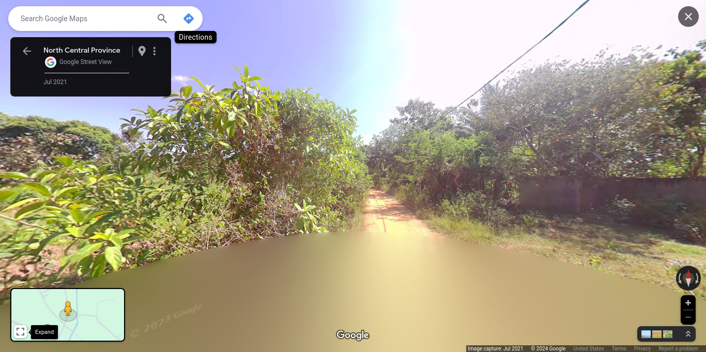

## Weeragama

**Weeragama** Grama Niladhari Division, **Hingurakgoda** Divisional Secretariat Division, **Polonnaruwa** District, **North Central** Province

**Minneriya** Polling Division, **Polonnaruwa** Electoral District

Population: 772 (2012)

(**LK-7203235**/44)

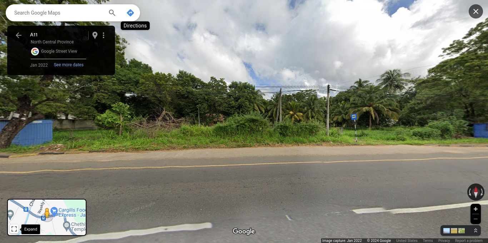

## Akkaraipattu 18

**Akkaraipattu 18** Grama Niladhari Division, **Akkaraipattu** Divisional Secretariat Division, **Ampara** District, **Eastern** Province

**Samanthurai** Polling Division, **Digamadulla** Electoral District

Population: 1,062 (2012)

(**LK-5236105**/AP/19A)

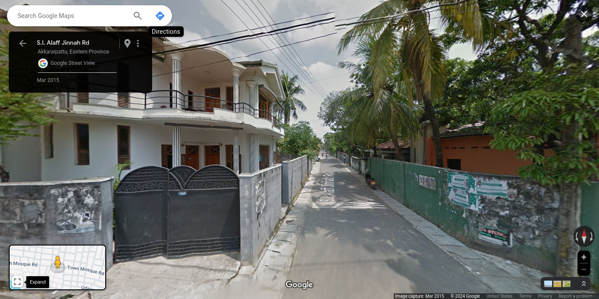

## Kiridana

**Kiridana** Grama Niladhari Division, **Galigamuwa** Divisional Secretariat Division, **Kegalle** District, **Sabaragamuwa** Province

**Galigamuwa** Polling Division, **Kegalle** Electoral District

Population: 1,037 (2012)

(**LK-9215180**/64B)

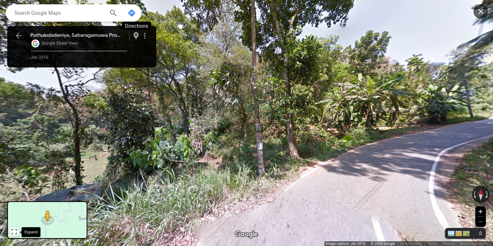

## Wetakeyawa

**Wetakeyawa** Grama Niladhari Division, **Pannala** Divisional Secretariat Division, **Kurunegala** District, **North Western** Province

**Katugampola** Polling Division, **Kurunegala** Electoral District

Population: 1,676 (2012)

(**LK-6178315**/1608)

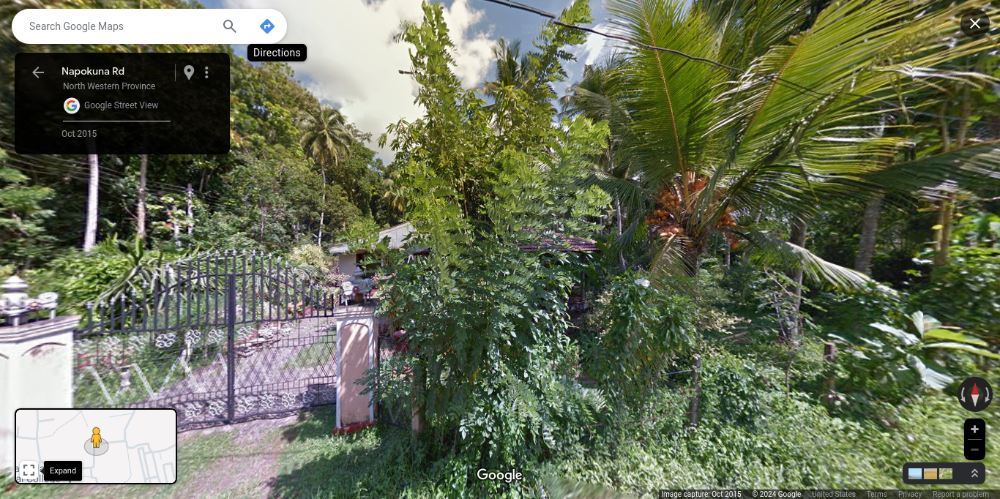

## Mawathalanda

**Mawathalanda** Grama Niladhari Division, **Godakawela** Divisional Secretariat Division, **Ratnapura** District, **Sabaragamuwa** Province

**Rakwana** Polling Division, **Ratnapura** Electoral District

Population: 1,386 (2012)

(**LK-9142145**/223B)

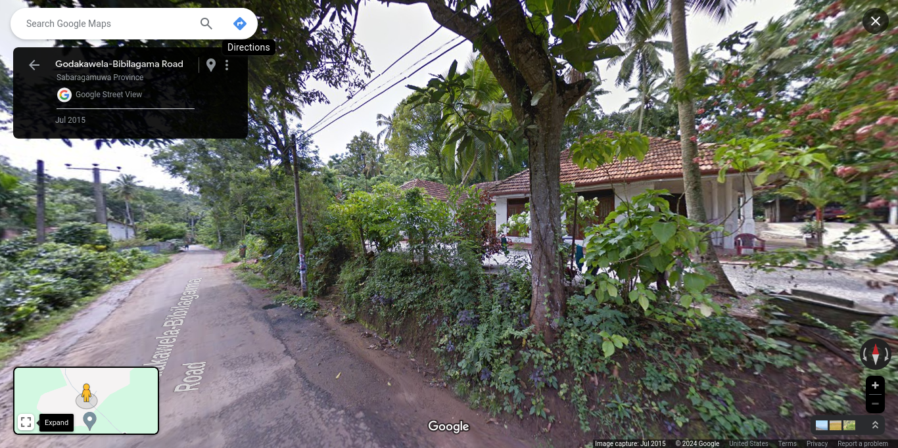

## Weeragaswewa

**Weeragaswewa** Grama Niladhari Division, **Angunakolapelessa** Divisional Secretariat Division, **Hambantota** District, **Southern** Province

**Tangalle** Polling Division, **Hambantota** Electoral District

Population: 511 (2012)

(**LK-3318125**/210)

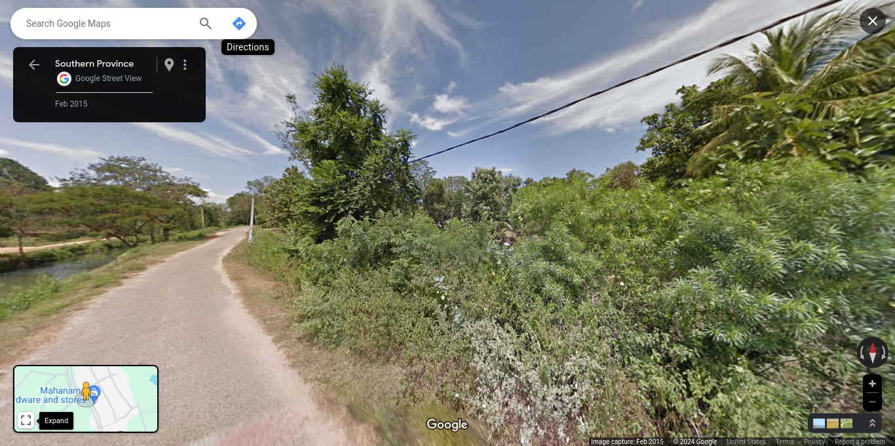

## Meegahapelessa

**Meegahapelessa** Grama Niladhari Division, **Udubaddawa** Divisional Secretariat Division, **Kurunegala** District, **North Western** Province

**Bingiriya** Polling Division, **Kurunegala** Electoral District

Population: 1,329 (2012)

(**LK-6175165**/1521)

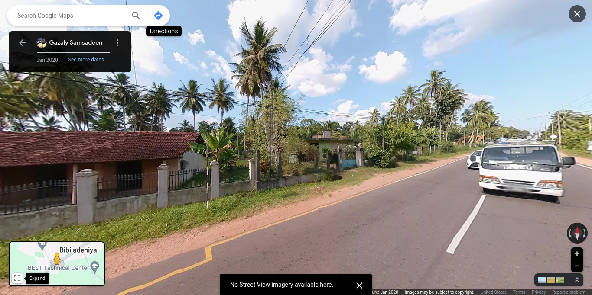

## Kahathuduwa East

**Kahathuduwa East** Grama Niladhari Division, **Homagama** Divisional Secretariat Division, **Colombo** District, **Western** Province

**Homagama** Polling Division, **Colombo** Electoral District

Population: 2,131 (2012)

(**LK-1112370**/602C)

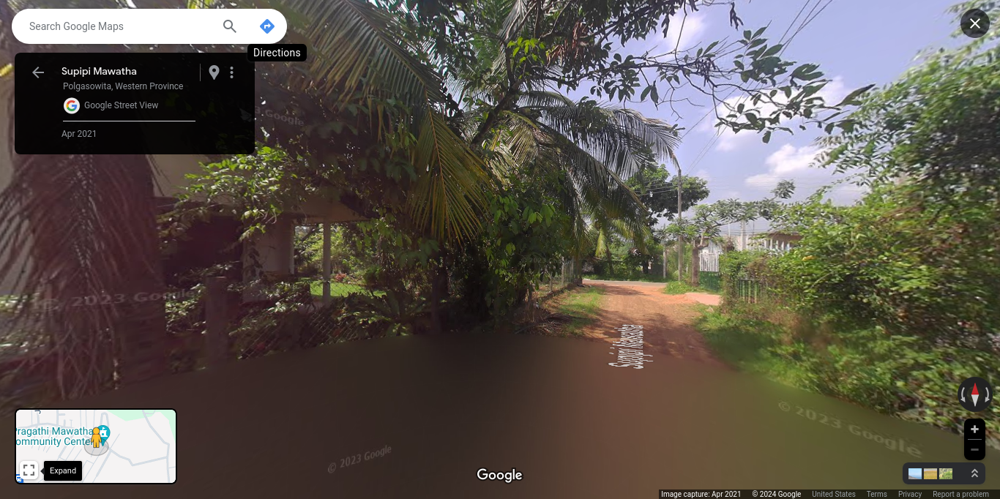

## Kalmunai  02A

**Kalmunai  02A** Grama Niladhari Division, **Kalmunai Tamil Division** Divisional Secretariat Division, **Ampara** District, **Eastern** Province

**Kalmunai** Polling Division, **Digamadulla** Electoral District

Population: 832 (2012)

(**LK-5221130**/KP/61/8)

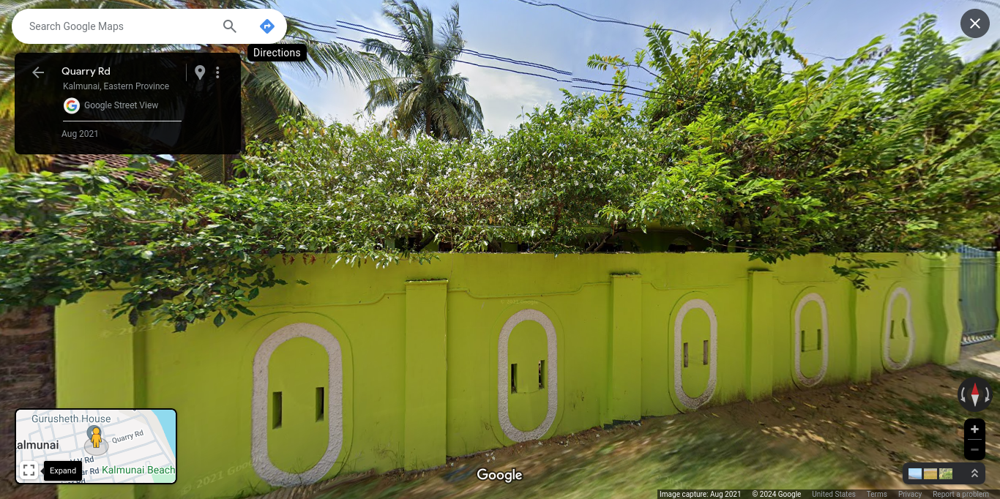

## Kaduwela

**Kaduwela** Grama Niladhari Division, **Kaduwela** Divisional Secretariat Division, **Colombo** District, **Western** Province

**Kaduwela** Polling Division, **Colombo** Electoral District

Population: 4,342 (2012)

(**LK-1109020**/473A)

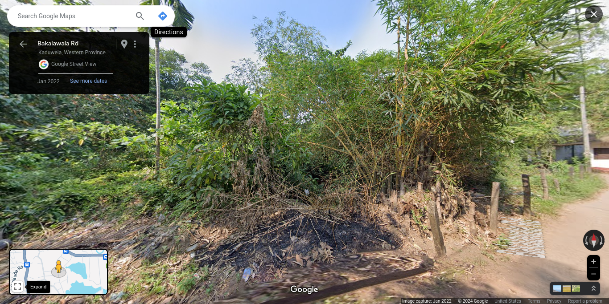

## Beliatta West

**Beliatta West** Grama Niladhari Division, **Beliatta** Divisional Secretariat Division, **Hambantota** District, **Southern** Province

**Beliatta** Polling Division, **Hambantota** Electoral District

Population: 645 (2012)

(**LK-3330185**/353)

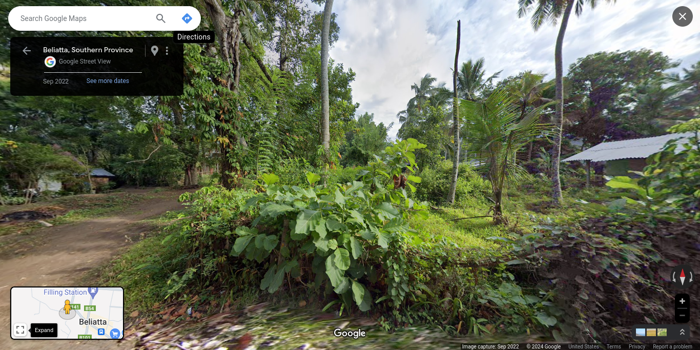

## Holuwagoda

**Holuwagoda** Grama Niladhari Division, **Bope-Poddala** Divisional Secretariat Division, **Galle** District, **Southern** Province

**Akmeemana** Polling Division, **Galle** Electoral District

Population: 880 (2012)

(**LK-3142100**/126C)

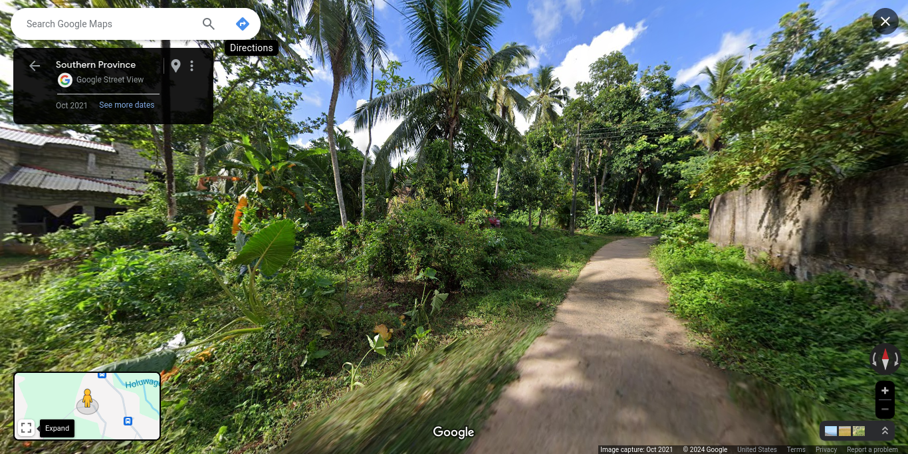

## Thalgaswewa

**Thalgaswewa** Grama Niladhari Division, **Nochchiyagama** Divisional Secretariat Division, **Anuradhapura** District, **North Central** Province

**Anuradhapura West** Polling Division, **Anuradhapura** Electoral District

Population: 858 (2012)

(**LK-7139040**/332)

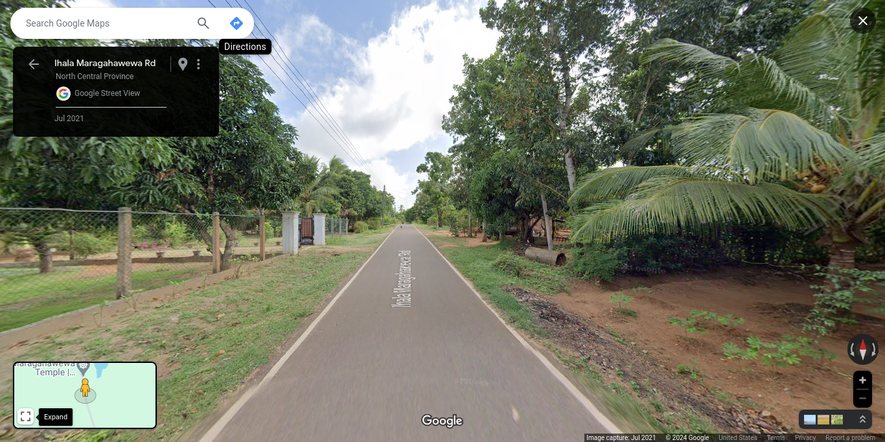

## Tholpuram East

**Tholpuram East** Grama Niladhari Division, **Valikamam West (Chankanai)** Divisional Secretariat Division, **Jaffna** District, **Northern** Province

**Vaddukoddai** Polling Division, **Jaffna** Electoral District

Population: 1,243 (2012)

(**LK-4106060**/J/168)

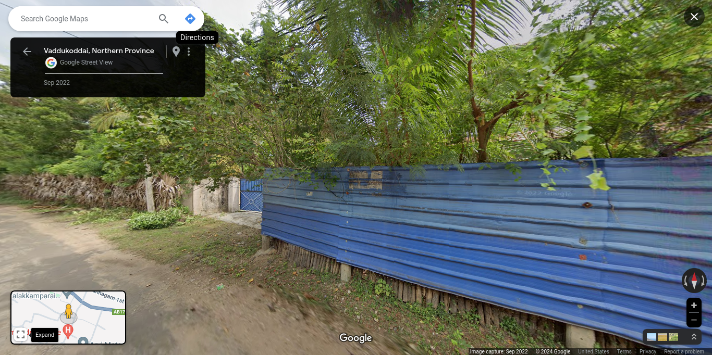

## Labudoowa

**Labudoowa** Grama Niladhari Division, **Bope-Poddala** Divisional Secretariat Division, **Galle** District, **Southern** Province

**Akmeemana** Polling Division, **Galle** Electoral District

Population: 1,385 (2012)

(**LK-3142105**/114)

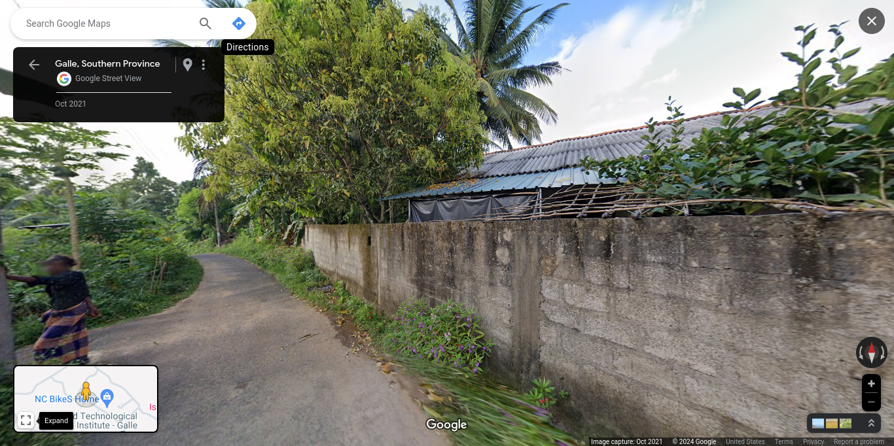

## Valvettithurai North Centre

**Valvettithurai North Centre** Grama Niladhari Division, **Vadamaradchi North (Point Pedro)** Divisional Secretariat Division, **Jaffna** District, **Northern** Province

**Udupiddy** Polling Division, **Jaffna** Electoral District

Population: 476 (2012)

(**LK-4127035**/J/389)

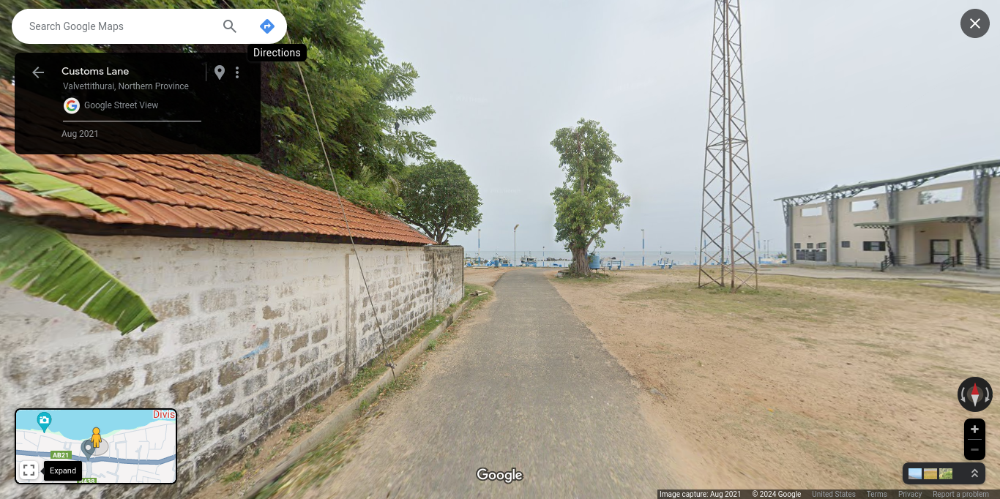

## Kanukerny East

**Kanukerny East** Grama Niladhari Division, **Maritimepattu** Divisional Secretariat Division, **Mullaitivu** District, **Northern** Province

**Mullaitivu** Polling Division, **Vanni** Electoral District

Population: 466 (2012)

(**LK-4415055**/MU/116)

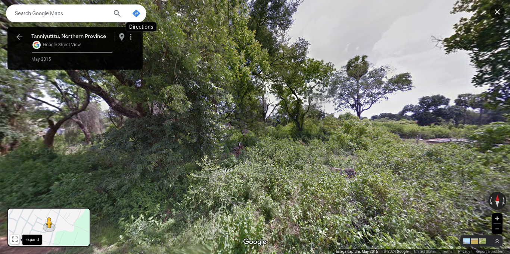

## Pitawala

**Pitawala** Grama Niladhari Division, **Panvila** Divisional Secretariat Division, **Kandy** District, **Central** Province

**Pathadumbara** Polling Division, **Kandy** Electoral District

Population: 785 (2012)

(**LK-2115065**/727)

## Udayarthoppuwa South

**Udayarthoppuwa South** Grama Niladhari Division, **Negombo** Divisional Secretariat Division, **Gampaha** District, **Western** Province

**Negombo** Polling Division, **Gampaha** Electoral District

Population: 2,475 (2012)

(**LK-1203145**/160B)

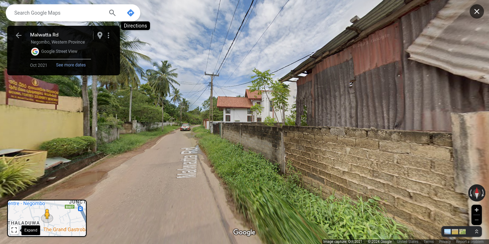

## Athurugiriya

**Athurugiriya** Grama Niladhari Division, **Kaduwela** Divisional Secretariat Division, **Colombo** District, **Western** Province

**Kaduwela** Polling Division, **Colombo** Electoral District

Population: 5,799 (2012)

(**LK-1109205**/490)

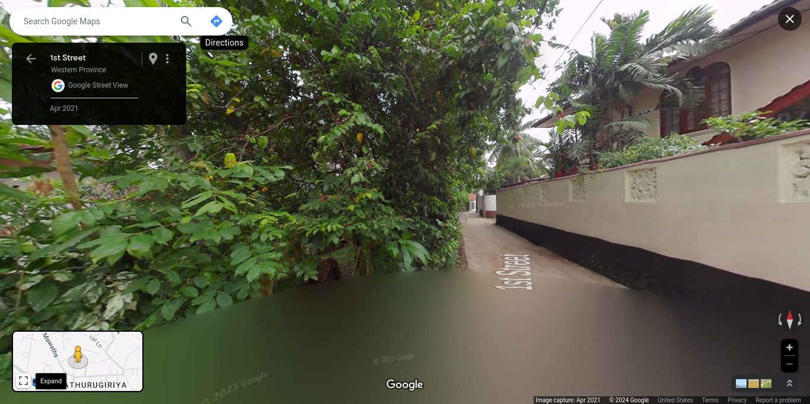

## Kattankudy Division 4

**Kattankudy Division 4** Grama Niladhari Division, **Kattankudy** Divisional Secretariat Division, **Batticaloa** District, **Eastern** Province

**Batticaloa** Polling Division, **Batticaloa** Electoral District

Population: 1,045 (2012)

(**LK-5124055**/164)

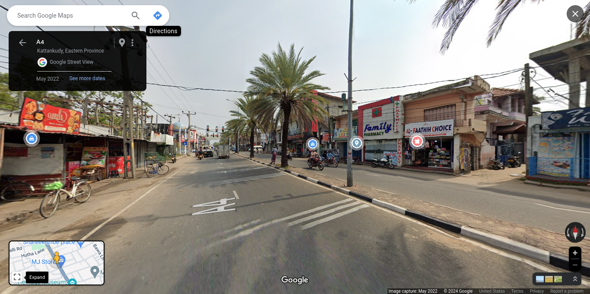

## Panaluwa

**Panaluwa** Grama Niladhari Division, **Homagama** Divisional Secretariat Division, **Colombo** District, **Western** Province

**Homagama** Polling Division, **Colombo** Electoral District

Population: 4,725 (2012)

(**LK-1112080**/447B)

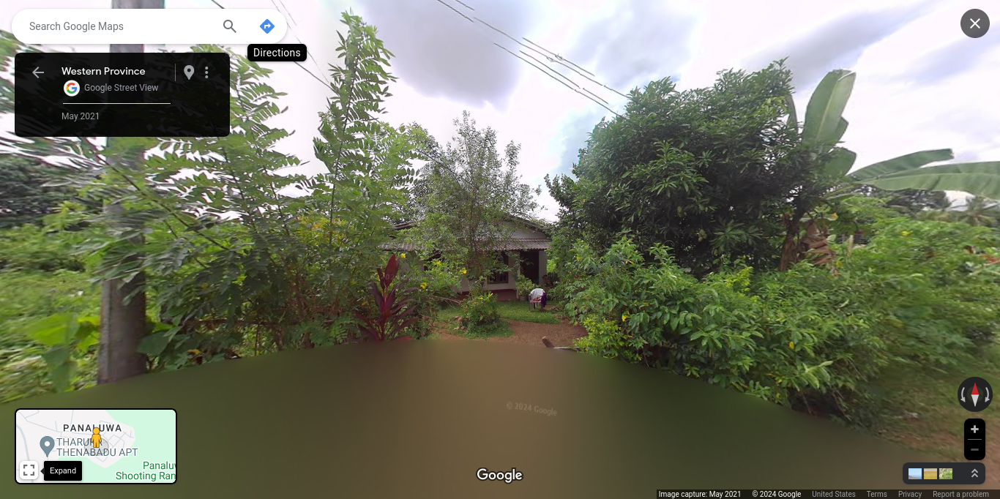

## Kiripedda

**Kiripedda** Grama Niladhari Division, **Karandeniya** Divisional Secretariat Division, **Galle** District, **Southern** Province

**Karandeniya** Polling Division, **Galle** Electoral District

Population: 863 (2012)

(**LK-3109180**/93A)

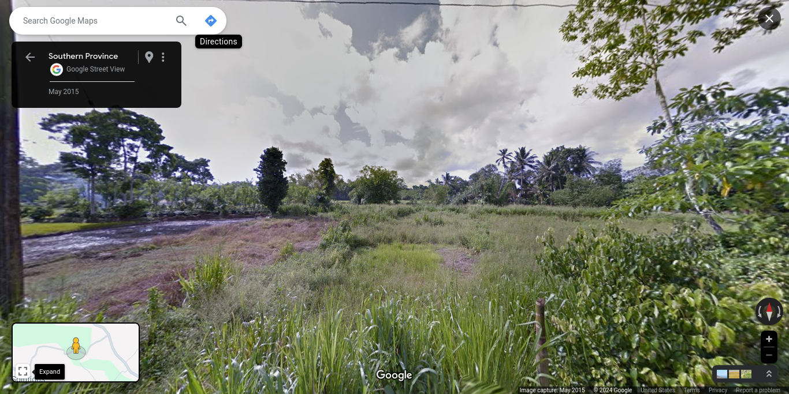

## Gallehepitiya

**Gallehepitiya** Grama Niladhari Division, **Panduwasnuwara East** Divisional Secretariat Division, **Kurunegala** District, **North Western** Province

**Panduwasnuwara** Polling Division, **Kurunegala** Electoral District

Population: 1,499 (2012)

(**LK-6148050**/1362)

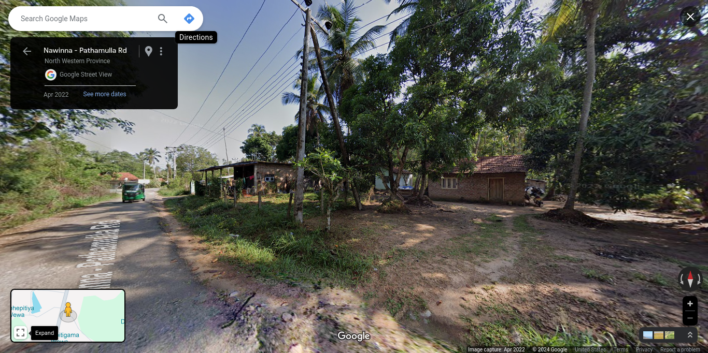

## Malamulla

**Malamulla** Grama Niladhari Division, **Panadura** Divisional Secretariat Division, **Kalutara** District, **Western** Province

**Bandaragama** Polling Division, **Kalutara** Electoral District

Population: 3,731 (2012)

(**LK-1303170**/684)

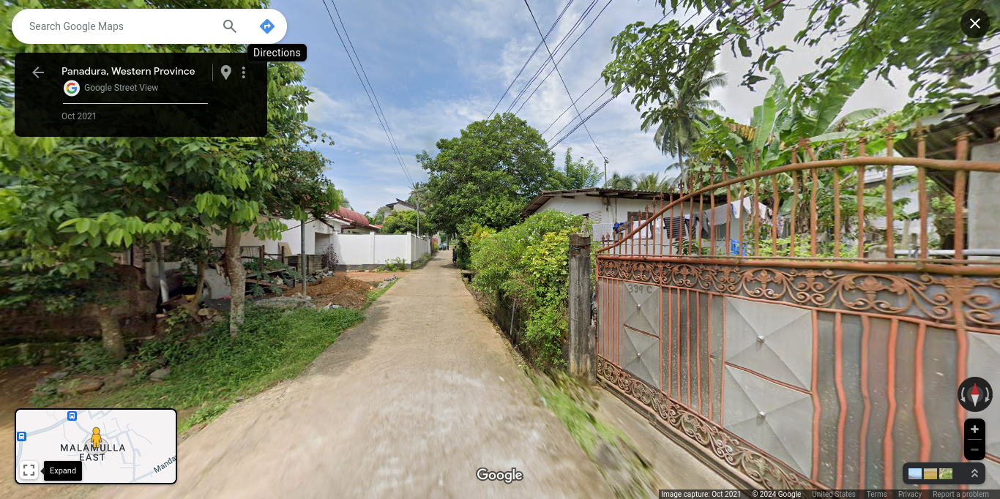

## Periyavillan

**Periyavillan** Grama Niladhari Division, **Valikamam South-West (Sandilipay)** Divisional Secretariat Division, **Jaffna** District, **Northern** Province

**Kankesanthurai** Polling Division, **Jaffna** Electoral District

Population: 1,603 (2012)

(**LK-4109125**/J/153)

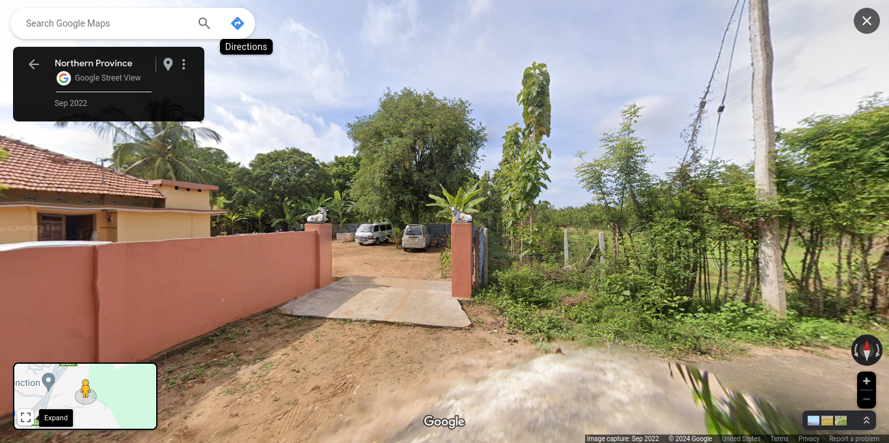

## Doranagoda East

**Doranagoda East** Grama Niladhari Division, **Minuwangoda** Divisional Secretariat Division, **Gampaha** District, **Western** Province

**Minuwangoda** Polling Division, **Gampaha** Electoral District

Population: 1,263 (2012)

(**LK-1215380**/110/1)

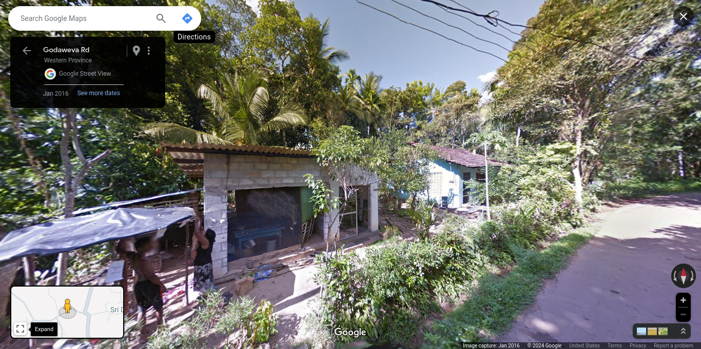

## Rathnagiriya

**Rathnagiriya** Grama Niladhari Division, **Madampe** Divisional Secretariat Division, **Puttalam** District, **North Western** Province

**Chilaw** Polling Division, **Puttalam** Electoral District

Population: 647 (2012)

(**LK-6236070**/545B)

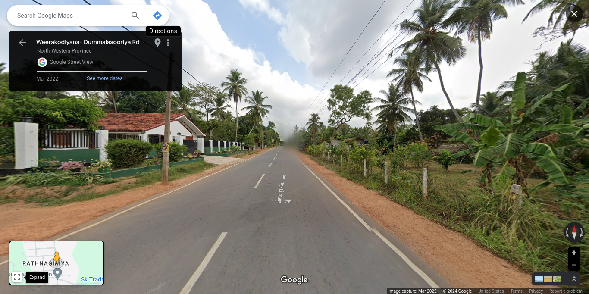

## Damunumeya North

**Damunumeya North** Grama Niladhari Division, **Hanguranketha** Divisional Secretariat Division, **Nuwara Eliya** District, **Central** Province

**Hanguranketha** Polling Division, **Nuwara-Eliya** Electoral District

Population: 532 (2012)

(**LK-2306145**/494E)

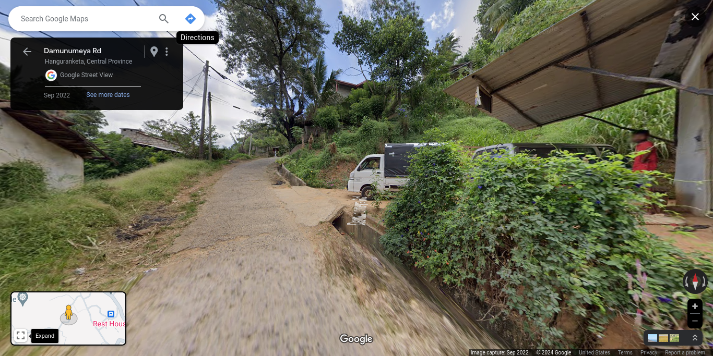

## Savatkaddu

**Savatkaddu** Grama Niladhari Division, **Mannar Town** Divisional Secretariat Division, **Mannar** District, **Northern** Province

**Mannar** Polling Division, **Vanni** Electoral District

Population: 1,834 (2012)

(**LK-4203150**/MN/75)

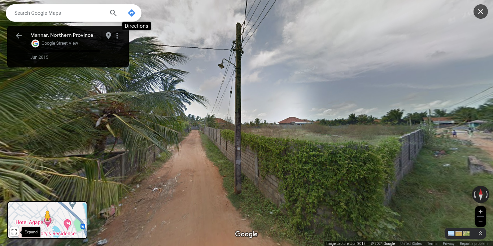

## Muruthawala

**Muruthawala** Grama Niladhari Division, **Mirigama** Divisional Secretariat Division, **Gampaha** District, **Western** Province

**Mirigama** Polling Division, **Gampaha** Electoral District

Population: 680 (2012)

(**LK-1212635**/24)

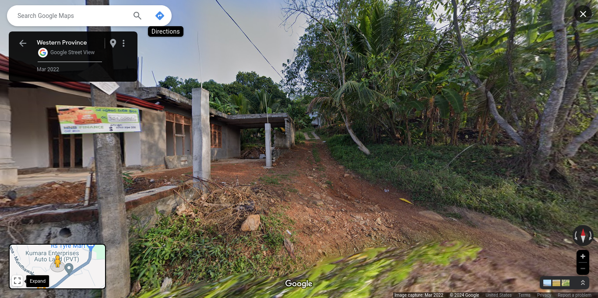

## Kohombiliwela

**Kohombiliwela** Grama Niladhari Division, **Ukuwela** Divisional Secretariat Division, **Matale** District, **Central** Province

**Matale** Polling Division, **Matale** Electoral District

Population: 1,632 (2012)

(**LK-2233105**/E355C)

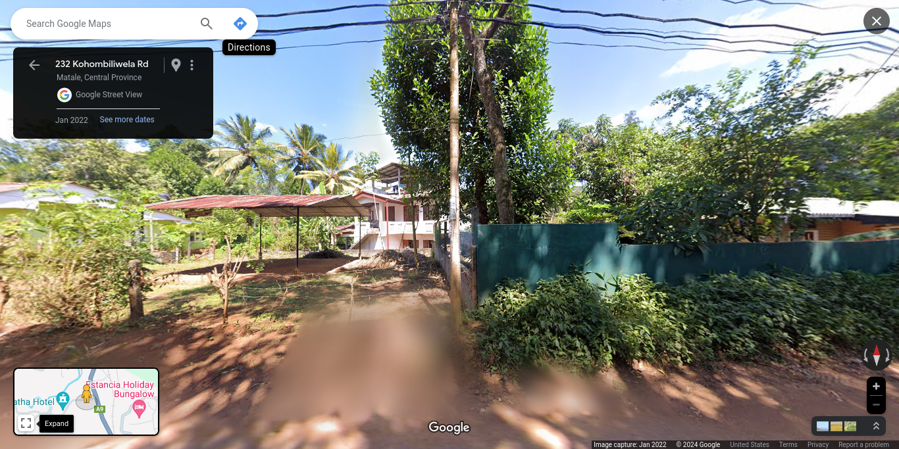

## Batuwandara North

**Batuwandara North** Grama Niladhari Division, **Kesbewa** Divisional Secretariat Division, **Colombo** District, **Western** Province

**Kesbewa** Polling Division, **Colombo** Electoral District

Population: 1,545 (2012)

(**LK-1136340**/596)

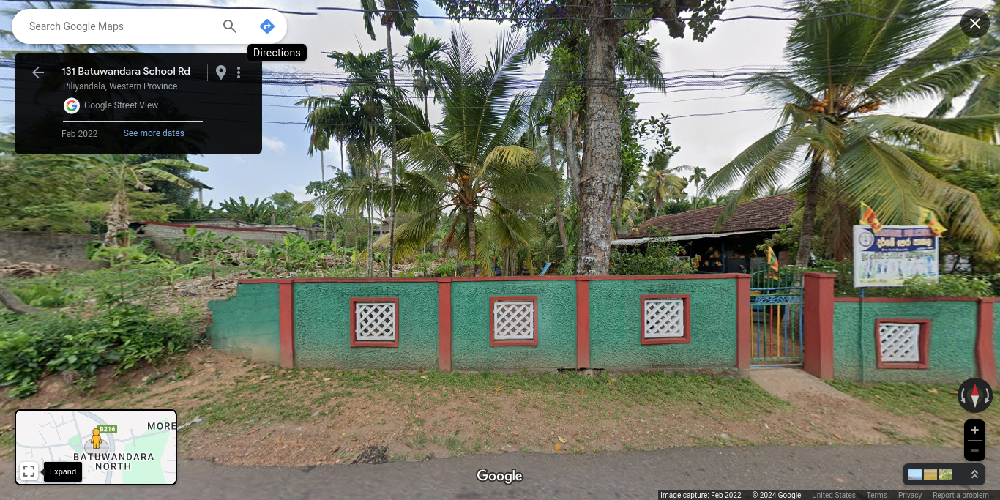

## Kiriketuwewa

**Kiriketuwewa** Grama Niladhari Division, **Kebithigollewa** Divisional Secretariat Division, **Anuradhapura** District, **North Central** Province

**Medawachchiya** Polling Division, **Anuradhapura** Electoral District

Population: 1,530 (2012)

(**LK-7106110**/21)

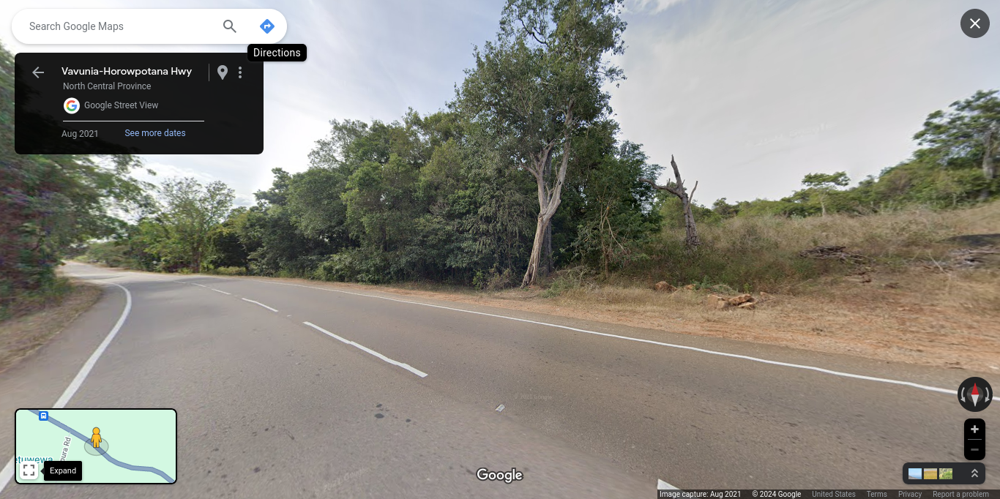

## Pattanatheru

**Pattanatheru** Grama Niladhari Division, **Trincomalee Town and Gravets** Divisional Secretariat Division, **Trincomalee** District, **Eastern** Province

**Trincomalee** Polling Division, **Trincomalee** Electoral District

Population: 1,266 (2012)

(**LK-5315115**/244K)

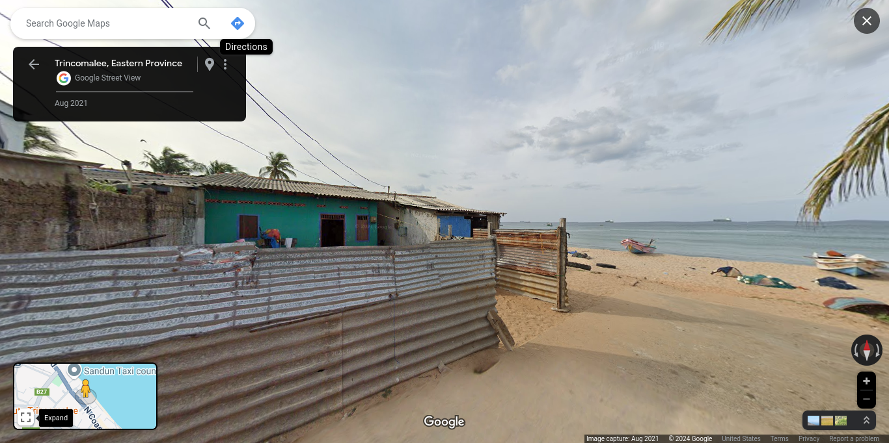

## Ariyalai North West

**Ariyalai North West** Grama Niladhari Division, **Nallur** Divisional Secretariat Division, **Jaffna** District, **Northern** Province

**Nallur** Polling Division, **Jaffna** Electoral District

Population: 1,831 (2012)

(**LK-4133015**/J/91)

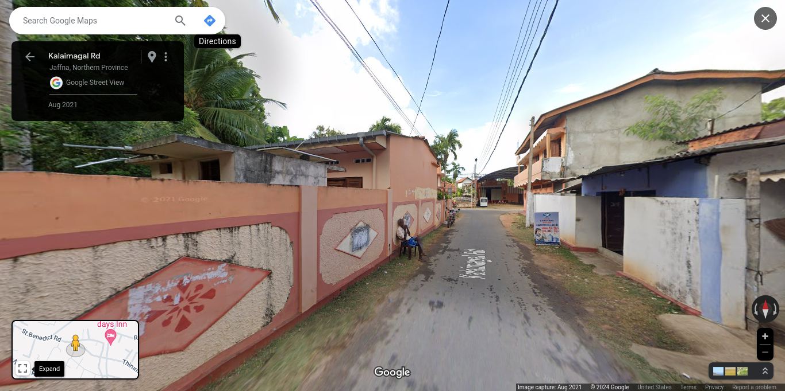

## Araipattai 1

**Araipattai 1** Grama Niladhari Division, **Manmunai Pattu (Araipattai)** Divisional Secretariat Division, **Batticaloa** District, **Eastern** Province

**Batticaloa** Polling Division, **Batticaloa** Electoral District

Population: 815 (2012)

(**LK-5127130**/158)

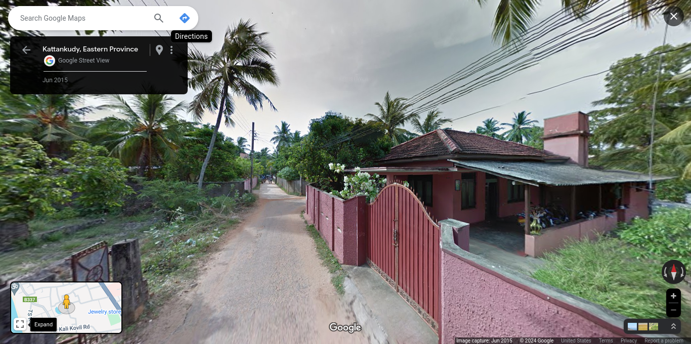

## Ninthavur 20

**Ninthavur 20** Grama Niladhari Division, **Ninthavur** Divisional Secretariat Division, **Ampara** District, **Eastern** Province

**Pothuvil** Polling Division, **Digamadulla** Electoral District

Population: 500 (2012)

(**LK-5230090**/37E)

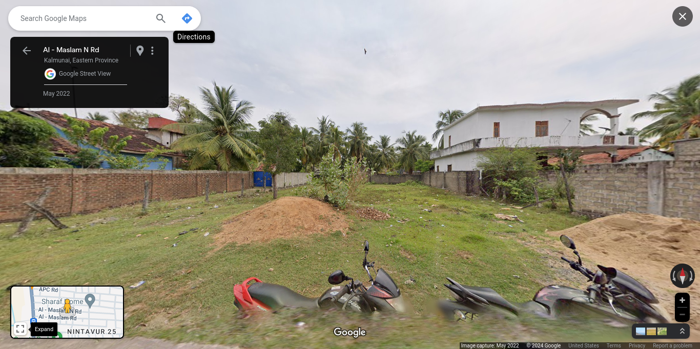

## Kattankudy Division 6 South

**Kattankudy Division 6 South** Grama Niladhari Division, **Kattankudy** Divisional Secretariat Division, **Batticaloa** District, **Eastern** Province

**Batticaloa** Polling Division, **Batticaloa** Electoral District

Population: 2,588 (2012)

(**LK-5124075**/162A)

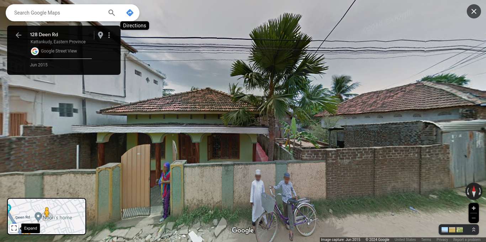

## Sainthamaruthu 01

**Sainthamaruthu 01** Grama Niladhari Division, **Sainthamaruthu** Divisional Secretariat Division, **Ampara** District, **Eastern** Province

**Kalmunai** Polling Division, **Digamadulla** Electoral District

Population: 1,938 (2012)

(**LK-5225005**/KP/53)

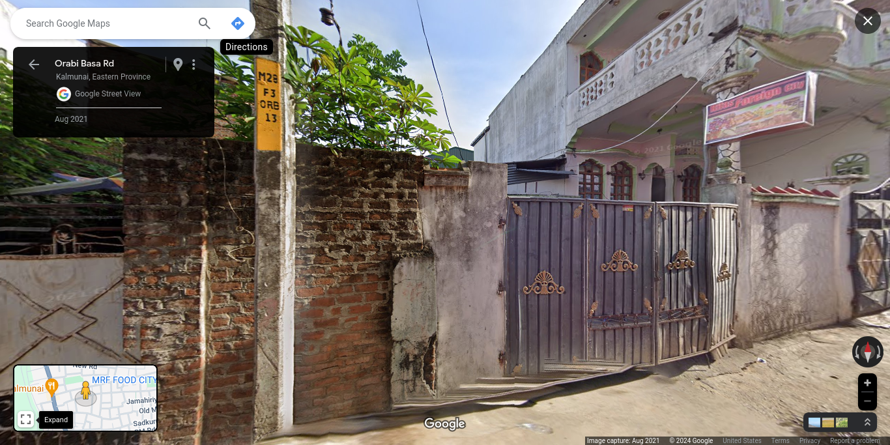

## Ambahenwewa

**Ambahenwewa** Grama Niladhari Division, **Kuliyapitiya East** Divisional Secretariat Division, **Kurunegala** District, **North Western** Province

**Kuliyapitiya** Polling Division, **Kurunegala** Electoral District

Population: 1,340 (2012)

(**LK-6169075**/1132)

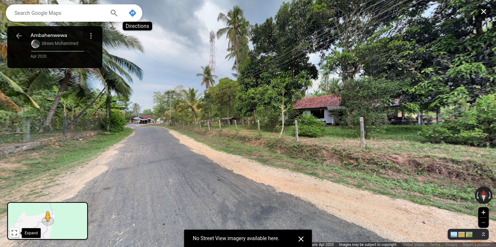

## Adhikarigoda

**Adhikarigoda** Grama Niladhari Division, **Dodangoda** Divisional Secretariat Division, **Kalutara** District, **Western** Province

**Mathugama** Polling Division, **Kalutara** Electoral District

Population: 1,333 (2012)

(**LK-1327085**/719A)

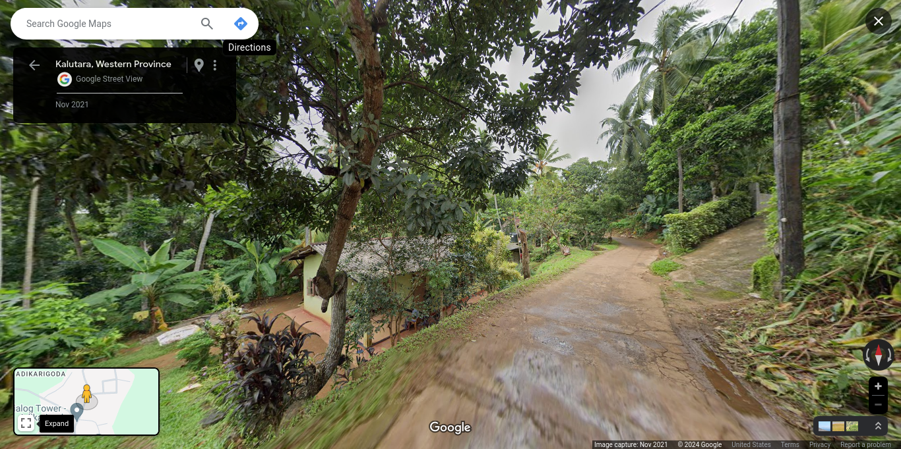

## Bope North

**Bope North** Grama Niladhari Division, **Galle Four Gravets** Divisional Secretariat Division, **Galle** District, **Southern** Province

**Galle** Polling Division, **Galle** Electoral District

Population: 1,010 (2012)

(**LK-3139045**/107A)

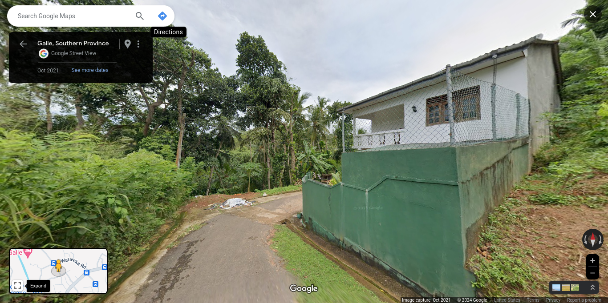

## Hennathota

**Hennathota** Grama Niladhari Division, **Hikkaduwa** Divisional Secretariat Division, **Galle** District, **Southern** Province

**Ratgama** Polling Division, **Galle** Electoral District

Population: 1,182 (2012)

(**LK-3136295**/53B)

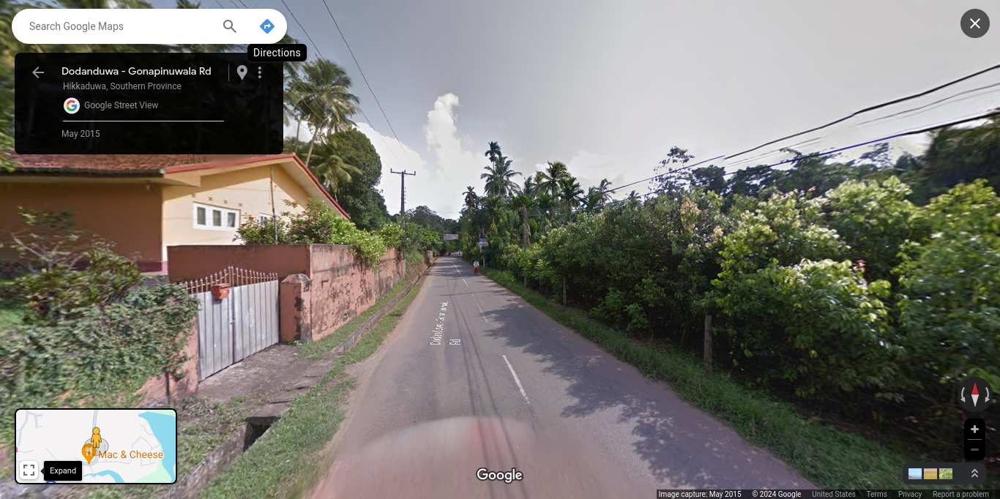

## Ihala Naragala

**Ihala Naragala** Grama Niladhari Division, **Bulathsinhala** Divisional Secretariat Division, **Kalutara** District, **Western** Province

**Bulathsinhala** Polling Division, **Kalutara** Electoral District

Population: 1,293 (2012)

(**LK-1312005**/813A)

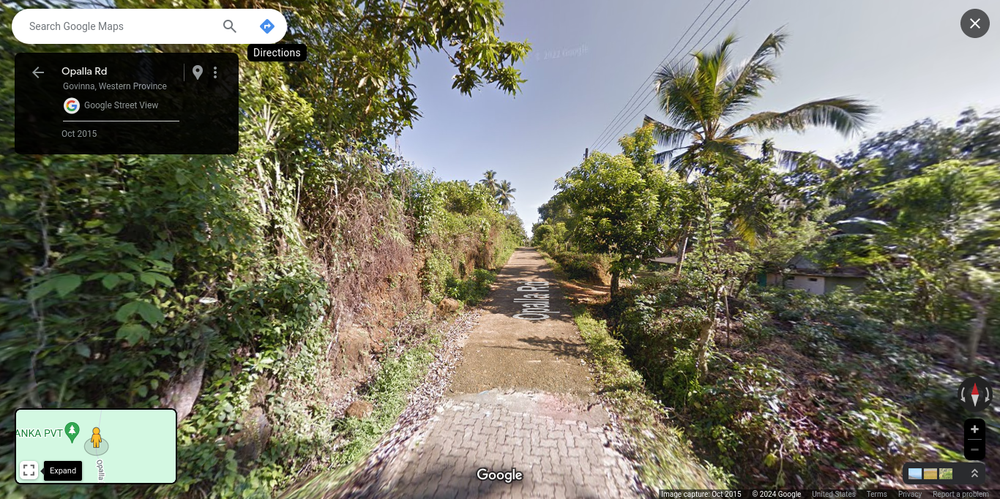

## Pathegama

**Pathegama** Grama Niladhari Division, **Weligama** Divisional Secretariat Division, **Matara** District, **Southern** Province

**Weligama** Polling Division, **Matara** Electoral District

Population: 1,232 (2012)

(**LK-3239010**/379)

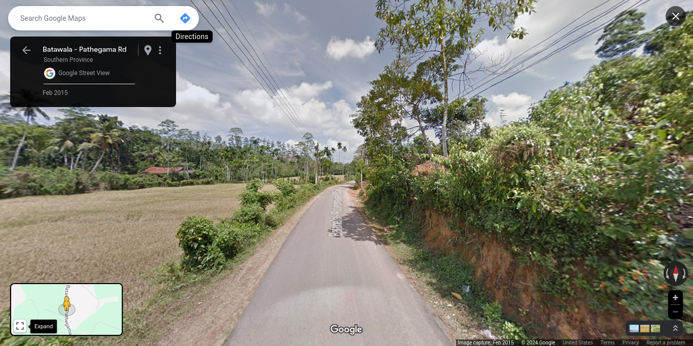

## Megodagama

**Megodagama** Grama Niladhari Division, **Pathadumbara** Divisional Secretariat Division, **Kandy** District, **Central** Province

**Pathadumbara** Polling Division, **Kandy** Electoral District

Population: 860 (2012)

(**LK-2112150**/618)

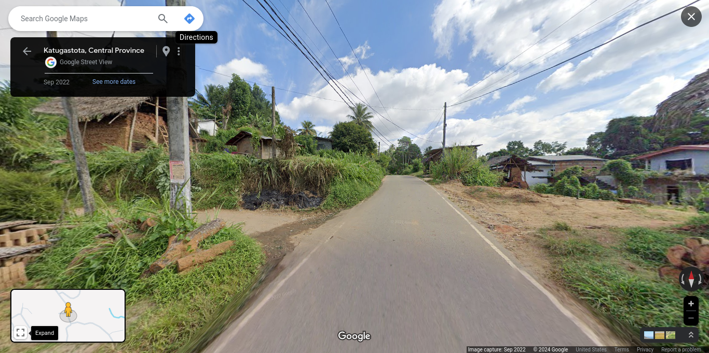

## Wellampitiya

**Wellampitiya** Grama Niladhari Division, **Kolonnawa** Divisional Secretariat Division, **Colombo** District, **Western** Province

**Kolonnawa** Polling Division, **Colombo** Electoral District

Population: 2,244 (2012)

(**LK-1106100**/511)

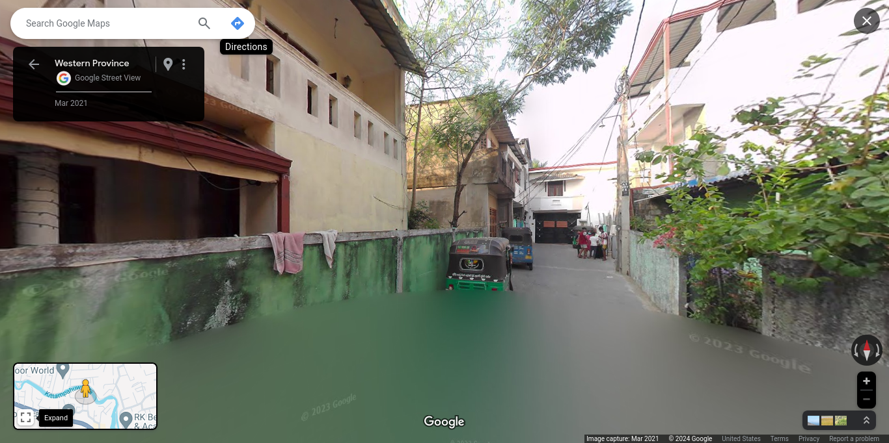

## Pathegangoda

**Pathegangoda** Grama Niladhari Division, **Balapitiya** Divisional Secretariat Division, **Galle** District, **Southern** Province

**Balapitiya** Polling Division, **Galle** Electoral District

Population: 2,301 (2012)

(**LK-3106125**/20A)

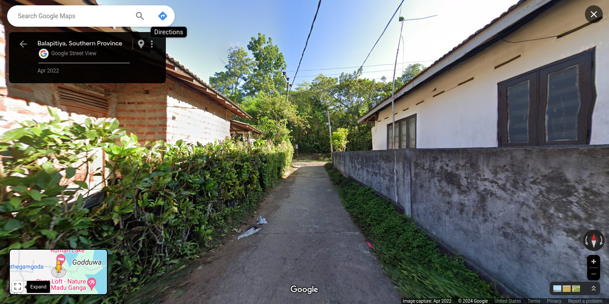

## Medagama iii

**Medagama iii** Grama Niladhari Division, **Gampaha** Divisional Secretariat Division, **Gampaha** District, **Western** Province

**Gampaha** Polling Division, **Gampaha** Electoral District

Population: 1,178 (2012)

(**LK-1224145**/223B)

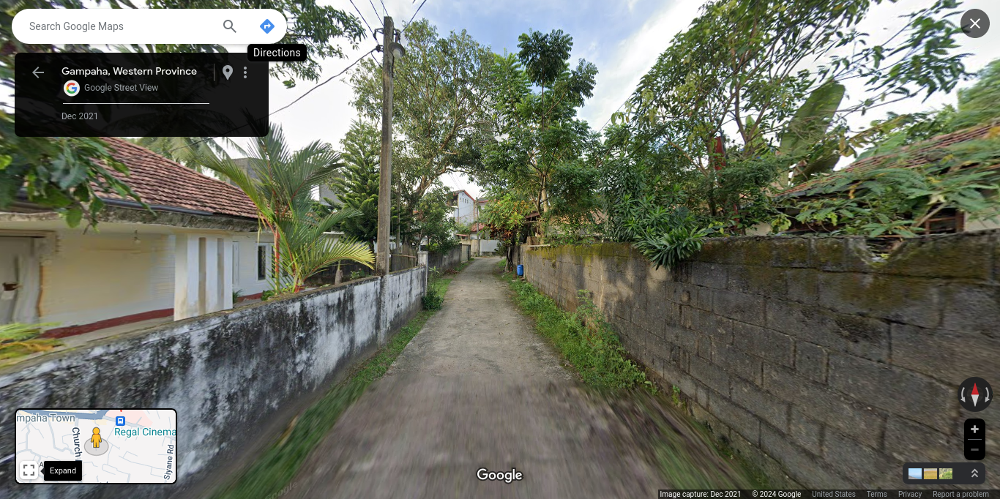

## Masar

**Masar** Grama Niladhari Division, **Pachchilaipalli** Divisional Secretariat Division, **Kilinochchi** District, **Northern** Province

**Kilinochchi** Polling Division, **Jaffna** Electoral District

Population: 420 (2012)

(**LK-4503040**/KN/81)

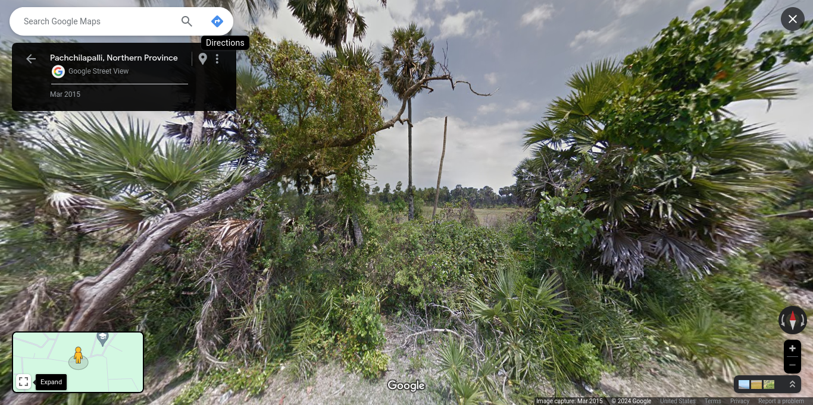

## Pothuwewa

**Pothuwewa** Grama Niladhari Division, **Wariyapola** Divisional Secretariat Division, **Kurunegala** District, **North Western** Province

**Wariyapola** Polling Division, **Kurunegala** Electoral District

Population: 538 (2012)

(**LK-6136130**/1256)

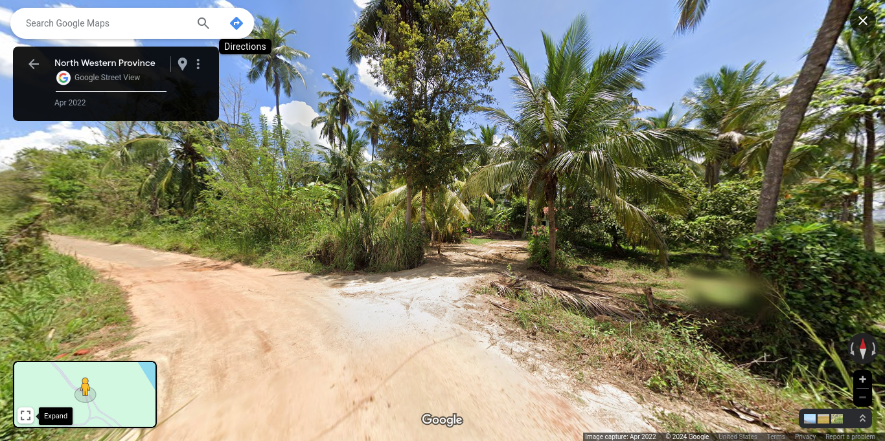

## Kokuvil North West

**Kokuvil North West** Grama Niladhari Division, **Nallur** Divisional Secretariat Division, **Jaffna** District, **Northern** Province

**Nallur** Polling Division, **Jaffna** Electoral District

Population: 838 (2012)

(**LK-4133180**/J/124)

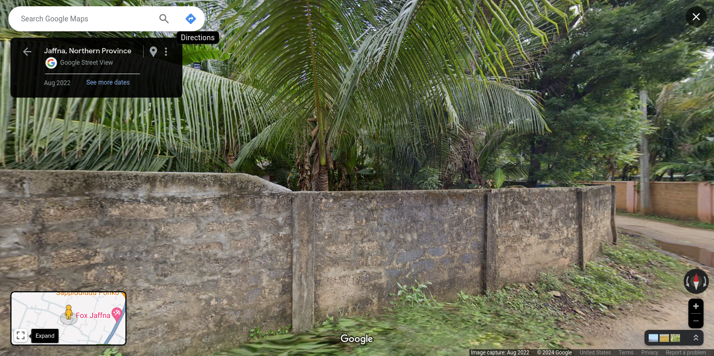

## Allaipiddy

**Allaipiddy** Grama Niladhari Division, **Island South (Velanai)** Divisional Secretariat Division, **Jaffna** District, **Northern** Province

**Kayts** Polling Division, **Jaffna** Electoral District

Population: 1,721 (2012)

(**LK-4139020**/J/10)

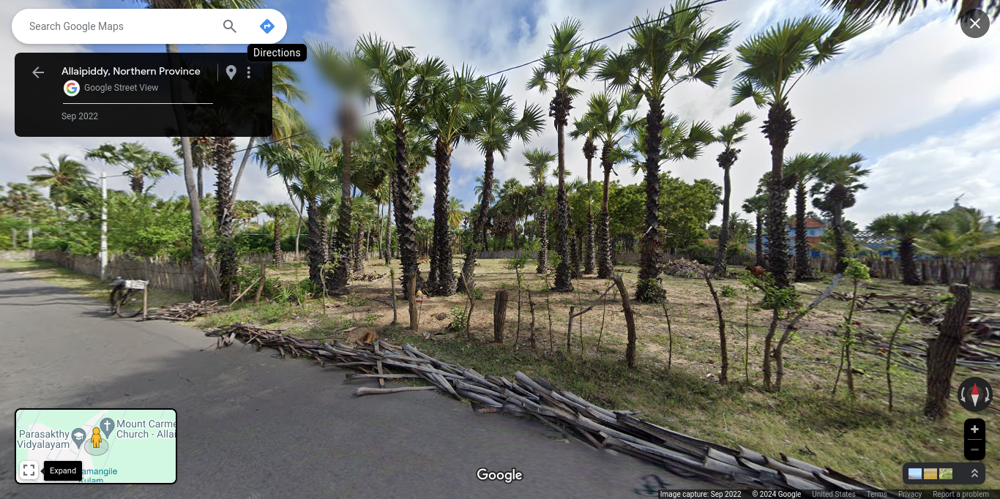

## Navimana North

**Navimana North** Grama Niladhari Division, **Matara Four Gravets** Divisional Secretariat Division, **Matara** District, **Southern** Province

**Matara** Polling Division, **Matara** Electoral District

Population: 523 (2012)

(**LK-3242045**/428)

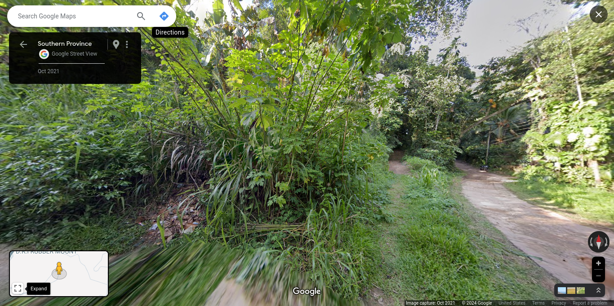

## Narangaspitiya

**Narangaspitiya** Grama Niladhari Division, **Hatharaliyadda** Divisional Secretariat Division, **Kandy** District, **Central** Province

**Galagedara** Polling Division, **Kandy** Electoral District

Population: 335 (2012)

(**LK-2134060**/336)

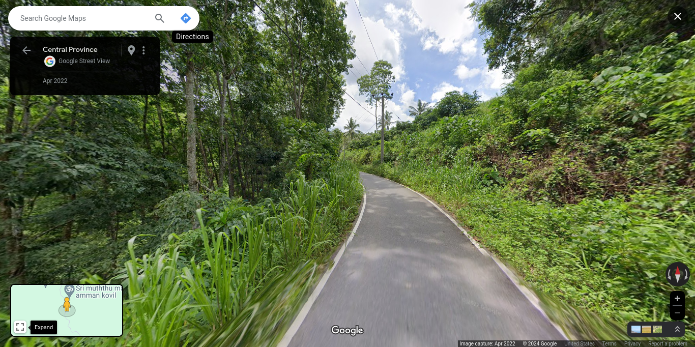

## Dunudambuwewa

**Dunudambuwewa** Grama Niladhari Division, **Nochchiyagama** Divisional Secretariat Division, **Anuradhapura** District, **North Central** Province

**Anuradhapura West** Polling Division, **Anuradhapura** Electoral District

Population: 1,393 (2012)

(**LK-7139095**/336)

## Napana

**Napana** Grama Niladhari Division, **Pathadumbara** Divisional Secretariat Division, **Kandy** District, **Central** Province

**Pathadumbara** Polling Division, **Kandy** Electoral District

Population: 1,295 (2012)

(**LK-2112205**/633)

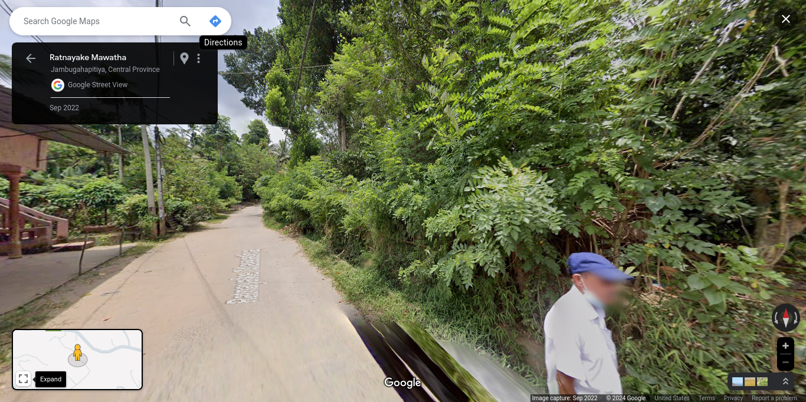

## Chandana Pokuna

**Chandana Pokuna** Grama Niladhari Division, **Hingurakgoda** Divisional Secretariat Division, **Polonnaruwa** District, **North Central** Province

**Minneriya** Polling Division, **Polonnaruwa** Electoral District

Population: 1,253 (2012)

(**LK-7203215**/53)

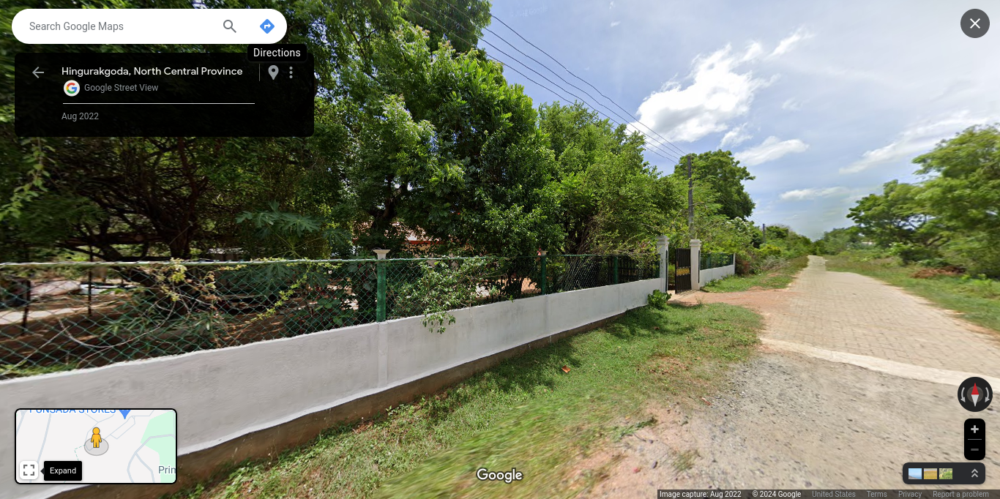

## Rambewa

**Rambewa** Grama Niladhari Division, **Rambewa** Divisional Secretariat Division, **Anuradhapura** District, **North Central** Province

**Medawachchiya** Polling Division, **Anuradhapura** Electoral District

Population: 1,568 (2012)

(**LK-7118150**/100)

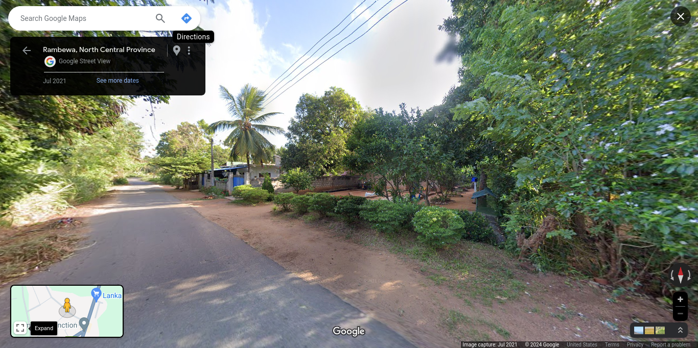

## Meeravodai Muslim West

**Meeravodai Muslim West** Grama Niladhari Division, **Koralai Pattu  West (Oddamavadi)** Divisional Secretariat Division, **Batticaloa** District, **Eastern** Province

**Kalkudah** Polling Division, **Batticaloa** Electoral District

Population: 2,877 (2012)

(**LK-5106030**/207)

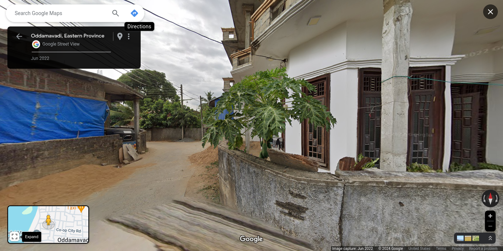

## Gonawala Central

**Gonawala Central** Grama Niladhari Division, **Biyagama** Divisional Secretariat Division, **Gampaha** District, **Western** Province

**Biyagama** Polling Division, **Gampaha** Electoral District

Population: 5,097 (2012)

(**LK-1239190**/277B)

## Akaravita

**Akaravita** Grama Niladhari Division, **Seethawaka** Divisional Secretariat Division, **Colombo** District, **Western** Province

**Avissawella** Polling Division, **Colombo** Electoral District

Population: 1,195 (2012)

(**LK-1115085**/434)

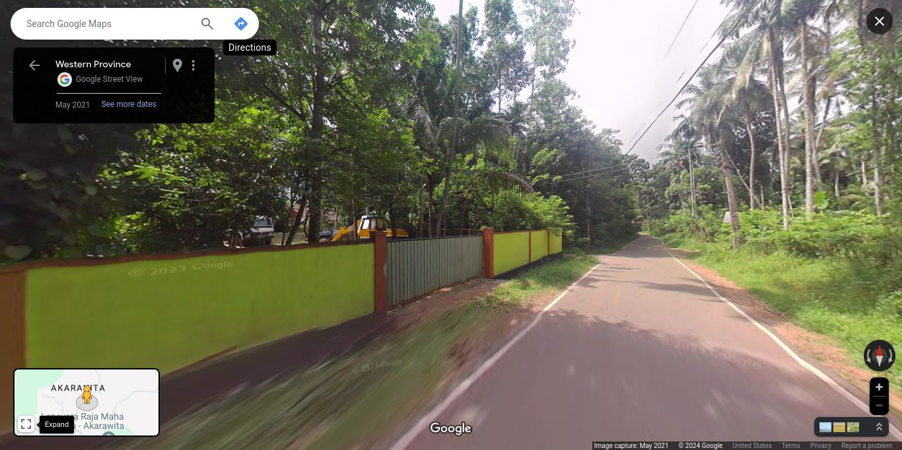

## Devinuwara

**Devinuwara** Grama Niladhari Division, **Devinuwara** Divisional Secretariat Division, **Matara** District, **Southern** Province

**Devinuwara** Polling Division, **Matara** Electoral District

Population: 478 (2012)

(**LK-3245190**/433C)

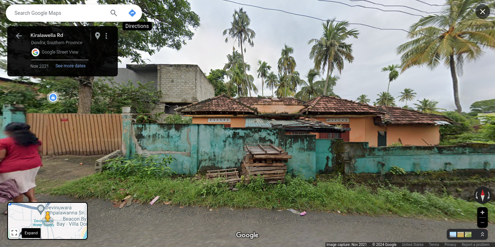

## Ulapane North

**Ulapane North** Grama Niladhari Division, **Ganga Ihala Korale** Divisional Secretariat Division, **Kandy** District, **Central** Province

**Nawalapitiya** Polling Division, **Kandy** Electoral District

Population: 2,177 (2012)

(**LK-2154110**/1071)

## Meegahawatta

**Meegahawatta** Grama Niladhari Division, **Dompe** Divisional Secretariat Division, **Gampaha** District, **Western** Province

**Dompe** Polling Division, **Gampaha** Electoral District

Population: 1,644 (2012)

(**LK-1230390**/410B)

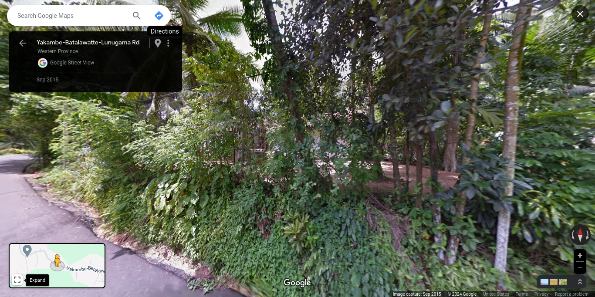

## Mattegoda West

**Mattegoda West** Grama Niladhari Division, **Homagama** Divisional Secretariat Division, **Colombo** District, **Western** Province

**Homagama** Polling Division, **Colombo** Electoral District

Population: 4,931 (2012)

(**LK-1112230**/587)

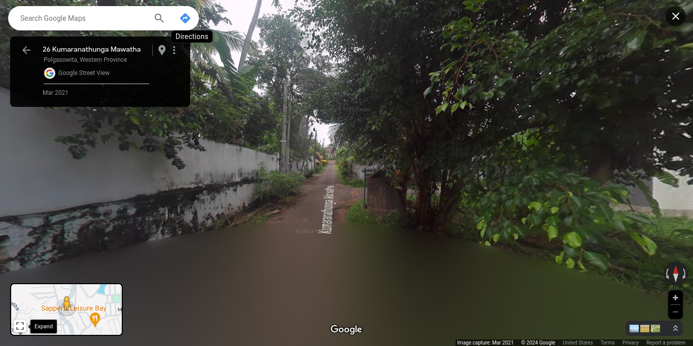

## Katupelella

**Katupelella** Grama Niladhari Division, **Badulla** Divisional Secretariat Division, **Badulla** District, **Uva** Province

**Badulla** Polling Division, **Badulla** Electoral District

Population: 2,437 (2012)

(**LK-8121080**/78H)

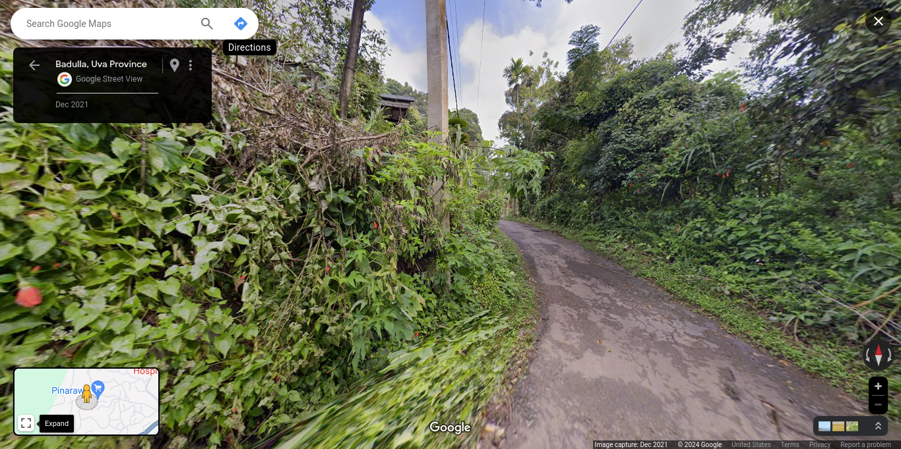

## Olombewa

**Olombewa** Grama Niladhari Division, **Kekirawa** Divisional Secretariat Division, **Anuradhapura** District, **North Central** Province

**Kekirawa** Polling Division, **Anuradhapura** Electoral District

Population: 1,937 (2012)

(**LK-7154155**/638)

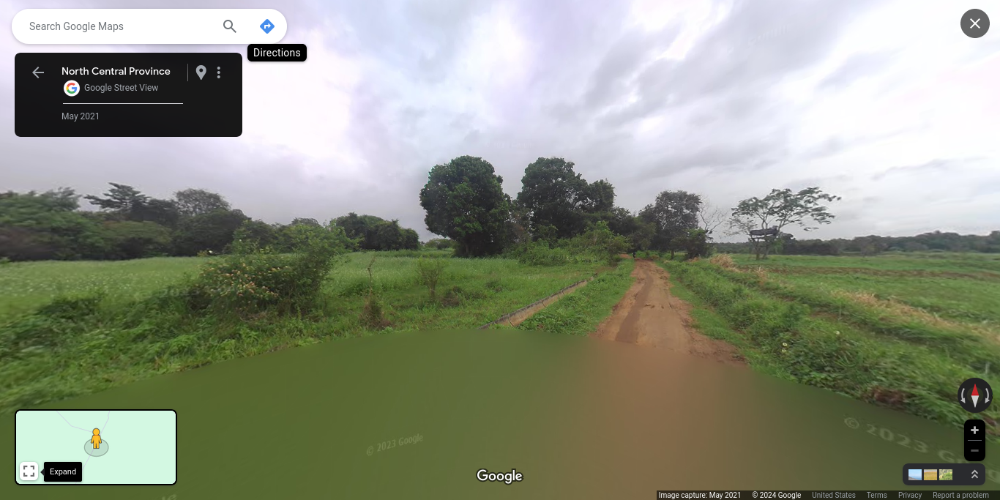

## Sinhala Town

**Sinhala Town** Grama Niladhari Division, **Matale** Divisional Secretariat Division, **Matale** District, **Central** Province

**Matale** Polling Division, **Matale** Electoral District

Population: 1,359 (2012)

(**LK-2218205**/E352A)

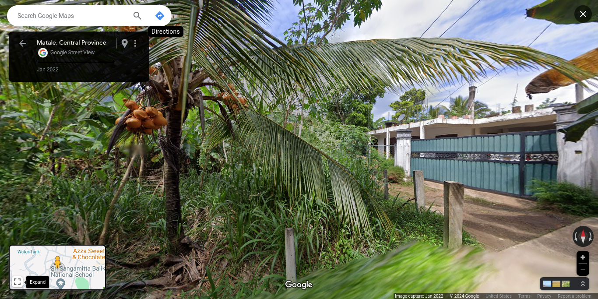

## Badulla South

**Badulla South** Grama Niladhari Division, **Badulla** Divisional Secretariat Division, **Badulla** District, **Uva** Province

**Badulla** Polling Division, **Badulla** Electoral District

Population: 3,557 (2012)

(**LK-8121085**/78)

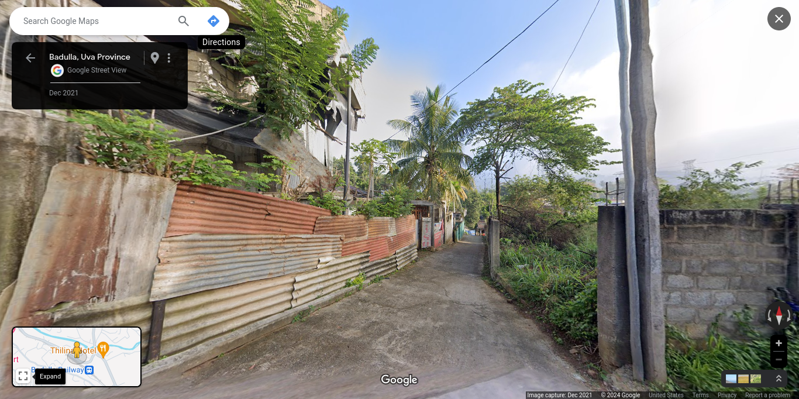

## Thiruketheeswaram

**Thiruketheeswaram** Grama Niladhari Division, **Mannar Town** Divisional Secretariat Division, **Mannar** District, **Northern** Province

**Mannar** Polling Division, **Vanni** Electoral District

Population: 442 (2012)

(**LK-4203200**/MN/86)

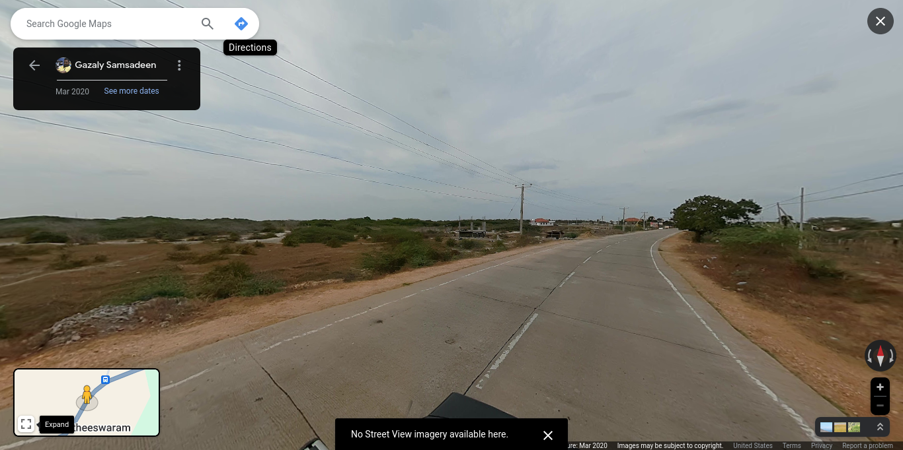

## Ulukkulama

**Ulukkulama** Grama Niladhari Division, **Nuwaragam Palatha Central** Divisional Secretariat Division, **Anuradhapura** District, **North Central** Province

**Anuradhapura West** Polling Division, **Anuradhapura** Electoral District

Population: 1,669 (2012)

(**LK-7115200**/281)

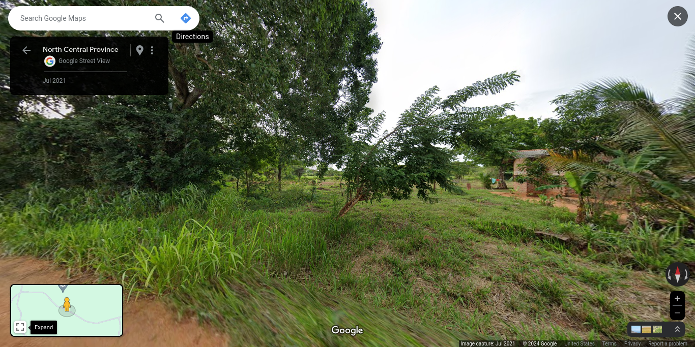

## Ihala Bomiriya

**Ihala Bomiriya** Grama Niladhari Division, **Kaduwela** Divisional Secretariat Division, **Colombo** District, **Western** Province

**Kaduwela** Polling Division, **Colombo** Electoral District

Population: 4,261 (2012)

(**LK-1109030**/471)

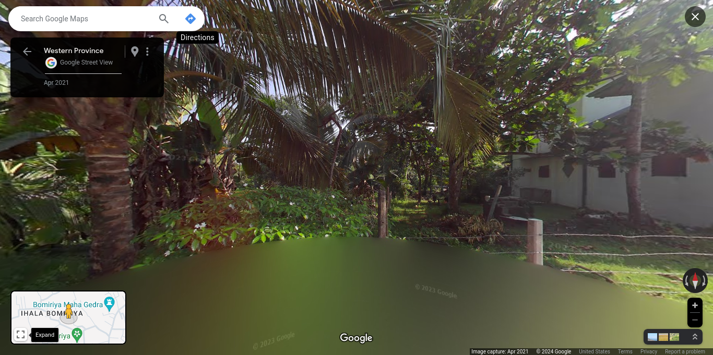

## Kahagolla

**Kahagolla** Grama Niladhari Division, **Haputale** Divisional Secretariat Division, **Badulla** District, **Uva** Province

**Haputale** Polling Division, **Badulla** Electoral District

Population: 2,120 (2012)

(**LK-8139030**/64)

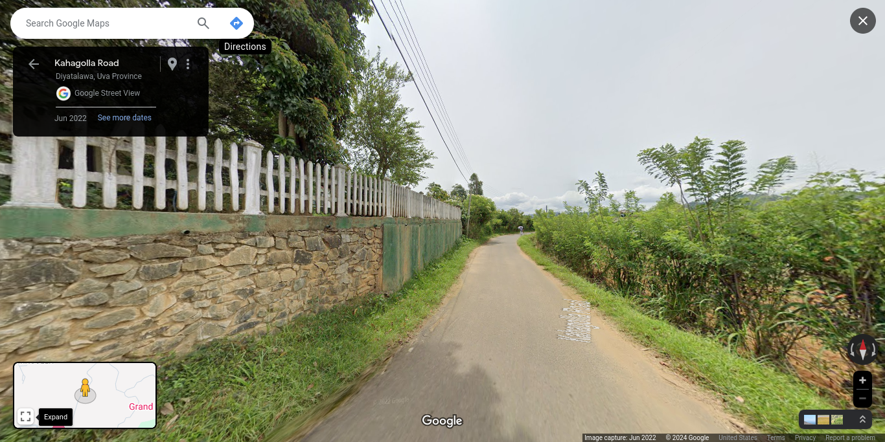

## Mahena

**Mahena** Grama Niladhari Division, **Warakapola** Divisional Secretariat Division, **Kegalle** District, **Sabaragamuwa** Province

**Dedigama** Polling Division, **Kegalle** Electoral District

Population: 2,337 (2012)

(**LK-9218115**/83B)

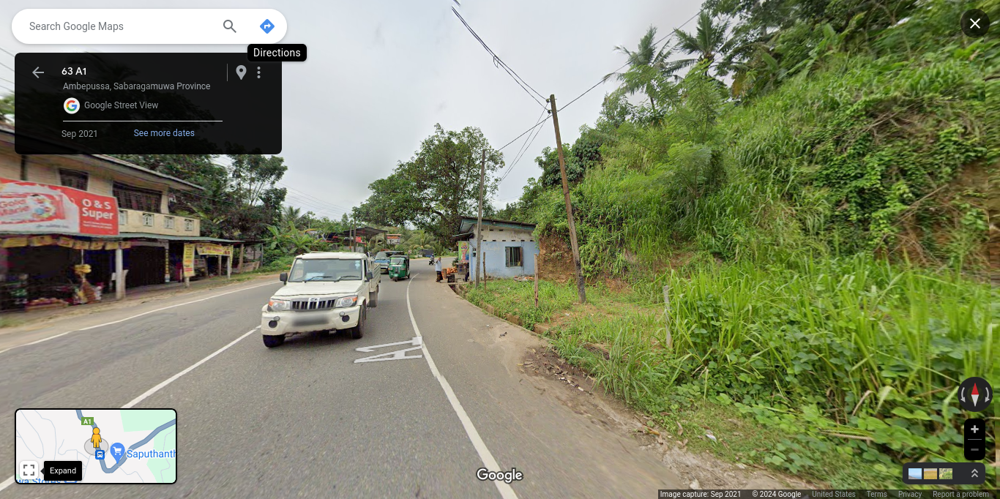

## Meeella

**Meeella** Grama Niladhari Division, **Hakmana** Divisional Secretariat Division, **Matara** District, **Southern** Province

**Hakmana** Polling Division, **Matara** Electoral District

Population: 1,184 (2012)

(**LK-3230025**/281)

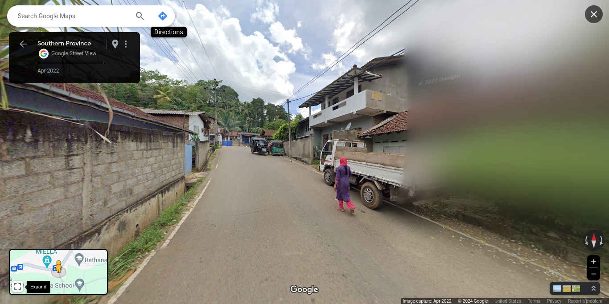

## Uggalla

**Uggalla** Grama Niladhari Division, **Harispattuwa** Divisional Secretariat Division, **Kandy** District, **Central** Province

**Harispattuwa** Polling Division, **Kandy** Electoral District

Population: 825 (2012)

(**LK-2133315**/427)

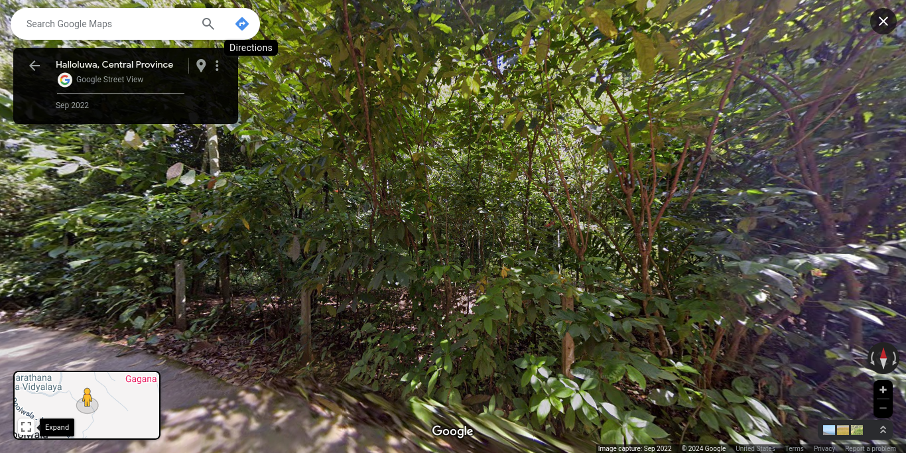

## Rathgalla

**Rathgalla** Grama Niladhari Division, **Kurunegala** Divisional Secretariat Division, **Kurunegala** District, **North Western** Province

**Kurunegala** Polling Division, **Kurunegala** Electoral District

Population: 1,338 (2012)

(**LK-6154220**/821)

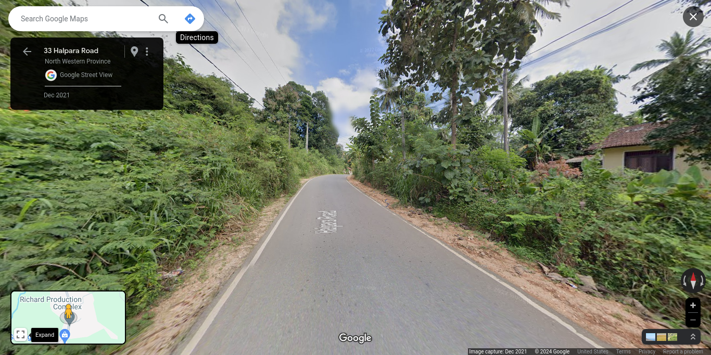

## Thunduwa West

**Thunduwa West** Grama Niladhari Division, **Bentota** Divisional Secretariat Division, **Galle** District, **Southern** Province

**Bentara Elpitiya** Polling Division, **Galle** Electoral District

Population: 1,024 (2012)

(**LK-3103090**/12C)

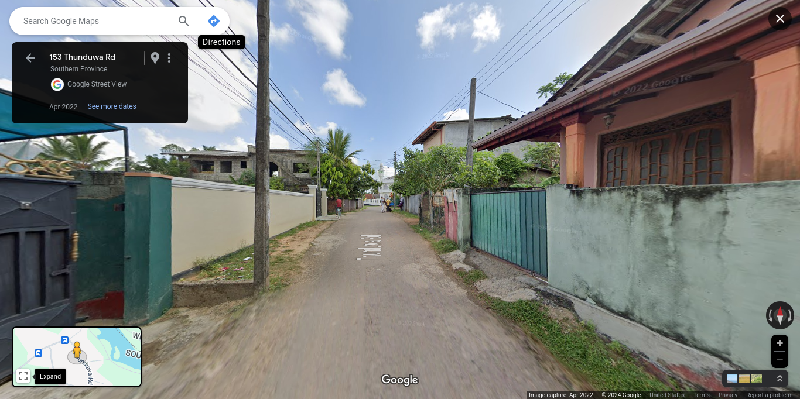

## Wadumulla

**Wadumulla** Grama Niladhari Division, **Balapitiya** Divisional Secretariat Division, **Galle** District, **Southern** Province

**Balapitiya** Polling Division, **Galle** Electoral District

Population: 1,423 (2012)

(**LK-3106235**/87E)

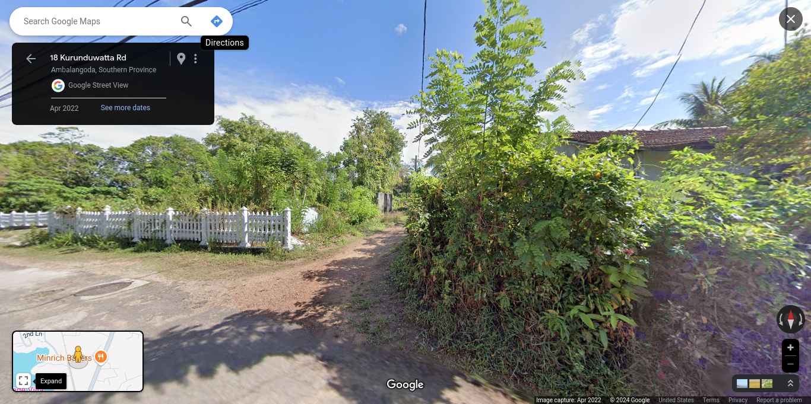

## Neduna

**Neduna** Grama Niladhari Division, **Gampaha** Divisional Secretariat Division, **Gampaha** District, **Western** Province

**Gampaha** Polling Division, **Gampaha** Electoral District

Population: 1,356 (2012)

(**LK-1224235**/236C)

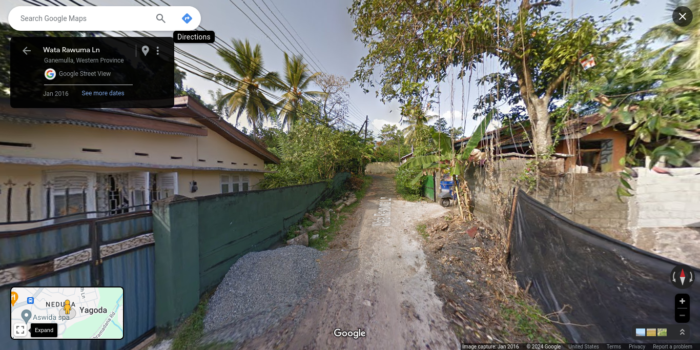

## Thalawa

**Thalawa** Grama Niladhari Division, **Polpithigama** Divisional Secretariat Division, **Kurunegala** District, **North Western** Province

**Galgamuwa** Polling Division, **Kurunegala** Electoral District

Population: 867 (2012)

(**LK-6127015**/331)

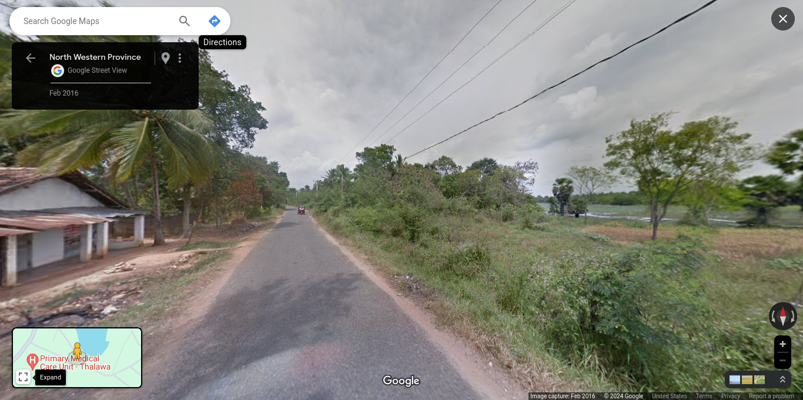

## Yogiyana

**Yogiyana** Grama Niladhari Division, **Dankotuwa** Divisional Secretariat Division, **Puttalam** District, **North Western** Province

**Wennappuwa** Polling Division, **Puttalam** Electoral District

Population: 865 (2012)

(**LK-6248230**/459)

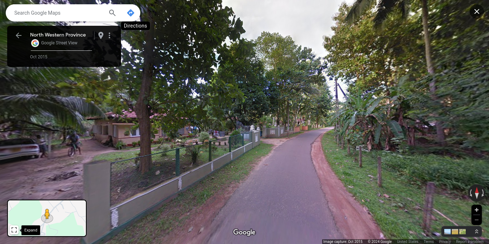

## Meddegama South

**Meddegama South** Grama Niladhari Division, **Dompe** Divisional Secretariat Division, **Gampaha** District, **Western** Province

**Dompe** Polling Division, **Gampaha** Electoral District

Population: 994 (2012)

(**LK-1230185**/383B)

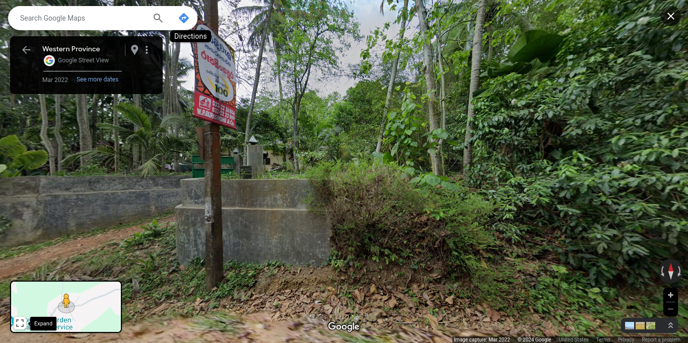

## Hapuwalana

**Hapuwalana** Grama Niladhari Division, **Divulapitiya** Divisional Secretariat Division, **Gampaha** District, **Western** Province

**Divulapitiya** Polling Division, **Gampaha** Electoral District

Population: 788 (2012)

(**LK-1209545**/87)

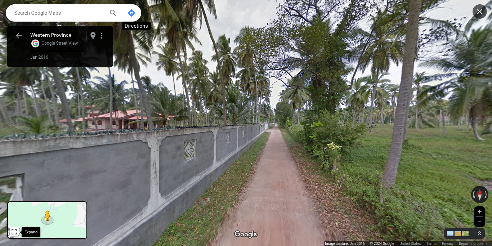

## Walana

**Walana** Grama Niladhari Division, **Panadura** Divisional Secretariat Division, **Kalutara** District, **Western** Province

**Panadura** Polling Division, **Kalutara** Electoral District

Population: 3,488 (2012)

(**LK-1303145**/679)

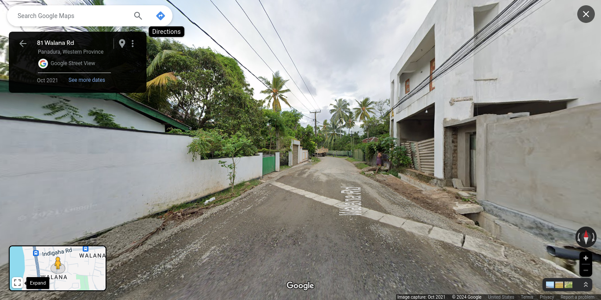

## Walagepiyadda

**Walagepiyadda** Grama Niladhari Division, **Athuraliya** Divisional Secretariat Division, **Matara** District, **Southern** Province

**Akuressa** Polling Division, **Matara** Electoral District

Population: 1,081 (2012)

(**LK-3215090**/313C)

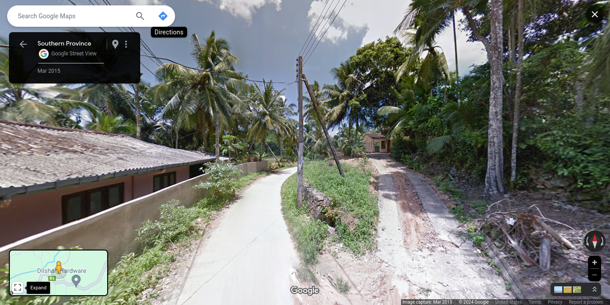

## Arumugathan Kudiyiruppu 1

**Arumugathan Kudiyiruppu 1** Grama Niladhari Division, **Eravur Pattu** Divisional Secretariat Division, **Batticaloa** District, **Eastern** Province

**Batticaloa** Polling Division, **Batticaloa** Electoral District

Population: 1,587 (2012)

(**LK-5112145**/189)

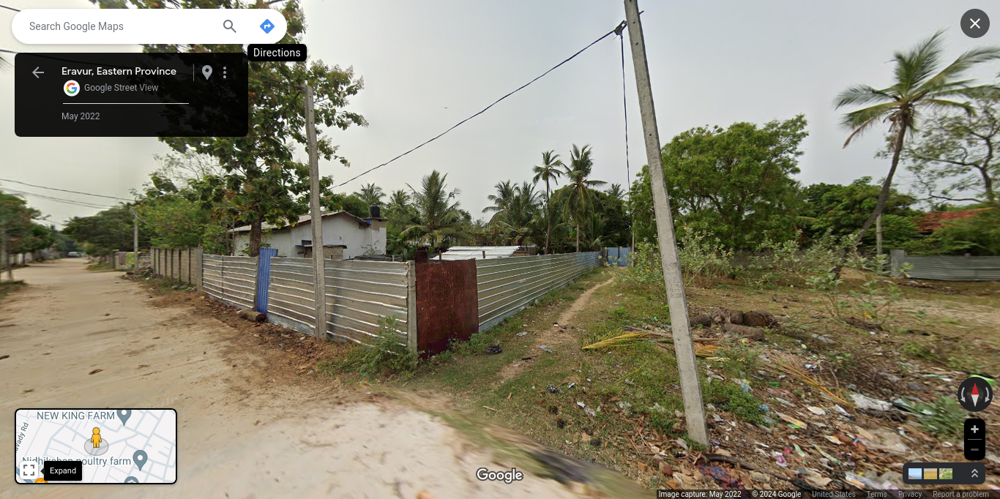

## Puloly North

**Puloly North** Grama Niladhari Division, **Vadamaradchi North (Point Pedro)** Divisional Secretariat Division, **Jaffna** District, **Northern** Province

**Point Pedro** Polling Division, **Jaffna** Electoral District

Population: 1,796 (2012)

(**LK-4127125**/J/407)

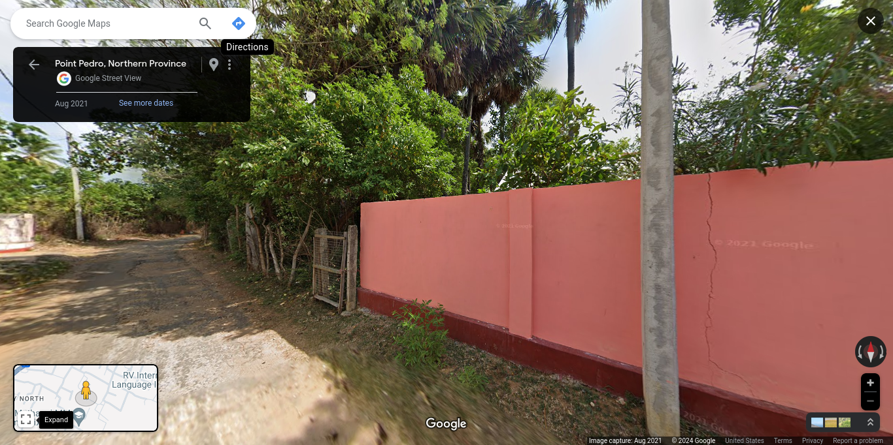

## Eravur 06D

**Eravur 06D** Grama Niladhari Division, **Eravur Town** Divisional Secretariat Division, **Batticaloa** District, **Eastern** Province

**Batticaloa** Polling Division, **Batticaloa** Electoral District

Population: 1,209 (2012)

(**LK-5115065**/192D)

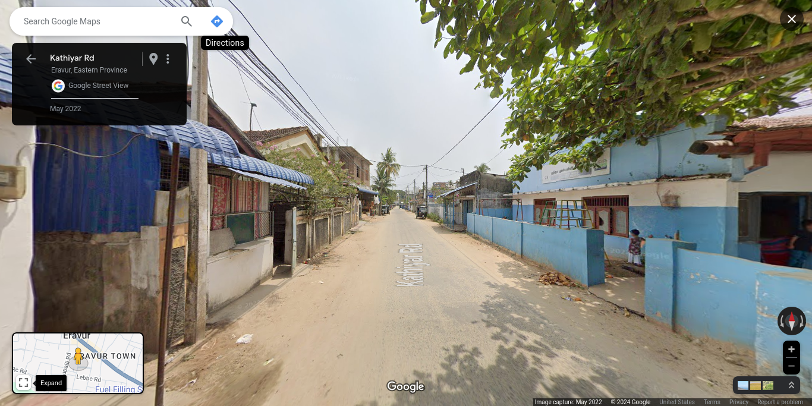

## Paragahadeniya

**Paragahadeniya** Grama Niladhari Division, **Mawathagama** Divisional Secretariat Division, **Kurunegala** District, **North Western** Province

**Mawathagama** Polling Division, **Kurunegala** Electoral District

Population: 1,851 (2012)

(**LK-6160230**/653)

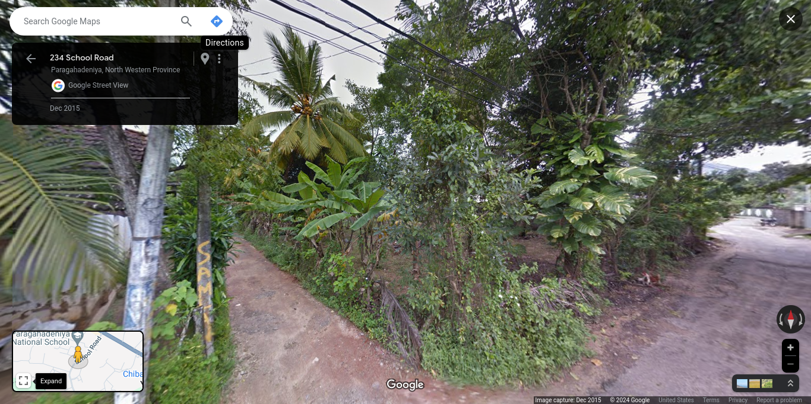

## Mahara Nugegoda North

**Mahara Nugegoda North** Grama Niladhari Division, **Mahara** Divisional Secretariat Division, **Gampaha** District, **Western** Province

**Mahara** Polling Division, **Gampaha** Electoral District

Population: 2,558 (2012)

(**LK-1233270**/247B)

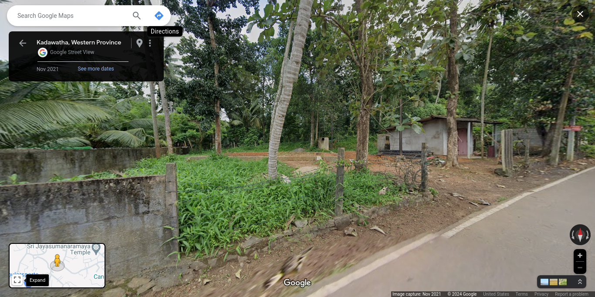

## Horagolla South

**Horagolla South** Grama Niladhari Division, **Gampaha** Divisional Secretariat Division, **Gampaha** District, **Western** Province

**Gampaha** Polling Division, **Gampaha** Electoral District

Population: 1,945 (2012)

(**LK-1224230**/216A)

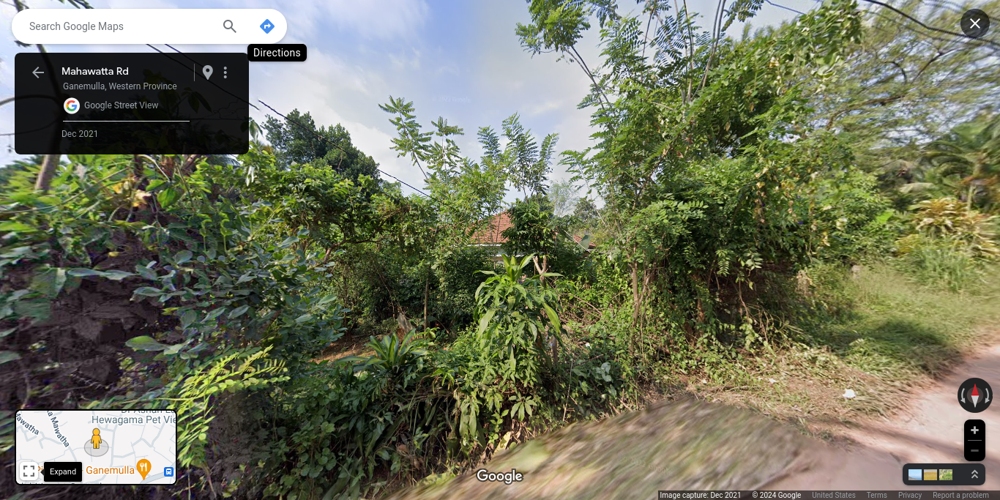

## Pitipana Town

**Pitipana Town** Grama Niladhari Division, **Homagama** Divisional Secretariat Division, **Colombo** District, **Western** Province

**Homagama** Polling Division, **Colombo** Electoral District

Population: 3,062 (2012)

(**LK-1112145**/484B)

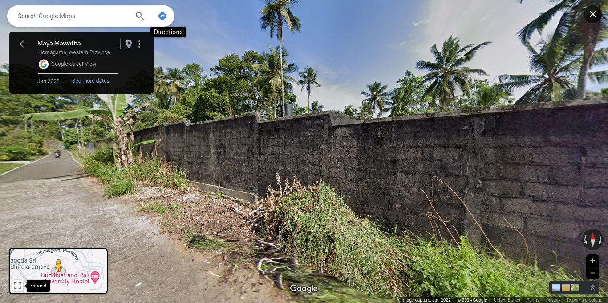

## Mavadichenai

**Mavadichenai** Grama Niladhari Division, **Koralai Pattu Central** Divisional Secretariat Division, **Batticaloa** District, **Eastern** Province

**Kalkudah** Polling Division, **Batticaloa** Electoral District

Population: 2,810 (2012)

(**LK-5104040**/208A)

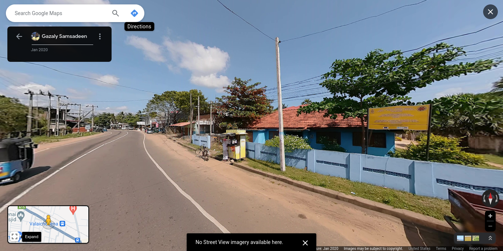

## Waragashinna

**Waragashinna** Grama Niladhari Division, **Akurana** Divisional Secretariat Division, **Kandy** District, **Central** Province

**Harispattuwa** Polling Division, **Kandy** Electoral District

Population: 2,228 (2012)

(**LK-2109165**/566)

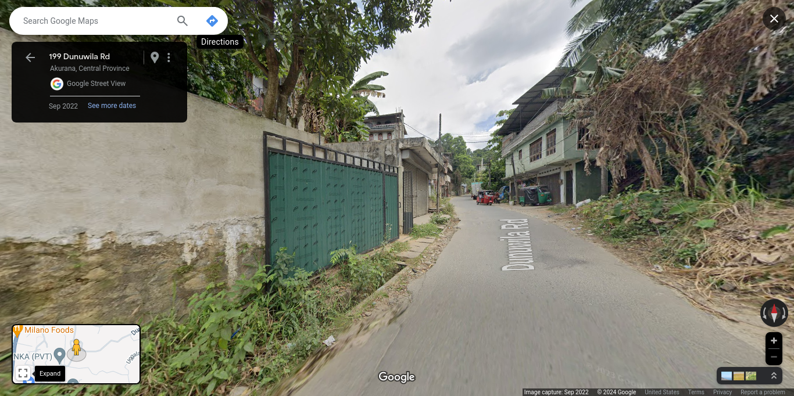

## Mahipalagoda

**Mahipalagoda** Grama Niladhari Division, **Gampaha** Divisional Secretariat Division, **Gampaha** District, **Western** Province

**Gampaha** Polling Division, **Gampaha** Electoral District

Population: 1,596 (2012)

(**LK-1224105**/230)

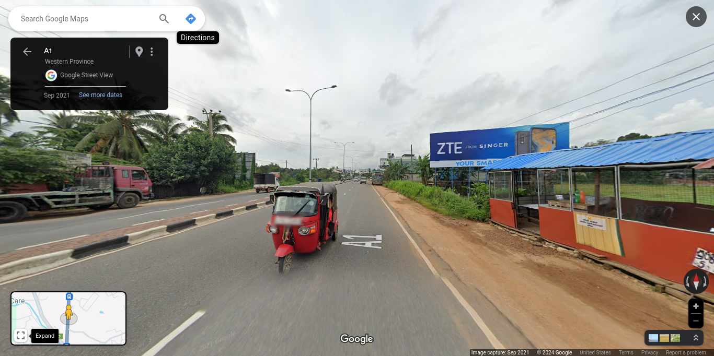

## Mihindupura

**Mihindupura** Grama Niladhari Division, **Beliatta** Divisional Secretariat Division, **Hambantota** District, **Southern** Province

**Beliatta** Polling Division, **Hambantota** Electoral District

Population: 734 (2012)

(**LK-3330300**/364)

## Puwakgahakadawala

**Puwakgahakadawala** Grama Niladhari Division, **Bingiriya** Divisional Secretariat Division, **Kurunegala** District, **North Western** Province

**Bingiriya** Polling Division, **Kurunegala** Electoral District

Population: 888 (2012)

(**LK-6142050**/1447)

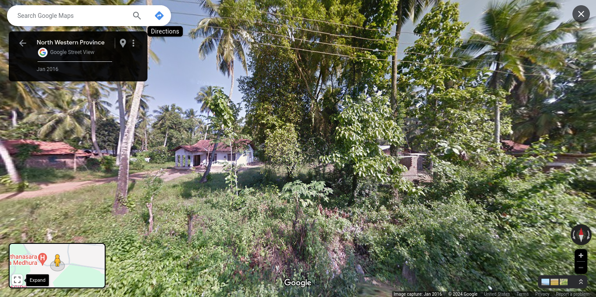

## Kumarimulla

**Kumarimulla** Grama Niladhari Division, **Dompe** Divisional Secretariat Division, **Gampaha** District, **Western** Province

**Dompe** Polling Division, **Gampaha** Electoral District

Population: 1,567 (2012)

(**LK-1230450**/419)

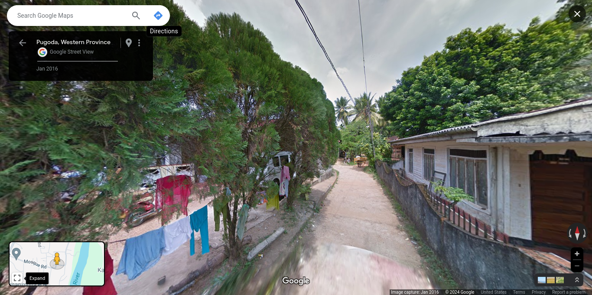

## Sammanthurai 05

**Sammanthurai 05** Grama Niladhari Division, **Samanthurai** Divisional Secretariat Division, **Ampara** District, **Eastern** Province

**Samanthurai** Polling Division, **Digamadulla** Electoral District

Population: 814 (2012)

(**LK-5218045**/78B)

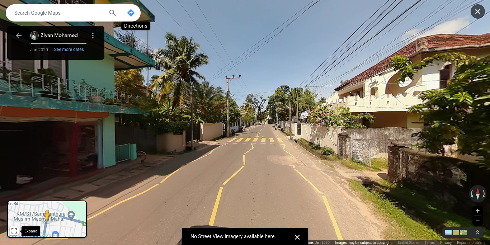

## Vedducoddai North

**Vedducoddai North** Grama Niladhari Division, **Valikamam West (Chankanai)** Divisional Secretariat Division, **Jaffna** District, **Northern** Province

**Vaddukoddai** Polling Division, **Jaffna** Electoral District

Population: 1,341 (2012)

(**LK-4106010**/J/158)

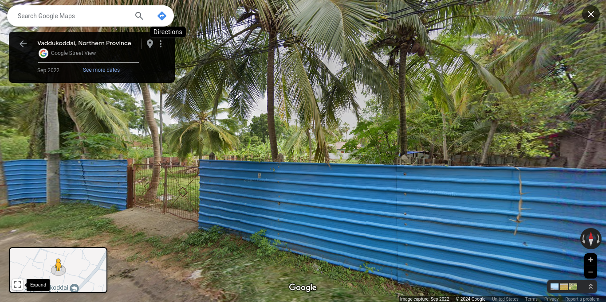

## Wetakeyawa

**Wetakeyawa** Grama Niladhari Division, **Pannala** Divisional Secretariat Division, **Kurunegala** District, **North Western** Province

**Katugampola** Polling Division, **Kurunegala** Electoral District

Population: 1,676 (2012)

(**LK-6178315**/1608)

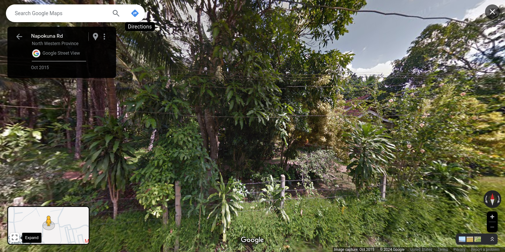

## Anpuvalipuram

**Anpuvalipuram** Grama Niladhari Division, **Trincomalee Town and Gravets** Divisional Secretariat Division, **Trincomalee** District, **Eastern** Province

**Trincomalee** Polling Division, **Trincomalee** Electoral District

Population: 4,205 (2012)

(**LK-5315085**/243C)

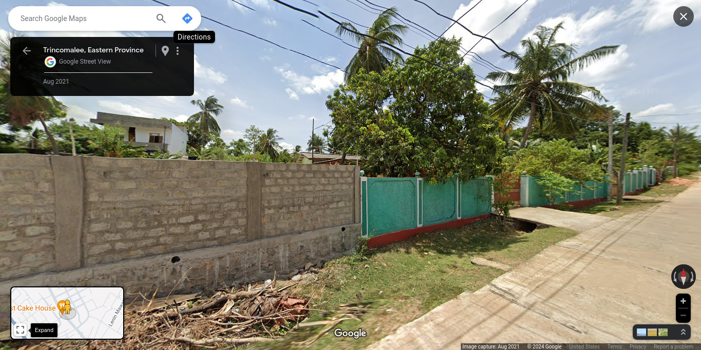

## Pannala

**Pannala** Grama Niladhari Division, **Alawwa** Divisional Secretariat Division, **Kurunegala** District, **North Western** Province

**Dambadeniya** Polling Division, **Kurunegala** Electoral District

Population: 1,030 (2012)

(**LK-6184030**/969)

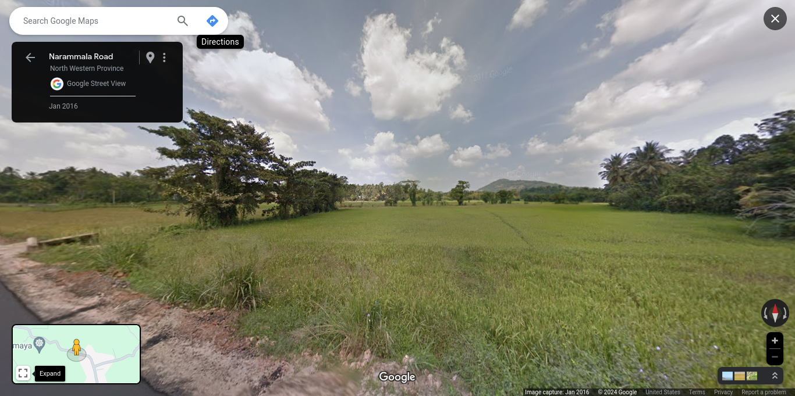

## Kiringadeniya

**Kiringadeniya** Grama Niladhari Division, **Mawanella** Divisional Secretariat Division, **Kegalle** District, **Sabaragamuwa** Province

**Mawanella** Polling Division, **Kegalle** Electoral District

Population: 3,008 (2012)

(**LK-9206145**/30)

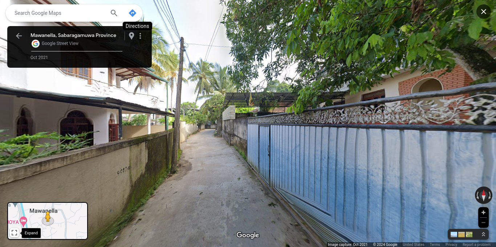

## Pahala Biyanvila West

**Pahala Biyanvila West** Grama Niladhari Division, **Biyagama** Divisional Secretariat Division, **Gampaha** District, **Western** Province

**Biyagama** Polling Division, **Gampaha** Electoral District

Population: 4,708 (2012)

(**LK-1239095**/268A)

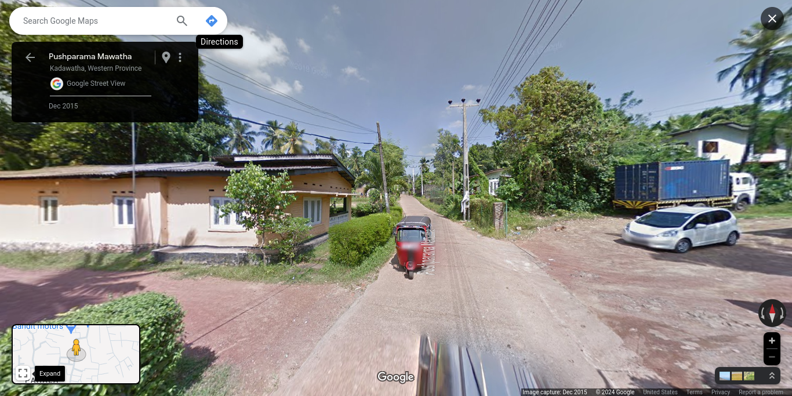

## Maraluwawa

**Maraluwawa** Grama Niladhari Division, **Mallawapitiya** Divisional Secretariat Division, **Kurunegala** District, **North Western** Province

**Mawathagama** Polling Division, **Kurunegala** Electoral District

Population: 1,518 (2012)

(**LK-6157045**/716)

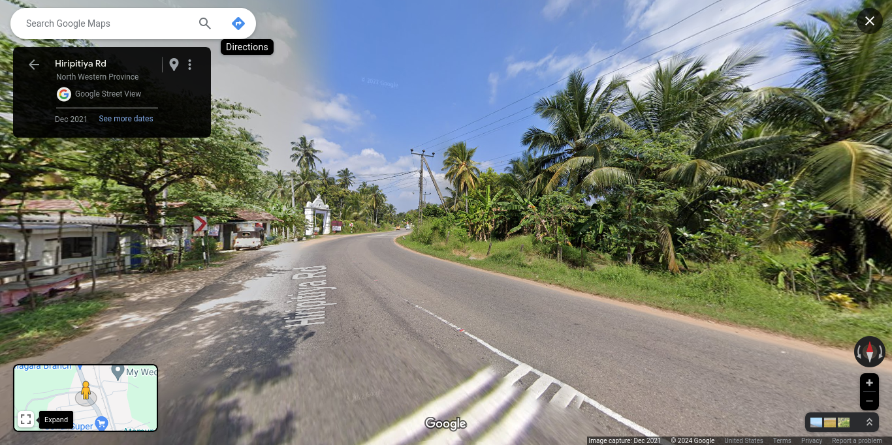

## Girithale

**Girithale** Grama Niladhari Division, **Hingurakgoda** Divisional Secretariat Division, **Polonnaruwa** District, **North Central** Province

**Minneriya** Polling Division, **Polonnaruwa** Electoral District

Population: 1,030 (2012)

(**LK-7203180**/36)

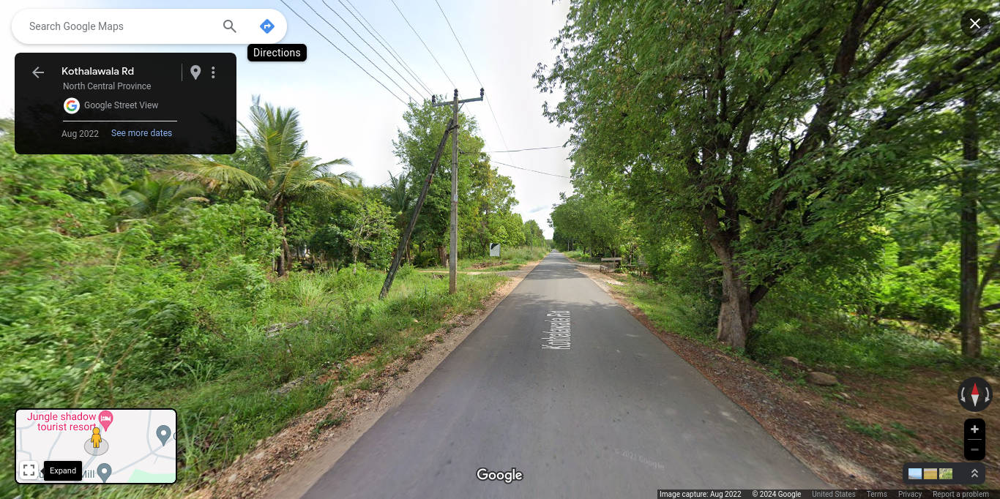

## Savatkaddu

**Savatkaddu** Grama Niladhari Division, **Mannar Town** Divisional Secretariat Division, **Mannar** District, **Northern** Province

**Mannar** Polling Division, **Vanni** Electoral District

Population: 1,834 (2012)

(**LK-4203150**/MN/75)

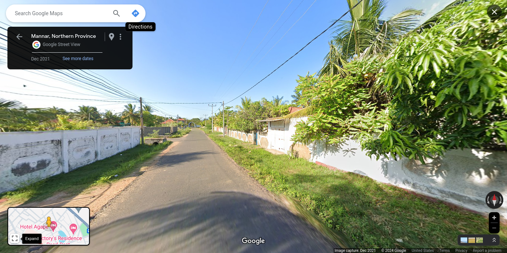

## Pothuvil 01/ Unit 2

**Pothuvil 01/ Unit 2** Grama Niladhari Division, **Pothuvil** Divisional Secretariat Division, **Ampara** District, **Eastern** Province

**Pothuvil** Polling Division, **Digamadulla** Electoral District

Population: 1,052 (2012)

(**LK-5248055**/P/02)

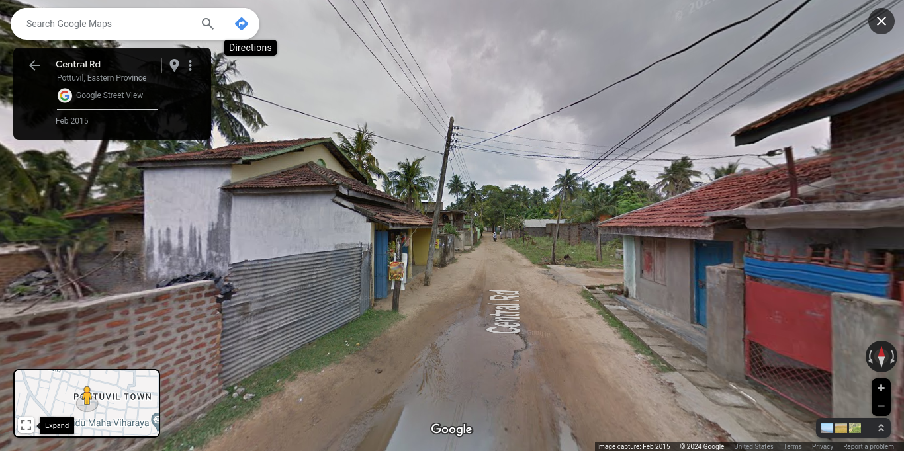

## Ihala Thalawa

**Ihala Thalawa** Grama Niladhari Division, **Thalawa** Divisional Secretariat Division, **Anuradhapura** District, **North Central** Province

**Kalawewa** Polling Division, **Anuradhapura** Electoral District

Population: 2,308 (2012)

(**LK-7148040**/404)

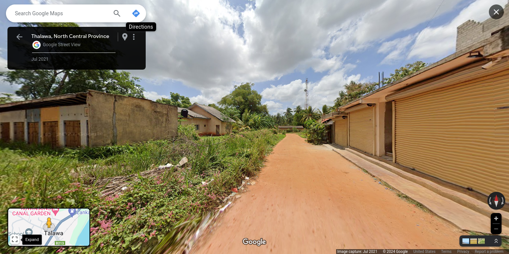

## Maligakanda

**Maligakanda** Grama Niladhari Division, **Colombo** Divisional Secretariat Division, **Colombo** District, **Western** Province

**Colombo Central** Polling Division, **Colombo** Electoral District

Population: 8,526 (2012)

(**LK-1103160**/)

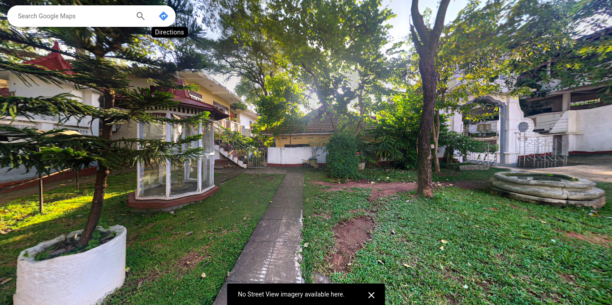

## Kaluwamodara East

**Kaluwamodara East** Grama Niladhari Division, **Beruwala** Divisional Secretariat Division, **Kalutara** District, **Western** Province

**Beruwala** Polling Division, **Kalutara** Electoral District

Population: 1,362 (2012)

(**LK-1324385**/762C)

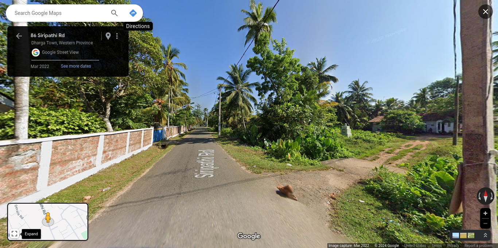

## Thalangama North A

**Thalangama North A** Grama Niladhari Division, **Kaduwela** Divisional Secretariat Division, **Colombo** District, **Western** Province

**Kaduwela** Polling Division, **Colombo** Electoral District

Population: 9,250 (2012)

(**LK-1109150**/477)

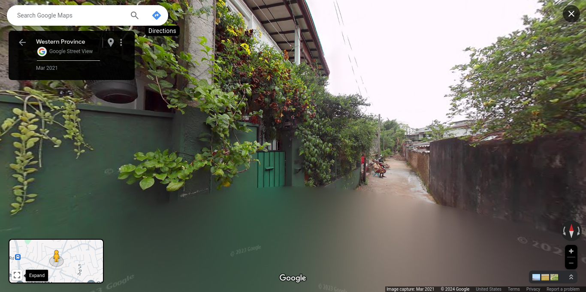

## Palakudawa

**Palakudawa** Grama Niladhari Division, **Kalpitiya** Divisional Secretariat Division, **Puttalam** District, **North Western** Province

**Puttalam** Polling Division, **Puttalam** Electoral District

Population: 2,464 (2012)

(**LK-6203090**/626C)

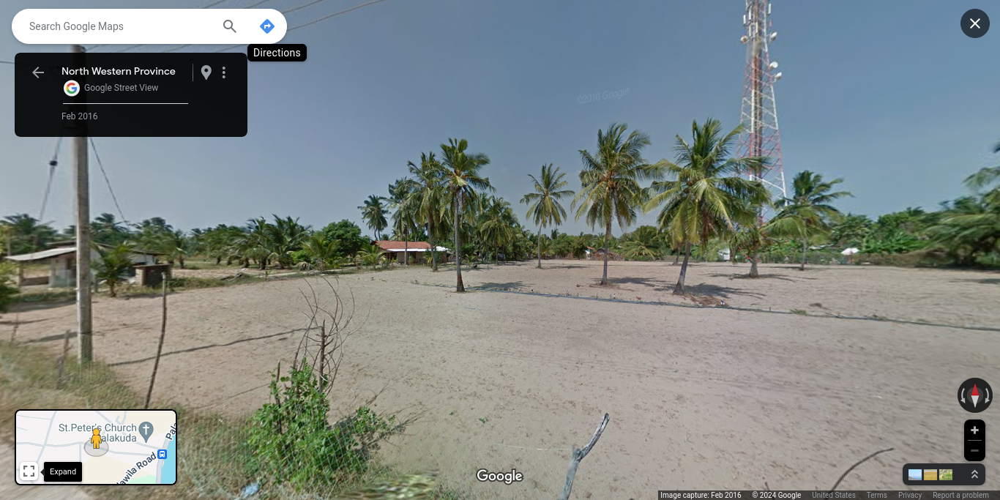

## Galmaduwa

**Galmaduwa** Grama Niladhari Division, **Thalawa** Divisional Secretariat Division, **Anuradhapura** District, **North Central** Province

**Kalawewa** Polling Division, **Anuradhapura** Electoral District

Population: 926 (2012)

(**LK-7148180**/378)

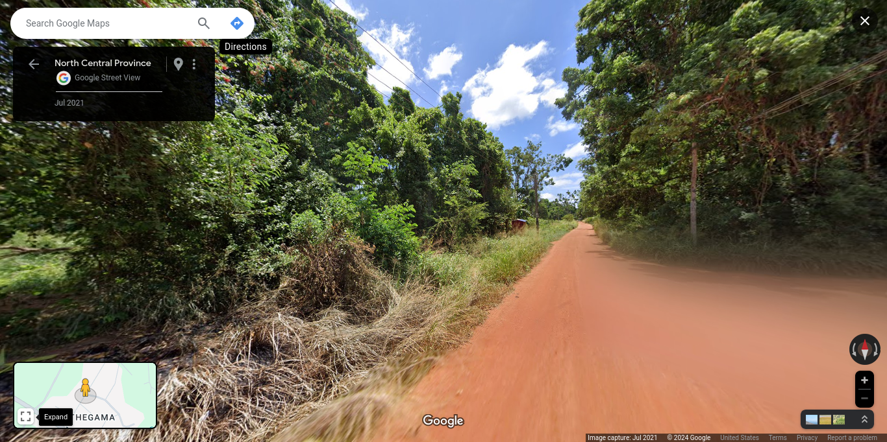

## Bamunumulla (Muslim)

**Bamunumulla (Muslim)** Grama Niladhari Division, **Bandaragama** Divisional Secretariat Division, **Kalutara** District, **Western** Province

**Bandaragama** Polling Division, **Kalutara** Electoral District

Population: 1,165 (2012)

(**LK-1306270**/659C)

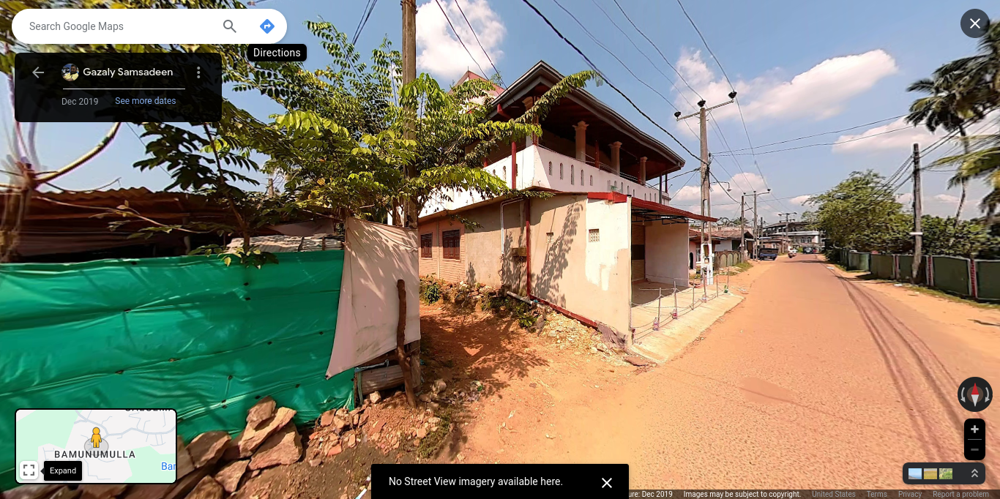

## Pahala Talawa

**Pahala Talawa** Grama Niladhari Division, **Thalawa** Divisional Secretariat Division, **Anuradhapura** District, **North Central** Province

**Kalawewa** Polling Division, **Anuradhapura** Electoral District

Population: 1,173 (2012)

(**LK-7148010**/407)

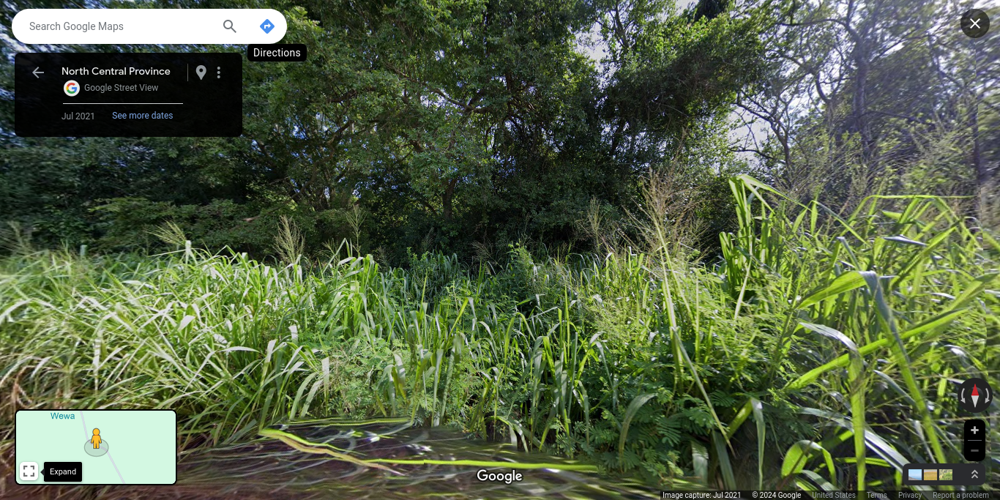

## New Bazaar

**New Bazaar** Grama Niladhari Division, **Colombo** Divisional Secretariat Division, **Colombo** District, **Western** Province

**Colombo Central** Polling Division, **Colombo** Electoral District

Population: 13,436 (2012)

(**LK-1103070**/)

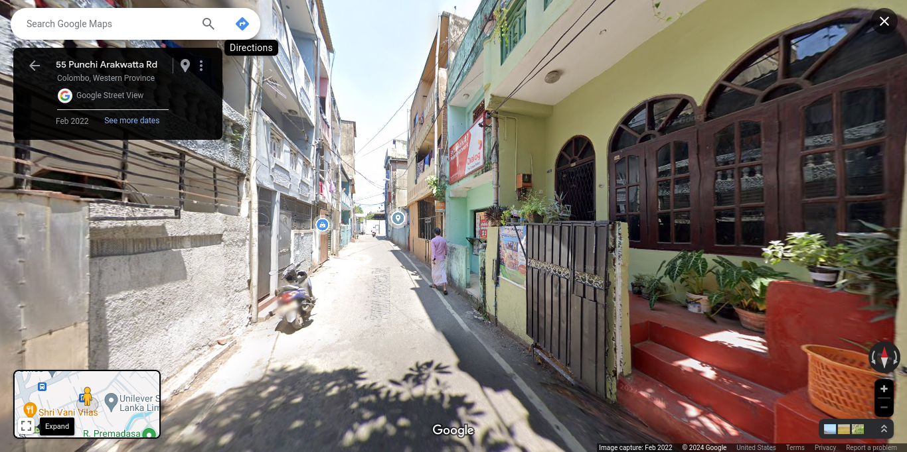

## Bambarenda South

**Bambarenda South** Grama Niladhari Division, **Dickwella** Divisional Secretariat Division, **Matara** District, **Southern** Province

**Devinuwara** Polling Division, **Matara** Electoral District

Population: 1,478 (2012)

(**LK-3248195**/441)

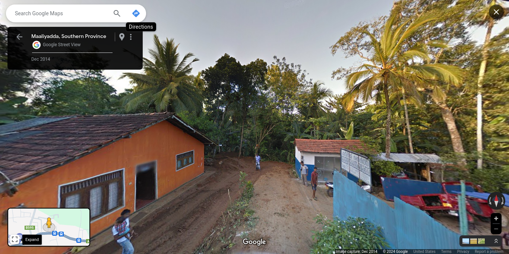

## Chankanai East

**Chankanai East** Grama Niladhari Division, **Valikamam West (Chankanai)** Divisional Secretariat Division, **Jaffna** District, **Northern** Province

**Vaddukoddai** Polling Division, **Jaffna** Electoral District

Population: 1,596 (2012)

(**LK-4106110**/J/178)

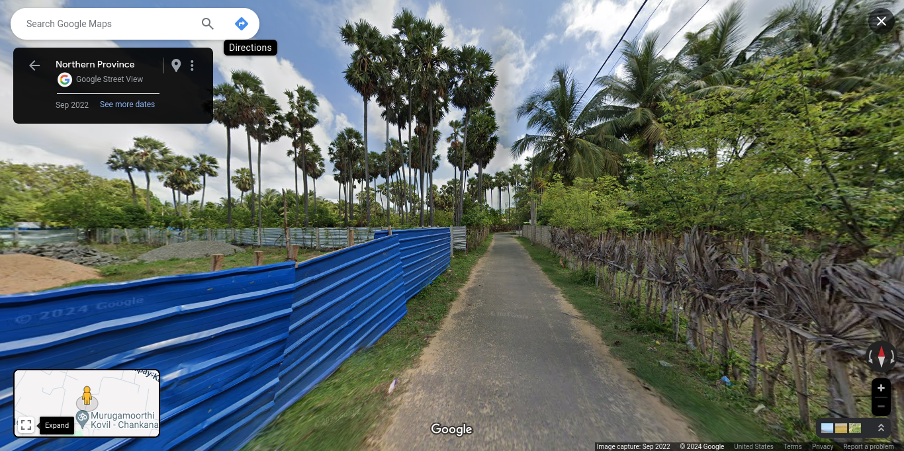

## Thalpegoda

**Thalpegoda** Grama Niladhari Division, **Akmeemana** Divisional Secretariat Division, **Galle** District, **Southern** Province

**Akmeemana** Polling Division, **Galle** Electoral District

Population: 779 (2012)

(**LK-3145290**/133E)

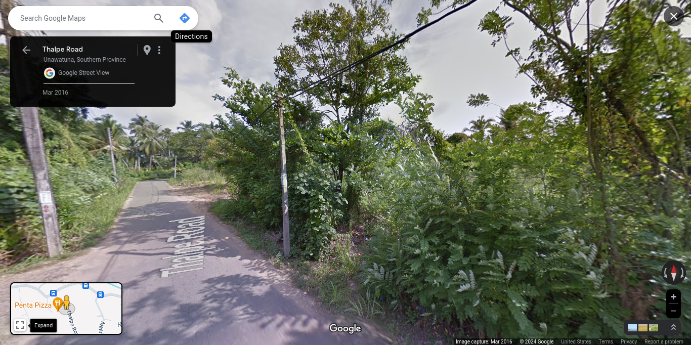

## Maruthamunai 05

**Maruthamunai 05** Grama Niladhari Division, **Kalmunai** Divisional Secretariat Division, **Ampara** District, **Eastern** Province

**Kalmunai** Polling Division, **Digamadulla** Electoral District

Population: 1,203 (2012)

(**LK-5224035**/KP/67D)

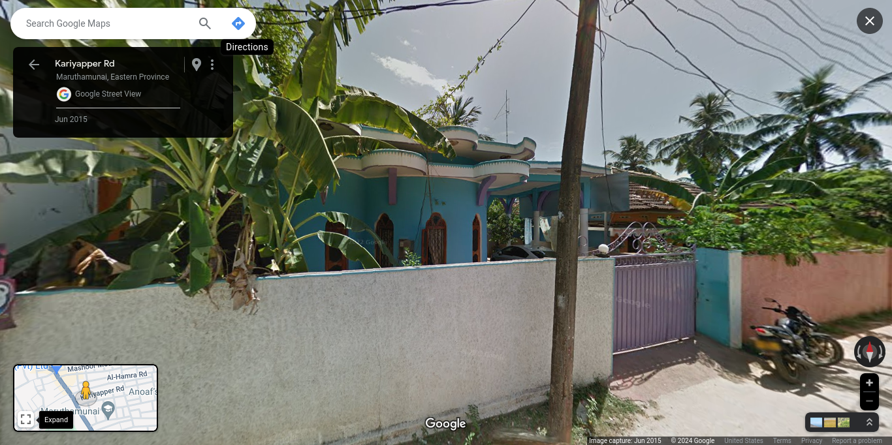

## Kanumale

**Kanumale** Grama Niladhari Division, **Weerambugedara** Divisional Secretariat Division, **Kurunegala** District, **North Western** Province

**Polgahawela** Polling Division, **Kurunegala** Electoral District

Population: 2,177 (2012)

(**LK-6166135**/855)

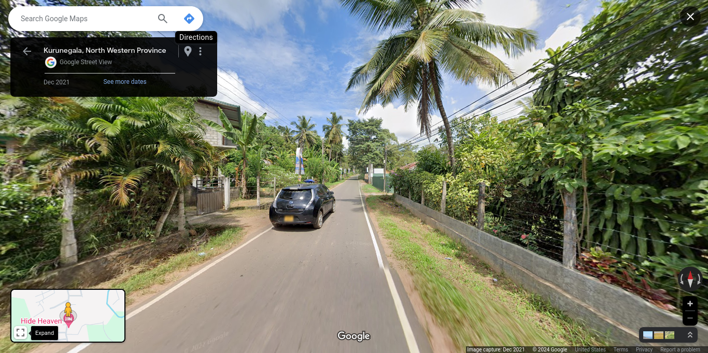

## Thispanepura

**Thispanepura** Grama Niladhari Division, **Thambuttegama** Divisional Secretariat Division, **Anuradhapura** District, **North Central** Province

**Kalawewa** Polling Division, **Anuradhapura** Electoral District

Population: 875 (2012)

(**LK-7145100**/428)

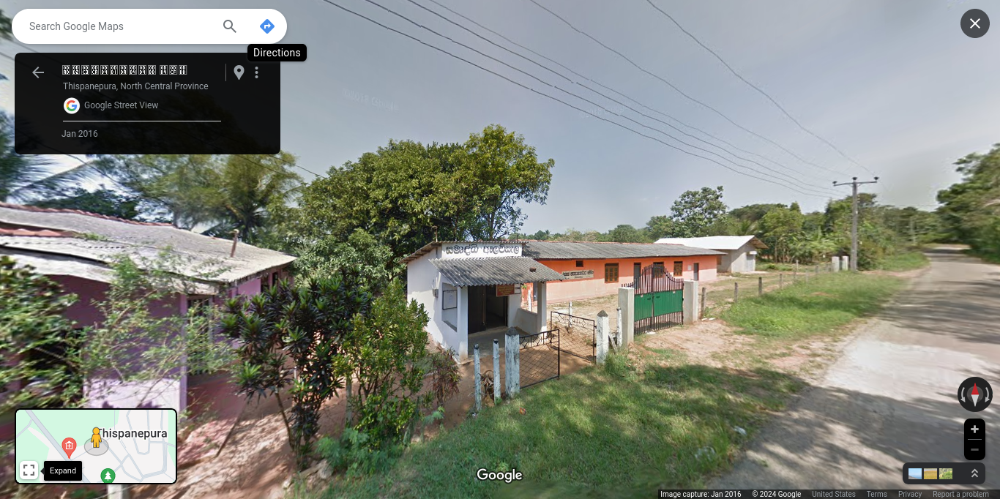

## Mirihana South

**Mirihana South** Grama Niladhari Division, **Maharagama** Divisional Secretariat Division, **Colombo** District, **Western** Province

**Maharagama** Polling Division, **Colombo** Electoral District

Population: 6,043 (2012)

(**LK-1121005**/523A)

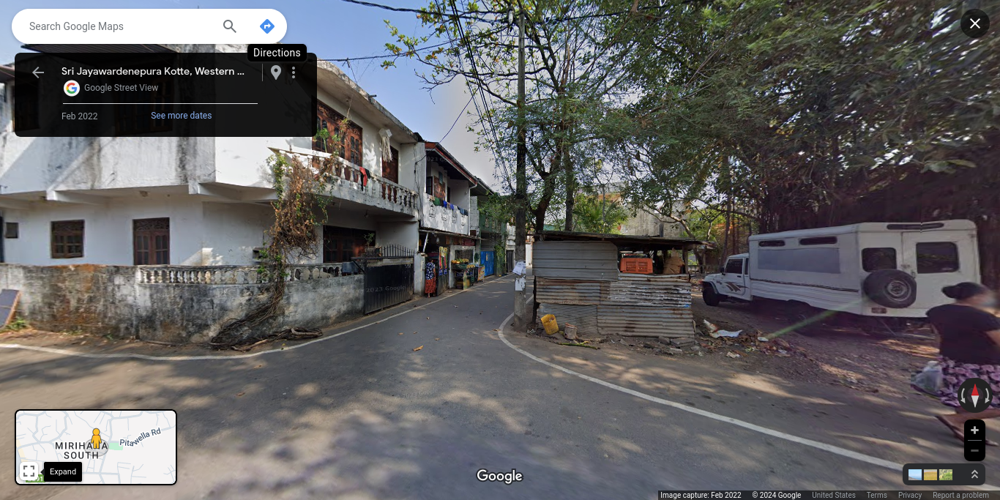

## Himbutana West

**Himbutana West** Grama Niladhari Division, **Kolonnawa** Divisional Secretariat Division, **Colombo** District, **Western** Province

**Kolonnawa** Polling Division, **Colombo** Electoral District

Population: 3,344 (2012)

(**LK-1106180**/503)

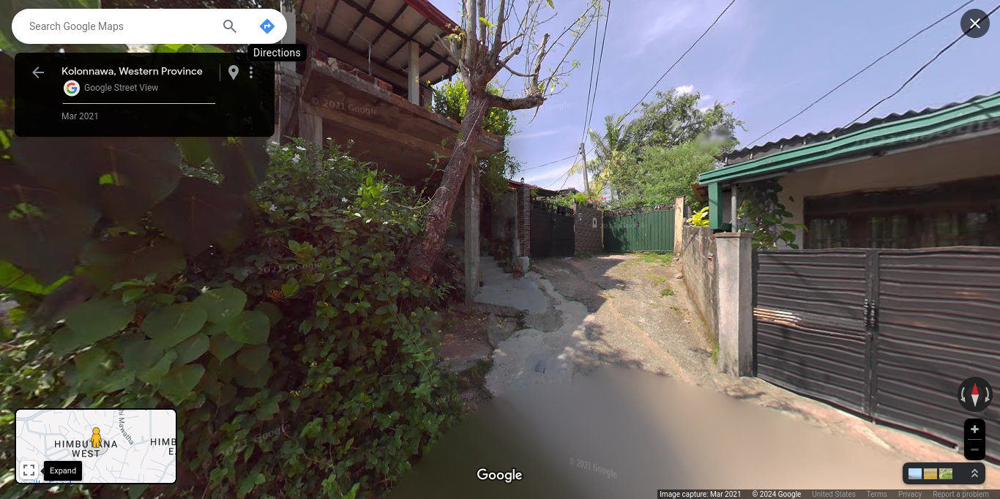

## Ariyalai North West

**Ariyalai North West** Grama Niladhari Division, **Nallur** Divisional Secretariat Division, **Jaffna** District, **Northern** Province

**Nallur** Polling Division, **Jaffna** Electoral District

Population: 1,831 (2012)

(**LK-4133015**/J/91)

## Manipay North

**Manipay North** Grama Niladhari Division, **Valikamam South-West (Sandilipay)** Divisional Secretariat Division, **Jaffna** District, **Northern** Province

**Manipay** Polling Division, **Jaffna** Electoral District

Population: 1,343 (2012)

(**LK-4109045**/J/137)

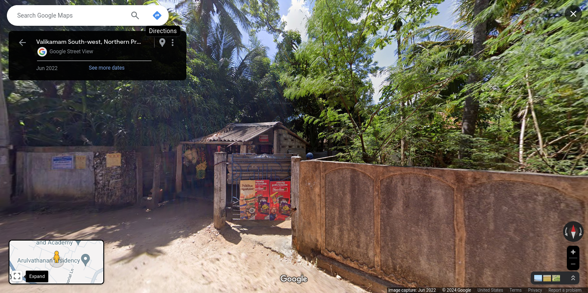

## Athubode East

**Athubode East** Grama Niladhari Division, **Weeraketiya** Divisional Secretariat Division, **Hambantota** District, **Southern** Province

**Mulkirigala** Polling Division, **Hambantota** Electoral District

Population: 427 (2012)

(**LK-3321215**/446)

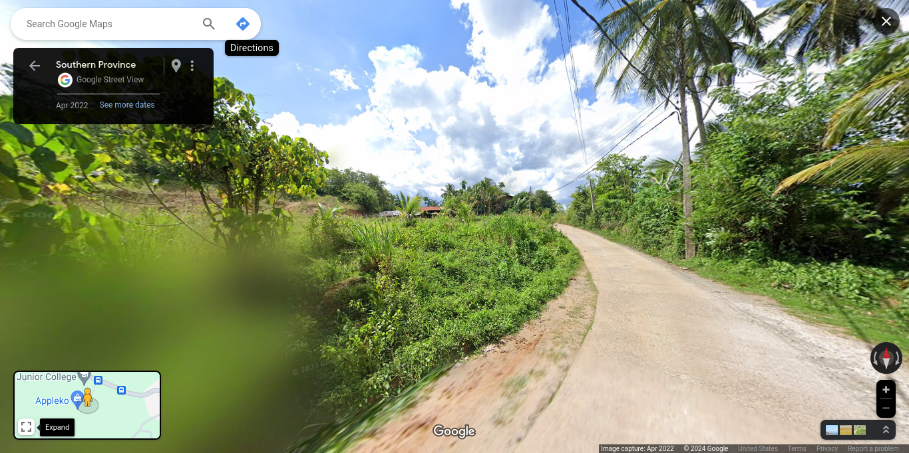

## Eduwa - Madurudoowa

**Eduwa - Madurudoowa** Grama Niladhari Division, **Matara Four Gravets** Divisional Secretariat Division, **Matara** District, **Southern** Province

**Matara** Polling Division, **Matara** Electoral District

Population: 1,030 (2012)

(**LK-3242095**/419A)

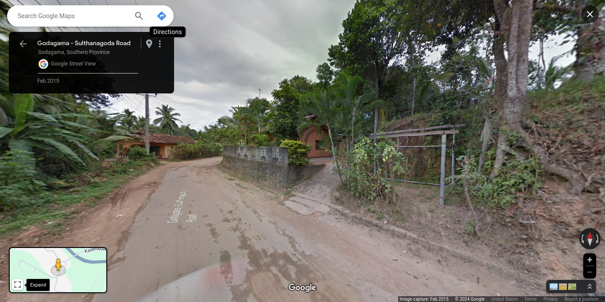

## Ampitiya Pallegama

**Ampitiya Pallegama** Grama Niladhari Division, **Kandy Four Gravets & Gangawata Korale** Divisional Secretariat Division, **Kandy** District, **Central** Province

**Senkadagala** Polling Division, **Kandy** Electoral District

Population: 2,620 (2012)

(**LK-2130245**/271)

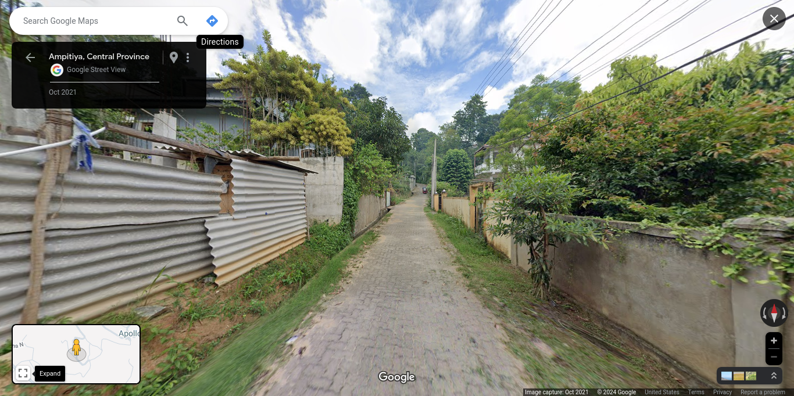

## Pulathisi Pedesa

**Pulathisi Pedesa** Grama Niladhari Division, **Thamankaduwa** Divisional Secretariat Division, **Polonnaruwa** District, **North Central** Province

**Polonnaruwa** Polling Division, **Polonnaruwa** Electoral District

Population: 1,477 (2012)

(**LK-7215205**/163)

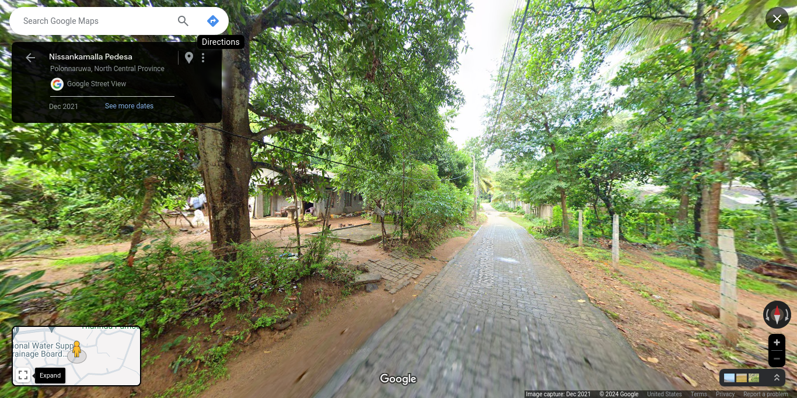

## Diyathure

**Diyathure** Grama Niladhari Division, **Ibbagamuwa** Divisional Secretariat Division, **Kurunegala** District, **North Western** Province

**Hiriyala** Polling Division, **Kurunegala** Electoral District

Population: 1,241 (2012)

(**LK-6130120**/412)

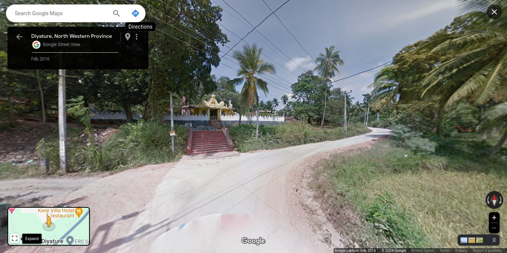

## Rawanaella

**Rawanaella** Grama Niladhari Division, **Ella** Divisional Secretariat Division, **Badulla** District, **Uva** Province

**Bandarawela** Polling Division, **Badulla** Electoral District

Population: 509 (2012)

(**LK-8136130**/69F)

## Ihala Karagahamuna East

**Ihala Karagahamuna East** Grama Niladhari Division, **Mahara** Divisional Secretariat Division, **Gampaha** District, **Western** Province

**Mahara** Polling Division, **Gampaha** Electoral District

Population: 2,221 (2012)

(**LK-1233350**/248B)

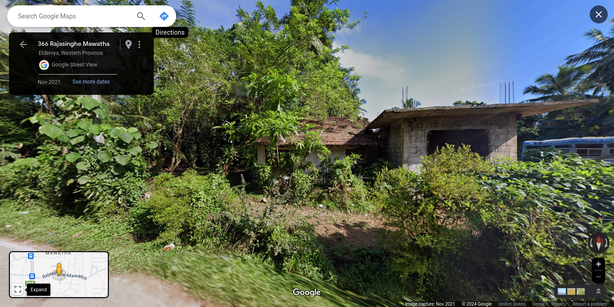

## Galpottayaya South

**Galpottayaya South** Grama Niladhari Division, **Weeraketiya** Divisional Secretariat Division, **Hambantota** District, **Southern** Province

**Mulkirigala** Polling Division, **Hambantota** Electoral District

Population: 466 (2012)

(**LK-3321075**/419)

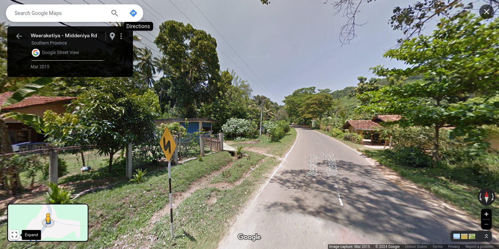

## Randombe South

**Randombe South** Grama Niladhari Division, **Balapitiya** Divisional Secretariat Division, **Galle** District, **Southern** Province

**Balapitiya** Polling Division, **Galle** Electoral District

Population: 1,134 (2012)

(**LK-3106255**/88)

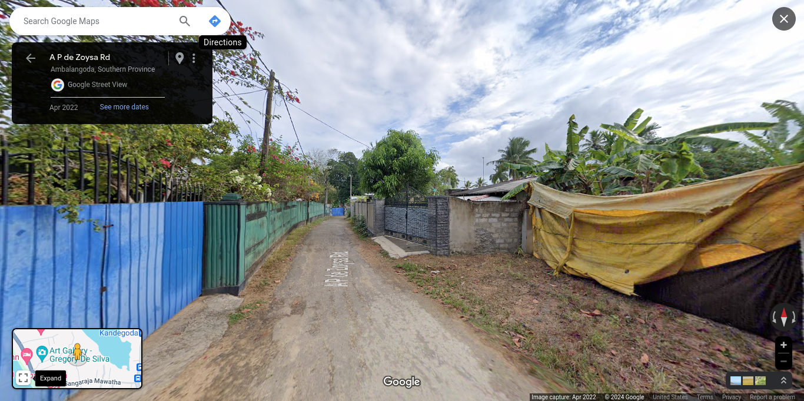

## Siyambalagasthenna

**Siyambalagasthenna** Grama Niladhari Division, **Kandy Four Gravets & Gangawata Korale** Divisional Secretariat Division, **Kandy** District, **Central** Province

**Senkadagala** Polling Division, **Kandy** Electoral District

Population: 1,724 (2012)

(**LK-2130010**/226)

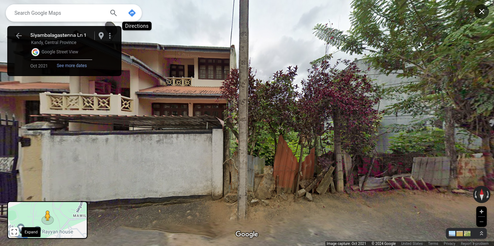

## Vidathaltheevu Central

**Vidathaltheevu Central** Grama Niladhari Division, **Manthai West** Divisional Secretariat Division, **Mannar** District, **Northern** Province

**Mannar** Polling Division, **Vanni** Electoral District

Population: 51 (2012)

(**LK-4206080**/12)

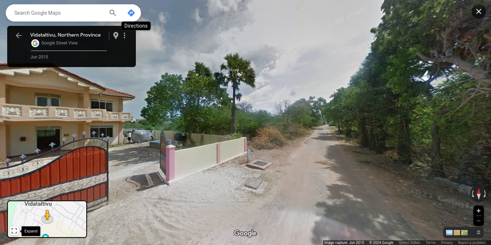

## Elawella

**Elawella** Grama Niladhari Division, **Madurawala** Divisional Secretariat Division, **Kalutara** District, **Western** Province

**Bulathsinhala** Polling Division, **Kalutara** Electoral District

Population: 2,117 (2012)

(**LK-1315020**/650E)

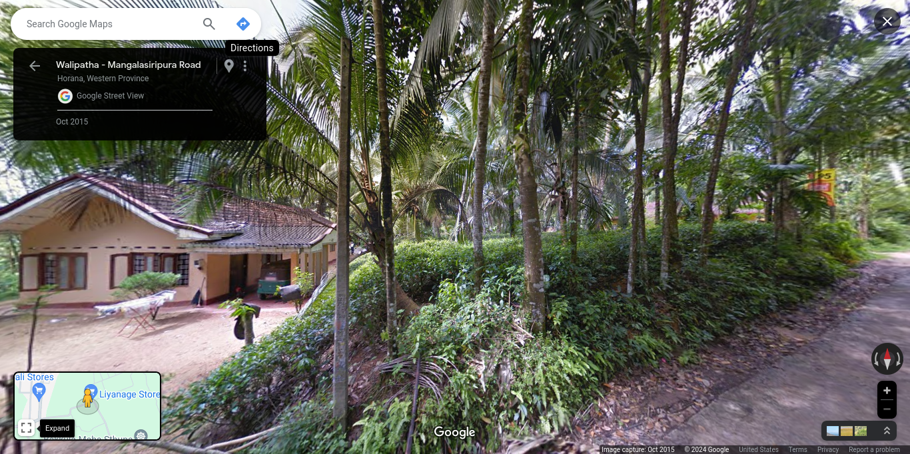

## Perimiyankulama

**Perimiyankulama** Grama Niladhari Division, **Nuwaragam Palatha Central** Divisional Secretariat Division, **Anuradhapura** District, **North Central** Province

**Anuradhapura West** Polling Division, **Anuradhapura** Electoral District

Population: 1,299 (2012)

(**LK-7115090**/300)

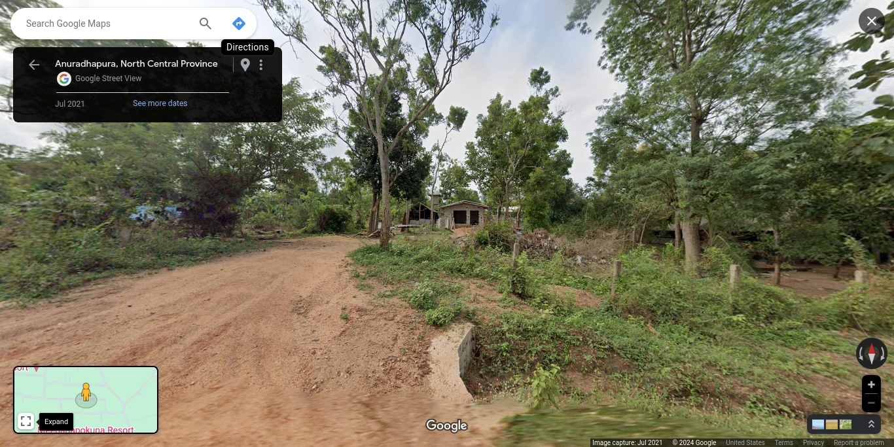

## Kuda Waskaduwa North

**Kuda Waskaduwa North** Grama Niladhari Division, **Kalutara** Divisional Secretariat Division, **Kalutara** District, **Western** Province

**Kalutara** Polling Division, **Kalutara** Electoral District

Population: 2,380 (2012)

(**LK-1321130**/710)

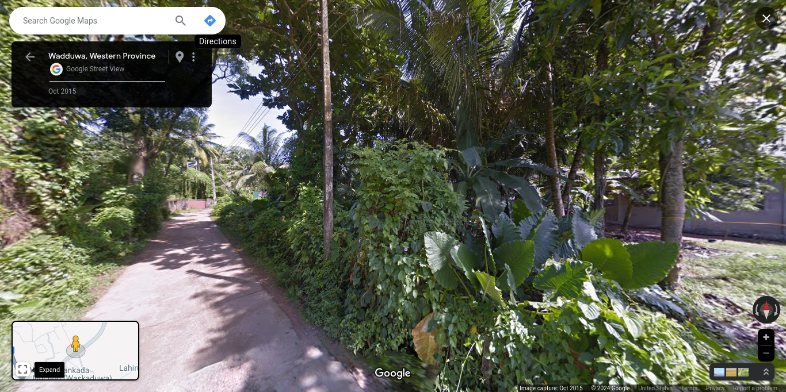

## Divulpitiya West

**Divulpitiya West** Grama Niladhari Division, **Kesbewa** Divisional Secretariat Division, **Colombo** District, **Western** Province

**Kesbewa** Polling Division, **Colombo** Electoral District

Population: 2,631 (2012)

(**LK-1136020**/535B)

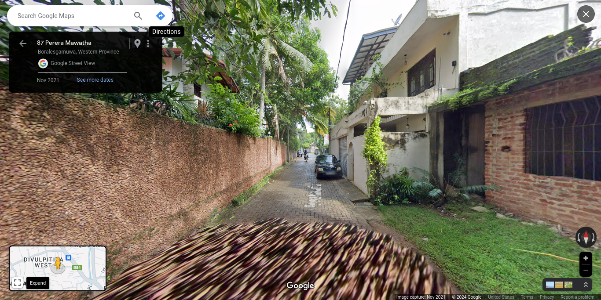

## Anangoda

**Anangoda** Grama Niladhari Division, **Akmeemana** Divisional Secretariat Division, **Galle** District, **Southern** Province

**Akmeemana** Polling Division, **Galle** Electoral District

Population: 1,305 (2012)

(**LK-3145200**/113C)

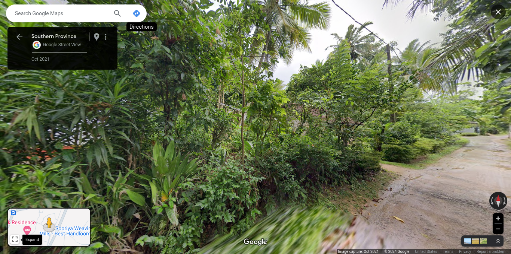

## Maha Aruggoda

**Maha Aruggoda** Grama Niladhari Division, **Bandaragama** Divisional Secretariat Division, **Kalutara** District, **Western** Province

**Bandaragama** Polling Division, **Kalutara** Electoral District

Population: 3,478 (2012)

(**LK-1306085**/678)

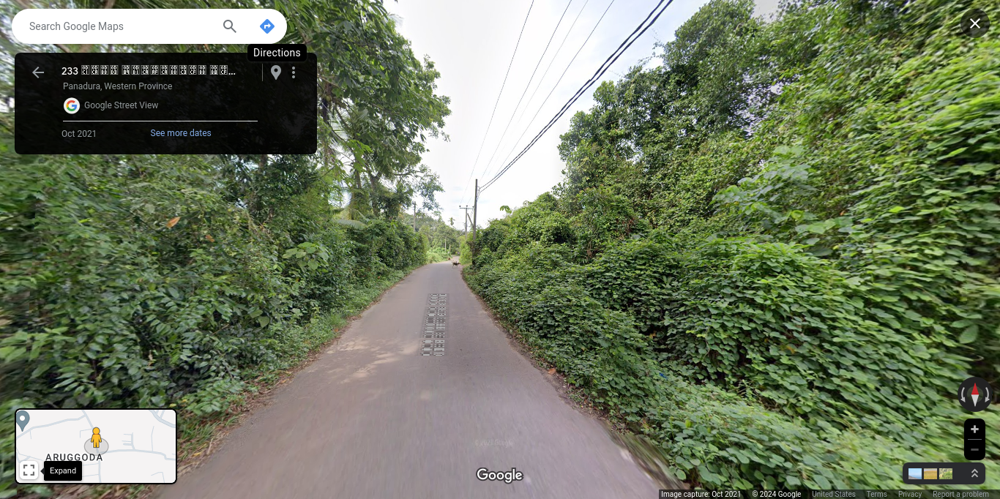

## Uswatta

**Uswatta** Grama Niladhari Division, **Kalutara** Divisional Secretariat Division, **Kalutara** District, **Western** Province

**Kalutara** Polling Division, **Kalutara** Electoral District

Population: 1,813 (2012)

(**LK-1321380**/729F)

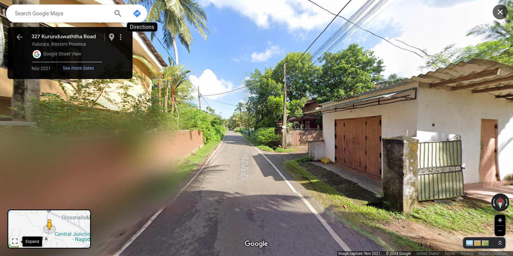

## Gorakapitiya

**Gorakapitiya** Grama Niladhari Division, **Kesbewa** Divisional Secretariat Division, **Colombo** District, **Western** Province

**Kesbewa** Polling Division, **Colombo** Electoral District

Population: 1,749 (2012)

(**LK-1136195**/584)

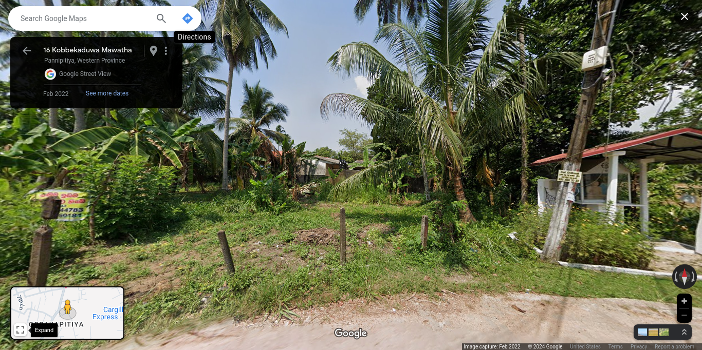

## Madawalamulla South

**Madawalamulla South** Grama Niladhari Division, **Galle Four Gravets** Divisional Secretariat Division, **Galle** District, **Southern** Province

**Galle** Polling Division, **Galle** Electoral District

Population: 1,216 (2012)

(**LK-3139065**/98)

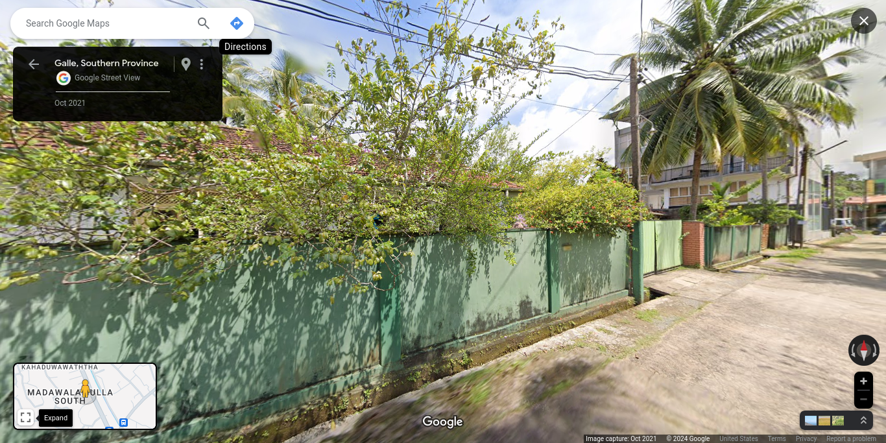

## Kodippilikanda

**Kodippilikanda** Grama Niladhari Division, **Kalawana** Divisional Secretariat Division, **Ratnapura** District, **Sabaragamuwa** Province

**Kalawana** Polling Division, **Ratnapura** Electoral District

Population: 2,151 (2012)

(**LK-9133005**/195E)

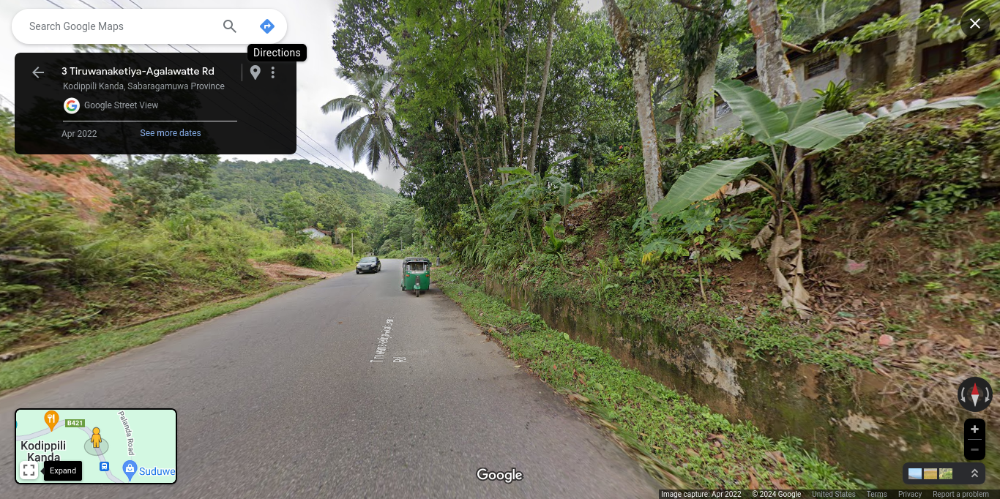

## Walgama Meda

**Walgama Meda** Grama Niladhari Division, **Matara Four Gravets** Divisional Secretariat Division, **Matara** District, **Southern** Province

**Matara** Polling Division, **Matara** Electoral District

Population: 1,955 (2012)

(**LK-3242240**/409C)

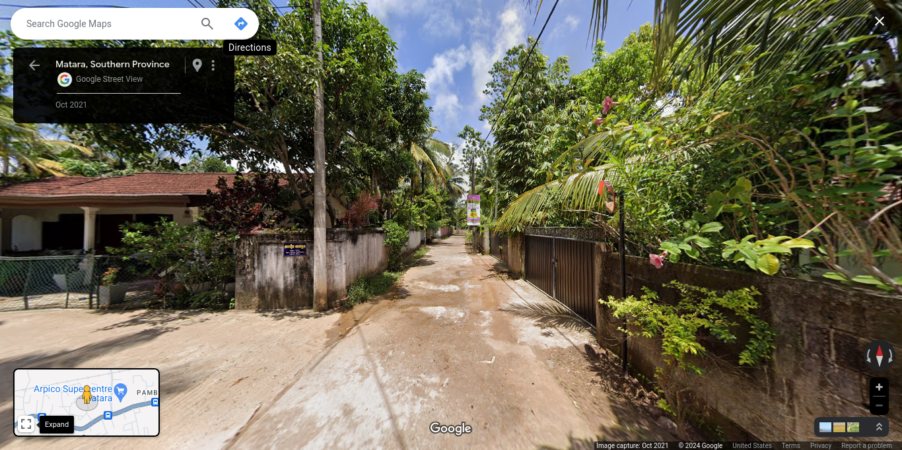

## Moratumulla West

**Moratumulla West** Grama Niladhari Division, **Moratuwa** Divisional Secretariat Division, **Colombo** District, **Western** Province

**Moratuwa** Polling Division, **Colombo** Electoral District

Population: 3,630 (2012)

(**LK-1133140**/558B)

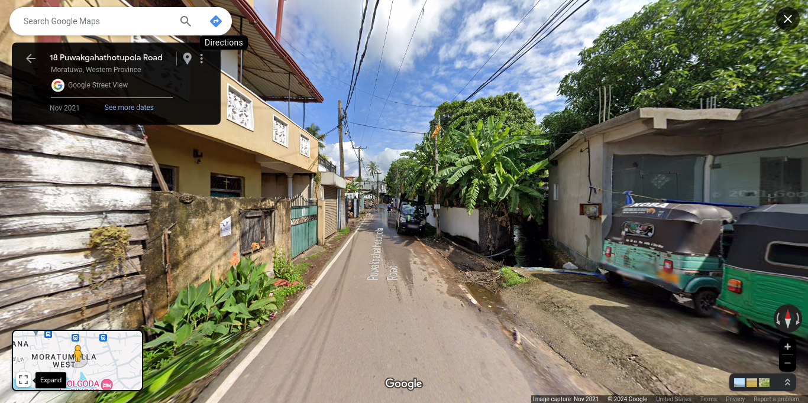

## Kalubovila

**Kalubovila** Grama Niladhari Division, **Dehiwala** Divisional Secretariat Division, **Colombo** District, **Western** Province

**Dehiwala** Polling Division, **Colombo** Electoral District

Population: 5,517 (2012)

(**LK-1130025**/538)

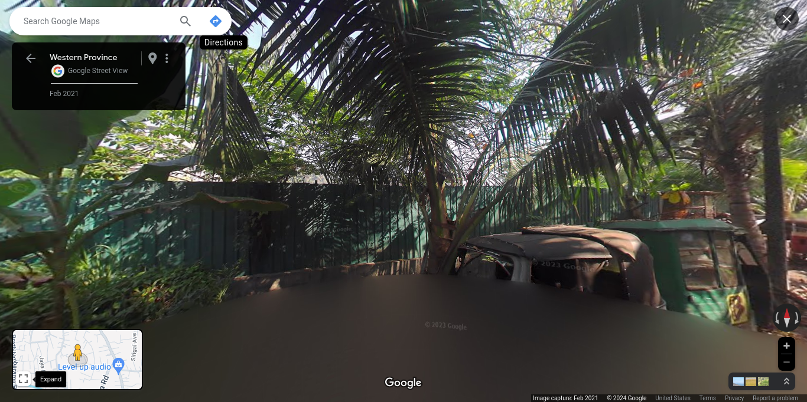

## Wennappuwa North

**Wennappuwa North** Grama Niladhari Division, **Wennappuwa** Divisional Secretariat Division, **Puttalam** District, **North Western** Province

**Wennappuwa** Polling Division, **Puttalam** Electoral District

Population: 1,637 (2012)

(**LK-6245045**/491)

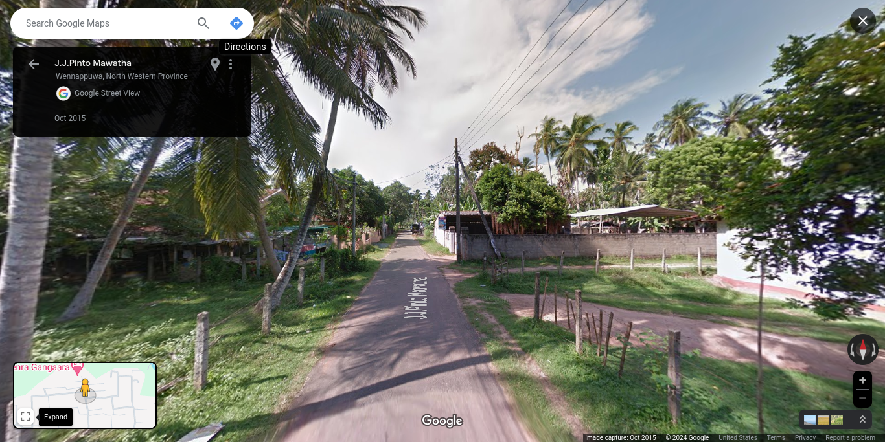

## Walahanduwa

**Walahanduwa** Grama Niladhari Division, **Akmeemana** Divisional Secretariat Division, **Galle** District, **Southern** Province

**Akmeemana** Polling Division, **Galle** Electoral District

Population: 1,539 (2012)

(**LK-3145165**/112A)

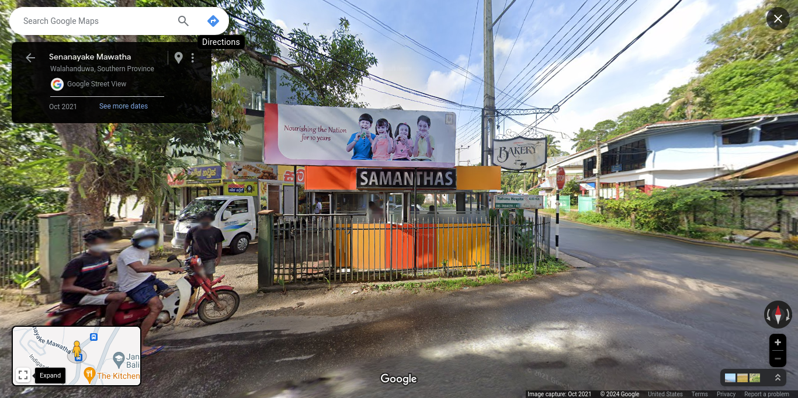

## Pattiya South

**Pattiya South** Grama Niladhari Division, **Panadura** Divisional Secretariat Division, **Kalutara** District, **Western** Province

**Panadura** Polling Division, **Kalutara** Electoral District

Population: 1,393 (2012)

(**LK-1303250**/686)

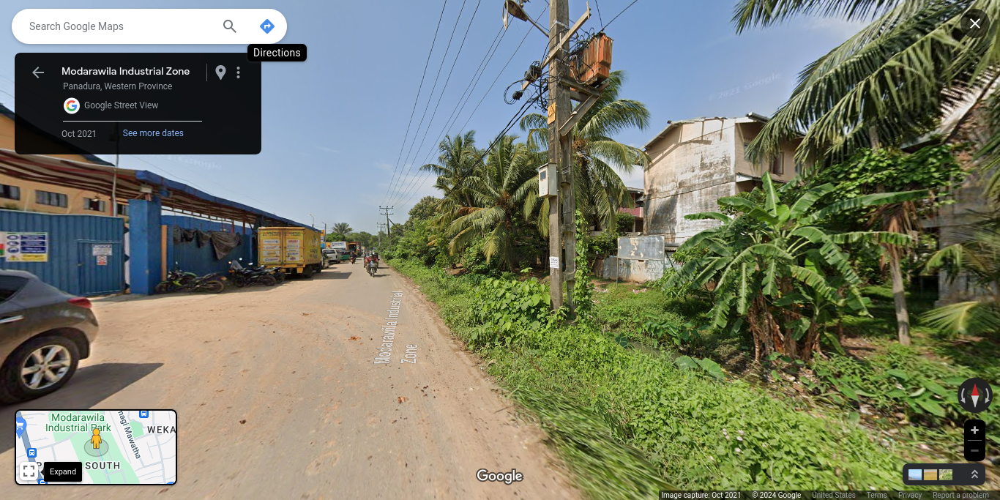

## Udadumbara

**Udadumbara** Grama Niladhari Division, **Udadumbara** Divisional Secretariat Division, **Kandy** District, **Central** Province

**Ududumbara** Polling Division, **Kandy** Electoral District

Population: 538 (2012)

(**LK-2118140**/847)

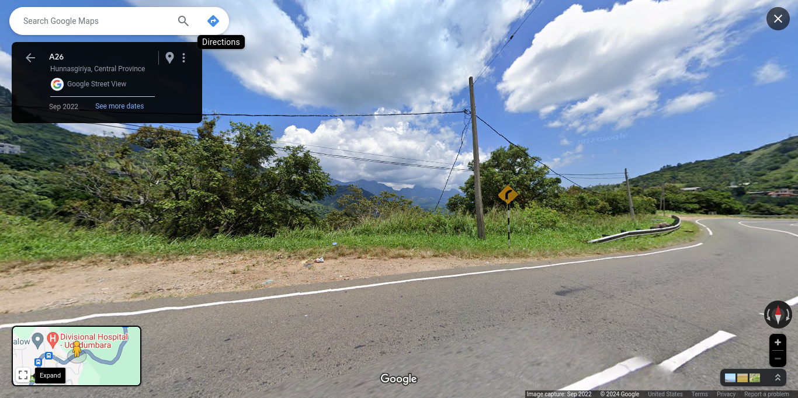

## Thalapitiya

**Thalapitiya** Grama Niladhari Division, **Galle Four Gravets** Divisional Secretariat Division, **Galle** District, **Southern** Province

**Galle** Polling Division, **Galle** Electoral District

Population: 5,514 (2012)

(**LK-3139200**/99A)

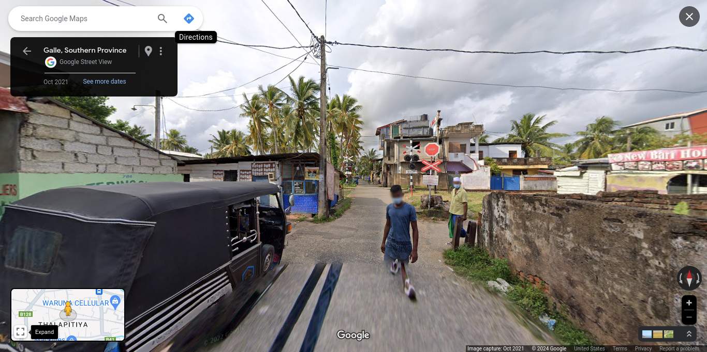

## Thalawathuhenpita South

**Thalawathuhenpita South** Grama Niladhari Division, **Kelaniya** Divisional Secretariat Division, **Gampaha** District, **Western** Province

**Kelaniya** Polling Division, **Gampaha** Electoral District

Population: 1,624 (2012)

(**LK-1236035**/266)

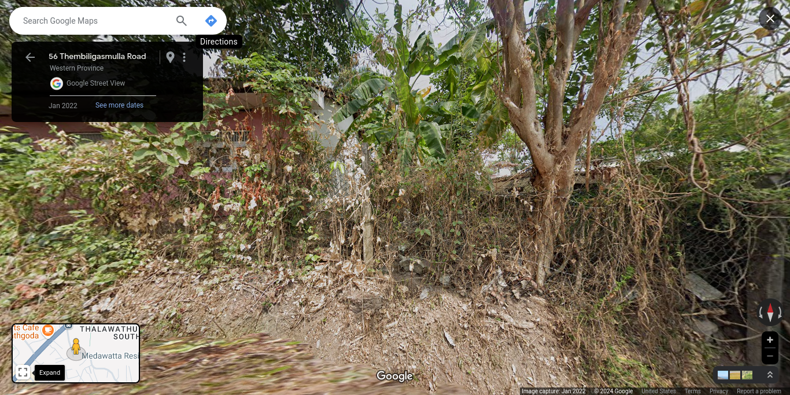

## Gammeddegoda-Rajgama

**Gammeddegoda-Rajgama** Grama Niladhari Division, **Hikkaduwa** Divisional Secretariat Division, **Galle** District, **Southern** Province

**Ratgama** Polling Division, **Galle** Electoral District

Population: 713 (2012)

(**LK-3136440**/47A)

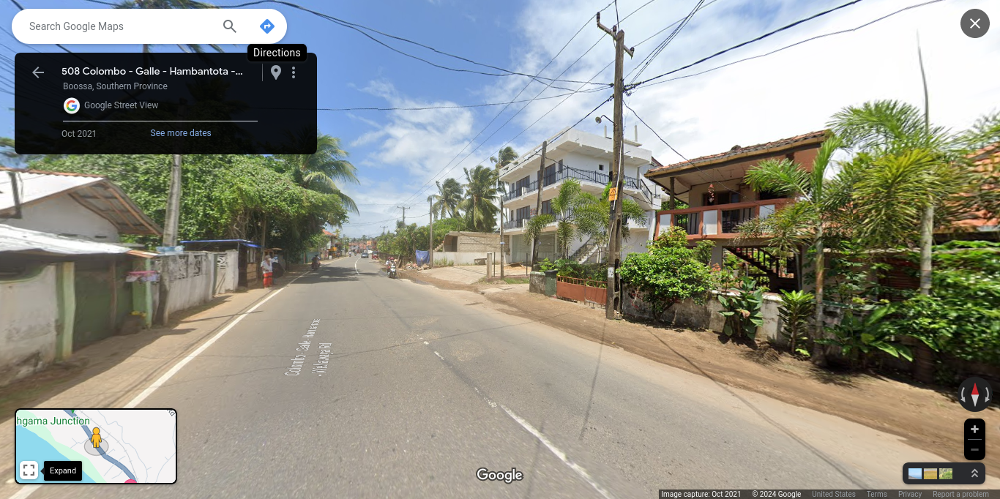

## Kithalagama West

**Kithalagama West** Grama Niladhari Division, **Thihagoda** Divisional Secretariat Division, **Matara** District, **Southern** Province

**Kamburupitiya** Polling Division, **Matara** Electoral District

Population: 794 (2012)

(**LK-3236100**/349)

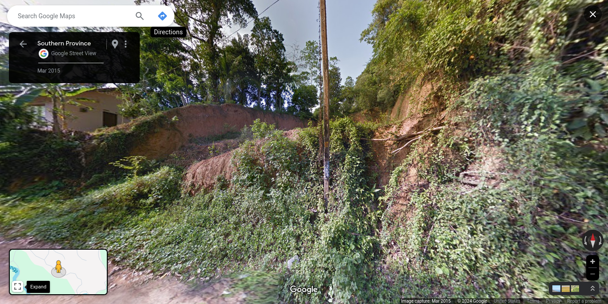

## Udahamulla

**Udahamulla** Grama Niladhari Division, **Panadura** Divisional Secretariat Division, **Kalutara** District, **Western** Province

**Panadura** Polling Division, **Kalutara** Electoral District

Population: 1,731 (2012)

(**LK-1303150**/682)

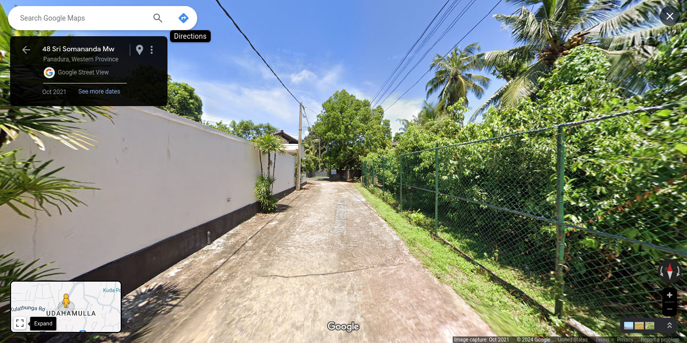

## Samagipura

**Samagipura** Grama Niladhari Division, **Ratnapura** Divisional Secretariat Division, **Ratnapura** District, **Sabaragamuwa** Province

**Ratnapura** Polling Division, **Ratnapura** Electoral District

Population: 3,015 (2012)

(**LK-9112235**/182C)

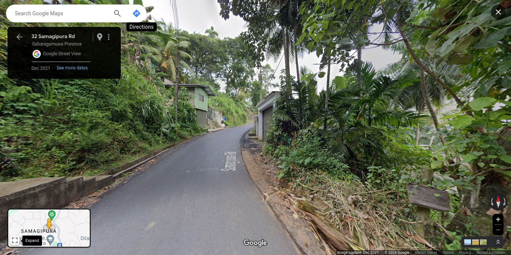

## Muttettugoda

**Muttettugoda** Grama Niladhari Division, **Kaduwela** Divisional Secretariat Division, **Colombo** District, **Western** Province

**Kaduwela** Polling Division, **Colombo** Electoral District

Population: 6,734 (2012)

(**LK-1109145**/477B)

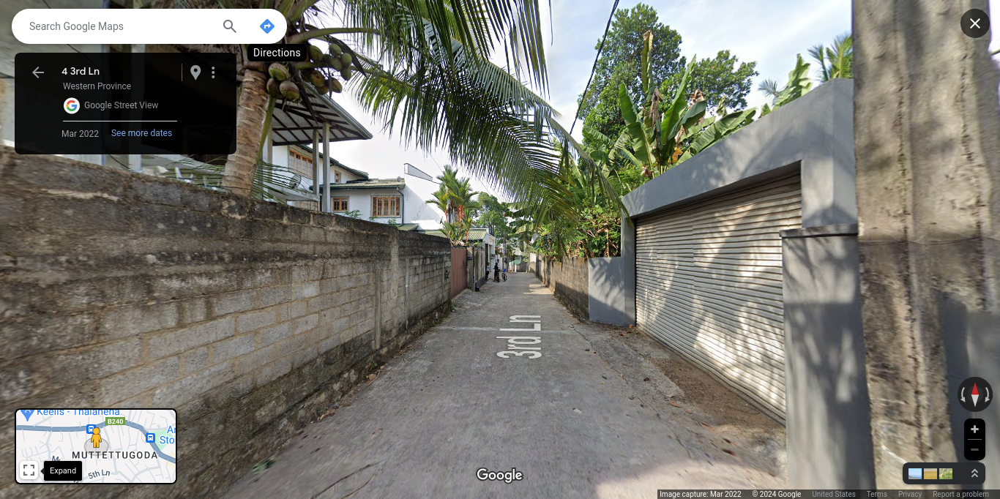

## Madakumbura

**Madakumbura** Grama Niladhari Division, **Rattota** Divisional Secretariat Division, **Matale** District, **Central** Province

**Rattota** Polling Division, **Matale** Electoral District

Population: 795 (2012)

(**LK-2230075**/E375F)

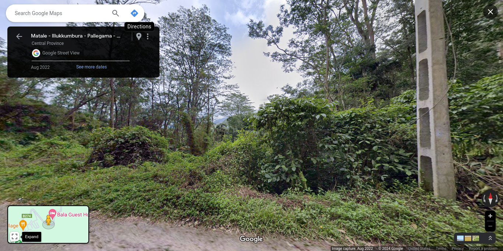

## Gallehemulla

**Gallehemulla** Grama Niladhari Division, **Pannala** Divisional Secretariat Division, **Kurunegala** District, **North Western** Province

**Katugampola** Polling Division, **Kurunegala** Electoral District

Population: 1,172 (2012)

(**LK-6178005**/1596)

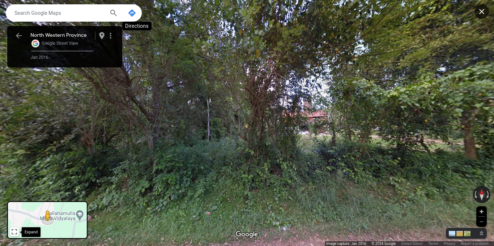

## Akurugoda East

**Akurugoda East** Grama Niladhari Division, **Malimbada** Divisional Secretariat Division, **Matara** District, **Southern** Province

**Akuressa** Polling Division, **Matara** Electoral District

Population: 1,654 (2012)

(**LK-3224080**/400)

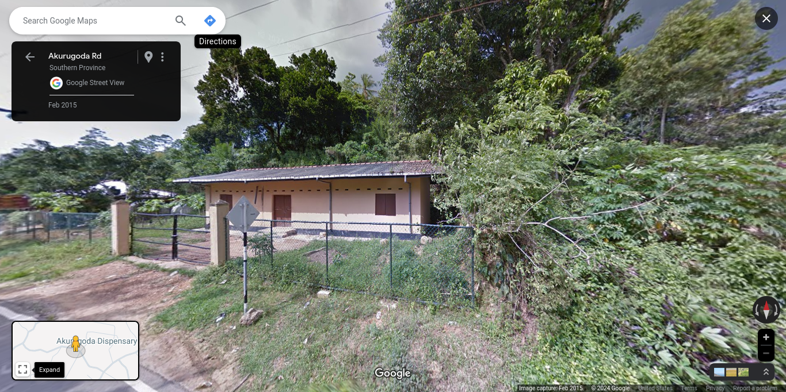

## Amandoluwa

**Amandoluwa** Grama Niladhari Division, **Katana** Divisional Secretariat Division, **Gampaha** District, **Western** Province

**Katana** Polling Division, **Gampaha** Electoral District

Population: 8,538 (2012)

(**LK-1206265**/148)

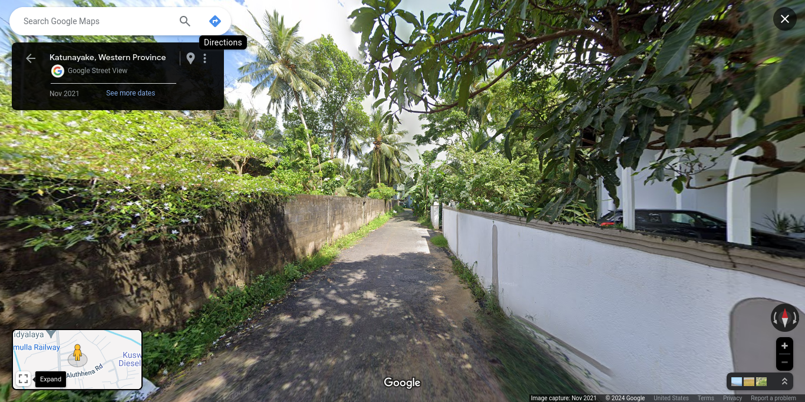

## Sandagalathenna

**Sandagalathenna** Grama Niladhari Division, **Dimbulagala** Divisional Secretariat Division, **Polonnaruwa** District, **North Central** Province

**Polonnaruwa** Polling Division, **Polonnaruwa** Electoral District

Population: 2,046 (2012)

(**LK-7212225**/231)

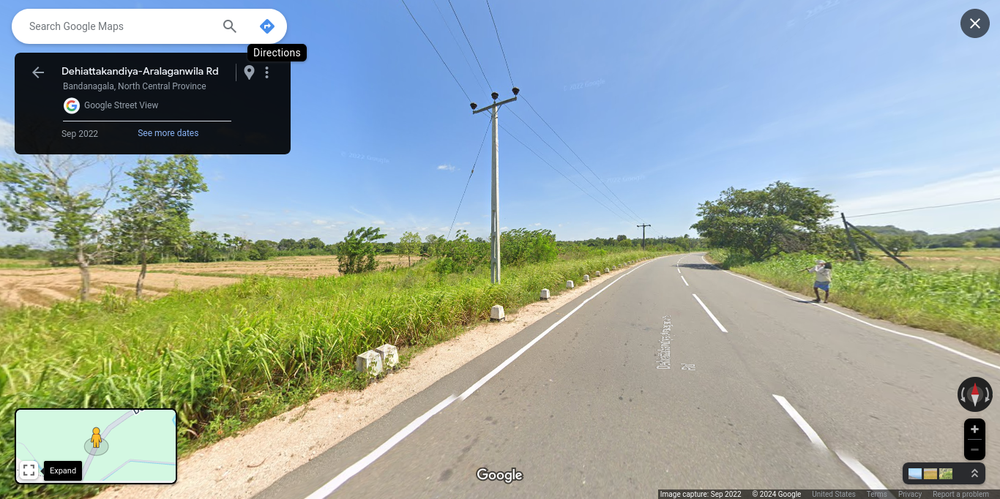

## Kalmunaikudi 12

**Kalmunaikudi 12** Grama Niladhari Division, **Kalmunai** Divisional Secretariat Division, **Ampara** District, **Eastern** Province

**Kalmunai** Polling Division, **Digamadulla** Electoral District

Population: 1,031 (2012)

(**LK-5224135**/KP/55)

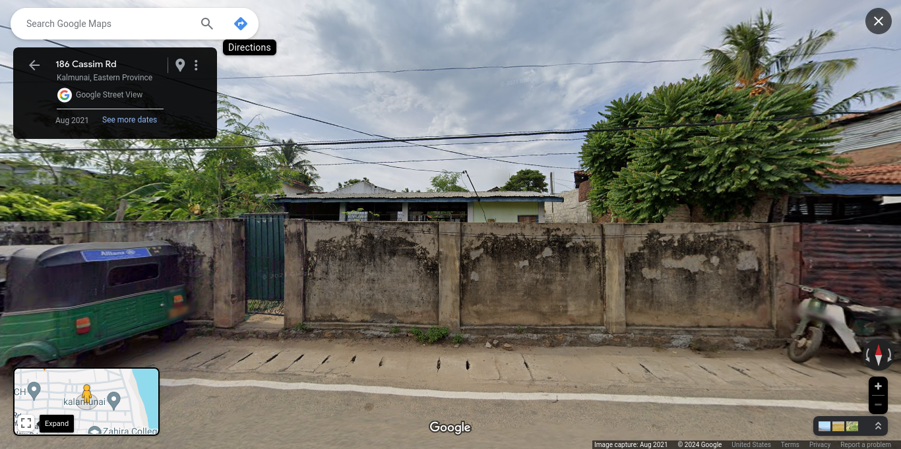

## Horethuduwa South

**Horethuduwa South** Grama Niladhari Division, **Panadura** Divisional Secretariat Division, **Kalutara** District, **Western** Province

**Panadura** Polling Division, **Kalutara** Electoral District

Population: 2,138 (2012)

(**LK-1303020**/670A)

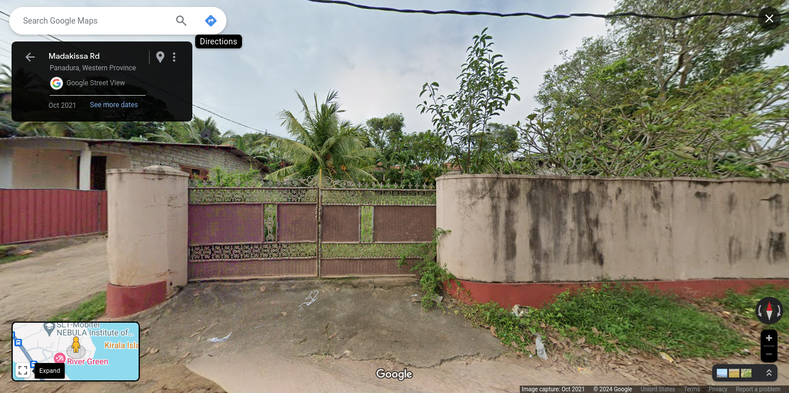

## Usbim Colony

**Usbim Colony** Grama Niladhari Division, **Niyagama** Divisional Secretariat Division, **Galle** District, **Southern** Province

**Hiniduma** Polling Division, **Galle** Electoral District

Population: 677 (2012)

(**LK-3115065**/34A/2)

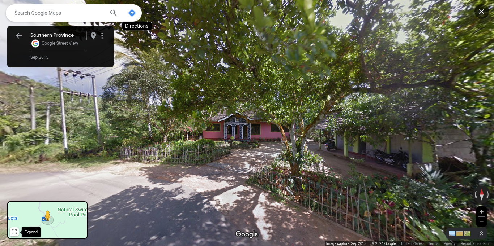

## Ambanwala

**Ambanwala** Grama Niladhari Division, **Udunuwara** Divisional Secretariat Division, **Kandy** District, **Central** Province

**Udunuwara** Polling Division, **Kandy** Electoral District

Population: 649 (2012)

(**LK-2139350**/105)

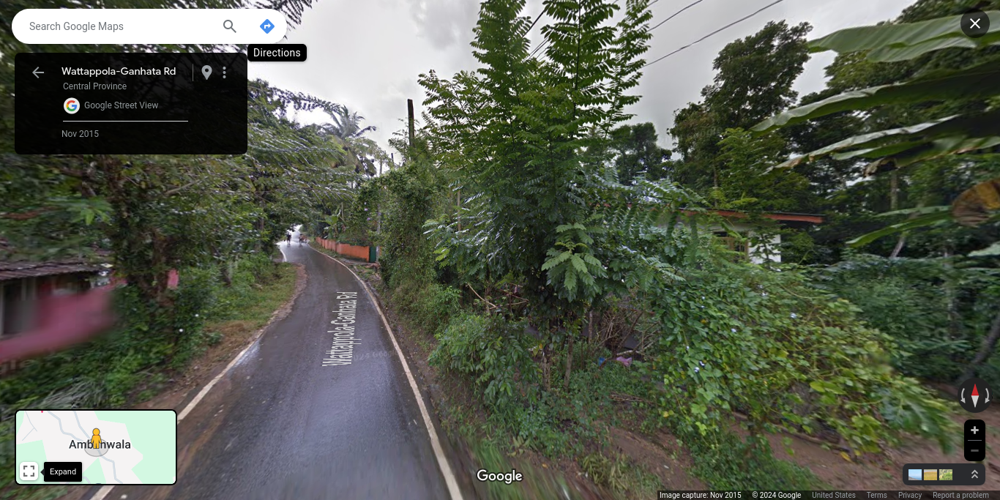

## Badulla Central

**Badulla Central** Grama Niladhari Division, **Badulla** Divisional Secretariat Division, **Badulla** District, **Uva** Province

**Badulla** Polling Division, **Badulla** Electoral District

Population: 3,347 (2012)

(**LK-8121070**/78D)

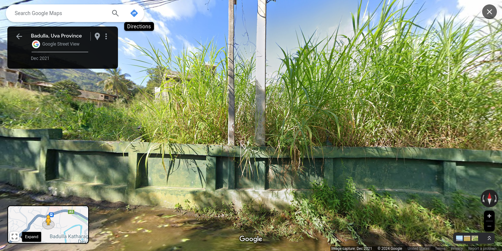

## Puhulpola

**Puhulpola** Grama Niladhari Division, **Welimada** Divisional Secretariat Division, **Badulla** District, **Uva** Province

**Welimada** Polling Division, **Badulla** Electoral District

Population: 1,033 (2012)

(**LK-8130090**/58B)

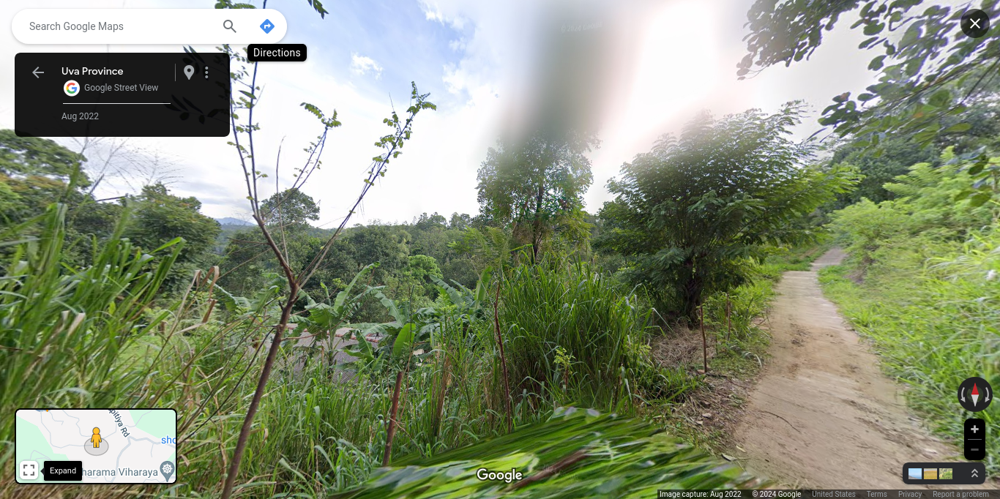

## Makola North Central

**Makola North Central** Grama Niladhari Division, **Biyagama** Divisional Secretariat Division, **Gampaha** District, **Western** Province

**Biyagama** Polling Division, **Gampaha** Electoral District

Population: 6,682 (2012)

(**LK-1239090**/270A)

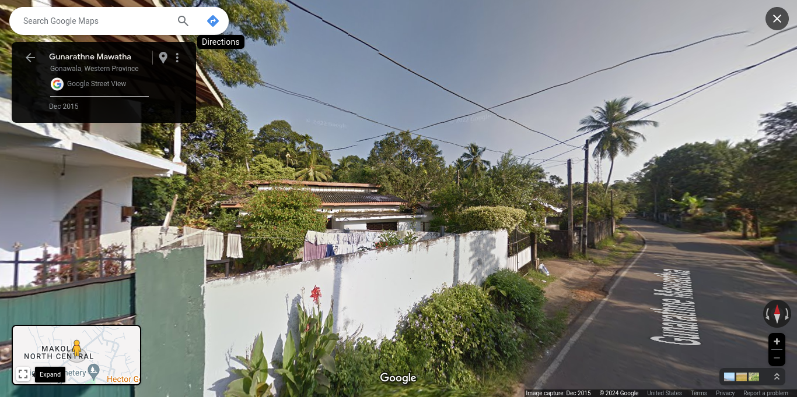

## Ihalawela

**Ihalawela** Grama Niladhari Division, **Kundasale** Divisional Secretariat Division, **Kandy** District, **Central** Province

**Kundasale** Polling Division, **Kandy** Electoral District

Population: 2,316 (2012)

(**LK-2127285**/701)

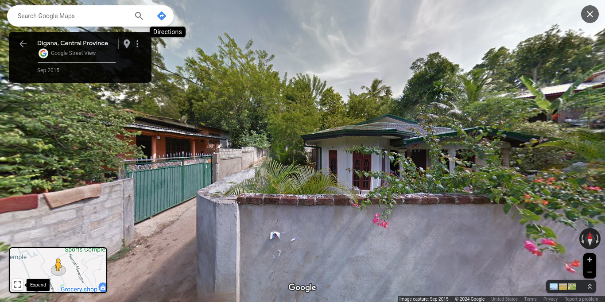

## Iranapalai

**Iranapalai** Grama Niladhari Division, **Puthukkudiyiruppu** Divisional Secretariat Division, **Mullaitivu** District, **Northern** Province

**Mullaitivu** Polling Division, **Vanni** Electoral District

Population: 1,120 (2012)

(**LK-4409010**/MU/43)

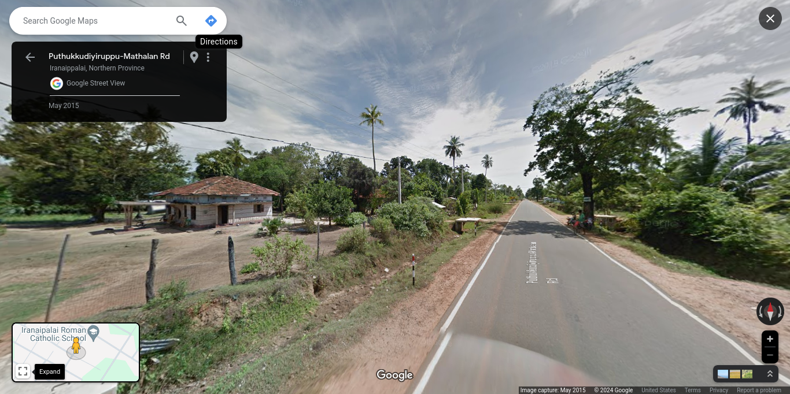

## Piduruwella

**Piduruwella** Grama Niladhari Division, **Weerambugedara** Divisional Secretariat Division, **Kurunegala** District, **North Western** Province

**Polgahawela** Polling Division, **Kurunegala** Electoral District

Population: 1,703 (2012)

(**LK-6166070**/847)

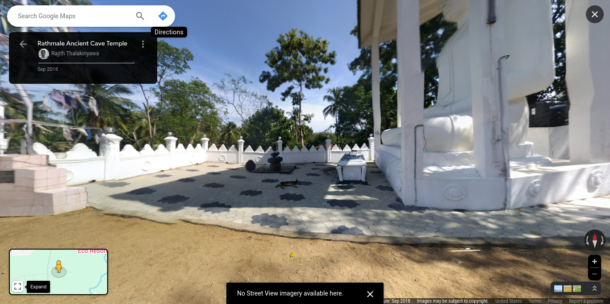

## Noragalla

**Noragalla** Grama Niladhari Division, **Nivithigala** Divisional Secretariat Division, **Ratnapura** District, **Sabaragamuwa** Province

**Nivithigala** Polling Division, **Ratnapura** Electoral District

Population: 3,437 (2012)

(**LK-9136010**/175)

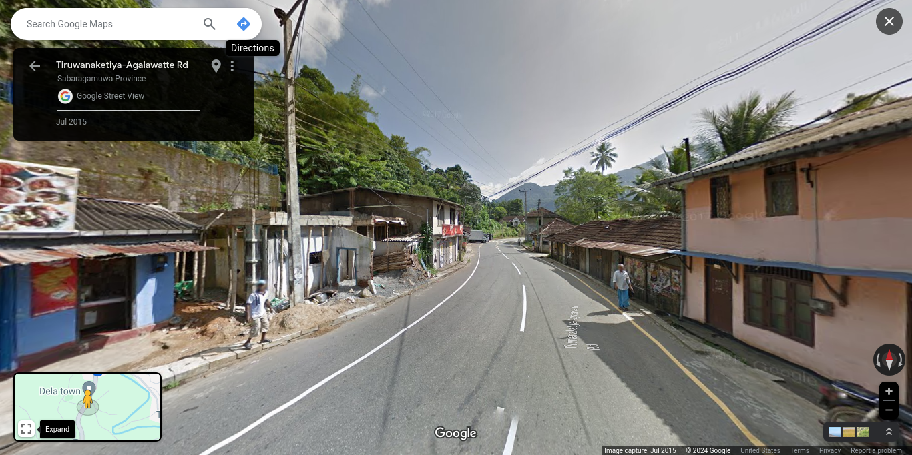

## Murunkan

**Murunkan** Grama Niladhari Division, **Nanattan** Divisional Secretariat Division, **Mannar** District, **Northern** Province

**Mannar** Polling Division, **Vanni** Electoral District

Population: 1,378 (2012)

(**LK-4212065**/MN/118)

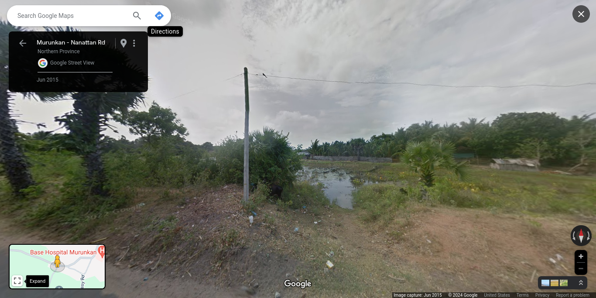

## Hetti  Weediya

**Hetti  Weediya** Grama Niladhari Division, **Weligama** Divisional Secretariat Division, **Matara** District, **Southern** Province

**Weligama** Polling Division, **Matara** Electoral District

Population: 2,397 (2012)

(**LK-3239055**/382B)

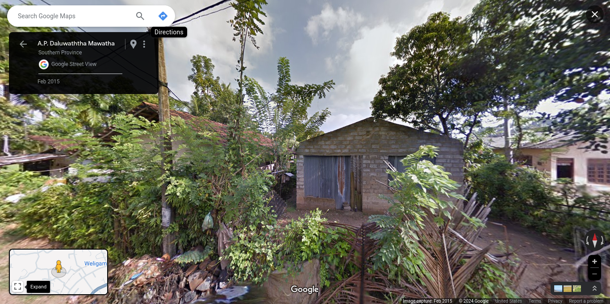

## Koddamunai

**Koddamunai** Grama Niladhari Division, **Manmunai North** Divisional Secretariat Division, **Batticaloa** District, **Eastern** Province

**Batticaloa** Polling Division, **Batticaloa** Electoral District

Population: 1,893 (2012)

(**LK-5118140**/178)

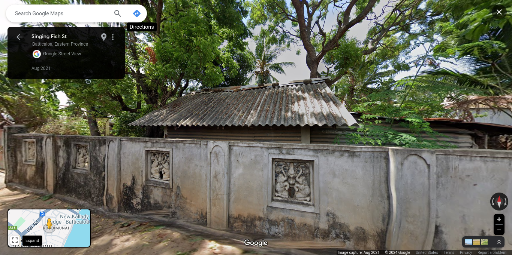

## Erewwala West

**Erewwala West** Grama Niladhari Division, **Kesbewa** Divisional Secretariat Division, **Colombo** District, **Western** Province

**Kesbewa** Polling Division, **Colombo** Electoral District

Population: 6,544 (2012)

(**LK-1136100**/581A)

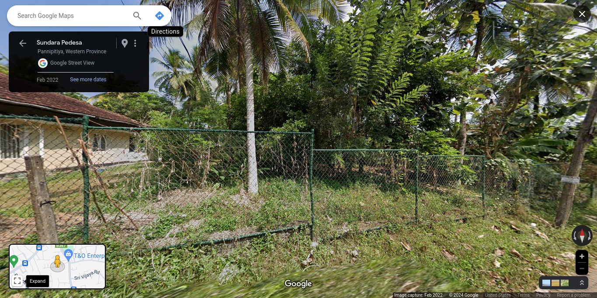

## Kumbaloluwa

**Kumbaloluwa** Grama Niladhari Division, **Mirigama** Divisional Secretariat Division, **Gampaha** District, **Western** Province

**Mirigama** Polling Division, **Gampaha** Electoral District

Population: 537 (2012)

(**LK-1212600**/340)

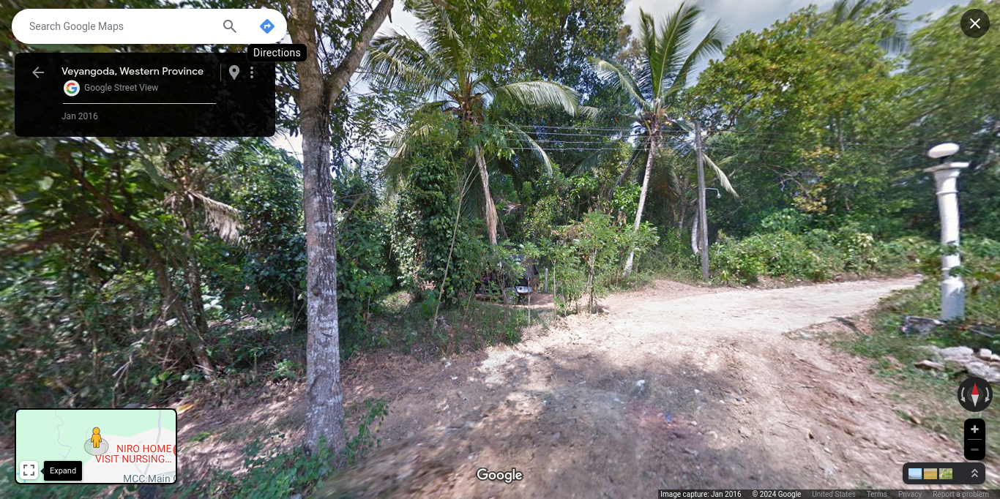

## Ariyalai North West

**Ariyalai North West** Grama Niladhari Division, **Nallur** Divisional Secretariat Division, **Jaffna** District, **Northern** Province

**Nallur** Polling Division, **Jaffna** Electoral District

Population: 1,831 (2012)

(**LK-4133015**/J/91)

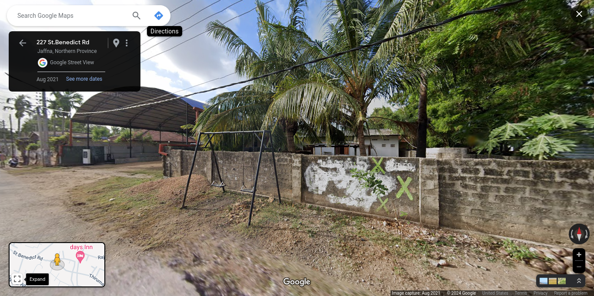

## Minuwangoda North

**Minuwangoda North** Grama Niladhari Division, **Minuwangoda** Divisional Secretariat Division, **Gampaha** District, **Western** Province

**Minuwangoda** Polling Division, **Gampaha** Electoral District

Population: 1,154 (2012)

(**LK-1215125**/125/2)

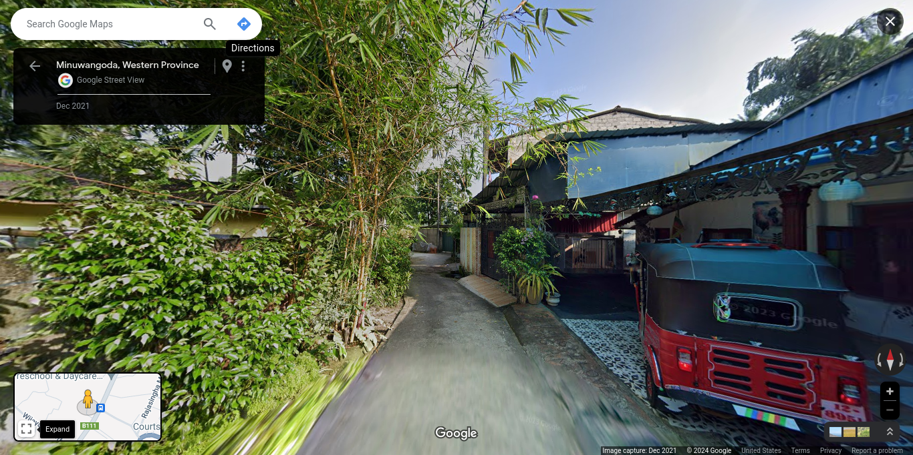

## Akarella

**Akarella** Grama Niladhari Division, **Opanayake** Divisional Secretariat Division, **Ratnapura** District, **Sabaragamuwa** Province

**Rakwana** Polling Division, **Ratnapura** Electoral District

Population: 2,025 (2012)

(**LK-9121075**/241)

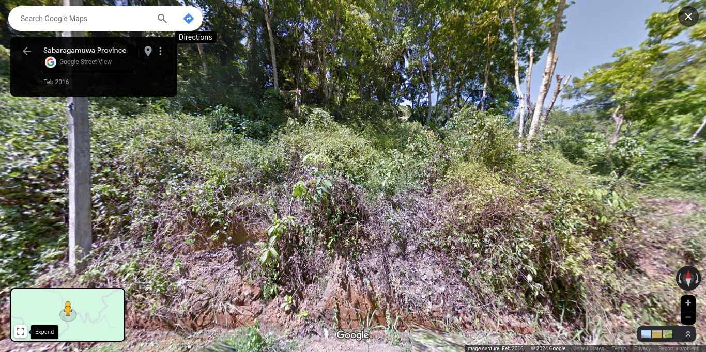

## Walagedara South

**Walagedara South** Grama Niladhari Division, **Udunuwara** Divisional Secretariat Division, **Kandy** District, **Central** Province

**Udunuwara** Polling Division, **Kandy** Electoral District

Population: 674 (2012)

(**LK-2139235**/111)

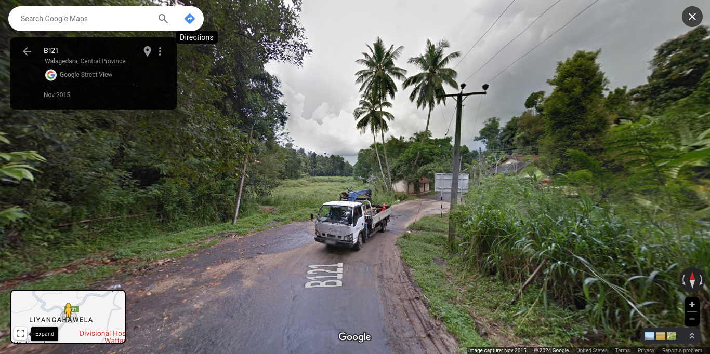

## Salamulla

**Salamulla** Grama Niladhari Division, **Kolonnawa** Divisional Secretariat Division, **Colombo** District, **Western** Province

**Kolonnawa** Polling Division, **Colombo** Electoral District

Population: 5,213 (2012)

(**LK-1106205**/512A)

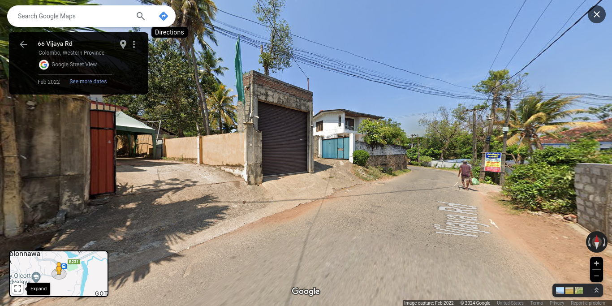

## Thimbirigaskatuwa

**Thimbirigaskatuwa** Grama Niladhari Division, **Katana** Divisional Secretariat Division, **Gampaha** District, **Western** Province

**Katana** Polling Division, **Gampaha** Electoral District

Population: 2,594 (2012)

(**LK-1206110**/71)

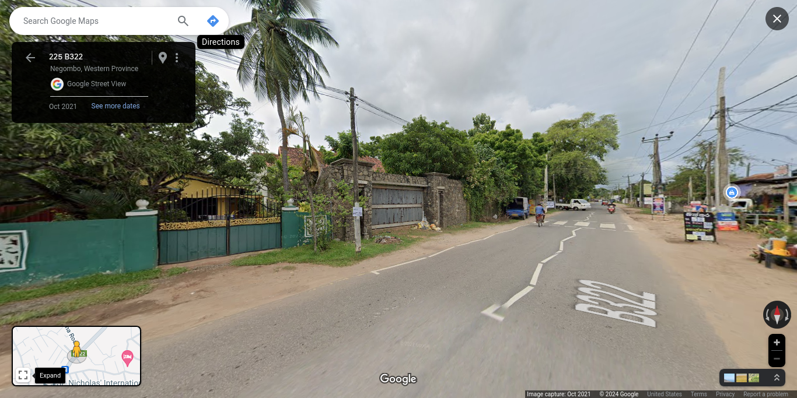

## Dewalahida

**Dewalahida** Grama Niladhari Division, **Damana** Divisional Secretariat Division, **Ampara** District, **Eastern** Province

**Pothuvil** Polling Division, **Digamadulla** Electoral District

Population: 1,446 (2012)

(**LK-5242065**/W/26E)

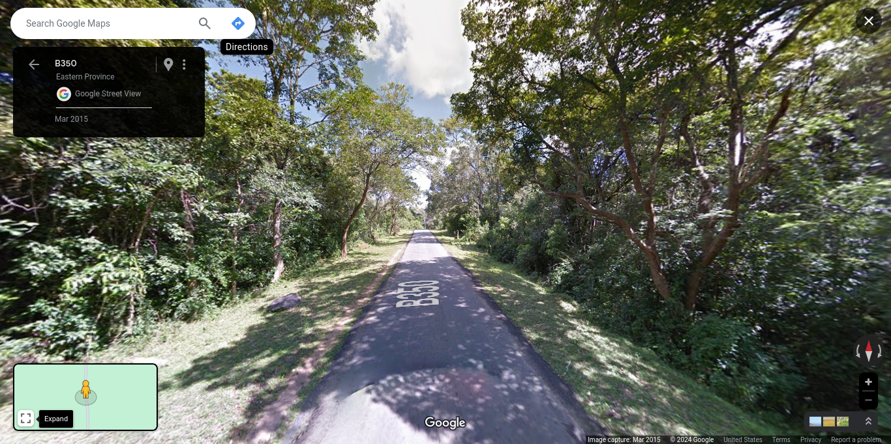

## Akaravita

**Akaravita** Grama Niladhari Division, **Seethawaka** Divisional Secretariat Division, **Colombo** District, **Western** Province

**Avissawella** Polling Division, **Colombo** Electoral District

Population: 1,195 (2012)

(**LK-1115085**/434)

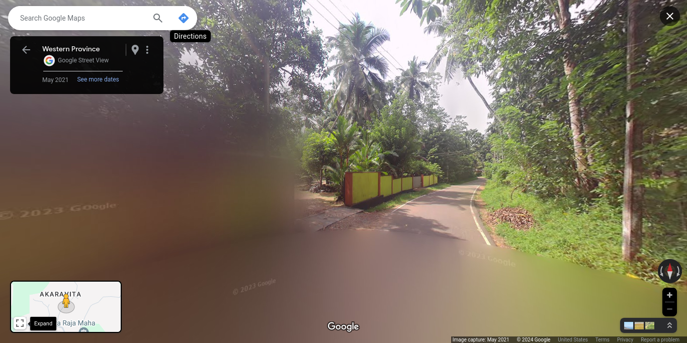

## Pilapitiya

**Pilapitiya** Grama Niladhari Division, **Udunuwara** Divisional Secretariat Division, **Kandy** District, **Central** Province

**Udunuwara** Polling Division, **Kandy** Electoral District

Population: 612 (2012)

(**LK-2139480**/64)

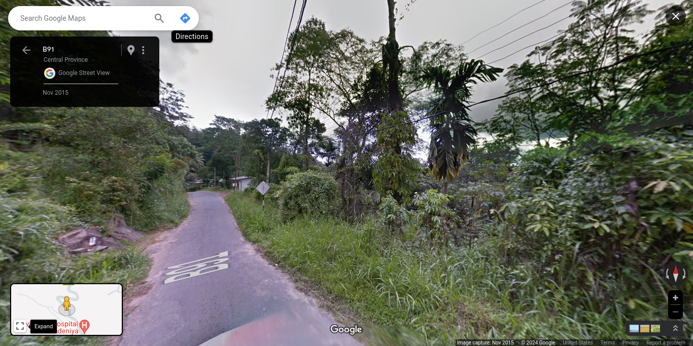

## Maha Buthgamuwa C

**Maha Buthgamuwa C** Grama Niladhari Division, **Kolonnawa** Divisional Secretariat Division, **Colombo** District, **Western** Province

**Kolonnawa** Polling Division, **Colombo** Electoral District

Population: 4,103 (2012)

(**LK-1106095**/506D)

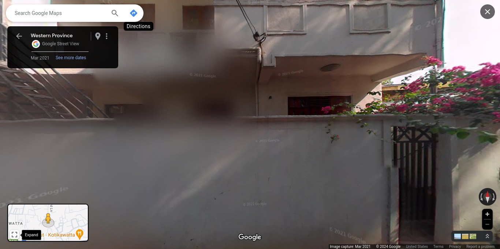

## Medirigiriya

**Medirigiriya** Grama Niladhari Division, **Medirigiriya** Divisional Secretariat Division, **Polonnaruwa** District, **North Central** Province

**Medirigiriya** Polling Division, **Polonnaruwa** Electoral District

Population: 2,828 (2012)

(**LK-7206160**/87)

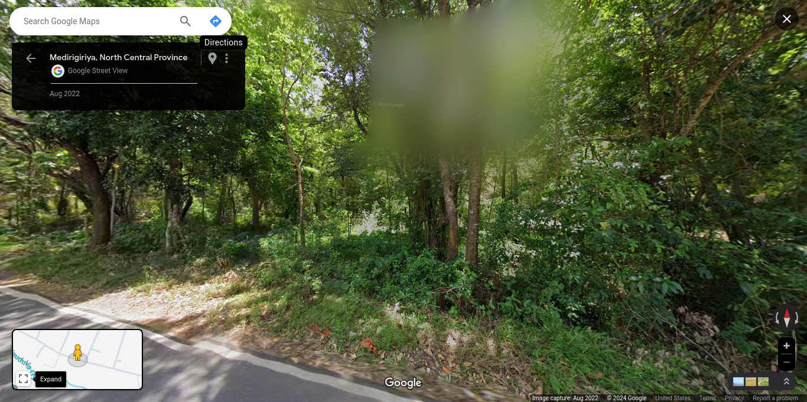

## Angulana South

**Angulana South** Grama Niladhari Division, **Moratuwa** Divisional Secretariat Division, **Colombo** District, **Western** Province

**Moratuwa** Polling Division, **Colombo** Electoral District

Population: 3,333 (2012)

(**LK-1133055**/547A)

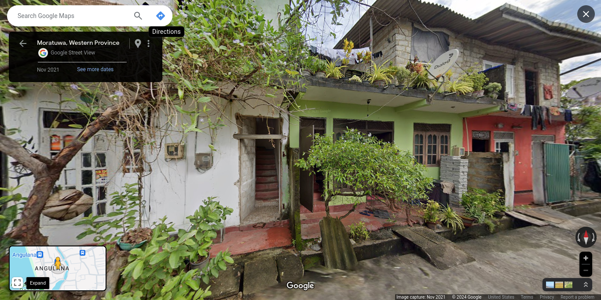

## Pahala Kosgama East

**Pahala Kosgama East** Grama Niladhari Division, **Seethawaka** Divisional Secretariat Division, **Colombo** District, **Western** Province

**Avissawella** Polling Division, **Colombo** Electoral District

Population: 1,830 (2012)

(**LK-1115110**/427)

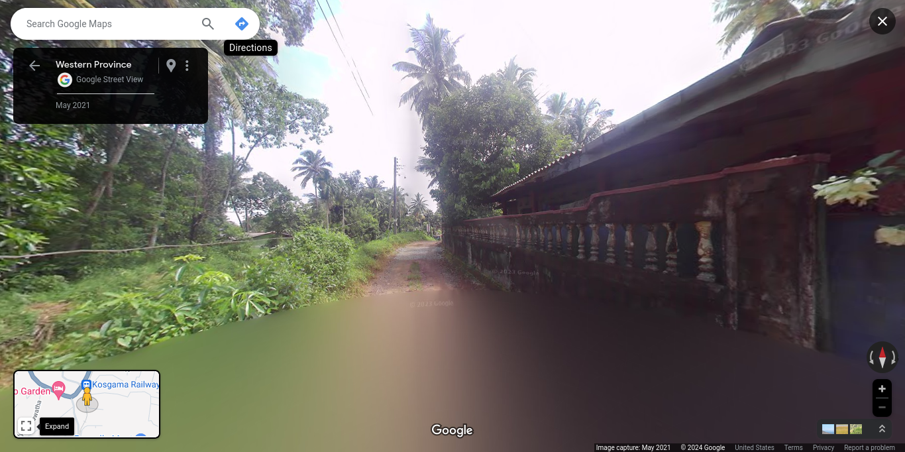

## Wewala West

**Wewala West** Grama Niladhari Division, **Kesbewa** Divisional Secretariat Division, **Colombo** District, **Western** Province

**Kesbewa** Polling Division, **Colombo** Electoral District

Population: 4,949 (2012)

(**LK-1136170**/562B)

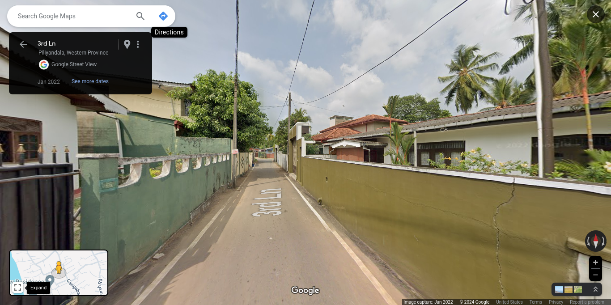

## Egalla

**Egalla** Grama Niladhari Division, **Polgahawela** Divisional Secretariat Division, **Kurunegala** District, **North Western** Province

**Polgahawela** Polling Division, **Kurunegala** Electoral District

Population: 971 (2012)

(**LK-6187150**/952)

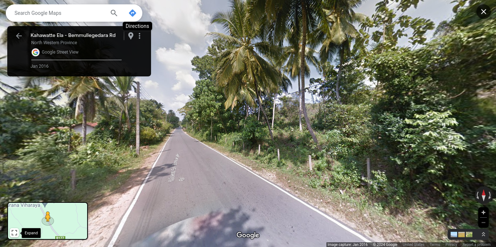

## Kadirana South

**Kadirana South** Grama Niladhari Division, **Katana** Divisional Secretariat Division, **Gampaha** District, **Western** Province

**Katana** Polling Division, **Gampaha** Electoral District

Population: 3,245 (2012)

(**LK-1206150**/93C)

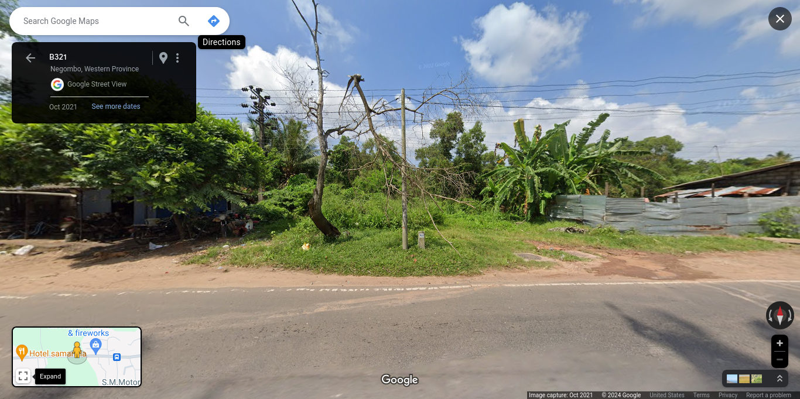

## Jayabima

**Jayabima** Grama Niladhari Division, **Karandeniya** Divisional Secretariat Division, **Galle** District, **Southern** Province

**Karandeniya** Polling Division, **Galle** Electoral District

Population: 1,395 (2012)

(**LK-3109200**/93E)

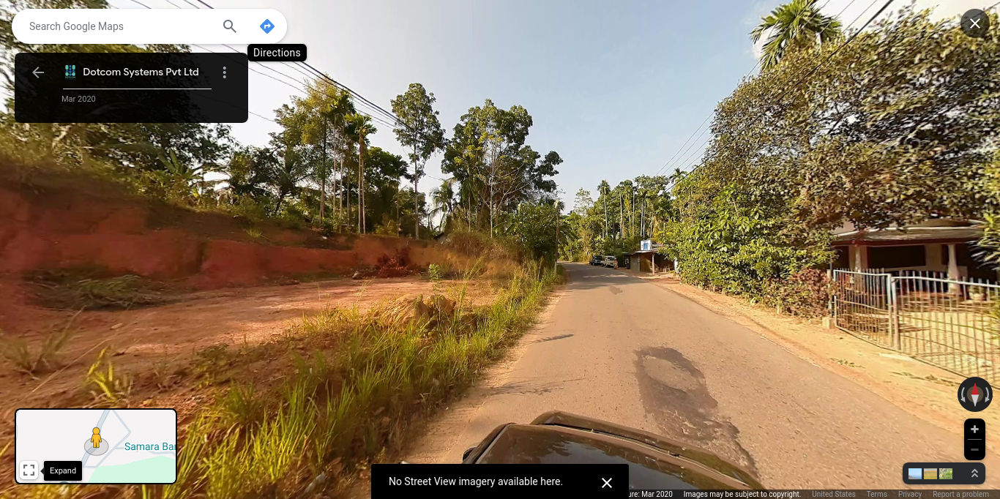

## Chenaikudiyiruppu 01B

**Chenaikudiyiruppu 01B** Grama Niladhari Division, **Kalmunai Tamil Division** Divisional Secretariat Division, **Ampara** District, **Eastern** Province

**Kalmunai** Polling Division, **Digamadulla** Electoral District

Population: 985 (2012)

(**LK-5221105**/KP/69/3)

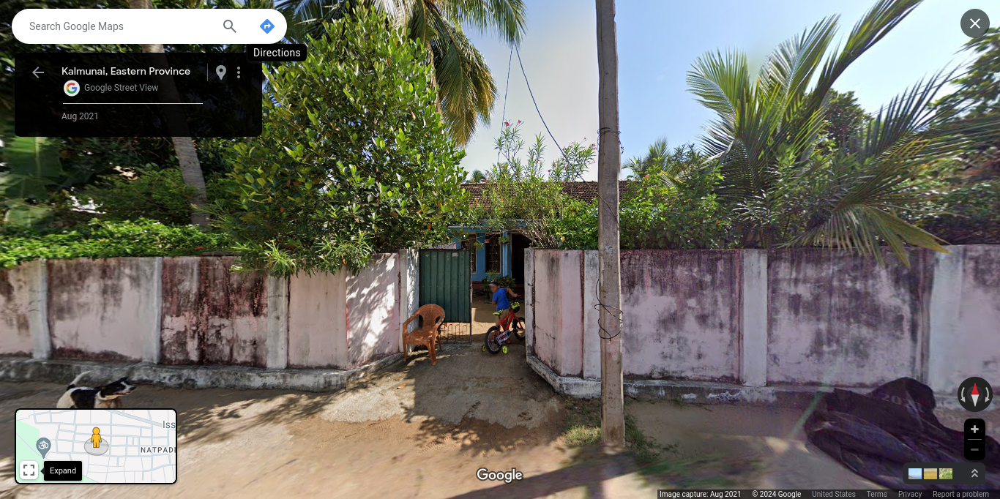

## Gurunagar West

**Gurunagar West** Grama Niladhari Division, **Jaffna** Divisional Secretariat Division, **Jaffna** District, **Northern** Province

**Jaffna** Polling Division, **Jaffna** Electoral District

Population: 1,546 (2012)

(**LK-4136055**/J/71)

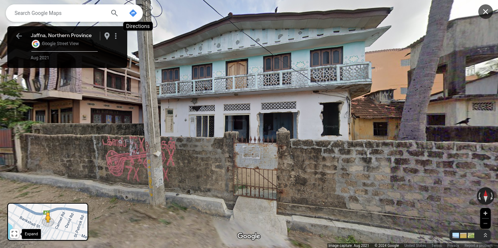

## Uraniya

**Uraniya** Grama Niladhari Division, **Rideemaliyadda** Divisional Secretariat Division, **Badulla** District, **Uva** Province

**Mahiyanganaya** Polling Division, **Badulla** Electoral District

Population: 608 (2012)

(**LK-8106130**/11C)

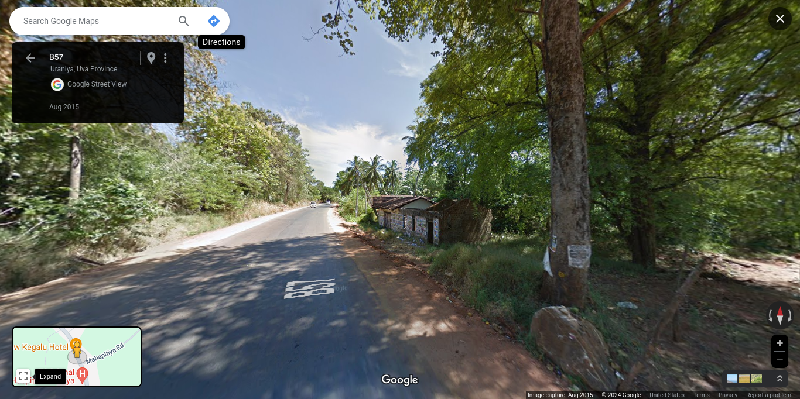

## Kurukulawa South

**Kurukulawa South** Grama Niladhari Division, **Wattala** Divisional Secretariat Division, **Gampaha** District, **Western** Province

**Wattala** Polling Division, **Gampaha** Electoral District

Population: 2,230 (2012)

(**LK-1218105**/250A)

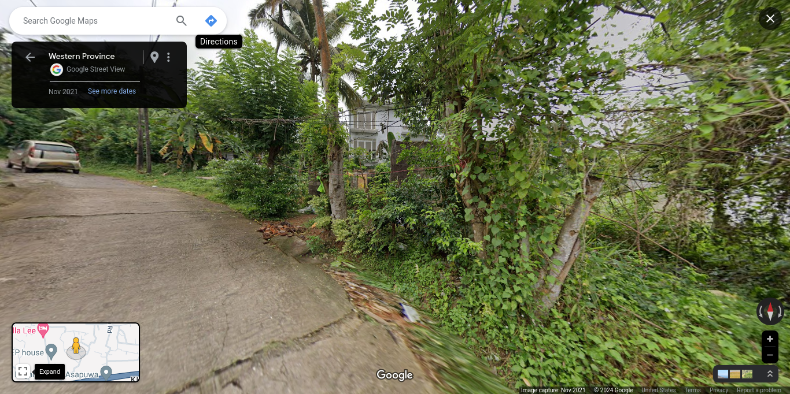

## Makandana west

**Makandana west** Grama Niladhari Division, **Kesbewa** Divisional Secretariat Division, **Colombo** District, **Western** Province

**Kesbewa** Polling Division, **Colombo** Electoral District

Population: 4,434 (2012)

(**LK-1136315**/569A)

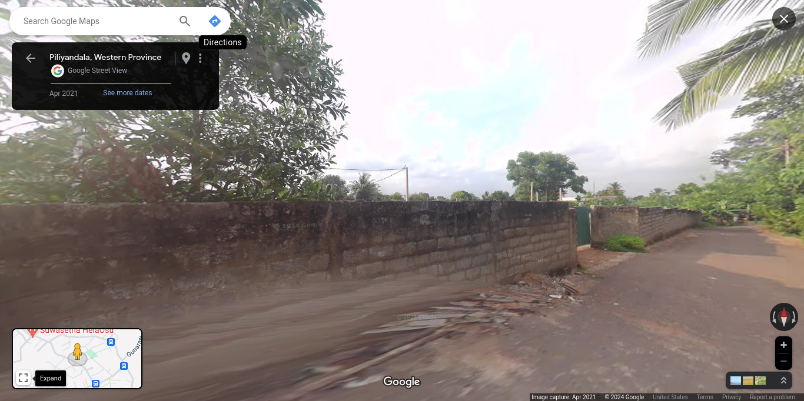

## Waharaka

**Waharaka** Grama Niladhari Division, **Dompe** Divisional Secretariat Division, **Gampaha** District, **Western** Province

**Dompe** Polling Division, **Gampaha** Electoral District

Population: 1,233 (2012)

(**LK-1230335**/410C)

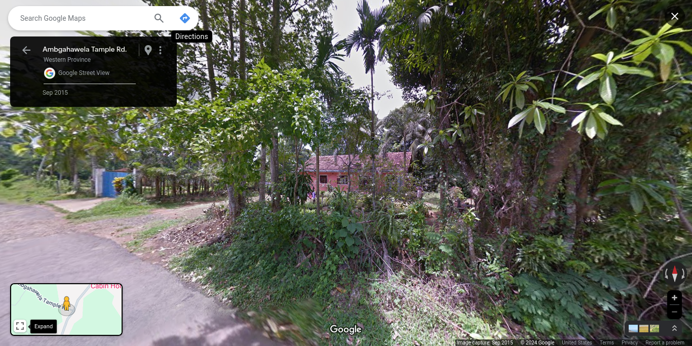

## Akkaraipattu 20

**Akkaraipattu 20** Grama Niladhari Division, **Akkaraipattu** Divisional Secretariat Division, **Ampara** District, **Eastern** Province

**Samanthurai** Polling Division, **Digamadulla** Electoral District

Population: 1,337 (2012)

(**LK-5236110**/AP/20/1)

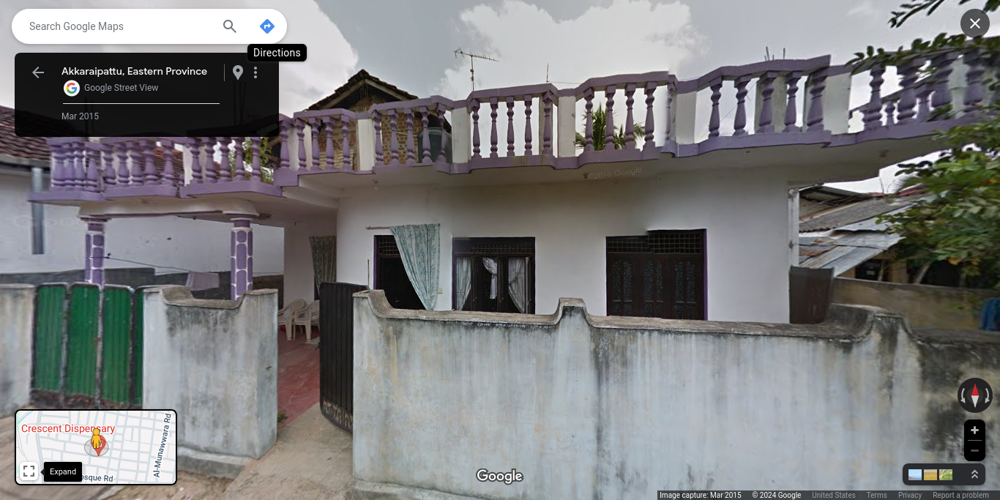

## Walasmulla East

**Walasmulla East** Grama Niladhari Division, **Walasmulla** Divisional Secretariat Division, **Hambantota** District, **Southern** Province

**Mulkirigala** Polling Division, **Hambantota** Electoral District

Population: 764 (2012)

(**LK-3325245**/454)

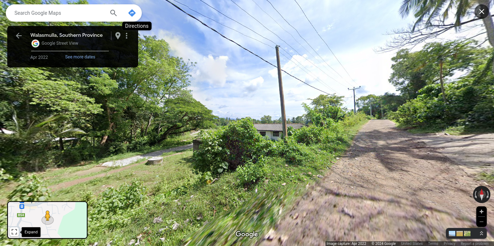

## Mavittara North

**Mavittara North** Grama Niladhari Division, **Kesbewa** Divisional Secretariat Division, **Colombo** District, **Western** Province

**Kesbewa** Polling Division, **Colombo** Electoral District

Population: 2,761 (2012)

(**LK-1136205**/586A)

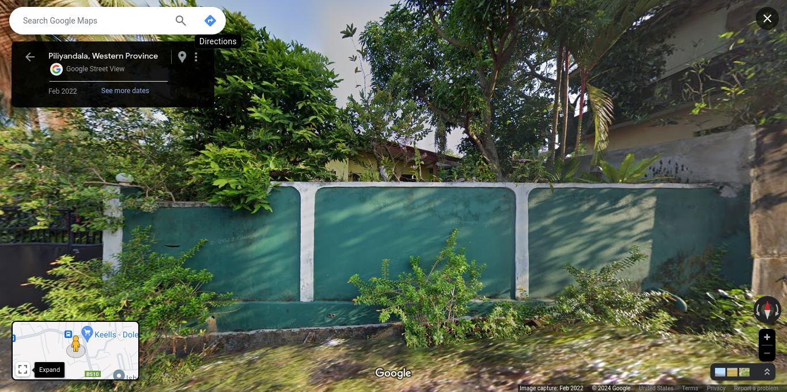

## Kaluganga

**Kaluganga** Grama Niladhari Division, **Laggala-Pallegama** Divisional Secretariat Division, **Matale** District, **Central** Province

**Laggala** Polling Division, **Matale** Electoral District

Population: 673 (2012)

(**LK-2224020**/E402F)

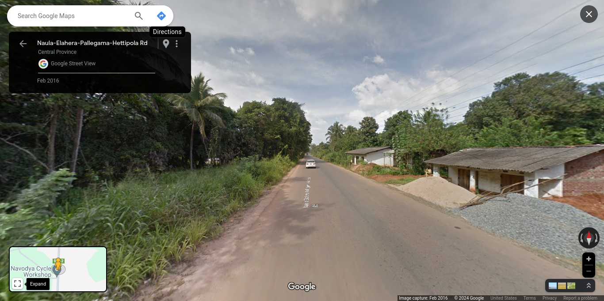

## Hinidumgoda

**Hinidumgoda** Grama Niladhari Division, **Akmeemana** Divisional Secretariat Division, **Galle** District, **Southern** Province

**Akmeemana** Polling Division, **Galle** Electoral District

Population: 1,275 (2012)

(**LK-3145205**/130C)

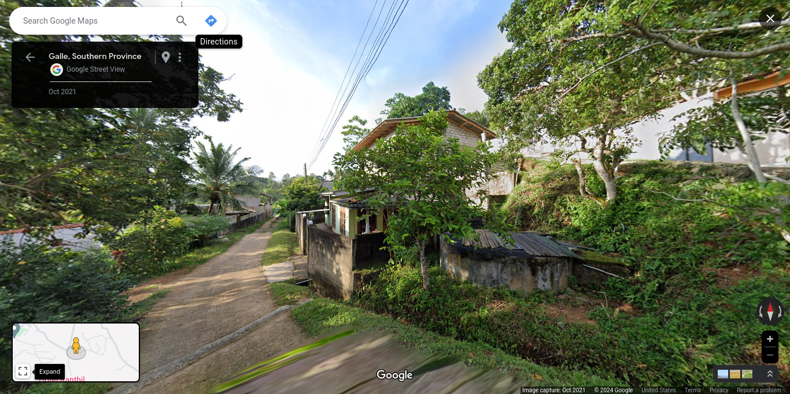

## Thoppuwa

**Thoppuwa** Grama Niladhari Division, **Katana** Divisional Secretariat Division, **Gampaha** District, **Western** Province

**Katana** Polling Division, **Gampaha** Electoral District

Population: 2,914 (2012)

(**LK-1206020**/65A)

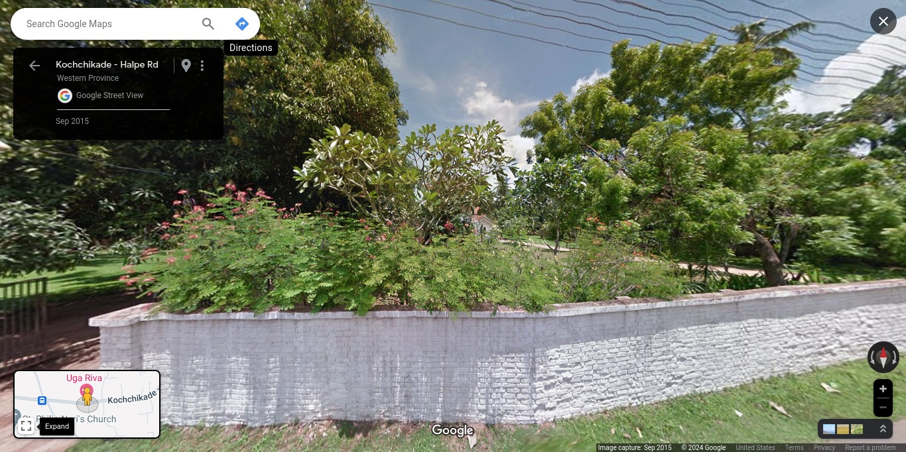

## Kehelwathugoda

**Kehelwathugoda** Grama Niladhari Division, **Rambukkana** Divisional Secretariat Division, **Kegalle** District, **Sabaragamuwa** Province

**Rambukkana** Polling Division, **Kegalle** Electoral District

Population: 1,791 (2012)

(**LK-9203310**/75A)

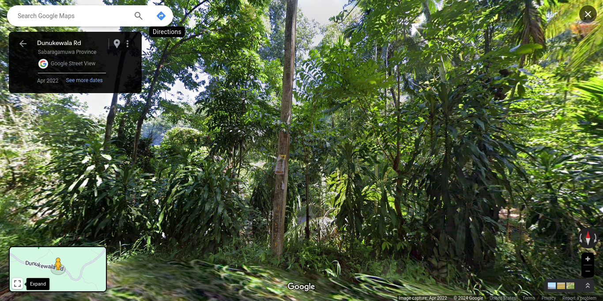

## Munasinghagoda

**Munasinghagoda** Grama Niladhari Division, **Beruwala** Divisional Secretariat Division, **Kalutara** District, **Western** Province

**Beruwala** Polling Division, **Kalutara** Electoral District

Population: 1,354 (2012)

(**LK-1324090**/741A)

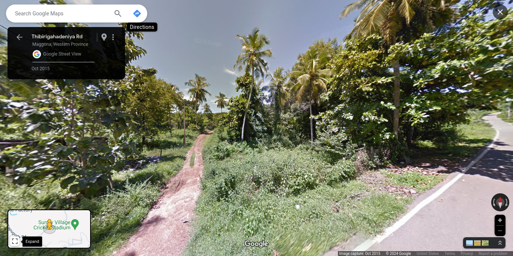

## Sivanagar

**Sivanagar** Grama Niladhari Division, **Karachchi** Divisional Secretariat Division, **Kilinochchi** District, **Northern** Province

**Kilinochchi** Polling Division, **Jaffna** Electoral District

Population: 994 (2012)

(**LK-4509135**/KN/35)

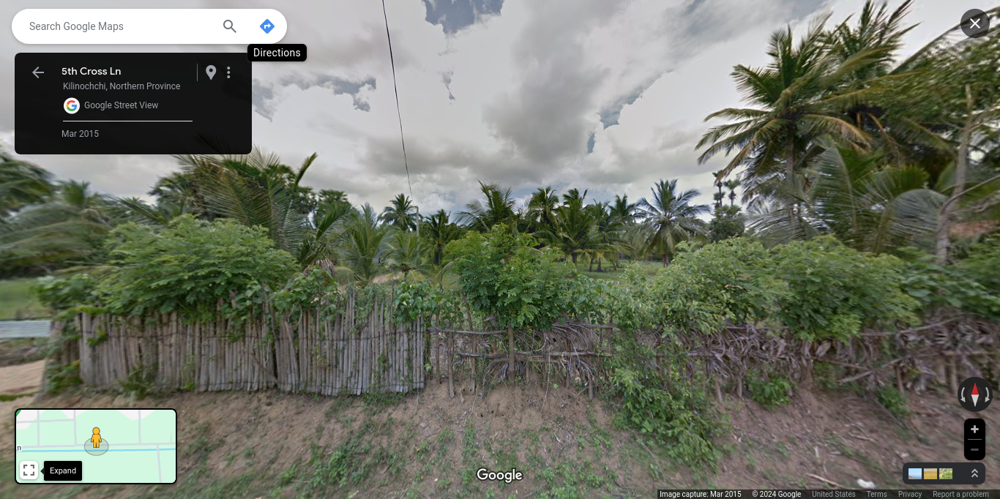

## Yatihena

**Yatihena** Grama Niladhari Division, **Biyagama** Divisional Secretariat Division, **Gampaha** District, **Western** Province

**Biyagama** Polling Division, **Gampaha** Electoral District

Population: 4,554 (2012)

(**LK-1239145**/274B)

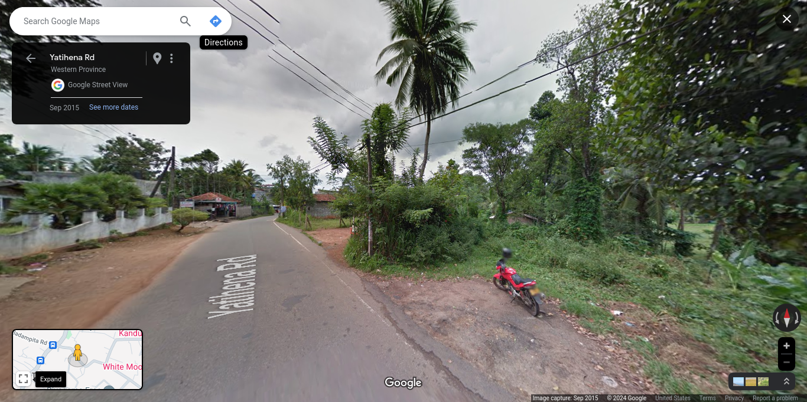

## Gurulepola

**Gurulepola** Grama Niladhari Division, **Maspotha** Divisional Secretariat Division, **Kurunegala** District, **North Western** Province

**Kurunegala** Polling Division, **Kurunegala** Electoral District

Population: 1,129 (2012)

(**LK-6151105**/792)

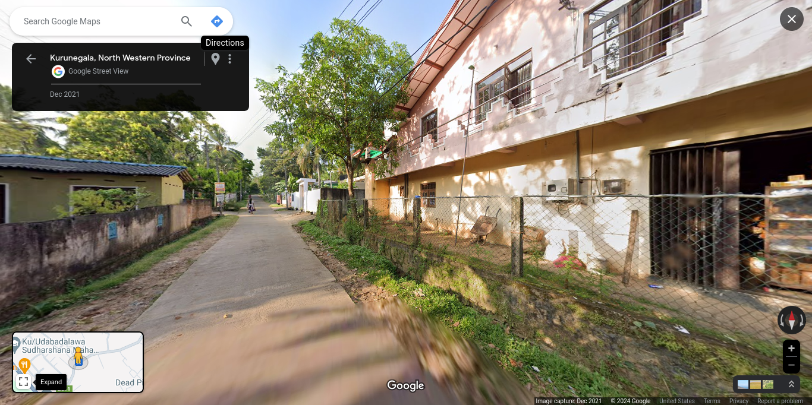

## Elagamuwa

**Elagamuwa** Grama Niladhari Division, **Polpithigama** Divisional Secretariat Division, **Kurunegala** District, **North Western** Province

**Yapahuwa** Polling Division, **Kurunegala** Electoral District

Population: 863 (2012)

(**LK-6127200**/398)

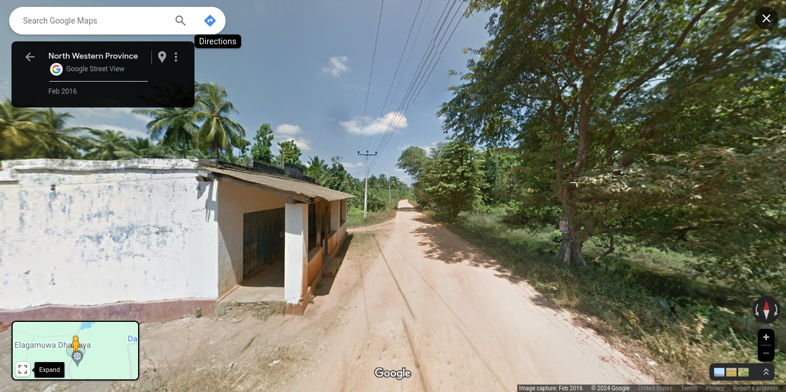

## Lakshapathiya Central

**Lakshapathiya Central** Grama Niladhari Division, **Moratuwa** Divisional Secretariat Division, **Colombo** District, **Western** Province

**Moratuwa** Polling Division, **Colombo** Electoral District

Population: 3,049 (2012)

(**LK-1133050**/550B)

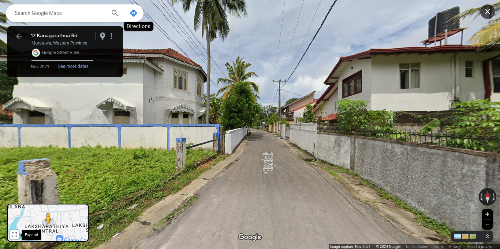

## Valaichchenai 5 Muslim South

**Valaichchenai 5 Muslim South** Grama Niladhari Division, **Koralai Pattu Central** Divisional Secretariat Division, **Batticaloa** District, **Eastern** Province

**Kalkudah** Polling Division, **Batticaloa** Electoral District

Population: 2,724 (2012)

(**LK-5104025**/206D)

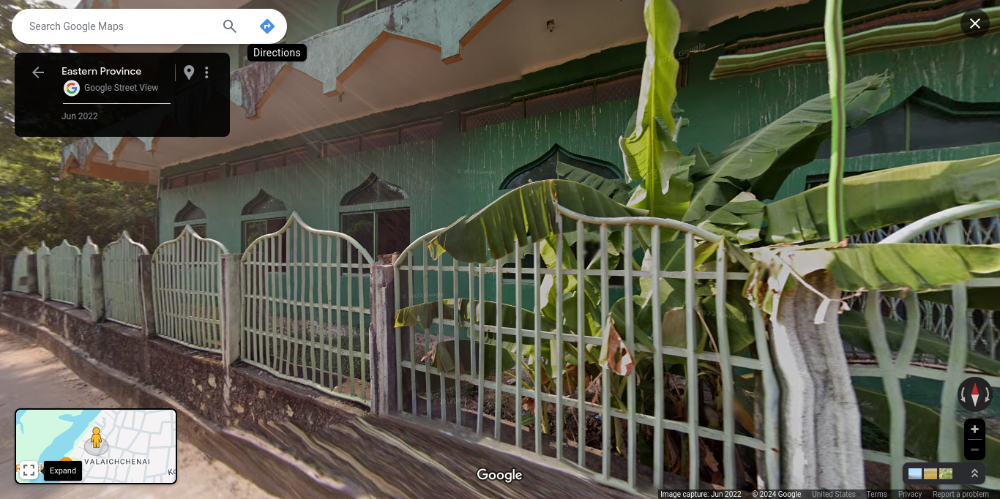

## Webada West

**Webada West** Grama Niladhari Division, **Mahara** Divisional Secretariat Division, **Gampaha** District, **Western** Province

**Mahara** Polling Division, **Gampaha** Electoral District

Population: 2,563 (2012)

(**LK-1233225**/288B)

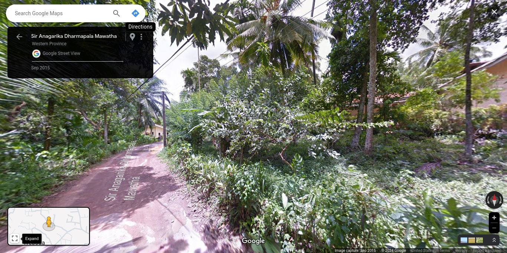

## Unanvitiya East

**Unanvitiya East** Grama Niladhari Division, **Nagoda** Divisional Secretariat Division, **Galle** District, **Southern** Province

**Hiniduma** Polling Division, **Galle** Electoral District

Population: 738 (2012)

(**LK-3124200**/211B)

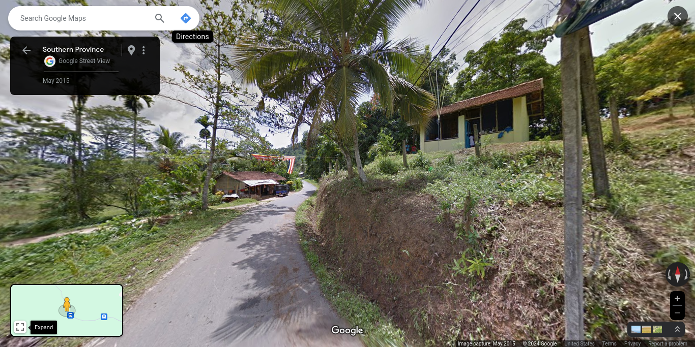

## Orugodawatta

**Orugodawatta** Grama Niladhari Division, **Kolonnawa** Divisional Secretariat Division, **Colombo** District, **Western** Province

**Kolonnawa** Polling Division, **Colombo** Electoral District

Population: 5,900 (2012)

(**LK-1106030**/510A)

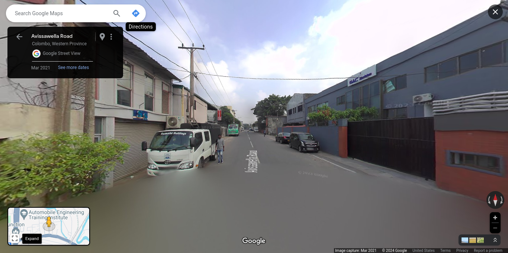

## Dimuthugama

**Dimuthugama** Grama Niladhari Division, **Welimada** Divisional Secretariat Division, **Badulla** District, **Uva** Province

**Welimada** Polling Division, **Badulla** Electoral District

Population: 2,078 (2012)

(**LK-8130070**/50H)

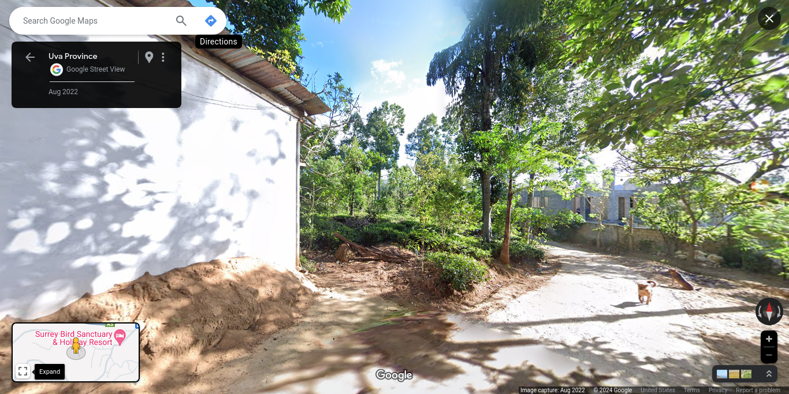

## Ninthavur 19

**Ninthavur 19** Grama Niladhari Division, **Ninthavur** Divisional Secretariat Division, **Ampara** District, **Eastern** Province

**Pothuvil** Polling Division, **Digamadulla** Electoral District

Population: 609 (2012)

(**LK-5230080**/38D)

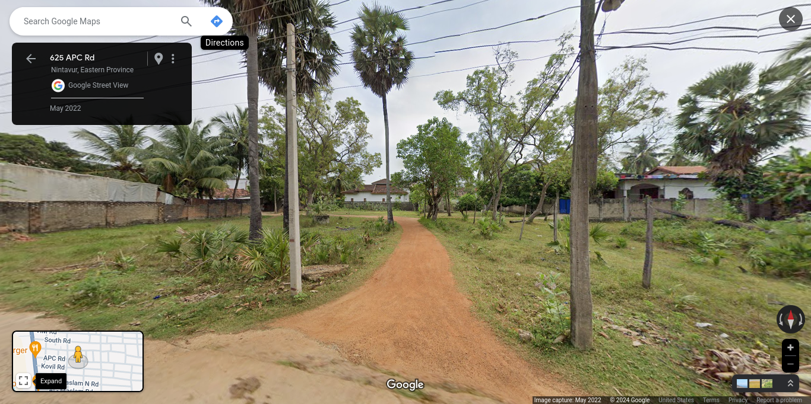

## Kudawella North

**Kudawella North** Grama Niladhari Division, **Tangalle** Divisional Secretariat Division, **Hambantota** District, **Southern** Province

**Beliatta** Polling Division, **Hambantota** Electoral District

Population: 1,098 (2012)

(**LK-3333330**/289)

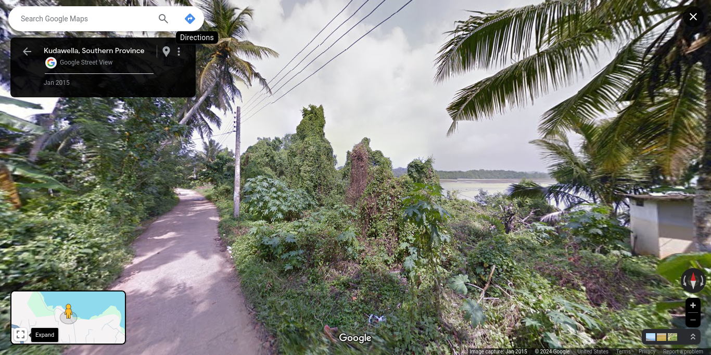

## Peraru West

**Peraru West** Grama Niladhari Division, **Kanthale** Divisional Secretariat Division, **Trincomalee** District, **Eastern** Province

**Seruvila** Polling Division, **Trincomalee** Electoral District

Population: 3,175 (2012)

(**LK-5321085**/227H)

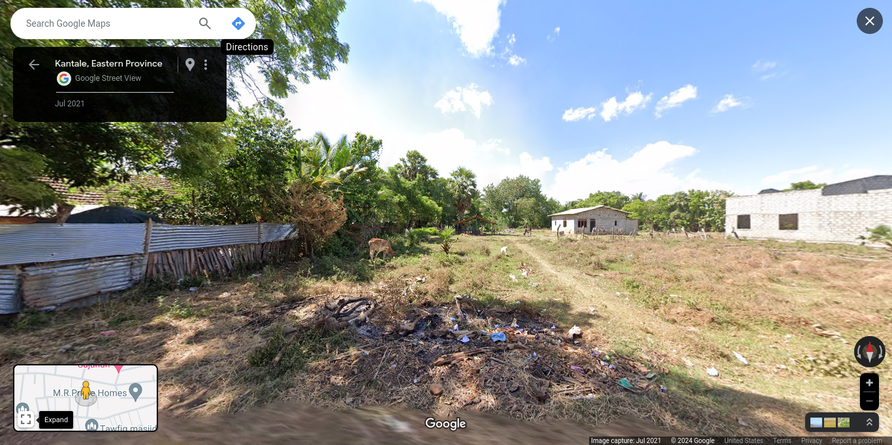

## Hedigama

**Hedigama** Grama Niladhari Division, **Kesbewa** Divisional Secretariat Division, **Colombo** District, **Western** Province

**Kesbewa** Polling Division, **Colombo** Electoral District

Population: 4,294 (2012)

(**LK-1136245**/563/73)

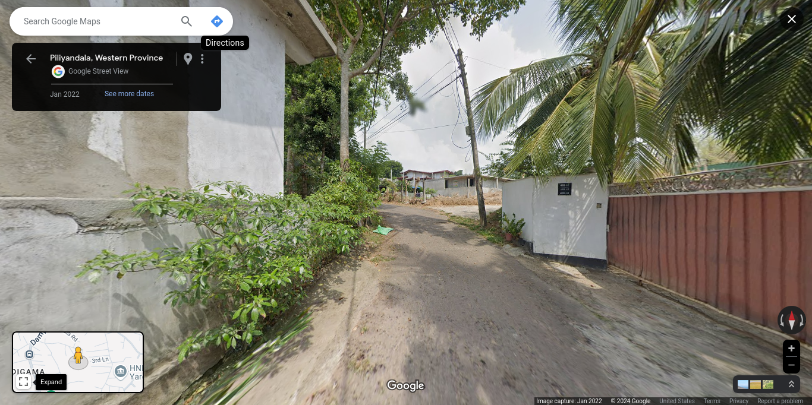

## Hiriyamalkumbura

**Hiriyamalkumbura** Grama Niladhari Division, **Yakkalamulla** Divisional Secretariat Division, **Galle** District, **Southern** Province

**Baddegama** Polling Division, **Galle** Electoral District

Population: 933 (2012)

(**LK-3148185**/180C)

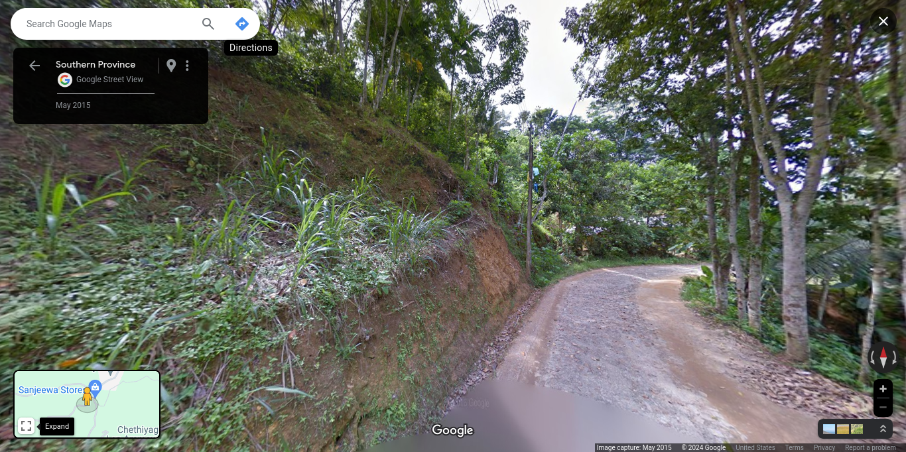

## Walawwatta

**Walawwatta** Grama Niladhari Division, **Galle Four Gravets** Divisional Secretariat Division, **Galle** District, **Southern** Province

**Galle** Polling Division, **Galle** Electoral District

Population: 1,640 (2012)

(**LK-3139140**/102B)

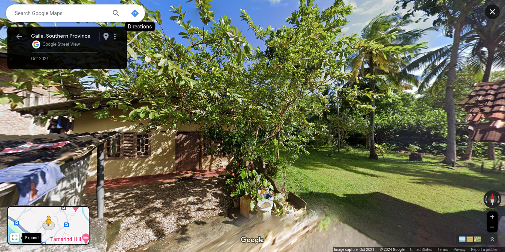

## Ihala Ainagama

**Ihala Ainagama** Grama Niladhari Division, **Pitabeddara** Divisional Secretariat Division, **Matara** District, **Southern** Province

**Deniyaya** Polling Division, **Matara** Electoral District

Population: 857 (2012)

(**LK-3203185**/263E)

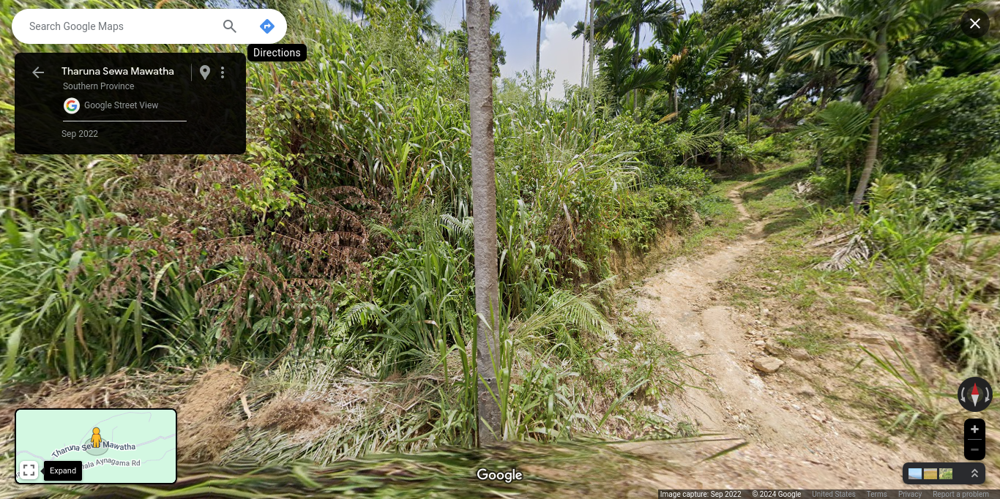

## Sinhapitiya South

**Sinhapitiya South** Grama Niladhari Division, **Udapalatha** Divisional Secretariat Division, **Kandy** District, **Central** Province

**Gampola** Polling Division, **Kandy** Electoral District

Population: 1,155 (2012)

(**LK-2151085**/1118)

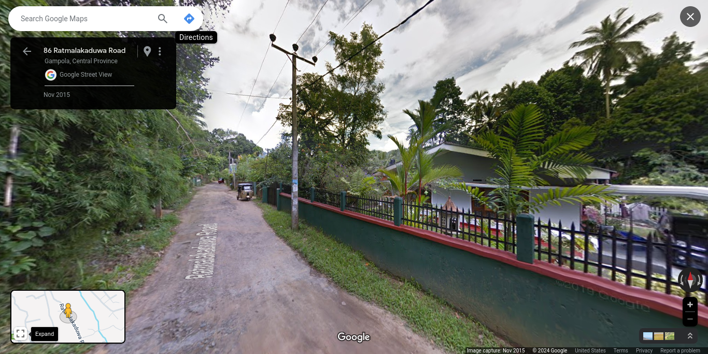

## Dodampahala Central

**Dodampahala Central** Grama Niladhari Division, **Dickwella** Divisional Secretariat Division, **Matara** District, **Southern** Province

**Devinuwara** Polling Division, **Matara** Electoral District

Population: 1,334 (2012)

(**LK-3248130**/453C)

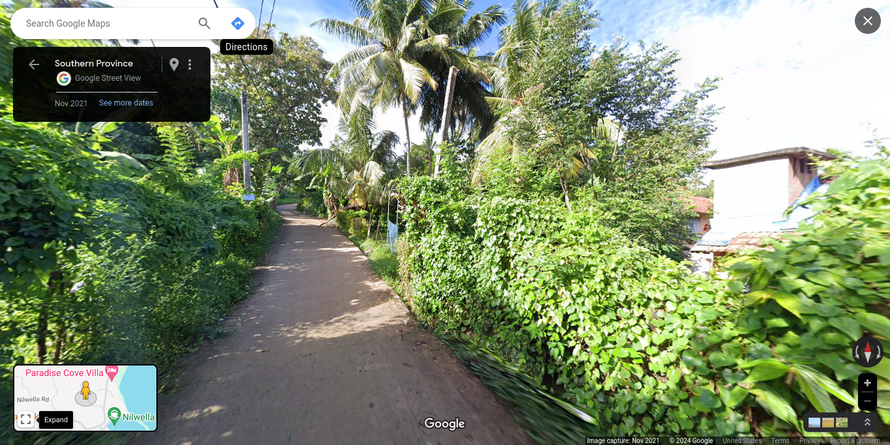

## Palakudawa

**Palakudawa** Grama Niladhari Division, **Kalpitiya** Divisional Secretariat Division, **Puttalam** District, **North Western** Province

**Puttalam** Polling Division, **Puttalam** Electoral District

Population: 2,464 (2012)

(**LK-6203090**/626C)

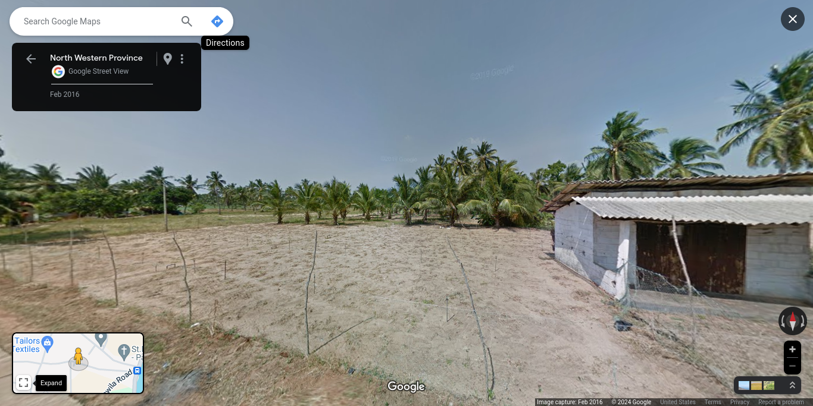

## Ninthavur 04

**Ninthavur 04** Grama Niladhari Division, **Ninthavur** Divisional Secretariat Division, **Ampara** District, **Eastern** Province

**Pothuvil** Polling Division, **Digamadulla** Electoral District

Population: 1,657 (2012)

(**LK-5230050**/38)

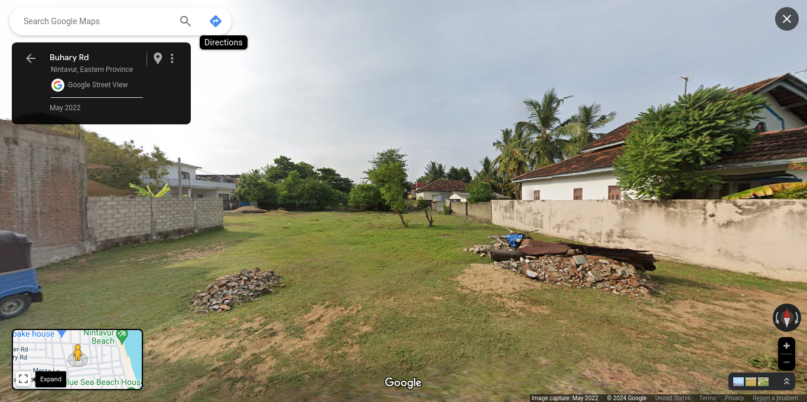

## Gallehepitiya

**Gallehepitiya** Grama Niladhari Division, **Panduwasnuwara East** Divisional Secretariat Division, **Kurunegala** District, **North Western** Province

**Panduwasnuwara** Polling Division, **Kurunegala** Electoral District

Population: 1,499 (2012)

(**LK-6148050**/1362)

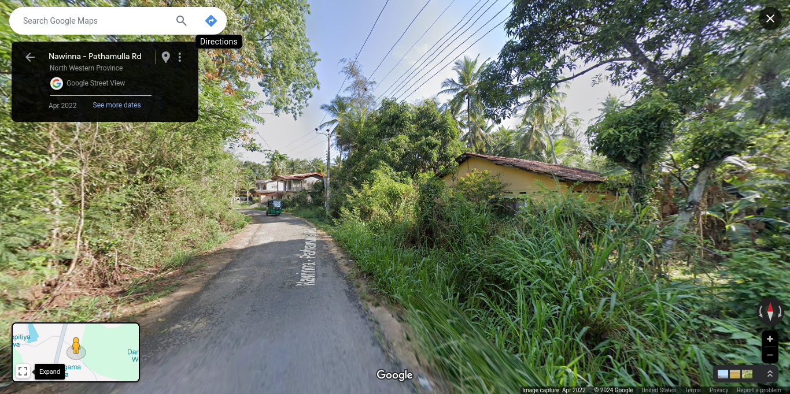

## Nattarampotha

**Nattarampotha** Grama Niladhari Division, **Kundasale** Divisional Secretariat Division, **Kandy** District, **Central** Province

**Kundasale** Polling Division, **Kandy** Electoral District

Population: 2,241 (2012)

(**LK-2127350**/684)

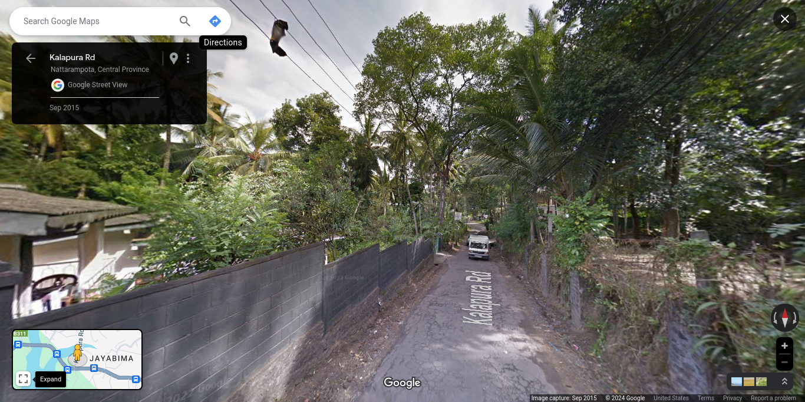

## Dodampotta

**Dodampotta** Grama Niladhari Division, **Pannala** Divisional Secretariat Division, **Kurunegala** District, **North Western** Province

**Katugampola** Polling Division, **Kurunegala** Electoral District

Population: 974 (2012)

(**LK-6178210**/1567)

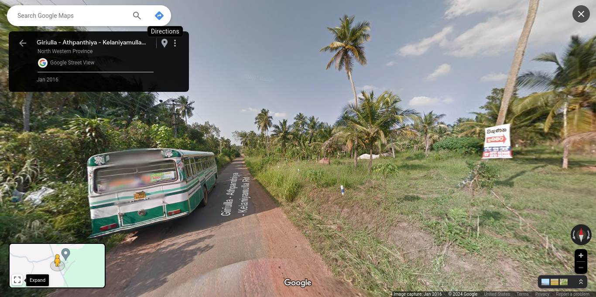

## Kaluwana North

**Kaluwana North** Grama Niladhari Division, **Pujapitiya** Divisional Secretariat Division, **Kandy** District, **Central** Province

**Harispattuwa** Polling Division, **Kandy** Electoral District

Population: 560 (2012)

(**LK-2106335**/556)

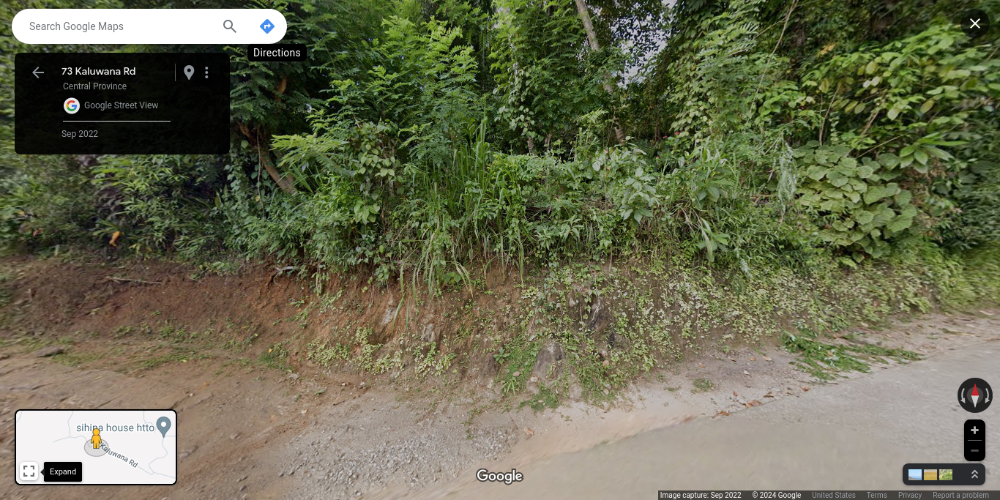

## Opatha

**Opatha** Grama Niladhari Division, **Warakapola** Divisional Secretariat Division, **Kegalle** District, **Sabaragamuwa** Province

**Dedigama** Polling Division, **Kegalle** Electoral District

Population: 1,775 (2012)

(**LK-9218025**/78B)

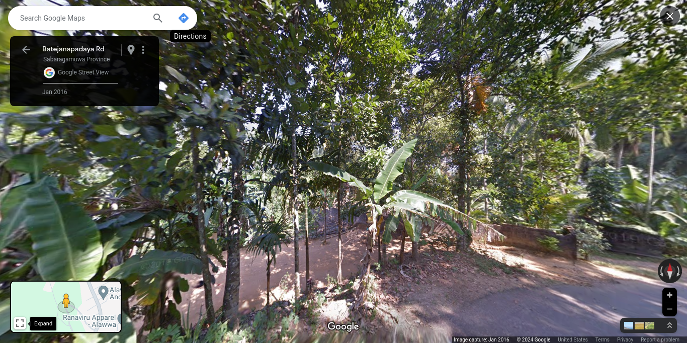

## Ranna West

**Ranna West** Grama Niladhari Division, **Tangalle** Divisional Secretariat Division, **Hambantota** District, **Southern** Province

**Tangalle** Polling Division, **Hambantota** Electoral District

Population: 1,773 (2012)

(**LK-3333050**/252)

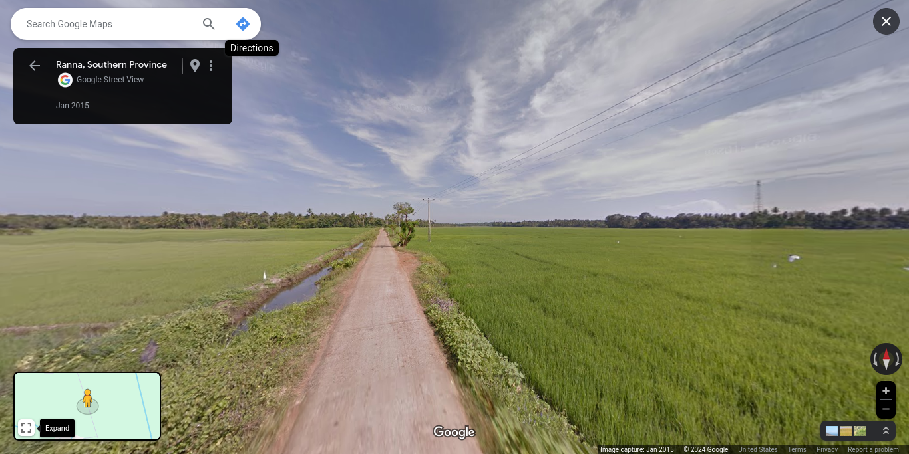

## Owatta

**Owatta** Grama Niladhari Division, **Mawanella** Divisional Secretariat Division, **Kegalle** District, **Sabaragamuwa** Province

**Mawanella** Polling Division, **Kegalle** Electoral District

Population: 1,412 (2012)

(**LK-9206120**/29B)

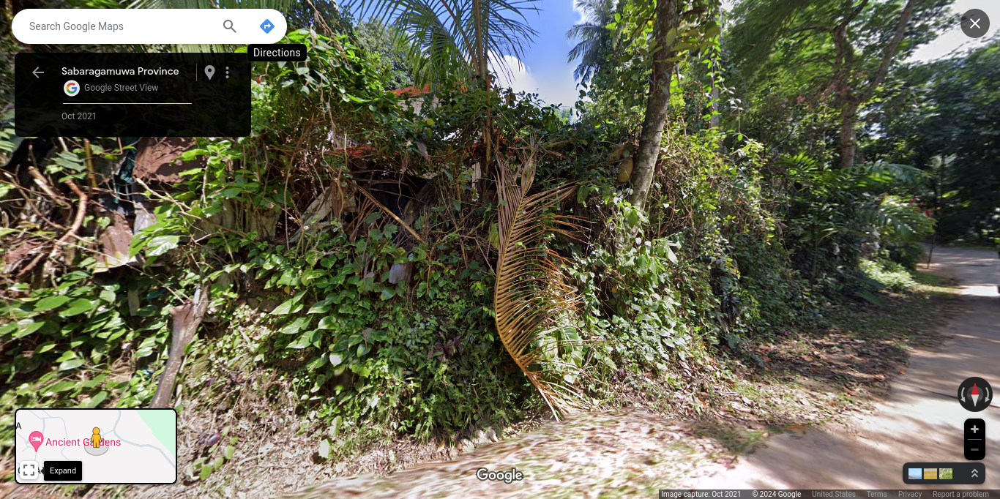

## Vannarponnai N.E. (South)

**Vannarponnai N.E. (South)** Grama Niladhari Division, **Nallur** Divisional Secretariat Division, **Jaffna** District, **Northern** Province

**Nallur** Polling Division, **Jaffna** Electoral District

Population: 1,501 (2012)

(**LK-4133065**/J/101)

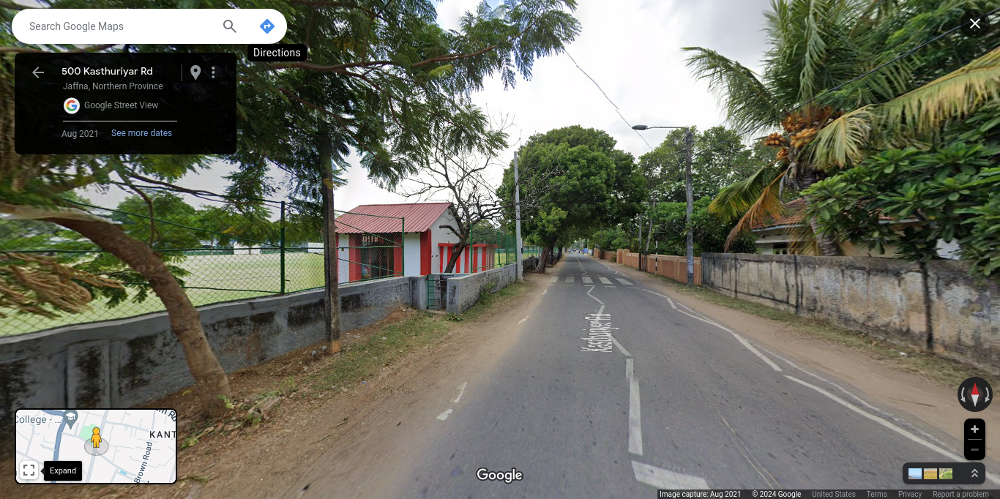

## Weralugampala

**Weralugampala** Grama Niladhari Division, **Dompe** Divisional Secretariat Division, **Gampaha** District, **Western** Province

**Dompe** Polling Division, **Gampaha** Electoral District

Population: 647 (2012)

(**LK-1230210**/392A)

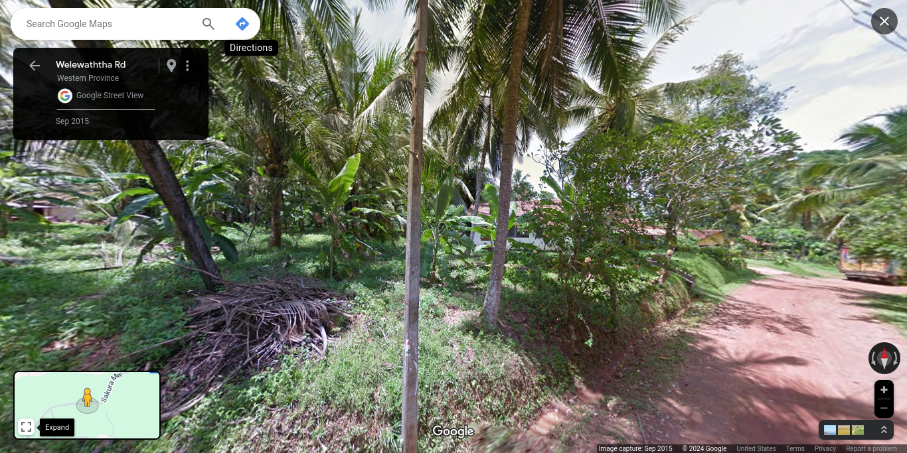

## Bowala West

**Bowala West** Grama Niladhari Division, **Walasmulla** Divisional Secretariat Division, **Hambantota** District, **Southern** Province

**Mulkirigala** Polling Division, **Hambantota** Electoral District

Population: 717 (2012)

(**LK-3325090**/462)

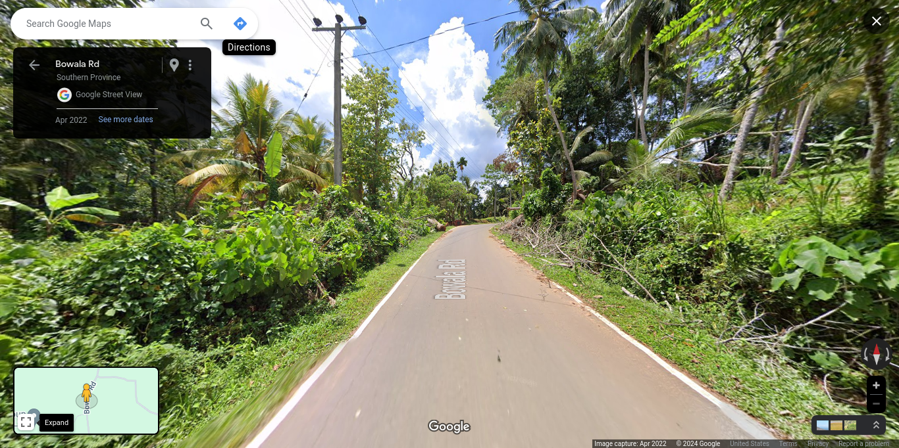

## WellaWeediya South

**WellaWeediya South** Grama Niladhari Division, **Negombo** Divisional Secretariat Division, **Gampaha** District, **Western** Province

**Negombo** Polling Division, **Gampaha** Electoral District

Population: 2,718 (2012)

(**LK-1203105**/158A)

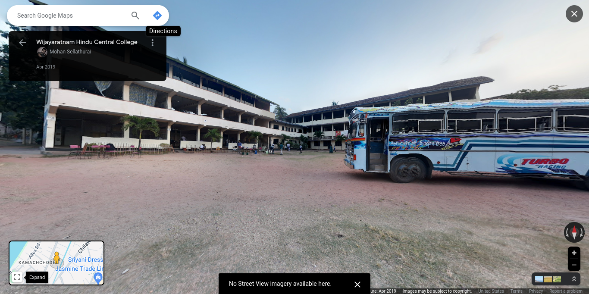

## Kattankudy Division 6

**Kattankudy Division 6** Grama Niladhari Division, **Kattankudy** Divisional Secretariat Division, **Batticaloa** District, **Eastern** Province

**Batticaloa** Polling Division, **Batticaloa** Electoral District

Population: 2,517 (2012)

(**LK-5124060**/162)

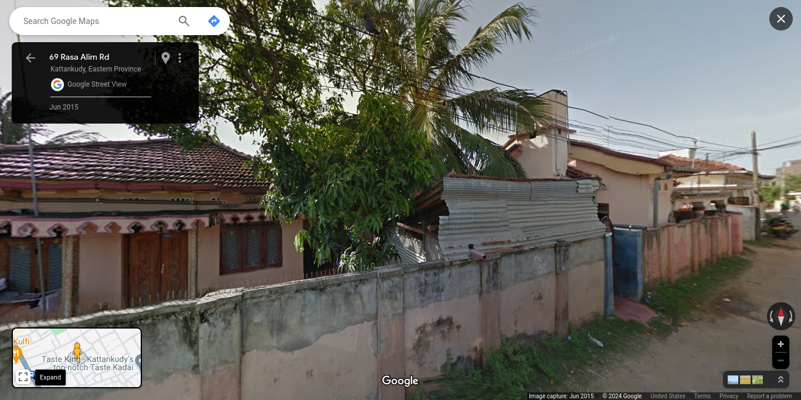

## Pandarikkulam

**Pandarikkulam** Grama Niladhari Division, **Vavuniya** Divisional Secretariat Division, **Vavuniya** District, **Northern** Province

**Vavuniya** Polling Division, **Vanni** Electoral District

Population: 6,469 (2012)

(**LK-4309200**/214E)

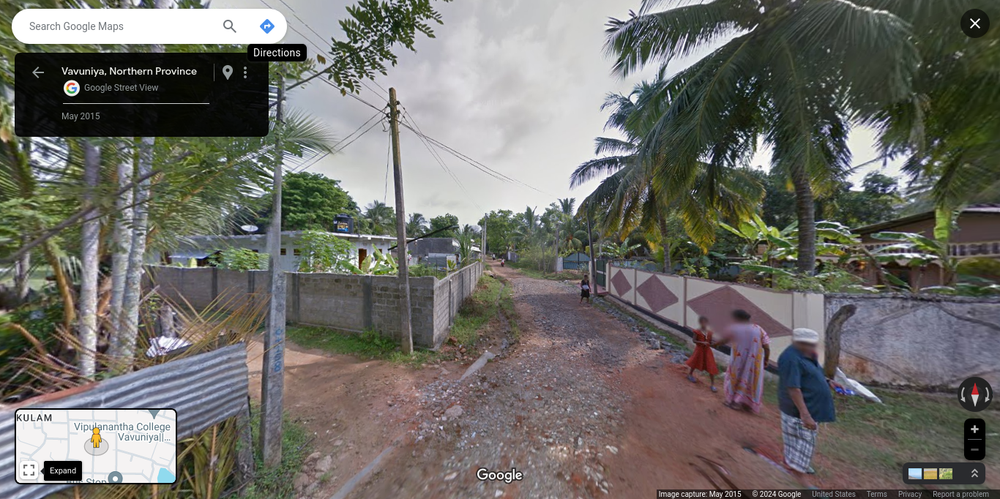

## Central Camp 06

**Central Camp 06** Grama Niladhari Division, **Navithanveli** Divisional Secretariat Division, **Ampara** District, **Eastern** Province

**Samanthurai** Polling Division, **Digamadulla** Electoral District

Population: 1,106 (2012)

(**LK-5216025**/SP/93/F)

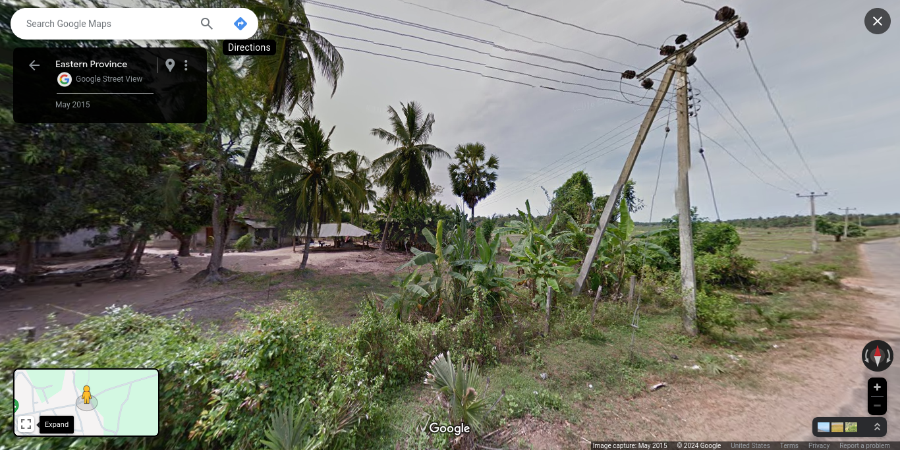

## Welimaluwa

**Welimaluwa** Grama Niladhari Division, **Pelmadulla** Divisional Secretariat Division, **Ratnapura** District, **Sabaragamuwa** Province

**Pelmadulla** Polling Division, **Ratnapura** Electoral District

Population: 3,694 (2012)

(**LK-9124060**/172A)

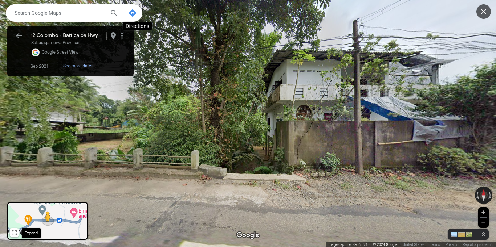

## Thennalanda

**Thennalanda** Grama Niladhari Division, **Medadumbara** Divisional Secretariat Division, **Kandy** District, **Central** Province

**Teldeniya** Polling Division, **Kandy** Electoral District

Population: 522 (2012)

(**LK-2124455**/820)

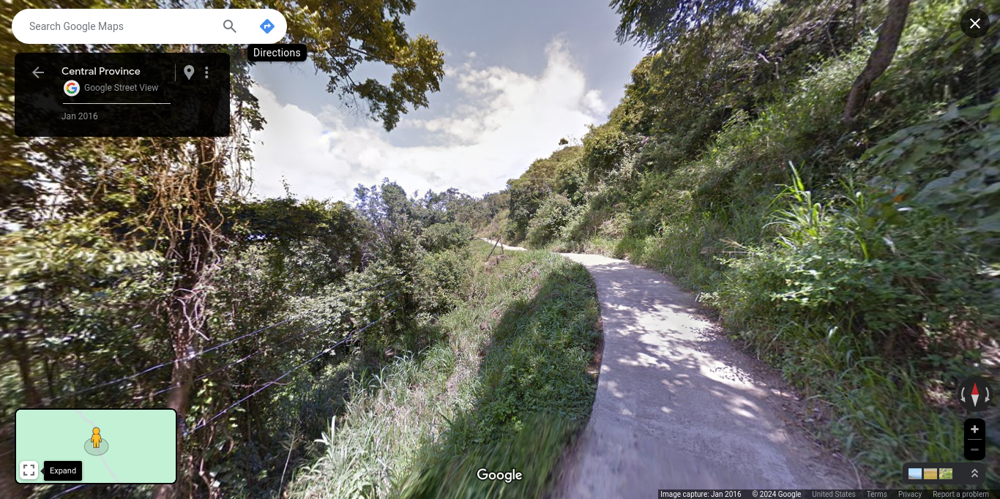

## Kiriketuwewa

**Kiriketuwewa** Grama Niladhari Division, **Kebithigollewa** Divisional Secretariat Division, **Anuradhapura** District, **North Central** Province

**Medawachchiya** Polling Division, **Anuradhapura** Electoral District

Population: 1,530 (2012)

(**LK-7106110**/21)

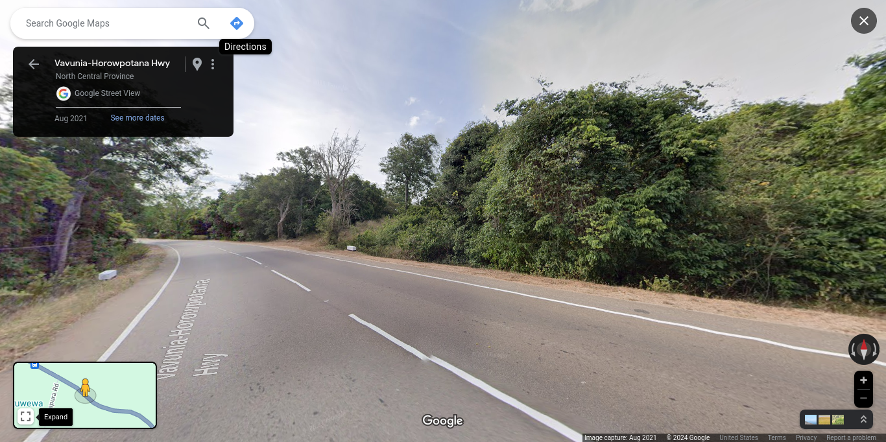

## Ihala Kadigamuwa

**Ihala Kadigamuwa** Grama Niladhari Division, **Bingiriya** Divisional Secretariat Division, **Kurunegala** District, **North Western** Province

**Bingiriya** Polling Division, **Kurunegala** Electoral District

Population: 2,305 (2012)

(**LK-6142180**/1480)

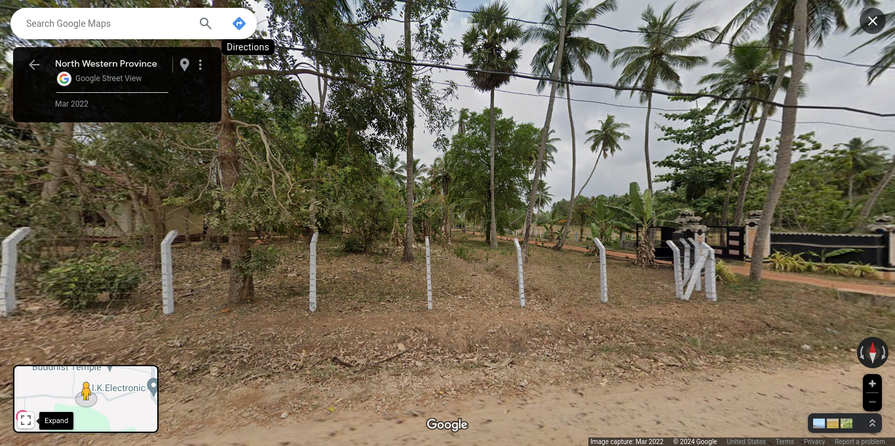

## Subhoothipura

**Subhoothipura** Grama Niladhari Division, **Kaduwela** Divisional Secretariat Division, **Colombo** District, **Western** Province

**Kaduwela** Polling Division, **Colombo** Electoral District

Population: 2,568 (2012)

(**LK-1109170**/492)

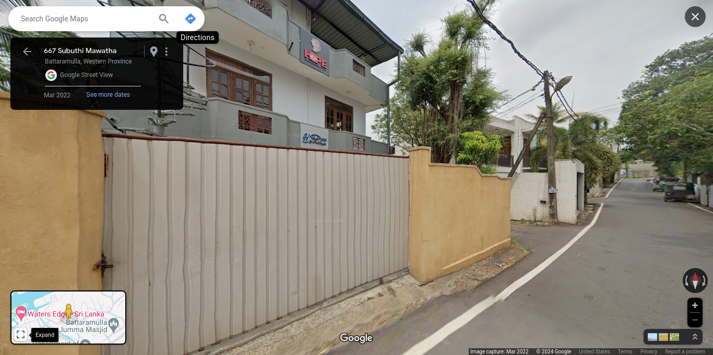

## Radawadunna Central

**Radawadunna Central** Grama Niladhari Division, **Mirigama** Divisional Secretariat Division, **Gampaha** District, **Western** Province

**Mirigama** Polling Division, **Gampaha** Electoral District

Population: 891 (2012)

(**LK-1212650**/360C)

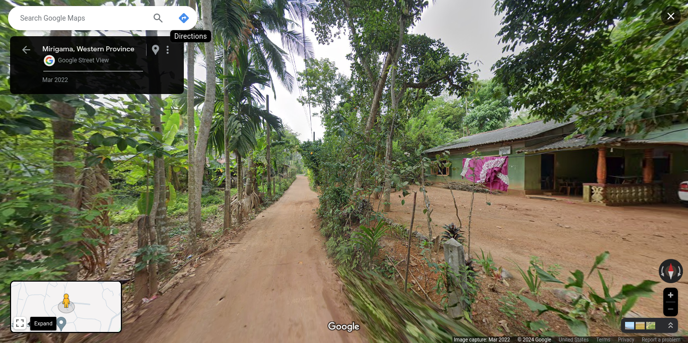

## Handessa

**Handessa** Grama Niladhari Division, **Udunuwara** Divisional Secretariat Division, **Kandy** District, **Central** Province

**Udunuwara** Polling Division, **Kandy** Electoral District

Population: 738 (2012)

(**LK-2139275**/14)

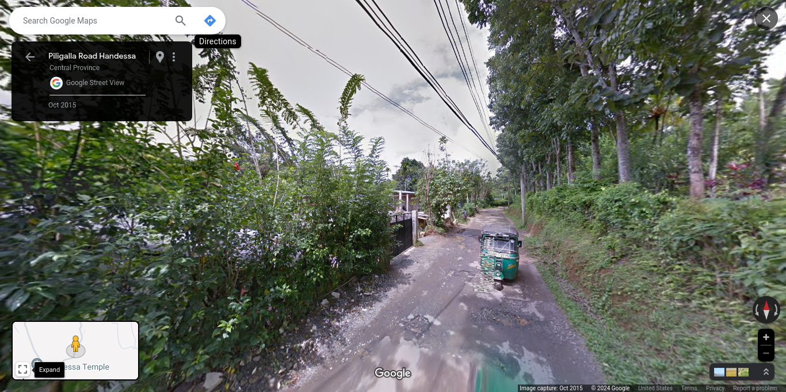

## Thenagama South

**Thenagama South** Grama Niladhari Division, **Tangalle** Divisional Secretariat Division, **Hambantota** District, **Southern** Province

**Beliatta** Polling Division, **Hambantota** Electoral District

Population: 504 (2012)

(**LK-3333075**/306)

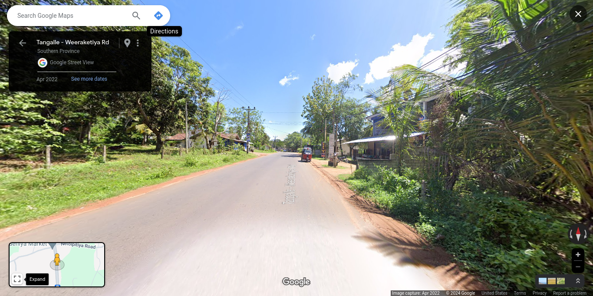

## Kadigamuwa

**Kadigamuwa** Grama Niladhari Division, **Rambukkana** Divisional Secretariat Division, **Kegalle** District, **Sabaragamuwa** Province

**Rambukkana** Polling Division, **Kegalle** Electoral District

Population: 1,573 (2012)

(**LK-9203240**/21)

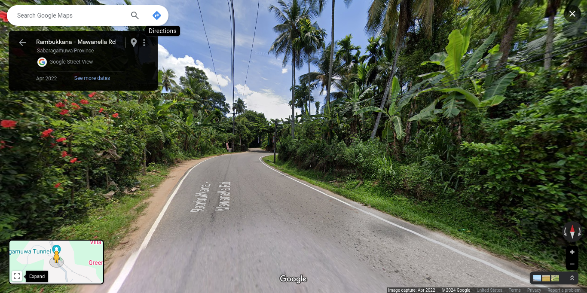

## Galwetiya

**Galwetiya** Grama Niladhari Division, **Wattala** Divisional Secretariat Division, **Gampaha** District, **Western** Province

**Wattala** Polling Division, **Gampaha** Electoral District

Population: 3,426 (2012)

(**LK-1218225**/176B)

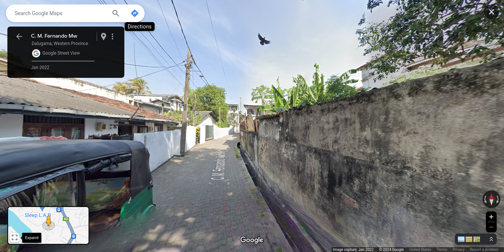

## Idama

**Idama** Grama Niladhari Division, **Moratuwa** Divisional Secretariat Division, **Colombo** District, **Western** Province

**Moratuwa** Polling Division, **Colombo** Electoral District

Population: 2,826 (2012)

(**LK-1133115**/552)

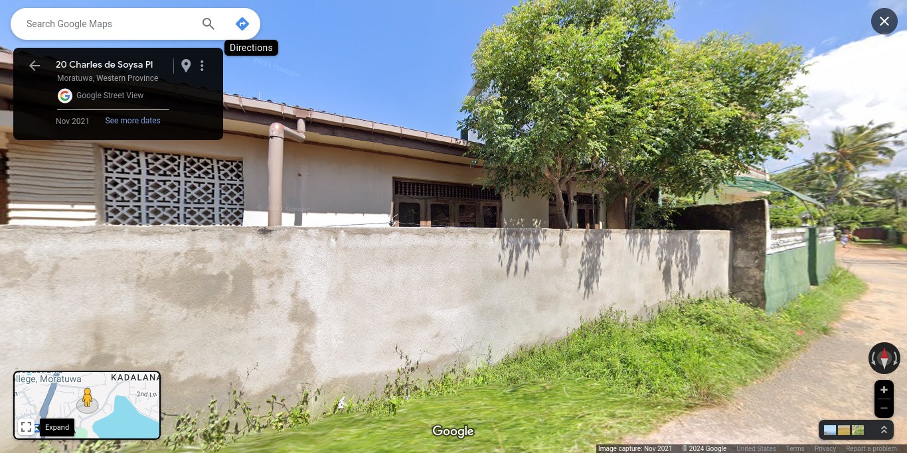

## Natpiddimunai (M.P ) 04

**Natpiddimunai (M.P ) 04** Grama Niladhari Division, **Kalmunai** Divisional Secretariat Division, **Ampara** District, **Eastern** Province

**Kalmunai** Polling Division, **Digamadulla** Electoral District

Population: 1,117 (2012)

(**LK-5224065**/KP/64C)

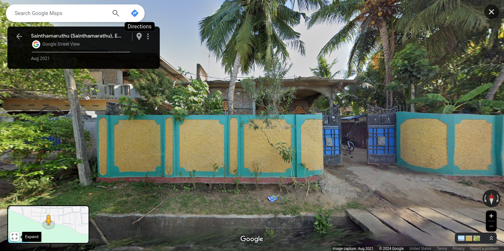

## Bandawa

**Bandawa** Grama Niladhari Division, **Polgahawela** Divisional Secretariat Division, **Kurunegala** District, **North Western** Province

**Polgahawela** Polling Division, **Kurunegala** Electoral District

Population: 1,935 (2012)

(**LK-6187245**/922)

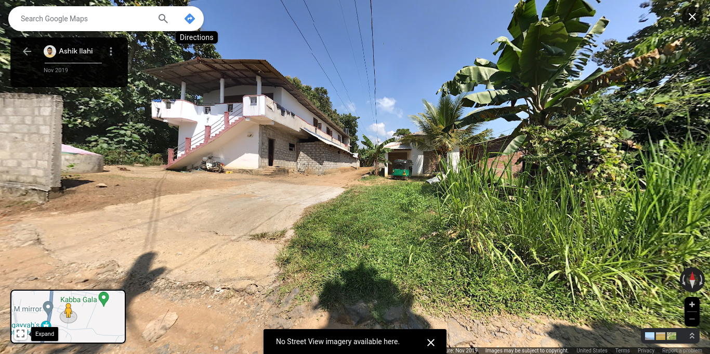

## Madurugama

**Madurugama** Grama Niladhari Division, **Maho** Divisional Secretariat Division, **Kurunegala** District, **North Western** Province

**Yapahuwa** Polling Division, **Kurunegala** Electoral District

Population: 1,044 (2012)

(**LK-6124125**/150)

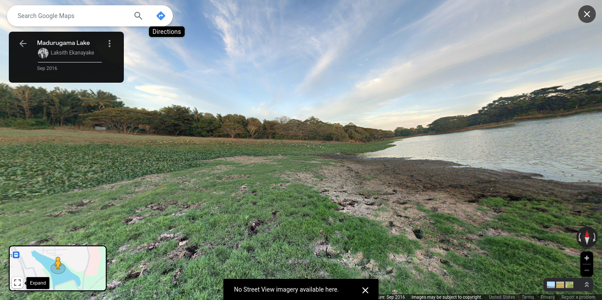

## Ihala Biyanvila Central

**Ihala Biyanvila Central** Grama Niladhari Division, **Biyagama** Divisional Secretariat Division, **Gampaha** District, **Western** Province

**Biyagama** Polling Division, **Gampaha** Electoral District

Population: 5,003 (2012)

(**LK-1239015**/269B)

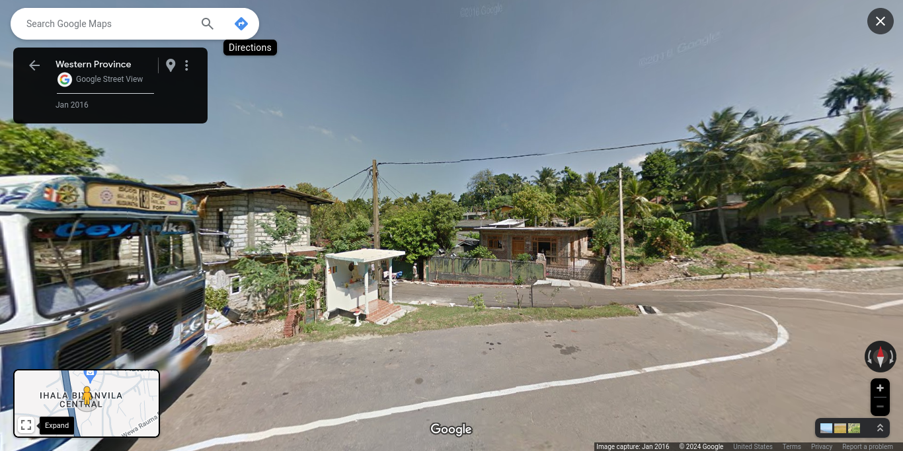

## Ragama

**Ragama** Grama Niladhari Division, **Ja-Ela** Divisional Secretariat Division, **Gampaha** District, **Western** Province

**Ja Ela** Polling Division, **Gampaha** Electoral District

Population: 3,985 (2012)

(**LK-1221270**/181)

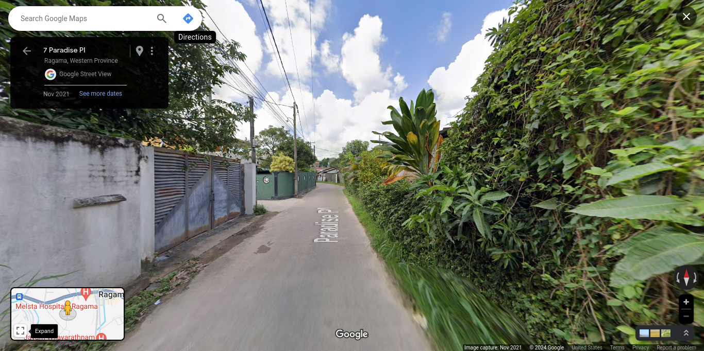

## Hanthna Pedesa

**Hanthna Pedesa** Grama Niladhari Division, **Kandy Four Gravets & Gangawata Korale** Divisional Secretariat Division, **Kandy** District, **Central** Province

**Senkadagala** Polling Division, **Kandy** Electoral District

Population: 1,766 (2012)

(**LK-2130220**/263)

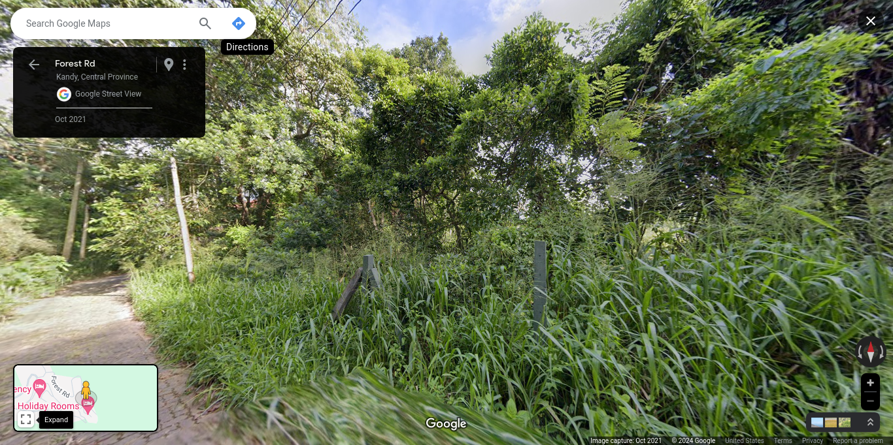

## Puliyankulam South

**Puliyankulam South** Grama Niladhari Division, **Vavuniya North** Divisional Secretariat Division, **Vavuniya** District, **Northern** Province

**Vavuniya** Polling Division, **Vanni** Electoral District

Population: 947 (2012)

(**LK-4303080**/224)

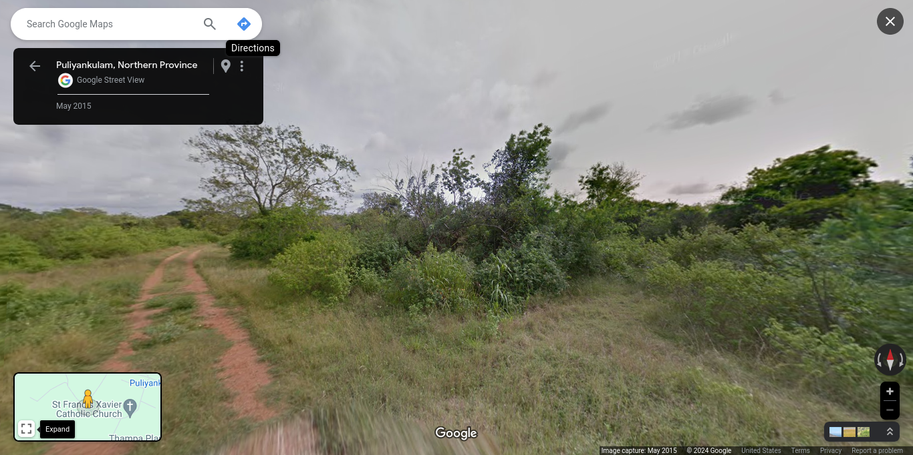

## Veehena

**Veehena** Grama Niladhari Division, **Mahawewa** Divisional Secretariat Division, **Puttalam** District, **North Western** Province

**Nattandiya** Polling Division, **Puttalam** Electoral District

Population: 741 (2012)

(**LK-6239105**/528A)

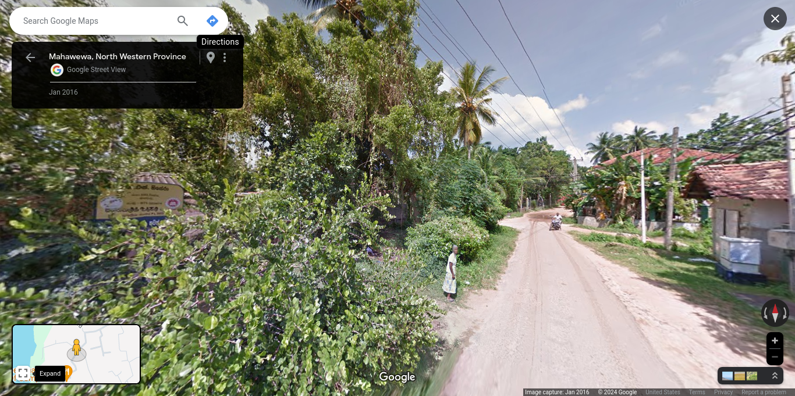

## Moratumulla West

**Moratumulla West** Grama Niladhari Division, **Moratuwa** Divisional Secretariat Division, **Colombo** District, **Western** Province

**Moratuwa** Polling Division, **Colombo** Electoral District

Population: 3,630 (2012)

(**LK-1133140**/558B)

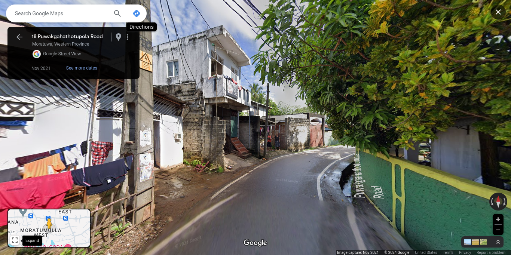

## Ankumbura North

**Ankumbura North** Grama Niladhari Division, **Pujapitiya** Divisional Secretariat Division, **Kandy** District, **Central** Province

**Harispattuwa** Polling Division, **Kandy** Electoral District

Population: 1,085 (2012)

(**LK-2106045**/533)

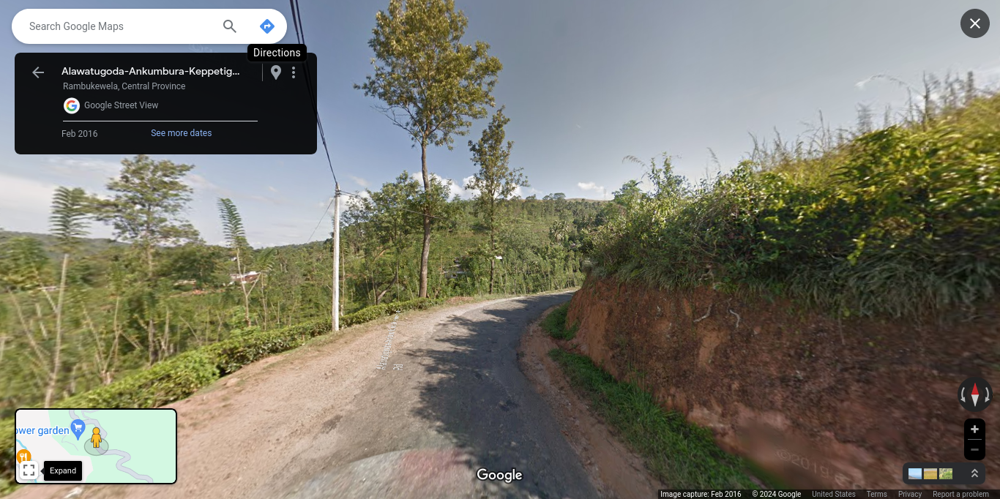

## Wanaraniya

**Wanaraniya** Grama Niladhari Division, **Rattota** Divisional Secretariat Division, **Matale** District, **Central** Province

**Rattota** Polling Division, **Matale** Electoral District

Population: 959 (2012)

(**LK-2230085**/E375C)

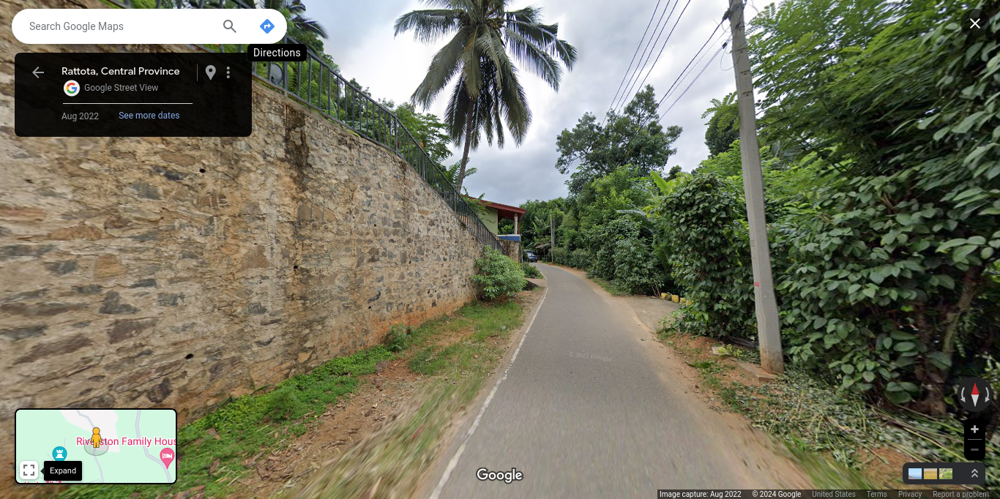

## Kalukohuthenna

**Kalukohuthenna** Grama Niladhari Division, **Yatiyanthota** Divisional Secretariat Division, **Kegalle** District, **Sabaragamuwa** Province

**Yatiyanthota** Polling Division, **Kegalle** Electoral District

Population: 1,602 (2012)

(**LK-9227155**/134D)

## Koralawella West

**Koralawella West** Grama Niladhari Division, **Moratuwa** Divisional Secretariat Division, **Colombo** District, **Western** Province

**Moratuwa** Polling Division, **Colombo** Electoral District

Population: 3,531 (2012)

(**LK-1133180**/554C)

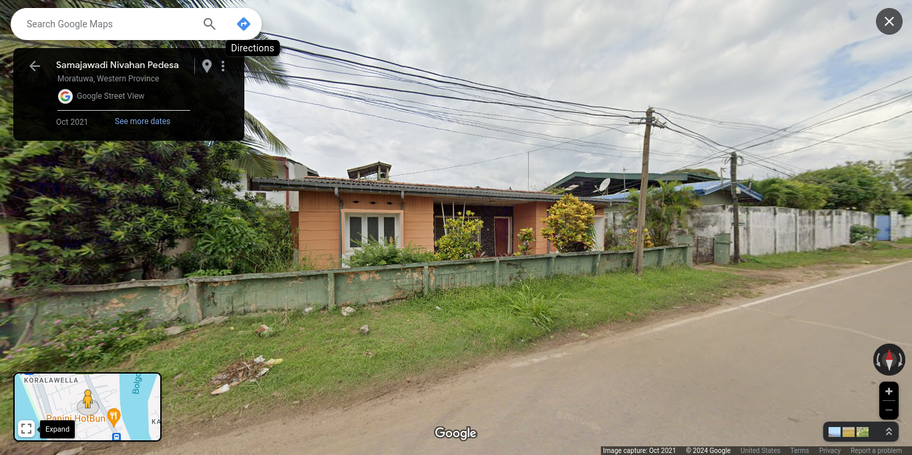

## Mirissankotuwa North

**Mirissankotuwa North** Grama Niladhari Division, **Wennappuwa** Divisional Secretariat Division, **Puttalam** District, **North Western** Province

**Wennappuwa** Polling Division, **Puttalam** Electoral District

Population: 623 (2012)

(**LK-6245195**/487)

## Galgamuwa Town

**Galgamuwa Town** Grama Niladhari Division, **Galgamuwa** Divisional Secretariat Division, **Kurunegala** District, **North Western** Province

**Galgamuwa** Polling Division, **Kurunegala** Electoral District

Population: 1,227 (2012)

(**LK-6106200**/57)

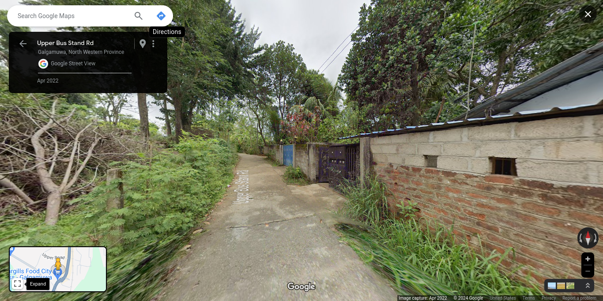

## Kinnayadi

**Kinnayadi** Grama Niladhari Division, **Koralai Pattu (Valachchenai)** Divisional Secretariat Division, **Batticaloa** District, **Eastern** Province

**Kalkudah** Polling Division, **Batticaloa** Electoral District

Population: 2,355 (2012)

(**LK-5109050**/202B)

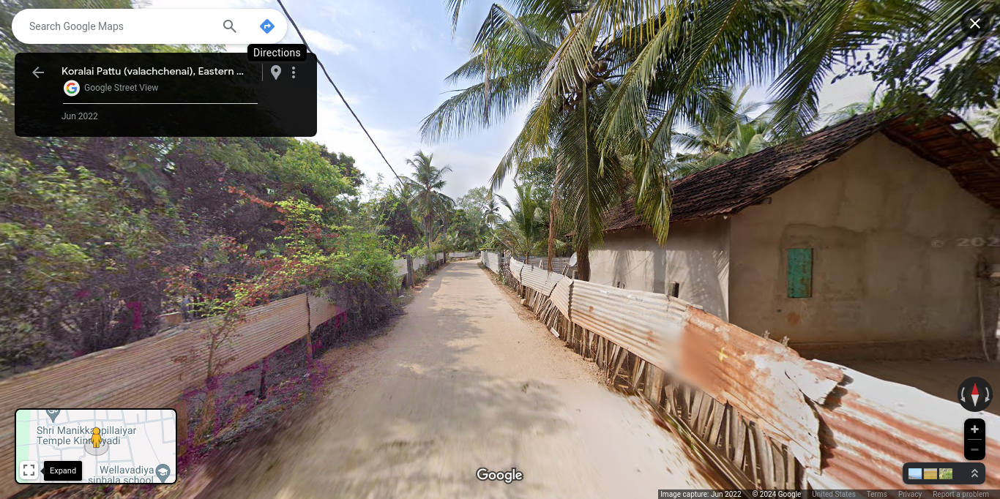

## Medakekila

**Medakekila** Grama Niladhari Division, **Deltota** Divisional Secretariat Division, **Kandy** District, **Central** Province

**Hewaheta** Polling Division, **Kandy** Electoral District

Population: 697 (2012)

(**LK-2148060**/1037)

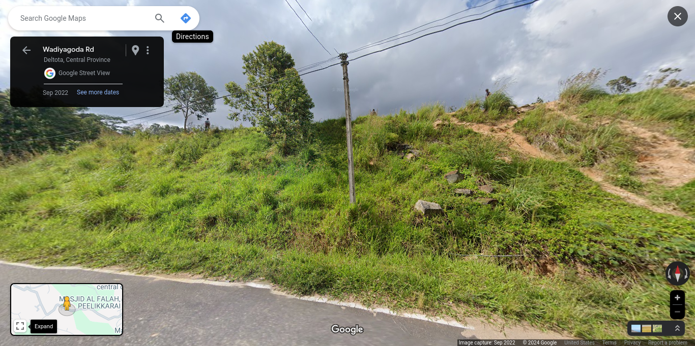

## Point Pedro

**Point Pedro** Grama Niladhari Division, **Vadamaradchi North (Point Pedro)** Divisional Secretariat Division, **Jaffna** District, **Northern** Province

**Point Pedro** Polling Division, **Jaffna** Electoral District

Population: 2,083 (2012)

(**LK-4127095**/J/401)

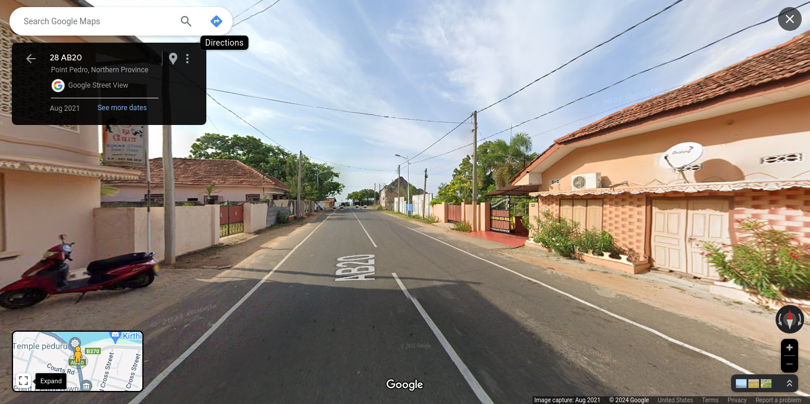

## Mambula

**Mambula** Grama Niladhari Division, **Seethawaka** Divisional Secretariat Division, **Colombo** District, **Western** Province

**Avissawella** Polling Division, **Colombo** Electoral District

Population: 1,128 (2012)

(**LK-1115245**/441)

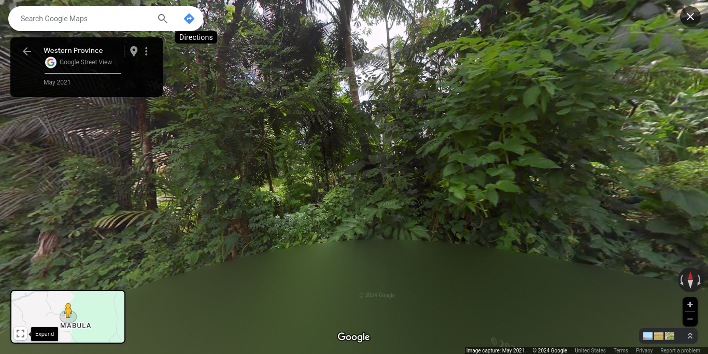

## Kuliyapitiya Town

**Kuliyapitiya Town** Grama Niladhari Division, **Kuliyapitiya West** Divisional Secretariat Division, **Kurunegala** District, **North Western** Province

**Kuliyapitiya** Polling Division, **Kurunegala** Electoral District

Population: 2,076 (2012)

(**LK-6172100**/1157)

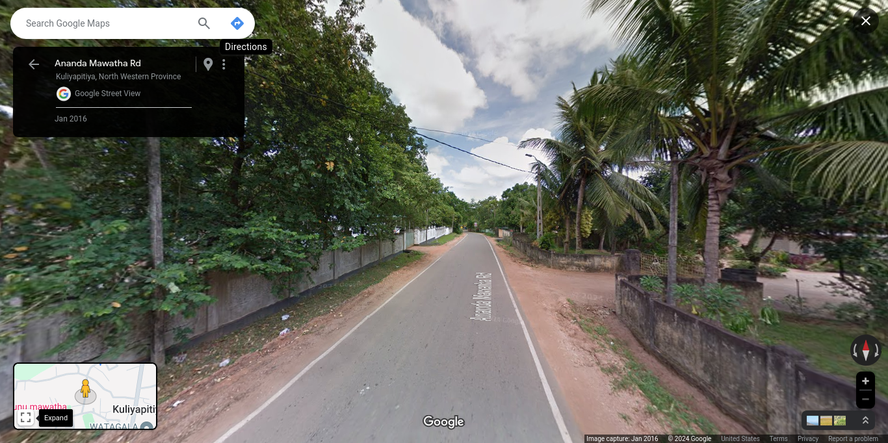

## Nasivanthivu

**Nasivanthivu** Grama Niladhari Division, **Koralai Pattu (Valachchenai)** Divisional Secretariat Division, **Batticaloa** District, **Eastern** Province

**Kalkudah** Polling Division, **Batticaloa** Electoral District

Population: 1,037 (2012)

(**LK-5109005**/205C)

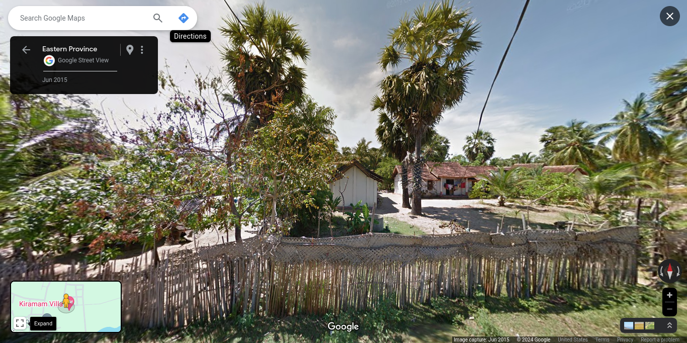

## Udumulla

**Udumulla** Grama Niladhari Division, **Kaduwela** Divisional Secretariat Division, **Colombo** District, **Western** Province

**Kaduwela** Polling Division, **Colombo** Electoral District

Population: 2,465 (2012)

(**LK-1109175**/492C)

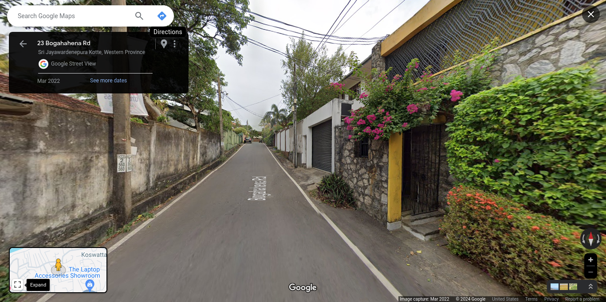

## Kanukerny East

**Kanukerny East** Grama Niladhari Division, **Maritimepattu** Divisional Secretariat Division, **Mullaitivu** District, **Northern** Province

**Mullaitivu** Polling Division, **Vanni** Electoral District

Population: 466 (2012)

(**LK-4415055**/MU/116)

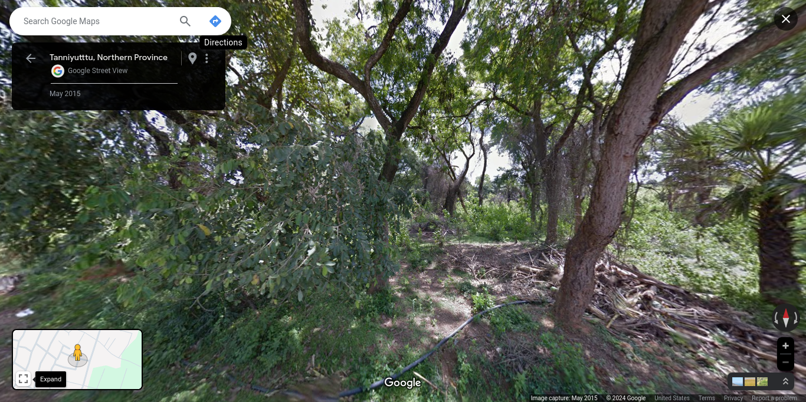

## Wewa Ihalagoda

**Wewa Ihalagoda** Grama Niladhari Division, **Matara Four Gravets** Divisional Secretariat Division, **Matara** District, **Southern** Province

**Matara** Polling Division, **Matara** Electoral District

Population: 1,612 (2012)

(**LK-3242305**/429A)

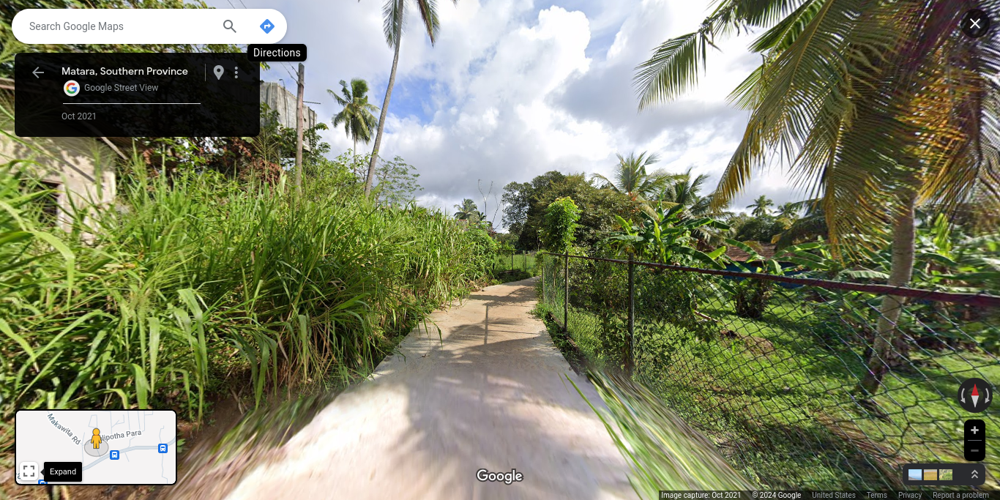

## Elakaka

**Elakaka** Grama Niladhari Division, **Bentota** Divisional Secretariat Division, **Galle** District, **Southern** Province

**Bentara Elpitiya** Polling Division, **Galle** Electoral District

Population: 739 (2012)

(**LK-3103105**/12E)

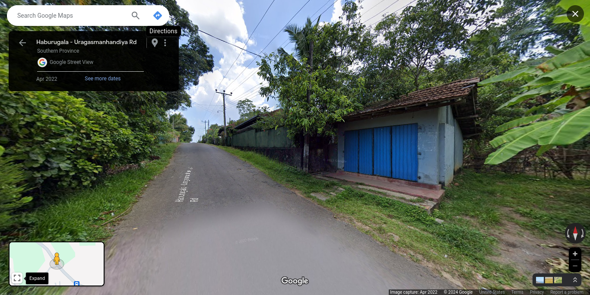

## Gampaha Aluthgama North

**Gampaha Aluthgama North** Grama Niladhari Division, **Gampaha** Divisional Secretariat Division, **Gampaha** District, **Western** Province

**Gampaha** Polling Division, **Gampaha** Electoral District

Population: 2,048 (2012)

(**LK-1224070**/225A)

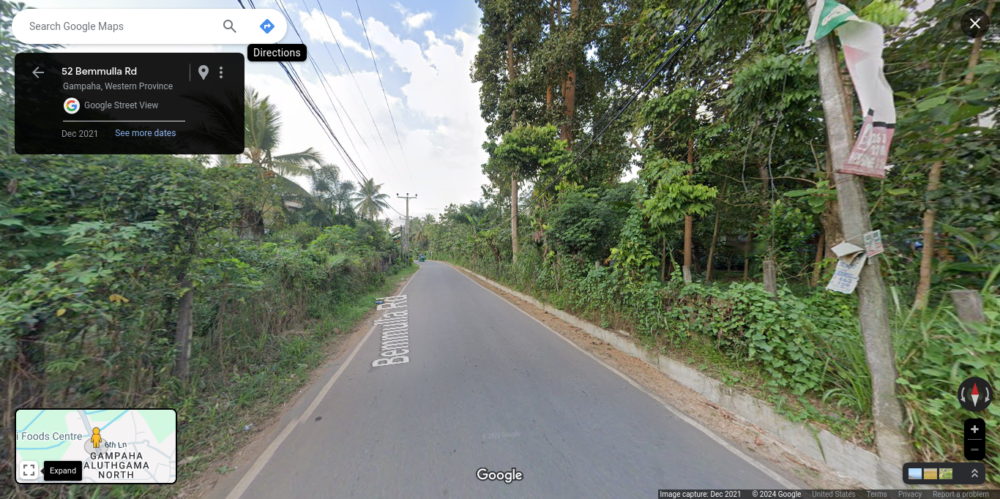

## Maharambaikulam

**Maharambaikulam** Grama Niladhari Division, **Vavuniya** Divisional Secretariat Division, **Vavuniya** District, **Northern** Province

**Vavuniya** Polling Division, **Vanni** Electoral District

Population: 6,229 (2012)

(**LK-4309080**/215A)

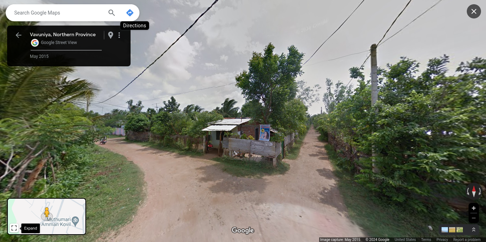

## Divulpitiya West

**Divulpitiya West** Grama Niladhari Division, **Kesbewa** Divisional Secretariat Division, **Colombo** District, **Western** Province

**Kesbewa** Polling Division, **Colombo** Electoral District

Population: 2,631 (2012)

(**LK-1136020**/535B)

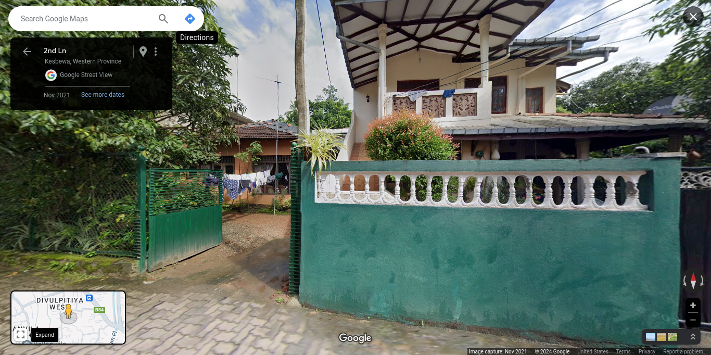

## Kurana East

**Kurana East** Grama Niladhari Division, **Negombo** Divisional Secretariat Division, **Gampaha** District, **Western** Province

**Negombo** Polling Division, **Gampaha** Electoral District

Population: 2,620 (2012)

(**LK-1203160**/157A)

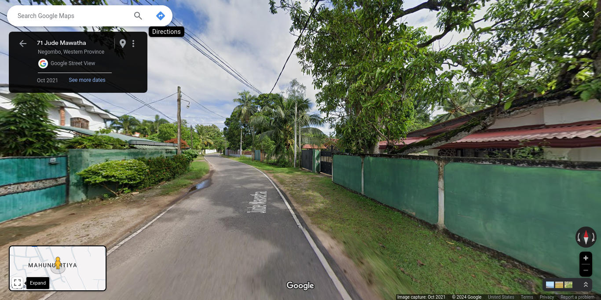

## Neluwakanda

**Neluwakanda** Grama Niladhari Division, **Rattota** Divisional Secretariat Division, **Matale** District, **Central** Province

**Rattota** Polling Division, **Matale** Electoral District

Population: 864 (2012)

(**LK-2230220**/E368A)

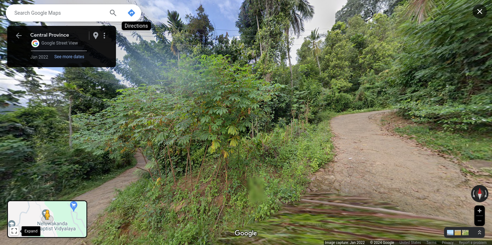

## Ambanwala

**Ambanwala** Grama Niladhari Division, **Udunuwara** Divisional Secretariat Division, **Kandy** District, **Central** Province

**Udunuwara** Polling Division, **Kandy** Electoral District

Population: 649 (2012)

(**LK-2139350**/105)

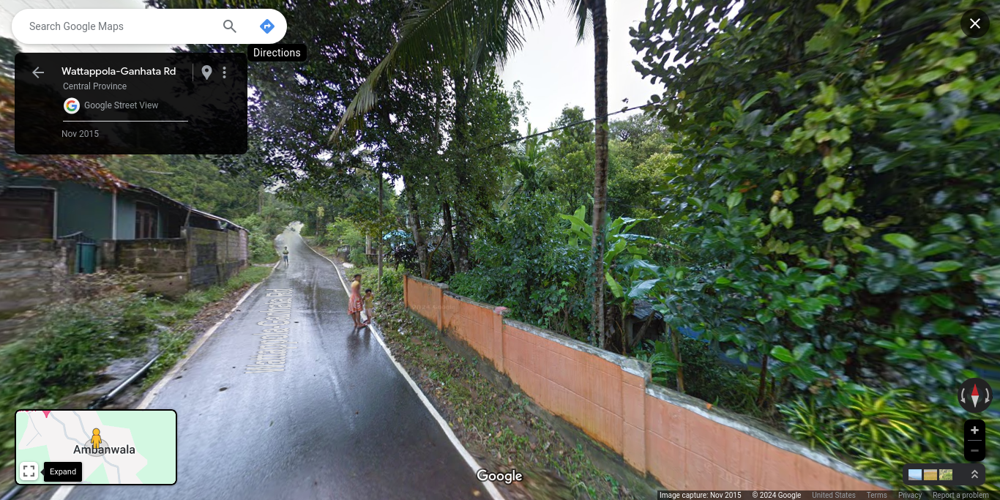

## Kahawatta

**Kahawatta** Grama Niladhari Division, **Beliatta** Divisional Secretariat Division, **Hambantota** District, **Southern** Province

**Beliatta** Polling Division, **Hambantota** Electoral District

Population: 1,187 (2012)

(**LK-3330105**/348)

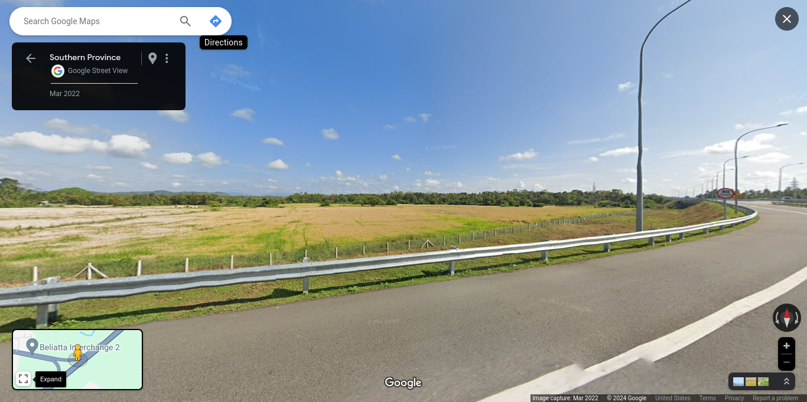

## Aramangoda

**Aramangoda** Grama Niladhari Division, **Mahara** Divisional Secretariat Division, **Gampaha** District, **Western** Province

**Mahara** Polling Division, **Gampaha** Electoral District

Population: 1,180 (2012)

(**LK-1233145**/301)

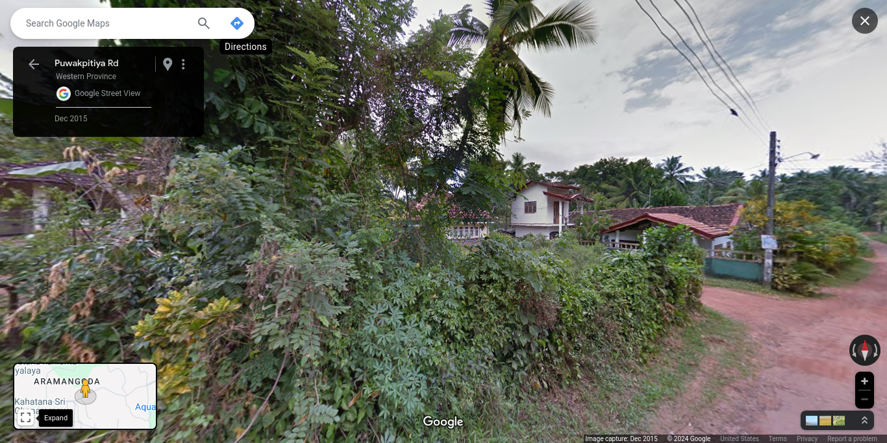

## Kalugala

**Kalugala** Grama Niladhari Division, **Warakapola** Divisional Secretariat Division, **Kegalle** District, **Sabaragamuwa** Province

**Dedigama** Polling Division, **Kegalle** Electoral District

Population: 823 (2012)

(**LK-9218010**/79A)

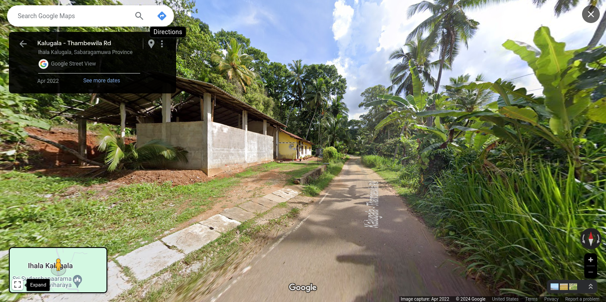

## Ninthavur 20

**Ninthavur 20** Grama Niladhari Division, **Ninthavur** Divisional Secretariat Division, **Ampara** District, **Eastern** Province

**Pothuvil** Polling Division, **Digamadulla** Electoral District

Population: 500 (2012)

(**LK-5230090**/37E)

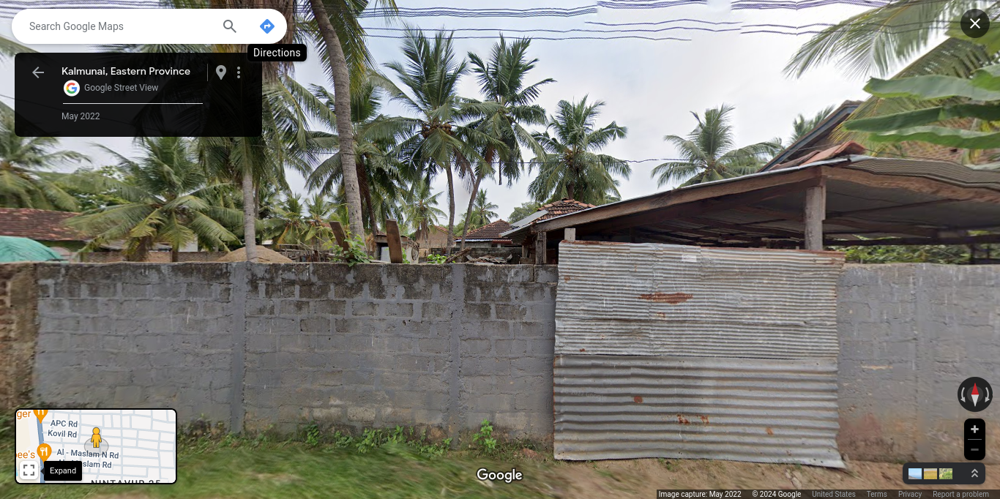

## Wedeniya

**Wedeniya** Grama Niladhari Division, **Alawwa** Divisional Secretariat Division, **Kurunegala** District, **North Western** Province

**Dambadeniya** Polling Division, **Kurunegala** Electoral District

Population: 826 (2012)

(**LK-6184255**/1025)

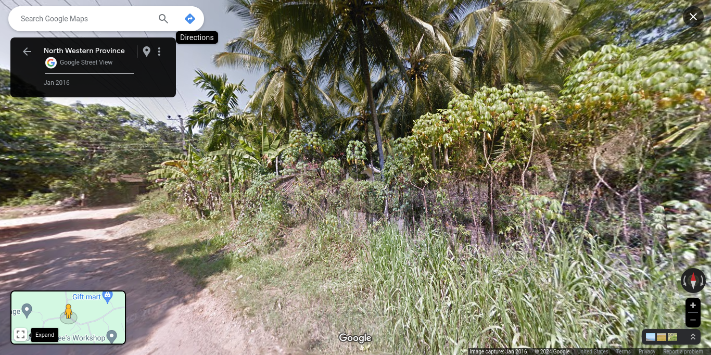

## Vankalai West

**Vankalai West** Grama Niladhari Division, **Nanattan** Divisional Secretariat Division, **Mannar** District, **Northern** Province

**Mannar** Polling Division, **Vanni** Electoral District

Population: 710 (2012)

(**LK-4212010**/MN/98)

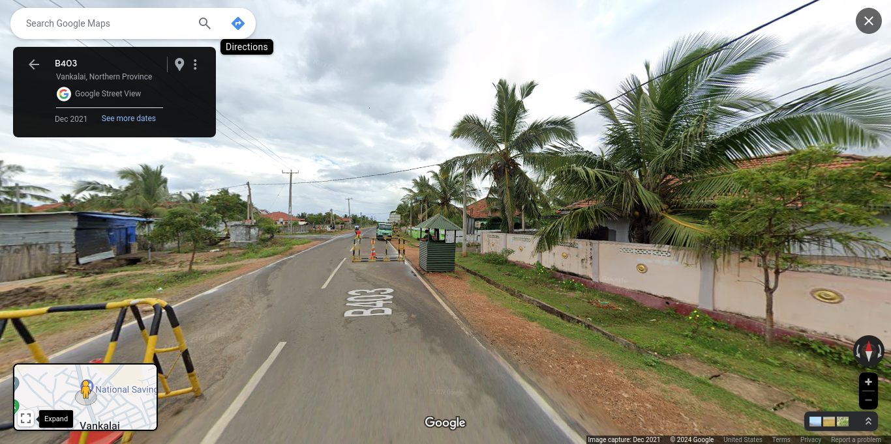

## Pathiragoda

**Pathiragoda** Grama Niladhari Division, **Maharagama** Divisional Secretariat Division, **Colombo** District, **Western** Province

**Maharagama** Polling Division, **Colombo** Electoral District

Population: 6,546 (2012)

(**LK-1121100**/527A)

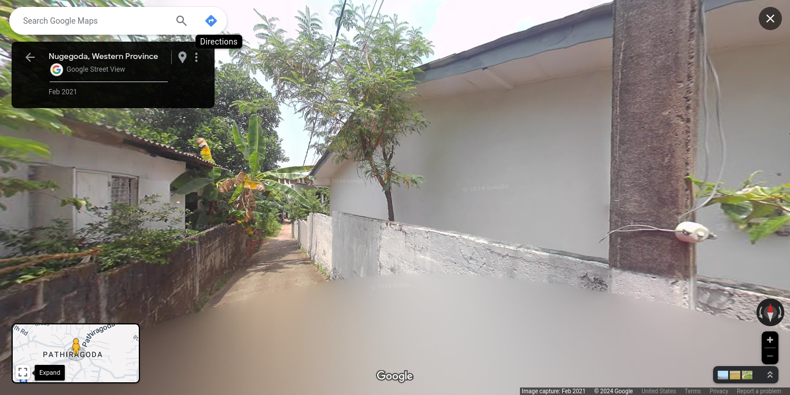

## Kumbalwella South

**Kumbalwella South** Grama Niladhari Division, **Galle Four Gravets** Divisional Secretariat Division, **Galle** District, **Southern** Province

**Galle** Polling Division, **Galle** Electoral District

Population: 2,083 (2012)

(**LK-3139145**/96)

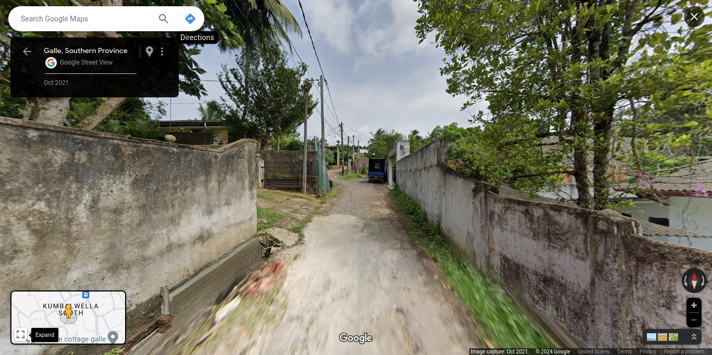

## Athuwana

**Athuwana** Grama Niladhari Division, **Madampe** Divisional Secretariat Division, **Puttalam** District, **North Western** Province

**Chilaw** Polling Division, **Puttalam** Electoral District

Population: 944 (2012)

(**LK-6236005**/547C)

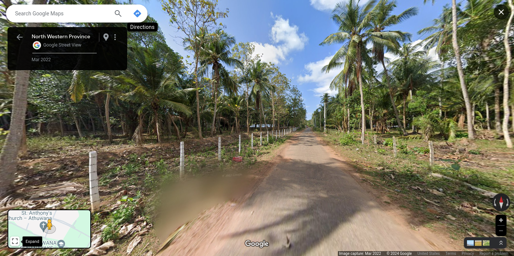

## Vankalai West

**Vankalai West** Grama Niladhari Division, **Nanattan** Divisional Secretariat Division, **Mannar** District, **Northern** Province

**Mannar** Polling Division, **Vanni** Electoral District

Population: 710 (2012)

(**LK-4212010**/MN/98)

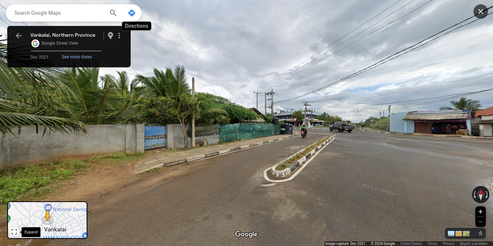

## Akurukaduwa

**Akurukaduwa** Grama Niladhari Division, **Meegahakivula** Divisional Secretariat Division, **Badulla** District, **Uva** Province

**Viyaluwa** Polling Division, **Badulla** Electoral District

Population: 1,465 (2012)

(**LK-8109070**/22G)

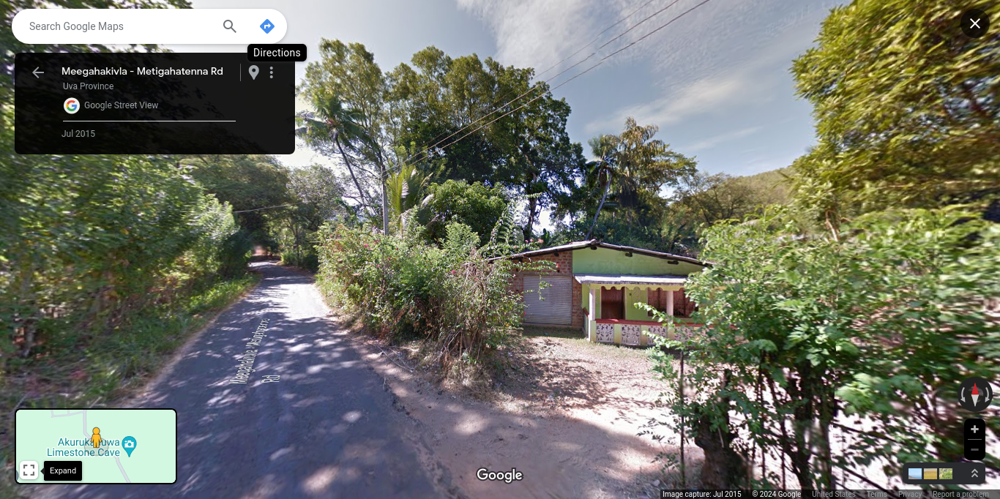

## Katuwawala South

**Katuwawala South** Grama Niladhari Division, **Kesbewa** Divisional Secretariat Division, **Colombo** District, **Western** Province

**Kesbewa** Polling Division, **Colombo** Electoral District

Population: 1,489 (2012)

(**LK-1136090**/578A)

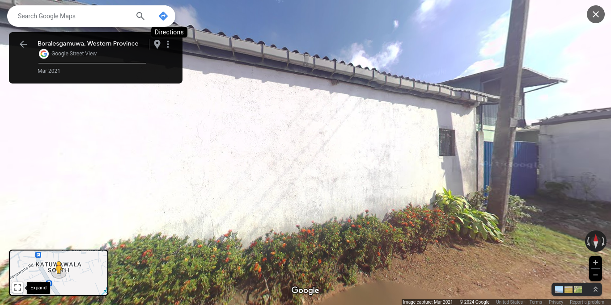

## Alawathupitiya

**Alawathupitiya** Grama Niladhari Division, **Katana** Divisional Secretariat Division, **Gampaha** District, **Western** Province

**Katana** Polling Division, **Gampaha** Electoral District

Population: 1,188 (2012)

(**LK-1206385**/198)

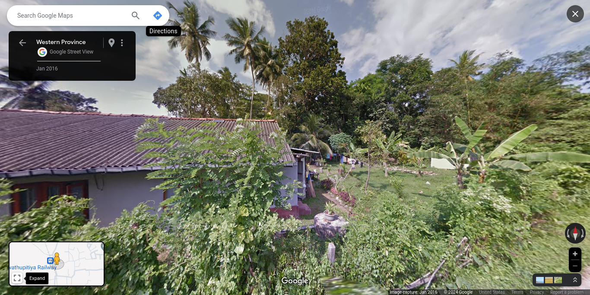

## Bowala West

**Bowala West** Grama Niladhari Division, **Walasmulla** Divisional Secretariat Division, **Hambantota** District, **Southern** Province

**Mulkirigala** Polling Division, **Hambantota** Electoral District

Population: 717 (2012)

(**LK-3325090**/462)

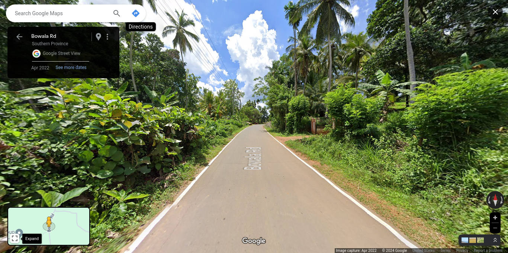

## Kuruppumulla

**Kuruppumulla** Grama Niladhari Division, **Panadura** Divisional Secretariat Division, **Kalutara** District, **Western** Province

**Panadura** Polling Division, **Kalutara** Electoral District

Population: 1,638 (2012)

(**LK-1303175**/682A)

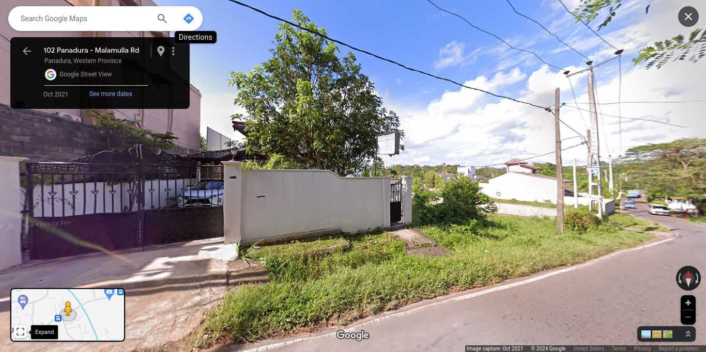

## Mancholai

**Mancholai** Grama Niladhari Division, **Kinniya** Divisional Secretariat Division, **Trincomalee** District, **Eastern** Province

**Muttur** Polling Division, **Trincomalee** Electoral District

Population: 2,603 (2012)

(**LK-5324015**/225C)

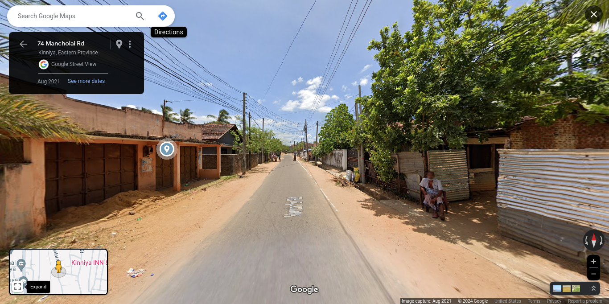

## Barathipuram

**Barathipuram** Grama Niladhari Division, **Manmunai North** Divisional Secretariat Division, **Batticaloa** District, **Eastern** Province

**Batticaloa** Polling Division, **Batticaloa** Electoral District

Population: 1,555 (2012)

(**LK-5118125**/173H)

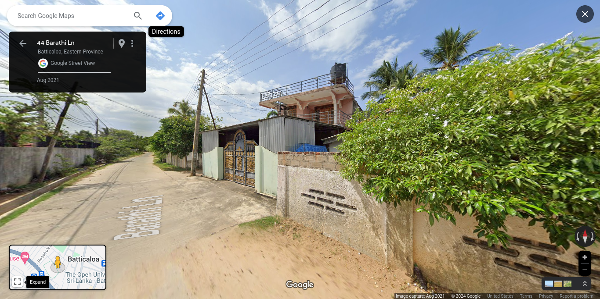

## Noope

**Noope** Grama Niladhari Division, **Matara Four Gravets** Divisional Secretariat Division, **Matara** District, **Southern** Province

**Matara** Polling Division, **Matara** Electoral District

Population: 934 (2012)

(**LK-3242265**/415)

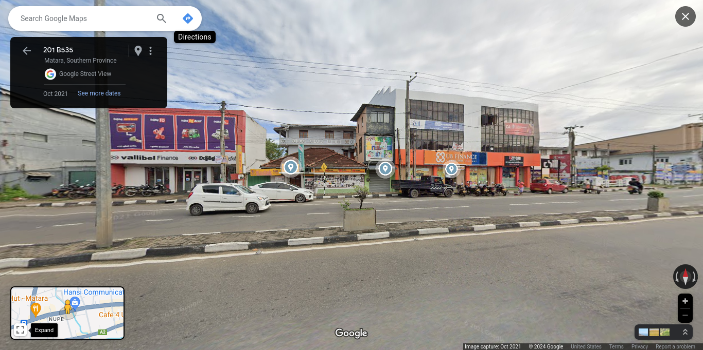

## Ninthavur 11

**Ninthavur 11** Grama Niladhari Division, **Ninthavur** Divisional Secretariat Division, **Ampara** District, **Eastern** Province

**Pothuvil** Polling Division, **Digamadulla** Electoral District

Population: 1,288 (2012)

(**LK-5230010**/41A)

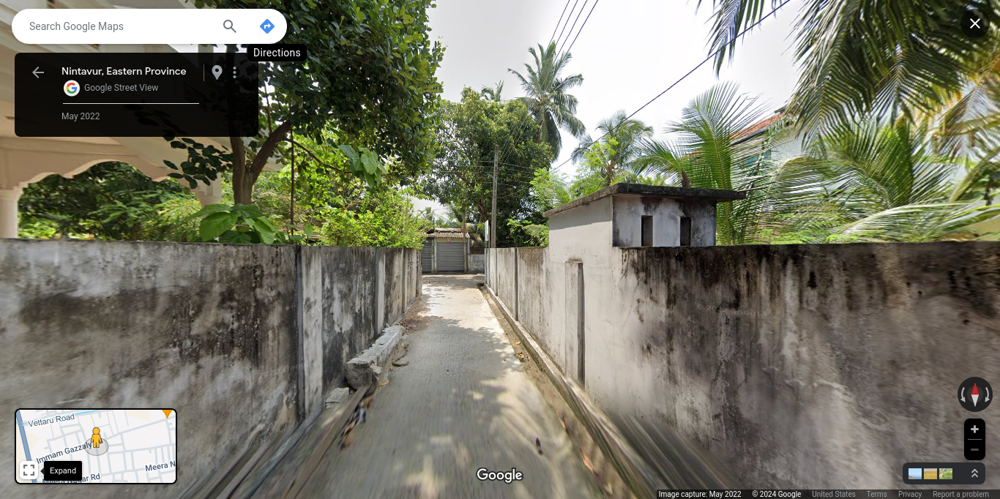

## Meemana

**Meemana** Grama Niladhari Division, **Horana** Divisional Secretariat Division, **Kalutara** District, **Western** Province

**Horana** Polling Division, **Kalutara** Electoral District

Population: 2,157 (2012)

(**LK-1309180**/611A)

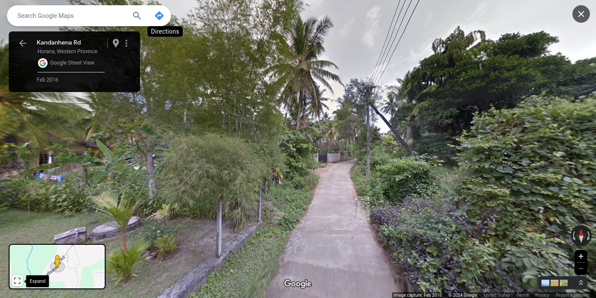

## Podiveekumbura

**Podiveekumbura** Grama Niladhari Division, **Ja-Ela** Divisional Secretariat Division, **Gampaha** District, **Western** Province

**Ja Ela** Polling Division, **Gampaha** Electoral District

Population: 5,879 (2012)

(**LK-1221245**/181E)

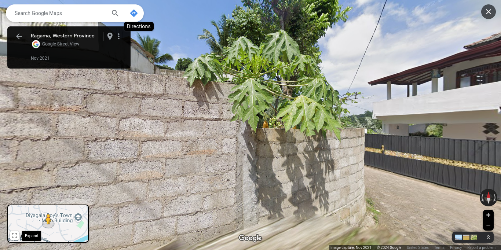

## Kudawella North

**Kudawella North** Grama Niladhari Division, **Tangalle** Divisional Secretariat Division, **Hambantota** District, **Southern** Province

**Beliatta** Polling Division, **Hambantota** Electoral District

Population: 1,098 (2012)

(**LK-3333330**/289)

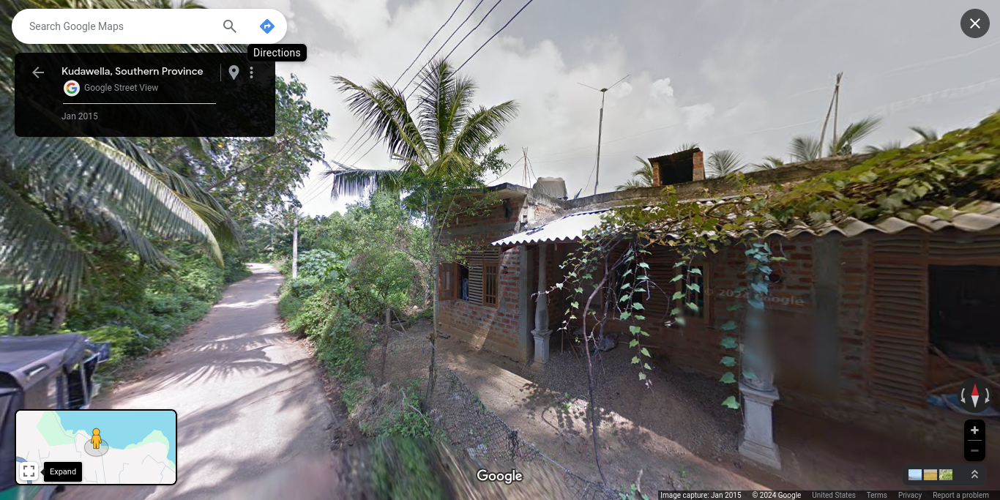

## Dickwella South

**Dickwella South** Grama Niladhari Division, **Dickwella** Divisional Secretariat Division, **Matara** District, **Southern** Province

**Devinuwara** Polling Division, **Matara** Electoral District

Population: 1,159 (2012)

(**LK-3248165**/452E)

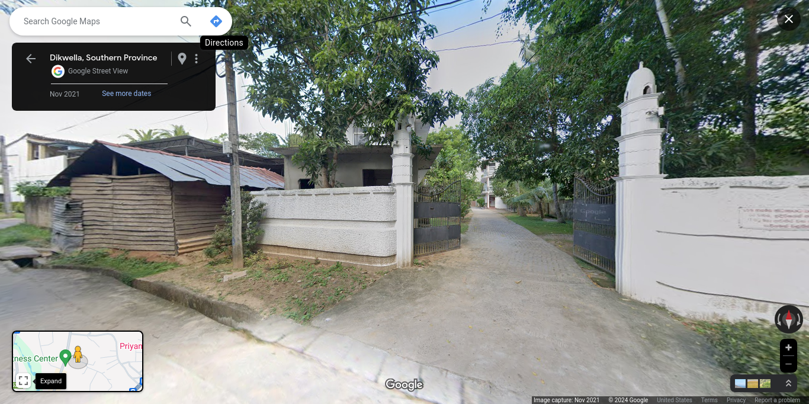

## Medapathana

**Medapathana** Grama Niladhari Division, **Badulla** Divisional Secretariat Division, **Badulla** District, **Uva** Province

**Badulla** Polling Division, **Badulla** Electoral District

Population: 2,297 (2012)

(**LK-8121015**/78M)

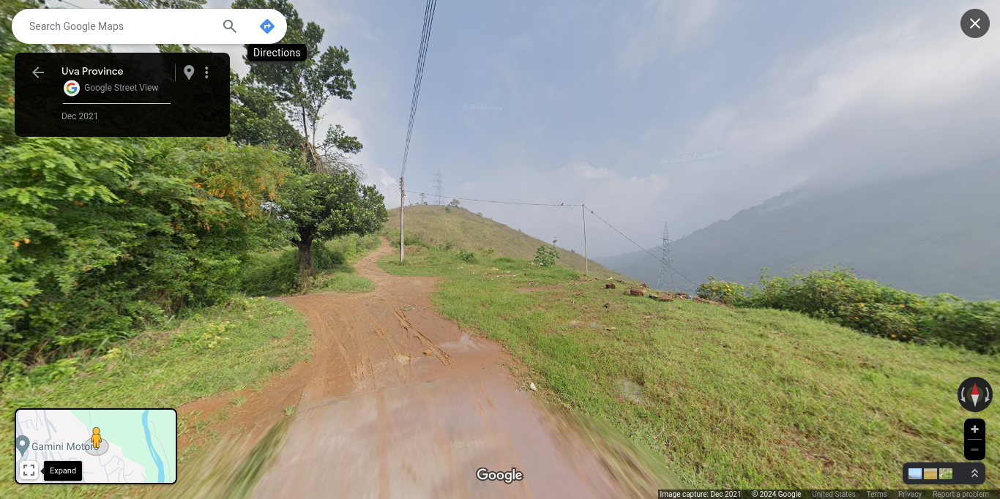

## PahalaYalkumbura

**PahalaYalkumbura** Grama Niladhari Division, **Welimada** Divisional Secretariat Division, **Badulla** District, **Uva** Province

**Welimada** Polling Division, **Badulla** Electoral District

Population: 941 (2012)

(**LK-8130190**/59E)

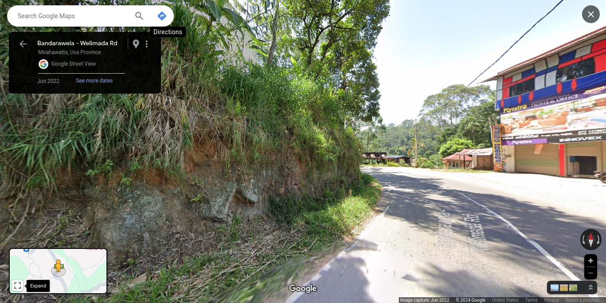

## Waharakgoda South

**Waharakgoda South** Grama Niladhari Division, **Beliatta** Divisional Secretariat Division, **Hambantota** District, **Southern** Province

**Beliatta** Polling Division, **Hambantota** Electoral District

Population: 439 (2012)

(**LK-3330100**/331)

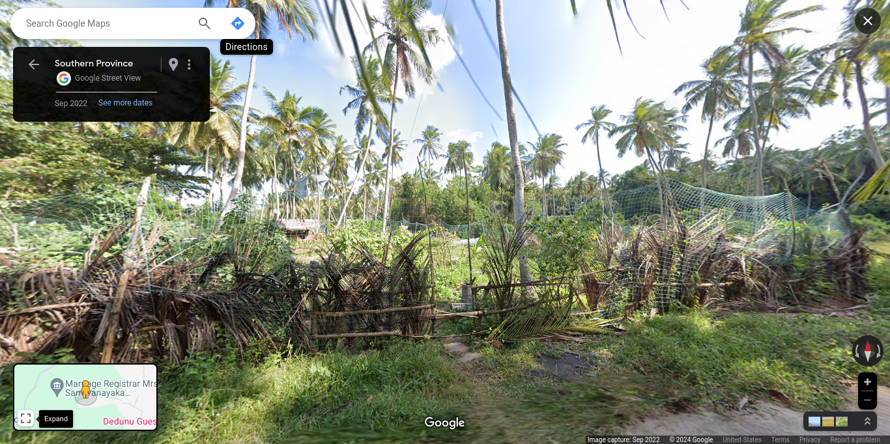

## Kalapaluwawa

**Kalapaluwawa** Grama Niladhari Division, **Kaduwela** Divisional Secretariat Division, **Colombo** District, **Western** Province

**Kaduwela** Polling Division, **Colombo** Electoral District

Population: 4,287 (2012)

(**LK-1109160**/491)

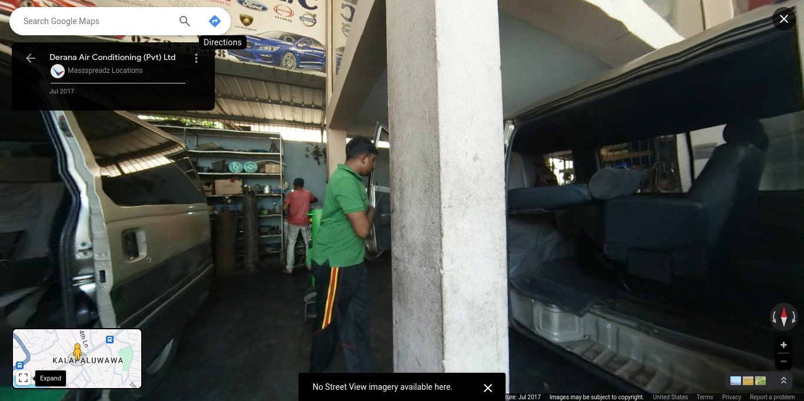

## Paranagampola

**Paranagampola** Grama Niladhari Division, **Kegalle** Divisional Secretariat Division, **Kegalle** District, **Sabaragamuwa** Province

**Kegalle** Polling Division, **Kegalle** Electoral District

Population: 2,030 (2012)

(**LK-9212060**/52C)

## Marassana

**Marassana** Grama Niladhari Division, **Pathahewaheta** Divisional Secretariat Division, **Kandy** District, **Central** Province

**Hewaheta** Polling Division, **Kandy** Electoral District

Population: 786 (2012)

(**LK-2145235**/1007)

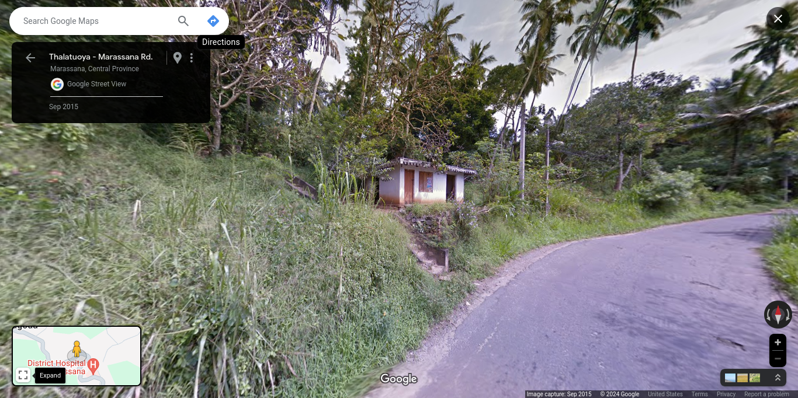

## Gangulvitiya

**Gangulvitiya** Grama Niladhari Division, **Elapatha** Divisional Secretariat Division, **Ratnapura** District, **Sabaragamuwa** Province

**Nivithigala** Polling Division, **Ratnapura** Electoral District

Population: 2,298 (2012)

(**LK-9127070**/183C)

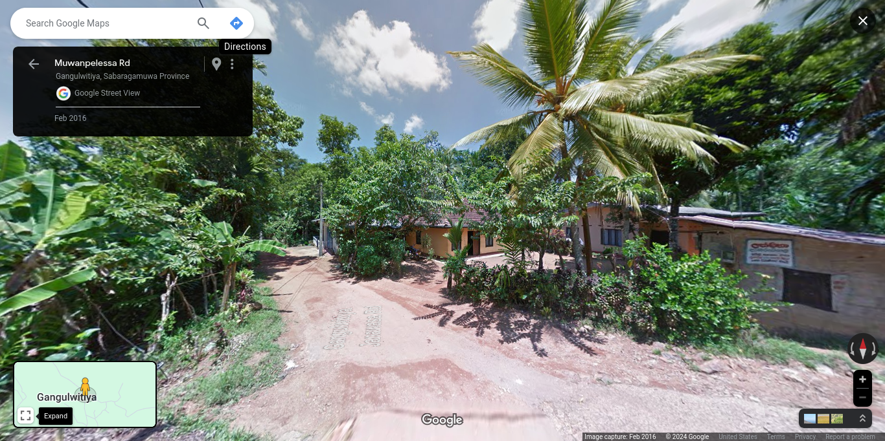

## Lenadora North

**Lenadora North** Grama Niladhari Division, **Dambulla** Divisional Secretariat Division, **Matale** District, **Central** Province

**Dambulla** Polling Division, **Matale** Electoral District

Population: 979 (2012)

(**LK-2206285**/E441)

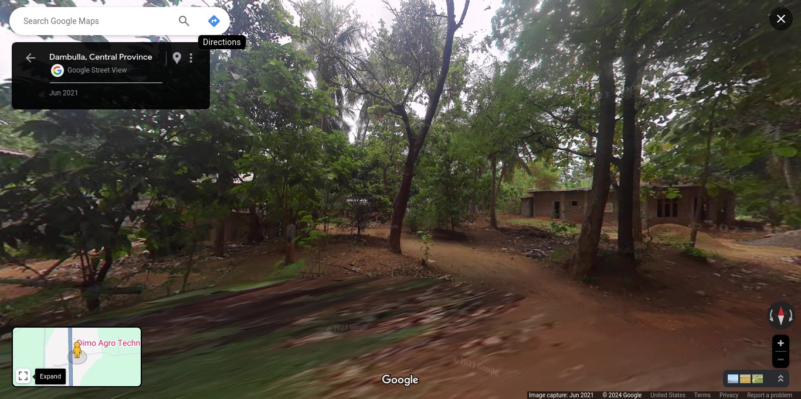

## Palle Peradeniya

**Palle Peradeniya** Grama Niladhari Division, **Kandy Four Gravets & Gangawata Korale** Divisional Secretariat Division, **Kandy** District, **Central** Province

**Senkadagala** Polling Division, **Kandy** Electoral District

Population: 4,942 (2012)

(**LK-2130195**/248)

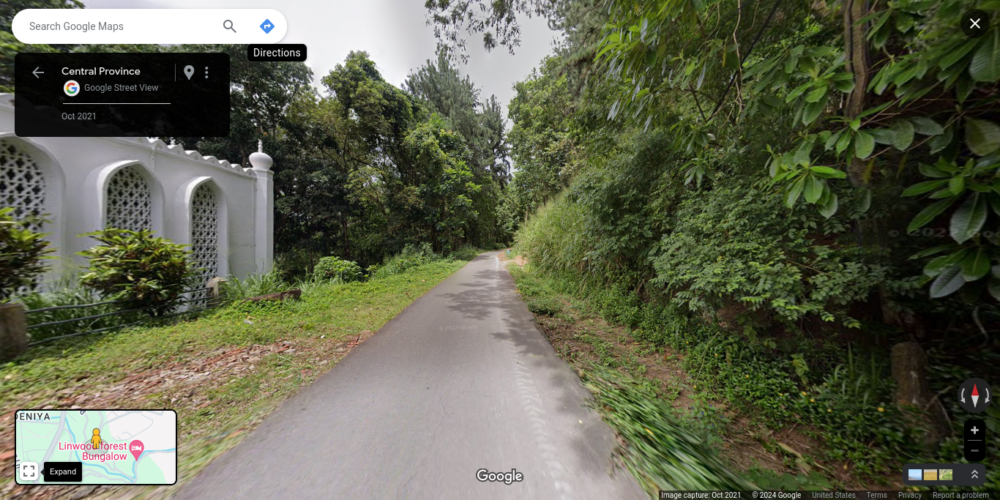

## Puranagama

**Puranagama** Grama Niladhari Division, **Hanguranketha** Divisional Secretariat Division, **Nuwara Eliya** District, **Central** Province

**Hanguranketha** Polling Division, **Nuwara-Eliya** Electoral District

Population: 251 (2012)

(**LK-2306285**/498E)

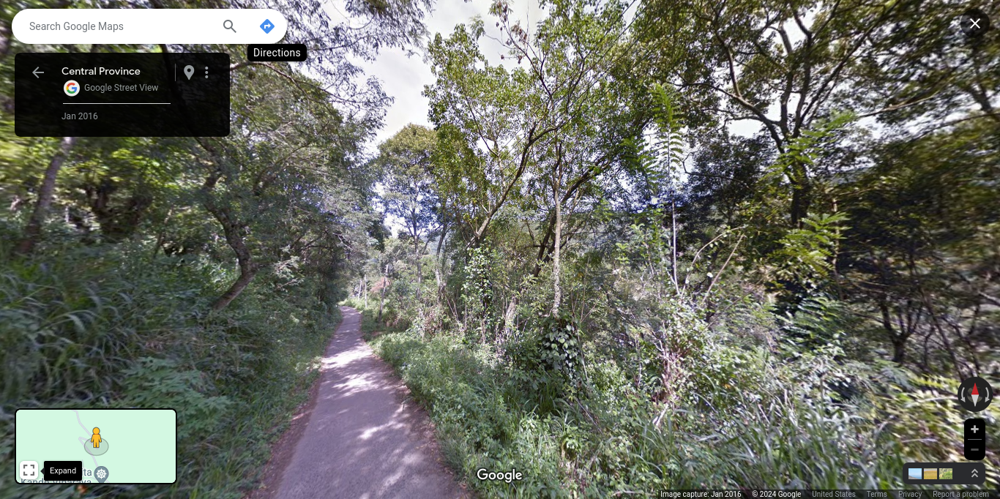

## Jambugasmulla

**Jambugasmulla** Grama Niladhari Division, **Maharagama** Divisional Secretariat Division, **Colombo** District, **Western** Province

**Maharagama** Polling Division, **Colombo** Electoral District

Population: 3,828 (2012)

(**LK-1121205**/526D)

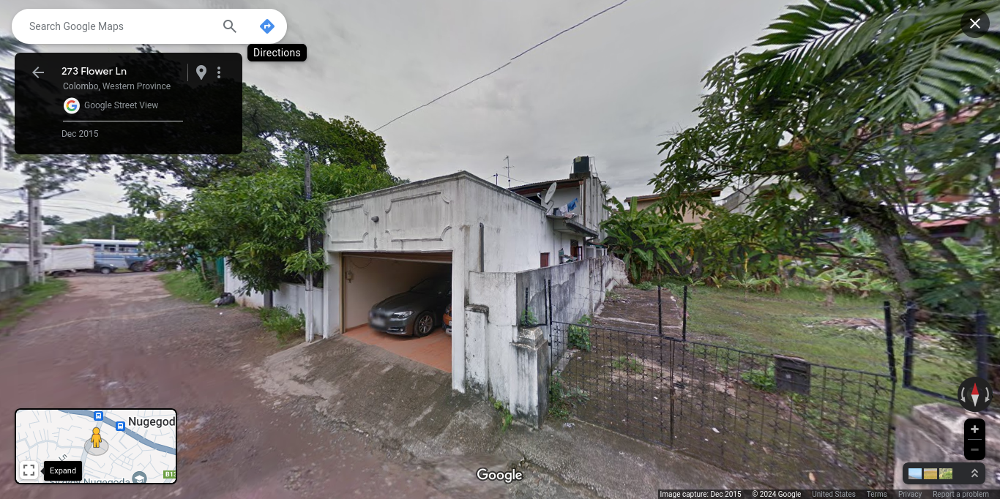

