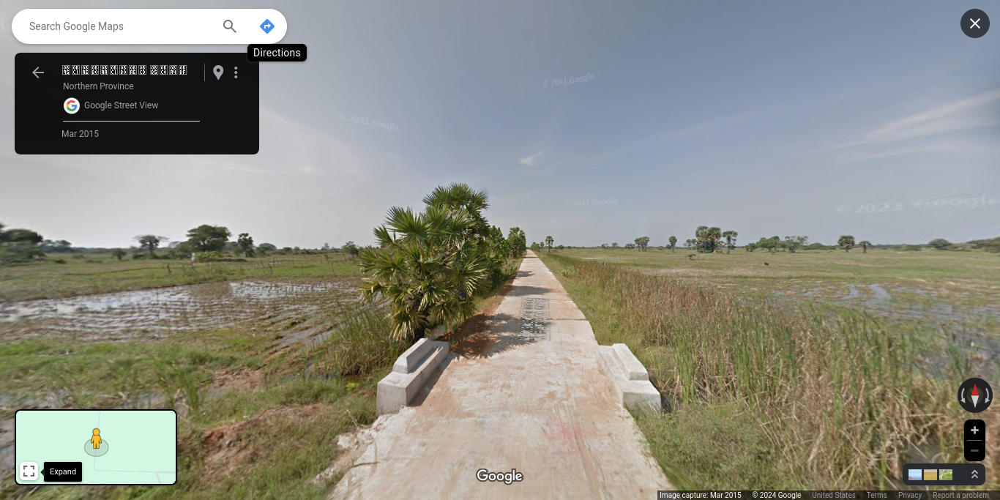

# Random Sri Lanka

*A collection of random Google Street Views.*

## Kohunugamuwa

**Kohunugamuwa** Grama Niladhari Division, **Weligama** Divisional Secretariat Division, **Matara** District, **Southern** Province

**Weligama** Polling Division, **Matara** Electoral District

Population: 1,368 (2012)

(**LK-3239025**/389)

## Periyaththumunai

**Periyaththumunai** Grama Niladhari Division, **Kinniya** Divisional Secretariat Division, **Trincomalee** District, **Eastern** Province

**Muttur** Polling Division, **Trincomalee** Electoral District

Population: 1,597 (2012)

(**LK-5324095**/226)

## Galagedara

**Galagedara** Grama Niladhari Division, **Panduwasnuwara East** Divisional Secretariat Division, **Kurunegala** District, **North Western** Province

**Panduwasnuwara** Polling Division, **Kurunegala** Electoral District

Population: 730 (2012)

(**LK-6148145**/1381)

## Eravur 06A

**Eravur 06A** Grama Niladhari Division, **Eravur Town** Divisional Secretariat Division, **Batticaloa** District, **Eastern** Province

**Batticaloa** Polling Division, **Batticaloa** Electoral District

Population: 1,512 (2012)

(**LK-5115060**/192C)

## Weralugampala

**Weralugampala** Grama Niladhari Division, **Dompe** Divisional Secretariat Division, **Gampaha** District, **Western** Province

**Dompe** Polling Division, **Gampaha** Electoral District

Population: 647 (2012)

(**LK-1230210**/392A)

## Dummalasooriya

**Dummalasooriya** Grama Niladhari Division, **Udubaddawa** Divisional Secretariat Division, **Kurunegala** District, **North Western** Province

**Bingiriya** Polling Division, **Kurunegala** Electoral District

Population: 831 (2012)

(**LK-6175085**/1486)

## Badulla Central

**Badulla Central** Grama Niladhari Division, **Badulla** Divisional Secretariat Division, **Badulla** District, **Uva** Province

**Badulla** Polling Division, **Badulla** Electoral District

Population: 3,347 (2012)

(**LK-8121070**/78D)

## Pagoda East

**Pagoda East** Grama Niladhari Division, **Sri Jayawardanapura Kotte** Divisional Secretariat Division, **Colombo** District, **Western** Province

**Kotte** Polling Division, **Colombo** Electoral District

Population: 5,944 (2012)

(**LK-1124085**/519C)

## Kadirapola

**Kadirapola** Grama Niladhari Division, **Pannala** Divisional Secretariat Division, **Kurunegala** District, **North Western** Province

**Katugampola** Polling Division, **Kurunegala** Electoral District

Population: 1,043 (2012)

(**LK-6178200**/1544)

## Ganegama

**Ganegama** Grama Niladhari Division, **Beruwala** Divisional Secretariat Division, **Kalutara** District, **Western** Province

**Beruwala** Polling Division, **Kalutara** Electoral District

Population: 1,374 (2012)

(**LK-1324395**/763)

## Lakshapathiya North

**Lakshapathiya North** Grama Niladhari Division, **Moratuwa** Divisional Secretariat Division, **Colombo** District, **Western** Province

**Moratuwa** Polling Division, **Colombo** Electoral District

Population: 4,481 (2012)

(**LK-1133045**/550A)

## Weliweriya West

**Weliweriya West** Grama Niladhari Division, **Matara Four Gravets** Divisional Secretariat Division, **Matara** District, **Southern** Province

**Matara** Polling Division, **Matara** Electoral District

Population: 1,350 (2012)

(**LK-3242120**/415A)

## Pandiruppu 01

**Pandiruppu 01** Grama Niladhari Division, **Kalmunai Tamil Division** Divisional Secretariat Division, **Ampara** District, **Eastern** Province

**Kalmunai** Polling Division, **Digamadulla** Electoral District

Population: 941 (2012)

(**LK-5221030**/KP/66/1)

## Wadduwa West

**Wadduwa West** Grama Niladhari Division, **Panadura** Divisional Secretariat Division, **Kalutara** District, **Western** Province

**Panadura** Polling Division, **Kalutara** Electoral District

Population: 1,392 (2012)

(**LK-1303320**/699)

## Godapola East

**Godapola East** Grama Niladhari Division, **Udunuwara** Divisional Secretariat Division, **Kandy** District, **Central** Province

**Udunuwara** Polling Division, **Kandy** Electoral District

Population: 856 (2012)

(**LK-2139295**/27)

## Ihala Biyanvila Central

**Ihala Biyanvila Central** Grama Niladhari Division, **Biyagama** Divisional Secretariat Division, **Gampaha** District, **Western** Province

**Biyagama** Polling Division, **Gampaha** Electoral District

Population: 5,003 (2012)

(**LK-1239015**/269B)

## Dedigamuwa

**Dedigamuwa** Grama Niladhari Division, **Kaduwela** Divisional Secretariat Division, **Colombo** District, **Western** Province

**Kaduwela** Polling Division, **Colombo** Electoral District

Population: 2,105 (2012)

(**LK-1109100**/480A)

## Divulwewa

**Divulwewa** Grama Niladhari Division, **Anamaduwa** Divisional Secretariat Division, **Puttalam** District, **North Western** Province

**Anamaduwa** Polling Division, **Puttalam** Electoral District

Population: 1,070 (2012)

(**LK-6224150**/658C)

## Pandiruppu 01

**Pandiruppu 01** Grama Niladhari Division, **Kalmunai Tamil Division** Divisional Secretariat Division, **Ampara** District, **Eastern** Province

**Kalmunai** Polling Division, **Digamadulla** Electoral District

Population: 941 (2012)

(**LK-5221030**/KP/66/1)

## Unanvitiya East

**Unanvitiya East** Grama Niladhari Division, **Nagoda** Divisional Secretariat Division, **Galle** District, **Southern** Province

**Hiniduma** Polling Division, **Galle** Electoral District

Population: 738 (2012)

(**LK-3124200**/211B)

## Siddamulla North

**Siddamulla North** Grama Niladhari Division, **Homagama** Divisional Secretariat Division, **Colombo** District, **Western** Province

**Homagama** Polling Division, **Colombo** Electoral District

Population: 2,429 (2012)

(**LK-1112220**/591)

## Manduvil

**Manduvil** Grama Niladhari Division, **Thenmaradchi (Chavakachcheri)** Divisional Secretariat Division, **Jaffna** District, **Northern** Province

**Chavakachcheri** Polling Division, **Jaffna** Electoral District

Population: 1,080 (2012)

(**LK-4130085**/J/304)

## Pahala Biyanvila West

**Pahala Biyanvila West** Grama Niladhari Division, **Biyagama** Divisional Secretariat Division, **Gampaha** District, **Western** Province

**Biyagama** Polling Division, **Gampaha** Electoral District

Population: 4,708 (2012)

(**LK-1239095**/268A)

## Udahamulla

**Udahamulla** Grama Niladhari Division, **Panadura** Divisional Secretariat Division, **Kalutara** District, **Western** Province

**Panadura** Polling Division, **Kalutara** Electoral District

Population: 1,731 (2012)

(**LK-1303150**/682)

## Marassana

**Marassana** Grama Niladhari Division, **Pathahewaheta** Divisional Secretariat Division, **Kandy** District, **Central** Province

**Hewaheta** Polling Division, **Kandy** Electoral District

Population: 786 (2012)

(**LK-2145235**/1007)

## Kohombiliwela

**Kohombiliwela** Grama Niladhari Division, **Ukuwela** Divisional Secretariat Division, **Matale** District, **Central** Province

**Matale** Polling Division, **Matale** Electoral District

Population: 1,632 (2012)

(**LK-2233105**/E355C)

## Kurunduwatta

**Kurunduwatta** Grama Niladhari Division, **Balapitiya** Divisional Secretariat Division, **Galle** District, **Southern** Province

**Balapitiya** Polling Division, **Galle** Electoral District

Population: 1,178 (2012)

(**LK-3106220**/87F)

## Atchelu

**Atchelu** Grama Niladhari Division, **Valikamam East (Kopay)** Divisional Secretariat Division, **Jaffna** District, **Northern** Province

**Kopay** Polling Division, **Jaffna** Electoral District

Population: 3,241 (2012)

(**LK-4118115**/J/279)

## Braemore

**Braemore** Grama Niladhari Division, **Nuwara Eliya** Divisional Secretariat Division, **Nuwara Eliya** District, **Central** Province

**Nuwara Eliya Maskeliya** Polling Division, **Nuwara-Eliya** Electoral District

Population: 2,335 (2012)

(**LK-2312335**/476P)

## Ninthavur 02

**Ninthavur 02** Grama Niladhari Division, **Ninthavur** Divisional Secretariat Division, **Ampara** District, **Eastern** Province

**Pothuvil** Polling Division, **Digamadulla** Electoral District

Population: 1,180 (2012)

(**LK-5230025**/40)

## Uswatta

**Uswatta** Grama Niladhari Division, **Kalutara** Divisional Secretariat Division, **Kalutara** District, **Western** Province

**Kalutara** Polling Division, **Kalutara** Electoral District

Population: 1,813 (2012)

(**LK-1321380**/729F)

## Horape

**Horape** Grama Niladhari Division, **Wattala** Divisional Secretariat Division, **Gampaha** District, **Western** Province

**Wattala** Polling Division, **Gampaha** Electoral District

Population: 2,114 (2012)

(**LK-1218095**/180)

## Kolamediriya North

**Kolamediriya North** Grama Niladhari Division, **Bandaragama** Divisional Secretariat Division, **Kalutara** District, **Western** Province

**Bandaragama** Polling Division, **Kalutara** Electoral District

Population: 1,133 (2012)

(**LK-1306185**/657A)

## Theliyagonna

**Theliyagonna** Grama Niladhari Division, **Kurunegala** Divisional Secretariat Division, **Kurunegala** District, **North Western** Province

**Kurunegala** Polling Division, **Kurunegala** Electoral District

Population: 2,745 (2012)

(**LK-6154175**/836)

## Serugoda

**Serugoda** Grama Niladhari Division, **Ambanpola** Divisional Secretariat Division, **Kurunegala** District, **North Western** Province

**Yapahuwa** Polling Division, **Kurunegala** Electoral District

Population: 700 (2012)

(**LK-6112075**/155)

## Yakgaha

**Yakgaha** Grama Niladhari Division, **Akmeemana** Divisional Secretariat Division, **Galle** District, **Southern** Province

**Akmeemana** Polling Division, **Galle** Electoral District

Population: 921 (2012)

(**LK-3145170**/112B)

## Millagoda

**Millagoda** Grama Niladhari Division, **Nikaweratiya** Divisional Secretariat Division, **Kurunegala** District, **North Western** Province

**Nikaweratiya** Polling Division, **Kurunegala** Electoral District

Population: 1,531 (2012)

(**LK-6121185**/297)

## Kottawa South

**Kottawa South** Grama Niladhari Division, **Maharagama** Divisional Secretariat Division, **Colombo** District, **Western** Province

**Maharagama** Polling Division, **Colombo** Electoral District

Population: 7,159 (2012)

(**LK-1121130**/496)

## Sinhala Town

**Sinhala Town** Grama Niladhari Division, **Matale** Divisional Secretariat Division, **Matale** District, **Central** Province

**Matale** Polling Division, **Matale** Electoral District

Population: 1,359 (2012)

(**LK-2218205**/E352A)

## Salamulla

**Salamulla** Grama Niladhari Division, **Kolonnawa** Divisional Secretariat Division, **Colombo** District, **Western** Province

**Kolonnawa** Polling Division, **Colombo** Electoral District

Population: 5,213 (2012)

(**LK-1106205**/512A)

## Malabe West

**Malabe West** Grama Niladhari Division, **Kaduwela** Divisional Secretariat Division, **Colombo** District, **Western** Province

**Kaduwela** Polling Division, **Colombo** Electoral District

Population: 5,141 (2012)

(**LK-1109130**/476A)

## Batuwandara North

**Batuwandara North** Grama Niladhari Division, **Kesbewa** Divisional Secretariat Division, **Colombo** District, **Western** Province

**Kesbewa** Polling Division, **Colombo** Electoral District

Population: 1,545 (2012)

(**LK-1136340**/596)

## Sainthamaruthu 04

**Sainthamaruthu 04** Grama Niladhari Division, **Sainthamaruthu** Divisional Secretariat Division, **Ampara** District, **Eastern** Province

**Kalmunai** Polling Division, **Digamadulla** Electoral District

Population: 1,325 (2012)

(**LK-5225020**/KP/52B)

## Perimiyankulama

**Perimiyankulama** Grama Niladhari Division, **Nuwaragam Palatha Central** Divisional Secretariat Division, **Anuradhapura** District, **North Central** Province

**Anuradhapura West** Polling Division, **Anuradhapura** Electoral District

Population: 1,299 (2012)

(**LK-7115090**/300)

## Kudabollatha

**Kudabollatha** Grama Niladhari Division, **Gampaha** Divisional Secretariat Division, **Gampaha** District, **Western** Province

**Gampaha** Polling Division, **Gampaha** Electoral District

Population: 1,619 (2012)

(**LK-1224190**/209A)

## Udadigana

**Udadigana** Grama Niladhari Division, **Maspotha** Divisional Secretariat Division, **Kurunegala** District, **North Western** Province

**Kurunegala** Polling Division, **Kurunegala** Electoral District

Population: 559 (2012)

(**LK-6151145**/801)

## Galahagama

**Galahagama** Grama Niladhari Division, **Uva Paranagama** Divisional Secretariat Division, **Badulla** District, **Uva** Province

**Uva Paranagama** Polling Division, **Badulla** Electoral District

Population: 1,994 (2012)

(**LK-8127265**/46B)

## Murunkan

**Murunkan** Grama Niladhari Division, **Nanattan** Divisional Secretariat Division, **Mannar** District, **Northern** Province

**Mannar** Polling Division, **Vanni** Electoral District

Population: 1,378 (2012)

(**LK-4212065**/MN/118)

## Palathuduwa

**Palathuduwa** Grama Niladhari Division, **Tangalle** Divisional Secretariat Division, **Hambantota** District, **Southern** Province

**Tangalle** Polling Division, **Hambantota** Electoral District

Population: 627 (2012)

(**LK-3333110**/267)

## Kalapaluwawa

**Kalapaluwawa** Grama Niladhari Division, **Kaduwela** Divisional Secretariat Division, **Colombo** District, **Western** Province

**Kaduwela** Polling Division, **Colombo** Electoral District

Population: 4,287 (2012)

(**LK-1109160**/491)

## Bubulalanda

**Bubulalanda** Grama Niladhari Division, **Beruwala** Divisional Secretariat Division, **Kalutara** District, **Western** Province

**Beruwala** Polling Division, **Kalutara** Electoral District

Population: 1,439 (2012)

(**LK-1324170**/747B)

## Pahala Kosgama East

**Pahala Kosgama East** Grama Niladhari Division, **Seethawaka** Divisional Secretariat Division, **Colombo** District, **Western** Province

**Avissawella** Polling Division, **Colombo** Electoral District

Population: 1,830 (2012)

(**LK-1115110**/427)

## Enderamulla West

**Enderamulla West** Grama Niladhari Division, **Mahara** Divisional Secretariat Division, **Gampaha** District, **Western** Province

**Mahara** Polling Division, **Gampaha** Electoral District

Population: 2,775 (2012)

(**LK-1233450**/255F)

## Alawwa South

**Alawwa South** Grama Niladhari Division, **Alawwa** Divisional Secretariat Division, **Kurunegala** District, **North Western** Province

**Dambadeniya** Polling Division, **Kurunegala** Electoral District

Population: 2,064 (2012)

(**LK-6184195**/1001)

## Nivandama North

**Nivandama North** Grama Niladhari Division, **Ja-Ela** Divisional Secretariat Division, **Gampaha** District, **Western** Province

**Ja Ela** Polling Division, **Gampaha** Electoral District

Population: 3,458 (2012)

(**LK-1221090**/207)

## Senapura

**Senapura** Grama Niladhari Division, **Bandaragama** Divisional Secretariat Division, **Kalutara** District, **Western** Province

**Bandaragama** Polling Division, **Kalutara** Electoral District

Population: 2,617 (2012)

(**LK-1306015**/669C)

## Pulathisi Pedesa

**Pulathisi Pedesa** Grama Niladhari Division, **Thamankaduwa** Divisional Secretariat Division, **Polonnaruwa** District, **North Central** Province

**Polonnaruwa** Polling Division, **Polonnaruwa** Electoral District

Population: 1,477 (2012)

(**LK-7215205**/163)

## Hathalispahuwa

**Hathalispahuwa** Grama Niladhari Division, **Polgahawela** Divisional Secretariat Division, **Kurunegala** District, **North Western** Province

**Polgahawela** Polling Division, **Kurunegala** Electoral District

Population: 459 (2012)

(**LK-6187250**/963)

## Kalubovila

**Kalubovila** Grama Niladhari Division, **Dehiwala** Divisional Secretariat Division, **Colombo** District, **Western** Province

**Dehiwala** Polling Division, **Colombo** Electoral District

Population: 5,517 (2012)

(**LK-1130025**/538)

## Meeella

**Meeella** Grama Niladhari Division, **Hakmana** Divisional Secretariat Division, **Matara** District, **Southern** Province

**Hakmana** Polling Division, **Matara** Electoral District

Population: 1,184 (2012)

(**LK-3230025**/281)

## Kumarapuram

**Kumarapuram** Grama Niladhari Division, **Kandavalai** Divisional Secretariat Division, **Kilinochchi** District, **Northern** Province

**Kilinochchi** Polling Division, **Jaffna** Electoral District

Population: 1,145 (2012)

(**LK-4506025**/KN/43)

## Kadalana

**Kadalana** Grama Niladhari Division, **Moratuwa** Divisional Secretariat Division, **Colombo** District, **Western** Province

**Moratuwa** Polling Division, **Colombo** Electoral District

Population: 3,544 (2012)

(**LK-1133105**/558A)

## Kottagoda

**Kottagoda** Grama Niladhari Division, **Matale** Divisional Secretariat Division, **Matale** District, **Central** Province

**Matale** Polling Division, **Matale** Electoral District

Population: 882 (2012)

(**LK-2218100**/E325B)

## Medagoda

**Medagoda** Grama Niladhari Division, **Narammala** Divisional Secretariat Division, **Kurunegala** District, **North Western** Province

**Dambadeniya** Polling Division, **Kurunegala** Electoral District

Population: 851 (2012)

(**LK-6181060**/1055)

## Helambawewa

**Helambawewa** Grama Niladhari Division, **Thambuttegama** Divisional Secretariat Division, **Anuradhapura** District, **North Central** Province

**Kalawewa** Polling Division, **Anuradhapura** Electoral District

Population: 891 (2012)

(**LK-7145120**/413)

## Nawagampura

**Nawagampura** Grama Niladhari Division, **Ampara** Divisional Secretariat Division, **Ampara** District, **Eastern** Province

**Ampara** Polling Division, **Digamadulla** Electoral District

Population: 3,756 (2012)

(**LK-5215030**/W/89I)

## PahalaYalkumbura

**PahalaYalkumbura** Grama Niladhari Division, **Welimada** Divisional Secretariat Division, **Badulla** District, **Uva** Province

**Welimada** Polling Division, **Badulla** Electoral District

Population: 941 (2012)

(**LK-8130190**/59E)

## Dickwella North

**Dickwella North** Grama Niladhari Division, **Dickwella** Divisional Secretariat Division, **Matara** District, **Southern** Province

**Devinuwara** Polling Division, **Matara** Electoral District

Population: 1,907 (2012)

(**LK-3248115**/452)

## Rawanaella

**Rawanaella** Grama Niladhari Division, **Ella** Divisional Secretariat Division, **Badulla** District, **Uva** Province

**Bandarawela** Polling Division, **Badulla** Electoral District

Population: 509 (2012)

(**LK-8136130**/69F)

## Dandagamuwa West

**Dandagamuwa West** Grama Niladhari Division, **Kuliyapitiya West** Divisional Secretariat Division, **Kurunegala** District, **North Western** Province

**Kuliyapitiya** Polling Division, **Kurunegala** Electoral District

Population: 1,196 (2012)

(**LK-6172215**/1193)

## Yaggapitiya

**Yaggapitiya** Grama Niladhari Division, **Mallawapitiya** Divisional Secretariat Division, **Kurunegala** District, **North Western** Province

**Mawathagama** Polling Division, **Kurunegala** Electoral District

Population: 536 (2012)

(**LK-6157075**/727)

## Ihalagoda East

**Ihalagoda East** Grama Niladhari Division, **Akmeemana** Divisional Secretariat Division, **Galle** District, **Southern** Province

**Akmeemana** Polling Division, **Galle** Electoral District

Population: 3,560 (2012)

(**LK-3145020**/109A)

## Eravur 05

**Eravur 05** Grama Niladhari Division, **Eravur Town** Divisional Secretariat Division, **Batticaloa** District, **Eastern** Province

**Batticaloa** Polling Division, **Batticaloa** Electoral District

Population: 1,526 (2012)

(**LK-5115075**/194A)

## Neeravipiddy West

**Neeravipiddy West** Grama Niladhari Division, **Maritimepattu** Divisional Secretariat Division, **Mullaitivu** District, **Northern** Province

**Mullaitivu** Polling Division, **Vanni** Electoral District

Population: 499 (2012)

(**LK-4415190**/MU/114)

## Chavalakade

**Chavalakade** Grama Niladhari Division, **Navithanveli** Divisional Secretariat Division, **Ampara** District, **Eastern** Province

**Samanthurai** Polling Division, **Digamadulla** Electoral District

Population: 673 (2012)

(**LK-5216075**/SP/93)

## Madiha East

**Madiha East** Grama Niladhari Division, **Matara Four Gravets** Divisional Secretariat Division, **Matara** District, **Southern** Province

**Matara** Polling Division, **Matara** Electoral District

Population: 965 (2012)

(**LK-3242250**/411B)

## Gallehepitiya

**Gallehepitiya** Grama Niladhari Division, **Panduwasnuwara East** Divisional Secretariat Division, **Kurunegala** District, **North Western** Province

**Panduwasnuwara** Polling Division, **Kurunegala** Electoral District

Population: 1,499 (2012)

(**LK-6148050**/1362)

## Mawanella

**Mawanella** Grama Niladhari Division, **Mawanella** Divisional Secretariat Division, **Kegalle** District, **Sabaragamuwa** Province

**Mawanella** Polling Division, **Kegalle** Electoral District

Population: 1,293 (2012)

(**LK-9206135**/19B)

## Sapugasthenna

**Sapugasthenna** Grama Niladhari Division, **Attanagalla** Divisional Secretariat Division, **Gampaha** District, **Western** Province

**Attanagalla** Polling Division, **Gampaha** Electoral District

Population: 2,199 (2012)

(**LK-1227315**/323A)

## Paranagampola

**Paranagampola** Grama Niladhari Division, **Kegalle** Divisional Secretariat Division, **Kegalle** District, **Sabaragamuwa** Province

**Kegalle** Polling Division, **Kegalle** Electoral District

Population: 2,030 (2012)

(**LK-9212060**/52C)

## Kalukohuthenna

**Kalukohuthenna** Grama Niladhari Division, **Yatiyanthota** Divisional Secretariat Division, **Kegalle** District, **Sabaragamuwa** Province

**Yatiyanthota** Polling Division, **Kegalle** Electoral District

Population: 1,602 (2012)

(**LK-9227155**/134D)

## Malpettawa

**Malpettawa** Grama Niladhari Division, **Ambalantota** Divisional Secretariat Division, **Hambantota** District, **Southern** Province

**Tangalle** Polling Division, **Hambantota** Electoral District

Population: 1,092 (2012)

(**LK-3315250**/148)

## Kanumale

**Kanumale** Grama Niladhari Division, **Weerambugedara** Divisional Secretariat Division, **Kurunegala** District, **North Western** Province

**Polgahawela** Polling Division, **Kurunegala** Electoral District

Population: 2,177 (2012)

(**LK-6166135**/855)

## Nedungamuwa

**Nedungamuwa** Grama Niladhari Division, **Welimada** Divisional Secretariat Division, **Badulla** District, **Uva** Province

**Welimada** Polling Division, **Badulla** Electoral District

Population: 1,967 (2012)

(**LK-8130175**/52)

## Akkaraipattu 20

**Akkaraipattu 20** Grama Niladhari Division, **Akkaraipattu** Divisional Secretariat Division, **Ampara** District, **Eastern** Province

**Samanthurai** Polling Division, **Digamadulla** Electoral District

Population: 1,337 (2012)

(**LK-5236110**/AP/20/1)

## Dodampahala Central

**Dodampahala Central** Grama Niladhari Division, **Dickwella** Divisional Secretariat Division, **Matara** District, **Southern** Province

**Devinuwara** Polling Division, **Matara** Electoral District

Population: 1,334 (2012)

(**LK-3248130**/453C)

## Maharagama

**Maharagama** Grama Niladhari Division, **Mahara** Divisional Secretariat Division, **Gampaha** District, **Western** Province

**Mahara** Polling Division, **Gampaha** Electoral District

Population: 1,513 (2012)

(**LK-1233020**/303A)

## Rukmale East A

**Rukmale East A** Grama Niladhari Division, **Maharagama** Divisional Secretariat Division, **Colombo** District, **Western** Province

**Maharagama** Polling Division, **Colombo** Electoral District

Population: 1,259 (2012)

(**LK-1121045**/497A)

## Meegassegama

**Meegassegama** Grama Niladhari Division, **Thalawa** Divisional Secretariat Division, **Anuradhapura** District, **North Central** Province

**Anuradhapura East** Polling Division, **Anuradhapura** Electoral District

Population: 1,545 (2012)

(**LK-7148060**/400)

## Nilannoruwa

**Nilannoruwa** Grama Niladhari Division, **Pallepola** Divisional Secretariat Division, **Matale** District, **Central** Province

**Dambulla** Polling Division, **Matale** Electoral District

Population: 808 (2012)

(**LK-2212030**/E426A)

## Idama

**Idama** Grama Niladhari Division, **Moratuwa** Divisional Secretariat Division, **Colombo** District, **Western** Province

**Moratuwa** Polling Division, **Colombo** Electoral District

Population: 2,826 (2012)

(**LK-1133115**/552)

## Kaduwela

**Kaduwela** Grama Niladhari Division, **Kaduwela** Divisional Secretariat Division, **Colombo** District, **Western** Province

**Kaduwela** Polling Division, **Colombo** Electoral District

Population: 4,342 (2012)

(**LK-1109020**/473A)

## Weligala

**Weligala** Grama Niladhari Division, **Ukuwela** Divisional Secretariat Division, **Matale** District, **Central** Province

**Rattota** Polling Division, **Matale** Electoral District

Population: 439 (2012)

(**LK-2233280**/E365)

## Galagedara

**Galagedara** Grama Niladhari Division, **Kuliyapitiya West** Divisional Secretariat Division, **Kurunegala** District, **North Western** Province

**Kuliyapitiya** Polling Division, **Kurunegala** Electoral District

Population: 366 (2012)

(**LK-6172255**/1196)

## Walawwatta

**Walawwatta** Grama Niladhari Division, **Galle Four Gravets** Divisional Secretariat Division, **Galle** District, **Southern** Province

**Galle** Polling Division, **Galle** Electoral District

Population: 1,640 (2012)

(**LK-3139140**/102B)

## Mawella South

**Mawella South** Grama Niladhari Division, **Tangalle** Divisional Secretariat Division, **Hambantota** District, **Southern** Province

**Beliatta** Polling Division, **Hambantota** Electoral District

Population: 501 (2012)

(**LK-3333345**/293)

## Henamulla

**Henamulla** Grama Niladhari Division, **Panadura** Divisional Secretariat Division, **Kalutara** District, **Western** Province

**Panadura** Polling Division, **Kalutara** Electoral District

Population: 3,024 (2012)

(**LK-1303060**/673A)

## Thimbirigaskatuwa

**Thimbirigaskatuwa** Grama Niladhari Division, **Katana** Divisional Secretariat Division, **Gampaha** District, **Western** Province

**Katana** Polling Division, **Gampaha** Electoral District

Population: 2,594 (2012)

(**LK-1206110**/71)

## Wewakele

**Wewakele** Grama Niladhari Division, **Walapane** Divisional Secretariat Division, **Nuwara Eliya** District, **Central** Province

**Walapane** Polling Division, **Nuwara-Eliya** Electoral District

Population: 387 (2012)

(**LK-2309120**/513C)

## Etambagasmulla

**Etambagasmulla** Grama Niladhari Division, **Akmeemana** Divisional Secretariat Division, **Galle** District, **Southern** Province

**Akmeemana** Polling Division, **Galle** Electoral District

Population: 697 (2012)

(**LK-3145070**/109G)

## Parape South

**Parape South** Grama Niladhari Division, **Rambukkana** Divisional Secretariat Division, **Kegalle** District, **Sabaragamuwa** Province

**Rambukkana** Polling Division, **Kegalle** Electoral District

Population: 983 (2012)

(**LK-9203120**/03F)

## Dedigamuwa

**Dedigamuwa** Grama Niladhari Division, **Kaduwela** Divisional Secretariat Division, **Colombo** District, **Western** Province

**Kaduwela** Polling Division, **Colombo** Electoral District

Population: 2,105 (2012)

(**LK-1109100**/480A)

## Meethotamulla

**Meethotamulla** Grama Niladhari Division, **Kolonnawa** Divisional Secretariat Division, **Colombo** District, **Western** Province

**Kolonnawa** Polling Division, **Colombo** Electoral District

Population: 8,432 (2012)

(**LK-1106035**/510)

## Etambagahawatta

**Etambagahawatta** Grama Niladhari Division, **Dompe** Divisional Secretariat Division, **Gampaha** District, **Western** Province

**Dompe** Polling Division, **Gampaha** Electoral District

Population: 797 (2012)

(**LK-1230085**/389C)

## Humbuluwa East

**Humbuluwa East** Grama Niladhari Division, **Alawwa** Divisional Secretariat Division, **Kurunegala** District, **North Western** Province

**Dambadeniya** Polling Division, **Kurunegala** Electoral District

Population: 1,227 (2012)

(**LK-6184210**/1006)

## Nallura

**Nallura** Grama Niladhari Division, **Panduwasnuwara West** Divisional Secretariat Division, **Kurunegala** District, **North Western** Province

**Panduwasnuwara** Polling Division, **Kurunegala** Electoral District

Population: 1,126 (2012)

(**LK-6145105**/1356)

## Puthukudiyiruppu

**Puthukudiyiruppu** Grama Niladhari Division, **Mannar Town** Divisional Secretariat Division, **Mannar** District, **Northern** Province

**Mannar** Polling Division, **Vanni** Electoral District

Population: 1,776 (2012)

(**LK-4203070**/MN/61)

## Galpottayaya South

**Galpottayaya South** Grama Niladhari Division, **Weeraketiya** Divisional Secretariat Division, **Hambantota** District, **Southern** Province

**Mulkirigala** Polling Division, **Hambantota** Electoral District

Population: 466 (2012)

(**LK-3321075**/419)

## Hathalispahuwa

**Hathalispahuwa** Grama Niladhari Division, **Polgahawela** Divisional Secretariat Division, **Kurunegala** District, **North Western** Province

**Polgahawela** Polling Division, **Kurunegala** Electoral District

Population: 459 (2012)

(**LK-6187250**/963)

## Samagipura

**Samagipura** Grama Niladhari Division, **Ratnapura** Divisional Secretariat Division, **Ratnapura** District, **Sabaragamuwa** Province

**Ratnapura** Polling Division, **Ratnapura** Electoral District

Population: 3,015 (2012)

(**LK-9112235**/182C)

## Akkaraipattu 8/1

**Akkaraipattu 8/1** Grama Niladhari Division, **Alayadiwembu** Divisional Secretariat Division, **Ampara** District, **Eastern** Province

**Pothuvil** Polling Division, **Digamadulla** Electoral District

Population: 531 (2012)

(**LK-5239005**/AV/10)

## Ambanwala

**Ambanwala** Grama Niladhari Division, **Udunuwara** Divisional Secretariat Division, **Kandy** District, **Central** Province

**Udunuwara** Polling Division, **Kandy** Electoral District

Population: 649 (2012)

(**LK-2139350**/105)

## Ambagaswewa

**Ambagaswewa** Grama Niladhari Division, **Maho** Divisional Secretariat Division, **Kurunegala** District, **North Western** Province

**Yapahuwa** Polling Division, **Kurunegala** Electoral District

Population: 692 (2012)

(**LK-6124310**/204)

## Bogahamaditta

**Bogahamaditta** Grama Niladhari Division, **Hali-Ela** Divisional Secretariat Division, **Badulla** District, **Uva** Province

**Hali Ela** Polling Division, **Badulla** Electoral District

Population: 2,736 (2012)

(**LK-8124065**/74B)

## Pallikkudawa Urban

**Pallikkudawa Urban** Grama Niladhari Division, **Tangalle** Divisional Secretariat Division, **Hambantota** District, **Southern** Province

**Tangalle** Polling Division, **Hambantota** Electoral District

Population: 1,315 (2012)

(**LK-3333255**/273)

## Balapitiya

**Balapitiya** Grama Niladhari Division, **Balapitiya** Divisional Secretariat Division, **Galle** District, **Southern** Province

**Balapitiya** Polling Division, **Galle** Electoral District

Population: 1,855 (2012)

(**LK-3106185**/89)

## Kurukulawa North

**Kurukulawa North** Grama Niladhari Division, **Wattala** Divisional Secretariat Division, **Gampaha** District, **Western** Province

**Wattala** Polling Division, **Gampaha** Electoral District

Population: 2,501 (2012)

(**LK-1218100**/250)

## Naotunna North

**Naotunna North** Grama Niladhari Division, **Devinuwara** Divisional Secretariat Division, **Matara** District, **Southern** Province

**Devinuwara** Polling Division, **Matara** Electoral District

Population: 782 (2012)

(**LK-3245065**/442C)

## Wattalpola

**Wattalpola** Grama Niladhari Division, **Panadura** Divisional Secretariat Division, **Kalutara** District, **Western** Province

**Panadura** Polling Division, **Kalutara** Electoral District

Population: 4,273 (2012)

(**LK-1303065**/674A)

## Galenbindunuwewa

**Galenbindunuwewa** Grama Niladhari Division, **Galenbindunuwewa** Divisional Secretariat Division, **Anuradhapura** District, **North Central** Province

**Horowpothana** Polling Division, **Anuradhapura** Electoral District

Population: 1,949 (2012)

(**LK-7127075**/162)

## Weerakumandaluwa

**Weerakumandaluwa** Grama Niladhari Division, **Arachchikattuwa** Divisional Secretariat Division, **Puttalam** District, **North Western** Province

**Chilaw** Polling Division, **Puttalam** Electoral District

Population: 2,556 (2012)

(**LK-6230150**/574)

## Ranpokunagama A Zone

**Ranpokunagama A Zone** Grama Niladhari Division, **Attanagalla** Divisional Secretariat Division, **Gampaha** District, **Western** Province

**Attanagalla** Polling Division, **Gampaha** Electoral District

Population: 1,443 (2012)

(**LK-1227205**/349A)

## Arali Centre

**Arali Centre** Grama Niladhari Division, **Valikamam West (Chankanai)** Divisional Secretariat Division, **Jaffna** District, **Northern** Province

**Vaddukoddai** Polling Division, **Jaffna** Electoral District

Population: 1,968 (2012)

(**LK-4106025**/J/161)

## Oddamavadi 02

**Oddamavadi 02** Grama Niladhari Division, **Koralai Pattu  West (Oddamavadi)** Divisional Secretariat Division, **Batticaloa** District, **Eastern** Province

**Kalkudah** Polling Division, **Batticaloa** Electoral District

Population: 2,238 (2012)

(**LK-5106020**/208C)

## Godigamuwa South B

**Godigamuwa South B** Grama Niladhari Division, **Maharagama** Divisional Secretariat Division, **Colombo** District, **Western** Province

**Maharagama** Polling Division, **Colombo** Electoral District

Population: 7,328 (2012)

(**LK-1121175**/532B)

## Rawanaella

**Rawanaella** Grama Niladhari Division, **Ella** Divisional Secretariat Division, **Badulla** District, **Uva** Province

**Bandarawela** Polling Division, **Badulla** Electoral District

Population: 509 (2012)

(**LK-8136130**/69F)

## Poorna Watta West

**Poorna Watta West** Grama Niladhari Division, **Kandy Four Gravets & Gangawata Korale** Divisional Secretariat Division, **Kandy** District, **Central** Province

**Mahanuwara** Polling Division, **Kandy** Electoral District

Population: 5,238 (2012)

(**LK-2130080**/240)

## Udagirigama East

**Udagirigama East** Grama Niladhari Division, **Uhana** Divisional Secretariat Division, **Ampara** District, **Eastern** Province

**Ampara** Polling Division, **Digamadulla** Electoral District

Population: 1,088 (2012)

(**LK-5212165**/W/88B)

## Nagolla

**Nagolla** Grama Niladhari Division, **Ukuwela** Divisional Secretariat Division, **Matale** District, **Central** Province

**Rattota** Polling Division, **Matale** Electoral District

Population: 1,827 (2012)

(**LK-2233185**/E355D)

## Central Camp 06

**Central Camp 06** Grama Niladhari Division, **Navithanveli** Divisional Secretariat Division, **Ampara** District, **Eastern** Province

**Samanthurai** Polling Division, **Digamadulla** Electoral District

Population: 1,106 (2012)

(**LK-5216025**/SP/93/F)

## Pathiragoda

**Pathiragoda** Grama Niladhari Division, **Maharagama** Divisional Secretariat Division, **Colombo** District, **Western** Province

**Maharagama** Polling Division, **Colombo** Electoral District

Population: 6,546 (2012)

(**LK-1121100**/527A)

## Pamankada East

**Pamankada East** Grama Niladhari Division, **Thimbirigasyaya** Divisional Secretariat Division, **Colombo** District, **Western** Province

**Colombo East** Polling Division, **Colombo** Electoral District

Population: 12,389 (2012)

(**LK-1127100**/)

## Meedeniya

**Meedeniya** Grama Niladhari Division, **Ukuwela** Divisional Secretariat Division, **Matale** District, **Central** Province

**Rattota** Polling Division, **Matale** Electoral District

Population: 2,118 (2012)

(**LK-2233180**/E356B)

## Pinwatta

**Pinwatta** Grama Niladhari Division, **Panadura** Divisional Secretariat Division, **Kalutara** District, **Western** Province

**Panadura** Polling Division, **Kalutara** Electoral District

Population: 3,409 (2012)

(**LK-1303295**/696)

## Rawathawatta South

**Rawathawatta South** Grama Niladhari Division, **Moratuwa** Divisional Secretariat Division, **Colombo** District, **Western** Province

**Moratuwa** Polling Division, **Colombo** Electoral District

Population: 2,144 (2012)

(**LK-1133070**/557B)

## Boralesgamuwa West B

**Boralesgamuwa West B** Grama Niladhari Division, **Kesbewa** Divisional Secretariat Division, **Colombo** District, **Western** Province

**Kesbewa** Polling Division, **Colombo** Electoral District

Population: 2,822 (2012)

(**LK-1136055**/533E)

## Pilapitiya

**Pilapitiya** Grama Niladhari Division, **Udunuwara** Divisional Secretariat Division, **Kandy** District, **Central** Province

**Udunuwara** Polling Division, **Kandy** Electoral District

Population: 612 (2012)

(**LK-2139480**/64)

## Gammeddegoda

**Gammeddegoda** Grama Niladhari Division, **Hikkaduwa** Divisional Secretariat Division, **Galle** District, **Southern** Province

**Ratgama** Polling Division, **Galle** Electoral District

Population: 1,055 (2012)

(**LK-3136430**/47)

## Warakanatta

**Warakanatta** Grama Niladhari Division, **Kelaniya** Divisional Secretariat Division, **Gampaha** District, **Western** Province

**Kelaniya** Polling Division, **Gampaha** Electoral District

Population: 3,926 (2012)

(**LK-1236080**/259)

## Santhiveli

**Santhiveli** Grama Niladhari Division, **Koralai Pattu South (Kiran)** Divisional Secretariat Division, **Batticaloa** District, **Eastern** Province

**Kalkudah** Polling Division, **Batticaloa** Electoral District

Population: 3,156 (2012)

(**LK-5110065**/200)

## Pitawalawatta

**Pitawalawatta** Grama Niladhari Division, **Udunuwara** Divisional Secretariat Division, **Kandy** District, **Central** Province

**Udunuwara** Polling Division, **Kandy** Electoral District

Population: 1,065 (2012)

(**LK-2139550**/43)

## Samaneliya

**Samaneliya** Grama Niladhari Division, **Kothmale** Divisional Secretariat Division, **Nuwara Eliya** District, **Central** Province

**Kothmale** Polling Division, **Nuwara-Eliya** Electoral District

Population: 595 (2012)

(**LK-2303385**/474H)

## Bulumulla

**Bulumulla** Grama Niladhari Division, **Yatinuwara** Divisional Secretariat Division, **Kandy** District, **Central** Province

**Yatinuwara** Polling Division, **Kandy** Electoral District

Population: 1,288 (2012)

(**LK-2136390**/125)

## Weralupa

**Weralupa** Grama Niladhari Division, **Ratnapura** Divisional Secretariat Division, **Ratnapura** District, **Sabaragamuwa** Province

**Ratnapura** Polling Division, **Ratnapura** Electoral District

Population: 5,019 (2012)

(**LK-9112185**/152B)

## Kanukerny West

**Kanukerny West** Grama Niladhari Division, **Maritimepattu** Divisional Secretariat Division, **Mullaitivu** District, **Northern** Province

**Mullaitivu** Polling Division, **Vanni** Electoral District

Population: 605 (2012)

(**LK-4415060**/MU/117)

## Galukagama

**Galukagama** Grama Niladhari Division, **Kuruvita** Divisional Secretariat Division, **Ratnapura** District, **Sabaragamuwa** Province

**Ratnapura** Polling Division, **Ratnapura** Electoral District

Population: 2,369 (2012)

(**LK-9106195**/154C)

## Kallarichchel 01

**Kallarichchel 01** Grama Niladhari Division, **Samanthurai** Divisional Secretariat Division, **Ampara** District, **Eastern** Province

**Samanthurai** Polling Division, **Digamadulla** Electoral District

Population: 785 (2012)

(**LK-5218240**/79D)

## Kithalagama West

**Kithalagama West** Grama Niladhari Division, **Thihagoda** Divisional Secretariat Division, **Matara** District, **Southern** Province

**Kamburupitiya** Polling Division, **Matara** Electoral District

Population: 794 (2012)

(**LK-3236100**/349)

## Pitiyegedara

**Pitiyegedara** Grama Niladhari Division, **Pathadumbara** Divisional Secretariat Division, **Kandy** District, **Central** Province

**Pathadumbara** Polling Division, **Kandy** Electoral District

Population: 1,129 (2012)

(**LK-2112090**/642)

## Kahanda Athireka 1

**Kahanda Athireka 1** Grama Niladhari Division, **Imaduwa** Divisional Secretariat Division, **Galle** District, **Southern** Province

**Habaraduwa** Polling Division, **Galle** Electoral District

Population: 859 (2012)

(**LK-3151110**/167A)

## Ukwatta

**Ukwatta** Grama Niladhari Division, **Seethawaka** Divisional Secretariat Division, **Colombo** District, **Western** Province

**Avissawella** Polling Division, **Colombo** Electoral District

Population: 2,649 (2012)

(**LK-1115055**/432C)

## Neelawala

**Neelawala** Grama Niladhari Division, **Pathahewaheta** Divisional Secretariat Division, **Kandy** District, **Central** Province

**Hewaheta** Polling Division, **Kandy** Electoral District

Population: 624 (2012)

(**LK-2145365**/1020)

## Kirimetiyana South

**Kirimetiyana South** Grama Niladhari Division, **Dankotuwa** Divisional Secretariat Division, **Puttalam** District, **North Western** Province

**Wennappuwa** Polling Division, **Puttalam** Electoral District

Population: 894 (2012)

(**LK-6248060**/466E)

## Pahala Vitiyala East

**Pahala Vitiyala East** Grama Niladhari Division, **Thihagoda** Divisional Secretariat Division, **Matara** District, **Southern** Province

**Kamburupitiya** Polling Division, **Matara** Electoral District

Population: 698 (2012)

(**LK-3236015**/343)

## Point Pedro East

**Point Pedro East** Grama Niladhari Division, **Vadamaradchi North (Point Pedro)** Divisional Secretariat Division, **Jaffna** District, **Northern** Province

**Point Pedro** Polling Division, **Jaffna** Electoral District

Population: 2,956 (2012)

(**LK-4127105**/J/403)

## Ganepola

**Ganepola** Grama Niladhari Division, **Katana** Divisional Secretariat Division, **Gampaha** District, **Western** Province

**Katana** Polling Division, **Gampaha** Electoral District

Population: 1,961 (2012)

(**LK-1206280**/203)

## Holuwagoda

**Holuwagoda** Grama Niladhari Division, **Bope-Poddala** Divisional Secretariat Division, **Galle** District, **Southern** Province

**Akmeemana** Polling Division, **Galle** Electoral District

Population: 880 (2012)

(**LK-3142100**/126C)

## Olombewa

**Olombewa** Grama Niladhari Division, **Kekirawa** Divisional Secretariat Division, **Anuradhapura** District, **North Central** Province

**Kekirawa** Polling Division, **Anuradhapura** Electoral District

Population: 1,937 (2012)

(**LK-7154155**/638)

## Panichalady

**Panichalady** Grama Niladhari Division, **Manmunai North** Divisional Secretariat Division, **Batticaloa** District, **Eastern** Province

**Batticaloa** Polling Division, **Batticaloa** Electoral District

Population: 1,312 (2012)

(**LK-5118035**/176D)

## Ihala Walasmulla

**Ihala Walasmulla** Grama Niladhari Division, **Walasmulla** Divisional Secretariat Division, **Hambantota** District, **Southern** Province

**Mulkirigala** Polling Division, **Hambantota** Electoral District

Population: 743 (2012)

(**LK-3325220**/457)

## Bowatta

**Bowatta** Grama Niladhari Division, **Pannala** Divisional Secretariat Division, **Kurunegala** District, **North Western** Province

**Katugampola** Polling Division, **Kurunegala** Electoral District

Population: 1,326 (2012)

(**LK-6178185**/1533)

## Thenagama North

**Thenagama North** Grama Niladhari Division, **Tangalle** Divisional Secretariat Division, **Hambantota** District, **Southern** Province

**Beliatta** Polling Division, **Hambantota** Electoral District

Population: 436 (2012)

(**LK-3333080**/305)

## Karaveddy East

**Karaveddy East** Grama Niladhari Division, **Vadamaradchi South-West (Karaveddy)** Divisional Secretariat Division, **Jaffna** District, **Northern** Province

**Udupiddy** Polling Division, **Jaffna** Electoral District

Population: 1,321 (2012)

(**LK-4121105**/J/368)

## Divulpitiya West

**Divulpitiya West** Grama Niladhari Division, **Kesbewa** Divisional Secretariat Division, **Colombo** District, **Western** Province

**Kesbewa** Polling Division, **Colombo** Electoral District

Population: 2,631 (2012)

(**LK-1136020**/535B)

## Moratuwella North

**Moratuwella North** Grama Niladhari Division, **Moratuwa** Divisional Secretariat Division, **Colombo** District, **Western** Province

**Moratuwa** Polling Division, **Colombo** Electoral District

Population: 2,236 (2012)

(**LK-1133160**/553A)

## Yakmaditta

**Yakmaditta** Grama Niladhari Division, **Kolonna** Divisional Secretariat Division, **Ratnapura** District, **Sabaragamuwa** Province

**Kolonna** Polling Division, **Ratnapura** Electoral District

Population: 785 (2012)

(**LK-9151015**/204A)

## Polikandy West

**Polikandy West** Grama Niladhari Division, **Vadamaradchi North (Point Pedro)** Divisional Secretariat Division, **Jaffna** District, **Northern** Province

**Udupiddy** Polling Division, **Jaffna** Electoral District

Population: 1,889 (2012)

(**LK-4127055**/J/393)

## Alawathupitiya

**Alawathupitiya** Grama Niladhari Division, **Katana** Divisional Secretariat Division, **Gampaha** District, **Western** Province

**Katana** Polling Division, **Gampaha** Electoral District

Population: 1,188 (2012)

(**LK-1206385**/198)

## Beliatta West

**Beliatta West** Grama Niladhari Division, **Beliatta** Divisional Secretariat Division, **Hambantota** District, **Southern** Province

**Beliatta** Polling Division, **Hambantota** Electoral District

Population: 645 (2012)

(**LK-3330185**/353)

## Welipenna West

**Welipenna West** Grama Niladhari Division, **Mathugama** Divisional Secretariat Division, **Kalutara** District, **Western** Province

**Mathugama** Polling Division, **Kalutara** Electoral District

Population: 2,791 (2012)

(**LK-1330180**/793)

## Sammanthurai 11

**Sammanthurai 11** Grama Niladhari Division, **Samanthurai** Divisional Secretariat Division, **Ampara** District, **Eastern** Province

**Samanthurai** Polling Division, **Digamadulla** Electoral District

Population: 493 (2012)

(**LK-5218065**/92C)

## Kahatagasdigiliya East

**Kahatagasdigiliya East** Grama Niladhari Division, **Kahatagasdigiliya** Divisional Secretariat Division, **Anuradhapura** District, **North Central** Province

**Horowpothana** Polling Division, **Anuradhapura** Electoral District

Population: 1,746 (2012)

(**LK-7121085**/231)

## Bulanawewa

**Bulanawewa** Grama Niladhari Division, **Galewela** Divisional Secretariat Division, **Matale** District, **Central** Province

**Dambulla** Polling Division, **Matale** Electoral District

Population: 2,575 (2012)

(**LK-2203045**/E437A)

## Dandagamuwa West

**Dandagamuwa West** Grama Niladhari Division, **Kuliyapitiya West** Divisional Secretariat Division, **Kurunegala** District, **North Western** Province

**Kuliyapitiya** Polling Division, **Kurunegala** Electoral District

Population: 1,196 (2012)

(**LK-6172215**/1193)

## Katuwawala South

**Katuwawala South** Grama Niladhari Division, **Kesbewa** Divisional Secretariat Division, **Colombo** District, **Western** Province

**Kesbewa** Polling Division, **Colombo** Electoral District

Population: 1,489 (2012)

(**LK-1136090**/578A)

