# Random Sri Lanka

*A collection of random Google Street Views.*

## Thalawathuhenpita South

**Thalawathuhenpita South** Grama Niladhari Division, **Kelaniya** Divisional Secretariat Division, **Gampaha** District, **Western** Province

**Kelaniya** Polling Division, **Gampaha** Electoral District

Population: 1,624 (2012)

(**LK-1236035**/266)

## Karaitheevu 03

**Karaitheevu 03** Grama Niladhari Division, **Karaitheevu** Divisional Secretariat Division, **Ampara** District, **Eastern** Province

**Pothuvil** Polling Division, **Digamadulla** Electoral District

Population: 402 (2012)

(**LK-5227030**/45A)

## Braemore

**Braemore** Grama Niladhari Division, **Nuwara Eliya** Divisional Secretariat Division, **Nuwara Eliya** District, **Central** Province

**Nuwara Eliya Maskeliya** Polling Division, **Nuwara-Eliya** Electoral District

Population: 2,335 (2012)

(**LK-2312335**/476P)

## Neelawala

**Neelawala** Grama Niladhari Division, **Pathahewaheta** Divisional Secretariat Division, **Kandy** District, **Central** Province

**Hewaheta** Polling Division, **Kandy** Electoral District

Population: 624 (2012)

(**LK-2145365**/1020)

## Polgahaanga

**Polgahaanga** Grama Niladhari Division, **Udunuwara** Divisional Secretariat Division, **Kandy** District, **Central** Province

**Udunuwara** Polling Division, **Kandy** Electoral District

Population: 961 (2012)

(**LK-2139560**/44)

## Yakgaha

**Yakgaha** Grama Niladhari Division, **Akmeemana** Divisional Secretariat Division, **Galle** District, **Southern** Province

**Akmeemana** Polling Division, **Galle** Electoral District

Population: 921 (2012)

(**LK-3145170**/112B)

## Wathumulla

**Wathumulla** Grama Niladhari Division, **Ratmalana** Divisional Secretariat Division, **Colombo** District, **Western** Province

**Ratmalana** Polling Division, **Colombo** Electoral District

Population: 4,608 (2012)

(**LK-1131020**/544A)

## Pothuwewa

**Pothuwewa** Grama Niladhari Division, **Wariyapola** Divisional Secretariat Division, **Kurunegala** District, **North Western** Province

**Wariyapola** Polling Division, **Kurunegala** Electoral District

Population: 538 (2012)

(**LK-6136130**/1256)

## Nabadagahawatta

**Nabadagahawatta** Grama Niladhari Division, **Galewela** Divisional Secretariat Division, **Matale** District, **Central** Province

**Dambulla** Polling Division, **Matale** Electoral District

Population: 1,927 (2012)

(**LK-2203165**/E434)

## Manampita

**Manampita** Grama Niladhari Division, **Niyagama** Divisional Secretariat Division, **Galle** District, **Southern** Province

**Hiniduma** Polling Division, **Galle** Electoral District

Population: 900 (2012)

(**LK-3115135**/37A/2)

## Hiripitiya

**Hiripitiya** Grama Niladhari Division, **Homagama** Divisional Secretariat Division, **Colombo** District, **Western** Province

**Homagama** Polling Division, **Colombo** Electoral District

Population: 4,467 (2012)

(**LK-1112205**/499G)

## Palai Veemankamam North

**Palai Veemankamam North** Grama Niladhari Division, **Valikamam North (Tellipallai)** Divisional Secretariat Division, **Jaffna** District, **Northern** Province

**Kayts** Polling Division, **Jaffna** Electoral District

Population: 12 (2012)

(**LK-4112125**/236)

## Galwadugoda

**Galwadugoda** Grama Niladhari Division, **Galle Four Gravets** Divisional Secretariat Division, **Galle** District, **Southern** Province

**Galle** Polling Division, **Galle** Electoral District

Population: 2,960 (2012)

(**LK-3139110**/96B)

## Pagoda East

**Pagoda East** Grama Niladhari Division, **Sri Jayawardanapura Kotte** Divisional Secretariat Division, **Colombo** District, **Western** Province

**Kotte** Polling Division, **Colombo** Electoral District

Population: 5,944 (2012)

(**LK-1124085**/519C)

## Karuwaddukal 03

**Karuwaddukal 03** Grama Niladhari Division, **Samanthurai** Divisional Secretariat Division, **Ampara** District, **Eastern** Province

**Samanthurai** Polling Division, **Digamadulla** Electoral District

Population: 1,672 (2012)

(**LK-5218055**/92H)

## Weeragama

**Weeragama** Grama Niladhari Division, **Hingurakgoda** Divisional Secretariat Division, **Polonnaruwa** District, **North Central** Province

**Minneriya** Polling Division, **Polonnaruwa** Electoral District

Population: 772 (2012)

(**LK-7203235**/44)

## Ranpokunagama A Zone

**Ranpokunagama A Zone** Grama Niladhari Division, **Attanagalla** Divisional Secretariat Division, **Gampaha** District, **Western** Province

**Attanagalla** Polling Division, **Gampaha** Electoral District

Population: 1,443 (2012)

(**LK-1227205**/349A)

## Bazaar West

**Bazaar West** Grama Niladhari Division, **Panadura** Divisional Secretariat Division, **Kalutara** District, **Western** Province

**Panadura** Polling Division, **Kalutara** Electoral District

Population: 811 (2012)

(**LK-1303200**/685C)

## Ninthavur 17

**Ninthavur 17** Grama Niladhari Division, **Ninthavur** Divisional Secretariat Division, **Ampara** District, **Eastern** Province

**Pothuvil** Polling Division, **Digamadulla** Electoral District

Population: 758 (2012)

(**LK-5230060**/38C)

## Egalla

**Egalla** Grama Niladhari Division, **Polgahawela** Divisional Secretariat Division, **Kurunegala** District, **North Western** Province

**Polgahawela** Polling Division, **Kurunegala** Electoral District

Population: 971 (2012)

(**LK-6187150**/952)

## Velikulam

**Velikulam** Grama Niladhari Division, **Vavuniya** Divisional Secretariat Division, **Vavuniya** District, **Northern** Province

**Vavuniya** Polling Division, **Vanni** Electoral District

Population: 2,269 (2012)

(**LK-4309160**/244D)

## Kalmunaikudi 06

**Kalmunaikudi 06** Grama Niladhari Division, **Kalmunai** Divisional Secretariat Division, **Ampara** District, **Eastern** Province

**Kalmunai** Polling Division, **Digamadulla** Electoral District

Population: 1,140 (2012)

(**LK-5224105**/KP/56F)

## Ampitiyawatta

**Ampitiyawatta** Grama Niladhari Division, **Balangoda** Divisional Secretariat Division, **Ratnapura** District, **Sabaragamuwa** Province

**Balangoda** Polling Division, **Ratnapura** Electoral District

Population: 1,490 (2012)

(**LK-9118175**/254B)

## Galenbindunuwewa

**Galenbindunuwewa** Grama Niladhari Division, **Galenbindunuwewa** Divisional Secretariat Division, **Anuradhapura** District, **North Central** Province

**Horowpothana** Polling Division, **Anuradhapura** Electoral District

Population: 1,949 (2012)

(**LK-7127075**/162)

## Pinwatta

**Pinwatta** Grama Niladhari Division, **Panadura** Divisional Secretariat Division, **Kalutara** District, **Western** Province

**Panadura** Polling Division, **Kalutara** Electoral District

Population: 3,409 (2012)

(**LK-1303295**/696)

## Kanumale

**Kanumale** Grama Niladhari Division, **Weerambugedara** Divisional Secretariat Division, **Kurunegala** District, **North Western** Province

**Polgahawela** Polling Division, **Kurunegala** Electoral District

Population: 2,177 (2012)

(**LK-6166135**/855)

## Doranuwa

**Doranuwa** Grama Niladhari Division, **Ruwanwella** Divisional Secretariat Division, **Kegalle** District, **Sabaragamuwa** Province

**Ruwanwella** Polling Division, **Kegalle** Electoral District

Population: 2,865 (2012)

(**LK-9221100**/105B)

## Pamburana

**Pamburana** Grama Niladhari Division, **Matara Four Gravets** Divisional Secretariat Division, **Matara** District, **Southern** Province

**Matara** Polling Division, **Matara** Electoral District

Population: 2,610 (2012)

(**LK-3242260**/412B)

## Vankalai West

**Vankalai West** Grama Niladhari Division, **Nanattan** Divisional Secretariat Division, **Mannar** District, **Northern** Province

**Mannar** Polling Division, **Vanni** Electoral District

Population: 710 (2012)

(**LK-4212010**/MN/98)

## Eluthur

**Eluthur** Grama Niladhari Division, **Mannar Town** Divisional Secretariat Division, **Mannar** District, **Northern** Province

**Mannar** Polling Division, **Vanni** Electoral District

Population: 3,407 (2012)

(**LK-4203140**/MN/72)

## Ihala Walasmulla

**Ihala Walasmulla** Grama Niladhari Division, **Walasmulla** Divisional Secretariat Division, **Hambantota** District, **Southern** Province

**Mulkirigala** Polling Division, **Hambantota** Electoral District

Population: 743 (2012)

(**LK-3325220**/457)

## Ihala Karagahamuna East

**Ihala Karagahamuna East** Grama Niladhari Division, **Mahara** Divisional Secretariat Division, **Gampaha** District, **Western** Province

**Mahara** Polling Division, **Gampaha** Electoral District

Population: 2,221 (2012)

(**LK-1233350**/248B)

## Metiwala

**Metiwala** Grama Niladhari Division, **Ambalangoda** Divisional Secretariat Division, **Galle** District, **Southern** Province

**Ambalangoda** Polling Division, **Galle** Electoral District

Population: 880 (2012)

(**LK-3133175**/68)

## Henpita

**Henpita** Grama Niladhari Division, **Homagama** Divisional Secretariat Division, **Colombo** District, **Western** Province

**Homagama** Polling Division, **Colombo** Electoral District

Population: 1,484 (2012)

(**LK-1112010**/451)

## Kokuvil North West

**Kokuvil North West** Grama Niladhari Division, **Nallur** Divisional Secretariat Division, **Jaffna** District, **Northern** Province

**Nallur** Polling Division, **Jaffna** Electoral District

Population: 838 (2012)

(**LK-4133180**/J/124)

## Ulapane North

**Ulapane North** Grama Niladhari Division, **Ganga Ihala Korale** Divisional Secretariat Division, **Kandy** District, **Central** Province

**Nawalapitiya** Polling Division, **Kandy** Electoral District

Population: 2,177 (2012)

(**LK-2154110**/1071)

## Ihala Biyanvila Central

**Ihala Biyanvila Central** Grama Niladhari Division, **Biyagama** Divisional Secretariat Division, **Gampaha** District, **Western** Province

**Biyagama** Polling Division, **Gampaha** Electoral District

Population: 5,003 (2012)

(**LK-1239015**/269B)

## Nedungamuwa

**Nedungamuwa** Grama Niladhari Division, **Welimada** Divisional Secretariat Division, **Badulla** District, **Uva** Province

**Welimada** Polling Division, **Badulla** Electoral District

Population: 1,967 (2012)

(**LK-8130175**/52)

## Pahala Mudaliwatta

**Pahala Mudaliwatta** Grama Niladhari Division, **Yatinuwara** Divisional Secretariat Division, **Kandy** District, **Central** Province

**Yatinuwara** Polling Division, **Kandy** Electoral District

Population: 808 (2012)

(**LK-2136345**/194)

## Kahatagasdigiliya East

**Kahatagasdigiliya East** Grama Niladhari Division, **Kahatagasdigiliya** Divisional Secretariat Division, **Anuradhapura** District, **North Central** Province

**Horowpothana** Polling Division, **Anuradhapura** Electoral District

Population: 1,746 (2012)

(**LK-7121085**/231)

## Wewelketiya

**Wewelketiya** Grama Niladhari Division, **Rambewa** Divisional Secretariat Division, **Anuradhapura** District, **North Central** Province

**Medawachchiya** Polling Division, **Anuradhapura** Electoral District

Population: 1,024 (2012)

(**LK-7118080**/82)

## Orugodawatta

**Orugodawatta** Grama Niladhari Division, **Kolonnawa** Divisional Secretariat Division, **Colombo** District, **Western** Province

**Kolonnawa** Polling Division, **Colombo** Electoral District

Population: 5,900 (2012)

(**LK-1106030**/510A)

## Bulanawewa

**Bulanawewa** Grama Niladhari Division, **Galewela** Divisional Secretariat Division, **Matale** District, **Central** Province

**Dambulla** Polling Division, **Matale** Electoral District

Population: 2,575 (2012)

(**LK-2203045**/E437A)

## Palakudawa

**Palakudawa** Grama Niladhari Division, **Kalpitiya** Divisional Secretariat Division, **Puttalam** District, **North Western** Province

**Puttalam** Polling Division, **Puttalam** Electoral District

Population: 2,464 (2012)

(**LK-6203090**/626C)

## Mawella South

**Mawella South** Grama Niladhari Division, **Tangalle** Divisional Secretariat Division, **Hambantota** District, **Southern** Province

**Beliatta** Polling Division, **Hambantota** Electoral District

Population: 501 (2012)

(**LK-3333345**/293)

## Mawathupola

**Mawathupola** Grama Niladhari Division, **Akurana** Divisional Secretariat Division, **Kandy** District, **Central** Province

**Harispattuwa** Polling Division, **Kandy** Electoral District

Population: 2,087 (2012)

(**LK-2109035**/580)

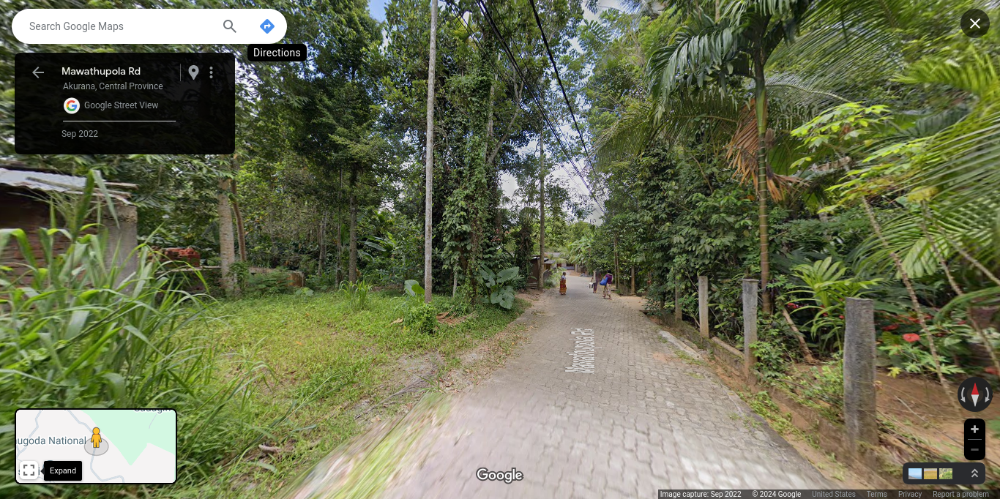

## Nebadagahayaya

**Nebadagahayaya** Grama Niladhari Division, **Nattandiya** Divisional Secretariat Division, **Puttalam** District, **North Western** Province

**Nattandiya** Polling Division, **Puttalam** Electoral District

Population: 1,518 (2012)

(**LK-6242195**/495D)

## Kadeweediya West

**Kadeweediya West** Grama Niladhari Division, **Matara Four Gravets** Divisional Secretariat Division, **Matara** District, **Southern** Province

**Matara** Polling Division, **Matara** Electoral District

Population: 1,771 (2012)

(**LK-3242200**/417F)

## Mawanella

**Mawanella** Grama Niladhari Division, **Mawanella** Divisional Secretariat Division, **Kegalle** District, **Sabaragamuwa** Province

**Mawanella** Polling Division, **Kegalle** Electoral District

Population: 1,293 (2012)

(**LK-9206135**/19B)

## Agra Pedesa

**Agra Pedesa** Grama Niladhari Division, **Seethawaka** Divisional Secretariat Division, **Colombo** District, **Western** Province

**Avissawella** Polling Division, **Colombo** Electoral District

Population: 2,001 (2012)

(**LK-1115060**/432G)

## Puloly Centre

**Puloly Centre** Grama Niladhari Division, **Vadamaradchi North (Point Pedro)** Divisional Secretariat Division, **Jaffna** District, **Northern** Province

**Point Pedro** Polling Division, **Jaffna** Electoral District

Population: 1,602 (2012)

(**LK-4127135**/J/409)

## Ranna West

**Ranna West** Grama Niladhari Division, **Tangalle** Divisional Secretariat Division, **Hambantota** District, **Southern** Province

**Tangalle** Polling Division, **Hambantota** Electoral District

Population: 1,773 (2012)

(**LK-3333050**/252)

## Polikandy West

**Polikandy West** Grama Niladhari Division, **Vadamaradchi North (Point Pedro)** Divisional Secretariat Division, **Jaffna** District, **Northern** Province

**Udupiddy** Polling Division, **Jaffna** Electoral District

Population: 1,889 (2012)

(**LK-4127055**/J/393)

## Honnanthara South

**Honnanthara South** Grama Niladhari Division, **Kesbewa** Divisional Secretariat Division, **Colombo** District, **Western** Province

**Kesbewa** Polling Division, **Colombo** Electoral District

Population: 3,939 (2012)

(**LK-1136275**/585A)

## Weeragama

**Weeragama** Grama Niladhari Division, **Hingurakgoda** Divisional Secretariat Division, **Polonnaruwa** District, **North Central** Province

**Minneriya** Polling Division, **Polonnaruwa** Electoral District

Population: 772 (2012)

(**LK-7203235**/44)

## Parape South

**Parape South** Grama Niladhari Division, **Rambukkana** Divisional Secretariat Division, **Kegalle** District, **Sabaragamuwa** Province

**Rambukkana** Polling Division, **Kegalle** Electoral District

Population: 983 (2012)

(**LK-9203120**/03F)

## Omatta

**Omatta** Grama Niladhari Division, **Agalawatta** Divisional Secretariat Division, **Kalutara** District, **Western** Province

**Bulathsinhala** Polling Division, **Kalutara** Electoral District

Population: 935 (2012)

(**LK-1333015**/826)

## Sainthamaruthu 01

**Sainthamaruthu 01** Grama Niladhari Division, **Sainthamaruthu** Divisional Secretariat Division, **Ampara** District, **Eastern** Province

**Kalmunai** Polling Division, **Digamadulla** Electoral District

Population: 1,938 (2012)

(**LK-5225005**/KP/53)

## Idamegama

**Idamegama** Grama Niladhari Division, **Uva Paranagama** Divisional Secretariat Division, **Badulla** District, **Uva** Province

**Uva Paranagama** Polling Division, **Badulla** Electoral District

Population: 809 (2012)

(**LK-8127150**/43C)

## Thenagama South

**Thenagama South** Grama Niladhari Division, **Tangalle** Divisional Secretariat Division, **Hambantota** District, **Southern** Province

**Beliatta** Polling Division, **Hambantota** Electoral District

Population: 504 (2012)

(**LK-3333075**/306)

## Manalkudiyiruppu

**Manalkudiyiruppu** Grama Niladhari Division, **Maritimepattu** Divisional Secretariat Division, **Mullaitivu** District, **Northern** Province

**Mullaitivu** Polling Division, **Vanni** Electoral District

Population: 285 (2012)

(**LK-4415130**/MU/96)

## Kudagodagama

**Kudagodagama** Grama Niladhari Division, **Balapitiya** Divisional Secretariat Division, **Galle** District, **Southern** Province

**Balapitiya** Polling Division, **Galle** Electoral District

Population: 627 (2012)

(**LK-3106055**/17C)

## Gallehepitiya

**Gallehepitiya** Grama Niladhari Division, **Panduwasnuwara East** Divisional Secretariat Division, **Kurunegala** District, **North Western** Province

**Panduwasnuwara** Polling Division, **Kurunegala** Electoral District

Population: 1,499 (2012)

(**LK-6148050**/1362)

## Weligodawatta

**Weligodawatta** Grama Niladhari Division, **Pasbage Korale** Divisional Secretariat Division, **Kandy** District, **Central** Province

**Nawalapitiya** Polling Division, **Kandy** Electoral District

Population: 1,824 (2012)

(**LK-2157015**/1102)

## Athurugiriya South

**Athurugiriya South** Grama Niladhari Division, **Kaduwela** Divisional Secretariat Division, **Colombo** District, **Western** Province

**Kaduwela** Polling Division, **Colombo** Electoral District

Population: 3,718 (2012)

(**LK-1109285**/490A)

## Polkotuwa

**Polkotuwa** Grama Niladhari Division, **Beruwala** Divisional Secretariat Division, **Kalutara** District, **Western** Province

**Beruwala** Polling Division, **Kalutara** Electoral District

Population: 3,383 (2012)

(**LK-1324220**/748)

## Pitiyegedara

**Pitiyegedara** Grama Niladhari Division, **Pathadumbara** Divisional Secretariat Division, **Kandy** District, **Central** Province

**Pathadumbara** Polling Division, **Kandy** Electoral District

Population: 1,129 (2012)

(**LK-2112090**/642)

## Santhiveli

**Santhiveli** Grama Niladhari Division, **Koralai Pattu South (Kiran)** Divisional Secretariat Division, **Batticaloa** District, **Eastern** Province

**Kalkudah** Polling Division, **Batticaloa** Electoral District

Population: 3,156 (2012)

(**LK-5110065**/200)

## Meemana

**Meemana** Grama Niladhari Division, **Horana** Divisional Secretariat Division, **Kalutara** District, **Western** Province

**Horana** Polling Division, **Kalutara** Electoral District

Population: 2,157 (2012)

(**LK-1309180**/611A)

## Kudapaduwa South

**Kudapaduwa South** Grama Niladhari Division, **Negombo** Divisional Secretariat Division, **Gampaha** District, **Western** Province

**Negombo** Polling Division, **Gampaha** Electoral District

Population: 3,353 (2012)

(**LK-1203070**/73C)

## Humbuluwa East

**Humbuluwa East** Grama Niladhari Division, **Alawwa** Divisional Secretariat Division, **Kurunegala** District, **North Western** Province

**Dambadeniya** Polling Division, **Kurunegala** Electoral District

Population: 1,227 (2012)

(**LK-6184210**/1006)

## Pelawa Ihalagama

**Pelawa Ihalagama** Grama Niladhari Division, **Yatinuwara** Divisional Secretariat Division, **Kandy** District, **Central** Province

**Yatinuwara** Polling Division, **Kandy** Electoral District

Population: 715 (2012)

(**LK-2136070**/138)

## Evariwatta

**Evariwatta** Grama Niladhari Division, **Wattala** Divisional Secretariat Division, **Gampaha** District, **Western** Province

**Wattala** Polling Division, **Gampaha** Electoral District

Population: 4,527 (2012)

(**LK-1218215**/175 A)

## Aramangoda

**Aramangoda** Grama Niladhari Division, **Mahara** Divisional Secretariat Division, **Gampaha** District, **Western** Province

**Mahara** Polling Division, **Gampaha** Electoral District

Population: 1,180 (2012)

(**LK-1233145**/301)

## Karaveddy East

**Karaveddy East** Grama Niladhari Division, **Vadamaradchi South-West (Karaveddy)** Divisional Secretariat Division, **Jaffna** District, **Northern** Province

**Udupiddy** Polling Division, **Jaffna** Electoral District

Population: 1,321 (2012)

(**LK-4121105**/J/368)

## Kahagolla

**Kahagolla** Grama Niladhari Division, **Haputale** Divisional Secretariat Division, **Badulla** District, **Uva** Province

**Haputale** Polling Division, **Badulla** Electoral District

Population: 2,120 (2012)

(**LK-8139030**/64)

## Uduvil Centre North

**Uduvil Centre North** Grama Niladhari Division, **Valikamam South (Uduvil)** Divisional Secretariat Division, **Jaffna** District, **Northern** Province

**Manipay** Polling Division, **Jaffna** Electoral District

Population: 2,931 (2012)

(**LK-4115020**/J/185)

## Pahala Imbulgoda East

**Pahala Imbulgoda East** Grama Niladhari Division, **Gampaha** Divisional Secretariat Division, **Gampaha** District, **Western** Province

**Gampaha** Polling Division, **Gampaha** Electoral District

Population: 986 (2012)

(**LK-1224460**/243)

## Waragashinna

**Waragashinna** Grama Niladhari Division, **Akurana** Divisional Secretariat Division, **Kandy** District, **Central** Province

**Harispattuwa** Polling Division, **Kandy** Electoral District

Population: 2,228 (2012)

(**LK-2109165**/566)

## Damunumeya North

**Damunumeya North** Grama Niladhari Division, **Hanguranketha** Divisional Secretariat Division, **Nuwara Eliya** District, **Central** Province

**Hanguranketha** Polling Division, **Nuwara-Eliya** Electoral District

Population: 532 (2012)

(**LK-2306145**/494E)

## Dombawela

**Dombawela** Grama Niladhari Division, **Matale** Divisional Secretariat Division, **Matale** District, **Central** Province

**Matale** Polling Division, **Matale** Electoral District

Population: 968 (2012)

(**LK-2218060**/E329)

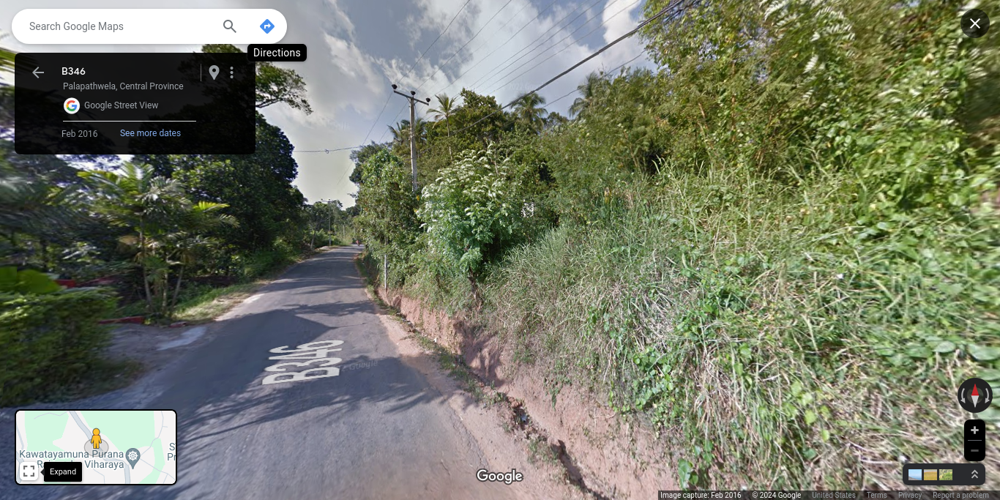

## Enderamulla West

**Enderamulla West** Grama Niladhari Division, **Mahara** Divisional Secretariat Division, **Gampaha** District, **Western** Province

**Mahara** Polling Division, **Gampaha** Electoral District

Population: 2,775 (2012)

(**LK-1233450**/255F)

## Medagoda

**Medagoda** Grama Niladhari Division, **Narammala** Divisional Secretariat Division, **Kurunegala** District, **North Western** Province

**Dambadeniya** Polling Division, **Kurunegala** Electoral District

Population: 851 (2012)

(**LK-6181060**/1055)

## Maha Heenatiyangala

**Maha Heenatiyangala** Grama Niladhari Division, **Kalutara** Divisional Secretariat Division, **Kalutara** District, **Western** Province

**Kalutara** Polling Division, **Kalutara** Electoral District

Population: 3,295 (2012)

(**LK-1321350**/727D)

## Yakmaditta

**Yakmaditta** Grama Niladhari Division, **Kolonna** Divisional Secretariat Division, **Ratnapura** District, **Sabaragamuwa** Province

**Kolonna** Polling Division, **Ratnapura** Electoral District

Population: 785 (2012)

(**LK-9151015**/204A)

## Ranpokunagama A Zone

**Ranpokunagama A Zone** Grama Niladhari Division, **Attanagalla** Divisional Secretariat Division, **Gampaha** District, **Western** Province

**Attanagalla** Polling Division, **Gampaha** Electoral District

Population: 1,443 (2012)

(**LK-1227205**/349A)

## Wadduwa West

**Wadduwa West** Grama Niladhari Division, **Panadura** Divisional Secretariat Division, **Kalutara** District, **Western** Province

**Panadura** Polling Division, **Kalutara** Electoral District

Population: 1,392 (2012)

(**LK-1303320**/699)

## Gnasooriyam Sathukam

**Gnasooriyam Sathukam** Grama Niladhari Division, **Manmunai North** Divisional Secretariat Division, **Batticaloa** District, **Eastern** Province

**Batticaloa** Polling Division, **Batticaloa** Electoral District

Population: 1,540 (2012)

(**LK-5118115**/173G)

## Hettiyawala North

**Hettiyawala North** Grama Niladhari Division, **Kirinda Puhulwella** Divisional Secretariat Division, **Matara** District, **Southern** Province

**Kamburupitiya** Polling Division, **Matara** Electoral District

Population: 970 (2012)

(**LK-3233040**/325G)

## Bubulalanda

**Bubulalanda** Grama Niladhari Division, **Beruwala** Divisional Secretariat Division, **Kalutara** District, **Western** Province

**Beruwala** Polling Division, **Kalutara** Electoral District

Population: 1,439 (2012)

(**LK-1324170**/747B)

## Serugoda

**Serugoda** Grama Niladhari Division, **Ambanpola** Divisional Secretariat Division, **Kurunegala** District, **North Western** Province

**Yapahuwa** Polling Division, **Kurunegala** Electoral District

Population: 700 (2012)

(**LK-6112075**/155)

## Medaketiya

**Medaketiya** Grama Niladhari Division, **Tangalle** Divisional Secretariat Division, **Hambantota** District, **Southern** Province

**Tangalle** Polling Division, **Hambantota** Electoral District

Population: 1,562 (2012)

(**LK-3333225**/268)

## Pahala Keembiya

**Pahala Keembiya** Grama Niladhari Division, **Baddegama** Divisional Secretariat Division, **Galle** District, **Southern** Province

**Baddegama** Polling Division, **Galle** Electoral District

Population: 593 (2012)

(**LK-3127245**/208)

## Galwetiya

**Galwetiya** Grama Niladhari Division, **Wattala** Divisional Secretariat Division, **Gampaha** District, **Western** Province

**Wattala** Polling Division, **Gampaha** Electoral District

Population: 3,426 (2012)

(**LK-1218225**/176B)

## Kurunduwatta

**Kurunduwatta** Grama Niladhari Division, **Homagama** Divisional Secretariat Division, **Colombo** District, **Western** Province

**Homagama** Polling Division, **Colombo** Electoral District

Population: 3,867 (2012)

(**LK-1112155**/448C)

## Bandarawatta West

**Bandarawatta West** Grama Niladhari Division, **Katana** Divisional Secretariat Division, **Gampaha** District, **Western** Province

**Katana** Polling Division, **Gampaha** Electoral District

Population: 4,127 (2012)

(**LK-1206350**/145)

## Nallooruwa

**Nallooruwa** Grama Niladhari Division, **Panadura** Divisional Secretariat Division, **Kalutara** District, **Western** Province

**Panadura** Polling Division, **Kalutara** Electoral District

Population: 3,014 (2012)

(**LK-1303275**/692)

## Welivita Ihala North

**Welivita Ihala North** Grama Niladhari Division, **Hatharaliyadda** Divisional Secretariat Division, **Kandy** District, **Central** Province

**Galagedara** Polling Division, **Kandy** Electoral District

Population: 548 (2012)

(**LK-2134120**/340)

## Paranagampola

**Paranagampola** Grama Niladhari Division, **Kegalle** Divisional Secretariat Division, **Kegalle** District, **Sabaragamuwa** Province

**Kegalle** Polling Division, **Kegalle** Electoral District

Population: 2,030 (2012)

(**LK-9212060**/52C)

## Mahena

**Mahena** Grama Niladhari Division, **Warakapola** Divisional Secretariat Division, **Kegalle** District, **Sabaragamuwa** Province

**Dedigama** Polling Division, **Kegalle** Electoral District

Population: 2,337 (2012)

(**LK-9218115**/83B)

## Mahabage

**Mahabage** Grama Niladhari Division, **Wattala** Divisional Secretariat Division, **Gampaha** District, **Western** Province

**Wattala** Polling Division, **Gampaha** Electoral District

Population: 4,304 (2012)

(**LK-1218080**/178)

## Kochchikade South

**Kochchikade South** Grama Niladhari Division, **Colombo** Divisional Secretariat Division, **Colombo** District, **Western** Province

**Colombo Central** Polling Division, **Colombo** Electoral District

Population: 7,746 (2012)

(**LK-1103110**/)

## Indurupathvila

**Indurupathvila** Grama Niladhari Division, **Baddegama** Divisional Secretariat Division, **Galle** District, **Southern** Province

**Baddegama** Polling Division, **Galle** Electoral District

Population: 1,170 (2012)

(**LK-3127130**/186A)

## Galagedara

**Galagedara** Grama Niladhari Division, **Panduwasnuwara East** Divisional Secretariat Division, **Kurunegala** District, **North Western** Province

**Panduwasnuwara** Polling Division, **Kurunegala** Electoral District

Population: 730 (2012)

(**LK-6148145**/1381)

## Dummalasooriya

**Dummalasooriya** Grama Niladhari Division, **Udubaddawa** Divisional Secretariat Division, **Kurunegala** District, **North Western** Province

**Bingiriya** Polling Division, **Kurunegala** Electoral District

Population: 831 (2012)

(**LK-6175085**/1486)

## Wewakele

**Wewakele** Grama Niladhari Division, **Walapane** Divisional Secretariat Division, **Nuwara Eliya** District, **Central** Province

**Walapane** Polling Division, **Nuwara-Eliya** Electoral District

Population: 387 (2012)

(**LK-2309120**/513C)

## Pathamailapitiya South

**Pathamailapitiya South** Grama Niladhari Division, **Pathahewaheta** Divisional Secretariat Division, **Kandy** District, **Central** Province

**Hewaheta** Polling Division, **Kandy** Electoral District

Population: 1,233 (2012)

(**LK-2145215**/1006)

## Weligala

**Weligala** Grama Niladhari Division, **Ukuwela** Divisional Secretariat Division, **Matale** District, **Central** Province

**Rattota** Polling Division, **Matale** Electoral District

Population: 439 (2012)

(**LK-2233280**/E365)

## Aniwatta West

**Aniwatta West** Grama Niladhari Division, **Kandy Four Gravets & Gangawata Korale** Divisional Secretariat Division, **Kandy** District, **Central** Province

**Mahanuwara** Polling Division, **Kandy** Electoral District

Population: 1,698 (2012)

(**LK-2130175**/233)

## Rathupaswala

**Rathupaswala** Grama Niladhari Division, **Gampaha** Divisional Secretariat Division, **Gampaha** District, **Western** Province

**Gampaha** Polling Division, **Gampaha** Electoral District

Population: 3,307 (2012)

(**LK-1224385**/239A)

## Pahala Kosgama East

**Pahala Kosgama East** Grama Niladhari Division, **Seethawaka** Divisional Secretariat Division, **Colombo** District, **Western** Province

**Avissawella** Polling Division, **Colombo** Electoral District

Population: 1,830 (2012)

(**LK-1115110**/427)

## Gammeddegoda

**Gammeddegoda** Grama Niladhari Division, **Hikkaduwa** Divisional Secretariat Division, **Galle** District, **Southern** Province

**Ratgama** Polling Division, **Galle** Electoral District

Population: 1,055 (2012)

(**LK-3136430**/47)

## Koodaluvila

**Koodaluvila** Grama Niladhari Division, **Seethawaka** Divisional Secretariat Division, **Colombo** District, **Western** Province

**Avissawella** Polling Division, **Colombo** Electoral District

Population: 2,807 (2012)

(**LK-1115285**/444D)

## Wattalpola

**Wattalpola** Grama Niladhari Division, **Panadura** Divisional Secretariat Division, **Kalutara** District, **Western** Province

**Panadura** Polling Division, **Kalutara** Electoral District

Population: 4,273 (2012)

(**LK-1303065**/674A)

## Mattegoda Central 'B'

**Mattegoda Central 'B'** Grama Niladhari Division, **Homagama** Divisional Secretariat Division, **Colombo** District, **Western** Province

**Homagama** Polling Division, **Colombo** Electoral District

Population: 2,968 (2012)

(**LK-1112310**/587B)

## Liyanagoda

**Liyanagoda** Grama Niladhari Division, **Maharagama** Divisional Secretariat Division, **Colombo** District, **Western** Province

**Maharagama** Polling Division, **Colombo** Electoral District

Population: 4,342 (2012)

(**LK-1121055**/496E)

## Vantharumoolai East

**Vantharumoolai East** Grama Niladhari Division, **Eravur Pattu** Divisional Secretariat Division, **Batticaloa** District, **Eastern** Province

**Kalkudah** Polling Division, **Batticaloa** Electoral District

Population: 3,950 (2012)

(**LK-5112065**/197)

## Manipay East

**Manipay East** Grama Niladhari Division, **Valikamam South-West (Sandilipay)** Divisional Secretariat Division, **Jaffna** District, **Northern** Province

**Manipay** Polling Division, **Jaffna** Electoral District

Population: 2,183 (2012)

(**LK-4109050**/J/138)

## Wedikanda

**Wedikanda** Grama Niladhari Division, **Ratmalana** Divisional Secretariat Division, **Colombo** District, **Western** Province

**Ratmalana** Polling Division, **Colombo** Electoral District

Population: 7,585 (2012)

(**LK-1131045**/546A)

## Kurukulawa North

**Kurukulawa North** Grama Niladhari Division, **Wattala** Divisional Secretariat Division, **Gampaha** District, **Western** Province

**Wattala** Polling Division, **Gampaha** Electoral District

Population: 2,501 (2012)

(**LK-1218100**/250)

## Railway Town

**Railway Town** Grama Niladhari Division, **Kekirawa** Divisional Secretariat Division, **Anuradhapura** District, **North Central** Province

**Kekirawa** Polling Division, **Anuradhapura** Electoral District

Population: 1,069 (2012)

(**LK-7154095**/620)

## Ududeniya

**Ududeniya** Grama Niladhari Division, **Naula** Divisional Secretariat Division, **Matale** District, **Central** Province

**Laggala** Polling Division, **Matale** Electoral District

Population: 910 (2012)

(**LK-2209215**/E415B)

## Konwewa

**Konwewa** Grama Niladhari Division, **Thambuttegama** Divisional Secretariat Division, **Anuradhapura** District, **North Central** Province

**Kalawewa** Polling Division, **Anuradhapura** Electoral District

Population: 1,774 (2012)

(**LK-7145045**/425)

## Uswatta

**Uswatta** Grama Niladhari Division, **Kalutara** Divisional Secretariat Division, **Kalutara** District, **Western** Province

**Kalutara** Polling Division, **Kalutara** Electoral District

Population: 1,813 (2012)

(**LK-1321380**/729F)

## Udadigana

**Udadigana** Grama Niladhari Division, **Maspotha** Divisional Secretariat Division, **Kurunegala** District, **North Western** Province

**Kurunegala** Polling Division, **Kurunegala** Electoral District

Population: 559 (2012)

(**LK-6151145**/801)

## Pathagama

**Pathagama** Grama Niladhari Division, **Kuruvita** Divisional Secretariat Division, **Ratnapura** District, **Sabaragamuwa** Province

**Eheliyagoda** Polling Division, **Ratnapura** Electoral District

Population: 2,974 (2012)

(**LK-9106170**/155D)

## Aluthgama

**Aluthgama** Grama Niladhari Division, **Yatawatta** Divisional Secretariat Division, **Matale** District, **Central** Province

**Matale** Polling Division, **Matale** Electoral District

Population: 430 (2012)

(**LK-2215200**/E338)

## Pallikkudawa Urban

**Pallikkudawa Urban** Grama Niladhari Division, **Tangalle** Divisional Secretariat Division, **Hambantota** District, **Southern** Province

**Tangalle** Polling Division, **Hambantota** Electoral District

Population: 1,315 (2012)

(**LK-3333255**/273)

## Maligapurana

**Maligapurana** Grama Niladhari Division, **Ganga Ihala Korale** Divisional Secretariat Division, **Kandy** District, **Central** Province

**Nawalapitiya** Polling Division, **Kandy** Electoral District

Population: 1,972 (2012)

(**LK-2154030**/1078)

## Dedigamuwa

**Dedigamuwa** Grama Niladhari Division, **Kaduwela** Divisional Secretariat Division, **Colombo** District, **Western** Province

**Kaduwela** Polling Division, **Colombo** Electoral District

Population: 2,105 (2012)

(**LK-1109100**/480A)

## Endagala

**Endagala** Grama Niladhari Division, **Thalawa** Divisional Secretariat Division, **Anuradhapura** District, **North Central** Province

**Kalawewa** Polling Division, **Anuradhapura** Electoral District

Population: 1,578 (2012)

(**LK-7148170**/393)

## Ihalagoda East

**Ihalagoda East** Grama Niladhari Division, **Akmeemana** Divisional Secretariat Division, **Galle** District, **Southern** Province

**Akmeemana** Polling Division, **Galle** Electoral District

Population: 3,560 (2012)

(**LK-3145020**/109A)

## Hennathota

**Hennathota** Grama Niladhari Division, **Hikkaduwa** Divisional Secretariat Division, **Galle** District, **Southern** Province

**Ratgama** Polling Division, **Galle** Electoral District

Population: 1,182 (2012)

(**LK-3136295**/53B)

## Beliatta West

**Beliatta West** Grama Niladhari Division, **Beliatta** Divisional Secretariat Division, **Hambantota** District, **Southern** Province

**Beliatta** Polling Division, **Hambantota** Electoral District

Population: 645 (2012)

(**LK-3330185**/353)

## Angulana North

**Angulana North** Grama Niladhari Division, **Moratuwa** Divisional Secretariat Division, **Colombo** District, **Western** Province

**Moratuwa** Polling Division, **Colombo** Electoral District

Population: 4,201 (2012)

(**LK-1133005**/547)

## Salamulla

**Salamulla** Grama Niladhari Division, **Kolonnawa** Divisional Secretariat Division, **Colombo** District, **Western** Province

**Kolonnawa** Polling Division, **Colombo** Electoral District

Population: 5,213 (2012)

(**LK-1106205**/512A)

## Pulluhena

**Pulluhena** Grama Niladhari Division, **Wattala** Divisional Secretariat Division, **Gampaha** District, **Western** Province

**Wattala** Polling Division, **Gampaha** Electoral District

Population: 2,052 (2012)

(**LK-1218035**/165B)

## Muttakkarai  North

**Muttakkarai  North** Grama Niladhari Division, **Negombo** Divisional Secretariat Division, **Gampaha** District, **Western** Province

**Negombo** Polling Division, **Gampaha** Electoral District

Population: 2,852 (2012)

(**LK-1203110**/156A)

## Pitakotte

**Pitakotte** Grama Niladhari Division, **Sri Jayawardanapura Kotte** Divisional Secretariat Division, **Colombo** District, **Western** Province

**Kotte** Polling Division, **Colombo** Electoral District

Population: 3,634 (2012)

(**LK-1124055**/522B)

## Kaddaiparichchan North

**Kaddaiparichchan North** Grama Niladhari Division, **Muttur** Divisional Secretariat Division, **Trincomalee** District, **Eastern** Province

**Muttur** Polling Division, **Trincomalee** Electoral District

Population: 1,650 (2012)

(**LK-5327030**/222B)

## Eravur 04

**Eravur 04** Grama Niladhari Division, **Eravur Town** Divisional Secretariat Division, **Batticaloa** District, **Eastern** Province

**Batticaloa** Polling Division, **Batticaloa** Electoral District

Population: 769 (2012)

(**LK-5115010**/194)

## Mahingala

**Mahingala** Grama Niladhari Division, **Padukka** Divisional Secretariat Division, **Colombo** District, **Western** Province

**Avissawella** Polling Division, **Colombo** Electoral District

Population: 621 (2012)

(**LK-1118210**/455A)

## Sinhapitiya South

**Sinhapitiya South** Grama Niladhari Division, **Udapalatha** Divisional Secretariat Division, **Kandy** District, **Central** Province

**Gampola** Polling Division, **Kandy** Electoral District

Population: 1,155 (2012)

(**LK-2151085**/1118)

## Gallehepitiya

**Gallehepitiya** Grama Niladhari Division, **Panduwasnuwara East** Divisional Secretariat Division, **Kurunegala** District, **North Western** Province

**Panduwasnuwara** Polling Division, **Kurunegala** Electoral District

Population: 1,499 (2012)

(**LK-6148050**/1362)

## Kinigama East

**Kinigama East** Grama Niladhari Division, **Thumpane** Divisional Secretariat Division, **Kandy** District, **Central** Province

**Galagedara** Polling Division, **Kandy** Electoral District

Population: 540 (2012)

(**LK-2103180**/316)

## Balathawa

**Balathawa** Grama Niladhari Division, **Mirigama** Divisional Secretariat Division, **Gampaha** District, **Western** Province

**Mirigama** Polling Division, **Gampaha** Electoral District

Population: 861 (2012)

(**LK-1212160**/13C)

## Gurunagar East

**Gurunagar East** Grama Niladhari Division, **Jaffna** Divisional Secretariat Division, **Jaffna** District, **Northern** Province

**Jaffna** Polling Division, **Jaffna** Electoral District

Population: 1,974 (2012)

(**LK-4136050**/J/70)

## Kolongalla

**Kolongalla** Grama Niladhari Division, **Kegalle** Divisional Secretariat Division, **Kegalle** District, **Sabaragamuwa** Province

**Kegalle** Polling Division, **Kegalle** Electoral District

Population: 1,592 (2012)

(**LK-9212020**/14D)

## Idama

**Idama** Grama Niladhari Division, **Moratuwa** Divisional Secretariat Division, **Colombo** District, **Western** Province

**Moratuwa** Polling Division, **Colombo** Electoral District

Population: 2,826 (2012)

(**LK-1133115**/552)

## Neeravipiddy West

**Neeravipiddy West** Grama Niladhari Division, **Maritimepattu** Divisional Secretariat Division, **Mullaitivu** District, **Northern** Province

**Mullaitivu** Polling Division, **Vanni** Electoral District

Population: 499 (2012)

(**LK-4415190**/MU/114)

## Napawala

**Napawala** Grama Niladhari Division, **Dehiovita** Divisional Secretariat Division, **Kegalle** District, **Sabaragamuwa** Province

**Ruwanwella** Polling Division, **Kegalle** Electoral District

Population: 2,695 (2012)

(**LK-9230070**/117B)

## Rahumaniya Nagar

**Rahumaniya Nagar** Grama Niladhari Division, **Kinniya** Divisional Secretariat Division, **Trincomalee** District, **Eastern** Province

**Muttur** Polling Division, **Trincomalee** Electoral District

Population: 1,976 (2012)

(**LK-5324135**/225)

## Walgama Meda

**Walgama Meda** Grama Niladhari Division, **Matara Four Gravets** Divisional Secretariat Division, **Matara** District, **Southern** Province

**Matara** Polling Division, **Matara** Electoral District

Population: 1,955 (2012)

(**LK-3242240**/409C)

## Bendiyamulla North

**Bendiyamulla North** Grama Niladhari Division, **Gampaha** Divisional Secretariat Division, **Gampaha** District, **Western** Province

**Gampaha** Polling Division, **Gampaha** Electoral District

Population: 1,373 (2012)

(**LK-1224135**/234)

## Lakshapathiya North

**Lakshapathiya North** Grama Niladhari Division, **Moratuwa** Divisional Secretariat Division, **Colombo** District, **Western** Province

**Moratuwa** Polling Division, **Colombo** Electoral District

Population: 4,481 (2012)

(**LK-1133045**/550A)

## Soysapura South

**Soysapura South** Grama Niladhari Division, **Moratuwa** Divisional Secretariat Division, **Colombo** District, **Western** Province

**Moratuwa** Polling Division, **Colombo** Electoral District

Population: 2,711 (2012)

(**LK-1133020**/548B)

## Madiwela

**Madiwela** Grama Niladhari Division, **Maharagama** Divisional Secretariat Division, **Colombo** District, **Western** Province

**Maharagama** Polling Division, **Colombo** Electoral District

Population: 6,244 (2012)

(**LK-1121015**/524)

## Theliyagonna

**Theliyagonna** Grama Niladhari Division, **Kurunegala** Divisional Secretariat Division, **Kurunegala** District, **North Western** Province

**Kurunegala** Polling Division, **Kurunegala** Electoral District

Population: 2,745 (2012)

(**LK-6154175**/836)

## Wickramasinghapura

**Wickramasinghapura** Grama Niladhari Division, **Kaduwela** Divisional Secretariat Division, **Colombo** District, **Western** Province

**Kaduwela** Polling Division, **Colombo** Electoral District

Population: 3,136 (2012)

(**LK-1109270**/479C)

## Rikillagaskada

**Rikillagaskada** Grama Niladhari Division, **Hanguranketha** Divisional Secretariat Division, **Nuwara Eliya** District, **Central** Province

**Hanguranketha** Polling Division, **Nuwara-Eliya** Electoral District

Population: 1,995 (2012)

(**LK-2306320**/492A)

## Keraminiya

**Keraminiya** Grama Niladhari Division, **Ambalangoda** Divisional Secretariat Division, **Galle** District, **Southern** Province

**Ambalangoda** Polling Division, **Galle** Electoral District

Population: 1,704 (2012)

(**LK-3133030**/86B)

## Galambalama

**Galambalama** Grama Niladhari Division, **Medadumbara** Divisional Secretariat Division, **Kandy** District, **Central** Province

**Teldeniya** Polling Division, **Kandy** Electoral District

Population: 818 (2012)

(**LK-2124355**/831)

## Alawathupitiya

**Alawathupitiya** Grama Niladhari Division, **Katana** Divisional Secretariat Division, **Gampaha** District, **Western** Province

**Katana** Polling Division, **Gampaha** Electoral District

Population: 1,188 (2012)

(**LK-1206385**/198)

## Godagama

**Godagama** Grama Niladhari Division, **Attanagalla** Divisional Secretariat Division, **Gampaha** District, **Western** Province

**Attanagalla** Polling Division, **Gampaha** Electoral District

Population: 657 (2012)

(**LK-1227400**/361)

## Ambathalawa

**Ambathalawa** Grama Niladhari Division, **Kothmale** Divisional Secretariat Division, **Nuwara Eliya** District, **Central** Province

**Kothmale** Polling Division, **Nuwara-Eliya** Electoral District

Population: 1,087 (2012)

(**LK-2303230**/470A)

## Kalubovila

**Kalubovila** Grama Niladhari Division, **Dehiwala** Divisional Secretariat Division, **Colombo** District, **Western** Province

**Dehiwala** Polling Division, **Colombo** Electoral District

Population: 5,517 (2012)

(**LK-1130025**/538)

## Uragasmanhandiya East

**Uragasmanhandiya East** Grama Niladhari Division, **Karandeniya** Divisional Secretariat Division, **Galle** District, **Southern** Province

**Karandeniya** Polling Division, **Galle** Electoral District

Population: 1,634 (2012)

(**LK-3109040**/39C)

## Angulana South

**Angulana South** Grama Niladhari Division, **Moratuwa** Divisional Secretariat Division, **Colombo** District, **Western** Province

**Moratuwa** Polling Division, **Colombo** Electoral District

Population: 3,333 (2012)

(**LK-1133055**/547A)

## Kottagoda

**Kottagoda** Grama Niladhari Division, **Matale** Divisional Secretariat Division, **Matale** District, **Central** Province

**Matale** Polling Division, **Matale** Electoral District

Population: 882 (2012)

(**LK-2218100**/E325B)

## Ninthavur 02

**Ninthavur 02** Grama Niladhari Division, **Ninthavur** Divisional Secretariat Division, **Ampara** District, **Eastern** Province

**Pothuvil** Polling Division, **Digamadulla** Electoral District

Population: 1,180 (2012)

(**LK-5230025**/40)

## Meedeniya

**Meedeniya** Grama Niladhari Division, **Ukuwela** Divisional Secretariat Division, **Matale** District, **Central** Province

**Rattota** Polling Division, **Matale** Electoral District

Population: 2,118 (2012)

(**LK-2233180**/E356B)

## Hapuwalana

**Hapuwalana** Grama Niladhari Division, **Divulapitiya** Divisional Secretariat Division, **Gampaha** District, **Western** Province

**Divulapitiya** Polling Division, **Gampaha** Electoral District

Population: 788 (2012)

(**LK-1209545**/87)

## Koralawella North

**Koralawella North** Grama Niladhari Division, **Moratuwa** Divisional Secretariat Division, **Colombo** District, **Western** Province

**Moratuwa** Polling Division, **Colombo** Electoral District

Population: 5,696 (2012)

(**LK-1133170**/554)

## Wellawatta North

**Wellawatta North** Grama Niladhari Division, **Thimbirigasyaya** Divisional Secretariat Division, **Colombo** District, **Western** Province

**Colombo West** Polling Division, **Colombo** Electoral District

Population: 14,876 (2012)

(**LK-1127085**/)

## Katiyawa Track 09

**Katiyawa Track 09** Grama Niladhari Division, **Thalawa** Divisional Secretariat Division, **Anuradhapura** District, **North Central** Province

**Kalawewa** Polling Division, **Anuradhapura** Electoral District

Population: 1,803 (2012)

(**LK-7148160**/384)

## Nilannoruwa

**Nilannoruwa** Grama Niladhari Division, **Pallepola** Divisional Secretariat Division, **Matale** District, **Central** Province

**Dambulla** Polling Division, **Matale** Electoral District

Population: 808 (2012)

(**LK-2212030**/E426A)

## Sellakanda

**Sellakanda** Grama Niladhari Division, **Katana** Divisional Secretariat Division, **Gampaha** District, **Western** Province

**Katana** Polling Division, **Gampaha** Electoral District

Population: 4,528 (2012)

(**LK-1206115**/161C)

## Rawathawatta South

**Rawathawatta South** Grama Niladhari Division, **Moratuwa** Divisional Secretariat Division, **Colombo** District, **Western** Province

**Moratuwa** Polling Division, **Colombo** Electoral District

Population: 2,144 (2012)

(**LK-1133070**/557B)

## Uda Padiyapelella

**Uda Padiyapelella** Grama Niladhari Division, **Hanguranketha** Divisional Secretariat Division, **Nuwara Eliya** District, **Central** Province

**Hanguranketha** Polling Division, **Nuwara-Eliya** Electoral District

Population: 643 (2012)

(**LK-2306505**/510A)

## Wewa Ihalagoda

**Wewa Ihalagoda** Grama Niladhari Division, **Matara Four Gravets** Divisional Secretariat Division, **Matara** District, **Southern** Province

**Matara** Polling Division, **Matara** Electoral District

Population: 1,612 (2012)

(**LK-3242305**/429A)

## Weragoda

**Weragoda** Grama Niladhari Division, **Mawanella** Divisional Secretariat Division, **Kegalle** District, **Sabaragamuwa** Province

**Mawanella** Polling Division, **Kegalle** Electoral District

Population: 546 (2012)

(**LK-9206285**/37C)

## Pahala Dummalakotuwa

**Pahala Dummalakotuwa** Grama Niladhari Division, **Dankotuwa** Divisional Secretariat Division, **Puttalam** District, **North Western** Province

**Wennappuwa** Polling Division, **Puttalam** Electoral District

Population: 1,391 (2012)

(**LK-6248180**/474E)

## Palakudawa

**Palakudawa** Grama Niladhari Division, **Kalpitiya** Divisional Secretariat Division, **Puttalam** District, **North Western** Province

**Puttalam** Polling Division, **Puttalam** Electoral District

Population: 2,464 (2012)

(**LK-6203090**/626C)

## Duldeniya

**Duldeniya** Grama Niladhari Division, **Aranayaka** Divisional Secretariat Division, **Kegalle** District, **Sabaragamuwa** Province

**Aranayaka** Polling Division, **Kegalle** Electoral District

Population: 1,316 (2012)

(**LK-9209215**/42A)

## Kanukerny West

**Kanukerny West** Grama Niladhari Division, **Maritimepattu** Divisional Secretariat Division, **Mullaitivu** District, **Northern** Province

**Mullaitivu** Polling Division, **Vanni** Electoral District

Population: 605 (2012)

(**LK-4415060**/MU/117)

## Helambawewa

**Helambawewa** Grama Niladhari Division, **Thambuttegama** Divisional Secretariat Division, **Anuradhapura** District, **North Central** Province

**Kalawewa** Polling Division, **Anuradhapura** Electoral District

Population: 891 (2012)

(**LK-7145120**/413)

## Puthukudiyiruppu

**Puthukudiyiruppu** Grama Niladhari Division, **Mannar Town** Divisional Secretariat Division, **Mannar** District, **Northern** Province

**Mannar** Polling Division, **Vanni** Electoral District

Population: 1,776 (2012)

(**LK-4203070**/MN/61)

## Oddamavadi 02

**Oddamavadi 02** Grama Niladhari Division, **Koralai Pattu  West (Oddamavadi)** Divisional Secretariat Division, **Batticaloa** District, **Eastern** Province

**Kalkudah** Polling Division, **Batticaloa** Electoral District

Population: 2,238 (2012)

(**LK-5106020**/208C)

## Karaitheevu 01

**Karaitheevu 01** Grama Niladhari Division, **Karaitheevu** Divisional Secretariat Division, **Ampara** District, **Eastern** Province

**Pothuvil** Polling Division, **Digamadulla** Electoral District

Population: 999 (2012)

(**LK-5227040**/44)

## Halpitiya

**Halpitiya** Grama Niladhari Division, **Rambukkana** Divisional Secretariat Division, **Kegalle** District, **Sabaragamuwa** Province

**Rambukkana** Polling Division, **Kegalle** Electoral District

Population: 839 (2012)

(**LK-9203280**/11A)

## Moravinna

**Moravinna** Grama Niladhari Division, **Panadura** Divisional Secretariat Division, **Kalutara** District, **Western** Province

**Panadura** Polling Division, **Kalutara** Electoral District

Population: 3,884 (2012)

(**LK-1303265**/689A)

## Etambagahawatta

**Etambagahawatta** Grama Niladhari Division, **Dompe** Divisional Secretariat Division, **Gampaha** District, **Western** Province

**Dompe** Polling Division, **Gampaha** Electoral District

Population: 797 (2012)

(**LK-1230085**/389C)

## Batadoowa west

**Batadoowa west** Grama Niladhari Division, **Akmeemana** Divisional Secretariat Division, **Galle** District, **Southern** Province

**Akmeemana** Polling Division, **Galle** Electoral District

Population: 1,317 (2012)

(**LK-3145285**/113A)

## Angamuwa

**Angamuwa** Grama Niladhari Division, **Rajanganaya** Divisional Secretariat Division, **Anuradhapura** District, **North Central** Province

**Kalawewa** Polling Division, **Anuradhapura** Electoral District

Population: 1,330 (2012)

(**LK-7142085**/448)

## Etambagasmulla

**Etambagasmulla** Grama Niladhari Division, **Akmeemana** Divisional Secretariat Division, **Galle** District, **Southern** Province

**Akmeemana** Polling Division, **Galle** Electoral District

Population: 697 (2012)

(**LK-3145070**/109G)

## Thunadahena

**Thunadahena** Grama Niladhari Division, **Kaduwela** Divisional Secretariat Division, **Colombo** District, **Western** Province

**Kaduwela** Polling Division, **Colombo** Electoral District

Population: 4,405 (2012)

(**LK-1109075**/488B)

## Vannarponnai N.E. (North)

**Vannarponnai N.E. (North)** Grama Niladhari Division, **Nallur** Divisional Secretariat Division, **Jaffna** District, **Northern** Province

**Nallur** Polling Division, **Jaffna** Electoral District

Population: 2,260 (2012)

(**LK-4133060**/J/100)

## pelmadulla Town

**pelmadulla Town** Grama Niladhari Division, **Pelmadulla** Divisional Secretariat Division, **Ratnapura** District, **Sabaragamuwa** Province

**Pelmadulla** Polling Division, **Ratnapura** Electoral District

Population: 2,677 (2012)

(**LK-9124125**/168A)

## Sapugasthenna

**Sapugasthenna** Grama Niladhari Division, **Attanagalla** Divisional Secretariat Division, **Gampaha** District, **Western** Province

**Attanagalla** Polling Division, **Gampaha** Electoral District

Population: 2,199 (2012)

(**LK-1227315**/323A)

## Thethathivu South 2

**Thethathivu South 2** Grama Niladhari Division, **Manmunai South & Eruvil pattu** Divisional Secretariat Division, **Batticaloa** District, **Eastern** Province

**Paddiruppu** Polling Division, **Batticaloa** Electoral District

Population: 1,019 (2012)

(**LK-5136040**/122C)

## Medaketiya

**Medaketiya** Grama Niladhari Division, **Tangalle** Divisional Secretariat Division, **Hambantota** District, **Southern** Province

**Tangalle** Polling Division, **Hambantota** Electoral District

Population: 1,562 (2012)

(**LK-3333225**/268)

## Ethulkotte West

**Ethulkotte West** Grama Niladhari Division, **Sri Jayawardanapura Kotte** Divisional Secretariat Division, **Colombo** District, **Western** Province

**Kotte** Polling Division, **Colombo** Electoral District

Population: 3,371 (2012)

(**LK-1124040**/521A)

## Egodagama

**Egodagama** Grama Niladhari Division, **Seethawaka** Divisional Secretariat Division, **Colombo** District, **Western** Province

**Avissawella** Polling Division, **Colombo** Electoral District

Population: 1,301 (2012)

(**LK-1115160**/431D)

## Hurulu Jayapura

**Hurulu Jayapura** Grama Niladhari Division, **Galenbindunuwewa** Divisional Secretariat Division, **Anuradhapura** District, **North Central** Province

**Horowpothana** Polling Division, **Anuradhapura** Electoral District

Population: 931 (2012)

(**LK-7127155**/189)

## Maha Elagamuwa

**Maha Elagamuwa** Grama Niladhari Division, **Kekirawa** Divisional Secretariat Division, **Anuradhapura** District, **North Central** Province

**Kekirawa** Polling Division, **Anuradhapura** Electoral District

Population: 1,732 (2012)

(**LK-7154210**/641)

## Pattiya South

**Pattiya South** Grama Niladhari Division, **Panadura** Divisional Secretariat Division, **Kalutara** District, **Western** Province

**Panadura** Polling Division, **Kalutara** Electoral District

Population: 1,393 (2012)

(**LK-1303250**/686)

## Hathalispahuwa

**Hathalispahuwa** Grama Niladhari Division, **Polgahawela** Divisional Secretariat Division, **Kurunegala** District, **North Western** Province

**Polgahawela** Polling Division, **Kurunegala** Electoral District

Population: 459 (2012)

(**LK-6187250**/963)

## Palathuduwa

**Palathuduwa** Grama Niladhari Division, **Tangalle** Divisional Secretariat Division, **Hambantota** District, **Southern** Province

**Tangalle** Polling Division, **Hambantota** Electoral District

Population: 627 (2012)

(**LK-3333110**/267)

## Meeella

**Meeella** Grama Niladhari Division, **Hakmana** Divisional Secretariat Division, **Matara** District, **Southern** Province

**Hakmana** Polling Division, **Matara** Electoral District

Population: 1,184 (2012)

(**LK-3230025**/281)

## Yaggapitiya

**Yaggapitiya** Grama Niladhari Division, **Mallawapitiya** Divisional Secretariat Division, **Kurunegala** District, **North Western** Province

**Mawathagama** Polling Division, **Kurunegala** Electoral District

Population: 536 (2012)

(**LK-6157075**/727)

## Ampitithenna

**Ampitithenna** Grama Niladhari Division, **Haldummulla** Divisional Secretariat Division, **Badulla** District, **Uva** Province

**Haputale** Polling Division, **Badulla** Electoral District

Population: 988 (2012)

(**LK-8142080**/155K)

## Warakagoda

**Warakagoda** Grama Niladhari Division, **Udunuwara** Divisional Secretariat Division, **Kandy** District, **Central** Province

**Udunuwara** Polling Division, **Kandy** Electoral District

Population: 566 (2012)

(**LK-2139085**/86)

## Nalagama East

**Nalagama East** Grama Niladhari Division, **Tangalle** Divisional Secretariat Division, **Hambantota** District, **Southern** Province

**Beliatta** Polling Division, **Hambantota** Electoral District

Population: 414 (2012)

(**LK-3333200**/301)

## Maruthamunai 05

**Maruthamunai 05** Grama Niladhari Division, **Kalmunai** Divisional Secretariat Division, **Ampara** District, **Eastern** Province

**Kalmunai** Polling Division, **Digamadulla** Electoral District

Population: 1,203 (2012)

(**LK-5224035**/KP/67D)

## Hokandara South

**Hokandara South** Grama Niladhari Division, **Kaduwela** Divisional Secretariat Division, **Colombo** District, **Western** Province

**Kaduwela** Polling Division, **Colombo** Electoral District

Population: 5,548 (2012)

(**LK-1109280**/494C)

## Udahamulla

**Udahamulla** Grama Niladhari Division, **Panadura** Divisional Secretariat Division, **Kalutara** District, **Western** Province

**Panadura** Polling Division, **Kalutara** Electoral District

Population: 1,731 (2012)

(**LK-1303150**/682)

## Ambagaswewa

**Ambagaswewa** Grama Niladhari Division, **Maho** Divisional Secretariat Division, **Kurunegala** District, **North Western** Province

**Yapahuwa** Polling Division, **Kurunegala** Electoral District

Population: 692 (2012)

(**LK-6124310**/204)

## Millagoda

**Millagoda** Grama Niladhari Division, **Nikaweratiya** Divisional Secretariat Division, **Kurunegala** District, **North Western** Province

**Nikaweratiya** Polling Division, **Kurunegala** Electoral District

Population: 1,531 (2012)

(**LK-6121185**/297)

## Nawagampura

**Nawagampura** Grama Niladhari Division, **Ampara** Divisional Secretariat Division, **Ampara** District, **Eastern** Province

**Ampara** Polling Division, **Digamadulla** Electoral District

Population: 3,756 (2012)

(**LK-5215030**/W/89I)

## Kohombiliwela

**Kohombiliwela** Grama Niladhari Division, **Ukuwela** Divisional Secretariat Division, **Matale** District, **Central** Province

**Matale** Polling Division, **Matale** Electoral District

Population: 1,632 (2012)

(**LK-2233105**/E355C)

## Panichalady

**Panichalady** Grama Niladhari Division, **Manmunai North** Divisional Secretariat Division, **Batticaloa** District, **Eastern** Province

**Batticaloa** Polling Division, **Batticaloa** Electoral District

Population: 1,312 (2012)

(**LK-5118035**/176D)

## Pilapitiya

**Pilapitiya** Grama Niladhari Division, **Udunuwara** Divisional Secretariat Division, **Kandy** District, **Central** Province

**Udunuwara** Polling Division, **Kandy** Electoral District

Population: 612 (2012)

(**LK-2139480**/64)

## Henamulla

**Henamulla** Grama Niladhari Division, **Panadura** Divisional Secretariat Division, **Kalutara** District, **Western** Province

**Panadura** Polling Division, **Kalutara** Electoral District

Population: 3,024 (2012)

(**LK-1303060**/673A)

## Mulana East

**Mulana East** Grama Niladhari Division, **Bope-Poddala** Divisional Secretariat Division, **Galle** District, **Southern** Province

**Akmeemana** Polling Division, **Galle** Electoral District

Population: 607 (2012)

(**LK-3142020**/111F)

## Samaneliya

**Samaneliya** Grama Niladhari Division, **Kothmale** Divisional Secretariat Division, **Nuwara Eliya** District, **Central** Province

**Kothmale** Polling Division, **Nuwara-Eliya** Electoral District

Population: 595 (2012)

(**LK-2303385**/474H)

## Central Camp 06

**Central Camp 06** Grama Niladhari Division, **Navithanveli** Divisional Secretariat Division, **Ampara** District, **Eastern** Province

**Samanthurai** Polling Division, **Digamadulla** Electoral District

Population: 1,106 (2012)

(**LK-5216025**/SP/93/F)

## Saddhathissapura

**Saddhathissapura** Grama Niladhari Division, **Ampara** Divisional Secretariat Division, **Ampara** District, **Eastern** Province

**Ampara** Polling Division, **Digamadulla** Electoral District

Population: 2,232 (2012)

(**LK-5215055**/W/89F)

## Wataddara South

**Wataddara South** Grama Niladhari Division, **Attanagalla** Divisional Secretariat Division, **Gampaha** District, **Western** Province

**Attanagalla** Polling Division, **Gampaha** Electoral District

Population: 1,027 (2012)

(**LK-1227160**/332/A)

## Marakkalahawatta

**Marakkalahawatta** Grama Niladhari Division, **Beruwala** Divisional Secretariat Division, **Kalutara** District, **Western** Province

**Beruwala** Polling Division, **Kalutara** Electoral District

Population: 3,937 (2012)

(**LK-1324215**/747A)

## Olu Ara

**Olu Ara** Grama Niladhari Division, **Okewela** Divisional Secretariat Division, **Hambantota** District, **Southern** Province

**Beliatta** Polling Division, **Hambantota** Electoral District

Population: 708 (2012)

(**LK-3327010**/467)

## Meegassegama

**Meegassegama** Grama Niladhari Division, **Thalawa** Divisional Secretariat Division, **Anuradhapura** District, **North Central** Province

**Anuradhapura East** Polling Division, **Anuradhapura** Electoral District

Population: 1,545 (2012)

(**LK-7148060**/400)

## Welagedara

**Welagedara** Grama Niladhari Division, **Attanagalla** Divisional Secretariat Division, **Gampaha** District, **Western** Province

**Attanagalla** Polling Division, **Gampaha** Electoral District

Population: 925 (2012)

(**LK-1227465**/353)

## Kochchikade North

**Kochchikade North** Grama Niladhari Division, **Colombo** Divisional Secretariat Division, **Colombo** District, **Western** Province

**Colombo Central** Polling Division, **Colombo** Electoral District

Population: 9,339 (2012)

(**LK-1103055**/)

## Kahagalla

**Kahagalla** Grama Niladhari Division, **Bentota** Divisional Secretariat Division, **Galle** District, **Southern** Province

**Bentara Elpitiya** Polling Division, **Galle** Electoral District

Population: 662 (2012)

(**LK-3103045**/5A)

## Kolamunna

**Kolamunna** Grama Niladhari Division, **Kesbewa** Divisional Secretariat Division, **Colombo** District, **Western** Province

**Kesbewa** Polling Division, **Colombo** Electoral District

Population: 3,633 (2012)

(**LK-1136230**/563/73A)

## Madawalamulla South

**Madawalamulla South** Grama Niladhari Division, **Galle Four Gravets** Divisional Secretariat Division, **Galle** District, **Southern** Province

**Galle** Polling Division, **Galle** Electoral District

Population: 1,216 (2012)

(**LK-3139065**/98)

## Weralupa

**Weralupa** Grama Niladhari Division, **Ratnapura** Divisional Secretariat Division, **Ratnapura** District, **Sabaragamuwa** Province

**Ratnapura** Polling Division, **Ratnapura** Electoral District

Population: 5,019 (2012)

(**LK-9112185**/152B)

## Dodampahala Central

**Dodampahala Central** Grama Niladhari Division, **Dickwella** Divisional Secretariat Division, **Matara** District, **Southern** Province

**Devinuwara** Polling Division, **Matara** Electoral District

Population: 1,334 (2012)

(**LK-3248130**/453C)

## Mulendiyawala

**Mulendiyawala** Grama Niladhari Division, **Embilipitiya** Divisional Secretariat Division, **Ratnapura** District, **Sabaragamuwa** Province

**Kolonna** Polling Division, **Ratnapura** Electoral District

Population: 2,394 (2012)

(**LK-9148155**/213A)

## Godigamuwa South B

**Godigamuwa South B** Grama Niladhari Division, **Maharagama** Divisional Secretariat Division, **Colombo** District, **Western** Province

**Maharagama** Polling Division, **Colombo** Electoral District

Population: 7,328 (2012)

(**LK-1121175**/532B)

## Ganegama

**Ganegama** Grama Niladhari Division, **Beruwala** Divisional Secretariat Division, **Kalutara** District, **Western** Province

**Beruwala** Polling Division, **Kalutara** Electoral District

Population: 1,374 (2012)

(**LK-1324395**/763)

## Sinna Ullai

**Sinna Ullai** Grama Niladhari Division, **Pothuvil** Divisional Secretariat Division, **Ampara** District, **Eastern** Province

**Pothuvil** Polling Division, **Digamadulla** Electoral District

Population: 1,251 (2012)

(**LK-5248010**/P/18)

## Pattanatheru

**Pattanatheru** Grama Niladhari Division, **Trincomalee Town and Gravets** Divisional Secretariat Division, **Trincomalee** District, **Eastern** Province

**Trincomalee** Polling Division, **Trincomalee** Electoral District

Population: 1,266 (2012)

(**LK-5315115**/244K)

## Batadombathuduwa

**Batadombathuduwa** Grama Niladhari Division, **Bandaragama** Divisional Secretariat Division, **Kalutara** District, **Western** Province

**Bandaragama** Polling Division, **Kalutara** Electoral District

Population: 3,648 (2012)

(**LK-1306095**/691B)

## Medawatta

**Medawatta** Grama Niladhari Division, **Rattota** Divisional Secretariat Division, **Matale** District, **Central** Province

**Rattota** Polling Division, **Matale** Electoral District

Population: 770 (2012)

(**LK-2230065**/E375E)

## Udadoolwala

**Udadoolwala** Grama Niladhari Division, **Harispattuwa** Divisional Secretariat Division, **Kandy** District, **Central** Province

**Harispattuwa** Polling Division, **Kandy** Electoral District

Population: 700 (2012)

(**LK-2133320**/442)

## Thaladoowa

**Thaladoowa** Grama Niladhari Division, **Negombo** Divisional Secretariat Division, **Gampaha** District, **Western** Province

**Negombo** Polling Division, **Gampaha** Electoral District

Population: 6,757 (2012)

(**LK-1203140**/160A)

## Kaduruwela East

**Kaduruwela East** Grama Niladhari Division, **Thamankaduwa** Divisional Secretariat Division, **Polonnaruwa** District, **North Central** Province

**Polonnaruwa** Polling Division, **Polonnaruwa** Electoral District

Population: 1,703 (2012)

(**LK-7215160**/186)

## Nugegoda

**Nugegoda** Grama Niladhari Division, **Sri Jayawardanapura Kotte** Divisional Secretariat Division, **Colombo** District, **Western** Province

**Kotte** Polling Division, **Colombo** Electoral District

Population: 3,365 (2012)

(**LK-1124080**/519)

## Jambuthenna

**Jambuthenna** Grama Niladhari Division, **Ambagamuwa** Divisional Secretariat Division, **Nuwara Eliya** District, **Central** Province

**Nuwara Eliya Maskeliya** Polling Division, **Nuwara-Eliya** Electoral District

Population: 1,164 (2012)

(**LK-2315125**/318D)

## Sammanthurai 11

**Sammanthurai 11** Grama Niladhari Division, **Samanthurai** Divisional Secretariat Division, **Ampara** District, **Eastern** Province

**Samanthurai** Polling Division, **Digamadulla** Electoral District

Population: 493 (2012)

(**LK-5218065**/92C)

## Rawanaella

**Rawanaella** Grama Niladhari Division, **Ella** Divisional Secretariat Division, **Badulla** District, **Uva** Province

**Bandarawela** Polling Division, **Badulla** Electoral District

Population: 509 (2012)

(**LK-8136130**/69F)

## Poorna Watta West

**Poorna Watta West** Grama Niladhari Division, **Kandy Four Gravets & Gangawata Korale** Divisional Secretariat Division, **Kandy** District, **Central** Province

**Mahanuwara** Polling Division, **Kandy** Electoral District

Population: 5,238 (2012)

(**LK-2130080**/240)

## Galahagama

**Galahagama** Grama Niladhari Division, **Uva Paranagama** Divisional Secretariat Division, **Badulla** District, **Uva** Province

**Uva Paranagama** Polling Division, **Badulla** Electoral District

Population: 1,994 (2012)

(**LK-8127265**/46B)

## Hallala

**Hallala** Grama Niladhari Division, **Welipitiya** Divisional Secretariat Division, **Matara** District, **Southern** Province

**Weligama** Polling Division, **Matara** Electoral District

Population: 1,095 (2012)

(**LK-3221065**/375)

## Kaduwela

**Kaduwela** Grama Niladhari Division, **Kaduwela** Divisional Secretariat Division, **Colombo** District, **Western** Province

**Kaduwela** Polling Division, **Colombo** Electoral District

Population: 4,342 (2012)

(**LK-1109020**/473A)

## Madakumbura

**Madakumbura** Grama Niladhari Division, **Rattota** Divisional Secretariat Division, **Matale** District, **Central** Province

**Rattota** Polling Division, **Matale** Electoral District

Population: 795 (2012)

(**LK-2230075**/E375F)

## Beliatta West

**Beliatta West** Grama Niladhari Division, **Beliatta** Divisional Secretariat Division, **Hambantota** District, **Southern** Province

**Beliatta** Polling Division, **Hambantota** Electoral District

Population: 645 (2012)

(**LK-3330185**/353)

## Kapparathota South

**Kapparathota South** Grama Niladhari Division, **Weligama** Divisional Secretariat Division, **Matara** District, **Southern** Province

**Weligama** Polling Division, **Matara** Electoral District

Population: 1,339 (2012)

(**LK-3239195**/386C)

## Sinnakadai

**Sinnakadai** Grama Niladhari Division, **Mannar Town** Divisional Secretariat Division, **Mannar** District, **Northern** Province

**Mannar** Polling Division, **Vanni** Electoral District

Population: 1,386 (2012)

(**LK-4203155**/MN/78)

## Maharagama

**Maharagama** Grama Niladhari Division, **Mahara** Divisional Secretariat Division, **Gampaha** District, **Western** Province

**Mahara** Polling Division, **Gampaha** Electoral District

Population: 1,513 (2012)

(**LK-1233020**/303A)

## Galagedara

**Galagedara** Grama Niladhari Division, **Kuliyapitiya West** Divisional Secretariat Division, **Kurunegala** District, **North Western** Province

**Kuliyapitiya** Polling Division, **Kurunegala** Electoral District

Population: 366 (2012)

(**LK-6172255**/1196)

## Lenawala

**Lenawala** Grama Niladhari Division, **Galewela** Divisional Secretariat Division, **Matale** District, **Central** Province

**Dambulla** Polling Division, **Matale** Electoral District

Population: 922 (2012)

(**LK-2203275**/E428)

## Sammanthurai 09

**Sammanthurai 09** Grama Niladhari Division, **Samanthurai** Divisional Secretariat Division, **Ampara** District, **Eastern** Province

**Samanthurai** Polling Division, **Digamadulla** Electoral District

Population: 1,477 (2012)

(**LK-5218075**/81A)

## Eravur 06D

**Eravur 06D** Grama Niladhari Division, **Eravur Town** Divisional Secretariat Division, **Batticaloa** District, **Eastern** Province

**Batticaloa** Polling Division, **Batticaloa** Electoral District

Population: 1,209 (2012)

(**LK-5115065**/192D)

## Chavalakade

**Chavalakade** Grama Niladhari Division, **Navithanveli** Divisional Secretariat Division, **Ampara** District, **Eastern** Province

**Samanthurai** Polling Division, **Digamadulla** Electoral District

Population: 673 (2012)

(**LK-5216075**/SP/93)

## Periyaththumunai

**Periyaththumunai** Grama Niladhari Division, **Kinniya** Divisional Secretariat Division, **Trincomalee** District, **Eastern** Province

**Muttur** Polling Division, **Trincomalee** Electoral District

Population: 1,597 (2012)

(**LK-5324095**/226)

## Hatharaliyadda

**Hatharaliyadda** Grama Niladhari Division, **Hatharaliyadda** Divisional Secretariat Division, **Kandy** District, **Central** Province

**Galagedara** Polling Division, **Kandy** Electoral District

Population: 690 (2012)

(**LK-2134100**/350)

## Malkaduwawa

**Malkaduwawa** Grama Niladhari Division, **Kurunegala** Divisional Secretariat Division, **Kurunegala** District, **North Western** Province

**Kurunegala** Polling Division, **Kurunegala** Electoral District

Population: 2,386 (2012)

(**LK-6154130**/816)

## Rajagiriya

**Rajagiriya** Grama Niladhari Division, **Udunuwara** Divisional Secretariat Division, **Kandy** District, **Central** Province

**Udunuwara** Polling Division, **Kandy** Electoral District

Population: 801 (2012)

(**LK-2139120**/8)

## Nallura

**Nallura** Grama Niladhari Division, **Panduwasnuwara West** Divisional Secretariat Division, **Kurunegala** District, **North Western** Province

**Panduwasnuwara** Polling Division, **Kurunegala** Electoral District

Population: 1,126 (2012)

(**LK-6145105**/1356)

## Batagama South

**Batagama South** Grama Niladhari Division, **Ja-Ela** Divisional Secretariat Division, **Gampaha** District, **Western** Province

**Ja Ela** Polling Division, **Gampaha** Electoral District

Population: 3,124 (2012)

(**LK-1221195**/185)

## Angulana South

**Angulana South** Grama Niladhari Division, **Moratuwa** Divisional Secretariat Division, **Colombo** District, **Western** Province

**Moratuwa** Polling Division, **Colombo** Electoral District

Population: 3,333 (2012)

(**LK-1133055**/547A)

## Holuwagoda

**Holuwagoda** Grama Niladhari Division, **Bope-Poddala** Divisional Secretariat Division, **Galle** District, **Southern** Province

**Akmeemana** Polling Division, **Galle** Electoral District

Population: 880 (2012)

(**LK-3142100**/126C)

## Malayadikiramam 02

**Malayadikiramam 02** Grama Niladhari Division, **Samanthurai** Divisional Secretariat Division, **Ampara** District, **Eastern** Province

**Samanthurai** Polling Division, **Digamadulla** Electoral District

Population: 2,476 (2012)

(**LK-5218225**/79O)

## Alawwa South

**Alawwa South** Grama Niladhari Division, **Alawwa** Divisional Secretariat Division, **Kurunegala** District, **North Western** Province

**Dambadeniya** Polling Division, **Kurunegala** Electoral District

Population: 2,064 (2012)

(**LK-6184195**/1001)

## Katuwalamulla North

**Katuwalamulla North** Grama Niladhari Division, **Gampaha** Divisional Secretariat Division, **Gampaha** District, **Western** Province

**Gampaha** Polling Division, **Gampaha** Electoral District

Population: 1,808 (2012)

(**LK-1224435**/244C)

## Hetti  Weediya

**Hetti  Weediya** Grama Niladhari Division, **Weligama** Divisional Secretariat Division, **Matara** District, **Southern** Province

**Weligama** Polling Division, **Matara** Electoral District

Population: 2,397 (2012)

(**LK-3239055**/382B)

## Yaggala

**Yaggala** Grama Niladhari Division, **Hatharaliyadda** Divisional Secretariat Division, **Kandy** District, **Central** Province

**Galagedara** Polling Division, **Kandy** Electoral District

Population: 356 (2012)

(**LK-2134190**/390)

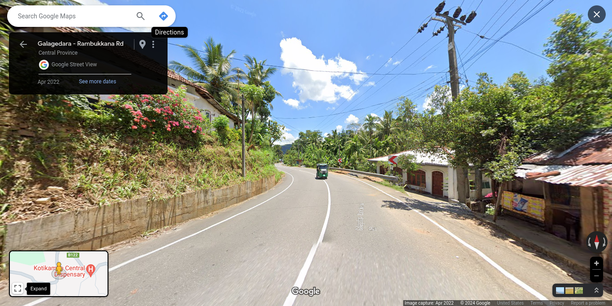

## Dickwella North

**Dickwella North** Grama Niladhari Division, **Dickwella** Divisional Secretariat Division, **Matara** District, **Southern** Province

**Devinuwara** Polling Division, **Matara** Electoral District

Population: 1,907 (2012)

(**LK-3248115**/452)

## Pattalagedara East

**Pattalagedara East** Grama Niladhari Division, **Attanagalla** Divisional Secretariat Division, **Gampaha** District, **Western** Province

**Attanagalla** Polling Division, **Gampaha** Electoral District

Population: 1,393 (2012)

(**LK-1227115**/328/B)

## Weerapokuna

**Weerapokuna** Grama Niladhari Division, **Bingiriya** Divisional Secretariat Division, **Kurunegala** District, **North Western** Province

**Bingiriya** Polling Division, **Kurunegala** Electoral District

Population: 1,035 (2012)

(**LK-6142055**/1445)

## Wattegama

**Wattegama** Grama Niladhari Division, **Dickwella** Divisional Secretariat Division, **Matara** District, **Southern** Province

**Devinuwara** Polling Division, **Matara** Electoral District

Population: 1,135 (2012)

(**LK-3248090**/451)

## Kalmunaikudi 13

**Kalmunaikudi 13** Grama Niladhari Division, **Kalmunai** Divisional Secretariat Division, **Ampara** District, **Eastern** Province

**Kalmunai** Polling Division, **Digamadulla** Electoral District

Population: 1,620 (2012)

(**LK-5224140**/KP/54A)

## Ihala Muruthawela

**Ihala Muruthawela** Grama Niladhari Division, **Walasmulla** Divisional Secretariat Division, **Hambantota** District, **Southern** Province

**Mulkirigala** Polling Division, **Hambantota** Electoral District

Population: 742 (2012)

(**LK-3325165**/434)

## Ketakumbura

**Ketakumbura** Grama Niladhari Division, **Udunuwara** Divisional Secretariat Division, **Kandy** District, **Central** Province

**Udunuwara** Polling Division, **Kandy** Electoral District

Population: 1,565 (2012)

(**LK-2139455**/56)

## Watapuluwa

**Watapuluwa** Grama Niladhari Division, **Kandy Four Gravets & Gangawata Korale** Divisional Secretariat Division, **Kandy** District, **Central** Province

**Senkadagala** Polling Division, **Kandy** Electoral District

Population: 1,987 (2012)

(**LK-2130035**/228)

## Vantharumoolai East

**Vantharumoolai East** Grama Niladhari Division, **Eravur Pattu** Divisional Secretariat Division, **Batticaloa** District, **Eastern** Province

**Kalkudah** Polling Division, **Batticaloa** Electoral District

Population: 3,950 (2012)

(**LK-5112065**/197)

## Sinhala Town

**Sinhala Town** Grama Niladhari Division, **Matale** Divisional Secretariat Division, **Matale** District, **Central** Province

**Matale** Polling Division, **Matale** Electoral District

Population: 1,359 (2012)

(**LK-2218205**/E352A)

## Pahala Biyanvila West

**Pahala Biyanvila West** Grama Niladhari Division, **Biyagama** Divisional Secretariat Division, **Gampaha** District, **Western** Province

**Biyagama** Polling Division, **Gampaha** Electoral District

Population: 4,708 (2012)

(**LK-1239095**/268A)

## Ganthalawa Unit 11

**Ganthalawa Unit 11** Grama Niladhari Division, **Kanthale** Divisional Secretariat Division, **Trincomalee** District, **Eastern** Province

**Seruvila** Polling Division, **Trincomalee** Electoral District

Population: 890 (2012)

(**LK-5321015**/227P)

## Paragala

**Paragala** Grama Niladhari Division, **Ayagama** Divisional Secretariat Division, **Ratnapura** District, **Sabaragamuwa** Province

**Kalawana** Polling Division, **Ratnapura** Electoral District

Population: 1,260 (2012)

(**LK-9130095**/194)

## Welihena North

**Welihena North** Grama Niladhari Division, **Katana** Divisional Secretariat Division, **Gampaha** District, **Western** Province

**Katana** Polling Division, **Gampaha** Electoral District

Population: 1,823 (2012)

(**LK-1206060**/69)

## Uda Bowala

**Uda Bowala** Grama Niladhari Division, **Kandy Four Gravets & Gangawata Korale** Divisional Secretariat Division, **Kandy** District, **Central** Province

**Senkadagala** Polling Division, **Kandy** Electoral District

Population: 4,127 (2012)

(**LK-2130200**/244)

## Mahawattagama

**Mahawattagama** Grama Niladhari Division, **Hali-Ela** Divisional Secretariat Division, **Badulla** District, **Uva** Province

**Hali Ela** Polling Division, **Badulla** Electoral District

Population: 3,050 (2012)

(**LK-8124070**/82C)

## Dimuthugama

**Dimuthugama** Grama Niladhari Division, **Welimada** Divisional Secretariat Division, **Badulla** District, **Uva** Province

**Welimada** Polling Division, **Badulla** Electoral District

Population: 2,078 (2012)

(**LK-8130070**/50H)

## Kolamediriya North

**Kolamediriya North** Grama Niladhari Division, **Bandaragama** Divisional Secretariat Division, **Kalutara** District, **Western** Province

**Bandaragama** Polling Division, **Kalutara** Electoral District

Population: 1,133 (2012)

(**LK-1306185**/657A)

## Diviyagahawela

**Diviyagahawela** Grama Niladhari Division, **Karandeniya** Divisional Secretariat Division, **Galle** District, **Southern** Province

**Karandeniya** Polling Division, **Galle** Electoral District

Population: 2,587 (2012)

(**LK-3109170**/92C)

## Palle Peradeniya

**Palle Peradeniya** Grama Niladhari Division, **Kandy Four Gravets & Gangawata Korale** Divisional Secretariat Division, **Kandy** District, **Central** Province

**Senkadagala** Polling Division, **Kandy** Electoral District

Population: 4,942 (2012)

(**LK-2130195**/248)

## Uda Bowala

**Uda Bowala** Grama Niladhari Division, **Kandy Four Gravets & Gangawata Korale** Divisional Secretariat Division, **Kandy** District, **Central** Province

**Senkadagala** Polling Division, **Kandy** Electoral District

Population: 4,127 (2012)

(**LK-2130200**/244)

## Kadalana

**Kadalana** Grama Niladhari Division, **Moratuwa** Divisional Secretariat Division, **Colombo** District, **Western** Province

**Moratuwa** Polling Division, **Colombo** Electoral District

Population: 3,544 (2012)

(**LK-1133105**/558A)

## Thenagama North

**Thenagama North** Grama Niladhari Division, **Tangalle** Divisional Secretariat Division, **Hambantota** District, **Southern** Province

**Beliatta** Polling Division, **Hambantota** Electoral District

Population: 436 (2012)

(**LK-3333080**/305)

## Jinthupitiya

**Jinthupitiya** Grama Niladhari Division, **Colombo** Divisional Secretariat Division, **Colombo** District, **Western** Province

**Colombo Central** Polling Division, **Colombo** Electoral District

Population: 8,110 (2012)

(**LK-1103060**/)

## Thoppuwa

**Thoppuwa** Grama Niladhari Division, **Katana** Divisional Secretariat Division, **Gampaha** District, **Western** Province

**Katana** Polling Division, **Gampaha** Electoral District

Population: 2,914 (2012)

(**LK-1206020**/65A)

## Balayawewa

**Balayawewa** Grama Niladhari Division, **Padaviya** Divisional Secretariat Division, **Anuradhapura** District, **North Central** Province

**Medawachchiya** Polling Division, **Anuradhapura** Electoral District

Population: 940 (2012)

(**LK-7103045**/15)

## Bandaragama West

**Bandaragama West** Grama Niladhari Division, **Bandaragama** Divisional Secretariat Division, **Kalutara** District, **Western** Province

**Bandaragama** Polling Division, **Kalutara** Electoral District

Population: 1,895 (2012)

(**LK-1306235**/663B)

## Unanvitiya East

**Unanvitiya East** Grama Niladhari Division, **Nagoda** Divisional Secretariat Division, **Galle** District, **Southern** Province

**Hiniduma** Polling Division, **Galle** Electoral District

Population: 738 (2012)

(**LK-3124200**/211B)

## Rathmalkatuwa

**Rathmalkatuwa** Grama Niladhari Division, **Dambulla** Divisional Secretariat Division, **Matale** District, **Central** Province

**Dambulla** Polling Division, **Matale** Electoral District

Population: 1,166 (2012)

(**LK-2206095**/E451C)

## Yabaraluwa South

**Yabaraluwa South** Grama Niladhari Division, **Biyagama** Divisional Secretariat Division, **Gampaha** District, **Western** Province

**Biyagama** Polling Division, **Gampaha** Electoral District

Population: 2,076 (2012)

(**LK-1239235**/280E)

## Maitipe

**Maitipe** Grama Niladhari Division, **Galle Four Gravets** Divisional Secretariat Division, **Galle** District, **Southern** Province

**Galle** Polling Division, **Galle** Electoral District

Population: 1,875 (2012)

(**LK-3139080**/101)

## Abasingama

**Abasingama** Grama Niladhari Division, **Pathadumbara** Divisional Secretariat Division, **Kandy** District, **Central** Province

**Pathadumbara** Polling Division, **Kandy** Electoral District

Population: 1,175 (2012)

(**LK-2112255**/635)

## Arali Centre

**Arali Centre** Grama Niladhari Division, **Valikamam West (Chankanai)** Divisional Secretariat Division, **Jaffna** District, **Northern** Province

**Vaddukoddai** Polling Division, **Jaffna** Electoral District

Population: 1,968 (2012)

(**LK-4106025**/J/161)

## Sammanthurai 05

**Sammanthurai 05** Grama Niladhari Division, **Samanthurai** Divisional Secretariat Division, **Ampara** District, **Eastern** Province

**Samanthurai** Polling Division, **Digamadulla** Electoral District

Population: 814 (2012)

(**LK-5218045**/78B)

## Dedigamuwa

**Dedigamuwa** Grama Niladhari Division, **Kaduwela** Divisional Secretariat Division, **Colombo** District, **Western** Province

**Kaduwela** Polling Division, **Colombo** Electoral District

Population: 2,105 (2012)

(**LK-1109100**/480A)

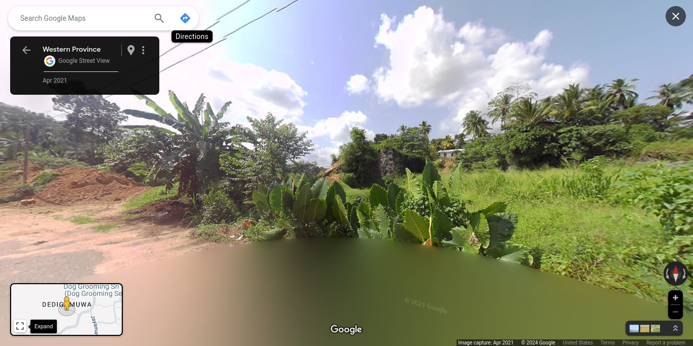

## Puloly West

**Puloly West** Grama Niladhari Division, **Vadamaradchi North (Point Pedro)** Divisional Secretariat Division, **Jaffna** District, **Northern** Province

**Point Pedro** Polling Division, **Jaffna** Electoral District

Population: 1,367 (2012)

(**LK-4127140**/J/410)

## Pinwatta

**Pinwatta** Grama Niladhari Division, **Panadura** Divisional Secretariat Division, **Kalutara** District, **Western** Province

**Panadura** Polling Division, **Kalutara** Electoral District

Population: 3,409 (2012)

(**LK-1303295**/696)

## Nagoda Ihala

**Nagoda Ihala** Grama Niladhari Division, **Nagoda** Divisional Secretariat Division, **Galle** District, **Southern** Province

**Hiniduma** Polling Division, **Galle** Electoral District

Population: 737 (2012)

(**LK-3124090**/216A)

## Walpita South

**Walpita South** Grama Niladhari Division, **Baddegama** Divisional Secretariat Division, **Galle** District, **Southern** Province

**Baddegama** Polling Division, **Galle** Electoral District

Population: 1,127 (2012)

(**LK-3127260**/206A)

## Wekada East

**Wekada East** Grama Niladhari Division, **Panadura** Divisional Secretariat Division, **Kalutara** District, **Western** Province

**Panadura** Polling Division, **Kalutara** Electoral District

Population: 3,071 (2012)

(**LK-1303225**/687A)

## Puliyanthivu Central

**Puliyanthivu Central** Grama Niladhari Division, **Manmunai North** Divisional Secretariat Division, **Batticaloa** District, **Eastern** Province

**Batticaloa** Polling Division, **Batticaloa** Electoral District

Population: 1,098 (2012)

(**LK-5118175**/179B)

## Bogahamaditta

**Bogahamaditta** Grama Niladhari Division, **Hali-Ela** Divisional Secretariat Division, **Badulla** District, **Uva** Province

**Hali Ela** Polling Division, **Badulla** Electoral District

Population: 2,736 (2012)

(**LK-8124065**/74B)

## Chunnakam Town North

**Chunnakam Town North** Grama Niladhari Division, **Valikamam South (Uduvil)** Divisional Secretariat Division, **Jaffna** District, **Northern** Province

**Manipay** Polling Division, **Jaffna** Electoral District

Population: 1,227 (2012)

(**LK-4115070**/J/195)

## Pelawatta

**Pelawatta** Grama Niladhari Division, **Bope-Poddala** Divisional Secretariat Division, **Galle** District, **Southern** Province

**Akmeemana** Polling Division, **Galle** Electoral District

Population: 1,370 (2012)

(**LK-3142160**/123B)

## Gongawela

**Gongawela** Grama Niladhari Division, **Matale** Divisional Secretariat Division, **Matale** District, **Central** Province

**Matale** Polling Division, **Matale** Electoral District

Population: 2,903 (2012)

(**LK-2218200**/E352B)

## Bulugahagoda East

**Bulugahagoda East** Grama Niladhari Division, **Gampaha** Divisional Secretariat Division, **Gampaha** District, **Western** Province

**Gampaha** Polling Division, **Gampaha** Electoral District

Population: 1,029 (2012)

(**LK-1224220**/210)

## Damahana

**Damahana** Grama Niladhari Division, **Balangoda** Divisional Secretariat Division, **Ratnapura** District, **Sabaragamuwa** Province

**Balangoda** Polling Division, **Ratnapura** Electoral District

Population: 1,426 (2012)

(**LK-9118210**/252)

## Pandiruppu 01

**Pandiruppu 01** Grama Niladhari Division, **Kalmunai Tamil Division** Divisional Secretariat Division, **Ampara** District, **Eastern** Province

**Kalmunai** Polling Division, **Digamadulla** Electoral District

Population: 941 (2012)

(**LK-5221030**/KP/66/1)

## Kaluwana North

**Kaluwana North** Grama Niladhari Division, **Pujapitiya** Divisional Secretariat Division, **Kandy** District, **Central** Province

**Harispattuwa** Polling Division, **Kandy** Electoral District

Population: 560 (2012)

(**LK-2106335**/556)

## Nagolla

**Nagolla** Grama Niladhari Division, **Ukuwela** Divisional Secretariat Division, **Matale** District, **Central** Province

**Rattota** Polling Division, **Matale** Electoral District

Population: 1,827 (2012)

(**LK-2233185**/E355D)

## Walagepiyadda

**Walagepiyadda** Grama Niladhari Division, **Athuraliya** Divisional Secretariat Division, **Matara** District, **Southern** Province

**Akuressa** Polling Division, **Matara** Electoral District

Population: 1,081 (2012)

(**LK-3215090**/313C)

## Pahala Vitiyala East

**Pahala Vitiyala East** Grama Niladhari Division, **Thihagoda** Divisional Secretariat Division, **Matara** District, **Southern** Province

**Kamburupitiya** Polling Division, **Matara** Electoral District

Population: 698 (2012)

(**LK-3236015**/343)

## Rawanaella

**Rawanaella** Grama Niladhari Division, **Ella** Divisional Secretariat Division, **Badulla** District, **Uva** Province

**Bandarawela** Polling Division, **Badulla** Electoral District

Population: 509 (2012)

(**LK-8136130**/69F)

## Makandana west

**Makandana west** Grama Niladhari Division, **Kesbewa** Divisional Secretariat Division, **Colombo** District, **Western** Province

**Kesbewa** Polling Division, **Colombo** Electoral District

Population: 4,434 (2012)

(**LK-1136315**/569A)

## Singhapura

**Singhapura** Grama Niladhari Division, **Kolonnawa** Divisional Secretariat Division, **Colombo** District, **Western** Province

**Kolonnawa** Polling Division, **Colombo** Electoral District

Population: 4,078 (2012)

(**LK-1106120**/512B)

## Mampitiya

**Mampitiya** Grama Niladhari Division, **Udunuwara** Divisional Secretariat Division, **Kandy** District, **Central** Province

**Udunuwara** Polling Division, **Kandy** Electoral District

Population: 1,142 (2012)

(**LK-2139115**/7)

## Koralawella South

**Koralawella South** Grama Niladhari Division, **Moratuwa** Divisional Secretariat Division, **Colombo** District, **Western** Province

**Moratuwa** Polling Division, **Colombo** Electoral District

Population: 3,582 (2012)

(**LK-1133185**/554A)

## Maligagodella

**Maligagodella** Grama Niladhari Division, **Kolonnawa** Divisional Secretariat Division, **Colombo** District, **Western** Province

**Kolonnawa** Polling Division, **Colombo** Electoral District

Population: 2,083 (2012)

(**LK-1106160**/502B)

## Karainagar South

**Karainagar South** Grama Niladhari Division, **Karainagar** Divisional Secretariat Division, **Jaffna** District, **Northern** Province

**Vaddukoddai** Polling Division, **Jaffna** Electoral District

Population: 1,250 (2012)

(**LK-4104040**/J/44)

## Marakkalahawatta

**Marakkalahawatta** Grama Niladhari Division, **Beruwala** Divisional Secretariat Division, **Kalutara** District, **Western** Province

**Beruwala** Polling Division, **Kalutara** Electoral District

Population: 3,937 (2012)

(**LK-1324215**/747A)

## Siddamulla North

**Siddamulla North** Grama Niladhari Division, **Homagama** Divisional Secretariat Division, **Colombo** District, **Western** Province

**Homagama** Polling Division, **Colombo** Electoral District

Population: 2,429 (2012)

(**LK-1112220**/591)

## Wattegedara

**Wattegedara** Grama Niladhari Division, **Maharagama** Divisional Secretariat Division, **Colombo** District, **Western** Province

**Maharagama** Polling Division, **Colombo** Electoral District

Population: 7,734 (2012)

(**LK-1121185**/532C)

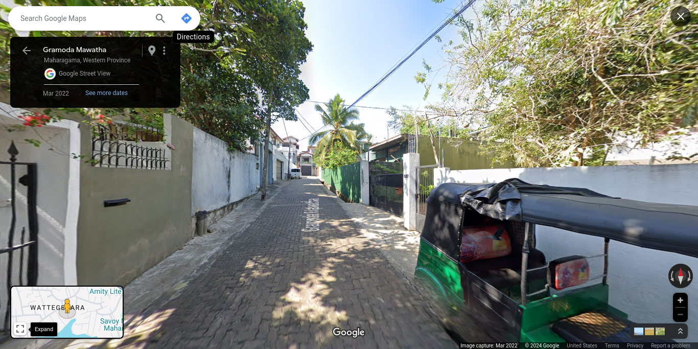

## Yakagala

**Yakagala** Grama Niladhari Division, **Angunakolapelessa** Divisional Secretariat Division, **Hambantota** District, **Southern** Province

**Tangalle** Polling Division, **Hambantota** Electoral District

Population: 2,508 (2012)

(**LK-3318225**/189)

## Methagama

**Methagama** Grama Niladhari Division, **Kothmale** Divisional Secretariat Division, **Nuwara Eliya** District, **Central** Province

**Kothmale** Polling Division, **Nuwara-Eliya** Electoral District

Population: 660 (2012)

(**LK-2303335**/466)

## Vidathaltheevu Central

**Vidathaltheevu Central** Grama Niladhari Division, **Manthai West** Divisional Secretariat Division, **Mannar** District, **Northern** Province

**Mannar** Polling Division, **Vanni** Electoral District

Population: 51 (2012)

(**LK-4206080**/12)

## Padagoda

**Padagoda** Grama Niladhari Division, **Beruwala** Divisional Secretariat Division, **Kalutara** District, **Western** Province

**Beruwala** Polling Division, **Kalutara** Electoral District

Population: 1,461 (2012)

(**LK-1324275**/768)

## Uggalla

**Uggalla** Grama Niladhari Division, **Harispattuwa** Divisional Secretariat Division, **Kandy** District, **Central** Province

**Harispattuwa** Polling Division, **Kandy** Electoral District

Population: 825 (2012)

(**LK-2133315**/427)

## Gonavila North

**Gonavila North** Grama Niladhari Division, **Dankotuwa** Divisional Secretariat Division, **Puttalam** District, **North Western** Province

**Wennappuwa** Polling Division, **Puttalam** Electoral District

Population: 660 (2012)

(**LK-6248110**/477)

## Kurunduwatta

**Kurunduwatta** Grama Niladhari Division, **Balapitiya** Divisional Secretariat Division, **Galle** District, **Southern** Province

**Balapitiya** Polling Division, **Galle** Electoral District

Population: 1,178 (2012)

(**LK-3106220**/87F)

## Horagolla South

**Horagolla South** Grama Niladhari Division, **Gampaha** Divisional Secretariat Division, **Gampaha** District, **Western** Province

**Gampaha** Polling Division, **Gampaha** Electoral District

Population: 1,945 (2012)

(**LK-1224230**/216A)

## Meemana

**Meemana** Grama Niladhari Division, **Horana** Divisional Secretariat Division, **Kalutara** District, **Western** Province

**Horana** Polling Division, **Kalutara** Electoral District

Population: 2,157 (2012)

(**LK-1309180**/611A)

## Badulla East

**Badulla East** Grama Niladhari Division, **Badulla** Divisional Secretariat Division, **Badulla** District, **Uva** Province

**Badulla** Polling Division, **Badulla** Electoral District

Population: 4,159 (2012)

(**LK-8121090**/78B)

## Kudagala Kadirandola

**Kudagala Kadirandola** Grama Niladhari Division, **Elpitiya** Divisional Secretariat Division, **Galle** District, **Southern** Province

**Bentara Elpitiya** Polling Division, **Galle** Electoral District

Population: 1,584 (2012)

(**LK-3112190**/26C)

## Sainthamaruthu 04

**Sainthamaruthu 04** Grama Niladhari Division, **Sainthamaruthu** Divisional Secretariat Division, **Ampara** District, **Eastern** Province

**Kalmunai** Polling Division, **Digamadulla** Electoral District

Population: 1,325 (2012)

(**LK-5225020**/KP/52B)

## Puloly South

**Puloly South** Grama Niladhari Division, **Vadamaradchi North (Point Pedro)** Divisional Secretariat Division, **Jaffna** District, **Northern** Province

**Point Pedro** Polling Division, **Jaffna** Electoral District

Population: 853 (2012)

(**LK-4127160**/J/414)

## Naotunna North

**Naotunna North** Grama Niladhari Division, **Devinuwara** Divisional Secretariat Division, **Matara** District, **Southern** Province

**Devinuwara** Polling Division, **Matara** Electoral District

Population: 782 (2012)

(**LK-3245065**/442C)

## Neduna

**Neduna** Grama Niladhari Division, **Gampaha** Divisional Secretariat Division, **Gampaha** District, **Western** Province

**Gampaha** Polling Division, **Gampaha** Electoral District

Population: 1,356 (2012)

(**LK-1224235**/236C)

## Ranawana East

**Ranawana East** Grama Niladhari Division, **Harispattuwa** Divisional Secretariat Division, **Kandy** District, **Central** Province

**Harispattuwa** Polling Division, **Kandy** Electoral District

Population: 1,605 (2012)

(**LK-2133185**/410)

## Manduvil

**Manduvil** Grama Niladhari Division, **Thenmaradchi (Chavakachcheri)** Divisional Secretariat Division, **Jaffna** District, **Northern** Province

**Chavakachcheri** Polling Division, **Jaffna** Electoral District

Population: 1,080 (2012)

(**LK-4130085**/J/304)

## Mattegoda West

**Mattegoda West** Grama Niladhari Division, **Homagama** Divisional Secretariat Division, **Colombo** District, **Western** Province

**Homagama** Polling Division, **Colombo** Electoral District

Population: 4,931 (2012)

(**LK-1112230**/587)

## Kotavila West

**Kotavila West** Grama Niladhari Division, **Weligama** Divisional Secretariat Division, **Matara** District, **Southern** Province

**Weligama** Polling Division, **Matara** Electoral District

Population: 1,399 (2012)

(**LK-3239075**/404B)

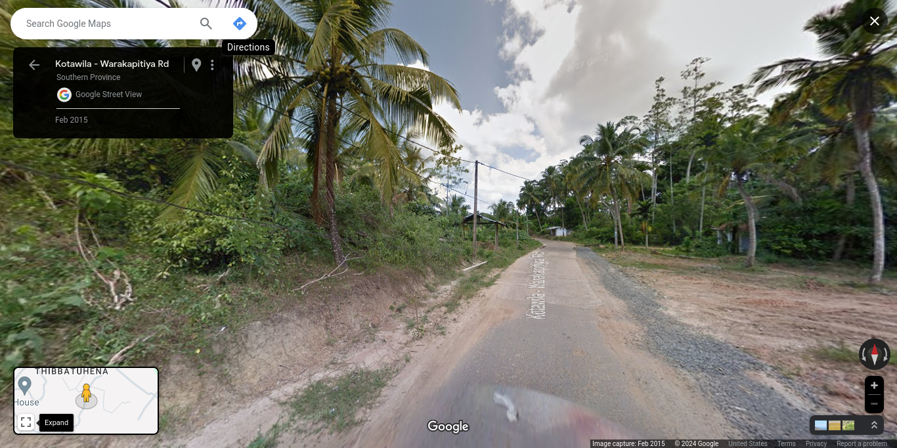

## Namadagaswewa

**Namadagaswewa** Grama Niladhari Division, **Sooriyawewa** Divisional Secretariat Division, **Hambantota** District, **Southern** Province

**Thissamaharama** Polling Division, **Hambantota** Electoral District

Population: 1,740 (2012)

(**LK-3303085**/110)

## Mallakam North

**Mallakam North** Grama Niladhari Division, **Valikamam North (Tellipallai)** Divisional Secretariat Division, **Jaffna** District, **Northern** Province

**Kayts** Polling Division, **Jaffna** Electoral District

Population: 2,493 (2012)

(**LK-4112015**/214)

## Malpettawa

**Malpettawa** Grama Niladhari Division, **Ambalantota** Divisional Secretariat Division, **Hambantota** District, **Southern** Province

**Tangalle** Polling Division, **Hambantota** Electoral District

Population: 1,092 (2012)

(**LK-3315250**/148)

## Vishwakalawa

**Vishwakalawa** Grama Niladhari Division, **Kesbewa** Divisional Secretariat Division, **Colombo** District, **Western** Province

**Kesbewa** Polling Division, **Colombo** Electoral District

Population: 2,045 (2012)

(**LK-1136080**/574B)

## Raddolugama South

**Raddolugama South** Grama Niladhari Division, **Katana** Divisional Secretariat Division, **Gampaha** District, **Western** Province

**Katana** Polling Division, **Gampaha** Electoral District

Population: 1,894 (2012)

(**LK-1206310**/199B)

## Maragahadeniya

**Maragahadeniya** Grama Niladhari Division, **Palindanuwara** Divisional Secretariat Division, **Kalutara** District, **Western** Province

**Agalawatta** Polling Division, **Kalutara** Electoral District

Population: 2,315 (2012)

(**LK-1336075**/835C)

## Medakekila

**Medakekila** Grama Niladhari Division, **Deltota** Divisional Secretariat Division, **Kandy** District, **Central** Province

**Hewaheta** Polling Division, **Kandy** Electoral District

Population: 697 (2012)

(**LK-2148060**/1037)

## Pattivila North

**Pattivila North** Grama Niladhari Division, **Biyagama** Divisional Secretariat Division, **Gampaha** District, **Western** Province

**Biyagama** Polling Division, **Gampaha** Electoral District

Population: 2,048 (2012)

(**LK-1239185**/279)

## Boralesgamuwa West B

**Boralesgamuwa West B** Grama Niladhari Division, **Kesbewa** Divisional Secretariat Division, **Colombo** District, **Western** Province

**Kesbewa** Polling Division, **Colombo** Electoral District

Population: 2,822 (2012)

(**LK-1136055**/533E)

## Wadduwa West

**Wadduwa West** Grama Niladhari Division, **Panadura** Divisional Secretariat Division, **Kalutara** District, **Western** Province

**Panadura** Polling Division, **Kalutara** Electoral District

Population: 1,392 (2012)

(**LK-1303320**/699)

## Yakkala South

**Yakkala South** Grama Niladhari Division, **Gampaha** Divisional Secretariat Division, **Gampaha** District, **Western** Province

**Gampaha** Polling Division, **Gampaha** Electoral District

Population: 1,892 (2012)

(**LK-1224305**/231C)

## Kiripedda

**Kiripedda** Grama Niladhari Division, **Karandeniya** Divisional Secretariat Division, **Galle** District, **Southern** Province

**Karandeniya** Polling Division, **Galle** Electoral District

Population: 863 (2012)

(**LK-3109180**/93A)

## Malewana

**Malewana** Grama Niladhari Division, **Beruwala** Divisional Secretariat Division, **Kalutara** District, **Western** Province

**Beruwala** Polling Division, **Kalutara** Electoral District

Population: 2,442 (2012)

(**LK-1324340**/766F)

## Kirindawa

**Kirindawa** Grama Niladhari Division, **Kuliyapitiya West** Divisional Secretariat Division, **Kurunegala** District, **North Western** Province

**Kuliyapitiya** Polling Division, **Kurunegala** Electoral District

Population: 1,066 (2012)

(**LK-6172155**/1143)

## Marassana

**Marassana** Grama Niladhari Division, **Pathahewaheta** Divisional Secretariat Division, **Kandy** District, **Central** Province

**Hewaheta** Polling Division, **Kandy** Electoral District

Population: 786 (2012)

(**LK-2145235**/1007)

## Uyanwatta

**Uyanwatta** Grama Niladhari Division, **Harispattuwa** Divisional Secretariat Division, **Kandy** District, **Central** Province

**Harispattuwa** Polling Division, **Kandy** Electoral District

Population: 924 (2012)

(**LK-2133205**/491)

## Nivandama North

**Nivandama North** Grama Niladhari Division, **Ja-Ela** Divisional Secretariat Division, **Gampaha** District, **Western** Province

**Ja Ela** Polling Division, **Gampaha** Electoral District

Population: 3,458 (2012)

(**LK-1221090**/207)

## Samagipura

**Samagipura** Grama Niladhari Division, **Ratnapura** Divisional Secretariat Division, **Ratnapura** District, **Sabaragamuwa** Province

**Ratnapura** Polling Division, **Ratnapura** Electoral District

Population: 3,015 (2012)

(**LK-9112235**/182C)

## Jaffna Town East

**Jaffna Town East** Grama Niladhari Division, **Jaffna** Divisional Secretariat Division, **Jaffna** District, **Northern** Province

**Jaffna** Polling Division, **Jaffna** Electoral District

Population: 1,988 (2012)

(**LK-4136070**/J/74)

## Viruthodai

**Viruthodai** Grama Niladhari Division, **Mundel** Divisional Secretariat Division, **Puttalam** District, **North Western** Province

**Puttalam** Polling Division, **Puttalam** Electoral District

Population: 3,232 (2012)

(**LK-6218010**/601)

## Bowatta

**Bowatta** Grama Niladhari Division, **Pannala** Divisional Secretariat Division, **Kurunegala** District, **North Western** Province

**Katugampola** Polling Division, **Kurunegala** Electoral District

Population: 1,326 (2012)

(**LK-6178185**/1533)

## Mirihana South

**Mirihana South** Grama Niladhari Division, **Maharagama** Divisional Secretariat Division, **Colombo** District, **Western** Province

**Maharagama** Polling Division, **Colombo** Electoral District

Population: 6,043 (2012)

(**LK-1121005**/523A)

## Batuwandara North

**Batuwandara North** Grama Niladhari Division, **Kesbewa** Divisional Secretariat Division, **Colombo** District, **Western** Province

**Kesbewa** Polling Division, **Colombo** Electoral District

Population: 1,545 (2012)

(**LK-1136340**/596)

## Weerakumandaluwa

**Weerakumandaluwa** Grama Niladhari Division, **Arachchikattuwa** Divisional Secretariat Division, **Puttalam** District, **North Western** Province

**Chilaw** Polling Division, **Puttalam** Electoral District

Population: 2,556 (2012)

(**LK-6230150**/574)

## Udayarthoppuwa South

**Udayarthoppuwa South** Grama Niladhari Division, **Negombo** Divisional Secretariat Division, **Gampaha** District, **Western** Province

**Negombo** Polling Division, **Gampaha** Electoral District

Population: 2,475 (2012)

(**LK-1203145**/160B)

## Walawwatta

**Walawwatta** Grama Niladhari Division, **Galle Four Gravets** Divisional Secretariat Division, **Galle** District, **Southern** Province

**Galle** Polling Division, **Galle** Electoral District

Population: 1,640 (2012)

(**LK-3139140**/102B)

## Sooriyapaluwa East

**Sooriyapaluwa East** Grama Niladhari Division, **Mahara** Divisional Secretariat Division, **Gampaha** District, **Western** Province

**Mahara** Polling Division, **Gampaha** Electoral District

Population: 4,970 (2012)

(**LK-1233285**/245B)

## Eravur 05

**Eravur 05** Grama Niladhari Division, **Eravur Town** Divisional Secretariat Division, **Batticaloa** District, **Eastern** Province

**Batticaloa** Polling Division, **Batticaloa** Electoral District

Population: 1,526 (2012)

(**LK-5115075**/194A)

## Putupagala

**Putupagala** Grama Niladhari Division, **Dompe** Divisional Secretariat Division, **Gampaha** District, **Western** Province

**Dompe** Polling Division, **Gampaha** Electoral District

Population: 1,248 (2012)

(**LK-1230340**/396)

## Akurugoda South

**Akurugoda South** Grama Niladhari Division, **Malimbada** Divisional Secretariat Division, **Matara** District, **Southern** Province

**Akuressa** Polling Division, **Matara** Electoral District

Population: 1,770 (2012)

(**LK-3224125**/400B)

## Mancholai

**Mancholai** Grama Niladhari Division, **Kinniya** Divisional Secretariat Division, **Trincomalee** District, **Eastern** Province

**Muttur** Polling Division, **Trincomalee** Electoral District

Population: 2,603 (2012)

(**LK-5324015**/225C)

## Ambanwala

**Ambanwala** Grama Niladhari Division, **Udunuwara** Divisional Secretariat Division, **Kandy** District, **Central** Province

**Udunuwara** Polling Division, **Kandy** Electoral District

Population: 649 (2012)

(**LK-2139350**/105)

## Medirigiriya

**Medirigiriya** Grama Niladhari Division, **Medirigiriya** Divisional Secretariat Division, **Polonnaruwa** District, **North Central** Province

**Medirigiriya** Polling Division, **Polonnaruwa** Electoral District

Population: 2,828 (2012)

(**LK-7206160**/87)

## Central Camp 06

**Central Camp 06** Grama Niladhari Division, **Navithanveli** Divisional Secretariat Division, **Ampara** District, **Eastern** Province

**Samanthurai** Polling Division, **Digamadulla** Electoral District

Population: 1,106 (2012)

(**LK-5216025**/SP/93/F)

## Kumarapuram

**Kumarapuram** Grama Niladhari Division, **Kandavalai** Divisional Secretariat Division, **Kilinochchi** District, **Northern** Province

**Kilinochchi** Polling Division, **Jaffna** Electoral District

Population: 1,145 (2012)

(**LK-4506025**/KN/43)

## Dangaswewa

**Dangaswewa** Grama Niladhari Division, **Karuwalagaswewa** Divisional Secretariat Division, **Puttalam** District, **North Western** Province

**Anamaduwa** Polling Division, **Puttalam** Electoral District

Population: 663 (2012)

(**LK-6209065**/642C)

## Radawadunna Pahala

**Radawadunna Pahala** Grama Niladhari Division, **Mirigama** Divisional Secretariat Division, **Gampaha** District, **Western** Province

**Mirigama** Polling Division, **Gampaha** Electoral District

Population: 726 (2012)

(**LK-1212660**/360A)

## Ariyalai North West

**Ariyalai North West** Grama Niladhari Division, **Nallur** Divisional Secretariat Division, **Jaffna** District, **Northern** Province

**Nallur** Polling Division, **Jaffna** Electoral District

Population: 1,831 (2012)

(**LK-4133015**/J/91)

## Rukmale East A

**Rukmale East A** Grama Niladhari Division, **Maharagama** Divisional Secretariat Division, **Colombo** District, **Western** Province

**Maharagama** Polling Division, **Colombo** Electoral District

Population: 1,259 (2012)

(**LK-1121045**/497A)

## Hendala South

**Hendala South** Grama Niladhari Division, **Wattala** Divisional Secretariat Division, **Gampaha** District, **Western** Province

**Wattala** Polling Division, **Gampaha** Electoral District

Population: 4,067 (2012)

(**LK-1218190**/172)

## Bulumulla

**Bulumulla** Grama Niladhari Division, **Yatinuwara** Divisional Secretariat Division, **Kandy** District, **Central** Province

**Yatinuwara** Polling Division, **Kandy** Electoral District

Population: 1,288 (2012)

(**LK-2136390**/125)

## Balangoda

**Balangoda** Grama Niladhari Division, **Balangoda** Divisional Secretariat Division, **Ratnapura** District, **Sabaragamuwa** Province

**Balangoda** Polling Division, **Ratnapura** Electoral District

Population: 3,821 (2012)

(**LK-9118140**/256)

## Weralugampala

**Weralugampala** Grama Niladhari Division, **Dompe** Divisional Secretariat Division, **Gampaha** District, **Western** Province

**Dompe** Polling Division, **Gampaha** Electoral District

Population: 647 (2012)

(**LK-1230210**/392A)

## Sammanthurai 04

**Sammanthurai 04** Grama Niladhari Division, **Samanthurai** Divisional Secretariat Division, **Ampara** District, **Eastern** Province

**Samanthurai** Polling Division, **Digamadulla** Electoral District

Population: 846 (2012)

(**LK-5218085**/78A)

## Akkaraipattu 8/1

**Akkaraipattu 8/1** Grama Niladhari Division, **Alayadiwembu** Divisional Secretariat Division, **Ampara** District, **Eastern** Province

**Pothuvil** Polling Division, **Digamadulla** Electoral District

Population: 531 (2012)

(**LK-5239005**/AV/10)

## Dehigama

**Dehigama** Grama Niladhari Division, **Kuliyapitiya East** Divisional Secretariat Division, **Kurunegala** District, **North Western** Province

**Kuliyapitiya** Polling Division, **Kurunegala** Electoral District

Population: 1,486 (2012)

(**LK-6169065**/1117)

## Kirimetiyana South

**Kirimetiyana South** Grama Niladhari Division, **Dankotuwa** Divisional Secretariat Division, **Puttalam** District, **North Western** Province

**Wennappuwa** Polling Division, **Puttalam** Electoral District

Population: 894 (2012)

(**LK-6248060**/466E)

## Kalapaluwawa

**Kalapaluwawa** Grama Niladhari Division, **Kaduwela** Divisional Secretariat Division, **Colombo** District, **Western** Province

**Kaduwela** Polling Division, **Colombo** Electoral District

Population: 4,287 (2012)

(**LK-1109160**/491)

## Dandagamuwa West

**Dandagamuwa West** Grama Niladhari Division, **Kuliyapitiya West** Divisional Secretariat Division, **Kurunegala** District, **North Western** Province

**Kuliyapitiya** Polling Division, **Kurunegala** Electoral District

Population: 1,196 (2012)

(**LK-6172215**/1193)

## Happawana

**Happawana** Grama Niladhari Division, **Habaraduwa** Divisional Secretariat Division, **Galle** District, **Southern** Province

**Habaraduwa** Polling Division, **Galle** Electoral District

Population: 685 (2012)

(**LK-3154110**/151)

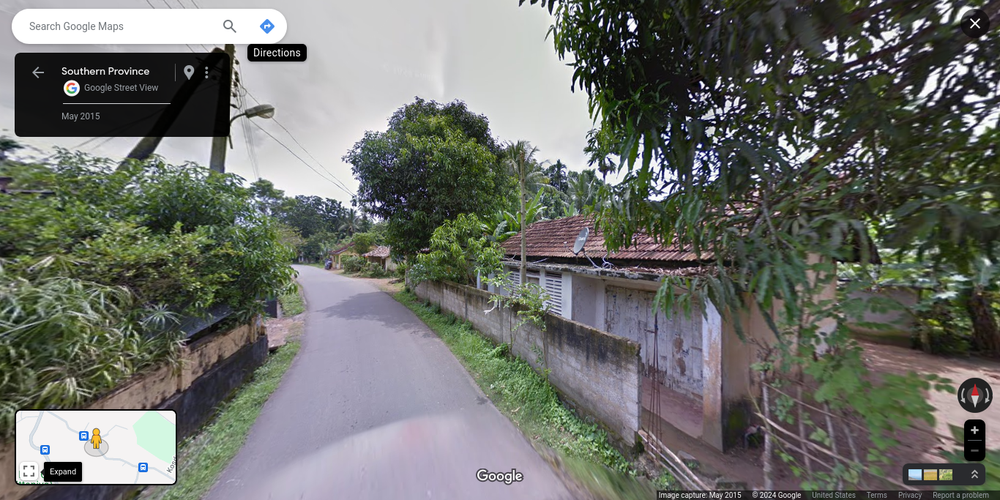

## Katuwawala South

**Katuwawala South** Grama Niladhari Division, **Kesbewa** Divisional Secretariat Division, **Colombo** District, **Western** Province

**Kesbewa** Polling Division, **Colombo** Electoral District

Population: 1,489 (2012)

(**LK-1136090**/578A)

## Sinharoopagama

**Sinharoopagama** Grama Niladhari Division, **Bentota** Divisional Secretariat Division, **Galle** District, **Southern** Province

**Bentara Elpitiya** Polling Division, **Galle** Electoral District

Population: 1,154 (2012)

(**LK-3103010**/3B)

## Ulukkulama

**Ulukkulama** Grama Niladhari Division, **Nuwaragam Palatha Central** Divisional Secretariat Division, **Anuradhapura** District, **North Central** Province

**Anuradhapura West** Polling Division, **Anuradhapura** Electoral District

Population: 1,669 (2012)

(**LK-7115200**/281)

## Boralesgamuwa East A

**Boralesgamuwa East A** Grama Niladhari Division, **Kesbewa** Divisional Secretariat Division, **Colombo** District, **Western** Province

**Kesbewa** Polling Division, **Colombo** Electoral District

Population: 4,842 (2012)

(**LK-1136050**/533)

## Kalmunaikudi 07

**Kalmunaikudi 07** Grama Niladhari Division, **Kalmunai** Divisional Secretariat Division, **Ampara** District, **Eastern** Province

**Kalmunai** Polling Division, **Digamadulla** Electoral District

Population: 1,423 (2012)

(**LK-5224120**/KP/56E)

## Welipenna West

**Welipenna West** Grama Niladhari Division, **Mathugama** Divisional Secretariat Division, **Kalutara** District, **Western** Province

**Mathugama** Polling Division, **Kalutara** Electoral District

Population: 2,791 (2012)

(**LK-1330180**/793)

## Akkaraipattu 20

**Akkaraipattu 20** Grama Niladhari Division, **Akkaraipattu** Divisional Secretariat Division, **Ampara** District, **Eastern** Province

**Samanthurai** Polling Division, **Digamadulla** Electoral District

Population: 1,337 (2012)

(**LK-5236110**/AP/20/1)

## Malabe West

**Malabe West** Grama Niladhari Division, **Kaduwela** Divisional Secretariat Division, **Colombo** District, **Western** Province

**Kaduwela** Polling Division, **Colombo** Electoral District

Population: 5,141 (2012)

(**LK-1109130**/476A)

## Eravur 03

**Eravur 03** Grama Niladhari Division, **Eravur Town** Divisional Secretariat Division, **Batticaloa** District, **Eastern** Province

**Batticaloa** Polling Division, **Batticaloa** Electoral District

Population: 3,193 (2012)

(**LK-5115015**/192)

## Nambadaluwa West

**Nambadaluwa West** Grama Niladhari Division, **Attanagalla** Divisional Secretariat Division, **Gampaha** District, **Western** Province

**Attanagalla** Polling Division, **Gampaha** Electoral District

Population: 408 (2012)

(**LK-1227195**/348/B)

## Badulla Central

**Badulla Central** Grama Niladhari Division, **Badulla** Divisional Secretariat Division, **Badulla** District, **Uva** Province

**Badulla** Polling Division, **Badulla** Electoral District

Population: 3,347 (2012)

(**LK-8121070**/78D)

## Udaperuwa

**Udaperuwa** Grama Niladhari Division, **Bandarawela** Divisional Secretariat Division, **Badulla** District, **Uva** Province

**Bandarawela** Polling Division, **Badulla** Electoral District

Population: 1,636 (2012)

(**LK-8133080**/66B)

## Muganagahapitiya

**Muganagahapitiya** Grama Niladhari Division, **Walapane** Divisional Secretariat Division, **Nuwara Eliya** District, **Central** Province

**Walapane** Polling Division, **Nuwara-Eliya** Electoral District

Population: 425 (2012)

(**LK-2309055**/519G)

## Kombala

**Kombala** Grama Niladhari Division, **Imaduwa** Divisional Secretariat Division, **Galle** District, **Southern** Province

**Habaraduwa** Polling Division, **Galle** Electoral District

Population: 831 (2012)

(**LK-3151045**/174)

## Kittampahuwa

**Kittampahuwa** Grama Niladhari Division, **Kolonnawa** Divisional Secretariat Division, **Colombo** District, **Western** Province

**Kolonnawa** Polling Division, **Colombo** Electoral District

Population: 5,761 (2012)

(**LK-1106045**/508)

## Ambadeniya

**Ambadeniya** Grama Niladhari Division, **Mawanella** Divisional Secretariat Division, **Kegalle** District, **Sabaragamuwa** Province

**Mawanella** Polling Division, **Kegalle** Electoral District

Population: 1,013 (2012)

(**LK-9206280**/37B)

## Olombewa

**Olombewa** Grama Niladhari Division, **Kekirawa** Divisional Secretariat Division, **Anuradhapura** District, **North Central** Province

**Kekirawa** Polling Division, **Anuradhapura** Electoral District

Population: 1,937 (2012)

(**LK-7154155**/638)

## Dalupatha

**Dalupatha** Grama Niladhari Division, **Negombo** Divisional Secretariat Division, **Gampaha** District, **Western** Province

**Negombo** Polling Division, **Gampaha** Electoral District

Population: 3,606 (2012)

(**LK-1203055**/72)

## Paranagampola

**Paranagampola** Grama Niladhari Division, **Kegalle** Divisional Secretariat Division, **Kegalle** District, **Sabaragamuwa** Province

**Kegalle** Polling Division, **Kegalle** Electoral District

Population: 2,030 (2012)

(**LK-9212060**/52C)

## Elakaka

**Elakaka** Grama Niladhari Division, **Bentota** Divisional Secretariat Division, **Galle** District, **Southern** Province

**Bentara Elpitiya** Polling Division, **Galle** Electoral District

Population: 739 (2012)

(**LK-3103105**/12E)

## Dandagamuwa West

**Dandagamuwa West** Grama Niladhari Division, **Kuliyapitiya West** Divisional Secretariat Division, **Kurunegala** District, **North Western** Province

**Kuliyapitiya** Polling Division, **Kurunegala** Electoral District

Population: 1,196 (2012)

(**LK-6172215**/1193)

## Barathipuram

**Barathipuram** Grama Niladhari Division, **Muttur** Divisional Secretariat Division, **Trincomalee** District, **Eastern** Province

**Muttur** Polling Division, **Trincomalee** Electoral District

Population: 1,248 (2012)

(**LK-5327195**/218G)

## Pahala Talawa

**Pahala Talawa** Grama Niladhari Division, **Thalawa** Divisional Secretariat Division, **Anuradhapura** District, **North Central** Province

**Kalawewa** Polling Division, **Anuradhapura** Electoral District

Population: 1,173 (2012)

(**LK-7148010**/407)

## Grandpass South

**Grandpass South** Grama Niladhari Division, **Colombo** Divisional Secretariat Division, **Colombo** District, **Western** Province

**Colombo Central** Polling Division, **Colombo** Electoral District

Population: 17,588 (2012)

(**LK-1103075**/)

## Welihena South

**Welihena South** Grama Niladhari Division, **Katana** Divisional Secretariat Division, **Gampaha** District, **Western** Province

**Katana** Polling Division, **Gampaha** Electoral District

Population: 4,495 (2012)

(**LK-1206065**/69A)

## Thimbirigaskatuwa

**Thimbirigaskatuwa** Grama Niladhari Division, **Katana** Divisional Secretariat Division, **Gampaha** District, **Western** Province

**Katana** Polling Division, **Gampaha** Electoral District

Population: 2,594 (2012)

(**LK-1206110**/71)

## Udagirigama East

**Udagirigama East** Grama Niladhari Division, **Uhana** Divisional Secretariat Division, **Ampara** District, **Eastern** Province

**Ampara** Polling Division, **Digamadulla** Electoral District

Population: 1,088 (2012)

(**LK-5212165**/W/88B)

## Kithalagama West

**Kithalagama West** Grama Niladhari Division, **Thihagoda** Divisional Secretariat Division, **Matara** District, **Southern** Province

**Kamburupitiya** Polling Division, **Matara** Electoral District

Population: 794 (2012)

(**LK-3236100**/349)

## Henarathgoda

**Henarathgoda** Grama Niladhari Division, **Gampaha** Divisional Secretariat Division, **Gampaha** District, **Western** Province

**Gampaha** Polling Division, **Gampaha** Electoral District

Population: 2,637 (2012)

(**LK-1224310**/232)

## Pamankada East

**Pamankada East** Grama Niladhari Division, **Thimbirigasyaya** Divisional Secretariat Division, **Colombo** District, **Western** Province

**Colombo East** Polling Division, **Colombo** Electoral District

Population: 12,389 (2012)

(**LK-1127100**/)

## Veeramunai 03

**Veeramunai 03** Grama Niladhari Division, **Samanthurai** Divisional Secretariat Division, **Ampara** District, **Eastern** Province

**Samanthurai** Polling Division, **Digamadulla** Electoral District

Population: 521 (2012)

(**LK-5218110**/92I)

## Wennappuwa North

**Wennappuwa North** Grama Niladhari Division, **Wennappuwa** Divisional Secretariat Division, **Puttalam** District, **North Western** Province

**Wennappuwa** Polling Division, **Puttalam** Electoral District

Population: 1,637 (2012)

(**LK-6245045**/491)

## Murunkan

**Murunkan** Grama Niladhari Division, **Nanattan** Divisional Secretariat Division, **Mannar** District, **Northern** Province

**Mannar** Polling Division, **Vanni** Electoral District

Population: 1,378 (2012)

(**LK-4212065**/MN/118)

## Town Division 01

**Town Division 01** Grama Niladhari Division, **Akkaraipattu** Divisional Secretariat Division, **Ampara** District, **Eastern** Province

**Pothuvil** Polling Division, **Digamadulla** Electoral District

Population: 1,098 (2012)

(**LK-5236130**/AP/15A)

## Kollankalady

**Kollankalady** Grama Niladhari Division, **Valikamam North (Tellipallai)** Divisional Secretariat Division, **Jaffna** District, **Northern** Province

**Kayts** Polling Division, **Jaffna** Electoral District

Population: 849 (2012)

(**LK-4112070**/225)

## Korathota

**Korathota** Grama Niladhari Division, **Kaduwela** Divisional Secretariat Division, **Colombo** District, **Western** Province

**Kaduwela** Polling Division, **Colombo** Electoral District

Population: 9,178 (2012)

(**LK-1109080**/488)

## Maha Kiribbewa

**Maha Kiribbewa** Grama Niladhari Division, **Kahatagasdigiliya** Divisional Secretariat Division, **Anuradhapura** District, **North Central** Province

**Horowpothana** Polling Division, **Anuradhapura** Electoral District

Population: 1,081 (2012)

(**LK-7121040**/233)

## Ambanwala

**Ambanwala** Grama Niladhari Division, **Udunuwara** Divisional Secretariat Division, **Kandy** District, **Central** Province

**Udunuwara** Polling Division, **Kandy** Electoral District

Population: 649 (2012)

(**LK-2139350**/105)

## Baswatta

**Baswatta** Grama Niladhari Division, **Bope-Poddala** Divisional Secretariat Division, **Galle** District, **Southern** Province

**Akmeemana** Polling Division, **Galle** Electoral District

Population: 960 (2012)

(**LK-3142045**/111D)

## Hathalispahuwa

**Hathalispahuwa** Grama Niladhari Division, **Polgahawela** Divisional Secretariat Division, **Kurunegala** District, **North Western** Province

**Polgahawela** Polling Division, **Kurunegala** Electoral District

Population: 459 (2012)

(**LK-6187250**/963)

## Maddakalaputharavai 01

**Maddakalaputharavai 01** Grama Niladhari Division, **Samanthurai** Divisional Secretariat Division, **Ampara** District, **Eastern** Province

**Samanthurai** Polling Division, **Digamadulla** Electoral District

Population: 1,090 (2012)

(**LK-5218100**/77A)

## Embilipitiya Pallegama

**Embilipitiya Pallegama** Grama Niladhari Division, **Embilipitiya** Divisional Secretariat Division, **Ratnapura** District, **Sabaragamuwa** Province

**Kolonna** Polling Division, **Ratnapura** Electoral District

Population: 5,655 (2012)

(**LK-9148115**/214A)

## Pathiragoda

**Pathiragoda** Grama Niladhari Division, **Maharagama** Divisional Secretariat Division, **Colombo** District, **Western** Province

**Maharagama** Polling Division, **Colombo** Electoral District

Population: 6,546 (2012)

(**LK-1121100**/527A)

## Akkaraipattu 11

**Akkaraipattu 11** Grama Niladhari Division, **Akkaraipattu** Divisional Secretariat Division, **Ampara** District, **Eastern** Province

**Pothuvil** Polling Division, **Digamadulla** Electoral District

Population: 1,282 (2012)

(**LK-5236065**/AP/15/2)

## Weradoowa

**Weradoowa** Grama Niladhari Division, **Matara Four Gravets** Divisional Secretariat Division, **Matara** District, **Southern** Province

**Matara** Polling Division, **Matara** Electoral District

Population: 1,123 (2012)

(**LK-3242180**/425A)

## Kalukohuthenna

**Kalukohuthenna** Grama Niladhari Division, **Yatiyanthota** Divisional Secretariat Division, **Kegalle** District, **Sabaragamuwa** Province

**Yatiyanthota** Polling Division, **Kegalle** Electoral District

Population: 1,602 (2012)

(**LK-9227155**/134D)

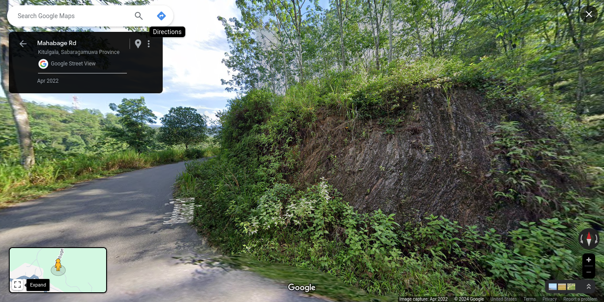

## Warakanatta

**Warakanatta** Grama Niladhari Division, **Kelaniya** Divisional Secretariat Division, **Gampaha** District, **Western** Province

**Kelaniya** Polling Division, **Gampaha** Electoral District

Population: 3,926 (2012)

(**LK-1236080**/259)

## Weeragaswewa

**Weeragaswewa** Grama Niladhari Division, **Angunakolapelessa** Divisional Secretariat Division, **Hambantota** District, **Southern** Province

**Tangalle** Polling Division, **Hambantota** Electoral District

Population: 511 (2012)

(**LK-3318125**/210)

## Moratuwella North

**Moratuwella North** Grama Niladhari Division, **Moratuwa** Divisional Secretariat Division, **Colombo** District, **Western** Province

**Moratuwa** Polling Division, **Colombo** Electoral District

Population: 2,236 (2012)

(**LK-1133160**/553A)

## Pahala Kiyaduwa

**Pahala Kiyaduwa** Grama Niladhari Division, **Malimbada** Divisional Secretariat Division, **Matara** District, **Southern** Province

**Akuressa** Polling Division, **Matara** Electoral District

Population: 1,022 (2012)

(**LK-3224010**/355B)

## Waharaka

**Waharaka** Grama Niladhari Division, **Dompe** Divisional Secretariat Division, **Gampaha** District, **Western** Province

**Dompe** Polling Division, **Gampaha** Electoral District

Population: 1,233 (2012)

(**LK-1230335**/410C)

## Pitawalawatta

**Pitawalawatta** Grama Niladhari Division, **Udunuwara** Divisional Secretariat Division, **Kandy** District, **Central** Province

**Udunuwara** Polling Division, **Kandy** Electoral District

Population: 1,065 (2012)

(**LK-2139550**/43)

## Galukagama

**Galukagama** Grama Niladhari Division, **Kuruvita** Divisional Secretariat Division, **Ratnapura** District, **Sabaragamuwa** Province

**Ratnapura** Polling Division, **Ratnapura** Electoral District

Population: 2,369 (2012)

(**LK-9106195**/154C)

## PahalaYalkumbura

**PahalaYalkumbura** Grama Niladhari Division, **Welimada** Divisional Secretariat Division, **Badulla** District, **Uva** Province

**Welimada** Polling Division, **Badulla** Electoral District

Population: 941 (2012)

(**LK-8130190**/59E)

## Ariyalai North West

**Ariyalai North West** Grama Niladhari Division, **Nallur** Divisional Secretariat Division, **Jaffna** District, **Northern** Province

**Nallur** Polling Division, **Jaffna** Electoral District

Population: 1,831 (2012)

(**LK-4133015**/J/91)

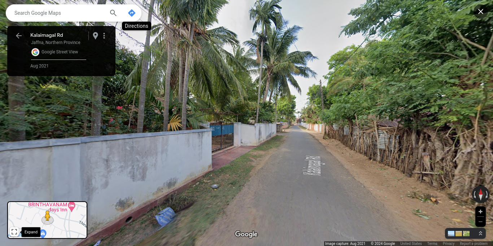

## Panangoda

**Panangoda** Grama Niladhari Division, **Mahawewa** Divisional Secretariat Division, **Puttalam** District, **North Western** Province

**Nattandiya** Polling Division, **Puttalam** Electoral District

Population: 1,885 (2012)

(**LK-6239145**/521A)

## Bandarawatta West

**Bandarawatta West** Grama Niladhari Division, **Katana** Divisional Secretariat Division, **Gampaha** District, **Western** Province

**Katana** Polling Division, **Gampaha** Electoral District

Population: 4,127 (2012)

(**LK-1206350**/145)

## Kattankudy Division 6

**Kattankudy Division 6** Grama Niladhari Division, **Kattankudy** Divisional Secretariat Division, **Batticaloa** District, **Eastern** Province

**Batticaloa** Polling Division, **Batticaloa** Electoral District

Population: 2,517 (2012)

(**LK-5124060**/162)

## Kekunagolla

**Kekunagolla** Grama Niladhari Division, **Kuliyapitiya East** Divisional Secretariat Division, **Kurunegala** District, **North Western** Province

**Kuliyapitiya** Polling Division, **Kurunegala** Electoral District

Population: 3,783 (2012)

(**LK-6169060**/1115)

## Alakolamada

**Alakolamada** Grama Niladhari Division, **Rattota** Divisional Secretariat Division, **Matale** District, **Central** Province

**Rattota** Polling Division, **Matale** Electoral District

Population: 606 (2012)

(**LK-2230165**/E374C)

## Mavadichenai

**Mavadichenai** Grama Niladhari Division, **Koralai Pattu Central** Divisional Secretariat Division, **Batticaloa** District, **Eastern** Province

**Kalkudah** Polling Division, **Batticaloa** Electoral District

Population: 2,810 (2012)

(**LK-5104040**/208A)

## Kudabollatha

**Kudabollatha** Grama Niladhari Division, **Gampaha** Divisional Secretariat Division, **Gampaha** District, **Western** Province

**Gampaha** Polling Division, **Gampaha** Electoral District

Population: 1,619 (2012)

(**LK-1224190**/209A)

## Kumarimulla

**Kumarimulla** Grama Niladhari Division, **Dompe** Divisional Secretariat Division, **Gampaha** District, **Western** Province

**Dompe** Polling Division, **Gampaha** Electoral District

Population: 1,567 (2012)

(**LK-1230450**/419)

## Divulpitiya West

**Divulpitiya West** Grama Niladhari Division, **Kesbewa** Divisional Secretariat Division, **Colombo** District, **Western** Province

**Kesbewa** Polling Division, **Colombo** Electoral District

Population: 2,631 (2012)

(**LK-1136020**/535B)

## Kahagalla

**Kahagalla** Grama Niladhari Division, **Bentota** Divisional Secretariat Division, **Galle** District, **Southern** Province

**Bentara Elpitiya** Polling Division, **Galle** Electoral District

Population: 662 (2012)

(**LK-3103045**/5A)

## Ganepola

**Ganepola** Grama Niladhari Division, **Katana** Divisional Secretariat Division, **Gampaha** District, **Western** Province

**Katana** Polling Division, **Gampaha** Electoral District

Population: 1,961 (2012)

(**LK-1206280**/203)

## Uduwaragoda South

**Uduwaragoda South** Grama Niladhari Division, **Hikkaduwa** Divisional Secretariat Division, **Galle** District, **Southern** Province

**Ratgama** Polling Division, **Galle** Electoral District

Population: 520 (2012)

(**LK-3136100**/71)

## Sevanagala

**Sevanagala** Grama Niladhari Division, **Sevanagala** Divisional Secretariat Division, **Moneragala** District, **Uva** Province

**Wellawaya** Polling Division, **Moneragala** Electoral District

Population: 4,795 (2012)

(**LK-8233035**/149E/1)

## Divulwewa

**Divulwewa** Grama Niladhari Division, **Anamaduwa** Divisional Secretariat Division, **Puttalam** District, **North Western** Province

**Anamaduwa** Polling Division, **Puttalam** Electoral District

Population: 1,070 (2012)

(**LK-6224150**/658C)

## Thotagoda

**Thotagoda** Grama Niladhari Division, **Bope-Poddala** Divisional Secretariat Division, **Galle** District, **Southern** Province

**Akmeemana** Polling Division, **Galle** Electoral District

Population: 866 (2012)

(**LK-3142120**/114A)

## Meethotamulla

**Meethotamulla** Grama Niladhari Division, **Kolonnawa** Divisional Secretariat Division, **Colombo** District, **Western** Province

**Kolonnawa** Polling Division, **Colombo** Electoral District

Population: 8,432 (2012)

(**LK-1106035**/510)

## Meeravodai Muslim West

**Meeravodai Muslim West** Grama Niladhari Division, **Koralai Pattu  West (Oddamavadi)** Divisional Secretariat Division, **Batticaloa** District, **Eastern** Province

**Kalkudah** Polling Division, **Batticaloa** Electoral District

Population: 2,877 (2012)

(**LK-5106030**/207)

## Vishakawatta

**Vishakawatta** Grama Niladhari Division, **Ja-Ela** Divisional Secretariat Division, **Gampaha** District, **Western** Province

**Ja Ela** Polling Division, **Gampaha** Electoral District

Population: 5,136 (2012)

(**LK-1221050**/206B)

## Pandiyankulam

**Pandiyankulam** Grama Niladhari Division, **Manthai East** Divisional Secretariat Division, **Mullaitivu** District, **Northern** Province

**Mullaitivu** Polling Division, **Vanni** Electoral District

Population: 731 (2012)

(**LK-4406040**/MU/009)

## Deiyannewela

**Deiyannewela** Grama Niladhari Division, **Kandy Four Gravets & Gangawata Korale** Divisional Secretariat Division, **Kandy** District, **Central** Province

**Mahanuwara** Polling Division, **Kandy** Electoral District

Population: 2,412 (2012)

(**LK-2130150**/261)

## Dolekanda

**Dolekanda** Grama Niladhari Division, **Kalawana** Divisional Secretariat Division, **Ratnapura** District, **Sabaragamuwa** Province

**Kalawana** Polling Division, **Ratnapura** Electoral District

Population: 1,349 (2012)

(**LK-9133125**/201C)

## Mambulgoda

**Mambulgoda** Grama Niladhari Division, **Homagama** Divisional Secretariat Division, **Colombo** District, **Western** Province

**Homagama** Polling Division, **Colombo** Electoral District

Population: 2,983 (2012)

(**LK-1112210**/500A)

## Perimiyankulama

**Perimiyankulama** Grama Niladhari Division, **Nuwaragam Palatha Central** Divisional Secretariat Division, **Anuradhapura** District, **North Central** Province

**Anuradhapura West** Polling Division, **Anuradhapura** Electoral District

Population: 1,299 (2012)

(**LK-7115090**/300)

## Eravur 06A

**Eravur 06A** Grama Niladhari Division, **Eravur Town** Divisional Secretariat Division, **Batticaloa** District, **Eastern** Province

**Batticaloa** Polling Division, **Batticaloa** Electoral District

Population: 1,512 (2012)

(**LK-5115060**/192C)

## Wattalpola

**Wattalpola** Grama Niladhari Division, **Panadura** Divisional Secretariat Division, **Kalutara** District, **Western** Province

**Panadura** Polling Division, **Kalutara** Electoral District

Population: 4,273 (2012)

(**LK-1303065**/674A)

## Point Pedro East

**Point Pedro East** Grama Niladhari Division, **Vadamaradchi North (Point Pedro)** Divisional Secretariat Division, **Jaffna** District, **Northern** Province

**Point Pedro** Polling Division, **Jaffna** Electoral District

Population: 2,956 (2012)

(**LK-4127105**/J/403)

## Kottawa South

**Kottawa South** Grama Niladhari Division, **Maharagama** Divisional Secretariat Division, **Colombo** District, **Western** Province

**Maharagama** Polling Division, **Colombo** Electoral District

Population: 7,159 (2012)

(**LK-1121130**/496)

## Badulla West

**Badulla West** Grama Niladhari Division, **Badulla** Divisional Secretariat Division, **Badulla** District, **Uva** Province

**Badulla** Polling Division, **Badulla** Electoral District

Population: 2,753 (2012)

(**LK-8121075**/78C)

## Weliweriya West

**Weliweriya West** Grama Niladhari Division, **Matara Four Gravets** Divisional Secretariat Division, **Matara** District, **Southern** Province

**Matara** Polling Division, **Matara** Electoral District

Population: 1,350 (2012)

(**LK-3242120**/415A)

## Kalmunai  03

**Kalmunai  03** Grama Niladhari Division, **Kalmunai Tamil Division** Divisional Secretariat Division, **Ampara** District, **Eastern** Province

**Kalmunai** Polling Division, **Digamadulla** Electoral District

Population: 579 (2012)

(**LK-5221140**/KP/59/1)

## Kattankudy Division 5

**Kattankudy Division 5** Grama Niladhari Division, **Kattankudy** Divisional Secretariat Division, **Batticaloa** District, **Eastern** Province

**Batticaloa** Polling Division, **Batticaloa** Electoral District

Population: 2,043 (2012)

(**LK-5124085**/164A)

## Pulathisi Pedesa

**Pulathisi Pedesa** Grama Niladhari Division, **Thamankaduwa** Divisional Secretariat Division, **Polonnaruwa** District, **North Central** Province

**Polonnaruwa** Polling Division, **Polonnaruwa** Electoral District

Population: 1,477 (2012)

(**LK-7215205**/163)

## Pandiruppu 01

**Pandiruppu 01** Grama Niladhari Division, **Kalmunai Tamil Division** Divisional Secretariat Division, **Ampara** District, **Eastern** Province

**Kalmunai** Polling Division, **Digamadulla** Electoral District

Population: 941 (2012)

(**LK-5221030**/KP/66/1)

## Ududeniya

**Ududeniya** Grama Niladhari Division, **Doluwa** Divisional Secretariat Division, **Kandy** District, **Central** Province

**Gampola** Polling Division, **Kandy** Electoral District

Population: 878 (2012)

(**LK-2142145**/1134)

## Kalmunai  01D

**Kalmunai  01D** Grama Niladhari Division, **Kalmunai Tamil Division** Divisional Secretariat Division, **Ampara** District, **Eastern** Province

**Kalmunai** Polling Division, **Digamadulla** Electoral District

Population: 892 (2012)

(**LK-5221070**/KP/61/5)

## Atchelu

**Atchelu** Grama Niladhari Division, **Valikamam East (Kopay)** Divisional Secretariat Division, **Jaffna** District, **Northern** Province

**Kopay** Polling Division, **Jaffna** Electoral District

Population: 3,241 (2012)

(**LK-4118115**/J/279)

## Kandegama

**Kandegama** Grama Niladhari Division, **Deltota** Divisional Secretariat Division, **Kandy** District, **Central** Province

**Hewaheta** Polling Division, **Kandy** Electoral District

Population: 218 (2012)

(**LK-2148080**/1046)

## Kinigama

**Kinigama** Grama Niladhari Division, **Bandarawela** Divisional Secretariat Division, **Badulla** District, **Uva** Province

**Bandarawela** Polling Division, **Badulla** Electoral District

Population: 1,767 (2012)

(**LK-8133105**/66)

## Horape

**Horape** Grama Niladhari Division, **Wattala** Divisional Secretariat Division, **Gampaha** District, **Western** Province

**Wattala** Polling Division, **Gampaha** Electoral District

Population: 2,114 (2012)

(**LK-1218095**/180)

## Bandigoda

**Bandigoda** Grama Niladhari Division, **Ja-Ela** Divisional Secretariat Division, **Gampaha** District, **Western** Province

**Ja Ela** Polling Division, **Gampaha** Electoral District

Population: 3,352 (2012)

(**LK-1221080**/211B)

## Gorakapitiya

**Gorakapitiya** Grama Niladhari Division, **Kesbewa** Divisional Secretariat Division, **Colombo** District, **Western** Province

**Kesbewa** Polling Division, **Colombo** Electoral District

Population: 1,749 (2012)

(**LK-1136195**/584)

## Senapura

**Senapura** Grama Niladhari Division, **Bandaragama** Divisional Secretariat Division, **Kalutara** District, **Western** Province

**Bandaragama** Polling Division, **Kalutara** Electoral District

Population: 2,617 (2012)

(**LK-1306015**/669C)

## Pathegangoda

**Pathegangoda** Grama Niladhari Division, **Balapitiya** Divisional Secretariat Division, **Galle** District, **Southern** Province

**Balapitiya** Polling Division, **Galle** Electoral District

Population: 2,301 (2012)

(**LK-3106125**/20A)

## Rajathalawa

**Rajathalawa** Grama Niladhari Division, **Doluwa** Divisional Secretariat Division, **Kandy** District, **Central** Province

**Gampola** Polling Division, **Kandy** Electoral District

Population: 996 (2012)

(**LK-2142155**/1182)

## Godapola East

**Godapola East** Grama Niladhari Division, **Udunuwara** Divisional Secretariat Division, **Kandy** District, **Central** Province

**Udunuwara** Polling Division, **Kandy** Electoral District

Population: 856 (2012)

(**LK-2139295**/27)

## Mambula

**Mambula** Grama Niladhari Division, **Seethawaka** Divisional Secretariat Division, **Colombo** District, **Western** Province

**Avissawella** Polling Division, **Colombo** Electoral District

Population: 1,128 (2012)

(**LK-1115245**/441)

## Kallarichchel 01

**Kallarichchel 01** Grama Niladhari Division, **Samanthurai** Divisional Secretariat Division, **Ampara** District, **Eastern** Province

**Samanthurai** Polling Division, **Digamadulla** Electoral District

Population: 785 (2012)

(**LK-5218240**/79D)

## Kudawella North

**Kudawella North** Grama Niladhari Division, **Tangalle** Divisional Secretariat Division, **Hambantota** District, **Southern** Province

**Beliatta** Polling Division, **Hambantota** Electoral District

Population: 1,098 (2012)

(**LK-3333330**/289)

## Hiriwala

**Hiriwala** Grama Niladhari Division, **Mirigama** Divisional Secretariat Division, **Gampaha** District, **Western** Province

**Mirigama** Polling Division, **Gampaha** Electoral District

Population: 1,646 (2012)

(**LK-1212320**/40D)

## Millagaspitiya

**Millagaspitiya** Grama Niladhari Division, **Udapalatha** Divisional Secretariat Division, **Kandy** District, **Central** Province

**Gampola** Polling Division, **Kandy** Electoral District

Population: 1,001 (2012)

(**LK-2151150**/1172)

## Boralugoda

**Boralugoda** Grama Niladhari Division, **Kaduwela** Divisional Secretariat Division, **Colombo** District, **Western** Province

**Kaduwela** Polling Division, **Colombo** Electoral District

Population: 3,149 (2012)

(**LK-1109215**/489A)

## Divulpitiya West

**Divulpitiya West** Grama Niladhari Division, **Kesbewa** Divisional Secretariat Division, **Colombo** District, **Western** Province

**Kesbewa** Polling Division, **Colombo** Electoral District

Population: 2,631 (2012)

(**LK-1136020**/535B)

## Varani-Iyattalai

**Varani-Iyattalai** Grama Niladhari Division, **Thenmaradchi (Chavakachcheri)** Divisional Secretariat Division, **Jaffna** District, **Northern** Province

**Chavakachcheri** Polling Division, **Jaffna** Electoral District

Population: 1,123 (2012)

(**LK-4130280**/J/343)

## Galpottayaya South

**Galpottayaya South** Grama Niladhari Division, **Weeraketiya** Divisional Secretariat Division, **Hambantota** District, **Southern** Province

**Mulkirigala** Polling Division, **Hambantota** Electoral District

Population: 466 (2012)

(**LK-3321075**/419)

## Neduna

**Neduna** Grama Niladhari Division, **Gampaha** Divisional Secretariat Division, **Gampaha** District, **Western** Province

**Gampaha** Polling Division, **Gampaha** Electoral District

Population: 1,356 (2012)

(**LK-1224235**/236C)

## Galahitiyawa North

**Galahitiyawa North** Grama Niladhari Division, **Gampaha** Divisional Secretariat Division, **Gampaha** District, **Western** Province

**Gampaha** Polling Division, **Gampaha** Electoral District

Population: 3,354 (2012)

(**LK-1224225**/215)

## Ukwatta

**Ukwatta** Grama Niladhari Division, **Seethawaka** Divisional Secretariat Division, **Colombo** District, **Western** Province

**Avissawella** Polling Division, **Colombo** Electoral District

Population: 2,649 (2012)

(**LK-1115055**/432C)

## Kohunugamuwa

**Kohunugamuwa** Grama Niladhari Division, **Weligama** Divisional Secretariat Division, **Matara** District, **Southern** Province

**Weligama** Polling Division, **Matara** Electoral District

Population: 1,368 (2012)

(**LK-3239025**/389)

## Danthure

**Danthure** Grama Niladhari Division, **Yatinuwara** Divisional Secretariat Division, **Kandy** District, **Central** Province

**Yatinuwara** Polling Division, **Kandy** Electoral District

Population: 1,746 (2012)

(**LK-2136225**/161)

## Godagama West

**Godagama West** Grama Niladhari Division, **Attanagalla** Divisional Secretariat Division, **Gampaha** District, **Western** Province

**Attanagalla** Polling Division, **Gampaha** Electoral District

Population: 491 (2012)

(**LK-1227395**/361/A)

## Thebuwana East

**Thebuwana East** Grama Niladhari Division, **Dodangoda** Divisional Secretariat Division, **Kalutara** District, **Western** Province

**Mathugama** Polling Division, **Kalutara** Electoral District

Population: 2,162 (2012)

(**LK-1327050**/809)

## Godagama South

**Godagama South** Grama Niladhari Division, **Hikkaduwa** Divisional Secretariat Division, **Galle** District, **Southern** Province

**Ratgama** Polling Division, **Galle** Electoral District

Population: 309 (2012)

(**LK-3136125**/70)

## Madiha East

**Madiha East** Grama Niladhari Division, **Matara Four Gravets** Divisional Secretariat Division, **Matara** District, **Southern** Province

**Matara** Polling Division, **Matara** Electoral District

Population: 965 (2012)

(**LK-3242250**/411B)

## Rajakadaluwa

**Rajakadaluwa** Grama Niladhari Division, **Arachchikattuwa** Divisional Secretariat Division, **Puttalam** District, **North Western** Province

**Chilaw** Polling Division, **Puttalam** Electoral District

Population: 2,122 (2012)

(**LK-6230130**/585A)

## Kondavil South East

**Kondavil South East** Grama Niladhari Division, **Nallur** Divisional Secretariat Division, **Jaffna** District, **Northern** Province

**Nallur** Polling Division, **Jaffna** Electoral District

Population: 1,589 (2012)

(**LK-4133160**/J/120)

## Walgama Meda

**Walgama Meda** Grama Niladhari Division, **Matara Four Gravets** Divisional Secretariat Division, **Matara** District, **Southern** Province

**Matara** Polling Division, **Matara** Electoral District

Population: 1,955 (2012)

(**LK-3242240**/409C)

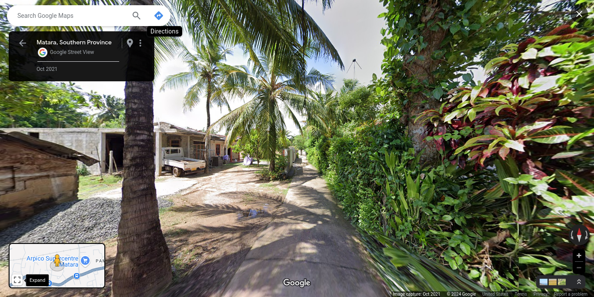

## Wathuyaya

**Wathuyaya** Grama Niladhari Division, **Kuruvita** Divisional Secretariat Division, **Ratnapura** District, **Sabaragamuwa** Province

**Ratnapura** Polling Division, **Ratnapura** Electoral District

Population: 1,655 (2012)

(**LK-9106130**/159)

## Balapitiya

**Balapitiya** Grama Niladhari Division, **Balapitiya** Divisional Secretariat Division, **Galle** District, **Southern** Province

**Balapitiya** Polling Division, **Galle** Electoral District

Population: 1,855 (2012)

(**LK-3106185**/89)

## Kahanda Athireka 1

**Kahanda Athireka 1** Grama Niladhari Division, **Imaduwa** Divisional Secretariat Division, **Galle** District, **Southern** Province

**Habaraduwa** Polling Division, **Galle** Electoral District

Population: 859 (2012)

(**LK-3151110**/167A)

## Katuwana

**Katuwana** Grama Niladhari Division, **Homagama** Divisional Secretariat Division, **Colombo** District, **Western** Province

**Homagama** Polling Division, **Colombo** Electoral District

Population: 4,223 (2012)

(**LK-1112190**/486E)

## Bandawa

**Bandawa** Grama Niladhari Division, **Polgahawela** Divisional Secretariat Division, **Kurunegala** District, **North Western** Province

**Polgahawela** Polling Division, **Kurunegala** Electoral District

Population: 1,935 (2012)

(**LK-6187245**/922)

## Kadirapola

**Kadirapola** Grama Niladhari Division, **Pannala** Divisional Secretariat Division, **Kurunegala** District, **North Western** Province

**Katugampola** Polling Division, **Kurunegala** Electoral District

Population: 1,043 (2012)

(**LK-6178200**/1544)

## Mirissankotuwa North

**Mirissankotuwa North** Grama Niladhari Division, **Wennappuwa** Divisional Secretariat Division, **Puttalam** District, **North Western** Province

**Wennappuwa** Polling Division, **Puttalam** Electoral District

Population: 623 (2012)

(**LK-6245195**/487)

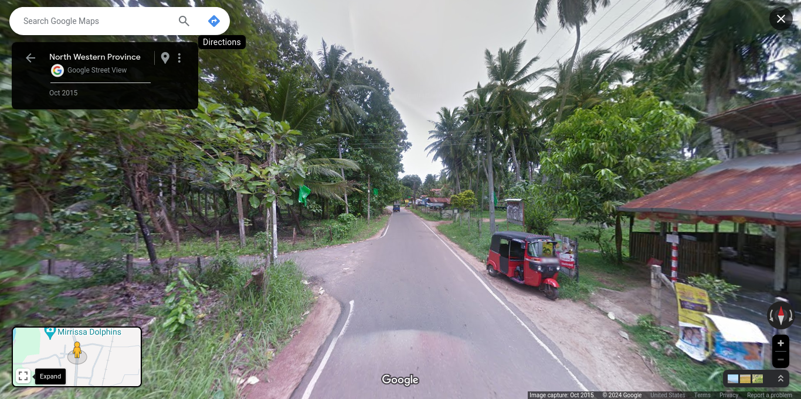

